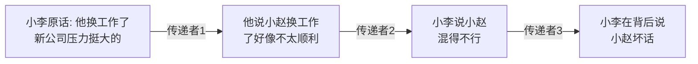
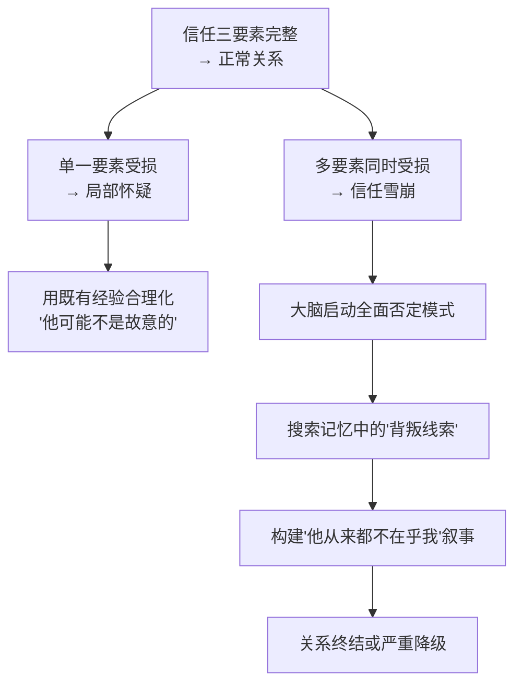
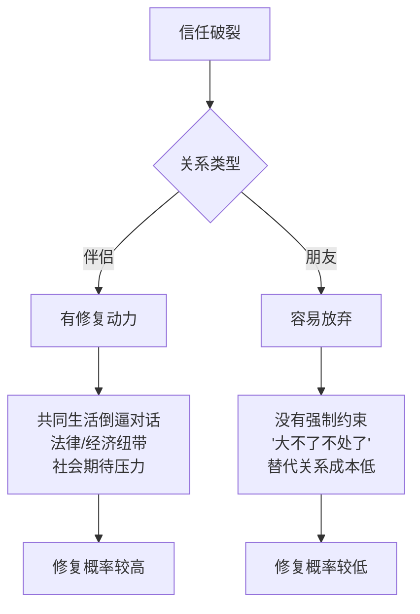
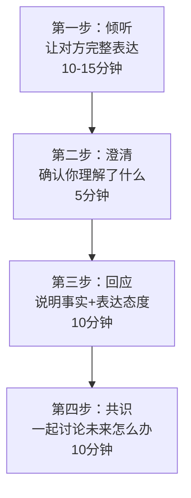
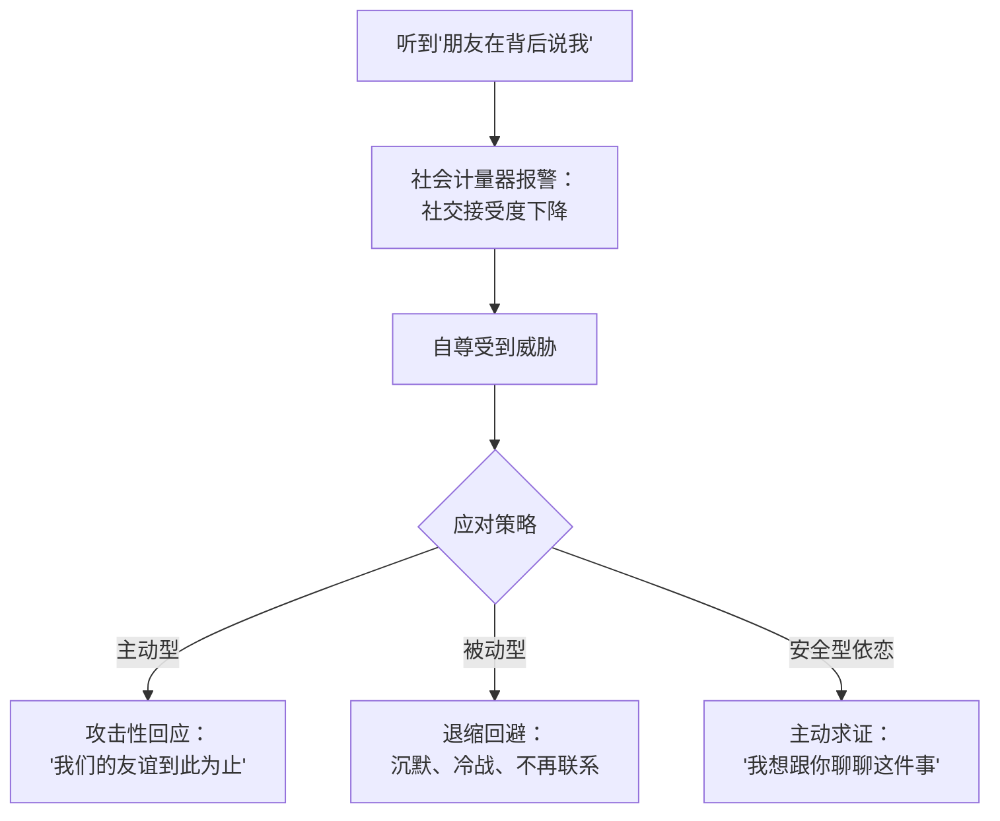
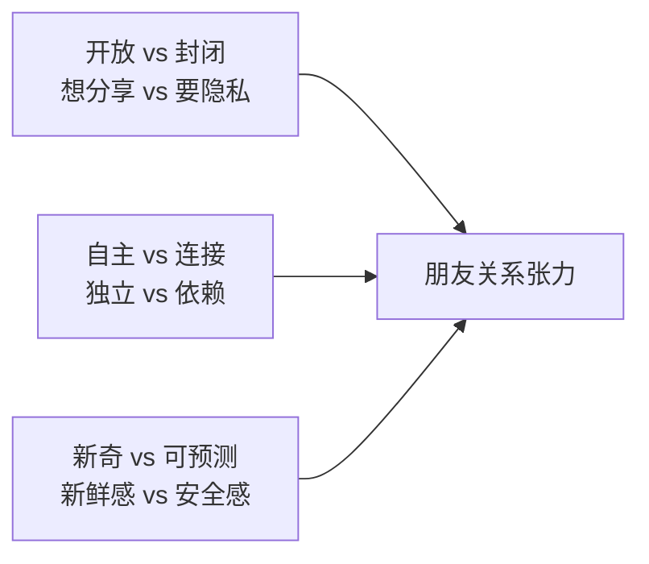

## 场景三：朋友误会——"你在背后说我坏话"

> **本节导读**
>
> 朋友关系是所有社会关系中最脆弱也最珍贵的一种——没有法律约束、没有共同生活空间，维系它的唯一纽带就是信任。本节通过一个真实的"传话失真→信任危机"案例，系统讲解信息在人际传播中如何被扭曲、情绪如何劫持理性判断、以及如何分五个阶段修复受损的友谊。你将掌握：传话效应的心理学机制、冲动情绪的生理刹车技术、被误会方与指控方的双向沟通模板、四类常见变体场景的应对策略，以及中国文化语境下修复朋友信任的特殊技巧。

### 3.1 场景全景还原

小赵和小李是大学室友，毕业后留在同一座城市，虽然工作不同，但每隔一两周都会约饭。两个人的关系属于那种"不一定天天联系，但有事一定第一时间想到对方"的类型。四年大学生活里，他们一起熬夜赶过论文、一起失恋喝过酒、一起在毕业典礼上哭过。这种共同经历构建的信任，按理说应该足够坚固。

上周六，几个大学同学聚会。小赵因为加班没去成，小李去了。聚会上大家聊起近况，有人问小赵现在怎么样，小李随口说了句："他最近换工作了，好像新公司不太理想，压力挺大的。"这句话本身没有恶意——小李确实是在小赵换工作那段时间听过他抱怨过几句，便当成了关心的转述。

但这句话经过三个人的口，到小赵耳朵里就变成了："小李在聚会上说你混得不好，新工作不行。"

小赵正在新公司焦头烂额地适应期，每天都在怀疑自己的选择是不是对的。这个时候听到"朋友在背后议论自己工作不行"，情绪瞬间被点燃。他打开微信，给小李发了一条消息：

> "原来你就是这样对朋友的。以后我们的友谊到此为止。"

发完之后，小赵把手机扔到桌上，心里又气又难过。那种感觉不只是愤怒，还有一种深层的失望——"我以为你是站在我这边的人。"

小李收到消息一头雾水——他完全不知道发生了什么。赶紧打电话过去，小赵不接。连打了三个，都被挂断。小李发了一条"怎么了？出什么事了？"的消息，小赵已读不回。

### 3.2 问题深度诊断

这个场景看似简单，但涉及的信任修复机制比伴侣争吵更复杂。因为朋友关系没有法律约束、没有共同财产、没有共同生活空间，维系它的唯一纽带就是信任和情感连接。一旦这根纽带断裂，关系可能直接消亡。

#### 3.2.1 信息失真：传话效应的破坏力

社会心理学中有一个经典现象叫**传递衰减效应**（Transmitted Reduction Effect）。这个概念最早由英国心理学家弗雷德里克·巴特莱特（Frederic Bartlett）在1932年的"幽灵之战"实验中系统验证：让被试复述一个北美印第安人的民间故事，经过6-8次转述后，故事中的超自然元素被删除、细节被"合理化"、情感色彩完全改变。巴特莱特将这个过程称为**同化**（assimilation）——每个传递者都会根据自己的认知框架"改造"信息。

信息在人际传播链中每经过一个节点，都会经历三个变化：

**传递衰减的三个关键扭曲机制：**

| 扭曲机制 | 心理学原理 | 在本案例中的表现 | 发生概率 |
|---------|-----------|----------------|---------|
| **细节丢失** | 工作记忆容量有限（米勒定律：7±2），中间传递者记不清原话的精确措辞，用自己的理解复述 | "压力挺大的"→"不太顺利"→"混得不行" | 接近100%——几乎每次转述都会丢失 |
| **情感放大** | 情绪记忆比事实记忆更持久（鲍尔情绪依存记忆效应），传递者会不自觉地加入自己的情绪判断 | 中性描述→消极评价→恶意攻击 | 约70%——取决于传递者当时的情绪状态 |
| **立场投射** | 投射心理防御机制，传递者可能将自己的不满或焦虑投射到信息中 | 传递者自己对小赵有看法，借机"加料" | 约30%——少数情况下传递者有主观恶意 |

2011年《人格与社会心理学杂志》（JPSP）的一项实验进一步证实了这一效应：研究者让10个人链式传递一条包含20个事实细节的信息，到第5个人时，平均有40%的细节被扭曲或丢失，且扭曲方向具有明显的情绪偏向性——中性信息倾向于被解读为负面信息。这被称为**负面偏差传播**（Negativity Bias in Transmission），因为人类大脑对威胁性信息的加工优先级天然高于中性信息（进化心理学中的"负面偏差"原则）。

这个效应在所有关系中都存在，但在朋友关系中破坏力最大。原因在于：

- **纠错窗口窄**：伴侣之间通常有足够的沟通频率来纠正误传（每天见面、同住），而朋友之间可能几天甚至几周不联系，信息失真就在这段时间内发酵固化
- **信任缓冲薄**：伴侣关系有更多维的支撑（共同生活、经济纽带、社会身份），即使信任出现裂痕也有其他支撑点；朋友关系的信任一旦受损，支撑面立刻大幅收窄
- **验证成本高**：伴侣可以直接观察对方的行为来验证信息真伪，而朋友之间往往只能依赖第三方转述，形成了"用传话来验证传话"的死循环

#### 3.2.2 信任模型的崩溃点

回顾本章理论基础中提到的信任三要素模型（基于约翰·加尔布雷思和罗伊·刘易斯的信任理论）：

| 信任要素 | 含义 | 小赵的内心独白 | 崩溃程度 |
|---------|------|---------------|---------|
| **可靠性**（Reliability） | 言行一致、信守承诺 | "他说过会帮我保密的，结果在聚会上随便说" | ★★★★☆ |
| **善意**（Benevolence） | 真心为对方着想 | "他根本不是关心我，是在看笑话" | ★★★★★ |
| **能力**（Competence） | 有能力维护关系边界 | "连基本的朋友底线都守不住" | ★★★☆☆ |

小赵的信任崩溃不是线性的——三个要素同时受损，产生了**信任雪崩效应**。一个要素受损时，人会找理由合理化（"他可能只是一时疏忽"）；但多个要素同时受损时，大脑会启动"全面否定"模式，把过去所有可能的"背叛线索"串联起来，构建一个"他一直就没把我当朋友"的叙事。

**信任雪崩的神经科学基础：** 当多个信任要素同时受损时，大脑的前额叶皮层（负责理性判断）活动降低，而杏仁核（负责威胁检测）活动增强。这导致认知资源从"分析具体情况"转向"全面防御模式"——类似于电脑从正常运行切换到安全模式，关闭了所有"非必要功能"，只保留最基本的自我保护机制。

**信任雪崩的自我强化特征：** 一旦进入全面否定模式，大脑会进行**确认偏差搜索**（Confirmation Bias Search）——主动寻找支持"他不值得信任"的证据，忽略反驳证据。小赵可能会突然想起三年前小李借了50块钱没还、两年前聚会上开了一个让他不舒服的玩笑，这些原本已经被遗忘的小事此刻全部被"激活"，串联成一条"证据链"。这就是为什么信任修复如此困难——你要对抗的不只是当下的伤害，还有被激活的历史记忆网络。

#### 3.2.3 情绪劫持：为什么小赵选择了"宣判"而非"沟通"

小赵的行为模式遵循丹尼尔·卡尼曼在《思考，快与慢》中描述的**系统1反应**：

| 阶段 | 时间线 | 心理过程 | 行为表现 |
|------|-------|---------|---------|
| 触发刺激 | 0秒 | 听到"朋友在背后议论自己" | 手机震动，看到消息 |
| 杏仁核劫持 | 约200毫秒 | 情绪反应在理性介入之前就已经启动 | 身体发紧、心跳加速 |
| 认知窄化 | 1-3秒 | 注意力被锁定在"被背叛"这一单一解读上，无法考虑其他可能性 | "他就是故意的" |
| 行动冲动 | 3-10秒 | 需要立即做点什么来保护自己——切断关系是最简单的"保护"手段 | 打开微信，开始输入 |
| 行动执行 | 10-60秒 | 系统2（理性分析）来不及介入 | 发送"友谊到此为止" |
| 后果感知 | 发送后数分钟 | 系统2开始上线，但为时已晚 | 后悔、委屈、但已骑虎难下 |

这里有一个关键的心理学概念——**基本归因错误**（Fundamental Attribution Error，由李·罗斯于1977年提出）。小赵把小李的行为归因为"他这个人有问题"（内部归因/性格归因），而不是"可能是传话传变了"或"他可能只是随口关心"（外部归因/情境归因）。这种归因偏差在情绪激动时会更加严重——研究表明，愤怒状态下的人进行内部归因的概率比平静状态下高出约60%。

**更深层的心理机制——依恋类型的影响：** 小赵的反应模式可能与他的依恋类型有关。如果小赵具有**焦虑型依恋**倾向（详见本章理论基础第一节），他对关系中的"被抛弃信号"会格外敏感。焦虑型依恋者的核心恐惧是"我不够好，所以我终将被抛弃"，当听到"朋友在背后说自己不行"时，这个核心恐惧被直接激活，反应强度会远超实际情境的严重程度。如果是**安全型依恋**的人，更可能的反应是"奇怪，小李不是这样的人，我去问问他"。

#### 3.2.4 关系权力的暗流

表面上看，小赵发的消息是在"切断关系"，但从关系动力学的角度看，这是一种**权力争夺行为**。通过率先宣判"友谊到此为止"，小赵实际上是在做三件事：

1. **抢占道德高地**：我是受害者，我有权决定关系的存亡——将自己定位为"被伤害的一方"，在道德叙事中占据优势位置
2. **施加惩罚**：你的行为导致了这个后果，你要为此负责——通过切断关系来"惩罚"对方的越界行为，夺回控制感
3. **测试忠诚**：如果你真的在乎，你会来挽回——这是一种无意识的忠诚度测试，"如果他真的在乎我，他一定会来找我"

这种模式在心理学中叫做**关系退行**（Relational Regression）——当人在关系中感到不安全时，会退回到更原始的应对模式。对小赵来说，这可能是他从小习得的模式：当我被伤害时，我要先发制人地保护自己。这种模式的根源可能在童年经历中——如果一个人在成长过程中经历过"被重要他人背叛"的创伤，他在成年后的友谊中就会发展出这种"预判性防御"机制。

#### 3.2.5 朋友关系 vs 伴侣关系：信任修复的不同挑战

朋友关系中信任修复更难的深层原因：

| 维度 | 伴侣关系 | 朋友关系 | 修复影响 |
|------|---------|---------|---------|
| **退出成本** | 共同财产、子女抚养、法律程序、社会身份变更 | 几乎为零——说断就断 | 朋友关系中"放弃"的心理门槛极低 |
| **社会支持** | 社会普遍"劝和"，亲友、婚姻咨询、法律调解 | "大不了不处了"被广泛接受，几乎没有人会劝你"修复友谊" | 缺乏外部修复动力 |
| **沟通频率** | 每天见面，误会澄清的机会多 | 可能几周不联系，误会有时间"固化"为"事实" | 朋友误会有更长的发酵时间 |
| **面子文化** | 吵架后有"床头吵架床尾和"的俗语支持 | 主动修复被理解为"认输"或"没骨气" | 主动沟通的心理门槛更高 |
| **替代成本** | 重建伴侣关系需要大量时间和情感投入 | 认识新朋友相对容易 | "换一个朋友"比"换一个伴侣"容易得多 |
| **情感深度** | 涉及亲密关系、身体连接、共同记忆 | 情感连接相对"轻量" | 舍弃一个朋友的情感代价相对较低 |

### 3.3 沟通策略：被误会的一方如何破局

#### 3.3.1 第一阶段：情绪降温（0-24小时）

收到那条"友谊到此为止"的消息后，最重要的第一反应不是解释，而是**控制自己的应激反应**。

**小李内心可能的反应和纠正：**

| 应激反应 | 为什么不对 | 正确的内心对话 |
|---------|----------|-------------|
| "他凭什么这样说我？" | 被冤枉的愤怒会推动对抗，让小赵觉得"你看，他连道歉都不会" | "他现在很受伤，他的反应是情绪驱动的，不是理性的。我需要先理解发生了什么" |
| "他爱断就断，我不伺候了" | 防御性放弃会失去重要关系——而且你日后很可能会后悔 | "我们多年的交情值得我多花一点耐心。他值得我了解事情全貌" |
| "我必须立刻解释清楚" | 对方情绪激动时听不进去任何解释，你的急切只会被解读为心虚 | "等他冷静一些，我再找机会沟通。现在最重要的是让他知道我在" |
| "我到底做错了什么？" | 过度自我怀疑会让自己也陷入情绪漩涡，影响后续的理性沟通 | "我先了解事实，再做判断。也许我没有他说的那么大的错，也许我确实越界了——无论如何，先弄清楚" |

**具体操作步骤：**

1. **不要连环轰炸**：打三个电话不接就停下来。继续打只会让对方觉得你在施压，而且会把"被误会"的议题变成"你不尊重我的边界"的新议题
2. **发一条简短的消息**：表达关心而非急于解释。例如："我看到你的消息了，我现在也很困惑。我尊重你需要冷静的时间，等你准备好了，我想跟你好好聊聊。"这条消息的作用不是解决问题，而是**保持连接不断裂**
3. **给自己做情绪日记**：把你的困惑和委屈写下来（不是发给对方）。写的时候用第三人称——"小李觉得很委屈，因为他明明只是关心朋友"——这能帮助你获得情绪距离，避免在后续沟通中被情绪主导
4. **收集事实**：回想聚会那天自己到底说了什么、怎么说的、在什么情境下说的。这能帮助你在后续对话中提供具体细节，而不是含糊的"我没说什么啊"
5. **进行"最坏情况分析"**：假设最坏的情况——小赵从此不再理你。这个后果你能承受吗？如果可以，你的沟通会更从容；如果不能承受，你更需要在冷静后带着诚意去沟通，而不是带着恐惧去哀求

#### 3.3.2 第二阶段：信息收集（24-48小时）

在对方还没回应的窗口期，做两件事：

**第一，还原事实链条。** 列出以下信息：

| 还原维度 | 具体内容 | 操作建议 |
|---------|---------|---------|
| 你说了什么？原话是什么？ | "他换工作了，压力挺大的" | 尽量回忆原话，不要美化也不要自贬 |
| 当时有哪些人在场？ | 小王、小张、小陈 | 列出所有人，方便后续验证 |
| 你说话的语境是什么？ | 有人问小赵近况，我关心地回答 | 区分"被问到后回答"和"主动议论" |
| 有没有可能被断章取义？ | 是的——"压力挺大的"可能被脱离语境后放大 | 客观评估自己的措辞是否有歧义 |
| 当时的语气和表情？ | 轻松的、关心的 | 回忆非语言信息，这些在还原时很关键 |

**第二，了解传播路径。** 如果可能的话，侧面了解一下这个消息是怎么传到小赵耳朵里的。这不是为了"追责"传话的人，而是为了理解信息在哪里发生了扭曲。

事实还原清单：
├── 我说了什么？──→ "他换工作了，压力挺大的"
├── 在什么情境下？──→ 有人问小赵近况，我关心地回答
├── 有哪些人在？──→ 小王、小张、小陈
├── 谁传给了小赵？──→ 可能是小张（他和小赵关系也很好）
├── 传话版本可能是什么？──→ "小李说你混得不好"
└── 我的措辞有没有问题？──→ "压力挺大的"这个表述确实有歧义空间

**关键提醒：** 信息收集的目的是为了后续沟通时能提供具体细节，而不是为了"证明自己没错"。即使你完全没做错什么，在沟通时也要先关注对方的感受，事实澄清放在后面。

#### 3.3.3 第三阶段：建立沟通桥梁（48-72小时）

等小赵情绪稍微平复后（通常24-48小时），小李可以尝试建立沟通。关键是**开场方式**决定了整个对话的走向。

**开场的三种方式对比：**

| 方式 | 示例 | 效果分析 | 适用场景 |
|------|------|---------|---------|
| ❌ 辩解式 | "你误会了，我没说你坏话" | 对方觉得你在推卸责任，没听到任何关心。"误会"这个词本身就是否定对方的感受 | 绝对避免 |
| ❌ 反击式 | "你怎么不先问清楚就下结论？" | 把矛头转向对方，火上浇油。即使你有道理，此刻也不是争对错的时候 | 绝对避免 |
| ❌ 讨好式 | "对不起对不起都是我的错你别生气了" | 缺乏诚意，像是在敷衍。对方会觉得你根本不知道自己错在哪里 | 避免——除非你真的做了严重的事 |
| ✅ 连接式 | "我很在意我们的友情，所以想当面跟你聊这件事" | 表达关系的重要性，创造对话空间。既不辩解也不讨好，而是真诚地面对问题 | 推荐 |

**推荐的消息模板：**

> "小赵，这两天我想了很多。不管这件事的真相是什么，我知道你现在很受伤，而你的感受对我来说很重要。我不是来辩解的，我是来听你说的。如果你愿意的话，我们能不能找个时间坐下来聊聊？"

这条消息的几个关键设计：

1. **先共情再请求**："我知道你很受伤"在前，"我想聊聊"在后——确保对方首先感受到的是关心
2. **降低防御**："我不是来辩解的"消除了对方"又要被教训"的预期——让对方知道你是来听，不是来说
3. **给对方控制权**："如果你愿意的话"让对方感到被尊重而非被胁迫——保留了对方说"不"的空间
4. **面对面提议**：文字容易产生新的误解，面对面能看到表情和语气——研究表明，面对面沟通的信息传递准确率比文字高出约65%（梅拉比安法则：7%语言+38%语调+55%表情）

**如果对方始终不回应怎么办？**

| 时间 | 行动 | 注意事项 |
|------|------|---------|
| 3天后仍无回应 | 发第二条消息，更简短："我还在，什么时候你想聊了告诉我" | 不要追问"你怎么不回我" |
| 1周后仍无回应 | 发第三条消息："我们的友情对我来说很重要。我会等你准备好。" | 到此为止，不再追发 |
| 2周后仍无回应 | 考虑通过共同朋友温和地传递你的善意（注意：是传递善意，不是让中间人帮你说理） | 选择双方都信任的、不偏不倚的中间人 |
| 1个月后仍无回应 | 接受对方可能需要更长时间，或者选择不继续这段关系。尊重对方的选择，同时保护自己的情感健康 | 不要反复纠缠，那会让关系彻底无法修复 |

#### 3.3.4 第四阶段：面对面深度对话

当双方同意见面后，对话的结构至关重要。

**对话的四步框架：**

**第一步：倾听（10-15分钟）**

这是最难的一步。当对方在说你"做了什么"的时候，你的本能反应是打断、解释、反驳。但此时你需要做的只是**听**。

倾听时的具体技巧：

| 技巧 | 具体做法 | 为什么有效 |
|------|---------|-----------|
| **身体语言** | 保持眼神接触，身体微微前倾，不要抱臂 | 非语言信号占沟通效果的55%，开放的身体语言传递"我在认真听"的信号 |
| **不打断** | 即使对方说的与事实不符，也先让他把话说完 | 打断=否定对方的表达权=火上浇油 |
| **积极回应** | 用"嗯"、"我听到了"、"然后呢？"表示你在认真听 | 被倾听的感觉能激活大脑的奖励回路，降低防御 |
| **情绪标注** | "听起来你当时觉得特别失望"——这不是认错，是让对方知道你理解他的感受 | 情绪标注能激活前额叶、降低杏仁核活动（UCLA的利伯曼fMRI研究证实） |
| **做笔记** | 在手机备忘录上简要记下对方的核心诉求 | 后续澄清和回应时可以精确对应，让对方感到"你真的在认真对待" |

**第二步：澄清（5分钟）**

用自己的话复述对方的核心感受和诉求，确保你理解正确。

> "让我确认一下我理解的对不对。你听说我在聚会上跟别人说了你的私事，你觉得我背叛了你的信任。你觉得我把你的秘密当成了跟别人聊天的谈资。我理解得对吗？"

这一步的目的：
- 让对方感到被真正听见了——"他在认真听我说"
- 纠正可能存在的理解偏差——也许你理解的和他想表达的不完全一致
- 为下一步的事实澄清铺路——当对方确认"你理解对了"，他就更容易接受你的回应

**第三步：回应（10分钟）**

这是你说明事实的环节。回应的结构很重要：

> "谢谢你愿意告诉我这些。我想跟你分享一下那天实际发生了什么。那天聚会有人问起你最近怎么样，我确实提了一句你换工作的事，说的是'他最近换了新工作，压力挺大的'。我是出于关心说的，但在那个语境下，我确实不应该替你分享你的近况——即使我的出发点是好的，这么做也是越界了。"

回应的核心要素：

1. **具体说明事实**：你说了什么、怎么说的、在什么情境下说的——模糊的"我没说什么"不如精确的原话有说服力
2. **承认越界**：即使出于好意，替别人分享信息本身就是不当行为——"出发点是好的"不能为"结果是坏的"辩护
3. **不推卸责任**：不说"但是你也没告诉我不能说"、"大家都这样聊天"、"你也没必要反应这么大"——这些话虽然可能有道理，但在此刻说出来只会让对方觉得你在倒打一耙
4. **表达真实态度**：你是真的在意这段友情，不是在敷衍——真实的语气比精心设计的措辞更有力量

**第四步：共识（10分钟）**

最后，一起讨论未来怎么办。这不是单方面承诺，而是双方协商。

> "以后关于你的事情，别人问我也会先问你想不想让他们知道。你也可以告诉我哪些是绝对不能跟别人提的。我不想因为这种事情再伤害到你。"

共识要达成的具体内容：

| 共识维度 | 具体内容 | 执行方式 |
|---------|---------|---------|
| **信息边界** | 哪些信息可以对外说，哪些不行 | 直接询问对方的边界线在哪里 |
| **确认机制** | 不确定对方是否介意时，先问再决定 | "如果我不确定，我就先问你" |
| **修复承诺** | 具体的行动而非空泛的"我以后注意" | 明确说出"我会做什么"而不是"我会注意" |
| **反馈渠道** | 如果再有类似情况，怎么沟通 | 约定一个信号或方式，让对方可以直接告诉你"这让我不舒服了" |

#### 3.3.5 第五阶段：信任重建（持续进行）

一次对话不能完全修复信任。信任重建是一个渐进的过程，需要通过持续的行动来证明。心理学家约翰·戈特曼的研究表明，修复一个信任违背需要约**5次正向互动**才能抵消1次负向互动的伤害（正常关系中的比例是5:1，在信任修复期需要更高的比例）。

**信任重建的行动清单：**

| 时间段 | 具体行动 | 目的 | 预期效果 |
|-------|---------|------|---------|
| 对话后1周 | 主动约一次轻松的活动（吃饭、打球、看展） | 恢复正常互动节奏，发出"关系还在"的信号 | 对方感到关系正在回暖 |
| 对话后2-3周 | 在小事上展现对朋友信息的保护意识——比如有人问起小赵的事，你主动说"这个我不方便说，你可以直接问他" | 用行动证明承诺，而不只是用语言 | 对方通过第三方得知你在保护他的信息，信任开始重建 |
| 对话后1个月 | 有意识地在朋友面前维护小赵的正面形象——"他最近在新公司适应得不错" | 重建"他会保护我"的信念 | 信任从"可能修复"升级为"正在修复" |
| 持续进行 | 在对方需要时主动出现——搬家帮忙、工作不顺时陪伴、重要日子记得发消息 | 累积情感账户的正向余额（详见本章理论基础第三节情感账户模型） | 信任逐步恢复甚至超越原有水平 |

**信任重建的度量指标：** 你可以通过以下信号判断信任是否在重建——

| 信号 | 含义 | 所处阶段 |
|------|------|---------|
| 对方回复你的消息了 | 最低限度的连接恢复 | 初期 |
| 对方愿意单独跟你见面 | 愿意投入时间，说明内心在松动 | 中期 |
| 对方开始跟你分享自己的近况 | 信息边界的重新开放，信任的实质性恢复 | 后期 |
| 对方主动开你的玩笑或回忆过去 | 情感距离回到接近正常水平 | 接近完成 |
| 对方在别人面前自然地提到你 | 不再回避与你的关系，修复基本完成 | 完成 |

### 3.4 如果你是被误会的小赵：另一面的沟通

前面的分析主要从小李（被指控方）的视角展开。但如果你是小赵——那个"听说了朋友在背后说自己"的人——同样需要改进自己的沟通方式。

#### 3.4.1 冲动发送前的自检清单

在按下"发送"键之前，问自己以下六个问题：

┌─────────────────────────────────────────────────────┐
│           冲动消息发送前的六问自检                      │
├─────────────────────────────────────────────────────┤
│ 1. 我听到的信息是第一手的还是传了几道的？               │
│    → 传了3道以上的信息可信度低于40%                     │
│    → 越是让你愤怒的信息，越需要验证来源                 │
│                                                     │
│ 2. 信息来源是否可能有自己的动机？                       │
│    → 传话者可能是好意提醒，也可能有自己的目的            │
│    → 有些人享受"传递坏消息"带来的被需要感               │
│                                                     │
│ 3. 我现在的情绪状态适合做判断吗？                       │
│    → 愤怒时做出的判断80%以上会被事后推翻                │
│    → 至少等2小时再做决定                               │
│                                                     │
│ 4. 我有没有给对方解释的机会？                          │
│    → 单方面宣判=单方面终结关系                         │
│    → 你愿意因为一条未经验证的消息失去一个朋友吗？        │
│                                                     │
│ 5. 这条消息发出后，关系会变成什么样？                   │
│    → 即使对方真的做错了，你希望的结果是什么？            │
│    → 你想要的是"证明对方错了"还是"保护这段关系"？        │
│                                                     │
│ 6. 如果是别人这样对我，我希望他怎么做？                 │
│    → 换位思考是最好的情绪刹车                          │
│    → 如果你处在小李的位置，你会希望朋友怎么对你？        │
└─────────────────────────────────────────────────────┘

**额外的第7问（经常被忽略但非常重要）：**

> "这条消息如果被截图发到朋友圈或群里，我会有怎样的感受？"

这个问题的目的是让你想象最坏的后果——冲动发出的消息一旦被公开，你不仅会失去这个朋友，还可能在整个社交圈中被贴上"冲动、不讲理"的标签。这不是在吓唬你，而是一个非常现实的风险评估。

#### 3.4.2 小赵的改进表达

**原版（冲动型）：**
> "原来你就是这样对朋友的。以后我们的友谊到此为止。"

**改进版（冷静型）：**
> "小李，我有件事想跟你聊聊。我听说上周聚会的时候你跟别人说了我之前告诉你的那件事。我不知道这是不是真的，但我听到的时候真的很受伤，因为那是我很私密的事情。在我下结论之前，我想听听你那边是什么情况。"

**改进点拆解：**

| 维度 | 原版问题 | 改进版做法 | 心理学原理 |
|------|---------|----------|-----------|
| 情绪管理 | 在最愤怒的时候发消息 | "冷静几个小时后"——让系统2上线 | 卡尼曼的系统1/系统2理论 |
| 信息确认 | 听说什么就信什么 | "我不知道是不是真的"——承认信息不完整 | 认知谦逊——承认自己可能是错的 |
| 表达方式 | 指责+宣判 | "我听到的时候很受伤"——用"我"句式表达感受 | 非暴力沟通的观察-感受-需要-请求框架 |
| 沟通意愿 | 切断沟通（不接电话） | "想听听你那边的情况"——给对方解释的机会 | 信息完整性——决策前至少要听双方陈述 |
| 关系定位 | "友谊到此为止"——终结式 | "想跟你聊聊"——对话式 | 建设性对话 vs 毁灭性宣判 |
| 责任归属 | 默认对方全责 | 承认信息不完整，邀请对方参与真相还原 | 避免基本归因错误 |

#### 3.4.3 如果确认对方确实说了怎么办

假如小李确实说了，而且说的话确实不妥。小赵面临的选择是：原谅修复还是就此别过？

**做决定前的思考框架：**

1. **严重程度评估**：小李说的是事实（只是不该说出去）还是编造了虚假信息？两者性质完全不同。前者是"信息边界意识不足"，后者是"人格问题"
2. **历史记录**：这是第一次还是反复发生？单次失误和多次背叛的应对策略不同。如果这是相识多年以来的第一次，容忍度应该比反复发生的高得多
3. **修复诚意**：小李的道歉是敷衍的还是真诚的？看行动而不只是听语言——"对不起"三个字不值钱，"我知道我的行为让你觉得被背叛了，我以后会怎么做"才有分量
4. **关系价值**：这段友情对你的人生有多重要？不是所有关系都值得修复，但也不要因为一次失误就放弃重要的连接
5. **自身模式**：你是否在多段关系中都遇到过类似的问题？如果是，可能需要审视的不只是这段关系，而是你自己的信息管理方式和信任建立模式

**决策矩阵：**

| 情境 | 建议选择 | 理由 |
|------|---------|------|
| 首次发生+对方态度诚恳+说了事实只是不该说 | 选择修复 | 单次失误不值得放弃多年友情 |
| 首次发生+对方态度诚恳+说了不实信息 | 谨慎修复+明确底线 | 需要确认对方是否有意为之 |
| 反复发生+对方态度敷衍 | 考虑降级关系 | 模式化的越界比单次事件严重得多 |
| 首次发生+对方态度恶劣+拒不承认 | 短暂冷却+再次尝试沟通 | 可能是对方也在应激状态中 |
| 恶意传播+伪造信息+损害你的社会声誉 | 考虑终止关系 | 这已经不是"误会"而是"伤害" |

**如果选择修复：**

> "我确实很受伤，因为我信任你才告诉你的。但我也不愿意因为这一件事就丢掉这么多年的交情。我希望以后关于我的事情，你不确定能不能说的时候，先问我一下。可以做到吗？"

**如果选择放手：**

> "我认真想过了，这件事对我来说是底线。我很感谢我们过去这么多年的友情，但我觉得以后可能很难再像以前那样信任你了。我祝你一切都好。"

两种选择都没有错。关键是你做出了**深思熟虑的决定**，而不是在情绪冲动下的反应。

### 3.5 朋友信任破裂的常见变体场景

这个场景的核心模式——"听说了什么→情绪反应→信任危机"——在朋友关系中有多种变体。理解这些变体可以帮助你举一反三。

#### 3.5.1 变体一：秘密泄露型

**典型场景**：你告诉朋友一个秘密，结果其他人知道了。

**与原场景的区别**：原场景中信息可能被扭曲传播，但秘密泄露中信息本身可能是准确的，问题在于**不该被分享的信息被分享了**。这意味着越界的性质更严重——原场景中小李可能只是"措辞不当"，而秘密泄露是"明确违反了信任契约"。

**处理要点**：

- 先确认泄露源头——真的是这个朋友说出去的吗？还有没有其他知道这个秘密的人？在确认之前不要直接指控
- 区分"无意泄露"和"故意传播"——两者的严重程度和应对方式不同。无意泄露可能是"喝多了说漏嘴"或"以为对方已经知道了"，故意传播则可能是"拿你的秘密当社交货币"
- 如果是无意泄露，给对方修复的机会；如果是故意传播，需要重新评估这段关系——这已经不是信任问题，而是人品问题
- 修复后的关键行动：要求对方在知道秘密的那些人面前澄清或道歉（如果影响足够大的话）

#### 3.5.2 变体二：站队分歧型

**典型场景**：你和另一个朋友有了矛盾，这个朋友选择站在对方那边。

**与原场景的区别**：这不是信息泄露问题，而是**忠诚度危机**。你感到被背叛的原因是"你没有站在我这边"。

**深层心理机制**：站队分歧触发的是人类最古老的部落心理——"你是我们的人还是他们的人？"当朋友"站到对面"时，你的大脑将其编码为"叛变"，反应强度可能比信息泄露更强烈。

**处理要点**：

- 理解"不站在我这边"≠"反对我"——朋友有权有自己的判断，中立是一种合法的立场
- 表达感受而非要求站队："你支持他的时候我觉得很孤独"而非"你居然帮他说话"——前者是表达需求，后者是指控
- 接受朋友可以同时是你和另一个人的朋友——这不是零和博弈，不是"跟我好就不能跟他好"
- 如果你发现这个朋友在你和他人的每一次冲突中都站在对面，那这不是"站队"问题，而是这段关系本身的忠诚度问题

#### 3.5.3 变体三：比较伤害型

**典型场景**：朋友在别人面前拿你作比较，而且是贬低你的那种。

**典型表现**："小赵能力一般，能进那个公司全靠运气。""他那样的能找到对象就不错了。"

**与原场景的区别**：原场景中的信息传递至少是"关心的意图被扭曲"，而比较伤害中传递的是**明确的负面评价**，性质更接近恶意。

**处理要点**：

- 区分"客观评价"和"恶意贬低"——前者可以沟通，后者需要警惕。"他在公司压力挺大"是客观描述，"他能力不行"是主观贬低
- 如果是习惯性贬低，这可能是关系中长期存在的权力不平衡，需要从根本上重新评估——有些人维持友谊是为了有一个"参照物"来证明自己的优越
- 直接表达："当你在外人面前这样评价我的时候，我觉得不被尊重"——用"我"句式，聚焦于感受而非指控
- 如果对方的反应是"你太敏感了"或"我开玩笑的你至于吗"，这本身就是一种二次伤害——你的感受被否定了

#### 3.5.4 变体四：社交媒体公开型

**典型场景**：朋友在朋友圈、微博等公开平台发布了让你不舒服的内容（可能关于你，也可能涉及你们的共同经历）。

**与原场景的区别**：公开场合的伤害比私下传播更严重，因为影响范围不可控，且有"被公开处刑"的羞耻感。在中国社交媒体文化中，一条朋友圈可能在几小时内被数百人看到，而且截图可以永久保存和二次传播。

**处理要点**：

- **先私聊再公开**：不要在评论区对线——评论区的争论会让更多人围观，让问题从"两个人的事"变成"所有人的谈资"。私聊解决，保留体面
- **记录证据**：截图保存，以防后续需要——内容可能被删除，但截图不会消失
- **明确要求删除**：如果内容确实涉及你的隐私，你有权要求删除——不需要讨价还价，这是你的基本权利
- **如果对方拒绝删除**：评估内容对你造成的实际影响。如果影响严重（涉及名誉、工作等），可以考虑法律途径——《民法典》第1024条明确规定了公民的名誉权保护
- **善后处理**：即使对方删除了内容，也需要和对方沟通"为什么会发这样的内容"——删除只是止损，沟通才是修复

#### 3.5.5 变体五：群聊背刺型（网络时代的特殊变体）

**典型场景**：你发现朋友在一个你不在线的微信群里议论你，可能发了聊天截图、吐槽了你的某个行为、或者用你当了笑话的素材。

**为什么这是网络时代的特殊挑战**：

- **数字证据永久存在**：群聊记录可以被截图、转发、保存，不像口头传话那样"说说就散了"
- **传播范围不可控**：一个500人的群，任何一个人截图都可能让消息外泄
- **旁观者效应**：群里其他人可能不会告诉你，但会默默形成对你的印象
- **"群聊氛围"的社交压力**：在群里吐槽别人可能只是一种"社交货币"——为了融入群体而随大流

**处理要点**：

- 如果你看到了截图，先冷静评估截图的完整性和语境——断章取义的截图比完整的对话更常见
- 直接私聊对方，而不是在群里对质——"我在xx群里看到一些关于我的讨论，想直接跟你了解一下情况"
- 如果内容确实过分，你有权要求对方在群里澄清或道歉——但要评估这样做是否会适得其反（有时候群里的热度很快就过了，公开澄清反而重新激活）
- 重新评估你在这个"社交圈"中的位置——如果一个群里经常有人被"挂"，这个群体的文化本身就有问题

### 3.6 进阶：从心理学深度理解朋友间的信任动力学

#### 3.6.1 社会计量理论（Sociometer Theory）

心理学家Mark Leary于1995年提出的**社会计量理论**（Sociometer Theory）认为，自尊本质上是一个"社会接受度测量仪"。这个理论的核心观点是：**自尊不是对自我价值的理性评估，而是对"我在多大程度上被他人接受"的本能感知。**

当小赵听到"朋友在背后说自己"时，他的社会计量器发出了警报：**你在这个社交圈中的地位受到了威胁**。

这解释了为什么小赵的反应如此强烈——他失去的不只是一个朋友的信任，而是对自身社会价值的信心。对很多人来说，"被朋友背叛"比"被伴侣背叛"更难承受，原因有三：

1. **伴侣关系的失败有更多社会支持**：离婚很常见，社会有完善的离婚支持系统（心理咨询、法律援助、亲友安慰）；但"被朋友抛弃"几乎是"无声的失败"，没有人会因为你失去一个朋友来安慰你
2. **朋友关系反映的是"人格选择"**：伴侣关系有生理吸引、荷尔蒙等非理性因素；但朋友关系是纯粹的"人格认可"——被朋友背叛意味着"你的为人被否定了"
3. **朋友关系的"可替换性焦虑"**：伴侣关系中，"找不到对象"的焦虑是有社会支持的；但"没有朋友"的焦虑几乎无法公开表达——它被编码为"社交能力不足"，这是一个深层的人格缺陷标签

#### 3.6.2 关系辩证法（Relational Dialectics）

由巴克斯特和蒙哥马利提出的关系辩证法理论认为，朋友关系中存在几组永恒的张力——这些张力不是"问题"，而是关系的常态特征。关键是学会管理这些张力，而不是试图消灭它们。

**本场景涉及的三组核心张力：**

| 张力对 | 在本场景中的表现 | 管理策略 |
|--------|----------------|---------|
| **开放 vs 封闭** | 小赵曾向小李开放了自己的脆弱面（换工作的焦虑），但默认这种开放是有边界的（只能你知道）。小李没有意识到这个边界 | 在关系早期就明确讨论信息边界，而不是假设对方"应该知道" |
| **自主 vs 连接** | 小赵希望自己的信息由自己控制（自主），但也需要朋友的关心（连接）。这两个需求在此事件中产生了冲突 | 区分"关心"和"分享信息"——你可以关心朋友的近况，但不需要通过向他人转述来实现 |
| **新奇 vs 可预测** | 朋友聚会的"聊近况"是新奇信息交换的一部分，但小赵需要的是可预测的隐私保护 | 建立可预测的信息规则："如果有人问起我，你可以说'他挺好的'，其他的让我自己说" |

**沟通解决**：在关系早期就明确讨论信息边界，而不是假设对方"应该知道"。很多人际关系中的信任破裂都源于**隐含期望**——你认为"这不用说对方也知道"，但对方真的不知道。

#### 3.6.3 中国文化语境下的特殊考量

在中国社会文化背景下，朋友间的信任还有一些独特的维度需要关注。这些维度不是简单的"文化差异"，而是深刻影响中国人社交行为的心理编码系统。

**1. 面子文化：不只是"丢脸"那么简单**

"面子"在西方心理学中没有完全对应的概念。社会学家胡先缙在1944年将中国人的"面子"分为两个维度：**面子**（miànzi，社会性面子）和**脸**（liǎn，道德性面子）。

| 维度 | 含义 | 在本场景中的表现 |
|------|------|----------------|
| **面子**（miànzi） | 社会地位和声望——别人怎么看你 | "他在聚会上说我混得不好"→在共同朋友面前丢了面子 |
| **脸**（liǎn） | 道德品格的认可——别人认为你人品如何 | "他在背后说我坏话"→被认为不够朋友、不够仗义 |

小赵的痛苦不只是"被说了"，而是"在圈子面前丢了面子"。中国文化中的面子损失具有**公开性**和**扩散性**——它不是两个人之间的事，而是整个社交网络都会知道的事。这使得修复的难度比西方文化中的类似情境更高，因为修复不仅要恢复两个人的关系，还要恢复小赵在整个圈子中的"面子"。

**2. 圈子文化：信息传播的加速器**

中国社会的"圈子"（同学圈、同事圈、老乡圈）是重要的社会资本，也是信息传播的高速通道。信息在圈子中的传播具有三个特征：

- **速度极快**：一条信息可能在24小时内传遍整个圈子
- **变形严重**：每经过一个节点都会被"本地化"改造
- **记忆持久**：圈子中的人对负面信息的记忆远比正面信息持久（负面偏差）

**3. 义气观念：道德审判的高标准**

中国文化中"朋友义气"有很高的道德标准。"不仗义"是严重的道德指控，其杀伤力堪比"不孝"。小赵发的"友谊到此为止"本质上是一次**道德宣判**——"你不仗义，你不配做我的朋友"。这种道德宣判在中国文化语境下的分量远重于西方文化中的"I need some space"。

**4. 间接沟通传统：解决问题还是制造问题？**

中国文化更倾向于通过第三方传话而非直接沟通。一方面，间接沟通是"给对方面子"的表现（不直接撕破脸）；另一方面，间接沟通本身就会放大信息失真的风险。在本场景中，正是间接传话导致了信息扭曲。

**5. 文化适配的修复策略：**

| 文化策略 | 具体做法 | 原理 |
|---------|---------|------|
| **中间人铺垫** | 找一个双方都信任的中间人先帮着"递个话"，试探对方的态度 | 符合中国"面子"文化——先通过中间人给双方台阶 |
| **饭局修复** | 请吃饭是中国社交中最万能的修复工具——一顿好酒好菜比千言万语管用 | 饭局是"非正式空间"，降低了对质感，增加了人情味 |
| **给面子** | 在共同朋友面前主动维护小赵的形象，让信息回传到小赵耳朵里 | 用"公开的善意"对冲"公开的伤害"——面子损失需要面子修复 |
| **时间稀释** | 不急于一次性解决，通过多次小互动逐步修复 | 中国文化中的关系修复讲究"润物细无声"——不是一次大对话，而是持续的小信号 |

### 3.7 实操工具：朋友关系信任修复对话模板

#### 3.7.1 被指控方（小李）的完整沟通脚本

**第一步：冷静期消息（事发当天）**

> "小赵，我看到你的消息了，说实话我也很懵。不管发生了什么，你对我来说很重要。我现在不想急着解释什么，只是想让你知道，我愿意好好聊这件事。你什么时候准备好了告诉我。"

**设计要点**：不解释、不追问、不讨好。只传递三个信息——"我在"、"你重要"、"我愿意聊"。

**第二步：主动邀约（1-2天后）**

> "这两天一直在想你说的那件事。我大概猜到可能跟上次聚会上聊到你有关。不管具体怎么回事，你的感受比事实细节更重要。这周末方便出来坐坐吗？我请你吃饭。"

**设计要点**：主动猜测原因（展示你认真思考了），强调感受优先（不是来辩论的），饭局邀约（符合中国社交文化）。

**第三步：见面后开场**

> "谢谢你愿意见我。我想先说一件事：不管这件事的原委是什么，我知道你现在很受伤，而这对我来说是最重要的。我不是来为自己辩护的，我是来理解你的感受，然后看看我们怎么一起解决这件事。"

**设计要点**：先感谢（感谢对方给机会），声明立场（感受优先），降低防御（不是来辩护的），邀请合作（一起解决）。

**第四步：事实澄清（在充分倾听之后）**

> "现在让我跟你分享一下那天到底发生了什么。有人问起你最近怎么样，我说了句'他换了新工作，压力挺大的'。我当时的语境是在关心你的近况，但我现在意识到，即使出发点是好的，我不该在你不在场的时候替你分享这些。这越界了，我很抱歉。"

**设计要点**：精确陈述原话（消除想象空间），承认越界（不是为"说坏话"道歉，是为"越界"道歉），不找借口（"出发点是好"不作为开脱理由）。

**第五步：共同制定规则**

> "我不想让这种事再发生。以后关于你的事情，我会遵守一个原则：如果我不确定你想不想让别人知道，我就先问你。这样可以吗？你还有什么希望我注意的？"

**设计要点**：具体的行动承诺（不是"我以后注意"），征求意见（让对方参与规则制定），双向协商。

#### 3.7.2 被伤害方（小赵）的自我表达模板

**冷静后的第一条消息：**

> "小李，前几天我说了一些冲动的话。我现在冷静下来了，想跟你好好谈谈。我听说了一些关于聚会上的事情，让我很受伤。但我不想只听别人的转述，我想直接听你说。我们能见面聊聊吗？"

**见面后的表达：**

> "我先说一下我听到了什么，然后你告诉我实际情况是什么样的。我听说你在聚会上跟别人讲了我换工作的事，传到我耳朵里的版本是'你说我混得不行'。我不知道这个版本跟实际情况差多少，但听到的时候我真的很受伤。一是因为那是我私下告诉你的，我对这件事其实很敏感；二是因为如果真的是你说的，我会觉得你没有替我保密。"

**设计要点**：先陈述"我听到的版本"（暗示信息可能失真），说明感受（"我真的很受伤"），解释为什么受伤（不是泛泛的"你伤了我"，而是具体的原因），给对方空间说明实际情况。

#### 3.7.3 信息边界协议模板（双方共同制定）

以下是一个可以与朋友共同填写的"信息边界协议"——看起来很正式，但在关键的对话中把它落地为口头共识，可以大幅减少未来的信任摩擦：

┌─────────────────────────────────────────────────────────┐
│              朋友间信息边界协议（口头共识版）                  │
├─────────────────────────────────────────────────────────┤
│                                                         │
│  一、绝对不能对外提的信息                                   │
│     • _______________（双方各自列出）                       │
│     • _______________                                     │
│     • _______________                                     │
│                                                         │
│  二、可以说但需要控制口径的信息                              │
│     • _______________（约定怎么描述）                       │
│     • _______________                                     │
│                                                         │
│  三、可以自由分享的信息                                     │
│     • _______________                                     │
│     • _______________                                     │
│                                                         │
│  四、不确定时的处理方式                                     │
│     → 默认原则：先问对方，得到许可后再分享                    │
│     → 紧急情况：可以说"他最近挺忙的"之类的模糊表述            │
│                                                         │
│  五、如果信息边界被违反                                     │
│     → 受影响方直接告诉对方（不通过第三方）                    │
│     → 违反方真诚道歉 + 说明原因 + 提出补救措施                │
│                                                         │
└─────────────────────────────────────────────────────────┘

### 3.8 常见误区与纠正

#### 误区一：急于自证清白

**错误做法**：收到指控后立刻发长消息解释、列出证据、找证人。

**为什么错**：对方在情绪中时，任何解释都会被理解为"狡辩"。你的急切反而会让对方觉得"如果你没做错，为什么这么紧张？"心理学中的**过度辩护效应**（Over-Justification Effect）表明，当你为一个行为提供过多理由时，反而会让人觉得你心虚。

**正确做法**：先表达关心和理解，事实澄清放在情绪缓和之后。一条简短的"我在，等你想聊的时候告诉我"比三段长消息更有力量。

#### 误区二：把"解释"变成"教育"

**错误做法**："你应该先搞清楚事实再来质问我"、"你这样不分青红皂白对谁都不好"、"你就是太冲动了"。

**为什么错**：即使你说的完全正确，这些话在对方受伤时说出来，只会被理解为"你在指责我小题大做"。情绪中的人需要的是被理解，不是被教育。你的"教育"不仅不能解决问题，还会给对方提供新的"你不理解我"的证据。

**正确做法**：先共情，后建议。建议的时机选在关系修复之后——那个时候对方才有心理空间接受你的反馈。

#### 误区三：过度道歉

**错误做法**：即使自己没做错什么，也因为"不想失去朋友"而一味认错。

**为什么错**：过度道歉会让你的真实回应失去可信度。对方会觉得"你到底在道歉什么？你是不是真的做了比我说的更过分的事？"而且，过度道歉会建立一个危险的模式——"以后只要对方生气，不管对错我都得道歉"——这会让关系变得不健康。

**正确做法**：道歉要精确——如果你确实越界了（替别人分享了不该分享的信息），就为"越界"这件事道歉，不要为"没做的事"道歉。精确的道歉比泛泛的道歉更有诚意，也更有修复力。

#### 误区四：试图通过传话者解决

**错误做法**：让传话的人去帮你说清楚，或者质问传话者为什么要歪曲你的话。

**为什么错**：这会把问题从"你和朋友之间的信任问题"扩大成"三角关系"。传话者可能出于自保而继续扭曲信息，局面会越来越复杂。而且，传话者可能会对双方都传递"他在找你"的压力，让两边都不舒服。

**正确做法**：绕过所有中间人，直接和当事人沟通。即使中间人主动提出"我去帮你说"，也要婉拒——"谢谢你的好意，但这件事我想自己跟他聊"。

#### 误区五：用"我们以前多好"来回避问题

**错误做法**："我们这么多年的朋友了，你还不了解我吗？""想想我们大学的时候……"

**为什么错**：这句话的潜台词是"你不应该因为这件事生气"——这是在否定对方的感受。过去的感情不能自动抵消当下的伤害。事实上，正是因为过去感情深，当下的伤害才会更痛。

**正确做法**：承认当下伤害的真实性，用未来的行动来证明过去的感情。"我知道我这次伤了你，但我也希望你知道，我很珍惜我们这些年的友情，我会用行动来证明。"

#### 误区六：把朋友的"不在场沉默"等同于"默认有罪"

**错误做法**：朋友不接电话、不回消息，你就认定"他肯定心虚了"。

**为什么错**：对方的沉默可能是情绪管理的需要，而不是心虚的表现。正如你可能在愤怒时需要独处来冷静，对方也需要时间来处理自己的情绪。把沉默等同于"认罪"是另一种形式的有罪推定。

**正确做法**：给对方时间，同时保持连接的通道。"我知道你需要时间，我在这里等你。"——不追问、不施压、不预设结论。

### 3.9 极端情境处理：当信任危机失控

以上讨论的都是"正常范围"内的信任危机。但现实中有些情况会超出正常范围，需要特殊处理。

#### 3.9.1 当对方在社交圈公开"撕裂"

**情境**：小赵不只是给小李发私信，而是在同学群、朋友圈公开指责小李"在背后说我坏话"。

**应对策略**：

1. **不要在公开场合对质**：在群里回复"你先搞清楚事实"只会让更多人围观，让事情更糟
2. **私聊解决**：给小赵发私信——"我看到了你在群里发的内容。这件事我想私下跟你聊，可以吗？"
3. **控制损害范围**：如果有共同朋友来问你怎么回事，简单说"有些误会，我在跟他沟通"——不详细解释、不站队、不拉人
4. **保护自己的声誉**：如果对方的公开指控严重失实且对你的社会声誉造成了实质性损害，你有权要求对方在同等范围内澄清——但这个度要把握好，不要把"维护声誉"变成"反攻"

#### 3.9.2 当群体开始站队

**情境**：消息传开后，共同朋友开始选边站——有人支持小赵，有人支持小李。

**应对策略**：

1. **明确拒绝站队请求**："这件事是我和小赵之间的事，我不想把你们卷进来。"
2. **不在背后评价支持小赵的人**：避免制造新的信任危机
3. **关注核心关系**：不要因为"站队"问题而分心——你需要修复的是和小赵的关系，不是和整个社交圈的关系
4. **接受社交圈的重组**：信任危机可能导致社交圈的重新洗牌。这是痛苦的，但有时候也是必要的

#### 3.9.3 当你意识到自己确实有错

**情境**：冷静下来后，你承认自己在聚会上说的话确实不太妥当——虽然不是"说坏话"，但确实越界了。

**应对策略**：

1. **不要等对方来质问你**：主动承认比被动被抓包更有效
2. **精确道歉**："我在聚会上确实提到了你的近况，这是我不该做的。我为越界道歉。"
3. **区分"越界"和"恶意"**：你可以承认越界，但不需要承认你不存在的恶意——"我确实不该说"和"我是故意说你坏话"是完全不同的事
4. **接受对方的反应周期**：即使你主动道歉了，对方可能还需要时间来消化。不要期望道歉后立刻得到原谅

### 3.10 本场景的理论回扣

这个案例完美地展示了本章前面讨论的几个核心概念：

1. **情感账户模型**（详见理论基础第三节）：小赵对小李的情感账户在听到"被议论"的瞬间被大额取款。如果之前账户余额充足（多年的友情积累），关系还有修复空间；如果账户本来就不充裕，这次事件可能直接导致"破产"。信任修复的本质就是持续向情感账户存款——每次信守承诺、每次主动关心、每次在别人面前维护对方，都是一笔存款。

2. **信任修复五步法**（详见核心技巧第四章）：承认伤害→承担责任→说明原因→提出补偿→持续证明。小李的回应如果能覆盖这五个步骤，修复效果最佳。缺少任何一步都会让修复过程留下隐患。

3. **"我"句式的力量**（详见核心技巧第一节）：小赵如果能把"你居然在背后说我坏话"改成"我听到这个消息的时候很受伤"，整个对话的基调就会完全不同。"你"句式是指控，"我"句式是表达——指控让人防御，表达让人共情。

4. **情绪管理的生理基础**（详见理论基础第四章）：小赵的冲动反应是典型的杏仁核劫持。学会在情绪高峰期按下"暂停键"——深呼吸6秒、离开当前场景、做10个俯卧撑——是所有情感沟通的基础能力。

5. **依恋类型的影响**（详见理论基础第一节）：小赵的反应模式可能与焦虑型依恋有关——对"被抛弃信号"格外敏感、倾向于灾难化解读。理解自己的依恋类型，可以帮助你在情绪来袭时区分"这是事实的威胁"还是"这是我的依恋焦虑在作祟"。

---

**下一节场景**：[场景四：表白——"我喜欢你很久了"](/docs/communication/09-第八章-情感沟通/实战案例/04-场景四表白我喜欢你很久了) —— 从暗恋到表白，情感沟通在浪漫关系中的极限挑战。
