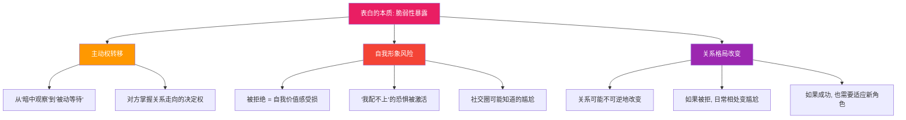
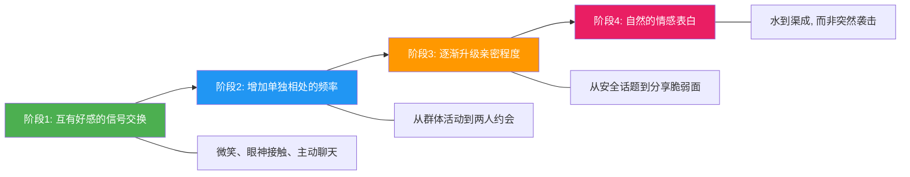
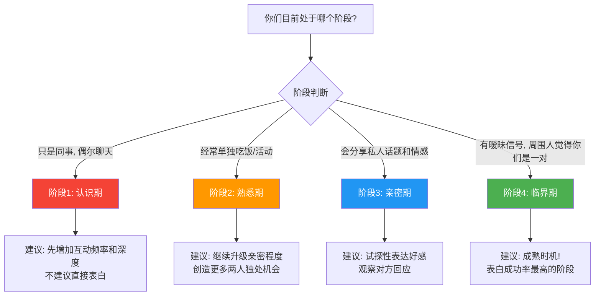
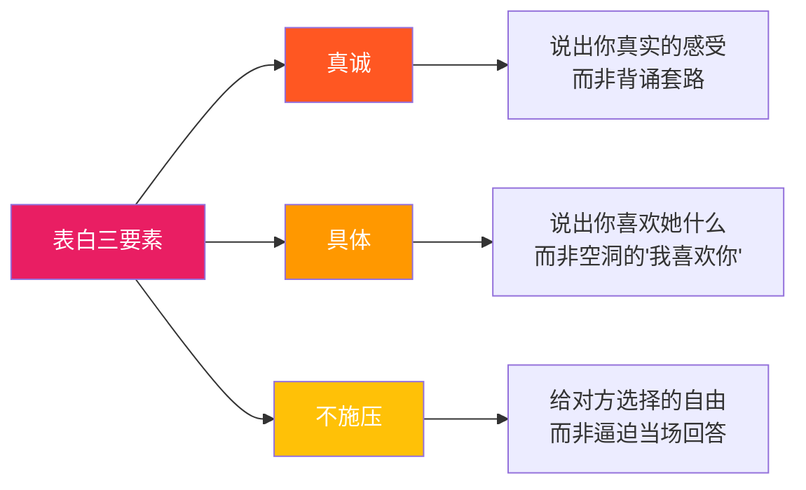
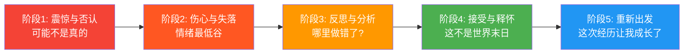

表白是亲密关系中最典型的高风险沟通事件——它同时涉及脆弱性暴露、关系权力重构和社交风险管理。本章以一个完整的职场暗恋案例为线索，系统拆解表白前的信号评估、表白中的表达策略、表白后的结果应对，覆盖不同依恋风格、文化语境和变体场景，帮助你把"喜欢"两个字说得既真诚又有力量。

## 场景四：表白——"我喜欢你很久了"

### 4.1 场景全景还原

小周暗恋同事小孙已经半年了。两人在同一家公司的不同部门，因为跨部门项目认识。项目结束后，两人并没有断了联系——经常一起吃午饭、在工位间走动时聊几句、偶尔周末约着看电影或逛展。小周觉得小孙对自己也有好感：她会主动找自己聊天，记得自己提过的细节，有时会带两杯咖啡到工位。但小周不确定这些是"好感"还是"只是朋友的热情"。

最近，小孙提到有个男生在追她，问小周"你觉得我应该怎么办"。这句话让小周坐不住了——他意识到如果再不表态，可能永远错过。但他想表白又满脑子顾虑：说错了怎么办？被拒绝了以后还怎么当同事？如果她根本没有那个意思，自己不是自作多情？

这些纠结让小周在接下来的一周里反复打了无数遍腹稿，写了又删、删了又写，始终没有发出去。

### 4.2 问题深度诊断

表白表面上是一句"我喜欢你"，实际上是一个涉及脆弱性暴露、关系权力重构、社交风险管理的高复杂度沟通事件。小周的困境不是"不会说话"，而是多个心理机制同时在起作用。

#### 4.2.1 脆弱性暴露的心理代价

布琳·布朗（Brené Brown）在《敢于领导》中将脆弱性定义为"在结果不确定时选择出现和被看见的勇气"。表白是亲密关系中最典型的脆弱性暴露行为——你把自己最真实的情感交给对方评判，同时主动放弃了关系中的"安全位置"。

这种脆弱性暴露的心理代价是真实存在的。进化心理学认为，被群体中的异性拒绝意味着"繁殖价值被否定"，这种威胁会激活大脑的疼痛回路——神经科学研究显示，社会拒绝激活的脑区（前扣带回皮层）与身体疼痛高度重叠（Eisenberger et al., 2003）。所以小周的恐惧不是矫情，而是有生理基础的。

但脆弱性也有另一面：布琳·布朗的研究同时表明，脆弱性是建立深度连接的必要条件。没有脆弱性的关系停留在表面，只有当你愿意暴露真实的自己——包括你的喜欢、你的紧张、你的不确定——对方才有机会真正认识你。表白，本质上就是用脆弱性换取连接可能性的交换。

#### 4.2.2 预期焦虑与决策瘫痪

小周面临的核心心理困境是**预期性焦虑**（Anticipatory Anxiety）——对尚未发生的负面结果的持续担忧。这种焦虑会产生三种具体的认知扭曲：

| 认知扭曲 | 小周的内心独白 | 客观现实 |
|---------|--------------|---------|
| **灾难化思维** | "被拒绝了整个公司都会知道，我没法待了" | 即使被拒，绝大多数人不会到处宣扬，尴尬是暂时的 |
| **读心术** | "她肯定只把我当朋友，那些好意都是客气" | 你不是她，无法确定她的想法，很多关系的起点就是"不确定" |
| **全有全无** | "要么在一起，要么彻底失去她" | 拒绝后仍然可以保持友谊，关系不一定是二元的 |

这些认知扭曲叠加在一起，会导致**决策瘫痪**——心理学家巴里·施瓦茨（Barry Schwartz）在《选择的悖论》中描述的现象：当一个决定的潜在损失感觉太大时，人会倾向于"不做决定"，哪怕"不做决定"本身就是一个糟糕的决定。

小周的"不表白"看似安全，实际上是在用确定的"错过"来交换不确定的"可能被拒"。这是一个典型的损失厌恶陷阱——人对损失的敏感度是收益的2倍（卡尼曼，前景理论），所以"可能被拒绝"的痛苦被放大成了"一定会很痛苦"，而"可能成功"的收益被缩小成了"不值得冒险"。

打破决策瘫痪的方法是**预期价值计算**：

表白的预期价值 = 成功概率 × 成功收益 - 失败概率 × 失败损失

关键认知调整:
1. 成功收益远大于你想象的——可能是一段改变人生的关系
2. 失败损失远小于你想象的——尴尬是暂时的, 自我价值不会因此减少
3. 不表白的损失 = 100%确定的错过——这才是真正的损失

#### 4.2.3 表白时机的心理学分析

很多人把表白看作一个"瞬间事件"——鼓起勇气说出那句话。但心理学研究和大量的实际案例表明，成功的表白更像是一个**渐进过程的终点**，而不是一个随机的勇气爆发。

在这个渐进框架下，表白不是"我在赌"，而是"我基于足够的信号做出合理判断"。小周需要先评估自己和小孙目前处于哪个阶段——如果还停留在阶段1，贸然跳到阶段4的"我喜欢你很久了"会产生巨大的落差感。

关系研究者约翰·戈特曼（John Gottman）的"滑动门时刻"理论同样适用：在关系升温过程中，每一次互动都是一个"滑动门时刻"——你可以选择转向对方（回应、靠近），也可以选择转离对方（回避、冷淡）。成功的表白建立在无数次"转向"的积累之上，而非一次孤注一掷的勇气爆发。

#### 4.2.4 同事关系的特殊风险

小周和小孙的场景不是普通的暗恋表白，而是**职场表白**——这增加了额外的复杂度：

1. **权力结构**：如果两人存在汇报关系或职级差异，表白可能被解读为骚扰。即使没有直接汇报关系，职级差异也会影响对方"自由同意"的真实性
2. **日常见面**：被拒绝后无法回避，每天上班都要面对这个人。这种"强制接触"会延长情绪恢复期
3. **社交影响**：同事关系的变动容易成为办公室八卦的素材。中国职场中八卦传播速度尤其快，可能在一个下午传遍整个公司
4. **职业声誉**：在一些企业文化中，办公室恋情不被鼓励，甚至可能影响职业发展。某些公司有明确的"同事恋爱申报"制度
5. **合同与HR**：某些公司有关于同事间恋爱关系的政策，需要提前了解。尤其是外企和大型互联网公司，通常有书面的员工关系政策

这些风险不是要阻止小周表白，而是需要他在策略设计中充分考虑。核心原则是：**选择私密场合、控制信息传播范围、做好被拒后的退路规划。**

#### 4.2.5 依恋风格如何影响表白行为

回顾本章理论基础中提到的依恋理论，不同依恋风格的人在表白前的心理状态和行为模式截然不同：

| 依恋风格 | 表白前的典型心理 | 表白时的典型行为 | 最大陷阱 |
|---------|----------------|----------------|---------|
| **安全型** | "我喜欢她，我想让她知道。结果不确定，但我能接受" | 直接、真诚、不过度准备 | 较少，但可能低估对方的顾虑 |
| **焦虑型** | "如果她拒绝了我怎么办？我必须做好万全准备，我必须知道她的态度" | 过度铺垫、反复试探、表白后不断追问结果 | 把表白变成了"逼问"，给对方施加压力 |
| **回避型** | "说出来万一不行就太尴尬了，还是维持现状吧" | 长期暗恋不行动，或选择文字消息而非当面说 | 错过时机，用"不表白"来保护自己免受拒绝 |
| **混乱型** | "我好想告诉她……不行，我怕……可是不告诉她我更难受" | 行为矛盾：先接近后退缩、表白时情绪化 | 传递混乱信号，让对方无法判断你的真实意图 |

小周的行为模式中可以看到焦虑型和回避型的混合特征：他有强烈的表达欲望（焦虑型的"必须做点什么"），但又被恐惧拖住了行动（回避型的"维持现状更安全"）。这种混合模式在中国男性中非常常见——社会期待男性"主动追求"，但内在的回避倾向又让人犹豫不决。

### 4.3 表白前的完整评估体系

在开口之前，小周需要做一次系统性的评估。这不是为了"算计"，而是为了做出一个负责任的决定。

#### 4.3.1 信号评估：她对我有没有好感？

很多人把表白当作"开盲盒"——完全不知道对方的态度，靠运气。但人类的好感表达其实有规律可循。以下是一份系统化的信号评估清单：

**强信号（3个以上 = 大概率有好感）：**

| 信号类别 | 具体表现 | 为什么是强信号 |
|---------|---------|-------------|
| 主动接触 | 主动发消息、约你、找理由靠近你 | 人在没有好感时不会主动制造与特定异性的接触 |
| 身体语言 | 靠近你、眼神接触频繁、在你面前整理仪容 | 身体语言比言语诚实得多，很难伪装 |
| 专属关注 | 记得你提过的细节、给你带东西、关心你的状态 | 这说明她在你身上投入了认知资源 |
| 社交融入 | 主动认识你的朋友、对你的爱好表现出兴趣 | 这是在试图融入你的生活圈 |
| 未来提及 | "下次我们一起去……""你生日是什么时候" | 把你纳入了她的未来计划 |
| 情感分享 | 告诉你她的烦恼、童年故事、内心想法 | 分享脆弱面是信任和亲密的标志 |
| 差异化对待 | 在你面前和在别人面前表现明显不同 | 说明你对她有特殊位置 |

**弱信号（可能是好感，也可能是性格使然）：**

- 聊天很愉快——有些人天生健谈
- 对你微笑——可能是基本礼貌
- 记得你的名字——同事之间很正常
- 帮你忙——可能是热心肠
- 给你点赞评论——可能是社交习惯

**反向信号（她可能对你没有超越朋友的感觉）：**

- 总是提到要给你介绍对象——她把你归类为"朋友"
- 在你面前毫不避讳地谈论其他追求者——说明她不担心你的反应
- 从不主动发起两人单独活动——所有的独处都是你发起的
- 身体语言保持距离——不自觉地后退、交叉双臂、避免眼神接触
- 回复消息越来越慢、越来越简短——兴趣递减

**关键原则：看趋势，不看单点。** 一个信号说明不了什么，但如果多个信号持续出现并呈递增趋势，可靠性就大幅提升。同时要注意**基线对比**——她的行为是对所有人都这样，还是只对你？前者是性格，后者才是信号。

#### 4.3.2 关系阶段评估

小周和小孙的关系大概处于阶段2到阶段3之间——已经熟悉，偶尔会分享私人话题，但还没有明确的暧昧信号。这意味着小周的策略应该是"升级关系后再表白"，而不是"先表白再说"。

**各阶段的关键判断指标：**

| 阶段 | 关键指标 | 是否适合表白 |
|------|---------|------------|
| 认识期 | 互动仅限于工作或群体活动，没有单独相处 | ❌ 成功率极低（<5%），贸然表白容易吓到对方 |
| 熟悉期 | 开始有单独相处，但话题以工作和兴趣为主 | ⚠️ 建议先升级到下一阶段再考虑 |
| 亲密期 | 会分享个人情感、烦恼、童年故事等私人话题 | ✅ 可以尝试试探性表达，观察回应 |
| 临界期 | 有明确的暧昧信号，周围人觉得你们"有戏" | ✅✅ 最佳表白时机，成功率最高 |

#### 4.3.3 自我准备度评估

表白不只是评估对方，也要评估自己：

表白前的自我准备度检查:
├── 情感成熟度
│   ├── 我能否接受被拒绝而不崩溃?
│   ├── 我喜欢的是真实的她还是我想象中的她?
│   ├── 我表白是为了"在一起"还是为了"解脱"?
│   └── 如果她身上有我目前不知道的缺点, 我能接受吗?
│
├── 关系认知
│   ├── 我了解她的价值观和生活规划吗?
│   ├── 我们的生活方式兼容吗? (作息、消费观、社交习惯)
│   ├── 我做好了从朋友到恋人的角色转换准备吗?
│   └── 我对她是否有"理想化滤镜"——把普通优点放大成完美?
│
├── 外部条件
│   ├── 我们是否都处于可以恋爱的状态? (单身、心理状态等)
│   ├── 职场关系是否有政策限制?
│   ├── 我是否考虑过被拒后的应对方案?
│   └── 我的生活是否有足够空间容纳一段关系? (时间、精力、经济)
│
└── 动机纯净度
    ├── 我是真的喜欢她还是不想"输给"追她的那个人?
    ├── 我是因为孤独还是因为真的和她合拍?
    ├── 如果她明天告诉我她有男朋友了, 我的反应是什么?
    └── 如果公司里有另一个和她条件相当的人, 我还会选她吗?

#### 4.3.4 小周的评估结果

回到小周的场景，他的评估结果如下：

- **信号评估**：中等偏积极。小孙会主动找他聊天、记得他的细节、带咖啡——这些属于"专属关注"类信号。但她问小周"有人追我怎么办"，这可能是试探，也可能是真的在征询朋友意见。需要结合其他信号综合判断
- **关系阶段**：阶段2-3之间。需要先向阶段3-4推进
- **自我准备度**：情感成熟度一般（容易灾难化思维），关系认知较好，动机基本纯净
- **外部条件**：同公司不同部门，无直接汇报关系；需要了解公司是否有办公室恋情政策
- **结论**：不建议立即表白，建议先用2-3周时间升级关系、释放信号、观察回应

### 4.4 表白前的心态建设

在评估完成、策略确定之后，正式表白之前，还有一关需要过——心态建设。很多人评估做得很到位，计划也很完善，但到了表白的那一刻，紧张和恐惧会吞掉所有的准备。以下是经过实践验证的心态建设方法。

#### 4.4.1 重新定义"成功"与"失败"

大多数人把表白的结果二元化：答应 = 成功，拒绝 = 失败。这种框架会让你在表白前就承受巨大的心理压力，因为"失败"的代价看起来太大了。

更健康的框架是**三结果模型**：

| 结果 | 传统定义 | 更健康的定义 |
|------|---------|------------|
| 她答应了 | 成功 | 我表达了自己的感受，她也有同样的感觉，我们开始了一段新的关系 |
| 她拒绝了 | 失败 | 我表达了自己的感受，她没有同样的感觉，但我没有遗憾了，而且我证明了自己有面对不确定性的勇气 |
| 她需要时间 | 悬而未决 | 我表达了自己的感受，她需要时间来处理，这说明她认真对待了我的表白 |

在这个框架下，"拒绝"不是失败，而是一种明确的结果——它比"永远不知道答案"要好得多。心理学研究也支持这一点：人在做出决定并面对结果后，心理状态通常好于长期悬而未决的状态（即使结果不理想）。这就是所谓的**决策后情绪改善效应**。

#### 4.4.2 恐惧暴露练习

认知行为疗法（CBT）中的恐惧暴露练习可以帮助降低表白前的焦虑：

**第一步：写下你所有的恐惧**

把所有"如果被拒绝会怎样"的恐惧全部写下来，不要筛选：

1. 她会觉得我很奇怪
2. 她会告诉其他同事
3. 其他人会笑话我
4. 我以后没法跟她说话了
5. 我会觉得自己很丢人
6. 我会很难过很长时间
7. 我在公司的形象会受损
……

**第二步：逐条评估真实概率和应对方案**

| 恐惧 | 真实概率 | 如果真的发生, 我能应对吗? |
|------|---------|----------------------|
| 她会觉得我很奇怪 | 低（正常表白不会让人觉得奇怪） | 能，她的看法不代表我的价值 |
| 她会告诉其他同事 | 中低（取决于她的性格和你们的关系） | 能，即使被知道也不丢人，反而是勇气的证明 |
| 其他人会笑话我 | 低（成熟的同事不会这样做） | 能，笑话别人表白的人才是不成熟的人 |
| 我以后没法跟她说话了 | 低（只要你保持正常） | 能，尴尬是暂时的 |
| 我会觉得自己很丢人 | 中（这是最常见的心理反应） | 能，通过心态调整可以应对 |
| 我会很难过很长时间 | 中（可能难过1-2周） | 能，我有朋友支持，也可以通过运动等方式调节 |

这个练习的核心作用是：把模糊的恐惧变成具体的、可评估的、可应对的具体问题。恐惧一旦被具体化，它的威力就大大降低了。

#### 4.4.3 自我肯定清单

在表白前，写下你的自我肯定清单——不是为了自欺欺人，而是为了在紧张时提醒自己：

我值得被喜欢, 因为:
├── 我是一个认真对待感情的人
├── 我有勇气面对不确定性
├── 我尊重她的感受和选择
├── 表白不代表我"低人一等", 而是我在主动追求幸福
├── 不管结果如何, 我都会为自己的勇气感到骄傲
└── 我的人生价值不取决于她是否答应我

#### 4.4.4 表白前24小时的心理准备

表白前一天:
├── 不要反复修改表白词——越改越紧张
├── 做一些让自己放松的事: 运动、听音乐、和朋友聊天
├── 早点睡觉——充足的睡眠能降低焦虑水平
├── 准备好明天要穿的衣服——整洁得体, 不需要刻意打扮
└── 最后确认一次: 时间、地点、方式都安排好了

表白当天:
├── 正常吃饭, 不要空腹——低血糖会加剧紧张
├── 不要喝咖啡或能量饮料——咖啡因会放大焦虑
├── 提前10分钟到场, 适应环境
├── 深呼吸3次: 吸4秒, 屏住4秒, 呼6秒
└── 提醒自己: "不管结果如何, 我今天做了最勇敢的事"

### 4.5 沟通策略：三阶段表白法

表白不是一瞬间的动作，而是一个有策略的沟通过程。以下是经过心理学验证的三阶段方法。

#### 4.5.1 第一阶段：信号释放与关系升温（1-3周）

在正式表白之前，你需要先让对方"预感到"你的态度。这不是玩心机，而是降低表白时的"冲击感"——如果对方完全没有心理准备，表白就像一颗炸弹；如果对方已经有了一些预期，表白更像是一扇被推开的门。

**具体操作：**

| 行动 | 具体示例 | 目的 | 注意事项 |
|------|---------|------|---------|
| **升级关注** | 从"同事式关心"变成"个人化关心"——记得她说过的烦恼并跟进询问 | 让她感受到你对她的关注超出普通朋友 | 不要过度——每天追问会让对方有压力 |
| **制造独处** | 从"一起吃午饭"变成"周末一起去看那个展吧" | 将关系从"群体中的互动"升级为"两人世界" | 从有明确理由的活动开始，比直接约"出来坐坐"更自然 |
| **适度赞美** | 从"你今天穿得不错"变成"你笑起来特别好看，每次看到心情都会变好" | 传递"我在用异性的眼光看你"的信号 | 赞美要具体、真诚，不要变成彩虹屁 |
| **分享脆弱** | 主动分享一些你的担忧、梦想、童年故事 | 创造情感互惠——你开放，她也更可能开放 | 分享要循序渐进，不要上来就讲童年创伤 |
| **身体语言** | 眼神接触多停留2秒、走路时靠近一点、自然的轻触（如拍肩） | 语言之外的亲密信号 | 观察对方的身体反应——如果她后退或回避，说明还没准备好 |

**关键原则：渐进升级，随时观察回应。** 每次升级后观察她的反应：
- 如果她也跟着升级（更主动、更亲密）→ 继续推进
- 如果她维持不变 → 暂停，给时间消化
- 如果她退缩 → 回退一步，可能是时机不对或信号判断有误

**关于小孙问"有人追我怎么办"的处理：**

这是一个关键节点。小周不应该帮她分析"那个男生怎么样"，而是应该巧妙地表达自己的态度：

> "这种事还是要看你自己的感觉。不过说实话，听到有人追你，我心里有点不舒服。"

这句话的效果：
1. 不直接表白，但清晰传递了"我在意你"
2. 用"不舒服"表达情感，而非用"我喜欢你"施加压力
3. 把决定权留在她手上，同时让她知道你的真实态度
4. 观察她对这句话的反应——她的反应会告诉你接下来该怎么做

如果她追问"为什么不舒服"或露出意味深长的微笑，这是非常积极的信号。如果她转移话题或打哈哈，说明她还没准备好面对这个话题，需要更多时间。

#### 4.5.2 第二阶段：表白执行——真诚、具体、不施压

当信号释放和关系升温到达一个临界点（对方已经对你释放了足够的积极信号，你对关系阶段的判断达到了阶段3-4），就到了表白的时机。

**表白的三个核心要素：**

**表白脚本（以小周为例）：**

> "小孙，有件事我想跟你说。其实认识你到现在快一年了，跟你相处的每一段时间我都特别开心。你记得我说过的那些小事、你笑起来的样子、你认真工作时皱眉的表情——这些细节让我越来越确定一件事：我喜欢你，不是朋友的喜欢，是想跟你在一起的那种喜欢。"

**脚本设计解析：**

| 句子 | 设计意图 | 心理学依据 |
|------|---------|----------|
| "有件事我想跟你说" | 铺垫，让对方进入认真倾听模式 | 降低信息的突兀感，给对方心理准备 |
| "认识你到现在快一年了" | 强调时间长度，说明这不是一时冲动 | 传递认真和深思熟虑的信号 |
| "你记得我说过的那些小事……" | 用具体细节替代空洞的"我喜欢你" | 具体化能增加可信度和情感冲击力，心理学中称为"鲜活性效应" |
| "不是朋友的喜欢，是想跟你在一起的那种喜欢" | 明确区分感情的性质 | 消除歧义，让对方清楚你的意图 |

**接下来的关键句——不施压：**

> "我说这些不是要给你压力。你可以慢慢想，不用现在回答我。不管你怎么想，我都尊重你的决定，我们的关系对我来说都很重要。"

这段话的三个设计：

1. **"不是要给你压力"**——直接表达你意识到了表白可能造成压力，展现情商
2. **"不用现在回答"**——把时间控制权交给对方，避免"被逼当场表态"的窘迫
3. **"不管你怎么想都尊重"**——明确表达没有预设"必须答应"的条件，降低对方的顾虑

**非语言表达的关键要素：**

表白不只是"说什么"，更是"怎么说"。非语言因素对信息传递的影响占比高达55-93%（梅拉比安法则）：

| 非语言要素 | 具体要求 | 为什么重要 |
|----------|---------|----------|
| **眼神** | 说话时注视对方的眼睛，但不要死盯——每隔5-7秒自然移开一下 | 眼神传递真诚和认真，回避眼神会被解读为"不确定"或"不认真" |
| **语速** | 比平时慢10-20%，在关键句子后停顿1-2秒 | 慢语速传递郑重感，停顿给对方消化的时间 |
| **音量** | 适中偏低——不要大声宣布，也不要小到听不清 | 低音量创造亲密感，高音量会让表白变成"通知" |
| **表情** | 自然、柔和，带一点微笑 | 微笑传递善意和自信，面无表情会让表白像面试 |
| **身体距离** | 比正常社交距离近一点（约0.5-1米），但不要侵入私人空间 | 适当缩短距离传递亲密信号，但要尊重对方的身体边界 |
| **姿态** | 面向对方，身体微微前倾，双手自然放置 | 前倾传递关注和投入，交叉双臂会显得防御 |

**表白方式选择：**

| 方式 | 适用场景 | 优势 | 劣势 |
|------|---------|------|------|
| **当面表白** | 已有足够独处机会和信号基础 | 最真诚、能传递语气和表情、最被尊重 | 需要面对即时反应，压力最大 |
| **手写信/卡片** | 适合文字表达能力更强的人 | 可以精心组织语言、对方可以反复阅读、留作纪念 | 缺乏即时互动、可能显得老派 |
| **消息表白** | 异地或实在没有当面机会 | 压力较小、对方有思考时间 | 显得不够认真、容易被截图传播 |
| **电话表白** | 当面机会少但想传递语气 | 比文字多一层语气信息 | 比当面少一层表情和肢体语言 |

**强烈建议选择当面表白。** 在中国文化语境下，当面表白传递的诚意远高于文字。如果连当面说的勇气都没有，对方可能会怀疑你的认真程度。

**表白场景选择指南：**

| 场景 | 推荐度 | 原因 |
|------|-------|------|
| 散步时的公园/河边 | ⭐⭐⭐⭐⭐ | 私密、轻松、边走边说可以缓解紧张 |
| 安静的咖啡馆角落 | ⭐⭐⭐⭐ | 私密性好、有饮品缓解尴尬 |
| 看完电影/展览后 | ⭐⭐⭐⭐ | 有共同话题做过渡，气氛自然 |
| 下班后的公司附近 | ⭐⭐⭐ | 方便但可能有同事出没的风险 |
| 公司内部 | ⭐ | 不推荐——私密性差，风险高 |
| 大庭广众/有第三者在场 | ❌ | 强烈不推荐——给对方制造社交压力 |

#### 4.5.3 第三阶段：表白后的应对

表白不是一个点，而是一条线。说出那句话之后，如何应对对方的反应才是真正的考验。

**情况A：对方答应了**

恭喜，但不要以为表白成功就万事大吉。表白后的第一步同样重要：

表白成功后的行动清单:
├── 第一天
│   ├── 不要立刻改变相处模式——太急切会有压力
│   ├── 表达开心但不要过度兴奋——"我很开心你也这么想"
│   └── 确认关系状态——"那我们算是正式开始了吗?"
│
├── 第一周
│   ├── 进行一次认真的对话: 了解对方对关系的期待
│   ├── 讨论基本问题: 如何告诉朋友? 在公司怎么相处?
│   ├── 设定沟通节奏: 多久见一次? 怎么联系?
│   └── 明确边界: 哪些事情需要磨合? 哪些底线不能碰?
│
├── 第一个月
│   ├── 从"暧昧相处模式"过渡到"恋人相处模式"
│   ├── 开始规划具体的约会活动
│   ├── 认识彼此的社交圈
│   └── 处理职场关系: 是否公开? 什么时候公开? 怎么公开?
│
└── 持续进行
    ├── 保持表白前那些好的相处习惯
    ├── 不要因为"已经在一起了"就停止经营
    └── 定期沟通彼此的感受和期待

**情况B：对方说"让我想想"**

这是最常见的回应——对方没有答应也没有拒绝，需要时间考虑。这个等待期是最考验情商的阶段：

| 应做 | 不应做 |
|------|--------|
| 给对方空间和时间 | 每天追问"你想好了吗" |
| 保持正常的日常互动 | 突然变得异常殷勤或异常冷淡 |
| 用行动继续展示你的好 | 发长消息试图说服对方 |
| 1-2周后自然地确认一次 | 第二天就催促答案 |
| 接受"不确定"是正常的 | 把等待期变成焦虑的煎熬 |

**等待期确认的措辞：**

> "前几天说的事不用有压力。我就是想让你知道我的想法，不管结果怎样都没关系。如果你还需要时间就继续想，如果你已经有答案了也随时可以告诉我。"

**情况C：对方拒绝了**

这是最需要准备的情况，也是最能体现一个人情感成熟度的时刻。

**被拒绝后的黄金回应：**

> "没关系，谢谢你坦诚告诉我。我喜欢你是我的事，你不需要有任何负担。希望我们还能像以前一样相处。"

**这句话的设计解析：**

1. **"没关系"**——不是敷衍的"没关系"，而是真正表示你能接受这个结果
2. **"谢谢你坦诚告诉我"**——把拒绝定义为"坦诚"而非"伤害"，展现格局
3. **"我喜欢你是我的事"**——把表白的责任完全归于自己，不让对方有"伤了你"的愧疚
4. **"你不需要有任何负担"**——消除对方"我伤害了他"的心理负担
5. **"希望还能像以前一样"**——为关系保留空间，但不强求

**情况D：对方的反应出乎意料**

有时候对方的反应不在你的预设范围内——可能哭了、可能沉默了很久、可能反问你"你认真的吗"。面对意外反应，核心原则是**保持冷静、给对方空间、不要急于填补沉默**。

> 如果对方沉默 → 等待，不要追问"你听到我说的了吗"
> 如果对方情绪激动 → "不着急，慢慢来，我说这些不是要你马上有答案"
> 如果对方反问"你认真的吗" → "是的，我是认真的。但我也理解你可能需要时间"

### 4.6 表白后的心理调适

无论结果如何，表白之后的心理调适都是一个需要认真对待的过程。

#### 4.6.1 被接受后的心理调适

很多人忽略了被接受后也可能有心理波动：

- **冒充者综合征**：她为什么会答应我？她是不是搞错了？我配得上她吗？
- **角色转换焦虑**：从暗恋者变成恋人，不知道该怎么相处。暗恋时只需要"喜欢她"，恋爱后需要"经营关系"
- **理想化崩塌**：暗恋时对方是完美的，近距离相处后发现缺点。这不是"她变了"，而是你终于看到了真实的她
- **承诺恐惧**：曾经遥不可及的梦实现了，反而感到不真实和害怕。"如果我搞砸了怎么办？"
- **公开焦虑**：要不要告诉同事？告诉朋友？家人？每一步都可能带来新的压力

**应对方法：**

1. 接受"不确定感"是正常的——任何新关系都需要磨合期，不需要第一天就完美
2. 不要试图维持暗恋时的"完美形象"——真实的你才能建立真实的关系
3. 主动沟通你的不安——"第一次谈恋爱我有点紧张"比故作镇定更能拉近距离
4. 不要急于"定义"关系——让它自然发展，不要在第一周就讨论结婚计划
5. 给彼此独处的空间——恋爱不意味着24小时黏在一起

#### 4.6.2 被拒绝后的心理调适

被拒绝后的心理恢复通常经历以下阶段：

**每个阶段的具体调适方法：**

**阶段1-2（前1-2周）——允许自己难过：**

- 不要压抑情绪——找个信任的朋友倾诉，或写情绪日记
- 不要反复翻看聊天记录——这会延长痛苦期，神经科学显示回忆痛苦经历会强化相关神经通路
- 不要立刻尝试"下一个"——用新恋情掩盖旧伤只会积累问题
- 保持基本的生活节奏——正常吃饭、睡觉、上班、运动
- 可以给自己一个"难过期限"——"我允许自己难过两周，两周后开始恢复"
- 体育运动是最有效的情绪调节方式——有氧运动能促进内啡肽分泌，直接对抗抑郁情绪

**阶段3（第2-4周）——理性复盘：**

- 客观分析被拒绝的可能原因（时机不对？信号判断失误？她有其他原因？）
- 区分"我做错了什么"和"她就是对我没感觉"——后者不需要自我否定
- 提取这次经历中可以改进的部分，但不要全盘否定自己
- 把表白看作一次"社交实验"——你获得了关于自己和对方的真实数据

**阶段4-5（第4周以后）——重建自信：**

- 表白本身就是勇气的证明——被拒绝不丢人，不敢表达才可惜
- 把注意力重新放回自身成长上——工作、健身、社交、兴趣
- 对未来保持开放——一次拒绝不代表永远被拒绝
- 感谢这次经历——它让你更了解自己想要什么样的关系

#### 4.6.3 拒绝后的同事关系处理

这是小周特别需要面对的问题。被拒绝后，每天还要在办公室见到小孙，如何处理？

**第一周：**
- 保持正常的同事礼仪（打招呼、基本工作交流）
- 不需要刻意回避——回避反而显得你不成熟
- 也不要刻意表现"我很洒脱"——过度正常也不自然
- 给彼此2-3天的缓冲期是正常的
- 如果需要在工作上合作，保持专业态度

**第二周起：**
- 逐步恢复到表白前的互动频率
- 如果她主动聊天，正常回应，不要冷淡
- 不要再提表白的事——除非她主动提起
- 不要在同事面前提起这件事
- 不要通过共同朋友去"打探"她的态度

**如果你发现自己无法自然面对她：**
- 可以考虑申请调换工位或调整午餐时间——给自己一些物理距离
- 如果情绪持续影响工作，考虑找朋友或心理咨询师聊聊
- 给自己时间——大多数尴尬会在1-2个月内自然消退
- 如果公司有EAP（员工帮助计划），可以匿名使用

### 4.7 不同依恋风格的表白优化方案

根据依恋理论，不同依恋风格的人需要不同的表白策略来弥补自身模式的盲区。

#### 4.7.1 焦虑型依恋者的表白优化

**核心问题**：过度需要确定性，容易把表白变成"逼问答案"

**优化策略：**

1. **控制试探频率**：不要在表白前反复确认"你对我有没有感觉"。适度的不确定是正常的，不需要消除所有不确定性才能行动
2. **表白时放下"必须成功"的执念**：把目标从"她答应"调整为"我表达了真实的自己"
3. **被拒后不要纠缠**："你再想想""我哪里不好我可以改"——这些话会让拒绝变得更坚定
4. **被接受后不要过度索取确认**：不要每天问"你爱不爱我"——用行动而非追问来建立安全感
5. **学习自我安抚**：在等待回应期间，用运动、社交、工作来分散注意力，而不是反复分析她的每一个微表情

**焦虑型表白脚本调整：**

原始版（焦虑型的本能反应）：
> "我喜欢你很久了，你到底对我什么感觉？你能不能给我一个明确的答案？"

优化版：
> "我喜欢你，想让你知道这件事。你不用急着回答，慢慢想就好。"

区别：去掉了"逼迫性"的语言（"到底""能不能""明确的"），保留了表达的核心。

#### 4.7.2 回避型依恋者的表白优化

**核心问题**：害怕拒绝和尴尬，倾向于"不表白来保护自己"

**优化策略：**

1. **接受"不舒服"是成长的一部分**：回避型最需要学习的是"脆弱性不是软弱"
2. **用最小行动开始**：如果当面表白太难，先从文字开始，但要有升级到当面的计划
3. **设置外部截止日期**："我在这个月之内一定会告诉她"——用外部约束对抗内在回避
4. **预演被拒绝后的场景**：提前想象"如果被拒绝了我该怎么回应"，降低对未知的恐惧
5. **找一个信任的朋友做"问责伙伴"**——告诉朋友你的计划，让他定期提醒你

**回避型表白脚本调整：**

原始版（回避型的本能反应）：
> （永远停留在腹稿阶段，或者发一条模棱两可的消息）"其实我觉得你挺好的……算了没什么。"

优化版：
> "有件事我一直没说，今天想鼓起勇气告诉你。我喜欢你，不是朋友的那种。"

区别：把"犹豫""退缩"的信号去掉，用"鼓起勇气"来承认紧张感反而显得真诚。

#### 4.7.3 安全型依恋者的表白提醒

安全型依恋者通常有最健康的表白模式，但也要注意：

1. **不要假设对方也是安全型**：你的坦然直接可能对焦虑型的人来说太突然，对回避型来说压力太大
2. **注意文化差异**：在含蓄的中国文化语境下，过于直接的表白（"做我女朋友吧"）可能不如渐进式的表达效果好
3. **被拒绝后保持一致**：安全型最大的优势是情绪稳定，被拒绝后真正做到了"尊重决定、保持关系"——这才是最有说服力的人格魅力
4. **不要"教"别人怎么回应你**：安全型有时会因为自己的坦然而期待对方也一样坦诚，但每个人有自己的节奏

#### 4.7.4 混乱型依恋者的表白优化

**核心问题**：行为矛盾，既渴望亲密又害怕亲密，表白时容易传递混乱信号

**优化策略：**

1. **先处理内在矛盾**：在表白之前，先弄清楚自己的真实需求。可以写日记或找心理咨询师聊
2. **简化表白内容**：不要试图在一次表白中表达所有情感——选择最核心的一句话
3. **控制情绪波动**：表白时可能会突然紧张或退缩，提前准备一个"锚点句"——如果慌了就回到这句话
4. **给对方明确的信号**：混乱型最大的问题是"忽冷忽热"，表白后要保持一致的态度

### 4.8 中国文化语境下的表白特殊考量

在中国社会文化背景下，表白有一些独特的维度需要关注。

#### 4.8.1 含蓄文化与直接表达的平衡

中国传统文化推崇含蓄之美。"我爱你"在中文语境中的情感重量远大于英文的"I love you"——很多人恋爱多年都不会说这三个字。但这并不意味着表白一定要含蓄到对方听不懂。

**平衡之道：用行动铺垫、用语言确认。**

- 行动层面：持续的关心、制造独处机会、身体语言的亲近——这些是"含蓄的铺垫"
- 语言层面：在铺垫充分之后，用清晰但不过度直白的语言确认——"我想跟你在一起"比"做我女朋友"更柔和，但意思明确

**中文表白的常见措辞对比：**

| 措辞 | 适用场景 | 语气强度 | 备注 |
|------|---------|---------|------|
| "我喜欢你" | 最通用的表白方式 | 中等 | 清晰但不过度正式 |
| "我想跟你在一起" | 关系已经比较亲密时 | 偏强 | 比"做我女朋友"柔和 |
| "做我女朋友吧" | 关系已经非常明确时 | 强 | 比较正式，在中国文化中接受度不错 |
| "我对你的感觉不只是朋友" | 试探性表达 | 较弱 | 适合不确定对方态度时 |
| "我发现我越来越离不开你了" | 关系已经很亲密 | 强 | 适合从暧昧过渡到正式确认 |

#### 4.8.2 "面子"维度

在中国文化中，表白被拒绝的痛苦除了情感层面，还有一层"面子"的损失。小周可能会想："如果被拒绝了，我在公司里是不是很丢人？"

**去面子化策略：**

1. 选择私密场合——确保只有两个人知道
2. 表白后不要到处说——无论成功还是失败
3. 被拒绝后的态度比表白本身更重要——大方、不纠缠，反而赢得尊重
4. 记住：在成熟的人眼中，勇敢表白永远不丢人，只有死缠烂打才丢人
5. 如果被拒绝，不要在社交媒体上发暗示性内容——这只会让局面更尴尬

#### 4.8.3 同事关系在中国职场的特殊性

中国职场文化中，同事关系比西方更紧密——很多人的核心社交圈就是同事。这意味着：

1. **办公室八卦传播速度极快**——表白的消息可能比你想象的传得更远。一个部门知道了，通常意味着整个公司都知道了
2. **领导的态度很重要**——有些领导反对办公室恋情，有些默许，需要提前了解。如果领导明确反对，可能需要更谨慎地处理
3. **"以结婚为目的"的文化期待**——在中国文化中，表白通常被理解为"以结婚为目的的正式追求"，而非"先交往看看"。如果你的想法是后者，需要在关系推进过程中逐步沟通
4. **HR政策要提前了解**——有些公司要求员工申报恋爱关系，尤其是同公司的情况。了解政策不是要阻止自己，而是做好准备

#### 4.8.4 表白与"追求"的文化区别

在中国的恋爱文化中，"表白"和"追求"是有区别的：

| 维度 | 追求 | 表白 |
|------|------|------|
| 时间线 | 持续一段时间的过程 | 某个具体的时刻 |
| 方式 | 通过行动展示诚意 | 通过语言表达心意 |
| 节奏 | 渐进的，给对方观察和考虑的时间 | 相对集中的情感表达 |
| 文化接受度 | 更符合中国传统恋爱模式 | 更现代化、更直接 |
| 建议做法 | 先追求，再表白——表白是追求的"毕业典礼" | 不要跳过追求直接表白——没有铺垫的表白成功率极低 |

### 4.9 常见误区与纠正

#### 误区一：用表白来"试探"

**错误做法**："我想表白看看她什么反应，如果不行就算了。"

**为什么错**：表白不是试探工具。如果你自己都不确定，为什么要让对方来替你做决定？这种心态会导致表白时传递出"不太认真"的信号，反而降低成功率。对方能感受到你的犹豫——你说话时的不坚定、你措辞中的退路、你眼神中的不确定。

**正确做法**：在表白之前，通过信号评估和关系升温阶段来建立对关系的判断。表白时应该是"我已经判断了大概率是积极的结果，现在来确认"，而不是"我不知道结果，让我问问"。

#### 误区二：用"大场面"弥补关系不足

**错误做法**：在关系还不够亲密时，用99朵玫瑰、在公司楼下摆心形蜡烛、当众表白。

**为什么错**：大场面表白的本质是"用外部压力迫使对方答应"。当众表白意味着对方如果不答应，会面临巨大的社交压力——周围人的目光、起哄的声音、你精心准备的成本。这不是浪漫，这是道德绑架。

**真实案例**：某大学男生在女生宿舍楼下用蜡烛摆心形表白，围观者起哄"答应他"。女生被迫下楼，当众拒绝后遭到部分围观者的嘲笑，此后很长一段时间不敢走那条路。表白者也成了全校的笑柄。

**正确做法**：大场面只适合两种情况——已经确定关系后的惊喜，或者你们的关系已经明确到了"就差一句话"的程度。在关系还不明朗时，私密、真诚、朴素的表白远比大场面有效。

#### 误区三：把表白当作"终点"

**错误做法**：表白成功后觉得"搞定了"，不再投入精力经营关系。

**为什么错**：表白是关系的起点，不是终点。很多人在追求阶段投入100%的精力，确定关系后迅速降到30%，让对方产生"你之前都是装的"的失望感。心理学中把这种现象叫做"承诺升级后的投入递减"——人在获得承诺后，会不自觉地放松努力。

**正确做法**：表白前后的投入应该保持一致，甚至在关系初期投入更多——因为确定关系后才是真正的了解和磨合阶段。表白成功只意味着"我们愿意一起尝试"，不意味着"从此幸福快乐"。

#### 误区四：用"感动"替代"吸引"

**错误做法**：通过持续的付出、送礼物、随叫随到来"感动"对方，然后用"我为你做了这么多"来表白。

**为什么错**：感动不是爱情。用付出来"绑架"对方的感情，即使对方答应了，这段关系的基础也不是"被你吸引"，而是"不好意思拒绝"。这种关系注定不稳固——当感动消退，关系也会随之瓦解。

**正确做法**：关注自身的吸引力——有趣的灵魂、稳定的情绪、上进的生活态度、独立的生活能力。吸引是双向的，不是单方面的付出。你需要成为"值得喜欢的人"，而不是"付出最多的人"。

#### 误区五：被拒绝后反复纠缠

**错误做法**："你再考虑一下""我哪里不好我改""我会一直等你""你是不是有什么顾虑，我可以帮你解决"。

**为什么错**：尊重对方的决定是基本素养。反复纠缠不仅不会改变结果，还会把"被拒绝"变成"被厌恶"。每一次纠缠都在消耗对方对你仅存的好感和尊重。

**正确做法**：被拒绝后干净利落地接受，用行动证明你的成熟和尊重。如果对方将来改变想法，她会主动来找你——但你的人生不应该围绕这个可能性来规划。

#### 误区六：通过朋友传话表白

**错误做法**：让共同朋友去探口风，或让朋友转达"小周喜欢你"。

**为什么错**：表白是两个人之间最私密的沟通。通过第三方传话有几个问题：信息可能被扭曲（参考场景三的传话效应）、显得缺乏勇气、把私事变成了公共事务。更糟糕的是，朋友可能会"添油加醋"或"好心办坏事"。

**正确做法**：自己的感情自己表达。你可以找朋友了解她的态度，但表白本身一定要亲自说。

#### 误区七：表白后立刻在社交媒体"官宣"

**错误做法**：对方刚答应，马上就发朋友圈、改签名、换头像。

**为什么错**：关系刚开始就公开化会给双方都带来压力。对方可能会觉得"我还没准备好被所有人知道"，也可能因为公开后的关注而感到不安。

**正确做法**：先享受两个人的相处，等到关系稳定后再讨论是否以及如何公开。公开的时机和方式应该由双方共同决定。

### 4.10 变体场景

这个场景的核心模式——"暗恋→评估→表白→应对结果"——在不同情境下有多种变体。理解这些变体可以帮助你举一反三。

#### 4.10.1 变体一：向多年好友表白

**典型场景**：你和对方认识多年，一直是好朋友，你逐渐产生了超越友谊的感情。

**额外挑战**：
- 失败的代价更高——可能失去一个多年的好友
- 对方完全没有心理准备——"我一直把你当朋友"
- 共同社交圈的连锁反应——朋友们可能会"站队"或议论
- 你对她的了解既是优势也是盲区——你了解她的优点，但也可能忽略了"朋友视角"和"恋人视角"的差异

**特殊策略**：
1. 信号释放阶段要更长——从"朋友式关心"到"暧昧式关心"的过渡需要更多时间，至少4-6周
2. 表白时特别强调"无论结果如何，你在我生命中的重要性不会变"
3. 准备好接受"我需要时间消化"——多年好友收到表白后通常需要更长时间考虑，因为她需要重新审视你们所有的互动
4. 给对方一个安全的退路——"如果你觉得我们还是更适合当朋友，我完全理解，我也会调整好自己"
5. 不要翻旧账——不要说"我从三年前就喜欢你了"，这会给对方造成"我被欺骗了"的感觉

**好友表白脚本调整：**

> "我们认识这么久了，你对我来说一直很重要。最近我发现我对你的感觉有了变化——不只是朋友的那种在乎。我想坦诚地告诉你，不是想改变什么，只是觉得你值得知道真相。不管你怎么想，你在我生命中的位置不会变。"

#### 4.10.2 变体二：向线上认识的人表白

**典型场景**：你们在社交平台或交友软件上认识，聊了很久但还没有见面。

**额外挑战**：
- 线上形象可能与线下有落差——照片可能是精修的，文字可能经过反复编辑
- 缺乏身体语言和面对面互动的信号——你无法判断她的真实反应
- "表白"的定义更模糊——线上聊天到什么程度算"在一起"？
- 可能存在信息不对称——你不确定她同时在跟多少人聊天

**特殊策略**：
1. 在表白之前至少见一次面——线上好感需要线下验证。文字里的默契不等于面对面的化学反应
2. 用"我希望我们能更认真地发展"替代正式的"我喜欢你"——给关系一个渐进的定义
3. 讨论现实问题——距离、异地的可能性、见面频率、未来规划
4. 不要在还没见面的情况下就表白——这会让对方觉得你只喜欢"想象中的她"

#### 4.10.3 变体三：表白后对方给的是模糊答案

**典型场景**：你表白了，对方说"我也不知道""我对你有好感但不确定是不是那种喜欢""我需要时间想想"。

**应对策略：**

| 对方说的 | 可能的含义 | 建议回应 |
|---------|----------|---------|
| "我需要想想" | 大概率是积极的——真的在认真考虑 | 给1-2周时间，正常互动，不要追问 |
| "我对你有好感但不确定" | 中性偏积极——有基础但缺乏确定性 | 继续升温关系，用行动帮她确认 |
| "我觉得我们当朋友更好" | 礼貌的拒绝 | 接受，不要追问"为什么" |
| "我现在不想谈恋爱" | 要么是拒绝，要么是真的处于不适合恋爱的状态 | 不要追问"那你想什么时候"，尊重当下 |
| "我怕影响我们的关系" | 说明她珍惜你们的关系，但不确定恋爱会不会破坏它 | "我理解你的顾虑。不管怎样，你对我来说都很重要" |

**如果超过两周仍没有回应：**

> "之前说的事你不用有压力，不管你的决定是什么我都可以接受。你如果有答案了告诉我就好。"

这句话之后，不要再主动提起。如果她仍然没有回应，大概率意味着她不知道怎么拒绝你——把沉默当作"婉拒"是更成熟的理解方式。

#### 4.10.4 变体四：对方主动释放信号但你不确认

**典型场景**：对方对你很好，但你不确定是"喜欢你"还是"性格外向"。

**识别方法：**

- **横向对比**：她对所有人都这样热情，还是只对你？只对你才是信号
- **纵向趋势**：她的热情程度是在增加还是维持不变？增加才是信号
- **主动程度**：是双向互动还是你单方面主动？她主动来找你才是信号
- **差异化对待**：她在你面前和在别人面前的表现是否不同？不同才是信号
- **投入成本**：她愿意为你牺牲时间和便利吗？比如下雨天特意给你送伞，加班时特意等你一起走

如果经过观察仍然不确定，最直接的方法是**小步试探**——释放一个轻微的好感信号，看她的回应。比如："这周末有个展览，我觉得你可能会喜欢，要不要一起去？"她的反应会给你更多信息。

#### 4.10.5 变体五：表白被拒后对方反悔

**典型场景**：你表白被拒绝了，但过了一段时间对方主动来找你，暗示她改变了想法。

**应对策略：**

1. **不要立刻答应**——给自己时间确认这是真实的感情变化，而非"找不到更好的"或"被你的坚持感动了"
2. **坦诚沟通**——"你之前拒绝了我，现在又来找我，我想了解你的心路历程"
3. **确认动机**——她是因为真正被你吸引了，还是因为孤独、愧疚、或外部压力？
4. **设定新的起点**——不要从"被拒"的地方继续，而是当作一段全新的关系来开始
5. **不要翻旧账**——如果决定在一起，不要在吵架时说"当初你可是拒绝过我的"

### 4.11 实操工具：表白完整流程模板

#### 4.11.1 表白前评估清单

表白前72小时最终检查:
├── 信号评估
│   ├── 我观察到了至少3个强信号吗?
│   ├── 这些信号是持续的还是偶然的?
│   ├── 她对我的态度跟对其他异性有明显区别吗?
│   └── 我排除了反向信号的可能性吗?
│
├── 关系阶段
│   ├── 我们有过至少3次单独相处吗?
│   ├── 我们分享过私人话题和情感吗?
│   ├── 周围有没有人觉得"你们挺配的"?
│   └── 她是否已经预感到我对她有好感?
│
├── 自我准备
│   ├── 我能用一句话说清楚我喜欢她什么吗?
│   ├── 如果被拒绝, 我有具体的应对方案吗?
│   ├── 我的表白动机是"喜欢她"而非"怕失去她"吗?
│   └── 我做好了关系可能改变的心理准备吗?
│
├── 场合选择
│   ├── 我选了一个私密、轻松、不被打扰的环境吗?
│   ├── 对方最近的状态适合接受表白吗? (没在忙/焦虑/生病)
│   ├── 我有充足的时间, 不会因为赶时间而草率吗?
│   └── 我选的时间是对方精力和心情较好的时段吗?
│
├── 职场特殊检查 (仅限同事表白)
│   ├── 我了解公司的同事关系政策吗?
│   ├── 我选择了工作之外的时间和场合吗?
│   ├── 我有被拒后的退路方案吗? (工位、午餐、社交圈)
│   └── 我能做到无论结果都不影响工作合作吗?
│
└── 心态检查
    ├── 我接受任何结果, 而非只接受"答应"吗?
    ├── 我不是在用表白来释放自己的焦虑吗?
    ├── 我做好了关系可能改变的心理准备吗?
    └── 我能把"拒绝"理解为"她没感觉"而非"我不够好"吗?

#### 4.11.2 完整表白脚本（小周版）

**开场——铺垫（降低突兀感）：**

> "小孙，今天约你出来是想跟你说件事。其实想说很久了，只是一直没找到合适的时机。"

**中段——表达（真诚、具体）：**

> "从认识到现在快一年了，我发现跟你在一起的时候特别放松、特别开心。你笑起来的样子、你认真做事的专注、你关心人时的那种细心——这些细节一点一点地让我确定，我对你的感觉不只是同事和朋友。我喜欢你，是想跟你在一起的那种喜欢。"

**收尾——不施压（给对方空间）：**

> "我说这些不是要逼你做决定。你可以慢慢想，多久都可以。不管你的答案是什么，我都尊重。你在我的生活里很重要，这个不会因为你的答案而改变。"

**备选：如果对方问"你为什么现在才说"：**

> "因为我怕说早了我们连朋友都做不了。但最近有人追你，我不想因为自己的犹豫而错过。"

#### 4.11.3 被接受后的第一次约会对话建议

> "说实话，之前一直在想怎么跟你说这件事，现在终于不用想了，感觉轻松多了。（打破紧张感）你是什么时候开始觉得我'不只是朋友'的？（了解对方的感受过程）我对我们的关系有一些想法想跟你聊聊……（自然过渡到关系规划）"

**第一次约会注意事项：**
- 不要选择太正式的场合——轻松的活动（散步、咖啡、逛展）比烛光晚餐更好
- 不要急于"官宣"——这次约会的目的是享受两个人的时光
- 准备一些话题——从暧昧过渡到恋爱可能会有短暂的"不知道聊什么"的阶段
- 自然就好——不要因为"现在是恋人了"就突然改变你的说话方式和行为

#### 4.11.4 被拒绝后的完整回应

> "谢谢你告诉我。（停顿，微笑）你说得很清楚，我理解。我之前说的都是真心的——喜欢你是我的事，你不需要有任何负担。我们的关系对我来说很重要，我希望以后还能像以前一样。如果需要一点时间调整也没关系，我都可以。"

**被拒绝后的后续行动清单：**
- 当天：保持正常，不要在社交媒体上发暗示性内容
- 第二天：发一条正常的工作消息（如果是同事），表明你没事
- 一周内：保持正常的社交距离，不要刻意回避也不要刻意靠近
- 两周后：逐步恢复到表白前的互动模式
- 一个月后：大多数尴尬已经消退，关系基本恢复正常

### 4.12 进阶：表白背后的心理学深度

#### 4.12.1 自我决定理论（Self-Determination Theory）

心理学家德西和瑞安提出的自我决定理论认为，人有三个基本心理需求：自主性、胜任感和归属感。表白行为同时涉及这三个层面：

- **自主性**：选择表白是你自主做出的决定，而非被外界压力推动。如果你表白是因为"所有人都说应该表白了"，自主性没有被满足，表白会感觉像任务而非表达
- **胜任感**：你相信自己有能力处理表白后的任何结果——成功了能经营好关系，失败了能恢复情绪。胜任感不足的人会在表白前反复犹豫，因为"我不确定我能handle"
- **归属感**：你希望通过表白建立更深层的情感连接。归属感是表白最核心的驱动力——人是社会性动物，建立亲密关系是基本心理需求

当这三个需求在表白中得到满足时——你出于自由意志选择表达，你有应对各种结果的自信，你的目标是建立真实的连接——表白本身就是一种心理成长，无论结果如何。

#### 4.12.2 情绪粒度与表白表达

心理学家丽莎·费尔德曼·巴瑞特提出**情绪粒度**（Emotional Granularity）概念——能够精细区分和描述自己情绪状态的能力。情绪粒度越高的人，在表白中越能传递出真实、细腻、有感染力的感受。

对比：
- 低情绪粒度："我喜欢你，想跟你在一起。"
- 高情绪粒度："每次看到你笑，我心里会有一种很温暖的感觉，像是冬天晒到太阳的那种舒服。跟你聊天的时候，我会特别期待时间过得慢一点。这种感觉越来越强烈，我确定这就是喜欢。"

高情绪粒度的表达之所以更有力量，是因为它让对方"看到"了你的内心世界，而非仅仅"听到"了一个结论。心理学研究显示，高情绪粒度的人在亲密关系中满意度更高、冲突更少——因为他们能更准确地表达自己的需求和感受。

**提升情绪粒度的练习：**

每天花5分钟写下自己的情绪状态，不用"开心""难过"这种笼统的词，而是尝试更精确的描述：
- 不说"开心"，说"满足""兴奋""放松""感恩"中的哪一个更准确？
- 不说"难过"，说"失望""遗憾""孤独""无力"中的哪一个更贴切？

这个练习看起来简单，但坚持两周后，你会发现自己的情感表达能力有明显提升。

#### 4.12.3 决策科学视角：表白作为"信息不对称博弈"

从博弈论的角度看，表白是一个典型的**信息不对称场景**——你知道自己的感受，但不知道对方的；对方可能知道自己的感受，但不知道你的。这种信息不对称导致了双方都可能在"等对方先表态"。

打破信息不对称的方法有三种：

1. **直接表白**——一次性消除你的信息不对称（让对方知道你的感受），但风险最高
2. **渐进信号释放**——逐步减少信息不对称，双方都在缓慢"摊牌"，风险较低但耗时较长
3. **第三方信息收集**——通过共同朋友了解对方态度，但信息可能失真

最优策略通常是方法2——渐进信号释放。它既避免了直接表白的高风险，又比第三方信息收集更可靠。在这个过程中，双方都在"安全范围内"逐步暴露自己的态度，直到信息不对称降低到可以"安全表白"的程度。

#### 4.12.4 本场景的理论回扣

这个案例串联了本章前面讨论的多个核心概念：

1. **依恋理论**（详见理论基础第一章）：不同依恋风格在表白中表现出截然不同的行为模式。识别自己的依恋风格，是优化表白策略的第一步。

2. **爱的语言**（详见理论基础第二章）：表白时用对方能接受的"爱的语言"来表达，效果远好于用自己的方式。如果对方的爱的语言是"精心时刻"，那么约她出来面对面聊比送礼物更有效；如果对方的爱的语言是"肯定的言辞"，一段精心准备的表白词比任何礼物都更有力量。

3. **情感账户**（详见理论基础第三章）：表白前的情感账户余额决定了表白的"风险承受力"。账户余额高（长期的好关系积累），即使被拒也不至于"破产"；账户余额低（刚认识不久），被拒可能直接导致关系终结。这就是为什么"先追求再表白"的成功率远高于"直接表白"。

4. **情绪管理**（详见理论基础第四章）：表白需要在情绪高涨时保持理性表达——既不能因为紧张而说得磕磕巴巴，也不能因为激动而语无伦次。学会在情绪峰值保持表达的清晰度，是情感沟通的核心能力。

5. **"我"句式**（详见核心技巧第一章）：表白中所有表达都应该是"我感受到……"而非"你应该……"——前者是真诚的分享，后者是变相的要求。"我喜欢你"是分享，"你应该给我一个机会"是要求。

***

> **本场景核心要义**：表白不是勇气的一次性爆发，而是一个系统工程——从信号评估到关系升温，从心态建设到表达执行，从结果应对到心理调适，每一步都有章可循。真正的勇气不是"不怕被拒绝"，而是"知道可能被拒绝，但依然选择表达"。因为沉默不是安全，沉默是确定的错过。
