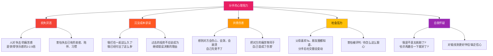
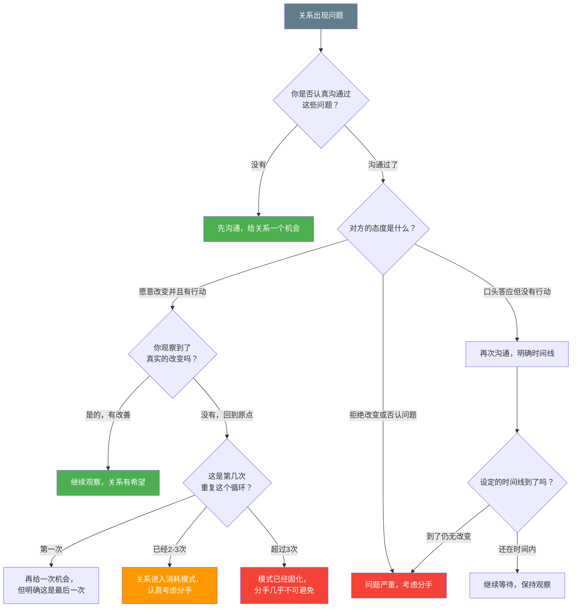
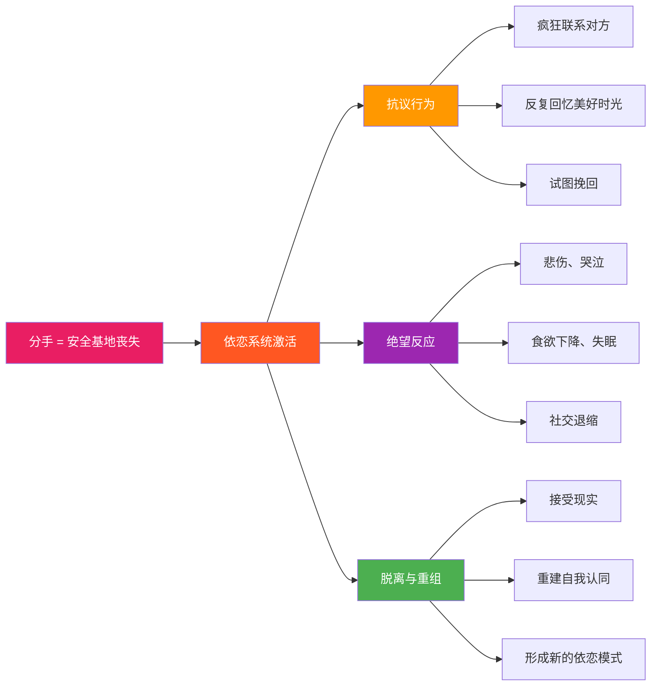
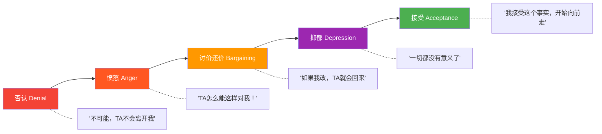
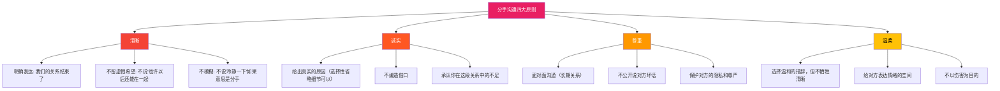
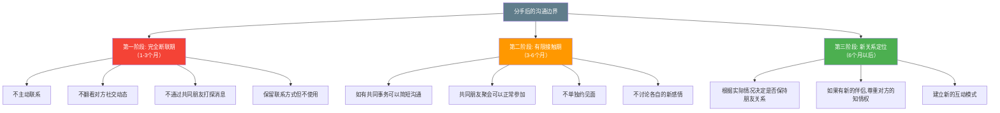

## 场景五：分手——"我觉得我们不合适"

> "分手是两个人之间最后的、也是最重要的一次对话。它决定了你们是以互相伤害还是互相尊重的方式告别。"

分手不是一段关系的"失败"，而是一种清醒的、负责任的选择。当两个人的核心方向不再一致，继续纠缠只会消耗彼此的生命。但如何分手——用什么方式、在什么时机、说什么话——直接决定了这场告别是双方成长的起点，还是长期心理创伤的源头。

### 5.1 场景全景还原

小吴和小杨交往两年了。两人最初因为共同的摄影爱好走到一起，热恋期时觉得彼此是天造地设的一对。但随着关系深入，差异开始浮现——小吴想回老家成都发展，小杨坚持留在北京；小吴希望三十岁前结婚生子，小杨觉得还不到时候；小吴崇尚极简生活、每月精打细算，小杨习惯月光消费、享受当下。

这些分歧不是突然出现的，而是经过了无数次小摩擦、几次大争吵后，小吴慢慢看清的现实。他不是不爱小杨了，而是越来越清楚地意识到：继续走下去，两个人只会越来越痛苦。

小吴想提出分手，但困难重重：小杨最近工作压力很大，他不忍心在这个时候雪上加霜；小杨一直很投入这段感情，上周还在朋友圈发了两人的合照配文"谢谢你一直在"；而且小吴自己的父母也很喜欢小杨，觉得她"条件不错，别挑了"。

小吴在开口之前反复纠结了一个月，期间对小杨的态度变得忽冷忽热——有时因为愧疚对她格外好，有时因为心里的决定而下意识疏远。小杨隐约感觉到了变化，但以为是工作压力导致的，试图通过更主动的关心来修复，这让小吴更加痛苦和内疚。

**这个场景之所以典型，是因为它浓缩了分手中最常见的三个困境：**

| 困境 | 具体表现 | 为什么难 |
|------|---------|---------|
| **时机困境** | 对方正在经历困难时期 | "现在说是不是太残忍？"但永远没有"好时机" |
| **外部压力** | 父母喜欢、朋友看好 | 社会关系网络构成隐性约束 |
| **行为矛盾** | 忽冷忽热、疏远又愧疚 | 内心决定和外在行为不一致，反而加重双方痛苦 |

### 5.2 问题深度诊断

分手是所有情感沟通中最复杂、最痛苦、也最需要技巧的场景之一。它不是简单地"说一句话"，而是一个涉及心理学、伦理学、沟通学和人际关系管理的系统工程。

#### 5.2.1 为什么分手如此困难

分手之所以难，不是因为"不知道怎么说"，而是因为多重心理机制同时在起作用：

心理学家丹尼尔·卡尼曼（Daniel Kahneman）在《思考，快与慢》中详细阐述了**损失厌恶**（Loss Aversion）效应：人类大脑对损失的敏感度约为获得的2-2.5倍。这意味着分手时，你失去的痛苦感会远远大于你可能获得的解脱感。这就是为什么很多人在明知关系已经不健康的情况下，仍然迟迟无法做出决定。

**损失厌恶在分手中的具体表现：**

| 你害怕失去的 | 实际情况 | 理性评估 |
|------------|---------|---------|
| 陪伴感 | 害怕一个人的孤独 | 一段不合适的关系比单身更孤独——你在关系里感到的"孤独"往往比真正的独处更痛苦 |
| 已有的生活节奏 | 害怕改变带来的不确定性 | 人对变化的适应能力远超预期，通常3个月内就能建立新的生活节奏 |
| 共同的社交圈 | 害怕分手后朋友疏远 | 真正的朋友不会因为你的感情状态而疏远你 |
| 投入的时间和精力 | "我已经付出两年了" | 再付出两年，沉没成本只会更大，而且回报不会变 |
| 对未来的恐惧 | "我还能找到更好的人吗" | 你不是在找"更好的人"，而是在找"更适合的人"——这比维持一段不合适的关系容易得多 |

#### 5.2.2 分手前的决策模型

分手不是一个冲动的决定，而应该是一个经过系统评估的理性判断。以下是三个互补的决策框架：

**框架一：核心价值观兼容度评估**

| 评估维度 | 问题 | 权重 | 评分标准 |
|---------|------|------|---------|
| **生活愿景** | 未来5-10年你们想去哪里、过什么样的生活？ | 极高 | 完全一致=5分，部分重叠=3分，根本冲突=1分 |
| **生育观念** | 要不要孩子、什么时候要、怎么教育？ | 极高 | 同上 |
| **金钱观** | 储蓄vs消费、财务目标、谁管钱？ | 高 | 同上 |
| **家庭关系** | 与各自原生家庭的关系模式、过年去谁家？ | 高 | 同上 |
| **生活方式** | 社交vs宅、运动vs静、整洁vs随意？ | 中 | 同上 |
| **亲密需求** | 情感表达方式、性需求、独处需求？ | 中 | 同上 |

**评分解读：**
- 总分 25-30：核心兼容度高，问题可能是沟通方式而非根本不兼容
- 总分 18-24：有分歧但可以协商，建议先尝试深度沟通和专业咨询
- 总分 10-17：存在根本性分歧，继续下去双方都会越来越痛苦
- 总分 6-9：严重不兼容，分手是对双方负责的选择

**框架二："继续还是离开"的决策树**

**框架三："六个月后测试"**

闭上眼睛，想象六个月后的自己：
- 如果你选择继续在一起——你是否能真诚地感到快乐，还是只是"习惯了"？
- 如果你选择分手——你是否感到一种解脱，还是深深的后悔？

这个测试帮助你绕过理性的过度分析，直接触摸内心真实的感受。通常，你的第一反应（在理性介入之前的那个瞬间的感觉）就是最接近真实答案的。

**额外测试：身体信号检查**

理性分析有时候会被"想太多"干扰。身体的反应往往更诚实：
- 当你想象和对方结婚时，你的身体是放松还是紧绷？
- 当对方打电话来时，你是期待还是有负担感？
- 当你想象"永远这样下去"时，呼吸是深长还是短促？

这些身体信号不是决定性的，但可以作为理性分析的补充参考。

#### 5.2.3 小吴的决策分析

回到小吴的情况，用三个框架来评估：

**核心价值观兼容度评估：**

| 维度 | 现状 | 评分 |
|------|------|------|
| 生活愿景 | 小吴回成都 vs 小杨留北京——根本冲突 | 1分 |
| 生育观念 | 小吴想30前结婚生子 vs 小杨觉得不到时候 | 2分 |
| 金钱观 | 小吴极简节俭 vs 小杨月光享受 | 2分 |
| 家庭关系 | 尚未深入讨论 | 待评估 |
| 生活方式 | 有差异但非根本 | 3分 |
| 亲密需求 | 未详细描述 | 待评估 |

已评估的四项总分8分，落在"严重不兼容"区间。三个维度中有两个是"极高权重"的生活愿景和生育观念，这意味着即使生活方式可以磨合，核心方向上的分歧也很难靠沟通解决。

**决策树分析：**小吴经过"深思熟虑"说明他已经反复评估过这些问题，不是一时冲动。他意识到的是根本性的价值观差异，而非可以通过行为改变解决的具体问题。

**六个月后测试：**继续在一起 = 更多关于"在哪里生活""什么时候结婚"的拉锯战，双方都会疲惫；分手 = 虽然短期痛苦，但双方都有机会找到方向一致的伴侣。

**结论：**分手是合理的、负责任的决定。问题不在于"该不该分"，而在于"怎么分"。

#### 5.2.4 分手的心理学原理：依恋系统的断裂

分手之所以痛苦到接近生理疼痛的程度，是因为它触发了依恋系统的断裂反应。约翰·鲍尔比（John Bowlby）的依恋理论指出，人类从婴儿期开始就依赖"安全基地"（Secure Base）来探索世界。在成人亲密关系中，伴侣就扮演了"安全基地"的角色。

当分手发生时，大脑会将其解读为"安全基地的丧失"，触发一系列应激反应：

神经科学研究进一步证实，分手后大脑的活动模式与戒断成瘾物质高度相似。关系中的亲密互动（拥抱、亲吻、深度对话）会大量释放多巴胺和催产素，形成"情感成瘾"。分手相当于突然切断了这条奖赏通路，大脑会产生类似戒断的反应——焦虑、渴望、注意力无法集中。

**神经化学层面的分手"戒断"反应：**

| 神经化学物质 | 恋爱期间的作用 | 分手后的变化 | 具体感受 |
|------------|-------------|------------|---------|
| **多巴胺** | 亲密互动时大量释放，产生愉悦感和动机 | 奖赏通路被切断，多巴胺水平骤降 | 空虚、无聊、对什么都提不起兴趣 |
| **催产素** | 拥抱、亲吻、亲密接触时释放，增强依恋感 | 来源消失，身体渴望"补充" | 强烈的肢体渴望，想要被拥抱的冲动 |
| **皮质醇** | 正常关系中处于低水平 | 应激反应激活，皮质醇长期升高 | 焦虑、失眠、食欲变化、免疫力下降 |
| **血清素** | 稳定的亲密关系维持正常水平 | 水平下降，类似抑郁症患者的神经化学状态 | 情绪低落、反复回忆、注意力难以集中 |

理解这一点非常重要：**分手后的痛苦不是"矫情"，而是有真实的神经生物学基础的。** 无论是提出分手的一方还是被分手的一方，都需要给大脑足够的时间来重新建立没有对方的奖赏回路。

#### 5.2.5 常见的错误分手方式及其伤害分析

分手沟通中的错误不仅会造成当下的痛苦，还会对双方的长期心理健康产生深远影响。以下是六种最常见的错误方式，以及它们为什么是错误的：

| 错误方式 | 具体表现 | 对被分手方的伤害 | 对提出方的后果 | 心理学解释 |
|---------|---------|---------------|---------------|----------|
| **拖泥带水** | 明明已经决定了，却因为不忍心而拖延数周甚至数月 | 被拖延期间对方会感受到你的疏远，产生焦虑和自我怀疑；最终分手时对方会问"你到底骗了我多久？" | 自己也陷入痛苦的煎熬中，消耗大量情绪能量 | 拖延的本质是提出方在逃避"造成痛苦"的罪恶感，但这种逃避实际上加重了双方的痛苦 |
| **过于突然** | 没有任何铺垫，前一天还好好的，突然提分手 | 被分手方完全没有心理准备，会经历严重的认知失调——"前一天还说爱我，今天就分手？"可能导致创伤反应 | 对方可能无法接受，反复纠缠、要求"给个说法" | 突然的丧失比渐进的丧失更难被大脑处理，缺乏预兆的分离会激活更强烈的依恋抗议反应 |
| **过度指责** | 把分手原因全部归结为对方的问题——"都是因为你太作了""你从来不关心我" | 被分手方不仅承受失去关系的痛苦，还承受了"全是我的错"的自责，严重影响自我价值感 | 可能引发激烈的防御和反击，对话升级为互相攻击 | 防御性归因（把问题推给对方）可以暂时缓解提出方的内疚，但会把心理伤害转嫁给对方 |
| **模糊不清** | 说"我们需要冷静一下""也许分开一段时间比较好"，但实际想的是彻底分手 | 被分手方会抱着"还有希望"的幻想，反复等待、反复失望，痛苦期被大幅延长 | 自己以为"温柔地留了余地"，实际上是在用模糊来逃避做出明确决定的责任 | 模糊的分手是一种"软拒绝"，它保护的是提出方的面子和良心，而不是被分手方的感受 |
| **通过消息分手** | 用短信、微信、电话分手，避免面对面沟通 | 被分手方会感到被轻视——"连当面跟我说的尊重都不给我"，伤害自尊 | 在长期关系中，消息分手会被视为严重的不尊重，可能影响社会评价 | 消息分手的本质是提出方在逃避目睹对方痛苦的"共情负担"，但这种逃避本身就是一种伤害 |
| **公开场合分手** | 在餐厅、聚会、甚至朋友面前提出分手 | 被分手方被置于公开羞辱的境地，无法自由地表达情绪 | 虽然可能觉得"在公共场合对方不会闹"，但这种"策略性选择"本身就是不真诚的 | 利用社交场景的压力来限制对方的反应，是一种隐性的控制行为 |

#### 5.2.6 依恋风格对分手行为的影响

回顾本章理论基础中提到的依恋理论，不同依恋风格的人在分手场景中的行为模式和心理需求截然不同：

| 依恋风格 | 提出分手时的典型行为 | 被分手时的典型反应 | 分手后的恢复模式 |
|---------|-------------------|------------------|----------------|
| **安全型** | 直接、诚实、尊重地表达，给予对方解释和回应的空间 | 虽然痛苦但能接受，不会过度纠缠也不会完全封闭 | 有健康的哀悼过程，通常在3-6个月后基本恢复 |
| **焦虑型** | 反复纠结、多次"差点说出口"又收回，可能在情绪崩溃时冲动提出 | 极度痛苦，反复联系对方试图挽回，可能出现"跟踪"行为 | 恢复期最长（6-12个月），容易在新关系中"替代性依赖" |
| **回避型** | 在内心默默"关门"，外在表现为逐渐疏远，最终"平静地"宣布决定 | 表面看起来没事，迅速投入工作或新活动，但压抑的情绪可能在数月后爆发 | 看似恢复最快，但如果没有真正处理依恋断裂，会影响未来的关系模式 |
| **混乱型** | 行为矛盾——今天说分手，明天又说和好；或分手方式极具戏剧性 | 情绪反应剧烈且不可预测，可能从痛哭转为愤怒再转为挽留 | 恢复过程反复，需要专业帮助才能形成健康的依恋模式 |

**关键洞察：**了解自己和对方的依恋风格，可以帮你预判分手过程中可能出现的行为模式，从而提前准备应对策略。例如，如果你知道对方是焦虑型依恋者，就需要做好分手后对方会反复联系的心理准备，并提前想好如何温柔但坚定地维持边界。

#### 5.2.7 库伯勒-罗斯哀伤五阶段模型在分手中的应用

伊丽莎白·库伯勒-罗斯（Elisabeth Kübler-Ross）提出的哀伤五阶段模型，虽然最初是为描述临终心理过程而设计的，但同样适用于分手后的心理恢复。理解这些阶段可以帮助你判断自己或对方处于什么状态，以及什么是正常反应：

**每个阶段在分手中的具体表现：**

| 阶段 | 典型想法 | 典型行为 | 持续时间 | 健康的应对方式 |
|------|---------|---------|---------|-------------|
| **否认** | "TA只是在气头上""过几天就好了""TA会回来的" | 照常给对方发消息、保持恋爱习惯、拒绝告诉朋友分手的事 | 通常1-2周 | 允许自己暂时不愿接受，但开始告诉信任的朋友 |
| **愤怒** | "TA怎么可以这样？""我付出了那么多，换来这个？" | 跟朋友控诉对方、发朋友圈暗示、翻旧账找对方理论 | 2-4周 | 找安全的渠道发泄（运动、写日记、跟朋友倾诉），但不要在愤怒中联系对方 |
| **讨价还价** | "如果我改掉那个毛病呢？""我们可以再试试吗？" | 反复合联对方承诺改变、展示自己的"进步"、找中间人说和 | 1-3个月 | 承认这个阶段的冲动，但不要付诸行动。写下你的"承诺"，一周后再看——你通常会发现那不是理性的 |
| **抑郁** | "我再也不会遇到这样的人了""我是不是根本不值得被爱" | 社交退缩、失眠或嗜睡、食欲变化、对日常活动失去兴趣 | 1-3个月 | 允许自己悲伤，但保持基本的生活结构——吃饭、睡觉、上班。如果超过3个月严重影响生活功能，寻求专业帮助 |
| **接受** | "这段关系结束了，但它教会了我很多""我可以继续往前走" | 不再频繁想起对方、可以平静地提起这段关系、开始规划新的生活 | 逐步到来 | 不要催促自己"快点好起来"，接受是一个自然的过程，不是deadline |

**重要提醒：这五个阶段不是线性的。** 你可能在"接受"之后又回到"愤怒"，在"抑郁"中突然出现短暂的"否认"。这种波动是完全正常的。不要因为"我怎么又想TA了"而否定自己之前的恢复。

### 5.3 分手前的准备工作

分手不是一时冲动的"我要说出口了"，而是一个需要系统准备的过程。充分的准备可以让分手过程中的伤害降到最低。

#### 5.3.1 情感准备：处理好你自己的情绪

在开口之前，你必须先处理好自己的情绪。带着未处理的情绪去分手，很容易出现以下情况：

- **带着愤怒分手**：变成指责和攻击
- **带着内疚分手**：变得模糊不清、给出虚假希望
- **带着悲伤分手**：自己先崩溃，变成对方安慰你
- **带着焦虑分手**：说得太快、太急，对方来不及消化

**情感准备清单：**

分手前的情感准备（建议在开口前1-2周完成）:
├── 自我确认
│   ├── 这个决定是我深思熟虑的结果，不是一时冲动
│   ├── 我已经用决策模型评估过，分手是对双方负责的选择
│   └── 我接受分手会带来痛苦——对我自己和对方都是
│
├── 情绪处理
│   ├── 找一个信任的朋友或心理咨询师倾诉你的纠结和内疚
│   ├── 写一封给自己的信，把所有感受写下来（不会给对方看）
│   ├── 允许自己为这段关系的结束感到悲伤——分手的人也有权悲伤
│   └── 不要在情绪最低谷时提出分手——选择一个你相对平静的时刻
│
├── 认知准备
│   ├── 接受"我无法控制对方的反应"——对方有权愤怒、悲伤、质问
│   ├── 准备好面对"你是不是有别人了"等质疑——想好如何回应
│   ├── 提前告诉自己：内疚是正常的，但内疚不应该改变决定
│   └── 理解"温柔不等于模糊"——你可以善良，但必须清晰
│
└── 实际准备
    ├── 选择合适的时间（避开对方的重要日期、压力大的时期）
    ├── 选择私密的地点（对方可以自由表达情绪）
    ├── 确保有充足的时间（不要在赶着上班前说）
    └── 如果同居，提前考虑分手后的住所安排

#### 5.3.2 理由准备：想清楚"为什么"

分手理由不需要"说服"对方同意——分手不需要双方一致同意。但你需要一个清晰的、诚实的、对自己和对方都有交代的理由。

**好的分手理由 vs 坏的分手理由：**

| 类别 | 好的理由 | 坏的理由 |
|------|---------|---------|
| **聚焦于关系** | "我们在核心价值观上有根本差异" | "你这个人太差了" |
| **聚焦于不兼容** | "我们对未来的规划不一致" | "你不够好/不够优秀" |
| **承认双方责任** | "我们都有努力过，但方向不同" | "都是你不好/都是我不好" |
| **诚实但有分寸** | "我对你的感情已经从爱情变成了亲情" | "我从来没爱过你"（即使是真的，这句话的伤害也远超必要） |
| **指向未来** | "我们各自去找方向更一致的人，对彼此都更好" | "你以后别再找我了" |

**关于"借口理由"的讨论：**

有些人会选择一个"伤害更小"的借口理由，而不是真正的原因。例如，真正的原因是"我不再有感觉了"，但说出口的是"我觉得我们现在应该专注事业"。

**建议是：尽量给出真实理由，但可以选择性地省略细节。** 你可以说"我在感情上已经没有以前那种感觉了"（真实但不具体），而不需要说"我对你完全没有性吸引力了"（真实但过于残忍）。区别在于：借口理由会留有虚假的希望（"等事业稳定了我们还可以在一起"），而真实理由虽然更痛，但能帮助对方接受现实、走向下一步。

#### 5.3.3 对方可能出现的反应及应对预案

分手不是独角戏。你提出分手后，对方的反应是不可完全预测的，但可以提前准备常见的反应模式和应对策略：

| 反应类型 | 典型表现 | 应对策略 | 注意事项 |
|---------|---------|---------|---------|
| **震惊与否认** | "你在开玩笑吧？""不可能，你昨天还说爱我" | 保持平静，重复你的决定。"我知道这很难接受，但我确实经过了很长时间的考虑" | 不要因为对方的否认而动摇——如果你已经决定了，保持一致性 |
| **愤怒与攻击** | "你太过分了！""我为你付出了那么多，你就这样对我？" | 不要反击。"你有权利生气，我理解你的感受" | 不要被激怒进入互相攻击模式——你来这里不是为了吵架 |
| **恳求与挽留** | "我可以改""你说什么我都愿意做""给我最后一次机会" | 温柔但坚定。"我理解你不想分开，但这个决定我已经考虑了很久" | 最危险的反应——内疚最容易让你动摇。提醒自己：你现在心软留下来的后果是未来更大的痛苦 |
| **沉默与退缩** | 不说话、流泪、目光空洞 | 给对方时间。"你不用现在说什么，如果你想一个人待一会儿，我理解" | 沉默不等于接受——对方可能需要几天才能真正反应过来 |
| **反向合理化** | "其实我也早就想分了""我们确实不合适" | 接受对方的自尊保护。不要说"那你为什么不早提" | 这是被分手方保护自尊的方式，不需要纠正 |
| **威胁与要挟** | "你敢分手我就……"（自杀威胁、公开隐私、报复） | 最需要重视的反应。认真对待威胁，必要时联系对方家人或专业人员 | 即使威胁是情绪性的，也不能忽视。如果你感到安全受到威胁，优先保护自己 |

### 5.4 沟通策略：分手对话的完整框架

#### 5.4.1 核心原则：诚实、尊重、清晰、温柔

这四个原则的优先级是**清晰 > 诚实 > 尊重 > 温柔**。为什么"清晰"排在第一位？因为：

- 不清晰的分手是最大的残忍——它让对方悬在"到底分没分"的不确定中，无法开始哀悼和恢复
- 你可以不够温柔（分手本身就不是温柔的事），但你必须足够清晰
- "我觉得我们应该分开"比"也许我们需要冷静一下"好一万倍

#### 5.4.2 分手对话的五步结构

一次完整的分手对话包含五个步骤。这不是一个死板的脚本，而是一个框架——你可以根据具体情况调整顺序和措辞，但核心要素不能少。

**第一步：铺垫——让对方进入"认真谈话"模式**

铺垫的目的是防止"突袭效应"——如果毫无征兆地说"我们分手吧"，对方会经历严重的认知冲击，导致后续对话无法正常进行。

> "小杨，我有件事想跟你认真谈谈。这件事我想了很久，今天才决定跟你说。"

**设计解析：**
- "认真谈谈"——信号词，让对方知道接下来的对话不是日常闲聊
- "想了很久"——告诉对方这不是一时冲动，是深思熟虑的决定
- 不要在铺垫阶段直接说"我们分手吧"——给对方一个心理缓冲

**铺垫的变体示例（根据不同场景）：**

| 场景 | 铺垫措辞 | 设计考量 |
|------|---------|---------|
| 对方最近压力大 | "我知道你最近工作很忙，但我有一件关于我们俩的事必须跟你说" | 既承认对方的处境，又不因为"怕打扰"而无限拖延 |
| 对方正沉浸在幸福中 | "我很珍惜我们在一起的时光，但我也想跟你说一些我心里的话" | 为即将到来的转折做心理准备 |
| 对方性格敏感 | "我想跟你聊一件重要的事，可能不太舒服，但我觉得你有权知道我的真实想法" | 提前预告"可能不舒服"，降低冲击 |

**第二步：肯定与感谢——承认这段关系的价值**

在说出分手决定之前，先肯定这段关系中美好的部分。这不是虚伪的客套，而是：
- 帮助对方在分手后能够保留关于这段关系的正面记忆
- 表达你对这段关系的真实感受——你不是因为"不珍惜"才分手的
- 为接下来的"坏消息"做一个情感上的过渡

> "这两年你给了我很多美好的回忆。我记得你生日那天给我准备的惊喜，记得我们一起去青海湖时你笑得那么开心，记得我生病时你请假来照顾我。这些我都记在心里，也很感激你对我的付出和用心。"

**设计解析：**
- 用**具体回忆**而非抽象感谢——"你生日那天"比"你对我很好"更有力量
- 展示这些回忆是**真实的**，不是分手前的敷衍
- 为对方在这段关系中的付出给予**正式的认可**

**第三步：诚实说明原因——聚焦于"不合适"而非"你不好"**

这是分手对话中最关键的部分。你的目标是：**让对方理解分手的原因，但不觉得"全是我的错"。**

> "但我也越来越清楚地感受到，我们在一些核心的事情上——比如未来在哪里生活、要不要孩子、怎么看待钱——有很多不同的想法。这些问题我反复想过很多次，我不觉得这是谁的错，也不是谁'应该'改变的问题。只是我们的方向确实不同，继续走下去对我们两个都不公平。"

**设计解析：**
- "核心的事情"——区分核心分歧和日常摩擦，告诉对方这不是因为小事
- "不觉得这是谁的错"——把问题定性为"不兼容"而非"你的问题"
- "方向不同"——用方向性的语言而非人格性的语言
- "继续下去不公平"——既是对自己的公平，也是对对方的公平

**需要避免的表述：**

| 应该避免的说法 | 为什么不好 | 更好的替代 |
|--------------|----------|----------|
| "你从来不考虑我的感受" | 指责对方人格 | "我们在情感需求上的差异太大" |
| "我觉得你不够成熟" | 对对方做价值判断 | "我们现阶段的人生目标不一致" |
| "我对你已经没有感觉了" | 过于直接的残忍 | "我对你的感情发生了变化，不再是从前那种恋人之间的感觉了" |
| "我遇到更合适的人了" | 即使是真的，这会造成最大的伤害 | 不需要提及第三方，分手是两个人之间的事 |
| "也许以后我们还有机会" | 给出虚假希望 | 不要说——除非你是认真的 |

**第四步：清晰表达决定——温柔但不模糊**

> "所以我想了很久，决定我们应该分手。我知道这三个字很重，但我不能继续假装一切都好。"

**设计解析：**
- 直接说出"分手"这个词——不要用"分开""冷静""暂停"来替代
- "不能继续假装一切都好"——解释为什么现在提出（之前的犹豫是因为不忍心）
- 这句话说完之后，停下来。让对方消化。不要急着继续说。

**说完"分手"之后的沉默处理：**

很多人在说出"分手"后，因为无法忍受沉默而开始慌乱地补充解释、道歉、或者给出承诺。这是需要控制的。说出决定之后的沉默是必要的——对方需要时间来消化这个信息。通常等待30秒到1分钟。如果对方没有回应，可以轻声说："我知道这很难接受，你想说什么都可以。"

**第五步：给予回应空间与后续安排**

> "我知道这对你来说一定很难接受。你有权利生气、难过、质问我。你想说什么都可以，我会认真听。"

然后，在对方的情绪反应过后（可能是几分钟，也可能需要更长时间），补充后续安排：

> "关于之后的事情——你的东西我会整理好给你，你放在我这里的钥匙我周末前还给你。我不希望我们变成互相伤害的人。如果你需要时间和空间，我完全理解。"

**设计解析：**
- 给予情绪表达的许可——"你有权生气、难过"
- 承诺倾听——"我会认真听"
- 处理实际事务——同居物品、共同财产、共同朋友圈
- 设定边界——"我不希望互相伤害"

#### 5.4.3 完整脚本：小吴的分手对话

把五个步骤整合起来，以下是小吴的完整分手对话脚本：

> **小吴：** "小杨，我有件事想跟你认真谈谈。这件事我想了很久，今天才鼓起勇气跟你说。"
>
> （小杨可能会感到不安，问"怎么了"）
>
> **小吴：** "这两年你给了我很多美好的回忆。我记得你生日那天给我准备的惊喜，记得我们一起去青海湖时你笑得那么开心，记得我生病时你请假来照顾我。这些我都记在心里，也很感激你对我的付出和用心。"
>
> （停顿，给对方时间消化）
>
> **小吴：** "但我也越来越清楚地感受到，我们在一些核心的事情上——比如未来在哪里生活、要不要孩子、怎么看待钱——有很多不同的想法。这些问题我反复想过很多次，我不觉得这是谁的错，也不是谁'应该'改变的问题。只是我们的方向确实不同，继续走下去对我们两个都不公平。"
>
> （观察对方反应，给对方回应的机会）
>
> **小吴：** "所以我想了很久，决定我们应该分手。我知道这三个字很重，但我不能继续假装一切都好。你有权利生气、难过、质问我。你想说什么都可以，我会认真听。"
>
> （让对方充分表达情绪。不打断，不辩解，不翻旧账）
>
> （在对方的情绪稍微平复后）
>
> **小吴：** "关于之后的事情，你的东西我会整理好给你。如果你需要时间和空间，我完全理解。我不希望我们变成互相伤害的人——这两年的感情值得一个体面的结束。"

#### 5.4.4 不同依恋风格对方的对话调整

同一个分手决定，面对不同依恋风格的对方，你的沟通策略需要调整：

**面对焦虑型依恋者：**

焦虑型的人在被分手时会经历最剧烈的情绪反应。他们可能会反复联系、试图挽回、或者以各种方式重新进入你的生活。分手对话中需要特别注意：

> 额外强调： "这个决定不是因为你不够好。你是我见过的最好的人之一，但我们在方向上不一致。这不是你的错。"
>
> 额外承诺： "分手后如果你想打电话聊聊，前几天可以打给我。但我也希望你开始慢慢建立没有我的生活。"
>
> 额外边界： "我理解你会很难过，如果你需要找人倾诉，可以找你的好朋友XX。但我不建议我们每天联系——那样我们两个都走不出来。"

**面对回避型依恋者：**

回避型的人在被分手时表面上看起来很平静，甚至可能会说"我也觉得我们不合适"。不要把这种平静误读为"TA不在乎"。

> 不要说： "你怎么这么冷静？你是不是根本没爱过我？"
>
> 要做： 正常走完五步结构，不必因为对方的冷静而觉得"没说好"而反复补充。

**面对混乱型依恋者：**

混乱型的人情绪反应最不可预测，可能在几分钟内经历愤怒-哭泣-挽留-攻击的循环。保持你的框架，不要被带入情绪漩涡。

> 核心策略： 无论对方表现出什么情绪，都用平静的语气重复："我理解你的感受，但我的决定不会改变。"

#### 5.4.5 被分手方的回应指南

如果你是被分手的一方（小杨），尽管内心很痛，以下策略可以帮助你保护自己的尊严和心理健康：

**即时反应（分手对话中）：**

> "我很震惊，也很伤心。我需要时间消化这件事。我现在可能没法完全理性地谈，但我想知道——你是从什么时候开始有这个想法的？"

**这段回应的设计：**
- "很震惊，也很伤心"——诚实地表达感受，不假装没事
- "需要时间消化"——给自己争取缓冲时间，不在最脆弱的时刻做决定
- "从什么时候开始"——了解时间线可以帮助你理解发生了什么
- 不说"你不能这样对我"——虽然情绪上想说，但会降低你的格局

**如果对方坚持分手：**

> "好吧，我尊重你的决定，虽然我很难过。这两年我也有做得不好的地方，谢谢你陪我走了这一段。"

**这段回应的设计：**
- "尊重你的决定"——保留自己的尊严，不纠缠
- "虽然很难过"——诚实，但不崩溃
- "也有做得不好的地方"——展现成熟度，不把所有责任推给对方
- "谢谢陪伴"——为这段关系画上一个有尊严的句号

**绝对不要在分手对话中做的事：**

1. **不要威胁**——"你敢分手我就死给你看"——这是情感勒索，即使成功留住了对方，留下的也是一个充满恐惧的关系
2. **不要翻旧账**——"你还好意思说，你当初……"——这只会让对话变成互相攻击
3. **不要乞求**——"我求求你不要离开我"——你可以表达悲伤，但不要放弃尊严
4. **不要试图用性来挽回**——"我们再试最后一次"——这延迟了痛苦，没有解决问题
5. **不要立刻同意然后反悔**——说"好吧"之后又发消息"你再想想"——反复拉扯会加重双方的痛苦

#### 5.4.6 特殊表达方式：分手信模板

有些情况下面对面分手不是最佳选择（例如异地恋、对方有暴力倾向、多次当面沟通失败），一封结构良好的分手信可以作为替代。分手信的核心原则与面对面分手相同——清晰、诚实、尊重、温柔——但需要更注重文字的措辞。

**分手信模板：**

[对方的名字]：

这封信我想了很久才决定写。有些话当面说可能我们都会情绪失控，
所以我选择用文字来表达——不是为了逃避，而是为了确保我能把
想说的话说清楚。

[肯定部分：具体的美好回忆]
这两年里，你给我带来了很多珍贵的记忆。
[举1-2个具体例子]

[感谢部分：承认对方的付出]
我很感激你对这段感情的付出和用心。

[原因部分：聚焦不兼容]
但我也必须诚实地告诉你，在一些对我们未来影响很大的事情上——
[具体说明1-2个核心分歧]——我们的想法很不一样。
我反复想过很多次，这些不是谁对谁错的问题，
而是我们想要的生活方向不同。

[决定部分：清晰明确]
所以，我认为我们应该分手。
这不是一时冲动，而是我认真考虑后的决定。

[回应空间]
你可能会觉得突然，也可能需要时间消化。
你可以随时联系我，我会回应你。

[后续安排]
[具体的物品归还、共同事务处理等]

谢谢你这两年的陪伴。祝你一切都好。

[你的名字]
[日期]

**使用分手信的注意事项：**
- 分手信只适用于当面沟通确实不可行的情况，不要因为"当面说太难"就选择写信——如果只是因为怯懦而选择间接方式，这不是好理由
- 写好后，至少隔一天再发送，让自己冷静后再读一遍
- 不要通过社交媒体公开发——这是私人的事
- 发送后，给对方反应的时间，不要紧接着发消息追问"你看到了吗"

### 5.5 分手后的沟通管理

分手对话结束后，真正的考验才开始。如何处理分手后的沟通边界，直接影响双方的恢复速度和心理健康。

#### 5.5.1 分手后的沟通边界设定

**为什么"完全断联"是第一阶段的默认选择？**

很多人觉得"我们还是朋友"所以可以继续联系。但心理学研究表明，分手后立即保持密切联系会显著延长双方的恢复期。原因是：

1. **依恋回路没有被切断**——每次联系都会重新激活大脑的依恋系统，相当于不断撕开刚结痂的伤口
2. **模糊了关系边界**——"我们到底算什么？"这种不确定感比明确的分手更折磨人
3. **阻碍了新关系的建立**——你无法在心里同时放下一个人和接受一个新的人
4. **可能退回到"舒适区"**——因为习惯而复合，而非因为真正解决了问题

**断联期的具体实操指南：**

| 操作 | 具体做法 | 心理学原理 |
|------|---------|----------|
| **手机号** | 不删，但把对方从"特别关注"中移除，关闭消息通知 | 减少"触发信号"——每次手机亮起都可能激活依恋回路 |
| **微信** | 不建议删除好友（可能后悔），但屏蔽朋友圈、取消置顶 | 物理层面减少接触机会，降低意志力的消耗 |
| **共同物品** | 把对方送的礼物收到箱子里，不丢弃但放到看不到的地方 | 不需要"决绝地清除一切"——那些是真实的人生记忆，等情绪平复后再处理 |
| **共同照片** | 归档到单独文件夹，不主动翻看但也不删 | 删除可能在情绪平复后后悔 |
| **对方常去的地方** | 短期内避开——不是永远不去，而是前1-2个月不去 | 避免"偶遇"的诱惑，减少触发情绪的环境线索 |
| **共同朋友** | 告诉亲密朋友"我和XX分手了，和平分手，不用选边" | 获得支持系统，同时阻止朋友成为传声筒 |

**关于社交媒体的处理建议：**

| 操作 | 建议 | 原因 |
|------|------|------|
| 删除好友/取关 | 不强制，但建议屏蔽动态 | 完全删除可能显得决绝，但看到对方动态会阻碍恢复 |
| 删除聊天记录 | 建议归档而非删除 | 删除可能在情绪平复后后悔；归档后不主动翻看即可 |
| 删除合照 | 不急于处理 | 等情绪平复后再决定——那些是真实的人生记忆 |
| 发朋友圈"暗示" | 不要 | 无论暗示什么，都会让对方（和你的朋友们）感到不适 |
| 通过朋友传话 | 不要 | 这是把共同朋友卷入你们的私事 |

#### 5.5.2 分手后的情绪恢复时间线

分手后的心理恢复不是一条直线，而是一个波动的过程。了解正常的时间线可以帮助你判断自己的恢复状态：

| 时间段 | 正常的情绪反应 | 需要警惕的信号 |
|--------|--------------|---------------|
| **第1-2周** | 强烈的悲伤、失眠、食欲变化、反复回忆、无法集中注意力 | 出现自我伤害的想法或行为 |
| **第2-4周** | 情绪波动——有时觉得"我没事了"，有时突然崩溃 | 完全无法上班/上学，或开始酗酒/滥用药物 |
| **第1-3个月** | 逐渐适应没有对方的日常，偶尔还会想对方但不再痛苦 | 持续无法恢复基本的生活功能，或开始跟踪/骚扰对方 |
| **第3-6个月** | 可以正常生活和社交，偶尔想起会有淡淡的遗憾 | 在新关系中完全复制旧关系的模式，或完全封闭自己 |
| **第6个月以后** | 基本恢复，可以把这段关系当作人生经历来回顾 | 对亲密关系产生持久的恐惧或不信任 |

**如果超过3个月仍然无法正常生活，建议寻求专业心理咨询。** 这不是软弱，而是对自己负责。分手后的抑郁状态是真实的心理健康问题，需要被认真对待。

**不同依恋风格的恢复差异：**

| 依恋风格 | 平均恢复期 | 恢复中的典型陷阱 | 需要特别注意的事项 |
|---------|----------|----------------|-----------------|
| **安全型** | 3-6个月 | 偶尔的"如果当初"反事实思维 | 正常恢复，不需要特别干预 |
| **焦虑型** | 6-12个月 | 反复合联前任、急于找"替代品"、过度自我否定 | 建议写"分手原因清单"随时提醒自己；避免在1年内进入新关系 |
| **回避型** | 表面1-3个月，实际可能更长 | 表面上"没事"但压抑的情绪可能在数月后爆发 | 需要主动面对情绪——写日记、跟信任的人倾诉，不要只靠"忙起来"逃避 |
| **混乱型** | 高度不确定 | 情绪反复剧烈波动，可能在痛苦和冷漠之间摇摆 | 强烈建议寻求专业心理咨询，不要试图独自处理 |

#### 5.5.3 分手后常见的情绪陷阱

分手后有一些常见的心理陷阱，如果你能提前识别它们，就能避免很多不必要的反复：

**陷阱一："如果当初我……"的反事实思维**

> "如果当初我多关心她一点就好了""如果我没有说那句话就好了"

**真相：**分手通常不是因为某一个事件，而是长期积累的不兼容。你的反事实思维是在试图找到一个"可控的原因"，因为"我们就是方向不同"这个事实太难让人接受了。但事实就是事实——你无法通过改变某一个细节来改变两个人的根本方向。

**应对：**每当发现自己在做"如果当初"的假设，提醒自己："这是我的大脑在试图逃避'无法改变'的痛苦。"然后把注意力拉回当下。一个实用的技巧：手腕上戴一根皮筋，每次陷入反事实思维就弹一下——用轻微的物理刺激打断思维循环。

**陷阱二：记忆的选择性美化**

分手后，大脑会自动美化你和对方在一起的记忆——只记得好的，忘记不好的。这不是因为你的记忆出了问题，而是因为丧失会激活"玫瑰色回忆"（Rosy Retrospection）效应。

**真相：**你选择分手是有原因的。那些让你做出分手决定的问题——价值观冲突、生活习惯差异、未来方向不同——不会因为记忆的美化而消失。

**应对：**写一份"分手原因清单"。在你最清醒、最理性的时候写下来，保存好。每当你想复合的时候，拿出来看一看。清单应包含：

分手原因清单（在最理性的时刻写下来）:
1. 我们的核心分歧是什么？
2. 这些分歧导致了哪些反复出现的痛苦？
3. 我们沟通过几次？对方的态度和行动是什么？
4. 如果继续在一起，6个月后我会是什么状态？
5. 我分手时最真实的感受是什么？（不是现在美化后的）

**陷阱三：用新恋情"覆盖"旧伤**

很多人分手后急于开始新的关系，希望用新的亲密关系来填补分手后的空虚。

**真相：**这被称为"反弹关系"（Rebound Relationship），心理学研究表明它几乎从来没有好结果。原因有二：第一，你没有给自己足够的时间去哀悼和处理上一段关系的情感残留；第二，你在空虚状态下的择偶判断会严重失准。

**建议：**至少给自己3-6个月的单身时间。不是说要"等到完全好了再找"（你可能永远觉得自己没完全好），而是要等到你能客观地评估一段新关系，而不只是在寻找"替代品"。

**判断标准：**如果你对新伴侣的好感主要来自"TA让我感觉不那么孤独了"，而不是"TA本身很有吸引力"——这就是反弹关系的信号。

**陷阱四："偶遇"和"巧合"**

分手后"不小心"走到对方常去的咖啡店，"恰好"出现在对方的活动区域，"无意中"点了对方的朋友圈赞。

**真相：**这些都不是巧合。你在潜意识中制造接触机会，希望"自然而然地"重新进入对方的生活。

**应对：**对自己诚实——如果你发现自己在"制造偶遇"，说明你还没有真正接受分手。允许自己承认"我还想TA"，但不要让这个想法变成行动。

**陷阱五：深夜的冲动联系**

晚上10点到凌晨2点是分手后最危险的时段。白天你可能很理性，但到了深夜，孤独感、回忆、酒精（如果喝了的话）会一起上阵，让你产生"给TA发条消息"的冲动。

**应对策略：**
- 把对方的微信聊天置底或者存到通讯录的最后面，增加找到TA的难度
- 设置一个规则：晚上10点之后不看手机，或者把手机放到另一个房间充电
- 如果真的忍不住，先把想说的话写在备忘录里，第二天早上再看——大多数情况下你会庆幸自己没发出去
- 找一个信任的朋友约定：每次你想联系前任的时候，先给TA发消息

### 5.6 不同场景的分手策略

分手不只是"情侣关系的终结"——不同的关系状态、不同的持续时间、不同的背景因素，需要不同的策略。

#### 5.6.1 短期关系（3个月以内）的分手

短期关系的分手不需要像长期关系那样正式和郑重，但同样需要尊重：

- **可以接受用消息分手**——但至少是语音消息或电话，不是冷冰冰的文字
- **不需要长篇的铺垫和感谢**——但需要明确表达分手决定
- **关键原则：**不要"ghosting"（直接消失不联系）——这是最不尊重人的方式

**短期关系分手措辞示例：**

> "这段时间跟你相处很开心，但我想诚实地告诉你，我没有办法继续往下走了。这不是你的问题，是我的感觉没有发展到那一步。我希望你找到更适合你的人。"

**短期 vs 长期关系分手的对比：**

| 维度 | 短期关系（<3个月） | 长期关系（>1年） |
|------|------------------|----------------|
| **沟通方式** | 电话/语音消息可接受 | 必须面对面 |
| **铺垫程度** | 简短铺垫即可 | 需要充分的情感过渡 |
| **原因说明** | 简要说明即可 | 需要详细、有说服力的解释 |
| **后续安排** | 几乎没有共同事务 | 可能涉及物品、住所、共同财产 |
| **断联时长** | 2-4周 | 1-3个月 |
| **恢复周期** | 通常1-2个月 | 通常3-6个月甚至更长 |

#### 5.6.2 同居关系的分手

同居关系的分手增加了实际操作的复杂度——你们不只是在感情上分开，还需要在物理空间和日常生活中分开。

**同居分手的额外准备清单：**

同居分手的实际安排:
├── 住所
│   ├── 谁搬走? (通常由提出分手的一方主动搬出, 以示负责)
│   ├── 租约如何处理? (提前和房东沟通, 了解违约条款)
│   ├── 搬家的时间安排 (给对方至少1-2周的缓冲期)
│   └── 搬家期间是否需要暂住朋友家/酒店?
│
├── 财务
│   ├── 共同账户如何处理? (提前分好)
│   ├── 共同的订阅服务 (视频会员、健身房等) 如何分?
│   ├── 大件物品的归属 (电视、冰箱、沙发等)
│   └── 是否有共同债务? (如联名信用卡)
│
├── 物品
│   ├── 各自的私人物品归各自
│   ├── 共同购买的物品协商分配
│   ├── 不要趁对方不在时偷偷搬走自己的东西
│   └── 对方的私人物品不要丢弃或损坏
│
└── 宠物
    ├── 宠物的归属问题 (这可能是最令人心痛的部分)
    ├── 是否有"探视权"的安排?
    └── 以宠物的最大利益为原则做决定

**同居分手的时间线安排：**

| 时间点 | 行动 | 注意事项 |
|--------|------|---------|
| **分手当天** | 说完分手后，如果情绪太激烈可以先去朋友家过夜 | 不要在情绪最激烈的时候讨论财产分配 |
| **第1-3天** | 给彼此空间，但通过简短消息确定"搬家计划"的时间 | 不要在这个阶段重新讨论"要不要分" |
| **第1周** | 各自列出"我的东西"清单，协商大件物品的分配 | 如果有争议，可以约定"先各自拿走自己的，大件的慢慢商量" |
| **第2-4周** | 完成搬家、处理租约、分割共同财务 | 保持事务性的沟通，不要因为处理事务而重新陷入感情对话 |
| **第1个月后** | 所有实际事务处理完毕，进入完全断联期 | 同居分手的断联特别重要——因为你们已经习惯了每天看到对方 |

#### 5.6.3 有共同社交圈的关系分手

共同的朋友圈会增加分手后的尴尬和复杂度。以下是处理原则：

1. **分手后不要在朋友圈"拉帮结派"**——不要试图让朋友选边站
2. **给朋友一个简洁的说明**——"我们分手了，和平分手，你们不用选边"
3. **共同聚会的处理**——如果两人同时出现在聚会上，保持基本礼貌即可，不需要假装亲密也不需要刻意回避
4. **不要通过朋友传话**——有什么话直接跟对方说，不要让朋友当传声筒
5. **如果朋友问起分手原因**——给出简短的、不贬低对方的版本

**给共同朋友的标准话术：**

> "我和XX分手了。这是我们的私事，你们不用选边站，也不用在我面前回避提到TA。如果以后聚会我们都去，正常安排就好。"

这段话术的设计目的：简洁、不提供八卦素材、给朋友明确的行为指导、展现你的成熟和大方。

#### 5.6.4 家庭深度介入的关系分手

如果你和对方的家庭已经深度交往（见过父母、甚至开始谈婚论嫁），分手还需要处理家庭维度：

- **先告诉自己的父母**——让他们有心理准备，不要让他们从对方父母那里得知
- **对父母的说辞**——用"我们方向不同"这类中性的理由，不要在父母面前说对方的坏话
- **如果父母强烈反对你的分手决定**——温和但坚定地表达这是你的决定，你需要他们的支持而不是干涉
- **关于对方父母**——你不需要亲自去跟对方的父母解释，但可以通过对方转达你的感谢和歉意

**面对父母压力的回应话术：**

| 父母的说法 | 你的回应 | 设计目的 |
|----------|---------|---------|
| "小杨条件不错，别挑了" | "我理解您觉得她很好，我也觉得她很好。但我们的人生方向不同，继续在一起对双方都不公平" | 肯定父母的判断，但把焦点转向"兼容性" |
| "你是不是有别人了？" | "没有。这个决定是我自己深思熟虑的，跟其他人无关" | 直接否认，不给猜疑空间 |
| "你们再想想，别冲动" | "这不是冲动，我考虑了很久了。我知道您关心我，但我已经做了决定" | 温和但坚定，不接受"再想想"的建议 |
| "我去找小杨谈谈" | "请您不要。这是我们两个人的事，我会自己处理好" | 设定边界，阻止父母介入 |

#### 5.6.5 职场恋情的分手

如果你们在同一家公司或者同一个行业工作，分手后还需要面对"抬头不见低头见"的现实：

**分手前需要考虑的因素：**
- 你们是否在同一部门？如果分手后需要每天共事，难度会显著增加
- 是否有直接的汇报关系？如果有，分手可能涉及利益冲突的指控
- 你们的恋情是否公开？如果公开了，分手后的"关注"会更多

**职场分手的特别策略：**

| 策略 | 具体做法 | 原因 |
|------|---------|------|
| **时间选择** | 选择周五下午或假期前分手 | 给双方一个周末/假期来消化情绪，不需要第二天就面对对方 |
| **工作场合** | 保持纯粹的职业关系——点头、微笑、该开会开会 | 不冷不热的"正常"是最佳状态 |
| **八卦应对** | 不主动解释，有人问就简单说"我们和平分手" | 越解释越有话题性；简洁的回应会让八卦自然消退 |
| **如果需要调动** | 如果共事确实太痛苦，主动跟领导申请调动 | 这不是"逃避"，而是对自己的心理健康负责 |

#### 5.6.6 异地恋的分手

异地恋的分手有其特殊性——你们可能无法面对面，但也不能用一条消息了事。

**异地恋分手的替代方案：**

- **首选：视频通话**——这是在无法面对面时最接近面对面的方式，你至少能看到对方的表情，对方也能看到你的
- **次选：语音通话**——如果视频太有压力，语音通话至少能传达语气和情感
- **备选：长信/长消息**——如果对方在电话中无法冷静地听完你的话（总是打断或情绪崩溃），可以先发一封结构良好的分手信，然后约定时间电话沟通

**异地恋分手的措辞调整：**

> "我很抱歉不能当面跟你说这些。如果我们在同一个城市，我一定选择面对面跟你谈。但有些话我不能继续拖下去了……"

### 5.7 分手中的人格保护：提出方与被分手方的尊严维护

分手最需要被保护的，是双方的人格尊严。无论你是哪一方，以下原则都应该被遵守。

#### 5.7.1 提出方的尊严维护

提出分手的人常常被社会默认为"坏人"——"你怎么能这样？""你太狠心了。"这种道德绑架是不公平的。提出分手的人同样有痛苦，而且还要承受"造成对方痛苦"的内疚感。

**你需要记住的事实：**

1. **不爱你的人不是坏人**——感情的变化是自然的，你没有义务为了不伤害对方而假装爱
2. **拖延才是更大的残忍**——给对方一个虚假的、不爱TA的伴侣，比给对方一个诚实的分手更残忍
3. **你有权选择自己的人生**——没有人有义务把自己的一生绑定在一段不合适的关系上
4. **内疚是正常的，但内疚不应该改变你的决定**——如果分手是理性的选择，不要让内疚驱动你做出不理性的妥协

**提出方常见的内疚陷阱：**

| 内疚想法 | 为什么是陷阱 | 理性的回应 |
|---------|------------|----------|
| "TA那么爱我，我怎么能这样" | 爱不是义务——你不需要因为被爱而留在一段不合适的关系里 | "TA的爱是真实的，我的感谢也是真实的。但爱不能解决方向上的根本分歧" |
| "我是不是太自私了" | 选择自己的人生不是自私——继续假装爱才是真正的自私 | "诚实面对自己的感受，是对双方都负责的做法" |
| "如果TA想不开怎么办" | 这个担忧是合理的，但不应该成为你留在关系里的理由 | "我可以关心TA的安全，但我不应该用牺牲自己的人生来'保护'TA" |
| "也许我再努力一下就好了" | "再努力一下"通常意味着"再痛苦一段时间" | "我已经努力过了，问题不是努力不够，而是方向不同" |

#### 5.7.2 被分手方的尊严维护

被分手的人容易陷入自我价值感崩塌——"我是不是不够好？""是不是我不值得被爱？"这些想法是自然的，但不是事实。

**你需要记住的事实：**

1. **被分手不等于你不好**——分手的原因是"不兼容"，不是"不够好"。圆的盖子和方的瓶子都不差，只是对不上
2. **你不需要改变自己来"配得上"任何人**——你需要的是找到一个和你方向一致的人，而不是把自己削成别人需要的形状
3. **一次分手不定义你的人生**——这是你人生中的一个章节，不是整本书
4. **你有权悲伤，但悲伤之后请继续往前走**——你值得更好的关系

**自我价值重建练习：**

分手后的第一周，每天花5分钟做这个练习：

写下三个事实（不是感受，是事实）:
1. 我在上一段关系中做对了什么？（例如：我真诚地付出过、我尊重对方、
   我在关系中保持了自己的独立性）
2. 在这段关系之外，我有什么值得骄傲的？（例如：我的工作能力、
   我对朋友的忠诚、我的某个特长或爱好）
3. 我有哪些被这段关系掩盖了的优点？（例如：我在恋爱期间忽略的友谊、
   我放下的爱好、我推迟的个人目标）

这个练习的目的不是让你"忘记"分手的痛苦，而是在痛苦中保持对自我价值的认知。你是一个完整的人，这段关系是你的一部分，但不是你的全部。

### 5.8 分手后的自我重建

分手不仅是结束，也是重新认识自己、重新定义人生方向的机会。

#### 5.8.1 利用分手后的时间做自我反思

分手后的1-3个月是自我反思的黄金窗口。不是为了自责，而是为了在下一段关系中做得更好：

分手后的自我反思框架:
├── 关于我自己
│   ├── 在这段关系中, 我展现出了什么样的依恋模式?
│   ├── 我有哪些沟通习惯需要改进? (回避? 攻击? 讨好?)
│   ├── 我的核心需求是什么? 这段关系满足了吗?
│   └── 我有没有在关系中失去自我?
│
├── 关于关系模式
│   ├── 这段关系中的问题, 是否在我过去的关系中也出现过?
│   ├── 我的择偶标准是否需要调整?
│   ├── 我是否在重复某种不健康的关系模式?
│   └── 我对"理想的伴侣"的想象是否现实?
│
├── 关于未来
│   ├── 在进入下一段关系之前, 我需要先解决什么问题?
│   ├── 我的生活是否过度依赖亲密关系?
│   ├── 我的个人成长目标是什么?
│   └── 我希望下一段关系是什么样的?
│
└── 关于这段关系的遗产
    ├── 这段关系教会了我什么?
    ├── 哪些美好的回忆值得保留?
    ├── 哪些痛苦的经历让我成长了?
    └── 如果重来一次, 我会做出什么不同的选择?

**写一封"给未来自己的信"：**

分手后最痛苦的时刻，你的理性和情绪是不同步的。在你还比较清醒的时候（通常是分手后1-2周，最初的震惊过去但还没有进入深度抑郁），写一封信给未来的自己——当未来某天你想复合的时候打开来看。

信中包含：
- 你分手时最真实的感受
- 你做出这个决定的具体原因
- 你对未来的期望
- 你想对那个"正在犹豫要不要联系前任"的自己说的话

#### 5.8.2 分手后的人生重启清单

分手后的生活重建不只是"忘掉TA"，而是积极地重建你的生活结构：

| 维度 | 具体行动 | 预期效果 |
|------|---------|---------|
| **社交重建** | 重新激活被忽略的友谊，拓展新的社交圈 | 减少孤独感，重建社会支持系统 |
| **身体重建** | 开始运动（跑步、健身、瑜伽），改善饮食和睡眠 | 通过改善身体状态来提升心理状态 |
| **兴趣重建** | 重新拾起恋爱期间放下的爱好，或发展新的兴趣 | 找回"自我"，减少对前任的依赖感 |
| **职业重建** | 把分手释放的能量投入到工作或学习中 | 用成就感来平衡丧失感 |
| **心理重建** | 阅读心理学书籍、写情绪日记、必要时寻求咨询 | 加深自我理解，为未来的关系打好基础 |

**"30天重启计划"：**

分手后的前30天是建立新生活节奏的关键期。以下是一个渐进式的行动框架：

| 阶段 | 时间 | 重点行动 | 目标 |
|------|------|---------|------|
| **急救期** | 第1-7天 | 每天至少出门一次（哪怕只是散步）；跟至少一个朋友说说话；保持基本的吃饭和睡觉 | 维持基本的生活功能 |
| **稳定期** | 第8-14天 | 开始一项运动；整理自己的生活空间（清理共同物品）；减少独处时间 | 建立新的日常节奏 |
| **激活期** | 第15-21天 | 重新拾起一个爱好；参加一次社交活动；开始写情绪日记 | 恢复对生活的掌控感 |
| **展望期** | 第22-30天 | 设定一个3个月的个人目标；回顾分手后的反思框架；允许自己为未来感到期待 | 从"失去"转向"获得"的思维模式 |

### 5.9 特殊情况处理

#### 5.9.1 对方不同意分手怎么办？

分手不需要双方一致同意——关系是两个人的事，但决定离开只需要一个人。如果对方不同意：

1. **温和但坚定地重申你的决定**——"我理解你不想分开，但这个决定我已经考虑了很久。我不能继续一段我已经确定要离开的关系"
2. **不要因为对方的反对而动摇**——除非你真的重新考虑后改变了主意
3. **设定明确的边界**——"我会把你的东西整理好，下周之前送到你那里"
4. **如果对方反复纠缠**——减少回应频率，必要时暂时不回应。不是冷暴力，而是保护自己不被拖入反复拉扯的循环
5. **如果对方使用威胁手段**——认真对待，联系对方家人或专业人员，必要时寻求法律帮助

**反复纠缠的阶梯式应对：**

| 阶段 | 对方的行为 | 你的应对 | 底线 |
|------|----------|---------|------|
| **第一次** | "你再想想""我们再谈谈" | 重复你的决定，给一次完整解释的机会 | 不要超过30分钟的讨论 |
| **第二次** | "我可以改""给我最后一次机会" | 简短回应："我已经考虑清楚了，不会改变" | 不要再进入深度讨论 |
| **第三次及以后** | 持续联系、出现在你的生活区域 | 停止回应消息，必要时暂时屏蔽 | 如果升级为跟踪或骚扰，寻求法律帮助 |

#### 5.9.2 分手后发现怀孕怎么办？

这是最极端的特殊情况，需要极其慎重地处理：

- **不要隐瞒**——无论你是否想复合，对方有权知道
- **不要因为怀孕而勉强复合**——为了孩子在一起但关系质量很差，对孩子的影响更大
- **寻求专业帮助**——这不是两个人能自行处理的问题，建议找专业的家庭咨询师
- **以孩子的最大利益为原则**——无论最终决定是什么，都要考虑孩子的未来

#### 5.9.3 分手后对方有自伤倾向怎么办？

如果分手后对方表达了自伤或自杀的想法：

1. **认真对待每一个威胁**——不要假设"TA只是说说而已"
2. **不要用复合来阻止自伤**——这不仅不能真正解决问题，还会建立一种危险的模式："只要我威胁自伤，TA就会回来"
3. **通知对方的家人和亲密朋友**——这是你对一个你曾经爱过的人的责任
4. **建议对方寻求专业帮助**——提供心理危机热线号码
5. **如果情况紧急，直接报警或拨打120**——生命安全高于一切隐私考量
6. **保护自己的心理边界**——你可以关心对方的安全，但你不是TA的心理咨询师，不要把TA的心理健康完全揽在自己身上

**关于自伤威胁你需要知道的真相：**

- 你没有能力"治愈"对方的心理状态——你需要专业人员的介入
- 你没有义务因为威胁而留在一段关系里——但你有义务确保对方的安全
- 你可以在保护自己的同时关心对方——这两者不矛盾
- 大多数分手后的自伤威胁是情绪性的，但不能因为"大多数"就忽视少数真正危险的情况

#### 5.9.4 分手后发现对方劈腿怎么办？

如果在分手后（或分手过程中）发现对方在关系中劈腿：

**你可能会经历的额外情绪反应：**

| 情绪 | 来源 | 如何处理 |
|------|------|---------|
| **愤怒** | 被背叛的感觉 | 允许自己愤怒，但不要在愤怒中做决定——不要发消息骂TA、不要在社交媒体公开、不要找对方对质 |
| **自我怀疑** | "是不是我不好TA才劈腿的？" | 劈腿是对方的选择，不是你的问题。即使关系有不足，解决方式应该是沟通或分手，而不是劈腿 |
| **庆幸** | "还好分了" | 这种感受是健康的——它帮你确认了分手的正确性 |
| **信任危机** | "以后我还能相信任何人吗？" | 这是正常的暂时反应，不是永久性的。随着时间推移和新的健康关系的建立，信任能力会恢复 |

**建议：**知道真相就够了，不需要跟TA对质。对质不会让你更舒服，反而可能让你看到更多让你痛苦的细节。把精力放在自己的恢复上。

### 5.10 推荐资源

#### 5.10.1 书籍推荐

| 书名 | 作者 | 核心价值 | 适合阶段 |
|------|------|---------|---------|
| 《依恋与亲密关系》 | 阿米尔·莱文 & 蕾切尔·赫勒 | 理解依恋风格如何影响你的关系模式 | 分手前/分手后反思期 |
| 《关系的重建》 | 约翰·戈特曼 | 从研究角度理解什么让关系成功或失败 | 分手后自我反思期 |
| 《被讨厌的勇气》 | 岸见一郎 & 古贺史健 | 学会课题分离——对方的情绪是TA的课题，你的人生是你的课题 | 分手后恢复期 |
| 《心的重建》 | 露易丝·海 | 用正面的自我对话替代分手后的自我否定 | 分手后自我重建期 |

#### 5.10.2 心理危机热线

| 名称 | 号码 | 适用情况 |
|------|------|---------|
| 全国24小时心理援助热线 | 400-161-9995 | 分手后出现抑郁、自伤想法 |
| 北京心理危机研究与干预中心 | 010-82951332 | 紧急心理危机 |
| 生命热线 | 400-821-1215 | 自杀/自伤相关 |
| 希望24热线 | 400-161-9995 | 24小时心理危机干预 |

### 5.11 关键改变点

1. **提出分手的一方**：诚实但温柔，肯定过去但不模糊未来。提前做好情感准备和实际准备，用五步结构引导分手对话，给予对方回应空间。
2. **被分手的一方**：允许自己悲伤，但不在情绪失控时做出冲动行为。保留尊严，不纠缠不威胁。给自己设定恢复时间线。
3. **双方都应做到**：保护彼此的隐私和尊严；不在公开场合互相攻击；分手后遵守沟通边界；如有共同社交圈，给朋友简洁的说明而不拉帮结派。
4. **分手后的长期维护**：严格遵守断联期；利用分手后的时间做自我反思和人生重建；如果恢复困难，寻求专业心理咨询。

分手是人生中最痛苦的经历之一，但处理得当的分手也可以是双方成长的起点。一个有尊严、有尊重、清晰而温柔的分手，会让多年后的你回望这段关系时，能够微笑而非叹息。

***
