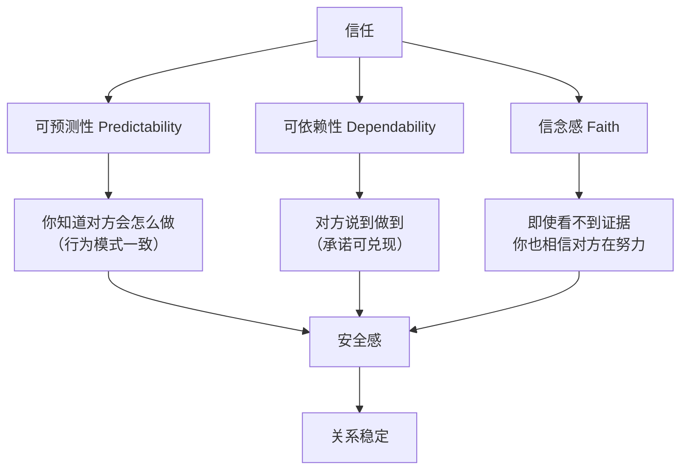
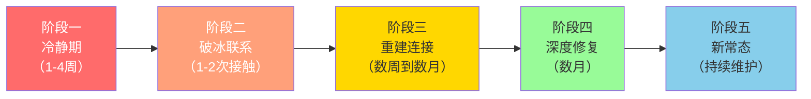
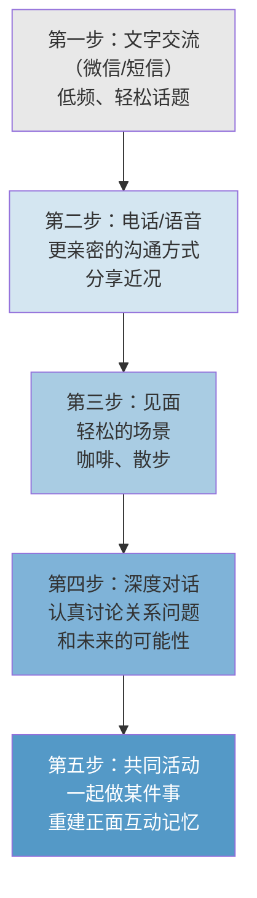
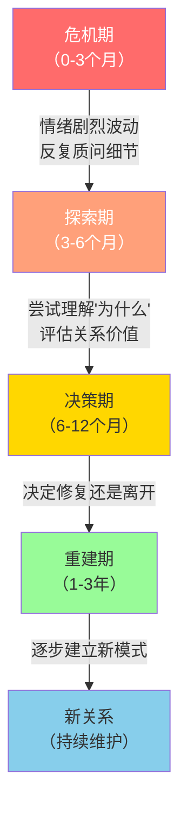

## 场景六：挽回——"我不想失去你"

### 场景描述

小刘和小何结婚三年。小刘答应戒烟，但偷偷抽了半年，直到小何在车里发现烟盒和打火机。这不是小刘第一次失信——之前答应少加班多陪家人、答应不再借钱给不靠谱的朋友，每一次承诺都像写在水面上。这一次，小何没有哭闹，平静地说了一句"我们分开一段时间吧"，然后搬回了娘家。

分居两周后，小刘意识到自己真的不能失去小何。他想挽回，但不知道该怎么做——之前的每一次"我保证改"都变成了空头支票，他的信用已经透支了。

这个场景的核心矛盾在于：**当信任账户已经被取空，你还想再存钱进去，对方凭什么相信你这一次不会再次透支？**

### 为什么挽回是最难的沟通

挽回之所以困难，是因为它同时涉及三个心理层面的挑战：

**第一层：认知层面——信任崩塌后的"确认偏误"**

当一个人被反复欺骗后，大脑会启动自我保护机制：自动过滤掉对方的正面信息，放大负面信息。心理学称之为"确认偏误"（Confirmation Bias）。你说"我这次真的改了"，对方听到的是"又来了"；你送一束花，对方想的是"又想糊弄我"。

这意味着，挽回阶段的沟通不能依赖语言，必须依赖可观察、可验证的行为改变。

**第二层：情绪层面——未处理的伤害在身体里存储**

小何表面平静，但内心的愤怒、失望、委屈并没有消失，只是被压下去了。神经科学研究表明，未处理的负面情绪会存储在杏仁核中，一旦遇到类似的触发场景（比如闻到烟味），情绪会瞬间爆发，强度甚至超过原始事件。

这就是为什么很多挽回者觉得"明明已经和好了，怎么又因为一件小事吵起来"——因为根本的伤害从未被真正处理。

**第三层：关系层面——权力动态的失衡**

提出分手/分居的一方天然掌握了关系的主动权。挽回者处于"求"的位置，这种权力不对等会扭曲双方的行为：挽回者变得卑微讨好，被挽回者变得更加傲慢或更加逃避。

有效的挽回必须打破这种不健康的权力动态，让双方回到平等对话的位置。

### 挽回前的自我评估：你真的应该挽回吗？

在开始任何挽回行动之前，先冷静回答以下问题。这不是浪费时间——很多人挽回失败，不是因为方法不对，而是因为方向就错了。

**必须诚实回答的七个问题：**

| 问题 | 诚实答案的参考标准 |
|------|-------------------|
| 你想挽回的是这个人，还是"有人陪"的感觉？ | 如果换一个人也能让你不孤独，你挽回的是依赖不是爱 |
| 导致分手的问题你能改变吗？ | 有些问题是性格不匹配，不是努力就能解决 |
| 你愿意为改变付出多大代价？ | 如果只是嘴上说改，别开始 |
| 对方明确说过"不要联系我"吗？ | 如果说过，你首先要尊重这个边界 |
| 你们在一起时，快乐的时间多还是痛苦的时间多？ | 如果大部分时间都在互相折磨，挽回可能不是最好的选择 |
| 有没有涉及原则性问题（暴力、出轨、赌博）？ | 原则性问题需要专业介入，不是沟通技巧能解决的 |
| 你挽回后能接受对方不信任你一段时间吗？ | 信任重建需要6个月到2年，你准备好了吗 |

**如果发现以下情况，建议先寻求专业帮助而非自行挽回：**

- 涉及家庭暴力或精神虐待
- 对方有明确的心理健康问题（抑郁症、双相情感障碍等）
- 你自己处于极度焦虑或抑郁状态
- 双方家庭深度介入且矛盾激烈
- 涉及法律问题（财产、子女抚养权等）

#### 依恋风格自测：你的挽回策略需要因人而异

每个人在亲密关系中的行为模式，深受"依恋风格"影响。了解自己和对方的依恋风格，能让挽回策略更精准。

心理学家将成人依恋分为四种类型（基于Bartholomew和Horowitz的四分类模型）：

| 依恋类型 | 核心特征 | 分手后的典型表现 | 挽回时的关键 |
|---------|---------|-----------------|-------------|
| **安全型** | 信任亲密关系，能健康表达需求 | 会难过但能理性处理，给彼此空间 | 直接、真诚的沟通最有效 |
| **焦虑型** | 极度害怕被抛弃，需要反复确认 | 疯狂联系、情绪崩溃、反复试探 | 需要学会自我安抚，给对方空间比纠缠更有效 |
| **回避型** | 害怕亲密，习惯压抑情感 | 表面冷漠、迅速投入工作/新事物 | 不要逼迫表态，用行动而非语言传递信号，节奏要慢 |
| **恐惧型** | 既渴望亲密又害怕受伤 | 反复摇摆（想联系→又退缩→又想联系） | 需要极度的耐心和稳定的信号，不要被对方的摇摆带跑 |

**如何判断对方的依恋类型？** 回顾你们在一起时的模式：
- 对方是否经常需要你确认"你爱不爱我"？（焦虑型倾向）
- 对方是否在吵架后习惯冷战、不说话？（回避型倾向）
- 对方是否在亲密和疏远之间反复摇摆？（恐惧型倾向）
- 对方能否在冲突中平静表达需求？（安全型倾向）

了解依恋类型不是为了给对方贴标签，而是为了理解：**对方的反应方式，可能不是"不爱了"，而是"不会用健康的方式处理"。** 这种理解本身，就能帮助你在挽回过程中更有耐心、更有策略。

### 挽回的底层原理：信任重建的心理学模型

信任不是一种感觉，而是一个可以被拆解和重建的心理结构。社会心理学家约翰·戈特曼（John Gottman）的研究表明，信任由三个核心要素构成：

**小刘的问题出在哪里？**

- **可预测性**：小何已经能"预测"到小刘会失信——因为每次承诺后都会食言。这种可预测性不是好事，它意味着"我知道你会骗我"成了稳定预期。
- **可依赖性**：小刘的承诺已经没有信用额度，就像一张刷爆的信用卡。
- **信念感**：小何对小刘还残存着一点信念（否则会直接离婚而不是分居），但这点信念正在快速消耗。

**挽回的本质就是重新充值这三个账户。** 而充值的方式不是语言，是行为；不是一次性的大动作，而是持续的、可验证的小改变。

#### 信任衰减的心理学机制

理解信任为什么会"归零"，有助于理解为什么重建如此缓慢：

戈特曼的研究发现了一个关键数据：**在稳定的关系中，正面互动与负面互动的比例需要维持在5:1以上。** 而当这个比例跌破1:1时，关系进入"消极旋涡"，信任加速流失。小刘和小何的关系，很可能在被发现抽烟之前就已经跌破了临界点——之前的多次失信已经将比例压到了危险区域。

这就是为什么挽回不能只解决"这一次"的问题，必须同时修复底层的互动模式。

### 挽回的五个阶段：完整路线图

挽回不是一次对话就能完成的事情，它是一个有明确阶段的过程。跳过任何一个阶段，都会导致失败。

#### 阶段一：冷静期——最重要的阶段恰恰是"什么都不做"

大多数人在这个阶段就犯了致命错误：刚分手就开始疯狂联系。冷静期的核心目的有两个：给对方消化情绪的空间，给自己深度反省的时间。

**你在这段时间应该做的事情：**

**1. 深度自我反省（不是表面的检讨）**

拿出一张纸，写下以下内容——不是在脑子里想，是真正写下来：

- **行为清单**：列出所有伤害对方的具体行为（不是"我做得不好"这种笼统的话，而是"2025年3月15日答应戒烟，但3月20日开始偷偷抽烟，一直持续到10月被发现"）
- **伤害分析**：每个行为对对方造成了什么伤害？（"欺骗让我觉得自己的感受不被重视"）
- **根源追溯**：为什么我会反复做出这种行为？（"我用抽烟缓解工作压力，但不愿意承认自己控制不了"）
- **改变方案**：我具体打算怎么改？（不是"我会戒烟"，而是"我已经预约了戒烟门诊，下周三第一次就诊，同时买了尼古丁贴片作为过渡"）

**2. 照顾好自己的状态**

分手后的焦虑状态会让人做出不理性的行为。你需要：

- 保持正常作息（不要熬夜刷手机看对方朋友圈）
- 坚持运动（运动产生的内啡肽能缓解焦虑情绪）
- 和信任的朋友倾诉（但不要让共同朋友传话，这会让对方感到被围攻）
- 不要借酒消愁（酒精会放大情绪，降低自控力）

**3. 绝对不能做的事情（红线清单）**

| 行为 | 为什么不能做 | 后果 |
|------|-------------|------|
| 每天发消息轰炸 | 对方需要空间消化情绪，轰炸只会增加压力 | 对方拉黑你或更加坚定分手决心 |
| 去对方公司/家门口堵人 | 这是侵犯边界，不是浪漫 | 对方恐惧、报警、彻底断联 |
| 让朋友/家人帮你说情 | 把私人问题变成公共事件，对方会感到被绑架 | 对方觉得你不尊重隐私 |
| 在社交媒体发伤感动态 | 明显是给对方看的情感勒索 | 对方觉得你在操控舆论 |
| 突然出现在对方常去的地方 | 伪装的跟踪行为 | 对方感到不安全 |
| 用孩子/宠物作为联系借口 | 利用无辜的第三方 | 对方识破后更加厌恶 |

**冷静期的时长参考：**

- 普通争吵导致的分居：1-2周
- 严重失信（如本案例）：2-4周
- 涉及第三方（出轨等）：至少1-2个月
- 对方明确说"别联系我"：尊重对方，至少等对方主动联系或经过足够长时间后再试探

#### 冷静期的数字时代生存指南

在社交媒体时代，冷静期有一个前人没有面对过的挑战：**你无法真正"消失"**。对方可以通过朋友圈、微博、抖音随时看到你的动态，你也可以随时看到对方的。这种"可见但不可触"的状态，会极大消耗你的情绪能量。

**社交媒体行为准则：**

| 行为 | 建议 | 原因 |
|------|------|------|
| 发朋友圈 | 正常频率，内容积极但不刻意 | 完全不发会让共同朋友担心或八卦；发伤感内容是变相的情感勒索 |
| 看对方朋友圈 | 控制频率，一天最多看一次 | 反复刷新对方动态会强化焦虑，而且容易过度解读 |
| 共同群聊 | 正常参与，不刻意活跃也不完全沉默 | 突然活跃像在刷存在感，突然退出像在赌气 |
| 发合影/旧物 | 避免 | 明显是给对方看的，属于变相施压 |
| 发和其他异性的合影 | 绝对不要 | 制造嫉妒是最糟糕的挽回策略，只会让对方觉得你不认真 |
| 对方发了伤感内容 | 不要解读为"在暗示我"，不要点赞评论 | 对方的情绪是对方的，不是你的机会 |

**如果你发现自己无法控制查看对方社交媒体的冲动：** 这是分手后的正常反应（心理学称为"寻求联结"的本能），但需要管理。可以暂时屏蔽对方的朋友圈（不是拉黑，只是不看），把这个精力用在写反省日记或运动上。

#### 阶段二：破冰联系——第一次开口决定一切

经过冷静期的反省和准备，你准备好进行第一次联系了。这次联系的目标不是挽回成功，而是**打开一条沟通通道**。

**破冰信息的核心原则：**

1. **不求回报**——不要期待对方立刻回复"我也想你"
2. **承认事实**——不找借口、不淡化、不转移责任
3. **展示行动**——不是"我会改"，而是"我已经在做了"
4. **给予选择权**——明确表示尊重对方的决定
5. **控制长度**——不要写长篇大论，3-5句话足够

**破冰信息模板（根据具体情况调整）：**

> 小何，这两周我想了很多。我知道你现在可能不想跟我说话，我完全理解。我不打算为自己找任何借口，我对欺骗你这件事感到非常后悔。我之前说的话没有做到，所以你现在不相信我是正常的。我最近开始去看心理咨询了，想从根本上改变这个问题。不管你最终怎么决定，我都尊重。如果你愿意的话，我想找个时间当面跟你谈谈，不是为了说服你回来，而是想当面跟你说声对不起。

**这条信息为什么有效？逐句拆解：**

| 句子 | 心理作用 |
|------|---------|
| "这两周我想了很多" | 说明你给了彼此空间，没有冲动行事 |
| "我知道你现在可能不想跟我说话，我完全理解" | 共情——你站在对方的角度考虑了 |
| "我不打算为自己找任何借口" | 放下防御姿态，接受全部责任 |
| "我之前说的话没有做到，所以你现在不相信我是正常的" | 认可对方的不信任是合理的，不指责对方"你怎么不信我" |
| "我最近开始去看心理咨询了" | 具体行动，不是空头承诺 |
| "不管你最终怎么决定，我都尊重" | 把选择权交给对方，消除压力 |
| "不是为了说服你回来，而是想当面跟你说声对不起" | 降低对方的防御心理——如果目的是"道歉"而不是"求复合"，对方更容易接受见面 |

**如果对方不回复怎么办？**

- 等待至少5-7天，不要追问"你看到了吗"
- 如果一周后仍无回复，可以再发一条简短的信息："我理解你需要时间，我不着急，随时都可以。"
- 如果两次都不回复，停止主动联系，给更长的冷却时间（至少一个月）
- 不要换号码、换平台继续发——这会变成骚扰

**如果对方回复但态度冷淡怎么办？**

对方回复"嗯"或"知道了"这类冷淡回应，不要急着长篇大论。简短回应即可：

> 谢谢你回复。如果你想聊聊，我随时都在。不想聊也没关系。

保持低压力、高温度的姿态。

#### 阶段三：重建连接——从低频接触开始

如果对方愿意恢复基本联系，进入重建连接阶段。这个阶段的关键是**节奏感**——太快会让对方退缩，太慢会让对方觉得你不在乎。

**重建连接的渐进策略：**

**每个阶段的注意事项：**

**文字交流阶段：**
- 频率：每2-3天一次，不要每天发
- 内容：轻松、正面的话题（看到一个好笑的视频、吃到一家好吃的店）
- 禁忌：不要每次都提感情问题，不要翻旧账
- 目标：让对方重新习惯和你交流的感觉

**电话/语音阶段：**
- 时机：对方主动打电话或回复变得积极时
- 时长：5-15分钟，不要煲电话粥
- 内容：分享你最近的生活变化（"我上周去做了第二次心理咨询，发现了一些有意思的事情"）
- 目标：展示你在持续改变，不是三天热度

**见面阶段：**
- 场景选择：中立、轻松、时间可控的场所（咖啡馆、公园散步、美术馆）
- 避免的场景：家里（太亲密）、餐厅（太久、太正式）、酒吧（酒精降低判断力）
- 时长：1-2小时，主动结束（"我待会还有个事，今天聊得很开心"）
- 关键：见面后给对方发一条简短的信息："谢谢你今天出来，回家注意安全。"

**在这个阶段，你需要持续做的一件事——"存款"而不是"取款"：**

| 存款行为（增加信任） | 取款行为（消耗信任） |
|---------------------|---------------------|
| 说到做到（哪怕是小事） | 做出新的承诺但做不到 |
| 主动分享心理咨询的进展 | 对方问了才说 |
| 记住对方说过的细节并在后续体现 | 需要对方反复提醒 |
| 尊重对方的边界和节奏 | 试探性地越界（"能不能抱一下"） |
| 对共同朋友展现稳定的改变 | 让朋友传话"他真的变了" |
| 接受对方偶尔的冷淡和反复 | 质问"你怎么又这样" |

#### 处理共同社交圈：不绑架、不对抗

分手后，共同的朋友圈是一个被低估的复杂因素。处理不当，会让挽回变得更加困难。

**核心原则：不要让任何第三方成为你的"传声筒"或"说客"。**

**具体策略：**

| 场景 | 错误做法 | 正确做法 |
|------|---------|---------|
| 朋友主动问"你们怎么了" | 大倒苦水、请朋友帮你说情 | "我们有些问题需要自己解决，谢谢关心" |
| 共同聚会中有对方在 | 刻意回避或刻意靠近 | 自然相处，正常社交，不把注意力全放在对方身上 |
| 朋友告诉你对方的近况 | 追问细节、过度分析 | "谢谢告诉我，但我希望小何的隐私得到尊重" |
| 对方在朋友圈发了和异性的合影 | 慌张、质问、让朋友去打听 | 不反应。可能是普通社交，也可能是在试探你——无论哪种，你的慌张都是最差的回应 |
| 双方家长介入 | 让父母出面当说客 | 和自己的父母坦诚沟通，请他们给空间，不要参与 |

**特别提醒：** 在中国的文化语境中，"让长辈出面调解"是很常见的做法，但在挽回场景中，这往往适得其反。对方会感到被"家族压力"包围，失去自主选择的空间。如果长辈已经介入了，你需要主动和长辈沟通："爸妈，这件事请让我们自己处理，你们的关心我理解，但压力会让事情更难。"

#### 阶段四：深度修复——处理真正的伤口

当基本的连接恢复后，你们需要进行一次或多次深度对话，处理那些真正伤害过你们的核心问题。这不是吵架的延续，而是一次有结构的"关系手术"。

**深度修复对话的结构：**

**第一步：邀请而非强迫**

> 小何，我最近一直在思考我们之间的问题。我觉得有些事情我们需要认真谈谈，不是为了吵架，而是为了真正理解对方。你方便的时候，我们能找个安静的地方聊聊吗？

**第二步：使用"结构化倾听"技术**

这个技术来自情绪聚焦疗法（EFT），核心是：先听懂对方，再让对方听懂你。

**倾听方的四步法：**

1. **复述**：用自己的话重复对方说的内容
   - "你的意思是，当我偷偷抽烟的时候，你觉得自己不被尊重，好像我的感受比你的感受重要？"
2. **确认**：确认理解是否正确
   - "我理解得对吗？还是有我没听出来的地方？"
3. **共情**：表达你理解对方的感受
   - "如果是我发现你一直瞒着我做一件事，我也会非常愤怒和失望。"
4. **回应**：真诚地回应，不辩解
   - "你说得对。我确实把方便自己放在了你的感受之上。这是我的问题。"

**第三步：表达方使用"我"语句**

不要说"你总是不信任我"，而要说"当我的行为不被信任的时候，我感到很难过，因为我知道这是我自己造成的"。

"我"语句的公式：**当______的时候，我感到______，因为______。**

| 错误表达 | "我"语句版本 |
|---------|-------------|
| "你就不能给我一次机会吗？" | "当你不信任我的时候，我感到很挫败，因为我知道是我亲手毁掉了你的信任" |
| "你也有做得不好的地方" | "当我在关系中感到被忽视的时候，我会用不健康的方式应对，比如抽烟。这是我需要学习的" |
| "我已经在改了你还要我怎样" | "当我努力改变但看不到效果时，我感到很无力，但我理解信任需要时间重建" |

**第四步：共同制定"信任重建计划"**

不是一方的承诺，而是双方的协议。可以写下来，变成一个有约束力的"关系合同"：

**信任重建计划示例（小刘和小何）：**

| 项目 | 具体行动 | 验证方式 | 时间节点 |
|------|---------|---------|---------|
| 戒烟 | 每周做一次尼古丁检测（药店可购买试纸） | 检测结果拍照发给小何 | 持续6个月 |
| 透明度 | 手机对小何开放，不设密码 | 随时可查 | 永久（直到信任恢复） |
| 承诺管理 | 不再轻易承诺，承诺前先评估可行性 | 每月回顾一次承诺兑现情况 | 持续1年 |
| 情绪支持 | 继续心理咨询，学习健康的压力管理方式 | 咨询师出具进展报告 | 至少6个月 |
| 沟通习惯 | 每天至少15分钟面对面交流，不看手机 | 双方互相提醒 | 永久 |

#### 特殊情境：有子女或经济牵绊时的挽回

当分手/分居涉及孩子或共同财产时，挽回的难度和复杂度都会显著增加。这不再是"两个人的事"，而是"一个家庭系统的重组"。

**有子女时的额外考量：**

| 维度 | 注意事项 |
|------|---------|
| **孩子的感受优先** | 不要让孩子成为"传话筒"或"筹码"（"你想不想爸爸回来？去跟爸爸说妈妈很想他"） |
| **分居期间的育儿安排** | 即使关系在修复中，也要保持稳定的探视和亲子时间，不要把探视和挽回捆绑 |
| **在孩子面前的态度** | 不要当着孩子面说对方的坏话，也不要在孩子面前表演"我们很好"——孩子对虚假的情绪氛围极其敏感 |
| **孩子的情绪反应** | 孩子可能表现出退行行为（尿床、黏人、成绩下降），这不是挽回的"工具"，而是需要专业关注的信号 |
| **年龄适配的沟通** | 3-6岁："爸爸妈妈最近有些不开心，但我们都爱你"；7-12岁："我们在处理大人之间的问题，不是你的错"；青少年：可以更坦诚，但不要把他们当"心理咨询师" |

**有经济牵绊时的处理：**

- 房贷、车贷等共同债务：在关系修复期间，保持原有的经济分担方式不变，不要用经济手段施压（"你不回来我就不还房贷了"）
- 共同财产：不要在情绪激动时做任何财产分割的决定
- 经济依赖：如果一方经济上依赖另一方，分居期间要确保基本生活保障，不要用经济控制作为挽回手段

#### 阶段五：新常态——从"修复"到"升级"

挽回成功的标志不是"回到从前"，而是建立一个比从前更好的关系模式。如果你们只是回到了分手前的状态，那同样的问题迟早会再次爆发。

**新常态的特征：**

1. **主动沟通代替被动应对**：不再等问题积累到爆发才处理，而是在小问题出现时就讨论
2. **定期"关系检查"**：每月花30分钟，互相分享"这个月你对我们关系的感受是什么？有什么我可以做得更好的？"
3. **健康的压力管理**：不再用逃避行为（抽烟、加班、酗酒）应对压力，而是学会向伴侣表达"我现在压力很大，需要你的支持"
4. **独立与亲密的平衡**：各自有自己的空间和兴趣，但保持情感上的连接

**"关系检查"对话模板：**

每月找一个双方都放松的时间，每人轮流回答以下问题（另一方只倾听，不打断）：

1. 这个月你对我们关系的感受是什么？（1-10分打分，并解释原因）
2. 这个月我做的什么事情让你感到被爱/被重视？
3. 这个月有什么事情让你感到不舒服或受伤？（如果有，用"我"语句表达）
4. 下个月你希望我在哪些方面有所注意？
5. 你有什么感谢或欣赏想对我说的？

这个模板的力量在于它的**定期性**——它把"问题爆发后才沟通"变成了"问题萌芽时就处理"。

### 不同挽回场景的差异化策略

上面的五阶段框架是通用的，但不同的挽回场景需要不同的侧重点。

#### 场景A：因失信/欺骗导致的挽回（如本案例）

**核心难点**：信任已经透支，语言的说服力归零。

**策略重点：**
- 不要急于要求"你相信我"，而是用行动创造"你可以验证我"的条件
- 主动提供透明度（手机开放、行踪可查），而不是等对方要求
- 接受"被监控"的感觉不舒服，但这是你失信的代价
- 建立"微承诺—兑现"的正向循环，从小事开始重建信用

**示例**：不要承诺"我这辈子再也不抽烟了"，而是承诺"这周我不抽烟，周五我们一起做个检测"。一周做到了，再承诺下一周。让对方看到的是"他说一周，确实做到了"，而不是"他说一辈子，大概率做不到"。

#### 场景B：因忽视/冷暴力导致的挽回

**核心难点**：对方的伤害不是来自"你做了什么"，而是来自"你没做什么"——没有陪伴、没有回应、没有在乎。

**策略重点：**
- 语言上的道歉不如行动上的"在场"
- 回忆对方曾经表达过但被你忽略的需求，现在主动满足
- 不要一次做很多（显得刻意），而是持续地做一点（显得自然）
- 对方可能需要时间消化"你终于看到我了"的复杂情绪

**示例**：如果对方曾经说过"你从来不记得我们的纪念日"，不要现在补过一个盛大的纪念日（太刻意），而是在下一个普通的日子，主动准备一个小惊喜（"今天是我们第一次看电影的第500天，我记得那天你看的是《泰坦尼克号》"）。

#### 场景C：因激烈争吵/冲动分手导致的挽回

**核心难点**：双方都有情绪创伤，可能都觉得自己有理。

**策略重点：**
- 先处理情绪，再处理问题（不要急着"复盘"谁对谁错）
- 承认自己在争吵中的不当行为（即使你觉得自己是对的）
- 学习健康争吵的规则（不人身攻击、不翻旧账、不威胁分手）
- 建立"暂停机制"——下次情绪升级时，双方可以喊暂停，冷静后再谈

**"暂停机制"的使用规则：**

| 规则 | 说明 |
|------|------|
| 谁都可以喊暂停 | 不分对错，任何一方感到情绪即将失控时都可以 |
| 暂停时说"暂停"而非"我不想谈了" | "暂停"是暂停不是终止，表达的是"我需要冷静一下再继续" |
| 暂停时间：30分钟到24小时 | 太短无法冷静，太长变成冷战 |
| 暂停期间不许翻旧账、不许找第三方评理 | 冷静期就是冷静期 |
| 暂停结束后必须回到对话 | 不能借暂停逃避问题 |

#### 场景D：因出轨/背叛导致的挽回

**核心难点**：这是最严重的信任破坏，涉及深层的自我价值感危机（"我是不是不够好"）。

**策略重点：**
- 这不是沟通技巧能解决的问题，强烈建议寻求专业的婚姻/伴侣咨询
- 出轨方需要完全切断与第三方的联系，且这个过程需要透明
- 被出轨方需要空间去经历愤怒、悲伤、困惑等阶段，不能催促"你该放下了"
- 信任重建的时间通常需要1-3年，而且可能永远无法完全恢复到之前的水平
- 如果被出轨方无法释怀，尊重这个结果——不是所有的伤害都能被修复

**出轨后的信任重建时间线（基于Esther Perel的临床研究）：**

### 挽回中的心理学工具

#### 工具一：情绪调节的"STOP"技术

当挽回过程中出现强烈的情绪波动（对方态度冷淡、旧伤被触发），使用这个技术：

- **S（Stop）**：停下来，不做任何反应
- **T（Take a breath）**：做三次深呼吸（吸4秒-屏4秒-呼6秒）
- **O（Observe）**：观察自己的身体感受（胸口紧吗？胃在翻搅吗？手在抖吗？）
- **P（Proceed mindfully）**：想清楚"我接下来要说/做的事，会让情况变好还是变差？"然后再行动

#### 工具二：安全基地的自我对话

挽回过程中，你会反复经历自我怀疑（"我是不是做不到了"）。准备一组"安全基地"式的自我对话：

- "我正在为重要的事情努力，这本身就值得尊重"
- "对方的反应不完全在我的控制范围内，我只能控制自己的行为"
- "如果最终没能挽回，我至少变成了一个更好的人"
- "信任重建需要时间，我能做的就是持续做对的事情"

#### 工具三：关系银行账户可视化

画一个简单的表格，每周记录你的"存款"和"取款"：

| 日期 | 存款行为 | 取款行为 | 账户余额趋势 |
|------|---------|---------|-------------|
| 周一 | 准时到达约定地点 | 无 | ↑ |
| 周三 | 无 | 迟到了15分钟没提前说 | ↓ |
| 周五 | 记住了她说想吃的蛋糕，买了送去 | 无 | ↑↑ |
| 周日 | 无 | 发了3条消息催她回复 | ↓↓ |

持续记录能让你直观地看到什么行为在增加信任，什么行为在消耗信任。

#### 工具四：挽回者的心理耗竭防护

挽回是一个漫长且高度消耗心理能量的过程。如果你不主动管理自己的状态，很容易陷入以下陷阱：

**心理耗竭的预警信号：**

| 信号 | 表现 | 说明 |
|------|------|------|
| 情绪透支 | 整天想着对方的反应，无法集中精力工作/生活 | 你把所有心理能量都投入到了挽回中，没有给自己留余量 |
| 自我丧失 | 为了迎合对方改变一切，已经不知道自己是谁 | 健康的改变是"成为更好的自己"，不是"消灭自己" |
| 孤立感 | 不敢和朋友倾诉，觉得"说了也没人理解" | 挽回者的痛苦常常被忽视——大家都关注"被伤害的那一方" |
| 躯体化 | 失眠、食欲紊乱、频繁生病 | 心理压力已经开始影响身体健康 |
| 愤怒转向 | 从自责转向对对方的愤怒（"我都这样了你还不原谅我"） | 这是心理防御机制，说明你已经超负荷了 |

**自我防护策略：**

1. **设定"挽回时间"**：每天只允许自己用固定时间（比如30分钟）思考挽回相关的事情，其他时间强制转移注意力
2. **保持至少一个"非挽回"的社交圈**：有朋友可以聊和挽回无关的话题，让你记住"我不仅仅是那个在挽回的人"
3. **心理咨询不是可选项**：如果你在挽回过程中没有咨询师的支持，你相当于在没有教练的情况下跑马拉松
4. **允许自己有"不想挽回"的时刻**：偶尔感到疲惫、想放弃，是正常的。不要因为这种感觉而自我谴责
5. **运动是最被低估的心理药**：每周3次、每次30分钟的有氧运动，其抗焦虑效果堪比低剂量的抗焦虑药物（来源：Cochrane系统综述，2019）

### 挽回的常见误区与纠正

#### 误区一："只要我足够真诚，对方一定会被感动"

**真相**：真诚是必要条件，但不是充分条件。对方需要的是安全感，不是感动。一部电影可以让人感动，但感动过后人不会因此改变生活决定。你需要提供的不是情绪冲击，而是持续稳定的证据——"这一次和以前不一样"。

#### 误区二："我需要做一个轰动的大事来证明我的改变"

**真相**：大手笔的浪漫举动（比如在对方公司楼下摆999朵玫瑰）在挽回中通常适得其反。它让对方感到压力（"如果我拒绝，显得我很无情"），而且本质上还是在用"表演"代替"改变"。真正有效的是日复一日的小行为：准时赴约、记住对方说的话、在小事上兑现承诺。

#### 误区三："我已经改了，对方怎么还不原谅我"

**真相**：你改变的时间是一周、一个月，但对方被伤害的时间可能是几年。信任的崩塌是一瞬间的，但重建是缓慢的。用一个比喻：你用一年时间把一个花瓶摔碎了，不可能用一周时间把碎片粘好。耐心不是可选项，是必选项。

#### 误区四："对方偶尔态度好一点，说明我们快和好了"

**真相**：情绪不是线性的，是波动的。对方今天对你笑了一下，明天可能因为看到一个旧物又陷入愤怒。不要把每一次正面互动都解读为"快成功了"，也不要把每一次负面互动都解读为"没希望了"。保持稳定的节奏，不要因为对方的情绪波动而跟着忽上忽下。

#### 误区五："我可以先假装改变，等对方回来再慢慢恢复"

**真相**：这是最危险的想法。首先，伪装很难持续——长期装出来的行为会让人疲惫，迟早会露出马脚。其次，一旦被发现是伪装，你将失去仅存的一点信任，而且是永久性的。对方会想"连你的改变都是假的，还有什么是真的？"改变必须是真实的，否则挽回毫无意义。

#### 误区六："让共同朋友帮我劝劝"

**真相**：把私人问题变成公共事件，对方会感到隐私被侵犯和被"道德绑架"。而且朋友传话往往变形，你的话经过二次传递可能变成完全不同的意思。挽回是两个人的事，不要把第三方卷进来。

#### 误区七："对方需要看到我过得不好才会心疼我"

**真相**：展示自己的痛苦（发伤感朋友圈、告诉共同朋友自己多惨）是一种变相的情感绑架。它传递的信息是"看，你把我害成这样了"，这会增加对方的内疚感和压力，而不是爱意。真正有吸引力的是一个正在变好的人，而不是一个在痛苦中沉溺的人。

#### 误区八："只要对方回来了，一切就好了"

**真相**：对方回来只是修复的开始，不是结束。很多挽回成功的关系在几个月内再次破裂，因为挽回者误以为"回来=问题解决了"，于是停止了改变的努力，旧模式重新启动。对方回来后，你需要保持甚至加强改变的力度，至少持续6个月到1年。

### 当挽回成功后再次出现危机

这是一个很少被讨论但极其重要的问题：**很多关系在挽回成功后的3-6个月内会经历"二次危机"。**

**为什么会这样？**

1. **"蜜月期"结束后，现实回归**：挽回成功初期，双方都会特别小心、特别珍惜，这个阶段的互动质量很高。但人不可能永远保持高度警觉，一旦放松，旧习惯就会回潮。
2. **被伤害方的"延迟反应"**：有些伤害的情绪不是在分手期间处理的，而是在关系恢复后才浮现（"我越想越觉得你当时太过分了"）。
3. **信任的"测试期"**：被挽回方会不自觉地"测试"对方——制造一些小情境，看对方是否真的变了。如果挽回者在这个测试中表现不好，信任会再次崩塌。

**应对二次危机的策略：**

- 预期它的到来：提前和对方沟通"我们的恢复过程可能不是直线上升的，会有反复，这很正常"
- 不要把二次危机当作"失败"：它是修复过程的一部分，不是"白费了"
- 快速回到结构化沟通：使用之前建立的"关系检查"模板，把问题放在结构中讨论
- 必要时回到咨询师那里：二次危机可能需要专业的帮助来度过

### 什么时候应该放手

挽回有一个容易被忽略的前提：**不是所有的关系都值得挽回，也不是所有的挽回都会成功。** 以下情况建议认真考虑放手：

**必须放手的信号：**

- 对方已经有了新的伴侣——尊重他人的关系
- 对方多次明确表示"不要再联系我"——反复越界就是骚扰
- 你发现自己挽回的动机是"害怕孤独"而非"真的爱这个人"
- 关系中存在反复的暴力行为（身体或精神上的）
- 你为了挽回已经丧失了自尊和自我——卑微到尘埃里的姿态不会换来爱情
- 你改变了一切但对方仍然无法原谅——有些裂痕太深，不是努力就能弥合

**"放手"之后你需要知道的：**

放手不代表失败。放手后，你可能会经历一段"哀伤期"——这是正常的。心理学家Kübler-Ross的"哀伤五阶段"模型同样适用于关系的丧失：

1. **否认**："不可能真的结束了"
2. **愤怒**："我付出了这么多，凭什么"
3. **讨价还价**："如果我再试一次呢？如果我改变X呢？"
4. **沮丧**："我真的失去了"
5. **接受**："这段关系结束了，但我的人生还在继续"

允许自己经历这些阶段，不要压抑。但如果你发现自己在前四个阶段停留超过3个月，或者出现了影响日常功能的症状（无法工作、无法入睡、有自伤念头），请立即寻求专业帮助。

你在这个过程中学到的反省能力、沟通技巧、情绪管理，会成为你下一段关系中宝贵的财富。

### 案例后续：小刘和小何的结局

回到开头的案例。小刘在分居两周后给小何发了那条信息。小何没有立刻回复，但在第三天回了一句"可以见面"。

他们在一家安静的咖啡馆见了面。小刘没有像以前那样急于解释和保证，而是安静地说了一句"对不起"，然后把自己这两周做的反省笔记（整整写了六页纸）递给小何看。笔记里不仅有他的反省，还有他预约戒烟门诊的截图、心理咨询师的联系方式、以及一个他自己制定的"戒烟周报"计划。

小何看完后沉默了很久，最后说了一句："我需要时间。我不确定我们还能不能回到从前，但我愿意看看你是不是真的能变。"

之后的三个月，小刘每周给小何发一份简短的"周报"——不是长篇大论，就是几句话："本周没有抽烟"、"周三做了第二次咨询，发现我用抽烟逃避焦虑，咨询师教了我一个呼吸练习"、"今天路过烟摊很想买，但我走开了"。

小何从一开始的"已读不回"，慢慢变成了"嗯，加油"，再后来变成了主动问"你这周咨询聊了什么"。

第四个月，小何搬回了家。但她带回了一个条件："前三个月，你每周做一次尼古丁检测，结果给我看。"小刘同意了。

一年后，小刘已经完全戒烟，心理咨询也在继续。他们建立了一个新的习惯：每周日晚上30分钟的"关系对话"，分享这周的感受、需求和感谢。小何说："我不确定我完全信任你了，但我愿意继续相信你正在变好。"

**但他们也经历了二次危机。** 第八个月的时候，小刘因为工作压力大，连续两周没有做心理咨询。小何发现后，情绪瞬间回到了最初的愤怒："你又开始了。"这一次，小刘没有像以前那样慌张地保证"我不会了"，而是平静地说："你说得对，我确实在偷懒。我这周就重新预约。"然后他当天就预约了。

这一次的危机反而让他们的信任更深了一层——因为小何看到的不是"一个不会犯错的人"，而是"一个犯了错会立刻承认并修正的人"。

这就是挽回的真实样子——不是电影里的破镜重圆，而是两个人在废墟上一砖一瓦地重建。

### 挽回沟通的终极心法

如果你只记住一句话，记住这句：

**挽回的本质不是让对方回来，而是让自己成为值得对方回来的人。**

当你把焦点从"怎么让对方回心转意"转移到"怎么成为一个更好的人"时，两件好事会发生：第一，你的改变是真实的，因为它来自内在的动力而不是外在的压力；第二，即使最终没能挽回这段关系，你也已经是一个更成熟、更有能力经营好下一段关系的人。

这不是心灵鸡汤，这是心理学中的"自我决定理论"（Self-Determination Theory）的核心发现：内在动机驱动的改变，比外在动机驱动的改变更持久、更深入。

所以，与其花时间研究"怎么发朋友圈吸引前任"、"怎么制造偶遇"、"怎么让对方吃醋"，不如把时间花在真正有价值的事情上：看心理咨询、读书、运动、发展兴趣爱好、修复和其他人的关系。

当你的生活真正变好了，对方会看到的。如果看不到，至少你的人生已经变好了。
