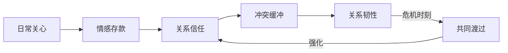
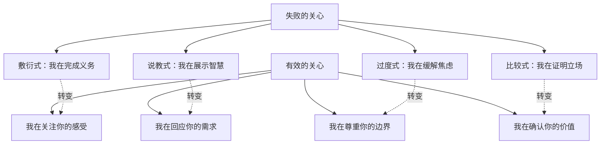
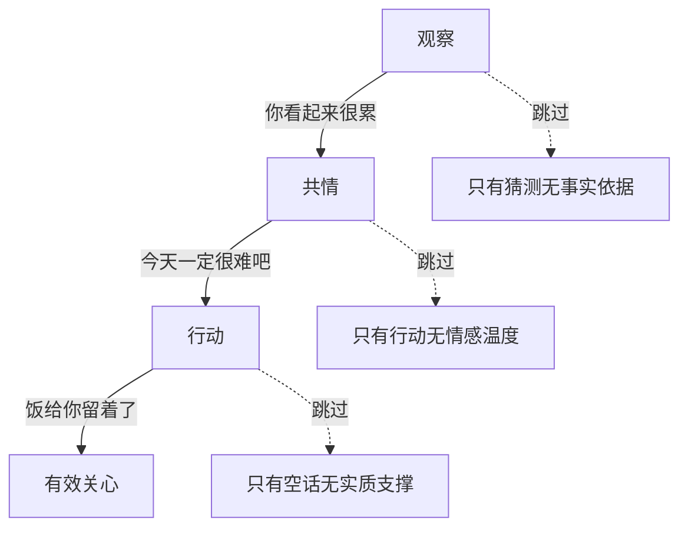
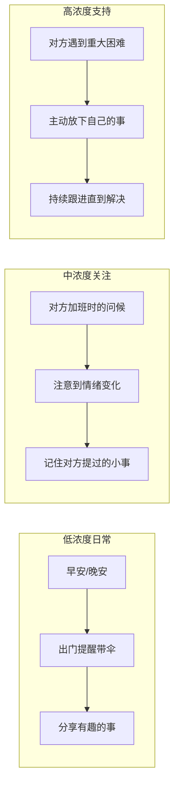
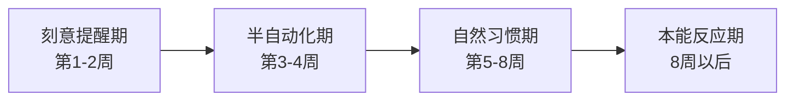

## 场景七：日常关心——"今天辛苦了"

> "爱不是一场盛大的烟火表演，而是每天清晨厨房里那盏为你留着的灯。"

很多人误解了情感沟通的重心——以为只有冲突、表白、危机时刻才需要"沟通技术"。事实恰恰相反：**一段关系的质量，80%取决于日常的微小互动，而非少数几次重大事件。** 日常关心是所有情感沟通中最高频、最低门槛、却最容易被忽视的场景。掌握它，等于掌握了关系维护的底层操作系统。

### 为什么日常关心是关系的基石

#### 戈特曼的情感账户理论

心理学家约翰·戈特曼（John Gottman）在长达40年的婚姻研究中追踪了超过3000对夫妻，发现了一个关键指标——**情感账户（Emotional Bank Account）**。每一次正面互动是"存款"，每一次负面互动是"取款"。幸福的关系并非没有冲突，而是正面互动与负面互动的比例维持在**5:1**以上。

这意味着：如果你和伴侣每周有一次争吵（取款1次），你需要至少5次正面互动（存款5次）才能维持关系的健康水位。而这5次存款中，日常关心（一句温暖的话、一个拥抱、一次主动帮忙）是最稳定、最高频、成本最低的来源。

戈特曼团队的另一项发现更值得注意：**离婚的预测指标不是吵架的频率，而是日常互动中"转向"（turning towards）与"转离"（turning away）的比例。** 当伴侣发出一个情感信号（比如"你看这个新闻好离谱"），你的回应方式——是"转向"（回应、互动）还是"转离"（忽视、敷衍）——决定了关系的走向。幸福夫妻的转向比例约为86%，而不幸夫妻仅为33%。

#### 日常关心的三个不可替代特征

为什么"今天辛苦了"这类场景如此重要？因为它具备三个特征：

- **高频**：几乎每天都会发生，不依赖特殊时机
- **低门槛**：不需要物质资源、不需要完美话术、不需要特殊场合
- **累积效应**：单独一次效果微弱，但日积月累形成关系基调——就像水滴石穿，单滴水无法穿透岩石，但持续的滴落终将改变石头的形状

**反面论证：** 如果你只在生日、纪念日、生病时才表达关心，那你在对方心理地图中的定位就是"应急联系人"而非"生命伴侣"。日常关心的本质是持续告诉对方：**你在我的注意力范围内，你不是可有可无的背景。**

#### 日常关心的心理学价值

从心理学视角看，日常关心满足了人类三个基本心理需求（自我决定理论，Deci & Ryan, 1985）：

| 基本需求 | 日常关心如何满足 | 缺失的后果 |
|---------|----------------|-----------|
| **归属感** | 持续的关心确认"我属于这里" | 孤独感、社交退缩 |
| **胜任感** | 对方犯错时的包容确认"你做得够好了" | 自我怀疑、焦虑 |
| **自主感** | 关心而非控制，确认"我尊重你的选择" | 反感、关系疏离 |

### 日常关心的神经科学基础

#### 催产素与安全感

当我们感受到被关心时，大脑会释放**催产素（oxytocin）**——一种被称为"信任分子"或"拥抱荷尔蒙"的神经肽。催产素的作用包括：

1. **降低皮质醇水平**——直接减轻压力反应
2. **激活腹侧纹状体**——大脑的奖赏中枢，产生温暖和满足感
3. **增强社会记忆**——让对方更容易记住你关心TA的那一刻
4. **促进互惠行为**——被关心的人更倾向于关心回去

**这意味着：你每一句真诚的"辛苦了"，都在对方大脑中触发一次真实的生化反应。** 这不是修辞，而是神经科学的事实。Zak等人（2005）的研究表明，仅仅是感受到被信任和被关心，血浆催产素水平就会上升，随之而来的是可信赖行为的增加——形成正向循环。

#### 镜像神经元与情绪感染

意大利帕尔马大学发现的**镜像神经元（mirror neurons）**解释了为什么情绪是"传染"的。当我们看到对方的表情、听到对方的语气时，大脑中与执行该表情/语气相同的区域会被激活——我们在毫秒级别内"镜像"了对方的情绪状态。

这意味着：你表达关心时所携带的温暖，会直接感染对方的情绪系统。反过来，如果你的关心是心不在焉的、敷衍的——对方的镜像神经元同样会捕捉到这种"不真诚"，产生适得其反的效果。

**关键推论：关心的质量比数量更重要。** 10次敷衍的"辛苦了"不如1次真诚的、带有关怀温度的回应。

#### 安全基地效应

依恋理论（Bowlby, 1969）指出，人类天生需要一个"安全基地"——一个可以确认"我被爱着、被在乎着"的地方。日常关心的本质，就是在反复确认这个安全基地的存在。

当伴侣加班回家，你递上一碗热饭——这个动作在潜意识层面说的是："这个地方是安全的，你在这里是被在乎的。"当朋友遇到困难，你说"我随时都在"——你在确认"这段关系是可靠的"。

安全基地不是一次性建立的。它需要通过日常的微小互动反复加固。神经科学研究表明，当安全基地被激活时，杏仁核（恐惧中枢）的活动会降低，前额叶皮层（理性思考）的活动会增强——**一个感到安全的人，思考更清晰、决策更理性、情绪更稳定。**

### 四种失败的关心模式

在展开正确做法之前，先识别常见的失败模式。很多人自以为在关心对方，实际上却在消耗关系。这四种模式几乎是所有"无效关心"的母体——识别它们，是改善的第一步。

#### 模式一：敷衍式关心

表现形式：机械地重复固定台词，缺乏对当下情境的感知。

| 敷衍式 | 对方的感受 | 潜台词 |
|--------|-----------|--------|
| "辛苦了"（眼睛没离开手机） | "你根本不在乎我" | 我在完成社交义务 |
| "多喝热水"（条件反射） | "你连认真听我说话都不愿意" | 我不想花精力在你身上 |
| "嗯嗯，加油"（敷衍语气） | "我在自说自话" | 我希望你快点说完 |
| "早点睡"（每日复制粘贴） | "这是你的自动回复吗" | 我在完成晚安打卡 |

**问题根源：** 不是不知道该说什么，而是**心不在焉**。关心的有效性 = 语言内容 × 注意力投入。当注意力为零时，再好的话术也等于零。

**自我检测：** 如果你发完关心的消息后想不起对方上一次回复的内容，你可能已经进入了敷衍模式。

#### 模式二：说教式关心

表现形式：把"关心"包装成"建议"甚至"命令"。

| 说教式关心 | 对方的感受 | 你在说什么 vs 对方听到什么 |
|-----------|-----------|------------------------|
| "我早说了让你别接这个项目" | "你在怪我" | 你说：我在心疼你 / TA听：我在追责 |
| "你就是不注意休息才累成这样" | "你在教训我" | 你说：我在关心健康 / TA听：我在批评你 |
| "你应该学会拒绝别人" | "你觉得我笨" | 你在提供建议 / TA听：你在否定我的能力 |
| "早点休息别熬夜了" | "你管得着吗" | 你在关心作息 / TA听：你在控制我 |

**问题根源：** 对方需要的是**情感回应**，不是解决方案。在情绪尚未被接纳之前，任何建议都会被感知为否定。心理学上这叫"情感优先原则"（affect primacy）——人类处理情绪的速度比处理逻辑快得多，当情绪通道被堵塞时，理性建议根本进不去。

#### 模式三：过度式关心

表现形式：关心密度过高，变成了一种控制或负担。

| 过度式关心 | 对方的感受 | 边界在哪 |
|-----------|-----------|---------|
| 每小时问一次"你还好吗" | "你把我当小孩" | 关心 ≠ 监控 |
| "你吃了什么？给我看看" | "你在监视我" | 关心 ≠ 审讯 |
| "我不放心你一个人" | "你不信任我的能力" | 关心 ≠ 保护 |
| 对方出门就问"到了吗""在哪" | "你给我装了GPS？" | 关心 ≠ 追踪 |

**问题根源：** 关心的前提是**尊重对方的独立性**。当关心跨越了"我在乎你"的边界，进入"我需要控制你的状态"时，它就变成了负担。依恋理论中，这属于**焦虑型依恋**的典型表现——用过度关心来缓解自己的分离焦虑，本质上是在满足自己的安全感需求，而非对方的需求。

**自我检测：** 你的关心发出去之后，你感到的是"松了一口气"（缓解了自己的焦虑）还是"希望对方开心"（对方获得温暖）？如果是前者，它可能不是真正的关心。

#### 模式四：比较式关心

表现形式：用比较来"安慰"对方。

| 比较式关心 | 对方的感受 | 为什么无效 |
|-----------|-----------|----------|
| "至少你比XX强多了" | "你在否定我的困难" | 他人的痛苦不能减轻我的痛苦 |
| "我今天比你更累" | "你在和我竞争" | 我们是队友不是对手 |
| "忍忍就过去了，大家都这样" | "你觉得我不该难过" | 我的情绪被你否定了 |
| "你这算什么，我当年……" | "你在抢我的舞台" | 现在需要被关注的是我 |

**问题根源：** 比较不能消除痛苦，只能让痛苦变得"不被允许"。当对方觉得自己的情绪不被承认时，就会关闭沟通通道。心理学家Carl Rogers提出的**无条件积极关注（unconditional positive regard）**的核心就是：无论对方的情绪在你看来是否"合理"，它都是真实的、值得被尊重的。

#### 失败模式的底层共性

四种失败模式有一个共同的底层问题：**关注点在自己身上，而非对方身上。**

### 正确关心的核心方法论

#### 方法一：观察—共情—行动三步法

这是日常关心的黄金框架。三个步骤缺一不可，顺序也不能乱。

**第一步：观察（Observation）**

说出你观察到的具体事实，而非笼统的判断。关键区分：**事实 vs 评价。**

| 评价（无效） | 事实（有效） |
|-------------|------------|
| "你看起来心情不好" | "你今天回来比平时晚了两个小时，还一直在揉太阳穴" |
| "你今天很累吧" | "你今天话比平时少了很多，坐在沙发上发呆好久" |
| "你压力很大" | "你这个月已经加了八天班了，这周三还有那个方案要交" |
| "你好像不开心" | "你刚才看完手机之后叹了口气，然后一直没说话" |

为什么具体观察如此重要？因为它传递了两个信号：**我在关注你** + **我关注的是真实的你，而不是我脑补的你**。前者建立温暖，后者建立信任——两者缺一不可。

**观察力的训练方法：** 每天花30秒观察对方的状态——语速是快了还是慢了？表情是松弛还是紧绷？说话多还是沉默多？坐姿是前倾（投入）还是后仰（疲惫）？这些微小的信号是关心的"原材料"。

**第二步：共情（Empathy）**

基于观察，推测对方可能的感受，并以**试探性语气**表达。关键词是"吧"——它把陈述变成了邀请。

| 替对方下结论（无效） | 试探性共情（有效） |
|-------------------|----------------|
| "你肯定很累" | "今天项目赶进度，到现在才结束，一定消耗很大吧？" |
| "你很难过" | "被领导当众批评，心里肯定不好受吧？" |
| "你很生气" | "明明是别人的问题最后算在你头上，换成谁都咽不下这口气吧？" |
| "你很开心" | "这个结果比预期好这么多，是不是有种终于熬出来了的感觉？" |

"吧"字的魔力在于：它在说"**我猜你是这样的感受，如果是的话我想知道，如果不是的话也没关系**"。它给对方留了空间——如果猜对了，对方会感到"被理解"；如果猜错了，对方会纠正你，而这个纠正本身就是一次有效的沟通。

**共情的三个层次：**

1. **认知共情**——"我理解你的处境"（知道发生了什么）
2. **情感共情**——"我感受到你的感受"（和你一起难过/开心）
3. **共情关怀**——"我想为你做点什么"（从理解到行动的桥梁）

三步法中的共情，至少要做到第一层，努力达到第二层，最终自然引向第三层。

**第三步：行动（Action）**

给出具体的、可执行的回应，而非空洞的承诺。

| 把责任推给对方（无效） | 主动行动（有效） |
|---------------------|----------------|
| "有什么需要帮忙的跟我说" | "饭我给你留着了，先去洗手，我帮你热" |
| "你要是想聊就找我" | "我周五晚上空着，过来找你吃饭" |
| "别太累了注意身体" | "你今晚的碗我来洗，你去躺着" |
| "有什么我能做的吗" | "你明天那个PPT我帮你检查了一下，有几个错别字" |

**为什么"有什么需要帮忙的"是无效的？** 因为它把行动的发起权丢给了对方。一个疲惫的人最不需要的就是"再多做一个决策"。你直接给出行动，才是真正的关心。

**完整的三步法示范：**

> 伴侣加班到晚上11点回到家。
>
> "今天这么晚才回来，地铁都快停了吧？"（**观察**——指出具体事实）
> "连着开了一整天的会，脑子肯定嗡嗡的。"（**共情**——推测感受）
> "饭在锅里温着，我给你端出来。洗澡水也放好了，你先吃，别说话，歇着。"（**行动**——具体、主动、减少对方决策负担）

**再看一个朋友间的示范：**

> 好友发消息说"今天面试挂了"。
>
> "是那个准备了很久的二面吗？"（**观察**——表明你记得细节）
> "准备了那么久结果没过，那种落差感一定很难受吧。"（**共情**——试探性语气）
> "今晚别闷在家里了，出来喝一杯。我请你，就当庆祝'又排除了一个不合适的机会'。"（**行动**——具体邀约，带一点幽默降低沉重感）

#### 方法二：五种关心语言

加里·查普曼（Gary Chapman）在《爱的五种语言》中提出，每个人感受爱的方式不同。套用到日常关心上，同样存在五种有效的关心语言：

| 关心语言 | 核心表达 | 典型动作 | 识别信号 | 无效对应 |
|---------|---------|---------|---------|---------|
| **肯定的言辞** | 用语言表达关心和赞赏 | "你今天处理那个客户的方式太厉害了" | 对方经常寻求口头反馈、爱问"你觉得呢" | 只会行动不说，对方觉得"你到底满不满意我" |
| **服务的行动** | 通过做事来表达关心 | 默默帮对方准备明天的东西 | 对方常说"你帮我做了XX"表示感动 | 只说"辛苦了"不行动，对方觉得"光说不练" |
| **接受礼物** | 用物品传递心意 | 路过买一杯对方爱喝的奶茶 | 对方会珍藏小东西、记得你送过什么 | 从不送东西，对方觉得"你心里没我" |
| **高质量的陪伴** | 全身心投入在一起的时光 | 放下手机，认真听对方说话 | 对方总说"你能不能放下手机" | 人在心不在，对方觉得"你还不如不在" |
| **身体的接触** | 通过肢体传递温暖 | 一个拥抱、拍肩、牵手 | 对方焦虑时喜欢靠过来、主动拉你手 | 只靠语言，对方觉得"冷冰冰的" |

**如何识别对方的主要关心语言：**

1. **回忆感动时刻**——对方最近几次表达感动时的情境是什么？如果TA说"你居然记得我说过想喝这个"，那可能是"接受礼物"或"高质量的陪伴"（因为你认真听了）
2. **注意抱怨模式**——对方最常抱怨什么？"你都不陪我"=高质量陪伴，"你从来不夸我"=肯定的言辞，"你就知道说"=服务的行动
3. **观察付出方式**——人往往用自己最渴望的方式去爱别人。如果对方总给你买东西，TA的关心语言可能就是"接受礼物"

**关键洞察：** 你需要用**对方需要的方式**去关心，而非用**你习惯的方式**。一个"服务行动型"的人每天给"肯定言辞型"的人做饭，对方可能仍然觉得不被爱——因为TA需要的是听到"我爱你"。

#### 方法三：关心的节律管理

关心不是越多越好，而是要在**正确的时机**给出**合适的浓度**。

**低浓度（每天多次）**：早安晚安、天气提醒、分享日常。这些不需要深度，但需要频率。它的作用是"关系脉搏"——持续微弱但稳定地跳动，证明这段关系是"活的"。

**中浓度（每天1-2次）**：注意到对方的状态变化，回应对方分享的内容，主动汇报自己的状态。这是日常关心的核心层——有观察、有回应、有互动。

**高浓度（按需使用）**：对方遇到困难、情绪低落、身体不适时的深度回应。高浓度关心之所以有分量，恰恰是因为平时有低浓度和中浓度做铺垫。

**常见错误：只做高浓度，忽略低浓度。** 一年才认真关心对方一次，突然来一次"深情告白"，对方会觉得莫名其妙甚至起疑。日常的低浓度关心建立的是**信任基础**——有了这个基础，高浓度关心才有分量。

**关心节律的"温度计"模型：**

| 温度档位 | 频率 | 内容 | 场景 |
|---------|------|------|------|
| 常温（36°） | 每天3-5次 | 简短信息、表情、分享 | 日常相处 |
| 微热（37°） | 每天1-2次 | 关注状态、回应情绪 | 对方略有疲惫/开心 |
| 温热（38°） | 每周2-3次 | 深度关心、主动行动 | 对方压力大/遇到小挫折 |
| 热度（39°+） | 按需 | 全力支持、放下一切 | 对方生病/重大困难 |

### 十二个日常关心场景的完整示范

#### 场景一：伴侣加班回来

**普通版**："回来了？吃饭了吗？"

**升级版**："辛苦了，今天加班到现在一定很累。饭我给你留着了，先去洗手，我帮你热一下。"

**解析**：升级版包含三个层次——情感确认（"辛苦了"）+ 情境共情（"加班到现在一定很累"）+ 行动支持（"饭留着了，帮你热"）。不是问对方"要不要吃饭"，而是**直接行动**——减少对方需要做的决策，因为一个疲惫的人最不需要的就是更多的选择。

**进阶版**：如果你知道对方今天具体在忙什么——"那个方案今天定稿了吧？搞了一整天，脑子都快烧了。先吃饭，我给你泡了杯你爱喝的茶，吃完什么都不用管。"

加入具体细节，说明你记得对方的生活，关心是"定向的"而非"广播式的"。定向关心的价值在于：它告诉对方"你不是我的群发消息对象，你是独一无二的"。

**最易踩的坑**：对方回来后第一句话不是"辛苦了"而是"怎么这么晚？"——这听起来像质问，即使你是心疼。

#### 场景二：朋友遇到困难

**普通版**："加油，挺住！"

**升级版**："听起来你最近真的不容易。你现在最需要什么？如果你想聊聊，我随时都在。"

**解析**："加油"之所以无效，是因为它是一个**没有实质内容的鼓励**。对方的问题不会因为你说"加油"就消失。升级版做了三件事：承认困难的真实性（"真的不容易"）+ 把主动权交给对方（"你最需要什么"）+ 表达可用性（"我随时都在"）。

**进阶版**：如果你能提供具体帮助——"我手上有XX的资源，如果你需要的话我帮你对接。或者这周末我过去找你，咱俩吃个饭聊聊，有些事当面说更好。"

把"需要什么随时说"变成**一个具体的提议**。"随时说"的压力太大——对方可能不知道该开口要什么，或者觉得开口就是"麻烦你"。你直接给出选项，降低了沟通成本。

**男性朋友之间的特殊注意**：男性之间的情感支持往往更含蓄。"出来喝一杯""一起打把游戏"可能比"你最近还好吗"更容易被接受——因为在共同活动中建立的陪伴感，不会触发男性普遍存在的"我不想显得脆弱"的心理防线。

#### 场景三：家人心情不好

**普通版**："别想了，开心点。"

**升级版**："我看你今天心情不太好，不想说也没关系，我就陪着你。如果你想聊，我听着。"

**解析**："别想了"是一种**情绪否定**——它在说"你的负面情绪是不应该存在的"。而升级版做的是**情绪接纳**：我看到了你的状态，我不会强迫你说什么，但我会在这里。

**进阶版**：如果对方是你的父母，他们往往习惯了不向子女倾诉。你可以更主动——"妈，你今天话少了很多，是有什么事吗？你不想说也没关系，但如果你想说，我听着。就算我帮不上什么忙，我也想知道。"

**特别注意对父母的关心：** 很多中国家庭中的父母习惯了"报喜不报忧"，尤其是农村背景或经历过困难时期的父母。你需要用更多的耐心和更低的姿态去打开话题，同时不要急于给建议——**他们需要的可能只是"被听见"**。具体技巧：

1. **从具体事情切入**——不要问"你最近好吗"（太抽象），而是"上次你说膝盖疼，后来去医院看了没？"
2. **给对方"有用"的关心**——很多父母对纯情感表达不适应，但"我帮你挂了号""我给你买了护膝"这类行动他们会接受
3. **固定的联系节奏**——比起偶尔的长时间聊天，定期（比如每天晚饭后一个电话）更有效
4. **耐心对待重复讲述**——父母反复讲同一件事不是"老糊涂了"，那是他们在表达"我需要关注"

#### 场景四：伴侣生病

**普通版**："多喝热水。"

**升级版**："你还难受吗？我帮你量一下体温。药我给你放床头了，今天什么都不用做，我来搞定。"

**解析**："多喝热水"之所以成为经典反面教材，不是因为它"错"，而是因为它**太轻了**——面对一个正在承受身体不适的人，你的回应只有一个笼统的建议，等同于"我不想花精力在你身上"。

升级版的三个要点：**关心当下的感受**（"还难受吗"）+ **已经采取的行动**（"药放床头了"）+ **接下来的安排**（"今天我来搞定"）。

**进阶版**：根据对方的具体症状和偏好来回应——

- 对方胃不舒服："我给你煮了粥，不加辣不加冰，慢慢喝。要是还不舒服咱就去医院，别扛着。"
- 对方发烧："体温38度5，药按时吃。我每隔两小时帮你量一次，你安心睡，我盯着。"
- 对方心情因生病变差（长期病假等）："生病确实烦，什么计划都打乱了。你现在的工作我帮你跟同事对接了，你安心养好。"
- 对方慢性病发作（经期、偏头痛等）："又是这个时间？药我买了新的放在老地方，热水袋也充好了。你今天不用管任何事。"

**最容易被忽视的：生病时的情绪需求。** 生病的人不仅身体难受，还会产生"无用感"（不能工作/照顾家人）、"内疚感"（给别人添麻烦了）、"失控感"（对身体失去控制）。你的关心要同时覆盖这三个情绪层面——"什么都不用管"覆盖无用感，"我来搞定"覆盖内疚感，"我盯着"覆盖失控感。

#### 场景五：对方分享好消息

**普通版**："哦，不错。"

**升级版**："真的吗？太好了！跟我说说具体怎么回事？我就知道你行的！"

**解析**：这涉及到心理学中的一个关键概念——**主动建设性回应（Active Constructive Responding, ACR）**。Shelly Gable等人的研究（2004）发现，当我们分享好消息时，对方的回应方式对关系质量的预测力，甚至超过了对方在我们遇到坏事时的回应方式。

回应有四种模式：

| 回应类型 | 示例 | 效果 | 对方内心独白 |
|---------|------|------|------------|
| 主动建设性 | "太棒了！具体怎么回事？"（热情+追问） | 关系升温 | "TA真心替我高兴" |
| 被动建设性 | "挺好的。"（肯定但平淡） | 关系维持 | "TA好像不太在意" |
| 主动破坏性 | "那你能拿多少奖金？"（转移焦点） | 关系受损 | "TA只关心利益" |
| 被动破坏性 | "哦。我今天也有个事想跟你说。"（无视） | 关系恶化 | "TA根本不在乎我" |

**为什么好消息的回应如此重要？** 因为人类有一种"Capitalization"需求——分享好消息是比分享坏消息更脆弱的行为。当你说"我升职了"，你在邀请对方进入你的喜悦，如果被冷淡对待，它带来的伤害比你想象的要大得多。

主动建设性回应的核心是**三要素**：

1. **匹配对方的情绪能量**——如果对方很兴奋，你的回应也要兴奋
2. **追问细节**——表明你真的在意，而不是客套
3. **把功劳归于对方**——"我就知道你行"比"运气不错"好一百倍

**进阶版**："等一下让我先缓一下——你真的拿到那个offer了？！你准备了多久来着，三周？每天晚上复习到半夜那个？我就知道，这种程度的努力不可能不成功。你今晚必须请我吃饭，我太替你开心了。"

加入**具体的时间线和细节**，证明你一直在关注对方的过程，而不只是对结果做出反应。

#### 场景六：对方做了让你感动的事

**普通版**：（心里感动但不说）

**升级版**："你刚才那样做让我特别感动。谢谢你，我觉得自己很幸运有你在身边。"

**解析**：很多人有一个错误观念——"说了就假了"或者"对方应该知道我感动了"。事实是：**对方不知道。** 没有人有读心术。你以为你的微笑已经传达了感动，但对方可能在想"TA到底满不满意"。

表达感动的公式：**具体行为 + 我的感受 + 你对我的意义**

- "你记得我说过想吃那家店的蛋糕"（具体行为）
- "下班看到你买回来了"（情境描述）
- "那一刻我差点哭出来"（我的感受）
- "你总是这样默默记住我说的话"（你对我的意义）

**为什么"直接说出来"如此重要？** 因为人类对被肯定的记忆远比对被否定的记忆更短暂。一次否定需要5次肯定来抵消（戈特曼的5:1比率）。如果你不把感动说出来，它就白白流失了。更重要的是，**你的反馈决定了对方未来是否会继续这样做**——当TA知道这个行为让你感动，TA会更倾向于重复它。

**中国文化语境下的特殊挑战**：很多中国家庭从小被教育"不要把感情挂在嘴边"，觉得当面说"谢谢你""我感动了"很别扭。解决方法：

- **用行动代替语言**——给对方倒杯水、买个小东西、发一个红包（金额可以很小，5.20元就够）
- **用间接方式表达**——"你今天做的XX，我跟同事说了，他们都说我有福气"
- **用文字代替口头**——如果当面说不出口，发一条微信消息，甚至写一张纸条

#### 场景七：对方犯了小错（打翻水杯、忘带东西）

**普通版**："你怎么这么不小心？" / "又忘了？"

**升级版**："没事没事，我来擦。你没烫到吧？"（先关心人，再处理事）

**解析**：很多人忽略了"犯错后的回应"也是日常关心的重要场景。当对方犯了一个小错，你的第一反应——是关心人还是追究事——会深刻影响对方的安全感。

**心理学原理：** 当一个人犯错时，TA的心理状态是"防御模式"——害怕被批评、感到羞耻、自我评价降低。这个时候如果你追究事（"怎么这么不小心"），TA的防御会更强，甚至可能把你的关心解读为攻击。但如果你先关心人（"你没烫到吧"），TA的防御会解除，进入"被接纳"的安全状态。

**进阶版**："没关系，这种事谁都会遇到。我上次不也把酱油打翻了嘛。下次放里面一点就好了，不用在意。"

三个要素：**正常化**（谁都会遇到）+ **自我暴露**（我也做过）+ **温和建议**（下次怎么做）。注意建议是最后一步，而且语气是"参考"而非"要求"。

**长期影响：** 如果每次犯错都遭到批评，对方会逐渐形成"做多错多不如不做"的心理——这不仅影响TA的行动力，更会侵蚀关系中的安全感。相反，如果犯错后得到的是"没关系"，对方会更愿意尝试新事物、更信任你。

#### 场景八：对方和你抱怨工作

**普通版**："那你辞职呗。" / "老板不都这样吗。"

**升级版**："又加班到这个点？你老板真的不知道什么叫'下班时间'。你们那个项目到底什么时候能收尾？"

**解析**：对方抱怨工作的核心需求通常不是要解决方案，而是需要一个**可以安全发泄的空间**。你需要做的是：

1. **站队**——"你老板真的不懂"，而不是"也许他有他的考虑"
2. **追问**——表明你在认真听，而不是敷衍
3. **不急着建议**——除非对方明确问"你觉得我该怎么办"

**为什么"站队"比"客观分析"更重要？** 因为当一个人处于情绪激动状态时，杏仁核高度激活，前额叶皮层（理性思考区）的活动被抑制。此时你讲道理，对方不仅听不进去，还会觉得"你站在TA那边"。正确的做法是先共情（"你老板太过分了"），等情绪回落（通常需要15-30分钟），再讨论解决方案。

**进阶版**："你已经连续两周九点以后回来了。我有点担心你的身体。这周末你什么都不用想，我安排——周六咱去那家你一直想去的馆子，然后看个电影，把工作的破事全忘掉。"

当抱怨变成**长期模式**时，你需要从"情绪支持"升级到"行动支持"——不是帮对方解决工作问题（那是他们的事），而是帮对方在工作之外找到**喘息的空间**。

**警惕信号**：如果对方连续一个月以上每天抱怨工作，且伴随失眠、食欲变化、对以前喜欢的事情失去兴趣——这可能不只是"工作压力大"，而是抑郁的前兆。此时需要温柔地建议对方寻求专业帮助。

#### 场景九：天气变化时的提醒

**普通版**："明天降温，多穿点。"

**升级版**："我看天气预报说明天最低到3度，你那件灰色的羽绒服我放衣柜最上面了。围巾也在旁边，别忘了。"

**解析**：天气提醒是最容易陷入"敷衍模式"的场景。但如果你把"多穿点"变成**具体到某件衣服**的提醒，它就从一句废话变成了"你了解我的生活细节"的证明。

**进阶版**：除了天气，还可以延伸到——"明天有雨，我帮你把伞放你包里了。对了你车里的玻璃水快没了，我加了新的。" 这种**超预期的关心**才是日常关心的高阶玩法。

**天气关心的"信息增值"法则：** 不要只传递"天气信息"（对方自己也能看天气预报），要传递"因为知道天气，我帮你做了什么"。增值部分才是关心的本质。

#### 场景十：对方准备面试/考试

**普通版**："好好准备，加油。"

**升级版**："你准备了这么久，该做的都做了。明天就正常发挥就好。早点睡，明天早上我叫你。不管结果怎样，我都觉得你很厉害。"

**解析**：面试/考试前的关心要同时处理两个需求：**降低焦虑**（"你准备得够充分了"）+ **卸下结果压力**（"不管结果怎样"）。很多人只做了第一层，忘了第二层——对方焦虑的根源往往是"怕让你失望"，所以需要明确告诉TA"我对你的评价不取决于这个结果"。

**进阶版**：根据准备阶段分层——

- **准备中期**（还有一两周）："有什么我能帮你做的？我帮你模拟一下面试？或者你需要安静的环境我这两天不打扰你。"
- **前一晚**："该做的都做了，现在最重要的是休息好。明天早餐我准备好，你什么都不用想。"
- **当天早上**："加油，我等你的好消息。不过最重要的不是结果，是你这段时间的成长。"
- **考完后**："辛苦了！不管结果怎样，先好好犒劳自己。走，去吃你一直想吃的那家。"

**核心原则：不要在对方最脆弱的时候施加额外压力。** "你一定能行""我相信你"有时候反而是压力——因为如果失败了，对方会觉得"辜负了你的信任"。"不管结果怎样"才是真正的减压。

#### 场景十一：异地关心

**普通版**："在干嘛？"

**升级版**："今天路过我们上次去的那家咖啡店，想起你当时嫌他们的蛋糕太甜。我今天试了一下新的款，确实好一些，下次你来带你去。"

**解析**：异地关系中最大的敌人是**日常感的缺失**。升级版做了几件事：**重建共同记忆**（上次一起去的店）+ **延续对话线**（你当时的评价）+ **未来约定**（下次带你去）。它把一个普通的"想你了"变成了一个有画面感的故事。

**进阶版**：利用"延迟分享"——拍照或录音，在不同时间点发送，制造"我一直在想你"的感觉。例如早上拍一张日出："今天早起跑步，这个角度的日出让我想起你之前发给我的那张。"傍晚又一条："晚上吃到了好吃的，下次你来我带你。"

关键是**内容要具体**——"想你了"是信息，"路过我们去过的店"是**故事**。人类对故事的记忆和情感反应远远强于抽象信息。

**异地关心的四个维度：**

| 维度 | 具体做法 | 频率 |
|------|---------|------|
| **空间连接** | 分享你所在空间的照片/视频 | 每天1-2次 |
| **时间连接** | "刚才想起上次我们一起……" | 每周2-3次 |
| **未来连接** | "下次你来我们去……" | 每周1次 |
| **同步连接** | 同时看一部电影/吃同一家外卖 | 每周1次 |

**异地关系的时间管理技巧：** 不要让关心变成"随机轰炸"，建立固定的沟通时间（比如每晚10点视频），让对方形成期待。期待本身就是一种幸福——心理学研究表明，期待愉快事件时大脑释放的多巴胺，甚至超过事件发生时的释放量。

#### 场景十二：日常晚安/早安

**普通版**："早安。" / "晚安。"

**升级版**："早安，今天降温了出门记得带件外套。晚上回来我做你爱吃的酸菜鱼。" / "今天辛苦了，早点休息。我帮你把明天的闹钟调好了，安心睡。"

**解析**：早安晚安是最容易变成"打卡"的场景。如果每天都是同样的两个字，它就丧失了关心的功能，变成了一种社交仪式。

升级的核心是**附加一个具体信息**——可以是一个提醒、一个计划、一个回忆、一个小小的期待。不需要很长，一句话就够了，但必须是**今天特有的**，而不是可以复制粘贴给任何人的。

**早安消息的五种"增值"方式：**

1. **提醒型**："早安，今天有雨带伞"
2. **期待型**："早安，晚上我做你爱吃的XX"
3. **关心型**："早安，昨晚你说胃不舒服，今天好点了吗？"
4. **分享型**："早安，刚才看到一个搞笑的视频等会发你"
5. **回忆型**："早安，去年今天我们第一次约会，还记得吗？"

**晚安消息的五种"增值"方式：**

1. **总结型**："今天XX的事你处理得真好，安心睡吧"
2. **关怀型**："明天降温，被子我帮你加了一层"
3. **期待型**："明天周六，睡个懒觉，醒了我做早餐"
4. **感恩型**："谢谢你今天帮我XX，晚安"
5. **放松型**："什么都不用想了，明天的事明天再说，晚安"

### 日常关心的进阶技巧

#### 技巧一：记住并回溯细节

这是区分"普通关心"和"高质量关心"的核心能力。

**原理：** 当你引用对方之前说过的话，你传递的不是信息本身，而是"**我记得你说过的话**"这个事实。它在说——你在我这里不是背景音，而是**我认真倾听的对象**。

**练习方法：** 每天花30秒回忆对方今天说过的话，找到其中的**具体细节**，在后续对话中引用。

- 对方说"今天开会好累"→ 第二天问"昨天那个会最后结论是什么？"
- 对方说"想吃火锅"→ 过几天突然说"周末去吃火锅吧，你不是前几天说想吃吗？"
- 对方提到一个同事的名字→ 几天后问"上次你说的那个小王，事情后来怎么样了？"
- 对方说"最近在追一部剧"→ 下次问"你追的那部剧看完了吗？结局怎么样？"

**进阶工具：** 如果你担心记不住，可以在手机备忘录里建一个"TA说过的事"清单。这不是"算计"，而是"用心"——就像你会用日历记住重要会议一样，用工具记住重要的人是负责任的表现。

#### 技巧二：主动汇报，而非被动回答

很多人习惯等对方问了才说。但主动分享自己的状态，本身就是一种关心——它在告诉对方"我希望你参与我的生活"。

| 被动模式 | 主动模式 |
|---------|---------|
| 对方问"今天怎么样"才回答 | 主动发"今天发生了一件有趣的事" |
| 对方问"吃了吗"才说 | 主动拍一拍今天的午餐分享 |
| 对方问"工作顺利吗"才汇报 | 主动说"今天那个项目终于有进展了" |

**主动汇报不是"事无巨细地汇报行踪"（那是控制），而是选择性地让对方参与你的日常。** 选择标准：对方会感兴趣的、能引发对话的、能让对方了解你状态的。

**主动汇报的心理学价值：** 当你主动分享时，对方感受到的是"TA愿意让我进入TA的生活"——这是一种信任的表达。长期来看，它建立了"互相了解"的基础——你知道对方在做什么，对方也知道你在做什么，两个人的生活是有交集的，而不是平行线。

#### 技巧三：创造"关心的锚点"

在固定的场景或时间建立关心的习惯，让关心变成自然发生的事而非需要刻意记住的事。

**四个高效锚点：**

- **出门前**：检查对方今天有没有特殊安排，给予对应的提醒（"今天不是要见客户吗？穿那件蓝色的衬衫吧"）
- **午饭时间**：发一条简短的消息，不求回复，只是"想到你了"（"刚吃完饭，今天食堂居然有红烧排骨"）
- **下班路上**：分享路上看到的有趣东西，或问对方今天的安排（"路过花市，你上次说想买绿萝？要不要带一盆"）
- **睡前**：回顾今天的对话，如果有未完成的话题就跟进（"对了，你下午说的那个文件找到了吗？"）

关键不是每个锚点都要做，而是选择2-3个固定下来，形成习惯后就不再需要"刻意"了。

#### 技巧四：学会"反向关心"

当对方习惯性地照顾你时，偶尔反转角色，打破"照顾者"的固化分工。

- 平时都是对方做饭→突然某天你提前做好
- 平时都是对方叫你起床→某天你先起来准备早餐
- 平时都是对方提醒你带东西→某天你提前帮对方准备
- 平时都是对方开车→某天你说"今天我来开，你休息"

"反向关心"的力量在于**打破预期**。当一件超出惯例的事情发生时，它的记忆强度远超日常重复的事——心理学上这叫**冯·雷斯托夫效应（Von Restorff Effect）**：与众不同才被记住。

#### 技巧五：关心的"温度校准"

不是所有人都喜欢相同温度的关心。有人喜欢高密度、高温度的关心，有人会觉得太腻。你需要根据对方的反应来校准。

**校准方法：**

1. 给出一个关心，观察对方的反应
2. 如果对方回应热烈、主动延续话题 → 温度合适或可以再高一点
3. 如果对方简短回复、转移话题 → 温度过高，降低
4. 如果对方无回复但后续行为正常 → 可能只是忙，维持当前温度
5. 如果对方明确说"不用这样" → 尊重对方的边界

**不同依恋风格的温度指南：**

| 依恋风格 | 偏好的关心方式 | 避免的方式 | 关心频率建议 |
|---------|-------------|-----------|------------|
| **安全型** | 各种方式均可 | 无特别禁忌 | 正常频率 |
| **焦虑型** | 高频率、明确表达 | 长时间不回应 | 偏高频，及时回复 |
| **回避型** | 行动>言语，给空间 | 过度追问、密集关心 | 偏低频，"我给你留了饭在桌上"比"你还好吗？我好担心你"舒服得多 |
| **混乱型** | 稳定、可预测的关心 | 忽冷忽热 | 稳定频率，避免大幅波动 |

**特别注意回避型依恋风格的人：** 他们对过度关心会有强烈的不适感。关心要用**行动**而非**言语**传递，频率适当降低，给对方独处的空间。对他们而言，"不打扰"本身就是一种深层次的关心。

#### 技巧六：数字时代的关心术

在微信、QQ、短信等数字沟通成为主流的今天，日常关心有其独特的法则：

**文字关心的三个加分项：**

1. **语音消息**——偶尔发一条语音（不要每次都发，会变成负担），对方能听到你的语气和温度
2. **照片/视频**——一张随手拍的照片比十句话更有画面感（"中午吃了这个，想起你说想吃"配一张食物照片）
3. **表情包**——适度使用对方喜欢的表情包，建立"只有我们懂"的默契

**文字关心的三个减分项：**

1. **连续发多条短消息轰炸**——给人压迫感，合并为一条
2. **只发"在吗"然后等回复**——让人焦虑，直接说事情
3. **对方不回就连续追问**——"你看到了吗？""怎么不回我？""你是不是不想理我？"

**微信特有的关心技巧：**

- **朋友圈互动**——对方发朋友圈时认真看内容再评论，不要只点赞（点赞是最懒的互动）
- **拍一拍**——轻量级互动，适合不方便打字时使用，但要设置好拍一拍后缀（"拍了拍你的肩膀说辛苦了"）
- **引用回复**——对方发了多条消息时，针对具体某条回复，而不是笼统回应

#### 技巧七：关心的"预判力"

高级的关心不是等对方表现出需要才回应，而是在对方开口之前就预判到需求。

**预判力的训练：**

1. **了解对方的日程**——知道TA今天有什么重要事项
2. **了解对方的周期**——生理期、工作繁忙期、季节性情绪变化
3. **了解对方的触发点**——什么场景容易让TA压力大/情绪低落
4. **提前行动**——在预判到的困难到来之前就做好准备

**示例：**
- 知道对方周三要汇报→ 周二晚上"明天汇报的东西准备得怎么样了？需要我帮你看看吗？"
- 知道对方每月月底最忙→ 月底主动多承担家务，不等对方开口
- 知道对方对某个亲戚聚会不舒服→ 聚会前"今天要是觉得烦就给我发消息，我打电话把你叫出来"

### 日常关心中的常见误区

#### 误区一：把"问"当作"关心"

"你吃了吗？""今天怎么样？""开心吗？"——这些问句本身不是关心，它们只是**开场白**。关心发生在你**听到回答之后的回应**中。

如果你问了"吃了吗"，对方说"没吃"，你说"赶紧去吃吧"——这不是关心，这是敷衍。真正的关心是"没吃？都几点了。你想吃什么我给你点/做，别饿着。"

**判断标准：** 你的关心是否让对方的处境变得更好了？如果对方的状况在你的关心前后没有变化，那你的关心只是**语言的填充物**。

#### 误区二：用自己的标准衡量对方的需求

你觉得"多喝热水"是关心，但对方感受到的是敷衍。你觉得"我帮你分析一下问题"是支持，但对方感受到的是被说教。

关心的参照系不是"我觉得什么算关心"，而是"对方需要什么样的关心"。这需要你真正了解对方——TA是需要言语肯定还是行动支持？TA需要你帮忙解决问题还是只是倾听？

**解决方法：直接问。** "你更希望我帮你想想办法，还是听你说说就够了？"这个问题本身，就是高质量的关心。

#### 误区三：只关心"大事件"忽略"小日常"

很多人在对方生病、失业、遇到重大挫折时能给出高质量的关心，但在日常生活中——对方累了、烦了、无聊了、开心了——却毫无反应。

这种模式的后果是：对方会觉得你只是在"履行义务"，而不是真的在乎TA。真正的关心是**均匀分布**在日常的每一个瞬间中的。

**形象比喻：** 关心就像存钱。你不能只在年底存一大笔（大事件关心），平时一分钱不存（忽略日常）。银行看的是日均余额，关系看的也是日常平均水平。

#### 误区四：关心变成了道德绑架

"我这么关心你，你怎么不领情？"——这句话暴露了一个根本性的问题：你的关心不是无条件的，而是期待回报的。

**真正有效的关心是不求回报的。** 你关心对方，是因为你在乎对方的感受，而不是为了获得对等的回应。当关心变成了"我做了X，你应该做Y"的交易，它就不再是关心，而是控制。

**自我检测：** 如果对方没有按你期望的方式回应你的关心，你感到的是失落（"TA不领情"）还是平静（"我只是想让TA好一点"）？如果是前者，你需要重新审视自己的关心动机。

#### 误区五：忽略"关心疲劳"

如果你突然从"不怎么关心"变成"高密度关心"，对方会不适应甚至警觉："TA是不是做了什么亏心事？""TA是不是想从我这得到什么？"

改变需要**渐进**——每周多做一两个小关心，持续几周后变成习惯，对方面对的就是一个"自然变暖"的你，而不是一个"突然变了个人"的你。

**渐进式改变的节奏：**

| 阶段 | 时间 | 做什么 |
|------|------|--------|
| 观察期 | 第1周 | 只观察，不刻意改变，记录对方的习惯和偏好 |
| 微调期 | 第2-3周 | 每天增加1个小关心（比如早安加一句话） |
| 适应期 | 第4-6周 | 对方已经适应新的频率，可以再增加1-2个 |
| 稳定期 | 第7周起 | 关心已经自然融入日常，不再需要刻意 |

#### 误区六：忽视"关心接收障碍"

有些人不是不想接受关心，而是**不知道怎么接受关心**。当你说"辛苦了"，对方回一句"还好吧"或者转移话题——这不一定是不领情，可能是：

1. **不习惯被关心**——成长环境中很少被表达关心，突然被关心会不知所措
2. **害怕亏欠**——接受了你的关心就觉得"欠你了"，心理负担大于温暖
3. **自我保护**——曾经表达过需要关心却被拒绝/嘲笑，从此学会了"不需要"

**应对策略：** 对于这类人，用**行动**代替语言，用**低姿态**代替高姿态。"给你买了杯奶茶放在桌上"比"你今天辛苦了吧"更容易被接受——因为前者不需要对方做出任何回应，没有社交压力。

### 不同关系类型的关心策略

#### 亲密关系（伴侣/配偶）

核心关键词：**日常感 + 专属感**

- 记住对方的生活细节（偏好、习惯、日程）
- 关心要具体到行动层面，不只停留在言语
- 保持关心的稳定性，不能"想起来才关心"
- 适当的身体接触（拥抱、牵手）是最高效的关心语言
- 关心对方的"小事"：今天开会顺不顺利、那件衣服穿起来合不合适、午饭吃了什么

**亲密关系中的"5:1法则"实战：** 一天至少给对方5个正面互动——早安、出门前、午饭时、下班后、睡前——覆盖一天中关键的五个时间点。正面互动不需要是大事件，一个眼神、一句话、一个动作都算。

**特别注意：** 不要在伴侣面前表现得关心别人比关心TA更多。有些人对外人嘘寒问暖，对伴侣却冷漠——这是关系杀手。

#### 亲子关系（父母）

核心关键词：**耐心 + 反转角色**

- 父母通常不会主动表达需求，需要你主动观察和询问
- 不要只问"身体好不好"——关心他们的社交、情绪、日常娱乐
- 耐心对待他们的重复讲述——那是他们表达"我需要关注"的方式
- 教他们使用新技术时要有耐心——这本身就是一种关心
- 定期的固定通话时间比偶尔的长时间聊天更有效

**中国式亲子关系的特殊性：** 很多中国家庭中，父母对子女的爱是"沉默的爱"——用做饭、买东西、操心来表达，但很少说出口。当你开始对父母表达关心时，他们可能不习惯甚至会说"你忙你的不用管我"。**不要因此就真的不管了。** 那句话的潜台词是"我不希望成为你的负担"，而不是"我不需要你的关心"。

**给父母关心的实操清单：**

1. 教他们用手机时多一些耐心——这是最容易做到也最容易被忽略的
2. 定期给他们买一些"用得上但自己舍不得买"的东西
3. 记住他们的老朋友的名字，偶尔问问"张叔最近怎么样"
4. 带他们去他们想去但"不好意思说想去"的地方
5. 拍全家福——很多父母很在意这个但不会主动提

#### 友情（好朋友）

核心关键词：**自然 + 不刻意**

- 朋友之间的关心要避免"过度"——保持轻松自然的语气
- 好朋友的关心往往体现在"记得"：记得TA说过的话、提过的烦恼、喜欢的东西
- 主动发起邀约比口头关心更有效："周末出来吃个饭？"
- 在对方需要时出现，不需要时给空间

**友情关心的"低压力"原则：** 朋友之间的关心不能给对方造成社交压力。"我特意为你做了XX"会让人不舒服，"正好路过给你带了一杯"就自然得多。语气上也要避免太"正式"——"谢谢你一直以来的陪伴"在友情中说会很奇怪，但"上次多亏你了"就刚刚好。

**不同阶段的友情关心：**

- **学生时代的朋友**：关心学业/就业压力，帮忙分析问题，提供信息
- **职场阶段的朋友**：关心工作状态，分享行业信息，偶尔约饭减压
- **结婚生子后的朋友**：减少频率但提高质量，不打扰对方的家庭时间，但关键时候一定在

#### 职场关系（同事/上下级）

核心关键词：**适度 + 专业**

- 同事之间的关心要保持在"友善"的范围内，不要越界
- "最近项目压力挺大的吧？有什么我能配合的"——比"你还好吗"更合适
- 对下属的关心体现在工作安排上：不合理的deadline、过度的加班都是你要关心的
- 对上级的关心体现在"减轻负担"：主动汇报进展、提前预警风险

**职场关心的红线：**

| 适当 | 越界 |
|------|------|
| "最近忙不忙？" | "你家里是不是有事？" |
| "中午一起吃饭？" | "你怎么总是自己带饭？" |
| "这个项目你一个人能行吗？" | "需不需要我帮你做？"（对同级） |
| "注意身体别太拼了" | "你又在加班？你家人不管你吗？" |

**对下属的关心：** 最有效的关心不是嘴上说的，而是在工作安排上体现的——不合理的deadline你帮TA挡掉，过度的加班你帮TA分担，晋升机会你帮TA争取。这比任何"辛苦了"都有分量。

### 如何建立日常关心的习惯

#### 习惯养成的四个阶段

**第一阶段（刻意提醒期）**：设置手机提醒，在固定时间点（起床、午饭、下班、睡前）提醒自己做一件小事。这个阶段会感觉"不自然"，这是正常的。所有习惯在初期都是不自然的——你第一次学骑自行车也不自然，但现在你不需要想就能骑。

**第二阶段（半自动化期）**：部分时间点不再需要提醒，但偶尔会忘。这个阶段可以减少提醒的频率，但不要完全取消。重要的是：**即使忘了也不要自责**，自责只会让你更不想做。

**第三阶段（自然习惯期）**：大多数时候不需要提醒就能做到，但偶尔还是需要刻意努力。这个阶段，关心已经开始成为你的一部分。

**第四阶段（本能反应期）**：关心已经内化为行为模式，看到对方的状态变化会自然地做出回应。这不再需要"努力"，就像你不需要"努力"呼吸一样。

**加速习惯养成的三个方法：**

1. **绑定现有习惯**——把新关心绑定到你已有的习惯上（比如每天刷牙时想一下"今天对方有什么特别的事"）
2. **从最小行动开始**——第一周的目标不是"成为完美伴侣"，而是"每天发一条带具体内容的消息"
3. **记录和回顾**——每周回顾一次"这周我做了哪些关心？对方的反应如何？"反馈循环加速学习

#### 5分钟日常关心清单

每天花5分钟做以下事情，就能显著提升关系质量：

1. **早上（1分钟）**：发一条带具体信息的早安消息
2. **中午（1分钟）**：想到对方时发一条"刚才看到XX想起你"
3. **下午（1分钟）**：如果知道对方今天的安排，跟进一下进展
4. **晚上（1分钟）**：主动分享今天的一个经历或感受
5. **睡前（1分钟）**：对今天对方做过的一件事表达感谢或感动

**5分钟清单的底层逻辑：** 人类注意力资源有限，你不可能一天24小时都在关心对方。但5分钟——分散在一天中——是完全可行的。它的效果不是"5分钟的关心"，而是"一天中被5次想起来"的心理感受。

### 关心别人之前，先关心自己

最后一个容易被忽略的真相：**你自己的状态也很重要。** 如果你自己的情感账户已经透支了——工作压力大、睡眠不足、情绪低落——你很难给出高质量的关心。一个自己都快撑不住的人，说出来的"你辛苦了"是没有温度的。

**自我关心的三个层面：**

1. **身体层面**——保证睡眠、饮食、运动。疲惫的身体无法承载温暖的情感
2. **情绪层面**——允许自己也有不开心的时候，不要强迫自己"一直阳光"
3. **社交层面**——维护自己的社交支持系统，不要把所有情感需求都压在一个人身上

**什么时候你不需要"表演关心"：** 当你自己状态很差时，坦诚地说"今天我自己的状态也不太好，但我们一起撑过去"——这比硬撑着说"辛苦了"更真实，也更有力量。共同面对困难，本身就是一种深层的关心。

**关心的终极悖论：** 你越是不带目的地关心别人，你得到的正面回应越多；你得到的正面回应越多，你自己的状态越好；你的状态越好，你给出的关心越真诚——正向循环由此建立。所以，关心别人和关心自己从来不是对立的，它们是同一个循环的两个面。

### 总结：日常关心的本质

日常关心的本质不是"技巧"，而是一种**注意力的分配方式**。当你把注意力真正放在一个人身上时，关心会自然发生——你会注意到TA的状态变化，会记住TA说过的话，会在合适的时机给出合适的回应。

所有的方法论、话术、技巧，都只是帮助你**把注意力校准到正确方向**的工具。当你真正关心一个人的时候，你不需要背模板——因为你就是那个模板的来源。

**一句话记住这篇文章的核心：**

> 关心不是你在特殊时刻做出的特殊行为，而是你在每一个普通时刻传递的"你在我心上"的信号。

用戈特曼的话说：幸福的关系不是找到了"对的人"，而是和一个普通人建立了"对的互动模式"。而这种模式的起点，就是每天那句——

**"今天辛苦了。"**
