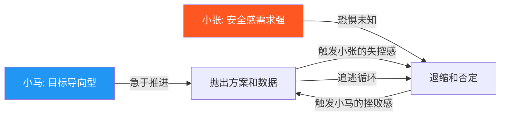
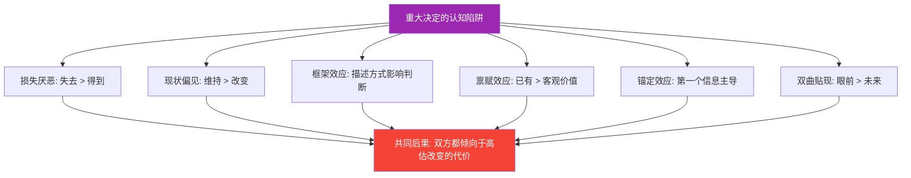
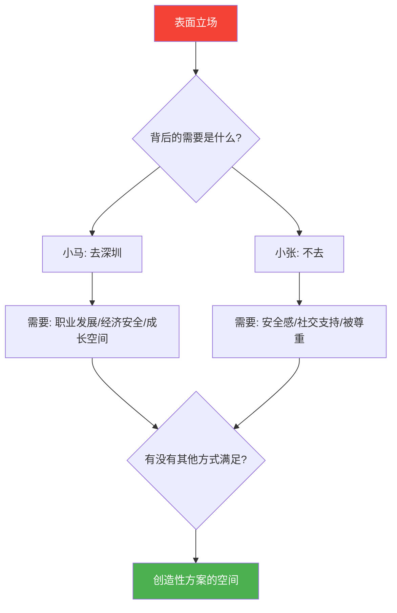
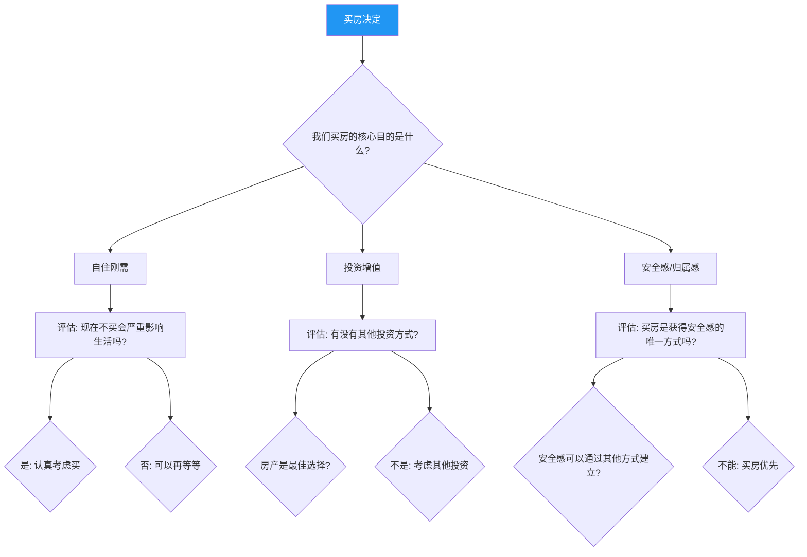

## 场景八：重大决定——"我们该不该买房/生孩子/换城市"

### 8.1 场景全景还原

小马和小张结婚两年，都在省会城市工作。小马是互联网公司的技术主管，最近公司给了一个去深圳发展的机会——负责一条新业务线，薪资翻倍，职级升两级，但需要举家搬迁。小张在本地一家国企做财务，工作稳定，朋友圈和父母都在这里，对搬家毫无兴趣。

周六晚上，两人坐在客厅沙发上。小马酝酿了一周，终于开口：

"张张，有件事想跟你商量。公司给了我一个去深圳的机会，薪资能翻一倍，职级也能升两级……"

话还没说完，小张的脸色就变了："深圳？你疯了吧？我在这边的工作怎么办？我爸妈怎么办？"

小马早料到她会有反应，但没想到这么激烈："你先听我说完嘛，这个机会真的很难得——"

"难得？你觉得难得就去啊，反正你从来没考虑过我的感受。"小张起身回了卧室，把门关上了。

小马一个人坐在客厅，手里还拿着准备好的深圳租房信息截图。他既觉得委屈——"我这不是在跟你商量吗"，又觉得无力——"为什么每次一提这种事，她就直接否定？"

小张在卧室里也不是不难过。她抱着枕头想："我当然知道他有事业心，但我真的不想离开这里。我爸妈年纪大了，我的朋友都在这里，我好不容易在单位站稳了脚跟……如果去了深圳，我什么都不是。"

这个场景的核心不是"去不去深圳"，而是**两个人在面对重大人生决定时，各自的恐惧、需要和价值观如何碰撞，以及如何在碰撞中找到共同的出路**。

#### 8.1.1 为什么重大决定如此特殊

日常争吵（家务分配、回家时间）和重大决定的本质区别在于多个维度：

| 维度 | 日常冲突 | 重大决定 |
|------|---------|---------|
| **不可逆性** | 低——明天可以改 | 高——买房/生子/搬家难以撤销 |
| **影响范围** | 局限于当下情绪 | 改变未来5-10年的人生轨迹 |
| **价值观层面** | 通常停留在行为层面 | 触及"我想成为什么样的人""我想要什么样的生活" |
| **决策压力** | 小——错了也无所谓 | 大——怕做错，怕后悔，怕承担不起后果 |
| **时间窗口** | 没有硬性截止日期 | 常常有deadline（offer有效期、购房窗口、年龄因素） |
| **利益相关方** | 仅涉及两人 | 牵扯双方父母、孩子、职业、财务等多条线索 |
| **情绪烈度** | 短暂波动 | 可能引发身份危机和存在焦虑 |

正因为这些特殊性，重大决定中的沟通比日常冲突难得多。它不仅仅是"好好说话"的问题，而是**两个人如何在人生方向上达成共识**的问题。美国婚姻与家庭治疗协会（AAMFT）的临床数据显示，约67%的伴侣在面临重大决定时会出现沟通僵局，其中近半数会发展为长期关系危机——不是因为决定本身，而是因为决策过程中的沟通伤害。

### 8.2 问题深度诊断

#### 8.2.1 末日四骑士分析

在这场对话中，戈特曼研究所提出的"末日四骑士"出现了两个：

| 骑士 | 小马的表现 | 小张的表现 |
|------|-----------|-----------|
| **批评** | — | "你从来没考虑过我的感受"——攻击人格而非讨论问题 |
| **防御** | "你先听我说完嘛"——合理但在对方情绪激动时显得推卸 | — |
| **石墙** | — | 起身回卧室关门——物理性切断沟通 |
| **蔑视** | — | "你觉得难得就去啊"——讽刺性的语气暗示对方自私 |

小张的"你从来没考虑过我的感受"这句话是典型的**泛化批评**——用"从来""总是""每次"这样的词把一个具体事件升级为对人格的否定。小马听到这句话的第一反应不是倾听，而是自卫，因为他觉得自己明明在"商量"，怎么就变成了"没考虑感受"？

小张关门离开则是**石墙**——在重大决定的讨论中，石墙的杀伤力尤其大，因为对方会觉得"你连谈都不愿意谈，那我怎么跟你一起做决定？"

戈特曼研究所的纵向研究发现，当四骑士中的任意两个同时出现时，对话达成共识的概率从正常的65%骤降至不足12%。这也是为什么在重大决定的场景中，管控情绪反应比讨论方案本身更优先。

#### 8.2.2 依恋模式视角

小马的依恋模式偏向**目标导向型**——他已经想好了方案（去深圳），带着"解决方案"来谈，期待对方配合执行。这种模式的核心恐惧是"我的努力不被认可"。

小张的依恋模式偏向**安全感导向型**——她首先评估的是"这会不会威胁到我现在拥有的东西"。这种模式的核心恐惧是"失去控制"和"失去安全基地"。

当小马带着方案来谈时，小张感受到的不是"他在跟我商量"，而是"他已经决定了，只是通知我"。即使小马的本意确实是商量，但因为他带着"深圳租房信息截图"这个具体方案，小张感受到的是**既成事实的压力**。

从依恋理论的角度看，小马的"追"和小张的"逃"形成了一个经典的**追逃循环**（Demand-Withdraw Pattern）。明尼苏达大学的研究表明，追逃循环是伴侣冲突中最具破坏力的互动模式——追赶方越追，逃避方越逃；逃避方越逃，追赶方越追。在重大决定的场景中，这个循环一旦启动，双方都会觉得"对方根本不理解我"，实际上双方都理解不了对方，因为各自的神经系统已经被激活到了战斗-逃跑模式。

#### 8.2.3 情感账户视角

用情感账户模型来分析：

- **存款不足**：小马在提出这个重大话题之前，没有先做情感铺垫。没有先花几周时间聊"你觉得我们未来想在哪里生活""你对职业发展怎么看"这样的开放性话题
- **大额取款**：小马把方案直接端上来，让小张感到被"决定"了——这是一次大额取款
- **隐性取款**："你先听我说完嘛"——虽然是合理的请求，但在对方情绪激动时，这句话听起来像是在说"你不理性"
- **信用额度**：结婚两年，情感账户可能有一定余额，但不足以覆盖"人生轨迹改变"这个级别的支出

戈特曼研究所提出，伴侣间的情感账户有一个"放大效应"：在情绪平静时的一笔存款（比如一个拥抱），在激烈冲突时可能需要五笔同等级的存款才能抵消一笔取款。重大决定的讨论天然伴随着高情绪激活，这意味着如果情感账户余额不足，讨论几乎不可能产生建设性结果。

**情感账户的预先充值策略**：在提出重大话题之前的1-2周，有意识地增加日常存款——多问对方的感受、主动做家务、安排一次约会、认真倾听对方的烦恼。这些看似无关的小动作，实际上在为即将到来的艰难对话积累"缓冲资金"。

#### 8.2.4 非暴力沟通四维度的缺失

| NVC维度 | 小马的实际表达 | 应该有的表达 |
|---------|--------------|-------------|
| **观察** | ❌ 直接抛方案，没有铺垫 | ✅ "最近公司给了我一个机会，我想跟你聊聊" |
| **感受** | ❌ 完全跳过感受，直接进入方案 | ✅ "我挺激动的，但也有点纠结，因为知道这会影响我们俩" |
| **需要** | ❌ 未表达需要 | ✅ "我想听听你的真实想法，因为我很在意你的感受" |
| **请求** | ❌ 隐含的请求是"同意我去" | ✅ "我们能不能这周找个时间，各自想想，然后一起聊聊？" |

小张的问题同样明显：

| NVC维度 | 小张的实际表达 | 应该有的表达 |
|---------|--------------|-------------|
| **观察** | ❌ "你从来没考虑过我的感受"（泛化） | ✅ "你刚才直接说要去深圳，我感到很突然" |
| **感受** | ❌ 用愤怒掩盖恐惧 | ✅ "我感到害怕和不安" |
| **需要** | ❌ 未表达 | ✅ "我需要在重大决定上感到被尊重和参与" |
| **请求** | ❌ 无请求，直接离开 | ✅ "我现在情绪有点激动，能不能给我一点时间消化，明天再聊？" |

这里需要特别说明的是：NVC不是"话术"，它是一种**内功**。上面的"应该有的表达"不是让小马和小张去背台词，而是帮助他们理解——当跳过感受直接进入方案时，对方接收到的信息和你意图传递的信息之间会出现巨大的鸿沟。NVC的四步骤是帮助你缩小这个鸿沟的框架。

#### 8.2.5 决策心理学视角

重大决定中的沟通困难，还涉及几个决策心理学的认知陷阱：

**损失厌恶（Loss Aversion）**：心理学家卡尼曼和特沃斯基的研究表明，人对损失的敏感度是收益的2-2.5倍。对小张来说，"离开朋友圈和父母"是确定的损失，而"小马薪资翻倍"是不确定的收益——前者在心理上的权重远大于后者。

**现状偏见（Status Quo Bias）**：人倾向于维持现状，因为现状是已知的、可预测的。搬家意味着进入未知，而未知天然让人焦虑。康奈尔大学的研究发现，在面临重大生活变化时，约73%的人会低估"维持现状"的真实成本——他们把现状当作零点，只计算变化的代价，却不计算不变化的代价。

**框架效应（Framing Effect）**：小马说的是"去深圳发展"（正面框架），小张听到的是"离开这里"（负面框架）。同一件事，不同的描述方式会引发完全不同的情绪反应。

**禀赋效应（Endowment Effect）**：人对自己已经拥有的东西赋予更高的价值。小张对自己在本地的工作、朋友圈、和父母的距离都有"禀赋溢价"——这些东西在她心里的价值远高于客观价值。

**锚定效应（Anchoring Effect）**：小马带着深圳租房信息截图来谈，这无意中设置了"搬家"这个锚点。即使后来讨论"去不去"，小张的思维已经被锚定在了"搬家"的框架里，而不是"我们的未来可以是什么样"的更开放的框架里。

**双曲贴现（Hyperbolic Discounting）**：人倾向于过度看重眼前的确定性，而低估未来的收益。小马看到的是"未来的职业发展"，小张看到的是"现在就要失去的一切"。这不是谁对谁错，而是人类大脑处理短期确定性和长期不确定性时的天然偏差。

理解这些认知陷阱不是为了让一方去"说服"另一方，而是帮助双方意识到：**你感受到的恐惧和抗拒，有一部分是大脑的默认设置，不完全等于现实的危险程度**。当双方都能以这个视角审视自己的反应时，对话会变得更理性、更有弹性。

#### 8.2.6 神经科学视角：压力下的大脑

重大决定讨论中的沟通失败，有一个生理层面的原因：**当人感受到威胁时（包括心理威胁），杏仁核会启动应激反应，前额叶皮层的理性思考能力会显著下降**。

具体来说：
- 当小张听到"去深圳"的瞬间，她的杏仁核把这识别为"威胁"——威胁到她的安全基地、社交网络、职业身份
- 杏仁核的激活导致应激激素（皮质醇、肾上腺素）大量分泌
- 在这种状态下，她的前额叶皮层（负责理性思考、共情、长期规划）的功能被抑制
- 所以她的第一反应不是"理性分析利弊"，而是"战斗或逃跑"——表现为愤怒（战斗）和关门离开（逃跑）

同样的过程也发生在小马身上：当他感到自己的提议被否定时，他的杏仁核也把这识别为"威胁"——威胁到他的职业前景和自我价值感。

这就是为什么**在情绪激动时讨论重大决定是徒劳的**——双方的大脑都处在应激模式下，理性的沟通几乎不可能发生。等待情绪平复（通常需要20-30分钟，让应激激素水平下降）不是"逃避"，而是让双方的大脑从"生存模式"切换回"思考模式"。

### 8.3 完整重建方案

#### 8.3.1 第一阶段：情绪降温（当夜）

当小张关门离开后，小马面临两个选择：追进去继续谈，或者等一等。**在这种情况下，等一等是更好的选择**——不是放弃，而是给双方消化情绪的空间。

**小马的正确做法（代替追进去或生闷气）：**

> 给小张发一条微信："我知道你现在很不舒服，我也需要消化一下。今晚我们先各自想想，明天下午一起聊聊，好吗？不管最后怎么决定，我都希望是我们一起决定的。"

这段话做了四件事：
1. **承认**对方的情绪——"我知道你很不舒服"
2. **表达**自己的状态——"我也需要消化"
3. **设定**再次对话的时间——"明天下午"
4. **传递**核心信息——"一起决定"

**小张的正确做法（如果感到无法承受）：**

如果情绪过于激动，无法当场对话，可以说：

> "我现在脑子很乱，说不出来是什么感觉。你给我点时间，我整理一下自己的想法，明天跟你好好说。"

这比直接关门好一万倍——它传递了"我不是在拒绝沟通，我只是需要时间"。

**降温期间的自我调节方法：**

| 方法 | 适用场景 | 具体操作 |
|------|---------|---------|
| 生理降温 | 情绪高度激活 | 深呼吸（4秒吸-7秒持-8秒呼）重复5次，激活副交感神经 |
| 身体活动 | 焦虑、愤怒 | 出门散步15-20分钟，运动能消耗应激激素 |
| 书写倾泻 | 脑子里停不下来 | 把所有想法写在纸上，不整理不修饰，写完合上 |
| 正念觉察 | 反复回放对话 | 关注呼吸，每当想到对方的话就轻轻拉回呼吸 |
| 自我对话 | 自责或怨恨 | "我现在很生气/难过，这是正常的。我不需要现在就想明白。" |

#### 8.3.2 第二阶段：各自梳理（当天晚上到第二天）

这一步至关重要，却被90%的人跳过。在重新对话之前，双方需要各自完成以下梳理——不是为了"说服对方"，而是为了"理清自己"。

**小马的自我梳理清单：**

1. **我为什么想去？** 表面原因是薪资翻倍，但深层原因是什么？
   - 是经济压力？（房贷、未来孩子的教育基金？）
   - 是职业天花板？（在本地已经没有上升空间？）
   - 是个人成长？（想接触更大的平台？）
   - 是不甘心？（觉得自己值得更好的？）
2. **如果不去，我会有什么感受？** 遗憾？被束缚？怨恨小张？
3. **如果去了，小张会失去什么？** 具体列出来——工作、朋友圈、父母、熟悉的环境
4. **我最核心的需要是什么？** 是"去深圳"本身，还是"职业发展"？如果是后者，有没有其他途径？
5. **我能为小张的担忧做什么？** 不是空洞的承诺，而是具体可执行的方案

**小张的自我梳理清单：**

1. **我为什么不想去？** 表面原因是不想离开，但深层原因是什么？
   - 是对未知的恐惧？（去了不知道能做什么？）
   - 是社交依恋？（离不开朋友和家人？）
   - 是职业考量？（国企的稳定不想放弃？）
   - 是控制感？（不想被别人的决定牵着走？）
2. **如果去了，我最坏的预想是什么？** 找不到工作？孤独？后悔？
3. **如果不去，小马会失去什么？** 具体列出来——薪资、职级、平台、机会
4. **我最核心的需要是什么？** 是"留在这里"本身，还是"安全感"和"被尊重"？如果是后者，有没有其他途径？
5. **我对深圳的抗拒有多少是基于事实，多少是基于想象？** 有没有办法获取更多信息来降低不确定性？

这一步的关键是**区分"立场"和"需要"**。小马的立场是"去深圳"，但背后的需要可能是"职业发展"和"更好的经济基础"。小张的立场是"不去"，但背后的需要可能是"安全感"和"被尊重"。

**梳理的实用工具——"需要-恐惧双栏表"：**

| 我的核心需要 | 我的核心恐惧 |
|------------|------------|
| （填写你的3-5个核心需要） | （填写你的3-5个核心恐惧） |
| 例：职业发展机会 | 例：到新城市找不到同等好的工作 |
| 例：经济安全感 | 例：生活质量大幅下降 |
| 例：被伴侣尊重和理解 | 例：成为"附属品" |

这张表的最大价值在于：**当你把恐惧写下来时，它们从"一团模糊的焦虑"变成了"具体的、可以讨论的问题"**。具体的恐惧可以被回应，模糊的焦虑不能。

#### 8.3.3 第三阶段：感受优先的对话（第二天）

重新对话时，最关键的原则是：**先谈感受和需要，再讨论方案。**

**环境准备**：
- 选择双方都放松的时间和空间（不是刚下班、不是饭点、不是有deadline的前夜）
- 关掉手机通知，创造不受打扰的环境
- 面对面坐（不要隔着餐桌，最好并排坐在沙发上，减少对峙感）
- 准备水和纸巾——情绪可能会涌现

**开场模板：**

> "小张，关于昨天的事，我想先跟你聊聊你的感受。在讨论去不去之前，我想先听听——你对这件事最担心的是什么？最在意的是什么？"

这段开场做了两个关键的事：
1. **明确**"先聊感受"——给对方信号：现在不是要你做决定
2. **用开放式问题**——"最担心什么""最在意什么"，而不是"你同不同意"

**小张可能的回应：**

> "我最怕的是去了之后什么都变了。我在这里有稳定的工作，有几个特别好的朋友，我爸妈就在这边，我每周都能去看他们。如果去了深圳，我变成什么了？一个跟在你后面的附属品？"

**小马的正确回应（倾听+情感确认）：**

> "我听到了。你担心的是去了之后会失去自己——你的工作、你的社交圈、你和父母的距离。你不想变成'跟着我走'的那个人，你想有自己的生活。这对我来说很重要，因为我也不想让你为了我的机会而牺牲你的生活。"

注意这段回应的结构：
1. **重述**对方的担心——"你担心的是……"
2. **提炼**核心感受——"你不想变成附属品"
3. **表达**自己的立场——"我也不想让你牺牲"

然后小马表达自己的感受：

> "对我来说，这个机会不只是钱的问题。我在现在的团队已经干了三年，上升空间越来越小。我知道如果不去，我会一直想'如果当初去了会怎样'。我不想到了四十岁回头看，觉得自己因为害怕而错过了。但我也听到了你的担忧，我不想让你为了我的事业而不幸福。"

**对话中的关键倾听技巧：**

| 技巧 | 具体做法 | 为什么有效 |
|------|---------|-----------|
| 情感标注 | "听起来你很不安""我能感受到你的恐惧" | 命名情绪能降低杏仁核的激活程度 |
| 重述确认 | "你的意思是……我理解对了吗？" | 避免误解，让对方感到被认真对待 |
| 沉默留白 | 对方说完后等3-5秒再回应 | 给对方空间补充和深化表达 |
| 身体语言 | 点头、眼神接触、身体微微前倾 | 传递"我在认真听"的信号 |
| 暂停标记 | "这个很重要，我想确认我完全理解了" | 让对方知道你不是在敷衍 |

#### 8.3.4 第四阶段：共同探索方案

当双方的感受和需要都被听见之后，才进入方案探索阶段。关键原则是：**不要在"去"和"不去"之间二选一，而是创造性地寻找能满足双方核心需要的方案。**

**引导性问题：**

> "我们能不能一起想想——有没有什么方案，既能满足我对职业发展的需要，又能满足你对安全感和社交支持的需要？"

**可能的方案矩阵：**

| 方案 | 描述 | 满足小马的需要 | 满足小张的需要 | 风险 |
|------|------|--------------|--------------|------|
| **方案A：先去探路** | 小马先去深圳3-6个月，小张留在本地，定期见面 | ✅ 能试试这个机会 | ✅ 不用立刻改变生活 | 异地期间关系可能疏远 |
| **方案B：小张先找工作** | 小马等小张在找到深圳的工作后再一起搬 | ✅ 最终能去 | ✅ 到了之后有自己的事业 | 可能等太久机会没了 |
| **方案C：设定试用期** | 一起去深圳，但约定如果一年后小张很不适应，就回来 | ✅ 能去 | ✅ 有退路，不是一锤定音 | 回来后可能错过本地机会 |
| **方案D：不去，寻找替代** | 不去深圳，但在本地寻找类似的发展机会 | ⚠️ 可能找不到同等机会 | ✅ 不用搬家 | 小马可能遗憾 |
| **方案E：周末夫妻** | 小马去深圳工作，小张留在本地，周末团聚 | ✅ 能抓住机会 | ✅ 生活不变 | 长期异地消耗关系 |
| **方案F：折中城市** | 不去深圳，但一起去一个两个人都接受的城市 | ⚠️ 需要具体评估 | ⚠️ 需要具体评估 | 可能两边都不满意 |
| **方案G：远程+定期驻场** | 谈判远程办公，每月去深圳一周 | ⚠️ 需要公司同意 | ✅ 生活基本不变 | 可能影响晋升效果 |
| **方案H：延后决定** | 争取offer延期3个月，用这段时间深度调研和讨论 | ✅ 保住了机会 | ✅ 有充足时间消化 | 时间压力依然存在 |

**如何评估方案：**

不要在一次对话中做决定。把方案列出来后，各自打分：

| 评估维度 | 权重（各自分配） | 说明 |
|---------|---------------|------|
| 我的满意度 | ？/10 | 这个方案对我个人来说有多好 |
| 对方的满意度 | ？/10 | 我认为这个方案对对方有多好 |
| 可逆性 | ？/10 | 如果不理想，能不能调整 |
| 风险可控度 | ？/10 | 最坏情况我们能不能承受 |
| 执行难度 | ？/10 | 实施起来有多难 |
| 时机匹配度 | ？/10 | 现在是做这件事的好时机吗 |

各自打完分后交换，讨论分数差异最大的维度——那些差异正是需要深入对话的地方。

**方案评估的实操建议**：

1. **信息收集期**：把每个方案需要了解的信息列出来（深圳的租房价格、小张的行业在深圳的就业情况、双方父母的健康状况等），分配给各自去调研
2. **试点测试**：如果可能，用小成本测试。比如方案A，小马可以先去深圳出差一周，小张同行，体验一下那个城市的生活——不是去"考察"，而是去"感受"
3. **财务模拟**：用Excel表格模拟每个方案下的财务状况——月收入、月支出、存款变化、负债情况，用数字代替想象
4. **情感检查**：每个方案评估完后，问自己："当我想到选了这个方案，我的身体是什么感觉？放松还是紧绷？"身体反应往往比头脑更诚实

#### 8.3.5 第五阶段：做出共同决定

当方案讨论到一定深度后，需要做出决定。做决定时的关键原则：

**原则一：这是"我们"的决定，不是"你"或"我"的决定**

> 不要说"那就听你的吧"——这不是共同决定，这是放弃。也不要说"那就按我说的来"——这是独裁。
>
> 要说"我们一起选了这个方案"——即使过程中有妥协，最终的决定是两个人共同认可的。

**原则二：明确"如果后悔了怎么办"**

在做决定时就约定好：

> "我们选了这个方案。如果将来某一天你后悔了或者我后悔了，我们不拿这个决定来互相指责。后悔是正常的，我们可以一起想办法调整。"

这个约定非常重要——它消除了"万一错了就怪你"的恐惧，让双方都能更坦然地做决定。

**原则三：设定复盘节点**

> "我们先试半年。半年后的某个周末，我们坐下来复盘——你过得怎么样？我过得怎么样？这个决定我们还想不想继续？如果需要调整，怎么调？"

复盘节点让决定不是"一锤定音"的，而是可以迭代的。这大大降低了双方的压力。

**原则四：把决定写下来**

听起来夸张，但把决定写下来有三个好处：
1. **避免记忆偏差**——"我当时不是这么说的"
2. **增加承诺感**——写下来比口头说更有约束力
3. **方便复盘**——半年后可以对照当初的预期

**决定记录模板：**

日期：____年__月__日
讨论的重大决定：____________________

我们各自的核心需要：
- 小马：____________________
- 小张：____________________

我们排除的方案及原因：
1. ______，因为______
2. ______，因为______

我们选择的方案：____________________

这个方案的预期：
- 对小马：____________________
- 对小张：____________________

我们各自的承诺：
- 小马承诺：____________________
- 小张承诺：____________________

如果不如预期，我们的调整方案：____________________

复盘时间：____年__月__日

双方签字：
小马：____  小张：____

**原则五：庆祝决定本身**

无论最终选了什么方案，花点时间庆祝"我们一起做了一个决定"这件事。可以是一顿好的晚餐、一个小礼物、或者只是简单地说一句"谢谢你跟我一起面对这件事"。庆祝的不是决定的内容，而是过程——两个人在困难的议题上达成了共识，这本身值得肯定。

### 8.4 三类重大决定的专项指南

#### 8.4.1 买房：要不要背上房贷？

买房是年轻夫妻最常见的重大决定之一。在中国语境下，买房还承载着远超"居住"的文化意义——它与安全感、身份认同、婚姻稳定性、甚至"有没有资格结婚"直接挂钩。

**中国式买房的特殊压力：**

| 压力来源 | 具体表现 | 心理影响 |
|---------|---------|---------|
| 社会期待 | "有房才有家""没房怎么结婚" | 把买房从"选择"变成"义务" |
| 父母介入 | "我们帮你出首付，但要听我们的" | 经济资助捆绑决策权 |
| 攀比心理 | "同学都买房了，我们还在租房" | 焦虑和自卑 |
| 房价焦虑 | "现在不买，以后更买不起" | 仓促决策 |
| 房产证名字 | "写谁的名字就是谁的保障" | 信任危机 |

**沟通中的常见冲突点：**

| 冲突点 | 一方立场 | 另一方立场 | 背后的需要 |
|--------|---------|-----------|-----------|
| 买不买 | "房价还会涨，现在不买以后更买不起" | "背30年房贷太可怕了" | 安全感 vs 自由感 |
| 买哪里 | "买市中心，上班近" | "买郊区，大房子住着舒服" | 便利 vs 生活品质 |
| 买多大 | "至少三居室，以后有孩子" | "两居室够了，何必给自己那么大压力" | 未来规划 vs 当下轻松 |
| 谁出首付 | "我家出了大头，当然听我的" | "凭什么你出钱多就你说了算" | 权力 vs 平等 |
| 写谁的名字 | "写两个人的名字" | "我家出的钱，写我的名字" | 安全感 vs 公平感 |
| 装修风格 | "我喜欢现代简约" | "我喜欢温馨田园" | 审美差异+控制感 |
| 贷款方式 | "多贷点，留现金在手上" | "少贷点，月供压力小" | 风险偏好差异 |

**深度对话模板：**

> "买房这件事，我们先不讨论买不买、买哪里。我想先聊聊——你对'我们未来的家'有什么想象？你理想中每天下班回到的家是什么样的？"

这个问题把讨论从"买不买"（立场层面）拉到了"你想要什么样的生活"（需要层面）。当双方都表达了自己对"家"的想象后，再讨论"买房"是否是实现这个想象的最佳方式。

**决策框架：**

**买房前必做的"五算清单"：**

| 计算项目 | 具体内容 | 参考标准 |
|---------|---------|---------|
| **月供承受力** | 月供 / 家庭月收入 | 建议不超过35%，上限45% |
| **首付来源** | 存款+父母支持-装修-应急基金 | 留够6个月生活费的应急资金 |
| **隐性成本** | 物业费、维修基金、契税、中介费、装修 | 通常是房价的5-10% |
| **机会成本** | 首付如果用于投资的收益 | 对比租房+投资的总收益 |
| **最坏情景** | 如果一方失业，能否撑过6个月 | 必须有应对方案 |

**买房沟通中的常见误区与纠正：**

- ❌ "你看隔壁老王都买了，我们还在租房" → ✅ "我们来分析一下，买房对我们来说最核心的好处是什么"
- ❌ "我家出首付多，所以要听我的" → ✅ "首付的钱代表的是两家人的支持，不代表谁有权做决定"
- ❌ "买不买房是检验爱情的标准" → ✅ "买房是一个经济决策，和爱情有关但不等同"
- ❌ "我不管，反正要买三居室" → ✅ "我想要三居室的原因是____，我们来一起评估"

**实用建议：**
- 在讨论买房之前，先一起算清楚账：月收入、月支出、存款、双方家庭能支持多少、月供占收入比
- 用"如果买了，我们的生活会变成什么样"来具象化——比如"每个月还完贷款后，我们还有多少钱可以自由支配"
- 如果双方意见不一致，设定一个"信息收集期"——花两周时间各自了解房价、贷款政策、不同区域的优劣，然后再讨论
- 考虑"先租后买"策略：在目标区域先租住半年，体验通勤、生活配套、社区环境，再做最终决定
- 如果涉及父母出资，提前讨论并书面确认：出资是赠予还是借款？是否有附加条件？

#### 8.4.2 生孩子：要不要当父母？

生孩子是所有重大决定中**不可逆性最高**的——你不能"退货"。它也涉及最深层的身份认同问题：从"我们两个人"变成"一个家庭"，这个转变会改变一切。

**生育决定的特殊维度：**

生孩子与其他重大决定有一个根本性的区别：它有一个**生物学时钟**。买房可以等、换城市可以等，但女性的生育窗口是有限的。这意味着生育讨论不能无限期搁置，同时也意味着"什么时候讨论"本身就很重要。

| 特殊维度 | 与其他重大决定的区别 |
|---------|-------------------|
| 不可逆性 | 最高——完全不可撤销 |
| 时间窗口 | 有生物学限制，不能无限推迟 |
| 身体影响 | 直接且深远——妊娠、分娩、产后恢复 |
| 身份转变 | 从"个人/伴侣"到"父母"的根本性身份变化 |
| 影响持续期 | 至少18年，实际上是一辈子 |
| 关系冲击 | 产后1-3年是婚姻满意度最低的时期 |
| 经济影响 | 从出生到大学毕业，一线城市估算150-300万元 |

**沟通中的常见冲突点：**

| 冲突点 | 一方立场 | 另一方立场 | 背后的需要 |
|--------|---------|-----------|-----------|
| 要不要生 | "我想要个孩子" | "我还没准备好" | 传承/意义 vs 自由/准备度 |
| 什么时候生 | "趁父母年轻能帮忙带" | "等事业稳定再生" | 家庭支持 vs 职业发展 |
| 生几个 | "至少两个，一个太孤单" | "一个就够了，压力太大" | 理想家庭 vs 经济现实 |
| 谁来带 | "你辞职在家带孩子" | "凭什么是我放弃工作" | 传统角色 vs 平等分工 |
| 教育理念 | "必须上最好的学校" | "快乐童年比成绩重要" | 焦虑 vs 信任 |
| 隔代教育 | "让爷爷奶奶带" | "我不想让老人带孩子" | 资源利用 vs 教育自主权 |

**深度对话模板：**

> "生孩子这件事，我不想催你做决定。我想先聊聊——你对'当父母'这件事，是什么感觉？有什么期待？有什么恐惧？"

**需要探索的深层问题：**

1. **动机层面**：你想生孩子是因为什么？
   - 真心想要一个孩子，体验为人父母的感觉？
   - 来自父母/社会的压力？
   - 觉得"到了该生的年纪"？
   - 想用孩子来"巩固"关系？
   - 担心年龄大了后悔？
2. **恐惧层面**：你害怕什么？
   - 经济压力？（具体化：从怀孕到孩子3岁大概需要多少？）
   - 失去自由？（具体化：你最不想失去的自由是什么？）
   - 身材变化/身体伤害？（了解真实的医学风险和产后恢复方案）
   - 不知道怎么当一个好父母？（这几乎是所有新手父母的恐惧）
   - 关系质量下降？（有研究数据：约70%的夫妻在孩子出生后第一年关系满意度显著下降）
   - 职业中断？（具体化：你的行业对生育间断的容忍度如何？）
3. **分工层面**：孩子出生后，谁做什么？
   - 夜间喂奶/哄睡
   - 日常接送/陪伴
   - 生病时请假照顾
   - 教育规划和执行
   - 家务增量的分担
4. **支持系统**：我们有哪些支持？
   - 双方父母能帮忙吗？帮忙的边界在哪里？
   - 经济上能负担吗？托育、教育的费用算过吗？
   - 有没有可以信赖的亲友？
   - 所在城市有哪些公共服务（产假政策、托育补贴、医疗资源）？

**生育沟通中的"同理心练习"：**

如果一方想要孩子、另一方不确定，可以做这个练习——

想要孩子的一方：
> "如果我不想要孩子，我最害怕的是什么？"（尝试站在对方的立场想）

不确定的一方：
> "如果我很想要孩子，我最期待的是什么？"（尝试站在对方的立场想）

写下来后交换阅读。这个练习的目的不是说服，而是让双方都看到"对方的立场背后有一个合理的、值得尊重的需要"。

**特别注意**：关于生孩子的讨论，有一个常见的沟通陷阱——**把"现在不想生"理解为"永远不想生"**。如果一方说"我还没准备好"，不要立刻认为对方"根本不想要孩子"。追问一句："你是'不想生'，还是'现在觉得还没准备好'？如果是后者，你觉得什么时候或者什么条件下，你会准备好？"

**关于"丁克"的对话框架**：

如果一方明确表示不想要孩子，这个话题需要格外谨慎地处理：
- 不要用"你以后会后悔的"来否定——这是对对方判断力的不信任
- 不要用"你爸妈会失望的"来施压——这是把第三方的需求置于伴侣之上
- 要问的是："这个决定是确定的，还是你愿意在未来某个时点重新讨论？"
- 要做的是：诚实地评估自己能否接受没有孩子的人生——如果不能，这可能是一个根本性的价值观分歧，需要正视而不是回避

#### 8.4.3 换城市：要不要离开舒适圈？

换城市（包括换城市发展、回老家、去另一个国家）通常涉及职业生涯、社交网络、生活方式的全面重组。在当代中国，换城市还叠加了户口、社保、子女教育等制度性因素，使得决策更加复杂。

**换城市在中国语境下的特殊复杂性：**

| 制度因素 | 影响 |
|---------|------|
| 户籍制度 | 影响购房资格、子女入学、社保待遇 |
| 社保转移 | 跨城市社保衔接有损失风险 |
| 子女教育 | 异地高考政策、学区房问题 |
| 医保 | 跨省医保报销比例差异 |
| 公积金 | 异地公积金贷款政策不一 |
| 购房资格 | 限购政策因城市而异 |

**沟通中的常见冲突点：**

| 冲突点 | 一方立场 | 另一方立场 | 背后的需要 |
|--------|---------|-----------|-----------|
| 去不去 | "这个城市没前途了" | "这里是我的家" | 发展 vs 归属 |
| 去哪里 | "去一线城市，机会多" | "回老家，生活成本低" | 机会 vs 安逸 |
| 谁适应谁 | "你跟着我走就行了" | "为什么不是你跟着我" | 主导权 vs 平等 |
| 什么时候回来 | "先去几年再说" | "去了就不会回来了" | 确定性 vs 灵活性 |
| 以谁的职业为中心 | "我的工作更重要" | "凭什么总是迁就你" | 价值排序 |
| 社交重建 | "到了新地方自然会认识新朋友" | "我花了十年才建立的朋友圈" | 社交安全感 |

**深度对话模板：**

> "关于去另一个城市这件事，我想先了解一下——你对现在这个城市最留恋的是什么？如果离开，你最不舍得的是什么？"

然后反过来：

> "你对现在这个城市最不满意的是什么？如果有一个地方能解决这些问题，你会考虑吗？"

**换城市决策的"五维评估法"：**

| 维度 | 评估内容 | 评分（1-10） |
|------|---------|-------------|
| **职业发展** | 新城市的行业机会、薪资水平、职业天花板 | |
| **生活品质** | 住房成本、通勤时间、空气质量、城市便利度 | |
| **社交网络** | 是否有朋友在新城市、重建社交的难度 | |
| **家庭因素** | 离双方父母的距离、父母的健康状况和依赖程度 | |
| **个人成长** | 新环境对个人视野、能力、心态的影响 |
| **制度成本** | 户口、社保、子女教育等制度切换的代价 | |
| **回退可行性** | 如果不适应，回到原来城市的难度有多大 | |

双方各自打分后对比，分数差异大的维度就是需要重点讨论的。

**换城市的"试住策略"：**

在正式搬家之前，如果条件允许：
1. **短期体验**：去目标城市住1-2周，不是旅游，而是模拟日常生活——租房、通勤、买菜、找医院
2. **社交试探**：在目标城市是否有认识的人？能否通过职业社群、兴趣小组提前建立一些连接？
3. **职业预演**：能否远程面试、了解行业情况、甚至先做几个月远程工作？
4. **伴侣体验**：如果一方已经有目标城市的经验，另一方没有，一定要让"没经验的一方"也去亲身体验

#### 8.4.4 辅助场景：辞职创业、大额投资、赡养老人

除了买房、生孩子、换城市这三个最常见的重大决定外，还有几个同样棘手的场景值得简要讨论：

**辞职创业：**
- 核心冲突：一方的"梦想"vs另一方的"安全感"
- 关键问题：创业失败的最坏后果是什么？家庭能承受多久的收入中断？
- 建议策略：设定"止损线"——投入多少资金、多长时间没有起色就放弃？双方共同设定并遵守

**大额投资：**
- 核心冲突：收益预期vs风险承受力的差异
- 关键问题：这笔投资如果全亏了，对家庭生活的影响有多大？
- 建议策略：设定"风险预算"——家庭可投资资产中，多少比例可以用于高风险投资？这个比例由双方共同确定

**赡养老人：**
- 核心冲突：对原生家庭的责任vs小家庭的利益
- 关键问题：赡养的具体内容是什么？经济支持？同住？日常照料？
- 建议策略：分别列出双方父母的现状和需求，制定一个双方都认为公平的方案。核心原则是"谁的父母谁主导沟通，但方案由两个人共同确定"

### 8.5 常见错误与纠正

#### 8.5.1 错误一：带着"答案"来商量

> ❌ 小马拿着深圳租房信息截图来"商量"——这不是商量，这是通知。

**问题**：当你带着一个完整的方案来"商量"时，对方感受到的是"你已经决定了，只是来走个流程"。这直接触发了对方的防御反应。

**纠正**：在提出具体方案之前，先用至少1-2次对话来铺垫——聊感受、聊需要、聊各自的想象。让对方从一开始就参与到决策过程中，而不是在你的方案上"做选择题"。

> ✅ 先聊："最近我在想，我的职业发展好像到了一个瓶颈。你怎么看？你对我们的未来有什么想法？"——这是邀请参与，而不是通知结果。

#### 8.5.2 错误二：用"为了这个家"绑架对方

> ❌ "我去深圳是为了这个家好，你怎么就不理解？"

**问题**：这句话的潜台词是"我的需要就是家的需要，你不同意就是不顾家"。它把一个人的需要包装成了"共同利益"，否定了对方需要的正当性。

**纠正**：区分"我的需要"和"我们的需要"。小马去深圳，首先是满足自己的职业发展需要——这没有错，但不要把它伪装成"为了这个家"。

> ✅ "这个机会对我个人的职业发展很重要。我也相信它最终对我们的家庭有好处，但我不想假装这只是'为了家'。我的个人发展也是这个决定的一部分。"

#### 8.5.3 错误三：把"不想去"等同于"不支持我"

> ❌ "你不去就是不支持我的事业！"

**问题**：支持伴侣的事业不等于必须跟着搬家。小张可以在情感上支持小马的事业发展，但同时不愿意放弃自己的生活。这两件事不矛盾。

**纠正**：区分"支持"和"跟随"。

> ✅ "我知道你支持我，但你也有自己的生活和需要。我们能不能想想，有没有什么方式既能支持我的事业发展，又不用你放弃你的生活？"

#### 8.5.4 错误四：用"别人的案例"施压

> ❌ "你看隔壁老王，他老婆就跟着去了北京，人家现在过得多好。"

**问题**：每对夫妻的情况都不一样。别人的"成功案例"不考虑当事人的情感、需求和具体情况，用它来施压只会让对方感到被比较和被贬低。

**纠正**：关注"我们"的情况，而不是别人的情况。

> ✅ "别人怎么做是别人的事。我更想知道的是——你怎么想？你最在意的是什么？"

#### 8.5.5 错误五：跳过感受，直接进入"利弊分析"

> ❌ "我列了一个Excel表，你看看去了深圳的利弊。"

**问题**：重大决定不是纯理性决策。在情感没有被处理之前，任何"利弊分析"都会被对方视为"说服工具"而非"客观参考"。

**纠正**：先花时间处理情感——确认双方的感受、恐惧和需要都被听见后，再一起做理性的分析。

> ✅ 在双方都表达完感受后："我们一起列一个清单，看看这个决定对我们各自的影响，好不好？"

#### 8.5.6 错误六：用沉默代替拒绝

> ❌ 小张对买房的事一直不表态，每次小马提起就说"再说吧"。

**问题**：沉默不是中立，它传递的信号是"我不愿意参与这个决定"。长期沉默会让对方感到被忽视，最终可能导致对方单独做决定——"既然你不参与，那我自己决定"。

**纠正**：即使你还没有想好，也要把"没想好"说出来。

> ✅ "我还没想好，不是不想讨论。能不能给我一周时间想想，我们下周再聊？"

#### 8.5.7 错误七：做决定后反复反悔

> ❌ 两人决定不去深圳后，小马每隔几天就提一次"当初要是去了……"

**问题**：决定已经做了，反复反悔相当于在告诉对方"都是因为你，我才错过了"。这会在情感账户里疯狂取款。

**纠正**：一旦做了共同决定，就全力以赴往前走。如果真的觉得遗憾，用建设性的方式表达——"我在想有没有什么方式能弥补这个遗憾"，而不是"都怪你"。

#### 8.5.8 错误八：把"讨论"变成"辩论赛"

> ❌ 小马列出八条去深圳的好处，小张列出十条不去的理由，双方各执一词，谁也说服不了谁。

**问题**：当讨论变成辩论，双方的目标从"共同找到最佳方案"变成了"赢"。赢了辩论，输了关系。

**纠正**：把"你vs我"的对立结构变成"我们vs问题"的合作结构。不要试图说服对方，而是试图理解对方。

> ✅ "我不想跟你辩论谁对谁错。我想我们一起想想，有没有什么办法能让两个人都过得好。"

#### 8.5.9 错误九：用"时间紧迫"压缩讨论

> ❌ "offer下周一就过期了，你今天必须给我答复！"

**问题**：时间压力会让人进入应激模式，理性思考能力下降。在被逼迫的状态下做出的决定，即使"正确"，也会留下怨恨。

**纠正**：如果确实有时间限制，诚实地说明，但给对方尽可能多的思考空间。如果实在来不及，可以先申请延期——大多数offer是可以协商的。

> ✅ "我知道时间很紧。我能不能先跟公司申请延期一周？这样我们有更多时间一起想。"

### 8.6 重大决定中的进阶沟通策略

#### 8.6.1 "如果-那么"思维实验

当双方僵持在"去"和"不去"之间时，可以用"如果-那么"思维实验来打破僵局：

> "我们假设一下——如果我们去了深圳，你觉得最坏的情况是什么？我们能承受吗？"
>
> "如果我们不去，你觉得最好的情况是什么？你满意吗？"
>
> "如果我们去了，一年后你非常不适应，我愿意跟你一起回来。你能接受这个前提吗？"

这个方法的好处是：它把一个"做不做"的二元选择，变成了"做了之后可以怎么调整"的动态方案。这让双方都不需要为一个"永恒的决定"负责，大大降低了心理压力。

**更深入的"如果-那么"变体：**

| 思维实验 | 目的 |
|---------|------|
| "如果我们去了，最好的情况是什么？" | 共同描绘理想画面，增强动力 |
| "如果我们去了，最坏的情况是什么？" | 识别风险，制定预案 |
| "如果我们不去，最好的情况是什么？" | 让对方看到"不改变"也有价值 |
| "如果我们不去，最坏的情况是什么？" | 让对方看到"不改变"也有代价 |
| "如果我们去了，你最需要我做什么？" | 明确彼此的支持需求 |
| "五年后回头看，我们更可能后悔做了还是没做？" | 跳出当下，从更长时间尺度审视 |

#### 8.6.2 时间维度的引入

很多重大决定不需要"现在就做"。引入时间维度可以缓解双方的压力：

> "这个offer的有效期是多久？"
>
> "我们能不能给自己一个月的时间？在这一个月里，各自去了解信息、感受自己的想法，然后月底做决定？"

**时间引入的好处：**
- 给双方消化情绪的空间
- 允许收集更多信息
- 避免在情绪激动时做出不可逆的决定
- 让"没想好"有一个合理的安放空间

**时间引入的风险：**
- 不要无限拖延——设定明确的截止日期
- 不要在等待期间不断施压——"你想好了吗？你想好了吗？"
- 在等待期间主动分享自己的新想法——保持对话的开放性

**时间管理的实操建议：**

用"倒推时间表"来管理决策周期：

Day 1:     小马提出话题，小张情绪反应 → 当天结束对话
Day 2:     各自梳理感受和需要（独立完成）
Day 3:     第二次对话：分享各自梳理的结果
Day 4-10:  信息收集期（调研、体验、咨询）
Day 11:    第三次对话：讨论信息和感受
Day 12-14: 方案评估期（各自打分）
Day 15:    第四次对话：做出初步决定
Day 16-17: 最后思考期（确认是否接受）
Day 18:    最终决定 + 记录

#### 8.6.3 第三方视角

当两个人陷入对立时，可以引入一个"虚拟的第三方视角"来帮助跳出僵局：

> "如果我们的女儿十年后面临同样的决定，来找我们问意见，我们会怎么跟她说？"

或者：

> "如果我们现在90岁了，回头看这个决定，我们更可能后悔做了还是没做？"

这种视角转换帮助双方跳出"我的立场vs你的立场"的框架，从更大的时间尺度和更客观的角度来审视问题。

**其他有效的视角转换：**

| 视角 | 问法 | 效果 |
|------|------|------|
| 好友视角 | "如果我们最好的朋友面临同样的情况，我们会给他什么建议？" | 跳出自我利益，用更客观的眼光看问题 |
| 旁观者视角 | "如果一个完全不认识我们的人来看这件事，他会怎么说？" | 去掉情感滤镜，看到事实本身 |
| 未来自己视角 | "10年后的我，会给现在的我什么建议？" | 从长期价值出发做判断 |
| 最坏情景视角 | "做了这个决定，最坏能坏到什么程度？" | 现实化恐惧，评估真实风险 |

#### 8.6.4 处理外部压力

重大决定往往伴随着来自双方父母、朋友、同事的外部压力。这些外部意见会严重干扰两个人之间的沟通。

**常见外部压力类型：**

| 压力来源 | 典型表达 | 你的回应 |
|---------|---------|---------|
| 男方父母 | "你媳妇怎么连这点牺牲都不愿意做？" | "这是我们两个人的决定，需要一起商量" |
| 女方父母 | "嫁那么远，以后我生病了怎么办？" | "您的担心我理解，我们也在考虑这个因素" |
| 朋友 | "你老公让你去你就去啊？" | "这是我们共同讨论的结果" |
| 同事 | "你不会真为了老婆放弃这个机会吧？" | "我的家庭比工作机会更重要" |
| 亲戚 | "你们怎么还不生孩子？" | "我们在合适的时机会考虑的" |
| 社会舆论 | "有房才有家" | "家是由人组成的，不是由房子组成的" |

**处理外部压力的原则：**

1. **两个人的决定，两个人做**——任何外部意见只是参考，不是决定因素
2. **谁的父母谁来挡**——小马的父母施压，小马来回应；小张的父母施压，小张来回应
3. **不把外部意见当武器**——"你妈都说你应该去"这类话是沟通毒药
4. **统一对外口径**——无论内部怎么讨论，对外表达时用"我们一起决定的"
5. **设立信息边界**——不是所有细节都需要告诉父母。分享结论，但讨论过程可以保留为两个人的隐私

**特别处理：中国式父母的介入**

在中国文化中，父母对子女重大决定的介入程度远高于西方。以下是一些实用策略：

- **提前沟通**：在做决定之前，分别和自己的父母沟通，了解他们的想法和担忧，但明确"最终是我们两个人决定"
- **分层汇报**：先告诉父母结论和正面理由，如果他们有异议，再展开讨论。不要一开始就暴露分歧
- **感谢但坚持**："谢谢您的关心和建议，我们会认真考虑。但最终的决定需要我们两个人来做。"
- **经济独立是关键**：如果接受了父母的经济帮助（比如首付），要提前明确这是"赠予"还是"有条件的支持"——经济依赖会让决策权模糊化

#### 8.6.5 建立"重大决定沟通协议"

在第一次重大决定处理完之后（无论结果如何），两人可以建立一个长期可用的沟通协议：

**重大决定沟通协议模板：**

一、触发条件
当任何一方提出涉及以下领域的决定时，启动本协议：
- 住房（买房/卖房/换房/装修）
- 生育（怀孕/生子/教育规划）
- 地理位置（搬家/换城市/出国）
- 职业（辞职/创业/转行）
- 大额支出（超过月收入3倍的开支）
- 家庭责任（赡养老人、亲属借款）

二、沟通流程
1. 提出方先表达感受和需要，不带具体方案
2. 另一方先倾听，不急于表态
3. 双方各自花____天时间梳理自己的想法
4. 正式对话时，先聊感受，再聊方案
5. 列出至少3个可能的方案
6. 各自评估后交换意见
7. 做出共同决定，记录在案

三、底线规则
- 不用"你从来/你总是"开头
- 不在情绪激动时做决定
- 不用对方的父母/朋友来施压
- 不用分手/离婚来威胁
- 做出决定后不反复反悔
- 不在公开场合讨论未达成共识的议题

四、复盘机制
- 重大决定执行____个月后进行复盘
- 复盘内容：预期vs实际，是否需要调整
- 复盘时不追责，只讨论如何优化

五、协议更新
- 每年年底回顾一次本协议
- 根据实际情况调整触发条件和流程

#### 8.6.6 从"一次性决定"到"迭代式决策"

传统思维把重大决定当作"一次性选择"——做了一个选择就定了。但实际生活中，大多数决定都是可以迭代的。把决策模式从"一次性选择"转变为"迭代式实验"，能显著降低双方的压力。

| 传统思维 | 迭代思维 |
|---------|---------|
| "我们必须做出正确的决定" | "我们做出一个合理的决定，然后根据实际情况调整" |
| "决定了就不能改" | "决定是有条件的，条件变了可以调整" |
| "错了就完了" | "错了就复盘、调整、再出发" |
| "谁的方案更好" | "我们先试一个方案，看效果" |
| 决策压力：★★★★★ | 决策压力：★★★☆☆ |

具体做法：
1. **设定实验期**：不是"去不去深圳"，而是"先去深圳试半年"
2. **定义成功标准**：半年后，什么情况下我们认为这个实验成功了？什么情况下需要调整？
3. **预设退出机制**：如果不成功，我们怎么回来？回来后怎么办？
4. **定期检查点**：每个月简短地聊一聊——"目前感觉怎么样？需要调整什么？"

### 8.7 不同阶段关系的决策特点

#### 8.7.1 恋爱期（1-3年）

恋爱期面临重大决定时，双方的信任基础和承诺深度还在建立中。常见的重大决定包括：要不要异地、要不要同居、要不要见家长。

**特点**：
- 情感账户余额较低，经不起大额取款
- 对对方的了解还不够深入，容易误判对方的反应
- "退出成本"相对较低，这既是优势（灵活性）也是劣势（不够认真对待）

**建议**：
- 用重大决定作为了解对方价值观的窗口——不是要立刻达成共识，而是看对方如何处理分歧
- 不要在恋爱初期就做不可逆的重大决定（比如买房写两个人的名字）
- 保持开放心态：对方的"不"不一定是对你的否定，可能是对自己能力的评估

#### 8.7.2 新婚期（1-3年）

新婚期是重大决定的"密集期"——买房、生育、换城市往往集中在这个阶段。

**特点**：
- 两个人的生活正式合并，但合并的"磨合"还在进行
- 双方家庭的介入程度突然增加
- 身份从"个人"转变为"家庭成员"，这个转变需要时间适应

**建议**：
- 建立"重大决定沟通协议"（见8.6.5）
- 不要同时做多个重大决定——如果在考虑买房，就先不要同时讨论生孩子
- 给彼此的适应留出空间——搬到一起住本身就是一个需要适应的重大变化

#### 8.7.3 稳定期（3-10年）

稳定期的重大决定往往涉及"升级"——换更大的房子、生二胎、创业。

**特点**：
- 情感账户有一定积累，但日常消耗也在增加
- 对对方的反应有预期，但这些预期可能已经过时——人会变
- "我们以前不是讨论过吗"——用旧结论来拒绝新讨论

**建议**：
- 不要用"以前讨论过了"来关闭对话——人和环境都在变化，昨天的结论不一定适用于今天
- 定期做"关系年度回顾"——不是讨论具体决定，而是讨论"我们现在的生活是不是我们想要的"
- 保持对对方变化的好奇心——你以为你了解对方，但对方可能已经有了新的想法和需要

#### 8.7.4 中年期（10年+）

中年期的重大决定往往涉及"重新定义"——空巢后的生活、职业转型、赡养老人、中年危机。

**特点**：
- 孩子可能已经长大，两个人需要重新面对"只有我们两个"的关系
- 父母进入需要照护的阶段，赡养决定不可避免
- 职业进入天花板期，可能面临转型或接受现状的选择

**建议**：
- 不要假设对方和10年前一样——花时间重新了解"现在的TA想要什么"
- 中年重大决定往往伴随着身份焦虑——"我的人生就这样了吗？"——这种焦虑需要被承认，而不是被否定
- 寻求外部支持：如果两个人无法有效讨论，考虑找婚姻咨询师协助——中年期的咨询不是"关系有问题"的信号，而是"我们想把关系经营得更好"的选择

### 8.8 数字化决策辅助工具

在处理重大决定时，善用工具能让讨论更高效、更客观。

#### 8.8.1 共享文档协作

| 工具 | 适用场景 | 使用方式 |
|------|---------|---------|
| 腾讯文档/飞书 | 共同编辑方案评估表 | 创建共享表格，各自独立填写分数后对比 |
| 思维导图工具 | 梳理各自的需要和恐惧 | 各自画一张，然后交换讨论 |
| 记账App | 买房/换城市的财务模拟 | 共同追踪一个月的真实支出，为决策提供数据 |
| 日历App | 决策时间管理 | 设定讨论日期、信息收集截止日、最终决定日 |

#### 8.8.2 决策矩阵模板

用表格把感性讨论转化为理性评估：

方案对比矩阵
================

评估维度         方案A    方案B    方案C
                 (去深圳)  (不去)   (先试半年)
-----------------------------------------
小马满意度        ___/10   ___/10   ___/10
小张满意度        ___/10   ___/10   ___/10
经济影响          ___/10   ___/10   ___/10
职业发展          ___/10   ___/10   ___/10
生活质量          ___/10   ___/10   ___/10
可逆性            ___/10   ___/10   ___/10
风险可控度         ___/10   ___/10   ___/10
-----------------------------------------
总分              ____     ____     ____

#### 8.8.3 情绪日记

在决策期间，各自记录每天的情绪变化：

日期：____
今天想到这件事时，我的情绪是：____
情绪强度（1-10）：____
触发这个情绪的想法是：____
如果换个角度想，我会有什么感受：____

情绪日记有两个价值：
1. 帮助自己识别情绪模式——"每次想到搬家我就焦虑"——而不是被情绪淹没
2. 在对话时可以分享给对方——"这是我这段时间的感受记录"——比口头表达更系统、更真实

### 8.9 重大决定后的关系维护

#### 8.9.1 执行期的沟通

做出决定后的执行期，是另一个高风险阶段。因为"讨论决定"和"实际执行"之间存在巨大的心理落差。

**常见执行期问题：**

| 问题 | 表现 | 应对 |
|------|------|------|
| "怎么跟我想象的不一样" | 对现实落差的失望 | 承认落差是正常的，讨论调整方案 |
| "都是因为你我才这样" | 对决定的怨恨转移 | 回到当初的决定记录，回忆共同的承诺 |
| "你根本不在乎我的感受" | 执行中的新冲突 | 用NVC处理当下的感受，不翻旧账 |
| "早知道就……" | 后悔和反刍 | 约定"不后悔"条款，聚焦当下和未来 |

#### 8.9.2 复盘的正确方式

复盘不是"秋后算账"，而是"共同学习"。

**复盘框架：**

复盘日期：____
当初的决定：____
复盘内容：

1. 我们的预期 vs 现实
   - 小马的预期：____ 实际：____
   - 小张的预期：____ 实际：____

2. 意料之外的好事
   - ____
   - ____

3. 意料之外的挑战
   - ____
   - ____

4. 如果可以重来，我们会调整什么
   - ____

5. 这次经历教会了我们什么
   - ____

6. 下次面对重大决定，我们的经验是
   - ____

#### 8.9.3 意见分歧时的底线处理

如果经过所有步骤，双方仍然无法达成共识怎么办？

**底线原则：**

1. **不强迫**——任何一方都不应该被强迫接受一个自己无法接受的决定
2. **不威胁**——"不同意就离婚"不是解决方案，是破坏
3. **不消极对抗**——"好吧，你说了算，反正出了事我不管"——这比直接拒绝更有破坏力
4. **寻求专业帮助**——如果两个人反复陷入僵局，找婚姻咨询师不是"关系有问题"的标志，而是"我们认真对待关系"的标志
5. **接受"暂时搁置"**——有些决定确实需要更多时间。如果现在无法达成共识，可以约定"这个问题我们先放一放，三个月后再聊"。搁置不是逃避，而是承认"我现在还没有足够的信息或智慧来做这个决定"

### 8.10 实操练习

#### 练习一：立场到需要的翻译

把以下"立场表达"翻译为"需要表达"：

| 立场表达 | 需要表达（自己填写） |
|---------|-------------------|
| "我就是要买房" | |
| "我绝对不生孩子" | |
| "我一定要去深圳" | |
| "你不能辞职创业" | |
| "我们回老家吧" | |

**参考翻译：**
- "我就是要买房" → "我需要有一个稳定的、属于我们自己的家的感觉"
- "我绝对不生孩子" → "我现在还没有准备好承担养育一个生命的责任，我需要更多的时间"
- "我一定要去深圳" → "我需要一个能让我职业上有突破的机会，我感到在这里已经到天花板了"
- "你不能辞职创业" → "我害怕经济上的不稳定，我需要有安全感"
- "我们回老家吧" → "我想念家人和熟悉的生活环境，我需要归属感"

#### 练习二：重大决定模拟对话

找一个安静的时间，和伴侣做以下练习——选择一个你们未来可能面临的真实场景：

1. **提出方**：用"感受+需要"的方式开场，不带具体方案
   - "关于______这件事，我的感受是______，因为我需要______。你呢？"
2. **倾听方**：先复述对方的感受和需要
   - "我听到你说的是______，你的感受是______，你需要______。我理解得对吗？"
3. **交换角色**：倾听方表达自己的感受和需要
4. **共同探索**：一起想至少3个可能的方案
5. **评估**：给每个方案打分（满意度、可逆性、风险可控度）
6. **记录**：把讨论结果记录下来

#### 练习三：外部压力应对练习

和伴侣一起列出可能遇到的外部压力场景，然后练习如何回应：

| 压力场景 | 我们的统一回应 |
|---------|--------------|
| 男方父母催买房 | |
| 女方父母反对搬家 | |
| 朋友说"你们怎么还没孩子" | |
| 同事说"你居然为了老婆放弃机会" | |
| 亲戚说"你看人家谁谁都买了" | |

**练习要点：**
- 回应时用"我们"而不是"我"
- 不透露内部讨论的细节
- 感谢关心，但明确决定权在两个人手中
- 对反复施压的来源，可以明确表达边界："谢谢您的关心，这个话题我们已经讨论过了"

#### 练习四：决定记录与复盘

如果你和伴侣最近刚做完一个重大决定（或者正在面临一个），用前面的"决定记录模板"把决定过程记录下来。然后约定一个复盘日期，到时候一起回顾：

1. 当初的预期实现了吗？
2. 有哪些意料之外的情况？
3. 如果可以重来，我们会做不同的选择吗？
4. 下一次面对重大决定时，我们有什么经验可以借鉴？

#### 练习五：需要清单交换

各自独立完成以下清单，然后交换阅读：

**我的核心人生需要（排序1-10）：**
1. ____
2. ____
3. ____
4. ____
5. ____
6. ____
7. ____
8. ____
9. ____
10. ____

选项参考：安全感、自由、成长、归属、被爱、被尊重、经济保障、社交连接、自我实现、健康、创造、稳定、冒险、家庭、事业成就

这个练习的价值在于：**很多伴侣在面临重大决定时才发现，他们从未认真讨论过彼此的核心人生需要**。提前了解对方的价值排序，能在重大决定来临时减少意外和冲突。

### 8.11 关键数据与研究支持

- **决策冲突是婚姻危机的主要触发因素之一**。戈特曼研究所发现，在所有导致离婚的原因中，"无法有效处理重大分歧"排名前三，仅次于"不忠"和"经济问题"。
- **"软启动"在重大决定中的效果更显著**。戈特曼的研究表明，冲突对话的前3分钟决定了96%的结果。在重大决定的讨论中，如果前3分钟是"你从来不考虑我"式的硬启动，后续对话几乎不可能达成共识。
- **共同决策显著提升关系满意度**。发表在《家庭心理学杂志》（Journal of Family Psychology）上的研究表明，在重大决定中感到"被平等对待"的伴侣，关系满意度比"一方主导"的伴侣高出40%以上。
- **"可逆框架"降低决策焦虑**。行为经济学家丹·艾瑞里的研究发现，当人们把决定框架从"这是一个永久的决定"转变为"这是一个可以调整的实验"时，决策焦虑显著降低，决策质量反而提高。
- **损失厌恶在伴侣决策中的放大效应**。卡尼曼和特沃斯基的研究表明，人对损失的敏感度是收益的2-2.5倍。在伴侣决策中，这意味着"我会失去什么"的权重天然大于"我会得到什么"。理解这个偏差，才能更好地平衡讨论。
- **哈佛大学长达85年的"成人发展研究"**追踪了724名参与者的一生，得出的核心结论是：**良好的亲密关系是人生幸福感最强的预测因素**。而"良好的亲密关系"的核心特征之一，就是两个人能够有效处理分歧和共同面对重大决定。
- **产后关系满意度下降有据可查**。戈特曼研究所的追踪数据显示，约67%的夫妻在第一个孩子出生后经历关系满意度的显著下降，但其中有意识地进行关系维护的夫妻，恢复速度比不维护的快2-3倍。
- **追逃循环的破坏力**。明尼苏达大学的研究发现，在伴侣冲突中，追逃循环（一方不断追问、另一方不断回避）是最具预测力的离婚指标之一，预测准确率高达90%。
- **情绪标注的神经科学基础**。UCLA的研究发现，当人用语言准确命名自己的情绪时（"我感到焦虑"而不是"我很烦"），杏仁核的激活程度会显著降低——这个效应被称为"命名即驯服"（Name it to tame it）。

***
