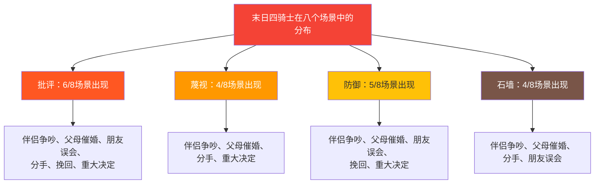
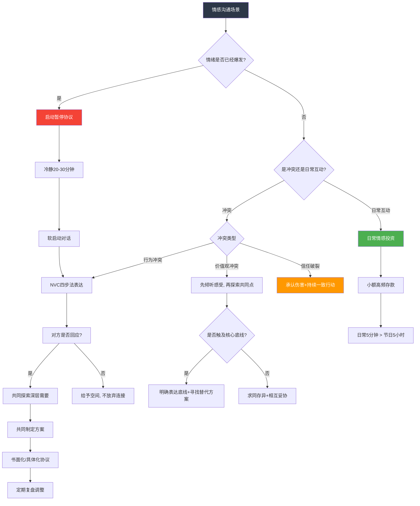

## 案例总结：从八个场景中提炼情感沟通的通用法则

> "当你学会游泳，你不是在每个泳池里用不同的方式浮起来——你掌握的是水性本身。"

八个实战案例已经走完。从伴侣争吵到重大决定，从亲子催婚到朋友误会，从勇敢表白到体面分手——这些场景看似各不相同，但如果你退后一步观察，会发现它们共享着同一套底层逻辑。本节的任务不是简单地复述每个案例的要点，而是**从八个场景中提炼出跨场景的通用法则、可迁移的工具和深层的认知框架**，让你在面对任何情感沟通挑战时，都能快速找到切入点。

为什么要做这一步？因为案例是"鱼"，法则才是"渔"。你不太可能遇到和案例一模一样的情境——你伴侣的性格和小美不同，你父母的表达方式和小陈父母不一样，你朋友圈的社交规则也有差异。但底层的情感机制是相同的：人类大脑处理被拒绝的方式、信任破裂后的修复周期、情绪升级的神经化学过程——这些不因文化、年龄、性格而改变。本节提炼的法则，正是建立在这些跨个体的共同机制之上。

***

### 一、八场景全景回顾

在深入分析之前，先用一张总览表快速回顾每个场景的核心要素：

| 场景 | 关系类型 | 核心挑战 | 末日四骑士出现情况 | 关键策略 | 最重要的认知转变 |
|------|----------|----------|-------------------|----------|-----------------|
| 伴侣争吵 | 亲密关系 | 被忽视感、情绪升级 | 批评+蔑视+防御+石墙，四骑士全部出现 | NVC四步法、暂停协议、情感确认 | 从"攻击-防御"到"表达需要-回应需要" |
| 与父母沟通 | 亲子关系 | 代际观念冲突、边界模糊 | 批评+蔑视（父母）、石墙+防御（子女） | 主动软启动、倾听焦虑根源、建立沟通协议 | 从"对抗观点"到"理解情感" |
| 朋友误会 | 友谊 | 信任受损、信息不对称 | 批评（双方）、防御（双方） | 先核实事实、反映式倾听、给解释机会 | 从"急于辩解"到"先理解对方的伤" |
| 表白 | 暗恋/追求 | 脆弱性暴露、被拒恐惧 | 通常不出现（单向表达） | 真诚直接、不施压、接受不确定性 | 勇气不是不怕被拒，而是怕了仍然去做 |
| 分手 | 关系结束 | 伤害最小化、尊严维护 | 可能出现批评和蔑视 | 清晰、尊重、温柔、不拖泥带水 | 分手也是一种情感沟通，方式决定伤疤大小 |
| 挽回 | 关系修复 | 信任破裂、急于求成 | 防御（"我已经改了你怎么还不信"） | 用行动证明、尊重对方节奏、接受不确定性 | 挽回靠的不是语言，是持续一致的行为改变 |
| 日常关心 | 日常互动 | 被忽视的小事、习惯化 | 通常不出现 | 具体化、行动化、持续性 | 日常的5分钟比纪念日的5小时更重要 |
| 重大决定 | 重大决策 | 利益冲突、恐惧驱动 | 批评+防御（双方） | 感受优先、共同探索、共同承担 | 先处理情感，再处理事务 |

这张表揭示了几个重要规律，下面我们逐一展开。

***

### 二、跨场景的五大通用法则

#### 法则一：末日四骑士是关系的"癌症信号"

八个案例中，**六个场景出现了戈特曼"末日四骑士"中的至少两个**。这不是巧合——四骑士几乎在所有关系冲突中都会以某种形式出现，它们是沟通恶化的可靠预警信号。

**关键规律：四骑士不是同时出现的，而是按特定顺序递进的。**

1. **批评**（批评人格而非描述行为）往往是第一个出现的——"你总是不在家""你从来不考虑我"
2. 如果批评没有被修复，**蔑视**随之而来——翻白眼、讽刺、嘲笑、质疑对方的品格
3. 被蔑视的一方本能地进入**防御**模式——"我不是故意的""你也有问题"
4. 当防御也无法缓解压力时，一方选择**石墙**——沉默、摔门、关闭一切沟通通道

这个递进链条在伴侣争吵场景中表现得最为完整。一旦四个骑士全部到场，戈特曼的研究表明，关系满意度每年下降约12%，离婚预测准确率超过90%。

**实操要点：给自己安装一个"骑士检测器"。** 在任何情感对话中，有意识地监控自己和对方是否出现了四骑士的信号。一旦检测到，立刻采取修复措施——而不是等到四个骑士全部到齐才意识到问题。

| 检测到的骑士 | 立即修复动作 | 修复后的对话转向 |
|-------------|-------------|----------------|
| 批评 | 把"你总是……"改为"这次……我感到……" | 从攻击人格转向描述具体行为 |
| 蔑视 | 暂停，回忆对方的一个优点，重新组织语言 | 从轻蔑转向尊重 |
| 防御 | 说"你说的有道理，让我想想"（即使你不同意） | 从对抗转向接纳 |
| 石墙 | 明确说"我需要20分钟冷静，稍后回来"（而不是消失） | 从逃避转向有承诺的暂停 |

**为什么四骑士比其他冲突模式更具破坏力？** 因为它们各自触发了不同的神经化学反应。批评激活对方的威胁检测系统（杏仁核），蔑视直接攻击对方的自我价值感（前额叶内侧皮层），防御导致双方进入"战斗"模式（交感神经系统激活），石墙则触发对方的"被抛弃"恐惧（与生理疼痛共享脑区的前扣带皮层）。当四种反应叠加时，大脑实际上处于慢性应激状态——这就是为什么长期处于四骑士模式的伴侣会出现免疫力下降、睡眠障碍等躯体症状。戈特曼团队的纵向研究发现，四骑士持续存在的伴侣，其心血管疾病风险比健康沟通伴侣高出35%。

#### 法则二：所有冲突的底层都是未被满足的需要

回顾八个场景，每一个表面冲突的背后，都隐藏着一个或多个未被满足的深层需要：

| 场景 | 表面冲突 | 深层需要 | 需要的满足方式（至少两种） |
|------|---------|---------|----------------------|
| 伴侣争吵 | 回家时间 | 被重视、被陪伴、"我们是一个整体"的归属感 | ①调整回家时间 ②每天15分钟专属陪伴 ③固定约会日 |
| 父母催婚 | 什么时候结婚 | 子女：自主权、被信任。父母：安全感、被需要、面子 | ①定期分享生活动态 ②带父母参加社交活动 ③展示独立能力 |
| 朋友误会 | 是否说了坏话 | 被信任、被尊重、友谊的安全感 | ①当面核实 ②承认伤害 ③制定友谊边界 |
| 表白 | 是否被接受 | 被接纳、被认可、亲密连接 | ①接受结果 ②维护自我价值 ③保持连接 |
| 分手 | 是否继续 | 双方：被尊重、减少痛苦、保留尊严 | ①清晰表达 ②给予空间 ③不诋毁 |
| 挽回 | 能否复合 | 被相信、被原谅、重新获得安全感 | ①行动证明 ②耐心等待 ③接受不确定性 |
| 日常关心 | 是否被看见 | 被在意、被记住、"我在你心里有位置" | ①记住小事 ②主动关心 ③创造仪式感 |
| 重大决定 | 去不去深圳 | 双方：安全感、自主权、被尊重、共同方向感 | ①一起调研 ②设定试用期 ③制定共同标准 |

**这个规律的力量在于：当你能够识别并回应对方的深层需要时，表面冲突往往会自动消解。** 伴侣争吵中小林不需要"每天早回家"——他需要的是让小美感到"我重视你"，而这个目标有多种实现方式。父母催婚中小陈不需要"马上找对象"——他需要的是让父母感到"我的孩子过得好，我放心了"，而这同样可以通过其他方式传达。

这就是为什么"就事论事"在情感沟通中往往失败——你解决了表面问题，但深层需要依然未被满足，冲突就会以另一种形式重新出现。小林按时回家了，但回家后各自刷手机，小美依然感到被忽视；小陈不再提起结婚话题，但每次通话都匆匆挂断，父母的焦虑依然在累积。

**实操工具：需要识别三问法。**

当对方表达不满时，问自己三个问题：

1. **对方表面上在说什么？**（内容层）
2. **对方此刻在感受什么情绪？**（情感层）
3. **这个情绪背后，对方真正需要的是什么？**（需要层）

例如：母亲说"你怎么还不结婚"——
- 内容层：催婚
- 情感层：焦虑、担心、失落
- 需要层：安全感（孩子有人照顾）、归属感（抱孙子的期待）、社交安全感（在亲戚面前有面子）

当你从需要层回应时，沟通的方向完全不同：不是去辩论"该不该结婚"，而是去回应"我理解你的担心，我过得很好，我会认真对待这件事"。

**进阶：如何在对话中实时练习需要识别？** 刚开始练习时，你可以在心里默默走三问流程，大约需要3-5秒。随着练习次数增加，这个过程会变成自动化的"背景运算"——你在正常对话的同时，大脑自动完成内容层→情感层→需要层的分析。戈特曼研究所的数据显示，经过8周有意识练习的伴侣，需要识别的准确率从初始的31%提升到67%。

#### 法则三：情感账户的余额决定了冲突的烈度

八个案例中，**情感账户余额越低的场景，冲突越激烈、越难修复。** 这不是偶然。

| 场景 | 情感账户状态 | 冲突烈度 | 修复难度 |
|------|------------|---------|---------|
| 伴侣争吵（小林小美） | 严重透支——连续两个月缺乏陪伴，存款几乎为零 | ★★★★★ | 需要系统性重建 |
| 父母催婚（小陈） | 长期低余额——沟通频率低，催婚是唯一话题 | ★★★★ | 需要长期投资 |
| 朋友误会 | 中等——平时互动尚可但缺乏深度 | ★★★ | 较容易修复 |
| 表白 | 余额充足——暗恋期间积累了大量正面情感 | ★★ | 风险在于拒后处理 |
| 分手 | 余额耗尽——长期分歧消耗了热恋期的积累 | ★★★★ | 需要尊重和体面 |
| 挽回 | 透支——信任破裂导致账户"冻结" | ★★★★★ | 最难修复的类型 |
| 日常关心 | 不确定——取决于日常互动质量 | ★ | 最容易改善的场景 |
| 重大决定 | 中等——平时关系尚可但缺乏深度对话 | ★★★ | 需要共同探索 |

**核心规律：情感账户的余额决定了对方如何"解读"你的行为。** 同样一句"我今天很累，不想说话"——在账户余额充足时，对方会理解为"他今天工作辛苦了"；在账户余额为零时，对方会解读为"他又在逃避我"。这不是对方"想太多"，而是账户余额影响了解读倾向——这是情感账户模型最精妙的洞见之一。

心理学家约翰·戈特曼将这一现象称为**"积极诠释偏误"（Positive Sentiment Override）**的正反两面：当情感账户充裕时，伴侣倾向于用善意解读对方的行为（"他不回消息一定是在忙"）；当情感账户透支时，同样的行为会被恶意解读（"他不回消息是在忽视我"）。研究表明，这一偏误的转折点大约在正面互动与负面互动的**5:1比率**——即你需要5次正面互动来抵消1次负面互动的影响。这就是为什么偶尔的道歉或补偿无法弥补长期的情感忽视。

**实操要点：建立"情感账户三清单"。**

每月底花15分钟，和伴侣/家人/朋友一起做这个练习：

| 清单 | 内容 | 操作 |
|------|------|------|
| 存款清单 | 这个月对方做的让我感动的事（至少3件） | 写下来，当面告诉对方 |
| 取款清单 | 这个月让我感到受伤的事（诚实写出） | 写下来，选择需要沟通的项 |
| 改进清单 | 下个月我们可以做什么让彼此更开心 | 共同制定1-2个具体行动 |

这个练习的力量在于：它把"情感账户"从一个抽象概念变成了可操作的管理工具。大多数人在做完这个练习后会发现——存款比自己以为的少得多，取款比自己以为的多得多。

**一个常见误区：把"没有取款"等同于"有存款"。** 很多人觉得"我这个月没有吵架、没有惹对方生气，所以关系不错"。但零取款不等于有存款——如果两个人一个月相安无事但也没有任何情感连接，账户实际上在缓慢贬值，因为维持关系本身就需要最低限度的情感投入。类比银行账户：不花钱不等于在赚钱，通货膨胀会悄悄侵蚀你的余额。

#### 法则四：暂停不是逃避，而是最高级的自我管理

在伴侣争吵、父母催婚和重大决定三个场景中，**情绪暂停技术**都起到了关键作用。但暂停是所有技巧中最容易被误解的——暂停的一方会被认为"逃避问题"，而等待的一方会感到"被抛弃"。

八个案例给我们的启示是：**暂停的成败取决于三个要素——告知、承诺、兑现。**

| 要素 | 做法 | 不做会怎样 |
|------|------|-----------|
| **告知** | "我现在情绪很激动，脑子转不动" | 对方不知道你为什么沉默，只能猜测（最坏的猜测） |
| **承诺** | "我需要15分钟冷静，然后我出来我们好好聊" | 对方不知道你要停多久，焦虑持续累积 |
| **兑现** | 说15分钟就15分钟回来 | 承诺不兑现 = 信用破产，下次暂停对方不再信任 |

**进阶认知：暂停的真正价值不是"冷静下来"，而是"阻止杏仁核劫持的完整过程"。**

神经科学研究表明，当情绪被强烈激活时，杏仁核会在前额叶皮层（理性脑）做出判断之前就接管决策——这就是"杏仁核劫持"（Amygdala Hijack）。暂停的20-30分钟不是用来"想清楚"的（你可能根本想不清楚），而是用来让应激激素（皮质醇和肾上腺素）水平下降到前额叶皮层能重新工作的阈值。

这解释了为什么"冷静一下"的建议如此重要——你不是在选择逃避，而是在等待大脑恢复理性工作的能力。

**暂停期间应该做什么？** 不是坐在那里反复回想刚才的争吵（那会持续激活杏仁核），而是进行有意识的生理调节：

1. **深呼吸**：4秒吸气-7秒屏气-8秒呼气，连续5轮。这种"4-7-8呼吸法"能直接激活副交感神经系统，降低心率和皮质醇水平。
2. **身体活动**：散步、做几个深蹲、洗把冷水脸。身体运动能加速代谢应激激素。
3. **自我对话**："我现在的情绪是正常的，但不代表我的判断是准确的。等激素水平下降后，我会有更好的视角。"
4. **绝对不要做的事**：在社交媒体发泄、给朋友打电话单方面控诉、饮酒。这些行为要么强化你的愤怒叙事，要么引入新的变量使问题复杂化。

**一个被忽视的风险：暂停滥用。** 如果你在每次冲突中都选择暂停，对方会感到"你永远在逃避"。暂停是急救措施，不是常规策略。理想状态是：随着你的情感调节能力提升，你需要暂停的频率会逐渐下降——从"每次争吵都暂停"到"只在情绪即将失控时才暂停"。

#### 法则五：改变从一个人开始

八个案例中有一个反复出现的主题：**你不需要等待对方一起改变。**

- 伴侣争吵中，如果小林率先使用NVC软启动，整个对话的走向就不同了
- 父母催婚中，如果小陈主动分享生活（而不是等父母来催），催婚频率会自然下降
- 朋友误会中，如果一方先停下来核实事实（而不是急于辩解），误会可以在几分钟内消除
- 重大决定中，如果小马先倾听小张的恐惧（而不是急于推销深圳的机会），对话才有可能进入建设性阶段

系统理论中有一个重要概念：**改变系统中的一个节点，就能改变整个系统的动力学。** 在情感沟通中，你就是那个节点。当你不再用攻击回应攻击，当你不再用沉默回应沉默，当你开始用"我感到"替代"你总是"——对方的反应模式也会随之改变。

心理学中的"情绪感染"（Emotional Contagion）研究为此提供了科学证据：情绪会在人际间无意识地传递。哈佛大学的研究者发现，当一个人处于积极情绪状态时，其社交网络中三度以内的人的积极情绪也会显著增加。当你变得更加平静、更加开放、更加有安全感时，对方的情绪状态也会受到影响。这不是玄学，而是镜像神经元系统的运作机制。

**但"改变从一个人开始"有一个重要的前提：你的改变必须是真诚的，而不是策略性的。** 如果你使用NVC只是因为"这样更能说服对方"，对方迟早会感受到你话语背后的目的性，信任反而会受损。真正的改变是认知层面的——你真心认同"连接比正确更重要"，你发自内心地愿意理解对方的感受，而不是把沟通技巧当作赢得争论的工具。

**一个常见的担忧："为什么总是我先改变？这不公平。"** 这个感受完全可以理解，但"公平"这个框架在情感关系中是有害的——它把关系变成了交易。更有效的框架是：谁先觉醒，谁先行动。你愿意学习情感沟通，说明你对这段关系的投入更深、对自我成长的意识更强——这不是吃亏，而是优势。在戈特曼的伴侣治疗实践中，往往是一方先开始改变（通常是更愿意学习的那方），6-8周后另一方的行为模式也会出现显著变化。

***

### 三、从八个场景提炼的"情感沟通决策树"

面对任何情感沟通场景，你可以按照以下决策树来选择策略：

**决策树的使用说明：**

**第一步：判断情绪状态。** 这是整个决策树的入口，也是最关键的判断点。如果任何一方的情绪已经进入"红区"（声音升高、语速加快、出现人身攻击、有摔东西的冲动），必须先暂停。不要试图在情绪洪流中讲道理——这就像在暴风雨中修屋顶，不仅修不好，还可能受伤。

**第二步：区分冲突类型。** 三种类型的处理路径完全不同：

- **价值观冲突**（生育观、消费观、人生规划）：这类冲突没有"对错"，核心是寻找共同底线和可妥协的空间。处理原则是"先听感受，再找交集"。比如关于是否要孩子——先理解对方渴望或恐惧的深层原因，再探索是否有折中方案（设定时间节点、先尝试某些准备等）。
- **行为冲突**（家务分配、时间管理、承诺兑现）：这类冲突有明确的行为靶点，最适合用NVC四步法。关键是描述具体行为而非评价人格，提出可执行的请求而非模糊的要求。
- **信任破裂**（欺骗、背叛、反复食言）：这是最难处理的类型，没有捷径。唯一的路径是"承认伤害+持续一致的行动改变"。信任的重建速度是破坏速度的1/10——你用一句话破坏的信任，可能需要一年的行动来修复。

**第三步：对方回应后怎么办。** 如果对方回应了你的软启动，进入"共同探索"阶段——这个阶段的核心是双方一起找到深层需要，然后共同制定方案。重点是"共同"——不是你单方面提方案让对方接受，而是一起 brainstorm。方案需要书面化（哪怕是在手机备忘录里写几行字），因为没有记录的承诺极容易在一周内被遗忘。设定一个复盘日期（通常是两周后），回来检视执行情况并调整。

**第四步：对方不回应怎么办。** 如果你尝试了软启动但对方依然沉默或拒绝沟通——不要反复施压。明确表达你的意愿（"我很想和你聊聊这件事，我随时都在"），然后给予空间。空间不是放弃，而是给对方处理情绪的时间。24-48小时后再尝试一次。如果多次尝试后对方依然拒绝沟通，可能需要考虑引入第三方（共同信任的朋友、专业咨询师）。

***

### 四、关系类型×沟通策略对照矩阵

不同类型的关系需要不同的沟通策略。以下是基于八个场景总结的对照矩阵：

| 策略维度 | 伴侣关系 | 亲子关系 | 友谊关系 | 追求/表白 | 修复/挽回 |
|---------|---------|---------|---------|----------|----------|
| **情感深度** | 最深——需要持续投资 | 深但有代际鸿沟 | 中等——需要定期维护 | 浅但充满期待 | 曾经很深，现在受损 |
| **核心冲突类型** | 需要未被满足 | 观念差异+边界模糊 | 信任受损 | 脆弱性暴露 | 信任破裂 |
| **首选沟通方式** | NVC四步法+深度对话 | 主动软启动+写信/长消息 | 直接核实+反映式倾听 | 真诚直接+不施压 | 行动证明+耐心等待 |
| **暂停策略** | "我需要冷静，20分钟后回来" | "这个话题我们改天再聊" | "我需要想想，明天跟你说" | 不适用 | "我尊重你需要时间" |
| **情感投资重点** | 日常5分钟+每周约会+每月复盘 | 主动分享生活+回家服务行动 | 定期联系+关键时刻出现 | 展示真实的自己 | 持续一致的行为改变 |
| **底线设定** | 不接受蔑视和冷暴力 | 不接受控制和威胁 | 不接受背叛和欺骗 | 不纠缠、不施压 | 不接受反复的伤害 |
| **专业帮助** | EFT伴侣治疗 | 家庭治疗 | 一般不需要 | 不适用 | 伴侣治疗（如果严重） |

**矩阵使用提示：** 这张表不是死板的规则，而是"默认设置"。你的具体关系有其独特性——比如你和父母的关系如果本身就像朋友，那友谊关系的策略可能更适合你。关键是在使用时带着觉察：我用的策略是否匹配这段关系的性质？如果不匹配，问题出在哪里？

**特别说明：亲子关系中的"写信/长消息"策略。** 很多人不理解为什么不直接打电话或当面聊。原因在于：当面沟通时，双方的情绪实时互动，很容易升级为争吵；而文字沟通给了双方缓冲的时间——写的人可以反复修改措辞，读的人可以按照自己的节奏消化。尤其对于代际沟通，文字还能避免方言口音、语气语调带来的误读。如果你和父母的当面沟通总是不欢而散，试着用微信发一段长消息——很多读者反馈，这个小小的改变带来了出乎意料的效果。

***

### 五、八个案例中的高频工具与话术速查

从八个案例中提取出现频率最高的沟通工具和话术模板，供你快速查阅和使用：

#### 5.1 NVC四步法（出现于所有8个场景）

观察：[具体的时间/事件/行为，不含评判词]
感受：[用情绪词汇表达感受，而非想法]
需要：[揭示感受背后的深层需要]
请求：[具体、可行、允许拒绝的行动请求]

**模板示例：**

> "这周你有五天都是九点以后回来（观察），我感到孤独和疲惫（感受），因为我需要你的陪伴和支持（需要）。这周能不能有两天在七点前回来？（请求）"

**NVC常见陷阱及规避方法：**

| 陷阱 | 表现 | 修正方式 |
|------|------|---------|
| 伪装的观察 | "你总是迟到"（"总是"是评判） | "这周三次约会你分别迟到了15、20、10分钟" |
| 感受与想法混淆 | "我觉得你不爱我了"（这是想法） | "我感到不安和害怕"（这是感受） |
| 需要与策略混淆 | "我需要你每天陪我"（这是策略） | "我需要陪伴和连接"（这是需要） |
| 附带条件的请求 | "你能不能别再这样了？"（隐含指责） | "下次类似情况发生时，你能不能先告诉我？" |

#### 5.2 情感确认话术（出现于7个场景）

情感确认的核心是：**承认对方的感受是真实的、可理解的，不等于同意对方的观点或要求。**

| 场景 | 情感确认话术 |
|------|------------|
| 伴侣争吵 | "你一个人带孩子确实很辛苦，你一定很累，也很想我能多陪陪你。" |
| 父母催婚 | "我听到了，你是担心我以后一个人没人照顾。这种担心是很正常的。" |
| 朋友误会 | "你听到那些话一定很受伤，如果换作是我，我也会很生气。" |
| 表白被拒 | "谢谢你告诉我你的真实想法，我能理解，这不会改变我们之间的友谊。" |
| 分手 | "我知道这个消息让你很难受，你有权利感到愤怒和伤心。" |
| 挽回 | "你的不信任是完全合理的，我做了那些事，你不信我是正常的。" |
| 重大决定 | "你害怕离开这里我能理解，这里有你的工作、朋友和家人。" |

**情感确认的三个层次：**

1. **基础层：命名情绪。** "你现在很生气。"——仅仅命名情绪就能降低杏仁核的激活水平（UCLA的Matthew Lieberman团队通过fMRI证实了这一点）。
2. **进阶层：理解原因。** "你生气是因为你觉得被忽视了。"——让对方感到"你懂我"。
3. **深度层：确认合理性。** "换作任何人被这样对待，都会生气。你的反应完全合理。"——消除对方可能存在的"我是不是反应过度了"的自我怀疑。

很多人停在第一层就以为做完了，但真正产生连接效果的是第二层和第三层。

#### 5.3 暂停技术话术（出现于4个场景）

> "我现在情绪很激动，说出来的话可能会伤害你。我需要 ______（时间）冷静一下。______（时间）后我回来，我们再继续谈。"

**注意**：必须包含三个要素——解释原因（"情绪激动"）、给出时间（"20分钟"）、承诺回来（"我回来继续谈"）。

#### 5.4 软启动话术（出现于6个场景）

软启动的核心是：**用"我"开头而非"你"开头，描述感受而非评判人格。**

| 硬启动（错误） | 软启动（正确） | 背后的转变逻辑 |
|--------------|--------------|-------------|
| "你总是不在家！" | "这周你有五天九点以后才回来，我感到很孤独。" | 从攻击人格→描述行为+表达感受 |
| "你怎么还不结婚？" | "我最近特别想和你聊聊你对未来的打算。" | 从施压→发出邀请 |
| "你在背后说我坏话！" | "我听到了一些关于我的话，想跟你核实一下。" | 从指控→求证 |
| "你从来不考虑我的感受！" | "这次的安排让我觉得自己没有被考虑到，我有些失落。" | 从绝对化→具体化 |
| "你怎么又乱花钱！" | "我看到这个月的消费超出了预算，我有点担心。" | 从评判→表达关切 |

#### 5.5 深度倾听三层法（出现于6个场景）

深度倾听不是"安静地等对方说完然后反驳"。它包含三个层次：

| 层次 | 做法 | 示例 |
|------|------|------|
| **听内容** | 准确复述对方说的话 | "你是说，你觉得我不够关心你？" |
| **听情感** | 捕捉对方话语背后的情绪 | "听起来你很委屈，也有点失望？" |
| **听需要** | 理解对方真正想要什么 | "你希望我能更主动地关心你的日常，是吗？" |

大多数人只做到了第一层，少数人做到了第二层，极少数人能做到第三层。但正是第三层——听出对方的需要——才能真正化解冲突。因为当你说出对方自己可能都没意识到的需要时，对方会感到一种深刻的"被理解"，这是任何技巧都无法替代的体验。

***

### 六、误区对照：八个场景中的常见错误模式

综合八个案例，以下是出现频率最高的错误模式及其纠正方法：

| 错误模式 | 出现场景 | 为什么是错的 | 正确替代 |
|---------|---------|------------|---------|
| 用"你总是/从来不"开头 | 伴侣争吵、父母催婚、重大决定 | 绝对化语言触发防御，让对话变成事实争辩 | 用具体时间+具体行为描述 |
| 摔门/沉默/逃避 | 伴侣争吵、父母催婚、重大决定 | 石墙行为激活对方的"社会疼痛"脑区 | "我需要冷静，X分钟后回来" |
| 用道理反驳感情 | 父母催婚、朋友误会 | 数据和逻辑无法回应情感需要 | 先处理情感，再讨论事实 |
| 虚假承诺 | 父母催婚、挽回 | 承诺不兑现 = 信用破产 | 诚实但温和，做出能兑现的承诺 |
| 翻旧账 | 伴侣争吵、朋友误会 | 让当前冲突扩大化，传递"我一直在记仇" | 一次只讨论一件事 |
| 用"我是为你好"包装控制 | 父母催婚、重大决定 | 善意的控制仍然是控制 | 给建议而非下命令 |
| 立刻跳到解决方案 | 伴侣争吵、朋友误会、重大决定 | 对方需要先被听见，然后才能接受建议 | 先共情，再讨论方案 |
| 把"忍耐"当作"包容" | 所有场景 | 压抑≠接纳，忍耐积累怨恨终会爆发 | 72小时测试：还在意就表达 |
| 用补偿替代日常 | 日常关心、伴侣争吵 | 偶尔大额存款不如持续小额 | 建立日常微小习惯 |
| 在公开场合讨论私事 | 父母催婚 | 有观众时双方都更防御 | 敏感话题选择私密安全的环境 |

**自查清单：你是否正在犯这些错误？**

以下问题用于快速自检。如果你对3个以上问题回答"是"，说明你当前的沟通模式中存在需要修正的错误：

1. 你是否经常用"你总是"或"你从来"开头表达不满？
2. 在争吵中，你是否倾向于沉默、摔门或离开现场？
3. 当对方表达情绪时，你的第一反应是否是解释/反驳？
4. 你是否曾经为了结束争吵而承诺自己做不到的事？
5. 你是否会在当前争吵中提起过去的旧账？
6. 当你不同意对方的决定时，你是否用"我是为你好"来施压？
7. 对方分享困扰时，你是否急于给出解决方案而不是先倾听？
8. 你是否觉得"我忍了这么久都没说什么"是一种美德？
9. 你是否只有在特殊日子（生日、纪念日）才会表达关心？
10. 你是否在家人/朋友面前讨论过伴侣的私事？

***

### 七、情感沟通的"道法术器"整合框架

最后，用"道法术器"的框架将八个案例的精华整合为一个完整的知识体系：

```mermaid
graph TD
    A[情感沟通] --> B[道：底层原则]
    A --> C[法：通用方法]
    A --> D[术：场景技巧]
    A --> E[器：工具模板]

    B --> B1["感受没有对错"]
    B --> B2["连接比正确更重要"]
    B --> B3["改变从一个人开始"]
    B --> B4["所有冲突的底层是未被满足的需要"]
    B --> B5["情感账户的余额决定解读倾向"]

    C --> C1["NVC四步法"]
    C --> C2["情感确认"]
    C --> C3["暂停技术"]
    C --> C4["软启动"]
    C --> C5["深度倾听三层法"]

    D --> D1["伴侣：追逃模式识别与打破"]
    D --> D2["亲子：代际焦虑的理解与回应"]
    D --> D3["友谊：信任修复的时机与步骤"]
    D --> D4["表白/分手：脆弱性的勇气与尊严"]
    D --> D5["重大决定：先情感后事务"]

    E --> E1["情感账户三清单"]
    E --> E2["需要识别三问法"]
    E --> E3["关系复盘三问模板"]
    E --> E4["暂停话术模板"]
    E --> E5["NVC改写模板"]

    style A fill:#2d3748,color:#fff
    style B fill:#1a365d,color:#fff
    style C fill:#2b6cb0,color:#fff
    style D fill:#2c5282,color:#fff
    style E fill:#3182ce,color:#fff
```

| 层次 | 含义 | 核心内容 | 在案例中的体现 | 常见误区 |
|------|------|---------|--------------|---------|
| **道** | 底层原则和信念 | 感受没有对错、连接比正确重要、改变从一个人开始 | 每个案例的"认知转变"部分 | 把"道"当鸡汤，只认同不践行 |
| **法** | 通用方法论 | NVC四步法、情感确认、暂停技术、软启动、深度倾听 | 每个案例的"完整重建方案"部分 | 机械套用公式，忽略情境差异 |
| **术** | 场景化技巧 | 不同关系类型的差异化策略 | 每个案例的"变体场景与应对策略"部分 | 用伴侣沟通的方式和父母沟通 |
| **器** | 工具和模板 | 话术模板、清单、复盘框架 | 每个案例的"实操练习"部分 | 有了工具不练习，等到冲突时才翻出来 |

**"道法术器"的核心逻辑是：道为根基，法为框架，术为变通，器为落地。** 没有"道"的支撑，技巧只是话术；没有"术"的变通，方法会变得僵化；没有"器"的落地，理论停留在"知道"层面。四者缺一不可。

**四层之间的依赖关系值得特别说明：**

- **道→法：** 你真正理解了"感受没有对错"（道），你才能发自内心地使用情感确认（法），而不是把它当作"哄人的技巧"。
- **法→术：** 你熟练掌握了NVC四步法（法），你才能在亲子场景中灵活调整为写信的表达方式（术），而不是生硬地对父母念"NVC公式"。
- **术→器：** 你理解了不同关系类型的差异化策略（术），你才能在需要时快速调用对应的话术模板（器），而不是对着模板不知该用哪个。
- **器→道：** 当你反复使用工具（器）并看到效果后，你会更深刻地理解底层原则（道）的正确性——这是"从做中学"的路径。

四层不是线性的从上到下，而是一个螺旋上升的过程：你在实践中回到"道"的层面反思，在反思中提升"法"的掌握度，在掌握后发展出更适合自己的"术"，在"术"的指导下打磨出更精良的"器"。

***

### 八、从案例到生活：你的下一步行动

八个案例已经全部走完。知识如果不在24小时内开始应用，遗忘率将超过70%（赫尔曼·艾宾浩斯的遗忘曲线研究）。以下是最小可行的行动方案——从今天开始：

**第一周（建立基础习惯）：**

| 天数 | 行动 | 耗时 | 预期感受 |
|------|------|------|---------|
| 第1天 | 识别自己的依恋风格，回忆最近一次冲突中自己的反应模式 | 5分钟 | "原来我是这样的人" |
| 第2天 | 为一个重要的人做一件小事（拥抱、感谢、关心的消息） | 1分钟 | 自然、温暖 |
| 第3天 | 用NVC四步法改写最近一次冲突中你说的话 | 5分钟 | 可能有点别扭，正常 |
| 第4天 | 做一次"情绪日签"——今天最主要的情绪是什么？ | 3分钟 | 开始觉察情绪 |
| 第5天 | 主动联系一个你很久没联系的朋友 | 5分钟 | 可能有点不好意思 |
| 第6天 | 和伴侣/家人做一次"情感账户审计" | 15分钟 | 可能会发现意想不到的真相 |
| 第7天 | 回顾这周的练习，哪些感觉自然？哪些还需要练习？ | 5分钟 | 开始形成自我觉察 |

**第二周到第四周（巩固核心技巧）：**

- 每天：情绪日签 + 每日情感存款（1分钟）
- 每周：关系复盘（15分钟），用"复盘三问"模板
- 遇到冲突时：有意识地使用暂停技术 + NVC软启动
- 每月底：情感账户三清单

**第一个月结束后的评估标准：**

| 评估维度 | 达标标准 | 未达标怎么办 |
|---------|---------|------------|
| 情绪觉察 | 能在情绪爆发前识别到"红灯"信号 | 加强每日情绪日签，尝试冥想App |
| NVC运用 | 至少成功使用3次（不完美也算） | 从书面练习开始，先写下来再说 |
| 暂停技术 | 使用过至少1次，且做到了三要素 | 和伴侣提前约定暂停协议 |
| 情感存款 | 有意识地做过至少10次 | 设置手机提醒，固定时间 |
| 关系改善 | 至少一段关系出现了积极变化 | 重新评估是否用对了策略，考虑寻求专业帮助 |

**关键提醒：**

1. **不必完美**。偶尔的失误、情绪的失控、说错的话——都是学习过程的一部分。关键不是永不犯错，而是每次犯错后有所觉察。戈特曼的研究发现，健康伴侣和问题伴侣的差异不在于"是否争吵"，而在于"争吵后是否能修复"——修复尝试的成功率才是预测关系质量的核心指标。

2. **改变需要时间**。伦敦大学学院的Phillippa Lally团队研究发现，建立一个新的自动化习惯平均需要66天（而非流行的"21天"说法）。在这期间你会反复在新旧模式之间摇摆——这是正常的，不是失败。你学骑自行车也不是第一天就能不摔倒的。

3. **你不需要等到"完全准备好"才开始**。在不完美中实践，比在完美中等待更有价值。今天为一个重要的人做一件小事——这就是你情感沟通能力提升的第一步。

4. **如果卡住了，寻求专业帮助不是失败。** 如果你发现某个模式反复出现（比如总是陷入"追逃"循环、总是被同一种话触发情绪反应），这可能意味着有更深层的议题需要在专业指导下处理。EFT（情绪聚焦疗法）伴侣治疗、个体心理咨询都是有效的选择。寻求帮助说明你对关系的重视程度——这是一种勇气，不是软弱。

> 情感沟通不是要赢，而是要连接。不是要证明谁对谁错，而是要让彼此都感到被看见、被理解、被珍视。从今天开始，选择一个场景、一个工具、一个行动——然后去做。

***
