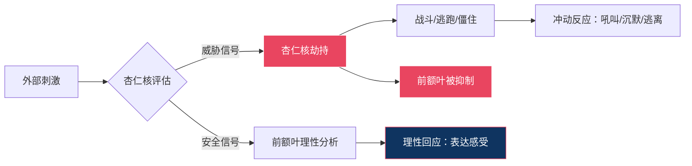
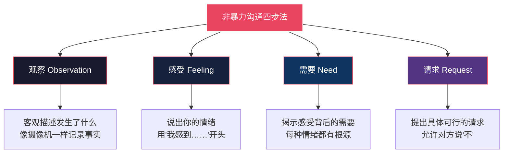
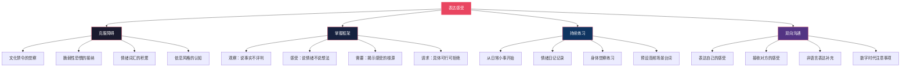

## 一、表达感受：让对方听见你的心

> "被理解是人类最深层的需要之一。而被理解的前提，是你先让对方听见你真正的感受。"

表达感受不是"示弱"，而是一种需要学习和训练的核心沟通能力。心理学研究表明，能够准确识别和表达自身情绪的人，拥有更高的关系满意度、更低的焦虑水平，以及更强的问题解决能力。本节将从"为什么表达感受如此困难"出发，系统讲解表达感受的底层逻辑、核心框架、实操方法、常见误区和进阶技巧，帮助你从"说不出口"走向"自然表达"。

### 1.1 情绪的神经科学：理解你的大脑如何处理感受

在学习表达技巧之前，先理解情绪在大脑中是如何产生的。这不是学术装饰——理解机制能让你在情绪来袭时保持觉知，而不是被情绪绑架。

#### 1.1.1 杏仁核劫持：为什么你会"失控"

大脑中的杏仁核（amygdala）是情绪警报系统。当它感知到威胁时，会在前额叶皮层（负责理性思考）做出判断之前，直接触发"战斗-逃跑-僵住"反应。心理学家丹尼尔·戈尔曼（Daniel Goleman）将这个过程称为"杏仁核劫持"（amygdala hijack）。



**这意味着什么？** 当你情绪激动时，你的大脑在生理上就无法进行复杂的语言组织。这不是"意志力不够"，而是神经机制的限制。所以：

- 情绪高涨时不是练习表达感受的最佳时机——先让自己冷静下来
- "冷静下来"不是压抑情绪，而是给前额叶重新上线的时间
- 深呼吸、数数、暂时离开现场，都是在帮助前额叶恢复功能

#### 1.1.2 情绪的两通路模型

神经科学家约瑟夫·勒杜（Joseph LeDoux）发现，情绪刺激有两条处理通路：

| 通路 | 路径 | 速度 | 特点 |
|------|------|------|------|
| 低通路 | 感觉器官 → 丘脑 → 杏仁核 | 约12毫秒 | 快但粗糙，先反应后理解 |
| 高通路 | 感觉器官 → 丘脑 → 大脑皮层 → 杏仁核 | 约24毫秒 | 慢但精确，先理解后反应 |

低通路让你在看到蛇形物体时先跳开（可能是绳子），高通路让你随后判断"只是根绳子"。情绪沟通中的很多冲突，就是因为低通路的快速反应抢在了高通路的理性判断之前。

**实操意义：** 当你感到情绪涌上来时，给自己24毫秒——不，给自己24秒。这个短暂的停顿足够让高通路完成评估，帮你区分"他真的在攻击我"还是"我只是被触发了旧伤"。

#### 1.1.3 情绪颗粒度：精确命名情绪的能力

心理学家丽莎·费尔德曼·巴瑞特（Lisa Feldman Barrett）的研究表明，情绪颗粒度（emotional granularity）——即区分和命名不同情绪的能力——是情绪调节的基础。能够精确命名情绪的人，不仅情绪调节能力更强，心理健康水平也更高，甚至在面对压力时身体的炎症反应也更低。

为什么"命名"这么有效？因为当你把模糊的情绪体验转化为具体的语言标签时，你实际上在激活前额叶皮层，从而减弱杏仁核的活动。这被称为"情感标签效应"（affect labeling）——说出来的那一刻，情绪的强度就开始下降。

**低颗粒度 vs 高颗粒度的对比：**

| 低颗粒度（模糊） | 高颗粒度（精确） | 精确命名的好处 |
|----------------|----------------|-------------|
| "我不开心" | "我感到失望，因为我的努力没有被看见" | 知道需要被认可，可以提出具体请求 |
| "我烦" | "我感到焦虑，因为截止日期临近但进度落后" | 知道需要支持或调整计划 |
| "我难受" | "我感到孤独，尽管身边都是人" | 知道需要深度连接而非社交应酬 |
| "我不爽" | "我感到嫉妒，因为我觉得自己被替代了" | 知道需要确认自己的价值和位置 |

### 1.2 为什么表达感受如此困难

在探讨如何表达感受之前，必须先理解障碍在哪里。大多数人不是"不想"表达感受，而是被多重因素阻隔了表达的通道。

#### 1.2.1 文化因素：情绪表达的隐性禁令

中国传统文化中，"喜怒不形于色"被视为成熟和有修养的表现。这种文化基因深植于家庭教育中——很多人从小就被反复教育：

- "别哭，哭有什么用"（否定悲伤的合理性）
- "有什么好生气的"（否定愤怒的合理性）
- "男孩子不许哭"（性别化的情绪压抑）
- "你要懂事，别给人添麻烦"（将表达需要等同于麻烦别人）
- "忍一忍就过去了"（将忍耐等同于美德）

这些看似平常的教育方式，其长期效果是：当事人不仅不知道如何表达感受，甚至不确定自己"是否有资格"拥有这些感受。当一个人从小被训练成"情绪是不好的"，成年后自然会觉得表达感受是一件令人羞耻的事。

**文化差异的视角：** 这不是说中国文化"压抑"而西方文化"开放"——不同文化对不同情绪有不同的许可范围。北欧文化鼓励克制，拉丁文化鼓励热情，东亚文化强调和谐。问题不在于文化本身，而在于当某种文化规范让你无法在亲密关系中表达真实的需要时，它就成了阻碍。

#### 1.2.2 脆弱性恐惧：暴露感受等于交出武器

表达真实感受意味着将自己最脆弱的一面展示给他人。"我需要你""我害怕失去你""我觉得自己不够好"——这些话一旦说出口，就给了对方伤害自己的权力。

这种恐惧有其进化根源。在原始社会中，暴露弱点可能意味着被群体排斥甚至死亡。现代人的大脑依然保留着这种防御机制。因此，很多人宁可用愤怒（一种更有力量感、更具攻击性的情绪）来掩盖恐惧和悲伤——因为愤怒让人感觉"强大"，而悲伤和恐惧让人感觉"无力"。

典型表现：
- 伴侣忽视你时，你不是说"我感到被忽视"，而是发火说"你根本不在乎我"
- 朋友爽约时，你不是说"我感到失望"，而是冷暴力说"随便你"
- 同事抢功时，你不是说"我感到不公平"，而是背后抱怨"这人真差劲"

愤怒是"次级情绪"（secondary emotion），它往往是更深层的脆弱感受（恐惧、悲伤、羞耻）的保护壳。

**脆弱性的悖论：** 研究者布琳·布朗（Brené Brown）通过对数千人的深度访谈发现，脆弱性不是软弱——它是勇气的核心。敢于表达"我害怕""我需要你""我做不到"的人，反而被认为更有领导力、更值得信赖、更能建立深度连接。那些"从不示弱"的人，往往拥有最浅层的关系。

#### 1.2.3 语言匮乏：说不出口，因为不知道怎么说

许多人缺乏描述内心感受的词汇。他们可能会说"我不开心"，但无法区分自己此刻的感受究竟是：

| 表面说法 | 可能的真实感受 | 核心需要 |
|---------|-------------|---------|
| "我不开心" | 失望、委屈、孤独、被忽视、无聊、疲惫 | 被看见、被重视、陪伴、休息 |
| "我烦死了" | 焦虑、无助、压力过大、被控制 | 自主权、空间、支持 |
| "我无所谓" | 受伤、心寒、绝望、放弃 | 被在乎、被尊重、希望 |
| "随便吧" | 失望、无力、不被理解 | 被理解、被倾听 |
| "我没事" | 悲伤、委屈、害怕冲突 | 安全感、接纳 |
| "都行" | 疲惫、不想争论、放弃期待 | 被主动关心、被重视 |

#### 1.2.4 依恋风格：童年如何塑造你的表达模式

依恋理论（Attachment Theory）由约翰·鲍尔比（John Bowlby）提出，后经玛丽·安斯沃斯（Mary Ainsworth）和后来的研究者发展。你的依恋风格直接影响你在关系中如何表达（或不表达）感受：

| 依恋风格 | 童年经历 | 成年后的表达模式 | 关系中的表现 |
|---------|---------|---------------|-----------|
| 安全型 | 照顾者敏感、稳定、接纳情绪 | 能自在地表达感受，也能倾听对方 | 信任对方会回应，不害怕冲突 |
| 焦虑型 | 照顾者时而热情时而冷漠 | 过度表达，反复确认，害怕被抛弃 | "你是不是不爱我了？""你为什么不回消息？" |
| 回避型 | 照着者冷漠、拒绝情绪表达 | 压抑感受，强调独立，回避亲密 | "我没事""不用管我""我自己能行" |
| 混乱型 | 照顾者本身是恐惧来源 | 表达混乱，时而黏着时而推开 | "别离开我"同时"你走开" |

**重要提醒：** 依恋风格不是命运。通过有意识的练习和安全的关系体验，不安全依恋可以向"习得的安全型"（earned secure）转变。了解自己的依恋风格，是改变表达模式的第一步。

#### 1.2.5 关系中的"情绪账本"效应

许多人在关系中默默记着一本"情绪账本"：你做了什么让我不开心，我都记着，但我不说。等到某一天，因为一件小事突然爆发，把所有积攒的情绪一起倾泻出来。对方完全懵了——"不就是忘了倒垃圾吗，你怎么发这么大火？"

这种模式的破坏性在于：
- 对方无法从"爆发"中理解你真正的需要
- 对方会觉得你"情绪不稳定""小题大做"
- 你自己也会觉得"为什么我总是控制不住"
- 问题的根源从未被触及，反复循环

定期"清账"——及时表达小的不满——远比积攒到爆发更健康。

### 1.3 表达感受的底层逻辑：情绪-需要-请求链条

在学习具体方法之前，需要先理解一个核心模型：所有情绪都是"需要"的信使。


这个链条说明了一个关键道理：**情绪不是问题，情绪是信号**。就像身体的疼痛告诉你"这里受伤了"一样，情绪告诉你"某个需要没有被满足"。

当你能识别情绪→找到需要→提出请求，沟通就从"互相指责"变成了"互相帮助"。

常见情绪与底层需要的对应关系：

| 情绪 | 可能的底层需要 | 表达方向 |
|-----|-------------|---------|
| 愤怒 | 被尊重、公平、边界被侵犯 | "我需要被尊重" |
| 恐惧 | 安全感、确定性、保护 | "我需要感到安全" |
| 悲伤 | 失去、连接、意义 | "我需要被陪伴和理解" |
| 孤独 | 亲密、归属、被看见 | "我需要感到和你有连接" |
| 焦虑 | 可控感、支持、清晰 | "我需要更多确定性" |
| 嫉妒 | 重视、独特性、安全感 | "我需要确认我在你心中的位置" |
| 羞耻 | 接纳、价值感、认可 | "我需要被接纳，不需要完美" |
| 委屈 | 公平、被看见、被理解 | "我需要你知道我的付出" |
| 无力感 | 自主、能力、希望 | "我需要支持和信任" |
| 厌恶 | 边界、价值观、洁净 | "我需要你尊重我的边界" |
| 内疚 | 修复、责任、弥补 | "我需要修复我们的关系" |

### 1.4 非暴力沟通（NVC）：表达感受的黄金框架

马歇尔·卢森堡（Marshall Rosenberg）提出的非暴力沟通（Nonviolent Communication, NVC）是表达感受最系统、最有效的框架。它包含四个步骤：观察、感受、需要、请求。



#### 1.4.1 步骤一：观察（Observation）——客观描述发生了什么

**核心原则：只说事实，不加评判。**

观察是对事件的客观描述，像摄像机记录画面一样——没有解读，没有评价，没有推测。

**对比示例：**

| 评判（❌） | 观察（✅） |
|-----------|-----------|
| "你总是不理我。" | "这周你有三天晚上加班到十点以后。" |
| "你又乱花钱了。" | "我看到你这个月买了三件新衣服。" |
| "你根本不关心孩子。" | "这学期的家长会你没有参加过。" |
| "你对我越来越冷淡了。" | "最近两周我们没有一起吃过晚饭。" |
| "你太自私了。" | "上次旅行的行程全部按你的喜好安排的。" |
| "你就是个控制狂。" | "你连续三天检查了我的手机。" |

**评判的识别标志：**
- 包含"总是""从来""又""每次"等概括性词汇
- 使用形容词给对方贴标签："自私""冷漠""不负责任"
- 包含推测动机："你是故意的""你就是不想让我好过"
- 使用反问句："你就不能……吗？""你难道不知道……？"

**练习方法：** 在日常对话中刻意练习"摄像机视角"。问自己："如果有人用摄像机录下刚才发生的事，画面上能看到什么？" 把你看到的、听到的具体事实说出来。

**常见困难与突破：**

| 困难 | 原因 | 解决方案 |
|------|------|---------|
| 分不清观察和评判 | 习惯性地给行为赋予意义 | 问自己"这句话里有没有我的解读？" |
| 观察太长，像在翻旧账 | 列举了太多细节 | 只描述最核心的1-2个事实 |
| 观察太模糊，对方不知道在说什么 | 不习惯具体化 | 加上时间、地点、频率等具体信息 |

#### 1.4.2 步骤二：感受（Feeling）——说出你的情绪

**核心原则：用"我感到……"开头，后面跟情绪词汇，而不是想法。**

这一步的难点在于区分"感受"和"想法"——很多人以为自己在表达感受，其实在表达评判。

| 想法/评判（❌） | 感受（✅） |
|---------------|-----------|
| "我觉得你不爱我了。" | "我感到孤独和不安。" |
| "我觉得你在针对我。" | "我感到委屈和困惑。" |
| "我觉得自己没用。" | "我感到沮丧和无力。" |
| "我觉得你在骗我。" | "我感到不安和怀疑。" |
| "我感觉被利用了。" | "我感到愤怒和受伤。" |
| "我觉得你不在乎这段关系。" | "我感到心寒和失望。" |

**判断标准：** 如果这句话可以加上"我认为"变成"我认为你不爱我了"——那就是想法，不是感受。真正的感受是身体和情绪层面的体验，不需要对方做参照物。

**情绪词汇扩展表——让你的感受更精确：**

| 类别 | 词汇 |
|-----|------|
| 需要未被满足时 | 悲伤、沮丧、焦虑、害怕、孤独、无助、失望、委屈、困惑、疲惫、心寒、受伤、愤怒、烦躁、压抑、窒息、麻木、绝望、嫉妒、不安、尴尬、羞耻、内疚、后悔、烦躁、抓狂、崩溃、心碎、憋屈、窝火、心酸、寒心 |
| 需要被满足时 | 开心、感激、温暖、安心、满足、兴奋、感动、踏实、自豪、放心、轻松、幸福、被爱、被理解、被尊重、自由、充实、希望、喜悦、宁静、释然、骄傲、踏实、甜蜜、舒畅、知足 |

#### 1.4.3 步骤三：需要（Need）——揭示感受背后的需求

**核心原则：每一种情绪背后都有一个需要。**

揭示需要的目的不是要求对方满足你，而是帮助对方理解你的感受从何而来。当你把需要说清楚，对方就知道该往哪个方向回应，而不是面对一个模糊的"不开心"束手无策。

**示例：**
- "我感到孤独，因为我需要陪伴和亲密感。"
- "我感到焦虑，因为我需要确定感和安全感。"
- "我感到愤怒，因为我需要被尊重和被当作平等的伙伴。"
- "我感到委屈，因为我需要我的付出被看见和被认可。"

**常见误区：** 很多人跳过"需要"这一步，直接从"感受"跳到"指责"——"我感到愤怒，因为你太自私了！" 这不是NVC，这是换了个开头的指责。"因为你太自私了"是评判对方，不是揭示自己的需要。

**"需要"与"策略"的关键区分：**

| 伪装成需要的策略（❌） | 真正的需要（✅） |
|-------------------|---------------|
| "我需要你每天陪我" | "我需要陪伴和连接感" |
| "我需要你不要和异性来往" | "我需要在关系中的安全感" |
| "我需要你听我的" | "我需要被尊重和被当作平等的伙伴" |
| "我需要你夸我" | "我需要被认可和被欣赏" |

需要是普遍的、深层的；策略是具体的、可替换的。同一个需要可以有不同的满足方式。当你说出真正的需要，对方反而有更多空间去满足你。

**人类基本需要清单**（来自NVC理论）：

| 类别 | 具体需要 |
|-----|---------|
| 身体需要 | 食物、休息、安全感、健康、住所、身体接触、运动、新鲜空气 |
| 自主需要 | 选择权、自由、独立、空间、灵活性、自主决策、隐私 |
| 连接需要 | 爱、亲密、归属、理解、信任、陪伴、接纳、被看见、同理心 |
| 意义需要 | 目标、贡献、成长、创造力、价值感、自我实现、影响力 |
| 尊重需要 | 平等、认可、尊严、公平、被重视、被倾听、被信任 |
| 娱乐需要 | 放松、乐趣、幽默、新鲜感、探索、游戏、美 |

#### 1.4.4 步骤四：请求（Request）——提出具体可行的请求

**核心原则：请求不是命令。请求允许对方说"不"，命令不允许。**

| 命令/模糊（❌） | 具体请求（✅） |
|---------------|-------------|
| "你以后必须每天早点回家。" | "你这周能不能有两天在八点之前回家，我们一起吃晚饭？" |
| "你就不能对我好一点吗？" | "我感到孤单的时候，你能给我一个拥抱吗？" |
| "你别再这样了！" | "下次你生气的时候，能不能先告诉我你需要冷静一下？" |
| "你应该多关心我。" | "今晚你能花二十分钟听我聊聊最近的烦恼吗？" |
| "你能不能正常一点？" | "当你觉得不开心时，能直接告诉我你在想什么吗？" |

**好请求的三个标准：**

1. **具体**：明确说出你希望对方做什么，而不是"别再这样了"。"别再看手机"不如"我们吃饭时把手机放在另一个房间"。
2. **可行**：在对方能力范围内，是当下的行动而非人格改变。"变得更体贴"不可行，"下次我加班时给我发条消息说想我了"可行。
3. **允许拒绝**：真正的请求带着对对方自主权的尊重。如果对方说"不"，你的反应是理解而不是惩罚——那才是请求。如果你会因为对方拒绝而生气——那其实是命令。

**请求 vs 命令的自检：** 问自己——如果对方说"不"，我会怎样？如果答案是"我会尊重他的选择，然后商量其他方案"，那就是请求。如果答案是"我会生气、觉得他不在乎我、冷暴力"，那其实是命令。

**请求的时机与形式：**
- 选对方有精力回应的时刻（不要在对方疲惫、忙碌、刚下班时）
- 一次只提一个请求（多个请求会让对方不知所措）
- 如果对方同意，感谢并确认理解一致
- 如果对方拒绝，询问对方的顾虑，寻找替代方案

#### 1.4.5 完整的NVC表达示例

**场景一：伴侣经常看手机忽略你的分享**

> "亲爱的，我注意到最近我们在一起的时候，你经常在看手机（观察）。当我兴致勃勃地跟你分享一天的事情，却发现你在刷手机时，我感到失落和被忽视（感受）。因为我很看重我们之间的连接和交流，我需要感觉自己在你心里是重要的（需要）。你能不能在我跟你说话的时候先放下手机，哪怕只是五分钟，认真听我说完？（请求）"

**效果对比：**

| 方式 | 说的话 | 对方的感受 | 结果 |
|-----|--------|-----------|-----|
| 指责模式 | "你就知道看手机！我说话你根本没在听！你到底在不在乎我！" | 被攻击、被否定、想要反击 | 吵架，问题不解决 |
| NVC模式 | 观察+感受+需要+请求（如上） | 被尊重、理解你的需要、知道怎么做 | 对话，可能的改变 |

**场景二：朋友总是临时取消约定**

> "小李，上个月我们约了三次，你有两次在当天取消了（观察）。第二次取消的时候，我其实已经推掉了其他安排专门留出时间，所以感到有些失望和不被重视（感受）。因为对我来说，守约代表对彼此时间的尊重，我需要感觉自己在你这里也是优先级（需要）。下次如果你不确定能不能赴约，能不能提前一天告诉我，这样我也好调整安排？（请求）"

**场景三：同事在会议上否定了你的方案**

> "张工，今天会议上我介绍完方案后，你说'这个方案完全不可行'（观察）。当着全组的面被直接否定，我感到有些尴尬和挫败（感受）。因为我希望我们能相互支持，我需要在公开场合得到建设性的反馈（需要）。下次如果你觉得方案有问题，能不能先私下跟我沟通，或者在会上用'我觉得可以优化这几个方面'的方式来提？（请求）"

**场景四：父母过度干涉你的生活选择**

> "妈，上周你打了五个电话问我什么时候结婚，昨天又给我发了三个相亲对象的资料（观察）。我感到有些压力和不被信任（感受）。因为我已经成年了，我需要你相信我有能力为自己的人生做决定，同时也需要在这件事上有自己的节奏和空间（需要）。你能不能在婚恋这件事上，等我主动跟你聊的时候我们再讨论？（请求）"

### 1.5 NVC的常见误用和纠正

NVC是一个强大的框架，但很多人在使用时会走偏，反而让沟通效果更差。

#### 1.5.1 误用一：把NVC当成"话术武器"

**表现：** 机械地套用四步公式，语气生硬，像在背课文。"我观察到……我感到……我需要……我请求……"——对方一听就知道你在"用技术"，反而觉得被操控。

**纠正：** NVC的核心是态度——真诚地表达自己，同时尊重对方。形式可以灵活，关键是内核不变。你可以用自己的方式、自己的语言来表达，只要包含"事实+感受+需要+请求"的核心要素即可。

**自然版 vs 机械版对比：**

| 机械版（❌） | 自然版（✅） |
|-----------|-----------|
| "我观察到你本周加班三天。我感到孤独。我需要陪伴。我请求你这周早点回家。" | "这周你加班了好几天，晚上就我一个人在家，挺孤单的。这周能不能抽两天早点回来，我们一起吃个饭？" |

两个版本包含相同的核心要素，但自然版更像是在和人说话，而不是在填表格。

#### 1.5.2 误用二：用NVC包装控制

**表现：** "我感到不安（感受），因为我需要你每天汇报行踪（伪装成需要的控制），你能不能每小时给我发个定位？（伪装成请求的命令）"

**纠正：** 审视自己的"需要"是否合理。真正的需要是内心深处的基本需求（安全感、被尊重等），而不是对方的具体行为。"我需要安全感"是真正的需要，"我需要你每小时汇报"是试图控制对方来满足需要。

**自检问题：** 我提的这个"需要"，是不是只有一个满足方式？如果只有"对方按我说的做"这一个答案——那不是需要，那是控制。

#### 1.5.3 误用三：跳过观察，直接从感受开始

**表现：** "我感到很受伤（感受），因为你在朋友面前嘲笑我（评判而非观察）。" ——"嘲笑"是你的解读，不是事实。对方可能觉得自己在"开玩笑"。

**纠正：** 严格区分观察和评判。"你在朋友面前说我做饭难吃，大家笑了"——这是观察。"你嘲笑我"——这是评判。

#### 1.5.4 误用四：在对方情绪激动时强行使用NVC

**表现：** 对方正在气头上，你冷静地说"我观察到你现在音量提高了，我感到有些紧张……"——这会让对方更加愤怒，因为你在用"理性"压制他的"情绪"。

**纠正：** NVC的前提是双方都有基本的倾听能力。当对方情绪激动时，先处理情绪（倾听、接纳、共情），等双方都冷静了再使用NVC。情绪高涨时，对方需要的是"你懂我"，而不是"你在教我怎么说话"。

#### 1.5.5 误用五：只表达不倾听

**表现：** 只关注自己的表达，忽略了对方也需要被听见。每次沟通都变成"我来表达我的感受和需要"的独角戏。

**纠正：** NVC是双向的。在表达自己的同时，也要用NVC的框架去倾听对方——"你是不是感到……因为你需要……" 帮助对方也找到自己的感受和需要。

#### 1.5.6 误用六：在严重冲突中期待NVC立竿见影

**表现：** 两人已经积累了大量怨气，你突然开始"我观察到……"，对方根本不买账。你因此得出结论"NVC没用"。

**纠正：** NVC是沟通工具，不是魔法棒。当关系中积累了太多未处理的情绪时，需要先承认伤害、表达歉意、重建信任，然后才能进入建设性对话。有时候，一句真诚的"我知道我之前伤害了你，我很抱歉"比完美的NVC公式更有效。

### 1.6 不同场景下的表达策略

表达感受不是一招鲜吃遍天。不同的关系、不同的场景需要不同的策略。

#### 1.6.1 亲密关系中的感受表达

亲密关系是最需要也最难表达感受的场景，因为情感投入最深，受伤的风险也最大。

**核心要点：**
- **频率比技巧更重要：** 不要等到出了问题才表达感受。日常的正面感受表达（"今天你做的饭真好吃，我很感动"）和负面感受同样重要。心理学家约翰·戈特曼（John Gottman）的研究发现，稳定幸福的伴侣关系中，正面互动与负面互动的比例至少为5:1。
- **身体先于语言：** 有时候一个拥抱、握住对方的手，比说一百句话更能传达感受。在表达脆弱感受时，身体接触可以降低双方的防御。
- **避免"你"字开头的指责：** "你让我很失望"——这句话的主语是"你"，对方听到的是指责。换成"我感到失望"——主语是"我"，对方听到的是你的感受。

**亲密关系中的高频场景处理：**

| 场景 | 常见错误表达 | NVC表达方式 |
|-----|-----------|-----------|
| 对方忘记纪念日 | "你根本不在乎我！" | "今天是我们的纪念日，我注意到没有特别的安排。我有些失落，因为这个日子对我来说很重要，代表我们的感情。明天能不能补过？" |
| 对方和异性朋友走得太近 | "你们什么关系！" | "看到你和XX聊天到深夜，我感到不安。因为我需要在我们的关系中有安全感。你能跟我聊聊你们平时聊什么吗？" |
| 对方不做家务 | "你从来不帮忙！" | "这周我做了大部分家务，感到有些疲惫。我需要我们共同承担家庭责任。我们能不能商量一下分工？" |
| 对方批评你的家人 | "你凭什么说我家人！" | "刚才你说我妈做的饭不好吃，我感到有些难过。因为我需要你尊重我的家人。以后能不能换个方式说？" |
| 对方沉迷游戏/刷视频 | "你就知道玩手机！" | "这周你每天晚上都在打游戏到凌晨，我一个人坐在旁边，感到孤单。我需要和你有相处的时间。你能不能每周留两个晚上我们一起做点什么？" |

**戈特曼的"情感竞标"概念：** 在亲密关系中，人们会不断地向伴侣发出"情感竞标"（emotional bids）——"你看这个好有趣""今天好累""你觉得这件衣服怎么样？"。这些看似随意的话，其实是在试探："你在乎我吗？你关注我吗？"

戈特曼的研究发现，伴侣对情感竞标的回应方式（转向、转离、对抗）直接预测了关系的稳定性。那些"转向"（积极回应）的伴侣，关系满意度远高于那些"转离"（忽略）或"对抗"（否定）的伴侣。

**实操：** 从今天开始，注意对方发出的情感竞标。当对方说"你看这个视频"——放下手机，看一眼，给个回应。这个微小的动作，比任何沟通技巧都有效。

#### 1.6.2 职场中的感受表达

职场中表达感受需要更高的技巧，因为关系边界更严格，情绪表达的空间更小。

**职场感受表达的"安全区"和"危险区"：**

| 安全区（可以表达） | 危险区（慎用/避免） |
|-----------------|-----------------|
| "这个截止日期让我感到压力很大" | "你给我的任务太多了" |
| "我对这个结果感到自豪/失望" | "我对他很愤怒"（指向具体同事） |
| "我希望得到更多反馈" | "你从来不肯定我的工作" |
| "这个变动让我有些不确定" | "公司的决定太荒谬了" |
| "我对这个项目感到兴奋" | "我觉得他们那个方案就是垃圾" |

**职场NVC的调整：**
- 用"压力""不确定""期待"等中性情绪词，替代"愤怒""受伤"等强烈情绪词
- 将"需要"与工作目标挂钩："我需要清晰的方向"比"我需要被尊重"更安全
- 请求聚焦于工作流程："能不能每周有一次一对一的沟通？"
- 选择私下场合表达，避免公开场合让同事/上级难堪
- 职场中"观察"部分可以引用具体数据和事实，增强专业性

#### 1.6.3 亲子关系中的感受表达

对孩子的感受表达有双重功能：既帮助亲子沟通，也在教孩子如何表达感受。

**原则：**
- **接纳孩子的情绪，同时引导表达：** "你很生气，因为玩具被抢走了。你可以告诉我'我很生气'，但不能打人。"
- **父母也可以表达脆弱：** "妈妈今天很累，需要休息一下。不是因为你做了什么，是妈妈自己的需要。"这教会孩子：大人也有情绪，表达情绪是正常的。
- **避免把感受当作控制工具：** "你这样做让妈妈很伤心"——这不是表达感受，这是情感绑架。孩子不应该为父母的情绪负责。
- **根据年龄调整语言：** 对幼儿用简单的词汇（"你害怕了，妈妈在"），对青少年用更平等的方式（"我注意到你最近不太开心，想聊聊吗？"）

#### 1.6.4 数字时代的感受表达

文字消息（微信、短信）是最容易引发误解的沟通方式——没有语气、没有表情、没有身体语言。研究表明，文字沟通中约有50%的情绪会被误读——发送者以为自己传达了温暖，接收者却读出了冷漠。

**文字沟通中的感受表达建议：**

- **加表情符号辅助语气：** "我很失望😔"比"我很失望"更容易被准确理解
- **长段感受尽量语音或面谈：** 文字无法传递情绪的微妙层次，容易被误读为指责
- **先说感受，再发消息：** 如果你正在情绪上头，先不要发消息。写在备忘录里，冷静后再发
- **避免标点符号的情绪放大：** "你为什么这样做？"和"你为什么这样做！！！"——感受完全不同
- **明确表态"我没事"不代表真的没事：** 如果对方说"我没事"但你感觉不对，可以追问"你确定吗？我感觉你好像有些不开心"
- **善用语音消息：** 当文字无法准确传达情绪时，一段30秒的语音消息比打字更有效——声音本身就能传递温度
- **避免在群里表达深层感受：** 私聊比群聊安全100倍。在群里表达不满，不仅对方会防御，还会波及旁观者

**发消息前的"三秒检查"：**
1. 这条消息如果被截图发到朋友圈，我会觉得尴尬吗？（安全检查）
2. 如果对方用最坏的语气读这条消息，会不会被误解？（误读检查）
3. 这件事值得用文字处理，还是应该面对面谈？（渠道检查）

### 1.7 从"说出口"到"被听见"：让表达真正有效

很多人学了NVC，也尝试表达了，但发现"没用"——对方依然无动于衷，甚至更抗拒。问题通常不在方法本身，而在"被听见"这个环节。

#### 1.7.1 时机选择

不要在情绪最激烈的时候尝试沟通。等自己稍微冷静下来，能够用"我"开头说话时再开口。但也不要拖太久——如果超过48小时还没有表达，压抑的情绪可能以更破坏性的方式爆发。

**判断时机的三个信号：**
1. 你能用平静的语气复述发生了什么
2. 你能想到对方可能的合理解释
3. 你表达的目的从"让他知道他错了"变成了"我想解决这个问题"

**不适合表达感受的时刻：**
- 对方刚下班/刚起床/正在忙
- 双方都喝了酒
- 有第三方在场（亲密话题）
- 对方正在处理其他压力事件
- 你自己还处于"战斗模式"（心跳加速、肌肉紧绷）

#### 1.7.2 语气与内容一致

用平静的语气说"我感到很愤怒"，比用愤怒的语气说"我没有生气"更有效。你的语气、表情和身体语言需要与你表达的内容一致。如果嘴里说的是"我需要你的陪伴"，但脸上写满了"你太让我失望了"，对方接收到的永远是后者。

沟通中的信息传递比例（梅拉比安法则）：

| 信息来源 | 占比 | 说明 |
|---------|------|------|
| 语言内容 | 7% | 你说的具体词汇 |
| 语音语调 | 38% | 声音的高低、快慢、轻重 |
| 面部表情和身体语言 | 55% | 眼神、手势、姿态 |

这意味着：你说的内容只占7%，对方更多地从你的语气和表情中感知你的真实意图。

**一致性检查清单：**
- 语气是否与情绪词匹配？
- 表情是否自然放松？
- 身体姿态是否开放（没有交叉双臂、背对对方）？
- 眼神是否温和接触？
- 说话速度是否适中（太快显得焦虑，太慢显得压抑）？

#### 1.7.3 从小事开始练习

不要等到重大冲突时才尝试表达感受。从日常小事开始，建立表达感受的习惯：

- "今天天气真好，我心情很好，想和你出去走走。"
- "刚才那部电影让我很感动，特别是那段父子对话。"
- "你刚才帮我倒了杯水，我感到很温暖，谢谢你。"
- "今天工作上遇到一个难题，我有点焦虑，想跟你聊聊。"

这些日常的正面感受表达，会逐渐降低双方的防御，让"表达感受"变成关系中的常态而不是"有事才谈"。

**正面感受表达的倍增效应：** 表达正面感受（感激、欣赏、喜悦）的成本极低，但回报极高。很多人的误区是只在"有问题"时才表达感受——这会让"表达感受"本身和"冲突"划上等号。当正面感受表达成为习惯，负面感受表达也会变得更自然。

#### 1.7.4 给对方"接收"的空间

表达完感受后，给对方时间消化。很多人犯的一个错误是：表达完之后立刻追问"你怎么想？""你说啊！"——这会给对方巨大的压力。

**正确的节奏：**
1. 表达你的观察、感受、需要、请求
2. 停下来，给对方5-10秒的思考时间
3. 如果对方沉默，可以说"你不用马上回答，想一想就好"
4. 如果对方开始表达，认真倾听，不要打断
5. 对方表达完后，先反馈你听到的："你是说你感到……因为你需要……"

#### 1.7.5 如何接收对方表达的感受

表达感受是双向的。当对方向你表达感受时，你的回应方式决定了对方是否会继续向你敞开。

**接收感受的四步法：**

| 步骤 | 做法 | 示例 |
|------|------|------|
| 1. 倾听 | 放下手机，保持眼神接触，不打断 | 放下手里的事，面向对方 |
| 2. 确认 | 复述对方的感受，确认理解正确 | "你是说你感到失望，因为……" |
| 3. 接纳 | 不评判、不否定、不急于解决问题 | "我理解你的感受，这确实让人不好受" |
| 4. 回应 | 询问对方需要什么，或分享自己的感受 | "我能做些什么？"或"我也有这样的感受……" |

**最伤害对方的回应方式：**
- 否定感受："这有什么好生气的"
- 急于辩解："我不是那个意思，你误会了"
- 反击："你还好意思说我，你上次……"
- 说教："你应该这样想……"
- 轻视："你想太多了"
- 冷漠："哦"

这些回应的本质都是在说："你的感受不重要"或"你的感受是错的"。即使你不同意对方的解读，对方的情绪体验本身是真实的——先接纳感受，再讨论事实。

### 1.8 表达感受的进阶技巧

#### 1.8.1 身体觉察：从感受身体开始

很多人感受不到自己的情绪，因为他们长期习惯了"忽视"身体信号。情绪不是纯心理现象——每一种情绪都有身体对应：

| 情绪 | 身体感受 | 位置 |
|-----|---------|-----|
| 焦虑 | 胸口发紧、心跳加快、手心出汗 | 胸腔、手掌 |
| 愤怒 | 身体发热、肌肉紧绷、下巴收紧 | 全身、面部 |
| 悲伤 | 喉咙发堵、胸口沉重、眼眶发酸 | 喉咙、胸口 |
| 恐惧 | 胃部收缩、手脚冰凉、呼吸变浅 | 腹部、四肢 |
| 羞耻 | 脸部发热、想钻地缝、身体蜷缩 | 面部、全身 |
| 喜悦 | 身体轻盈、胸口暖热、嘴角上扬 | 全身、面部 |
| 嫉妒 | 胃部翻搅、胸口刺痛 | 腹部、胸口 |
| 内疚 | 胸口沉闷、肩膀沉重 | 胸部、肩部 |

**身体扫描练习（3分钟）：**

1. 闭上眼睛，做三次深呼吸（吸4秒-屏4秒-呼6秒）
2. 从头顶开始，慢慢将注意力移动到脚底
3. 注意身体的任何紧张、不适或异常感觉
4. 问自己："如果这种感觉有情绪，它是什么情绪？"
5. 给这个情绪一个名字
6. 不试图改变它，只是承认它的存在

每天练习一次，坚持两周，你对自身情绪的敏感度会显著提升。

#### 1.8.2 情绪日记：建立感受数据库

每天花5分钟记录当天的感受，可以帮助你建立"情绪词汇库"和"情绪模式认知"。

**情绪日记模板：**

```markdown
日期：____
今天发生的主要事件：____
我当时的感受（至少写3个词）：____
这个感受背后的需要：____
身体感受（情绪在身体哪里）：____
我是怎么处理的：____
如果重来，我会怎么说：____
今天的正面感受：____
```

**坚持记录的收获：**
- 发现自己的情绪模式（"每次被批评我都感到羞耻"）
- 扩展情绪词汇量
- 在冲突中更快地识别自己的感受
- 回顾时看到自己的成长
- 识别触发你的高频场景，提前准备应对方式

#### 1.8.3 预设表达：为高频冲突场景准备"台词"

如果你和伴侣/同事/朋友反复在某些场景中发生冲突，可以提前准备好表达方式。

**步骤：**
1. 识别高频冲突场景（通过情绪日记发现模式）
2. 分析自己在该场景中的真实感受和需要
3. 用NVC框架写下来
4. 预演几次（对着镜子或心里默念）
5. 等场景真正发生时使用

这不是"背台词"——是在情绪上头之前，用理性的头脑帮你准备好最合适的话。就像消防演习：火灾来了你不会慌，因为你知道该怎么做。

#### 1.8.4 对方的常见反应及应对

当你表达感受时，对方可能有以下反应，提前知道如何应对：

| 对方的反应 | 你可以说 |
|-----------|---------|
| 否认："我哪有！" | "我知道你可能不是故意的，但这就是我的感受。我们可以聊聊吗？" |
| 反击："你还好意思说我？" | "你说得对，我也有做得不好的地方。但此刻我先想说的是我的感受。" |
| 沉默不语 | "我知道你可能需要时间消化。我等你想好了再说。" |
| 道歉过度："都是我的错！" | "我不是要追究谁的错。我只是想让你知道我的感受，我们一起想办法。" |
| 转移话题 | "我理解你想聊别的，但这件事对我很重要。我们能花五分钟聊聊吗？" |
| 嘲笑/轻视 | "我知道你可能觉得这没什么，但对我来说很重要。我需要你认真对待。" |
| 情绪升级："你有什么资格说我！" | "我看到你现在也很激动。我们都先冷静一下，等会儿再聊好吗？" |
| 讲道理："你应该这样想……" | "谢谢你的建议。但此刻我不需要解决方案，我需要的是被理解。" |

#### 1.8.5 非语言表达：不说话也能传达感受

有时候，行动比语言更有力：

- **创造仪式感：** 每天出门前的拥抱、每晚睡前的"今天最感恩的事"
- **用行动表达关心：** 给对方倒杯水、帮对方拿拖鞋——这些小事传递的是"我在乎你"
- **写下来：** 如果面对面说不出口，写一封信、发一条认真的消息、在便利贴上写一句话
- **共同活动：** 一起散步、一起做饭、一起看电影——共同经历本身就是一种感受表达
- **礼物与服务：** 送对方需要的东西、主动帮忙——有些人接收爱的方式就是"行动"而非"语言"（参考加里·查普曼的"五种爱的语言"理论）

### 1.9 自我共情：表达感受的前提

在表达感受给别人之前，你需要先学会对自己的感受保持友善。很多人对自己的情绪是苛刻的——"我不应该生气""我不应该嫉妒""我不应该这么脆弱"。这种自我否定会阻碍你表达感受，因为你连对自己都不允许有这些感受，更别说告诉别人了。

**自我共情的三步练习：**

1. **承认：** "我现在感到（愤怒/悲伤/恐惧/羞耻）……"
2. **理解：** "有这种感受是正常的，因为（某个需要没有被满足）……"
3. **善待：** "我可以给自己（需要的时间/空间/安慰）……"

这不是自我放纵——这是情绪健康的基础设施。一个能善待自己感受的人，才能真正善待别人的感受。

**自我共情的常见阻碍：**

| 阻碍 | 内心独白 | 转化方式 |
|------|---------|---------|
| 自我批判 | "我不应该这么玻璃心" | "我有这种感受，说明这件事对我很重要" |
| 比较心理 | "别人都没事，就我矫情" | "每个人的感受都是独特的，没有可比性" |
| 效率主义 | "想这些有什么用，浪费时间" | "理解自己的感受，才能做出更好的决定" |
| 道德绑架 | "我不应该嫉妒，这太小气了" | "嫉妒是正常的信号，它在告诉我我需要什么" |

### 1.10 何时寻求专业帮助

表达感受是可以通过自学和练习提升的技能，但有些情况需要专业支持：

- **长期情绪麻木：** 无论好事坏事都感受不到情绪，像隔了一层玻璃——可能是未处理的心理创伤
- **情绪失控的频率和强度不断增加：** 越来越容易爆发，恢复时间越来越长
- **关系模式反复循环：** 每段关系都出现相同的冲突模式，换了伴侣问题依旧
- **表达感受后关系反而恶化：** 尝试了各种方法，对方始终无法回应
- **身体症状明显：** 长期失眠、胃痛、头痛，但体检无异常——可能是情绪的躯体化

心理咨询师、婚姻家庭治疗师可以在安全的环境中帮助你识别模式、练习表达、修复关系。寻求帮助不是"有病"，而是"认真对待自己的生活"。

### 1.11 常见误区总结

| 误区 | 为什么是错的 | 正确做法 |
|-----|-----------|---------|
| "表达感受就是抱怨" | 抱怨是反复述说问题不寻求解决；表达感受是为了连接和解决问题 | 表达感受的同时提出具体请求 |
| "真正坚强的人不需要表达感受" | 压抑情绪不是坚强，是自我伤害。长期情绪压抑与心血管疾病、免疫功能下降正相关 | 坚强是敢于面对和表达脆弱 |
| "说了也没用，他不会改" | 你无法控制对方的反应，但你可以控制自己的表达。至少你试过了，好过一直憋着 | 表达是你的权利，改变是对方的选择 |
| "等对方自己意识到" | 大多数人没有读心术。你以为的"显而易见"，对方可能完全感知不到 | 直接、清晰、友善地表达 |
| "我一说就想吵架" | 说明你积累了太多未表达的情绪，或者表达方式需要调整 | 从日常小事开始练习，降低积累 |
| "表达感受会让人觉得我很弱" | 研究表明，敢于表达脆弱的人反而被认为更有领导力和可信度（Brené Brown的研究） | 真实比完美更有力量 |
| "NVC是万能的" | NVC是工具，不是魔法。在关系伤害很深时需要先修复信任 | 结合具体情境灵活运用 |
| "正面感受不用表达" | 只表达负面感受会让"谈感受"和"冲突"划等号 | 日常多表达感激和欣赏 |

### 1.12 本节核心要点回顾



表达感受不是天赋，是技能。它需要学习框架、需要练习、需要在安全的关系中反复尝试。每一次成功的感受表达——无论是说出"我很开心"还是"我很受伤"——都在加深你和对方之间的连接。因为表达感受的本质是说：**"我相信你，愿意让你看见真实的我。"**
