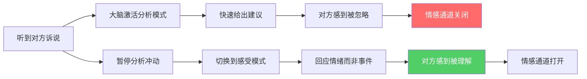
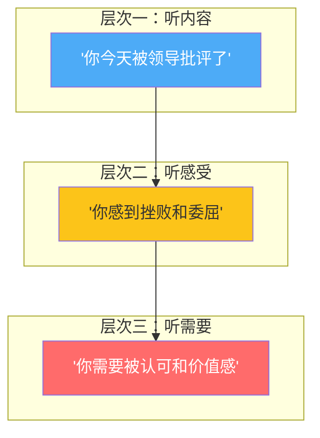
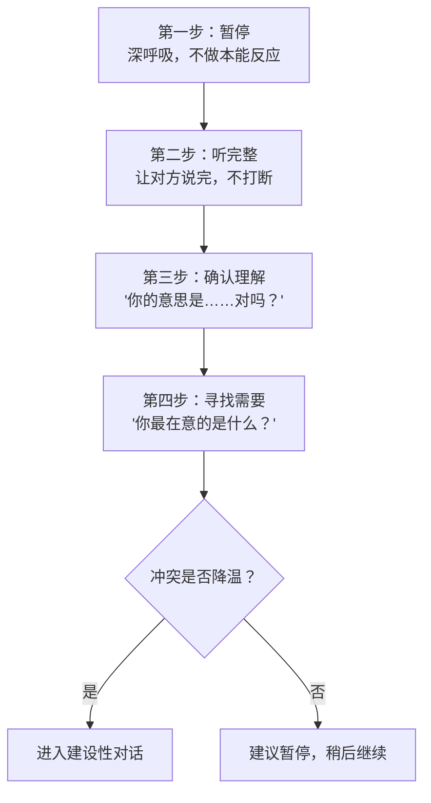
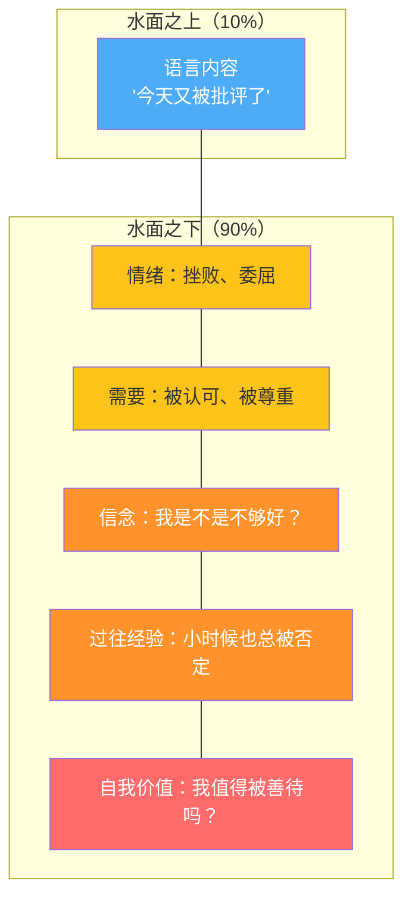
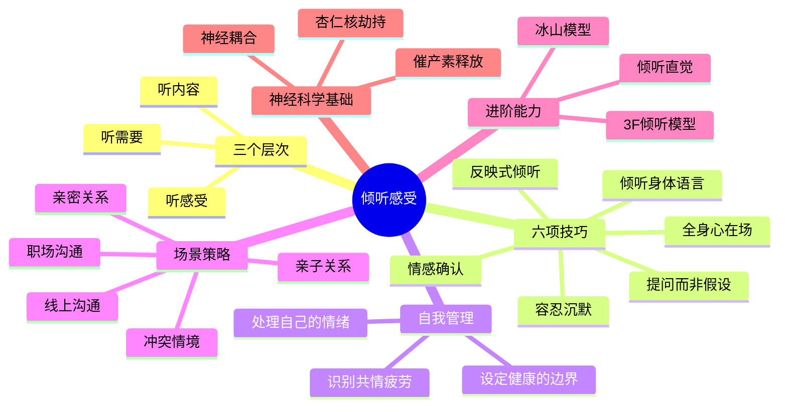

## 二、倾听感受：让对方感到被听见

> "被深深地倾听，就像被神灵触碰一样。" —— Carl Rogers

在情感沟通的整个体系中，倾听是一切的起点。你可以掌握世界上最精妙的表达技巧，但如果你不会倾听，对方感受到的只是"你在表演"而非"你在乎"。本章将从神经科学、心理学和实践操作三个维度，系统拆解"倾听感受"这项核心能力——从为什么你天生不擅长倾听，到如何在任何场景下让对方感到真正被听见。

### 2.1 为什么倾听如此困难

#### 2.1.1 大脑的默认模式：问题解决者

人类大脑天生是"问题解决机器"。当听到别人诉说困难时，大脑的默认反应是：

1. **分析问题**——"发生了什么？"
2. **寻找原因**——"为什么会这样？"
3. **提出方案**——"你应该怎么做。"

这个反应链条在工作中高效无比，但在情感沟通中却是灾难性的。因为当一个人表达感受时，他需要的通常不是解决方案，而是被理解。

神经科学研究表明，当一个人处于强烈情绪中时，大脑的杏仁核（负责情绪处理）高度激活，而前额叶皮层（负责理性思考）的活动被抑制——这个现象叫做"杏仁核劫持"（amygdala hijack），由心理学家 Daniel Goleman 在《情商》一书中系统阐述。这意味着：**对方在情绪中时，他的大脑根本不在"接受建议"的状态**。你给的建议再好，也进不去。

更深层的原因在于进化。人类的"战斗或逃跑"反应（fight-or-flight response）在面对情绪威胁时会被激活。当一个人正在倾诉痛苦，如果你急于给建议，对方的潜意识会解读为："他觉得我自己处理不了，他在否定我的能力。"这会触发防御反应，让对话走向对抗而非连接。

#### 2.1.2 六种倾听障碍

在实际生活中，以下六种模式会严重阻碍真正的倾听：

| 障碍类型 | 典型表现 | 内心独白 | 对方的感受 |
|---------|---------|---------|-----------|
| **急于建议** | "你应该……""你试试……" | "我能帮他解决问题" | "他根本没听我说完" |
| **转移话题** | "我之前也遇到过……" | "我也经历过，让我分享" | "他又在说自己了" |
| **否定感受** | "别想太多""不至于吧" | "帮他看开点" | "我的感受不重要" |
| **过早安慰** | "没事的""会好的" | "我想让他好受点" | "他在敷衍我" |
| **追问细节** | "然后呢？他说了什么？" | "我要搞清楚事实" | "他在审判我" |
| **评判对错** | "你也有不对的地方" | "要客观公正" | "他在指责我" |

识别这些障碍是改进的第一步。大多数人并非故意不倾听，而是被自己的本能反应劫持了。这六种障碍有一个共同根源：**倾听者把自己的需求（解决问题、分享经历、评判对错）放在了对方的需求（被理解）之前。** 倾听的本质是一种利他行为，需要刻意压制自我中心的本能。

#### 2.1.3 倾听的神经科学基础

当你被真正倾听时，大脑会发生什么？这里涉及三个关键的神经科学发现：

**发现一：情感标签化（Affect Labeling）**

加州大学洛杉矶分校（UCLA）的 Matthew Lieberman 教授通过 fMRI 实验发现，当人们用语言描述自己的情绪时，杏仁核的激活水平会显著降低，而右侧腹外侧前额叶皮层（right ventrolateral prefrontal cortex）活动增强。这个过程被称为"情感标签化"。换句话说：**说出来本身就有疗愈作用，前提是有人在听。** 倾听者提供的安全空间，是对方能够完成情感标签化的前提条件。

**发现二：神经耦合（Neural Coupling）**

Princeton大学的 Uri Hasson 教授通过 fMRI 实验发现，当两个人进行深度对话时，他们的大脑活动模式会趋于同步——听者的大脑会"模拟"说者的大脑状态。这种同步程度越高，双方越感到"连接"和"被理解"。更有趣的是，这种耦合是单向的：是听者的大脑在跟随说者的大脑，而不是反过来。**倾听者的大脑像一面镜子，映照出对方的内心世界。**

**发现三：催产素释放（Oxytocin Release）**

深度倾听还会触发双方的催产素分泌——这是一种与信任、亲密感和安全感相关的神经递质。心理学家 Paul Zak 的研究表明，当一个人感到被理解和被信任时，大脑会释放催产素，形成正向循环：被倾听→催产素释放→感到安全→更愿意敞开心扉→更深的倾听。

这解释了为什么被真正倾听时，你会有一种"被看见"的感觉——那不只是心理上的，更是神经层面的真实连接。

#### 2.1.4 自我评估：你的倾听障碍是什么？

在进入技巧学习之前，先做一个快速自评。阅读以下10个场景，记录你最可能的本能反应：

| 场景 | 你的本能反应 | 对应障碍 |
|------|------------|---------|
| 朋友说工作压力大 | "你可以试试时间管理法" | 急于建议 |
| 伴侣抱怨你不够关心 | "我哪里不关心了？我上周还……" | 转移话题 |
| 孩子说怕黑 | "有什么好怕的" | 否定感受 |
| 同事说项目很难 | "没事，你肯定能搞定" | 过早安慰 |
| 家人说身体不舒服 | "具体哪里疼？什么时候开始的？" | 追问细节 |
| 朋友说和伴侣吵架 | "你也有做得不对的地方" | 评判对错 |
| 对方说完后沉默 | 立刻找话说 | 不能容忍沉默 |
| 对方哭了 | 感到焦虑，想让对方别哭 | 情绪回避 |
| 对方说"你不懂" | "我怎么不懂了？" | 防御反应 |
| 对方倾诉超过10分钟 | 开始走神，想别的事 | 注意力疲劳 |

统计你选择最多的反应类型，那就是你的主要倾听障碍。接下来的技巧学习，要重点突破这个障碍。

### 2.2 倾听的三个层次

大多数人以为自己在听，实际上只是在等待说话的机会。真正的倾听有三个递进的层次，每一层都比上一层更深入，也更有力量。

#### 层次一：听内容（Surface Listening）

**定义**：听到对方说了什么事实和观点。这是最基本的层次。

**示例**：
- 对方说："今天项目评审会上，领导当着所有人的面说我的方案不成熟。"
- 层次一听到了：领导批评了方案，当众，场合不愉快。

**局限**：仅停留在信息层面，无法触及情感。大多数人际冲突中的"讲道理"模式，就是双方都卡在这一层。当你只听内容时，你的回应往往围绕"事实"展开——"领导说什么了？""方案哪里不成熟？"——这些问题把对话变成了调查，而不是连接。

**如何判断自己是否卡在这一层**：如果你发现对方在倾诉时，你的内心在不断构建"事件时间线"和"因果分析"，那你大概率只在听内容。

#### 层次二：听感受（Empathic Listening）

**定义**：不仅听到内容，还能感受到对方话语背后的情绪。这是情感沟通的核心层次。

**示例**：
- 同样的话，层次二听到的还包括：挫败感（心血被否定）、羞耻感（当众丢脸）、自我怀疑（也许我真的不行？）。

**为什么这一层至关重要**：当一个人鼓起勇气表达脆弱，他最害怕的不是"对方不理解事实"，而是"对方不理解我的感受"。你能否跨越信息层，触及情感层，决定了这段对话是"事务性交流"还是"情感连接"。

**捕捉感受的线索**：
- **词汇线索**："气死了""太委屈了""心都凉了"——这些词汇直接指向情绪
- **语调线索**：声音变高、变快可能意味着愤怒或焦虑；声音变低、变慢可能意味着悲伤或疲惫
- **强调线索**："他当着所有人的面""我花了两周"——被强调的部分往往是情感最强烈的触发点
- **重复线索**：同一个事实被反复提起，说明这个点上的情感还没有被听见

#### 层次三：听需要（Deep Listening）

**定义**：在感受背后，听到对方未被满足的需要。这是倾听的最高层次。

**示例**：
- 继续上面的场景，层次三还听到：他需要被认可（自己的专业判断有价值）、需要价值感（在团队中有地位）、需要支持（有人站在我这边）。

**需要的普遍性**：心理学家 Marshall Rosenberg 在"非暴力沟通"理论中总结了人类的基本需要：自主、认可、尊重、安全、连接、意义、成长。当你听到对方的深层需要时，你回应的就不是"这一次事件"，而是"这个人本身"。

**三个层次的关系**：

| 维度 | 层次一：听内容 | 层次二：听感受 | 层次三：听需要 |
|------|--------------|--------------|--------------|
| 关注点 | 事实、信息 | 情绪、感受 | 需要、渴望 |
| 典型回应 | "所以领导批评了你的方案" | "听起来你很受伤" | "你希望自己的专业能力被尊重" |
| 对方感受 | 你在听 | 你理解我 | 你真的懂我 |
| 难度 | 低 | 中 | 高 |
| 效果 | 信息对齐 | 情感连接 | 深度信任 |
| 大脑区域 | 前额叶（分析） | 镜像神经元系统（共情） | 默认模式网络（深层理解） |

> **实践提示**：日常沟通中，做到层次二就能显著改善关系质量。层次三是锦上添花，不必每次对话都追求。但当对方处于重大情绪事件中时，层次三的回应能产生真正深远的影响——它让对方感到"不只是这一次被理解了，而是我这个人被看见了"。

### 2.3 倾听感受的六项核心技巧

#### 2.3.1 技巧一：全身心在场（Presence）

倾听的第一步不是说什么，而是"在"。

**身体层面的"在"**：
- 放下手机（不是翻过来扣在桌上，而是放到视线之外——研究表明，仅仅是手机出现在视线内，就会降低对话质量，这被称为"iPhone效应"，由 Virginia 大学的研究团队证实）
- 关掉电视或电脑屏幕上的内容
- 转身面对对方，保持开放的身体姿态（不交叉双臂）
- 保持适度的眼神接触（不是盯着看，而是温和地注视——在西方文化中，60%-70%的目光接触时间被认为是最佳的；在东亚文化中，这个比例可以更低）
- 身体微微前倾，表示关注
- 手放在可见位置，不做其他事情

**心理层面的"在"**：
- 暂停自己内心的评价和判断
- 不在心里准备反驳或建议
- 把注意力完全放在对方身上
- 观察对方的表情、语调、肢体语言
- 接受"我不需要做什么"的状态

研究表明，在对话中，非言语信息（表情、姿态、语调）占到沟通总信息量的55%-93%（Mehrabian, 1971）。即使你嘴上说"我在听"，但如果眼睛看着手机、身体转向另一边，对方接收到的信号就是"你不在乎"。身体永远比语言诚实。

**一个实用的"归位"练习**：在对方开始说话前，花3秒钟做一个心理切换——深呼吸一次，告诉自己"现在，他比任何事情都重要"。这3秒的归位，能让整个对话质量提升一个档次。心理咨询师在每次咨询开始前都会做类似的"归位仪式"，你也可以在日常生活中建立这个习惯。

#### 2.3.2 技巧二：情感确认（Emotional Validation）

情感确认是倾听中最强大也最容易被忽视的技巧。它的核心是告诉对方：**你的感受是合理的，我理解你为什么会有这种感受。**

情感确认不是同意对方的观点或行为，而是承认对方的情绪是真实的、可理解的。这两者之间有本质区别：

| 情感确认（✓） | 不等于 | 同意观点（✗） |
|-------------|-------|-------------|
| "你被当众批评，感到受伤很正常" | ≠ | "领导确实不应该当众批评你" |
| "看到孩子成绩下滑，你很焦虑" | ≠ | "孩子成绩确实很差" |
| "你花了那么多心血被否定，肯定很沮丧" | ≠ | "那个领导不识货" |

**六个层级的情感确认句式**（由浅入深）：

| 层级 | 句式 | 示例 |
|------|------|------|
| 1. 命名情绪 | "你看起来/听起来很……" | "你听起来很难过" |
| 2. 承认合理性 | "换了任何人遇到这种事都会……" | "换了谁都会生气的" |
| 3. 理解原因 | "因为……所以你感到……" | "因为你投入了那么多心血，所以被否定时特别难受" |
| 4. 表达共情 | "我能感受到你的……" | "我能感受到你的失望" |
| 5. 承认困难 | "这对你来说一定很不容易" | "夹在中间一定很为难" |
| 6. 肯定勇气 | "谢谢你愿意告诉我这些" | "谢谢你信任我，愿意说出这些" |

**情感确认的反面——无效化（Invalidation）**：

无效化是情感沟通中最大的杀手。John Gottman 的婚姻研究发现，长期关系中无效化回应的频率，是预测关系破裂的最强指标之一，甚至比争吵频率更具预测力。以下是常见的无效化模式：

| 无效化类型 | 典型话术 | 隐含信息 | 对方的感受 |
|-----------|---------|---------|-----------|
| 否定合理性 | "你不应该这么想" | "你的判断有问题" | 被否定 |
| 贬低重要性 | "这有什么好生气的" | "你的感受不值一提" | 被轻视 |
| 否定真实性 | "你想太多了" | "你的感受是假的" | 被质疑 |
| 比较否定 | "别人比你惨多了" | "你没资格难过" | 被羞辱 |
| 催促跳过 | "开心点，别想了" | "你的感受是个麻烦" | 被拒绝 |
| 过早安慰 | "没事的，会好的" | "别再说了" | 被敷衍 |
| 幽默化解 | "哈哈这不挺搞笑的嘛" | "你的痛苦是个笑话" | 被嘲笑 |
| 转向自身 | "我比你更惨……" | "你的事不值一提" | 被忽视 |

当一个人鼓起勇气表达脆弱的感受，却收到无效化的回应，他会学到一个教训：**表达感受是不安全的，下次不要说了。** 久而久之，双方之间的情感通道就被堵死了。这比任何一次争吵都更具破坏力——争吵至少说明双方还在尝试连接，而无效化造成的沉默是一种无声的放弃。

**真实案例**：

> 小美下班回家跟丈夫说："今天同事在背后说我坏话，我特别难过。"
> 
> **无效化回应**："你就别理她们呗，做好自己的事就行了。"
> 
> 小美的感受：他根本不在乎我受了什么委屈，他觉得是我小题大做。以后不跟他说了。
> 
> **情感确认回应**："被人在背后说坏话确实很不舒服，尤其是你还得每天面对她们。你现在感觉怎么样？"
> 
> 小美的感受：他理解我的处境，他关心我的感受。我可以继续跟他说。

#### 2.3.3 技巧三：反映式倾听（Reflective Listening）

反映式倾听是心理咨询中的核心技术，由 Carl Rogers 在"以来访者为中心"的疗法中系统提出。它的操作方法是：**用自己的话复述对方的感受和需要，确保你理解正确，同时让对方知道你在认真听。**

**反映式倾听的公式**：

"所以你的意思是，当 [触发事件] 的时候，你感到 [情绪词]，因为你需要/在意 [深层需要]。是这样吗？"

**三个递进层次**：

| 层次 | 操作 | 示例 |
|------|------|------|
| 复述内容 | 用对方的话重述事实 | "你说今天项目评审会上被领导当众批评了" |
| 反映感受 | 猜测并表达对方的情绪 | "你听起来很沮丧，也很委屈" |
| 反映需要 | 说出对方背后的需要 | "你希望自己的专业能力被看到和认可" |

**完整案例**：

> **对方**："我花了两周准备这个方案，结果会上领导看都没仔细看就说不成熟，当着所有人的面。"
>
> **层次一（复述内容）**："你花了很多时间准备方案，但领导很快就否定了。"
>
> **层次二（反映感受）**："你一定很受打击，花了那么多心血却没被认真对待，那种感觉很不好受。"
>
> **层次三（反映需要）**："你希望自己的努力和专业判断能被尊重，被看到。你在意的不只是方案本身，更是自己的付出有没有价值。"

反映式倾听的关键在于"猜测"——你不需要100%准确，重要的是这个过程本身。如果猜对了，对方会感到被深深理解；如果猜错了，对方会纠正你，这同样是在促进沟通。双赢。

**常见错误及纠正**：

| 错误方式 | 问题所在 | 正确方式 |
|---------|---------|---------|
| 机械重复："你说领导批评了你" | 像录音机，没有温度 | 用自己的话："领导当众否定了你的心血" |
| "我听到你说……" | 太正式，像咨询师 | 直接用"你"开头："你很受打击" |
| 下结论："你就是生气" | 太武断，没有空间 | 试探性语气："你听起来有些生气？" |
| 反映完立刻接话 | 没给对方回应空间 | 反映后停顿2-3秒，等对方确认 |

#### 2.3.4 技巧四：提问而非假设

当你不确定对方的感受时，用开放性问题来询问，而不是自以为是地解读。

**好的提问**（开放性、探索性）：
- "你现在感觉怎么样？"
- "这件事让你有什么感受？"
- "你最在意的是哪个部分？"
- "你需要我现在做什么？"
- "还有什么想跟我说的吗？"
- "这件事对你来说意味着什么？"
- "你希望事情怎么发展？"

**不好的提问**（封闭性、引导性）：
- "你是不是很生气？"（预设了情绪）
- "你就是因为这件事才不开心的吧？"（预设了因果）
- "你是不是觉得自己没错？"（引导性太强）
- "你为什么不直接跟他说？"（隐含建议）
- "你为什么不早点告诉我？"（隐含责备）
- "难道你不觉得你也有问题吗？"（暗示对方有错）

**三种提问的时机和作用**：

| 时机 | 提问类型 | 示例 | 作用 |
|------|---------|------|------|
| 对方刚开始倾诉 | 开放邀请 | "发生什么了？" | 打开话题 |
| 对方表达不清晰时 | 澄清问题 | "你说的'不舒服'是指什么样的感觉？" | 帮助表达 |
| 对方表达完毕后 | 需求探索 | "你现在最需要的是什么？" | 了解需求 |
| 对方陷入思维循环 | 聚焦提问 | "在所有这些事情里，最让你难受的是哪一件？" | 帮助理清 |
| 对方情绪激动时 | 稳定提问 | "你愿意深呼吸一下，慢慢告诉我吗？" | 情绪调节 |

> **关键原则**：提问的目的是帮助对方更好地表达自己，而不是满足你的好奇心或分析欲。如果一个问题让对方感到被"审问"，那你就问错了。好的提问应该像一扇门，邀请对方走进更深的表达；坏的提问像一堵墙，让对方感到被拦截。

#### 2.3.5 技巧五：容忍沉默

当对方正在酝酿如何表达感受时，不要急于填补沉默。

**沉默的多种含义**：
- 对方正在整理思绪，试图找到准确的词汇
- 对方正在鼓起勇气，准备表达更深层的感受
- 对方正在与更深层的情感连接，需要时间
- 对方在测试你——"你真的有耐心听我说完吗？"
- 对方正在感受刚才说出来的话带来的情绪冲击
- 对方可能正在哭泣，但不想让你看到

**统计数据**：研究发现在日常对话中，沉默超过1.5秒就会让人感到不适（Sacks et al., 1974）。但在深度情感交流中，有意义的沉默通常需要5-15秒甚至更长。大多数人在2-3秒内就忍不住填补了沉默，错过了对方即将说出的最重要的话。

心理咨询师有一个专业术语叫"黄金沉默"（golden silence）——当来访者说完一段话后，咨询师会刻意保持沉默。这种沉默往往能引出更深、更真实的内容，因为沉默给了对方一个信号：我在等你，没有催促，你可以按自己的节奏来。

**如何练习容忍沉默**：
1. 对方停下来时，在心里默数到5
2. 用非语言信号表示"我在等你说"——温和的注视、微微点头
3. 如果对方长时间沉默，可以说"不着急，慢慢来"或"我在听"
4. 记住：你的沉默不是冷漠，而是一种尊重
5. 如果你自己感到不适，提醒自己：沉默中的连接，比语言中的连接更深

#### 2.3.6 技巧六：倾听身体语言

语言只是信息的一部分。真正善于倾听的人，不仅听对方说了什么，还"听"对方的身体在说什么。

**常见的非语言信号及其含义**：

| 身体语言 | 可能的含义 | 你的回应策略 |
|---------|-----------|-------------|
| 眼神躲闪 | 羞耻、不安、害怕被评判 | 减少直接注视，用侧面对话降低压力 |
| 双臂交叉 | 防御、不安全感 | 不要要求对方"打开"，给予安全感 |
| 反复摸脖子/手腕 | 焦虑、自我安抚 | 放慢语速，用更温和的语气 |
| 突然沉默+低头 | 触及了深层情感 | 轻声说"没关系，慢慢来" |
| 语速突然加快 | 回避某些感受 | 轻轻问"刚才那部分，你愿意多说说吗？" |
| 身体转向门口 | 想要逃离、对话太沉重 | 提议休息一下，不要硬撑 |
| 眼眶泛红/声音颤抖 | 正在压抑强烈情绪 | 给空间，递纸巾，不催促 |
| 手指敲桌子/抖腿 | 不耐烦、焦虑 | 简化你的回应，给对方更多说话机会 |
| 突然微笑（与内容不符） | 紧张、防御性幽默 | 不要被微笑误导，继续关注情绪 |
| 握拳 | 愤怒、压抑 | 用温和的语气，不要激化 |

当你观察到语言和身体信号不一致时（比如嘴上说"我没事"但声音在发抖），优先相信身体语言，并温柔地指出："我听到你说没事，但你看起来好像不是这样。没关系的，你可以说。"

**文化差异提醒**：身体语言的含义因文化而异。在某些文化中，直接的眼神接触被认为是尊重；在另一些文化中则被视为挑衅。在跨文化沟通中，不要急于对对方的身体语言下结论，多用语言确认。

### 2.4 倾听中的自我管理

倾听他人的强烈情绪时，你自己的情绪也会被激活。这被称为"情绪传染"（emotional contagion）——人类大脑中的镜像神经元会自动模仿和体验他人的情绪状态。这是进化的馈赠（让我们有共情能力），但如果不加管理，也会成为倾听的障碍。

#### 2.4.1 三种常见的情绪挑战

**挑战一：当对方的指责让你感到受伤**

场景：伴侣说"你从来都不关心我"，你感到被冤枉、愤怒。

管理策略：
- 提醒自己：**他现在在说的是他的感受，不是在对我做最终评判。** "从来都不"是情绪化的表达，不是事实判断。心理学家 Harriet Lerner 将这种表达称为"绝对化语言"（always/never language），它是情绪强度的指标，而不是事实的精确描述。
- 先确认对方的感受："你觉得我不关心你，你一定很孤独。" 这不是承认你确实不关心他，而是在确认他的感受。
- 稍后再表达自己的感受：等对方情绪平复后，再说"听你这么说我其实也挺难受的，因为我真的很在意你，但好像我的方式没有让你感受到。"
- 内在锚定：在心里对自己说"我是一个在乎他的人，他的痛苦不代表我是坏人。"

**挑战二：当对方的情绪让你感到焦虑**

场景：朋友崩溃大哭，你觉得必须让他立刻好起来。

管理策略：
- 告诉自己：**他的情绪不是我的责任去修复的。** 你不需要让对方立刻好起来，只需要让他知道你在。
- 焦虑往往来自"我必须做点什么"的压力。但实际上，**你什么都不用做，只需要在。** "我在"本身就是最有力的回应。
- 如果焦虑太强烈，试着做几次深呼吸，把注意力放在自己的呼吸上。
- 区分"共情"和"吸收"：共情是理解对方的感受，吸收是把对方的感受变成自己的负担。前者是健康的，后者需要警惕。

**挑战三：当对方的悲伤让你不知所措**

场景：亲人遭遇重大变故，你不知道说什么才不会"说错话"。

管理策略：
- 承认自己的无能为力是可以的。**你不需要有完美的答案。**
- 最有力量的回应往往是："我不知道该说什么，但我想陪着你。"
- 你的存在比你的语言更重要。在极端悲伤面前，任何语言都显得苍白，但一双握着的手、一个无声的拥抱，能传递语言无法传达的东西。
- 心理学家 Irvin Yalom 在《存在主义心理治疗》中指出：面对存在性痛苦（死亡、孤独、无意义），最有效的回应不是安慰，而是"共同在场"（presence）——你不需要消除他的痛苦，只需要让他知道他不必独自面对。

#### 2.4.2 倾听的边界：不是当情绪垃圾桶

倾听是慷慨的，但不应该是无底线的。以下情况需要设定边界：

- **重复性的抱怨模式**：对方每次都说同样的问题，但从不采取行动，也不接受任何建议。这时可以说："我注意到我们聊过很多次这个问题，我很想帮你，但我发现自己能做的有限。你觉得我们可以一起想想有什么新的办法吗？"
- **对你造成严重情绪负担**：如果你发现每次倾听后自己需要很长时间恢复，或者开始回避对方，说明你的承载力已经超负荷。这不是你的错，而是你需要保护自己的情绪资源。
- **单向的情感消耗**：如果关系中永远是你在倾听对方，而对方从不关心你的感受，这是不平等的关系结构，需要正视和调整。
- **边界设定的语言模板**：
  - "我很想听你说，但我现在自己的状态不太好，我们可以改到明天吗？"
  - "我注意到你已经聊这个话题很久了，我很关心你，但我也担心你是否需要更专业的帮助？"
  - "我需要一些时间消化刚才听到的内容，我们能暂停一下吗？"

**共情疲劳（Compassion Fatigue）的信号**：如果你出现以下症状，说明你需要暂停倾听、恢复自我——睡眠质量下降、对对方的故事开始感到麻木、频繁烦躁、身体疲惫、回避社交。这不是你不够善良，而是你的心理资源需要补充。心理咨询师和医护人员经常面对共情疲劳，他们采取的策略包括：定期督导（找人倾诉自己的倾听经历）、正念冥想、身体锻炼、以及明确的工作与生活边界。

### 2.5 不同场景的倾听策略

#### 2.5.1 亲密关系中的倾听

亲密关系中的倾听最大的挑战在于：你不是旁观者，而是利益相关方。当伴侣说"你让我很失望"，你不能像心理咨询师那样保持中立——你就是那个"问题"。

John Gottman 的婚姻实验室（Love Lab）经过40多年的研究发现，幸福婚姻和不幸婚姻的根本区别不在于争吵的频率，而在于"修复尝试"（repair attempts）是否被接受。而倾听是最基本的修复尝试。

**策略**：

1. **按下暂停键**：当听到针对自己的指责时，你的本能反应是防御。用3秒钟深呼吸，把防御冲动压下去。
2. **先听感受，后处理事实**：不要急于解释"我不是那个意思"。先说"你感到失望了，能告诉我更多吗？"
3. **区分感受和攻击**：对方表达的"你真自私"是感受化的表达（他感到被忽略），不是客观评价。不需要逐字反驳。
4. **用好奇代替防御**："你能帮我看清你的角度吗？"比"你误解我了"有效一百倍。
5. **Gottman的"转向"策略**：当伴侣发出"情感竞标"（emotional bid）——一个微小的连接请求——时，选择"转向"（turning toward）而不是"转离"（turning away）或"转对抗"（turning against）。研究表明，幸福的伴侣在日常生活中对情感竞标的回应率高达86%，而不幸的伴侣只有33%。

**经典案例**：

> **场景**：妻子说"你每天回来就打游戏，这个家对你来说就是个旅馆吗？"
>
> **防御式回应**："我哪里天天打了？今天才玩了一会儿！"——结果：吵架升级。
>
> **倾听式回应**："你觉得我不够顾家，你感到孤独了是吗？你希望我多陪你。"——结果：妻子感到被听见，愿意进一步沟通具体需求。

#### 2.5.2 亲子关系中的倾听

孩子的情绪表达往往不成熟、不准确，但这恰恰是最需要被倾听的时刻。发展心理学家 John Bowlby 的依恋理论（Attachment Theory）指出，早期亲子互动中孩子是否感到"被看见和被回应"，直接塑造了他们成年后的依恋模式和情绪调节能力。

**策略**：

1. **蹲下来，与孩子平视**：物理上的平等姿态传递的是心理上的尊重。
2. **翻译孩子的"行为语言"**：孩子摔东西可能不是"不听话"，而是"我太生气了但不知道怎么表达"。孩子反复问同一个问题可能不是"烦人"，而是"我害怕，需要被安慰"。
3. **先接纳情绪，后引导行为**："你很生气，因为哥哥拿了你的玩具。生气是可以的，但摔东西不可以。你想用什么别的方式表达你的生气？"
4. **不要急于"教育"**：当孩子哭泣时，他需要的不是"你已经是大孩子了不应该哭"，而是一双温暖的臂膀。
5. **使用"情绪命名"帮助孩子发展情商**：研究表明，能够用语言命名情绪的孩子，情绪调节能力更强。你可以说"你现在的感觉叫做'失望'，因为你很期待去公园但下雨了。"

**常见错误**：

| 错误做法 | 为什么错 | 正确做法 |
|---------|---------|---------|
| "男孩子哭什么" | 否定了情绪的合理性，强化性别刻板印象 | "你很难过，可以哭一会儿" |
| "这点小事有什么好哭的" | 用成人标准衡量孩子 | "对你来说这是件大事，我理解" |
| "你再哭我就不管你了" | 用抛弃威胁孩子，破坏安全依恋 | "无论怎样我都在，你想哭就哭" |
| "别哭了，给你买糖吃" | 用物质转移情绪，教会孩子回避情绪 | "哭完了我们可以聊聊发生了什么" |
| "你看看别人家孩子多乖" | 比较否定，伤害自尊 | "你就是你，我爱的就是你" |
| "我数三个数，一、二……" | 威胁性控制，不是倾听 | "你现在很难受，我们慢慢来" |

#### 2.5.3 职场中的倾听

职场倾听的核心挑战是：关系有层级，有利益，有政治。你不能像对朋友那样"畅所欲言"，但也不能只做表面功夫。

**向上倾听（听领导/上级）**：
- 听任务背后的期望和焦虑（不只是"做什么"，还有"为什么要做"）
- 注意未说出的话（"这个项目很重要"= "不能出错"）
- 回映确认："我理解您的意思是……我的理解对吗？"
- 关注领导的情绪状态：领导也是人，如果他今天情绪不好，你的任务可能被附带更大的压力

**向下倾听（听下属/后辈）**：
- 创造安全的表达空间（一对一、非正式场合）
- 不要急于评判或纠正（先听完）
- 关注言外之意（"我没问题"可能意味着"我说了也没用"）
- 主动询问："最近工作感觉怎么样？有什么我能帮到的？"
- Google 的"亚里士多德项目"（Project Aristotle）研究发现，高效团队最重要的特征是"心理安全"（psychological safety）——团队成员是否敢于表达不同意见、承认错误、寻求帮助。而这种心理安全的核心，就是管理者的倾听能力。

**平行倾听（听同事/平级）**：
- 尊重对方的专业判断，不急于否定
- 在分歧中寻找共识："我同意你说的X，关于Y我想补充……"
- 注意非语言信号（会议中的沉默可能意味着不同意但不敢说）
- 建立"倾听联盟"：找一个你信任的同事，在重要会议后互相交流"你听到了什么"，帮助识别盲点

#### 2.5.4 冲突中的倾听

冲突场景是最考验倾听能力的时刻——双方都在激动状态，每个人都觉得自己是对的。

**冲突中倾听的四步法**：

**关键原则**：
- 在冲突中，谁先倾听，谁就掌握了主动权
- 倾听不等于认输，而是为解决问题创造条件
- 当双方都只顾表达时，沟通就变成了噪音
- 冲突中的倾听需要更多耐心，因为双方的防御系统都已激活
- 如果对方说"你从来不听我说话"，最好的回应是："你说得对，我现在认真听。"

#### 2.5.5 线上沟通中的倾听

在数字化时代，大量的情感沟通发生在文字媒介上（微信、短信、社交媒体）。线上倾听面临独特的挑战：

**线上倾听的障碍**：
- **缺少非语言信息**：你看不到对方的表情、语调、身体语言——这些占沟通信息量的55%-93%
- **时间延迟**：对方打字需要时间，这个"沉默"可能是思考，也可能是冷战
- **语气误读**：文字没有语调，"好"可以是同意，也可以是讽刺，也可以是敷衍
- **多任务干扰**：对方可能一边跟你聊天一边刷视频、开会、做其他事情

**线上倾听的策略**：
1. **增加确认频率**：因为缺少非语言线索，需要更频繁地确认理解——"你是说……对吗？""我现在能感受到你的……"
2. **使用语音消息**：当文字不够表达情感时，切换到语音消息，至少能传递语调信息
3. **避免文字攻击**：在愤怒时不要发消息——文字攻击的伤害比口头攻击更大，因为对方可以反复阅读
4. **视频通话优于语音优于文字**：当话题涉及深层情感时，尽量使用视频通话
5. **留出回应空间**：不要一次性发大段文字轰炸，给对方消化和回应的空间

### 2.6 倾听的进阶：从技术到艺术

#### 2.6.1 "3F倾听模型"

进阶的倾听者会同时处理三个维度的信息：

| 维度 | 英文 | 关注点 | 示例 |
|------|------|-------|------|
| **Fact** | 事实 | 发生了什么 | "领导批评了我的方案" |
| **Feeling** | 感受 | 说话人的情绪 | 挫败、委屈、羞耻 |
| **Focus** | 意图 | 说话人真正想要什么 | 被认可、被支持、被理解 |

大多数人只听 Fact，优秀的倾听者能听到 Feeling，而大师级的倾听者能捕捉到 Focus。当你能回应对方的 Focus 时，对方会觉得"你真的懂我"。

**练习方法**：在每次对话后，花30秒写下三个F：
- Fact：对方说了什么事实？
- Feeling：对方的情绪是什么？
- Focus：对方真正想要什么？

坚持练习21天，你会发现自己的倾听能力有质的飞跃。

#### 2.6.2 倾听的"冰山模型"

每个人说出来的话只是冰山一角。水面之下，是更大的部分：

进阶倾听者的任务，是通过水面之上的10%，去感知水面之下的90%。这需要练习，更需要真诚的好奇心。你不需要一次性看透冰山全貌——有时候，仅仅是意识到"水面之下还有更多"，就已经让倾听质量提升了一个层次。

**冰山模型在实际中的应用**：当对方说"我不想去那个聚会"，大多数人会停留在水面之上（"为什么不想去？"），但进阶倾听者会探测水面之下——是社交焦虑？是害怕比较？是缺乏安全感？你不需要直接说出来，但你可以用开放性问题引导对方探索更深的层次："你不太想去，是什么感觉？"

#### 2.6.3 "倾听直觉"的培养

资深的心理咨询师常说"我的直觉告诉我……"。这种"倾听直觉"不是天赋，而是大量练习后的模式识别。心理学家 Gary Klein 的"识别启动决策模型"（Recognition-Primed Decision Model）解释了这种直觉的本质：大脑在积累了大量案例后，能够快速匹配当前场景与过往经验，在意识觉察之前就做出判断。

你可以通过以下方式培养倾听直觉：

1. **复盘练习**：每次重要对话后，花2分钟回顾：对方说了什么？情绪是什么？需要是什么？我当时漏掉了什么信号？
2. **观察练习**：在公共场所观察陌生人之间的对话（咖啡馆、地铁），猜猜他们的情绪状态。
3. **身体感知练习**：注意倾听时自己身体的反应——胸口发紧？胃不舒服？肩膀僵硬？这些可能是镜像神经元在传递对方的情绪信号。心理学家 Eugene Gendlin 将这种身体感受称为"Focusing"——身体往往比意识更早感知到对方的情绪状态。
4. **影视练习**：看剧情片时关掉字幕，只通过表情和语调判断角色的情绪。
5. **阅读文学作品**：优秀的文学作品擅长描写人物的内心世界，阅读时练习"听"到角色没有说出来的话。

### 2.7 常见误区与纠正

| 误区 | 为什么是错的 | 正确理解 |
|------|------------|---------|
| "倾听就是不说话" | 被动沉默不等于倾听 | 倾听是主动的——通过反馈、提问、回应来确认你在听 |
| "我要帮他解决问题" | 大多数情感倾诉不需要解决方案 | 先满足情感需求，对方自然会去解决问题 |
| "听懂了内容就行" | 事实层面的理解只是层次一 | 感受和需要才是情感沟通的核心 |
| "情感确认就是同意" | 确认感受 ≠ 赞同观点 | "我理解你很生气"≠"你生气是对的" |
| "我要保持客观中立" | 在亲密关系中这是冷血 | 温暖的共情比冷冰冰的"客观"有用一百倍 |
| "倾听是一种软弱" | 这是最大的误解 | 倾听需要极大的自我控制和勇气，是最强大的沟通武器 |
| "我没有共情天赋" | 共情是可以训练的技能 | 通过有意识的练习，任何人都能提升倾听能力 |
| "我必须感同身受" | 你不需要经历过同样的事 | 理解和想象就够了，不必有相同的经历 |
| "倾听花太长时间" | 效率优先是工作思维 | 在情感沟通中，快就是慢，慢就是快 |
| "倾听会鼓励抱怨" | 恰恰相反 | 被充分倾听的人，往往更快走向行动和解决 |

### 2.8 21天倾听训练计划

将倾听从知识变为习惯，需要刻意练习。心理学家 Anders Ericsson 的"刻意练习"理论指出，技能提升的关键不在于练习时间，而在于练习的质量——是否有明确的目标、即时的反馈、和持续的挑战。

以下是分阶段的训练方案：

**第一周：觉察期——建立倾听意识**

| 天数 | 训练任务 | 具体做法 | 完成标志 |
|------|---------|---------|---------|
| Day 1 | 记录倾听障碍 | 今天每次对话后，记录自己是否犯了六大障碍之一 | 记录至少3次 |
| Day 2 | 觉察"想说什么" | 在对话中注意到自己什么时候开始想"我该说什么" | 记录3次"走神时刻" |
| Day 3 | 不打断练习 | 在一次对话中，刻意不打断对方，等他说完再回应 | 对方自然结束话题 |
| Day 4 | 放下手机练习 | 与家人/朋友对话时，把手机放到另一个房间 | 完成2次 |
| Day 5-6 | 全身心在场练习 | 每天找一个对话场景，只练习"全身心在场"——放下手机，注视对方 | 对方说"你今天好像不太一样" |
| Day 7 | 本周复盘 | 回顾本周的记录，识别自己最常犯的障碍是什么 | 写下3个发现 |

**第二周：技术期——练习核心技巧**

| 天数 | 训练任务 | 具体做法 | 完成标志 |
|------|---------|---------|---------|
| Day 8-9 | 情感确认练习 | 每天使用至少2次情感确认句式（从六层级表中选择） | 成功使用而不觉得别扭 |
| Day 10-11 | 反映式倾听练习 | 尝试用自己的话复述对方的感受 | 至少1次对方说"对，就是这样" |
| Day 12 | 开放性提问练习 | 只用开放性问题引导对话，不问封闭性问题 | 对话持续15分钟以上 |
| Day 13-14 | 容忍沉默练习 | 对方停顿时默数到5再回应 | 能舒适地忍受5秒沉默 |

**第三周：整合期——形成习惯**

| 天数 | 训练任务 | 具体做法 | 完成标志 |
|------|---------|---------|---------|
| Day 15-16 | 综合技巧练习 | 将前两周的技巧整合到一次深度对话中 | 对方主动分享了更多感受 |
| Day 17-18 | 冲突场景练习 | 在冲突或分歧中使用倾听技巧 | 冲突没有升级，双方都感到被听见 |
| Day 19 | 3F模型练习 | 用3F模型复盘一次对话 | 写下Fact/Feeling/Focus |
| Day 20 | 身体语言练习 | 在对话中刻意观察对方的非语言信号 | 记录至少3个身体语言线索 |
| Day 21 | 总复盘 | 回顾整个21天的训练历程，识别自己的倾听盲区和进步 | 写下3个倾听模式和改进方向 |

### 2.9 本节要点回顾

倾听不是一种被动的行为，而是一种主动的选择——选择暂时放下自己，全心全意地进入另一个人的世界。这需要勇气（面对对方的情绪），需要耐心（等待对方表达），需要谦逊（承认自己的理解可能是错的），更需要爱（因为你之所以愿意倾听，是因为你在乎）。

当一个人真正感到被听见时，改变就会自然发生——不是因为你给了他答案，而是因为你给了他空间。Carl Rogers 说："奇妙的悖论是，当我接受自己本来的样子时，我就改变了。"倾听的力量，正在于此——你不是在改变对方，而是在为对方创造一个安全的空间，让改变自然发生。

这，就是倾听的力量。
