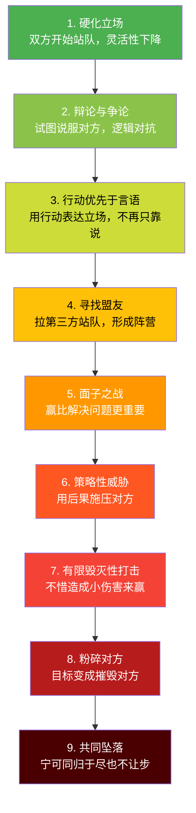

## 三、处理冲突：在分歧中保持连接

冲突是亲密关系中最被误解的现象。大多数人从小接受的信念是"好伴侣不应该吵架"，但半个多世纪的关系科学研究得出了截然相反的结论：**冲突本身不伤害关系，处理冲突的方式才是决定性因素**。约翰·戈特曼对超过3000对夫妻的纵向追踪研究发现，即使是最幸福的伴侣也会有持续性分歧——他们的区别不在于是否吵架，而在于吵架时是否仍然保持着对彼此的尊重和善意。

冲突处理能力不是天赋，而是一套可以学习、练习和精进的技能体系。本章将从冲突的本质认知出发，建立一套从识别、预防、介入到修复的完整能力体系，帮助你将冲突从关系的威胁转变为关系深化的契机。

### 3.1 重新理解冲突：从恐惧到工具

#### 3.1.1 冲突的心理学本质

冲突的本质是**两个合法需求之间的碰撞**。当两个人各自有合理的需要、偏好或价值观，而这些需要在某个具体情境中无法同时满足时，冲突就产生了。这意味着冲突不是关系出了问题的信号，而是两个独立个体在建立共同体时必然经历的磨合过程。

从依恋理论的角度看，冲突激活的是人类最原始的依恋系统。当伴侣之间的连接感受到威胁时，大脑会将冲突信号解读为生存级别的威胁——你的前额叶皮层（负责理性思考和共情）功能下降，杏仁核（情绪反应中心）接管控制权。神经科学家约翰·梅迪纳（John Medina）的研究表明，当人处于威胁状态时，大脑会将认知资源从高级思维区域转移到生存反应区域，导致你在冲突中做出平时绝不会做的事情。

这就是为什么在冲突中人们会说出事后后悔的话：在那个瞬间，你不是在"选择"攻击对方，而是在用最原始的方式保护自己。

理解这一点至关重要。它意味着：

1. **冲突中的失态不是品格缺陷**，而是神经生物学的应激反应
2. **冲突管理能力是可以训练的**，通过练习可以扩大前额叶的调控窗口
3. **冲突后的修复比冲突中的表现更重要**——没有人能在每次冲突中都表现完美
4. **对冲突的恐惧本身才是最大的敌人**——回避冲突不会让问题消失，只会让问题积累到更危险的程度

#### 3.1.2 冲突的类型学

不是所有冲突都一样，不同类型的冲突需要不同的处理策略。误判冲突类型是最常见的错误之一——用处理偏好性冲突的方式去处理价值性冲突，往往会让问题更加恶化。

| 冲突类型 | 核心特征 | 典型表现 | 处理重点 | 预期解决时间 |
|---------|---------|---------|---------|------------|
| **事实性冲突** | 对信息或事实有不同认知 | "我觉得房价会跌"/"我觉得会涨" | 核查信息源，接受不确定性 | 即时 |
| **偏好性冲突** | 个人口味和喜好不同 | 空调温度、电影选择、饮食习惯 | 轮流制、创造第三选项 | 即时 |
| **角色性冲突** | 对"谁该做什么"有不同预期 | 家务分工、育儿责任、经济管理 | 明确协商分工，定期复盘 | 1-2周 |
| **价值性冲突** | 核心信念和原则不同 | 金钱观、教育理念、人生目标 | 尊重差异，建立共识区 | 持续管理 |
| **历史性冲突** | 未处理的旧伤被反复触发 | "你上次也是这样！"翻旧账 | 溯源处理，封存旧账 | 数周至数月 |
| **权力性冲突** | 争夺关系中的控制权 | "你什么都得听我的" | 审视权力结构，建立平等协商机制 | 数月，可能需要专业介入 |

**关键认知：偏好性和事实性冲突最适合即时解决；价值性和历史性冲突需要更深层的对话；权力性冲突往往暗示关系结构本身需要调整。** 错误的处理策略——比如试图用逻辑说服解决一个价值性冲突——不仅无效，还会让对方感到自己的核心信念被否定。

#### 3.1.3 冲突升级的九级阶梯

奥地利冲突研究者弗里德里希·格拉塞尔（Friedrich Glasl）提出的冲突升级模型，精确描述了冲突从萌芽到破裂的演进路径。了解这个阶梯，是为了在合适的阶段介入——越早越好。

**安全区（1-3级）：** 双方还在理性范围内，通过正常对话技巧就能化解。本章的六步法主要适用于这个区间。

**危险区（4-6级）：** 冲突已经超越了具体问题，变成了权力和面子的较量。需要引入暂停协议、第三方调解等更有力的介入手段。

**崩塌区（7-9级）：** 关系面临实质性损害。需要专业心理咨询师介入，单靠双方已经很难自行修复。

**自我评估练习：** 回想最近一次冲突，诚实判断你们当时处于哪个级别。如果发现自己经常在第4级以上才开始意识到问题，说明你需要训练"早期信号识别"能力——注意自己是否开始使用"绝对化"语言（总是、从来、每次），是否开始在心里"记账"，是否感到对话的目的是"赢"而不是"解决"。

#### 3.1.4 冲突的双向升级动力学

冲突很少是单方面造成的。更常见的模式是**双向升级循环**：A的行为触发B的防御反应，B的防御反应又被A解读为不合作或敌意，于是A升级攻击，B进一步撤退或反击——如此循环，直到双方都忘记了最初在吵什么。

这个循环的常见模式：

| 模式 | A的行为 | B的反应 | A的升级 | 循环结果 |
|------|---------|---------|---------|---------|
| **追逃模式** | 追问、要求对话 | 回避、沉默 | 更大声地追问、指责 | A越追越愤怒，B越逃越封闭 |
| **互攻模式** | 指责、批评 | 反击、反指责 | 翻旧账、上升到人格 | 双方不断升级攻击力度 |
| **冷冻模式** | 表达需求 | 表面答应但不行动 | 更多不满积累后一次性爆发 | 一方积怨，另一方困惑"怎么又发作了" |
| **被动攻击模式** | 直接表达不满 | 讽刺、冷暴力 | 感到被激怒但对方否认在攻击 | 双方都觉得自己是受害者 |

**打破循环的关键：** 你需要识别的不是"谁先开始的"，而是"我在这个循环中扮演什么角色"。无论你是"追"的一方还是"逃"的一方，改变你自己的行为模式就是打破循环的起点。当一方停止升级，循环就失去了燃料。

### 3.2 冲突中的"末日四骑士"

约翰·戈特曼通过数十年的实验室观察和后续追踪，识别出四种最具破坏力的冲突沟通模式，他称之为"末日四骑士"。当这四种模式频繁出现在关系中时，预测离婚的准确率高达93%。

更重要的是，四骑士往往不是孤立出现的，它们会形成一条**破坏链**：批评触发对方的防御，当防御反复无效后转向蔑视，蔑视的累积导致一方最终选择石墙——彻底关闭情感通道。理解这条破坏链的形成过程，是预防关系恶化的关键。

#### 3.2.1 批评（Criticism）——对人格的全面攻击

批评与抱怨有本质区别。抱怨是"你今天忘了来接我，我很失望"——指向具体行为和具体事件。批评是"你这个人就是自私，从来不考虑别人"——将一次行为上升为对人格的定性。

**批评的破坏机制：** 当一个人被攻击的是"我是谁"而不是"我做了什么"时，自我价值感受到威胁，本能反应是反击或撤退。问题本身反而被遗忘了。更深层的伤害是，被反复批评的人会开始内化这些评价，形成"我做什么都不对"的无力感，最终放弃努力——这恰恰是批评者最不希望看到的结果。

识别信号：
- 频繁使用"你总是""你从来""你这个人"
- 将行为与品格捆绑："你忘了是因为你不在乎"
- 翻旧账来佐证对方的"人格缺陷"
- 用"所有人都觉得你……"引入外部评判

**替代方案——抱怨公式：**

> "当[具体情境]发生时，我感到[情绪]，因为我需要[需求]。我希望[具体请求]。"

示例对比：
- ❌ "你这个人就是不靠谱，什么事都指望不上你。"
- ✅ "这周你连续三天晚回家没有提前告诉我（情境），我感到焦虑和被忽视（情绪），因为我需要提前规划晚餐和孩子的接送（需求）。下次如果要晚归，能不能中午发个消息告诉我（请求）？"

**自我检查：** 回想你最近一次在冲突中说的话，把其中的"你总是""你从来""你这个人"替换成"这一次""具体来说""这次的事情"。如果替换后你发现自己其实想表达的是一个具体事件，那你原来的表述就是批评而非抱怨。

#### 3.2.2 蔑视（Contempt）——关系的头号杀手

蔑视是四骑士中破坏力最强的一个。它不仅是攻击，更是传递"你低我一等"的等级信号。讽刺、翻白眼、嘲笑、模仿对方说话的腔调——这些行为摧毁的不是某个具体分歧，而是对方作为一个人的基本尊严。

戈特曼发现，蔑视是唯一一个能够单独预测关系失败的因素。一个蔑视的眼神比一千句争吵更致命，因为它传达的信息是："你不值得我认真对待。"

蔑视的常见形式：
- **语言蔑视：** "就你？你也配谈这个？""你的想法太幼稚了。"
- **非语言蔑视：** 翻白眼、冷笑、叹气后摇头、嘴角下拉的不屑表情
- **隐性蔑视：** 用"教育"的口吻跟对方说话，像对待孩子；或者"我来教教你吧"
- **社交蔑视：** 在朋友面前嘲笑伴侣、在社交媒体上暗讽对方
- **比较蔑视：** "你看看别人家老公/老婆……""我同事的伴侣从来不会这样"

**蔑视的深层根源：** 蔑视通常不是突然出现的，它是长期未被处理的负面情绪的积累产物。当你对伴侣积累了大量不满却没有用建设性方式表达，这些不满就会转化为一种"我比你优越"的心态——因为如果你觉得对方"不够好"，你就有理由不用面对自己的失落和悲伤。换言之，蔑视是一种情感防御机制，只不过它的代价是摧毁关系。

**替代方案——建立"欣赏文化"：**

蔑视的解药不是"少翻白眼"，而是在关系中持续注入正面情感。戈特曼的"魔法比例"是5:1——每1次负面互动需要5次正面互动来平衡。平时积累的善意和欣赏，是冲突时不滑向蔑视的缓冲垫。

具体做法：
- 每天找一个机会真诚地肯定对方（不是泛泛的"你很好"，而是具体的"你今天处理孩子那个情况的方式让我很佩服"）
- 回忆并表达你欣赏对方的品质（写下来效果更好，文字的确定性比口头更强）
- 在对方不在场时也维护对TA的正面评价（你怎么在别人面前谈论伴侣，会反过来塑造你怎么看待TA）
- 建立"欣赏仪式"：每周写一条你感谢对方的理由，放在一个固定的地方

#### 3.2.3 防御（Defensiveness）——"不是我的错"

防御是对指责的本能反应。当一个人感到被攻击时，最常见的反应是：否认、反击、扮演受害者。"不是我的问题，是你自己没说清楚""你才怎样怎样呢""我已经做得够多了""我做了那么多你都看不见"。

防御的问题在于：它拒绝了对方表达关切的权利。即使你觉得自己只承担了20%的责任，只承认这20%也比零承认好得多。当一方鼓起勇气表达了不满，得到的回应是"这不是我的错"，TA会感到自己的感受被否定了——这比原来的问题更让人受伤。

**防御的微妙变体：**
- **反向指责：** "你说我不关心你？那你呢？你关心过我吗？"
- **受害者化：** "我做了这么多你都看不见，我真是太委屈了。"（把焦点从对方的需要转移到自己的委屈上）
- **合理化：** "我这样做是有原因的，你不了解情况。"（即使有原因，对方的感受仍然是真实的）
- **最小化：** "这有什么大不了的？你也太敏感了。"（否定对方感受的合理性）

**替代方案——承担合理责任：**

- ❌ "这不是我的问题，是你自己没说清楚。"
- ✅ "你说得对，我确实没注意到，下次我会留意。"
- 高级版本："我理解你为什么会这么想。我在这件事上有做得不好的地方，[具体说明]。你觉得我还可以怎么做？"

**关键心态转变：** 承认自己在某件事上的责任不等于承认自己是一个"坏人"。把"我做了一件不好的事"和"我是一个不好的人"区分开来，是克服防御心理的基础。当你不再把每一次批评都视为对自我价值的攻击时，你才能真正做到"就事论事"地回应。

#### 3.2.4 石墙（Stonewalling）——情感上的全面撤退

石墙是一方在冲突中完全关闭——沉默、面无表情、转移话题、物理上转身离开或沉迷手机。研究发现，85%的石墙者是男性，这与男性在生理上更容易被情绪淹没（flooding）有关——男性心率超过100次/分钟时，认知功能下降的速度比女性更快。

石墙者的内心体验：不是"我不在乎"，而是"我被淹没了，我说什么都可能会出错，不如不说"。但对另一方来说，沉默的解读是："你连跟我吵架都不愿意，你对我已经没有感情了。"这种解读差异是追逃模式的核心——一方越想连接，另一方越想撤退。

**石墙的预警信号：**
- 开始感觉大脑"一片空白"
- 心跳明显加速，胸口发紧
- 只想"结束这个对话"而不关心怎么结束
- 开始用"嗯""随便""你说了算"来敷衍
- 视线开始游离，想找手机或电视遥控器

**替代方案——有结构的暂停：**

- ❌ （沉默、面无表情、拒绝回应、摔门离开）
- ✅ "我现在心跳很快，脑子转不动了，我怕说错话伤到你。我需要20分钟冷静一下，我们20分钟后在客厅继续聊，好吗？"

关键区别：**被动消失 vs. 主动暂停**。前者是逃避，后者是对关系负责。主动暂停需要三个要素：说出你的状态、承诺回来的时间、确认你在意这段对话。

#### 3.2.5 四骑士自我评估

在进入下一节的六步法之前，先做一个诚实的自我评估。这不是为了自我批判，而是为了知道自己的"薄弱环节"在哪里，以便在冲突中有意识地监控。

**自测问题：**

| 问题 | 如果你经常这样做... |
|------|-------------------|
| 当对方做错事时，你是否忍不住用"你总是""你从来"开头？ | 你的主要模式可能是**批评** |
| 你是否经常觉得对方的想法"幼稚""可笑""不可理喻"？ | 你的主要模式可能是**蔑视** |
| 当对方指出你的问题时，你的第一反应是否是解释或反驳？ | 你的主要模式可能是**防御** |
| 当冲突变得激烈时，你是否倾向于沉默、走神或"关闭"？ | 你的主要模式可能是**石墙** |
| 你是否发现自己在冲突中经常组合使用以上模式？ | 破坏链可能已经形成，需要重点关注 |

### 3.3 建设性冲突处理六步法

以下六步法融合了戈特曼的软启动技术、非暴力沟通的框架、以及情绪聚焦疗法（EFT）的核心理念，构成一套完整的冲突处理流程。

#### 第一步：软启动（Soft Startup）

戈特曼的研究发现，冲突的前3分钟决定了96%的结果。对话的开场方式像火箭发射的初始角度——差之毫厘，谬以千里。如果你在前3分钟就充满了指责和攻击，对话几乎不可能有好结果。

**软启动的核心原则：**

1. **"我"语言替代"你"语言：** 说"我感到担心"而不是"你让我担心"。前者表达感受，后者是隐性指控。
2. **描述替代评判：** 说"这周有三天垃圾没有倒"而不是"你从来不倒垃圾"。
3. **需要替代要求：** 说"我希望我们能一起分担"而不是"你必须改"。
4. **具体替代笼统：** 说"今天下午的那个场景"而不是"你最近一直这样"。

**软启动模板：**

> "我最近感到[情绪词]，因为[具体情境]。我在想我们能不能一起[具体建议]？"

示例：
- ❌ "你从来不关心这个家！我在外面累死累活，回来连口热饭都没有！"
- ✅ "我最近下班回来感觉很疲惫，也有些失落。我理解你也很忙，但我们能不能商量一下晚餐的安排？比如我可以周末多做些备菜，你工作日简单加工一下？"

**软启动的三个时间禁忌：**
- 不在对方刚到家的前15分钟提敏感话题（过渡期需要缓冲）
- 不在对方饥饿、困倦、压力极大时启动冲突对话（生理状态直接影响情绪容量）
- 不在公共场合或有第三方在场时发起（公开场景会让对方感到被迫表演或自尊受损）

**选择合适的时机还有更深层的逻辑：** 你希望对方听到你的话，而不是听到你的攻击。当一个人处于疲惫或饥饿状态时，TA没有足够的认知资源来区分"你的话"和"你的语气"——原本温和的请求也会被解读为指责。

#### 第二步：深度倾听对方的立场

在表达了自己的观点后，主动将话筒交给对方："我想听听你的感受和想法。"然后运用前面章节学到的倾听技巧：

1. **反映式倾听：** "你刚才说的是……我理解得对吗？"
2. **情感标注：** "听起来你感到很委屈/生气/不被理解。"
3. **确认合法性：** "你的感受是有道理的。如果我站在你的角度，可能也会这么想。"

**深度倾听的关键动作——"转向"（Turning Toward）：**

戈特曼发现，关系的成败取决于日常微小的"转向"时刻——当伴侣发出连接信号时，你选择回应还是忽略。冲突中的转向意味着：即使你不同意对方的观点，你也选择去理解对方的感受。

- ❌ "这有什么好生气的？你想多了。"（否定感受）
- ✅ "我听到了，这件事确实让你很难受。"（确认感受）

**倾听时的自我管理：**
- 你的目标是理解，不是准备反驳
- 不要在对方说话时在心里组织你的下一段话
- 如果发现自己在"准备反击"，深呼吸，重新聚焦到对方的内容上
- 用身体语言传达你在听：点头、目光接触、身体微微前倾

**一个实用技巧——"总结确认法"：** 在对方说完后，用自己的话总结一遍对方的核心观点和感受："所以你的意思是……，你感到……，我理解得对吗？"这不仅确保你真正理解了对方，更让对方感到被认真对待。很多时候，当一个人感到被真正理解后，TA的攻击性会自然下降，因为"被理解"本身就是一种核心需求的满足。

#### 第三步：穿透表面，找到核心需求

冲突的表面原因几乎从来不是真正的原因。两个人为了"谁去洗碗"吵架，表面争论的是家务分配，深层需要可能是：

- "我需要感到被尊重"——"你把家务全扔给我，说明你觉得我的时间不值钱"
- "我需要感到被关心"——"你明明看到我很累了也不帮忙，说明你不心疼我"
- "我需要感到公平"——"凭什么都是我在做？"
- "我需要感到被认可"——"我做了这么多你连句谢谢都没有"
- "我需要感到安全"——"你总是这样让我失望，我怎么知道以后你会不会在更大的事情上也这样？"

**需求挖掘四问法：**

当你感到自己在某件事上反应特别强烈时，问自己四个问题：

1. **这件事触动了我什么感受？**（愤怒、委屈、恐惧、羞耻？）
2. **这个感受背后藏着什么需要？**（尊重、安全、公平、被爱？）
3. **这个需要是否与我的成长经历有关？**（小时候父母偏心导致对公平特别敏感？曾经被重要的人忽视导致对"被看见"特别渴望？）
4. **如果这个需要被满足了，我会怎样？**（想象那个画面，帮你把需要转化为积极的请求）

**实践框架——"洋葱剥皮法"：**

| 层级 | 示例 | 说明 |
|------|------|------|
| 表层行为 | "你又在沙发上刷手机" | 可观察的具体行为 |
| 表面感受 | "我很生气" | 第一反应的情绪 |
| 深层感受 | "我感到孤独和被忽视" | 被掩藏在愤怒下面的真实情绪 |
| 核心需求 | "我需要感到对你来说我是重要的" | 最根本的依恋需要 |
| 最终请求 | "能不能每天留出20分钟不看手机，就我们两个聊聊天？" | 将需要转化为可执行的请求 |

**为什么愤怒通常是"二级情绪"：** 在亲密关系冲突中，愤怒几乎总是覆盖着更脆弱的情绪——悲伤、恐惧、羞耻、被遗弃感。我们用愤怒来保护自己，因为愤怒让我们感到有力量，而悲伤和恐惧让我们感到脆弱。但问题是，对方只能接收到你的愤怒，无法接收到你的悲伤。当你能够说出"我其实不是在生气，我是害怕你不爱我了"，对话的性质会从根本上改变。

#### 第四步：确认共同点，建立对话基础

即使在最激烈的争论中，双方通常也有共同目标。在讨论分歧之前，先确认这些共同点，它可以将对话从"对抗模式"切换为"合作模式"。

**共同点确认话术：**
- "我知道我们都希望这个家好，我们都爱对方，只是在具体做法上有不同看法。"
- "我们都希望孩子健康快乐，这是肯定的。我们的分歧在于用什么方式。"
- "我看得出来你也在努力，我们都想把这段关系经营好。"

**实操技巧——"是的，而且"句式：**

借用即兴表演中的"Yes, and"技巧。在回应对方时，先确认对方观点中你同意的部分，再添加你的视角。

- ❌ "但是你说的不对……"（直接否定，触发防御）
- ✅ "你说的对，我确实应该多花时间陪你。而且我也想让你知道，我最近加班是因为[原因]，不是不重视你。"

**为什么这一步如此重要：** 当人感到被攻击时，大脑进入"战斗或逃跑"模式，认知视野变窄，只能看到威胁和威胁来源。确认共同点的作用是向对方的大脑发送一个安全信号："我们不是敌人，我们是队友。"这个安全信号可以激活对方的前额叶皮层，恢复理性思考和共情能力。

#### 第五步：共同寻找双赢解决方案

不是谁赢谁输，而是一起找到双方都能接受的方案。这一步的关键心态是：**我们 vs. 问题，而不是你 vs. 我。**

**头脑风暴规则：**
1. 先列出所有可能方案，不做评判（评判会关闭创造性思维）
2. 每个人至少贡献两个方案（确保双方都参与创造过程）
3. 对每个方案评估：能满足你的核心需求吗？能满足对方的吗？
4. 选择双方满意度最高的方案试行

**实用话术：**
- "我们能不能想一个对我们都公平的安排？"
- "你觉得怎样做可以既满足你的需要，也照顾到我的感受？"
- "要不我们先试两周这个方案，然后看看效果？"

**创造性解决方案的常见模式：**

| 模式 | 说明 | 示例 |
|------|------|------|
| 轮流制 | 谁的需求优先按时间轮换 | 这周末按你的计划来，下周末按我的 |
| 拆分法 | 将一个大需求拆成可操作的小步骤 | 不是"你要多陪我"，而是"每周三和周六晚上一起吃饭" |
| 第三选项 | 创造一个双方都没想到的新方案 | 不能一起旅行 vs. 各自带朋友旅行+中间视频通话 |
| 阶梯法 | 从最容易的部分开始，逐步推进 | 先试一个月的简单分工，再根据效果调整 |
| 交换法 | 用对方在意的事项交换你在意的事项 | "我可以负责遛狗，你来负责做饭" |
| 外包法 | 将争议事项交给第三方或工具 | 家务分工用轮盘APP随机分配 |

#### 第六步：修复与收尾

冲突结束后，无论是否完全解决了问题，都要进行关系修复。修复信号是戈特曼预测关系稳定性的核心指标之一——能够在冲突后伸出橄榄枝并被对方接住的伴侣，关系存活率远高于那些做不到的。

**修复四要素：**

1. **感谢对方的参与：** "谢谢你愿意跟我谈这些，我知道这不容易。"
2. **肯定关系的价值：** "虽然我们还没完全解决，但我觉得我们更理解彼此了。"
3. **肢体接触：** 一个拥抱、一个牵手、轻拍肩膀——触觉信号能直接降低皮质醇水平，比语言更快速地修复情感裂痕。神经科学研究表明，20秒以上的拥抱可以显著提升催产素水平，这是大脑的"连接信号"。
4. **后续跟进：** "下周这个时候我们聊聊这个方案执行得怎么样？"——让对方知道你不是在敷衍，而是在认真对待。

**修复时的禁忌：**
- 不要附加条件："你要是下次能改就好了"——这不是修复，是新一轮要求
- 不要翻旧账："这次就算了，但上次你也……"
- 不要在修复时重提争论："不过话说回来，我刚才说的……"
- 不要急于要求对方也修复：修复是单方面表达善意，不是等价交换

#### 完整案例：六步法实操演练

以下是一个完整的案例，展示六步法如何在真实场景中运作。

**背景：** 小林和小张是一对结婚三年的夫妻。小林觉得小张花太多时间在手机上，两人独处时也总在刷短视频。小张觉得小林管太多，自己工作一天很累需要放松。

---

**第一步——软启动（小林发起）：**

> ❌ 错误示范："你一天到晚就知道刷手机！你跟手机过去吧！"
>
> ✅ 实际表达："老公，我最近有个感受想跟你聊聊。这周有几个晚上我们坐在一起，但你一直在看手机，我感到有些失落和孤独。我在想我们能不能找一个方式，既让你能放松，也能有一些我们两个人的相处时间？"

**第二步——深度倾听（小张回应）：**

> 小张的本能反应可能是防御："我上班累了一天了，看会儿手机怎么了？"但运用技巧后：
>
> ✅ "你是说这周有几天晚上你觉得被我忽略了，你感到孤独。我理解。"（反映+确认感受）
>
> 然后小张也表达自己的立场："我确实一回家就想瘫着刷手机，因为上班一整天都在处理高强度的事情，我需要那种不用动脑的放松方式。我不是不想陪你，是真的太累了。"

**第三步——挖掘核心需求：**

> 小林的需求："我需要感到在你的生活中我是重要的，不只是'一起住在同一个屋檐下的人'。"
>
> 小张的需求："我需要有自己的解压空间，不被评判。我也需要感受到你理解我的疲惫。"
>
> 两个需求都是合理的、合法的。

**第四步——确认共同点：**

> 小林："我理解你工作确实很辛苦，你需要放松是完全合理的。我们都希望回到家能放松开心，对吧？"
>
> 小张："对，我也想跟你有好的相处，不只是各玩各的。"

**第五步——共同寻找方案：**

> 头脑风暴结果：
> - 方案A：每天回家后前30分钟各自放松（各自的空间），之后放下手机（试行）
> - 方案B：每周三个"无手机之夜"，另外四天随意
> - 方案C：一起看同一部剧/综艺，算是共同的放松方式
>
> 最终选择：方案A+方案C的组合。先各自放松30分钟，然后一起看一集电视剧，边看边聊天。
>
> "我们先试两周，两周后再看看效果怎么样？"

**第六步——修复收尾：**

> 小林："谢谢你愿意跟我认真聊这个，我知道你很累还愿意听我说，我很感激。"
>
> 小张："你说了之后我也意识到了，我确实太沉浸在自己的世界里了。你的感受对我很重要。"
>
> （拥抱）
>
> 两周后回顾时，两人发现执行得不错但偶尔还是会忘记，于是调整为设一个手机提醒作为"放下手机"的信号。

---

### 3.4 暂停协议：冲突中的紧急制动

当冲突开始升级——你感到心跳加速、音量提高、出现了四骑士的苗头——就需要启动暂停协议。

#### 3.4.1 为什么需要至少20分钟

戈特曼的研究数据表明，当人进入"情绪淹没"（emotional flooding）状态时，心率超过每分钟100次，肾上腺素和皮质醇大量分泌，前额叶皮层（负责理性思考和共情）的功能被显著抑制。从这种生理状态恢复到可以正常对话的水平，至少需要20分钟。少于20分钟的暂停，情绪尚未消退，双方一开口大概率会再次升级。

#### 3.4.2 暂停协议的完整执行流程

**启动阶段：**
1. 识别信号：心跳加速、呼吸变浅、肌肉紧绷、脑子里开始出现攻击性念头
2. 说出暂停暗号（双方事先约定好的词语或手势，如"我需要暂停"或做一个"T"的手势）
3. 告知回来时间："我20分钟后回来。"（具体时间比"等一下"好得多）

**冷静阶段（20-60分钟）：**
- **做什么：** 散步、深呼吸（4-7-8呼吸法：吸气4秒，屏住7秒，呼气8秒）、听舒缓音乐、喝杯水、做几个伸展动作
- **不做什么：** 不要在脑子里反复回放冲突场景、不要"排练"更犀利的反击台词、不要向朋友发消息单方面吐槽对方（这会强化你的"受害者"叙事，让你更难在恢复后承认自己的责任）

**恢复阶段：**
1. 准时回来（超时不回会加剧对方的焦虑，甚至触发对方的被遗弃恐惧）
2. 用温和的方式重新开口："我现在感觉平静多了，我们可以继续聊。"
3. 如果仍然感到情绪波动，诚实告知："我还需要再安静几分钟。"（诚实好过硬撑）
4. 回来后先确认对方的状态："你还好吗？你现在准备好了吗？"

#### 3.4.3 常见暂停误区

| 误区 | 问题所在 | 正确做法 |
|------|---------|---------|
| 摔门而去不告知 | 对方会感到被抛弃和惩罚 | 说出来，承诺回来时间 |
| "我不想跟你说了" | 将暂停定义为拒绝沟通 | "我需要冷静一下再来跟你谈" |
| 暂停时找朋友"撑腰" | 强化对立叙事，使立场更极端 | 独处，用正念或运动平复 |
| 暂停后回来继续旧账 | 暂停失去了意义 | 回来后从理解和解决方案出发 |
| 用暂停作为逃避工具 | 每次冲突都暂停但永远不回来谈 | 设定时间限制，48小时内必须重谈 |
| 暂停时喝酒或看刺激性内容 | 情绪被进一步激发 | 选择真正能让人平静的活动 |

#### 3.4.4 如何提前建立暂停协议

暂停协议不是在冲突中临时发明的，而是在关系平静时期就商量好的。以下是建立暂停协议的步骤：

1. **选择时机：** 在一次愉快的晚餐或散步时提起，而非冲突期间
2. **说明意图：** "我希望我们能提前商量一个'暂停暗号'，这样在以后万一吵架的时候，我们都知道怎么保护彼此。"
3. **商定暗号：** 可以是一个词（"暂停""冷静期"）、一个手势（双手做T形）、甚至一个可爱的表情包（如果你们主要通过文字沟通）
4. **商定规则：** 暂停多长时间（建议20-30分钟）、回来后怎么重新开口、谁先开口（可以轮流）
5. **写下来：** 不需要正式合同，但写下来比口头约定更有约束力，可以贴在冰箱上或存在手机备忘录里

### 3.5 冲突中的高级技巧

#### 3.5.1 情感验证技术

情感验证不等于同意。你可以不同意对方的观点，但仍然可以验证对方的感受。这是冲突中降低对方防御的最强力工具。

**验证的六个层次（由浅到深）：**

1. **在场：** 放下手机，看着对方，保持身体朝向对方。这是最基础的——你的身体在说"你值得我全神贯注"。
2. **准确反映：** "你是在说……对吗？"确保你真的听到了对方说的，而不是你认为对方说的。
3. **读出未说出的：** "你看起来话没说完，还有什么想告诉我的？"给对方空间说出更深层的内容。
4. **用经历理解：** "考虑到你的成长经历/过去的经验，你会这么想完全可以理解。"将对方的反应放在TA的人生语境中理解。
5. **承认真实反应：** "任何人在这种情况下都会感到生气。"将对方的感受"正常化"——你不是"太敏感"，你的反应是人之常情。
6. **保持平等：** 不居高临下地"理解"，而是作为平等的人去"共鸣"。最高层次的验证是让对方感到"你不是在容忍我，你是真的懂我"。

**验证的边界：** 验证感受不等于接受所有行为。你可以说"我理解你很生气，你有理由生气"，同时仍然说"但摔东西不是我们可以接受的方式"。验证是关于情感的合法性，不是关于行为的合法性。

#### 3.5.2 再框架技术（Reframing）

当对话陷入死胡同时，尝试改变框架来打开新的可能性。

**常见死循环及再框架方式：**

| 对方说的（攻击性语言） | 再框架（翻译为需要） | 为什么有效 |
|---------------------|-------------------|-----------|
| "你从来不主动做家务" | "你是希望我们能有一个更平衡的分工，对吗？" | 将"攻击"转为"请求" |
| "你只想着你自己" | "你是在说你需要更多的关注和陪伴，对吗？" | 将"品格指控"转为"需求表达" |
| "你根本不爱我" | "你是在告诉我你感到不被爱了，需要更多的安全感，对吗？" | 将"关系质疑"转为"情感求助" |
| "你跟你妈一个样" | "你是担心我们在重复上一代的模式，对吗？" | 将"人身攻击"转为"模式担忧" |
| "你从来不听我说话" | "你是需要我更用心地听你说话，对吗？" | 将"否定"转为"请求" |

再框架的本质是：**把对方的攻击性语言翻译成需要和请求**。当对方听到自己的需要被准确表达出来时，攻击性往往会自然下降。

**使用再框架的注意事项：**
- 不要在对方情绪最激动时使用（TA会感到你在"偷换概念"）
- 用疑问句而非陈述句（"你是说……对吗？"而非"你的意思就是……"）
- 如果对方说"不是！我的意思就是你很自私！"，不要争辩，退回来继续倾听
- 再框架是技巧，不是魔法——它需要配合真诚的好奇心

#### 3.5.3 暂时搁置争议（Table It）

有些冲突不是一次对话能解决的。当你们已经讨论了很久但没有进展时，可以同意暂时搁置：

> "我能感觉到我们都很坚持自己的看法，今天可能很难达成一致。我们先把这个议题记下来，各自想一想，这周日再聊，好吗？"

搁置的规则：
1. 明确约定下次重谈的时间（模糊的"以后再说"等于"永远不说"）
2. 搁置期间各自思考，也可以写下自己的想法（写的过程本身有助于理清思路）
3. 搁置不是回避——到了约定时间必须回来
4. 一个议题最多搁置三次，超过三次考虑引入第三方
5. 搁置期间不要单方面做决定（比如"既然你不同意，我就自己定了"）

#### 3.5.4 幽默在冲突中的运用

幽默是一把双刃剑。恰当的幽默可以化解紧张、重新建立连接；不恰当的幽默（尤其是讽刺性的）会让对方觉得你不认真对待TA的感受。

**安全的幽默方式：**
- 自嘲（不是贬低自己，而是对共同困境的轻松调侃）："我们俩真是天生一对，一个比一个倔。"
- 对情况的幽默（不是对人的幽默）："看来我们的'谁对谁错'锦标赛又要打加时赛了。"
- 引用共同回忆中的搞笑时刻来化解紧张

**不安全的幽默方式：**
- 讽刺对方："哇，你终于说了一句有道理的话。"
- 用幽默回避问题："哈哈我们不聊这个了哈。"
- 在对方明显情绪激动时开玩笑（时机不对）

### 3.6 不同场景的冲突应对策略

#### 3.6.1 亲密关系中的冲突

亲密关系的冲突有其独特性：高频、高情感卷入、长期累积。核心策略：

- **"关系账户"思维：** 每次正面互动是存款，每次冲突是取款。保持5:1的存取比。这个比例不是随意的——戈特曼通过追踪研究发现，低于5:1的比例，关系就会开始出现不满的积累。
- **允许"同意不同"（Agree to Disagree）：** 并非所有分歧都需要解决。有些价值观差异可以共存。
- **区分"可解决的"和"永久性的"问题：** 戈特曼发现，69%的婚姻冲突是永久性的——它们不会消失，只能学会共处。

**可解决的冲突 vs. 永久性的冲突——深入理解：**

这个区分是戈特曼研究中最重要但最容易被忽略的发现之一。

| 维度 | 可解决的冲突 | 永久性的冲突 |
|------|------------|------------|
| 根源 | 特定情境、具体事件 | 人格差异、价值观差异、成长背景差异 |
| 特征 | 有明确的触发点和解决方案 | 反复出现、涉及核心信念 |
| 目标 | 找到解决方案并执行 | 理解差异的根源，建立共处模式 |
| 例子 | "谁来倒垃圾""周末怎么安排" | "一方喜欢社交一方喜欢安静""对金钱的不同态度" |
| 处理方式 | 六步法直接应用 | 需要长期的"对话式"管理 |
| 失败信号 | 每次都用同一套方案但不执行 | 试图"改变"对方的核心特质 |

**处理永久性冲突的关键心态转变：**

1. **接受而非忍耐。** 接受是"我理解你就是这样的人，我爱你包括这个部分"；忍耐是"你这样让我很不舒服，但我在忍"。前者是和平，后者是定时炸弹。
2. **从"改变对方"转向"理解对方"。** 每一个你无法忍受的特质背后，都有一个合理的故事。去听那个故事，比试图消除那个特质有效得多。
3. **建立"差异共存"的具体协议。** 比如一方喜欢花钱存钱，可以约定一个"自由额度"——在这个额度内不需要跟对方商量，超过额度才需要讨论。

#### 3.6.2 亲子关系中的冲突

与孩子（尤其是青春期孩子）的冲突需要特殊处理：

- **先连接，后纠正：** 在指出问题之前，先让孩子感到被理解。一个感到不被理解的孩子不会听你说的任何道理。
- **区分行为和品格：** "你撒谎了"是行为批评；"你是个骗子"是品格攻击。前者让孩子反思行为，后者让孩子否定自己。
- **给予有限选择：** 不是"你必须怎样"，而是"你可以选A或B"。有限选择给了孩子掌控感，同时确保结果在可接受范围内。
- **承认自己的错误：** 对孩子说"爸爸/妈妈刚才吼你了，对不起"——这不是软弱，是示范。你在教孩子：犯错后承认和修复是正常的。
- **尊重发育阶段：** 青春期孩子的前额叶皮层尚未发育完成，情绪调节能力天然弱于成年人。期待一个14岁的孩子在冲突中保持和成年人一样的理性是不公平的。

#### 3.6.3 职场关系中的冲突

职场冲突的特殊性在于：你无法选择对方，而且关系受到权力结构的制约。

- **对事不对人：** 职场中更需要严格区分行为/结果和人格。"这个方案有三个数据错误"和"你做事太不仔细了"有本质区别。
- **书面化重要分歧：** 口头冲突容易记忆偏差，重要的分歧用邮件确认。格式："我理解我们讨论的结果是……，如果有偏差请纠正。"
- **向上管理：** 与上级的冲突需要用"我需要你的指导"而非"你这样做不对"的框架。将分歧包装成"请帮我理解你的期望"。
- **注意文化差异：** 高语境文化中直接冲突被视为不礼貌，需要更多的间接沟通。在跨文化团队中，提前建立"冲突规范"（我们如何处理分歧）比事后再调和有效得多。
- **记录模式而非事件：** 如果与某人的冲突反复出现，记录每次的具体情境、触发因素和结果，而非凭感觉判断"这个人就是针对我"。

### 3.7 冲突后的深层修复

#### 3.7.1 原谅不是遗忘

原谅（forgiveness）不是假装事情没有发生，不是压抑愤怒，也不是给对方的行为找借口。原谅是一个主动的过程：**承认伤害真实存在，决定不再让这个伤害定义你和这段关系的未来。**

原谅的四个误解：

| 误解 | 真相 |
|------|------|
| "原谅意味着事情不重要" | 原谅恰恰是因为事情重要，所以才需要一个主动的处理过程 |
| "原谅是给对方的" | 原谅首先是给自己释放的——不原谅的代价是自己长期被愤怒和痛苦消耗 |
| "原谅是一次性的决定" | 原谅是一个过程，可能会反复，今天觉得释然了明天又想起来——这都是正常的 |
| "不原谅就说明你心胸狭窄" | 不原谅说明伤害是真实的，强行要求原谅本身是一种二次伤害 |

原谅的时间线因人而因事而异。没有"应该多久原谅"的标准答案。催促对方原谅（"都过去这么久了你怎么还放不下"）本身就是一种二次伤害。

#### 3.7.2 创伤性冲突的修复路径

当冲突造成了深层伤害（如严重的信任破坏、在关键时刻的背叛、长期的情感忽视），修复需要更系统的过程。以下五阶段模型基于雪莉·格拉斯（Shirley Glass）的信任修复研究：

1. **承认阶段：** 伤害方完整地、不辩解地承认自己造成的伤害。不是"对不起你感到受伤"（这暗示是对方的反应问题），而是"对不起我做了[具体行为]，我知道这让你[具体伤害]"。
2. **理解阶段：** 伤害方努力理解对方的痛苦有多深，而不是用"我不是故意的"来减轻自己的责任。意图不等于影响——你不是故意的，但伤害是真实的。
3. **回答阶段：** 受伤方有权利提出任何问题，伤害方诚实回答。这个阶段可能很痛苦，但隐瞒只会让信任修复更加困难。
4. **补偿阶段：** 通过持续一致的行为重建信任，而非一次性道歉。信任的重建需要时间——研究表明，重大信任破坏后的重建通常需要1-2年的持续努力。
5. **重建阶段：** 双方共同建立新的关系契约，明确"以后遇到类似情况我们怎么做"。这不是"约法三章"的控制，而是"我们一起创造了更好的规则"的合作。

#### 3.7.3 冲突后的情感重建仪式

在严重冲突之后，语言可能不足以修复裂痕。以下是一些基于关系心理学的修复仪式：

- **"重新开始"信：** 各自写一封信给对方，内容包括：我理解你的感受、我在这个冲突中做得不好的地方、我对未来的承诺。交换阅读，不讨论，只感受。
- **"关系重启"约会：** 安排一次特别的约会，地点选在你们关系初期美好的回忆之处。目的不是"假装什么都没发生"，而是"提醒我们为什么选择在一起"。
- **"新契约"仪式：** 共同制定一份"我们的关系协议"，包括冲突时的规则、各自的核心需求、修复的方式。可以正式地签字，放在一个特别的地方。

#### 3.7.4 何时需要专业帮助

以下情况建议寻求专业的伴侣治疗师或心理咨询师：

- 同一个冲突反复出现，双方都无法自行突破
- 出现了持续的身体或情感暴力
- 一方或双方出现了心理健康问题（抑郁、焦虑、失眠）
- 重大背叛（出轨、财务欺骗）后的信任重建
- 冲突频率和强度持续上升，暂停协议已无法有效控制
- 双方已经进入"情感麻木"阶段——不吵架了，但也不在乎了
- 一方提出要去做伴侣治疗，另一方坚决拒绝（拒绝本身可能暗示回避型依恋模式，需要专业引导）

**如何选择合适的伴侣治疗师：**
- 查看资质：国家心理咨询师证书、婚姻家庭治疗专业培训
- 初次咨询时评估：治疗师是否保持中立（不偏帮任何一方）、是否让你感到被理解
- 方法论偏好：情绪聚焦疗法（EFT）和戈特曼方法是目前循证支持最强的伴侣治疗方法
- 频率建议：初期每周一次，稳定后每两周一次，维持期每月一次

专业帮助不是"关系失败"的标志，而是"我们对这段关系足够重视"的证明。

### 3.8 数字时代的冲突新挑战

在智能手机和社交媒体时代，冲突有了新的维度和新的复杂性。这些挑战在传统的关系研究中很少被讨论，但在当代伴侣的实际生活中却占据越来越大的比重。

#### 3.8.1 文字沟通的冲突陷阱

文字消息（微信、短信）是亲密关系冲突的"高危场景"，因为它同时缺失了语言沟通中70%以上的信息——语调、表情、身体语言、眼神。一句"随便"在面对面时可能带着温柔的微笑，在文字中却可能被解读为冷淡和不满。

**文字冲突的常见陷阱：**
- **过度解读标点和语气：** "好的。"vs"好的"vs"好"——在文字中，对方可能只是打字快，但你会从细微差异中读出态度
- **延迟回复引发的焦虑：** 对方10分钟没回消息，你的大脑就开始编故事："TA是不是生气了？TA是不是不在乎我？"
- **文字冲突的"永久记录"：** 面对面冲突说的话可能被遗忘，但文字冲突的话会被反复翻看，每次翻看都会重新激活情绪
- **"公开展示"风险：** 截图分享、群聊中的含沙射影

**文字冲突的处理原则：**
1. **重要议题不通过文字讨论。** 如果感到话题可能引发分歧，打电话或约见面。
2. **不回消息不等于不在乎。** 提前约定回复时间预期（比如"工作时间可能晚回，但看到一定回"）。
3. **如果文字冲突已经发生，** 用电话或见面来修复，不要继续用文字来"解释"——文字解释只会越描越黑。
4. **善用语音消息。** 语音保留了语调信息，比纯文字更接近面对面沟通。

#### 3.8.2 社交媒体引发的冲突

社交媒体为亲密关系创造了全新的冲突场景：

- **"点赞"政治学：** 给异性朋友的照片点赞是否合适？对前任的动态做出反应意味着什么？
- **隐私边界：** 在朋友圈/Instagram发伴侣的丑照、在社交媒体上分享私密的相处细节
- **"比较"陷阱：** 看到别人晒的"完美关系"后，开始不满自己的关系
- **社交媒体上的"微出轨"：** 与他人的暧昧私信、隐藏的互动

**应对原则：**
1. **明确边界：** 在关系早期就讨论社交媒体上的行为边界，不要等冲突发生后才讨论
2. **不在社交媒体上解决关系问题：** 含沙射影的动态、"仅TA可见"的内容——这些都是被动攻击的数字化版本
3. **减少"对比"：** 社交媒体上展示的永远是最美好的一面，拿别人的"展示面"对比自己的"日常面"是不公平的

### 3.9 依恋风格与冲突模式

理解你和伴侣的依恋风格，可以从根本上解释你们在冲突中的行为模式。依恋理论（约翰·鲍尔比创立，玛丽·安斯沃斯扩展）将成人的依恋风格分为三种主要类型，每种类型在冲突中有独特的行为模式和核心恐惧。

#### 3.9.1 焦虑型依恋者的冲突模式

**核心恐惧：** 被抛弃、不被重视、对方不在乎自己。

**在冲突中的典型表现：**
- 追着对方要一个"说法"，无法忍受沉默
- 情绪反应强烈，可能在冲突中说出极端的话（"你要是不在乎我就分手"）
- 冲突结束后需要大量的安抚和确认
- 可能通过"测试"来确认对方是否在乎（比如故意不联系看对方会不会主动找自己）

**在冲突中的成长方向：**
- 学会区分"对方需要空间"和"对方不在乎我"
- 练习自我安抚：在暂停期间用自己的方式平静下来，而不是依赖对方来平复你的情绪
- 减少"测试"行为，直接表达需要："我需要你告诉我你还爱我"

#### 3.9.2 回避型依恋者的冲突模式

**核心恐惧：** 被吞噬、失去自主性、被控制。

**在冲突中的典型表现：**
- 快速进入石墙模式——沉默、关闭、走开
- 用"无所谓""随便你"来结束对话
- 感到被对方的情绪需求"淹没"
- 可能在冲突后很久才愿意重新谈论

**在冲突中的成长方向：**
- 学会在石墙之前表达："我需要一点时间，20分钟后回来。"
- 理解对方的追问不是"控制"，而是"渴望连接"
- 练习小剂量的情感暴露：不需要一次说很多，但需要让对方知道你在乎

#### 3.9.3 安全型依恋者的冲突特征

安全型依恋者不是"不吵架的人"，而是能够在冲突中保持连接的人：
- 能够直接表达需要而不攻击对方
- 能够在对方情绪激动时保持冷静而不冷漠
- 能够接受"我错了"而不感到自我价值被动摇
- 能够在冲突后自然地伸出修复的橄榄枝

**重要提醒：** 大多数人不是纯粹的某一种类型，而是在不同情境下展现出不同风格的特征。而且依恋风格不是固定的——通过有意识的学习和安全关系的体验，不安全依恋可以逐步向安全依恋"转移"。

### 3.10 冲突预防：日常维护清单

最好的冲突处理是在冲突发生之前就降低其发生的概率和烈度。

**每日维护（5分钟）：**
- 一次真正的"今天怎么样"对话，不看手机
- 一次真诚的感谢或肯定
- 一次肢体接触（拥抱、牵手、亲吻）

**每周维护（30分钟）：**
- "关系温度计"对话：这周我们关系怎么样？有没有什么我做得不好的地方？
- 一起做一件双方都享受的事
- 一个"无手机"的一餐

**每月维护（1-2小时）：**
- 回顾本月的冲突：有没有遗留问题？处理方式有什么可以改进的？
- 表达对对方的欣赏："这个月你最让我感动的事是……"
- 一个"约会夜"：不聊家务、不聊孩子、不聊工作，只聊你们自己

**每年维护：**
- 深度关系复盘：我们的关系朝着什么方向发展？各自的需求有没有变化？
- 共同学习：读一本关系类书籍，或参加一次伴侣工作坊
- 回顾和更新你们的"关系协议"

### 3.11 常见误区与纠正

| 误区 | 纠正 |
|------|------|
| "好伴侣不应该吵架" | 不吵架的伴侣往往只是在回避问题，未被处理的不满会以更危险的方式爆发 |
| "吵架说明我们不合适" | 冲突频率与关系质量无关，冲突的处理方式才是关键 |
| "真正的爱不需要努力" | 所有长期关系都需要持续经营，这不是爱得不够，是关系的本质 |
| "道歉就该被原谅" | 原谅是受伤方的自主选择，不是道歉方的应得权利 |
| "翻篇就好，不用再提" | 未被处理的冲突会以"翻旧账"的形式反复出现 |
| "我赢了争论就是赢了" | 在亲密关系中，如果对方输了，你也输了——关系是共同体 |
| "冷静就是冷战" | 主动暂停与被动冷暴力有本质区别，前者是工具，后者是武器 |
| "一次深谈就能解决所有问题" | 深层冲突通常需要多轮对话，期待"一劳永逸"会导致挫败感 |
| "对方应该知道我在想什么" | 没有人是读心者，不表达就等于不存在 |
| "冲突中不能示弱" | 在亲密关系中，脆弱是勇气的表现，是通向深度连接的唯一路径 |

---

> **本章核心心法：** 冲突不是关系的敌人，逃避和蔑视才是。每一次冲突都是一个深入了解彼此的机会——前提是你选择带着好奇心而非敌意进入对话。分歧不需要消灭，连接才是目的。学习处理冲突，不是为了再也不吵架，而是为了吵完架之后，你们的关系比之前更深而不是更远。
