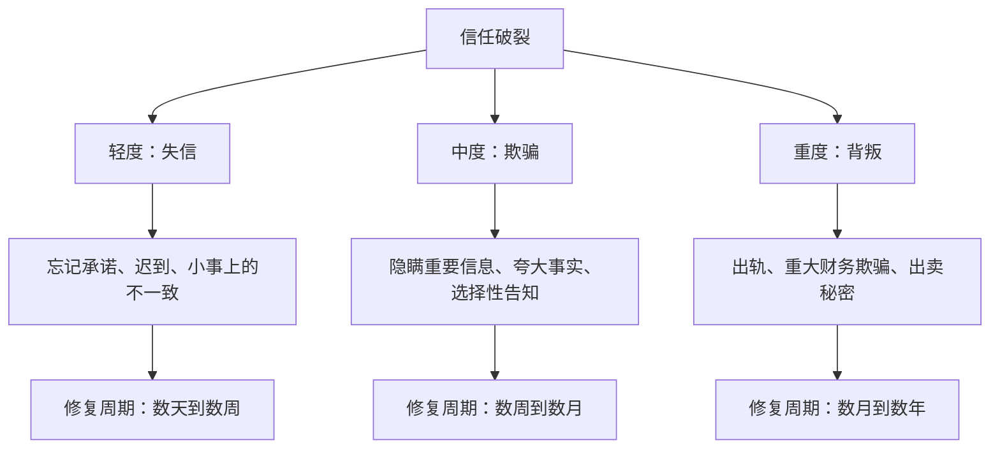
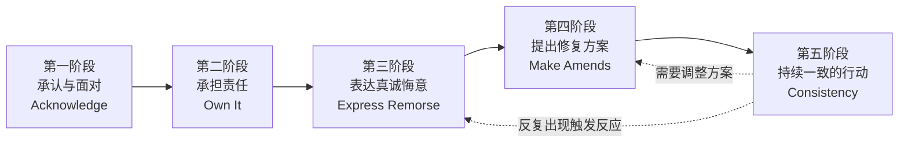
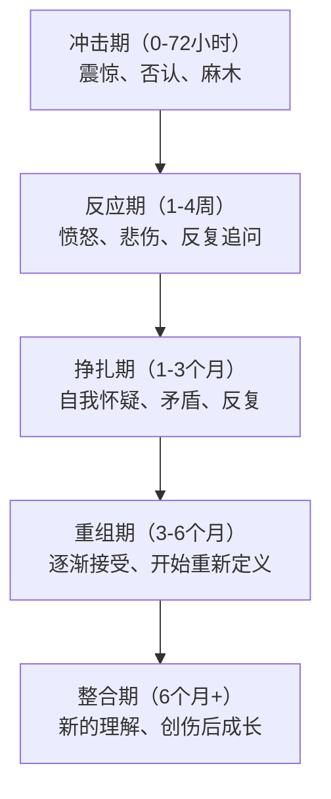

## 四、重建信任：当关系出现裂痕

信任是所有人际关系的基石——无论是亲密关系、友谊、职场合作还是商业伙伴。当信任出现裂痕，关系就像地基受损的建筑，表面可能还维持着，但随时可能崩塌。好消息是，信任可以被重建；坏消息是，重建的过程远比初次建立更加艰难和漫长。

本章将从信任的心理学本质出发，系统讲解信任破裂的机制、重建的完整框架、双方各自需要承担的角色，以及具体的工具和模板，帮助你在关系出现裂痕时，做出正确的决策和行动。

### 4.1 信任的本质：为什么它如此脆弱

#### 4.1.1 信任的心理学定义

心理学家约翰·霍姆斯（John Holmes）将信任定义为："一种心理状态，包含基于对他人意图或行为的积极期望而接受脆弱性的意愿。"这个定义揭示了信任的核心悖论——**信任本质上是一种冒险**。当你信任一个人，你就是在用自己的脆弱去赌对方的善意。

发展心理学家埃里克·埃里克森（Erik Erikson）在其心理社会发展理论中，将"基本信任 vs. 基本不信任"列为人生第一个心理冲突（0-18个月）。婴儿期形成的基本信任模式，会深刻影响一个人一生的信任风格。那些在早期获得稳定照顾的人，更容易发展出"默认信任"的倾向；反之，则可能形成"默认怀疑"的信任模式。

#### 4.1.2 信任的三个维度

信任不是一个简单的开关——开了就是开了，关了就是关了。信任是一个连续的光谱，由三个核心维度构成：

| 维度 | 含义 | 典型表现 | 受损信号 |
|------|------|----------|----------|
| **可靠性（Reliability）** | 你说到做到吗？行为是否一致？ | 准时赴约、兑现承诺、言行一致 | 频繁爽约、承诺后食言、行为不可预测 |
| **能力（Competence）** | 在需要的时候，你有能力回应吗？ | 解决问题的能力、情绪支持能力 | 关键时刻掉链子、无法提供有效帮助 |
| **善意（Benevolence）** | 你的出发点是善意的吗？真心为我好吗？ | 考虑对方利益、不利用对方弱点 | 操纵、利用、自私行为、幸灾乐祸 |

这三个维度独立运作又相互影响。一个人可能非常可靠但缺乏善意（比如一个准时但冷漠的合作伙伴），也可能充满善意但不可靠（比如一个真心对你好但总是迟到失约的朋友）。**信任的全面崩塌，通常是三个维度同时受到严重损害的结果。**

在职场语境中，这三个维度的权重还会因角色关系而变化：对领导的信任更侧重能力维度，对同事的信任更侧重可靠性维度，对亲密朋友的信任则更侧重善意维度。当信任破裂时，首先需要识别主要受损的是哪个维度，才能精准修复。

#### 4.1.3 信任的神经科学基础

神经经济学家保罗·扎克（Paul Zak）的研究揭示了信任的生化机制。当两个人之间存在信任时，大脑会释放催产素（Oxytocin），这种神经递质会降低防御反应、增强社会连接感。这就是为什么信任让人感到温暖和安全。

当信任被背叛时，大脑的杏仁核（Amygdala）会被激活，触发"战或逃"反应。更关键的是，这种激活会形成**情绪记忆**——即使理智上你已经原谅了对方，当类似情境再次出现时，杏仁核仍会自动发出警报。这就是为什么被伤害过的人会反复出现"触发反应"（triggering），这不是他们"小气"或"翻旧账"，而是大脑的保护机制在起作用。

**记忆再巩固与信任修复的可能**：神经科学也给了我们希望。每次创伤记忆被激活时，大脑都会经历一个"记忆再巩固"（Memory Reconsolidation）的窗口期，大约持续5小时。在这个窗口期内，如果受伤方同时接收到与创伤不一致的新体验（比如犯错方展现出了真诚的改变），旧的记忆可以被修改和更新。这就是为什么"持续一致的新行为"能真正修复信任——它不是在建立一个全新的信任，而是在物理层面改写大脑中的信任记忆。

#### 4.1.4 依恋风格与信任模式

心理学家约翰·鲍尔比（John Bowlby）和玛丽·安斯沃思（Mary Ainsworth）的依恋理论，为理解个体信任差异提供了关键框架。每个人的依恋风格，深刻影响着他们在信任破裂后的反应模式和修复能力：

| 依恋风格 | 信任特征 | 信任破裂后的典型反应 | 修复的关键需求 |
|----------|----------|---------------------|---------------|
| **安全型（约56%）** | 默认信任，能承受适度失望 | 感到受伤但能表达需求，愿意给对方机会 | 真诚的道歉+具体的行为改变 |
| **焦虑型（约20%）** | 渴望信任但害怕被抛弃，过度依赖确认 | 极度恐惧、反复确认、情绪波动剧烈、害怕被遗弃 | 高频次的安抚+可验证的承诺+不厌其烦的重复确认 |
| **回避型（约25%）** | 默认不信任，情感隔离自我保护 | 情感撤退、冷漠、拒绝沟通、"我不在乎"的表象 | 被给予空间+不施压+以行动而非语言证明安全 |
| **混乱型（约5-15%）** | 在渴望亲近和恐惧亲近之间矛盾摆荡 | 同时索求距离和亲近、行为矛盾、情绪极端 | 专业治疗介入+极度的耐心+安全稳定的环境 |

**为什么这很重要**：如果你的伴侣是焦虑型依恋，信任破裂后他们需要大量的确认和安抚——这不是"控制欲强"，而是他们调节恐惧的方式。如果你的伴侣是回避型依恋，他们表现得"不在乎"不代表真的不在乎——那只是他们的防御机制。理解依恋风格，能让你避免因误解而加剧伤害。

#### 4.1.5 信任银行账户模型

史蒂芬·柯维（Stephen Covey）在《高效能人士的七个习惯》中提出了"情感银行账户"（Emotional Bank Account）的比喻，非常适合理解信任的运作机制：

- **存款行为**：信守承诺、表达善意、忠诚、道歉、给予关注
- **取款行为**：违背承诺、忽视、欺骗、傲慢、背叛
- **透支后果**：当账户余额降到零以下，关系进入"信用危机"——任何微小的取款行为都会引发剧烈反应

关键洞察：**信任的存款是小额累积的（每次+1），但取款可以是巨额的（一次-100）。** 这解释了为什么信任"一滴一滴建立、瞬间摧毁、长时间重建"。

**进阶模型——信任的复利效应**：柯维的模型还可以进一步深化。当信任账户余额很高时，偶尔的小额取款（比如一次迟到、一句无心之言）不仅不会造成危机，反而会因为"善意预设"而被自动理解。反过来，当账户已经透支时，即使存款行为（比如一次精心准备的礼物）也可能被解读为"心虚"或"讨好"。这就是信任的复利效应——余额越高，容错空间越大；余额越低，修复越难。

### 4.2 信任破裂的类型学

不同类型的信任破裂，需要不同的修复策略。盲目套用同一种方法，往往事倍功半。

#### 4.2.1 按严重程度分类

#### 4.2.2 按意图性分类

| 类型 | 定义 | 示例 | 修复难度 |
|------|------|------|----------|
| **无意伤害** | 没有恶意，因疏忽或能力不足造成 | 忘记重要纪念日、不小心泄露秘密 | ★★☆ |
| **冲动行为** | 一时情绪失控，事后后悔 | 气话伤人、冲动消费影响家庭 | ★★★ |
| **蓄意欺骗** | 有预谋的欺骗行为 | 长期隐瞒财务状况、有计划的出轨 | ★★★★★ |
| **模式性失信** | 反复出现的信任问题 | 承诺改变却从不兑现、习惯性说谎 | ★★★★☆ |

#### 4.2.3 按关系场景分类

不同关系场景中的信任破裂，其影响范围和修复策略有显著差异：

| 场景 | 核心信任维度 | 破裂的典型形式 | 修复的特殊考量 |
|------|-------------|---------------|---------------|
| **亲密关系** | 善意+可靠性+诚实 | 出轨、欺骗、情感忽视 | 涉及身体亲密、共同生活、可能有孩子 |
| **家庭关系** | 善意+可靠性 | 父母失信、手足背叛、遗产纠纷 | 无法"分手"，需要长期共存策略 |
| **友谊** | 善意+可靠性 | 背后议论、利用关系、关键时刻缺席 | 通常可以降温或断联，修复动力较低 |
| **职场关系** | 能力+可靠性 | 抢功、泄密、违反承诺 | 需维持专业合作，修复目标是"可共事" |
| **商业合作** | 可靠性+能力 | 违约、利益输送、隐瞒风险 | 依赖合同和制度约束，个人信任为辅 |

**家庭关系的信任修复**是一个被普遍低估的难题。你无法"分手"或"离职"来结束与父母或兄弟姐妹的关系，这意味着修复不是选项，而是必须面对的长期课题。家庭关系的修复重点通常不是"恢复如初"，而是"建立新的相处模式"——承认关系已经改变，但仍然可以在新的基础上共存。

#### 4.2.4 信任破裂的连锁反应

一次信任破裂很少只影响单一关系维度。以"出轨"为例，它同时破坏了：

- **可靠性**：你承诺过忠诚，但没有做到
- **善意**：你把个人欲望置于对方的福祉之上
- **诚实**：你隐瞒了事实，可能还编造了谎言
- **安全**：对方的世界观被颠覆——"我以为我了解你"
- **自我价值**：被背叛方会质疑——"是我不够好吗？"

这就是为什么重度信任破裂的修复如此艰难——你需要逐一修复每个受损的维度，而不是简单地"说对不起"。

**连锁反应的扩散效应**：信任破裂还会波及关系之外。被背叛方可能开始对其他人也产生不信任——"如果我最亲近的人都能骗我，还有谁值得信任？"这种"信任泛化"可能导致社交退缩、职场合作困难，甚至影响与孩子的关系。意识到这种扩散效应，有助于及时寻求支持，避免单一事件演变为全面的信任危机。

### 4.3 重建信任的完整框架

重建信任不是一次对话能完成的，它是一个系统工程。以下是经过心理学研究和临床实践验证的完整框架。

**注意**：这五个阶段不是严格的线性流程。在持续一致的行动阶段（第五阶段），可能需要重新回到前面的阶段——比如当新的触发反应出现时，你需要再次表达悔意（第三阶段）；当修复方案效果不佳时，需要重新协商（第四阶段）。信任修复是一个螺旋上升的过程。

#### 4.3.1 第一阶段：承认与面对（Acknowledge）

**这不是简单地说"对不起"，而是真正理解你的行为对对方造成了什么伤害。**

有效的承认包含三个层次：

1. **事实层面**：具体指出你做了什么，不模糊、不含糊
2. **影响层面**：理解这对对方意味着什么——情感上、认知上、生活上
3. **责任层面**：明确承认这是你的选择和责任

**示范对话：**

> ❌ "对不起我忘了你的生日。"（只触及事实层面）
>
> ❌ "对不起你生气了。"（暗示对方的反应才是问题）
>
> ✅ "我在你的生日那天加班到很晚，回来也没有任何表示。你一定觉得在我心里，工作比你更重要。你精心期待了一天，却什么都没等到——那种失望和被忽视的感觉，我完全可以理解。这是我的错，没有任何借口。"（事实+影响+责任，三层完整）

**常见错误：**

- **急于翻篇**：刚说完"对不起"就问"你原谅我了吗？"——这是在施压，不是在修复
- **自我中心的道歉**："我也很痛苦啊"——把焦点从受伤者转移到自己身上
- **条件式道歉**："如果我伤害了你，我很抱歉"——"如果"二字暗示你在质疑对方的感受
- **泛化式道歉**："对不起我总是让你失望"——用"总是"回避了具体行为的面对

#### 4.3.2 第二阶段：承担责任（Own It）

完全承担自己行为的责任，是重建信任的关键转折点。这一步的核心是**拒绝所有形式的责任转移**。

**责任转移的七种形式（必须避免）：**

| 形式 | 典型说法 | 问题所在 |
|------|----------|----------|
| 环境归因 | "当时压力太大了" | 暗示条件合适你还会这样做 |
| 对方归因 | "如果你当时不那样说…" | 把责任推给受害者 |
| 最小化 | "没那么严重吧" | 否认对方的感受 |
| 比较归因 | "别人比我做得更过分" | 用别人的错为自己开脱 |
| 动机辩护 | "我是为你好" | 用好的出发点为坏的结果辩护 |
| 选择性遗忘 | "我不记得了" | 回避面对事实 |
| 自我攻击 | "我就是个废物" | 用自我惩罚博取同情，转移焦点 |

**正确的承担责任方式：**

"我做了这个选择。这个选择伤害了你。我完全理解你为什么感到愤怒/失望/受伤。我不打算找任何借口，因为无论当时的情况如何，做出这个选择的是我，不是别人。"

**深层意义**：承担责任不仅仅是"认错"，更是向对方传达一个信息——"我尊重你足够到不会对你撒谎，包括用各种借口来欺骗你。"

**注意自我攻击陷阱**：很多人在承担责任时，会滑入"我就是个烂人"的自我攻击模式。表面上看这是在认错，实际上它是一种隐性的责任转移——当你说"我是废物"时，对方的愤怒会被迫转化为安慰（"你不是废物"），焦点从"你做了什么"变成了"你是谁"。真正的承担责任是：**我是有能力做好选择的人，但我这次做了错误的选择，我为此负责。**

#### 4.3.3 第三阶段：表达真诚悔意（Express Remorse）

悔意是重建信任的情感燃料。但不是所有的悔意都有修复效果——关键在于区分**对后果的后悔**和**对行为的后悔**。

**对后果的后悔（无效）：**
- "对不起让你生气了。"（潜台词：我后悔你生气了，但我做的事本身没问题）
- "我没想到你会发现。"（潜台词：我后悔被发现了，而不是后悔做了）
- "这件事影响太大了，早知道就不做了。"（潜台词：如果没有后果，我还会做）

**对行为的后悔（有效）：**
- "我对自己的行为感到非常后悔。我做了不应该做的事。"
- "即使你永远不会发现，我做了这件事本身就已经是错的。"
- "我不需要看到后果才后悔——做出那个选择的那一刻，我就背叛了自己的价值观。"

**如何让对方感受到你的真诚：**

1. **允许自己在对方面前展现脆弱**：不要用"我已经道过歉了"来建立防线
2. **持续而非一次性的表达**：悔意不是说一次就够了，在对方需要的时候，反复表达
3. **用非语言信号强化**：眼神接触、语气的诚恳、身体姿态的开放
4. **写一封真诚的信**：文字有持久的证据效力，对方可以在情绪波动时反复阅读
5. **通过行为表达悔意**：主动放弃导致问题的环境或习惯（比如删除社交软件上不当的联系人、主动提出财务透明化）

#### 4.3.4 第四阶段：提出修复方案（Make Amends）

光道歉不够，还需要用实际行动来修复。修复方案的核心原则是：**由受伤方定义"修复"的含义，而不是由犯错方自行决定。**

**修复方案的设计框架：**

1. **倾听对方的需求**："你希望我做什么来弥补？"
2. **提出具体可行的方案**（不要让对方从零开始想）
3. **设置时间表**：让修复行动有可衡量的进度
4. **接受对方可能暂时不接受修复**：修复的权利在受伤方

**不同类型伤害的修复策略：**

| 伤害类型 | 修复方向 | 具体行动示例 |
|----------|----------|-------------|
| 忽视冷落 | 增加关注和陪伴 | 固定"无手机约会时间"、主动关心日常 |
| 言语伤害 | 建立新的沟通模式 | 学习非暴力沟通、设置"暂停词" |
| 财务欺骗 | 重建透明度 | 共享财务信息、设置共同决策机制 |
| 背叛（出轨） | 全方位重建 | 断绝第三方联系、接受伴侣治疗、开放通信 |
| 承诺违背 | 可验证的行动 | 从小承诺开始、使用"承诺追踪"工具 |
| 隐瞒重大信息 | 建立信息共享机制 | 主动同步关键信息、约定不保留的事项范围 |

**一个重要提醒**：修复方案不等于"赎罪"。你不是在通过做一些事来"抵消"你做过的坏事，而是在用新的行动来证明你的改变是真实的。两者的区别在于心态——赎罪是交易，改变是成长。

#### 4.3.5 第五阶段：持续一致的行动（Consistency）

信任的重建没有捷径，唯一的方式就是用**持续一致的行动**来证明改变是真实的。这是最难的一步，因为它是五步中最漫长、最考验耐心的阶段。

**关键原则：**

- **时间框架**：轻度信任破裂需要数周到数月，重度信任破裂可能需要一到三年
- **进度不可控**：恢复时间不由犯错方决定，而由受伤方决定
- **可能出现反复**：受伤方可能在某个时刻突然"回到原点"，这是正常的情绪波动，不是倒退
- **不公平感**：你可能会觉得"我已经这么努力了，为什么还不够？"——但请记住，不公平的起点是你造成的

**被伤害方有权利按自己的节奏恢复信任。** 你不能催促对方"快点原谅我"。信任的恢复本质上是一种创伤疗愈，每个人的愈合速度不同。

**"一致性"的可衡量指标**：持续一致不是靠感觉判断的，而是需要具体的行为锚点：

- **承诺兑现率**：说到的事是否做到了？从"小事准时"开始，逐步建立"大事可期"
- **主动同步频率**：是否主动告知行踪、计划、感受，而不是等对方来问
- **情绪稳定性**：面对对方的情绪反复时，是否能保持耐心而不是发火
- **透明度的持续**：不是"给对方看一次手机"，而是在没有被要求的情况下也保持开放

**判断信任是否在重建的信号：**

| 正向信号 | 负向信号 |
|----------|----------|
| 对方开始分享小事 | 持续回避和你在一起 |
| 情绪波动频率降低 | 愤怒/冷暴力持续加剧 |
| 愿意一起做未来计划 | 反复查手机、查行踪 |
| 在他人面前维护你 | 向所有人控诉你的错误 |
| 偶尔能开玩笑提及此事 | 一触即发的"触发反应" |
| 主动寻求身体接触 | 持续的身体回避 |

### 4.4 作为被伤害方：你的角色与权利

这一节专门写给被伤害的一方。如果你正在经历信任破裂带来的痛苦，以下内容对你至关重要。

#### 4.4.1 允许自己感受所有的情绪

信任被破坏后，你可能会经历一系列复杂的情绪：愤怒、悲伤、困惑、自我怀疑、恐惧、羞耻、背叛感。**这些情绪全部都是合理的，不需要为任何一种感到内疚。**

**情绪的时间线（典型模式）：**

特别需要注意的是：

- **自我怀疑**："是不是我哪里做得不好？"——不是。即使关系中你有不足，也不构成对方背叛信任的理由。
- **羞耻感**："被人知道了怎么办？"——你没有做错事，不需要为别人的错误感到羞耻。
- **矛盾情绪**：你可能同时恨对方又想念对方——这完全正常，人类的情感不是非黑即白的。
- **身体反应**：信任破裂可以引发真实的生理反应——失眠、胃痛、食欲变化、免疫力下降、注意力无法集中。这不是"想太多"，而是神经系统在应激状态下的正常表现。

#### 4.4.2 表达而非压抑

压抑的伤害不会消失，它会以更隐蔽的方式侵蚀关系：

- 表面原谅，但在每次争吵时翻旧账
- 嘴上说"没事了"，但行为上变得冷漠疏远
- 用被动攻击来"惩罚"对方——"你不是说你改了吗？那你怎么还…"
- 身体症状：失眠、食欲变化、焦虑

**健康的表达方式：**

1. **直接告诉对方你的感受**："我现在还是会觉得不安，当我看到你手机响的时候。"
2. **区分感受和指控**：用"我感到…"开头，而不是"你总是…"
3. **选择表达的时机**：不要在自己情绪最激烈的时候沟通
4. **寻求外部支持**：信任的朋友、家人、心理咨询师
5. **写日记或信件**：当面沟通太痛苦时，文字可以帮你组织思路，也给对方消化的空间

#### 4.4.3 设定合理的边界

在信任重建期间，你有权利设定边界来保护自己。这些边界不是"惩罚"，而是自我保护的必要措施。

**边界设定模板：**

> "为了我能安心地继续这段关系，我需要以下几点：
> 1. **透明度**：我希望我们能共享[具体范围]的信息。
> 2. **可验证性**：在信任重建期间，我希望你愿意[具体行动]来让我安心。
> 3. **沟通频率**：我希望我们能每天花[具体时间]来聊聊彼此的感受。
> 4. **底线**：如果[具体行为]再次发生，我将[具体后果]。"

**注意**：边界必须是合理的、可执行的、双方同意的。不合理的边界（比如"从今以后你不能有任何异性朋友"）只会制造新的怨恨。

**"合理边界"的判断标准**：一个边界是否合理，可以用三个问题来检验——（1）这个边界是否真的在保护我，还是在惩罚对方？（2）这个边界是否可持续执行，还是只会导致更多的监控和冲突？（3）如果角色互换，我能接受对方给我设定同样的边界吗？

#### 4.4.4 原谅与和解：不是同一件事

这是一个关键区分，很多人会混淆：

- **原谅（Forgiveness）**：放下内心的怨恨和愤怒，是为了**自己的**内心平静。你可以在不和对方继续关系的情况下原谅。
- **和解（Reconciliation）**：在原谅的基础上，**双方共同努力**重建关系。这需要两个人都愿意付出努力。

**原谅不意味着：**
- 假装事情没发生过
- 忘记你经历的痛苦
- 允许对方继续伤害你
- 你必须继续这段关系

**原谅真正意味着：**
- 你选择不再让这件事控制你的情绪
- 你接受了"过去无法改变"这个事实
- 你把注意力从"他/她对我做了什么"转向"我要如何继续我的人生"

**原谅是一个过程，不是一个时刻**。你不会在某一天醒来突然"原谅了"。它是渐进的——也许今天你能平静地想起这件事，明天又突然被愤怒淹没。这不意味着你"退步了"，而是原谅本身就是波浪式前进的。

#### 4.4.5 什么时候应该离开

并非所有的信任破裂都值得修复。以下情况，离开可能是更健康的选择：

- **重复模式**：对方多次承诺改变，但从未真正改变
- **缺乏悔意**：对方认为自己没有错，或者只在你威胁离开时才"道歉"
- **权力不对等**：对方利用你的原谅来维持对你的控制
- **安全问题**：任何形式的身体暴力或持续的精神虐待
- **价值观根本冲突**：对方的行为反映了与你根本不同的价值观

**一个判断标准**：如果修复信任的全部努力都只来自你这一方，那这段关系可能已经没有修复的基础了。

**挽救 vs. 离开的决策矩阵**：

| 判断维度 | 倾向于挽救 | 倾向于离开 |
|----------|-----------|-----------|
| **对方的悔意** | 主动承认错误，不需你来要求 | 否认、淡化、只在压力下才"认错" |
| **行为改变** | 有可见的、持续的行动改变 | 只有语言承诺，行动一成不变 |
| **历史记录** | 第一次发生严重信任破裂 | 反复出现同一类型的问题 |
| **沟通质量** | 能进行建设性对话，即使困难 | 每次沟通都以争吵或冷战结束 |
| **你的感受** | 仍有爱和连接感，只是受伤 | 爱已经变成义务、恐惧或习惯 |
| **外部支持** | 有可靠的外部支持系统 | 完全孤立，只能依赖对方 |

### 4.5 作为信任破坏方：你的责任与行动

这一节写给犯错的一方。重建信任的主动权在你——不是受伤方。

#### 4.5.1 区分内疚与羞耻

- **内疚（Guilt）**："我做了一件坏事。"——这是健康的，它驱动你去弥补和改变。
- **羞耻（Shame）**："我是一个坏人。"——这是不健康的，它导致自我封闭和逃避。

过度的羞耻会让你：
- 陷入自我攻击，无法采取有效行动
- 变得防御性很强，拒绝讨论这件事
- 用"我就是个烂人"来逃避真正的改变
- 要求对方来安慰你——把受害者的角色反转

**正确的姿态**：承认错误 → 承受内疚 → 用行动证明改变 → 接受对方需要时间

**从羞耻到内疚的转换练习**：当发现自己陷入"我是坏人"的羞耻循环时，试着把陈述句从身份层面转回行为层面——把"我是骗子"改为"我撒了谎"，把"我是渣男/渣女"改为"我做了不负责任的选择"。这不是在减轻罪责，而是把精力从自我毁灭转向行为改正。你无法改变"你是谁"，但你可以改变"你做什么"。

#### 4.5.2 耐心是核心能力

重建信任期间，你需要发展的一项核心能力是**耐心**——不是被动的等待，而是主动的、有方向感的耐心。

**耐心的具体表现：**

- 当对方第N次提起这件事时，不表现出厌烦
- 当对方检查你的手机时，主动递过去而不是表现出被冒犯
- 当对方情绪爆发时，留下来陪伴而不是摔门离去
- 当你觉得"我已经做得够好了"时，提醒自己"还不够，继续"
- 当对方哭泣时，握住他们的手，而不是尴尬地站在一旁

**支撑耐心的思维框架：**

"我破坏信任不是一天造成的，重建信任也不应该期望一天完成。我欠对方的不是一个道歉，而是一个经过证明的、持续的改变。"

#### 4.5.3 你绝对不能做的事

| 行为 | 为什么有害 |
|------|-----------|
| 说"你怎么还没放下" | 把修复的责任推给受伤方 |
| 用自己也受伤来转移焦点 | "我也很难过啊"——你的难过是自己造成的 |
| 在对方情绪波动时翻脸 | "我都这么努力了你还要怎样"——这是施压不是修复 |
| 限制对方的表达 | "别再提了"——不允许对方处理情绪 |
| 通过第三方施压 | 让朋友/家人劝对方"原谅他/她吧" |
| 设定期限 | "如果你三个月内还不能原谅我，那就算了" |
| 用礼物代替修复 | 用物质补偿回避真正的情感修复工作 |
| 在社交媒体上公开道歉 | 将本应私密的修复变成公开表演，给对方施加社交压力 |

#### 4.5.4 认知扭曲的识别与矫正

在信任重建过程中，犯错方容易陷入几种认知扭曲，这些扭曲会阻碍修复进程：

| 认知扭曲 | 内心独白 | 矫正方式 |
|----------|----------|---------|
| **应该化** | "我都道歉了，ta应该原谅我了" | "原谅是对方的权利，不是我的要求" |
| **灾难化** | "我永远无法被原谅了" | "信任重建是一个过程，我只需要专注于今天的行动" |
| **读心术** | "ta肯定还在恨我" | "我不知道ta的真实感受，我应该问而不是猜" |
| **非黑即白** | "如果ta没有完全原谅我，那我做的一切都白费了" | "信任恢复是渐进的，每一步都有价值" |
| **自我参照** | "ta心情不好一定是因为还在怪我" | "ta可能有与我无关的压力，不要自动对号入座" |

识别这些扭曲并主动矫正，能帮助你在修复过程中保持理性，避免因为自己的认知偏差而做出错误的反应。

### 4.6 沟通模式：重建期间的关键对话

信任重建期间的沟通，需要比日常沟通更高的技巧。以下是几种关键场景的对话模板。

#### 4.6.1 触发反应对话

当受伤方出现"触发反应"（被某个线索激活了创伤记忆）时：

**受伤方可以说：**
> "我现在需要你听我说。刚才[触发事件]让我想起了[原始伤害]，我现在感到[情绪]。我不需要你做任何事，只需要你在这里听我说完。"

**信任破坏方应该回应：**
> "我在听。你说吧。"（然后真的在听，不打断，不辩解，不解决问题）

**后续跟进（等对方说完后）：**
> "谢谢你告诉我。我能感受到这件事对你来说有多痛苦。我现在可以抱你吗？还是你需要一些空间？"

**为什么这样有效**：触发反应的本质是大脑在说"危险！"。此刻受伤方需要的不是解释，而是被听见和被理解。当大脑的杏仁核被激活时，逻辑推理区域（前额叶皮层）的功能会被抑制——在这个时刻讲道理是无效的，只有情感连接才能降低杏仁核的警报。

#### 4.6.2 进度检查对话

建议每周进行一次"信任进度检查"：

**对话框架：**

1. **感受分享**（各5分钟，不打断）
   - "这一周我的感受是…"
   - "我注意到[具体变化]…"
2. **需求表达**（各3分钟）
   - "接下来一周我希望你能…"
   - "我需要更多的/更少的…"
3. **确认与感谢**（各2分钟）
   - "我感谢你做了…"
   - "我注意到你在…方面的努力"

**进度检查的注意事项**：
- 选择双方都平静的时间进行，不要在争吵后"顺便"检查
- 使用计时器保证公平的发言时间
- 准备纸笔记录对方的需求，不要依赖记忆
- 如果讨论开始升级为争吵，立即暂停，约定24小时内重新开始

#### 4.6.3 关于"翻旧账"的正确处理

受伤方"翻旧账"是信任重建过程中最常见的冲突点。理解为什么它会发生，才能正确应对：

**"翻旧账"的心理机制**：
- 伤口没有真正愈合，只是表面结痂
- 新的信任行为还没有足够的积累来覆盖旧的创伤记忆
- 当下的某个行为无意中激活了创伤记忆

**处理方式**：
- 不要说"你怎么又提这件事"
- 而是说"我理解这件事对你来说还没有过去。你想聊聊吗？"
- 然后真正地、耐心地、不带防御地倾听

**进阶策略——"信任桌"技术**：双方约定一个固定的时间和空间（比如每周日晚上的客厅），专门用来讨论信任相关的话题。在"信任桌"上，受伤方可以自由表达所有疑虑和感受，犯错方承诺不设防地倾听。离开"信任桌"后，除非紧急情况，尽量不在其他时间和场景中提起信任话题。这样既保证了受伤方有表达的出口，也给犯错方一个可预期的心理准备，避免了"随时可能被翻旧账"的紧张感。

#### 4.6.4 信任重建的"决定性对话"

有些对话在信任重建过程中具有决定性意义——它们的质量直接决定了修复是否能继续推进。这类对话通常涉及关键事实的披露、核心需求的表达、或者关系方向的选择。

**决定性对话的准备清单**：

1. **时机选择**：双方都处于情绪相对稳定的状态，有充足的时间（至少1-2小时），没有外在压力
2. **环境准备**：私密空间，没有干扰（手机静音、门关上），可以有一些舒适元素（茶、毯子）
3. **心态准备**：目标是"理解"而非"赢"，准备好了接受对方说出你不想听的话
4. **安全网约定**：如果对话失控，任何一方可以说"暂停"，24小时内恢复

**决定性对话的结构：**

> 1. **开场**："今天我想和你聊一些重要的事情。我承诺会诚实地说，也会认真地听你说。"
> 2. **事实陈述**：只说事实，不加评价。"我做了…"而不是"因为你也…"
> 3. **情感表达**：双方各说自己的感受，不打断
> 4. **需求确认**："我需要确认我理解了你说的——你主要的感受是…，你希望的是…，对吗？"
> 5. **下一步行动**：达成具体的、可执行的下一步
> 6. **感谢**："谢谢你愿意和我进行这个对话。"

### 4.7 何时寻求专业帮助

并非所有的信任修复都能靠两个人自己完成。以下情况建议寻求专业心理咨询或伴侣治疗：

- **涉及出轨的亲密关系**：研究显示，有专业治疗师介入的伴侣，修复成功率显著高于自行修复
- **创伤后应激反应（PTSD）**：失眠、噩梦、闪回、过度警觉等创伤症状持续超过一个月
- **沟通陷入死循环**：每次讨论都以争吵结束，无法推进
- **一方有成瘾行为**：酒精、赌博、药物等成瘾行为往往是信任问题的根源
- **存在心理健康问题**：抑郁、焦虑等心理问题会影响双方的修复能力
- **涉及家庭暴力**：安全永远是第一位的，需要专业机构介入

**伴侣治疗的作用**：
- 提供安全的对话空间，由第三方维持沟通秩序
- 帮助双方理解信任破裂的深层原因
- 教授具体的沟通和修复技巧
- 对修复进度提供客观评估

**选择治疗师的建议**：
- 选择专门接受过伴侣治疗训练的心理咨询师（不是所有心理咨询师都擅长伴侣工作）
- 优先考虑持有国际认证的治疗师（如Gottman认证治疗师、EFT情绪聚焦治疗师）
- 第一次咨询是双向选择——如果你们中任何一方觉得不被理解，可以换人
- 伴侣治疗不是"谁对谁错"的裁决，治疗师不会站在任何一方

### 4.8 信任重建的自我评估工具

以下是一份信任重建进度的自评清单，建议双方各自独立完成，然后对比讨论。

**受伤方自评（过去一周的感受，1-10分）：**

1. 我感到安全的程度：___
2. 我能信任对方的程度：___
3. 我能不带防备地与对方沟通的程度：___
4. 我对未来的信心程度：___
5. 我的情绪稳定程度：___
6. 我能放下怨恨的程度：___
7. 我愿意在这段关系中投入的程度：___
总分：___/70

**信任破坏方自评（过去一周的表现，1-10分）：**

1. 我兑现承诺的程度：___
2. 我保持透明的程度：___
3. 我主动表达关心的程度：___
4. 我处理自己内疚/羞耻的程度：___
5. 我对对方情绪的耐心程度：___
6. 我持续展示改变的程度：___
7. 我不走老路的程度：___
总分：___/70

**对比讨论要点**：
- 双方评分差距大的项目，是需要重点沟通的领域
- 双方评分都在上升的趋势，说明修复在正确轨道上
- 任何一方分数持续下降，说明需要调整策略或寻求专业帮助

**评分解读参考**：
| 总分范围 | 含义 | 建议 |
|----------|------|------|
| 56-70 | 信任在稳步恢复 | 继续当前策略，保持一致性 |
| 42-55 | 有进步但仍有显著障碍 | 识别低分项，针对性加强 |
| 28-41 | 恢复缓慢，需要调整 | 考虑引入专业帮助 |
| 低于28 | 修复停滞或倒退 | 强烈建议专业干预，评估关系可持续性 |

### 4.9 常见误区与纠正

| 误区 | 为什么错误 | 正确认知 |
|------|-----------|---------|
| "时间会治愈一切" | 被动等待不会修复信任，需要主动行动 | 时间是必要条件，但不是充分条件 |
| "道歉了就应该翻篇" | 道歉只是修复的起点，不是终点 | 道歉是第一步，持续行动才是关键 |
| "翻旧账说明不够大度" | 忽视了创伤记忆的神经科学机制 | 触发反应是正常的，需要耐心应对 |
| "爱就应该无条件原谅" | 混淆了爱和自尊的边界 | 爱不等于必须接受一切，健康的关系需要底线 |
| "只要我不再犯就好了" | 忽略了受伤方的情感修复需求 | 不再犯是底线，主动修复才是加分 |
| "找人劝劝对方就好了" | 第三方介入可能适得其反 | 信任修复是两个人的事，第三方可辅助但不能替代 |
| "把手机给对方看就是信任" | 信任不能通过监控建立 | 透明是过渡手段，最终目标是不需要透明也能信任 |
| "经历了这次我们就好了" | 一次修复不能保证永远不复发 | 信任需要持续维护，和定期体检一样 |
| "不提就是放下了" | 沉默不代表愈合 | 不提可能只是压抑，需要确认对方真实状态 |

### 4.10 信任重建后的"新常态"

一个需要接受的事实是：修复后的信任和最初的信任**不一样**。这不是坏事——经历过考验的信任，如果修复得当，会比之前更加坚韧。

**修复后的信任特点：**

- **更现实**：不再有"完美的对方"的幻想，而是基于真实的人建立信任
- **更有边界**：双方更清楚底线在哪里，也更尊重彼此的边界
- **更有深度**：经历过痛苦后的连接，往往比之前更加深刻
- **更有韧性**：知道了"我们能度过危机"这个事实，给了关系更强的抗压能力

心理学家约翰·戈特曼（John Gottman）的研究发现，成功修复信任破裂的伴侣，关系满意度在修复完成后的一到两年内，往往会**超过**破裂前的水平。这种现象被称为"**创伤后成长**"（Post-Traumatic Growth）——不是虽然经历创伤仍能成长，而是**正因为**经历了创伤，才获得了成长。

但前提是：**双方都投入了真实的、持续的、有方向感的努力。** 如果只有一方在付出，创伤后成长不会发生，只有持续的伤害。

**"新常态"的建立标志**：

- 你们能自然地讨论曾经的信任破裂，而不陷入痛苦或争吵
- 双方都能从这件事中提取教训，用于指导未来的行为
- 你们发展出了比以前更好的沟通方式和冲突处理能力
- 对方的存在重新成为安全感的来源，而不是焦虑的触发器
- 你们开始创造新的、积极的共同记忆，而不是只有伤痛的回忆

最后，无论修复的结果如何——无论是关系重建成功还是最终选择分开——**你为修复所做的真诚努力本身，就是有意义的**。它证明了你面对错误的勇气、承受痛苦的韧性、以及成为一个更好的人的决心。这些品质，会成为你所有未来关系的基石。
