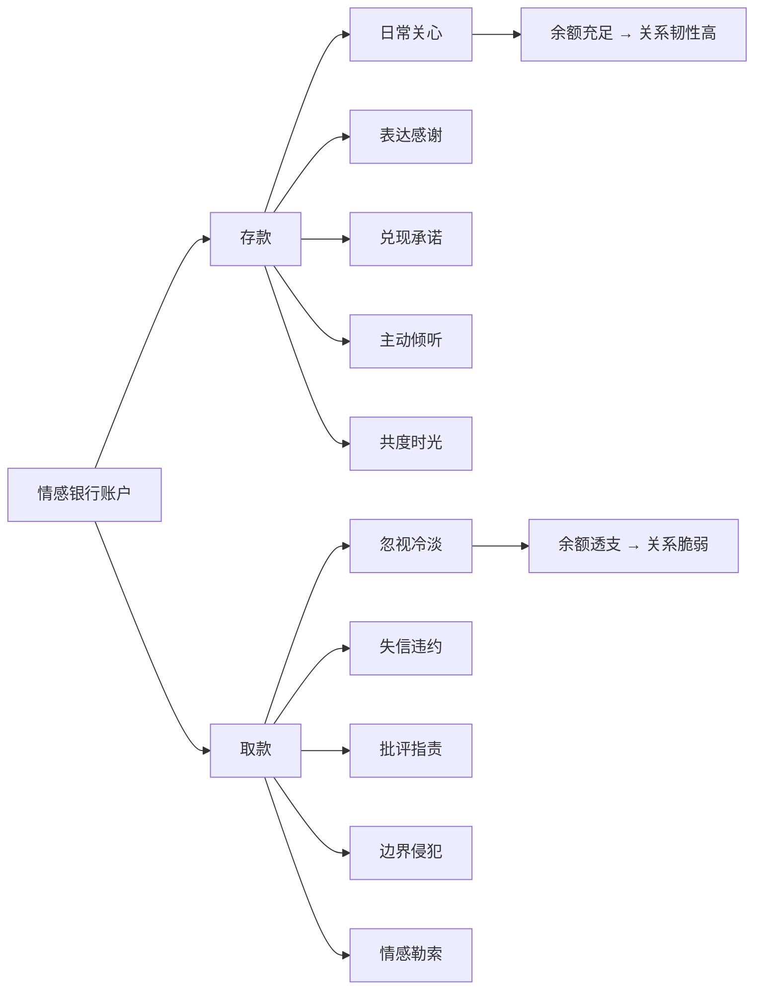
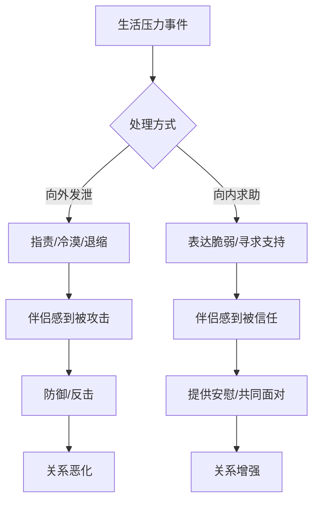
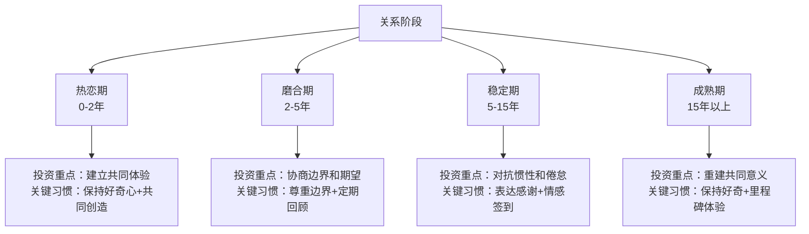

## 五、维护关系：日常中的情感投资

关系不是一劳永逸的建筑，而是需要持续浇灌的花园。许多人在关系出现裂痕时才开始寻找沟通技巧，但真正高明的做法是**在关系平稳时就持续进行情感投资**——就像定期体检比急诊抢救更能保障健康一样。

本节将从理论基础出发，建立日常情感维护的系统框架，提供可落地的操作工具，并指出常见的实践误区。如果你还没读过本章的理论基础部分（依恋理论、爱的语言、情感账户模型），建议先阅读那些章节，因为本节的很多实操建议都建立在那些理论之上。

### 5.0 先做自评：你的关系情感账户余额多少？

在学习维护技巧之前，先花5分钟做一个快速自评，定位你当前的关系状态。这个自评不是"考试"，而是帮你识别最需要关注的领域。

**关系情感健康自评表（满分60分）：**

对以下12个问题，按1-5分打分（1=完全不符合，5=完全符合）：

| 序号 | 问题 | 评分 |
|------|------|------|
| 1 | 我清楚地知道伴侣当前最大的压力来源是什么 | ___ |
| 2 | 伴侣会主动和我分享TA的喜怒哀乐 | ___ |
| 3 | 我们每天有至少10分钟不受干扰的专属交流时间 | ___ |
| 4 | 我能准确说出伴侣最近感兴趣的3件事 | ___ |
| 5 | 上周我至少主动做了3件让伴侣开心的小事 | ___ |
| 6 | 伴侣做了一件让我开心的事时，我明确表达了感谢 | ___ |
| 7 | 我们有固定的"约会时间"或共同活动 | ___ |
| 8 | 发生分歧时，我们能在24小时内修复情感连接 | ___ |
| 9 | 我知道伴侣最主要的"爱的语言"是什么（参见5.2节） | ___ |
| 10 | 我尊重伴侣的独处时间和个人空间 | ___ |
| 11 | 最近一个月我们有过一次深入的、超越日常琐事的对话 | ___ |
| 12 | 如果给关系满意度打分，我会打7分以上（满分10分） | ___ |

**解读：**

| 分数段 | 状态 | 建议 |
|--------|------|------|
| 48-60分 | 情感账户健康，继续保持 | 关注进阶技巧（5.2节后半部分），预防倦怠 |
| 36-47分 | 有改善空间，部分维度需加强 | 对照低分项重点练习对应习惯 |
| 24-35分 | 黄灯区，日常维护不足 | 立即启动"情感签到"和"每周爱情日历"（5.6节） |
| 12-23分 | 红灯区，情感账户接近透支 | 建议同时阅读本章第四节（重建信任）并考虑专业咨询 |

这个自评每季度做一次，跟踪分数变化趋势。分数不是用来"评判"谁的，而是帮你们发现需要共同关注的领域。

### 5.1 为什么日常维护比冲突修复更重要

#### 5.1.1 戈特曼实验室的核心发现

约翰·戈特曼（John Gottman）在华盛顿大学的"爱情实验室"中，对超过3000对夫妻进行了长达40年的纵向追踪研究。他发现了一个关键指标——**5:1法则**：

> 在稳定的、令人满意的关系中，积极互动与消极互动的比例至少是5:1。每一次争吵、批评或冷淡，需要至少五次积极的互动来平衡。

这个比例不是凭感觉估算的。戈特曼团队通过编码系统逐秒分析夫妻对话中的面部表情、语调、用词和生理指标（心率、皮肤电导），得出的结论是：当积极与消极互动比例低于5:1时，关系破裂的概率高达94%。

**关键推论：** 如果日常没有足够的积极互动储备，任何一次冲突都可能让关系跌破临界点。这就是为什么日常维护比危机处理更重要——它决定了你在冲突中有没有"缓冲垫"。

打一个比方：积极互动就像银行存款，冲突就像取款。一个账户里有10万的人，取1万不会慌；但如果账户只有1万，取1万就清零了。很多人关系破裂不是因为那一次争吵有多严重，而是因为"余额"早就不足了。

#### 5.1.2 情感银行账户理论

史蒂芬·柯维（Stephen Covey）在《高效能人士的七个习惯》中提出了"情感银行账户"（Emotional Bank Account）的概念。本章理论基础部分（第三节）已经详细介绍了这个模型，这里我们聚焦于它在日常维护中的应用。

核心逻辑很简单：

- **存款行为**：善意、礼貌、诚实、兑现承诺、表达欣赏、主动关心
- **取款行为**：失信、无礼、忽视、冷漠、批评、背叛

当账户余额充足时，偶尔的"取款"（比如一次争吵、一次疏忽）不会让关系崩盘。但如果账户长期只取不存，任何小事都可能触发"余额不足"的危机。

**日常维护的核心目标就是：保持情感银行账户的正向余额，让关系有足够的"缓冲垫"来应对不可避免的冲突。**

**关键细节：存款和取款的不对等性。** 研究表明，一次取款的"伤害值"大约是等量存款"幸福值"的3-5倍（Baumeister等，2001年的"坏的比好的更强"效应）。也就是说，你需要3-5次积极互动才能抵消一次消极互动的伤害。这不是悲观，而是提醒我们：情感投资要持续、要主动，不能偶尔想起来才做一次。

#### 5.1.3 关系维护的神经科学基础

积极互动之所以重要，还因为它直接影响大脑的神经化学。这不是玄学，而是可以测量的生理变化：

| 互动类型 | 释放的神经递质/激素 | 对关系的影响 | 作用持续时间 |
|---------|-------------------|------------|------------|
| 身体接触（拥抱、牵手） | 催产素（Oxytocin） | 增强信任和亲密感 | 拥抱20秒以上催产素显著升高 |
| 共同欢笑 | 内啡肽（Endorphin） | 建立积极联想和默契 | 欢笑后15-30分钟的愉悦余波 |
| 深度倾听 | 血清素（Serotonin） | 增加安全感和被重视感 | 持续的倾听习惯会稳定血清素基线 |
| 新鲜共同体验 | 多巴胺（Dopamine） | 激活奖赏系统，对抗倦怠 | 新鲜感消退后需要新的刺激 |
| 真诚感谢 | 催产素 + 多巴胺 | 强化付出的正向循环 | 表达者和接收者双方都受益 |

相反，长期缺乏积极互动会导致皮质醇（压力激素）水平升高，使伴侣双方处于慢性应激状态。处于慢性应激的伴侣，对关系中的中性信号也倾向于做负面解读——比如对方晚回复消息，健康状态的人会想"可能在忙"，而慢性应激的人会想"TA是不是不在乎我了"。

**实践启示：** 每天至少一次拥抱（20秒以上），每周至少一次共同欢笑，每周至少一次深度倾听——这不是"浪漫建议"，而是基于神经科学的关系"保养处方"。

#### 5.1.4 依恋理论视角下的日常维护

如果你读过本章第一节（依恋理论），就知道不同依恋类型的人在日常维护中有不同的需求。这不是可选的"加分项"，而是必须理解的基础：

| 依恋类型 | 在日常维护中最需要什么 | 最害怕什么 | 维护策略 |
|---------|---------------------|----------|---------|
| 安全型 | 稳定的、可预期的情感回应 | 无特别恐惧 | 标准维护即可 |
| 焦虑型 | 频繁的确认、明确的表达 | 被忽视、不确定感 | 多发消息确认、主动告知行程、明确表达在乎 |
| 回避型 | 尊重空间、不强迫亲密 | 被吞噬、失去自主 | 给足独处时间、不要求实时回复、用行动而非言语 |
| 混乱型 | 稳定和耐心 | 被抛弃和被淹没交替 | 保持一致性、不忽冷忽热、在TA不安时保持平静 |

**如何判断对方的依恋类型：** 不要通过心理测试"诊断"对方，而是通过日常观察。对方发消息后多久会追问"你怎么不回"？（焦虑型信号）对方是否经常说"我需要自己待一会儿"？（回避型信号）对方在亲密后的第二天是否反而变得疏远？（混乱型信号）你的日常维护方式必须适配对方的依恋类型，否则你的"好意"可能被解读为"压力"。

### 5.2 日常情感维护的七个核心习惯

以下七个习惯构成一个完整的关系维护系统。它们不是独立的技巧，而是相互支撑的日常实践。

#### 习惯一：每日情感签到（Daily Emotional Check-in）

**原理：** 人的情感状态每天都在变化。"我已经足够了解对方"是关系中最大的幻觉之一。每日签到的目的是保持对伴侣内心世界的实时感知。戈特曼的研究发现，幸福的伴侣每天至少有6-10分钟的"减压对话"（Stress-Reducing Conversation），专门用来了解对方当天的经历和感受。

**具体操作：**

每天花5-10分钟进行结构化的情感交流：

签到模板（三步法）：
1. 事实层："今天发生了什么值得说的事？"
2. 情感层："那件事让你感觉怎么样？"
3. 需求层："你现在需要我做什么吗？（陪伴/建议/空间/身体接触）"

**进阶版签到（适用于稳定期伴侣）：**

当你已经熟练使用三步法后，可以加入更深的维度：

进阶签到模板（五步法）：
1. 事实层 → "今天发生了什么？"
2. 情感层 → "你的感受是什么？"
3. 需求层 → "你需要我做什么？"
4. 联结层 → "今天有没有什么事让你想到我？"
5. 感恩层 → "今天有没有什么想感谢我的？"

联结层帮助你们在日常中找到"连接点"，感恩层则制造了一次额外的"情感存款"机会。

**15个可直接使用的情感签到问题：**

| 场景 | 问题 |
|------|------|
| 通用 | "如果用一种天气来形容你今天的心情，会是什么？" |
| 通用 | "今天最开心的时刻是什么？" |
| 通用 | "今天最让你疲惫的是什么？" |
| 工作日 | "今天的工作中有没有什么让你特别有成就感或者特别沮丧的事？" |
| 工作日 | "你今天有没有觉得被谁善待了？" |
| 周末 | "这周末你最想做什么？有没有什么我能配合的？" |
| 周末 | "你这周有没有什么想做但没做成的事？" |
| 压力期 | "你现在脑子里最重的那件事是什么？" |
| 压力期 | "你需要的是建议、陪伴，还是空间？" |
| 吵架后 | "你现在的情绪好些了吗？还有什么想说的？" |
| 好消息 | "你的开心我能感受到，具体是什么感觉？" |
| 生病时 | "除了身体不舒服，你的情绪怎么样？" |
| 旅行中 | "今天的旅程里，你最享受的是哪个部分？" |
| 孩子相关 | "关于孩子今天的事，你心里是怎么想的？" |
| 深夜 | "如果今晚可以不用想明天的事，你最想做什么？" |

**注意事项：**

- 时机选择很重要：不要在对方刚进门、正在忙、或明显疲惫时发起。晚饭后、睡前、散步时是比较自然的时机
- 倾听时不要急于解决问题。很多时候对方只是需要被听见，而不是被"修理"
- 如果对方说"没什么"，不要追问。可以换成"嗯，那如果有什么想说的，随时找我"——保持通道开放比强迫交流更重要
- 回避型依恋的伴侣可能不习惯每天签到，可以改为每周2-3次，或者用文字消息代替面对面交流（压力更小）

**反面案例：**

> 小王每天回家后都会问妻子"今天怎么样"，但他的眼睛始终盯着手机屏幕。妻子很快感受到了敷衍，于是开始回答"还行"。小王觉得"她不想说话"，于是不再问。两人的情感签到就这样无声地终止了。问题不在于签到这个行为，而在于签到时是否真正做到了**在场**。签到的质量远比频率重要——一周认真的3次签到，好过每天敷衍的7次。

#### 习惯二：表达欣赏和感谢

**原理：** 心理学中的"享乐适应"（Hedonic Adaptation）告诉我们，人会对持续存在的刺激逐渐麻木。对方每天做的饭菜、承担的家务、给予的陪伴，时间久了就变得"看不见"了。打破这种适应的方式就是**刻意地、具体地表达感谢**。

研究表明，表达感谢不仅让接收方感到被重视，表达者自身也会经历积极情绪的提升（Emmons & McCullough, 2003）。更重要的是，当一个人感到自己的付出被看见和认可时，TA会更愿意继续付出——正向循环由此形成。

**三个关键要素：**

1. **具体化**：不要泛泛地说"谢谢你"，而要说清楚感谢什么、为什么感谢
   - ❌ "谢谢你。"
   - ✅ "谢谢你今天主动去接孩子，让我能安心开完那个会。没有你的支持，那个会我根本没法全神贯注。"

2. **指出特质**：把行为和对方的品质联系起来
   - ✅ "你总是能在细节上想到别人，这是我一直很佩服你的地方。"
   - ✅ "你对孩子这么有耐心，TA很幸运有你这样的妈妈/爸爸。"

3. **表达影响**：说明对方的行为对你产生了什么积极影响
   - ✅ "你那句话让我一整天心情都很好。"
   - ✅ "因为有你在，我觉得家是一个我随时想回来的地方。"

**日常感谢的场景清单：**

| 场景 | 示例表达 | 表达要点 |
|------|---------|---------|
| 对方做了家务 | "家里收拾得真干净，回来就觉得舒服，辛苦你了。" | 感受+认可付出 |
| 对方处理了一件麻烦事 | "那件事挺棘手的，你处理得很漂亮。" | 认可能力 |
| 对方给了你支持 | "昨天你听我吐槽了那么久，没有你我真不知道找谁说。" | 表达不可替代性 |
| 对方照顾了你的感受 | "你记得我不喜欢那个，我很感动你一直放在心上。" | 强调"被记住"的价值 |
| 日常小动作 | "你每次出门前都帮我倒水，这个习惯真的很暖。" | 关注长期习惯而非单次行为 |
| 对方做了新尝试 | "你第一次做这个菜就做得这么好吃，真厉害。" | 鼓励尝试 |
| 对方忍让了你 | "我知道我今天态度不好，谢谢你没跟我计较。" | 承认TA的包容 |

**感谢的进阶技巧——"升级版感谢公式"：**

标准感谢："谢谢你做了X。"
升级感谢："当你做了X的时候，我的感受是Y，因为你这个人总是Z。"

示例：
标准版："谢谢你给我做了早餐。"
升级版："当你一大早起来给我做早餐的时候（行为X），我觉得特别温暖和被爱（感受Y），
        因为你总是这样，在日常小事里照顾着我这个人（特质Z）。"

这个公式的威力在于：它同时完成了三件事——认可行为、表达感受、肯定人格。接收者不仅知道你感谢TA做了什么，更知道你看到了TA是什么样的人。

**常见误区：**

- 认为"说了谢谢就够了"——没有具体化和情感表达的感谢，效果大打折扣
- 认为"都老夫老妻了不用这么矫情"——越是长期关系，越需要对抗享乐适应
- 只在大事上感谢，忽视日常小事——大事发生的频率低，日常小事才是积累情感存款的主力
- 感谢变成"拍马屁"——感谢必须真诚，不真诚的夸奖比不夸奖更糟，因为对方会感到被敷衍

#### 习惯三：主动的小关心

**原理：** 关系研究中有一个重要发现——"转向"（Turning Toward）理论。戈特曼发现，伴侣在日常生活中会频繁发出微小的"情感竞标"（Emotional Bid），比如叹一口气、指着窗外的鸟、说一句"好累"。这些竞标看似不起眼，但伴侣是否"转向"回应这些竞标，是预测关系质量的最强指标之一。

**数据支撑：** 戈特曼团队对新婚夫妻的追踪研究发现，在蜜月期后6年内离婚的夫妻，在日常互动中只有33%的时间会对伴侣的情感竞标做出积极回应；而6年后仍然幸福的夫妻，这一比例高达86%。

**识别情感竞标的实战训练：**

很多情感竞标是"静音"的——不会明确说"请关注我"。以下是一些常见的情感竞标及其背后的含义：

| 对方说的话/做的事 | 表面意思 | 背后的情感竞标 |
|-----------------|---------|-------------|
| "你看外面那朵云好漂亮" | 描述事实 | "我想和你分享这个瞬间" |
| "好累啊" | 陈述状态 | "我希望你关心我" |
| 发给你一篇文章链接 | 分享信息 | "我觉得这个和你有关/想和你讨论" |
| 在你旁边叹气 | 呼吸 | "我有情绪，希望你注意到" |
| "我今天碰到XX了" | 讲述经历 | "想和你聊聊，想听你的看法" |
| 默默走到你身边坐下 | 靠近 | "我想待在你旁边" |
| 问"你在干嘛" | 询问 | "我想和你说话" |
| 给你看手机上的图片 | 分享 | "我希望你参与我的世界" |

**小关心的四个维度：**

1. **身体层面**：出门前的拥抱和亲吻、路过时的轻触肩膀、帮忙按摩、牵手走路
2. **物质层面**：买一杯对方喜欢的饮料、记住对方随口提到想吃的零食、天冷了把热水袋提前放好
3. **信息层面**：看到对方可能感兴趣的文章/视频转给TA、提醒天气变化加衣、转发TA喜欢的歌手的新歌
4. **时间层面**：主动分担一项对方的任务、在对方忙碌时帮忙跑腿、在TA加班时等TA一起吃饭

**如何培养"关心敏感度"：**

- 随手记录对方的偏好：手机备忘录里建一个"TA喜欢什么"的清单，包括喜欢的食物、颜色、歌手、电影类型、季节、放松方式等
- 注意对方的"情感竞标"：当对方叹气、沉默、或随口抱怨时，这可能是TA在发出信号
- 不要等对方开口：主动观察比被动回应更有价值。"我看到你最近好像很累，今天晚饭我来做吧"比"你怎么不告诉我你需要帮助"温暖得多

**"关心菜单"——不知道做什么时的参考清单：**

【零成本关心】
□ 出门前的拥抱（20秒以上）
□ 发一条"想你了"的消息
□ 回家后先放下手机，给对方一个微笑
□ 主动问"今天怎么样"并认真听
□ 睡前帮对方盖好被子

【低成本关心】（<50元）
□ 带一杯对方喜欢的饮料
□ 买一份对方爱吃的零食
□ 给对方留一张手写便签
□ 送一朵花（不一定要情人节）

【中等成本关心】（50-500元）
□ 订一顿对方喜欢的外卖
□ 买一本对方提过想看的书
□ 准备一个小惊喜（不在任何节日）
□ 安排一次短途出行

**反面案例：**

> 老李和妻子结婚十五年，他自认为是个好丈夫——从不出轨、工资上交、按时回家。但他从不主动做任何"额外"的事。妻子生病时他问"要不要去医院"，但从不主动倒水、量体温。他认为"你说需要什么我都会做"就是爱的表达，但妻子感受到的是"你根本不关心我，除非我开口求助"。这就是典型的"被动响应"与"主动关心"的差距。被动响应是"我配合你"，主动关心是"我心里有你"——两者的温度完全不同。

#### 习惯四：保持好奇心

**原理：** 戈特曼提出的"爱情地图"（Love Map）理论指出，幸福的伴侣对彼此的内心世界有持续更新的深入了解。爱情地图包括：对方的梦想、恐惧、童年记忆、价值观、压力来源、快乐来源、自我认知等。但这个地图不是一成不变的——人的想法、感受和优先级会随时间变化，爱情地图也需要定期"更新"。

**为什么好奇心如此重要？** 因为好奇心的本质是"你对我而言仍然是一个值得探索的人"。当一个人觉得"我已经完全了解对方"时，TA其实是在说"你对我来说已经没有新东西了"——这是关系走向倦怠的起点。

**深化好奇心的五个层次：**

层次1：表层事实 → "今天工作怎么样？"
层次2：情感感受 → "那个项目让你感觉压力大吗？"
层次3：深层价值观 → "你觉得什么样的工作对你来说是有意义的？"
层次4：个人历史 → "你是什么时候开始对这个领域感兴趣的？"
层次5：梦想与恐惧 → "如果没有任何限制，你最想做什么？你最害怕什么？"

大多数伴侣的日常对话停留在层次1。但从层次2开始，对话才真正触及内心世界。你不需要每次都深挖到层次5，但每周至少要有1-2次"层次3以上"的对话。

**戈特曼的"爱情地图"问卷（精选20题）：**

这些问题不只是"了解对方"的工具，更是制造深度对话的催化剂。选一个问题，找个安静的时间，像第一次约会那样去倾听对方的回答：

| 类别 | 问题 |
|------|------|
| 社交世界 | 你最好的朋友是谁？你和TA之间最特别的回忆是什么？ |
| 压力与应对 | 你目前最大的压力来源是什么？你用什么方式缓解压力？ |
| 童年记忆 | 你童年最开心的记忆是什么？最难过的是什么？ |
| 身体认知 | 你对自己的身体哪些部分最满意？哪些部分最不满意？ |
| 自我认知 | 如果你可以改变自己的一项特质，你会选什么？ |
| 兴趣爱好 | 你最近在读什么书/看什么剧？为什么感兴趣？ |
| 人生榜样 | 你的人生偶像是谁？为什么？ |
| 恐惧与脆弱 | 你最害怕什么？你什么时候会感到不安全？ |
| 梦想 | 如果钱不是问题，你最想做什么？ |
| 关系认知 | 你觉得我们关系中最好的部分是什么？ |
| 性与亲密 | 你觉得我们在亲密关系中最让你满足的是什么？还有什么想尝试的？ |
| 价值观 | 你觉得人活着最重要的是什么？ |
| 遗憾 | 你人生中最大的遗憾是什么？ |
| 成长 | 和五年前的自己相比，你觉得自己最大的变化是什么？ |
| 感恩 | 你人生中最感激的一个人是谁？为什么？ |
| 幽默 | 你童年最好笑的一件事是什么？ |
| 隐藏面 | 你有没有一个大多数人不知道的爱好或秘密技能？ |
| 未来 | 你希望自己5年后是什么样子？ |
| 金钱观 | 你对钱最大的恐惧是什么？你理想中的财务状态是什么？ |
| 精神世界 | 你相信命运还是相信努力？为什么？ |

**实践建议：**

- 每周至少问一个"层次3以上"的问题
- 用"我很好奇……"开头，比"你为什么……"更柔和
- 对方的回答不要评判，而是继续追问细节——"那后来呢？""你当时是怎么想的？"
- 定期重做戈特曼的爱情地图问卷，看看自己的答案是否需要更新
- 对方说的内容要记住，如果下次对方发现你忘了，效果适得其反

#### 习惯五：尊重边界

**原理：** 健康的关系需要在亲密和独立之间找到平衡。心理学家哈丽特·勒纳（Harriet Lerner）指出，"过度融合"（Over-merger）和"过度疏远"（Over-differentiation）同样是关系杀手。前者表现为丧失个人空间、要求对方时刻汇报行踪、不允许对方有独立的社交；后者表现为情感冷漠、拒绝分享内心、把伴侣排斥在核心生活之外。

**理解边界的心理机制：** 边界不是"墙"，而是"门"。健康的关系边界是你可以选择打开（分享、亲近）也可以选择关上（独处、保护），而且这个选择权在你手里。当一个人失去了选择权——比如被迫打开（被要求时刻汇报）或被迫关上（对方不接受你的情感表达）——边界就变成了问题。

**健康的边界包括：**

| 边界类型 | 健康表现 | 越界表现 | 修复策略 |
|---------|---------|---------|---------|
| 时间边界 | 尊重对方的独处时间和社交安排 | 要求对方所有空闲时间都陪伴自己 | 协商每周各自的"独处时间"，写入日程 |
| 物质边界 | 尊重对方的个人物品和消费习惯 | 未经允许翻看对方手机、私人物品 | 建立"共享区"和"私人区"的共识 |
| 情感边界 | 允许对方有自己的情绪空间 | 要求对方时刻汇报情绪状态 | 允许对方说"我现在不想说"而不追问 |
| 社交边界 | 支持对方维护自己的朋友圈 | 限制对方与某些朋友来往 | 各自保留独立社交，定期介绍新朋友 |
| 隐私边界 | 尊重对方的个人日记、信件、回忆 | 坚持"两个人之间不应该有秘密" | 区分"隐私"和"欺骗"——隐私是保护内心空间，欺骗是隐瞒影响双方的事实 |
| 数字边界 | 不强制要求共享密码、不监控社交账号 | 要求查看对方所有聊天记录 | 约定数字隐私规则，信任是默认值 |

**关键区分：** 尊重边界≠冷漠疏远。尊重边界是在说："我信任你，我尊重你是一个独立的个体，我爱你本来的样子而不是我希望你成为的样子。"

**如何协商边界：**

1. 主动说出自己的边界："我每周需要至少一个晚上自己待着充电，这不是因为我不喜欢和你在一起，而是我需要独处来恢复精力。"
2. 询问对方的边界："你有什么需要我注意的空间或时间吗？"
3. 当边界被意外触碰时，用非暴力沟通表达："当你在朋友面前拿那件事开玩笑时，我感到不舒服。我希望那件事只在我们之间讨论。"
4. 建立边界"试用期"：如果不确定某个边界是否合适，先试运行两周，然后回顾调整

**特别提醒：** 焦虑型依恋的人（参见本章第一节依恋理论）往往难以接受对方的边界，会把"TA需要独处"解读为"TA不爱我了"。如果你是焦虑型依恋，当对方提出边界需求时，提醒自己：TA要的是空间，不是分手。TA能主动说出自己的需求，恰恰说明TA信任你。

#### 习惯六：共同创造积极体验

**原理：** 心理学家阿瑟·阿伦（Arthur Aron）的研究表明，伴侣共同参与**新奇且有挑战性**的活动，比一起做熟悉的、舒适的事情更能增进感情。这是因为新鲜体验会激活大脑的多巴胺奖赏系统，而伴侣作为共同体验者，会被大脑"标记"为这种愉悦感的来源。

阿伦的经典实验中，让陌生男女一起做新奇刺激的活动（如绑在一起攀岩），结果发现他们对彼此的吸引力显著高于一起做常规活动（如逛超市）的对照组。这就是著名的"吊桥效应"的实验室版本——共同经历心跳加速的体验，会让大脑把"心跳加速"归因于"对面这个人"。

**积极体验的三个层次：**

| 层次 | 类型 | 示例 | 频率建议 | 核心价值 |
|------|------|------|---------|---------|
| 日常微体验 | 短时间、低成本 | 一起散步、一起做饭、分享一个有趣的视频 | 每天 | 维持日常连接感 |
| 周期新体验 | 中等投入 | 一起学新技能、探索新餐厅、短途旅行 | 每周/每月 | 制造新鲜感，对抗倦怠 |
| 里程碑体验 | 高投入、高记忆价值 | 长途旅行、一起完成挑战项目、庆祝重要时刻 | 每季度/每年 | 建立共同叙事和记忆锚点 |

**具体建议清单（按类型分类）：**

**一起学习类：**
- 烹饪课（尤其是异国菜系，有新鲜感和互动性）
- 舞蹈课（身体接触+学习新技能，双倍效果）
- 攀岩/攀冰（共同面对恐惧，信任感大幅提升）
- 学一门新语言（可以互相练习，制造内部笑话）
- 一起读一本书然后讨论（每周一个章节，持续产生话题）

**冒险探索类：**
- 去没去过的地方徒步（自然环境降低压力激素）
- 尝试新的运动（羽毛球、皮划艇、潜水等）
- 探索城市的隐藏角落（一起做"城市探险家"）
- 周末自驾去一个从未去过的小镇

**创造产出类：**
- 一起做手工（陶艺、木工、编织）
- 组装家具（过程中的"小波折"反而是好事——共同克服困难比一帆风顺更能增强连接）
- 写一首歌/画一幅画
- 策划一场家庭活动/朋友聚会

**回忆重温类：**
- 重访第一次约会的地方
- 翻看老照片并讲述当时的感受
- 重做第一次一起做的菜
- 重看你们一起看的第一部电影

**"共同体验日历"模板：**

月度规划：
- 第1周：一次"学习类"共同活动（如一起学做新菜）
- 第2周：一次"探索类"共同活动（如去一个没去过的地方）
- 第3周：一次"创造类"共同活动（如一起做手工）
- 第4周：一次"回忆类"共同活动（如翻看老照片）

季度规划：
- Q1：一个里程碑体验（如长途旅行）
- Q2：一个里程碑体验（如一起完成一个项目）
- Q3：一个里程碑体验（如庆祝某个纪念日）
- Q4：一个里程碑体验（如年终回顾+新年计划）

**注意事项：**

- 重点不在活动本身有多"高级"，而在于双方是否都投入其中。一起组装宜家家具也可以是非常棒的共同体验
- 选择活动时考虑双方的兴趣交集，而不是一方单方面决定
- 活动中的"小波折"反而是好事——共同克服困难的过程比一帆风顺更能增强连接
- 如果双方兴趣差异大，轮流选择活动——这周你选，下周我选——培养"为对方的快乐买单"的意愿

#### 习惯七：定期关系回顾

**原理：** 任何系统都需要定期检查和校准，关系也不例外。定期回顾的本质是**把关系当作一个需要双方共同管理的项目**，在问题还很小的时候就识别和处理，而不是等到危机爆发。

**月度关系回顾模板：**

1. 庆祝时刻（5分钟）
   - "这个月你觉得我们之间最好的时刻是什么？"
   - "我做过的让你最开心的事是什么？"
   - "你觉得我们这个月比上个月进步的地方是什么？"

2. 关注区域（10分钟）
   - "这个月有没有什么事让你不舒服但你没说？"
   - "有没有什么你需要我做得更多的？"
   - "有没有什么你觉得我们可以改进的相处模式？"

3. 未来期望（5分钟）
   - "下个月你最期待什么？"
   - "你希望我们一起做点什么？"
   - "有没有什么你希望我记住的事？"

4. 个人需求（5分钟）
   - "你现在最大的压力来源是什么？我能怎么帮你？"
   - "你需要我在哪些方面更多地支持你？"
   - "你需要什么样的独处时间/社交时间？"

**季度深度回顾（在月度回顾基础上增加）：**

1. 爱的语言检查
   - "你觉得自己这段时间最需要的爱的表达方式是什么？有没有变化？"

2. 依恋需求检查
   - "最近你觉得我们的亲密程度合适吗？是太近还是太远？"

3. 关系愿景校准
   - "你对我们的未来有什么新的想法或期待吗？"
   - "有没有什么你一直在想但没和我说的事？"

**操作要点：**

- 固定时间和场景：选一个双方都放松的时间（比如月初的周末早餐），形成仪式感
- 以正面开始，以正面结束：先聊开心的事，中间讨论改进，最后以感谢和期待收尾
- 不要变成"批斗会"：回顾的目的是"我们一起做得更好"，而不是"你哪里做得不好"
- 记录下来：用手机备忘录记下双方的共识和承诺，下次回顾时对照
- 如果某次回顾引发了争吵，暂停并在冷静后重新开始——回顾本身也是需要练习的技能

**反面案例：**

> 小张和女友约定每月做一次关系回顾。第一次很顺利，两人聊了两个小时，很有收获。但第二次，小张把回顾变成了"问题清单"，列出了女友这个月的所有"不足"。女友感到被攻击，从此拒绝做回顾。回顾的重点应该是"共同成长"，而不是"互相挑错"。一个好的经验法则：正面反馈和改进建议的比例至少保持3:1。

### 5.3 长期关系中的情感沟通挑战

随着时间推移，关系中的情感沟通会面临一些特殊挑战。识别这些挑战，才能有针对性地应对。

#### 挑战一：熟悉感带来的惰性

**现象：** "都老夫老妻了，还说什么我爱你。"时间久了，人们倾向于减少情感表达，把"不需要说"当作"说了没意义"。

**真相：** 神经科学研究表明，人类大脑对"被忽视"和"被拒绝"的反应，与对身体疼痛的反应激活的是同一个脑区（前扣带皮层）。也就是说，长期缺乏情感表达的伴侣，正在经历一种慢性的情感疼痛。

**应对策略：**

- 把情感表达变成习惯而非任务。起床说"早安"、出门说"注意安全"、睡前说"晚安"——这些不需要"灵感"，只需要纪律
- 偶尔打破常规。在不起眼的周三突然送一束花，比在情人节送更有冲击力——因为它是"意外之喜"而非"义务之举"
- 用对方的"爱的语言"来表达。本章第二节详细介绍了五种爱的语言（肯定的言辞、精心的时刻、接受礼物、服务的行动、身体的接触），你需要了解对方的主要爱的语言，然后用那种方式表达——而不是用你自己习惯的方式

#### 挑战二：生活压力的挤压

**现象：** 工作、育儿、房贷、养老……生活的压力会消耗大量的精力和情绪资源，让人没有余力去维护关系。

**真相：** 压力本身不是关系杀手，**压力的处理方式**才是。戈特曼的研究发现，夫妻之间最重要的互动发生在日常压力事件之后——伴侣是选择"向外发泄"（把压力转嫁给对方）还是"向内求助"（向对方寻求支持），决定了压力是增强关系还是摧毁关系。

**压力对关系的双重影响：**

**应对策略：**

- **压力缓冲仪式**：每天回家后给彼此15分钟的"过渡时间"——换衣服、喝水、安静一会儿——再进入互动模式。这15分钟可以显著减少"把工作压力带回家"的频率
- **压力分担而非压力转移**：当你说"今天工作太累了"时，后半句决定了信息的性质——"所以你别来烦我"是转移，"你能陪我聊会儿吗"是求助
- **建立"压力预警"机制**：提前告诉伴侣"这周有个大项目，我可能会比较烦躁，不是针对你"。提前预告比事后解释有效得多
- **压力"泄洪"仪式**：每周固定一个时间，双方各用15分钟把这周的压力"倒"出来。规则是：只听不说（除了表示理解），不给建议，不评判。很多时候压力说出来就好了，不需要解决方案

#### 挑战三：角色固化

**现象：** 时间久了，伴侣可能从"恋人"变成"室友"或"育儿合伙人"。两个人的所有对话都围绕着孩子、家务和账单，情感连接让位于功能分工。

**真相：** 这种转变往往是从停止使用"恋人语言"开始的——不再说"我想你"，不再有约会，不再有调情和玩笑。当"伴侣"这个角色被"同事"角色完全取代时，关系就失去了它的独特性。

**应对策略：**

- 定期提醒自己："我们首先是彼此的爱人，然后才是其他角色。"
- **恋人身份保护**：每周至少保留一次"非功能性"的共处时间——不聊孩子、不聊家务、不聊工作，只做两个成年人之间的事。可以是外出约会，也可以是在家点蜡烛吃晚餐，关键是"暂停所有功能性对话"
- **回忆激活**：定期翻看恋爱时期的照片和聊天记录，重新连接"我们为什么会在一起"的原始感觉
- **身体亲密维护**：不只在"有需要"时才身体接触。日常的拥抱、牵手、亲吻是维系恋人身份的重要锚点。研究发现，每天至少6次非功能性身体接触的伴侣，关系满意度显著高于少于3次的伴侣

#### 挑战四：数字时代的情感连接困境

**现象：** 两个人坐在同一张沙发上，各自刷着手机，半小时不说一句话。微信聊天记录里最后一条消息是"晚上吃什么"。"在一起"变成了"在一起刷手机"。

**真相：** 数字设备正在无声地侵蚀亲密关系中的"注意力资源"。一项发表在《Journal of Social and Personal Relationships》（2018）的研究发现，"phubbing"（低头族行为，即在社交场合因手机而忽视身边的人）与关系满意度呈显著负相关。当伴侣感到自己"输给了一块屏幕"时，TA感受到的不是"TA在看手机"，而是"我不如手机重要"。

**数字时代的情感维护策略：**

| 场景 | 问题行为 | 替代策略 |
|------|---------|---------|
| 吃饭时 | 各自刷手机 | 设定"无手机用餐"规则，手机翻面放在桌上 |
| 对话中 | 一边听一边看手机 | 放下手机，看着对方说话，至少完成当前话题 |
| 睡前 | 背对背刷手机到睡着 | 睡前30分钟设为"无屏幕时间"，用来聊天或拥抱 |
| 微信沟通 | 只发功能性消息（"买菜"、"接孩子"） | 每天至少发一条情感消息（"想你"、"今天看到XX想到你"） |
| 朋友圈 | 从不互动 | 偶尔给对方的朋友圈点赞或评论，让TA知道你在关注 |
| 出门约会 | 一直在拍照发朋友圈 | 享受当下，少拍多感受；如果要拍，先和对方合影 |

**微信情感维护的实用技巧：**

- **早安晚安仪式**：每天发一句不同于"早安""晚安"的问候，如"新的一天开始了，加油鸭""今天辛苦了，早点休息"
- **"想到你"消息**：看到任何和对方相关的东西，拍下来发给TA。"路过这家店想到你""这首歌让我想到我们的旅行"
- **语音消息**：偶尔发语音而不是文字——声音传递的情感比文字多得多
- **视频通话**：异地时，视频通话不要只在"有事"时才打。偶尔在无聊时也视频一下，就像"坐在对方旁边"一样

### 5.4 不同关系阶段的情感投资策略

情感投资不是一成不变的，不同阶段有不同的侧重点。如果你读过本章第一节的依恋理论，就知道伴侣的依恋类型在不同阶段也会有不同的表现——新婚期焦虑型依恋的"确认需求"可能被解读为"甜蜜"，但十年后同样的行为可能被解读为"控制"。

| 阶段 | 核心挑战 | 投资重点 | 最高优先级习惯 | 特别提醒 |
|------|---------|---------|--------------|---------|
| 热恋期（0-2年） | 理想化消退 | 建立真实的了解基础 | 保持好奇心、共同创造积极体验 | 不要因为"太爱了"而忽略边界建立 |
| 磨合期（2-5年） | 差异显现、冲突频繁 | 学会协商和修复 | 尊重边界、定期关系回顾 | 差异不是"问题"，是"需要协商的新常态" |
| 稳定期（5-15年） | 惯性、角色固化 | 对抗享乐适应 | 每日情感签到、表达欣赏和感谢 | 最危险的阶段——"没问题"不等于"好" |
| 成熟期（15年+） | 意义感缺失、空巢期 | 重建共同愿景 | 保持好奇心、里程碑共同体验 | 重新发现"除了孩子和房子，我们还有什么" |

### 5.5 当伴侣拒绝情感投资时怎么办？

你可能已经迫不及待地想实践这七个习惯了，但有一个现实问题：**如果只有你一个人在做呢？**

这是很多人面临的真实困境——你读了这篇文章，想要改善关系，但对方可能毫无兴趣，甚至觉得你"矫情""变了""有病"。

**首先要理解：对方为什么拒绝？**

| 拒绝的表面表现 | 可能的深层原因 | 应对策略 |
|--------------|-------------|---------|
| "你怎么突然变得这么奇怪" | 不习惯改变，对新行为感到不安 | 渐进式改变，不要一夜之间变成"另一个人" |
| "你是不是做了什么亏心事" | 信任不足，怀疑动机 | 直接说明原因："我在学习怎么做一个更好的伴侣" |
| "不需要，我们关系没问题" | 防御机制，害怕暴露脆弱 | 从小事开始，不要求对方"配合"，先自己做 |
| "太矫情了" | 文化/家庭背景中不习惯情感表达 | 用行动代替语言——做关心的事，不一定要说出口 |
| 不回应，不配合 | 回避型依恋，亲密感让他们不安 | 给空间，用低压力的方式（如文字消息）而非面对面 |

**核心原则：你能改变的只有自己，但你的改变可以影响整个关系的动力系统。**

1. **从自己做起，不要求对方**：你开始做情感签到、表达感谢、主动关心——不需要对方"配合"。你的行为会改变互动模式，对方迟早会感受到
2. **坚持至少6周**：行为心理学研究表明，一个新习惯需要21-66天才能稳定。不要期望对方在一周内就有回应
3. **注意对方的微小回应**：也许TA不会说"你最近变好了"，但可能TA的态度在软化——回应你的消息更快了、和你说话时语气更柔和了、开始偶尔主动做点什么了。这些微小的变化就是进步
4. **不要用情感投资来"交换"**：如果你的心态是"我都做了这么多，你怎么不回报"，那你的"投资"就变成了"情感勒索"。真正的投资是不求回报的——但好消息是，持续的真心付出几乎总会被感受到
5. **当一切无效时**：如果持续3个月以上的积极尝试完全没有得到任何回应，甚至对方的反应是敌意或嘲讽，那问题可能不在"情感投资"层面——建议阅读本章第四节（重建信任），或考虑寻求专业帮助

### 5.6 常见误区与纠正

#### 误区一：付出=情感投资

**错误认知：** "我每天辛苦赚钱养家，这不就是最大的情感投资吗？"

**纠正：** 物质付出是"功能性支持"，但情感投资是"情感性支持"。两者的区别在于：功能性支持解决的是"生活问题"，情感性支持满足的是"情感需求"。一个人可以同时是优秀的家庭经济支柱和糟糕的情感伴侣。两者都需要，不能互相替代。

打个比方：功能性支持像"修房子"——修好了房子不漏雨，但住在房子里的人可能很孤独。情感性支持像"装修房子"——让住在里面的人感到温暖和幸福。你需要既修房子又装修房子。

#### 误区二：只有大行动才算数

**错误认知：** "我每年都带TA去旅行，平时的小事不重要。"

**纠正：** 研究表明，关系满意度与日常微互动的质量相关性远高于与偶尔大行动的相关性。一次昂贵的旅行可以创造美好回忆，但无法弥补365天的忽视。日常小关心是"主食"，偶尔的大行动是"甜点"——主食不能少，甜点是加分。

数据支撑：戈特曼的研究发现，预测婚姻满意度的最强指标不是"最近一次大惊喜"，而是"日常小互动的质量"。

#### 误区三：对方应该知道我爱TA

**错误认知：** "我不说TA也应该知道，说出来反而假。"

**纠正：** 这是一种"读心术期望"——你期望对方能准确解读你的内心，但事实是，人类天生不擅长猜测他人的真实想法。你不说出来，对方只能通过行为推断，而推断的准确率远低于直接表达。爱不仅需要存在，还需要被感知。

更深层的问题：为什么你觉得"说出来"是"假的"？这种想法通常来源于童年经历——在你的成长环境中，情感表达可能被贬低为"矫情"或"软弱"。但这是你内化的家庭规则，不是普遍真理。

#### 误区四：关系好就不需要刻意维护

**错误认知：** "我们的关系没问题，不需要特别做什么。"

**纠正：** 关系的健康状态不是"没有问题"，而是"有持续的积极互动"。就像身体健康不是"没有生病"，而是"有足够的锻炼和营养"。等出了问题再维护，就像等生了病再锻炼——代价高、效果差。

一个警示信号：当你说"我们的关系没问题"时，请检查一下你们上一次深入对话是什么时候。如果超过两周，"没问题"可能只是"没有爆发"，而不是"真的很好"。

#### 误区五：所有伴侣的需求都一样

**错误认知：** "我用这种方式表达爱，TA应该能感受到。"

**纠正：** 加里·查普曼的"五种爱的语言"理论（本章第二节有详细阐述）指出，人们表达和接收爱的方式存在显著差异。你可能习惯用"肯定的言辞"表达爱，但对方的主要爱的语言可能是"身体的接触"。如果你用言辞表达，对方可能觉得"光说不做"。了解并使用对方的主要爱的语言，比用自己的方式表达有效得多。

**快速判断对方爱的语言的方法：**

- 对方最常抱怨什么？（抱怨"你从来不陪我"→精心的时刻；抱怨"你从来不碰我"→身体的接触）
- 对方最常要求什么？（要求"你能帮我做XX吗"→服务的行动；要求"你能夸夸我吗"→肯定的言辞）
- 对方最常为别人做什么？（经常送礼物给别人→TA自己的爱的语言可能也是接受礼物）

#### 误区六：情感投资是"女性化"的事

**错误认知：** "大老爷们搞这些有的没的，太娘了。"

**纠正：** 情感投资不分性别。研究发现，男性在关系中的情感表达不足，恰恰是导致男性伴侣关系满意度低于女性伴侣的主要原因之一。主动表达情感不是"软弱"，而是"勇气"——敢于在亲密关系中展示真实的自己，需要的勇气远大于"装酷"。

#### 误区七：我尝试了但没用

**错误认知：** "我试过表达感谢/情感签到，但TA没反应，说明这些方法没用。"

**纠正：** 情感投资不是"按下按钮就有反应"的机器。它更像是种树——今天浇水不会明天就结果，但持续浇水一定会发芽。大多数"没用"的情况，要么是时间不够长（至少坚持6周），要么是方式不对（用你的方式而非对方需要的方式），要么是对方正在经历你不知道的压力。

### 5.7 实操工具箱

#### 工具一：情感存款追踪表

用手机备忘录或表格，简单记录每天的情感存款和取款：

日期 | 存款/取款 | 具体事件 | 对方反应
-----|---------|---------|--------
6/15 | 存款：感谢 | 说"谢谢你今天做的早餐，煎蛋的火候刚好" | 对方笑了笑说"下次给你煎两面" |
6/15 | 存款：关心 | 给TA带了一杯TA喜欢的奶茶 | 对方很惊喜"你怎么知道我想喝这个" |
6/16 | 取款：忽视 | TA分享了一件开心的事，我当时在忙没认真听 | 对方有点失望，没再说下去 |
6/16 | 存款：修复 | 晚上主动问"你今天说的那件事是什么来着？" | 对方又开心地讲了一遍 |

**使用建议：**

- 不需要每天记录，每周回顾一次即可
- 重点不是"记账"，而是培养"觉察"——当你开始注意自己的行为时，自然会做出更多存款行为
- 如果发现某一周取款明显多于存款，主动增加关心和感谢的频率
- 不要把记录变成"证据收集"——这不是用来在吵架时翻旧账的

#### 工具二：每周"爱情日历"

安排一周中每天有一个小小的"爱情动作"：

周一：早安时加一句具体赞美（"你今天的发型很好看"而非"你很好看"）
周二：发一条"想到你"的消息（配上你看到的某样东西的照片）
周三：准备一个小惊喜（零食/饮料/便签/帮TA完成一件TA不想做的事）
周四：主动分担一件通常由对方做的事
周五：计划周末的共同活动（不需要很大，散步也可以）
周六：高质量共处时间（放下手机至少2小时，做一件你们都喜欢的事）
周日：做一次情感签到+月度回顾（如果是月初的话）

**进阶版：根据对方的爱的语言定制日历：**

| 爱的语言 | 对应的日历建议 |
|---------|-------------|
| 肯定的言辞 | 每天至少一次具体化赞美+每周写一条感谢便签 |
| 精心的时刻 | 每天10分钟无手机对话+每周一次2小时专属约会 |
| 接受礼物 | 每月一次"不在节日的礼物"+每周一次"带点什么回来" |
| 服务的行动 | 每天帮TA做一件小事+每周替TA完成一件TA不喜欢的任务 |
| 身体的接触 | 每天至少6次身体接触+每周至少一次拥抱20秒以上 |

#### 工具三：紧急修复清单

当冲突发生后，需要快速修复情感连接时：

Step 1：暂停
  → "我需要一点时间冷静一下，但我想解决这个问题。给我20分钟好吗？"
  → 关键词：说明意图（我想解决），给出时间（不会无限期冷战）

Step 2：启动
  → "我刚才的态度不好，我想重新聊聊这件事。"
  → 关键词：主动承担，而不是"你想聊就聊吧"

Step 3：共情
  → "我理解你为什么生气/难过，换成我也会这样。"
  → 关键词：先理解，再解释。不要跳过这一步直接解释

Step 4：负责
  → "我的问题在于……，我不应该……"
  → 关键词：具体到行为，不要泛泛地说"都是我的错"

Step 5：修复
  → "我接下来会……来改善这个问题。"
  → 关键词：给出具体行动承诺，而非空洞保证

Step 6：连接
  → 一个拥抱、一句"谢谢你愿意和我聊"
  → 关键词：身体接触是修复的最后一步，也是最重要的一步

**特别注意：** Step 3（共情）是整个流程中最容易被跳过也是最重要的一步。大多数人在冲突后急于解释自己（"我不是那个意思"），但对方在被理解之前，听不进去任何解释。先让对方感到"TA理解了我"，再解释你自己的立场。

#### 工具四：关系健康度季度评估

每3个月做一次，用自评表（5.0节）跟踪分数变化，同时回答以下问题：

1. 过去3个月，我们最大的进步是什么？
2. 过去3个月，我最感谢伴侣的一件事是什么？
3. 过去3个月，我们有没有未解决的小问题？
4. 未来3个月，我最想改善的一个方面是什么？
5. 未来3个月，我们最想一起做的一件事是什么？

把答案记下来，下次季度评估时对比。你会清晰地看到关系的成长轨迹。

### 5.8 何时需要专业帮助

日常维护可以解决大多数关系问题，但有些情况需要专业支持。不要把"寻求专业帮助"看作"关系失败"，而是看作"关系保养的升级服务"。

**建议寻求专业咨询的信号：**

| 信号 | 说明 |
|------|------|
| 同一个问题反复出现 | 用尽了你们知道的方法都无法解决，说明需要第三方视角 |
| 一方或双方有未处理的心理创伤 | 童年创伤、过往关系伤害会影响当前关系，需要专业处理 |
| 出现情感虐待或控制行为 | 这不是"沟通问题"，是安全问题，需要专业干预 |
| 一方持续拒绝任何形式的情感投资 | 超过3个月的持续冷漠可能指向更深层的个人问题 |
| 信任被严重破坏（出轨、重大欺骗） | 需要专业指导来处理信任重建的复杂过程 |
| 关系中存在成瘾行为 | 酒精、赌博、游戏等成瘾需要专业戒断支持 |
| 一方出现抑郁/焦虑症状 | 心理健康问题会严重影响关系，需要并行治疗 |

**如何提出"我们去看咨询师"：**

- 不要在吵架时提出："我们关系有问题，得去看咨询师！"这会被听作"你有问题"
- 在平静时提出："我在学习怎么做一个更好的伴侣，我觉得如果我们能一起和专业人士聊聊，可能会帮我们更进一步。你愿意试试吗？"
- 强调"升级"而非"修复"："这不是因为我们关系不好，而是我希望我们的关系更好"

### 5.9 关键要点总结

1. **日常维护 > 冲突修复**：情感银行账户需要持续存款，不能等透支了才想起来充值
2. **小行动 > 大行动**：日常的微小关心比偶尔的隆重示爱更有效
3. **具体表达 > 模糊表达**：说清楚感谢什么、欣赏什么，不要只说"谢谢"
4. **主动 > 被动**：主动观察和关心，比等对方开口更有价值
5. **持续 > 一次性**：情感投资是一个永不停止的过程，不是一个可以"完成"的任务
6. **适配 > 标准化**：了解对方的爱的语言和依恋类型，用对方需要的方式去爱
7. **共同成长 > 维持现状**：好的关系不是"不出问题"，而是"不断进化"
8. **你的改变可以撬动整个关系**：你不需要对方"配合"，你的行为改变本身就是最有力的情感投资
