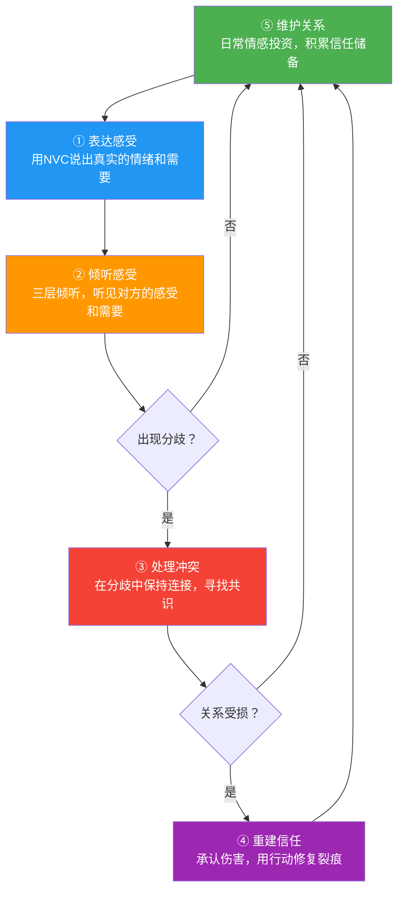

## 核心技巧小结

> 技巧可以学会，但真正让技巧生效的，是你愿意在关系中冒险——冒险表达真实的自己，冒险去听对方不想听的话，冒险在崩溃中重建，冒险在平淡中坚持。

前五节分别拆解了情感沟通的五大核心技巧。本节将它们重新组装成一个完整的系统——不是五个独立的工具，而是一套相互咬合的齿轮。理解它们之间的联动关系，比单独掌握任何一个技巧都更重要。

### 一、五技合一：它们如何构成一个闭环

情感沟通的五大技巧不是并列关系，而是在真实关系中随时间流转的循环：

这个循环揭示了一个关键事实：**情感沟通不是出了问题才需要的急救术，而是贯穿关系始终的日常实践。** 维护关系是底盘，表达和倾听是日常运转的双引擎，冲突处理是减震系统，信任重建是修复工具。缺少任何一个环节，整个系统都会出问题。

**为什么这个闭环如此重要？** 因为关系中的问题很少是单一维度的。一个"你总是不回家"的争吵，表面上是冲突处理的问题，深层可能是长期缺乏情感维护（存款不足）导致的信任匮乏，再深层是双方从未学会如何表达感受和倾听感受。如果你只在冲突处理这一个点上使劲，就像只给发烧的病人吃退烧药——症状会缓解，但病因还在。

### 二、五大技巧的核心要义速览

每一节都包含了大量理论、方法和案例，这里提炼每项技巧最不可忽视的核心要点：

| 技巧 | 核心理念 | 关键方法 | 最常犯的错误 |
|------|---------|---------|------------|
| **表达感受** | 情绪不是问题，是需要的信使 | NVC四步法：观察→感受→需要→请求 | 把评判当观察（"你总是……"），把想法当感受（"我觉得你不爱我"） |
| **倾听感受** | 被听见本身就是疗愈 | 三层倾听：听内容→听感受→听需要 | 急于给建议、否定感受（"别想太多"）、用"我理解"代替真正的共情 |
| **处理冲突** | 冲突不伤关系，处理方式才伤 | 按类型选策略，软启动代替硬攻击 | 回避冲突（慢性窒息）或在冲突中追求赢（"四骑士"：批评、蔑视、防御、冷暴力） |
| **重建信任** | 信任一滴一滴建立，瞬间摧毁 | 伤害方：真诚道歉+持续行动；受伤方：设定边界+允许渐进 | 口头道歉不改行为、要求对方"赶紧翻篇"、在重建期反复翻旧账 |
| **维护关系** | 日常存款决定冲突时的余额 | 5:1法则、爱的语言、情感银行账户 | 只在出问题时才"沟通"、忽视小事中的情感信号、把"没出事"等同于"关系好" |

**这张表格不是用来背的，而是用来查的。** 当你在某段关系中感到"哪里不对"时，回到这张表，看看你在哪一行犯了最右边那一列的错误。大多数人的问题不在于不知道正确做法，而在于在情绪上头时忘记了自己知道的。

### 三、五技之间的深层联动

这五个技巧之间存在深层的依赖和增强关系，理解这些联动才能真正将它们融为一体。

#### 3.1 表达感受 × 倾听感受：双向通道

表达和倾听是同一条通道的两个方向。你无法在不倾听的情况下有效表达——因为如果你不理解对方的世界观，你的表达就只是自说自话。同样，你无法在不表达的情况下真正倾听——因为如果你从不展示自己的脆弱，对方也不会对你敞开。

**联动机制：**

- 当你先倾听对方的感受，对方的安全感提升，反过来更愿意倾听你的表达
- 当你用NVC表达了脆弱（而非指责），对方的防御降低，更容易进入深度倾听
- 两者形成正向循环：倾听→安全→表达→连接→更深的倾听

**实操建议：** 在任何重要对话中，先做倾听者，再做表达者。先用5-10分钟完全专注于理解对方的感受和需要，确认对方感到被听见之后，再表达自己的感受。这个顺序不是"让步"，而是策略——被听见的人更愿意听。

**具体对话示例：**

> **场景：** 伴侣抱怨你最近总是加班。
>
> **错误示范（只表达不倾听）：**
> 你："我也不想加班啊！你以为我愿意吗？公司现在项目紧，我能怎么办？"
> （结果：对方觉得自己的感受被否定，下次不再表达，积怨加深。）
>
> **正确示范（先倾听再表达）：**
> 你："你一个人在家等我，是不是感到很孤单？你需要更多的陪伴，是吗？"
> 对方："是啊，我每天一个人吃饭，感觉像单身一样……"
> 你："嗯，我能理解那种感受。"（停顿，确认对方感到被听见）
> 你："其实我也很矛盾。我观察到这个月我有12天超过9点才到家。我感到内疚和疲惫，因为我既需要把工作做好，也需要和你在一起的时间。你愿意和我一起想想，怎么在接下来这段时间里安排好我们的相处时间吗？"
> （结果：对方先感到被理解，再听到你的处境，双方进入协商模式。）

#### 3.2 表达感受 × 处理冲突：化武器为桥梁

冲突中的大多数人要么攻击（"你太自私了"），要么沉默（冷暴力）。NVC表达提供了一条中间路线：既不压抑自己，也不伤害对方。

**联动机制：**

- NVC的"观察"步骤阻止了冲突升级中的"泛化指责"（"你总是""你从来"）
- NVC的"需要"步骤将冲突从"谁对谁错"转向"我们各自需要什么"
- NVC的"请求"步骤为冲突提供了具体的解决路径，而非空洞的"你改改吧"

**关键认知：** 在冲突中使用NVC不是示弱，而是掌握了主动权。戈特曼的研究表明，冲突中能够"软启动"（soft startup）——用"我感到……因为我需要……"代替"你又……"——的伴侣，冲突解决成功率高出4倍以上。

**具体对话示例：**

> **场景：** 你发现伴侣又忘了你们的纪念日。
>
> **硬启动（冲突升级）：**
> "你连纪念日都记不住，你到底在不在乎我？你心里根本没有我！"
> （对方感受：被攻击→防御→反击→争吵升级→不欢而散）
>
> **软启动（NVC化冲突）：**
> "我注意到今天是我们的纪念日，但我们没有一起庆祝。（观察）我感到有点失落和担心，（感受）因为对我来说，仪式感代表我们彼此的重视和珍惜。（需要）你愿意这周末补过一个属于我们的晚上吗？（请求）"
> （对方感受：没有被攻击→可以回应→愿意配合→问题解决）

**这个示例的深层逻辑：** 硬启动把"纪念日没过"变成了"你不够爱我"的终极指控，对方除了否认或道歉没有第三条路。软启动把同样的事情变成了"一个可以解决的具体问题"，对方有了行动空间。

#### 3.3 倾听感受 × 处理冲突：灭火器

冲突最危险的时刻不是双方都在喊叫，而是一方在喊叫、另一方在防御。此时如果防御方能够切换到倾听模式——不是听内容（事实层面的对错），而是听感受（对方在痛苦什么）——冲突的温度会迅速下降。

**联动机制：**

- 冲突中对方的攻击性语言（"你根本不在乎我"）背后是受伤的感受（"我感到被忽视"）
- 当你回应感受而非反击攻击（"你觉得我不在乎你，你一定很孤独"），对方的杏仁核激活水平下降，前额叶恢复工作
- 冲突从"战或逃"模式切换为"对话"模式

**核心原则：** 在冲突中，谁先倾听，谁就掌握了主动权。倾听不等于认输——它是在为建设性对话创造条件。

**神经科学视角：** 当人处于愤怒状态时，大脑的杏仁核（负责恐惧和攻击的原始脑区）高度激活，而前额叶皮层（负责理性思考和共情的新脑区）活动被抑制。这就是为什么人在气头上"什么话都说得出来"——理性的刹车系统暂时失灵了。倾听感受之所以能"灭火"，是因为被共情回应的人会感到安全，安全信号降低杏仁核的激活水平，前额叶重新上线，人恢复了思考能力。

**具体对话示例：**

> **场景：** 伴侣突然爆发："你从来不关心我的感受！我在这个家里就是个保姆！"
>
> **防御模式（火上浇油）：**
> "我怎么不关心你了？我每天赚钱养家，你还要我怎样？你说你是保姆，那我是什么？提款机吗？"
> （结果：双方进入"谁更辛苦"的比较战争，冲突全面升级。）
>
> **倾听模式（灭火）：**
> （深呼吸，按下想要反驳的冲动）
> "听起来你感到很委屈，觉得自己承担了太多家务，却没有被看见和感激。你一定很累吧。"
> （停顿，等待对方回应。通常对方会从攻击模式转为倾诉模式——因为ta感到被听见了。）
> 对方："是啊，我每天下班回来还要做饭、洗碗、哄孩子，你一回来就躺沙发上刷手机……"
> 你："嗯，你需要的是我回来之后能分担一些，也需要我在这些事情上和你站在一起，而不是让你一个人扛。"
> （到这一步，对话已经从"攻击-防御"变成了"理解-协商"，冲突的性质发生了根本转变。）

#### 3.4 重建信任 × 表达/倾听：修复的双翼

信任破裂后的重建，本质上是一场需要双方参与的深度对话。伤害方需要表达真诚的悔意和改变的决心，受伤方需要表达痛苦和需要。双方都需要倾听——伤害方倾听伤害的深度，受伤方倾听改变的诚意。

**联动机制：**

- 伤害方的道歉如果只停留在"对不起"而没有倾听对方的痛苦，道歉就只是走过场
- 受伤方如果只表达愤怒而不倾听对方的解释和改变意愿，修复就无法启动
- 重建过程中需要反复的"表达→倾听→确认"循环，每次循环都加深一层理解和信任

**信任重建的完整对话框架：**

信任破裂后的深度对话不是一次性的，而是一个分阶段的过程：

| 阶段 | 伤害方做什么 | 受伤方做什么 | 双方目标 |
|------|------------|------------|---------|
| **第一阶段：面对** | 承认事实，不辩解不淡化 | 表达痛苦，说出被伤害的具体感受 | 让真相浮出水面 |
| **第二阶段：理解** | 倾听伤害的全部深度，不急于"修复" | 允许自己表达所有情绪，包括愤怒和悲伤 | 让伤害被完整地看见 |
| **第三阶段：解释** | 说明事情发生的背景（不是找借口） | 倾听解释，不急于判断诚意 | 理解"为什么" |
| **第四阶段：承诺** | 给出具体的改变计划和时间表 | 表达自己需要看到什么才能重新信任 | 建立可验证的重建路径 |
| **第五阶段：验证** | 用持续的行动兑现承诺 | 观察行动，给予渐进式信任 | 行动证明一切 |

**关键提醒：** 这五个阶段不是一次对话就能完成的。根据伤害的严重程度，整个过程可能需要数周甚至数月。急于跳过任何阶段都会导致修复不彻底——就像骨折没复位就拆石膏，表面上"好了"，实际上留下了永久的隐患。

#### 3.5 维护关系 × 所有技巧：地基与建筑

维护关系是其他四项技巧的"地基"。戈特曼的5:1法则揭示了一个冷酷的现实：如果日常没有足够的积极互动储备，任何技巧在冲突中都不够用。

**联动机制：**

- 日常的"爱的语言"实践（肯定的言辞、服务的行动等）是NVC表达的低风险练习场
- 日常的"转向"回应（对伴侣的情感信号做出回应）是倾听技巧的日常训练
- 日常的情感存款决定了冲突发生时的"余额"——余额充足时，一次冲突只是"取款"；余额为零时，同样的冲突就是"透支"
- 日常的信任兑现（说到做到）是预防信任危机的最好方法

**一个具象化的比喻：** 把你的关系想象成一个银行账户。日常的关心、感谢、拥抱、倾听、陪伴都是存款。争吵、忽视、批评、冷落都是取款。戈特曼的研究发现，稳定幸福的伴侣关系中，积极互动与消极互动的比例至少是5:1——也就是说，每一"笔"负面互动需要至少五"笔"正面互动来平衡。

这意味着什么？意味着如果你平时从不"存款"，等到冲突发生时你再怎么道歉、解释、沟通，账户里已经没有余额了。很多关系的破裂不是因为最后一次争吵有多严重，而是因为在那之前，账户早已透支多年。

### 四、从技巧到能力：整合运用的三个层级

掌握五个技巧不是终点，而是起点。将它们从"知道"变为"做到"，需要经历三个层级的修炼：

| 层级 | 特征 | 典型表现 | 达成路径 |
|------|------|---------|---------|
| **刻意运用** | 每次使用前需要提醒自己 | "等等，我先用NVC试试"、"我应该先听他的感受" | 学习阶段，需要刻意练习和场景预演 |
| **自然切换** | 能根据对话情境自动选择 | 冲突中自然地从表达切换到倾听，不需要刻意提醒 | 3-6个月的持续练习 |
| **本能反应** | 技巧融入人格，不再像"技巧" | 表达感受时真诚自然，倾听时全身心在场，冲突中保持连接 | 长期实践后的内化 |

**从层级一到层级二的关键**：场景预设和反复练习。为高频冲突场景准备好"台词"，在日常小事中练习NVC表达和倾听回应，逐步降低刻意感。

**从层级二到层级三的关键**：自我觉察和关系反思。定期回顾自己的沟通模式，识别自动化反应中的旧模式（比如原生家庭带来的回避倾向或攻击模式），用新的选择替代旧的本能。

**一个常见的陷阱：** 很多人在层级一停留太久就放弃了，因为"用技巧说话感觉很假"。这是正常的——任何新技能在初期都会有笨拙感。学骑自行车时你不会觉得"骑车很假"，你只会觉得"还不熟练"。NVC也是一样。度过笨拙期的唯一方法是继续练习，而不是回到旧模式中寻找舒适感。

#### 4.1 加速内化的三个练习方法

**练习一：复盘日记（每日5分钟）**

每天睡前回忆一次当天的沟通事件，用以下模板记录：

今天发生了什么：（简述事件）
我当时是怎么回应的：（记录原始反应）
用五大技巧来看，更好的回应方式是：（改写）
下次类似情况，我会尝试：（一个具体行动）

这个练习的威力在于：它不是在事情发生时强迫自己改变（那时候情绪占上风），而是在事后冷静复盘，逐步在大脑中建立新的"反应路径"。神经科学告诉我们，反复想象一种行为和实际执行它，在大脑中激活的区域高度重叠——也就是说，复盘本身就是一种练习。

**练习二：低风险场景练习（每周2-3次）**

不要等到关系出大问题时才"用技巧"。选择低风险的日常场景练习：

- 同事让你帮忙但你手头有事 → 用NVC表达边界（"我观察到你希望我帮忙，我感到有些为难，因为我需要先完成手头的deadline，我可以下午3点后帮你看看，你觉得可以吗？"）
- 朋友在电话里抱怨工作 → 练习三层倾听（听内容、听感受、听需要，用"听起来你对这份工作感到很沮丧，你需要被认可"来回应）
- 家人做了一件让你开心的小事 → 练习维护关系（具体地表达感谢："谢谢你今天帮我带了咖啡，你记得我喜欢喝冰美式，这让我感到被关注"）

低风险场景的好处是：即使你做得不完美，也不会造成严重后果。这给了你犯错和调整的空间。

**练习三：角色扮演（每周1次，和伴侣/信任的朋友）**

挑一个你们最近遇到的真实场景，分别扮演对方的角色，用五大技巧进行对话。这个练习有两个巨大的好处：

- 你站在对方的角度感受，会发现很多你之前没注意到的信息
- 你在"演"对方的过程中，自然会练习到倾听和表达两个维度

### 五、五项技巧的适用边界

没有万能的沟通技巧。每项技巧都有其适用条件和局限性，了解边界才能正确使用。

| 技巧 | 最有效的场景 | 局限/不适用的情况 | 替代或补充方案 |
|------|------------|----------------|-------------|
| 表达感受（NVC） | 一对一、双方有基本倾听意愿 | 对方处于极度愤怒或攻击状态 | 先暂停，等冷静后再用NVC |
| 倾听感受 | 对方正在倾诉、需要被理解 | 自己情绪也很激动无法共情 | 先做自我安抚（深呼吸、暂停），再回到倾听 |
| 处理冲突 | 双方都想解决问题、关系有基本信任 | 对方有暴力倾向或持续的情感虐待 | 设定边界、寻求专业帮助，甚至考虑离开 |
| 重建信任 | 双方都愿意修复、伤害不是反复发生的 | 对方持续欺骗且毫无改变诚意 | 评估是否值得继续投入，保护自己是第一位的 |
| 维护关系 | 关系处于平稳期、双方有基本善意 | 关系中存在严重的权力不对等或情感操控 | 先解决结构性问题，再谈日常维护 |

**一个重要提醒：** 如果你在一段关系中反复使用所有技巧但对方完全不回应、不改变、不配合，问题可能不在技巧本身，而在于这段关系的结构。技巧能改善健康关系的质量，但无法拯救一段本质上不平等或有害的关系。知道何时停下来保护自己，和知道如何沟通同样重要。

#### 5.1 技巧失效的六个信号

当你发现自己在一段关系中持续使用情感沟通技巧但毫无改善时，留意以下信号——它们可能意味着问题不在沟通方式，而在关系本身：

1. **单方面努力：** 你一直在练习倾听和表达，但对方从不回应你的感受，也不尝试理解你的需要
2. **反复突破边界：** 你明确表达了自己的底线，但对方持续越界，且从不为自己的行为负责
3. **道歉无改变：** 对方道歉很多次，但同样的行为反复发生——道歉已经变成了"通关密语"而非真心悔改
4. **情感操控：** 对方用你的共情来控制你——当你表达受伤时，对方反过来指责你"太敏感"或把责任推回给你
5. **恐惧主导：** 你在对话中持续感到恐惧（而非仅仅是紧张），害怕对方的反应
6. **孤立感加剧：** 沟通后你感到更孤独而非更连接

出现这些信号时，最明智的做法不是"学更多技巧"，而是认真评估这段关系是否值得继续投入。在某些情况下，寻求专业心理咨询师的帮助，或者做出离开的决定，才是对自己最负责任的选择。

### 六、常见组合失误与纠正

掌握了五个单项技巧后，很多人在实际运用中会犯"组合错误"——在同一个场景中错误地搭配了多个技巧，或者在错误的时机使用了正确的技巧。以下是最常见的六种组合失误：

#### 6.1 用倾听代替表达

**典型表现：** 伴侣说了伤人的话，你一直在"倾听对方为什么这样说"，但从不表达自己被伤害了。

**为什么会这样：** 学了倾听技巧后，有些人会走向另一个极端——过度共情对方，忽略自己的感受。

**纠正方法：** 倾听和表达是双向的。在听完对方之后，你有权利也有义务表达自己的感受："我听到了你的压力和不满。同时，我想告诉你，刚才那句话让我感到很受伤，因为……"

#### 6.2 在冲突中直接跳到维护关系

**典型表现：** 大吵一架之后，不处理冲突留下的创伤，直接开始"修复关系"——买花、送礼物、表现得像什么都没发生。

**为什么会这样：** 维护关系的技巧让人觉得"要增加积极互动"，于是急着用正面行为覆盖负面记忆。

**纠正方法：** 冲突后必须先走完"处理冲突→（如需要）重建信任"的路径，确认双方的感受都被听见、伤害都被处理之后，才能进入维护阶段。跳过清理直接装修，地基里的裂缝迟早会再次裂开。

#### 6.3 用NVC包装控制欲

**典型表现：** "我观察到你又和那个朋友出去了（观察），我感到不安（感受），因为我需要安全感（需要），你以后能不能不要和ta来往了（请求）？"

**为什么会这样：** NVC的四步法被当作"高级操控术"——用正确的格式包装不合理的诉求。

**纠正方法：** 检查你的"请求"是否尊重了对方的自主权。真正的请求是对方可以说"不"的；如果对方说"不"你会暴怒或惩罚对方，那不是请求，是伪装成请求的命令。一个简单的自测：如果对方拒绝你的请求，你的反应是"我理解，我们可以再商量"还是"你果然不在乎我"？

#### 6.4 在倾听中急于解决问题

**典型表现：** 对方在倾诉烦恼，你认真地听完了——然后立刻给出三个解决方案。

**为什么会这样：** "听完了就要帮忙解决"是很多人的本能反应，尤其是男性。

**纠正方法：** 在给出建议之前先问一句："你现在需要的是有人听你说说，还是想要一起想想办法？"很多情况下，答案是前者。对方需要的是被理解，不是被修理。

#### 6.5 把重建信任变成"惩罚机制"

**典型表现：** 对方犯了错正在努力弥补，但你不断地提高要求——"你做了A还不够，你还得做B、C、D"——把重建过程变成了对方的赎罪之路。

**为什么会这样：** 受伤方在痛苦中会不自觉地想要"让对方也尝尝苦头"，把重建过程拉长为一种惩罚。

**纠正方法：** 设定清晰的重建标准。在重建开始时就和对方商量："我需要看到什么，才能重新信任你？"把这个标准具体化、可量化，而不是一个模糊的"你得让我完全满意"。如果对方确实在努力改变，你也需要在心里给ta进步的分数，而不是永远以最高的标准衡量。

#### 6.6 忽视文化与性别差异

**典型表现：** 把书中的技巧原封不动地套用到所有关系中，不考虑文化背景和性别差异。

**为什么会这样：** NVC等技巧源自西方心理学体系，直接搬到中国家庭或职场中可能水土不服。

**纠正方法：** 理解原则，灵活运用形式。比如：
- 和父母沟通时，"我观察到……我感到……"的完整NVC格式可能显得太"外"、太正式，可以简化为"爸/妈，我理解你的意思，但是这件事让我心里有点不舒服……"
- 在职场中，表达感受需要更加克制和专业化——"我对这个方案有一些顾虑"比"我感到很焦虑"更合适
- 对于不善言辞的伴侣，要求对方用NVC表达感受是不现实的，你需要学会从对方的行动中读取情感信号

### 七、快速检索：场景-技巧对应表

在真实生活中，你不会提前知道自己需要哪个技巧。以下是一个快速检索工具，帮助你在面对具体场景时找到最合适的切入点：

| 你遇到的情况 | 首要技巧 | 辅助技巧 | 具体做法 |
|------------|---------|---------|---------|
| 心里有话但说不出口 | 表达感受 | 倾听感受 | 用NVC四步法组织语言，先从"我观察到……"开始 |
| 对方在倾诉但你不知道怎么回应 | 倾听感受 | — | 停下一切，全身心在场，回应感受而非事件 |
| 和伴侣/朋友发生争吵 | 处理冲突 | 表达感受+倾听感受 | 先按"暂停→倾听→确认→寻找需要"四步走 |
| 发现对方欺骗了你 | 重建信任 | 表达感受 | 给自己时间处理情绪，然后表达伤害和需要 |
| 关系平淡、感觉"没什么好聊的" | 维护关系 | 表达感受 | 启动"爱的语言"实践，增加积极互动频率 |
| 对方说了伤人的话 | 倾听感受 | 表达感受 | 先听对方的需要，再表达自己的受伤 |
| 想和父母谈一个敏感话题 | 表达感受 | 倾听感受 | NVC+选好时机+允许拒绝 |
| 工作中和同事有分歧 | 处理冲突 | 倾听感受 | 用"我感到压力"代替"你给我太多任务" |
| 关系刚经历过一次大吵 | 重建信任 | 维护关系 | 先道歉修复，再用日常互动重建存款 |
| 长期关系感觉"没激情了" | 维护关系 | 表达感受 | 创造新鲜体验+重新发现对方+表达深层需要 |
| 对方总是重复同一个让你不满的行为 | 表达感受 | 处理冲突 | 用NVC表达+确认对方是否理解你的需要 |
| 你做了一件伤害对方的事 | 重建信任 | 倾听感受 | 真诚道歉+倾听对方的痛苦深度+持续行动 |

### 八、自我评估：你的情感沟通能力到哪了？

在进入实战案例之前，花几分钟做以下自我评估。这不是考试——只是帮助你了解自己当前的状态，找到最需要提升的方向。

**评分标准：1=完全不符合 2=偶尔符合 3=有时符合 4=经常符合 5=完全符合**

| 评估项目 | 你的分数 |
|---------|---------|
| 当我有负面情绪时，我能准确地说出自己感受到的是什么（比如"我感到被忽视"而不只是"我不爽"） | ___ |
| 当伴侣/朋友向我倾诉时，我能放下手头的事，全身心地倾听 | ___ |
| 在争吵中，我能控制自己不说"你总是""你从来"这类话 | ___ |
| 当我伤害了对方时，我能真诚地道歉，而不是找借口或淡化 | ___ |
| 我每天都会对身边的人表达感谢、关心或爱意 | ___ |
| 当对方说了伤人的话时，我能先听到对方的需要，而不是立刻反击 | ___ |
| 我能区分"事实"和"评判"——在描述事情时不添加自己的定性 | ___ |
| 当关系出现问题时，我会主动找对方沟通，而不是等对方来找我 | ___ |
| 我了解伴侣/家人最重要的"爱的语言"是什么 | ___ |
| 当我犯错后，我能接受对方需要时间来重新信任我，而不是要求对方"赶紧翻篇" | ___ |

**评分解读：**

- **40-50分：** 你的情感沟通基础很扎实。接下来的重点是精细打磨——在高难度场景（如与父母的深层对话、重大冲突中的冷静应对）中保持这些能力
- **30-39分：** 你有不错的意识，但在压力下容易退回到旧模式。接下来的重点是场景预练——为高频冲突场景准备好"台词"，降低紧张时的认知负荷
- **20-29分：** 你知道这些技巧的存在，但实践还不够。接下来的重点是从低风险场景开始——先在和朋友、同事的日常互动中练习，积累信心后再用到高风险的关系中
- **10-19分：** 你刚刚开始学习情感沟通，这完全没问题。每个人都是从这里开始的。接下来的重点是理解理论——先把依恋理论、NVC、情感账户这些基础概念吃透，再开始实践

**无论你的分数是多少，记住：情感沟通能力不是固定不变的天赋，而是可以通过学习和练习不断提升的技能。** 戈特曼的研究显示，经过系统学习和持续练习的伴侣，关系满意度平均提升40%以上。你现在读的这些内容，本身就是改变的开始。

### 九、从核心技巧到实战：下一步

掌握了理论和方法，最终的检验标准只有一个：**你在真实关系中用了吗？**

接下来的"实战案例"部分，将把这五大技巧放入八个真实情感场景中——从伴侣争吵到父母催婚，从表白到分手，从日常关心到重大决策——让你看到技巧在具体情境中的完整运用。

在进入案例之前，建议你花几分钟做以下准备：

1. **识别你最需要提升的一项技巧**：五项中一定有你最薄弱的。根据上面的自我评估，找到得分最低的那一项，作为接下来学习的重点
2. **回忆一个最近的真实场景**：一个你觉得自己"没处理好"的沟通场景。带着这个场景去读案例，看同样的情境用不同方式处理会有什么结果
3. **给自己一个承诺**：选一个最容易实践的技巧，在本周的一次真实对话中尝试使用。不需要完美，只需要开始
4. **找一个练习伙伴**：如果你有伴侣或信任的朋友，告诉他们你在学习情感沟通，邀请他们一起练习。两个人一起学的效果远好于一个人默默努力

**技巧只是工具，真诚才是灵魂。** 这五个技巧的目的不是让你变得"会说话"，而是让你在关系中更真实、更勇敢、更有爱。当你放下"我要用技巧"的刻意，带着"我想理解你、想被你理解"的真心去沟通时，技巧就真正成为了你的一部分。
