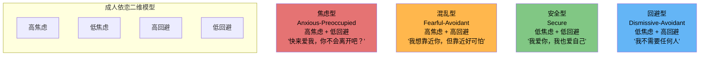
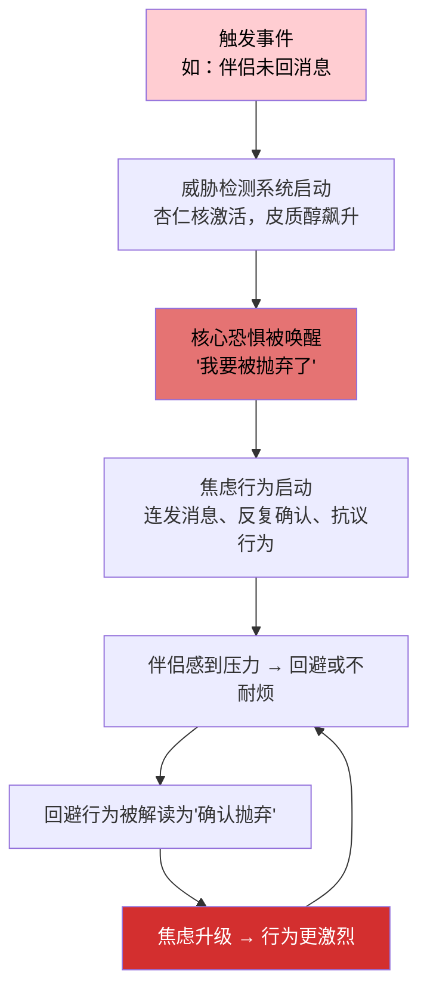
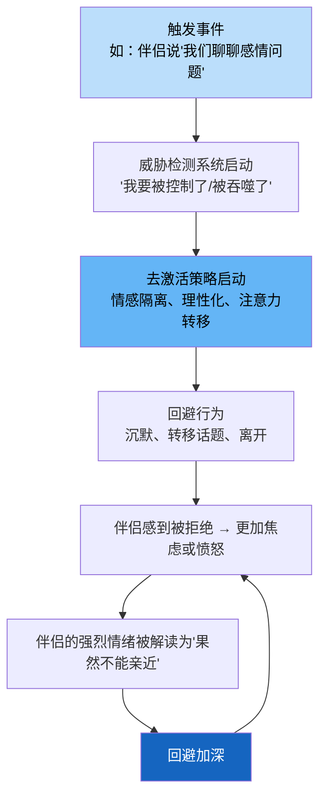
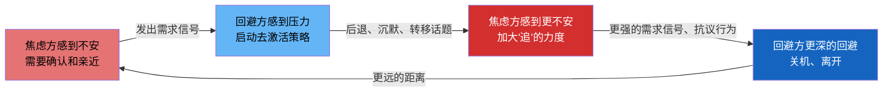
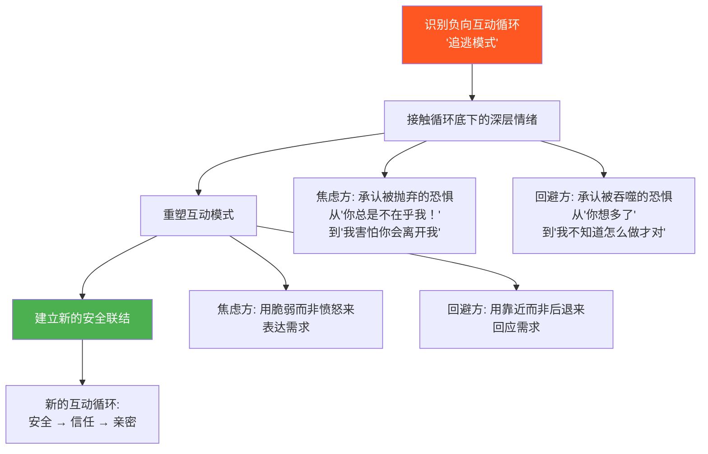

## 一、依恋理论：理解你的情感操作系统

每个人在亲密关系中都有一套自动运行的"情感操作系统"——它决定了你在感到不安时是伸出手寻求安慰，还是缩回壳里独自消化；它决定了你对伴侣的一条未回消息，是毫不在意还是脑补出一整部被抛弃的灾难片。这套系统的名字，叫**依恋模式**。

依恋理论（Attachment Theory）是20世纪心理学最重要的理论框架之一。它不是书斋里的抽象概念，而是经受了70多年实证检验、横跨发展心理学、神经科学、临床治疗和跨文化研究的综合性理论。它不仅解释了"为什么你在关系中总是这样反应"，更指明了一条从不安全走向安全的可操作路径。理解依恋理论，等于拿到了一把解锁情感沟通障碍的万能钥匙。

在正式进入理论之前，先回答一个最基本的问题：**什么是依恋？** 依恋不是"依赖"，不是"黏人"，不是"爱"——尽管它与这些概念有交集。依恋的准确定义是：**个体与特定他人之间形成的持久性情感纽带，其核心功能是在压力和不确定时提供安全感。** 婴儿哭泣时寻找母亲，士兵在战场上紧握战友的手，成年人在深夜难过时想打电话给某个人——这些都是依恋行为。依恋系统的生物学功能只有一个：让你在脆弱时靠近一个安全的人，从而提高生存概率。

### 1.1 依恋理论的起源与发展

#### 鲍尔比：从战场废墟中发现人类本能

约翰·鲍尔比（John Bowlby，1907-1990）是英国精神分析师，他的理论起点并非实验室，而是二战后的孤儿院。鲍尔比在观察中发现：那些在孤儿院中获得充足食物和医疗照护、却缺乏稳定情感联结的婴幼儿，出现了严重的心理发展障碍——情感淡漠、社交退缩、智力发育迟缓。这个发现动摇了当时精神分析学界"婴儿对母亲的依恋只是食物来源的副产品"的主流观点。

1958年，鲍尔比正式发表了依恋理论的核心论文《婴幼儿与母亲联结的本质》，提出了三个革命性观点：

1. **依恋是生物本能**：婴儿与照顾者建立情感联结的倾向，和进食、呼吸一样，是进化赋予的生存机制。远古环境中，靠近照顾者的婴儿更容易存活。依恋系统与觅食系统、性系统并列为人类三大动机系统。
2. **内部工作模型（Internal Working Model）**：早期依恋经验会在大脑中形成一套"关系模板"——关于"我是否值得被爱"和"他人是否可以信赖"的核心信念。这套模板不是有意识的信念，而是自动运行的认知-情感图式，它像一副有色眼镜，自动过滤和诠释此后一生中的关系信息。
3. **关键期假说**：生命前两年（后来修正为前五年）是依恋模式形成的敏感期，此后的经验虽能修正，但需要更大的力量。鲍尔比将这个敏感期比喻为"心理发育的窗口期"——窗口开着的时候，改变容易；窗口关闭后，改变虽仍可能，但需要持续的、有意识的努力来对抗已固化的神经通路。

鲍尔比的理论框架后来被称为"依恋的行为控制系统模型"（Attachment Behavioral Control System Model），其核心思想是：依恋系统是一个被"感知到的威胁"激活的行为控制系统。当个体感知到危险（无论是真实的还是想象的），依恋系统被激活，驱使个体寻求与依恋对象的亲近；当个体感到安全时，依恋系统"关闭"，探索系统被激活，个体可以自由地去探索世界。

#### 安斯沃思：用实验把理论钉在数据上

如果说鲍尔比画出了理论蓝图，玛丽·安斯沃思（Mary Ainsworth，1913-1999）就是那个用实验数据把它建成大厦的人。她最著名的贡献是**陌生情境实验**（Strange Situation Procedure，1969年）。

安斯沃思在乌干达进行的早期田野研究中，通过长达数月的家庭观察（每两周一次，每次2小时），详细记录了母亲对婴儿信号的回应方式与婴儿依恋行为之间的关系。她发现了一个关键变量：**母亲回应的敏感性（maternal sensitivity）**——即母亲能否准确识别婴儿的信号、及时回应、并以适当的方式满足需求。

随后，她在巴尔的摩实验室中设计了陌生情境实验，将观察量化。实验设计如下：让12-18个月大的婴儿在实验室中经历以下序列——

| 阶段 | 场景 | 持续时间 | 观察焦点 |
|------|------|----------|----------|
| 1 | 母亲和婴儿在陌生房间 | 3分钟 | 婴儿的自由探索行为和依恋行为的基线 |
| 2 | 陌生人进入 | 3分钟 | 婴儿对陌生人的反应（社交参考行为） |
| 3 | 母亲离开（第一次分离） | 3分钟 | 分离焦虑的表现和强度 |
| 4 | 母亲返回（第一次重聚） | 3分钟 | **重聚行为（核心指标）** |
| 5 | 母亲再次离开 | 3分钟 | 持续分离的反应 |
| 6 | 陌生人返回 | 3分钟 | 对陌生人的依赖程度 |
| 7 | 母亲再次返回 | 3分钟 | **重聚行为的稳定模式** |

安斯沃思在乌干达和巴尔的摩的跨文化研究中，通过这个实验识别出三种依恋类型（第四种"混乱型"后来由Mary Main在1986年补充）：

- **安全型**（Secure，B型）：母亲离开时有适度焦虑，母亲返回后迅速寻求接触并被安抚，然后继续探索环境。关键特征是"可安抚性"——能被安慰，也能自我调节。
- **焦虑-矛盾型**（Anxious-Ambivalent，C型）：母亲离开时极度焦虑，母亲返回后既寻求接触又表现出愤怒和抗拒——抱住母亲的同时又推开她。关键特征是"矛盾"——渴望亲近但无法被安慰，因为对母亲的可得性缺乏信心。
- **回避型**（Avoidant，A型）：母亲离开和返回时都表现得漠不关心，甚至主动回避母亲。但生理监测（心率、皮肤电导、皮质醇水平）显示，回避型婴儿的压力指标与焦虑型婴儿一样飙升——他们不是"不焦虑"，而是学会了"不表达焦虑"。这个发现至关重要：回避型的"不在乎"是一种防御策略，而非真实状态。
- **混乱型**（Disorganized/Disoriented，D型）：由Mary Main和Erik Hesse在1986年补充。这类婴儿在重聚时表现出矛盾、混乱、刻板或解离的行为——比如走向母亲时突然停下、倒退、或者面无表情地凝视远方。其核心机制是"恐惧无法解决"（fright without solution）：当照顾者既是安全港又是恐惧来源时，婴儿的依恋系统陷入"接近-回避"的双重绑定，无法形成任何一致的应对策略。

这个实验的关键发现是：**重聚行为比分离焦虑更能预测依恋类型**。一个婴儿在母亲离开时哭泣是正常的，关键是母亲回来后他能否被安抚。安全型婴儿不是"不哭"的婴儿，而是"哭了能被安慰"的婴儿——这个区分对理解成人依恋至关重要。

#### 从婴儿到成人：依恋理论的现代扩展

1987年，辛迪·哈赞（Cindy Hazan）和菲利普·谢弗（Philip Shaver）在《洛基山新闻报》上刊登了一项非正式调查，让读者选择最能描述自己恋爱体验的段落。结果惊人：约56%的人选择了安全型描述，约25%选择了回避型，约19%选择了焦虑型——这个比例与婴儿依恋类型的分布几乎完全一致。此后，他们将依恋理论正式扩展到成人亲密关系领域。

1990年代，布伦南（Brennan）和弗雷利（Fraley）通过大规模因子分析，对数十个依恋测量项目进行统计降维，最终提炼出两个核心维度：

- **依恋焦虑**（Attachment Anxiety）：对被抛弃的担忧程度——"你会不会离开我？"这个维度的核心是"对自我价值的不确定"。高焦虑者不断地在内心评估：我值得被爱吗？对方会留下来吗？
- **依恋回避**（Attachment Avoidance）：对亲密和依赖的抗拒程度——"别靠我太近。"这个维度的核心是"对他人的不信任"。高回避者认为：依赖他人是危险的，最终只能靠自己。

这两个维度交叉，形成四象限模型，对应四种依恋风格。这个二维模型至今仍是成人依恋研究的标准框架。

**维度解读**：安全型不是"没有焦虑和回避"，而是这两个维度都处于较低水平。安全型依恋者也会在关系中感到不安，也会偶尔需要独处空间——关键是这些感受的强度是适度的，不会劫持他们的行为。

### 1.2 依恋的神经科学基础

依恋模式不是玄学，它有实实在在的神经回路基础。理解这些机制，能帮助你意识到：当你的依恋系统被激活时，你的大脑确实在经历一场生理级的风暴——你不是"想太多"，你的神经系统真的在拉响警报。

#### 三脑协作系统

依恋行为涉及三个脑系统的协同工作：

| 脑系统 | 核心结构 | 功能 | 依恋中的角色 |
|--------|----------|------|-------------|
| **安全/平静系统**（副交感神经系统） | 腹侧迷走神经复合体、前额叶皮层 | 放松、信任、亲密感、社会参与 | 安全型依恋者的默认状态；当依恋关系稳定时，这个系统占主导 |
| **威胁检测系统**（交感神经系统） | 杏仁核、下丘脑-垂体-肾上腺轴 | 战斗/逃跑/冻结反应 | 不安全依恋者的过度活跃区域；对关系威胁信号高度敏感 |
| **驱动/奖赏系统**（多巴胺回路） | 伏隔核、腹侧被盖区 | 渴望、追求、成瘾性快感 | 焦虑型依恋者的"追逐"动力来源；间歇性强化使追逐行为像赌博一样上瘾 |

这三个系统并非互相排斥，而是在不同情境下动态切换。安全型依恋者能够在三个系统之间灵活转换——感到威胁时适度警觉，威胁解除后迅速回到平静状态，享受亲密时能够沉浸其中。不安全依恋者的切换机制失灵：焦虑型卡在驱动系统中不停地"追"，回避型卡在威胁系统中持续地"逃"，混乱型则在三个系统之间混乱跳跃。

当依恋系统被安全信号（伴侣的温暖回应、肢体接触、眼神交流、温柔的语调）激活时，大脑释放催产素和内啡肽，激活副交感神经系统，让人感到平静和满足。催产素的功能不仅仅是"让人放松"——它降低了杏仁核对威胁信号的敏感度，增加了对社会奖励信号的敏感度，相当于"调节了大脑的过滤器"，让人更倾向于把对方的行为解读为善意。

当不安全信号（冷漠、拒绝、消失、嘲讽的语气、回避的眼神）出现时，杏仁核被激活，皮质醇和肾上腺素飙升，身体进入应激状态。在依恋威胁的急性反应中，大脑的前额叶皮层（负责理性思考和情绪调节的部分）活动降低，杏仁核活动增强——这就是为什么当你的依恋系统被激活时，你很难"理性地想一想"。你的理性脑确实在那一刻被降低了权限。

**关键发现**：神经科学研究（Coan, 2006的"手握实验"）表明，仅仅是握住安全依恋对象的手，就能显著降低大脑对威胁的神经反应——效果甚至优于握住陌生人的手或独自面对。这个发现的含义深远：安全依恋关系本身就是一种神经系统调节器。一个安全的伴侣不仅仅"让你感觉好"，而是在神经层面降低了你的威胁感知阈值。

#### 多迷走神经理论：理解依恋的"安全阶梯"

斯蒂芬·波格斯（Stephen Porges）提出的多迷走神经理论（Polyvagal Theory）为依恋的神经机制提供了更精细的解释。该理论认为，人类的自主神经系统有三个层级，按进化从新到旧排列：

1. **社会参与系统**（腹侧迷走神经，最新进化）：负责面部表情、语调变化、倾听和社交连接。这是安全感的基础——当你感到安全时，这个系统让你能够微笑、用温暖的语调说话、认真倾听。
2. **战斗-逃跑系统**（交感神经系统）：当社会参与系统无法确保安全时，这个系统被激活——心率加速、肌肉紧张、准备战斗或逃跑。
3. **冻结-解离系统**（背侧迷走神经，最古老）：当战斗-逃跑也无法应对时，这个最原始的系统接管——身体冻结、情感解离、"灵魂出窍"的感觉。

**这个阶梯模型对理解四种依恋风格至关重要**：

- 安全型依恋者大部分时间停留在第一层（社会参与系统），能够进行真正的社交连接
- 焦虑型依恋者频繁滑落到第二层（战斗-逃跑），表现为"追"的行为——战斗系统驱动的接近行为
- 回避型依恋者通过"关闭"社会参与系统来防御——看似平静，实则是长期处于低水平的战斗-逃跑状态
- 混乱型依恋者可能在三个层级之间无规律跳跃——这是为什么他们在冲突中可能突然"卡住"（冻结反应）的神经学解释

#### 早期经验如何"写入"大脑

生命前两年，婴儿的大脑以每秒超过100万个新连接的速度发育。这个时期被称为"经验期待型脑发育"（experience-expectant brain development）——大脑在进化上"期待"获得某些基本经验（如稳定的照顾者、温暖的触摸、一致的回应），如果这些经验缺失或异常，相关神经通路的发育就会受到显著影响。

照顾者的回应模式直接塑造了这些神经连接的"布线"方式：

- **一致的、温暖的回应** → 前额叶皮层与杏仁核之间的调节通路发育良好 → 杏仁核在受到刺激时能被前额叶有效"刹车" → 情绪调节能力强 → 面对关系波动时能"想一想再反应"
- **不一致的、焦虑的回应** → 杏仁核过度敏感，威胁检测阈值低 → 前额叶-杏仁核连接不稳定 → 容易将中性信号误读为威胁 → 需要频繁的外部确认来弥补内部调节的不足
- **冷漠的、回避的回应** → 情绪表达和识别相关的神经回路发育受阻 → 前额叶对情绪信号的加工被"旁路化" → 习惯性压抑和隔离情绪 → 身体感受与情绪体验的连接变弱
- **恐惧的、混乱的回应** → 大脑无法形成稳定的应对策略 → 应激反应系统（HPA轴）长期失调 → 皮质醇基线水平异常 → 在亲近和回避之间无规律切换

**神经可塑性的希望**：虽然早期经验对大脑"布线"影响深远，但大脑终身保持可塑性。成年后的新经验——特别是安全关系中反复获得的一致性回应——可以逐步建立新的神经通路，弱化旧通路。这个过程类似于在森林中开辟新路：旧路因为多年行走已经很宽很平，新路刚开始走时会很艰难，但只要坚持走新路、减少走旧路的频率，新路最终会变得和旧路一样好走。神经科学的术语叫"赫布可塑性"（Hebbian plasticity）——"一起激活的神经元会连接在一起"（neurons that fire together wire together）。

### 1.3 四种依恋风格详解

理解了依恋理论的历史和神经基础后，现在我们来深入剖析每一种依恋风格。以下描述基于成人亲密关系情境——同一个人在不同关系中可能呈现不同风格，但通常有一种主导风格。

#### 安全型依恋（Secure Attachment）

**占比**：约50%-60%的人群（跨文化研究中有所波动）

**核心特征**：

安全型依恋者的情感操作系统运行平稳。他们内心深处有两个稳固的信念："我是值得被爱的"和"他人是可以信赖的"。这两个信念不是靠自我暗示建立的，而是来自早期照顾者持续、一致、温暖的回应经验。用神经科学的语言说，他们的前额叶皮层与杏仁核之间的调节通路发育良好，能够在感受到威胁时保持"思考"能力。

**情感沟通中的具体表现**：

- **表达需求不纠结**：能够直接说出"我需要你的陪伴"或"我现在需要独处一会儿"，不需要通过发脾气、冷战或暗示来间接传达。他们的需求表达是透明的——不需要对方"猜"。
- **面对冲突不崩溃**：把冲突视为关系中的正常现象，而非关系即将终结的信号。能说"这件事让我不舒服，我们谈谈"，而不是"你总是这样，你根本不在乎我"。冲突中他们能保持对伴侣的基本善意假设。
- **给予空间不焦虑**：伴侣需要独处或与朋友相处时，不会觉得被抛弃。他们能够区分"伴侣需要空间"和"伴侣不爱我了"——这是一个在焦虑型看来极其困难的区分。
- **接受亲密不恐惧**：能够自然地接受关心、赞美和依赖，不会因为"太亲密了"而想逃。亲密对他们来说是滋养而非威胁。
- **修复关系有弹性**：冲突后能够主动道歉或接受道歉，不翻旧账，不冷暴力。他们的关系弹性来自一个深层信念：一次冲突不会摧毁一段好关系。
- **持有积极的关系叙事**：在回忆关系历史时，能够平衡地看到好的和不好的部分，不会因为当前的矛盾而全盘否定关系。

**真实案例**：小林和女友因为家务分配发生争执。女友说"你总是把碗留给我洗"。小林的第一反应不是防御（"我哪有总是"），而是暂停一下，然后说："你说得对，我最近确实洗得少。我这周加班多，但不是借口。我们商量一下怎么分？"——注意他的反应链：**不防御 → 承认事实 → 解释但不推卸 → 转向解决**。这就是安全型依恋者的沟通操作系统在正常运转。安全型不是"不会生气"，而是生气时不会失去对关系的基本信任。

#### 焦虑型依恋（Anxious-Preoccupied Attachment）

**占比**：约15%-20%的人群

**核心特征**：

焦虑型依恋者的内心操作系统里有两个矛盾的声音：一个在喊"快来爱我"，另一个在喊"你肯定会离开我"。他们的核心信念是"我不够好，所以随时可能被抛弃"，因此需要不断从外界获取确认来压制这个声音。在神经层面，他们的依恋系统阈值极低——微小的关系波动就能触发杏仁核的威胁反应，而他们的自我安抚能力不足以平息这场风暴，因此必须依赖外部（伴侣）来帮助调节。

**情感沟通中的具体表现**：

- **过度解读**：伴侣语气稍微冷淡一点，就能在30秒内从"他可能在忙"跳跃到"他是不是不爱我了"再到"我果然不值得被爱"。这种认知跳跃被称为"灾难化思维"（catastrophizing），是焦虑型的默认认知模式。
- **确认饥渴**：需要反复问"你还爱我吗"，收到肯定回答后能暂时安心，但很快又需要下一次确认。这种模式的神经机制类似于药物耐受——每次确认只能暂时降低焦虑，但很快焦虑会反弹到更高水平，需要更大剂量的确认。
- **过度付出**：通过不断给予和牺牲来"换取"对方不会离开的承诺，但这种付出往往带着隐性的期待和控制——"我为你做了这么多，你怎么能离开我？"这种过度付出实际上是一种交换逻辑，而非真正的无条件给予。
- **情绪过山车**：关系好的时候极度快乐，关系出现波动时极度痛苦，中间状态很少。情绪调节过度依赖外部输入。
- **追逃陷阱中的"追"**：当感受到关系威胁时，会通过发消息、打电话、追问、争吵来"追"对方，但这种行为往往适得其反——越是"追"，对方越想逃，越逃越证实了"被抛弃"的恐惧。
- **抗议行为**（Protest Behavior）：焦虑型在感到被忽视或被抛弃威胁时的一系列行为，目的是重新获得伴侣的关注——包括但不限于：故意让对方吃醋、威胁分手、突然变得冷淡（以引起对方注意）、连续发消息直到对方回复、查看对方社交媒体。这些行为的底层逻辑是："如果我制造一个足够大的危机，TA就不得不关注我了。"

**焦虑型依恋的触发机制**：

**真实案例**：小王的男友出差期间回消息变慢了。小王的内心独白："他以前都秒回的，现在隔两小时才回，是不是在那边遇到更好的人了？"她开始每隔半小时发一条消息，从"在干嘛"到"你是不是不想理我了"到"你到底还爱不爱我"。男友在会议中看到99+的消息，感到窒息，回复"我在开会，晚点说"。小王把这理解为冷漠和拒绝，更加焦虑。

这个案例的关键不在于"小王太敏感"——在她的神经系统中，威胁信号确实是真实的。问题在于：触发事件（回消息变慢）的客观原因（出差忙碌）从未被检验，焦虑型的大脑直接跳到了最坏的解释。这不是性格缺陷，而是认知-情感系统的信息处理偏差。

#### 回避型依恋（Dismissive-Avoidant Attachment）

**占比**：约20%-25%的人群

**核心特征**：

回避型依恋者的操作系统有一个自我保护机制：当亲密程度超过某个阈值时，系统自动触发"降低温度"程序。他们的核心信念是"依赖他人是危险的，只有靠自己才安全"。与焦虑型不同，回避型的核心恐惧不是"被抛弃"，而是"被吞噬"——他们害怕在亲密中失去自主性和自我。

在神经层面，回避型的策略是"关闭"依恋系统的表达——他们不是没有依恋需求，而是长期抑制了依恋需求的表达。神经影像学研究发现，回避型依恋者在看到亲密相关的图片时，前额叶皮层（抑制功能区域）的活动增强，仿佛大脑在主动"压制"情感反应。

**情感沟通中的具体表现**：

- **情感表达克制**：很难说出"我爱你""我想你""我需要你"这样的话，觉得肉麻或不自在。这不是因为没有这些感受，而是表达这些感受在他们的经验中与"暴露弱点"等同。
- **独立是铠甲**：以不需要任何人为荣，把"我自己能搞定"当作一种价值而非一种策略。他们往往会发展出高度的自给自足能力——这不是坏事，但当它成为回避亲密的借口时就成了问题。
- **亲密恐惧**：关系越亲密越想逃，会在关系升温时突然变得冷淡、忙碌，或者开始挑剔对方的缺点。心理学中称之为"去激活策略"（deactivating strategy）——当依恋系统被激活到较高水平时，大脑自动启动"降温"程序。
- **理性化防御**：面对伴侣的情绪表达，第一反应是分析原因、提出解决方案，而非情感回应。"你哭什么，有什么好哭的，我帮你想想怎么解决"——这不是冷漠，而是他们的情感操作系统不支持"共振式"的情感回应，只能切换到更擅长的"问题解决模式"。
- **追逃陷阱中的"逃"**：当伴侣越需要确认、越需要亲近时，越感到被吞噬，越想拉开距离。
- **理想化的自我叙事**：回避型倾向于把过去的关系描述为"都挺好的，只是不太合适"，对前任的评价普遍中性偏正面——但对当前关系中的伴侣却很难给出正面评价。这是因为对过去关系的正面评价不构成亲密威胁，而对当前伴侣的正面评价意味着"我需要你"。

**回避型依恋的触发机制**：

**真实案例**：小陈的女友在一次晚餐后认真地说："我觉得你最近不太关心我，我们好好聊聊。"小陈的内心反应是"又来了"，然后说："我觉得我们挺好的啊，你想多了。"女友试图表达更多感受时，小陈开始看手机，说"我明天还要早起"。女友哭了，小陈感到一阵强烈的不适——不是心疼，而是"我不知道该怎么处理这种场面"的无力感，他选择了去阳台抽烟。

回避型并非不在乎，而是亲密关系中的情感深度超出了他的情感操作系统所能处理的负荷，系统选择了"关机保护"。小陈在阳台抽烟的那几分钟，他的神经系统可能正在经历与焦虑型同样强烈的应激反应——只是表现在"撤退"而非"追逐"。

#### 混乱型依恋（Fearful-Avoidant Attachment）

**占比**：约5%-10%的人群

**核心特征**：

混乱型依恋者的情感操作系统同时运行着两套相互矛盾的程序：一个在说"靠近，你需要爱"，另一个在说"逃开，靠近会受伤"。这种矛盾通常源于早期照顾者同时是安全感来源和恐惧来源的经历——最常见的场景是，照顾者本身有创伤或情绪不稳定的状况，婴儿在"需要靠近"和"害怕靠近"之间无所适从。

混乱型依恋是唯一一种在婴儿期就被认为"无策略"的依恋类型——其他三种依恋类型都是婴儿发展出来的"策略"（安全策略、回避策略、焦虑策略），而混乱型意味着婴儿连一个稳定的策略都无法形成。在多迷走神经理论的框架中，混乱型的核心特征是"神经系统无法维持任何一种稳定的状态"。

**情感沟通中的具体表现**：

- **忽冷忽热**：今天热情似火、深情告白，明天突然冷漠疏远、已读不回。这种切换往往不是故意操控，而是内心矛盾的真实外化——今天"靠近"的程序在运行，明天"逃跑"的程序接管了控制权。
- **接近-退缩循环**：在关系中不断重复"靠近→感到恐惧→退缩→感到孤独→再靠近"的循环。每次循环都像在重复一个没有结局的剧本。
- **情绪不可预测**：可能因为一句无心的话突然情绪崩溃，也可能在重大冲突中表现得异常平静。这种不可预测性让伴侣和混乱型自己都感到困惑。
- **关系中的"冻结"反应**：在冲突中可能突然"卡住"——既不战斗也不逃跑，而是整个人僵住，无法思考也无法回应。这是多迷走神经理论中最原始的防御反应——背侧迷走神经激活导致的"关机"。
- **往往与创伤史相关**：童年忽视、虐待、父母精神疾病、家庭暴力、父母离异中的高冲突等经历是混乱型依恋的高风险因素。研究表明，混乱型婴儿中有超过80%的照顾者本身有未解决的创伤（通过成人依恋访谈AAI评估）。
- **自我认同不稳定**：混乱型依恋者对"我是谁"的问题常常感到困惑，对自我的评价在两个极端之间摇摆——今天觉得"我还不错"，明天就可能觉得"我一无是处"。

**真实案例**：小赵在新恋情中，第一天给对方写了一封很长的表白信，第二天对方回复后，小赵却突然觉得"我不确定我是不是真的喜欢TA"，开始冷淡。一周后又因为想念对方而深夜发消息。这种模式在小赵的每段关系中都出现过，TA自己也困惑："我到底想要什么？"

答案是：小赵同时想要亲密和安全，但过去的经历让TA的大脑把"亲密"和"危险"绑定了。每当亲密感增加，"危险"警报就响起；每当距离增加，"渴望"信号就涌上来。这是一个没有赢家的内部战争。

#### 四种依恋风格速查表

| 维度 | 安全型 | 焦虑型 | 回避型 | 混乱型 |
|------|--------|--------|--------|--------|
| 核心信念 | 我值得被爱，他人可信赖 | 我不够好，随时会被抛弃 | 依赖是危险的，靠自己最安全 | 亲密既是渴望又是威胁 |
| 对亲密的态度 | 舒适自在 | 强烈渴望 | 抵触不安 | 矛盾冲突 |
| 对分离的反应 | 适度不适，能自我调节 | 极度焦虑，需要外部安抚 | 表面无所谓（生理上同样紧张） | 不可预测，因人而异 |
| 冲突风格 | 直面-修复 | 追-升级 | 逃-回避 | 冻结-混乱 |
| 情绪调节方式 | 自动化调节，内外兼用 | 外部依赖（需要伴侣帮助调节） | 压抑隔离（切断情绪信号） | 不稳定，在多个策略间跳跃 |
| 自我价值感 | 稳定，不依赖外部确认 | 低且不稳定，高度依赖外部确认 | 高但脆弱，用独立掩盖脆弱需求 | 摇摆，在自大和自卑之间 |
| 对伴侣的期待 | 合理且灵活 | 高且刚性（期待对方随时在场） | 低且封闭（不期待就不失望） | 矛盾（既期待又恐惧） |
| 典型触发词 | — | "我需要空间""我们谈谈以后" | "你爱不爱我""你为什么不在乎我" | 不可预测，因人因情境而异 |
| 内部工作模型（自我） | "我是有价值的" | "我不够好" | "我必须独立" | "我不确定我是谁" |
| 内部工作模型（他人） | "他人基本可信赖" | "他人不可靠，会离开" | "他人会控制/吞没我" | "他人既吸引又可怕" |
| 改变难度 | — | 中等（需学会自我安抚和情绪调节） | 中等（需学会感受和表达情感） | 较高（建议专业治疗辅助） |

### 1.4 依恋风格如何塑造情感沟通

理解了四种依恋风格之后，关键问题是：它们在日常情感沟通中具体如何运作？依恋风格不是在你阅读理论时才存在的抽象概念，它在你每一次打开微信、每一次伴侣说"我们需要谈谈"、每一次你选择沉默或发火的时刻都在自动运行。

#### 追逃模式：焦虑型 × 回避型的经典困局

当焦虑型和回避型成为伴侣（这是最常见的不安全依恋配对，心理学研究中约占不安全配对的60%以上），会形成一个自我强化的负向循环，心理学中称之为**"追逃模式"**（Pursuer-Withdraw Pattern或Demand-Withdraw Pattern）：

这个循环的悲剧在于：**双方的底层需求其实是一样的——都想感受到安全的联结——但他们的表达方式恰好触发了对方最深的恐惧。** 焦虑方的"追"触发了回避方的"被吞噬恐惧"，回避方的"逃"触发了焦虑方的"被抛弃恐惧"。双方都在用各自的方式求救，但效果适得其反。

更深层的悲剧是：这个循环会随时间**加速**。每一次循环都在强化双方的核心恐惧——焦虑方越来越确信"对方不在乎我"，回避方越来越确信"对方想要控制我"——触发阈值越来越低，反应强度越来越大。起初可能需要一件大事（如忘记纪念日）才能触发循环，后来可能只需要一条没带表情包的消息。

**打破循环的关键动作**：

**对于焦虑方**：

1. **觉察触发**：当感到不安时，先命名它——"我的依恋焦虑被激活了"。命名本身就能降低杏仁核的活跃度（Lieberman等人的fMRI研究证实了"情感标签化"的神经效应）。
2. **暂停6秒**：杏仁核劫持的生理周期约为6秒。在这6秒里做一次深呼吸，让前额叶皮层重新获得对行为的控制权。
3. **转换表达方式**：用"我感到……因为我需要……"替代"你为什么总是……"。前者表达的是你的内在状态（对方可以回应），后者是攻击（对方只能防御）。
4. **给出回应时间窗口**：明确说出"我不需要你现在回答，但我希望你在今晚之前告诉我你的想法"。这给了回避方一个确定的框架——知道压力有终点，反而更容易靠近。
5. **建立自我安抚能力**：当焦虑升起时，先问自己"我现在有什么证据证明TA不爱我？"然后列出所有相反的证据。这个练习需要反复做才能见效——但每次做都在强化新的神经通路。

**对于回避方**：

1. **承认回避模式正在启动**：而不是把回避合理化为"我只是需要空间"。两者有本质区别——"需要空间"是意识的选择，"回避模式启动"是自动化的防御反应。
2. **给出具体的时间承诺**："我现在需要30分钟冷静一下，之后我们再谈"——而不是无期限的沉默。有终点的暂停是"自我调节"，无终点的沉默是"冷暴力"。
3. **练习主动的情感表达**：哪怕从"今天我想到你了"这样的小句子开始。每一次主动表达都在弱化"情感暴露=危险"的旧通路。
4. **理解对方的"追"不是攻击**：焦虑方的追问、确认、甚至哭泣，在你的神经系统中可能被解读为"攻击"或"控制"——但它真正的含义是"我很害怕失去你"。尝试在对方的"追"中看到恐惧而非愤怒。

**对于双方**：

1. **共同识别"循环正在发生"**：用"我觉得我们又进入追逃模式了"来替代互相指责。把"循环"作为共同的第三方敌人，而非把对方当作敌人。
2. **建立"暂停协议"**：当任何一方感觉到循环正在启动时，可以说"暂停"——双方各自独处15-30分钟，然后回来继续对话。暂停不是逃避，是为了更有效地面对。
3. **记住这不是任何一方的错**：追逃模式是两种依恋模式的自动碰撞。没有人选择成为焦虑型或回避型——这些模式在你有记忆之前就已经被大脑"写入"了。

#### 依恋风格对冲突沟通的影响

不同依恋风格在冲突中的典型表现和深层动因：

| 冲突阶段 | 焦虑型的表现 | 回避型的表现 | 安全型的表现 | 混乱型的表现 |
|----------|-------------|-------------|-------------|-------------|
| **冲突萌芽** | 高度警觉，容易放大问题，把小事解读为"关系危机" | 忽略或最小化问题，"没什么大不了的" | 察觉但不灾难化，"这件事需要谈谈" | 有时过度警觉，有时完全忽略，取决于当时状态 |
| **冲突升级** | 情绪爆发、翻旧账、人身攻击，"你总是""你从来不" | 沉默、转移话题、离开现场，"我不想吵" | 表达不满但不攻击人格，"这件事让我不舒服" | 可能突然从平静跳到激烈爆发 |
| **冲突高峰** | 哭泣、威胁分手、情感勒索，"如果你不改我们就分手" | 彻底关闭、冷暴力、物理离开 | 坚持沟通但允许暂停，"我们都冷静10分钟再来谈" | 可能冻结——整个人僵住，无法思考或回应 |
| **冲突修复** | 需要大量安抚才能平复，反复确认"你还爱我吗" | 需要较长时间才能重新开口，倾向用行动而非言语修复 | 主动修复、道歉、总结，"我们各自说了什么，我理解的是……" | 可能突然表现得像什么都没发生，也可能持续数天无法平复 |

#### 依恋风格与"爱的语言"的交叉

依恋风格还会影响一个人偏好的"爱的语言"（详见下一节"爱的语言"）：

- **焦虑型**最渴望的爱的语言：**肯定的言辞**（需要听到"我爱你"）和**高质量的陪伴**（需要你的全神贯注）。这两种语言直接回应了焦虑型的核心恐惧——"你不爱我了"和"你不在乎我"。
- **回避型**最舒适的爱的语言：**服务的行动**（用行动而非言语表达）和**礼物**（不涉及情感暴露的方式）。这两种语言允许回避型"在安全距离内表达爱意"。
- **安全型**能够灵活使用和接收所有五种爱的语言，虽然也有偏好，但不会因为"频道不对"而产生存在性焦虑。

当焦虑型用"我需要你多陪陪我"表达爱意，而回避型用"我帮你修好了电脑"来回应时，双方都觉得自己在爱，但对方不领情——这不是不爱，是"爱的频段"没对上。理解这个差异，可以避免将"频道不同"误读为"不够爱"。

#### 数字时代的依恋挑战

在当代亲密关系中，数字通讯工具为依恋系统创造了全新的触发场景：

- **焦虑型的数字困境**：消息的"已读不回"功能让焦虑型有了精确的"证据"——"TA看了消息但没回"。朋友圈的互动（给谁点赞、评论了什么）成为焦虑型的"监控"对象。焦虑型可能会反复检查"最后上线时间"，将其作为关系安全的晴雨表。
- **回避型的数字"缓冲"**：文字消息给了回避型一个天然的"缓冲区"——可以延迟回复、可以精确措辞、避免面对面时的情感压力。但这种缓冲也成了回避型逃避深度沟通的工具——"有事微信说"成了回避"当面谈谈"的借口。
- **社交媒体的"关系比较"**：朋友圈里精心策划的"甜蜜合影"和"秀恩爱"内容，加剧了焦虑型的不安——"为什么别人的关系那么好，我们的就这么多问题？"
- **数字时代的"依恋信号"变迁**：过去，"回家晚了"是一个明确的触发事件；现在，"在线但没回我消息""朋友圈可见但设置了三天可见""给别人的朋友圈点赞了但没赞我的"都成了新的触发源。

理解数字时代的依恋挑战，不是为了给焦虑型提供更多的"监控理由"，也不是为了给回避型提供更多的"逃避借口"，而是帮助双方意识到：数字通讯放大了依恋系统的敏感度，更需要有意识的沟通和边界设定。

### 1.5 依恋风格的自我评估

在继续之前，你需要对自己和重要他人的依恋风格有一个大致判断。以下是基于依恋研究的自测维度，你可以对自己进行快速评估。

**重要前提**：依恋风格是一个连续的光谱，而非四个截然分开的盒子。以下自测帮你定位自己在焦虑-回避二维空间中的大致位置，而不是给你贴标签。你可能在不同关系中呈现不同风格，也可能同时具有多种风格的特征。

#### 自测：焦虑维度

请回忆你在**最亲密的恋爱关系**中的真实感受（不是你希望自己怎样，而是你实际上怎样）。5分为"非常符合"，1分为"完全不符合"：

| 序号 | 陈述 | 评分 |
|------|------|------|
| 1 | 我经常担心伴侣不够爱我或会离开我 | ____ |
| 2 | 伴侣没有及时回复消息时，我会感到强烈的不安 | ____ |
| 3 | 我需要伴侣反复确认对我的感情 | ____ |
| 4 | 我害怕如果我不主动联系，对方就会忘记我 | ____ |
| 5 | 在关系中我付出很多，但总觉得对方给的不够 | ____ |
| 6 | 伴侣说"我需要自己待一会儿"时，我会感到受伤 | ____ |
| 7 | 我经常想象伴侣可能遇到更好的人而离开我 | ____ |

**评分**：28-35分 = 高焦虑 | 15-27分 = 中等焦虑 | 7-14分 = 低焦虑

#### 自测：回避维度

同样回忆你在**最亲密的恋爱关系**中的真实感受。5分为"非常符合"，1分为"完全不符合"：

| 序号 | 陈述 | 评分 |
|------|------|------|
| 1 | 我觉得独立比亲密关系更重要 | ____ |
| 2 | 伴侣向我表达强烈的情感需求时，我会感到不舒服 | ____ |
| 3 | 我很难说出"我爱你"或表达深层感受 | ____ |
| 4 | 当关系变得太亲密时，我会想要后退 | ____ |
| 5 | 我倾向于自己消化情绪，而不是告诉伴侣 | ____ |
| 6 | 我觉得如果太依赖一个人，会失去自我 | ____ |
| 7 | 在关系中我更看重"空间"而非"陪伴" | ____ |

**评分**：28-35分 = 高回避 | 15-27分 = 中等回避 | 7-14分 = 低回避

#### 结果解读

| 焦虑维度 | 回避维度 | 判定 | 核心特征 | 关系中的主要挑战 |
|----------|----------|------|----------|-----------------|
| 低 | 低 | **安全型** | 情感操作系统运行稳定 | 需要理解伴侣的不安全模式，避免被卷入追逃循环 |
| 高 | 低 | **焦虑型** | 渴望亲密，恐惧被抛弃 | 学会自我安抚，减少对外部确认的依赖 |
| 低 | 高 | **回避型** | 重视独立，回避深度亲密 | 学会感受和表达情感，理解亲密不等于失去自我 |
| 高 | 高 | **混乱型** | 内心矛盾，既渴望又恐惧 | 建议寻求专业帮助，同时在安全关系中练习稳定化 |

**重要提醒**：这个自测是粗略评估，不是临床诊断。正式的依恋评估工具包括"亲密关系经历量表"（Experiences in Close Relationships，ECR）和"成人依恋访谈"（Adult Attachment Interview，AAI），前者是自评问卷，后者是需要专业培训才能实施的半结构化访谈——被认为是成人依恋评估的"金标准"。如果评估结果让你困扰，或你发现自己的依恋模式严重影响了关系质量和日常功能，建议寻求有依恋理论背景的心理咨询师的专业帮助。

### 1.6 走向安全：依恋模式的修复路径

依恋风格不是终身判决。神经科学已经证实**大脑具有终身可塑性**（neuroplasticity），依恋模式可以通过持续的新经验被改写。心理学家将这种改变称为**"习得性安全"**（Earned Security）——它与"天然安全"（从婴儿期就建立了安全依恋）在最终效果上没有显著区别。

#### 修复路径一：通过安全关系重塑

最有效的依恋修复发生在安全的人际关系中——可以是伴侣、挚友、治疗师，甚至是一个稳定的互助团体。神经科学的解释是：安全关系提供了一致的、可预测的、温暖的回应模式，这种模式会逐步"重新训练"你的神经系统，降低威胁检测系统的敏感度，增强安全系统的基线活动。

**具体方法**：

1. **寻找"安全基地"型人物**：那些在你脆弱时不会评判你、在你需要时稳定存在、在你犯错时仍然接纳你的人。与他们建立深度关系本身就是一种神经系统的重新训练。"安全基地"不等于"完美的人"——一个偶尔犯错但能真诚道歉、愿意修复关系的人，其修复过程本身也是安全信号。

2. **练习"脆弱性暴露"**：在安全的关系中，有意识地做那些让你不舒服的事——
   - 焦虑型：练习在不安时不追问，而是说"我现在有点焦虑，但我信任你，你忙完告诉我就行"
   - 回避型：练习主动分享一个感受，比如"今天工作上遇到一件让我挺沮丧的事"
   - 混乱型：练习在情绪波动时告诉对方"我现在状态不稳定，但不是因为你做错了什么"

3. **建立新的关系经验**：每次安全的关系互动——被倾听、被接纳、被理解——都在强化新的神经通路。研究表明，大约需要**数百次**一致的安全关系经验才能显著改变依恋模式。这不是一个周末工作坊能完成的事，而是一个以月甚至以年为单位的持续过程。

#### 修复路径二：情绪聚焦疗法（EFT）

情绪聚焦疗法（Emotionally Focused Therapy，EFT）由苏·约翰逊（Sue Johnson）博士开发，是目前**实证支持最强**的伴侣依恋修复疗法。大量随机对照实验证实，约70%-75%的伴侣在接受EFT治疗后从困境状态恢复到满意状态，90%以上有显著改善。

EFT的核心逻辑：

EFT的三个阶段：

1. **去升级化**（De-escalation，第1-4次会谈）：识别并叫停负向循环，理解"我们不是敌人，循环才是敌人"。治疗师帮助伴侣把互动模式"外化"——从"你有问题"变成"我们陷入了一个模式"。
2. **互动位置调整**（Restructuring，第5-7次会谈）：焦虑方学习用脆弱（恐惧、悲伤）替代攻击（愤怒、指责），回避方学习用靠近替代后退。这是最核心也最困难的阶段——双方需要在治疗师的安全容器中，第一次向对方展示自己最脆弱的一面。
3. **巩固新循环**（Consolidation，第8-20次会谈）：将新的互动模式固化为自动化的反应，发展应对旧模式复发的策略。

#### 修复路径三：自我引导的依恋工作

如果暂时没有条件接受专业治疗，以下自我引导练习也有助于依恋模式的改善。需要强调的是：自我引导工作适合中等程度的依恋困难；如果你是混乱型依恋、有创伤史、或依恋问题严重影响了日常功能，建议优先寻求专业帮助。

**焦虑型的自我练习**：

1. **觉察-暂停-选择模型**（每日练习，持续至少21天）：
   - 觉察：当焦虑升起时，在内心标注——"我的焦虑系统被激活了"。这一步的目标是把"我是焦虑的"变成"我注意到焦虑正在发生"——前者是认同，后者是观察。
   - 暂停：做4-7-8呼吸（吸气4秒-屏气7秒-呼气8秒），持续3个循环。这个呼吸法激活副交感神经系统，从生理层面降低应激反应。
   - 选择："我现在可以做三件事——发消息追问、做点别的事转移注意力、或者写下我的感受。我选择____"。有意识地选择，即使最终还是选择了"发消息"，也比自动化的"追"更有力量。

2. **焦虑日记**（每次焦虑发作时记录，坚持至少3个月）：
   - 触发事件（客观事实，如"他2小时没回消息"）
   - 自动想法（大脑的第一反应，如"他是不是不在乎我了"）
   - 情绪强度（1-10分）
   - 实际发生了什么（事后回看）
   - 理性评估（"如果朋友遇到这个情况，我会怎么分析"）
   - 坚持记录3个月，你会发现自己的焦虑模式具有高度可预测性——触发条件、跳跃逻辑、最终结局往往是相似的。这种可预测性本身就是力量：当你能预测焦虑的"剧本"，你就有了改写它的可能。

3. **建立"自我安抚菜单"**：列出10件在焦虑时能让你感觉好一点的事（散步、洗澡、打电话给好友、做家务、听特定的歌、画画、煮茶、整理房间、写日记、做拉伸），在焦虑时随机选一件来做，打破"焦虑→追人"的自动化路径。关键不是"做了什么"，而是"打断了自动化反应链条"。

**回避型的自我练习**：

1. **身体感受扫描**（每天5分钟，闭眼，从头到脚）：注意哪里有紧绷、温热、酸胀、沉重、刺痛等感觉。回避型的核心问题是"断开了与身体感受的连接"——情绪在身体中产生，但回避型的大脑把这些信号过滤掉了。这个练习重新建立身体-大脑的连接通道。不需要对感受做任何事，只是"注意到"就好。

2. **情感词汇扩展**（每天练习）：回避型往往只能识别"还行"和"不爽"两种情绪。用一个更精确的情绪词描述自己的状态：失望、委屈、感激、内疚、怀念、兴奋、不安、困惑、厌倦、温暖、嫉妒、自豪、尴尬、释然、空虚、感动……目标是建立一个50+的情绪词库。精确识别情绪是表达情绪的第一步——你无法表达你无法命名的东西。

3. **微小脆弱练习**（每周一件，循序渐进）：
   - 第1周：给伴侣发一条"今天想你了"
   - 第2周：主动说"这件事让我有点难过"
   - 第3周：接受伴侣的一次关心而不说"我没事"
   - 第4周：主动问"你今天感觉怎么样"并认真倾听回答
   - 第5周：分享一个关于自己的脆弱信息（小时候的经历、一个失败、一个恐惧）
   - 第6周：在伴侣表达情绪时，不说"你想多了"，而说"我听到你了"

4. **"暂停关闭"练习**：当感受到"关闭"冲动时（想沉默、想离开、想转移话题），做一个微小的"不关闭"行为——继续保持眼神接触3秒钟、再听对方说一句话、用"嗯"表示你在听。不需要一步到位地变成情感大师，每一次"没有关闭"都是一次胜利。

#### 修复路径四：伴侣协同练习

如果双方都有意愿改善，以下共同练习效果显著：

1. **依恋对话**（每周1次，30分钟，持续至少8周）：
   - 轮流分享"本周我最需要你但我没说出口的一件事"
   - 回应规则：不评判、不辩解、不给建议，只说"我听到了，谢谢你告诉我"
   - 如果感到安全，可以进一步分享"这件事让我想起了什么（童年/过去经历）"
   - 目标：建立"表达需求是安全的"的新经验。每一次被安全地回应，都在重写"表达需求会被拒绝/嘲笑/忽视"的旧脚本。

2. **重聚仪式**（每天回家后第一个5分钟）：
   - 放下手机，进行有质量的接触（拥抱、眼神交流、问候）
   - 戈特曼的研究发现，伴侣每天回家后的第一个60秒的互动质量，能够预测当天剩余时间的关系质量
   - 这个微小但持续的安全信号，长期来看对神经系统有显著的调节作用——相当于每天给依恋系统做一次"安全校准"

3. **循环叫停信号**（共同约定一个暗号）：
   - 当任何一方发现追逃模式正在启动时使用
   - 例如："我们的老朋友来了"——这句话的意思是"不是你不好，也不是我不好，是那个旧模式又出现了，我们一起对付它"
   - 暗号约定后，双方承诺：听到暗号后，各自暂停10分钟，然后回来继续对话
   - 暗号的力量在于：它把问题从"你 vs 我"变成了"我们 vs 模式"

4. **关系复盘**（每月一次，1小时）：
   - 回顾本月的关系亮点和困难时刻
   - 各自回答：这个月我最感谢你的一件事是什么？这个月我最需要你但没说出口的是什么？
   - 一起回答：我们的追逃模式这个月出现了几次？我们是怎么打破的？下次可以怎么做得更好？

### 1.7 常见误区与纠正

#### 误区一："我是XX型，所以我改不了"

**真相**：依恋风格是倾向，不是身份。研究表明，大约30%的人在成年后会改变依恋风格。安全的关系经历、有意识的自我工作、专业的心理治疗，都能推动改变。说"我就是这样"往往是回避改变的借口——而这个借口本身，可能就是回避型依恋的一种表现。

#### 误区二："安全型就是没有情绪波动"

**真相**：安全型依恋者也会焦虑、也会生气、也会难过。区别在于：他们的情绪反应与触发事件的严重程度大致匹配，情绪过后能较快恢复，不会因为伴侣的一条消息没回就陷入存在性危机。安全型不是"情绪平淡"，而是"情绪弹性好"。

#### 误区三："焦虑型和回避型不能在一起"

**真相**：追逃模式确实痛苦，但焦虑-回避配对并非死刑判决。关键在于双方是否有意愿认识自己的模式并做出改变。当焦虑方学会自我安抚、回避方学会情感靠近时，两人可以互相成为对方的"治愈型伴侣"——焦虑方教会回避方如何表达情感，回避方教会焦虑方如何自我调节。事实上，很多最深刻的关系成长恰恰发生在焦虑-回避配对中，因为这个配对把双方最需要成长的地方都暴露了出来。

#### 误区四："依恋风格完全由童年决定"

**真相**：童年经验是最大的影响因素，但不是唯一因素。成年后的重大关系经历（如一段极度安全的恋情、一次深刻的背叛、长期的心理治疗）也可以显著改变依恋模式。更重要的是，即使你的早期经验塑造了一个不安全的模式，成年后的你拥有了婴儿期的你没有的资源——语言能力、抽象思维、自我反思能力、选择关系的能力。你的过去影响你，但不定义你。

#### 误区五："对方是回避型，我要多给他空间就好了"

**真相**：给空间是对的，但仅有空间不够。回避型真正需要的是：**在亲密和独立之间找到一个TA能承受的节奏**，而不是完全放弃亲密需求来迁就TA。长期单方面的迁就只会让焦虑方的需求被彻底压制，最终爆发更大的矛盾。正确的做法是：给空间的同时，设定清晰的时间边界（"我给你30分钟，之后我们再聊"），并在回避方做出靠近行为时给予正面强化。

#### 误区六："依恋风格在所有关系中表现一致"

**真相**：一个人可能在恋爱关系中是焦虑型，在友谊中是安全型，在工作中是回避型。不同关系激活的依恋系统阈值不同。亲密程度越高、情感暴露越深的关系，越容易激活依恋模式。不要用"你在恋爱中的表现"来定义这个人的全部关系模式。

#### 误区七："对方不回应我的需求就是不爱我"

**真相**：不回应可能有很多原因——不知道怎么回应（回避型）、没听到你的需求信号（表达方式问题）、自身当前资源不足（压力大、生病）、依恋风格导致的自动化反应。把"不回应"直接等同于"不爱"，是焦虑型最常见的认知偏差。正确的做法是：先检验你的解读是否准确，再决定如何行动。

### 1.8 跨文化视角

依恋理论最初基于西方中产阶级样本建立，跨文化研究揭示了一些重要差异，提醒我们不要把特定文化背景下的依恋模式当作普遍真理。

#### 依恋类型的分布差异

| 文化/国家 | 焦虑型占比 | 回避型占比 | 安全型占比 | 文化特征解读 |
|-----------|-----------|-----------|-----------|-------------|
| 美国 | 约20% | 约25% | 约55% | 标准参照样本 |
| 德国 | 约15% | 约35% | 约50% | 回避型偏高，反映对独立性的文化强调 |
| 日本 | 约30% | 约10% | 约60% | 焦虑型偏高，反映对相互依赖的文化期待 |
| 以色列（集体农庄） | 约25% | 约10% | 约65% | 共同养育模式可能提高了安全型比例 |
| 中国 | 约25% | 约20% | 约55% | 数据有限，但焦虑型和回避型的特征有独特的文化表达 |

#### 中国文化语境中的依恋

中国家庭中的一些常见模式在依恋理论框架中有特殊的意义：

- **"条件式爱"**（你考100分我才爱你）：这种回应模式倾向于培养焦虑型依恋——孩子的核心信念变成"我必须做到XXX才值得被爱"，爱变成了需要不断"赚取"而非无条件给予的东西。
- **"情感表达含蓄化"**（关心用行动不用语言）：如果孩子没有学会"用行动=用爱"的解码方式，就可能把父母的含蓄解读为"不在乎"，形成回避型的"情感不需要表达"或焦虑型的"情感表达不够"。
- **"以打骂代替教育"**（不打不成器）：当照顾者同时是恐惧来源，就创造了混乱型依恋的典型条件。
- **集体主义文化中的依恋**：在强调家庭义务和面子的文化中，回避型的"独立"可能被社会鼓励（"男儿有泪不轻弹"），焦虑型的"黏人"可能被社会批评（"你怎么这么没出息"），但底层的依恋需求不会因为文化压制而消失——它只会以其他方式表达。

理解文化差异的意义在于：不要用单一文化标准评判依恋行为。一个中国父亲从不说"我爱你"但每天风雨无阻接送孩子，这在依恋理论的框架中也是一种有效的安全信号传递——关键不是形式，而是**可预测性和一致性**。依恋系统不在意你说什么语言、用什么方式，它在意的是：当我需要你时，你是否在？

### 1.9 进阶：依恋理论的前沿研究

#### 依恋与择偶

研究表明，人们在选择伴侣时存在"依恋互补"的无意识倾向——焦虑型往往被回避型吸引（对方的"独立""神秘感"被误读为魅力），回避型往往被焦虑型吸引（对方的"热情""主动"满足了被需要的需求，同时焦虑方的高投入让回避方不需要主动暴露脆弱）。但这种配对恰恰最容易陷入追逃循环。

意识到这一点，有助于在择偶阶段就做出更清醒的选择。当你发现某人特别"有吸引力"但说不清为什么时，不妨问自己："TA的哪些特质吸引了我？这些特质是否可能与TA的依恋风格有关？这种风格与我的风格碰撞后会怎样？"

#### 表观遗传学与代际传递

最新研究发现，依恋模式可以通过表观遗传（epigenetics）机制跨代传递——即使没有直接的养育经验传递，父母的创伤和压力模式也可以通过基因表达的改变影响下一代的应激反应系统。动物实验（主要是大鼠研究）已经证实：高压力母亲的后代，其糖皮质激素受体基因的甲基化模式会发生改变，导致应激反应系统长期处于"高敏感"状态。

这意味着，理解你自己的依恋模式，不仅是为了你自己，也是为了打破可能在家族中循环了几代的关系模式。当你有意识地改变自己的依恋反应时，你不仅在重塑自己的大脑，也在为下一代创造一个不同的起点。

#### 成人依恋访谈（AAI）与"习得性安全"

玛丽·安斯沃思的学生Mary Main开发的"成人依恋访谈"（Adult Attachment Interview，AAI）是评估成人依恋模式的"金标准"。AAI的核心发现之一是：**关键不在于你经历了什么，而在于你如何叙述你经历的事。**

AAI中被评为"安全/已解决"的成人，不一定有完美的童年——其中很多人经历了显著的困难和丧失。但他们能够以一种连贯的、反思性的方式叙述自己的经历：既不美化，也不控诉；既承认影响，也不把过去当作现在的借口。这种叙事的连贯性（coherence）本身就是安全依恋的标志。

这个发现对修复依恋有深远的意义：**"习得性安全"不仅仅是"有了新的安全关系经验"，也包括"能够以新的方式理解和叙述过去的关系经验"。** 当你能把童年经历放在更大的背景中理解——不是原谅，而是理解；不是忘记，而是重新组织——你的依恋模式就已经在改变了。

#### 依恋与心理障碍

不安全依恋是多种心理障碍的风险因素，但不是充分条件——不安全依恋不等于会发展出心理障碍，但确实提高了风险：

| 心理障碍 | 相关的依恋风险因素 | 机制解释 |
|----------|-------------------|----------|
| 抑郁症 | 焦虑型依恋（过度依赖外部确认） | 当外部确认来源消失时，自我价值感崩塌 |
| 焦虑障碍 | 焦虑型依恋 + 不可预测的早期环境 | 威胁检测系统长期过度敏感 |
| 人格障碍（BPD） | 混乱型依恋（高焦虑 + 高回避） | 自我认同不稳定 + 情绪调节困难 |
| 物质滥用 | 回避型依恋（用物质替代关系调节情绪） | 化学物质成为情感调节的替代工具 |
| 亲密关系暴力 | 混乱型依恋（接近-退缩循环的极端表现） | "靠近=危险"的绑定导致暴力成为"推开"的手段 |
| 进食障碍 | 混乱型或焦虑型依恋 | 对身体的控制成为对关系失控的补偿 |

如果自测发现你是混乱型依恋，或者你的依恋模式严重影响了日常生活和关系功能，强烈建议寻求有依恋理论背景的心理咨询师的专业帮助。以下情况尤其需要专业干预：童年有虐待或严重忽视经历、有自伤或自杀的想法、在多段关系中反复出现相同的痛苦模式、有解离症状（感觉自己不真实、记忆空白）。

### 1.10 本节核心要点回顾

1. **依恋模式是情感沟通的底层操作系统**——它决定了你在关系中的自动反应模式，而这些模式往往在意识觉察之前就已经启动了。理解依恋，就是理解"为什么我在关系中总是这样"。

2. **四种依恋风格（安全、焦虑、回避、混乱）对应两个维度（焦虑和回避）**——用二维光谱而非四个盒子来理解自己。你的焦虑维度和回避维度的分数，决定了你在关系中的"默认设置"。

3. **依恋模式有神经科学基础**——它不是"性格问题"，而是大脑回路的"布线方式"。早期经验塑造了这些通路，但大脑终身保持可塑性，新的经验可以重新布线。

4. **追逃模式是焦虑-回避配对的经典困局**——双方都在求救，但方式恰好触发了对方最深的恐惧。打破循环的第一步是共同识别循环正在发生。

5. **依恋风格可以改变**——通过安全关系、专业治疗（尤其是EFT）、有意识的自我工作，可以走向"习得性安全"。改变需要时间、耐心和持续的努力，但改变是可能的。

6. **改变的核心不是"修正缺点"，而是扩展能力**——安全型不是完美的人，而是在亲密与独立之间有更大灵活度的人。目标不是消灭焦虑或回避倾向，而是在这些倾向升起时有更多选择。

7. **数字时代为依恋系统创造了新的挑战**——"已读不回""在线但没回""朋友圈互动"都成了新的触发源。理解这些挑战，有助于更清醒地管理数字时代的情感互动。

8. **理解依恋是理解"为什么我在关系中总是这样"的起点**——它不是借口，也不是标签，而是一张通往更好关系的地图。你不需要成为安全型才能拥有好的关系，但你需要了解自己的模式，才能有意识地做出不同的选择。

理解了依恋理论这个底层框架之后，下一节我们将进入更具体的"爱的语言"——了解每个人表达和接收爱的不同方式，以及如何在日常互动中运用依恋觉察来改善沟通质量。
