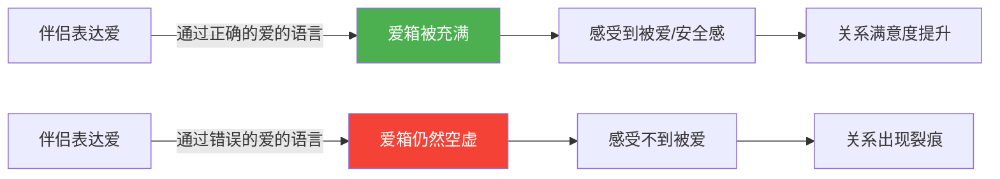
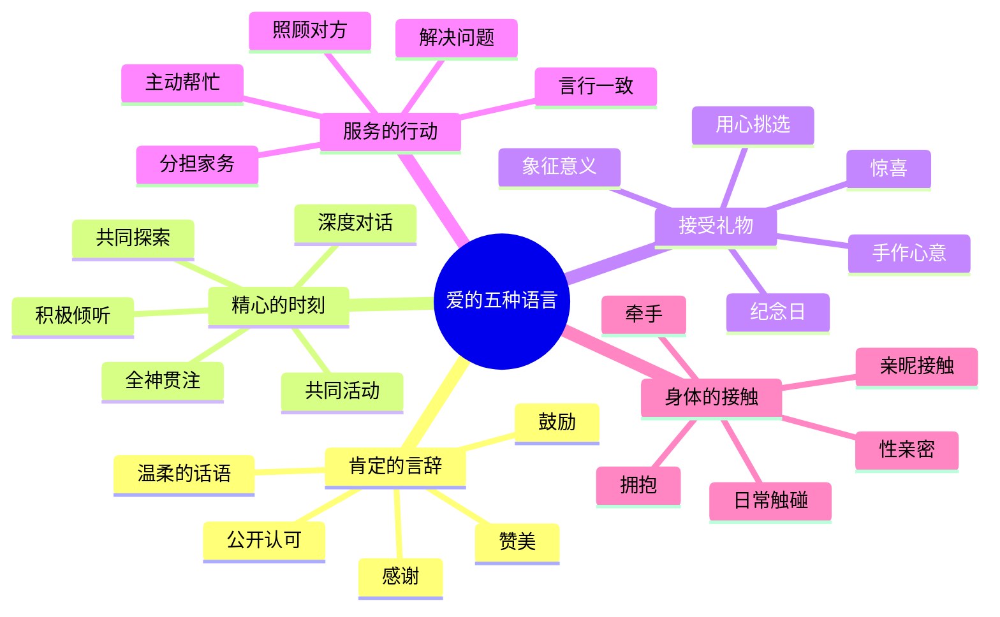
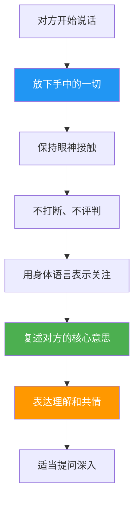
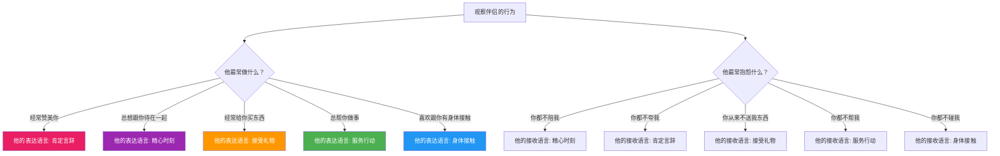

## 二、爱的语言：理解表达爱的五种方式

> "在爱的世界里，最大的悲剧不是不爱，而是用错了方式去爱。"

你是否有过这样的困惑——明明自己已经付出了很多，对方却依然觉得你不爱他？或者反过来，对方看起来也做了不少事，但你内心却感受不到被爱？这种"爱的错位"几乎是所有人际关系中最常见的痛苦来源。

本节将系统介绍"爱的五种语言"理论，帮助你理解：爱的表达和接收不是本能，而是一门需要学习的语言。当你掌握了这门语言，你就能用对方真正能感受到的方式传递爱意。

### 2.1 爱的语言理论起源与核心原理

#### 2.1.1 理论背景

"爱的五种语言"（The Five Love Languages）由美国婚姻家庭咨询师加里·查普曼（Gary Chapman）在其1992年的同名著作中首次系统提出。查普曼在超过30年的婚姻咨询实践中，接待了数千对夫妻，发现了一个反复出现的模式：

**伴侣之间的核心矛盾，往往不是"不爱"，而是"表达爱的方式和接收爱的方式不匹配"。**

他将这一发现凝练为五种基本的爱的语言，该理论至今已被翻译成50多种语言，全球销量超过2000万册，成为情感关系领域最具影响力的理论框架之一。

查普曼的理论形成过程本身就值得深入了解。他最初在伊利诺伊州的一间教堂担任牧师和婚姻咨询师，每年接触数百对夫妻。他注意到，这些夫妻在描述"为什么感觉不到被爱"时，反复出现五种核心诉求。他将这些诉求归纳整理，经过十余年的反复验证，最终形成了五种爱的语言分类体系。这个理论的独特之处在于：它不是从学术实验室中诞生的，而是从真实关系的痛苦和困惑中提炼出来的。

#### 2.1.2 核心机制："爱箱"理论

查普曼用一个生动的比喻来解释爱的语言的核心机制——**每个人内心都有一个"爱箱"（Love Tank）**：

当你的"爱箱"是满的，你会感到安全、被珍视、有归属感，你也有更多的能量去爱对方。当"爱箱"长期空虚，人会变得焦虑、敏感、易怒，关系中的小摩擦也会被放大成大冲突。

关键在于：**每个人接收爱的"入口"不同**。你往对方的"邮箱"里寄了满满一箱信，但对方的"邮箱"是电话——他永远收不到你的爱。

**爱箱的"容量"与"消耗速度"：**

爱箱不是恒定的，它有动态的容量和消耗机制。当一个人处于高压状态（工作危机、健康问题、家庭变故）时，爱箱的消耗速度会大幅加快，对爱的语言的需求强度也会急剧上升。这意味着：在伴侣最困难的时期，你需要比平时投入更多的爱的语言表达，而不是减少——因为此时对方的爱箱正在快速流失。

一个常见的反直觉现象是：当伴侣遇到困难时，很多人会"给他空间""不去打扰"，但对于精心时刻型或身体接触型的人来说，这恰恰是最糟糕的做法——他们的爱箱正在告急，而你却在撤退。

#### 2.1.3 理论的心理学基础

爱的语言理论并非凭空而来，它与多个心理学理论相互印证：

| 心理学理论 | 创始人/代表人物 | 与爱的语言的关联 | 核心机制 |
|:---|:---|:---|:---|
| 依恋理论 | Bowlby, 1969; Ainsworth, 1978 | 安全型依恋的人更容易识别和使用伴侣的爱的语言 | 早期依恋经验塑造了个体对爱的"接收频率" |
| 马斯洛需求层次 | Maslow, 1943 | 爱的归属需求是基本需求，爱箱空虚直接威胁心理安全 | 低层需求未满足时，高层需求的追求会受阻 |
| 积极心理学 | Seligman, 2002 | 爱的语言是一种"品格优势"，可以刻意培养 | 关注积极面而非修复缺陷 |
| 社会交换理论 | Thibaut & Kelley, 1959 | 关系满意度取决于"付出-回报"的感知平衡 | 当感知回报低于期望时，关系满意度下降 |
| 情绪聚焦疗法（EFT） | Johnson, 1988 | 爱的语言帮助识别情感需求，促进安全的情感联结 | 通过识别依恋需求改善伴侣互动模式 |
| 自我决定理论 | Deci & Ryan, 1985 | 爱的语言满足了关系中的"自主性""胜任感""归属感"三大基本心理需求 | 内在动机来自基本需求的满足 |
| 情感银行账户 | Gottman, 1999 | 每次正确的爱的语言表达相当于"存款"，错误的相当于"取款" | 当"账户"余额充足时，冲突更容易被化解 |

查普曼本人也承认，这一理论更多是临床经验的总结而非严格的实证研究。但后续的学术研究（如 Egbert & Polk, 2006; Cook et al., 2013; Surijah & Septiarly, 2016）已在一定程度上验证了五种语言分类的合理性，特别是在关系满意度预测方面。

**理论的局限性（必须了解）：**

任何理论都有其适用边界，爱的语言理论也不例外：

- **文化适用性**：五种分类源于美国中产阶级白人夫妻的咨询经验，在不同文化背景下可能需要调整权重。例如，在集体主义文化中，"家庭融入"可能是一种独立的爱的语言
- **性别刻板印象风险**：不要假设"女性更需要言辞肯定""男性更需要身体接触"，个体差异远大于性别差异
- **简化模型**：人类情感的复杂性无法被五种分类完全涵盖，这只是一个实用的认知框架，不是精确的心理测量工具
- **单向改进的局限**：关系是双向的，如果只有一方在学习和改变，长期效果有限

### 2.2 五种爱的语言详解

查普曼将爱的表达归纳为五种基本类型。每个人都有自己的**主要爱的语言**（Primary Love Language），即最能让自己感受到被爱的方式。大多数人有1-2种主要语言，其余为辅助语言。

#### 2.2.1 肯定的言辞（Words of Affirmation）

**核心本质：** 语言是情感的载体。对这类人而言，被说出来的爱才是真实的爱。

**为什么语言有如此大的力量？**

神经科学研究表明，当人接收到真诚的赞美时，大脑的奖赏系统（特别是伏隔核）会被激活，释放多巴胺——这与获得物质奖励时的大脑反应高度相似。UCLA的研究团队通过fMRI扫描发现，被赞美时的大脑活动模式与被拥抱时高度重叠，证明语言确实可以产生"触摸般"的神经效果。

相反，批评和贬低性语言会激活大脑的前扣带皮层和后脑岛——这些区域与身体疼痛的处理高度重叠。也就是说，恶毒的话语字面意义上"伤人"。对于"肯定言辞"型的人来说，这种神经反应更加敏感和强烈——他们对语言的情感信号有着更高的"接收灵敏度"。

**具体表现形式：**

**① 赞美与肯定**
- 真诚地赞美对方的外貌、能力、品质或成就
- 关键：赞美必须具体且真实，泛泛的"你真棒"远不如"你今天做的那个PPT逻辑特别清晰，客户都看懂了"
- 频率很重要：不是偶尔一次的大赞美，而是日常持续的小肯定
- 赞美的公式：**观察到的行为 + 产生的积极影响 + 你的感受**。例如："你今天主动帮我妈提了东西（行为），她特别开心（影响），我觉得你真的很体贴（感受）"
- 场景示例：伴侣做了一顿饭，"这道菜的调味真好，比上次进步了很多"比"还行吧"有效一万倍

**② 鼓励与支持**
- 在对方犹豫、害怕、自我怀疑时给予信心
- "我相信你能做到""你之前克服过比这更难的事"
- 鼓励不是施压——"你可以的"和"你必须做到"有本质区别
- 鼓励的核心是**认可对方的能力和价值**，而不是设定期望
- 场景示例：伴侣要换工作很焦虑，"你的能力我是看在眼里的，不管你怎么选我都支持你"

**③ 仁慈与温柔的表达方式**
- 不仅是说什么，更是怎么说
- 同样的内容，温和的语气和尖锐的语气产生截然不同的效果
- 即使在冲突中，也尽量避免攻击性语言
- 语言的"温度"比"内容"更先被接收——对方先感受到你的语气，再理解你的意思
- 场景示例：想让伴侣收拾房间，"亲爱的，能帮我收拾一下客厅吗？"vs"你怎么又把房间弄这么乱！"

**④ 感谢与感恩**
- 对对方所做的一切表示感谢，而不是视为理所当然
- "谢谢你今天接孩子""谢谢你记得我喜欢喝这个"
- 感谢需要具体——说出你感谢的是什么
- 研究表明，经常表达感恩的夫妻，关系满意度显著高于不表达的夫妻（Gordon et al., 2012）。加州大学伯克利分校的研究进一步发现，感恩表达频率每增加一个标准差，关系满意度提升约15%
- 感恩的"递减效应"需要警惕：当感谢变成口头禅（"谢谢"说完就忘），它的情感信号会减弱。保持感谢的新鲜度和具体性是关键

**⑤ 公开场合的认可**
- 在朋友、家人面前赞美伴侣
- 在社交媒体上表达爱意（适度）
- 公开认可的信号强度远大于私下赞美——因为它意味着"我愿意让全世界知道我爱你"
- 但要注意：有些人不喜欢过度的公开表达，需要了解对方的舒适度
- 公开认可的"成本信号"效应：在众人面前赞美伴侣，等于承担了"社交风险"（万一伴侣表现不好，你的话就显得尴尬），这种"风险承担"本身就传递了爱的信号

**情感沟通要点：**

与这类人沟通时，不要吝啬正面表达。即使你是一个"行动派"，也要学会用语言传递爱意。沉默在他们看来可能意味着冷漠。但要注意：

| ✅ 正确做法 | ❌ 错误做法 | 为什么 |
|:---|:---|:---|
| 具体、真实的赞美 | 敷衍的"嗯""还行" | 具体的赞美证明你真的在关注 |
| 日常持续的小肯定 | 偶尔一次的大赞美但平时沉默 | 爱箱需要持续充填，不是一次性灌满 |
| 温和的语气提建议 | 用批评代替建议 | 建议和批评的区别在于语气和出发点 |
| 冲突中对事不对人 | 攻击对方的人格和能力 | 人格攻击造成的伤害远超你的想象 |
| 记住对方的优点并说出来 | 只在吵架后才想起对方的好 | 优点需要在平时被"看见"和"说出" |
| 用文字留下肯定（纸条、消息） | 只在面对面时才表达 | 文字的肯定可以反复回味 |

**进阶理解：肯定言辞的深层需求**

喜欢肯定言辞的人，往往在成长过程中缺乏语言上的肯定和认可。他们的内心可能有一个声音在不断质疑："我真的值得被爱吗？"每一次真诚的肯定，都是在对这个内在质疑做出回应。

这并不意味着所有喜欢肯定言辞的人都有童年创伤——有些人天生对语言的情感信号更敏感，就像有些人天生对音乐更敏感一样。关键是理解：对这类人来说，**语言不是"锦上添花"，而是"雪中送炭"**。

**容易被忽视的细节：**
- 肯定言辞型的人对负面语言的耐受度也更低——同样的批评，他们感受到的伤害是其他类型的2-3倍
- 他们往往会记住你说过的每一句伤人的话，不是因为记仇，而是因为语言在他们的内心留下了更深的印记
- 在冲突中，对他们来说，"怎么说话"比"说什么"更重要——同一句道歉，温柔地说和不耐烦地说，效果天差地别

#### 2.2.2 精心的时刻（Quality Time）

**核心本质：** 爱不是"在一起"，而是"全然在场"。

**什么是"精心的时刻"？**

精心时刻的核心是**全神贯注的陪伴**——不是身体在同一空间就算陪伴，而是两个人在精神和情感上完全"在一起"。这意味着放下手机、关掉电视、停止想工作，把全部注意力交给对方。

一个简单的自测：当你和伴侣在同一房间里，你是否经常需要重复说过的话？如果答案是"是"，那你们可能正在经历"物理在场、精神缺席"的状态。

**具体表现形式：**

**① 全神贯注的对话**
- 面对面坐下来，看着对方的眼睛，认真听他说话
- 不是"嗯嗯啊啊"的敷衍回应，而是真正的理解和共情
- 运用积极倾听技巧：复述、提问、表达理解
- 场景示例：伴侣说"今天工作上遇到一个烦心事"，放下手机，看着他，"怎么了？跟我说说"

**② 优质共处活动**
- 一起散步、一起做饭、一起看电影、一起运动
- 关键不是做什么，而是两个人一起做、一起享受
- 这些活动创造共同记忆，增强情感联结
- 场景示例：每周末一起做一顿特别的早餐，形成固定的"我们的时光"
- 活动选择的原则：选择双方都感兴趣的事，而不是单方面的"陪你做你想做的事"。如果一方完全无感，精心时刻就变成了义务

**③ 深度对话**
- 超越日常琐事的深度交流：梦想、恐惧、童年记忆、人生感悟
- 定期进行"关系检查"：我们最近怎么样？有什么可以改善的？
- 这类对话建立情感上的深层联结
- 研究表明，定期进行深度对话的夫妻，关系质量显著更高（Aron et al., 2000）。该研究中，实验组夫妻在45分钟的深度对话后，亲密感评分提升了约20%
- 深度对话的"36个问题"框架：心理学家Arthur Aron设计了36个逐渐深入的问题，从"你想成名吗？以什么方式？"到"如果你今晚就会死去，你最后悔没有告诉谁一些事？"这些问题被实验证明能在45分钟内显著增进亲密感

**④ 积极倾听的实践**

积极倾听是精心时刻的核心技能：

积极倾听的常见错误：
- **"解决问题"模式**：对方只是想倾诉，你却急着给建议。记住：很多时候，被听见本身就是目的
- **"比惨"模式**：对方说工作辛苦，你说"我更辛苦"。这会让对方觉得自己的感受被否定
- **"转移话题"模式**：对方说到一半，你说"哦对了我想起一件事"。这传递的信号是"你的事不重要"
- **"评判"模式**："你不应该那样想"。感受没有对错，只有存在与否

**⑤ 共同经历新事物**
- 一起尝试新餐厅、学习新技能、探索新地方
- 共同的新鲜体验能激活大脑的奖赏系统，增强情感联结
- 这被称为"自我扩展理论"（Aron & Aron, 1986）——通过伴侣扩展自我
- 具体做法：每月至少一次"第一次体验"——一起去做一件两人都没做过的事。可以是一门课、一个新地方、一项新运动
- 研究发现，共同参与新奇活动的伴侣，关系满意度在6个月后显著高于只进行常规活动的伴侣（Aron et al., 2000）

**情感沟通要点：**

质量远比数量重要。一小时的全神贯注，胜过一整天心不在焉的同处一室。被忽视或被敷衍是最大的伤害。具体来说：

- 在一起的时候，**物理上放下手机**（不是翻过来扣在桌上，而是放远一点——研究表明，仅仅是手机出现在视野中就会降低对话质量，即使它没有响）
- 设定"无屏幕时间"：比如晚餐时间不看手机
- 提前告知忙碌时段："接下来两小时我需要处理工作，之后就是我们的专属时间"
- 如果必须中断，说明原因并承诺回来："抱歉，我回个消息，30秒就好"
- 精心时刻可以被"排期"——这不是不浪漫，而是确保它不被其他事情挤掉。就像你会为工作会议排期一样，为亲密关系排期是同等重要的

**进阶理解：精心时刻的文化差异**

在东亚文化背景下，很多人从小缺乏与父母的深度情感交流。他们可能不知道如何进行"精心时刻"式的陪伴。这不是不爱你，而是一种需要学习的能力。耐心引导比指责有效得多。

另一层文化差异是：在一些文化中，"一起做事但不说话"也是一种陪伴形式（比如一起钓鱼、一起看电视）。这不是"没有精心时刻"，而是精心时刻的文化表达方式不同。关键是双方是否都认为这种相处方式有情感价值。

#### 2.2.3 接受礼物（Receiving Gifts）

**核心本质：** 礼物是爱的有形象征，代表着"我心里有你"。

**为什么礼物如此重要？**

礼物语言的核心不是物质主义，而是**象征意义**。礼物是一个看得见、摸得着的证据，证明对方在想你、记得你、在乎你。从进化心理学角度看，赠送礼物是一种"成本信号"——它表明你愿意为对方投入资源，是信任和承诺的外在表现。

礼物还有一个独特的心理学功能：**它可以"替你陪伴"**。当你不在身边时，礼物作为你的象征，持续向对方传递"我在想你"的信号。这就是为什么一个放在床头的小摆件，每天都能带来情感温暖。

**具体表现形式：**

**① 用心挑选的礼物**
- 关键：不在于价格，在于你是否真正关注了对方的需求和喜好
- 对方随口提过想要的东西，你默默记住并在某个时刻送出——这比昂贵的礼物更打动人
- "用心"的三个维度：**记忆**（你记得对方说过什么）、**观察**（你注意到对方需要什么）、**努力**（你花了时间和精力去寻找）
- 场景示例：伴侣三个月前说过"想试试那个牌子的护手霜"，你在生日时送了这套

**② 有象征意义的礼物**
- 不一定要实用，但一定要有意义
- 一张手写的卡片、一本你们共同喜欢的书、一张合影相框
- "象征意义"的本质是：这个物品承载了一段共同记忆或情感
- 场景示例：旅行时捡的一块特别的石头，写着"我们的第一次旅行纪念"

**③ 惊喜与仪式感**
- 非特殊日子的礼物往往比节日礼物更有力量——因为它意味着"不是因为必须送，而是因为想送"
- 偶尔的小惊喜：带一杯对方喜欢的咖啡回来、买一束花
- 场景示例：出差回来带一个当地特色小吃，"我在那边看到这个，第一反应就是你会喜欢"
- 惊喜的频率不需要很高，但需要不可预测——如果对方能完全猜到你什么时候送礼物，惊喜感就会减弱

**④ 纪念日与重要日期**
- 记住重要的日子本身就是一个礼物
- 不需要每次都隆重，但需要有表示
- 忘记纪念日对礼物语言型的人来说，是一种深层伤害——"这么重要的日子你都能忘，说明你心里根本没有我"
- 实用建议：在手机日历中设置所有重要日期的**提前7天提醒**，给自己足够的准备时间
- 这些日期包括：生日、纪念日、第一次约会日、对方父母的生日、以及其他对你们有特殊意义的日子

**⑤ 礼物的"在场"价值**
- 礼物可以成为一种持续的情感提醒
- 每次看到那个礼物，都会想起送礼的人和那个时刻
- 这创造了一种持续的情感联结
- 手作礼物的特殊价值：当你亲手制作一件礼物（编织、绘画、写信、做手工），你投入的是时间——这个世界上无法购买的资源。对于礼物语言型的人来说，手作礼物的情感价值远超其物质价值

**情感沟通要点：**

| ✅ 正确理解 | ❌ 错误理解 | 深层原因 |
|:---|:---|:---|
| 礼物是爱的象征和证据 | 对方只在乎物质 | 象征意义 > 物质价值 |
| 用心比花钱重要 | 必须送贵的才有用 | 关注和记忆 > 价格标签 |
| 日常小惊喜比大礼物更有力 | 只在节日才需要送礼 | "因为想送" > "因为应该送" |
| 送礼是一种关注的表达方式 | 送礼是讨好和收买 | 关注 > 交易 |
| 忘记重要日子是重大伤害 | 记不记得无所谓 | 记住 = 在乎 |
| 手作礼物有独特价值 | 亲手做的不如买的 | 时间投入 > 金钱投入 |

**进阶理解：礼物语言型的人并非"拜金"**

这是对礼物语言最常见的误解。一个喜欢收到礼物的人，真正渴望的不是物品本身，而是物品所承载的情感信息——"你在想我""你记得我""你愿意为我花心思"。一个路边摘的野花和一颗钻石，对于礼物语言型的人来说，如果心意相同，情感力量可以是等价的。

查普曼在书中特别强调："如果你的伴侣的爱的语言是接受礼物，而你认为这是物质主义，那你需要重新理解什么是物质主义。物质主义是以物质来衡量人的价值。而礼物语言是以物质为载体来表达爱——载体和内容是两回事。"

**经济困难时期的应对：**
- 手作礼物：写信、画画、做相册、烹饪一顿特别的饭菜
- "免费"但有意义的礼物：从你们初次见面的地方捡一块石头、收集一片秋天的落叶做成书签
- 时间礼物："今天的2小时完全属于你，你说做什么就做什么"——把时间本身作为礼物
- 关键：经济困难不是停止送礼的理由，而是发挥创造力的机会

#### 2.2.4 服务的行动（Acts of Service）

**核心本质：** 爱是一个动词，不是名词。对这类人而言，实际行动是爱的唯一可信证明。

**为什么行动胜于言语？**

这类人的逻辑是：如果你真的爱我，你就会为我做一些具体的事。光说"我爱你"但什么都不做，在他们看来等于撒谎。这不是因为他们不浪漫，而是因为他们对爱的判断标准是**行为一致性**——你说的话和你做的事是否匹配。

这种偏好可能与依恋模式有关。Bowlby的依恋理论指出，在早期经验中"说到做到"的照顾者培养出安全型依恋的孩子，而"说了不做"的照顾者则培养出焦虑型或回避型依恋。服务行动型的人可能对"言行不一致"有着更深的敏感性。

**具体表现形式：**

**① 主动分担家务**
- 不是"你要我帮忙吗？"而是"我来做"
- 不需要被提醒、被要求，而是主动看到需要做的事情并去做
- "要我帮忙吗"这句话的问题在于：它把家务默认为对方的责任，你只是"帮忙"
- 场景示例：看到伴侣很累，主动去做饭、洗碗、照顾孩子，而不是等对方开口
- 家务分担的研究数据：Gottman研究所发现，家务分担的公平感是预测婚姻满意度的前三大因素之一。在已婚夫妻中，认为家务分配公平的人，离婚概率比认为不公平的人低约50%

**② 帮助解决问题**
- 对方遇到困难时，主动提供实际帮助
- 不只是"有需要跟我说"，而是"我来帮你查一下""我来接你"
- "有需要跟我说"这句话的问题在于：它把主动权推给了对方，暗示"我不愿意主动观察你的需求"
- 场景示例：伴侣的电脑坏了，不是说"找个修电脑的吧"，而是"我来帮你看看"

**③ 减轻对方的负担**
- 关注对方的压力源，主动承担一部分
- 让对方感到"不是一个人在战斗"
- 场景示例：对方最近工作压力大，你主动承担了所有家务和孩子的接送
- 关键能力：**观察力**。你需要能够看到对方正在承受什么，而不是等到对方崩溃了才意识到

**④ 言行一致的承诺**
- 说了就要做到，做不到就不要说
- 承诺不兑现比从不承诺更糟糕——因为它意味着"你连为我努力一下都不愿意"
- 这是服务行动型最核心的信任基石
- 如果你不确定能做到，用"我试试"代替"我保证"。降低承诺、提高交付，比过度承诺、无法交付好得多
- "承诺衰退"现象：随着时间推移，当初的承诺会逐渐被遗忘。定期回顾你做出的承诺并确认执行情况，是维护信任的重要方式

**⑤ 关注细节的照顾**
- 记住对方的习惯和偏好
- 天冷了主动提醒加衣服、生病了主动照顾
- 场景示例：对方喜欢喝温水，你每次倒水都调好温度
- 细节的力量在于：它证明你**一直在观察和记忆**。不是偶尔的大型服务，而是日常的小关注累积起来的情感证据

**情感沟通要点：**

与这类人相处，行动胜于雄辩。但要注意以下几点：

- 服务应该是出于爱，而不是出于义务或讨好——动机不同，传递的情感信号完全不同
- 不要做了之后反复提起——"我为你做了这么多"会把爱变成债务
- 如果你不确定对方需要什么，直接问："有什么我可以帮你做的吗？"
- 服务的行动也需要得到认可——帮忙做了家务但被完全无视，也会让人受伤
- 服务行动的"过度补偿"风险：不要把所有精力都放在做事情上，而忽略了其他情感表达方式。如果对方同时也需要肯定言辞，那么做了一切家务但从不说"我爱你"，仍然是不完整的

**进阶理解：服务行动与控制的边界**

需要警惕的是，"服务的行动"和"控制行为"之间有一条清晰的界限：

| 服务的行动（爱的表达） | 控制行为（需要警惕） |
|:---|:---|
| 出发点是对方的需求 | 出发点是自己的需求 |
| 对方有选择接受或拒绝的自由 | 对方被期望必须接受和感激 |
| 做完之后不反复提起 | 做完之后反复提起，制造愧疚感 |
| 尊重对方做事的方式 | 要求对方按照自己的方式做事 |
| 让对方感到轻松和被支持 | 让对方感到被监视和被控制 |

如果你的服务让对方感到被监视、被限制、被剥夺了自主权，那就不是爱的语言，而是控制行为。真正的服务是让对方感到更自由，而不是更受限。

#### 2.2.5 身体的接触（Physical Touch）

**核心本质：** 身体是最直接的情感通道。对这类人而言，身体接触是爱最原始、最有力的表达。

**为什么身体接触如此重要？**

从神经科学角度看，身体接触是人类最原始的情感交流方式。婴儿通过被拥抱来建立安全感，成年后这一机制并未消失。研究表明，适当的身体接触能促进催产素（Oxytocin，又称"拥抱荷尔蒙"）的分泌，这种激素能降低皮质醇（压力激素）水平，增强信任感和亲密感。

更具体地说，人体皮肤下有一种特殊的神经纤维——**C触觉传入纤维**（C-tactile afferents），它们专门对缓慢、温柔的抚摸做出反应，传递的不是触觉信息，而是**情感信息**。这种纤维在社交性触摸（拥抱、牵手、轻抚）时最为活跃，而在功能性触摸（抓挠、拍打）时则不太活跃。这说明人类的神经系统天生就是为了接收"情感性触摸"而设计的。

哈佛大学的一项研究发现，每天至少一次20秒以上的拥抱，可以显著降低血压、减少焦虑、增强免疫功能。对于身体接触型的人来说，这种生理效应更为显著。

**具体表现形式：**

**① 日常的亲密接触**
- 牵手、拥抱、亲吻、依偎
- 路过时拍拍肩膀、摸摸头发
- 靠在一起看电视、挤在同一张沙发上
- 场景示例：每天出门前和回家后的拥抱，形成固定的"连接仪式"
- "连接仪式"的概念：固定时间、固定方式的身体接触会形成条件反射般的安全感。每次出门前的拥抱，久而久之，仅仅是想到"要出门了"，对方就能提前感受到温暖

**② 困难时刻的身体安慰**
- 在对方伤心、害怕、焦虑时，一个拥抱比千言万语更有力量
- 身体接触能直接降低生理上的应激反应——拥抱20秒以上可以使皮质醇水平下降约30%
- 场景示例：伴侣因为工作失误很难过，不需要说"别想了"，只是紧紧抱住他
- 关键：在对方难过时，身体接触应该在语言之前。先拥抱，让对方的身体先放松下来，再开口说话。如果先说话，对方可能根本听不进去

**③ 不经意的触碰**
- 走路时轻轻碰一下手
- 坐在一起时腿靠着腿
- 帮对方整理衣领、拂去头发上的东西
- 这些微小的触碰累积起来，构成日常爱意的底色
- "微触碰"的科学意义：即使是0.5秒的短暂触碰，也能传递基本的情感信息（爱、同情、感激）。一项发表在Science上的研究发现，被试仅通过触摸就能识别出对方的情绪，准确率高达78%

**④ 性亲密**
- 性关系是身体接触语言中重要的组成部分
- 但性亲密的质量远比频率重要——情感投入的性接触远比敷衍了事有意义
- 性亲密也需要沟通——了解对方的喜好、节奏和边界
- 性亲密与日常非性接触的关系：如果日常的非性身体接触（拥抱、牵手、亲吻）缺失，仅靠性接触无法维持身体接触型的人的爱箱。相反，如果日常接触充足，性亲密的质量也会自然提升

**⑤ 社交场合中的身体语言**
- 在朋友面前自然地搂着对方的肩膀
- 走路时牵手
- 在对方说话时轻触手臂表示支持
- 社交场合的身体接触还有一个附加功能：它向外界传递"我们是一体的"的信号，满足归属感需求

**情感沟通要点：**

| ✅ 健康的身体接触 | ❌ 需要警惕的情况 | 如何判断 |
|:---|:---|:---|
| 尊重对方的边界和意愿 | 无视对方说"不" | 边界是不可谈判的 |
| 注意场合的适宜性 | 在不合适的场合过度亲昵 | 考虑对方和周围人的舒适度 |
| 关注对方的身体语言反馈 | 只考虑自己的需求 | 观察对方是否放松或紧张 |
| 温柔、体贴、有节奏感 | 粗暴、急躁、缺乏耐心 | 情感性触摸的核心是温柔 |
| 在对方需要安慰时主动拥抱 | 把身体接触当作唯一表达方式 | 触摸是爱的语言之一，不是全部 |

**进阶理解：身体接触的边界与尊重**

任何身体接触都必须建立在**双方自愿和舒适**的基础上。即使你的伴侣的主要爱的语言是身体接触，这也不意味着你可以无视他的边界。当对方说"我现在不想"，这不是否定你的爱，而是此刻他的状态需要另一种形式的关心。

**身体接触的"同意"文化：**
- 即使是长期伴侣，也需要持续确认对方的舒适度
- 非语言同意信号：身体放松、主动靠近、回应你的触碰
- 非语言拒绝信号：身体僵硬、后退、回避眼神——这些信号需要被立即尊重
- "同意"不是一次性的，而是持续的——上一秒同意不等于这一秒也同意

### 2.3 爱的语言识别方法

了解了五种爱的语言后，下一步是识别自己和对方的主要爱的语言。以下提供多种识别方法，综合使用准确度更高。

#### 2.3.1 自我识别：你的主要爱的语言是什么？

**方法一：观察自己的行为模式**

问自己以下问题，选择最能引起共鸣的答案：

1. **你最常抱怨什么？** 你抱怨的内容，往往反映了你未被满足的爱的语言需求
   - "你从来不陪我" → 精心时刻
   - "你从来不说你爱我" → 肯定的言辞
   - "你从来不送我东西" → 接受礼物
   - "你从来不肯帮我" → 服务的行动
   - "你从来不碰我" → 身体的接触

2. **你最常为伴侣做什么？** 你表达爱的方式，很可能也是你希望接收爱的方式
   - 你总是在赞美对方 → 你可能也渴望被赞美
   - 你总是主动做家务 → 你可能也渴望被帮助

3. **如果只能选一个，你最不能忍受哪个的缺失？**
   - 长时间没有拥抱和身体接触 vs. 长时间听不到"我爱你"
   - 没人帮忙做家务 vs. 没人陪我说话

**方法二：排除法**

想象以下两个场景，选择对你伤害更大的：

- 场景A：伴侣精心准备了一份礼物送给你，但整天都在忙自己的事，没跟你说话
- 场景B：伴侣陪你聊了一整天，但什么礼物都没送

如果你觉得A更难受 → 你的主要语言可能是精心时刻
如果你觉得B更难受 → 你的主要语言可能是接受礼物

用类似的方式构造对比场景，可以逐步排除，找到自己最核心的爱的语言。

**方法三：五选一排序法**

给以下五种情况打分（1-10分），分数越高表示该情况越让你感到被爱：

1. 伴侣对你说："我真的很为你骄傲，你做得太好了。"（肯定的言辞）
2. 伴侣放下手机，专注地陪你聊了一个小时。（精心的时刻）
3. 伴侣下班回家时带了你最喜欢的甜点。（接受礼物）
4. 伴侣在你加班时主动把家里收拾得干干净净。（服务的行动）
5. 伴侣在你看电视时自然地靠过来，把头靠在你肩上。（身体的接触）

分数最高的1-2项，就是你的主要爱的语言。

**方法四：伤害回溯法**

回忆过去关系中你**最受伤害的三个时刻**，分析它们对应的爱的语言类型。被伤害的模式往往比被感动的模式更能揭示你的真实需求——因为人类对失去的敏感度是对获得的2倍（损失厌恶效应）。

#### 2.3.2 识别伴侣的爱的语言

**观察法——看行为模式：**

注意：表达语言和接收语言**不一定相同**。一个人可能习惯用行动表达爱（服务的行动），但最渴望听到语言的肯定（肯定的言辞）。识别时要分别观察"他怎么表达"和"他最渴望什么"。

**直接沟通法：**

最简单有效的方法就是直接问。以下是一些引导性问题：
- "你觉得我做什么时候，你最能感受到我爱你？"
- "如果你只能选一个，你更希望我多陪你聊天，还是多帮你做事？"
- "你小时候，爸妈怎么表达对你的爱？那让你感觉好吗？"
- "如果我一个月什么都没做，但天天说爱你，你会觉得被爱吗？"
- "你觉得我做什么事，最让你觉得'这个人是爱我的'？"
- "你觉得我忽略了什么？"——这个问题往往能直接触及对方未被满足的爱的语言需求

**关系日记法：**

连续两周记录以下内容：
1. 每天伴侣做了什么让你感到开心的事？归类到五种语言
2. 每天伴侣做了什么让你感到不舒服的事？分析对应的未被满足的语言
3. 两周后统计，出现频率最高的类别就是伴侣的主要接收语言

#### 2.3.3 爱的语言的动态性

需要注意的是，爱的语言不是一成不变的：

- **生命阶段的影响**：产后女性可能更需要服务的行动（分担育儿），老年伴侣可能更需要身体的接触（健康焦虑带来的安全感需求）
- **压力状态的影响**：人在高压下，对主要爱的语言的需求会急剧增强。一个通常不太需要肯定言辞的人，在事业低谷期可能特别需要语言鼓励
- **关系阶段的影响**：热恋期可能更重视身体接触，稳定期更需要精心时刻，危机期可能更需要服务的行动
- **个人成长的影响**：随着自我认知的深入，你可能会发现自己真正的爱的语言和以为的不同
- **重大事件的影响**：亲人离世、失业、疾病等重大事件可能永久性地改变一个人的爱的语言偏好

**建议：每1-2年重新评估一次自己和伴侣的爱的语言，保持沟通的精准性。** 不要用三年前的答案来回答今天的问题。

### 2.4 爱的语言在情感沟通中的应用

#### 2.4.1 核心原则：用对方的语言说话

爱的语言的本质不是"做你自己"，而是**"用对方能接收的方式去爱"**。这需要走出舒适区。

这就是爱的语言理论中最深刻的洞见：**爱不是本能反应，而是一种有意识的选择和刻意的练习。** 你不需要天生就会用对方的语言，但你需要愿意去学习。

**为什么"做自己"不够？**

"做自己"意味着用你最习惯的方式表达爱。但如果你的表达方式和对方的接收方式不匹配，那你的爱就像一封用中文写的信寄给一个只懂英文的人——你确实写了，但对方确实读不懂。

爱的语言的学习本质上是一种**翻译能力**：把你想表达的爱，翻译成对方能理解的格式。这不是虚伪，而是智慧。

#### 2.4.2 五种语言的具体沟通策略

**对肯定言辞型的沟通策略：**
- 每天至少说一句真诚的赞美
- 在公众场合认可对方
- 用"我很感激你……"开头的句式表达感谢
- 冲突时避免使用"你总是""你从来不"这样的绝对化语言
- 每周写一张小纸条放在对方能看到的地方
- 学习"5:1法则"：Gottman研究所发现，稳定关系中的正面互动与负面互动的比例至少为5:1。对肯定言辞型的人，这个比例可能需要更高
- 使用"我"句式而非"你"句式："我感到被忽略"vs"你总是忽略我"

**对精心时刻型的沟通策略：**
- 设定每天至少15分钟的"无干扰对话时间"
- 每周至少一次"约会之夜"（即使只是在家看电影）
- 学习积极倾听技巧：复述、共情、提问
- 对话时手机放在另一个房间
- 一起计划一件未来的事（旅行、项目）——共同期待本身就是精心时刻
- 建立"关系仪式"：固定的早餐时间、睡前聊天、周末散步——这些重复的精心时刻构成关系的骨架
- 如果你是一个不太擅长聊天的人，可以一起做事（散步、做饭、运动），在活动的过程中自然对话

**对礼物语言型的沟通策略：**
- 在手机备忘录里记录对方提到过想要的东西
- 出差/旅行时买一个当地特色小礼物
- 记住所有重要日期，设置提前3天的提醒
- 偶尔在非节日送一个"因为想到你"的小礼物
- 手写的卡片或信件比买的卡片更有分量
- 建立一个"礼物灵感清单"：随时记录伴侣提到过的东西、在商店看到可能适合的东西、在网上发现的有趣物品
- 预算有限时：手作礼物、自然收集品（石头、树叶）、共同时光的"兑换券"（"本券可兑换一次按摩"）

**对服务行动型的沟通策略：**
- 每天主动做一件对方通常要做的事
- 不要问"需要帮忙吗"，直接去做
- 观察对方的压力源，主动分担
- 说了"我来"就一定要做到
- 在对方生病、忙碌时加倍行动
- 学习对方的"服务标准"——不是按你的标准做事，而是按对方在意的方式做事
- 保持一致性：不要今天做了明天不做。服务行动型的人对"突然停止"非常敏感——他们会解读为"你不再在乎了"

**对身体接触型的沟通策略：**
- 每天出门前和回家后拥抱至少20秒（研究表明20秒以上的拥抱能显著提升催产素水平）
- 看电视时自然地靠在一起
- 在公共场合牵手或挽手臂
- 对方难过时先拥抱，再说话
- 对方说话时轻触手臂表示关注
- 建立"触碰仪式"：出门前的拥抱、回家后的亲吻、睡前的牵手
- 学习对方喜欢的触碰方式和强度——有人喜欢紧紧的拥抱，有人喜欢轻柔的抚摸，有人喜欢背后环抱。直接问："哪种方式让你最舒服？"

#### 2.4.3 避免"以己度人"的陷阱

这是最常见的错误——**用自己的爱的语言去爱对方**。

**经典错位案例：**

| 你 | 伴侣 | 发生了什么 | 你的意图 | 对方的感受 |
|:---|:---|:---|:---|:---|
| 礼物语言型 | 服务行动型 | 你精心准备昂贵礼物 | "我用礼物表达爱" | "你能不能帮忙做做家务" |
| 精心时刻型 | 肯定言辞型 | 你花一整天陪伴对方 | "我用时间证明爱" | "你为什么从来不说你爱我" |
| 服务行动型 | 身体接触型 | 你做了一切家务 | "我用行动证明爱" | "你为什么都不抱我了" |
| 肯定言辞型 | 精心时刻型 | 你每天说"我爱你" | "我用语言表达爱" | "你能不能放下手机陪我说说话" |
| 身体接触型 | 礼物语言型 | 你总是想亲热 | "我用身体表达爱" | "你能不能用心给我选个礼物" |

双方都很用心，但都感到不被理解——这就是"爱的语言错位"的典型场景。破局的关键只有一句话：**先学会对方的语言，再期待对方学你的语言。**

**错位检测练习：**

拿出一张纸，写下：
1. 我最近为伴侣做过的三件"好事"
2. 伴侣最近抱怨过的三件事
3. 这两者之间有没有错位？

如果"我做的好事"全在我的语言里，而"伴侣的抱怨"全在另一种语言里——恭喜你，你找到了问题的答案。

#### 2.4.4 爱的语言在冲突中的应用

冲突是检验爱的语言理解程度的终极场景。当两个人发生矛盾时：

**第一步：暂停——识别当前的语言冲突**
- 你是不是在用你的语言攻击对方？（比如用尖刻的语言伤害一个肯定言辞型的人）
- 你是不是在用无效的方式寻求安慰？（比如想拥抱却只是一直抱怨）
- 此刻你的爱箱是不是处于"危险低位"？——低爱箱状态下，人更容易反应过度

**第二步：翻译——把你的需求翻译成对方的语言**
- 你想说的是"你不在乎我" → 翻译成对方的语言：如果你需要精心时刻，说"我需要你陪我聊一会儿"比指责有效一百倍
- 你想说的是"你不爱我了" → 翻译：这是在表达一种需求，不是一个事实陈述。找到这个需求，用对方的语言说出来

**第三步：修复——用对方的语言表达歉意**
- 对肯定言辞型：真诚地说出你的歉意，具体说明你意识到了什么。"我知道我刚才说的话伤害了你，我不应该那样说。你对我来说很重要。"
- 对精心时刻型：坐下来，给对方完整的注意力，认真听他表达。"我现在全部注意力都在你身上，告诉我你的感受。"
- 对礼物语言型：准备一个有心意的小礼物作为和解的象征。不需要贵重，但需要有心意。
- 对服务行动型：用实际行动弥补——做了什么错，就用行动去纠正。"我来把这件事做好。"
- 对身体接触型：一个温暖的拥抱、牵手，往往比千言万语更有效。先接触，后说话。

**第四步：预防——建立冲突中的"安全词"机制**

提前和伴侣约定一个"暂停信号"，当冲突升级时使用。这个信号的含义是："我现在情绪失控了，需要暂停，但我不是在拒绝你，我只是需要冷静一下再继续。"这可以防止冲突中的语言暴力对肯定言辞型造成不可挽回的伤害。

### 2.5 爱的语言在不同关系中的应用

爱的语言不仅适用于恋爱和婚姻，也适用于一切亲密关系。

#### 2.5.1 亲子关系

**识别孩子的爱的语言：**
- 观察孩子最常对你做什么（他可能会用他的语言爱你）
- 观察孩子最常抱怨什么
- 注意不同年龄段的孩子表达方式不同

**各年龄段的特点：**

| 年龄段 | 核心需求 | 表现特征 | 建议做法 | 常见错误 |
|:---|:---|:---|:---|:---|
| 0-3岁 | 身体接触是最重要的——安全感的基础 | 哭闹时被抱起就安静了 | 多拥抱、抚摸、亲吻、肌肤接触 | "不要总抱，会惯坏"——0-3岁不存在"抱太多" |
| 3-6岁 | 开始需要肯定和鼓励 | 不断地说"看我！看我！" | 具体表扬努力而非天赋："你画得很认真"而非"你真聪明" | 空泛的表扬会让孩子依赖外部评价 |
| 6-12岁 | 精心时刻变得重要 | 希望你参加他的活动 | 每天有专门的亲子时间，哪怕只有15分钟 | "我在旁边坐着呢"但一直在看手机 |
| 青春期 | 各种语言都重要，但方式需要调整 | 表面推开你，内心渴望关注 | 尊重边界，用他们接受的方式：发消息、一起打游戏、开车时聊天 | 强制性的关心会适得其反 |

**关键提醒：** 不要只用你擅长的方式爱孩子。如果你是行动派，但孩子需要的是语言肯定，那么你做了再多事，孩子可能仍然觉得"爸妈不爱我"。查普曼在《儿童爱之语》中特别指出：孩子的爱的语言在5-6岁时开始显现，到8-9岁时基本稳定。早期识别和回应孩子的爱的语言，对其一生的安全感和自信心都有深远影响。

**多子女家庭的特别提示：** 不同的孩子可能有不同的爱的语言。如果你用同一种方式爱所有的孩子，至少有一个孩子会感到不被理解。观察每个孩子的独特需求，分别回应。

#### 2.5.2 友谊关系

朋友之间也存在爱的语言差异：
- 有些朋友需要你定期约见面（精心时刻）——他们会觉得"不联系就是不在乎"
- 有些朋友需要你经常点赞评论他们的朋友圈（肯定的言辞）——他们会觉得"你看到了却不回应"
- 有些朋友在你需要帮忙时出现就觉得你是真朋友（服务的行动）——他们会觉得"说再多不如做一次"
- 有些朋友喜欢见面时的拥抱和拍肩（身体的接触）——在文化允许的范围内
- 有些朋友会在你生日时精心准备礼物（接受礼物）——他们也期待你记住他们的重要日子

友谊中爱的语言的识别方法更简单：看朋友为你做了什么——那往往就是他希望你为他做的事。

#### 2.5.3 职场关系

爱的语言理论也适用于职场——虽然"爱"这个词不太适用，但"被认可""被尊重"的需求是共通的。查普曼后来将这一理论扩展为"赞赏的五种语言"（The 5 Languages of Appreciation in the Workplace），适用于管理情境：

| 爱的语言在职场中的转化 | 具体表现 | 管理者如何应用 |
|:---|:---|:---|
| 肯定的言辞 → 赞赏与认可 | 公开表扬、书面肯定、具体反馈 | 在团队会议上具体表扬某人的贡献 |
| 精心的时刻 → 专注的关注 | 一对一时间、认真听下属说话 | 定期进行不被打扰的15分钟面谈 |
| 接受礼物 → 适当的奖励 | 奖品、礼品卡、特别待遇 | 项目完成后送一张小礼品卡 |
| 服务的行动 → 实际支持 | 提供资源、帮助解决问题 | "你需要什么支持来完成这个项目？" |
| 身体的接触 → 适当的身体语言 | 击掌、拍肩（因文化而异） | 项目成功后击掌庆祝（注意边界） |

Gallup的研究发现：感到被认可的员工，离职率比不被认可的员工低约31%，生产力高出约17%。用员工能接收到的方式表达认可，是低成本高回报的管理策略。

#### 2.5.4 远距离关系

在异地恋、出差频繁、或长期分居的情况下，爱的语言的表达需要创造性调整：

| 爱的语言 | 远距离表达方式 |
|:---|:---|
| 肯定的言辞 | 每天发一条"我在想你"的消息、写长邮件、录语音留言、手写信寄出 |
| 精心的时刻 | 固定时间的视频通话（不是边做别的边聊）、一起在线看电影、同时做同一件事 |
| 接受礼物 | 寄一个包裹、点外卖送到对方那里、在对方不知情时寄一张手写卡片 |
| 服务的行动 | 帮对方处理线上能处理的事（订票、查信息、帮点外卖）、设置对方手机提醒 |
| 身体的接触 | 最具挑战性——可以用"触摸替代品"：寄一件穿过的衣服（保留气味）、送一个抱枕、约定下次见面时的第一个拥抱 |

远距离关系中，精心时刻和肯定的言辞变得更加重要，因为它们是唯一可以在物理距离下完整传递的语言。

### 2.6 常见误区与纠正

#### 误区一："爱的语言太理论化了，不实用"

**纠正：** 爱的语言是少数几个"学了立刻就能用"的沟通工具。今晚回家就可以尝试：观察你的伴侣最常抱怨什么，然后用那个语言去回应他，看看效果。这不是理论，是一个可以立刻执行的行为改变。

#### 误区二："如果对方真的爱我，就应该知道我需要什么"

**纠正：** 没有人天生会读心术。爱的语言需要被学习和传达。你不说，对方可能真的不知道。与其期待对方猜中你的需求，不如主动告诉他。更进一步：主动告诉对方你的爱的语言，本身就是一种爱的表达——因为你给了对方一个更容易爱你的工具。

#### 误区三："我们的爱的语言不同，说明我们不合适"

**纠正：** 爱的语言不同是**常态**，不是问题。查普曼的研究表明，大约75%的伴侣有不同的主要爱的语言。差异本身不是问题，不愿为对方学习才是问题。实际上，学习对方的语言这个过程本身，就是一种深层的爱的表达。

#### 误区四："学会了爱的语言就能解决所有问题"

**纠正：** 爱的语言是关系沟通的重要工具，但不是万能药。如果关系中存在虐待、欺骗、严重价值观冲突等根本性问题，爱的语言无法替代专业帮助。爱的语言解决的是"表达错位"问题，不是"关系有毒"问题。

#### 误区五："爱的语言是固定的，一辈子不变"

**纠正：** 如前所述，爱的语言会随着生命阶段、压力状态、关系阶段和个人成长而变化。需要定期重新评估和沟通。用五年前的答案来指导今天的行动，可能已经过时了。

#### 误区六："只有一种爱的语言，其他都不重要"

**纠正：** 大多数人有1-2种主要语言，但其他语言并非完全不重要。理想状态是五种语言都能灵活运用，只是在时间和精力有限时，优先满足对方的主要语言。类比：你的母语是中文，但你也会一些英文——当遇到英文使用者时，你会切换到英文。爱的语言也是这样：五种都需要会，只是精通其中一两种。

#### 误区七："对方不愿意学我的爱的语言，说明不爱我"

**纠正：** 学习新的爱的语言需要时间和精力，就像学习一门外语。对方可能正在努力，但进步缓慢。也可能对方有自己的困难（童年经验、性格特质、当前压力）。耐心和鼓励比指责有效得多。给对方时间，同时自己也在学习对方的语言——这是一种双向的、渐进的过程。

#### 误区八："按爱的语言做就够了，不需要其他表达"

**纠正：** 爱的语言是优先级策略，不是唯一策略。一个身体接触型的人，仍然需要听到"我爱你"——只是在资源有限时，优先满足最核心的需求。完全忽略其他语言，会让对方感到"你只是在完成任务"而不是"你在爱我"。

### 2.7 实操练习：21天爱的语言挑战

将理论转化为实践的最好方法是刻意练习。以下是一个21天的渐进式练习计划：

**第一周：认知阶段（Day 1-7）**

| 天数 | 练习内容 | 具体操作 | 预期成果 |
|:---|:---|:---|:---|
| Day 1 | 完成自我评估 | 用"五选一排序法"和"伤害回溯法"确定你的主要语言 | 写下你的主要爱的语言 |
| Day 2 | 回顾过去一周 | 列出你最常抱怨伴侣的3件事，归类到五种语言 | 确认你的接收语言 |
| Day 3 | 观察伴侣 | 记录伴侣今天为你做的事和抱怨的事 | 初步判断伴侣的语言 |
| Day 4 | 直接对话 | 和伴侣各花10分钟讨论："你觉得我做什么你最能感受到爱？" | 双方确认彼此的语言 |
| Day 5 | 列出行动计划 | 为伴侣的主要语言写出5件具体可执行的事 | 行动清单就绪 |
| Day 6 | 告知伴侣 | 告诉伴侣你的主要语言，并给出3个具体的建议 | 对方有了行动指南 |
| Day 7 | 反思 | 回顾本周：你是否曾经"以己度人"？具体是什么情况？ | 认知层面的自我觉察 |

**第二周：实践阶段（Day 8-14）**

| 天数 | 练习内容 | 具体操作 | 注意事项 |
|:---|:---|:---|:---|
| Day 8-14 | 每天用伴侣的语言做一件事 | 从Day 5的清单中选择，每天执行一项 | 记录在日记中：做了什么、对方反应如何 |
| 每天 | 观察对方的反应 | 注意表情、语气、身体语言的变化 | 不要期待立竿见影——爱箱需要时间充填 |
| Day 11 | 中期检查 | 问伴侣："这一周有没有感受到什么不同？" | 不要问"你感受到我爱你了吗"——太刻意 |
| Day 14 | 周末总结 | 回顾一周记录：哪些做法效果好？哪些需要调整？ | 和伴侣一起讨论 |

**第三周：巩固阶段（Day 15-21）**

| 天数 | 练习内容 | 具体操作 | 目标 |
|:---|:---|:---|:---|
| Day 15-17 | 继续每天练习主要语言 | 保持第二周的节奏 | 形成习惯 |
| Day 18-20 | 增加第二种语言 | 在主要语言的基础上，增加一个辅助语言的行动 | 扩展你的"爱的词汇" |
| Day 21 | 总结与承诺 | 列出要继续保持的3个习惯，和伴侣互相承诺 | 将21天练习转化为长期习惯 |

**练习中的常见困难及应对：**

| 困难 | 原因 | 解决方案 |
|:---|:---|:---|
| "感觉很刻意，不自然" | 所有新技能初期都会刻意 | 接受初期的"笨拙"，3周后会越来越自然 |
| "对方没有明显反应" | 爱箱从空到满需要时间 | 坚持至少2周再评估效果 |
| "我自己很不舒服" | 正在走出舒适区 | 不舒服说明你在成长，给自己耐心 |
| "不知道该做什么" | 行动清单不够具体 | 回到2.4.2的策略部分，找更多灵感 |
| "做了几天就忘了" | 还没有形成习惯 | 设置手机提醒，或和伴侣互相提醒 |

### 2.8 本节小结

爱的语言理论的核心可以浓缩为三句话：

1. **每个人接收爱的方式不同**——这不是缺陷，而是人类情感的多样性
2. **爱是选择用对方能接收的方式去表达**——这需要走出舒适区，刻意练习
3. **爱的语言需要被持续学习和更新**——因为人会变，关系会变，需求也会变

当你真正理解并实践了爱的语言，你会发现：很多曾经让你痛苦的"他不爱我"，其实只是"他爱我的方式，我感受不到"。而这个差距，是可以通过学习和沟通来弥合的。

最后，记住查普曼的这句话："爱不是一种感觉，爱是一种选择。感觉来了又走，但选择可以持久。选择用对方的语言去爱，是你可以做的最有力量的决定之一。"
