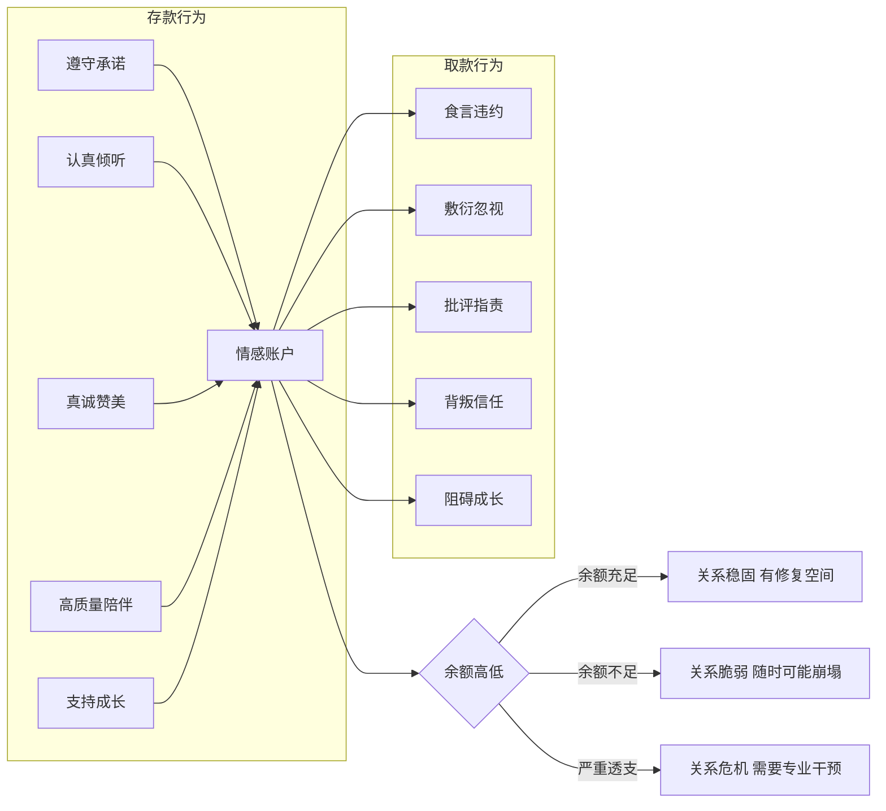

## 三、情感账户：关系中的"存取款"模型

每个人际关系背后都存在一个看不见的"账户"，它不记录金钱，而是记录信任、善意和情感投入的累积量。你和伴侣之间的每一次拥抱、每一次争吵、每一次忽略对方的消息、每一次在关键时刻的陪伴——都在这个账户里留下一笔存入或支取的记录。理解这个账户的运作规律，是掌握情感沟通的第一块基石。

这个模型的力量在于它的普适性：无论你是想改善亲密关系、修复亲子裂痕、经营职场人脉，还是维系一段珍贵的友谊，情感账户的逻辑都同样适用。它将抽象的"关系质量"转化为一个可感知、可操作的动态系统，让你从此有了审视和改善人际关系的"仪表盘"。

### 3.1 什么是情感账户

#### 3.1.1 概念溯源

"情感账户"（Emotional Bank Account，简称EBA）概念由史蒂芬·柯维（Stephen R. Covey）在1989年出版的《高效能人士的七个习惯》中首次系统阐述。柯维用银行账户做类比：**每一次积极的互动都是一笔"存款"，每一次消极的互动都是一笔"取款"。** 账户余额的高低，直接决定了关系的牢固程度和修复能力。

柯维在书中写道："情感银行账户是对人与人之间信任程度的一种比喻。如果我对你的存款很高，那我对你就意味着很大的信任，你自然也会很信任我。"这个比喻之所以经久不衰，是因为它将抽象的"关系质量"转化为一个可感知、可操作的动态模型——你不需要心理学学位就能理解：余额高，关系好；透支了，关系就危险。

值得注意的是，柯维最初主要将这个模型应用于职场领导力和家庭关系，但随后数十年的研究和实践证明，它适用于所有人际关系——从夫妻、亲子、朋友到同事、邻居甚至陌生人之间的短暂互动。

#### 3.1.2 理论根基：为什么这个模型有效

情感账户并非一个孤立的比喻，它与多个成熟的心理学理论形成呼应，获得了坚实的学术支撑：

**社会交换理论（Social Exchange Theory）**——霍曼斯（George Homans，1958）提出，人际关系本质上是一种交换过程，个体会评估关系中的"成本"与"收益"。当收益大于成本时，关系会维持和发展；反之则趋向疏远和终结。蒂博和凯利（Thibaut & Kelley，1959）进一步提出了"比较水平"（Comparison Level）概念——人们会将当前关系的收益与自己预期的基准进行比较。情感账户的存取正是对这种成本-收益动态的直觉化表达。

**信任累积模型**——心理学家约翰·高特曼（John Gottman）在华盛顿大学的"爱情实验室"中，对超过3000对伴侣进行了长达40年的追踪研究。他发现，稳定的关系需要至少5:1的正面互动与负面互动比例。这意味着每一句批评、每一次争吵，都需要至少五次积极互动来"偿付"。这个发现为情感账户的"余额"概念提供了坚实的实证支撑：正面互动的存量必须远远超过负面互动，关系才能健康运转。

高特曼的研究还发现，他可以仅凭观察一对伴侣15分钟的对话，以93.6%的准确率预测他们是否会离婚。预测的核心指标不是争吵的频率，而是负面互动与正面互动的比例——这正是情感账户"余额"的直接体现。

**依恋理论（Attachment Theory）**——鲍尔比（John Bowlby，1969）的研究表明，安全依恋的建立依赖于照顾者持续、可靠的积极回应。玛丽·安斯沃斯（Mary Ainsworth）的"陌生情境"实验进一步证实，早期的互动模式会形成"内部工作模型"（Internal Working Model），影响一个人一生的关系模式。从发展心理学角度看，情感账户的"存款"过程本质上就是在构建安全依恋的基础——而安全依恋的核心，就是"我知道你在那里，我信任你会回应我"。

**神经科学基础**——从脑科学角度看，每一次情感存款都在强化大脑中的"奖赏回路"。积极的社会互动会触发多巴胺（dopamine，带来愉悦感）和催产素（oxytocin，增强信任和连接感）的释放。反复的正面互动会在大脑中形成神经通路，使得"与这个人相处=安全和愉悦"成为一种自动化认知。相反，反复的负面互动会激活杏仁核（amygdala）的威胁反应系统，让大脑将对方标记为"潜在威胁"——这就是为什么关系恶化后，即使对方做出善意举动，你的第一反应仍然是警惕和防御。

**负面偏见（Negativity Bias）**——鲍迈斯特等人（Baumeister et al.，2001）在一篇里程碑式的综述中指出："坏的比好的更强大。"在关系领域，这意味着负面事件对关系评估的影响力大约是正面事件的5倍。一次背叛造成的伤害，需要至少五次真诚的修复才能大致弥补。这为情感账户的非对称性提供了进化心理学解释：我们的大脑对威胁更敏感，因为在远古环境中，忽略危险的代价远大于忽略机会。

#### 3.1.3 存款与取款的全景对照

理解情感账户，首先要识别哪些行为是存款，哪些是取款。以下对照表覆盖了日常关系中的主要场景：

| 维度 | 存款行为 | 取款行为 |
|------|---------|---------|
| **承诺** | 说到做到，按时赴约，不轻易许诺但承诺必兑现 | 食言、临时放鸽子、轻易许诺又做不到、选择性履行承诺 |
| **倾听** | 放下手机，全神贯注，给予回应，记住对方说过的话 | 敷衍点头、打断对方、转移话题到自己身上、左耳进右耳出 |
| **认可** | 真诚赞美，肯定对方的努力和价值，欣赏对方的独特之处 | 批评指责、否定感受、拿对方和别人比较、忽视对方的成就 |
| **尊重** | 尊重对方的边界、习惯和选择，即使不理解也给予空间 | 侵犯隐私、嘲笑弱点、强迫对方改变、不请自来的"建议" |
| **支持** | 在困难时站在对方身边，支持梦想，成为对方的后盾 | 在对方需要时缺席、泼冷水、落井下石、质疑对方的能力 |
| **善意** | 记住重要日子，给予惊喜和温暖，日常小举动传递关怀 | 理所当然不感恩、把对方的付出视为义务、对善意视而不见 |
| **忠诚** | 在背后维护对方、替对方说话、保守秘密 | 在背后议论对方、向第三方抱怨关系问题、泄露对方的隐私 |
| **道歉** | 犯错后主动承认、真诚弥补、用行动证明改变 | 倔强不认错、找借口、把责任推给对方、表面道歉实际辩护 |
| **陪伴** | 高质量的共处时间，专注在场，共同创造体验 | 人在心不在、只顾看手机、总以忙为借口、将陪伴排在末位 |
| **成长** | 支持对方的个人发展，共同学习进步 | 阻碍对方成长、嘲笑对方的追求、要求对方放弃自我 |

### 3.2 情感账户的六大运作规律

情感账户不是一个静态的数字，而是一个有自身运作逻辑的动态系统。掌握以下六条规律，才能真正做到有效管理。

#### 规律一：存款需要持续积累，取款可能一次清零

正面互动像滴水穿石，需要长期、持续的投入才能积累起深厚的余额。但一次严重的背叛——出轨、欺骗、在关键时刻的抛弃——可能瞬间将多年积累的存款清零甚至变为赤字。这不是夸张，而是大脑的保护机制在起作用：当信任被严重破坏时，大脑会重新评估整个关系的安全性，过往的所有正面记忆都会被重新审视。

高特曼的研究将关系中的致命行为称为"末日四骑士"（The Four Horsemen）：

- **批评（Criticism）：** 不是针对具体行为的不满，而是对人格的攻击。"你这次没洗碗"是抱怨，"你从来都不做家务，你就是个懒人"是批评。
- **蔑视（Contempt）：** 传递的信息是"你根本不值得我尊重"——翻白眼、冷嘲热讽、挖苦、人身攻击。蔑视是所有负面行为中破坏力最强的，高特曼发现它是离婚预测的第一指标。
- **防御（Defensiveness）：** 拒绝承担责任，将问题推给对方——"不是我的错"、"你才..."。防御传递的信号是"我不认为你的感受足够重要到让我反思自己"。
- **冷战（Stonewalling）：** 完全关闭沟通——沉默、回避、物理或情感上的消失。冷战通常发生在长期冲突后的情绪过载阶段，但它让另一方感到被彻底抛弃。

其中**蔑视**的破坏力最强——它几乎等于直接注销账户。因为蔑视不仅取款，还摧毁了对方对这段关系的基本价值认同。

**关键洞察：** 不是所有的存款和取款都等值。存在"权重放大效应"——越是触及核心需求（安全感、被尊重、被看见）的行为，其存取款的金额越大。一次公开场合的羞辱（触及"被尊重"核心需求）的取款量，可能相当于数十次日常忽视的总和。

#### 规律二：小额高频存款比偶尔大额存款更有效

关系质量取决于日常的互动模式，而非偶尔的高光时刻。心理学研究反复证实这一点：

- 每天一个拥抱、一句"今天辛苦了"、一个早安吻——这些"微存款"的累积效应远超一年一次的豪华旅行。高特曼的研究发现，幸福的伴侣不是不吵架，而是在日常生活中有大量的正面互动"储备"。
- 高特曼的"转向实验"（Turning Toward Experiment）发现，关系稳定的伴侣在日常生活中对彼此的"情感竞标"（bid for connection）回应率高达86%，而后来离婚的伴侣回应率仅为33%。

所谓"情感竞标"，就是一个人发出的寻求关注和连接的微小信号——"你看这个好有趣"、"今天好累"、"外面下雨了"。回应这些信号（转向对方）就是存款，忽视这些信号（转向远离）就是取款。这些竞标看似微不足道，但日积月累，它们决定了关系的走向。

一个经典的例子：妻子在厨房看到一只漂亮的鸟，对丈夫说"你看那只鸟多漂亮"。这不仅仅是在说鸟——这是一个情感竞标，她在说"我想和你分享这个美好的瞬间"。如果丈夫放下手中的事，走过来和她一起看，那就是一笔存款；如果他头也不抬地说"嗯"，那就是一笔取款。

**实操建议：** 与其计划一次完美的周年庆，不如每天花5分钟做一个小小的存款示意。存款的频率远比金额重要。研究显示，日常微小的正面互动对关系满意度的预测力，远超偶尔的重大积极事件。

#### 规律三：余额足够高时，偶尔取款不会造成危机

这就是"信用额度"——一个余额充足的关系账户，能够承受偶尔的争吵、失误和伤害而不至于崩盘。这就是为什么有些夫妻吵了一辈子仍然在一起（他们有足够的存款储备），而有些情侣一次吵架就分手（账户早已透支）。

高特曼的5:1比例也可以从这个角度理解：如果日常的正面互动与负面互动比例维持在5:1以上，那么偶尔的冲突和取款会被大量的存款所缓冲。关系不需要完美，需要的是正向的积累远超负向的消耗。

但"信用额度"不是无限的。即使余额很高，反复的取款也会逐渐消耗储备。一个常见的错误是认为"我们关系这么好，偶尔发脾气没关系"——如果"偶尔"变成了"频繁"，再高的余额也会被消耗殆尽。没有任何关系可以承受无限制的索取。

**自检方法：** 回想你们最近一次冲突——冲突之后，你们多久恢复到正常状态？如果很快恢复（几小时到一天），说明余额充足；如果冲突的余震持续很久（数天甚至数周），甚至反复被提起，说明账户已经接近警戒线。

#### 规律四：道歉是部分退款，但不能撤销交易

真诚的道歉可以减少取款带来的损害，但无法完全消除。伤害已经造成，信任已经被消耗。这就像在一面墙上钉钉子——即使你把钉子拔出来，洞还在那里。

心理学家将这种现象称为"负面偏见"（Negativity Bias）——人类大脑对负面信息的记忆强度和持续时间远超正面信息。这是进化的结果：在远古环境中，记住哪里有危险（负面信息）比记住哪里有食物（正面信息）更重要，因为前者直接关乎生存。

一项发表在《人格与社会心理学杂志》上的研究表明，负面事件对关系评估的影响力大约是正面事件的5倍。也就是说，你需要5次真诚的正面互动，才能大致抵消1次负面事件的影响。

**这并不意味着道歉没有价值。** 恰恰相反，在发生取款行为后，不道歉比道歉更糟糕——不道歉相当于让取款的损害持续发酵。好的道歉包含三个要素：

1. **承认伤害：** "我知道我那样说让你很受伤"——而不是"如果你觉得受伤了，我很抱歉"（这种"如果你"句式把责任推给了对方的"敏感"）。
2. **承担责任：** "这是我的错，我不该那样做"——而不是"我之所以那样是因为你先..."（这不是道歉，这是反击）。
3. **提出弥补：** "我能做什么来弥补？"——而不是空洞的"我下次不会了"（没有行动支撑的承诺毫无重量）。

**反面案例：** "对不起，但是我当时心情不好"——这是伪装成道歉的辩护。真正的道歉不需要"但是"。

**正面案例：** "我昨天说的那些话太过分了。我知道那些话伤害了你，我非常后悔。我会去处理自己的情绪管理问题，不让同样的事情再发生。你愿意告诉我，你现在最大的感受是什么吗？"

#### 规律五：情感账户存在"利率效应"

当账户余额高时，对方倾向于往好的方向解读你的行为（正向归因偏差）——忘记回电话是"他太忙了"，说话声音大是"他今天心情不好"，买错了东西是"他记错了，但起码在想着我"。

当账户余额低时，对方倾向于往坏的方向解读你的行为（负向归因偏差）——忘记回电话是"他不在乎我"，说话声音大是"他又在冲我发火"，买错了东西是"他根本不了解我"。

同一个行为，在不同的账户余额下，被解读的含义截然相反。这就是心理学中所说的"归因偏差"——我们不是在客观评估行为本身，而是在通过关系的"滤镜"来解读行为。

这就是为什么修复关系如此困难：当账户赤字时，即使你的存款行为是真诚的，对方也可能将其解读为"他在装"、"他别有目的"或"他肯定做了什么亏心事"。你的存款被"负利率"所侵蚀，实际到账金额远小于你存入的金额。

**启示：** 在关系恶化后试图修复时，要有耐心。对方的负向归因偏差需要时间才能逐渐消退。持续、稳定、不求回报的存款行为，是打破这个恶性循环的唯一方法。不要期望一两次努力就能看到效果——你需要的是"持续到账"，直到对方的大脑开始重新评估你这个"账户"的安全性。

#### 规律六：情感账户存在"复利效应"

这是很多人忽略的一个规律：当情感账户保持健康的正余额时，它会产生"复利"——好的关系会变得更好。

具体机制是：高余额带来正向归因偏差，正向归因偏差让正面互动的"实际存入金额"更大，更大的存款又进一步提升余额，形成正向循环。这就是为什么感情好的伴侣会越来越甜蜜——他们的情感账户在"利滚利"。

相反，低余额会带来负向归因偏差，导致存款被"打折"甚至被拒绝，余额进一步下降，形成恶性循环。这就是为什么关系恶化往往呈现"加速度"——不是因为矛盾越来越多，而是因为负利率在加速消耗剩余的信任储备。

**实际意义：** 不要等到关系出现问题才关注情感账户。在关系好的时候持续存款，就是在享受"复利"带来的增长。等到关系恶化再去修复，你面对的是"负利率"的惩罚——同样的存款行为，效果天差地别。

### 3.3 情感账户的高级管理策略

知道了规律，还需要可执行的策略。以下五个策略覆盖了从日常维护到危机修复的完整场景。

#### 策略一：建立"存款习惯系统"

不要依赖灵感或心情来做存款行为，而是将其嵌入日常生活系统。感情好的人不是因为他们更有爱，而是因为他们有存款的习惯。

**每日微存款清单（选择3-5个坚持执行）：**

- 出门前一个拥抱或亲吻（10秒以上才能触发催产素分泌——这是有神经科学依据的，短于10秒的接触不会产生足够的催产素释放）
- 一天中至少发一条关心的消息，内容具体而非泛泛——"今天那个汇报怎么样？"比"今天还好吗？"更有力，因为它传递的信号是"我记得你说过的事，我在乎"
- 回家后先放下手机，给对方10分钟的专注倾听。这10分钟不需要做什么特别的事，只需要"在场"
- 睡前说一句感谢或肯定的话，要具体——"谢谢你今天接孩子"比"你真好"更有效，因为具体的感谢让对方知道自己被"看见"了
- 对方分享日常小事时，放下手里的事给予回应——这是在回应"情感竞标"

**每周中存款清单（选择1-2个执行）：**

- 安排一次不受打扰的约会或深度对话（至少1小时，期间手机静音）
- 为对方做一件超出日常预期的事（做一顿特别的饭、帮对方完成一件拖了很久的事、写一张手写卡片）
- 主动询问对方最近的压力和烦恼，并认真倾听——不急着给建议，只是让对方知道"我看见你的辛苦了"

**每月深层存款（至少1次）：**

- 一次共同的新体验（尝试新餐厅、一起学一个新技能、去一个没去过的地方）——共同的新鲜体验能触发多巴胺释放，强化关系中的愉悦记忆
- 一次"关系回顾"对话——轻松地聊聊"最近我们之间什么让你最开心""有没有什么我可以做得更好的"

#### 策略二：学会"精准存款"

不同的人对同一种存款行为的"面值"不同。查普曼（Gary Chapman）在《爱的五种语言》中指出，人们感受爱的方式主要有五种。用对方的语言存款，效率最高。

| 爱的语言 | 核心需求 | 高价值存款行为 | 低价值存款行为 |
|---------|---------|--------------|--------------|
| **肯定的言辞** | 被口头认可和鼓励 | 具体的赞美、鼓励的留言、在他人面前肯定、手写信 | 沉默寡言、批评多于赞美、轻描淡写对方的成就 |
| **服务的行动** | 被实际行动照顾 | 做家务、帮忙解决问题、主动分担、记住对方需要什么 | 只说不做、承诺帮忙又忘记、口头关心没有行动 |
| **接受礼物** | 被用心记挂 | 精心挑选的礼物、记录对方喜好、在特别日子准备惊喜 | 从不送礼物、忘记重要日子、敷衍送礼 |
| **高质量的陪伴** | 被全然关注 | 专注的共处时间、共同的活动、深度对话 | 人在心不在、总看手机、陪伴时心不在焉 |
| **身体的接触** | 被物理连接 | 拥抱、牵手、亲密的身体接触、拍肩、抚摸头发 | 回避身体接触、保持距离、对触碰无反应 |

**关键行动：** 观察你的伴侣/朋友/家人最看重哪种语言。具体方法：

1. **反向指标法：** 看他们最常抱怨什么。抱怨"你从来不帮我做事"→服务的行动；抱怨"你都不夸我"→肯定的言辞；抱怨"你都不陪我"→高质量的陪伴。抱怨本身就是告诉你"这里需要存款"。
2. **表达观察法：** 看他们最常为别人做什么。人们倾向于用自己喜欢的方式表达爱——经常送你小礼物的人，可能最需要的也是"接受礼物"；经常夸你的人，可能最需要"肯定的言辞"。
3. **直接询问法：** 问对方"我做什么事会让你感觉最被爱？"这个问题本身就是一个高价值存款——它传递了"我愿意用你需要的方式来爱你"。

**真实场景说明：** 一个"肯定言辞型"的人可能因为一句真心的赞美而感动万分，但一个"服务行动型"的人可能觉得"光说有什么用，帮我把碗洗了才是真的"。不是后者不知感恩，而是他的"接收频率"不同。用对方的频率存款，信号才能被准确接收。

#### 策略三：警惕"隐性取款"陷阱

最危险的取款行为，往往是那些你根本没意识到的行为。这些隐性取款每次金额不大，但频率高、持续时间长，累积效果惊人。

**隐性取款行为清单及改进方案：**

- **选择性倾听：** 听到对方说话，但只关注自己感兴趣的部分，其余的自动过滤。对方能感受到这种不被完整接收的体验。**改进：** 当对方说话时，练习"复述确认"——"你的意思是...对吗？"这不仅确保你真的在听，还让对方感到被认真对待。

- **习惯性打断：** 在对方还没说完时就插话——不管是补充、纠正还是接话——都传递了一个信号："我说的比你说的重要。"**改进：** 默数3秒再回应。如果你发现自己总想打断，说明你需要练习"倾听者的耐心"。

- **条件反射式否定：** 对方提出一个想法，你的第一反应是"但是..."或"那样不行..."。即使你后来同意了，这个第一反应已经造成了一次小额取款。**改进：** 把"但是"换成"而且"。"这个想法不错，而且我们可以再想想..."——语义相近，但情感信号完全不同。

- **注意力掠夺：** 对方在跟你分享一件重要的事，你的手指在无意识地划手机。这种"人在心不在"的体验比缺席更伤人——因为你在场，所以对方的期待被辜负了。**改进：** 当对方开始说话时，物理性地放下手机（而不是翻过来扣在桌上），面朝对方，做出"我准备好了"的姿态。

- **玩笑过度：** 在朋友面前拿对方的缺点或糗事开玩笑，虽然你可能觉得无伤大雅，但对方感受到的是被出卖和不被保护。**改进：** 有一个简单的测试——这个玩笑如果对方在场，你敢不敢说？如果不敢，就不要在背后说。

- **情绪转嫁：** 工作中受了气，回家后对家人态度变差。对方并没有做错什么，却承受了你的情绪代价。**改进：** 在进门之前做一个"情绪切换仪式"——在车里坐5分钟、听一首歌、做三次深呼吸——把工作的压力留在门外。如果实在做不到，至少告诉对方："今天工作上有些不顺，不是因为你，我需要一点时间调整。"

- **比较型"激励"：** "你看人家XXX..."——即使出发点是好的，这种比较本身就是在对方的自我价值上取款。它传递的信息是"你不够好"。**改进：** 把比较变成具体的需求——与其说"你看人家天天锻炼"，不如说"我们一起去散步吧"。

- **缺席重要时刻：** 对方的毕业典礼、重要比赛、亲人的葬礼——这些关键时刻的缺席，取款量远超你的想象。因为在这些时刻，对方最需要的是"你在那里"的信号。**改进：** 把对方的重要日期标记在日历上，提前安排，确保在场。

**每日自检法：** 每天睡前花2分钟回顾当天的互动，问自己："今天我有没有无意中做了一些让对方不舒服的事？"这种自我觉察本身就是防止隐性取款的第一步。不需要完美，只需要越来越敏锐。

#### 策略四：账户赤字时的修复方案

当关系已经出现赤字——对方明显冷淡、回避、充满敌意——需要专门的修复策略，而不是简单的"多做存款"。在赤字状态下，常规的存款行为可能被误解或拒绝，你需要更有策略地行动。

**修复五步法：**

**第一步：暂停取款（止损）。** 在修复期间，严格控制自己的行为，避免任何可能造成进一步伤害的言行。这不是"装"，而是在伤口还在流血时先止血。如果你一边道歉一边继续犯同样的错误，对方会得出结论："他根本不在乎。"

**第二步：低压力存款。** 在账户赤字时，大的亲密举动反而可能让对方警觉和抗拒——因为对方的"信任雷达"处于高度敏感状态。从低压力、不求回报的小行为开始——帮忙做一件小事、留一杯水、简短的关心问候。不期待回应，不要求对方马上改变态度。关键在于：这些行为必须是"无条件"的，不能让对方感到有"回报义务"。

**第三步：倾听与确认。** 找一个合适的时机，真诚地询问对方的感受，并且只听不辩。核心句式："我知道这段时间我做得不好，我想听听你真实的感受。"当对方表达时，克制住解释和辩护的冲动——这是最难的一步，但也是最重要的一步。只需要倾听和确认："我理解你的感受，换作是我也会这样。"

**第四步：一致性的长期行动。** 信任的重建没有捷径。你需要用持续数周甚至数月的一致性行为来证明改变是真实的，而不是一时的策略。对方的负向归因偏差需要时间消退——在初期，你的存款行为可能被怀疑动机；但只要坚持下去，归因偏差会逐渐松动。关键指标：对方开始主动跟你说话、分享日常小事、偶尔对你笑——这些都是余额开始回升的信号。

**第五步：共同建立新规则。** 当关系开始回暖后，不要假装什么都没发生过。找个轻松的时机，和对方一起讨论："以后遇到类似的情况，我们怎么处理会更好？"这是在建立"关系协议"——一种预防未来同类取款的机制。

**修复中的常见错误：**

- **急于求成：** "我都道歉了你怎么还不原谅我？"——修复需要时间，急躁本身就是一种取款。
- **反复道歉不改变：** 对方需要看到的是行动的变化，不是语言的重复。
- **用礼物代替改变：** 买一个贵重礼物不能替代实质性的行为改变。礼物可以是修复的一部分，但不能是全部。
- **要求对方"翻篇"：** "过去的事就不要再提了"——在对方的情感创伤没有完全愈合之前，这句话等于在说"你的感受不重要"。

#### 策略五：建立"关系协议"预防取款

最好的情感账户管理不是事后修复，而是事前预防。"关系协议"是指双方共同约定的互动规则，它是一种"预防性存款"机制。

**如何建立关系协议：**

1. **选择合适的时机：** 在关系状态良好时讨论，而不是在冲突中提出。因为冲突中提出"规则"会被视为"你在给我下命令"。
2. **用"我"句式表达需求：** "我希望在我们意见不一致的时候，我们能先冷静5分钟再讨论"——而不是"你不要那么冲动"。
3. **从小事开始：** 不要试图一次性建立一整套规则。先从一个最痛的点开始——比如"争吵时不说分手/离婚"。
4. **定期回顾：** 每隔一段时间（比如一个月）轻松地聊聊"我们的协议执行得怎么样"。

**常见协议示例：**

- "争吵时不说人身攻击的话"
- "任何一方说'我需要暂停'时，给对方10分钟冷静时间"
- "不在公开场合批评对方"
- "涉及金额超过X元的消费提前商量"
- "每周至少有一个晚上是只属于我们的时间"

### 3.4 不同关系场景中的情感账户

情感账户模型适用于所有人际关系，但在不同场景中，存取款的规则和权重有所不同。

#### 3.4.1 亲密关系中的情感账户

亲密关系中的情感账户最为敏感，因为投入最多、期待最高、暴露最深。你把自己最脆弱的部分展现在对方面前，这种暴露既是最高级别的信任表达，也意味着最大的被伤害风险。

**特殊规则：**

- **身体亲密是重要存款源。** 长期缺乏身体接触（拥抱、亲吻、性亲密）会被持续解读为取款。高特曼的研究发现，幸福的伴侣每天有至少6秒以上的拥抱（他称之为"6秒亲吻"），而不幸的伴侣几乎完全缺乏身体接触。身体接触是最原始的安全信号——它直接触发催产素释放，降低皮质醇（压力激素）水平。
- **冲突处理方式的权重极高。** 如何吵架比吵不吵更重要。高特曼的研究表明，决定关系成败的不是是否发生冲突，而是冲突中是否仍保持尊重。建设性的冲突（对事不对人、愿意倾听、寻找共识）实际上是存款——因为它传递了"这段关系对我来说足够重要，我愿意花精力来解决问题"的信号。
- **共同叙事是隐形资产。** 两个人共同拥有的回忆、故事和"内部梗"构成了关系的深层储备。心理学研究称之为"共同意义系统"（Shared Meaning System）。定期创造新的共同体验，是对这个隐形账户的持续投资。这也是为什么异地恋特别消耗——共同体验的减少直接削弱了这个隐形账户。
- **性生活是特殊存款。** 在亲密关系中，性不仅仅是生理需求的满足，更是情感连接的重要方式。长期回避或敷衍的性生活会被解读为"你不再被我吸引"，造成持续的隐性取款。健康的做法是坦诚沟通彼此的需求和期待，而不是回避这个话题。
- **个人空间也是存款。** 这听起来矛盾，但尊重对方的个人空间和独处需求，实际上是一种高质量存款——它传递的信号是"我信任你，我不需要通过控制你来确认这段关系"。

#### 3.4.2 亲子关系中的情感账户

亲子关系中的情感账户有其特殊性——孩子的依赖性和可塑性使得每一次存款和取款的影响都被放大。更重要的是，父母与孩子的情感账户是孩子未来所有人际关系的"模板"——它会深刻影响孩子成年后的依恋风格和关系模式。

**特殊规则：**

- **安全存款是第一位。** 对孩子来说，"你安全、我在这里"的信号是最基础的存款。在此之上，才能讨论教育和要求。安全存款包括：在孩子害怕时给予安慰而不是嘲笑"这有什么好怕的"；在孩子犯错后仍然给予爱的确认"我批评的是你的行为，不是你这个人"；在孩子面对新环境时成为他的安全基地。
- **批评的取款系数更高。** 孩子的自我认知正在形成中，来自父母的否定会被内化为"我不好"的核心信念。一次严厉的批评可能需要十次肯定才能修复。更糟糕的是，孩子不会认为"爸妈今天心情不好"——他们认为"我不够好"。这个核心信念可能跟随他们一生。
- **高质量陪伴的标准不同。** 对孩子来说，"高质量"不是去昂贵的地方，而是全身心在场——蹲下来和他平视、认真听他讲那些"无聊"的事、一起做他想做的事。研究表明，每天15分钟的"特殊时间"（由孩子选择活动，父母全身心参与）对亲子关系的改善效果，远超周末花大钱去游乐园。
- **青春期需要"降频升质"。** 青春期的孩子表面上在推开父母，实际上仍然需要情感连接，只是方式变了。存款方式从"拥抱和陪伴"转变为"尊重和信任"——尊重他的隐私、信任他的判断、在他需要时提供支持而不是指导。这个阶段最大的取款是"入侵"——偷看日记、追问细节、未经允许进入他的空间。
- **成年后的关系需要"重新开户"。** 孩子成年后，亲子关系的本质发生变化——从依赖关系转变为平等关系。父母需要"重新开户"，用成年人的方式来存款：尊重对方的独立决策、接受对方的生活方式、将建议作为"参考"而非"指导"来提供。

#### 3.4.3 朋友关系中的情感账户

朋友关系中的情感账户常常被忽视，但它对个人的幸福感和社会支持系统至关重要。研究显示，拥有高质量友谊的人在面对压力时的恢复速度更快，寿命也更长。

**特殊规则：**

- **"关键时刻到场"是最大存款。** 在朋友搬家、生病、失恋、亲人去世时出现——这些时刻的一次到场，存款值可能相当于平时的数十次聚会。相反，在这些时刻的缺席（尤其是有空但选择不来），取款量也非常大。
- **"记得"是高效存款。** 记住朋友随口提到的事——他家猫咪的名字、他正在追的剧、他孩子的年龄——并在下次聊天时提起。这种存款传递的信号是"你对我来说不是可有可无的"。
- **"朋友圈规则"：** 不在A面前说B的坏话。如果你在一个人面前说另一个人的坏话，听的人会想："他会不会也在别人面前说我的坏话？"这是一笔同时向两个账户取款的行为。
- **频率衰减效应：** 与亲密关系不同，朋友之间的情感账户存在"频率衰减"——长时间不联系会让余额自然降低。这不是因为对方不珍惜你，而是大脑会自然地将不常互动的人归入"远关系"类别。定期的主动联系是对友谊账户的"维护性存款"。
- **借钱是高风险取款操作。** 金钱在友谊中的角色非常微妙——借钱不还是直接取款，借了钱总是提醒对方还也是取款。最好的做法是：借出去的钱就当是送的，如果还了就当是惊喜；如果金额大到自己承受不了，就不要借。

#### 3.4.4 职场关系中的情感账户

职场中的情感账户更为复杂，因为它涉及权力不对等、利益竞争和多重关系交织。

**特殊规则：**

- **专业能力是基础存款。** 在职场中，按时交付、专业可靠是最大的存款行为。在此基础上的友善才有价值——没有专业基础的"好人缘"会被视为不务正业。反过来说，专业能力强但态度恶劣的人，也会因为持续的隐性取款而失去合作机会。
- **公开认可比私下表扬的存款值更高。** 在会议上肯定同事的贡献，在邮件中CC对方的上级——这些公开的认可行为，存款值远高于私下说一句"做得好"。因为公开认可不仅满足了"被看见"的需求，还增加了对方的职场社会资本。
- **越级、甩锅、抢功是毁灭性取款。** 这些行为触及职场中最敏感的信任底线，一次就可能让账户归零。因为在职场中，信任是高度可传递的——你的行为不仅影响当事人的账户，还会影响所有旁观者对你的评估。
- **上下级关系的特殊性：** 对上级来说，最大的存款是"让人省心"——主动汇报进展、预见问题并提出方案、在关键时刻能靠得住。对下级来说，最大的存款是"被看见"——认可他的贡献、关心他的成长、在更高层面前维护他的利益。
- **"第三方存款"效应：** 在A面前表扬B（当B不在场时），这些话通常会传到B耳中，产生额外的存款效果。这是因为在背后说好话比当面赞美更有说服力——它传递的信号是"我对你的评价是一致的，不是当面客套"。

#### 3.4.5 社交网络中的情感账户

在数字化时代，大量人际关系通过微信、朋友圈、社交媒体来维护。这个新场景有其独特的存取款规则。

**特殊规则：**

- **"秒回"是过度存款的陷阱。** 总是秒回消息会让对方形成不合理的期待，一旦你没有秒回，就会被解读为取款。健康的做法是：在合理时间内回复（几小时内），但不要建立"永远在线"的期待。
- **"点赞"是最低面额的存款。** 给对方的朋友圈点赞，存款面额极小——它传递的信号是"我看到了"，但远不如一条真诚的评论。如果你只点赞从不评论，对方会认为你只是在"刷存在感"。
- **"已读不回"是明确的取款。** 在微信中，对方知道你看到了消息却不回复，这种"被忽视"的感觉比不发消息更糟糕。如果你当下不方便回复，一个简单的"现在忙，稍后回你"就能避免取款。
- **朋友圈的"选择性可见"是隐性取款。** 如果对方发现你发了一条朋友圈但设置了"对他不可见"，这会直接损害信任——它传递的信号是"我在你面前有所隐瞒"。
- **不要用朋友圈替代直接沟通。** 有些人通过发朋友圈来暗示自己的心情或对某人的不满——"有些人真让人失望"。这种间接沟通是高风险取款——它不仅没有解决问题，还增加了不确定性和猜疑。

### 3.5 情感账户管理的常见误区与纠正

#### 误区一："我已经存了很多款，偶尔取一次没关系"

**问题所在：** 这种心态将情感账户当作"积分兑换"——积累了足够的积分就可以"兑换"一次伤害。但关系不是忠诚度计划，你不能用过去的善意来"购买"伤害对方的权利。而且，前面已经讲过"负面偏见"——取款的破坏力是存款的5倍，所以"偶尔一次"的代价远比你以为的大。

**纠正：** 存款的目的是建立深厚的连接，而不是积累"犯错许可证"。每次取款都会真实地消耗余额，不会因为过去的存款多就自动免疫。正确的理解是：高余额能让你承受偶尔的失误，但不能成为你故意伤害的资本。

#### 误区二："我不需要说出来，对方应该感受到"

**问题所在：** 很多人认为自己的善意和付出"不言自明"。但研究表明，未被表达的善意对关系的正面影响极其有限——因为对方没有接收到这个信号，存款就没有实际到账。你默默为对方做了十件事，如果对方不知道，那这十件事在情感账户里的记录就是零。

**纠正：** 表达本身就是存款行为的一部分。不一定要长篇大论，但至少让对方知道你在想他、在乎他。"我看到这个想到你"、"今天一直在想你说的那件事"——这些小小的表达，就是确认存款到账的"回执"。关键不在于表演，而在于让善意"到达"。

#### 误区三："等出了问题再修复就好"

**问题所在：** 这种"消防员心态"只关注事后修复，忽视了日常维护。等到问题爆发时，账户往往已经严重透支，修复的难度和代价远超日常维护。而且，到了危机阶段，对方的负向归因偏差已经形成，你的每一个修复动作都要打折扣。

**纠正：** 情感账户管理的核心是预防而非治疗。每天花5分钟做一件小事，远比关系破裂后花5个月修复要容易。这就像健康管理——每天运动30分钟远比生了大病再去治疗要划算。

#### 误区四："存款越多越好，多多益善"

**问题所在：** 有些人走向另一个极端——过度付出、过度关心、没有边界地满足对方。这种"过度存款"会让对方感到窒息和压力，甚至产生负债感，反而变成了变相的取款。心理学上称之为"过度补偿"——它往往源于自己的不安全感，而非对方的真实需要。

**纠正：** 健康的情感账户管理需要平衡——既不过度索取，也不过度给予。好的存款行为是对方需要的方式、合适的频率、真诚的动机，而不是自我感动式的单方面输出。判断标准很简单：你的付出是让对方感到温暖，还是让对方感到压力？如果对方总说"你不用这样"、"太麻烦了"、"不用管我"，你可能已经过度存款了。

#### 误区五："对方不给我存款，我为什么要给他存"

**问题所在：** 这种"对等交换"心态将情感账户变成了博弈——"你存我才存，你不存我也不存"。但这种等待和计较本身就是一种持续的取款，最终导致双方都不存款，账户加速归零。这是一个典型的"囚徒困境"——双方都选择"不合作"的结果，比双方都"合作"的结果要差得多。

**纠正：** 在健康的关系中，存款是自愿的给予，而非有条件的交换。当然，如果你发现自己长期单方面存款而对方毫无回应，那需要重新评估这段关系是否值得继续投入——但主动存款的习惯本身不应该取决于对方的行为。你存款是因为你想成为什么样的人，而不仅仅是想从对方那里得到什么。

#### 误区六："用同一种方式对所有人都好就行"

**问题所在：** 有些人有一种"标准存款模式"——对伴侣、孩子、朋友、同事都用同样的方式表达善意。但正如"爱的五种语言"所揭示的，不同的人接收存款的"频率"不同。你用"服务的行动"去存款，但对方的接收频率是"肯定的言辞"——你的存款就变成了"无效交易"。

**纠正：** 存款要"看人下菜"。花时间了解你关系中的每个人最看重什么，然后用他们需要的方式去存款。这不是功利，而是尊重——尊重每个人的独特性。

### 3.6 情感账户自测工具

定期评估你的重要关系中情感账户的状态。建议每1-2个月做一次，选择你最在意的几段关系分别评估。

**对每一段重要关系，打分1-5分（1=完全不符合，5=完全符合）：**

| 序号 | 评估维度 | 打分 |
|-----|---------|------|
| 1 | 我们之间有话可以直说，不需要拐弯抹角 | __ |
| 2 | 对方犯了小错，我会自然往好的方向理解 | __ |
| 3 | 我感到在这段关系中被看见、被尊重 | __ |
| 4 | 我们能建设性地处理分歧，不会翻旧账 | __ |
| 5 | 对方会主动关心我的感受和需要 | __ |
| 6 | 我信任对方会在我背后维护我 | __ |
| 7 | 我们有共同的美好回忆和期待 | __ |
| 8 | 发生冲突后，我们能较快恢复正常 | __ |
| 9 | 对方记得对我来说重要的事 | __ |
| 10 | 我对这段关系的未来感到乐观 | __ |
| 11 | 我们之间有独特的"内部梗"和默契 | __ |
| 12 | 在对方需要时，我会主动放下手头的事去支持 | __ |

**解读：**

- **48-60分：** 账户余额充裕，关系健康稳固。继续保持日常存款习惯，享受"复利"带来的增长。这个阶段的重点是维持而非放松——很多人在关系最好的时候忽略了持续存款，导致余额逐渐下降。
- **36-47分：** 余额尚可，但有隐忧。识别薄弱维度（哪个问题得分最低），针对性加强存款。重点关注是否有隐性取款行为在持续消耗余额。
- **24-35分：** 余额偏低，需要引起重视。回顾近期是否有未察觉的隐性取款或重大取款事件，主动开展修复对话。建议从"低压力存款"开始，逐步重建信任。
- **12-23分：** 账户已严重透支。需要认真评估关系现状，考虑是否需要专业帮助（如伴侣咨询、家庭治疗）来重建信任基础。在这个阶段，最重要的是先止损——停止进一步的取款行为——然后再考虑修复策略。

**使用建议：** 如果方便的话，可以邀请对方也做一次评估。对比双方的评分，往往能揭示关系中的"信息差"——你以为关系很好的地方，对方可能有不同的感受。这种差异本身就是宝贵的沟通起点。

### 3.7 从理论到行动：7天情感账户启动计划

知道了所有理论和策略，最重要的是开始行动。以下是一个简单的7天启动计划，帮你将情感账户管理变成习惯：

| 天数 | 行动 | 目的 |
|-----|------|------|
| 第1天 | 做一次情感账户自测，选择最重要的一段关系评估 | 建立基线认知 |
| 第2天 | 观察并记录对方的"爱的语言"（观察法：看对方最常抱怨什么、最常为别人做什么） | 了解存款的正确"频率" |
| 第3天 | 做3件具体的微存款（参照每日微存款清单） | 开始行动 |
| 第4天 | 做一次隐性取款自查——回顾最近一周有没有无意识的取款行为 | 减少隐性取款 |
| 第5天 | 回应对方的每一个"情感竞标"（每当对方说话时，放下手头的事回应） | 练习"转向" |
| 第6天 | 做一件超出日常预期的存款行为 | 刷新对方的预期 |
| 第7天 | 和对方轻松聊聊"最近我们之间什么让你最开心" | 开启关系对话 |

**后续维护：** 7天之后，保持每日微存款的习惯（选择3-5个坚持），每周做一次隐性取款自查，每月做一次情感账户自测。不需要完美执行，只需要持续存在。情感账户的管理不是一个"项目"，而是一种"生活方式"。

### 3.8 小结

情感账户模型的核心洞察可以浓缩为三个要点：

1. **关系质量是累积的。** 每一次互动都在记录，没有"无所谓的"互动。理解了这一点，你就会对日常的每一次交流更加上心。
2. **频率大于金额。** 日常的微小存款比偶尔的大额存款更有效。感情的维护不在于"关键时刻的爆发"，而在于"平凡日子里的坚持"。
3. **管理需要觉知。** 大多数关系的恶化不是因为一次重大事件，而是因为无数的隐性取款在不知不觉中消耗了余额。提升自我觉察，识别并减少隐性取款，是情感账户管理的第一步。

正如柯维所说："信任是所有关系的基础。而信任不是一天建立的，它是一笔一笔存款积累的结果。"从今天开始，有意识地管理你的情感账户——你会发现，关系的变化比你想象的要快得多。
