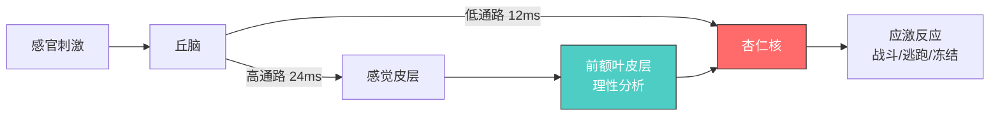
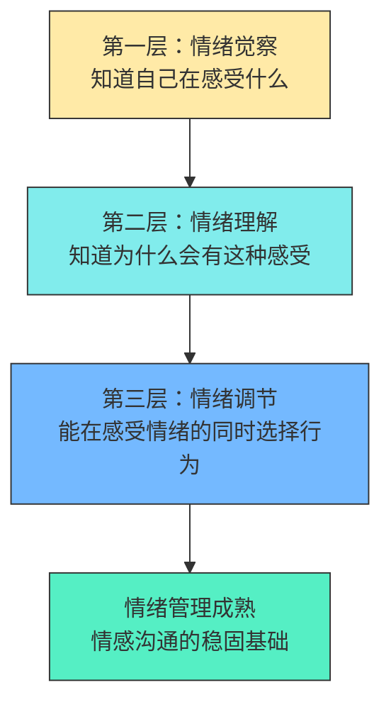
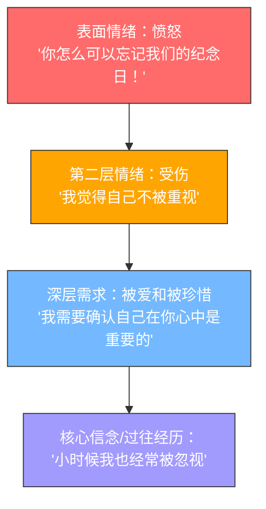
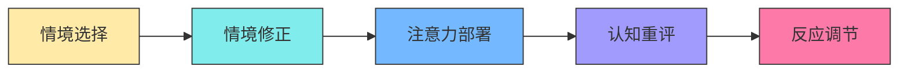

## 四、情绪管理：情感沟通的底层能力

情感沟通的所有技巧——倾听、共情、自我表露、冲突化解——都建立在一个前提之上：**你能够感知、理解并调节自己的情绪**。一个被情绪淹没的人，既听不进对方的话，也无法准确表达自己的需求。情绪管理不是压制情感，而是在感受情感的同时保持选择行为的能力。

本章将从神经科学机制出发，系统讲解情绪觉察、情绪理解和情绪调节的完整能力体系，并将这些能力落地到亲密关系、职场、亲子沟通和数字时代的真实场景中。这不仅是一套理论框架，更是一份可执行的训练手册。

### 4.1 情绪管理为什么是情感沟通的基础

#### 4.1.1 杏仁核劫持：情绪如何"关闭"理性

神经科学家约瑟夫·勒杜（Joseph LeDoux）在《情绪大脑》（*The Emotional Brain*, 1996）中揭示了情绪加工的双通路机制。当感官信息进入大脑时，存在两条通路：

- **低通路（快速通路）**：感觉信号经丘脑直接传至杏仁核，耗时约12毫秒，速度极快但粗糙——它只做"安全/危险"的粗略判断
- **高通路（慢速通路）**：感觉信号经丘脑传至感觉皮层进行精细分析，再传至杏仁核，耗时约24毫秒，更准确但更慢

当低通路判断为"危险"时，杏仁核会在高通路完成分析之前就启动应激反应。这就是丹尼尔·戈尔曼（Daniel Goleman）在《情商》（*Emotional Intelligence*, 1995）中所描述的**"杏仁核劫持"（Amygdala Hijack）**：强烈情绪绕过理性脑，直接驱动行为。

在情感沟通中，杏仁核劫持的典型表现：

| 触发场景 | 杏仁核劫持的反应 | 理性状态下的反应 |
|---------|----------------|----------------|
| 伴侣说"你从来都不关心我" | 立即反驳"我怎么不关心了！"并列举证据 | 感受到对方的受伤，询问"你最近是不是觉得被忽略了？" |
| 同事在会上质疑你的方案 | 脸红心跳，语气变冲，甚至拍桌子 | 克制防御冲动，询问对方的具体顾虑 |
| 朋友突然取消约定 | 感到被背叛，发一条愤怒的语音 | 感到失望，但先了解原因再做回应 |
| 孩子把新买的玩具弄坏了 | 大声训斥"你怎么这么不懂事！" | 深呼一口气，先确认孩子有没有受伤 |

**关键认知**：杏仁核劫持不是性格缺陷，而是进化遗留的生存机制。在远古环境中，快速的"战或逃"反应意味着生与死的差别。但在现代社交场景中，这个机制经常过度激活——你的大脑把伴侣的抱怨当作了和猛兽同等级别的威胁。你无法消除它，但可以通过训练缩短它的持续时间——从几小时缩短到几分钟，甚至几秒钟。

#### 4.1.2 情绪调节的生理基础

自主神经系统（ANS）由交感神经和副交感神经组成，它们分别负责"战斗或逃跑"和"休息与消化"。情绪调节的核心就是**有意识地激活副交感神经系统**，让身体从应激状态恢复到平衡状态。

**心率变异性（HRV）——情绪调节能力的"生理仪表盘"**

心率变异性（Heart Rate Variability）是衡量情绪调节能力的重要生理指标。HRV不是指心率本身，而是指心跳间隔时间的微小变化——健康的心脏并不是像节拍器一样均匀跳动，而是每次跳动之间有几十毫秒的波动。

- **HRV高**：交感与副交感神经之间切换灵活，情绪恢复能力强，在压力下能快速冷静
- **HRV低**：容易陷入某种情绪状态难以自拔，应激后恢复缓慢，长期与焦虑、抑郁风险相关

哈佛大学赫伯特·本森（Herbert Benson）的"松弛反应"研究和后续多项meta分析（Zaccaro et al., 2018, *Frontiers in Human Neuroscience*）证实，以下方法可以有效提高HRV：

| 训练方法 | 每日建议时长 | 见效周期 | 核心机制 |
|---------|------------|---------|---------|
| 正念冥想 | 10-20分钟 | 4-8周 | 增强前额叶对杏仁核的调控 |
| 腹式呼吸（尤其呼气>吸气） | 5-10分钟 | 即时+长期 | 直接刺激迷走神经，激活副交感 |
| 有氧运动 | 30分钟 | 2-4周 | 提升心肺功能，增强自主神经弹性 |
| 冷水浸泡/冷水洗脸 | 1-3分钟 | 即时 | 激活潜水反射，迅速降低心率 |
| 社会连接（拥抱、亲密对话） | 不定 | 即时 | 催产素释放，降低皮质醇水平 |

#### 4.1.3 情绪管理能力的三个层次

情绪管理不是单一技能，而是一个由低到高的能力体系：

每一层都是下一层的基础。你无法调节你没有觉察到的情绪，也无法理解你没有识别出的情绪。很多人试图跳过觉察和理解，直接"控制情绪"，结果要么是压抑（情绪并未消失，只是被藏起来），要么是失控（压抑到极限后突然爆发）。

#### 4.1.4 情绪的社会性：你不是一个人在"感受"

情绪从来不是纯粹的个体现象。神经科学的两项发现彻底改变了我们对情绪的理解：

**镜像神经元（Mirror Neurons）**：意大利帕尔马大学的贾科莫·里佐拉蒂（Giacomo Rizzolatti）团队在1996年发现，当我们观察他人的行为和表情时，大脑中与执行该行为相同的区域会被激活。也就是说，你看到别人皱眉，你大脑中"皱眉"的区域也会微微激活——你不是在"推测"对方不高兴，而是在"体验"一个低强度版本的不高兴。

**情绪传染（Emotional Contagion）**：耶鲁大学的伊莱恩·哈特菲尔德（Elaine Hatfield）研究发现，人类会自动、无意识地模仿周围人的面部表情、声调和姿势，并由此"感染"对方的情绪。这就是为什么和一个焦虑的人待久了你也会莫名焦虑，而和一个开朗的人聊天你会变得轻松。

在情感沟通中，情绪传染意味着：**你的情绪状态会直接影响对方的情绪状态**。一个焦虑的父母会养出焦虑的孩子，一个愤怒的伴侣会让整个家庭充满紧张。反过来，一个能稳定自己情绪的人，实际上是在为周围的人提供"情绪锚点"——这就是心理学家丹尼尔·西格尔（Daniel Siegel）所说的"共同调节"（Co-regulation）。

### 4.2 情绪觉察：知道自己在感受什么

情绪觉察（Emotional Awareness）是情绪管理的起点。研究表明，大多数人的情绪词汇量极其有限——只能识别出"开心""不开心""生气""害怕"几种基本状态，对更细腻的情绪缺乏辨识能力。

#### 4.2.1 情绪粒度：为什么"精细"比"准确"更重要

心理学家丽莎·费尔德曼·巴瑞特（Lisa Feldman Barrett）在其著作《情绪是如何产生的》（*How Emotions Are Made*, 2017）中提出了**"情绪粒度"（Emotional Granularity）**的概念：能够以精细、具体的方式识别和标记情绪状态的能力。

高情绪粒度的人不是笼统地感到"不爽"，而是能区分：

- **"失望"** vs **"沮丧"**：失望是对期望落空的反应，指向"结果不如预期"；沮丧是对反复受挫的反应，指向"努力没有回报"
- **"嫉妒"** vs **"羡慕"**：嫉妒包含"害怕失去已有之物"的成分（"我怕你被她抢走"），羡慕是纯粹的"我也想要那个东西"
- **"委屈"** vs **"冤枉"**：委屈是"我付出了却没被看见"，冤枉是"我没做的事被栽到我头上"
- **"焦虑"** vs **"恐惧"**：焦虑指向不确定的未来（"万一出事怎么办"），恐惧指向具体的威胁（"那条狗在追我"）
- **"烦躁"** vs **"愤怒"**：烦躁是低强度的不满，通常由琐碎事情引起；愤怒是对边界被侵犯的强烈反应
- **"孤独"** vs **"寂寞"**：孤独是"身边没有人"的客观状态；寂寞是"心里觉得空"的主观感受——你可以在人群中依然寂寞

为什么情绪粒度重要？巴瑞特的研究发现，高情绪粒度的人能更准确地选择应对策略。因为不同的情绪需要不同的处理方式——应对"失望"需要调整期望，应对"沮丧"需要改变方法，应对"嫉妒"需要审视内心需求。如果把所有负面情绪都笼统地归为"不开心"，就找不到正确的应对方式。

一项发表在《心理科学》（*Psychological Science*）上的纵向研究（Kashdan et al., 2015）追踪了300多名被试，发现情绪粒度高的人在经历高压力生活事件后，出现严重情绪问题的概率显著更低。情绪粒度不是"锦上添花"的修辞能力，而是一种实打实的心理保护因素。

#### 4.2.2 普拉奇克情绪轮：八种基本情绪的复合结构

心理学家罗伯特·普拉奇克（Robert Plutchik）提出的**"情绪轮"（Wheel of Emotions）**是理解情绪结构的经典模型。他将人类的基本情绪分为八种，并按强度和组合关系组织：

| 基本情绪 | 强度：温和 | 强度：中等 | 强度：强烈 | 对立情绪 |
|---------|-----------|-----------|-----------|---------|
| 快乐 | 宁静 | 欢乐 | 狂喜 | 悲伤 |
| 信任 | 接纳 | 喜爱 | 钦佩 | 厌恶 |
| 恐惧 | 忧虑 | 害怕 | 惊恐 | 愤怒 |
| 惊讶 | 意外 | 惊讶 | 震惊 | 期待 |
| 悲伤 | 忧郁 | 悲伤 | 悲痛 | 快乐 |
| 厌恶 | 无聊 | 反感 | 憎恶 | 信任 |
| 愤怒 | 烦躁 | 愤怒 | 狂怒 | 恐惧 |
| 期待 | 关注 | 兴趣 | 期待 | 惊讶 |

相邻的基本情绪可以组合为复合情绪：

| 组合 | 复合情绪 | 生活实例 |
|------|---------|---------|
| 快乐 + 信任 | **爱** | 对伴侣的依恋和亲密感 |
| 恐惧 + 惊讶 | **敬畏** | 站在大自然壮景前的震撼 |
| 悲伤 + 厌恶 | **悔恨** | 回忆起自己当初的错误决定 |
| 愤怒 + 厌恶 | **轻蔑** | 对不公正行为的鄙视 |
| 快乐 + 期待 | **乐观** | 对即将到来的旅行的兴奋 |
| 恐惧 + 期待 | **焦虑** | 面试前的紧张感 |
| 惊讶 + 悲伤 | **失望** | 发现好朋友背后说你坏话 |
| 愤怒 + 信任 | **支配感** | 觉得"我有资格管你" |

理解情绪轮的关键不是背诵它，而是意识到：**你体验到的"一种"情绪，往往是由多种基本情绪按不同比例混合而成的**。当你说"我心里很堵"时，这个"堵"可能是悲伤+愤怒+恐惧的混合体。能够拆解出具体成分，你就找到了具体的应对方向。

#### 4.2.3 提升情绪觉察的四个实操方法

**方法一：情绪标签练习（Affect Labeling）**

UCLA的马修·利伯曼（Matthew Lieberman）团队通过fMRI研究（2007, *Psychological Science*）发现，当人们用词语给情绪"贴标签"时，杏仁核的激活水平显著下降——这个过程被称为**"情感标注效应"（Affect Labeling）**。同时，右侧腹外侧前额叶皮层（rVLPFC）活动增强，这个区域负责情绪调节。简单说，说出"我现在感到焦虑"这个动作本身，就能降低焦虑的强度。

具体操作：
1. 每天设置3个闹钟（如早中晚各一次），响铃时暂停手头的事
2. 问自己："我现在的身体感觉是什么？"（紧绷？轻松？沉重？心口发紧？）
3. 问自己："这种身体感觉对应的情绪是什么？"（尽量精确，避免笼统的"还好"）
4. 用一个完整的句子描述："我现在感到____，因为____。"
5. 进阶：给情绪打分（1-10），并标注这是"我习惯性会有的反应"还是"对当前情境的合理反应"

这个练习的原理是：命名情绪需要调动前额叶皮层的语言加工区域，而前额叶的激活天然会抑制杏仁核的过度反应。这不是心理安慰，而是有神经影像学证据的生理机制。

**方法二：身体扫描（Body Scan）**

情绪不仅仅是心理状态，它总是伴随着身体反应。神经科学家安东尼奥·达马西奥（Antonio Damasio）在其著作《笛卡尔的错误》（*Descartes' Error*, 1994）中提出了**"躯体标记假说"（Somatic Marker Hypothesis）**：身体的生理变化先于意识层面的情绪体验。也就是说，你的身体可能已经"知道"你在害怕，但你的意识还没反应过来。

芬兰阿尔托大学的劳里·努米马（Lauri Nummenmaa）等人在2014年发表于《美国国家科学院院刊》（PNAS）的研究中，让701名被试在人体轮廓图上标注不同情绪引发的身体感觉，得到了跨文化一致的**"情绪身体地图"（Emotion Body Map）**：

| 情绪 | 典型身体感受区域 | 具体感觉描述 |
|------|----------------|-------------|
| 焦虑 | 胃部、胸口 | 胃部收紧、心跳加速、胸口发闷、呼吸变浅 |
| 愤怒 | 下颌、肩膀、手、头部 | 下颌紧咬、肩膀耸起、手握拳、头部充血发热 |
| 悲伤 | 胸口、喉咙、四肢 | 胸口沉重或"空洞"、喉咙发紧、四肢无力 |
| 恐惧 | 全身、脊背、腿部 | 起鸡皮疙瘩、后背发凉、四肢发软、膝盖发抖 |
| 羞耻 | 面部、胸口 | 脸部发热、想要缩成一团、目光回避 |
| 嫉妒 | 胃部、胸口 | 胃部灼烧感、胸口发紧 |
| 快乐 | 全身、头部 | 身体轻盈、嘴角自然上扬、胸腔开阔、眼睛发亮 |
| 恶心/厌恶 | 口腔、胃部 | 想呕吐的感觉、嘴角下撇 |
| 傲慢 | 头部、胸部 | 挺胸抬头、下巴微抬、全身扩张感 |

身体扫描练习（建议每天10分钟，尤其在情绪波动时）：
1. 找一个安静的地方坐下或躺下，闭上眼睛
2. 从头顶开始，缓慢将注意力向下移动
3. 经过每一个部位时，停留10-15秒，只"注意"感受，不做判断
4. 重点关注：额头（是否紧皱？）、喉咙（是否发紧？）、胸口（是否发闷？）、胃部（是否收紧？）、双手（是否握拳？）
5. 发现紧绷部位后，想象呼吸流向那个部位，在呼气时让紧绷感流走
6. 不需要改变什么，只需要"注意到"——觉察本身就是改变的开始

**方法三：情绪日记（Emotion Journal）**

情绪日记是长期提升情绪觉察最有效的工具之一。它不是"今天很开心"一句话了事，而是一份结构化的自我观察记录。

记录格式建议：

日期时间：____
触发事件：____（客观描述发生了什么，像摄像机一样记录事实）
身体感受：____（身体的哪些部位有反应？具体是什么感觉？）
情绪识别：____（具体的情绪名称，可以不止一种）
情绪强度：1-10分
我的解读：____（我对这件事的理解/想法/自动冒出的念头）
我的行为：____（我做了什么或想做什么）
行为后果：____（我的行为带来了什么结果？）
事后反思：____（如果重来一次，我会怎么做？）

坚持记录2-4周后，你会开始发现自己的情绪模式：
- 哪些情境最容易触发你的负面情绪？（时间模式：是否总在下午3点后情绪低落？是否总在周日晚上焦虑？）
- 哪些人让你感到安心？哪些人让你紧张？（人际模式）
- 你的解读习惯是什么？（认知模式：是否总是往最坏的方向想？是否总把问题归因于自己？）
- 你的行为惯性是什么？（行为模式：生气时是否习惯沉默？焦虑时是否疯狂刷手机？）

这些模式是自我认知的宝贵素材——你知道的模式越多，你被它们控制的可能性就越小。

**方法四：情绪词汇表扩展**

很多人情绪觉察能力低，不是因为感受不到情绪，而是因为**缺少描述情绪的词汇**。苏珊·大卫（Susan David）在《情绪敏捷力》（*Emotional Agility*, 2016）中指出，当你只能用"不开心"来描述所有负面情绪时，你就失去了区分"失望""沮丧""委屈""疲惫"的能力，也就失去了针对每种情绪选择最优应对策略的机会。

扩展情绪词汇表是提升情绪粒度最直接的方法。建议按以下维度分类积累：

- **与"受伤"相关的**：被忽视、被抛弃、被背叛、被误解、被轻视、被利用、不被在乎、不被尊重、被当空气
- **与"恐惧"相关的**：不安、担忧、紧张、恐慌、惶恐、心虚、没底气、如履薄冰、忐忑
- **与"愤怒"相关的**：恼火、不爽、窝火、憋屈、愤慨、暴怒、义愤填膺、忍无可忍、火冒三丈
- **与"悲伤"相关的**：失落、惆怅、心酸、苦涩、凄凉、哀伤、痛心、黯然、肝肠寸断
- **与"快乐"相关的**：满足、欣慰、感恩、兴奋、自豪、踏实、心安、酣畅、心花怒放
- **与"羞耻"相关的**：难为情、无地自容、自惭形秽、丢脸、下不来台、恨不得找个地缝钻进去
- **与"孤独"相关的**：寂寞、被隔离、格格不入、无人理解、形单影只、觉得自己是多余的

一个实用的练习：每天选一种你当天体验到的情绪，尝试写出至少5个不同的描述方式。比如"生气"→恼火、不爽、憋了一肚子火、心里堵得慌、像一座要爆发的火山。这个练习看起来简单，但它在训练你的大脑用更精细的方式编码情绪体验。

### 4.3 情绪理解：知道为什么会有这种感受

觉察到情绪是第一步，理解情绪的来源是第二步。很多人对自己的情绪反应感到困惑："我也不知道为什么就是不高兴"——这通常意味着情绪的真正来源被压在了意识层面之下。

#### 4.3.1 情绪的"冰山模型"

情绪很少是单一事件直接引起的。表面情绪之下，往往藏着更深层的需求、信念和过往经历。心理治疗师萨提亚（Virginia Satir）提出的"冰山隐喻"被广泛应用于家庭治疗领域：

在情感沟通中，如果你只能表达表面的愤怒，对方接收到的是"攻击"；但如果你能表达深层的受伤和需求，对方接收到的是"邀请"——邀请他理解你、靠近你。

**"向下挖掘"练习**：

当你体验到强烈情绪时，连续问自己以下问题：
1. "我现在感到什么？"（表面情绪）
2. "在愤怒/悲伤之下，还有什么感受？"（第二层情绪）
3. "这种感受告诉我，我需要什么？"（深层需求）
4. "这个需求为什么对我这么重要？它和我的什么经历有关？"（核心信念）

很多时候，仅仅是"看到"冰山之下的部分，情绪的强度就已经开始降低了——因为潜意识的冲突被带入了意识层面，不再需要通过身体症状或过度反应来"表达"自己。

#### 4.3.2 情绪触发器分析

每个人都有独特的"情绪触发器"（Emotional Triggers）——某些特定的情境、词语、语气或行为模式，会比其他刺激更容易引发强烈情绪反应。

情绪触发器通常来源于三个方面：

**个人历史触发器**：与过往经历相关。一个小时候常被拿来和"别人家孩子"比较的人，成年后听到伴侣说"你看人家老公/老婆……"可能反应特别强烈。这不是小题大做，而是旧伤口被触碰了。心理学中称之为**"依附性触发"**——当前情境与童年时期未被处理的创伤体验产生了共振。

**价值观触发器**：与核心价值观被侵犯相关。一个极度重视诚实的人，对哪怕是善意的谎言也会反应激烈。一个把"独立自主"视为核心价值的人，当伴侣过度关心时反而感到被控制——同样的行为，因为价值观不同，触发完全相反的情绪。

**需求触发器**：与未被满足的核心需求相关。马斯洛需求层次中的安全需求、归属需求、尊重需求——当这些需求长期未被满足时，相关刺激就容易引发过度反应。比如，一个在工作中长期缺乏认可的人，伴侣一句无心的"这道菜有点咸了"可能让他暴怒——因为在那个瞬间，"不被认可"的旧伤被再次撕开。

了解自己的触发器，不是为了给自己贴标签，而是为了在被触发时能多一份觉察："我现在反应这么强烈，是因为眼前这件事，还是因为它触碰了我的某个旧伤/核心需求？"这个觉察本身就能拉开情绪和行为之间的距离。

**触发器清单练习**：

拿出纸笔，回答以下问题，找出你最常见的5个触发器：
1. "当____时，我会特别容易情绪激动。"
2. "当别人对我说____时，我会特别难受。"
3. "在____类型的情境中，我的反应总是特别强烈。"
4. "这些反应可能和我的什么经历/需求/价值观有关？"

#### 4.3.3 情绪的功能：每种情绪都在传递信号

情绪不是需要消灭的敌人，而是需要理解的信使。进化心理学认为，每一种基本情绪都是在数百万年进化中被"设计"出来的生存工具。理解这个"设计意图"，你就能把情绪从"需要解决的问题"变成"可以利用的信息"。

| 情绪 | 传递的信号 | 提示的行动 | 如果长期压抑的结果 |
|------|-----------|-----------|------------------|
| 愤怒 | 我的边界被侵犯了 | 设定/维护边界 | 被动攻击、突然爆发、或把愤怒转向自己（抑郁） |
| 恐惧 | 我感知到了威胁 | 评估风险，采取保护措施 | 慢性焦虑、回避行为、身体症状 |
| 悲伤 | 我失去了重要的东西 | 寻求支持，哀悼和疗愈 | 情感麻木、社交退缩、躯体化 |
| 嫉妒 | 我渴望拥有所没有的 | 审视内心需求，采取行动 | 自我否定、隐性破坏行为 |
| 内疚 | 我的行为与价值观不一致 | 修复关系，调整行为 | 过度补偿、自我惩罚、或否认内疚 |
| 羞耻 | 我觉得自己有根本性的缺陷 | 区分行为和自我价值 | 逃避亲密关系、成瘾行为、自恋防御 |
| 孤独 | 我需要更多的连接 | 主动建立联系 | 社交恐惧加深、身体免疫力下降 |
| 厌恶 | 某事物与我的价值观不相容 | 保持距离，保护自我 | 边界模糊、被他人侵犯时没有感觉 |

当你理解了情绪的信号功能，你就不会急于"消灭"负面情绪，而是会问："这个情绪想告诉我什么？"——这一个简单的问题，就完成了从"情绪受害者"到"情绪合作者"的转变。

#### 4.3.4 戈特曼的"情绪竞标"：读懂关系中的情绪信号

婚姻研究大师约翰·戈特曼（John Gottman）在长达40年的伴侣关系研究中，发现了一个预测关系质量的核心概念——**"情绪竞标"（Emotional Bids）**。

情绪竞标是一个人向另一个人发出的寻求注意力、情感连接或支持的信号。它可以很明确（"你能陪我聊聊天吗？"），也可以很隐晦（"今天好累啊"——潜台词可能是"你能不能关心我一下？"）。

戈特曼发现，伴侣对情绪竞标的**回应方式**分为三种：

| 回应类型 | 定义 | 举例（对方说"今天工作好烦"） | 对关系的影响 |
|---------|------|--------------------------|------------|
| **转向（Turning Toward）** | 注意到并积极回应 | "怎么了？说说看。" | 积累关系信任 |
| **转向离开（Turning Away）** | 忽视或没注意到 | 继续看手机，"嗯"了一声 | 关系信任流失 |
| **转向反对（Turning Against）** | 以敌意回应 | "谁工作不烦？你能不能别抱怨了？" | 关系信任严重受损 |

戈特曼团队追踪了数百对新婚夫妇，发现：在六年后仍然幸福的夫妻，他们对彼此情绪竞标的"转向"比例平均为86%；而后来离婚的夫妻，"转向"比例只有33%。**关系的质量不取决于冲突的多少，而取决于日常微小情感互动中"转向"的频率。**

这意味着情绪管理不仅是管理自己的情绪，还包括**敏锐地捕捉到对方发出的情绪信号，并给予回应**。很多人以为情感沟通是"在吵架时好好说话"，但戈特曼的研究告诉我们：真正决定关系命运的，是那些不起眼的日常瞬间——对方的一个叹气、一声"好无聊"、一次靠近——你是转向了，还是忽略了？

### 4.4 情绪调节：从被情绪控制到与情绪共处

情绪调节不是"消灭"负面情绪——那是不可能的，也是不健康的。情绪调节是指**在体验情绪的同时，保持选择行为的能力**。你可以感到愤怒，但不被愤怒驱使去伤人；你可以感到悲伤，但不被悲伤淹没而无法行动。

苏珊·大卫（Susan David）在《情绪敏捷力》中提出了**"情绪敏捷力"（Emotional Agility）**的概念：不是控制情绪，而是与情绪建立一种灵活的关系——看到它、接纳它、理解它传递的信息，然后选择与自己价值观一致的行动。这比"控制情绪"更可持续，因为它不消耗能量去对抗，而是借力。

心理学家詹姆斯·格罗斯（James Gross）提出了**情绪调节过程模型**，将调节策略分为五个阶段：

越靠前的策略越主动、越有效；越靠后的策略越被动、副作用越大。下面我们按从早到晚的顺序逐一讲解。

#### 4.4.1 策略一：情境选择（Situation Selection）

最有效的情绪管理是在情绪被触发之前就减少触发。这意味着**主动选择或回避某些情境**。

实操方法：
- 如果你知道深夜讨论敏感话题容易引发争吵，就约定"晚上10点后不谈严肃问题"
- 如果你知道某个朋友总是让你焦虑，就减少接触频率或缩短接触时间
- 如果你知道饥饿时情绪容易波动，就避免在饭前做重要决定
- 如果你知道刷社交媒体会让你比较和焦虑，就在情绪低落时限制使用时间
- 如果你在嘈杂环境中容易暴躁，就把重要的谈话安排在安静的地方

这不叫"逃避"，叫"战略性的自我管理"。正如哲学家爱比克泰德（Epictetus）所说："不是事情本身让我们痛苦，而是我们对事情的看法。"而情境选择更进一步——在你还没有机会形成"看法"之前，先把"事情"本身管理好。

#### 4.4.2 策略二：情境修正（Situation Modification）

当你无法回避某个情境时，尝试**改变情境的某些方面**来降低情绪冲击。

实操方法：
- 争吵升级时，主动提议"我们换个地方说"——物理环境的改变会影响心理状态（从卧室移到客厅，从室内移到户外）
- 讨论困难话题时，选择在户外散步而非面对面坐着——并肩行走减少对抗感，运动本身也能降低皮质醇水平
- 对方说话的语气让你不舒服时，直接说"你刚才的语气让我有点紧张，你能换个方式说吗？"
- 会议中讨论敏感议题时，先设定发言规则（"每人2分钟，不打断"）
- 和父母视频通话前，提前想好哪些话题可能引发冲突，做好心理准备

情境修正的关键是**在情绪爆发之前就改变环境变量**，而不是等到已经失控了再亡羊补牢。

#### 4.4.3 策略三：注意力部署（Attentional Deployment）

当情境无法改变时，**有意识地调整注意力的焦点**。

实操方法：

**分心技术（临时降温）**：
- 对方正在说让你愤怒的话时，有意识地关注对方脸上的表情而非话语内容——你可能从中读到愤怒之下的受伤
- 情绪过于强烈时，暂时将注意力转移到周围环境上（注意房间里的5种颜色、4种声音、3种触感、2种气味、1种口感）——这是**"5-4-3-2-1"接地技术**（Grounding Technique）的原理，广泛用于创伤治疗和焦虑管理
- 在脑海中想象一个让你感到安全和放松的场景，尽可能调动视觉、听觉、触觉的细节

**专注技术（深度处理）**：
- 与分心不同，有时候你需要做的是把注意力放在情绪本身——这正是正念（Mindfulness）的方法。不是逃避情绪，也不是沉溺情绪，而是**像观察天空中飘过的云一样观察情绪**：它来了，你注意到了，你没有追逐它，也没有推开它，它自己会走

**注意**：注意力部署是临时策略，不能代替问题解决。它适用于情绪过于强烈、需要先降温再处理的时刻。降温之后，你仍然需要面对和处理引发情绪的问题本身。

#### 4.4.4 策略四：认知重评（Cognitive Reappraisal）

认知重评是格罗斯模型中最核心、最有效的调节策略。格罗斯在多项实验中发现，认知重评能在情绪产生的早期阶段就改变其轨迹，不仅降低主观痛苦感，还能减少生理激活（心率、皮肤电导等），且不会像压抑那样产生认知负担或社交成本。

它的原理是：**改变你对事件的解读方式，从而改变情绪反应**。

这源于阿尔伯特·艾利斯（Albert Ellis）的ABC理论（理性情绪行为疗法，REBT）：
- **A（Activating Event）**：触发事件
- **B（Belief）**：你对事件的信念/解读
- **C（Consequence）**：你的情绪和行为后果

关键洞察：**不是A直接导致C，而是B导致C**。同样的事件，不同的解读会带来完全不同的情绪反应。

| 触发事件（A） | 习惯性解读（B1） | 情绪后果（C1） | 重新解读（B2） | 新的情绪后果（C2） |
|-------------|---------------|-------------|-------------|----------------|
| 伴侣没有回复消息 | "他不在乎我" | 受伤、焦虑 | "他可能在开会" | 平静、理解 |
| 同事没有邀请我吃午饭 | "他们在排挤我" | 孤独、愤怒 | "他们可能只是就近叫了附近的人" | 中性、无感 |
| 领导批评了你的方案 | "我能力不行" | 羞耻、沮丧 | "他指出了具体的改进方向，这是帮我成长" | 受启发、有动力 |
| 朋友爽约了 | "我在他心里不重要" | 失望、受伤 | "他可能真的遇到了突发情况" | 关切、理解 |

实操方法——**"三问法"**：

1. **"我现在的解读是什么？"**——识别自动化的负面解读（"他故意不理我""她看不起我""他们联合起来排挤我"）。自动化解读的特点是：速度快、不经过理性思考、往往偏向最坏的可能
2. **"还有哪些可能的解释？"**——至少想出2-3个其他可能性（"他可能在忙""她可能心情不好""他们可能只是聊得投入没注意到我"）。即使你觉得这些可能性不太大，只要它们存在，就说明你的习惯性解读不是唯一答案
3. **"如果我最好的朋友遇到同样的事，我会怎么对他说？"**——我们对自己的解读往往比对朋友的更严苛。这个"朋友视角"能帮助你跳出自我中心的思维陷阱

**认知重评 ≠ 自我欺骗**。认知重评不是强迫自己往好处想，而是在你习惯性的负面解读之外，看到其他同样合理（甚至更合理）的可能性。很多时候，你习惯性的解读只是众多可能性中的一种，而且不一定是概率最高的那一种。认知重评的本质是**认知灵活性**——从"只有这一种解释"变成"有多种可能的解释，我选择更合理的那一种"。

**进阶练习——"思维记录表"**（源自认知行为疗法，CBT）：

事件：____
自动化思维：____（脑子里自动冒出的第一个想法）
情绪及强度：____（1-10分）
支持这个想法的证据：____
反对这个想法的证据：____
替代性解读：____
重新评估情绪强度：____（1-10分）

这个工具在认知行为疗法中被大量使用，其有效性已通过数百项随机对照研究验证（Hofmann et al., 2012, *Cognitive Therapy and Research*）。

#### 4.4.5 策略五：反应调节（Response Modulation）

当前面的策略都不够用时，你还可以在情绪已经产生后**调节身体和行为反应**。这是最末端的策略，效果有限但可以应急。

**生理调节——腹式呼吸（4-4-6呼吸法）**

当情绪强烈上涌时，最有效的即时策略是腹式呼吸。迷走神经（Vagus Nerve）是副交感神经系统的主干，它连接着大脑和多个内脏器官。延长呼气时间能直接刺激迷走神经，迅速降低心率和皮质醇水平。

具体操作：
1. 吸气4秒——通过鼻子缓慢吸气，感受腹部隆起（不是胸部）
2. 屏气4秒——保持，感受气息在体内
3. 呼气6秒——通过嘴巴缓慢呼出，感受腹部回落
4. 重复3-5个循环

呼气时间长于吸气时间是关键——这能直接刺激迷走神经，激活副交感神经系统。整个过程大约需要1-2分钟。斯坦福大学的安德鲁·休伯曼（Andrew Huberman）教授推荐的"生理叹息"（Physiological Sigh）也是一种快速有效的方法：连续两次短吸气（用鼻子），然后一次长呼气（用嘴巴）。一次就能显著降低心率。

**身体释放**

情绪在身体中积累的压力需要物理出口，但这个出口不应该是对他人发泄：
- 双手用力握拳5秒，然后松开——重复3次（渐进性肌肉放松的简化版）
- 耸肩到最高点保持5秒，然后猛然放松
- 起身走动、爬几层楼梯
- 冷水洗脸（激活潜水反射，迅速降低心率——这是经过验证的生理干预方法）
- 开合跳30秒（快速消耗肾上腺素）

**重要提醒：暂停≠逃避**

当情绪太强烈、无法继续对话时，告诉对方："我现在情绪太激动了，没法好好说话。我需要20分钟冷静一下，之后我们再继续聊。"然后离开现场，做呼吸练习或其他调节。

关键要点：
- **必须承诺回来**——"我稍后会回来继续谈"
- **给出具体时间**——20分钟、半小时，而不是"等我好了再说"
- **在冷静期间真正调节**——不要在冷静期间反复回味事件（反刍只会加剧情绪）。可以散步、做呼吸练习、听音乐，但不要在脑子里"排练"接下来要怎么说
- **冷静后主动回来**——这是建立信任的关键。如果你暂停之后就再也不提了，对方会觉得你在逃避问题

戈特曼的研究发现，当情绪过于激烈时（心率超过100次/分钟，或主观愤怒值超过7/10），人类的认知能力会显著下降——听不进对方的话、无法产生共情、语言表达能力退化。此时强行继续对话，只会有两种结果：说出口就后悔的话，或者完全的沉默。暂停不是懦弱，是对关系负责。

#### 4.4.6 警惕：两种常见的"伪调节"

**伪调节一：压抑（Suppression）**

压抑是指在情绪产生后，刻意压制情绪的外在表达。格罗斯的研究发现，压抑虽然能暂时减少外在表现，但不会降低主观情绪体验，反而会增加交感神经系统的激活（血压升高、心率加快），并消耗大量认知资源。

长期使用压抑策略的后果：
- 身体健康受损（心血管疾病风险增加、免疫功能下降）
- 人际关系质量下降（对方感受到你的"冷淡"和"疏远"，却不知道发生了什么）
- 情绪迟钝化（连正面情绪的体验也会减弱——你堵住了"悲伤"的出口，也堵住了"快乐"的入口）
- 突然爆发（压抑到极限后的情绪失控——"我忍你很久了！"式的总爆发）

**区分"压抑"和"选择时机表达"**：压抑是"我不表达，我假装它不存在"；选择时机表达是"我现在不说，但我承认这个情绪存在，我会在合适的时候用合适的方式表达它"。后者是健康的情绪管理，前者是定时炸弹。

**伪调节二：反刍（Rumination）**

反刍是指反复、被动地思考情绪事件的原因和后果，而不是寻找解决方案。"他为什么这样说？""我哪里做错了？""如果当时我说了那句话就好了……"——这种无休止的回放不是调节，而是在喂养情绪。

反刍和反思的区别：

| 维度 | 反刍（Rumination） | 反思（Reflection） |
|------|-------------------|-------------------|
| 方向 | 向后看（为什么发生了） | 向前看（下次怎么做） |
| 重复性 | 同样的想法反复出现 | 逐步深入，产生新洞察 |
| 情绪效果 | 加剧痛苦 | 促进理解 |
| 结果 | 无解（"想不通"） | 有结论（"我学到了……"） |
| 参照 | "我怎么这么蠢" | "这教会了我什么" |

打断反刍的方法：
- 觉察到自己在反刍时，对自己说"停"——大声说出来比在心里想更有效（打断大脑的默认模式网络）
- 将注意力转移到需要专注的活动上（运动、做家务、和人交谈、玩需要集中注意力的游戏）
- 问自己："我现在的想法是在解决问题，还是在加剧痛苦？"
- 写下来——把反刍的内容写在纸上，给它一个物理出口。写完之后，你可以选择撕掉它
- 设置"反刍时间"——如果实在控制不住，允许自己每天有15分钟专门用来"想这件事"，时间到了就停下来。这个策略利用了"延迟满足"的原理，大部分时候你会发现到了那个时间你已经不想想了

### 4.5 情绪表达：从"你"到"我"的关键转换

情绪管理的最终目标不是不表达情绪，而是**以建设性的方式表达情绪**。一个能够表达"我很受伤"的人，比一个面无表情或只会发怒的人拥有更强的情感沟通能力。这一节讲解如何将内在的情绪体验转化为有效的沟通语言。

#### 4.5.1 表达 vs 发泄：本质区别

| 维度 | 发泄 | 表达 |
|------|------|------|
| 目的 | 释放自己的痛苦，不考虑对方感受 | 让对方了解你的内心体验 |
| 句式 | "你总是……""你怎么可以……" | "我感到……""当我经历……时" |
| 对方反应 | 防御、反击、关闭 | 倾听、理解、回应 |
| 对关系的影响 | 累积伤害、信任流失 | 增进理解、加深连接 |
| 事后感受 | 可能暂时爽，但常常后悔 | 感到被听见、关系得到修复 |
| 自我定位 | 我是受害者/你加害者 | 我们都是有感受的人 |
| 信息传递 | "你是一个坏人"（攻击人格） | "我有一个需要被理解的感受"（邀请靠近） |

"你总是这么自私！"——这是发泄。
"当你那样做的时候，我感到很受伤，觉得自己不被重视。"——这是表达。

两者传递的信息截然不同。前者传递的是"你是一个坏人"（攻击对方的人格），后者传递的是"我有一个需要被理解的感受"（邀请对方靠近）。

#### 4.5.2 情绪表达的三步公式

**第一步：描述客观事实（不带评判）**

"你这周加了四天班，每天晚上10点以后才到家。"
（不是"你天天加班根本不管家"——"天天""根本"都是夸张和评判）

描述事实的关键是：像摄像机一样记录，不加解读、不加评判。"你昨天在朋友面前说了我XX"是事实；"你在朋友面前让我丢脸"是评判。

**第二步：表达我的感受（用"我"开头）**

"我感到有些孤单，也有一些担心。"
（不是"你就知道工作"——这是对对方的评判，不是自己的感受）

"我"的句式不是技巧，而是真实地把聚光灯从对方身上转到自己身上。当你说"我感到孤单"时，你在分享你的内心世界；当你说"你就知道工作"时，你在审判对方的行为。

**第三步：表达我的需求（具体的、可执行的）**

"我希望这周末我们能一起吃顿饭，好好聊聊天。"
（不是"你能不能多关心关心我"——"多关心"太抽象，对方不知道具体该做什么）

好的需求表达有两个特点：**具体**（对方知道该做什么）和**可执行**（对方做得到）。"对我好一点"不是好需求，"每天睡前花10分钟和我聊聊天"是好需求。

**完整示例对比**：

| 维度 | 发泄版本 | 表达版本 |
|------|---------|---------|
| 场景 | 伴侣忘了你的生日 | 伴侣忘了你的生日 |
| 事实 | "你连我生日都记不住！" | "昨天是我的生日，我们没有一起庆祝。" |
| 感受 | "你心里根本没有我！" | "我感到很失落，也有一点难过。" |
| 需求 | "你根本不在乎我！" | "生日对我来说很重要，我希望明年我们能提前计划，一起度过。" |

#### 4.5.3 情绪表达中的常见错误

**错误一：用情绪绑架对方**

"你如果真的爱我，就不会让我这么难过。"——这句话把"让我难过"的责任完全推给了对方，同时用"真的爱我"作为道德绑架。对方无法反驳，但内心会感到不公平和窒息。

修正："我最近感到有点不安，可能需要你多给我一些确认。你愿意和我聊聊吗？"

**错误二：用"总是""从来""每次"进行绝对化**

"你从来不听我说话！""你每次都是这样！"——绝对化语言会让对方立刻找反例来反驳你（"我上次不是听了吗？"），对话就偏离了主题。更关键的是，绝对化语言会触发对方的羞耻感，而羞耻是最容易引发防御反应的情绪。

修正："昨天和今天，我两次尝试和你聊这件事，但感觉你没有真的在听。这让我很沮丧。"

**错误三：在情绪高峰时表达**

愤怒值达到8分以上时，你的表达大概率是发泄而非表达。此时的"表达"往往带着攻击性，事后你需要花更多精力去修复。

修正：先用呼吸或其他方法把情绪强度降到5-6分以下，再开口。

**错误四：用"我觉得"替代"你就是"**

"我觉得你就是不在乎我"不是真正的"我"句式——它只是给"你不在乎我"加了一个前缀。真正的"我"句式是描述自己的感受和体验，而不是用"我觉得"来包装对对方的评判。

修正："当你连续几天没有主动联系我时，我内心有一种被忽视的感觉。"（描述的是"我内心的感觉"，不是"你的本质"）

**错误五：期待对方一次性"改好"**

"我说了你需要多关心我，你怎么还是这样？"——情绪表达的目的是促进理解，不是下达指令。对方的行为模式是多年形成的，不会因为你说了一次就彻底改变。反复表达、耐心沟通、给对方成长的时间，才是健康的做法。

#### 4.5.4 接收他人情绪表达的技巧

情绪沟通是双向的。当对方向你表达情绪时，你的回应方式同样重要：

| 回应方式 | 举例 | 效果 |
|---------|------|------|
| **否定感受** | "你太敏感了""这有什么好生气的" | 对方感到被否定，下次不再向你表达 |
| **急于解决** | "那你应该这样做……" | 对方感到你只关心解决问题，不关心感受 |
| **转移焦点** | "你还好意思说我，你自己……" | 对方感到被攻击，对话变成互相指责 |
| **共情回应** | "我能理解你的感受，这确实让人难过。" | 对方感到被听见，关系加深 |
| **好奇心回应** | "能多跟我说说吗？我想理解你的感受。" | 对方感到被重视，沟通意愿增强 |

**最简单的接收公式：承认感受 + 表达理解 + 询问需求**

"听起来你今天过得很不好（承认感受），被人误解的感觉确实很糟糕（表达理解）。你现在需要我做什么，还是只是想有人听你说说？（询问需求）"

### 4.6 不同关系场景中的情绪管理策略

情绪管理不是一套通用公式，需要根据关系类型和场景灵活调整。以下是四个核心场景的针对性策略。

#### 4.6.1 亲密关系中的情绪管理

亲密关系是情绪管理最具挑战性的场景，因为伴侣最容易触发我们深层的依恋模式。

**依恋理论与情绪反应**（约翰·鲍尔比 John Bowlby，后由玛丽·安斯沃斯 Mary Ainsworth 发展）：

- **安全型依恋**：冲突时能保持相对冷静，相信关系能够修复。能够表达脆弱，也能够给予安慰
- **焦虑型依恋**：冲突时容易感到被抛弃的恐惧，表现为追问、黏着、情绪爆发。核心恐惧是"你会离开我"
- **回避型依恋**：冲突时倾向于关闭情感、撤退、沉默。核心恐惧是"你会吞噬我"
- **混乱型依恋**：同时渴望和害怕亲密，行为模式不一致

焦虑型和回避型的组合尤其困难——焦虑型越追，回避型越退；回避型越退，焦虑型越追。这个恶性循环被称为**"追逃模式"（Demand-Withdraw Pattern）**，戈特曼的研究发现它是预测离婚的最强指标之一。

打破这个循环需要双方都学习情绪调节：
- **焦虑型**的学习重点：自我安抚而非要求对方立即回应。当感到焦虑时，用自我对话（"他需要空间不代表他不爱我"）替代追问和确认
- **回避型**的学习重点：在压力下保持在场而非撤退。当感到窒息时，用"我需要一点时间思考"替代沉默离开，并给出具体的回来时间

**亲密关系中的情绪管理实操**：
- 建立"安全词"——当一方感到情绪即将失控时，说出安全词，双方暂停对话
- 定期进行"关系检查"——每周花20分钟，各自分享本周在关系中的感受
- 学会"修复尝试"——在争吵中主动发出缓和信号（"我理解你的意思了""我们能不能重新说"），而不是硬撑到底

#### 4.6.2 职场中的情绪管理

职场情绪管理的核心挑战是：你需要在保持专业的同时，不完全压抑真实感受。

实用策略：
- **延迟反应**：收到让你愤怒的邮件，不要立即回复。标记为"稍后处理"，给自己至少30分钟的缓冲。写一封愤怒的回复草稿（不要发送！），然后再写一封理性的回复
- **区分人和事**："这个方案有问题"（针对事）vs "你的方案总有问题"（针对人）——在职场中尤其要注意这个区分
- **私下表达**：在公开场合控制情绪，在私下场合用建设性的方式表达反馈。当众批评会让对方感到羞耻，而羞耻是最具破坏力的情绪
- **建立"情绪账户"**：和同事的关系就像银行账户——日常的友好互动是存款，冲突和批评是取款。确保你的存款远大于取款
- **向上管理中的情绪智慧**：当领导的情绪影响到你时，先理解领导的压力和焦虑来源，再决定如何回应

#### 4.6.3 与孩子沟通中的情绪管理

孩子的情绪调节能力尚未发育成熟（前额叶皮层要到25岁左右才完全发育），因此成人的情绪管理在亲子沟通中格外重要——你是孩子学习情绪管理的"模板"。

实操要点：
- 在孩子情绪爆发时，先共情再解决问题："你现在很生气对不对？"（共情）→"你生气是因为积木倒了"（命名情绪）→"我们一起想想怎么搭得更稳"（解决问题）。这个过程在心理学中被称为**"连接再引导"（Connect and Redirect）**（丹尼尔·西格尔和蒂娜·佩恩·布赖森，《全脑教养法》）
- 避免说"这有什么好哭的""男子汉不许哭"——这教会孩子压抑情绪，而非管理情绪
- 在自己情绪失控后对孩子道歉："刚才妈妈/爸爸吼你了，对不起，那不是你的错，是我没有管理好自己的情绪。"——这不是示弱，而是在示范：成年人也需要为自己的情绪反应负责
- 教孩子"情绪温度计"——用1-10分给自己的情绪打分，帮助孩子建立情绪觉察的习惯
- 和孩子一起做"身体地图"——让孩子在人体轮廓图上涂色，标注不同情绪感觉在身体的哪个部位

#### 4.6.4 数字时代的情绪管理挑战

数字通讯为情绪管理带来了全新的挑战：

**文字沟通的情绪陷阱**：
- 没有语调、表情和肢体语言的文字，大脑会用当前情绪状态来"填充"缺失的信息。焦虑时收到一个"嗯"字，你会解读为"对方生气了"
- 消息"已读不回"会触发不安全感——在有"已读"功能的平台上尤其如此
- 打字时的情绪表达比口头表达更容易升级，因为你看不到对方的即时反应来调整自己的表达

**实操建议**：
- **重要话题不在微信/短信里谈**——情绪丰富的对话至少需要语音通话，最好是视频或面对面
- **收到让你情绪波动的消息后，等待至少30分钟再回复**——给自己一个"数字化暂停"
- **不要在深夜发消息**——睡眠不足时大脑的前额叶功能下降，情绪调节能力大打折扣
- **在文字消息中增加情绪提示**——"我发这条消息的时候心情很平静，只是想和你说说这件事"
- **给对方一个"好消息"的预期**——如果话题敏感，先发一条"等下想和你聊件事，不是坏事，别担心"

### 4.7 正念：情绪管理的"元技能"

如果要选出一种能够系统性提升所有情绪管理能力的方法，那一定是**正念（Mindfulness）**。正念不是宗教，不是玄学，而是一种经过大量实证验证的心理训练方法。

#### 4.7.1 正念的科学基础

乔·卡巴金（Jon Kabat-Zinn）在1979年将正念引入临床领域，创立了**正念减压疗法（MBSR, Mindfulness-Based Stress Reduction）**。此后40多年的研究积累了海量证据：

- **大脑结构改变**：哈佛大学萨拉·拉扎尔（Sara Lazar）团队（2005, 2011）发现，持续8周正念练习后，大脑的灰质密度发生了可测量的变化——前额叶皮层（负责决策和情绪调节）增厚，杏仁核（负责恐惧和应激反应）缩小
- **炎症标志物降低**：多项研究发现正念练习能降低C反应蛋白（CRP）和白介素-6（IL-6）等炎症标志物水平
- **端粒酶活性提高**：诺贝尔奖得主伊丽莎白·布莱克本（Elizabeth Blackburn）参与的研究发现，正念练习者的端粒酶活性更高——这意味着更慢的细胞衰老

#### 4.7.2 正念练习的核心方法

**基础正念呼吸（每天10分钟）**：
1. 找一个安静的地方，坐在椅子上或垫子上，脊柱自然直立
2. 闭上眼睛（或半闭，目光下垂）
3. 把注意力放在呼吸上——感受空气进入鼻腔、胸腔和腹部的感觉
4. 念头出现时（它一定会出现），不要评判自己，只是注意到"哦，我走神了"，然后温和地把注意力带回呼吸
5. 走神-回来-走神-回来——这个过程本身就是训练。每一次"回来"都是一次前额叶对注意力的"锻炼"

**正念在情绪管理中的应用**：

当你感到情绪涌上来时，用**"RAIN"四步法**（Tara Brach 推广）：
- **R（Recognize）识别**："我注意到愤怒正在升起。"
- **A（Allow）允许**："我允许这个感受存在，不急着赶走它。"
- **I（Investigate）探究**："这个感受在身体的哪个部位？它是什么形状、温度、质地？"
- **N（Non-identification）不认同**："这个愤怒是我体验到的，但它不是我。它会来，也会走。"

### 4.8 情绪管理的长期修炼路径

情绪管理不是一项学会就完成的技能，而是一生的修炼。以下是按阶段划分的成长路径：

#### 4.8.1 入门阶段（1-3个月）

核心目标：建立情绪觉察的基本能力

- 每天做3次情绪标签练习（早中晚各一次）
- 开始写情绪日记（至少坚持21天，用4.2.3节中的格式）
- 学习腹式呼吸（4-4-6呼吸法），每天练习5分钟
- 了解自己的前3个主要情绪触发器
- 阅读一本入门书：丹尼尔·戈尔曼《情商》或苏珊·大卫《情绪敏捷力》

#### 4.8.2 进阶阶段（3-6个月）

核心目标：在真实场景中运用情绪调节策略

- 能够在情绪产生时快速识别并命名（2-3秒内）
- 能够使用认知重评的"三问法"
- 在冲突中能够做到"暂停-呼吸-回来"而非直接爆发
- 开始向亲密的人用"我感到……"的句式表达情绪
- 每周3次以上正念呼吸练习（每次10-15分钟）
- 开始学习识别对方的情绪竞标（Emotional Bids）

#### 4.8.3 深化阶段（6个月以上）

核心目标：情绪管理成为自动化的习惯模式

- 能够觉察情绪的冰山模型——表面情绪之下的深层需求
- 能够在高压场景下保持对话而不失控
- 能够区分情绪的信号功能并做出合理回应
- 在亲密关系中建立安全的情绪表达模式
- 开始帮助他人（伴侣、孩子、朋友）提升情绪觉察能力
- 能够在"追逃模式"出现时觉察并主动打破循环

#### 4.8.4 推荐工具和资源

| 类别 | 工具/资源 | 用途 |
|------|---------|------|
| APP | Headspace / Calm / 小睡眠 | 正念冥想引导 |
| APP | Daylio / Moodpath | 情绪日记和情绪追踪 |
| 书籍 | 《情商》丹尼尔·戈尔曼 | 情绪智力的系统框架 |
| 书籍 | 《情绪敏捷力》苏珊·大卫 | 与情绪建立灵活关系 |
| 书籍 | 《全脑教养法》丹尼尔·西格尔 | 亲子情绪管理 |
| 书籍 | 《非暴力沟通》马歇尔·卢森堡 | 情绪表达和需求沟通 |
| 书籍 | 《依恋的力量》阿米尔·莱文 | 理解依恋模式对情绪的影响 |
| 课程 | MBSR 正念减压课程（8周） | 系统性正念训练 |
| 指标 | HRV监测（如Apple Watch、Oura Ring） | 追踪情绪调节能力的生理变化 |

### 4.9 常见误区与纠正

**误区一："情绪管理 = 不生气"**

纠正：情绪管理不是不产生负面情绪，而是不被负面情绪控制行为。愤怒是正常的人类情感，它传递着"我的边界被侵犯了"的重要信号。关键不是消灭愤怒，而是理解它、用建设性的方式表达它。一个从不生气的人，往往是一个没有边界的人。

**误区二："忍一忍就过去了"**

纠正：未被处理的情绪不会消失，只会在某个时刻以更猛烈的方式爆发，或者转化为身体症状（头痛、胃痛、失眠、免疫力下降）。身心医学的研究已经充分证实了情绪压抑和躯体疾病之间的关联。忍耐不是情绪管理，是情绪积累。

**误区三："真正的强者不会情绪化"**

纠正：这个信念本身就会阻碍情绪管理。因为它让你否认自己的情绪，而不是管理它们。真正的强大不是没有情绪，而是在有情绪的同时依然能做出明智的选择。研究表明，能够体验和表达脆弱情绪的人，反而拥有更强的心理韧性和更好的人际关系（布琳·布朗 Brené Brown，《脆弱的力量》）。

**误区四："对方应该能读懂我的情绪"**

纠正：期望对方"看出来"而不主动表达，是情感沟通中最大的陷阱之一。没有人能100%准确地读懂另一个人的情绪，即使是最亲密的人。主动表达不是"显得太脆弱"，而是给关系一个理解你的机会。

**误区五："情绪管理是天生的，学不会"**

纠正：神经科学已经证明，大脑具有神经可塑性（Neuroplasticity）——通过持续练习，你可以建立新的神经通路，改变情绪反应的默认模式。拉扎尔的研究表明，仅仅8周的正念练习就能引起大脑结构的可测量变化。情绪管理能力可以通过训练显著提高，这一点已被大量实证研究证实。

**误区六："发泄出来就好了"**

纠正：关于"宣泄理论"（Catharsis Theory）的研究表明，发泄愤怒通常不会减少愤怒，反而会强化愤怒的行为模式。布什曼（Bushman, 2002, *Personality and Social Psychology Bulletin*）的实验发现，击打沙袋发泄的被试比什么都不做的被试在之后表现出更强的攻击性。"发泄"的快感来自于攻击行为本身，而这种快感会强化你下次用攻击来应对愤怒的倾向。

**误区七："正念/冥想是宗教，不适合我"**

纠正：正念在临床心理学中的应用已经完全世俗化。MBSR和MBCT（正念认知疗法）是经过大量随机对照试验验证的循证干预方法，被英国国家卫生服务体系（NHS）和美国心理学会（APA）推荐用于焦虑和抑郁的治疗。它本质上是一种注意力训练，和宗教信仰无关。

### 4.10 本节小结

情绪管理是情感沟通的底层能力，包含三个递进层次：情绪觉察（知道自己在感受什么）、情绪理解（知道为什么会有这种感受）、情绪调节（在感受情绪的同时选择行为）。

核心要点回顾：
- 杏仁核劫持是情绪失控的神经机制，可以通过训练缩短其持续时间
- 情绪粒度越高，应对策略越精准——扩展情绪词汇是性价比最高的起点
- 情绪不是敌人，而是传递需求信号的信使——每种情绪都有进化赋予的功能
- 认知重评是最核心的情绪调节策略——改变解读就能改变感受
- 表达情绪用"我感到……"句式，发泄情绪用"你总是……"句式
- 压抑和反刍是两种常见的"伪调节"，长期使用有害无益
- 戈特曼的"情绪竞标"理论揭示了日常微小互动决定关系命运的规律
- 数字时代需要特别注意文字沟通中的情绪误读
- 正念是提升所有情绪管理能力的"元技能"
- 情绪管理是可训练的能力，不是固定的天赋

掌握了情绪管理，你就拥有了情感沟通的稳固地基。在后续章节中学习的所有沟通技巧——积极倾听、共情回应、冲突化解——都需要建立在这个地基之上。一个连自己的情绪都无法觉察和管理的人，不可能真正理解另一个人的内心世界。
