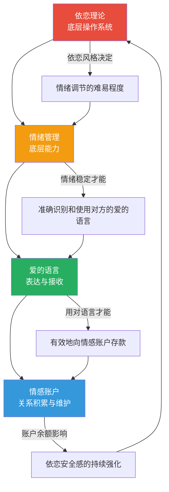
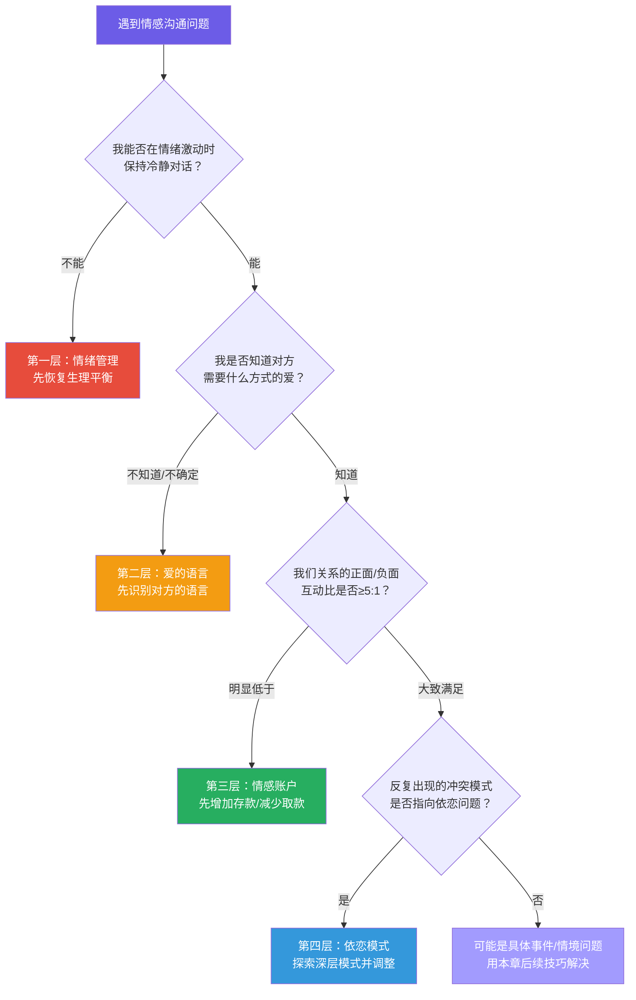
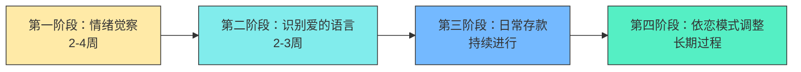
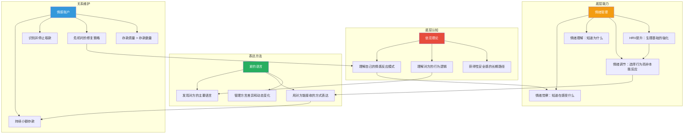

## 理论基础小结：四大框架的整合与应用

理论的价值不在于被记住，而在于被用来"看见"原本看不见的东西。本节将前四章介绍的四大理论框架——依恋理论、爱的语言、情感账户、情绪管理——进行系统整合，帮你建立一个统一的认知地图，为后续的核心技巧和实战应用打下坚实基础。

### 一、四大理论全景回顾

在深入整合之前，先快速回顾每个理论的核心洞见：

| 理论 | 创始人/来源 | 核心命题 | 一句话总结 |
|------|------------|---------|-----------|
| 依恋理论 | 鲍尔比（Bowlby, 1958）；安斯沃思（Ainsworth, 1969） | 早期依恋经验形成"内部工作模型"，影响一生的关系行为 | 你的情感反应模式，是童年写好的"程序" |
| 爱的语言 | 查普曼（Chapman, 1992） | 每个人有自己主要的"爱的语言"，用错语言等于白说 | 爱不仅要真，还要"说对语言" |
| 情感账户 | 柯维（Covey, 1989）；高特曼（Gottman）实证支撑 | 关系质量取决于日常互动的正负比累积 | 关系是"存"出来的，不是"等"出来的 |
| 情绪管理 | 勒杜（LeDoux）神经科学；巴瑞特（Barrett）情绪粒度 | 情感沟通的前提是能觉察、理解并调节自己的情绪 | 情绪失控时，一切技巧都是空谈 |

这四个理论各自都有深厚的学术根基和数十年的实践验证。依恋理论经过70多年的发展，已有超过一万篇同行评审论文支持其核心结论；高特曼对3000多对夫妻的纵向追踪研究为情感账户模型提供了量化实证；查普曼在超过30年、数千对夫妻的咨询实践中提炼出爱的语言框架；而勒杜、巴瑞特等神经科学家的研究则从脑科学层面证实了情绪管理训练的可塑性。这四个理论不是相互竞争的"学派"，而是从不同角度切入同一个问题：**人如何在关系中感受到爱、表达爱、维系爱**。

### 二、四大理论的内在逻辑关系

这四个理论不是并列的"四个知识点"，而是一个层层嵌套的能力体系。它们之间的关系可以用一个模型来表达：



#### 2.1 依恋理论是地基

依恋理论回答的是最根本的问题：**"你在关系中为什么会这样反应？"**

你的依恋风格决定了你在亲密关系中的默认行为模式。一个焦虑型依恋的人，在伴侣没有及时回复消息时，内心的"被抛弃警报"会立刻拉响；一个回避型依恋的人，在伴侣表达强烈情感需求时，会本能地想要退缩。这些反应发生在意识之前，是大脑自动运行的"程序"。

依恋风格也直接影响情绪管理的难度。安全型依恋的人，情绪调节的"出厂设置"就比较稳定——他们的大脑习惯了"求助会得到回应"的模式，所以面对压力时更容易自我安抚。而不安全依恋的人，情绪调节需要后天更多的刻意练习，因为他们早期的经验告诉他们"求助无用"或"求助不可预测"。

神经科学研究为此提供了物质层面的解释：安全型依恋者的前额叶皮层对杏仁核的调控通路更为高效，他们的迷走神经张力（vagal tone）通常更高，意味着自主神经系统能更快从应激状态恢复到平静状态。这不是宿命论——恰恰相反，它说明了情绪管理训练对不安全依恋者格外重要，因为这些训练本质上就是在强化前额叶-杏仁核的调控通路。

#### 2.2 情绪管理是能力层

情绪管理回答的问题是：**"你能不能在情绪风暴中保持对话能力？"**

有了对自己依恋模式的认知，下一步是发展情绪管理能力。这一层的核心是三个递进的技能：情绪觉察（知道自己在感受什么）→ 情绪理解（知道为什么有这种感受）→ 情绪调节（在感受情绪的同时选择行为）。

情绪管理能力直接决定了你能否有效地使用"爱的语言"。一个情绪失控的人——比如正处于杏仁核劫持状态——根本不可能识别出对方此刻需要的是"肯定的言辞"还是"精心的时刻"。他会用本能反应（攻击、退缩、冷战）代替有意识的回应。

更深层地说，情绪管理能力决定了你在关系中的"心理带宽"。当一个人的情绪调节资源被耗尽——比如长期工作压力、睡眠不足、未处理的创伤被激活——他在关系中的表现会全面退化：耐心降低、共情能力下降、冲突频率上升、对伴侣的正面行为视而不见。这不是"不爱了"，而是"带宽不足了"。理解这一点，能帮助你在关系低谷期做出更理性的判断。

#### 2.3 爱的语言是表达层

爱的语言回答的问题是：**"你用什么方式传递爱才能被对方接收到？"**

当你有了情绪管理能力作为支撑，才能有意识地选择表达爱的方式。爱的语言理论告诉我们，"付出"和"被感受到"之间存在巨大的鸿沟——你拼命赚钱（服务的行动），但伴侣渴望的是你放下手机陪她聊天（精心的时刻）。用错了语言，你越努力，对方越感受不到。

爱的语言的使用，直接决定了情感账户的"存款效率"。同样是花100块钱，给一个主要语言是"接受礼物"的人买一束花，存款效果可能远超给一个主要语言是"精心的时刻"的人买同样的花。查普曼在其30年的咨询中发现一个反复出现的规律：当夫妻双方学会用对方的爱的语言表达时，关系满意度在6-12个月内显著提升的比例高达85%。

需要注意的是，爱的语言不是固定的标签。一个人的主要爱的语言会随着生命阶段和关系状态而变化。例如，一位刚成为母亲的女性，"服务的行动"（帮忙照顾孩子、分担家务）可能暂时上升为她的主要语言；一个刚经历失业的人，"肯定的言辞"（认可他的价值和能力）可能变得比平时更重要。因此，识别爱的语言不是一次性的问卷调查，而是一个持续观察、动态调整的过程。

#### 2.4 情感账户是结果层

情感账户回答的问题是：**"你们的关系整体质量如何？"**

前面三个理论的作用最终都体现在情感账户的余额上。依恋模式健康、情绪管理到位、爱的语言用对了，情感账户自然持续增长。反过来，情感账户的余额又会反哺依恋安全感——一个余额充足的关系，会让焦虑型依恋的人逐渐放松，让回避型依恋的人逐渐敞开心扉。

高特曼的研究为情感账户模型提供了精确的量化数据。他发现，稳定幸福的婚姻中，正面互动与负面互动的比例至少为 **5:1**（即"魔法比例"）。当这个比例降到 1:1 以下时，离婚的预测准确率高达90%以上。这意味着一次负面互动（如一句刻薄的话、一次冷战）需要至少五次正面互动来抵消。情感账户不是一个"存一次就够"的系统，而是需要持续、稳定的正面投入。

这就形成了一个**正向循环**：


当然，反过来也有**恶性循环**：不理解依恋模式 → 情绪失控 → 用错爱的语言 → 情感账户透支 → 安全感降低 → 更容易情绪失控。

理解这个双向循环的意义在于：**你可以在任何一个环节打破恶性循环，也必须在任何一个环节维护正向循环**。即使你暂时无法改变深层的依恋模式（这是最慢的改变），也可以从情绪管理入手，逐步改善爱的语言的使用，最终让情感账户的提升反过来促进依恋安全感的增长。这就是"获得性安全感"（earned security）的核心原理——通过后天的意识觉察和持续实践，从不安全依恋逐步走向安全依恋。

### 三、四大理论的交叉应用矩阵

理论整合的关键在于：遇到具体问题时，知道该从哪个理论切入。以下矩阵列出了常见的情感沟通困境，以及每个理论提供的独特视角：

| 沟通困境 | 依恋理论的解读 | 爱的语言的解读 | 情感账户的解读 | 情绪管理的解读 |
|---------|-------------|-------------|-------------|-------------|
| 伴侣总查你手机 | 焦虑型依恋的"关系监控"行为，核心恐惧是被抛弃 | 对方可能没有收到足够的"肯定的言辞"，安全感不足 | 账户余额不够，需要用持续的小额存款建立信任 | 对方可能正处于情绪劫持状态，需要先安抚情绪再讲道理 |
| 你觉得伴侣不关心你 | 可能触发了你早期"需求不被回应"的依恋创伤 | 你和伴侣的爱的语言不匹配——他在用你不"懂"的语言表达 | 回忆一下，最近是否有取款行为导致对方减少了存款 | 先觉察自己的情绪：是"失望""委屈"还是"恐惧"？不同情绪需要不同的回应 |
| 一吵架就冷战 | 回避型依恋的典型应对策略——关闭情感通道以自我保护 | 冷战期间双方的爱的语言完全中断，爱箱急剧下降 | 一次冷战可能抵消一周的存款，高特曼研究中冷战是关系的"末日四骑士"之一 | 冷战是情绪调节失败后的"冻结"反应，需要先恢复生理平衡 |
| 伴侣生日忘了 | 如果是焦虑型依恋的伴侣，可能被解读为"你不在乎我" | 如果对方的主要语言是"接受礼物"或"精心的时刻"，伤害加倍 | 这是一笔大额取款，需要多笔存款来弥补 | 先管理自己的愧疚情绪，真诚道歉比防御性解释更有效 |
| 想挽回一段关系 | 需要识别双方的依恋模式，理解分手的深层动因 | 用对方能接收的爱的语言表达改变的诚意 | 情感账户已经透支，需要系统性的存款计划 | 在挽回过程中管理自己的焦虑和急迫感，避免给对方压力 |
| 长期缺乏亲密感 | 回避型依恋者可能将"亲密"等同于"失去自我"；焦虑型依恋者可能将"距离"等同于"被抛弃" | 一方可能在用"身体的接触"表达需要，但另一方的主要语言是"肯定的言辞"，信号错位 | 长期的"低额度存款"可能让账户增长停滞，需要提升存款质量 | 缺乏亲密感可能源于双方都在情绪上"自我保护"，需要先安全地暴露脆弱 |
| 婆媳/翁婿矛盾 | 伴侣可能在原生家庭依恋模式和新家庭依恋需求之间撕裂 | 对不同家庭成员使用不同的爱的语言，避免"一碗水端平"的幻觉 | 伴侣对父母的情感账户是几十年积累的，不要期望通过几次对话改变 | 在涉及原生家庭的话题中，情绪管理尤为关键——最容易被触发的是"忠诚感" |
| 育儿分歧 | 父母各自带着原生家庭的依恋模式来教育下一代 | 夫妻需要先用对方的爱的语言达成共识，再共同面对孩子 | 育儿冲突会快速消耗夫妻间的情感账户，需要专门维护 | 在孩子面前的情绪失控，会直接影响孩子的依恋模式形成 |

#### 3.1 矩阵使用方法

面对具体问题时，按以下步骤使用这个矩阵：

1. **先定位困境**：找到最接近你当前处境的行
2. **逐一对照四个视角**：不要只看一个理论的解读——每个理论揭示的是问题的不同侧面
3. **找交集**：如果两个或多个理论指向同一个方向，说明那很可能是问题的核心
4. **确定切入点**：从你最容易改变的那一层开始（通常是情绪管理或爱的语言），而不是从最深层的依恋模式开始

举一个具体的例子：你的伴侣最近总是查看你的手机。你可能的第一反应是愤怒和"不被信任"的感受。但用矩阵来分析：

- **依恋视角**：伴侣可能是焦虑型依恋，查手机是"关系监控"行为，核心驱动力是"被抛弃恐惧"
- **爱的语言视角**：伴侣可能需要更多"肯定的言辞"来确认你爱TA，而不是需要你"证明"你没出轨
- **情感账户视角**：最近是否有某些行为（加班太多、手机静音、社交频繁）让伴侣误以为是"取款信号"
- **情绪管理视角**：在你感到被冒犯的当下，能否暂停本能的愤怒反应，先理解伴侣行为背后的情绪需求

四个视角都指向同一个结论：**这不是一个"信任"问题，而是一个"安全感"问题**。解决方案不是"你为什么不信我"的对质，而是"我理解你感到不安，我愿意做些什么让你感到安全"的回应。

### 四、统一诊断框架：四层漏斗模型

在实际生活中，当你遇到情感沟通问题时，需要一个快速的诊断流程来判断问题出在哪一层。以下"四层漏斗模型"提供了一个从外到内的诊断路径：



**为什么是这个顺序？**

漏斗的顺序不是随意排列的，而是基于"改变的可行性"和"对其他层面的影响力"两个维度：

1. **情绪管理**排在最前面，因为它是"不依赖对方配合"就能改变的——你的情绪调节能力完全在自己的掌控范围内
2. **爱的语言**排在第二，因为它主要是"观察和学习"，不需要对方做任何改变——你只需要观察对方的行为模式
3. **情感账户**排在第三，因为它需要"行动"——主动的存款行为需要你投入时间和精力
4. **依恋模式**排在最后，因为它是最深层、最缓慢的改变——通常需要长期的、有意识的觉察和实践，有时甚至需要专业心理咨询的支持

这个顺序的核心逻辑是：**从你自己能100%掌控的事情开始，逐步扩展到需要双方互动才能改变的领域**。

### 五、从理论到实践的转化路径

理论学完后，最大的挑战是"知道了但做不到"。以下是将四大理论转化为日常行动的具体路径：

#### 5.1 依恋理论的转化：认识自己，理解对方

**第一步：识别自己的依恋风格**

回顾你在亲密关系中的典型反应模式，问自己三个问题：

1. 当伴侣没有及时回复消息时，你的第一反应是什么？（焦虑维度）
2. 当伴侣对你表达强烈的情感需求时，你是否想退缩？（回避维度）
3. 你在关系中最深的恐惧是什么？（被抛弃 vs 被吞噬）

更精确的自我评估可以通过ECR（亲密关系经历量表，Experiences in Close Relationships Scale）完成。这个由Brennan等人在1998年开发的量表包含36道题，从"焦虑"和"回避"两个维度对依恋风格进行连续评分（而非简单的四分类）。在心理学研究中，ECR的内部一致性信度（Cronbach's α）通常在0.90以上，是目前依恋研究中最广泛使用的测量工具。

**第二步：识别伴侣的依恋风格**

观察对方在压力情境下的行为模式，而不是听对方"说"自己是什么类型。行为比语言诚实。以下是几个关键观察窗口：

- **冲突后24小时**：对方是倾向于和你修复连接（安全型/焦虑型），还是倾向于长时间沉默和独处（回避型）？
- **你表达脆弱时**：对方是靠近你、安慰你（安全型），还是显得不自在、想转移话题（回避型），还是过度担心、反复确认（焦虑型）？
- **你提出需求时**：对方是自然地回应（安全型），还是觉得你在"控制"TA（回避型），还是立刻满足、哪怕自己不方便（焦虑型）？

**第三步：调整互动模式**

- 焦虑型 + 回避型是最常见的"追逃模式"：焦虑方追得越紧，回避方逃得越快。打破循环的关键是焦虑方学会自我安抚、回避方学会主动回应
- 焦虑型 + 焦虑型容易"情绪共振"，需要约定冲突时的冷静规则
- 回避型 + 回避型容易"情感疏离"，需要刻意安排情感连接的时间

**第四步：理解"获得性安全感"**

获得性安全感（earned security）是依恋研究中一个极其重要的概念。它指的是：虽然你的早期依恋经验是不安全的，但通过后天的意识觉察、关系体验和/或专业治疗，你可以发展出类似安全型依恋者的心理功能。研究显示，约30%的不安全依恋者在成年后能发展出获得性安全感。

获得性安全感的三个关键条件：

1. **觉察**：清晰地认识到自己的依恋模式及其来源，而不是被模式"无意识地驱动"
2. **体验**：至少拥有一段"矫正性情感体验"——一段关系让你体验到"求助是有用的""脆弱是可以被接住的"
3. **整合**：能够连贯地叙述自己的成长故事，既不回避痛苦，也不被痛苦淹没——这在依恋研究中被称为"连贯的叙事"（coherent narrative）

这意味着：**不安全的依恋模式不是终身判决**。通过本书介绍的方法——情绪管理训练、爱的语言学习、情感账户的持续经营——你正在一步步地走向获得性安全感。

#### 5.2 爱的语言的转化：发现并使用对方的语言

**第一步：发现对方的爱的语言**

五种观察方法：

1. **倾听抱怨**：对方抱怨你"从来不……"的后面，往往就是他的主要爱的语言。"你从来不夸我" → 肯定的言辞；"你总是看手机" → 精心的时刻
2. **观察付出**：对方最常为你做什么，往往就是他自己最重视的方式。一个经常给你买小礼物的人，"接受礼物"很可能就是TA的主要语言
3. **回忆请求**：对方最常向你提出的要求是什么？"周末能不能陪我逛街" → 精心的时刻；"你能不能多抱抱我" → 身体的接触
4. **直接询问**："你觉得什么时候最能感受到我的爱？"——这个问题本身就是一笔情感存款
5. **做测试题**：查普曼原著中有正式的爱的语言测试，可以一起做。也可以在网上找到改编版本，但建议选择基于原著的权威版本

**第二步：刻意练习对方的语言**

每周至少三次有意识地用对方的主要语言表达爱意。一开始会觉得不自然，这是正常的——就像学习一门外语，坚持21天以上会逐渐变得自然。关键的执行技巧是"锚定时间"：把爱的语言表达锚定到一个你已有的习惯上。比如"每天下班进门后，先放下手机，用30秒全神贯注地看着对方说一句今天想TA的话"——锚定到"进门"这个动作上，执行率会大幅提升。

**第三步：沟通你自己的语言**

让对方知道你的爱的语言是什么，而不是期待对方"猜到"。直接说"当你……的时候，我最能感受到你的爱"，这不是破坏浪漫，而是给对方一张"爱的地图"。

**第四步：管理"方言差异"**

同一种爱的语言内部也有"方言"差异。比如"肯定的言辞"这个大类下，有些人最需要的是"赞美"（"你今天穿这件衣服真好看"），有些人最需要的是"鼓励"（"我相信你能处理好这件事"），还有些人最需要的是"仁慈的话语"（"没关系，下次注意就好"）。只用大类不够精确，观察对方收到哪种具体形式时眼睛会发亮，才能真正"说对语言"。

#### 5.3 情感账户的转化：建立日常存款习惯

**第一步：审计当前余额**

诚实地评估你最重要的三段关系（伴侣、父母、好友/子女）的当前余额：

| 余额等级 | 行为信号 | 典型表现 |
|---------|---------|---------|
| 高余额（信任盈余） | 对方主动分享内心想法，犯错时给善意解读 | 你忘了纪念日，TA说"没关系，你最近太忙了" |
| 中等余额（基本平衡） | 关系正常运转，但缺乏深度连接 | 日常沟通顺畅，但很少有"心动时刻" |
| 低余额（信任赤字预警） | 对方开始回避冲突、减少主动分享 | 小事容易引发大反应，"你怎么又……"频繁出现 |
| 严重赤字（关系危机） | 对方表现出冷漠、疏离或"懒得跟你吵" | 不是吵得多激烈，而是连吵架的力气都没有了 |

**第二步：建立存款清单**

根据对方的爱的语言，列出具体的存款行为清单：

| 频率 | 存款行为示例 |
|------|------------|
| 每天 | 一个拥抱、一句"今天辛苦了"、认真倾听5分钟、主动分担家务 |
| 每周 | 一次约会时间、一封简短的感谢短信、一个小惊喜 |
| 每月 | 一次深度对话、一起做一件新鲜事、给对方一个"自由日" |
| 每季度 | 回顾关系、庆祝里程碑、一起规划未来 |

**第三步：识别并停止取款行为**

比存款更重要的是停止无意识的取款。记录一周内你对重要他人的所有互动，标注哪些是存款、哪些是取款。你会惊讶地发现，很多取款行为是你完全没有意识到的。以下是常见的"隐形取款"：

- **打断对方说话**：表面上只是"我插一句"，实际上在说"你的话没我的重要"
- **心不在焉的陪伴**：人坐在旁边，眼睛在手机上——这比不陪伴更伤人，因为它传递的信号是"你不够吸引我的注意力"
- **条件式的关心**："你怎么不早说"——本意是关心，听起来是责备
- **事后诸葛亮**："我早就跟你说过"——在对方需要安慰时提供教训
- **比较**："你看人家XXX的老公/老婆"——每一个比较都是一笔巨额取款

**第四步：掌握"修复性存款"的技巧**

当取款已经发生——比如你说了伤人的话、忘记了重要的事——"修复性存款"比普通存款更重要。修复性存款有三个关键要素：

1. **及时性**：越快越好。拖延只会让负面情绪发酵
2. **真诚性**：道歉必须具体——"我为我说的那句XX话道歉，那句话不尊重你的感受"比"对不起，我错了"有力一百倍
3. **行动性**：道歉之后要有具体的行为改变计划——"下次我生气时，我会先跟你说'我需要冷静10分钟'，而不是说出伤人的话"

#### 5.4 情绪管理的转化：建立情绪觉察习惯

**第一步：扩充情绪词汇表**

下载或制作一份情绪词汇表（至少包含50个情绪词），每天练习用精确的词汇标记自己的情绪状态。从"我不开心"升级为"我感到被忽视后的委屈"，这一步本身就具有调节作用——命名情绪能激活前额叶皮层，减弱杏仁核的反应。心理学家丽莎·费尔德曼·巴瑞特（Lisa Feldman Barrett）的研究证实，情绪词汇量越丰富的人（即"情绪粒度"越高），情绪调节能力越强，因为他们能更精确地识别和区分自己的情绪状态，而不是把所有负面情绪笼统地归类为"不爽"。

**第二步：建立"暂停-觉察-选择"的回应模式**

在情绪激动时，用以下三步替代本能反应：

1. **暂停**：深呼吸3次（激活副交感神经），给自己6秒钟（杏仁核劫持的高峰约持续6秒）
2. **觉察**：问自己"我现在感受到的是什么？这个情绪的触发点是什么？"
3. **选择**：问自己"在这个情绪之下，我最想做的反应是什么？这是我真正想要的回应吗？"

这三个步骤的核心不是"压制情绪"，而是在情绪和行为之间创造一个"选择空间"。神经科学的研究表明，当你为情绪命名时（"我现在感到愤怒"），前额叶皮层的活动会增加，杏仁核的活动会降低——命名本身就是一种调节。

**第三步：提升心率变异性（HRV）**

心率变异性（Heart Rate Variability, HRV）是衡量自主神经系统灵活性的金标准指标，也是情绪调节能力的生理基础。HRV越高，说明你的自主神经系统越能灵活地在"战斗/逃跑"和"休息/恢复"之间切换，你在压力情境下就越能保持冷静和理性。

以下方法经过研究证实能有效提高HRV，从而增强情绪调节能力：

| 方法 | 每日建议时长 | 见效周期 | 核心机制 |
|------|------------|---------|---------|
| 正念冥想 | 10-20分钟 | 4-8周 | 增强前额叶对杏仁核的调控 |
| 腹式呼吸 | 5-10分钟 | 即时 | 直接激活副交感神经 |
| 规律有氧运动 | 30分钟 | 2-4周 | 提升自主神经系统灵活性 |
| 充足睡眠 | 7-9小时 | 1-2周 | 恢复前额叶功能 |
| 社会支持 | 不定 | 持续 | 安全依恋关系本身调节情绪 |
| 冷水暴露 | 2-3分钟 | 2-4周 | 增强迷走神经张力 |
| 冥想式行走 | 15-20分钟 | 3-6周 | 结合运动与正念的双效训练 |

**第四步：建立"情绪日记"**

情绪日记是情绪管理训练中ROI最高的工具。每天花5分钟记录三件事：

1. **今天最强烈的一个情绪是什么？**（情绪觉察）
2. **它是什么时候、什么场景下出现的？**（触发点识别）
3. **我当时的反应是什么？如果重来，我会选择什么不同的反应？**（行为选择）

坚持4周后，你会发现自己能更早地觉察到情绪信号（"哦，那种熟悉的愤怒又来了"），并且有了更多的"替代反应"可供选择。这就是情绪管理从"反应式"走向"选择式"的关键转折点。

### 六、四大理论在不同关系场景中的应用

以上分析主要以亲密关系（伴侣）为场景展开，但四大理论框架的应用远不限于此。以下是不同关系场景中的关键差异和调整建议：

#### 6.1 亲子关系

| 理论 | 亲子关系中的特殊应用 |
|------|-------------------|
| 依恋理论 | 你是孩子的"依恋对象"——你的回应方式正在塑造孩子一生的依恋模式。安全型依恋的孩子在学业、社交、情绪调节方面均表现更优 |
| 爱的语言 | 儿童的爱的语言通常在3-5岁开始显现。观察孩子在什么时候最开心、最满足，就能识别TA的主要语言 |
| 情感账户 | 亲子关系中的"取款"伤害更大——父母是孩子的整个世界，一次严厉的批评可能抵消一周的温暖互动 |
| 情绪管理 | 你的情绪管理直接影响孩子的情绪发展——孩子通过"镜像神经元"系统学习情绪调节，你就是TA的情绪教练 |

亲子关系中的一个关键调整：**不要用成人框架套用在孩子身上**。一个3岁孩子的"发脾气"不是"情绪管理失败"，而是"前额叶皮层尚未发育成熟，神经科学上无法像成人一样调节情绪"。对孩子的期望要符合其发育阶段。

#### 6.2 职场关系

| 理论 | 职场关系中的调整 |
|------|----------------|
| 依恋理论 | 职场中依恋模式的影响更隐蔽但同样存在——对上司的依恋模式（"权威人物"）往往映射了对父母的依恋模式 |
| 爱的语言 | 职场中的"爱的语言"转化为"认可的语言"——有人需要口头表扬，有人需要实质性的晋升机会，有人需要被赋予更大的自主权 |
| 情感账户 | 职场情感账户的"存款"更强调专业性——按时完成任务、信守承诺、在关键时刻提供支持 |
| 情绪管理 | 职场对情绪管理的要求更高——需要更强的"情绪劳动"能力，在压力下保持专业形象 |

#### 6.3 友谊关系

友谊中四大理论的整合有一个独特之处：**友谊的"进入门槛"比亲密关系低，但"维持成本"也需要持续投入**。很多人在进入恋爱关系后逐渐忽略了友谊的情感账户维护，直到某天需要支持时才发现"账户已经空了"。

友谊中的爱的语言通常不那么"戏剧性"——一个电话、一条记得TA提到的细节的消息、在TA需要帮助时出现——这些日常的小额存款，比偶尔的"大手笔"更能维持友谊的生命力。

### 七、四大理论的常见整合误区

在实际应用中，很多人虽然分别理解了这四个理论，但在整合使用时容易掉入以下误区：

**误区一：用理论"分析"伴侣而不是"改善"自己**

"你是回避型依恋所以你才这样"——这不是沟通，这是贴标签。理论框架的正确用法是：先用来理解自己的行为模式和反应触发点，再用来理解对方的行为逻辑，最终目的是调整自己的互动方式。把理论变成武器，只会让关系更糟。

具体来说：你可以在内心使用理论来理解对方的行为（"TA的沉默可能是回避型依恋的自我保护机制"），但**永远不要在冲突中用理论标签对方**。一旦说出"你就是回避型"，对方听到的不是"我理解你"，而是"你有问题"。

**误区二：期望四步同时做到**

很多人学完四个理论后，急于在关系中同时实践，结果顾此失彼，挫败感强烈。正确的做法是分阶段推进：



先从情绪觉察开始，因为它是最基础的能力，且不需要对方的配合。然后是识别爱的语言（仍然主要是观察和学习），再进入日常存款（需要行动），最后是依恋模式的深度调整（这是一个长期过程，可能需要专业支持）。

每个阶段的"完成标准"不是"完美掌握"，而是"已经形成初步习惯"：

- **情绪觉察阶段完成标准**：你能在情绪出现后的5分钟内准确命名它
- **爱的语言阶段完成标准**：你能在不做测试的情况下说出伴侣/亲密之人的前两种爱的语言
- **日常存款阶段完成标准**：你已经有了一个每周至少执行3次的存款行为清单
- **依恋模式阶段完成标准**：你能在冲突中识别"这是依恋模式在驱动我的反应"并主动暂停

**误区三：把"存款"当作操控手段**

情感账户不是PUA工具。如果你存款的目的是"存够了就可以透支"或"让她觉得欠我的"，那你不是在建设关系，而是在经营债务。真正的存款是出于对关系的珍惜和对对方的善意，而不是一种策略性的投资。

一个简单的自检方法：问自己"如果对方永远不会知道我做了这件事，我还会做吗？"如果答案是"会"，那就是真正的存款；如果答案是"不会"，那可能是在表演。

**误区四：忽视文化差异**

查普曼的理论基于美国中产阶级的咨询实践，跨文化使用时需要注意调整。例如，在中国文化背景下，"服务的行动"（做饭、照顾家人、帮对方解决问题）往往比"肯定的言辞"更常见也更被重视——中国传统文化中"爱在心里口难开"的表达习惯，使得"做了什么"比"说了什么"更重要。这不是说中国人不需要"肯定的言辞"，而是说识别爱的语言时需要考虑文化背景的影响。

更具体的文化调整包括：

- **含蓄文化中的"肯定的言辞"**：在东亚文化中，直接的"我爱你"可能让双方都不自在。替代方案可以是更含蓄的表达："今天这道菜做得真好吃""你处理那件事的方式让我很佩服"——同样是肯定的言辞，但更贴合文化语境
- **集体主义文化中的"精心的时刻"**：在中国家庭中，"一家人一起吃饭"本身就是一种重要的情感连接仪式，这在个人主义文化中可能不被赋予同等重量
- **面子文化中的冲突处理**：情感账户的"取款"在面子文化中可能伤害更大——一句在私下可以说的话，在公开场合说就变成了一笔巨额取款

**误区五：理论万能论**

理论是地图，不是领土。它能帮你理解大部分的模式和规律，但每段关系都是独特的——两个人的成长经历、性格特质、生活处境构成了独一无二的关系生态。当理论分析与你的真实感受冲突时，相信你的真实感受。如果关系问题已经严重影响了你的生活质量，寻求专业的心理咨询帮助是更负责任的选择，理论学习不能替代专业治疗。

以下情况建议寻求专业帮助：

- 你或伴侣出现持续的抑郁、焦虑症状（超过2周且影响日常功能）
- 关系中存在任何形式的暴力——身体的、情感的、经济的
- 你发现自己反复陷入相同的痛苦关系模式，且自我调整无效
- 伴侣双方的沟通已经完全破裂，无法进行任何建设性对话
- 涉及成瘾行为（酒精、赌博、网络等）对关系造成系统性损害

### 八、进度追踪：理论应用的自我评估工具

持续改进需要持续测量。以下是一个简易的四维自我评估量表，建议每月做一次，追踪自己的进步：

```markdown
## 情感沟通理论应用 — 月度自评（1-10分）

### 情绪管理维度
1. 我能在情绪出现后5分钟内准确命名它：___分
2. 我在冲突中能暂停本能反应、选择有意识的回应：___分
3. 我能区分"情绪信号"和"事实判断"（比如区分"我感到被忽视"和"你不关心我"）：___分

### 爱的语言维度
4. 我能准确说出伴侣/亲密之人前两种爱的语言：___分
5. 我每周至少3次有意识地用对方的语言表达爱：___分
6. 我能清楚地向对方表达自己的爱的语言需求：___分

### 情感账户维度
7. 我能识别自己的"隐形取款"行为并减少它们：___分
8. 我有固定的日常存款习惯：___分
9. 当取款发生后，我能及时进行修复性存款：___分

### 依恋模式维度
10. 我能识别自己在压力下的依恋反应模式：___分
11. 我能区分"依恋驱动的反应"和"基于当下现实的回应"：___分
12. 我能对伴侣的依恋模式保持理解和耐心（而非评判）：___分

**总分：___ / 120**
- 96-120：理论已经内化为你的关系能力，继续保持
- 72-95：你已经有了扎实的基础，重点突破薄弱维度
- 48-71：你正在进步的路上，建议聚焦一个维度深入练习
- <48：不要气馁，意识到问题本身就是进步的第一步
```

### 九、一张图总结：情感沟通的理论框架



### 十、从理论走向实践

理解这些理论不是为了"分析"关系，而是为了更好地**在关系中行动**。理论的价值在于给你一个框架，让你在面对情感沟通困境时不再手足无措——你知道问题出在哪里（依恋模式冲突？爱的语言错配？情感账户透支？情绪失控？），你知道该从哪里入手，你也知道改变需要时间和耐心。

最后，记住三个核心原则：

1. **先管好自己，再影响关系**：所有四个理论框架中，你能100%掌控的只有自己的行为。从情绪管理开始，从停止无意识的取款开始，从一次真正的倾听开始
2. **质量大于数量**：一次深度的、全神贯注的倾听，胜过十次心不在焉的陪伴。情感账户的存款不是"数量竞赛"，而是"质量积累"
3. **耐心是最好的存款**：关系的改变不是一朝一夕的事。获得性安全感的形成可能需要数年，但每一天的意识觉察和有意识的选择，都在为这个过程添砖加瓦

在接下来的"核心技巧"部分，我们将把这些理论框架转化为具体可操作的沟通方法——如何表达感受、如何倾听感受、如何在冲突中保持连接、如何重建信任、如何进行日常的情感投资。每一个技巧背后都有这四大理论的支撑，你会看到理论是如何真正"活"在日常的每一次对话中的。
