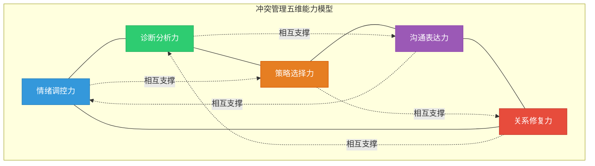
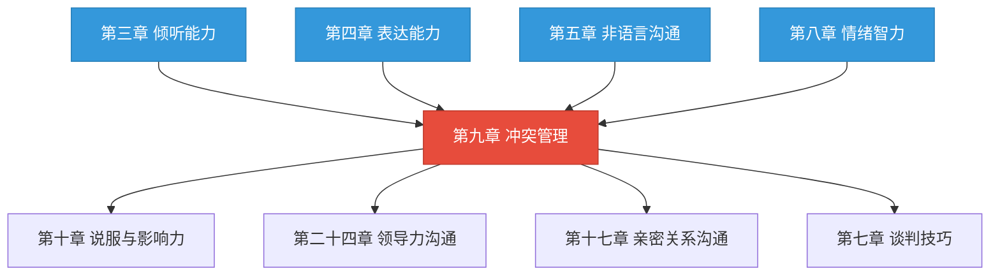
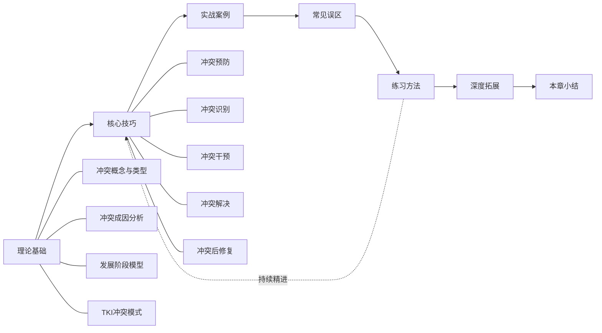

# 第九章 冲突管理

> "每一次冲突的背后，都隐藏着一个未被满足的需求、一个未被理解的立场、一个未被解决的问题。"
> —— 莫顿·多伊奇（Morton Deutsch），冲突心理学奠基人

## 本章导言

### 一个真实的场景

周五下午五点半，产品团队的周会即将结束。产品经理张伟提出下周要临时增加一个功能需求，开发负责人李明当即变了脸色——团队已经连续加班三周，手上还有两个延期的模块没有交付。李明说："这个需求排不进去，你要加就自己写代码。"张伟回怼："客户下周要看演示，你让我怎么交代？"会议室的空气凝固了。其他同事低下头看手机，谁也不想卷入这场对峙。

这个场景每天都在无数团队中上演。它不是个例，而是一种常态——**根据CPP Global（MBTI母公司）2008年发布的《职场冲突调查报告》，美国员工每周平均花费2.8小时处理冲突，仅美国市场每年因冲突造成的生产力损失高达3590亿美元**。在中国，尽管缺乏同等规模的系统性调研，但多项针对企业管理者的调查显示，**中层管理者平均将15%~25%的工作时间用于处理各类人际冲突和部门协调摩擦**。更值得注意的是，2022年智联招聘发布的《中国职场人冲突管理白皮书》显示，**73.6%的职场人曾因冲突处理不当而考虑离职**，冲突管理不善已成为人才流失的隐性推手。

冲突无处不在，无法逃避，也不应该逃避。

### 冲突本身不是问题，处理方式才是

许多人对冲突怀有本能的恐惧。这种恐惧可以理解——冲突确实伴随着不适感、焦虑甚至痛苦。但恐惧导致的回避行为，往往比冲突本身造成更大的伤害。想象一下，如果上述场景中李明选择了沉默，把不满压在心里，会发生什么？他可能表面答应，实际消极执行；可能在团队内部散播不满情绪；可能从此对张伟心存芥蒂，在未来的每一次协作中都暗中设障。

回避的代价是隐性的，但极其高昂。心理学家约翰·戈特曼（John Gottman）在对婚姻关系的长期研究中发现，**"石墙效应"（Stonewalling）——即在冲突中完全关闭沟通——是预测关系破裂的四大"末日骑士"之一**。这一规律同样适用于职场和社交场景：压抑的不满不会消失，只会在更大的压力下以更具破坏性的方式爆发。

现代组织行为学的研究给出了一个反直觉的结论：**适度的、以任务为导向的冲突（Task Conflict）与团队绩效呈正相关关系**。De Dreu和Weingart在2003年的元分析中发现，低到中等强度的任务冲突能够促进多角度思考、避免群体思维（Groupthink）、提高决策质量。Amason在1996年对高管团队的研究中也证实，认知性冲突（Cognitive Conflict）能够显著提升战略决策的质量。

换句话说，冲突不是沟通的失败，而是沟通的另一种形态——一种更加激烈的、更加迫切的、更加真实的沟通。关键在于：你是否具备将冲突从破坏性转向建设性的能力。

### 冲突管理能力的本质

冲突管理不是一种单一的技巧，而是一组能力的综合运用。它至少包含以下五个核心维度：

| 能力维度 | 核心内涵 | 表现形式 | 缺失后果 |
|---------|---------|---------|---------|
| **情绪调控力** | 在高压情境下保持理性，不被情绪裹挟 | 愤怒时不口不择言，委屈时能清晰表达 | 说出后悔的话，将任务冲突升级为人身攻击 |
| **诊断分析力** | 快速判断冲突的类型、根源和阶段 | 区分这是任务冲突还是关系冲突，表层还是深层 | 治标不治本，同类冲突反复发生 |
| **策略选择力** | 根据情境选择最合适的处理方式 | 知道何时竞争、何时合作、何时回避 | 用一种模式应对所有冲突，要么一味强硬，要么一味退让 |
| **沟通表达力** | 在冲突中准确传达立场和需求 | 用"我"语言代替"你"语言，表达感受而非攻击人格 | 看得清、说不明，好想法无法转化为有效对话 |
| **关系修复力** | 冲突结束后重建信任和合作关系 | 主动复盘、真诚道歉、建立新的共识 | 冲突虽然"解决"了，但关系持续恶化，信任账户严重透支 |

这五种能力相互依存，缺一不可。一个情绪调控力很强但诊断分析力不足的人，能在冲突中保持冷静，却找不到问题的根源，最终只能和稀泥。一个诊断分析力很强但沟通表达力不足的人，能看透冲突的本质，却无法将理解转化为有效的对话，导致"看得清、说不明、做不到"。

五种能力的理想状态是一个均衡发展的"五边形"——

> **自我诊断提示**：你的五种能力中，哪一种最薄弱？那个最薄弱的维度，就是制约你整体冲突管理能力的"短板"。本章的自评工具将帮助你准确定位。

本章的目标，就是帮助你系统性地发展这五种能力，将冲突管理从一种偶然的"天赋"变成一种可习得、可练习、可精进的"技能"。

### 关键理论与研究者速览

在正式学习之前，先认识几位塑造了冲突管理领域的关键学者和理论。这些名字会在本章中反复出现，提前了解有助于建立知识框架：

| 学者/理论 | 核心贡献 | 本章应用位置 |
|-----------|---------|-------------|
| **莫顿·多伊奇**（Morton Deutsch） | 冲突的经典定义；合作与竞争理论；提出"建设性冲突"概念 | 理论基础篇·冲突概念 |
| **肯尼斯·托马斯 & 拉尔夫·基尔曼**（Thomas & Kilmann） | TKI冲突模式工具：五种冲突处理风格（竞争/合作/妥协/回避/迁就） | 理论基础篇·TKI模型 |
| **弗里德里希·格拉斯尔**（Friedrich Glasl） | 冲突升级九阶段模型：从"争赢"到"全面对抗"到"共同毁灭" | 理论基础篇·冲突发展阶段 |
| **路易斯·庞迪**（Louis Pondy） | 冲突发展五阶段模型：潜伏期→感知期→感受期→显现期→余波期 | 理论基础篇·冲突发展阶段 |
| **库尔特·勒温**（Kurt Lewin） | 内心冲突三类型：趋近-趋近/回避-回避/趋近-回避冲突 | 理论基础篇·冲突类型 |
| **约翰·戈特曼**（John Gottman） | 关系中的"末日四骑士"：批评/蔑视/防御/石墙效应 | 核心技巧篇·冲突预防 |
| **霍夫斯泰德**（Geert Hofstede） | 文化维度理论：集体主义vs个人主义对冲突风格的影响 | 核心技巧篇·跨文化冲突 |
| **罗杰·费舍尔 & 威廉·尤里**（Fisher & Ury） | 原则谈判：把人和问题分开、关注利益而非立场 | 核心技巧篇·冲突解决 |

这些理论不是孤立存在的，它们共同构成了一个从"理解冲突"到"管理冲突"的完整知识体系。本章将按照"道（理论认知）→法（方法论）→术（具体技巧）→器（工具模板）"的逻辑，将这些理论转化为可操作的实践能力。

### 冲突管理在沟通能力体系中的位置

在本书的沟通能力框架中，冲突管理处于一个特殊的位置。它不是孤立的技能模块，而是对前几章所学能力的综合检验和实战应用：

冲突管理要求你同时调动倾听能力（听懂对方真正在说什么，而不是只听表面的攻击性语言）、表达能力（准确传达自己的立场和需求，而不陷入互相指责）、非语言沟通能力（读懂对方的情绪信号、控制自己的非语言表露，避免火上浇油）、情绪智力（识别和管理自己及他人的情绪，在高压情境下保持理性）。

同时，冲突管理能力也是谈判能力、领导力沟通和长期关系建设的基础——一个无法有效管理冲突的人，很难成为优秀的谈判者、领导者或值得信赖的伙伴。谈判中的利益博弈、领导力中的团队激励、亲密关系中的深层对话，都需要以冲突管理能力为底层支撑。

**与前一章（第八章·情感沟通）的衔接**：第八章建立的情绪识别、共情回应和情绪表达能力，是冲突管理中"情绪调控力"的直接前置技能。如果你在第八章的自评中情绪智力维度得分较低，建议先巩固第八章的核心技巧，再进入本章的学习。

---

## 本章内容结构

本章共分为七大板块，按照"理论→技巧→实战→纠偏→练习→进阶→总结"的逻辑层层递进，构成一个完整的学习闭环：

### 理论基础篇——理解冲突的本质

知其然，更要知其所以然。在学习具体技巧之前，我们需要建立对冲突的系统性认知框架。理论基础篇将覆盖四个核心模块：

**冲突的基本概念**——厘清"冲突"的准确定义，区分冲突与争论、冲突与暴力的边界。重点讲解功能性冲突（建设性冲突）与功能失调性冲突（破坏性冲突）的区别，建立"冲突本身是中性的"这一关键认知前提。这一认知转变是整章学习的基石——只有当你不再将冲突等同于"坏事"，你才能真正放下恐惧，以开放的心态去学习管理冲突的方法。

**冲突的类型与层次**——从三个维度系统分类冲突：按内容分为任务冲突、关系冲突和过程冲突；按层次分为内心冲突、人际冲突、群体冲突和组织冲突；按性质分为实质性冲突和情感性冲突。每种冲突类型都有不同的成因、表现形式和处理策略，准确识别冲突类型是有效管理的第一步。例如，任务冲突适合用事实和数据来讨论，而关系冲突则需要先处理情感、再解决问题——混淆两者的处理方式，是冲突管理失败的常见原因。

**冲突的成因分析**——深入剖析冲突产生的十大根本原因：资源稀缺、目标差异、认知偏差（归因偏差、确认偏差、自利偏差等）、沟通障碍、价值观冲突、角色模糊与角色冲突、权力不对等、人格差异、历史遗留问题和外部压力。理解成因是"对症下药"的前提——不理解冲突为什么发生，就无法从根本上解决它。更重要的是，大多数冲突不是单一原因造成的，而是多种因素交织的结果，这要求我们具备"多因诊断"的能力。

**冲突的发展阶段与TKI模型**——讲解冲突发展的五阶段模型（潜伏期→感知期→感受期→显现期→余波期）和格拉斯尔冲突升级九阶段模型，帮助读者理解冲突的动态演化过程。冲突不是静态的"事件"，而是动态的"过程"——在不同阶段，需要采取不同的干预策略。重点介绍Thomas-Kilmann冲突模式工具（TKI），系统分析竞争、合作、妥协、回避和迁就五种冲突处理风格的特点、适用场景、局限性以及文化因素的影响。TKI不是让你选一个"最好的"风格，而是让你拥有一个"风格工具箱"，在不同情境下灵活选用。

### 核心技巧篇——掌握全流程方法论

核心技巧篇是本章的实践核心，按照冲突管理的时间线，系统讲解五个关键环节：

| 环节 | 核心问题 | 关键能力 | 对应冲突阶段 |
|-----|---------|---------|------------|
| **冲突预防** | 如何在冲突发生前消除隐患？ | 建立沟通机制、明确规则、管理期望、积累信任 | 潜伏期干预 |
| **冲突识别** | 如何在冲突升级前察觉信号？ | 信号辨识、冲突诊断、严重程度评估 | 感知期捕捉 |
| **冲突干预** | 如何在冲突恶化前有效介入？ | 情绪降温、引导对话、第三方调解 | 感受期降温 |
| **冲突解决** | 如何运用策略化解核心矛盾？ | 问题解决、谈判协商、创造性方案设计 | 显现期化解 |
| **冲突后修复** | 如何在冲突结束后重建关系？ | 复盘反思、信任重建、制度优化 | 余波期修复 |

每个环节都配有具体的操作步骤、实用话术模板和关键注意事项，确保读者不仅能"理解"，更能"做到"。核心技巧篇的写法遵循"道法术器"四层结构：每一节先讲"为什么这样做"（道），再讲"方法论框架"（法），然后给出"具体怎么做"（术），最后提供"可直接使用的工具和模板"（器）。

此外，核心技巧篇还专门设置了一个"特殊情境下的冲突管理"小节，涵盖以下复杂场景的处理方法：

- **跨文化冲突**——不同文化背景下的冲突风格差异、面子文化的处理策略、语言障碍的应对方法
- **权力不对等冲突**——下属与上级的冲突、消费者与商家的冲突、学生与教师的冲突
- **情绪极端化冲突**——当对方出现愤怒失控、哭泣崩溃、冷暴力等极端情绪反应时的处理方法
- **群体性冲突**——团队内部的派系对立、部门之间的系统性摩擦、网络群体性事件
- **长期反复冲突**——与同一人反复发生冲突时的深层原因分析和系统性解决方案

### 实战案例篇——在真实场景中学习

本章精选了八个覆盖职场、家庭、社交和公共场合的典型冲突场景。每个案例都经过精心设计，确保涵盖不同的冲突类型、冲突层次和处理策略：

| 序号 | 场景 | 核心冲突类型 | 关键学习点 |
|-----|------|------------|-----------|
| 1 | **同事之间的争执** | 任务冲突→关系冲突 | 如何防止工作分歧升级为人身攻击 |
| 2 | **上下级之间的冲突** | 过程冲突+权力不对等 | 权力不对等下的有效沟通策略 |
| 3 | **客户投诉与维权** | 实质性冲突+情绪化 | 将愤怒的客户转化为忠诚的伙伴 |
| 4 | **团队内部分歧** | 任务冲突+群体冲突 | 多元观点碰撞下的决策困境 |
| 5 | **家庭成员之间的矛盾** | 关系冲突+价值观冲突 | 亲密关系中的冲突管理艺术 |
| 6 | **朋友之间的误会** | 情感性冲突+沟通障碍 | 修复友谊的信任重建路径 |
| 7 | **邻里之间的纠纷** | 实质性冲突+边界问题 | 社区生活中的边界协商 |
| 8 | **公共场合的冲突** | 陌生人冲突+安全考量 | 面对陌生人冲突的安全处理原则 |

每个案例都将完整展示冲突的起因、发展过程、可选处理策略、实际处理结果，并提炼出可复用的沟通要点和话术模板。案例不是简单的"故事"，而是经过结构化分析的"教学工具"——每个案例都按照"情境描述→冲突诊断→策略选择→对话还原→结果分析→要点提炼"的六步框架进行深度解析。

### 常见误区篇——避开那些陷阱

冲突管理中有许多看似合理实则有害的做法。这些误区之所以危险，是因为它们往往披着"常识"的外衣，让人不假思索地信以为真。本章总结了十个最常见的误区，包括但不限于：

- **"回避就能解决问题"**——回避只是延迟，不是解决。被回避的问题不会消失，只会在更大的压力下以更猛烈的方式爆发
- **"赢了争论就是赢了冲突"**——赢了道理、输了关系，得不偿失。冲突管理的目标不是"证明我是对的"，而是"找到最好的解决方案"
- **"情绪化表达能表明立场"**——情绪化表达往往让立场变得更加模糊。当对方忙于应对你的情绪攻击时，他们根本听不进你的观点
- **"找第三方评理总是对的"**——第三方介入有时会加剧冲突，特别是当第三方带有偏见或介入时机不当时
- **"妥协是最好的策略"**——妥协是让双方都不满意的最快方法。在很多情况下，合作性的"第三方案"远优于各退一步的妥协
- **"道歉就是认输"**——真诚的道歉不是示弱，而是展现力量和修复关系的最有效工具之一
- **"冲突一次就能彻底解决"**——深层冲突往往需要多次对话和持续的行动才能真正化解
- **"对事不对人就够了"**——即使你的目标是对事不对人，如果你的表达方式让人感到被攻击，效果是一样的
- **"冲突管理是天生的能力"**——冲突管理是一组可以学习和练习的技能，不是天赋
- **"只要双方都理性，冲突就能解决"**——忽视情感因素是冲突管理中最常见的失败原因之一

每个误区都配有原因分析、真实案例和纠正方法，帮助读者建立正确的冲突管理心智模型。

### 练习方法篇——从知道到做到

知道和做到之间，隔着一万次练习。本章设计了系统化的练习计划，采用"渐进式暴露"（Graded Exposure）原则——这是临床心理学中治疗恐惧症的核心方法，同样适用于冲突管理能力的培养：

| 练习层级 | 频率 | 内容示例 | 压力水平 | 目标 |
|---------|------|---------|---------|------|
| **基础练习** | 每日 | 情绪觉察日记、冲突复盘、积极倾听微练习 | 低 | 建立自我觉察习惯 |
| **技能练习** | 每周 | 角色扮演、情景模拟、冲突风格自评 | 中 | 在安全环境中练习技巧 |
| **实战练习** | 不定期 | 真实冲突场景的刻意练习、主动发起困难对话 | 中高 | 将技巧迁移到真实情境 |
| **进阶练习** | 每月 | 复杂场景分析、跨文化冲突模拟、调解者角色体验 | 高 | 发展高级冲突管理能力 |

练习设计从低压力的自我反思开始，逐步过渡到高压力的实战模拟，帮助读者在安全的环境中建立冲突管理的信心和能力。每一个练习都附有详细的操作说明、评估标准和反馈方法，确保练习的针对性和有效性。

### 深度拓展篇——走向专家级

本章最后为希望进一步精进的读者准备了深度拓展内容，涵盖三个高级主题：

**冲突调解技术**——当你不是冲突的当事人，而是需要帮助他人解决冲突时，调解者角色所需的特殊技能：中立性维护、保密原则、各方利益的平衡、调解流程的设计与执行。包括正式调解（如劳动争议调解、商事调解）和非正式调解（如朋友之间的劝和、团队内部的协调）两种场景。

**组织冲突管理系统设计**——从组织层面系统性地管理冲突：建设冲突管理文化、设计申诉与反馈渠道、建立中立方制度、将冲突数据纳入组织诊断。这一部分特别适合管理者和人力资源从业者。

**冲突管理的神经科学基础**——从脑科学角度理解冲突反应：杏仁核劫持（Amygdala Hijack）的生理机制、前额叶皮层的调控作用、压力荷尔蒙（皮质醇、肾上腺素）对决策的影响。理解"为什么我们会在冲突中做出不理性的事"，是提升情绪调控力的深层基础。

---

## 冲突管理能力自评

在正式开始学习之前，建议你花五到八分钟完成以下自评。这不是标准化的心理测评，而是一个帮助你了解自己起点的思考工具。对每个问题，在心里打一个1~5的分数（1=完全不符合，5=完全符合），然后计算总分和各维度的分项得分。

> **诚实作答提示**：自评的价值在于准确性。请根据你在真实冲突中的实际表现作答，而不是根据你希望自己如何表现来作答。回忆最近一次你参与或目睹的冲突场景，用那个场景来校准你的答案。

### 情绪调控力

| 序号 | 描述 | 评分(1-5) |
|-----|------|-----------|
| 1 | 当别人批评我时，我能在回应之前先暂停几秒钟 | __ |
| 2 | 在激烈的争论中，我能意识到自己的情绪变化 | __ |
| 3 | 我很少在愤怒时说出让自己后悔的话 | __ |
| 4 | 当对方情绪激动时，我能保持冷静而不被带走 | __ |
| 5 | 我能区分"我在生气"和"我生气是因为某某事" | __ |

**小计：__ / 25**

### 诊断分析力

| 序号 | 描述 | 评分(1-5) |
|-----|------|-----------|
| 6 | 在冲突中，我能判断出对方真正在意的是什么 | __ |
| 7 | 我能区分冲突是因为事情本身还是因为关系问题 | __ |
| 8 | 我能判断冲突处于早期还是已经升级 | __ |
| 9 | 我能看出表面争论背后隐藏的深层需求 | __ |
| 10 | 我能识别出哪些冲突值得投入精力处理，哪些可以放手 | __ |

**小计：__ / 25**

### 策略选择力

| 序号 | 描述 | 评分(1-5) |
|-----|------|-----------|
| 11 | 我知道在什么情况下应该坚持己见 | __ |
| 12 | 我知道在什么情况下应该主动退让 | __ |
| 13 | 我能在竞争和合作之间做出合适的选择 | __ |
| 14 | 面对不同的人和情境，我会调整自己的处理方式 | __ |
| 15 | 我不会在所有冲突中都用同一种方式应对 | __ |

**小计：__ / 25**

### 沟通表达力

| 序号 | 描述 | 评分(1-5) |
|-----|------|-----------|
| 16 | 在冲突中，我能清楚地表达自己的需求而不是指责对方 | __ |
| 17 | 我能在不伤害对方的前提下说出不同意见 | __ |
| 18 | 我能在冲突中真正听懂对方的意思，而不仅仅是在想自己要说什么 | __ |
| 19 | 我能用事实和数据而不是情绪和猜测来支持自己的立场 | __ |
| 20 | 我能在冲突中找到双方都能接受的表述方式 | __ |

**小计：__ / 25**

### 关系修复力

| 序号 | 描述 | 评分(1-5) |
|-----|------|-----------|
| 21 | 冲突结束后，我能主动与对方进行复盘对话 | __ |
| 22 | 我能真诚地为自己的错误道歉，不附加条件 | __ |
| 23 | 我能从每次冲突中提取经验教训 | __ |
| 24 | 冲突结束后，我的关系通常不会恶化 | __ |
| 25 | 我能在冲突后设定新的规则或机制来预防类似问题 | __ |

**小计：__ / 25**

### 评分解读

#### 总分评估

| 总分区间 | 水平评估 | 建议学习策略 |
|---------|---------|------------|
| 100~125 | **高手水准**——你已经具备出色的冲突管理能力 | 重点关注深度拓展篇、特殊情境处理和高级练习 |
| 75~99 | **中等水平**——基础扎实，但存在明显的短板领域 | 重点关注分项得分中最低的1~2个维度，同时通读全章补全知识框架 |
| 50~74 | **入门阶段**——有一些意识，但缺少系统方法 | 建议从理论基础篇开始，按顺序系统学习，配合基础练习 |
| 25~49 | **需要重点提升**——冲突管理可能是你的痛点领域 | 不必焦虑，这正是本章的价值所在。建议放慢节奏，每学完一节就做对应的练习 |

#### 分项诊断

除了总分，各维度的分项得分更有诊断价值。请将五个维度的得分按从低到高排序：

**得分最低的维度**是你的"首要提升领域"——它很可能是制约你整体冲突管理能力的瓶颈。建议在学习本章时，特别关注该维度对应的章节内容和练习。

**得分最高的维度**是你的"优势领域"——在冲突中，你可以有意识地先发挥这个优势，然后用它来支撑其他维度的提升。例如，如果你的诊断分析力很强但沟通表达力不足，你可以先用分析力看清局势，然后刻意练习用更好的方式表达你的分析结果。

**各维度得分差距超过10分**（满分25分制）说明你的能力发展不均衡。不均衡本身不是问题，但如果短板维度恰好在你的生活/工作中频繁出现，就需要优先补齐。

| 得分最低维度 | 重点阅读章节 | 推荐练习类型 |
|------------|------------|------------|
| 情绪调控力 | 核心技巧篇·冲突干预 | 每日情绪觉察日记、6秒暂停法练习 |
| 诊断分析力 | 理论基础篇·冲突类型+冲突成因 | 冲突复盘分析、案例诊断练习 |
| 策略选择力 | 理论基础篇·TKI模型 | TKI风格自测、情景模拟练习 |
| 沟通表达力 | 核心技巧篇·冲突解决 | "我"语言练习、话术模板应用 |
| 关系修复力 | 核心技巧篇·冲突后修复 | 复盘对话模拟、道歉五要素练习 |

无论你的起点如何，本章都为你准备了从入门到进阶的完整路径。分数低不代表你"不行"，只代表你还没有系统学习过冲突管理——而在读完本章并完成练习之后，你的分数将显著提升。

---

## 学完本章你将能够

完成本章的学习和练习后，你将获得以下能力：

**认知层面的跃升：**

- 理解冲突的本质是"感知到的不兼容"，而非简单的对错之争
- 区分功能性冲突与功能失调性冲突，建立"冲突可以是建设性的"这一核心认知
- 掌握冲突的三维分类体系（内容维度×层次维度×性质维度），准确判断任何冲突的类型
- 理解冲突发展的五阶段动态过程，在每个阶段采取最优行动
- 熟练运用Thomas-Kilmann模型，根据情境灵活选择五种冲突处理风格
- 识别冲突背后的深层需求和利益，看透表面争论的本质

**技能层面的掌握：**

- 在冲突发生前识别和消除隐患（预防能力）——包括建立沟通机制、管理期望、积累信任
- 在冲突早期信号出现时迅速察觉并准确诊断（识别能力）——包括信号辨识、冲突分类和严重程度评估
- 在冲突升级前用恰当的方式介入并降温（干预能力）——包括情绪降温技术、引导对话框架和第三方调解技巧
- 在冲突中运用具体策略找到解决方案（解决能力）——包括利益分析、创造性方案设计和协商对话技术
- 在冲突结束后重建信任、总结经验、优化机制（修复能力）——包括复盘对话、道歉与原谅、制度改进

**场景层面的应用：**

- 在同事争执、上下级冲突、客户投诉、团队分歧等职场场景中游刃有余
- 在家庭矛盾、朋友误会、邻里纠纷等生活场景中从容应对
- 在公共场合面对陌生人冲突时安全、得体地处理
- 在跨文化情境中理解和适应不同的冲突处理风格
- 避免十个最常见的冲突管理陷阱，不走弯路

**自我发展的路径：**

- 能够准确评估自己的冲突管理能力现状
- 拥有清晰的能力提升路径和持续练习方法
- 具备从每次冲突中提取经验、持续精进的反思习惯

---

## 如何使用本章

### 线性阅读（推荐初学者）

按照章节顺序依次阅读：理论基础→核心技巧→实战案例→常见误区→练习方法→深度拓展→本章小结。这种阅读方式适合冲突管理的初学者，能够建立完整的知识体系。预计需要3.5~5小时（不含练习时间），建议分2~3次完成，每次专注于1~2个板块。

**建议节奏**：
- 第一次阅读：理论基础篇（45~60分钟）+ 核心技巧篇前半部分（30分钟）
- 第二次阅读：核心技巧篇后半部分（30~60分钟）+ 实战案例篇（40~60分钟）
- 第三次阅读：常见误区篇 + 练习方法篇 + 深度拓展篇 + 本章小结（60~90分钟）

### 问题导向阅读（适合有经验的读者）

如果你正在经历某个具体的冲突场景，可以直接跳转到相关的实战案例和核心技巧章节。但建议在跳转之前至少阅读理论基础篇中的以下两个小节：

1. **"冲突的类型"**——帮助你准确判断你面对的是哪种冲突
2. **"TKI模型"**——帮助你理解可选的处理策略

这两个框架是后续所有技巧的基础，跳过它们会降低你应用具体技巧的效果。

**快速查阅路径**：

| 你面临的场景 | 建议直接跳转到 |
|------------|-------------|
| 和同事/领导发生了争执 | 实战案例1或2 → 核心技巧·冲突干预 |
| 客户在发火/投诉 | 实战案例3 → 核心技巧·冲突解决 |
| 团队内部意见分裂 | 实战案例4 → 核心技巧·冲突预防 |
| 和家人/伴侣吵架了 | 实战案例5 → 核心技巧·冲突后修复 |
| 和朋友产生了误会 | 实战案例6 → 核心技巧·冲突识别 |
| 想预防冲突发生 | 核心技巧·冲突预防 → 理论基础·冲突成因 |
| 冲突刚结束，想修复关系 | 核心技巧·冲突后修复 → 练习方法·复盘练习 |

### 反复精读（推荐所有读者）

冲突管理能力的提升不是一次阅读能完成的。建议至少阅读三遍：

1. **第一遍：建立框架**——快速通读，建立对冲突管理的整体认知。这一遍不要纠结细节，重点是理解"冲突管理包含哪些维度"和"有哪些可用的策略"
2. **第二遍：深入理解**——逐节精读，结合自己的经历进行反思。每读完一节，问自己："我在过去的冲突中是怎么做的？如果重来一次，我会怎么做？"
3. **第三遍：刻意练习**——配合练习方法篇，将理论转化为实际能力。这一遍的重点不是"读"，而是"练"

### 配合练习使用

本章不是一本"读完就放下"的书。练习方法篇中设计的每日练习、每周练习和进阶练习，是将知识转化为能力的关键环节。建议在阅读核心技巧篇时就开始同步练习，而不是等到读完全章才开始。具体建议：

- **读完"冲突预防"后**：立即开始每日情绪觉察日记
- **读完"冲突识别"后**：回顾最近一次冲突，用诊断框架进行复盘分析
- **读完"冲突干预"后**：和朋友进行一次角色扮演练习
- **读完"冲突解决"后**：找一个真实的待解决冲突，应用所学策略
- **读完"冲突后修复"后**：联系一个曾经有过冲突但未修复的关系，尝试修复对话

---

## 章节导航

下表提供了本章各节的快速导航，方便你随时查阅：

| 序号 | 章节 | 主题 | 建议阅读时长 | 核心收获 |
|-----|------|------|------------|---------|
| 01 | 理论基础 | 冲突的基本概念、类型、成因、发展阶段、TKI模型 | 45~60分钟 | 建立冲突管理的完整认知框架 |
| 02 | 核心技巧 | 冲突预防→识别→干预→解决→修复全流程 | 60~90分钟 | 掌握可操作的五步全流程方法论 |
| 03 | 实战案例 | 八大典型冲突场景的完整案例分析 | 40~60分钟 | 在真实场景中理解策略应用 |
| 04 | 常见误区 | 十个冲突管理陷阱及纠正方法 | 20~30分钟 | 避免最常见的错误做法 |
| 05 | 练习方法 | 每日/每周/进阶练习计划 | 15~20分钟（阅读）+ 持续练习 | 从"知道"转化为"做到" |
| 06 | 深度拓展 | 冲突调解、组织冲突管理、冲突神经科学 | 30~45分钟 | 走向专家级的高级主题 |
| 07 | 本章小结 | 核心要点回顾与行动清单 | 10~15分钟 | 回顾全章，制定个人行动计划 |

**总计建议阅读时间**：3.5~5小时（不含练习时间）。

---

> 冲突不是沟通的失败，而是深化沟通的契机。每一个冲突的背后，都隐藏着一个未被满足的需求、一个未被理解的立场、一个未被解决的问题。本章将帮助你学会看见这些隐藏的东西，并将冲突从破坏性的力量转化为建设性的动力。让我们一起走进冲突管理的世界，学会将冲突转化为成长与合作的桥梁。
