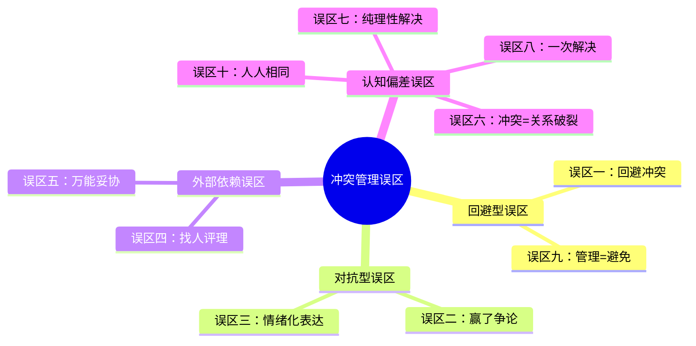
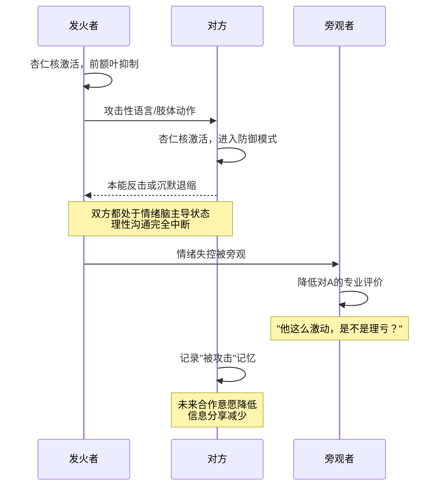
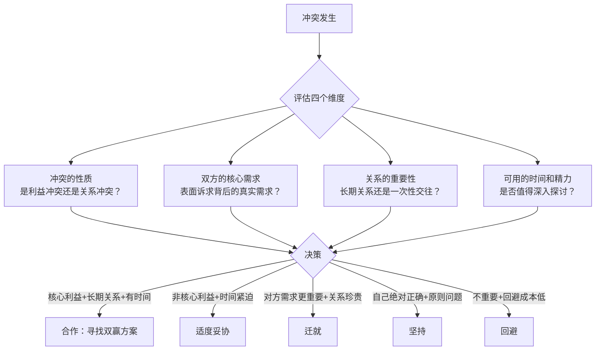
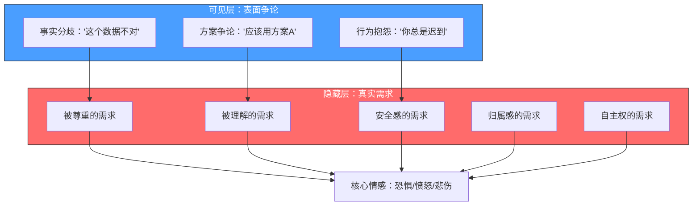
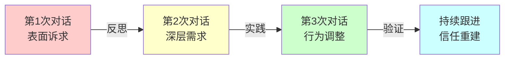
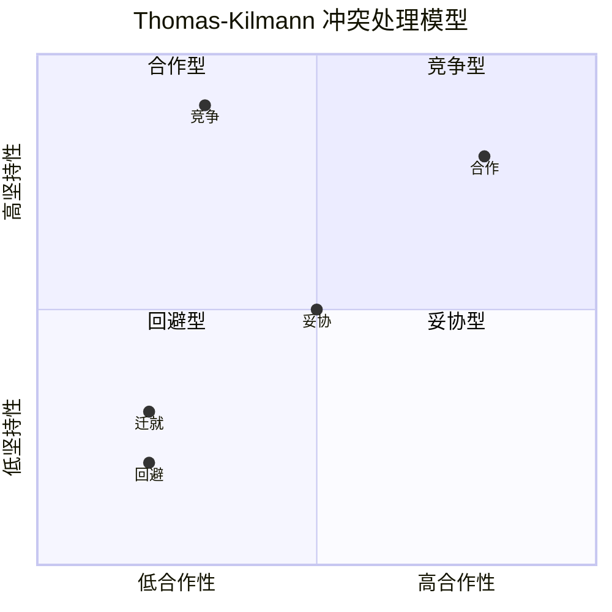
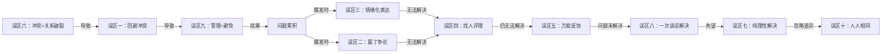

# 冲突管理的常见误区

## 本章导航

冲突管理中有大量"直觉正确但实践有害"的认知陷阱。这些误区根植于文化传统、个人经验和认知偏差，不经过系统反思很难自我察觉。本章逐一拆解十个最典型的误区，每个误区均包含**错误认知的来源、心理学机制解释、真实场景案例和可操作的纠正方案**。

## 自查清单：你中了几个？

在阅读具体误区之前，先做一个快速自检。以下10个陈述，如果你对其中3个以上表示认同，说明你在冲突管理中存在需要修正的认知模式。

| 序号 | 陈述 | 你的判断 |
|------|------|----------|
| 1 | 不提问题就等于没有问题 | ☐ 是 ☐ 否 |
| 2 | 在争论中说服对方是解决冲突的关键 | ☐ 是 ☐ 否 |
| 3 | 该强硬时就要让对方感受到压力 | ☐ 是 ☐ 否 |
| 4 | 找个公正的人评评理就好了 | ☐ 是 ☐ 否 |
| 5 | 双方各退一步总能找到平衡点 | ☐ 是 ☐ 否 |
| 6 | 好关系不应该有冲突 | ☐ 是 ☐ 否 |
| 7 | 只要道理讲通了，问题就解决了 | ☐ 是 ☐ 否 |
| 8 | 一次深度沟通应该能搞定 | ☐ 是 ☐ 否 |
| 9 | 冲突管理的目标就是减少冲突 | ☐ 是 ☐ 否 |
| 10 | 别人处理冲突的方式应该和我一样 | ☐ 是 ☐ 否 |

认同越多，越需要认真阅读本章内容。但不必焦虑——识别误区本身就是改变的第一步。

---

## 误区一：回避冲突，问题自然会消失

### 错误认知

"忍一时风平浪静，退一步海阔天空"——这句话被无数人奉为处世金律。在东亚文化中，"和为贵"的传统使得回避冲突被赋予了道德正当性：不争是修养，忍让是大度，沉默是智慧。许多人将回避视为成熟的标志，认为只要不去面对冲突，时间会冲淡一切，问题会自行消解。

这种信念在短期内确实能带来"好处"——避免了当面交锋的尴尬、省去了沟通的精力消耗、维护了表面的和谐气氛。但这些"好处"是有代价的，而且代价会随时间不断累积。

### 为什么这是误区

回避不会消除冲突的根源，只会让冲突转入"地下"。心理学中有一个概念叫**"未完成事件"（unfinished business）**——格式塔心理学认为，未被表达和处理的情感体验不会消失，而是会被压抑到潜意识中，持续影响人的行为和情绪。

回避冲突导致的后果是多维度的：

**个人层面：**
- **累积爆发**：情绪如同高压锅中的蒸汽，不释放就会越积越多。研究显示，长期压抑愤怒的人更容易出现突发性的"火山爆发"——一次看似微小的触发事件就能引发远超正常范围的情绪反应。哈佛大学一项持续12年的追踪研究发现，习惯性压抑愤怒的人，心血管疾病风险比正常表达情绪的人高出约31%
- **被动攻击**：不直接表达不满，而是通过拖延、"忘记"承诺、冷淡回应、阴阳怪气等方式间接表达。这种模式极具破坏性——它既不解决问题，又持续制造伤害，而且因为没有"正面冲突"的证据，当事人可以否认自己有任何不满
- **身心健康受损**：长期压抑情绪会导致焦虑、抑郁、失眠和免疫功能下降。心身医学（psychosomatic medicine）的研究反复证实，情绪压抑与胃溃疡、偏头痛、慢性疲劳等症状存在显著相关性

**关系层面：**
- **关系疏远**：当事人选择减少接触，关系逐渐淡化。这种疏远往往不是突然发生的，而是在一次次回避中慢慢积累——从每天聊天变成每周一次，从每周一次变成逢年过节，最后彻底断联
- **信任腐蚀**：当一方发现另一方总是在回避问题时，会逐渐失去对这段关系的信心。"他从来不说真话""她心里有事从来不说"——这种感受会慢慢侵蚀关系的基础

**组织层面：**
- **群体思维（groupthink）**：在团队中，如果回避冲突成为文化，不同意见会被压制，决策质量会急剧下降。心理学家欧文·贾尼斯（Irving Janis）研究了多个重大决策失败案例（如猪湾事件、挑战者号灾难），发现群体思维是核心原因之一
- **创新枯竭**：创新需要健康的分歧和碰撞。一个"和和气气"的团队往往也是一个缺乏创造力的团队

### 回避行为的自我觉察矩阵

以下矩阵帮助你识别自己是否正在滑入回避模式。左侧是回避的"伪装形式"——表面上看似合理的行为，实质上是在回避冲突：

| 伪装形式 | 表面理由 | 真实动机 | 潜在后果 |
|---------|---------|---------|---------|
| "等时机成熟再说" | 在寻找合适的时机 | 永远等不到"完美时机" | 问题持续恶化 |
| "我先观察观察" | 收集更多信息 | 用信息收集替代行动 | 错过最佳处理窗口 |
| "发个微信说吧" | 文字更清晰 | 回避面对面的情绪张力 | 信息被误读，冲突升级 |
| "让别人去说" | 借助更有影响力的人 | 不愿承担正面沟通的风险 | 丧失关系主动权 |
| "这次算了" | 大度宽容 | 害怕冲突的后果 | 对方不知问题存在，重复犯错 |
| "忙完这阵再说" | 当前有更紧急的事 | 将冲突排到永远的"下一次" | 累积到不可收拾 |

### 真实场景

> 张伟是一家互联网公司的产品经理。他与技术负责人李明在项目优先级上存在严重分歧——张伟认为应该先做用户增长功能，李明认为应该先解决技术债务。张伟觉得直接争论会伤感情，选择了沉默和配合。三个月后，技术债务问题引发了一次线上事故，导致用户流失。张伟在复盘会上终于爆发，把三个月的不满全部倾泻而出。李明震惊之余感到愤怒——"你当初为什么不说？"两人关系从此破裂，项目也陷入了困境。如果张伟在最初就进行一次坦诚的优先级讨论，可能只需要30分钟就能达成共识，但三个月的回避最终造成了数十万的损失和一段不可修复的合作关系。

### 正确做法

回避可以作为**暂时的情绪管理策略**，但绝不应当成为默认的冲突处理方式。以下是具体的操作框架：

**第一步：识别回避的信号**
- 你发现自己在想"算了，不说了"
- 你开始减少与某人的非必要接触
- 你用"没事""都行""随便"来回应重要问题
- 你对某人产生了说不清的烦躁感，但不愿深究原因

**第二步：评估回避的合理性**
- **可暂时回避的情况**：双方情绪过于激动、场合不适合（如公开场合）、需要时间收集信息
- **不可回避的情况**：涉及核心利益、反复出现的问题、已经影响到工作效率或关系质量

**第三步：主动创造对话条件**
- 选择合适的时机和私密的环境
- 用"我"语句开启对话："关于XX事情，我有些想法想和你聊聊"
- 设定对话框架："我希望我们能找到一个双方都满意的方案"

**回避转对话的万能开场模板：**

"关于[具体事情]，我一直在思考。我注意到[客观描述现象]，
这让我有些[感受]。我想和你聊聊，听听你的想法。
我不是要指责谁，而是希望我们一起找到更好的处理方式。"

示例填充：
> "关于上次项目排期的事情，我一直在思考。我注意到我们对优先级的看法有些不同，这让我有些担心项目方向。我想和你聊聊，听听你的想法。我不是要指责谁，而是希望我们一起找到更好的处理方式。"

记住一条铁律：**问题不会因为你不看它就消失——你不去找问题，问题会来找你。而且问题来找你的时候，往往已经比你主动面对时大了十倍。**

---

## 误区二：赢了争论就是赢了冲突

### 错误认知

很多人在冲突中追求"我对你错"的结果，认为只要在道理上说服对方、在争论中占上风，冲突就解决了。他们将冲突视为一场零和博弈——我赢你就必须输。

这种认知的根源在于将"冲突"等同于"辩论赛"。在辩论赛中，胜负确实取决于谁的论证更有力。但在现实冲突中，"赢了道理"和"解决了问题"之间隔着一条巨大的鸿沟。

### 为什么这是误区

在冲突中"赢了"争论，往往意味着：

- **对方感到挫败和不满**：即使对方在理性上被说服，情感上也会感到被压制、被否定。这种挫败感不会因为"你说得对"就消失——相反，它会被记录在关系的记忆中，成为未来冲突的火种
- **关系受到损害**：心理学中的**"报复性公正"（retaliatory justice）**研究表明，感到在冲突中"输了"的人，会在未来的互动中寻找"扳回一城"的机会。你今天赢了一场争论，可能要为此付出未来十次合作的成本
- **真正的解决方案被忽视**：当你全力投入"证明自己是对的"时，你的注意力会从"什么才是最好的结果"偏移到"如何让对方认输"。这两个目标之间的差距可能很大
- **合作意愿降低**：没有人愿意长期与一个"总是要赢"的人合作。你的"赢"会让对方在未来选择退缩、隐瞒信息、减少配合

管理学大师史蒂芬·柯维说过："在人际交往中，如果你赢了争论却输了关系，那你其实是输了。"这句话的深刻之处在于：在大多数现实场景中，关系的价值远高于某次争论的胜负。

### "赢"的隐性成本分析

很多人只看到"赢了争论"的即时收益（证明了自己是对的、获得了决策权），却忽略了巨大的隐性成本：

| 维度 | 即时收益 | 隐性成本 | 成本倍率 |
|------|---------|---------|---------|
| 信息获取 | 对方暂时服从 | 对方未来不再主动分享信息 | 3-5倍 |
| 执行效率 | 方案快速推进 | 对方消极执行、不做额外努力 | 2-4倍 |
| 关系资本 | 短期权威感 | 长期信任和善意的消耗 | 5-10倍 |
| 团队氛围 | 个人话语权提升 | 其他成员噤声、不再提出异议 | 难以量化 |
| 未来冲突 | 本次快速了结 | 对方积累怨气，下次冲突更激烈 | 指数级 |

> 所谓"成本倍率"是指：赢一次争论获得的收益为1，其导致的隐性损失相当于收益的N倍。例如，赢了一次方案争论（收益=按你的方案执行），但对方因此减少了信息共享，导致你未来做出3-5个次优决策。

### 真实场景

> 王芳是一位资深设计师，在一次方案评审会上，她用详细的数据和案例有力地反驳了客户对设计方案的质疑。从专业角度看，她的论证无懈可击，客户最终"同意了"。但在后续项目中，这位客户开始频繁要求修改细节、拖延确认时间、绕过王芳直接找她的上级沟通。王芳赢了那场争论，但她输掉了客户信任，也给自己制造了数月的额外工作量。

### 正确做法

将冲突的目标从**"赢"**转变为**"解决问题"**。具体策略：

**转换提问方式**

| 从"赢"思维 | 转为"解决"思维 |
|------------|----------------|
| 我怎么证明他是错的？ | 我们各自的核心需求是什么？ |
| 我的方案为什么更好？ | 有没有兼顾双方需求的方案？ |
| 他为什么就是不听？ | 他的顾虑和担忧是什么？ |
| 我怎么让他认输？ | 他需要什么才会觉得公平？ |

**实践"面子管理"**
- 即使你在道理上完全正确，也要给对方留有台阶
- 用"你提出的这个角度很有价值，同时我补充一个考虑"替代"你这个想法不行"
- 在达成共识时，强调对方贡献的价值："正是因为你的质疑，我们才能把方案考虑得更周全"

**"让对方赢在面子，你赢在里子"的实操话术：**

错误示范：
"你的方案在技术上根本不可行，我之前就说过……"

正确示范：
"你提出的方向很有前瞻性。我补充一下落地层面的约束条件，
我们一起看看怎么在你的思路上做出调整，让它既能实现你的核心目标，
又满足技术可行性。"

**建立"双赢检查"习惯**
在每次冲突讨论结束前，问自己一个问题：对方走出这个房间时，他是感到"我输了"还是"我们一起找到了好方案"？如果是前者，你需要重新调整你的沟通策略。

---

## 误区三：情绪化表达能表明立场和力量

### 错误认知

有些人认为，在冲突中大声说话、拍桌子、用激烈言辞能显示自己的坚定和力量，能让对方"知道怕"从而让步。他们将情绪化表达视为一种有效的"威慑"手段——"我发火了，说明我真的很在意，对方应该会重视。"

这种信念在某些文化背景和权力关系中似乎被"验证"过——上级发火，下属确实会立刻行动。但需要区分的是：对方是因为认同你的观点而行动，还是因为恐惧而服从？恐惧驱动的行为变化是不可持续的，而且会严重损害信任。

### 为什么这是误区

情绪化表达的效果恰恰与预期相反：

**神经科学层面：**
当一个人的杏仁核（amygdala，负责情绪处理的脑区）被激活时，前额叶皮层（prefrontal cortex，负责理性思考和决策的脑区）的活动会被显著抑制。神经科学家丹尼尔·格尔曼（Daniel Goleman）将这种现象称为**"杏仁核劫持"（amygdala hijack）**——在情绪极度激动时，人的理性思考能力会急剧下降，进入"战斗或逃跑"模式。

这意味着两件事：第一，你自己在情绪激动时说出的话、做出的判断，质量会远低于正常水平；第二，对方在面对你的攻击性表达时，会本能地进入防御状态，根本听不进你的观点。

**情绪化表达的"连锁反应"：**

**沟通效果层面：**
- **降低可信度**：当一个人情绪失控时，他的话即使有道理也会被大幅减弱说服力。旁观者的直觉反应是"他这么激动，是不是理亏才只能靠嗓门？"
- **激发对方的防御和反击**：情绪化表达是一种攻击信号，会触发对方的"战斗或逃跑"反应。在生理层面，对方的心率会加速、肌肉会紧张、注意力会集中在"如何保护自己"而非"如何理解你的观点"
- **模糊问题焦点**：情绪化的指责让讨论偏离了实质问题，变成了一场情绪对抗——对方不再回应你的诉求，而是回应你的态度："你这是什么态度？"
- **损害个人形象**：在旁观者眼中，情绪失控是自制力差的表现。无论你在争论中多么有理，一次情绪失控可能需要很长时间来修复你的职业形象

### 真实场景

> 陈刚是一家制造企业的生产主管。在一次质量事故的复盘会上，他对负责检验的员工大发雷霆，当众指责对方"不负责任""拿公司的事当儿戏"。员工当时沉默不语，但事后提出了离职。更严重的是，其他员工从此在陈刚面前变得噤若寒蝉，发现问题也不敢主动上报——因为他们害怕被"骂"。三个月后，又发生了一次更严重的质量事故，而这次事故的隐患其实在一个月前就有员工发现了，但因为害怕被骂而选择了沉默。

### 正确做法

在冲突中保持冷静和理性，不是压抑情绪，而是**管理情绪的表达方式**。

**紧急降温策略（适用于情绪即将失控的时刻）：**
1. **"暂停"话术**："我需要几分钟冷静一下，我们稍后再继续讨论。"这不是逃避，而是负责任的情绪管理
2. **4-7-8呼吸法**：吸气4秒→屏气7秒→呼气8秒，重复3-4次，可以快速激活副交感神经系统，降低心率和血压
3. **物理分离**：暂时离开冲突场景——去倒杯水、去洗手间、去走廊走一圈。物理距离能有效降低情绪强度
4. **认知重评**：在心中快速问自己——"一年后这件事还重要吗？""对方是不是也承受着我不知道的压力？"——这种视角切换能在几秒内降低情绪强度

**日常训练策略（长期提升情绪管理能力）：**
1. **情绪日记**：每天记录3次情绪波动的触发点、强度和应对方式，持续2-4周后你会对自己的情绪模式有清晰的认知
2. **"我"语句转化训练**：将"你总是……""你从来不……"转化为"当XX发生时，我感到……因为……"。这不是文字游戏，而是将"攻击对方"转换为"表达自己的感受"
3. **冲突预演**：在进入可能有冲突的对话前，先在脑中预演一遍——预想对方可能的反应、自己可能被触发的情绪点，提前准备应对方案

**从"情绪化"到"有力量"的表达转化：**

| 情绪化表达（无效） | 有力量的表达（有效） | 为什么后者更有力量 |
|-------------------|-------------------|------------------|
| "你怎么又迟到了！" | "这是本月第四次迟到，我们需要谈谈这对团队的影响" | 用事实替代情绪，力量来自证据 |
| "这个方案就是垃圾！" | "这个方案在三个关键维度上存在风险，我逐一说明" | 用结构化批评替代笼统否定 |
| "你到底有没有在听？" | "我发现我们对刚才讨论的内容理解可能不同，你复述一下你的理解？" | 用建设性请求替代指责 |
| "我不干了！" | "在当前条件下，我无法保证这个任务的质量，我们需要调整资源配置或时间线" | 用专业判断替代情绪威胁 |

**情绪≠不能表达**

需要强调的是，"不情绪化表达"不等于"不表达情绪"。你完全可以说"我对这个结果感到非常失望和担忧"——这是表达情绪。但拍桌子吼"你怎么搞的！"——这是被情绪控制。区别在于：前者是你在主导情绪的表达，后者是情绪在主导你的行为。

**情绪表达的"温度计"模型：**

1级（冰冷）：完全不表达，让人摸不着头脑
2级（微凉）：只说事实，完全忽略感受 → "数据不对"
3级（适中）：事实+适度感受 → "数据不对，我有些担心进度"
4级（温热）：事实+感受+影响 → "数据不对，我很担心，这会影响交付日期"
5级（灼热）：情绪主导 → "你们怎么搞的！数据全是错的！"

最佳区间是3-4级：既表达了真实感受，又保持了理性框架。

---

## 误区四：找第三方评理就能解决问题

### 错误认知

当冲突发生时，很多人习惯于找第三方"评理"——可能是共同的朋友、上级领导、家人，甚至社交媒体上的网友。他们认为第三方能够公正地判断谁对谁错，从而解决冲突。"你去问问别人，看谁有道理！"——这是冲突场景中极为常见的一句话。

这种认知背后有一个隐含假设：冲突的根本原因是"一方对一方错"，只要有人能指出谁对谁错，错的一方就会认错改正，冲突就解决了。但现实中的冲突几乎从来不是这么简单。

### 为什么这是误区

"找人评理"这一行为本身就会制造新的问题：

- **第三方几乎不可能获得完整信息**：他们只能基于一方或双方的叙述来判断，而叙述本身就会受到记忆偏差、自我服务偏差和情绪滤镜的影响。你向朋友倾诉时，会不自觉地强调对自己有利的细节、淡化对自己不利的部分。第三方基于这种不完整信息做出的"公正判断"，实际上很可能偏离事实
- **"评理"强化了错误框架**：它把冲突框定为"谁对谁错"的问题，而不是"如何解决问题"的问题。这两个框架导向完全不同的方向——前者是零和博弈，后者是合作探索
- **第三方介入增加面子压力**：一旦有第三方知道冲突的存在，当事人就会感到"不能丢面子"的压力。这种压力会让他们更难做出让步或承认错误，因为那意味着在第三方眼中"输了"
- **"评理"可能加剧对立**：第三方的判断往往会让一方感到被支持、另一方感到被孤立，这会加深双方的对立情绪。在社交媒体上"挂人"更是火上浇油——将私人冲突变成公共事件，引入大量不了解全貌的旁观者发表意见，把原本可控的冲突推向失控
- **即使判断有利于你，对方也未必接受**：对方可能会认为第三方"不了解情况"或"偏向你"。你花精力争取来的"公正评判"不仅没解决问题，还可能让对方感到"你们联合起来对付我"

### 第三方介入的风险矩阵

| 介入方式 | 信息完整性 | 面子压力 | 关系修复性 | 适用场景 |
|---------|-----------|---------|-----------|---------|
| 社交媒体"挂人" | 极低（单方面叙述） | 极高 | 极差 | 几乎不适用 |
| 找共同朋友评理 | 低（二手信息） | 高 | 差 | 不适用 |
| 向上级告状 | 中（可能有调查） | 很高 | 差 | 仅限制度性问题 |
| 专业调解 | 高（结构化流程） | 低（保密） | 好 | 复杂利益冲突 |
| 调解型第三方 | 中高 | 中 | 较好 | 直接沟通失败后 |

### 真实场景

> 小刘和室友小王因为公共区域的清洁问题产生了冲突。小刘在微信群里发了一段消息，描述小王的种种"不良习惯"，并@了几个共同朋友让他们"评评理"。朋友们纷纷站队，有的支持小刘，有的觉得小刘"小题大做"。小王感到被公开羞辱，拒绝再和小刘直接沟通，要求通过第三方传话。最终，小刘和小王的关系彻底破裂，小王提前搬出了合租的房子。原本一个"谁来打扫客厅"的问题，因为"找人评理"升级成了两个人社交圈的分裂。

### 正确做法

**优先尝试直接沟通**

在寻求第三方帮助之前，先问自己：我是否已经尽了最大努力与对方直接沟通？如果还没有，先尝试以下步骤：
1. 选择合适的时间和私密的环境
2. 明确表达自己的诉求和感受
3. 主动倾听对方的立场
4. 共同探讨可能的解决方案

**何时需要第三方介入？**

第三方介入并非完全不可取，关键在于**选择什么角色的第三方**：

| 裁判型第三方 | 调解型第三方 |
|-------------|-------------|
| 判断谁对谁错 | 帮助双方沟通和理解 |
| 一方"赢"一方"输" | 探索双方都能接受的方案 |
| 可能加剧对立 | 有助于修复关系 |
| 适用于：规则明确的事实争议 | 适用于：关系冲突、利益冲突 |

**选择调解型第三方的标准：**
- 双方都信任且尊重的人
- 了解相关背景但没有明显立场偏向
- 具备良好的倾听和沟通能力
- 能够保密，不会将冲突细节外传

**向上级求助的正确方式：**

当你确实需要上级介入时，避免"告状"模式，采用"请求支持"模式：

错误示范（告状）：
"领导，小王不配合我的工作，他总是拖延交付，
上次还当众反驳我的方案……"

正确示范（请求支持）：
"领导，我和小王在项目执行节奏上有一些分歧。
我已经和他直接沟通过两次，但我们在[具体问题]上
还没有找到双方都认可的方案。我希望能得到您的建议，
或者您是否方便参与一次三方讨论？"

区别在于：前者是"让领导替我做主"，后者是"我已尽力，需要组织层面的支持"。

**专业调解的价值**

如果冲突涉及重大利益或复杂情绪，可以考虑寻求专业调解服务。专业的调解者不会告诉你"谁是对的"，而是通过结构化的流程帮助双方：
1. 各自表达诉求和感受（在安全的环境中）
2. 识别共同利益和各自的核心需求
3. 共同生成解决方案选项
4. 达成双方都能接受的协议

研究显示，经过专业调解的冲突，协议执行率远高于法院判决或自行协商的结果。

---

## 误区五：妥协是最理想的冲突解决方式

### 错误认知

有些人将妥协视为解决冲突的万能钥匙——双方各退一步，折中一下，问题就解决了。这种"各打五十大板"的做法看起来很公平，也很快捷。当双方都不想继续争论时，妥协似乎是阻力最小的出路。

这种认知将"公平"误解为"平分"，将"解决"误解为"快速了结"。它忽略了冲突背后可能存在的深层需求差异，以及不同解决方案之间的质量差距。

### 为什么这是误区

妥协虽然是Thomas-Kilmann冲突处理模型中的五种风格之一，但它并不总是最佳选择，甚至在很多时候是一种"看起来解决了但其实没解决"的方案：

**方案质量问题：**
- **妥协可能产生"半吊子"方案**：一个经典的故事——两个人争一个橙子，最终一人一半。但如果深入了解一下，甲需要橙子皮做蛋糕，乙需要橙子汁喝。如果充分沟通，完全可以甲拿全部的皮、乙拿全部的汁——双方的需求都能得到100%满足。妥协产生的"各一半"方案，实际上让双方都只满足了50%的需求
- **妥协没有深入探索问题的本质**：它只是在表面进行了利益分配，没有触及冲突背后的真正利益和需求。这种"治标不治本"的做法，往往导致冲突在不久后再次出现

**关系影响：**
- **频繁妥协可能被视为软弱**：如果你总是在冲突中选择妥协，对方可能会逐渐形成"只要你坚持，他就会让步"的预期，导致在未来的互动中更加强硬
- **妥协可能积累怨气**：每次妥协都意味着你在某种程度上放弃了自己认为重要的东西。如果这些放弃没有被真正消化和接受，它们会变成内心深处的不满，等待合适的时机爆发

**组织影响：**
- **在重大决策中妥协可能带来灾难性后果**：如果你认为A方案正确、同事认为B方案正确，你们"妥协"选择了A和B的混合方案C——C可能既不具备A的优势也不具备B的优势，甚至引入了两者的缺陷。在技术决策、战略规划等领域，"正确的方案"和"错误的方案"之间的折中方案往往是最差的选择

### "橙子困境"的深层分析

橙子故事的真正教训不是"要沟通需求"，而是**妥协的系统性盲区**——它只看到表面诉求（"我要橙子"），看不到底层需求（"我需要橙皮"vs"我需要橙汁"）。

这种盲区在真实冲突中以多种形式出现：

| 表面诉求 | 可能的底层需求A | 可能的底层需求B | 妥协方案 | 最优方案 |
|---------|---------------|---------------|---------|---------|
| "我要加薪" | 经济压力 | 被认可的需求 | 给一半涨幅 | 加薪+公开表彰 |
| "这个功能必须做" | 用户反馈驱动 | 个人KPI压力 | 做简化版 | 完整版+调整KPI |
| "会议时间改到下午" | 上午效率低 | 下午需要送孩子 | 改到中午 | 弹性会议时间 |
| "我要搬到离公司近的地方" | 通勤时间长 | 想靠近商圈生活 | 折中地段 | 远程办公+靠近商圈 |

**关键启发**：在选择妥协之前，先花5分钟深入追问——"你真正想要的是什么？""这个对你来说为什么重要？"——很可能发现一个不需要任何一方让步的最优解。

### 正确做法

不要将妥协作为默认选择。在选择冲突处理策略之前，先做一个**四维评估**：

**何时妥协是合理的选择：**
- 双方的核心利益都不受影响，只是偏好差异
- 时间紧迫，没有条件深入探索
- 议题本身不重要，不值得投入大量精力
- 先达成一个临时方案，后续再优化

**何时应该避免妥协而选择合作：**
- 涉及双方的核心利益和长期关系
- 议题复杂，存在创造性的双赢可能
- 妥协会引入明显的质量或安全隐患
- 其中一方的妥协会积累严重不满

**从妥协升级到合作的具体话术：**

"我注意到我们各让一步之后，双方都不是很满意。
不如我们先退一步：不急着定方案，而是各自说说
这个事情对自己最重要的点是什么？
也许我们能找到一个不需要谁让步的办法。"

如果确实需要妥协，确保妥协是基于**对各方核心利益的充分理解**，而不是简单地"切一半"。问自己：这次妥协，双方是真的满意，还是只是"算了不想吵了"？后者不是真正的解决。

---

## 误区六：冲突说明关系出了问题

### 错误认知

很多人将冲突视为关系出现裂痕的标志，认为好的关系应该是和谐无冲突的。当冲突发生时，他们会觉得"这段关系有问题"，甚至考虑结束关系。这种认知在亲密关系中尤为常见——"我们吵架了，是不是不合适？"

这种信念的根源在于一种浪漫化的"理想关系"想象：真正合适的人应该天然默契、无需磨合、永不争吵。这种想象与现实之间的落差，会让人在面对正常的关系冲突时产生不必要的恐慌。

### 为什么这是误区

研究表明，完全没有冲突的关系反而可能是不健康的。它可能意味着：
- 一方或双方在压抑真实想法和需求
- 双方缺乏足够的亲密感和安全感来表达分歧
- 关系停留在表面层次，没有深入到能产生摩擦的深度
- 存在不平等的权力关系，弱势一方不敢表达不同意见

心理学家约翰·戈特曼（John Gottman）在长达40年的婚姻关系研究中，追踪了数千对夫妻的互动模式。他的发现颠覆了很多人的直觉认知：

- **幸福的婚姻不是没有冲突的婚姻，而是善于处理冲突的婚姻**。戈特曼发现，69%的婚姻冲突是"永久性问题"（perpetual problems）——即不会被彻底解决、只能被管理的问题。幸福的夫妻和不幸福的夫妻面对的冲突类型没有显著差异，区别在于他们如何处理这些冲突
- **"从不吵架"的夫妻，离婚率不一定低**。很多看似和谐的夫妻，冲突只是被隐藏了——一方或双方选择压抑不满，直到某一天再也压不住，关系就会以突然且彻底的方式破裂
- **冲突处理的"魔法比例"**：戈特曼发现，在稳定的婚姻中，积极互动（如幽默、好奇、关爱）与消极互动（如批评、蔑视、防御、冷暴力）的比例约为5:1。冲突本身不重要，冲突中积极与消极互动的比例才重要

### 关系健康度的"冲突指标"

不是所有冲突都相同。以下指标帮助你判断一段关系中的冲突是"健康的信号"还是"危险的信号"：

| 指标 | 健康信号 | 危险信号 |
|------|---------|---------|
| 冲突频率 | 偶尔发生，间隔较长 | 频繁发生，几乎每次互动都有 |
| 冲突内容 | 围绕具体事务 | 反复翻旧账、人身攻击 |
| 冲突中的尊重 | 即使激烈也保持基本尊重 | 出现蔑视、嘲讽、羞辱 |
| 冲突后修复 | 有明确的修复行为 | 冷战、回避、假装没发生 |
| 冲突后的改变 | 双方有实际的行为调整 | 同样的问题反复出现 |
| 冲突中的安全感 | 敢于暴露脆弱和真实想法 | 只敢说"安全"的话 |
| 情感基调 | 积极互动远多于消极 | 消极互动占主导 |

**戈特曼的"末日四骑士"——关系恶化的四个预警信号：**
1. **批评（Criticism）**：不是对事的抱怨，而是对人的攻击——"你怎么总是这样？"vs"这件事让我很失望"
2. **蔑视（Contempt）**：翻白眼、嘲讽、冷笑话、居高临下——这是关系破裂的最强预测因子
3. **防御（Defensiveness）**：拒绝承认任何问题，把所有责任推给对方
4. **石墙（Stonewalling）**：完全关闭沟通，冷暴力，不回应

如果一段关系中频繁出现这四种模式，那不是"正常的冲突"，而是关系恶化的信号。

### 真实场景

> 一对结婚8年的夫妻来到婚姻咨询师面前。妻子说："我们从来不吵架，但我觉得我们的关系像一潭死水。"咨询师在深入了解后发现，这对夫妻在过去的5年里系统性地回避了所有可能引发冲突的话题——消费习惯、育儿方式、与双方父母的关系、性生活的频率和质量。他们不是没有分歧，而是达成了一种默契：不提就不会吵，不吵就不会有问题。但这种"无冲突"的代价是两个人在情感上越来越疏远，最后变成了"住在同一个屋檐下的室友"。

### 正确做法

**转变对冲突的认知框架：**

冲突不是关系的"bug"，而是关系的"feature"。它说明双方足够信任、足够在乎，才愿意暴露真实的自己。一对从不争吵的朋友，可能只是两个从不深入交往的熟人。

**建立"健康冲突"的标准：**

| 健康的冲突 | 不健康的冲突 |
|-----------|-------------|
| 对事不对人 | 人身攻击、翻旧账 |
| 目标是解决问题 | 目标是伤害对方 |
| 双方都能表达 | 一方压制另一方 |
| 冲突后关系修复 | 冲突后冷战或疏远 |
| 关注需求和感受 | 只关注立场和输赢 |
| 有建设性的结果 | 问题悬而未决 |

**冲突后的修复仪式**

冲突本身不会损害关系，冲突后缺乏修复才会。戈特曼研究发现，成功的夫妻在冲突后会进行"修复尝试"（repair attempts）：
- 一个幽默的玩笑打破僵局
- 一个拥抱或握手表达善意
- 一句"对不起，我刚才太激动了"
- 一个主动的邀请："我们出去走走，换个环境聊聊？"

关键是双方都能识别并接受这些修复信号。

**"修复四步法"模板：**

1. 承认（Acknowledge）："刚才的对话中，我说了一些过激的话。"
2. 共情（Empathize）："我能理解那让你感到不舒服/受伤。"
3. 责任（Own）："那是我的问题，不应该用那种方式表达。"
4. 前进（Move forward）："我们能不能重新聊一下这个话题？
   这次我会注意我的表达方式。"

---

## 误区七：讲道理就能解决所有冲突

### 错误认知

有些人认为，只要逻辑清晰、道理充分，就能说服任何人，解决任何冲突。他们倾向于用数据、事实和逻辑来处理冲突，忽略情感和关系的因素。"我不是在针对你，我只是在陈述事实"——这句话几乎成了这类人的口头禅。

这种认知的底层假设是：人是理性的，只要信息充分、逻辑正确，人就会做出"正确"的决策。但大量的心理学和行为经济学研究已经证明，这个假设是错误的。

### 为什么这是误区

诺贝尔经济学奖得主丹尼尔·卡尼曼（Daniel Kahneman）的研究表明，人类的决策受到直觉和情感的强烈影响，远非纯理性所能概括。在冲突情境中，这个特点更加突出：

**冲突的本质往往是情感需求，而非事实分歧**

表面上看，很多冲突似乎是在争论"事实"——"你到底有没有说过这句话？""这个数据到底对不对？"但深入分析会发现，真正的冲突焦点往往是：
- **被尊重的需求**："你没有认真对待我的意见"
- **被理解的需求**："你根本不明白我为什么这么在意"
- **安全感的需求**："我担心这样做会出问题"
- **归属感的需求**："我感觉自己被排斥在决策之外"

这些情感需求无法用数据和逻辑来满足。你列出100条数据证明方案A优于方案B，但如果对方的真正不满是"你没有在决策过程中征询我的意见"，那100条数据不仅解决不了冲突，反而会让对方感到更加被忽视。

**冲突的"冰山模型"：**

**"讲道理"可能被体验为不尊重**

当一方在冲突中持续"讲道理"时，另一方的体验往往是：
- "他只关心对错，不关心我的感受"
- "她把我们的关系当成了一场考试"
- "他觉得自己比我聪明，用道理来压我"

心理学家约翰·戈特曼的研究发现，婚姻中的"道理男"（Mr. Logic）模式——即在伴侣表达情感时回应以逻辑分析——是关系满意度的强预测因子，而且是负面的。伴侣不想要一个分析师，她/他想要一个能理解自己感受的人。

### 真实场景

> 一位技术经理在与下属的绩效面谈中，用详细的代码审查数据、bug统计和项目时间线来论证下属的绩效不达标。从数据角度看，论证无懈可击。但下属在面谈后提出了离职——他的真实感受是"公司从来没有给过我足够的支持和培训，现在却用数据来证明我不行"。经理用数据解决了"绩效问题"，但制造了一个"人才流失问题"。

### 正确做法

在冲突管理中，需要做到**"先情后理，情理并重"**。

**情感回应的三步法：**
1. **识别情感**：注意对方话语中的情感信号——语调的变化、用词的强度、身体语言的变化
2. **回应情感**：用语言确认对方的感受——"我能感受到你对这件事真的很在意""听起来你感到很失望/担忧/不被尊重"
3. **表达理解**：不一定要同意对方的观点，但要让对方知道你理解他为什么这么想——"如果我站在你的位置，可能也会有同样的感受"

在情感被充分回应之后，对方的理性大脑才会重新上线，这时再进入事实层面的讨论才有效。

**一个实用的对话模板：**

> 第一层（回应情感）："我能理解你为什么感到沮丧，这个结果确实让人失望。"
>
> 第二层（确认理解）："你的核心担忧是XX，对吗？"（等对方确认）
>
> 第三层（进入事实）："在事实层面，我了解到的情况是XX。你觉得有哪些信息是我们需要进一步确认的？"
>
> 第四层（共同解决）："基于这些信息，我们怎么一起找到一个你我都放心的方案？"

**"以情动人，以理服人"不是两个选择，而是先后顺序——先动之以情，再晓之以理。**

**识别"冰山下"真实需求的追问话术：**

当对方的诉求让你觉得"不合理"或"没逻辑"时，不要急于反驳，而是追问深层需求：

"你说的这个方案，对你来说最重要的是什么？"
→ 发现核心关注点

"如果这个问题不解决，你最担心的是什么？"
→ 发现恐惧和不安

"在这件事上，你觉得什么样的结果会让你满意？"
→ 发现真正的成功标准

"在这个过程中，有没有什么时刻让你觉得不舒服？"
→ 发现被忽视的情感需求

这些追问往往能从"争论方案A还是方案B"转向"发现一个对方从未说出口但一直存在的需求"。

---

## 误区八：一次谈话就能彻底解决冲突

### 错误认知

有些人认为，只要进行一次充分的沟通，把话说开了，冲突就能彻底解决。如果冲突没有在一次谈话中解决，就会感到失望和挫败——"我们明明已经谈过了，怎么还是老样子？"

这种认知高估了语言沟通的力量，低估了行为改变和信任重建的难度。它把"解决问题"等同于"达成共识"，忽略了从共识到行动之间的漫长距离。

### 为什么这是误区

复杂的冲突往往经历了长时间的积累，其根源涉及多个层面的因素。期望通过一次谈话就彻底解决，既不现实也不合理：

- **信任的重建需要时间**：如果冲突已经造成了信任损伤，一次道歉或一次深谈无法瞬间修复。信任的重建需要持续一致的行为——说到做到、言行一致、在小事上积累可靠性。心理学研究显示，信任的重建速度大约是信任破坏速度的1/10到1/5
- **行为模式的改变需要过程**：即使双方在谈话中达成了共识，也需要时间来改变长期形成的习惯和模式。一个习惯在沟通中打断别人的人，不会因为一次谈话就彻底改掉这个习惯——他需要持续的自我提醒、反馈和调整
- **新的问题可能在过程中出现**：解决一个冲突可能暴露更深层的问题。例如，关于"谁来做家务"的冲突解决了，但深入讨论后可能发现更深层的问题是"双方对家庭角色的期待不同"
- **理解和同理心是渐进的**：深层的理解往往需要多次的对话和反思。在第一次谈话中，你可能只是理解了对方的表面诉求；在第二次谈话中，你可能才触及对方的深层需求；在第三次谈话中，你可能才真正理解对方的内心世界

### 冲突解决的"渐进深度"模型

| 阶段 | 对话目标 | 深度 | 常见误区 |
|------|---------|------|---------|
| 第1次 | 各自表达立场和感受 | 表面层 | 急于推动解决方案 |
| 第2次 | 探索真实需求和担忧 | 需求层 | 带着"说服"心态 |
| 第3次 | 共同创造方案 | 方案层 | 只考虑"显而易见"的选项 |
| 持续跟进 | 执行、调整、修复 | 关系层 | 谈完就忘，无跟进机制 |

### 真实场景

> 一家创业公司的两位联合创始人在产品方向上产生了严重分歧。CEO想做B端市场，CTO想做C端产品。经过一次长达4小时的深度沟通，他们达成了"先试B端、半年后评估"的共识。但两周后，CTO又开始在技术会议上质疑B端方向。CEO感到困惑和愤怒——"我们不是已经谈好了吗？"
>
> 问题不在于CTO不守信，而在于：
> 1. CTO在那次谈话中虽然"同意了"，但内心的疑虑并没有真正消除
> 2. 半年的时间框架给了CTO一种"这只是暂时的妥协"的预期
> 3. 在实际执行中，B端开发遇到的技术挑战不断加深了CTO的担忧
>
> 如果他们能建立定期的"方向评估"机制，而不是期望一次谈话解决所有问题，这个冲突会得到更好的管理。

### 正确做法

将冲突解决视为一个**过程**，而非一次**事件**。建立分阶段的目标设定：

**第一阶段（首次谈话）：建立对话**
- 目标：双方表达各自的立场和感受，确认问题的存在
- 成功标志：双方都感到被听见了，即使还没有达成任何共识
- 常见错误：急于推动解决方案，跳过了情感表达的步骤

**第二阶段（第二次谈话）：探索需求**
- 目标：深入了解对方表面诉求背后的真实需求和担忧
- 成功标志：双方能用自己的话准确描述对方的核心需求
- 常见错误：带着"我来说服你"的心态进入谈话

**第三阶段（第三次谈话）：生成方案**
- 目标：基于对双方需求的理解，共同创造解决方案
- 成功标志：找到一个双方都能真正接受（而非勉强忍受）的方案
- 常见错误：只考虑"显而易见"的方案，没有探索创造性选项

**第四阶段（持续跟进）：执行和调整**
- 目标：落实共识，根据实际情况灵活调整
- 常见错误：谈完就忘，没有跟进机制

**"冲突跟进"对话模板：**

开场：
"上次我们聊了[话题]，当时达成的共识是[回顾]。
过去[时间]里，执行情况怎么样？有没有什么新的发现或问题？"

检查点：
1. 行为层面："我们都做到了当时约定的[具体行为]吗？"
2. 效果层面："这些改变带来了什么效果？"
3. 感受层面："你觉得我们的关系/合作有改善吗？"
4. 调整层面："有没有什么需要调整的地方？"

结束：
"那我们接下来的[时间]继续这样，
下次[日期]再check一下进展。"

---

## 误区九：冲突管理就是避免冲突

### 错误认知

许多人将"冲突管理"等同于"冲突避免"——只要不发生冲突，就说明管理得好。他们采取各种预防性措施来确保冲突不会出现，如避免讨论敏感话题、迁就他人的所有要求、建立"不许有不同意见"的团队文化、保持表面上的和谐等。

这种认知将"管理"误解为"消灭"。就像一个城市的管理者如果把"治安管理"理解为"让犯罪率为零"，他可能会采取极端手段压制一切——这种做法本身就会制造更多问题。

### 为什么这是误区

真正的冲突管理不是消灭冲突，而是有效地识别、处理和利用冲突。将"管理"等同于"避免"会导致一系列严重的后果：

**组织层面：**
- **群体思维（groupthink）的温床**：心理学家欧文·贾尼斯的研究表明，当团队过度追求和谐一致时，成员会自我审查不同意见、对领导者的意见随声附和、对外部警告信号视而不见。猪湾入侵、挑战者号航天飞机灾难等重大决策失误，背后都有群体思维的影子
- **决策质量下降**：研究反复证明，适度的认知冲突（即对问题本身的不同看法）能够显著提高决策质量。没有冲突的决策过程，往往意味着没有经过充分的论证和检验
- **创新被压制**：创新的本质是挑战现有假设和方法。一个不允许冲突的环境，也不会允许创新

**个人层面：**
- **个人成长受阻**：冲突处理能力是一种可以通过实践不断提升的技能。回避冲突意味着放弃了所有练习的机会，导致这项能力永远停留在初级水平
- **心理健康受损**：长期压抑真实想法和感受，会导致心理能量的巨大消耗。研究显示，"情绪劳动"（emotional labor）——即在工作中需要伪装真实情绪——与职业倦怠、焦虑和抑郁存在显著相关性
- **关系质量虚假**：表面上和谐，实际上缺乏深度的信任和理解。这种"塑料关系"在风平浪静时看不出问题，一旦遇到真正的挑战就会迅速瓦解

### "冲突管理"vs"冲突避免"的本质区别

| 维度 | 冲突避免 | 冲突管理 |
|------|---------|---------|
| 对冲突的态度 | 冲突是坏事，应消灭 | 冲突是中性的，应管理 |
| 目标 | 零冲突 | 建设性冲突最大化 |
| 方法 | 压制、回避、迁就 | 识别、引导、利用 |
| 短期效果 | 表面和谐 | 可能有阵痛 |
| 长期效果 | 问题累积、关系虚假 | 问题解决、关系深化 |
| 团队氛围 | "和气"但低效 | 坦诚且高效 |
| 创新能力 | 低 | 高 |
| 决策质量 | 低（未充分论证） | 高（经受质疑检验） |

### 正确做法

**区分三类冲突：**

| 冲突类型 | 特征 | 应对策略 |
|---------|------|---------|
| 建设性冲突 | 围绕问题本身的不同观点，出于善意 | 积极鼓励，引导讨论 |
| 破坏性冲突 | 针对人身攻击，出于恶意或报复 | 及时介入，设定边界 |
| 无关紧要的分歧 | 不影响核心利益和关系的微小差异 | 可以忽略或快速妥协 |

冲突管理的目标不是"消灭冲突"，而是：
1. **鼓励建设性冲突**：创造安全的环境，让不同意见能够被表达和讨论
2. **管理破坏性冲突**：设定明确的行为边界，防止冲突升级为人身攻击
3. **忽略无关紧要的分歧**：不把精力浪费在不重要的事情上

**建立"健康冲突"的团队文化：**
- 在会议中主动邀请不同意见："有没有人看到这个方案的风险？"
- 奖励提出异议的行为，即使最终没有采纳
- 区分"对事"和"对人"的讨论，严格禁止人身攻击
- 在团队规范中明确：沉默不等于同意，不同意有义务说出来

**Google"心理安全感"研究的启示：**

Google的"亚里士多德项目"（Project Aristotle）研究了180多个团队，发现**高效团队的第一要素不是成员的能力或经验，而是心理安全感**——即团队成员敢于承担风险、表达不同意见而不害怕被惩罚或嘲笑。

打造心理安全感的具体做法：
1. **领导者先示弱**：主动分享自己的错误和不确定性——"这个决定我也没有100%把握，大家怎么看？"
2. **回应异议时先感谢**："谢谢你提出这个角度，我之前没有考虑到。"——而不是"这个想法不成熟"
3. **设立"魔鬼代言人"角色**：在重要决策中，指定一人专门负责提出反对意见，制度化地保护不同声音
4. **复盘文化**：定期进行"无责复盘"——关注"我们能学到什么"而非"谁该负责"

---

## 误区十：每个人处理冲突的方式都是一样的

### 错误认知

有些人倾向于用自己的冲突处理方式来理解所有人。一个习惯直接面对冲突的人，可能无法理解为什么有人选择回避——"你有什么不满直接说啊，憋着算什么？"一个习惯迂回委婉的人，可能觉得直接表达不满的人"太粗鲁""不懂人情世故"。

这种认知的本质是**"投射偏差"（projection bias）**——假设他人与自己有相同的认知框架、情感模式和行为偏好。

### 为什么这是误区

Thomas-Kilmann冲突处理模型（TKI）将人们的冲突处理风格分为五种基本类型，基于两个核心维度：**坚持性（assertiveness）**——满足自身利益的程度，和**合作性（cooperativeness）**——满足对方利益的程度。

| 风格 | 坚持性 | 合作性 | 典型表现 | 适用场景 |
|------|--------|--------|---------|---------|
| **竞争** | 高 | 低 | 坚持己见，追求赢 | 紧急决策、原则性问题 |
| **合作** | 高 | 高 | 探索双赢，兼顾双方 | 重要关系、复杂问题 |
| **妥协** | 中 | 中 | 各退一步，折中处理 | 时间紧迫、临时方案 |
| **回避** | 低 | 低 | 不直面冲突，推迟处理 | 微小分歧、情绪激动时 |
| **迁就** | 低 | 高 | 优先满足对方，牺牲自己 | 对方需求更重要、关系维护 |

每个人都有自己的**默认风格**（通常1-2种），这种偏好受到多重因素的影响：
- **性格特质**：内向者更倾向于回避或迁就，外向者更倾向于竞争或合作
- **文化背景**：东亚文化更推崇回避和迁就，西方文化更接受竞争和直接对抗
- **成长经历**：在冲突被惩罚的家庭中长大的人，更倾向于回避；在冲突被鼓励的家庭中长大的人，更倾向于直接面对
- **过往经验**：在某次冲突中"赢了"的经历会强化竞争风格，"被伤害"的经历会强化回避风格
- **权力地位**：处于权力优势地位的人更倾向于使用竞争风格，处于弱势地位的人更倾向于使用回避或迁就风格

用自己的标准去评判他人的冲突处理方式，不仅不公平，还会产生新的冲突——"你为什么不能直说？""你为什么这么咄咄逼人？"这些质问本身就是一种冲突升级。

### 跨文化冲突风格差异

文化背景对冲突风格的影响巨大，这在全球化协作中尤为重要：

| 文化维度 | 东亚文化（中国、日本、韩国） | 北美/西欧文化 |
|---------|--------------------------|-------------|
| 直接性 | 偏好间接、含蓄表达 | 偏好直接、明确表达 |
| 面子意识 | 高度重视"面子"，避免公开冲突 | 相对淡化面子，接受公开争论 |
| 私下vs公开 | 先私下沟通，再公开表态 | 公开讨论被视为"透明" |
| 情感表达 | 克制情感，保持冷静 | 适度情感表达被接受 |
| 层级影响 | 冲突风格受权力关系影响大 | 相对扁平，风格一致性更高 |
| "不"的表达 | "我再考虑考虑"="不" | "不"=明确拒绝 |

**跨文化协作中的冲突沟通清单：**
1. 不要用自己文化的"礼貌标准"评判对方的行为
2. 当不确定对方的意图时，私下一对一确认
3. 给对方"保存面子"的空间，即使你认为争论应该公开化
4. 注意语言的字面意思和真实意图之间的差异
5. 在跨文化团队中建立明确的"冲突处理规范"

### 真实场景

> 一家跨国企业的中国团队和美国团队在项目合作中频繁出现摩擦。美国团队习惯在会议上直接指出问题——"This approach won't work because..."；中国团队将这种直接表达视为"当面打脸"和"不给面子"。中国团队习惯先私下沟通、达成默契后再在会议上表态；美国团队将这种行为视为"背后搞小动作"和"不透明"。双方都在用自己文化的冲突处理标准来评判对方，导致合作效率极低。直到一位跨文化顾问介入，帮助双方理解彼此的沟通风格差异，才打破了这个僵局。

### 正确做法

**第一步：认识自己的冲突风格**

通过TKI测评工具（在线搜索"Thomas-Kilmann Conflict Mode Instrument"即可找到免费版本）了解自己的默认风格，以及在什么情况下会切换到其他风格。

**第二步：识别对方的冲突风格**

观察对方的行为模式：
- 在冲突中是主动出击还是等待别人来找？
- 表达不满时是直接了当还是迂回暗示？
- 面对分歧时是坚持己见还是很快让步？
- 遇到问题是立刻处理还是先搁置？

**第三步：调整自己的方式以适配对方**

| 对方的风格 | 你的调整策略 |
|-----------|-------------|
| 回避型 | 创造安全、低压的环境；用书面方式代替面对面；先聊轻松话题再引入冲突议题 |
| 竞争型 | 做好充分准备；用事实和数据支撑你的立场；保持冷静不要被对方的强势吓到 |
| 迁就型 | 主动询问对方的真实想法；给足对方表达的空间和时间；明确表示你需要他们的真实意见 |
| 合作型 | 积极参与深入讨论；准备好具体方案；共同探索创新选项 |
| 妥协型 | 明确你的底线和可以灵活的部分；准备好具体的折中方案 |

**第四步：在团队中建立共识**

在团队层面，可以：
- 进行团队TKI工作坊，让每个人了解彼此的风格差异
- 共同制定团队冲突处理规范——"我们团队鼓励直接表达不同意见"或"我们团队在重大分歧时先一对一沟通再集体讨论"
- 将风格差异视为互补资源——回避型成员可以充当团队的"冷静剂"，竞争型成员可以推动团队直面问题

---

## 小结：从误区到正途的行动框架

以上十个误区是冲突管理实践中最常见的认知陷阱。识别误区只是第一步，更重要的是建立正确的认知框架和可操作的行为习惯。

### 误区速查表

| 误区 | 核心错误 | 一句话纠正 |
|------|---------|-----------|
| 误区一：回避冲突 | 问题会自己消失 | 问题不看它不会消失，只会变大 |
| 误区二：赢了争论 | 赢=解决 | 赢了道理输了关系，就是输了 |
| 误区三：情绪化表达 | 发火=有力量 | 情绪失控是失控，不是力量 |
| 误区四：找人评理 | 第三方=公正 | 评理强化"谁对谁错"的错误框架 |
| 误区五：万能妥协 | 折中=公平 | 不了解需求的折中是双输 |
| 误区六：冲突=破裂 | 和谐=好关系 | 无冲突可能是无深度 |
| 误区七：纯理性解决 | 道理=说服 | 先回应情感，再讨论事实 |
| 误区八：一次解决 | 一次谈=解决 | 冲突解决是过程，不是事件 |
| 误区九：管理=避免 | 零冲突=好管理 | 管理冲突，不是消灭冲突 |
| 误区十：人人相同 | 我的方式=通用方式 | 人和人不同，方式也不同 |

### 误区之间的关联性

这十个误区并非孤立存在，它们之间存在密切的关联：

理解这些关联有助于识别自己的"误区链"——很多人的冲突管理问题不是犯了某一个误区，而是一系列误区的连锁反应。

### 四个核心纠正原则

1. **正确的认知**：冲突是中性的、不可避免的，管理冲突的目标不是消灭冲突，而是将冲突转化为建设性的力量
2. **完整的方法**：兼顾事实与情感、立场与利益、短期与长期。任何只关注其中一个维度的方法都是不完整的
3. **灵活的策略**：根据情境选择合适的冲突处理方式，不固守一种风格。最好的冲突管理者是能够在五种风格之间灵活切换的人
4. **持续的学习**：从每次冲突的经历中反思和改进。每次冲突都是学习的机会——关键是事后反思：这次冲突中，我的处理方式有哪些做得好的地方？有哪些可以改进的？

### 30天误区纠正行动计划

| 周次 | 重点练习 | 具体行动 | 每日投入 |
|------|---------|---------|---------|
| 第1周 | 意识觉察 | 每天记录1次冲突或分歧的处理方式，标注自己使用了哪种风格，是否存在误区 | 10分钟/天 |
| 第2周 | 情绪管理 | 练习"暂停"策略和"我"语句转化，记录效果。每天回顾一次情绪日记 | 15分钟/天 |
| 第3周 | 风格扩展 | 刻意使用一种非自己默认的冲突处理风格，观察效果。向信任的人寻求反馈 | 20分钟/天 |
| 第4周 | 综合应用 | 选择一个长期回避的冲突话题，运用本章方法进行一次建设性对话 | 按实际需要 |

**每周反思模板：**

本周我处理了___次冲突/分歧
我最常用的风格是：___
我发现自己最容易犯的误区是：___
我做得最好的一次是：___（具体描述）
下次我想尝试改进的是：___（具体行动）

识别并纠正这些误区，是从"本能反应"走向"专业管理"的关键一步。冲突管理能力不是天赋，而是可以通过学习和练习不断提升的技能。每一次对误区的觉察和纠正，都是一次能力的升级。

---

> **下一节预告**：了解了冲突管理的常见误区后，我们需要掌握具体的冲突预防策略——如何在冲突爆发之前识别信号、化解隐患，建立冲突预防的长效机制。
