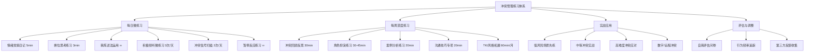
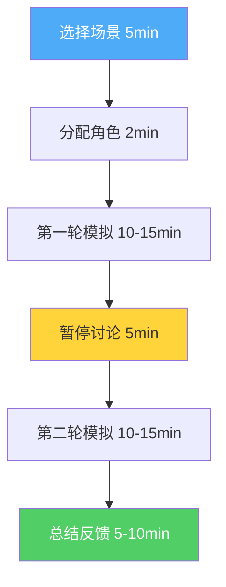
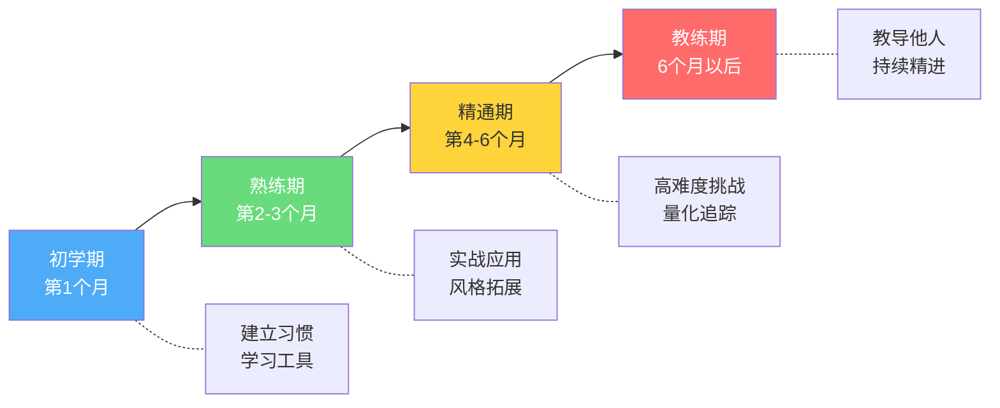

# 冲突管理的练习方法

冲突管理能力不是靠"知道"就能掌握的——它是一种需要反复锤炼的行为技能。正如医学教育中"看一次、做一次、教一次"(See One, Do One, Teach One)的经典训练模式，冲突管理也需要从认知理解走向肌肉记忆，从刻意练习走向本能反应。

本章提供一套完整的练习体系，从每日微习惯到每周深度训练，从个人自练到团队共练，从面对面冲突到数字时代的远程冲突，帮助你系统性地提升冲突管理能力。

***

## 一、为什么需要刻意练习

### 1.1 知道≠做到：认知-行为鸿沟

大多数人在冲突管理中遇到的最大障碍不是"不知道该怎么做"，而是"知道但做不到"。心理学家将这种现象称为"认知-行为鸿沟"(Knowing-Doing Gap)。

哈佛商学院的研究发现，人们在冷静状态下的判断力与压力状态下的行为表现之间存在巨大差异。在一项涉及2000名管理者的调查中，92%的人表示了解"积极倾听"的原理，但在实际冲突场景中，只有不到30%的人能有效执行。

这种鸿沟的产生有三个核心原因：

| 原因 | 机制 | 表现 |
|------|------|------|
| 情绪劫持 | 杏仁核在情绪激动时绕过前额叶皮层直接驱动行为 | 明知不该发火，但还是忍不住说了伤人的话 |
| 习惯惯性 | 大脑倾向于重复已有的行为模式，即使这些模式是低效的 | 每次冲突都用同样的方式处理，结果也一样 |
| 情境差异 | 练习场景与真实场景的心理负荷不同 | 角色扮演中表现很好，真实冲突中却手足无措 |

### 1.2 神经可塑性：为什么练习能改变大脑

神经科学研究表明，当我们反复练习某种行为时，大脑中对应的神经通路会通过"髓鞘化"(Myelination)过程不断加强——神经纤维外层包裹的髓鞘越来越厚，信号传递速度越来越快。伦敦大学学院的神经科学家发现，出租车司机经过大量导航训练后，海马体（空间记忆区域）显著增大，证明了重复练习对大脑结构的物理改变。

在冲突管理中，这意味着我们可以通过练习来强化"前额叶皮层→杏仁核"的调控通路。每一次成功的情绪暂停、每一次有意识的"我"陈述法使用，都在物理层面加强这条神经通路。心理学家丹尼尔·西格尔(Daniel Siegel)将这个过程比喻为"修建高速公路"——最初是一条泥泞小路，反复使用后变成宽阔的高速公路，信号传递越来越快，越来越自动。

安德斯·艾利克森(Anders Ericsson)在其开创性的"刻意练习"(Deliberate Practice)研究中指出，专业能力的提升遵循特定的练习原则：

1. **明确的目标**：每次练习聚焦于一个具体的技能点，而非模糊的"变得更好"
2. **即时的反馈**：能够快速知道自己做得对不对——自我观察、他人反馈、录像回放
3. **适度的挑战**：练习难度略高于当前能力水平（"最近发展区"理论）
4. **重复与修正**：通过反复练习和调整逐步提高，每次修正都在强化正确的神经通路
5. **专注的注意力**：机械重复不等于刻意练习，必须全神贯注于正在练习的技能

将这些原则应用到冲突管理中，意味着你不能只是"想一想"或"看一看"，而需要在有反馈的环境中反复练习具体的行为技巧。

### 1.3 练习体系总览



***

## 二、每日练习

### 练习一：情绪觉察日记（5分钟/天）

**目的**：培养对自身情绪的觉察能力。情绪觉察是冲突管理的基础技能——你无法管理一个你没有察觉到的东西。

**原理**：神经科学家安东尼奥·达马西奥(Antonio Damasio)的"躯体标记假说"(Somatic Marker Hypothesis)指出，情绪首先以身体感受的形式出现，然后才被意识识别。这意味着，学会识别身体信号是情绪觉察的第一步。达马西奥在爱荷华赌博实验(Iowa Gambling Task)中证明，受试者在意识到自己做出糟糕决策之前，身体已经通过皮肤电导率的变化发出了警告信号。

**方法**：

每天晚上花5分钟，回顾当天的互动，使用以下模板记录：

**模板一：单次事件记录**

┌─────────────────────────────────────────────────┐
│  日期：____  时间：____  场景：________________  │
├─────────────────────────────────────────────────┤
│ 1. 触发事件：发生了什么？（客观描述）           │
│    ________________________________________      │
│                                                  │
│ 2. 身体反应：身体哪里有感觉？什么感觉？         │
│    ________________________________________      │
│                                                  │
│ 3. 情绪识别：我感到______（用具体的情绪词）     │
│    （愤怒/焦虑/委屈/恐惧/羞耻/嫉妒/失望/无力） │
│                                                  │
│ 4. 思维内容：我脑海中在想什么？                 │
│    ________________________________________      │
│                                                  │
│ 5. 行为反应：我做了什么/说了什么？              │
│    ________________________________________      │
│                                                  │
│ 6. 结果评估：这个反应的效果如何？               │
│    ________________________________________      │
│                                                  │
│ 7. 替代方案：如果重来，我会怎么做？             │
│    ________________________________________      │
└─────────────────────────────────────────────────┘

**模板二：情绪模式分析（每周一次）**

┌─────────────────────────────────────────────────┐
│  本周情绪模式分析                               │
├─────────────────────────────────────────────────┤
│  高频情绪：_______________                       │
│  主要触发因素：_______________                   │
│  典型身体反应部位：_______________               │
│  最常见的行为反应模式：_______________           │
│  这个模式的效果评估：_______________             │
│  下周想尝试的改变：_______________               │
└─────────────────────────────────────────────────┘

**示例记录**：

> 今天下午开会时，同事小王打断了我的发言三次。第一次我忍了，第二次我有点烦但没说什么，第三次我直接说"能不能让我把话说完"，语气比较冲。
>
> 身体反应：第二次被打断时，我感到胸口发闷，手开始握紧。
> 情绪识别：先是烦躁，然后是不被尊重的委屈，最后转化为愤怒。
> 思维内容："他又来了，他总是这样不尊重人。"
> 行为反应：第三次忍不住了，语气很冲地打断了他。
> 结果评估：会议气氛变得尴尬，小王明显不高兴，其他同事也开始沉默。
> 替代方案：第一次被打断时就平静但坚定地说"小王，我注意到你很想表达，能让我先把这个观点说完吗？然后我很想听你的想法。"

**常见错误与纠正**：

| 常见错误 | 为什么是错的 | 正确做法 |
|----------|-------------|----------|
| 只记录"大事" | 小情绪积累才是冲突的温床 | 记录所有让你不舒服的时刻，哪怕很微小 |
| 用模糊的情绪词如"不爽" | 模糊的情绪识别导致模糊的情绪管理 | 使用精确的情绪词（参考情绪轮盘） |
| 只记录不分析 | 记录是手段，模式识别才是目的 | 每周做一次模式分析，找规律 |
| 责怪自己"不应该有这种情绪" | 所有情绪都是信号，没有"不应该" | 接纳情绪的存在，专注于如何应对 |

**情绪轮盘参考**：如果你发现自己总是用"生气""不开心"来描述所有负面情绪，可以参考罗伯特·普拉切克(Robert Plutchik)的情绪轮盘，学习更精确的情绪词汇：

- **愤怒类**：恼怒、烦躁、愤恨、暴怒、怨恨、不满、义愤、敌意
- **恐惧类**：焦虑、紧张、不安、恐慌、畏惧、担忧、惊恐、惶恐
- **悲伤类**：失落、沮丧、绝望、孤独、心痛、惆怅、哀伤、空虚
- **羞耻类**：尴尬、羞愧、内疚、自责、丢脸、无地自容、羞赧
- **厌恶类**：反感、嫌弃、鄙视、排斥、轻蔑、不屑、厌烦
- **惊讶类**：震惊、意外、困惑、茫然、不可思议

### 练习二：每日一问——换位思考练习（3分钟/天）

**目的**：培养换位思考的习惯，增强同理心。同理心不是天赋，而是一种可以训练的认知能力。

**原理**：心理学家丹尼尔·巴特森(C. Daniel Batson)的研究区分了三种类型的同理心：
- **情感同理心**：感受到对方的情绪（"我感受到你的痛苦"）
- **认知同理心**：理解对方的想法和观点（"我理解你为什么会这样想"）
- **行为同理心**：基于同理心采取行动（"因为理解你，所以我愿意帮助你"）

冲突管理中最需要的是**认知同理心**——不一定要"感同身受"，但要能"理解对方的逻辑"。德国马克斯·普朗克研究所的研究发现，认知同理心可以通过持续练习在8周内显著提升，而情感同理心的可塑性相对较低。这意味着"理解对方"比"感受对方"更容易通过训练获得，这对冲突管理练习者来说是好消息。

**方法**：

每天选择一个让你感到不舒服的人或事件，花3分钟从对方的角度思考以下问题：

**换位思考五问框架**：

1. **他/她当时可能在想什么？**（认知层面）
   - 他/她对这个情况的理解是什么？
   - 他/她可能有什么样的预期或假设？

2. **他/她当时的感受可能是什么？**（情感层面）
   - 他/她可能感到压力、焦虑、委屈还是其他？
   - 他/她的情绪可能受到什么影响？

3. **他/她的行为背后可能有什么需求或担忧？**（动机层面）
   - 他/她真正想要的是什么？
   - 他/她在害怕什么？

4. **如果我是他/她，面对同样的处境，我可能会怎么做？**（情境代入）
   - 考虑他/她的性格、经历和处境
   - 我能保证自己会做得更好吗？

5. **有没有什么我不知道的信息可能影响他/她的行为？**（信息差）
   - 他/她是否可能掌握了我不了解的情况？
   - 他/她的行为是否可能是合理反应？

**示例**：

> 场景：同事小王在会议上打断我的发言。
>
> 换位思考：
> 1. 小王可能觉得他的补充信息很重要，如果不说出来会导致讨论方向偏离。他可能觉得我只是在铺垫，还没进入正题。
> 2. 他可能感到急迫，担心错过发言时机。也可能他本身就是思维跳跃型的人，想到什么就要马上说。
> 3. 他需要被听到、被认可。他可能担心如果现在不说，之后就没有机会了。
> 4. 如果我是小王，看到同事在展开一个我觉得有问题的观点，我可能也会急于纠正。
> 5. 可能小王之前在别的会议上因为"没有及时发言"而被批评过，所以他形成了急于插话的习惯。
>
> 结论：小王的行为虽然影响了我，但背后有他自己的逻辑和需求。我可以先理解他，然后用"我"陈述法表达我的需求。

**注意**：这个练习的目的不是为对方的行为辩护，而是培养从多角度看问题的能力。即使最终你仍然认为对方的行为是不当的，理解其背后的原因也有助于你更好地处理冲突。

**进阶练习**：

- **写"对方的日记"**：选择一个冲突对象，以他/她的口吻写一篇日记，描述他/她眼中的这个冲突
- **"魔鬼代言人"**：主动为对方的立场辩护，找出至少三个他/她行为合理的理由
- **信息收集**：在条件允许时，直接向对方询问他/她的想法和感受，验证你的推测是否准确
- **"六顶思考帽"变体**：分别从情感、逻辑、风险、乐观、创意、流程六个角度审视同一冲突

### 练习三："我"陈述法的日常运用（随时）

**目的**：将"我"陈述法(I-Statement)内化为自然的表达习惯，替代容易引发防御的"你"陈述法。

**原理**：心理学家托马斯·戈登(Thomas Gordon)提出的"我"陈述法之所以有效，是因为它将沟通的焦点从"指责对方"转移到"表达自己"。当我们说"你总是……"时，对方的本能反应是防御和反击——大脑将"你"开头的句子识别为威胁信号，触发杏仁核的战斗-逃跑反应；当我们说"我感到……"时，对方的前额叶皮层保持活跃，更容易产生同理心。

**"我"陈述法的标准结构**：

"当你____（具体行为）的时候，
 我感到____（情绪），
 因为____（影响/原因），
 我希望____（具体需求）。"

**转换对照表**：

| "你"陈述法（避免） | "我"陈述法（练习） | 转换要点 |
|---|---|---|
| "你怎么又迟到了！" | "我等了很久有点担心，而且我们的讨论时间被压缩了。" | 从指责→表达影响 |
| "你总是不听我说话！" | "我觉得自己的想法没有被充分听到，这让我有点沮丧。" | 从攻击→表达感受 |
| "你这样做根本不对！" | "我对这个方案有一些不同的看法，我能分享一下吗？" | 从否定→邀请对话 |
| "你太不尊重人了！" | "我感到自己没有被尊重，这让我不太舒服。" | 从标签→描述体验 |
| "你怎么这么自私！" | "我希望在这个决定中我的需求也能被考虑到。" | 从攻击→提出需求 |
| "你从来不帮忙！" | "我最近感到压力很大，如果你能分担一些家务，我会很感激。" | 从绝对化→具体请求 |

**常见错误与纠正**：

| 错误类型 | 示例 | 为什么是错的 | 正确版本 |
|----------|------|-------------|----------|
| 伪装的"你"陈述 | "我觉得你太不讲理了" | "我觉得"后面跟的是对对方的判断，不是自己的感受 | "我感到困惑，因为我没有预料到这个结果" |
| 绝对化用词 | "你总是""你从来不" | 绝对化用词容易引发反驳，对方只需举一个反例就能否定你 | "我注意到最近几次……""这周有三次……" |
| 情绪+攻击 | "我很生气因为你就是个混蛋" | 表达情绪是对的，但攻击性的归因会适得其反 | "我很生气，因为这个行为影响到了我" |
| 只说感受不提需求 | "我很难过" | 对方知道你难过，但不知道该怎么做 | "我很难过，我希望我们能找个时间好好谈谈" |
| 过于冗长铺垫 | "你知道我一直很欣赏你，而且我觉得你很优秀，但是呢其实有一个小小的问题……" | 过度铺垫让核心信息被稀释，对方可能抓不住重点 | "我很欣赏你，同时有一件事想和你沟通……" |

**练习时机**：

- 当伴侣做了让你不满的事情时
- 当同事的工作方式影响到你时
- 当朋友的言行让你感到不舒服时
- 当孩子的行为让你焦虑时
- 当你自己在内心独白中使用"他/她怎么……"的句式时（先在内心转换，再决定是否表达）

**提示**：刚开始练习时可能会觉得别扭、做作，这是正常的。语言习惯的改变需要时间。坚持练习两周，你会发现自己在冲突中的表达方式开始自然地改变。

### 练习四：积极倾听的微练习（3次/天）

**目的**：提升倾听质量，为冲突中的有效沟通打下基础。

**原理**：卡尔·罗杰斯(Carl Rogers)在其"以人为中心"的治疗理论中指出，"被真正听到"是人类最深层的需求之一。在冲突中，当一方感到被真正倾听时，其防御性会显著降低，合作意愿会显著提升。哈佛谈判项目的研究者道格拉斯·斯通(Douglas Stone)在其著作《高难度谈话》中指出，人们在冲突中最渴望的不是"被同意"，而是"被理解"——这是一个关键的区别。

**积极倾听四层模型**：

第四层：深度倾听（最高级）
  ↑ "你在这个项目上付出了很多心血，现在被否定一定很失落"
第三层：情感回应
  ↑ "听起来你对这件事很失望"
第二层：复述确认
  ↑ "你的意思是方案需要重新调整，对吗？"
第一层：不打断（基础）
  ↑ 让对方完整说完

**方法**：

每天选择3次对话（可以是任何对话，不需要是冲突场景），刻意练习以下倾听技巧：

1. **不打断**：让对方完整说完再回应。即使你不同意、想反驳、有灵感，也要等对方说完
2. **复述确认**：用"你的意思是……对吗？"确认理解。这不仅帮助你确认理解，也让对方感到被重视
3. **情感回应**：认可对方的感受，如"听起来你挺焦虑的""这件事确实让人沮丧"
4. **提出好奇性问题**：如"你能多说说吗？""是什么让你这样想的？""还有什么是我没理解到的？"

**倾听质量自检表**：

每次对话后，用1-2分钟回顾：

- [ ] 我是否全程保持了眼神接触？
- [ ] 我是否没有打断对方？
- [ ] 我是否在回应前先确认了理解？
- [ ] 我是否回应了对方的情绪而不仅仅是事实？
- [ ] 我是否提出了至少一个开放性问题？
- [ ] 我是否克制住了给建议的冲动（当对方只是想被听到时）？

**记录**：简单记录每次练习后的感受和效果。你可能会发现，当你真正倾听时，对方的反应会发生明显的变化——更加开放、更加信任、更加愿意合作。

### 练习五：冲突信号扫描（2次/天）

**目的**：培养对冲突早期信号的敏感度，在冲突萌芽阶段就进行干预。

**原理**：冲突的发展遵循可预测的阶段模型。哈佛谈判项目的道格拉斯·斯通(Douglas Stone)指出，在冲突的"潜伏期"进行干预，成本和难度远低于在"爆发期"处理。就像医学中的"治未病"理念——预防胜于治疗。冲突管理学者肯尼斯·托马斯(Kenneth Thomas)的研究表明，85%的工作场所冲突在升级为公开对抗之前，都已经有了明显的早期信号，但大多数人选择了忽视。

**冲突信号分级表**：

| 级别 | 信号特征 | 示例 | 建议行动 |
|------|----------|------|----------|
| 🟢 绿色（正常） | 互动顺畅，偶尔小摩擦 | 偶尔意见不同但能正常讨论 | 保持现状 |
| 🟡 黄色（关注） | 开始出现回避、冷淡、小抱怨 | 回复变慢、语气变冷、开始回避某人 | 24小时内主动沟通 |
| 🟠 橙色（预警） | 明显的不满、抱怨、冷战 | 当面不说话、背后抱怨、工作配合度下降 | 立即安排深度对话 |
| 🔴 红色（紧急） | 激烈冲突、公开对抗、关系破裂 | 争吵、威胁、断绝来往 | 启动冲突管理流程 |

**方法**：

每天中午和傍晚各花2分钟，扫描自己的人际关系状态，问自己以下问题：

1. **最近有没有让我感到不舒服的人际互动？**
2. **有没有什么不满在悄悄积累？**（对我自己或对别人）
3. **我和谁的关系最近有些微妙的变化？**
4. **我是否在回避某个人或某个话题？**（回避本身就是冲突信号）
5. **如果发现潜在的冲突信号，计划在什么时间和对方沟通？**

**扫描记录模板**：

日期：____
扫描时间：□中午  □傍晚

需要关注的关系：
- ____________（级别：🟢/🟡/🟠/🔴）
  信号描述：______________________
  计划行动：______________________
  行动截止：______________________

本周已行动项回顾：
- ____________ → 结果：____________

**进阶**：当扫描发现潜在冲突时，在24小时内主动与对方进行沟通，将冲突消灭在萌芽阶段。研究表明，在冲突的"不满积累"阶段解决问题，所需时间平均仅为"爆发"阶段的1/5。

### 练习六：暂停反应练习（随时）

**目的**：在情绪激动时保持理性的能力。这是冲突管理中最关键的"急救技能"。

**原理**：神经科学家丹尼尔·西格尔(Daniel Siegel)提出的"翻盖模型"(Flip Your Lid Model)解释了情绪失控的机制：当我们的情绪被强烈触发时，大脑的前额叶皮层（理性中枢）暂时"离线"，杏仁核（情绪中枢）接管控制。这时候说出的话、做出的决定往往不是我们真正想要的。

暂停的目的就是给前额叶皮层重新上线的时间。神经科学研究表明，一次完整的杏仁核劫持通常持续60-90秒——这意味着，如果你能"撑过"最初的90秒，理性思维就有很大概率回归。

**"暂停"流程**：


1. **识别信号**：意识到自己正在变得情绪化。常见的身体信号包括：
   - 心跳加速
   - 呼吸变浅变快
   - 肌肉紧张（尤其肩膀、下巴、拳头）
   - 声音变大或变尖
   - 想要攻击对方（用语言或身体）
   - 大脑一片空白或思维混乱

2. **深呼吸**：缓慢地深呼吸3次
   - 吸气4秒（用鼻子，腹部膨胀）
   - 屏息4秒
   - 呼气6秒（用嘴巴，腹部收缩）
   - 这种"4-4-6呼吸法"能激活副交感神经系统，降低应激反应。斯坦福大学神经科学家安德鲁·休伯曼(Andrew Huberman)的研究证实，延长呼气时间比吸气时间更能有效激活副交感神经系统

3. **内心对话**：对自己说以下语句（选择最适合你的）：
   - "我现在很激动，这不是做决定的最佳状态"
   - "我需要冷静下来，然后再回应"
   - "对方不是我的敌人，我们需要解决问题"
   - "我的目标是解决问题，不是赢得争吵"

4. **暂停表达**：告诉对方你需要时间，用以下句式：
   - "我需要一点时间想一想，我们10分钟后继续好吗？"
   - "我现在情绪有点激动，我怕说出不合适的话。我们能暂停一下吗？"
   - "这个话题很重要，我想认真思考后再回应你。我们明天再谈？"

5. **冷静处理**：离开情境后，通过以下方式调节情绪
   - 散步5-10分钟（身体活动能消耗应激激素皮质醇和肾上腺素）
   - 喝一杯水（简单的生理行为能帮助你回归当下）
   - 听一首让你平静的音乐
   - 写下你当时想说的话（不发出去，只是释放）
   - 和一个信任的人简单倾诉
   - 进行"5-4-3-2-1"感官接地练习：说出5样你看到的、4样你听到的、3样你触摸到的、2样你闻到的、1样你尝到的

6. **重新对话**：冷静后，带着新的状态重新进入对话

**日常练习方法**：

不需要等到真正的情绪冲突才练习。在日常生活中遇到小的不耐烦时，也可以练习这个流程：

| 场景 | 练习方式 |
|------|----------|
| 堵车时感到烦躁 | 练习4-4-6呼吸法，同时识别身体信号 |
| 排队等待时感到不耐烦 | 练习内心对话，对自己说"这是一个练习暂停的机会" |
| 收到让人不快的消息 | 先不回复，离开手机5分钟，练习冷静处理 |
| 工作中遇到挫折 | 深呼吸3次，然后才决定下一步行动 |
| 被人误解时 | 先暂停，练习"我需要想一想"的表达 |

**注意**：暂停不是逃避。暂停的目的是给你时间冷静和思考，最终还是要回到对话中解决问题。如果暂停变成了长期回避，那需要重新评估。

**进阶练习——"情绪温度计"**：

在手机上设置3个定时提醒（上午、下午、晚上各一次），每次提醒时快速评估自己的情绪温度：

情绪温度计（1-10分）

1-3分：平静、放松、专注
4-5分：有点烦躁、轻微压力
6-7分：明显不适、情绪波动
8-9分：高度激动、难以冷静
10分：失控边缘

当前温度：___分
主要来源：____________
需要采取的行动：____________

通过长期追踪，你会发现自己的情绪"热点时段"和"常见触发因素"，从而提前做好准备。

***

## 三、每周练习

### 练习一：冲突回顾与反思（每周30分钟）

**目的**：通过系统化的反思，从每次冲突经历中提取学习。经验不是发生在你身上的事，而是你从中学到了什么。

**方法**：

每周日花30分钟，回顾本周的人际互动，选择一个让你印象最深的冲突或不愉快的互动进行深度反思。使用以下框架：

**S.T.A.R.反思框架**：

- **Situation（情境）**：冲突发生在什么场景下？涉及哪些人？是什么触发了冲突？
- **Thinking（思考）**：当时我在想什么？对方可能在想什么？有哪些认知偏差可能影响了我们的判断？
- **Action（行动）**：我做了什么？效果如何？如果重新来过，我会怎么做？
- **Result（结果）**：冲突的最终结果是什么？关系受到了什么影响？我学到了什么？

**反思问题清单**：

1. 在这个冲突中，我的冲突处理风格是什么？（竞争/合作/妥协/回避/迁就）
2. 这个风格是否适合当时的情境？为什么？
3. 我是否有效地管理了自己的情绪？哪里做得好，哪里需要改进？
4. 我是否理解了对方的立场和利益？
5. 如果重新处理这个冲突，我会做哪些不同的选择？
6. 这次经历对未来的冲突管理有什么启发？

**认知偏差检查表**（反思时对照使用）：

| 偏差类型 | 描述 | 在这次冲突中是否存在？ |
|----------|------|----------------------|
| 基本归因错误 | 把对方的行为归因于人品，把自己的行为归因于情境 | □是 □否 |
| 确认偏差 | 只关注支持自己观点的证据 | □是 □否 |
| 光环/尖角效应 | 因为对某人的整体印象而影响对其具体行为的判断 | □是 □否 |
| 零和思维 | 认为一方赢就意味着另一方输 | □是 □否 |
| 读心术谬误 | 假设自己知道对方在想什么 | □是 □否 |
| 灾难化思维 | 把冲突的后果想得过于严重 | □是 □否 |
| 应该思维 | 用"他应该……"的标准要求别人，当别人不符合时产生愤怒 | □是 □否 |
| 标签化思维 | 用一个标签概括一个人的全部（"他就是个自私的人"） | □是 □否 |

**记录方式**：建议使用专门的笔记本或电子文档记录，定期回顾，观察自己的成长轨迹。

### 练习二：角色扮演练习（每周30-45分钟）

**目的**：在安全的环境中模拟冲突场景，练习不同的冲突处理技巧。角色扮演的价值在于它提供了"低风险的练习场"——犯错了可以重来，不会造成真实后果。

**方法**：

找一个值得信任的朋友、家人或同事作为练习伙伴，每周进行一次角色扮演练习。

**练习流程**：



1. **选择场景**（5分钟）：选择一个你们都感兴趣的冲突场景。可以使用本书中的案例，也可以使用自己真实经历的冲突场景。

2. **分配角色**（2分钟）：一人扮演冲突中的一方，另一人扮演另一方。

3. **进行模拟**（10-15分钟）：按照角色进行模拟对话。尽量真实地还原场景中的情绪、语言和行为。

4. **暂停与讨论**（5分钟）：模拟进行到一定程度后暂停，双方分享自己的感受和观察。讨论要点：
   - 你在扮演时有什么感受？
   - 对方的哪些做法对你有效/无效？
   - 你注意到了什么之前没注意到的？

5. **再次模拟**（10-15分钟）：换一种处理方式重新进行模拟，比较不同方式的效果差异。

6. **总结与反馈**（5-10分钟）：讨论哪些做法有效，哪些可以改进，各自从中学到了什么。

**角色扮演场景库**：

| 难度 | 场景 | 核心挑战 |
|------|------|----------|
| ⭐ 入门 | 向服务员提出菜品问题 | 低风险，练习"我"陈述法 |
| ⭐ 入门 | 与朋友讨论电影观点分歧 | 练习不带攻击性的表达 |
| ⭐⭐ 中等 | 向上级提出不同意见 | 权力不对等下的冲突表达 |
| ⭐⭐ 中等 | 处理客户的不满投诉 | 情绪管理+问题解决 |
| ⭐⭐ 中等 | 与伴侣讨论家务分配 | 长期积累型冲突 |
| ⭐⭐⭐ 进阶 | 处理同事之间的工作分歧 | 多方利益协调 |
| ⭐⭐⭐ 进阶 | 面对朋友的越界行为 | 维护关系的同时设立边界 |
| ⭐⭐⭐ 进阶 | 在公共场合遇到不文明行为 | 陌生人冲突，无关系维护压力 |
| ⭐⭐⭐⭐ 高级 | 处理团队成员之间的恶性冲突 | 作为第三方调解者介入 |
| ⭐⭐⭐⭐ 高级 | 与长期对立的人进行关键对话 | 高情绪负荷+历史包袱 |

**进阶练习**：

- **反向角色扮演**：扮演自己不擅长处理的角色（如一个很难对付的人），体会对方的心理状态
- **风格对比**：用不同的冲突处理风格（竞争/合作/妥协/回避/迁就）来处理同一个场景，比较效果
- **录像回放**：如果条件允许，录下角色扮演过程，回放时关注自己的非语言信号（表情、手势、语调）
- **"热座"练习**：一个人面对多个"挑战者"，练习在多方压力下保持冷静和有效沟通

### 练习三：案例分析练习（每周20分钟）

**目的**：通过分析他人的冲突案例，提升冲突诊断和策略选择能力。旁观者视角能帮助我们看到当局者看不到的东西。

**方法**：

每周选择一个冲突案例（来源可以是新闻事件、影视作品、朋友的经历或自己的过往经历），使用以下框架进行分析：

**案例分析四步法**：

**第一步：冲突诊断**
- 这是什么类型的冲突？（任务/关系/过程/价值观）
- 冲突的深层原因是什么？（表面原因 vs 深层需求）
- 冲突处于哪个发展阶段？（潜伏/显现/升级/僵持/解决）
- 双方的冲突处理风格分别是什么？
- 权力关系如何？是否存在不对等？

**第二步：策略评估**
- 双方实际采取的处理策略是什么？
- 这些策略的效果如何？短期效果和长期效果分别是什么？
- 如果使用不同的策略，结果可能会怎样？
- 有哪些外部因素（文化、组织、情境）影响了冲突的走向？

**第三步：方案设计**
- 如果你是冲突中的一方，你会怎么处理？具体步骤是什么？
- 如果你是第三方调解者，你会怎么介入？
- 你认为最优的解决方案是什么？
- 这个方案需要哪些前提条件？

**第四步：个人关联**
- 这个案例与我的经历有什么相似之处？
- 我从这个案例中学到了什么可迁移的原则？
- 我可以在未来的哪些场景中应用这些学到的东西？

**案例来源推荐**：

| 来源类型 | 推荐 | 特点 |
|----------|------|------|
| 影视作品 | 《非暴力沟通》纪录片、《十二怒汉》、职场剧 | 情境丰富，可反复观看分析 |
| 新闻事件 | 劳资纠纷、商业谈判、国际关系 | 真实案例，信息有限（需要推理） |
| 文学作品 | 经典小说中的人际冲突 | 心理描写丰富，适合深度分析 |
| 个人经历 | 自己或朋友的真实冲突 | 最贴近实际，最有应用价值 |
| 历史案例 | 古巴导弹危机、肯尼迪vs赫鲁晓德 | 高压决策，利益复杂 |
| 播客/访谈 | 谈判类播客、调解案例分享 | 有声音语调，可感受真实情绪 |

### 练习四：沟通技巧专项练习（每周20分钟）

**目的**：针对冲突管理中的关键沟通技巧进行专项强化。与其"什么都练一点"，不如每次聚焦一个技能深度练习。

**四周循环计划**：

**第一周：积极倾听练习**

- 与朋友进行一次深度对话（至少20分钟），全程练习积极倾听
- 不打断、不给建议，只通过复述和提问来确认理解
- 关注对方的非语言信号（表情、手势、语调变化）
- 结束后请朋友反馈你的倾听质量

**自评量表**（1-5分）：
- 我做到了不打断对方吗？___
- 我的复述准确吗？___
- 我回应了对方的情绪吗？___
- 我提出了好的问题吗？___
- 对方感到被听到了吗？___
总分：___/25

**第二周：情绪标注练习**

- 在日常对话中练习准确描述对方的情绪
- 使用"你看起来……""你似乎……""我能感觉到你……"等句式
- 观察情绪标注后对方的反应
- 记录哪些情绪标注是准确的，哪些是偏差的

**情绪标注的力量**：UCLA的马修·利伯曼(Matthew Lieberman)的研究发现，当我们用语言标注情绪时（"我感到焦虑"），大脑杏仁核的活动会降低。这被称为"情感标签效应"(Affect Labeling)——给情绪"命名"本身就是一种情绪调节。fMRI扫描显示，仅仅说出"我现在很生气"这句话，就能使杏仁核的活动降低约30%。

**第三周：事实与解读分离练习**

- 回顾最近的不满或冲突，练习区分哪些是客观事实，哪些是主观解读
- 用"我观察到……（事实），我对这个的解读是……（解读）"的格式来描述
- 检验自己的解读是否可能有其他解释

**练习模板**：

| 我的原始想法 | 事实部分（可验证） | 解读部分（主观） | 其他可能的解读 |
|-------------|-------------------|-----------------|---------------|
| "他故意忽略我的邮件" | "邮件发出3天没有收到回复" | "他故意/不尊重我" | "他很忙/邮件进了垃圾箱/他需要时间考虑" |
| "她对我不满意" | "她在会议上对我的提案提出了3个问题" | "她对我不满意/针对我" | "她在认真考虑我的提案/她有完善方案的意图" |
| "领导偏心" | "领导把这个项目给了小李" | "领导偏心/不认可我" | "小李有相关经验/领导在培养小李/领导认为我手头任务已满" |

**第四周：换位思考与"我"陈述法综合练习**

- 选择一个当前的不满或冲突
- 首先从对方的角度写一段话（模拟对方的立场和感受）
- 然后用"我"陈述法写下自己的感受和需求
- 如果合适，与对方进行实际的沟通
- 记录沟通过程和结果

### 练习五：TKI风格拓展练习（每月一次，60分钟）

**目的**：扩展自己的冲突处理风格库，增强灵活性。

**原理**：托马斯-基尔曼冲突模式工具(Thomas-Kilmann Conflict Mode Instrument, TKI)识别了五种冲突处理风格：竞争、合作、妥协、回避、迁就。大多数人有1-2种主导风格，但不同情境需要不同风格。风格拓展不是改变你的"本性"，而是增加你的"工具箱"。

**五种风格适用场景速查表**：

| 风格 | 适用场景 | 不适用场景 | 核心能力 |
|------|----------|-----------|----------|
| 竞争 | 紧急决策、核心利益不可让步、需要快速行动 | 关系重要、对方有合理诉求 | 果断、清晰、有原则 |
| 合作 | 双方利益都很重要、关系需要维护、有充分时间 | 紧急情况、问题太复杂无法整合 | 深度沟通、创造性解决问题 |
| 妥协 | 双方势均力敌、需要临时解决方案、时间紧迫 | 原则性问题、一方利益明显更重要 | 灵活、务实、公平感 |
| 回避 | 问题不重要、需要冷静期、对方情绪过于激动 | 问题重要且紧急、回避会恶化问题 | 耐力、时机判断 |
| 迁就 | 关系比结果更重要、你发现自己是错的、对方更需要"赢" | 你的需求同样重要、长期单方面迁就会导致积怨 | 同理心、大度、关系优先 |

**方法**：

1. **自我评估**（10分钟）：回顾过去一个月的冲突处理经历，识别自己最常用的和最少用的冲突处理风格。

2. **选择一个少用的风格**（5分钟）：从你最少使用的风格中选择一个作为本月的练习重点。

3. **学习该风格**（15分钟）：阅读关于该风格的描述，理解其适用场景和具体技巧。可以参考上面的速查表。

4. **模拟练习**（20分钟）：在角色扮演中刻意使用该风格来处理冲突场景。

5. **实际应用**（10分钟）：在接下来的一个月里，在适当的真实场景中有意识地使用该风格。

**注意**：风格拓展的目的不是让你放弃自己的自然风格，而是增加你处理冲突的"工具箱"，让你能够根据情境灵活选择。研究表明，高冲突管理效能的人不是"风格多"，而是"风格匹配度高"——他们能根据情境选择最合适的风格。

***

## 四、数字时代的冲突练习

随着远程办公和数字沟通的普及，大量冲突发生在文字界面而非面对面场景中。文字沟通缺少语调、表情、身体语言等非语言线索，冲突的风险和难度都被放大了。

### 4.1 文字冲突的特殊挑战

| 挑战 | 原因 | 影响 |
|------|------|------|
| 语气缺失 | 文字无法传递语调、语速、音量 | 中性文字容易被解读为冷漠或敌意 |
| 情绪放大 | 没有面部表情的即时反馈来"缓冲" | 对方的愤怒想象比实际更强烈 |
| 回合加速 | 即时通讯让冲突节奏加快 | 来不及冷静思考就发出回应 |
| 永久记录 | 聊天记录可以被截图、转发 | 说出去的话无法收回，顾虑增多 |
| 异步延迟 | 邮件/消息可能隔很久才回复 | 等待中的焦虑会加剧冲突情绪 |
| 多人围观 | 群聊中冲突会被旁观 | 社交压力影响冲突处理方式 |

### 4.2 文字冲突管理练习

**练习一：发送前暂停法**

在发送任何带有情绪的消息前，执行"三步检查"：

┌─────────────────────────────────────────┐
│         消息发送前检查清单               │
├─────────────────────────────────────────┤
│ □ 第一步：等5分钟再发送                │
│   （让情绪冷却，跳出杏仁核劫持）        │
│                                          │
│ □ 第二步：大声朗读一遍                  │
│   （朗读会暴露书面语中的攻击性语气）    │
│                                          │
│ □ 第三步：检查是否通过"报纸测试"        │
│   （如果这条消息被公开，我会尴尬吗？）  │
│                                          │
│ □ 第四步：确认需求                      │
│   （我发送这条消息的目的是解决问题      │
│    还是发泄情绪？）                      │
└─────────────────────────────────────────┘

**练习二：文字"我"陈述法转换**

将日常微信/钉钉中的沟通练习文字版"我"陈述法：

| 你想发的消息 | 转换后的版本 |
|-------------|-------------|
| "你这个方案完全不行" | "我看完了方案，有几个地方我有不同的想法，方便讨论一下吗？" |
| "你为什么又没交？？？" | "我注意到这个任务还没完成，有什么我能帮忙的吗？" |
| "行吧，你说了算" | "我有不同的看法，但我尊重你的决定。如果后续需要调整，我们可以再讨论" |
| "你到底有没有看我发的消息？" | "我之前发了一条关于XX的消息，想确认一下你是否看到了？" |

**练习三：升级通道识别**

在群聊或工作平台中练习识别冲突升级的信号，并有意识地选择"降级"策略：

- 当发现自己在快速连续发送消息时 → 暂停，改为一条完整的消息
- 当对话在群聊中变得紧张时 → 主动转为私聊："我们私聊聊一下？"
- 当文字沟通反复产生误解时 → 切换为语音或视频通话
- 当情绪高涨时 → 使用"我现在需要想想，稍后回复你"作为缓冲

### 4.3 视频会议中的冲突练习

远程视频会议中的冲突需要特殊的练习技巧：

**非语言信号放大**：在视频会议中，你的表情和肢体语言会被放大——一个翻白眼的表情在摄像头前比面对面更明显。练习在视频会议中保持中性的面部表情和开放的身体语言。

**"翻页"练习**：在视频会议中，当你不同意某人的观点时，练习先"翻页"（心理上的）——先认可对方的贡献，再表达你的不同看法：

"谢谢XX的分析，数据很详尽。
 我从另一个角度补充一下……"

**摄像头练习**：在日常视频通话中，练习看着摄像头（而非屏幕）说话，这会让对方感觉你在"看着他们"，增强沟通的连接感和信任感。

***

## 五、练习的持续性原则

### 5.1 从小处开始：习惯叠加法

不要试图一次性改变所有习惯。行为科学家BJ·福格(BJ Fogg)的"微习惯"理论指出，习惯的养成应该从极小的行为开始：

- 不是"每天写30分钟情绪日记"，而是"每天记录一个情绪词"
- 不是"每次都用'我'陈述法"，而是"每天至少用一次"
- 不是"完美地处理每次冲突"，而是"每次冲突后至少反思一个点"

**习惯叠加公式**："在我____（现有习惯）之后，我会____（新习惯）"

例如：
- "在我刷完牙之后，我会用1分钟回顾今天的情绪"
- "在我开始工作之前，我会扫描一下人际关系状态"
- "在我和人发生不愉快之后，我会做3次深呼吸再回应"
- "在我打开微信准备回复一条让我不满的消息时，我会先停5分钟"

### 5.2 保持记录：数据驱动的成长

通过日记或笔记记录自己的练习过程和成长。记录不仅帮助你追踪进步，还能在回顾时提供深刻的洞察。

**记录的价值**：

- **可见性**：把进步从"感觉"变成"数据"
- **模式识别**：通过回顾发现自己的行为规律
- **动机维持**：看到进步轨迹能增强持续练习的动力
- **问责**：记录本身就是一种自我承诺

**极简记录模板**（每天只需1分钟）：

日期：____
今日练习：□情绪日记 □换位思考 □"我"陈述 □倾听 □信号扫描 □暂停
一个收获：______________________
一个待改进：______________________

### 5.3 寻找练习伙伴

冲突管理的练习很难独自完成。找一个志同道合的练习伙伴，可以相互监督、相互反馈、共同进步。

**练习伙伴的价值**：

- 角色扮演需要对手
- 反馈需要旁观者视角
- 坚持需要相互督促
- 成长需要见证者

**如何找练习伙伴**：

1. 选择一个你信任的人（朋友、家人、同事）
2. 明确练习的目的和方式（不是"治疗"，是"练习"）
3. 设定固定的练习时间（如每周日晚上）
4. 建立反馈规则（先说优点，再说改进，具体而非笼统）
5. 共同制定练习计划和目标

**反馈规则模板**：

反馈三明治：
1. 这次做得好的地方是……（具体行为，不是笼统的"很好"）
2. 如果改进的话，可以试试……（具体建议，不是"下次注意"）
3. 总体来说，你的进步在于……（认可成长）

### 5.4 接受不完美

在练习过程中，你一定会犯错——在不该回避时回避了，在该冷静时情绪失控了，在该倾听时打断了对方。

这些"失误"不是失败，而是学习的机会。接纳自己的不完美，从每次失误中学习，持续改进。

**"失误-学习"转化公式**：

我在这次冲突中做错了什么？
→ 这个错误背后的原因是什么？
→ 下次遇到类似情况，我可以怎么做？
→ 我需要练习什么技能来支持这个改变？

### 5.5 庆祝进步

当你成功地运用了某个技巧、避免了某个误区、或者以新的方式处理了一次冲突时，给自己一个肯定。进步的积累需要正向激励。

**庆祝方式建议**：
- 在日记中写下"今天我做到了____"
- 和练习伙伴分享你的进步
- 给自己一个小奖励
- 回顾一个月前的自己，看看变化有多大

***

## 六、团队/组织层面的冲突管理练习

### 6.1 团队冲突管理工作坊

如果你是团队领导或HR，可以组织定期的冲突管理工作坊：

**工作坊设计（2小时）**：

| 环节 | 时间 | 内容 |
|------|------|------|
| 破冰 | 15min | 分享一个"我处理得最好的一次冲突" |
| 知识输入 | 20min | 冲突管理核心概念快速回顾 |
| 案例分析 | 25min | 分组分析一个真实冲突案例 |
| 角色扮演 | 30min | 各组演示冲突场景和处理方法 |
| 工具练习 | 20min | 练习"我"陈述法、情绪标注等具体工具 |
| 行动计划 | 10min | 每人写下下周要实践的一个具体行动 |

### 6.2 团队冲突协议

为团队制定一份"冲突管理协议"，在冲突发生前就约定好处理规则：

```markdown
# 团队冲突管理协议

## 我们的共识
1. 冲突是正常的，回避冲突比面对冲突更有害
2. 不同观点是团队的财富，不是威胁
3. 我们对事不对人，攻击观点而非人格

## 当冲突发生时
1. 我们会先暂停，确保冷静后再讨论
2. 我们会使用"我"陈述法表达感受和需求
3. 我们会先倾听理解，再表达观点
4. 我们会关注共同目标，而非各自的立场

## 如果自行解决不了
1. 我们会寻求第三方协助（团队领导/HR/调解者）
2. 我们会把"解决不了"视为正常情况，而非失败
```

### 6.3 定期复盘会

在团队会议中加入"冲突复盘"环节：

- 回顾过去一段时间的团队冲突（匿名或当事人自愿分享）
- 分析冲突的原因和处理方式
- 提取团队层面的学习和改进措施
- 不追究责任，只关注学习

### 6.4 冲突管理"安全演练"

定期组织团队进行冲突管理安全演练——就像消防演习一样，在冲突真正发生之前就练习应对：

**季度演练流程（90分钟）**：

1. **场景设定**（10分钟）：团队共同选择一个常见的工作冲突场景
2. **第一轮演练**（20分钟）：不使用任何工具，自然反应
3. **复盘分析**（15分钟）：讨论刚才的做法中哪些有效、哪些可以改进
4. **工具引入**（15分钟）：介绍1-2个冲突管理工具
5. **第二轮演练**（20分钟）：使用工具重新演练同一场景
6. **对比总结**（10分钟）：对比两轮的差异，总结经验

***

## 七、常见练习障碍与应对

### 障碍一："没时间练习"

**真相**：不是没时间，是没把练习放在优先级。

**应对**：
- 每日核心练习只需10分钟（情绪日记5分钟+换位思考3分钟+信号扫描2分钟）
- 很多练习可以在日常互动中"顺便"进行（"我"陈述法、积极倾听）
- 把练习和已有习惯绑定（刷牙时回顾情绪、通勤时做换位思考）
- 记住：不练习的时间成本远高于练习的时间成本——一次冲突升级可能耗费数小时甚至数天来修复

### 障碍二："练习时挺好，实战时忘了"

**真相**：这是正常的。从刻意练习到本能反应需要时间和大量的实战积累。

**应对**：
- 降低期望——初期目标不是"完美执行"，而是"事后能想起来"
- 从低风险场景开始练习（和朋友、家人，而非和领导、客户）
- 每次实战后做一个快速反思："我用了什么技巧？忘了什么？"
- 请练习伙伴在你"忘了"时提醒你
- 使用"锚点提醒"：在手机壁纸或电脑桌面上放一个关键词（如"暂停"或"我陈述"），通过视觉提醒强化记忆

### 障碍三："感觉很假、很做作"

**真相**：任何新技能在初期都会让人感觉不自然。就像学开车时每个动作都要想，熟练后就变成了本能。

**应对**：
- 接受初期的"做作感"，这是学习过程的正常部分
- 从文字练习开始（写"我"陈述法的句子），再过渡到口头
- 先在安全的环境中练习（角色扮演），再应用到真实场景
- 关注练习的效果而非过程的自然程度

### 障碍四："练习了一段时间没看到效果"

**真相**：能力的提升往往是非线性的——可能长期看起来没有变化，然后突然突破。

**应对**：
- 回顾你的记录，看看是否有细微的进步被你忽略了
- 请练习伙伴或信任的人给你反馈，旁观者可能看到了你看不到的变化
- 检查练习的质量——是否聚焦于具体技能？是否有反馈？
- 调整练习难度——太简单没有成长，太难容易放弃
- 量化追踪：记录每次冲突后的情绪恢复时间、冲突持续时间、关系修复速度等客观指标

### 障碍五："找不到练习伙伴"

**真相**：练习伙伴有帮助，但不是必需的。

**应对**：
- 自己进行"自我角色扮演"——想象对方会怎么回应，然后扮演对方
- 使用录音/录像进行自我反馈
- 加入线上的沟通练习社群
- 把每次真实的人际互动都当作练习机会
- 考虑请专业的教练或治疗师作为练习伙伴
- 使用AI聊天工具作为初步的角色扮演对手（虽然不如真人，但可以帮助熟悉框架和话术）

### 障碍六："家人/伴侣不配合"

**真相**：冲突管理练习需要双方的配合，但对方可能不感兴趣或觉得被"审视"。

**应对**：
- 先自己练习，不要求对方参与——你的改变会自然影响互动模式
- 从"我"开始改变，而非要求对方改变
- 向对方解释你的目的："我在学习更好地沟通，不是在给你挑毛病"
- 如果对方愿意参与，从最轻松的练习开始（如一起看电影后的讨论练习）
- 尊重对方的节奏，不要把练习变成另一种冲突来源

***

## 八、30天冲突管理能力提升计划

为了帮助读者将以上练习系统化地落地，以下是一个为期30天的冲突管理能力提升计划：

### 第一周：自我觉察与基础建立

| 天数 | 每日练习 | 额外任务 |
|---|---|---|
| 第1天 | 情绪觉察日记 | 完成TKI自我评估，了解自己的默认冲突风格 |
| 第2天 | 情绪觉察日记 + 换位思考 | 阅读冲突类型知识（任务/关系/过程/价值观冲突的区别） |
| 第3天 | 积极倾听微练习 | 回顾最近一次冲突，进行S.T.A.R.反思 |
| 第4天 | "我"陈述法练习 | 找到练习伙伴，约定练习时间 |
| 第5天 | 冲突信号扫描 | 与伙伴讨论练习计划，制定双方的30天目标 |
| 第6天 | 所有每日练习 | 整理本周记录，识别情绪模式 |
| 第7天 | 休息日 | 冲突回顾与反思（30分钟）+ 制定下周计划 |

### 第二周：技巧强化

| 天数 | 每日练习 | 额外任务 |
|---|---|---|
| 第8-10天 | 情绪觉察 + 暂停反应练习 | 第一次角色扮演练习（入门级场景） |
| 第11-14天 | 积极倾听 + "我"陈述法 | 周末：案例分析练习（选择一个影视作品中的冲突） |

### 第三周：实战应用

| 天数 | 每日练习 | 额外任务 |
|---|---|---|
| 第15-17天 | 综合运用所有技巧 | 在真实场景中有意识地运用一个新技巧，记录过程和结果 |
| 第18-21天 | 冲突信号扫描 + 换位思考 | 周末：角色扮演（中等难度场景）+ 冲突回顾 |

### 第四周：巩固与提升

| 天数 | 每日练习 | 额外任务 |
|---|---|---|
| 第22-25天 | 综合运用所有技巧 | TKI风格拓展练习（选择你最少使用的风格） |
| 第26-28天 | 综合运用所有技巧 | 周末：回顾30天成长，对比第1天和现在的变化 |
| 第29-30天 | 总结与反思 | 整理一个月的记录，识别最大进步和仍需改进的地方，制定下一阶段计划 |

### 30天后如何继续

30天计划只是起点。完成30天后，建议按照以下路径继续成长：

**阶段二：熟练期（第2-3个月）**
- 每日微练习保持不变，每周深度练习提升难度
- 开始在中等难度的真实冲突中主动运用技巧
- 每月进行一次TKI风格拓展练习
- 开始记录"冲突处理成功率"和"情绪恢复时间"等量化指标

**阶段三：精通期（第4-6个月）**
- 每日微练习缩减为核心3项（情绪觉察+暂停+信号扫描），其余已内化
- 主动挑战高难度冲突场景
- 开始帮助他人——教是最好的学
- 尝试在团队中推广冲突管理协议

**阶段四：教练期（6个月以后）**
- 冲突管理能力已成为本能，日常无需刻意练习
- 可以担任他人的冲突管理教练或导师
- 持续学习更高级的冲突管理理论（如调解、谈判、系统思维）
- 定期自我评估，保持成长



***

## 九、自我评估工具

### 冲突管理能力自评问卷

用以下问卷评估你当前的冲突管理能力水平（1-5分，1=完全不会，5=非常熟练）：

**A. 情绪管理能力**

1. 我能在冲突中识别自己的情绪变化 ___
2. 我能在情绪激动时暂停下来 ___
3. 我能在冲突中保持理性思考 ___
4. 我能在冲突后有效调节自己的情绪 ___

**B. 沟通表达能力**

5. 我能用"我"陈述法表达不满和需求 ___
6. 我能在冲突中保持尊重的语气和措辞 ___
7. 我能清晰地表达自己的立场和理由 ___
8. 我能在冲突中提出建设性的解决方案 ___

**C. 倾听理解能力**

9. 我能在冲突中认真倾听对方的观点 ___
10. 我能准确理解对方的立场和需求 ___
11. 我能在冲突中回应对方的情绪 ___
12. 我能从对方的角度看问题 ___

**D. 冲突诊断能力**

13. 我能识别冲突的类型（任务/关系/过程/价值观）___
14. 我能分析冲突的深层原因 ___
15. 我能判断冲突的发展阶段 ___
16. 我能评估不同处理策略的效果 ___

**E. 灵活应变能力**

17. 我能根据情境选择合适的冲突处理风格 ___
18. 我能在冲突升级时采取有效的降温措施 ___
19. 我能在僵持时找到创造性的解决方案 ___
20. 我能在冲突后修复关系 ___

**评分解读**：

| 分数范围 | 水平 | 建议 |
|----------|------|------|
| 20-35分 | 初学 | 建议从每日微练习开始，先培养基础习惯 |
| 36-60分 | 成长 | 重点加强每周深度练习，增加角色扮演和案例分析 |
| 61-80分 | 熟练 | 可以开始拓展风格库，在更复杂的场景中实践 |
| 81-100分 | 精通 | 可以成为冲突管理教练，帮助他人提升 |

### 进步追踪表

每月填写一次，追踪你的成长轨迹：

┌──────────────────────────────────────────────────┐
│          月度冲突管理能力追踪                      │
├──────────────────────────────────────────────────┤
│ 月份：____                                       │
│                                                  │
│ 本月练习完成情况：                               │
│   每日练习坚持天数：___/30                        │
│   角色扮演次数：___                              │
│   案例分析次数：___                              │
│   实战应用次数：___                              │
│                                                  │
│ 本月处理的真实冲突：                             │
│ 1. _______________ 处理方式：_____ 效果：___/10  │
│ 2. _______________ 处理方式：_____ 效果：___/10  │
│ 3. _______________ 处理方式：_____ 效果：___/10  │
│                                                  │
│ 最大的进步：___________________________          │
│ 仍需改进：___________________________            │
│ 下月重点：___________________________            │
└──────────────────────────────────────────────────┘

### 冲突管理风格诊断工具

在一个月内记录你处理冲突时使用的风格，月末汇总分析：

┌──────────────────────────────────────────────────┐
│          月度冲突风格使用统计                      │
├──────────────────────────────────────────────────┤
│ 竞争：___次（___%）                              │
│ 合作：___次（___%）                              │
│ 妥协：___次（___%）                              │
│ 回避：___次（___%）                              │
│ 迁就：___次（___%）                              │
│                                                  │
│ 最常用的风格：_______________                     │
│ 最少用的风格：_______________                     │
│ 该场景中使用最多的风格是否合适？                 │
│   □ 大部分合适                                    │
│   □ 部分不合适，原因：_______________             │
│                                                  │
│ 下月想刻意练习的风格：_______________             │
└──────────────────────────────────────────────────┘

***

## 十、学习资源推荐

### 书籍

| 书名 | 作者 | 核心价值 |
|------|------|----------|
| 《非暴力沟通》 | 马歇尔·卢森堡 | "我"陈述法的理论基础和实践方法 |
| 《高难度谈话》 | 道格拉斯·斯通等 | 哈佛谈判项目的核心方法论 |
| 《关键对话》 | 科里·帕特森等 | 高风险场景下的沟通策略 |
| 《情绪》 | 莉莎·费德曼·巴瑞特 | 情绪科学的前沿理论，重塑情绪认知 |
| 《刻意练习》 | 安德斯·艾利克森 | 专业能力提升的科学练习方法 |
| 《习惯的力量》 | 查尔斯·杜希格 | 习惯养成的科学原理和方法 |
| 《思考，快与慢》 | 丹尼尔·卡尼曼 | 认知偏差的全面梳理 |
| 《冲突：化解分歧的对话艺术》 | 丹娜·卡斯帕森 | 职场冲突管理的实用指南 |

### 播客与视频

- **"非暴力沟通"系列讲座**：YouTube上有马歇尔·卢森堡的大量免费讲座
- **TED Talks**：搜索"conflict resolution""difficult conversations""empathy"
- **哈佛谈判项目在线课程**：edX平台上有免费的谈判与冲突管理课程

### 工具与应用

- **情绪追踪App**：Daylio、Moodflow——用于每日情绪记录
- **冥想App**：Headspace、Calm——练习正念和情绪调节
- **笔记工具**：Notion、Obsidian——用于冲突回顾和模式分析

***

## 十一、本节小结

冲突管理能力的提升是一个持续的过程，需要理论学习与刻意练习的结合。

**核心练习体系**：

| 类型 | 频率 | 核心练习 | 投入时间 |
|------|------|----------|----------|
| 每日微练习 | 每天 | 情绪觉察、换位思考、"我"陈述法、积极倾听、信号扫描、暂停反应 | 10-15分钟 |
| 每周深度练习 | 每周 | 冲突回顾、角色扮演、案例分析、技巧专项、风格拓展 | 30-60分钟 |
| 数字冲突练习 | 随时 | 文字沟通检查、发送前暂停、升级通道识别 | 嵌入日常 |
| 实战应用 | 随时 | 在真实冲突中有意识地运用所学技巧 | - |
| 评估调整 | 每月 | 自评问卷、进步追踪、计划调整 | 30分钟 |

**记住三个关键原则**：

1. **质量 > 数量**：每天5-10分钟的高质量练习，远胜于偶尔一次的"突击训练"
2. **坚持 > 完美**：不完美的坚持胜过完美的放弃。哪怕每天只做一点，30天后你也会看到变化
3. **实战 > 模拟**：角色扮演和案例分析是准备，真实冲突中的应用才是真正的成长

从今天开始，选择一个练习，迈出冲突管理能力提升的第一步。
