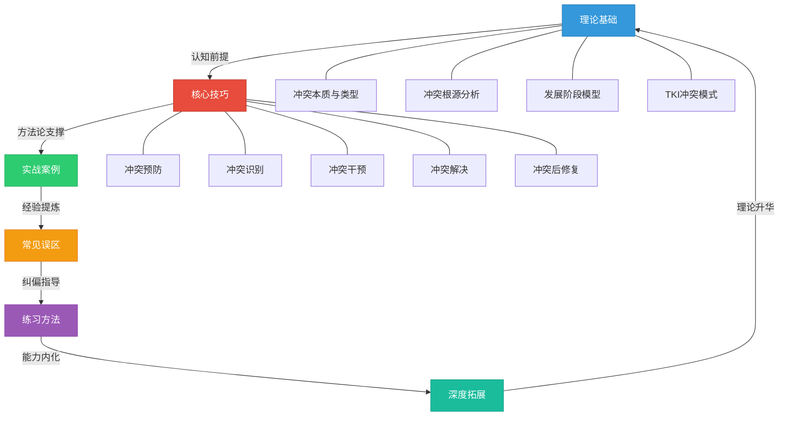
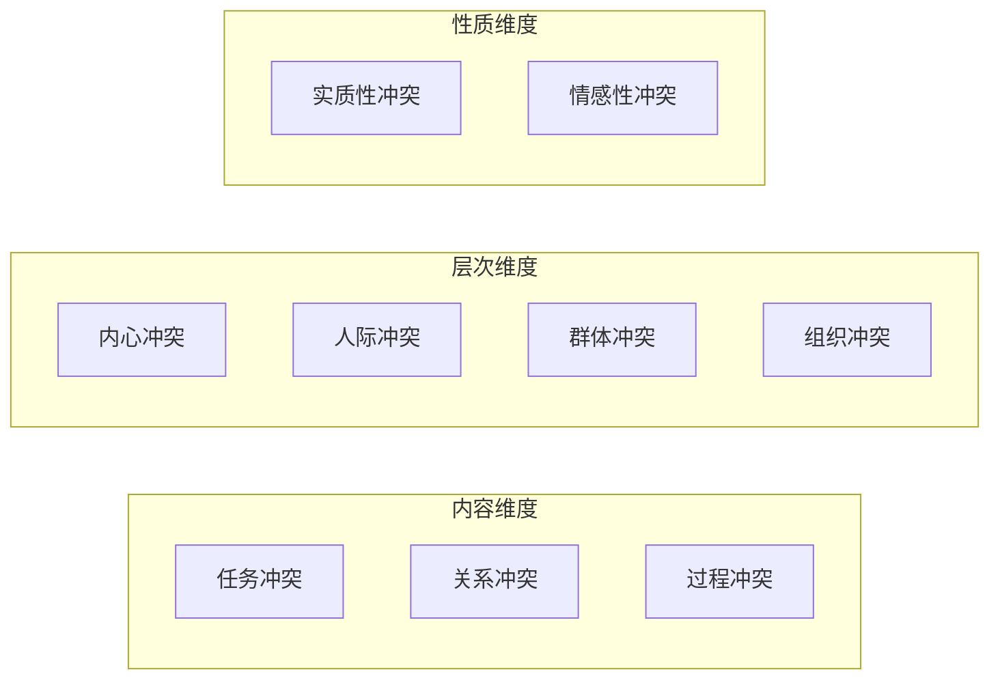
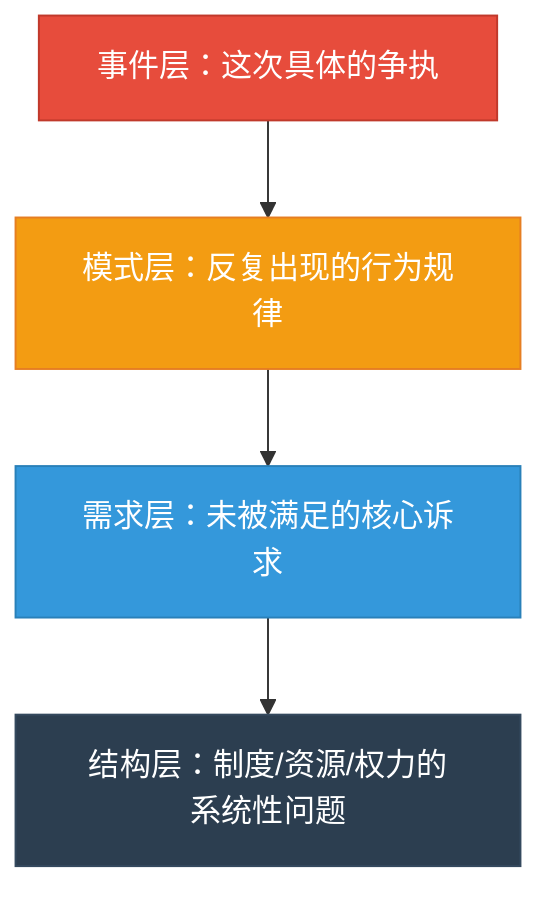
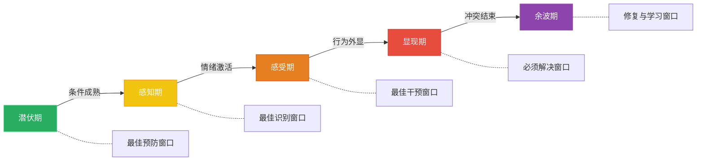
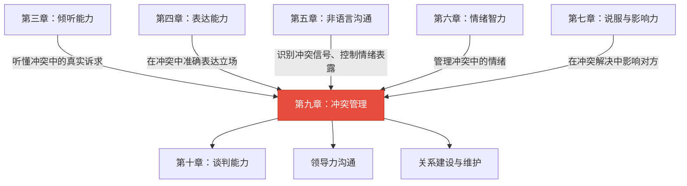

# 第九章 冲突管理 —— 本章小结

## 全章知识框架

本章围绕冲突管理这一核心主题，从理论认知、方法工具、实战应用、误区纠正和刻意练习五个维度构建了一套完整的知识体系。下图展示了各模块之间的逻辑关系：



五个模块并非线性的"学完即止"，而是一个螺旋上升的闭环：理论指导实践，实践暴露误区，纠正误区后通过练习内化能力，进阶能力又反过来加深对理论的理解。

### 本章各节导航

| 节次 | 主题 | 核心内容 | 阅读建议 |
|------|------|---------|---------|
| **第一节** | 理论基础 | 冲突本质、类型、根源、发展阶段、TKI模型 | 必读——建立认知框架 |
| **第二节** | 核心技巧 | 预防、识别、干预、解决、修复五环节 + 特殊情境 | 必读——掌握实操方法 |
| **第三节** | 实战案例 | 八大典型场景的完整案例分析 | 推荐——将理论映射到真实场景 |
| **第四节** | 常见误区 | 十大认知陷阱的拆解与纠正 | 推荐——避免常见错误 |
| **第五节** | 练习方法 | 每日微习惯、每周深度训练、30天提升计划 | 必读——从知道到做到 |
| **第六节** | 本章小结 | 全章知识框架回顾与能力诊断 | 当前页 |
| **第七节** | 深度拓展 | TKI深度分析、Glasl升级模型、跨文化冲突、组织冲突管理 | 选读——面向进阶读者 |

---

## 一、冲突的本质认知——从恐惧到驾驭

### 1.1 冲突是中性现象

冲突的本质是"感知到的不兼容"(Perceived Incompatibility)——当一方感知到另一方的行为、立场或利益与自己存在矛盾时，冲突就产生了。这里的关键是"感知"二字：冲突不一定基于客观事实，主观认知本身就足以触发冲突。

这一认知是整个冲突管理的基石。如果你将冲突等同于"坏事"，你的本能反应就是逃避或对抗；如果你将冲突理解为"中性的信息"，你就有可能选择建设性的应对方式。

**神经科学视角**：当人感知到冲突时，杏仁核（大脑的情绪报警中心）会在200毫秒内被激活，触发"战斗或逃跑"反应。此时前额叶皮层（理性决策中心）的功能被抑制——这就是为什么人在冲突中容易说出事后后悔的话。理解这一机制，你就明白了为什么"先处理情绪，再处理问题"不是鸡汤，而是基于大脑工作原理的科学策略。

### 1.2 功能性冲突与功能失调性冲突

| 维度 | 功能性冲突（建设性） | 功能失调性冲突（破坏性） |
|------|-------------------|---------------------|
| **焦点** | 围绕任务、方案、观点 | 指向人格、关系、情感 |
| **情绪** | 适度紧张，理性为主 | 强烈敌意，情绪失控 |
| **结果** | 促进创新、提高决策质量 | 破坏关系、降低团队效能 |
| **典型表现** | "我不同意这个方案，理由是……" | "你总是这样，根本不考虑别人" |
| **转化条件** | 保持尊重、聚焦问题 | 及时干预、降温处理 |

De Dreu和Weingart在2003年的元分析中证实：低到中等强度的任务冲突与团队绩效呈正相关。Amason在1996年对高管团队的研究也发现，认知性冲突能够显著提升战略决策质量。换言之，冲突可以是团队进化的催化剂——前提是具备将其从破坏性转向建设性的管理能力。

**功能性冲突的三个条件**：并非所有任务冲突都是建设性的。研究表明，建设性冲突需要满足三个条件——（1）冲突双方互相尊重，（2）对事不对人，（3）有共同的目标基础。缺少任何一个条件，任务冲突都可能滑向关系冲突。

### 1.3 冲突的三维分类

本章建立了冲突的三维分类体系，帮助读者在面对任何冲突时快速定位其性质：



**按内容分类**：

- **任务冲突**：对工作内容、目标、方案的分歧。这是最具建设性潜力的冲突类型，适度的任务冲突能激发多角度思考。
- **关系冲突**：基于人际关系的敌意、不信任和摩擦。几乎总是破坏性的，需要优先处理情绪层面。
- **过程冲突**：对"谁做什么、怎么做、何时做"的分歧。常被忽视，但若不及时处理会演变为关系冲突。

**按层次分类**：

- **内心冲突**：个人内部的价值观矛盾、目标取舍、认知失调。
- **人际冲突**：两个个体之间的直接矛盾，是最常见的冲突形态。
- **群体间冲突**：团队、部门之间的利益冲突和资源竞争。
- **组织冲突**：涉及组织结构、制度、文化层面的系统性矛盾。

**关键认知**：准确判断冲突的类型和层次，直接决定了你选择什么策略。对任务冲突使用情绪安抚技巧是低效的，对关系冲突只谈逻辑和数据则可能火上浇油。一个实用的诊断口诀：**"先分类型，再定阶段，后选策略"**——先判断这是任务/关系/过程冲突，再判断它处于潜伏/感知/感受/显现/余波的哪个阶段，最后才选择TKI五种风格中最匹配的一种。

---

## 二、冲突的根源理解——对症下药的前提

冲突不会凭空产生。本章系统梳理了冲突产生的十大根本原因，理解这些原因不是为了给冲突"贴标签"，而是为了在冲突发生时能迅速识别其深层驱动因素，从而选择正确的干预方向。

| 根源类别 | 具体表现 | 典型信号 | 应对要点 |
|---------|---------|---------|---------|
| **资源稀缺** | 预算、人员、时间、设备等有限资源的争夺 | "为什么又是我们部门加班" | 透明化资源分配规则，引入优先级评估机制 |
| **目标差异** | 不同角色/部门的KPI和优先级不一致 | 产品要速度，开发要质量 | 建立跨部门共同目标，定期对齐优先级 |
| **认知偏差** | 归因偏差、确认偏差、自利偏差等心理机制 | "他就是故意为难我" | 引入客观数据，鼓励换位思考 |
| **沟通障碍** | 信息不对称、表达不清、渠道不畅 | "你根本没说过这个要求" | 建立书面确认机制，定期同步信息 |
| **价值观冲突** | 对"什么是对的"有根本性分歧 | "这样做不道德" | 求同存异，在共同价值上建立合作基础 |
| **角色模糊** | 职责边界不清，权责不对等 | "这事到底该谁负责" | 明确RACI矩阵，定期更新职责说明 |
| **权力不对等** | 上下级、甲方乙方之间的话语权差异 | "你是领导你说了算" | 建立平等对话机制，鼓励建设性异议 |
| **人格差异** | 性格、行为风格、沟通偏好的不同 | "他说话就是让人不舒服" | 了解差异是常态，调整沟通方式而非人格 |
| **历史遗留** | 过往未解决的矛盾、累积的不满 | "上次你也是这样" | 正式复盘历史问题，建立"翻篇"共识 |
| **外部压力** | 市场变化、政策调整、竞争威胁等 | "上面要求必须本周上线" | 识别压力源是外部的，避免内耗式互相指责 |

**实践要点**：大多数冲突不是单一根源驱动的，而是多个因素交织的结果。例如，同事争执表面上是方案分歧（任务冲突），深层可能是资源分配不公（资源稀缺）加上长期的角色模糊（角色模糊）。只处理表层的方案争论，不触及深层的资源和角色问题，冲突会反复出现。

**根源诊断的洋葱模型**：将冲突想象成一颗洋葱，最外层是"事件"（发生了什么），中间层是"行为模式"（经常发生什么），最内层是"结构性根源"（为什么会发生）。高效的冲突管理者不会停留在事件层，而是层层剥开，直到触及结构性根源。



---

## 三、冲突发展的阶段性认知——早发现、早干预

冲突不是一个"瞬间事件"，而是一个动态演化的过程。理解冲突的阶段特征，是在最佳时机介入的关键。



### 五阶段特征与干预策略

| 阶段 | 核心特征 | 典型表现 | 最佳行动 | 成本评估 |
|------|---------|---------|---------|---------|
| **潜伏期** | 结构性矛盾存在但未被感知 | 资源分配不均、角色模糊、期望不一致 | 建立沟通机制、明确规则、管理期望 | 最低——制度层面调整即可 |
| **感知期** | 一方或双方开始意识到不兼容 | 心里不舒服、隐约觉得不对劲 | 主动沟通、澄清误解、调整预期 | 低——一次坦诚对话可以化解 |
| **感受期** | 情绪被激活，焦虑/愤怒/委屈出现 | 情绪波动、睡眠受影响、反复回想 | 情绪自我管理、寻求支持、冷静分析 | 中——需要情绪管理技巧 |
| **显现期** | 冲突公开化，行为外显 | 争论、对抗、冷战、拒绝合作 | 系统化冲突解决流程 | 高——需要专业技巧和时间 |
| **余波期** | 行为冲突结束，但心理影响持续 | 信任降低、关系裂痕、阴影效应 | 关系修复、复盘总结、制度优化 | 中——修复比预防难但比对抗便宜 |

**核心教训**：越早识别和处理冲突，成本越低、效果越好。在潜伏期通过制度建设消除结构性矛盾，成本几乎为零；到了显现期，可能需要数小时甚至数天的调解才能恢复关系。冲突预防和早期干预是冲突管理的最高境界。

**Glasl冲突升级模型补充**：在深度拓展中，我们介绍了弗里德里希·格拉塞尔（Friedrich Glasl）的九阶段冲突升级模型，它将冲突从"硬化立场"到"有限战争"再到"共同毁灭"逐级递进。Glasl模型的一个关键洞察是：**冲突一旦升级到第六阶段（威胁策略）以上，双方单独解决冲突的可能性极低，通常需要第三方介入**。这意味着，如果你在前五个阶段没有成功干预，后面的成本将呈指数级增长。

---

## 四、Thomas-Kilmann模型的灵活运用——五种风格的实战指南

TKI模型是本章的核心工具，它基于"坚定性"和"合作性"两个维度，将冲突处理方式分为五种风格。

### 4.1 五种风格速查表

| 风格 | 坚定性 | 合作性 | 核心逻辑 | 适用场景 | 风险提醒 |
|------|--------|--------|---------|---------|---------|
| **竞争** | 高 | 低 | "我赢你输" | 紧急决策、核心原则、防止被利用 | 损害关系、引发报复 |
| **合作** | 高 | 高 | "我们都赢" | 双方利益都很重要、需要创新方案 | 耗时耗力、需要双方意愿 |
| **妥协** | 中 | 中 | "各让一步" | 势均力敌、时间紧迫、需要临时方案 | 双方不完全满意、忽略更优解 |
| **回避** | 低 | 低 | "先放一放" | 问题不重要、情绪过于激烈、需要时间 | 问题积累、错失解决时机 |
| **迁就** | 低 | 高 | "你赢我让" | 关系比结果重要、对方确实有道理 | 被视为软弱、忽略自身需求 |

### 4.2 情境选择决策框架

选择冲突处理风格不是凭直觉，而是需要综合评估以下因素：

1. 问题的重要性 → 高（合作/竞争）vs 低（回避/迁就）
2. 关系的重要性 → 高（合作/迁就）vs 低（竞争/回避）
3. 时间的紧迫性 → 高（竞争/妥协/迁就）vs 低（合作）
4. 双方的权力差 → 对方强势（妥协/迁就）vs 己方强势（竞争/合作）
5. 合作的可能性 → 高（合作）vs 低（竞争/回避）

### 4.3 超越单一风格

大多数人有1~2种"舒适区风格"——在压力下会自动调用的处理方式。真正的冲突管理高手不是某种风格的专家，而是能在五种风格之间灵活切换的"全栈选手"。

**拓展方法**：

- **识别默认风格**：完成TKI自我评估，了解自己在压力下的自动反应模式
- **刻意练习弱项**：如果你习惯回避，下一次小规模冲突中尝试"合作"；如果你习惯竞争，下一次尝试"倾听后迁就"
- **观察他人**：留意身边冲突管理高手的风格选择，分析他们的决策逻辑
- **复盘反思**：每次冲突后回顾"我用了哪种风格？效果如何？有没有更合适的选择？"

**TKI风格与人格特质的关系**：研究表明，大五人格（Big Five）与TKI风格存在显著相关——高宜人性者倾向于迁就和合作，高外向性者倾向于竞争，高神经质者倾向于回避，高尽责性者倾向于竞争和合作。了解自己的人格倾向，有助于识别"默认风格"并有意识地拓展其他风格。

---

## 五、全流程冲突管理能力——五个环节的能力清单

本章的核心实践框架是冲突管理的五个关键环节。以下对每个环节的知识点和能力要求做系统梳理。

### 5.1 冲突预防——消除隐患于萌芽

| 预防措施 | 具体做法 | 核心机制 |
|---------|---------|---------|
| 建立沟通基础 | 定期一对一、团队站会、开放的反馈渠道 | 信息透明减少误解 |
| 明确期望与规则 | 职责说明书、RACI矩阵、项目章程 | 消除角色模糊的结构性矛盾 |
| 建立信任关系 | 保持承诺、展示脆弱、公平对待 | 信任是冲突的缓冲器 |
| 管理期望值 | 提前沟通"能做什么"和"不能做什么" | 减少期望落差引发的失望 |

**预防的"三个一"原则**：每周一次坦诚的一对一沟通，每月一次期望对齐会议，每季度一次职责和流程的复盘更新。这三个"一"能够消除80%的结构性冲突隐患。

### 5.2 冲突识别——察觉早期信号

**四类早期信号**：

1. **语言信号**：语气变化（变得生硬或沉默）、措辞升级（"总是""从来""每次"）、反问句增多
2. **非语言信号**：回避眼神接触、双臂交叉、叹气增多、身体后倾
3. **行为信号**：回复变慢、会议缺席增多、协作意愿下降、开始记录"证据"
4. **关系信号**：私下议论增多、小圈子形成、第三方被频繁拉入

**诊断框架**：当信号出现时，用以下四个问题快速评估冲突状态：

- 这是什么类型的任务冲突/关系冲突/过程冲突？
- 冲突处于哪个阶段（潜伏/感知/感受/显现/余波）？
- 涉及哪些人？关系网络是什么样的？
- 严重程度如何（低/中/高/危急）？

**"温度计"工具**：用1-10分评估当前冲突的"温度"。1-3分是"微温"，适合日常沟通化解；4-6分是"发热"，需要主动干预；7-8分是"沸腾"，需要立即降温并启动正式解决流程；9-10分是"失控"，需要第三方介入甚至暂时隔离。

### 5.3 冲突干预——在升级前降温

**物理降温技巧**：更换环境（从会议室换到咖啡厅）、安排短暂休息、推迟讨论时间

**认知降温技巧**：重构问题框架（"我们都在想办法解决X问题"）、引入客观数据、换位思考练习

**情感降温技巧**：先承认对方的感受（"我理解你很沮丧"）、使用"我"陈述法、降低音量和语速

**干预的"STOP"模型**：

- **S（Stop）**：暂停当前对话，给自己和对方冷静的时间
- **T（Think）**：思考冲突的类型、阶段和根源
- **O（Options）**：列出至少三种可选的应对策略
- **P（Proceed）**：选择最合适的策略，用新的方式重新进入对话

### 5.4 冲突解决——基于利益的六步法

1. **界定问题**：双方共同描述冲突是什么，用事实而非评价
2. **表达需求**：双方各自陈述自己的核心利益和关切，不互相打断
3. **理解对方**：复述对方的立场和需求，确认理解无误
4. **生成方案**：头脑风暴多种可能的解决方案，不急于评判
5. **评估选择**：用双方的利益作为标准评估各方案的可行性
6. **达成共识**：选择最优方案，明确行动计划、责任人和时间节点

**关键技巧**：

- "我"陈述法：将"你总是迟到"改为"当你迟到时，我感到不被尊重，因为守时对我很重要"
- 积极倾听：不仅听对方说什么，更听对方在意什么、担心什么
- 利益追问：反复问"为什么这对你是重要的？"直到触及底层需求

**从立场到利益的转化示例**：

| 立场（表面诉求） | 利益追问 | 底层需求 |
|----------------|---------|---------|
| "我要加薪" | 为什么加薪对你很重要？→ 我觉得自己的付出没有被认可 | 被认可、被尊重 |
| "这个方案不行" | 这个方案哪里让你不舒服？→ 我担心上线后出事故 | 安全感、风险控制 |
| "你必须道歉" | 道歉对你意味着什么？→ 我需要确认你还在乎这段关系 | 关系安全感 |

### 5.5 冲突后修复——重建信任的四个步骤

| 步骤 | 行动 | 要点 |
|------|------|------|
| **关系修复** | 真诚道歉、表达理解、重申关系的价值 | 道歉不附加"但是"，承认自己的责任 |
| **经验总结** | 复盘冲突的起因、过程和结果 | 聚焦"下次怎么做更好"而非"谁对谁错" |
| **制度改进** | 建立预防类似冲突的机制和规则 | 将个案经验转化为制度保障 |
| **长期维护** | 定期检查关系状态、保持开放沟通 | 信任重建是一个持续过程，不是一次性事件 |

**信任修复的"ATMR"公式**：

- **A（Acknowledge）**：承认伤害——明确说出"我知道我的行为让你受到了伤害"
- **T（Take responsibility）**：承担责任——"这是我的责任，我为此道歉"
- **M（Make amends）**：弥补行动——用具体行动而非空洞承诺来修复
- **R（Rebuild）**：重建一致性——通过持续一致的行为重新建立信任

---

## 六、特殊情境速览——当标准流程不够用

日常冲突的处理框架在七种特殊情境中需要针对性调整。以下是每种情境的核心策略速查，完整的分析和方法请参见"核心技巧·特殊情境下的冲突管理技巧"一节。

### 6.1 特殊情境策略速查

| 情境 | 核心挑战 | 策略要点 | 关键工具 |
|------|---------|---------|---------|
| **跨文化冲突** | 行为的"文化解码器"不同，同一行为有截然不同的含义 | 了解Hofstede文化维度，避免用本文化标准评判对方 | 文化维度评估、双视角分析法 |
| **线上冲突** | 缺少非语言线索，文字容易被误读，异步沟通放大误解 | 重要问题电话或面谈，文字沟通添加情绪标记 | 情绪标记法、"三次深呼吸"规则 |
| **权力不对等** | 弱势方不敢表达，强势方听不到真实声音 | 建立安全的反馈通道，领导者主动邀请异议 | 匿名反馈机制、"魔鬼代言人"制度 |
| **情绪失控** | 杏仁核劫持导致理性功能关闭 | 物理隔离、延迟讨论、正念呼吸 | 20分钟冷静期、情绪命名法 |
| **群体冲突** | 多方卷入导致立场固化、从众效应 | 分别面谈、识别关键影响者、建立联合工作组 | 利益相关者地图、分步调解法 |
| **长期积怨** | 问题层层叠加，"新仇旧恨"交织 | 逐一拆解历史问题，建立"翻篇"共识 | 时间线复盘法、书面和解协议 |
| **价值观冲突** | 涉及"什么是对的"的根本分歧 | 不试图改变对方价值观，寻找共同目标 | 求同存异框架、共同价值清单 |

### 6.2 跨文化冲突的关键维度

跨文化冲突是全球化背景下越来越常见的挑战。Hofstede的六大文化维度——权力距离、个人主义/集体主义、男性化/女性化、不确定性规避、长期导向/短期导向、放纵/克制——提供了理解文化差异的基本框架。

**最实用的两条维度**：

- **个人主义 vs 集体主义**：个人主义文化中，直接表达不同意见被视为坦诚；集体主义文化中，维护群体和谐比表达个人观点更重要。
- **权力距离**：高权力距离文化中，下级不会公开反驳上级；低权力距离文化中，任何人都可以提出异议。

**线上冲突的"三次规则"**：如果你发现自己需要第三次编辑同一条消息来表达不满，请直接打电话或约面谈。文字沟通无法传递语气、表情和善意，三次以上修改仍然无法准确表达的情绪，说明这个沟通渠道已经不适合处理当前问题。

---

## 七、实战应用——八大场景的核心原则

通过同事争执、上下级冲突、客户投诉、团队分歧、家庭矛盾、朋友误会、邻里纠纷、公共场合冲突八个典型场景的案例分析，本章提炼了五条冲突管理的底层原则：

### 五条核心原则

| 原则 | 含义 | 实操体现 |
|------|------|---------|
| **先处理情绪，再处理问题** | 情绪未降温时，任何理性的讨论都会被扭曲 | 觉察情绪→暂停→降温→再讨论 |
| **从立场转向利益** | 立场是对立的，利益是可以协调的 | "你坚持A方案"→"你需要A方案达到什么效果" |
| **寻找共赢方案** | 跳出"非此即彼"的零和思维 | 头脑风暴、重新定义问题、整合资源 |
| **关系先于道理** | 在重要关系中，"谁对谁错"不如"关系还在不在"重要 | 选择性让步、维护面子、表达尊重 |
| **预防胜于治疗** | 最好的冲突管理是在冲突发生前消除隐患 | 建立机制、管理期望、保持沟通 |

### 场景速查矩阵

| 场景 | 首选TKI风格 | 关键原则 | 核心技巧 |
|------|------------|---------|---------|
| 同事争执 | 合作 | 从立场转向利益 | "我"陈述法 + 积极倾听 |
| 上下级冲突 | 妥协/迁就 | 关系先于道理 | 选择时机 + 私下沟通 |
| 客户投诉 | 迁→合 | 先处理情绪 | 先共情再解决 |
| 团队分歧 | 合作 | 寻找共赢方案 | 结构化讨论 + 决策矩阵 |
| 家庭矛盾 | 合作/迁就 | 关系先于道理 | 表达感受而非评价 |
| 朋友误会 | 合作 | 先处理情绪 | 直接沟通 + 真诚道歉 |
| 邻里纠纷 | 妥协 | 寻找共赢方案 | 第三方调解 + 界限协商 |
| 公共场合 | 回避/妥协 | 安全第一 | 降低对抗 + 快速脱身 |

**场景选择的"三秒判断法"**：面对突发冲突，在开口之前用三秒钟快速回答三个问题——（1）这件事重要吗？（2）这段关系重要吗？（3）我现在情绪稳定吗？三个答案的组合会指向最合适的策略选择。

---

## 八、十大误区速查

本章总结了十个最常见的冲突管理误区。以下是精简速查版，完整的分析和纠正方法请参见"常见误区"一节。

| 序号 | 误区 | 为什么是错的 | 正确做法 |
|------|------|------------|---------|
| 1 | 回避就能解决问题 | 回避只是延迟，问题会在另一个时间以更激烈的形式爆发 | 在冲突早期主动面对，用低对抗方式开启对话 |
| 2 | 赢了争论就是赢了冲突 | 赢了道理可能输了关系，得不偿失 | 聚焦利益而非立场，寻找双方都能接受的方案 |
| 3 | 情绪化表达能表明力量 | 情绪化让对方关闭倾听通道，问题更难解决 | 用"我"陈述法表达感受，保持冷静的力量 |
| 4 | 找第三方评理总是对的 | 第三方介入可能加剧对立，让双方更难回头 | 优先双方直接沟通，必要时引入专业调解 |
| 5 | 妥协是最好的策略 | 妥协是让双方都不满意的最快方法 | 先尝试合作（共赢），妥协是退而求其次的选择 |
| 6 | 好关系不应该有冲突 | 没有冲突的关系往往是回避问题的假象 | 健康关系中的冲突处理能力才是关系强度的标志 |
| 7 | 只要道理讲通了问题就解决了 | 情感需求未被满足时，逻辑再完美也无法弥合裂痕 | 理性与情感并重，先共情后讲理 |
| 8 | 一次深度沟通应该能搞定 | 矛盾是长期积累的，不可能一次对话全部化解 | 设定合理预期，分步推进，持续跟进 |
| 9 | 冲突管理的目标就是减少冲突 | 目标是提升冲突的质量，从破坏性转向建设性 | 适度的任务冲突是健康的，要管理而非消灭 |
| 10 | 别人处理冲突的方式应该和我一样 | 不同人格、文化、角色需要不同的处理方式 | 尊重差异，根据情境选择策略而非一刀切 |

**误区背后的认知偏差**：每个误区都对应一种特定的认知偏差——误区1和9源于"损失厌恶"（冲突带来的不适被放大），误区2和5源于"零和思维"（认为资源固定、一方得利即另一方损失），误区6和7源于"认知简化"（用简单规则替代复杂判断）。识别这些底层偏差，有助于从根本上改变冲突管理的思维模式。

---

## 九、自我评估与能力诊断

完成全章学习后，建议用以下评估表重新测量自己的冲突管理能力。对照章节概览中的初始自评分数，看看哪些维度有了明显提升，哪些仍然是短板。

### 冲突管理能力五维雷达

```mermaid
---
title: 冲突管理能力五维评估
---
radar
    axis 情绪调控力, 诊断分析力, 策略选择力, 沟通表达力, 关系修复力
    "当前水平" : 3, 3, 3, 3, 3
    "目标水平" : 5, 5, 5, 5, 5
```

**评估方法**：对以下每个维度的5个陈述打分（1=完全不符合，5=完全符合），计算维度平均分。

| 维度 | 评估陈述 | 评分 |
|------|---------|------|
| **情绪调控力** | 我能在冲突中觉察并命名自己的情绪 | __ |
| | 我能在愤怒时暂停而非立即反应 | __ |
| | 我能区分"情绪"和"事实" | __ |
| | 我能在对方情绪激动时保持冷静 | __ |
| | 我有有效的情绪调节策略（深呼吸、暂停等） | __ |
| **诊断分析力** | 我能快速判断冲突的类型（任务/关系/过程） | __ |
| | 我能识别冲突所处的阶段 | __ |
| | 我能看到表面争论背后的深层需求 | __ |
| | 我能评估冲突的严重程度 | __ |
| | 我能判断哪些冲突值得投入精力 | __ |
| **策略选择力** | 我了解TKI五种风格的适用场景 | __ |
| | 我能根据情境灵活选择处理方式 | __ |
| | 我不会在所有冲突中都用同一种方式 | __ |
| | 我知道何时该坚持、何时该让步 | __ |
| | 我能在压力下有意识地选择策略而非本能反应 | __ |
| **沟通表达力** | 我能在冲突中使用"我"陈述法 | __ |
| | 我能在不攻击人格的前提下表达不同意见 | __ |
| | 我能在冲突中真正倾听对方 | __ |
| | 我能用事实而非情绪支持立场 | __ |
| | 我能找到双方都能接受的表述方式 | __ |
| **关系修复力** | 我能在冲突后主动发起复盘对话 | __ |
| | 我能真诚地道歉而不附加条件 | __ |
| | 我能从每次冲突中提取经验教训 | __ |
| | 冲突结束后关系通常不会恶化 | __ |
| | 我能建立机制预防类似冲突再次发生 | __ |

### 评分解读与提升路径

| 平均分 | 水平评估 | 下一步行动 |
|--------|---------|-----------|
| 4.0~5.0 | 精通水平——你已经具备系统的冲突管理能力 | 深入学习调解技巧、组织冲突管理、跨文化冲突 |
| 3.0~3.9 | 熟练水平——有基础但仍有提升空间 | 针对最低分维度进行专项练习，参见练习方法篇 |
| 2.0~2.9 | 入门水平——意识到了但方法不够系统 | 从TKI模型和"我"陈述法开始，每日微练习 |
| 1.0~1.9 | 初学阶段——冲突管理是需要重点提升的领域 | 不必焦虑，从理论基础篇开始系统学习 |

### 冲突管理能力的衡量指标

除了自我评估，还可以通过以下客观指标来衡量自己的冲突管理能力是否在提升：

| 指标 | 衡量方式 | 改进信号 |
|------|---------|---------|
| **冲突频率** | 每月发生需要正式处理的冲突次数 | 从"经常"降到"偶尔" |
| **冲突持续时间** | 从冲突发生到解决的平均时长 | 从数天缩短到数小时 |
| **冲突后关系质量** | 冲突结束后一周内的协作意愿 | 从回避到主动合作 |
| **情绪恢复速度** | 冲突结束后恢复平静所需时间 | 从数天缩短到数小时 |
| **反复冲突率** | 同一类型冲突重复发生的频率 | 同类冲突不再反复出现 |
| **第三方介入率** | 需要上级或HR介入的冲突比例 | 自行解决的比例上升 |

---

## 十、冲突管理核心理念

以下是贯穿全章的核心理念，值得反复体会：

> **冲突不是沟通的失败，而是深化沟通的契机。**

冲突暴露了日常沟通中被忽视的问题——未表达的需求、未澄清的期望、未解决的矛盾。正因为冲突让这些问题浮出水面，我们才有机会真正解决它们。

> **没有不可解决的冲突，只有还没找到的解决方案。**

大多数看似"无解"的冲突，其实是被限定在了一个过窄的方案空间里。当我们跳出"非此即彼"的框架，引入新的资源、新的视角、新的可能性时，往往能找到出乎意料的解决路径。

> **最好的冲突管理不是在冲突发生后如何解决，而是在冲突发生前如何预防。**

预防的成本远低于治疗。一个清晰的职责说明、一次定期的一对一沟通、一份提前对齐的期望清单，就能消除大量潜在冲突。投资于预防机制，是回报率最高的冲突管理策略。

> **冲突管理的最终目标不是赢得争论，而是赢得关系。**

在任何需要长期维护的关系中——同事、上下级、家人、朋友——"赢了道理、输了关系"都是最糟糕的结果。真正的高手不是在冲突中证明自己是对的，而是在冲突后关系变得更强。

> **冲突管理能力是其他一切沟通能力的"压力测试"。**

倾听、表达、非语言沟通、情绪智力——这些能力在日常沟通中或许表现良好，但只有在冲突中才能看到它们的真实水平。冲突管理能力的提升，会同步提升你所有的沟通能力维度。

---

## 十一、与其他章节的关联

冲突管理不是孤立的技能模块，它与本书的其他章节有着密切的知识关联：



| 关联章节 | 与冲突管理的关系 | 关键交叉知识点 |
|---------|----------------|--------------|
| **倾听能力** | 冲突中的积极倾听是理解对方利益的基础 | 深度倾听、情感反映、需求探测 |
| **表达能力** | "我"陈述法、非攻击性表达是冲突沟通的核心技巧 | 感受表达、需求陈述、立场表述 |
| **非语言沟通** | 60%以上的冲突信息通过非语言渠道传递 | 微表情识别、身体语言管理 |
| **情绪智力** | 情绪调控是冲突管理五维能力之首 | 自我觉察、情绪命名、自我调节 |
| **谈判能力** | 冲突解决本质上是一种利益谈判 | BATNA、利益创造、让步策略 |

---

## 十二、下一步行动清单

学完本章并不意味着冲突管理能力的提升，真正的提升来自于持续的实践。以下是分阶段的行动建议：

### 立即行动（本周内）

- [ ] 完成TKI自我评估，确认自己的默认冲突处理风格
- [ ] 回顾最近一次冲突经历，用本章的框架进行复盘：类型→阶段→根源→策略选择→结果
- [ ] 从每日练习中选择1~2项开始坚持（情绪觉察日记、"我"陈述法微练习、积极倾听练习）
- [ ] 在手机上设置一个"冲突复盘"提醒，每晚花3分钟回顾当天是否有冲突信号

### 短期行动（两周内）

- [ ] 找到一个练习伙伴，开始每周一次的角色扮演练习
- [ ] 在一个真实的小规模冲突中有意识地运用TKI模型选择策略
- [ ] 建立自己的"冲突复盘笔记"，记录每次冲突的类型、阶段、策略选择和结果
- [ ] 练习"STOP"模型至少3次——在日常小分歧中有意识地暂停、思考、选择、行动

### 中期行动（一个月内）

- [ ] 完成30天提升计划（参见练习方法篇），系统强化五维能力
- [ ] 在一个重要冲突中尝试"合作"风格，实践六步冲突解决法
- [ ] 向信任的人征求反馈："你觉得我在冲突中的表现如何？"
- [ ] 学习一个特殊情境的冲突管理技巧（跨文化/线上/权力不对等）

### 长期行动（持续进行）

- [ ] 每月回顾一次冲突复盘笔记，提炼模式和成长点
- [ ] 将冲突管理技巧延伸到谈判、领导力和关系建设领域
- [ ] 成为团队中的冲突调解者，通过帮助他人解决冲突来深化自己的能力
- [ ] 阅读深度拓展中的进阶内容（Glasl模型、组织冲突管理、调解技能）

### 30天快速启动计划

| 阶段 | 天数 | 核心任务 | 每日时间投入 | 目标能力 |
|------|------|---------|------------|---------|
| 认知建立 | 第1~7天 | 每日情绪觉察日记 + 冲突类型辨识练习 + 完成TKI自评 | 15分钟 | 情绪调控力 + 诊断分析力 |
| 工具掌握 | 第8~14天 | TKI风格练习 + "我"陈述法实战 + STOP模型练习 | 20分钟 | 策略选择力 + 沟通表达力 |
| 技巧内化 | 第15~21天 | 角色扮演 + 真实冲突复盘 + 利益追问练习 | 25分钟 | 全维度综合练习 |
| 能力固化 | 第22~30天 | 复杂场景模拟 + 系统复盘 + 寻求外部反馈 | 20分钟 | 关系修复力 + 全流程能力 |

---

## 本章关键词

**理论层**：冲突类型（任务/关系/过程）· 冲突层次（内心/人际/群体/组织）· 冲突根源 · 冲突发展阶段 · Thomas-Kilmann模型（TKI）· 坚定性 · 合作性 · 功能性冲突 · 功能失调性冲突

**方法层**：冲突预防 · 冲突识别 · 冲突干预 · 冲突解决 · 冲突后修复 · 六步冲突解决法 · 基于利益的冲突解决 · STOP模型 · ATMR信任修复公式 · "三个一"预防原则

**技巧层**：情绪管理 · 换位思考 · 积极倾听 · "我"陈述法 · 情绪降温 · 重构问题框架 · 利益追问 · 温度计评估 · "三秒判断法"

**特殊情境层**：跨文化冲突 · 线上冲突 · 权力不对等 · 情绪失控 · 群体冲突 · 长期积怨 · 价值观冲突

**实践层**：角色扮演 · 刻意练习 · 冲突复盘 · 30天提升计划 · 情绪觉察日记 · 冲突复盘笔记 · TKI自我评估

---

## 写在最后

> 冲突管理是一项终身学习的能力。它不会因为读完一个章节就自动获得，也不会因为一次失败就永远缺失。每一次冲突都是成长的机会，每一次练习都是进步的积累。从今天开始，选择一个微小的行动——写下一篇情绪觉察日记，或者在下一次分歧中尝试用"我"陈述法表达——这就是你从"知道"走向"做到"的第一步。愿你在冲突管理的道路上，越走越从容。

> **记住**：你不需要在每次冲突中都表现完美。你只需要在每次冲突后都比上次做得好一点。冲突管理能力的增长不是突变式的，而是渐进式的——像复利一样，每一次微小的进步，最终会累积成巨大的改变。
