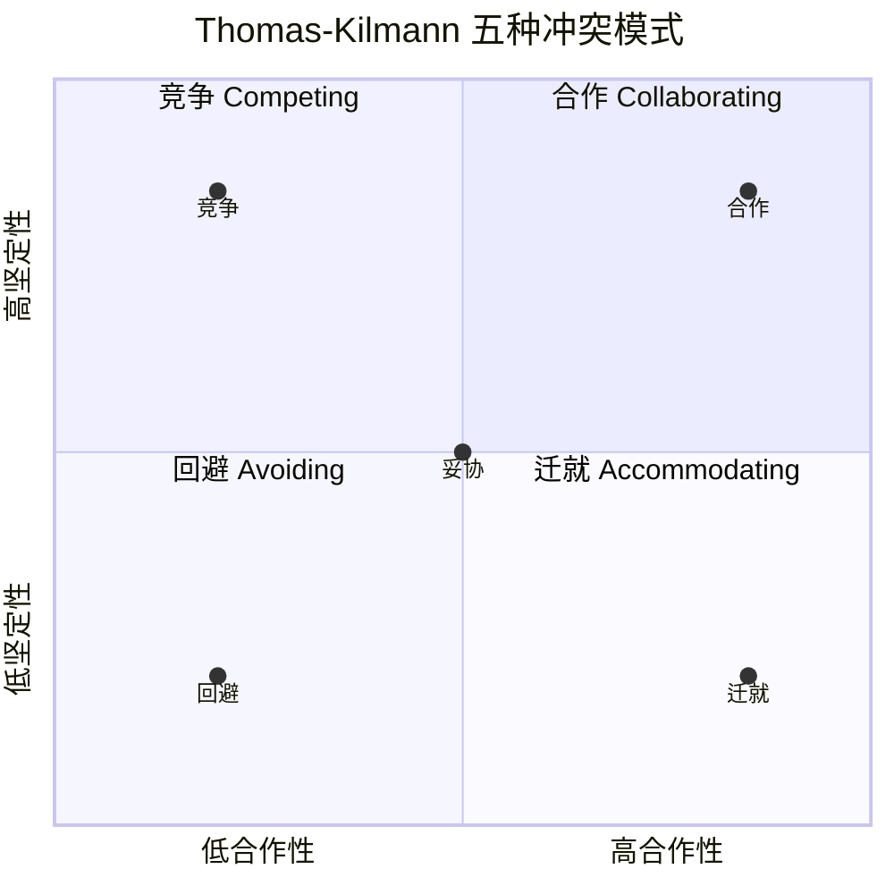
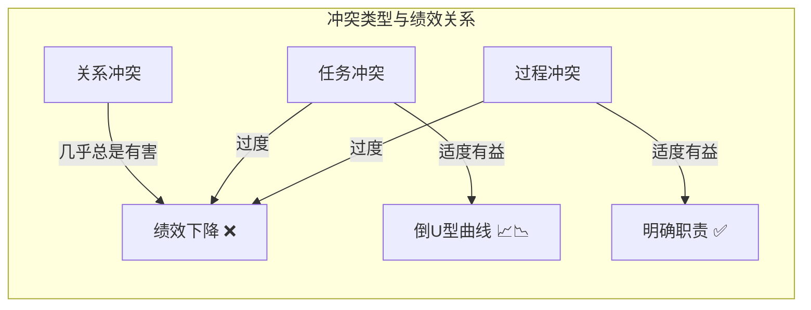
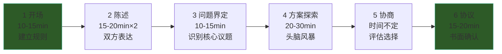
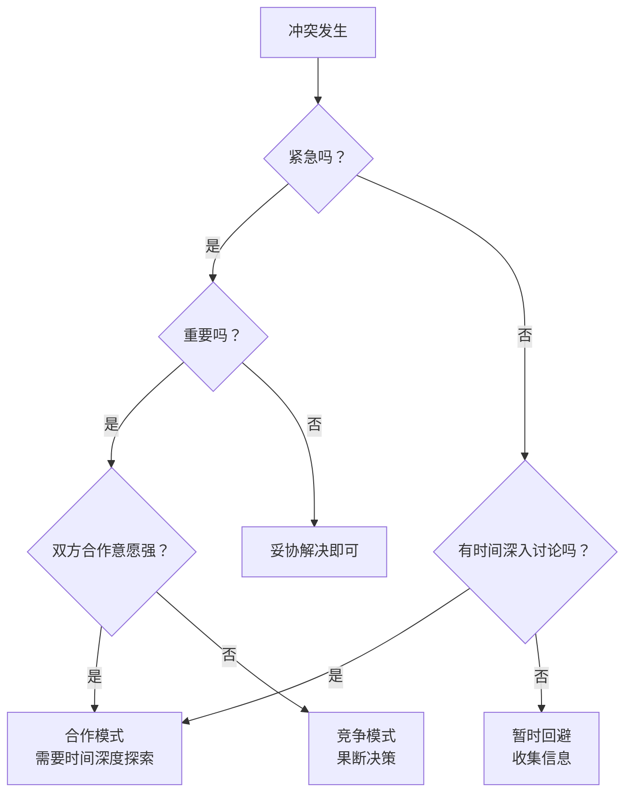

# 第九章 冲突管理 · 深度拓展

> 本章是冲突管理的进阶内容。如果你刚接触冲突管理，请先完成前六节的基础学习。本节面向希望将冲突管理能力提升到专业水准的读者——从理论框架到实操工具，从个人技能到组织系统，全面覆盖冲突管理的深度知识体系。

---

## 一、Thomas-Kilmann 冲突模式深度分析

Thomas-Kilmann 冲突模式工具（Thomas-Kilmann Conflict Mode Instrument, TKI）是全球使用最广泛的冲突风格评估工具，由肯尼思·托马斯（Kenneth Thomas）和拉尔夫·基尔曼（Ralph Kilmann）于1974年开发，至今已被翻译成30多种语言，累计数千万人使用。该工具基于两个核心维度来识别五种冲突处理模式，其理论根基在于 Blake-Mouton 的管理方格理论（Managerial Grid），后经托马斯和基尔曼修正，从"关注人 vs 关注生产"调整为更普适的"坚定性 vs 合作性"维度。

### 1.1 两个核心维度的神经科学基础

**坚定性（Assertiveness）**：满足自身关切的程度。高坚定性意味着积极追求自己的利益和立场。神经科学层面，坚定性与前额叶皮层的执行控制功能以及睾酮水平相关——睾酮水平较高的个体倾向于更高的坚定性。功能性磁共振成像（fMRI）研究显示，当个体做出坚定性行为时，腹内侧前额叶皮层（vmPFC）和背外侧前额叶皮层（dlPFC）的激活显著增强，这两个区域分别负责价值评估和认知控制。

**合作性（Cooperativeness）**：满足对方关切的程度。高合作性意味着努力理解和满足对方的需求。合作行为与大脑的镜像神经元系统和催产素分泌密切相关——当个体能够"感受到"对方的情绪时，合作倾向显著增强。苏黎世大学的研究发现，鼻喷催产素可以显著提升个体在冲突中的合作行为，降低防御性反应。

这两个维度并非简单的二元对立，而是一个连续光谱。每个人在每个维度上都有一个"自然偏好区间"，但通过训练可以扩展可用范围。研究表明，大多数人只习惯使用2-3种冲突模式，而高效的冲突管理者能够在全部五种模式之间灵活切换。

**五种模式的维度分布：**

### 1.2 五种冲突模式的深度解析

#### 竞争模式（Competing）——高坚定性、低合作性

**核心逻辑**：零和博弈思维，"我赢你输"。竞争者将冲突视为力量的较量，通过运用权力、地位或专业知识来维护自身立场。

**适用场景**：
- 需要快速做出重要决策且没有时间协商时（如危机时刻的紧急指令）
- 涉及核心原则或不可妥协的价值观问题（如安全规范、法律合规）
- 对方试图利用你的善意进行不合理要求时
- 需要执行不受人欢迎但必要的决策时（如裁员、纪律处分）
- 你确信自己的方案明显优于其他方案且后果不可逆时

**风险与代价**：
- 损害关系：竞争模式在关系层面的成本最高，研究表明使用竞争模式后，对方的合作意愿在后续互动中平均下降40%
- 引发报复循环：对方可能在未来的互动中采取同样的竞争策略
- 抑制信息流动：竞争氛围下，团队成员倾向于隐瞒信息以保留"筹码"
- 长期消耗：持续的竞争模式导致皮质醇水平长期偏高，引发职业倦怠

**真实案例——竞标项目中的竞争决策**：某科技公司CTO在技术选型会议上坚持使用自研框架而非第三方方案，尽管团队多数人倾向第三方。他的理由：核心架构不能受制于外部供应商，且自研方案在特定场景下性能指标高出40%。这一竞争决策短期引发了团队不满，但一年后当第三方供应商大幅提价时，决策的价值得到验证。关键在于：CTO事后向团队完整解释了决策逻辑，并在后续的技术细节上给予了团队充分自主权。这个案例说明竞争模式在"你有充分信息而对方没有"且"决策后果不可逆"的场景中是合理的。

**使用技巧**：如果必须使用竞争模式，事后主动修复关系——解释你的决策逻辑，承认对方的关切，在后续互动中给予对方更多空间。

#### 合作模式（Collaborating）——高坚定性、高合作性

**核心逻辑**：正和博弈思维，"双赢"。合作者将冲突视为共同问题，通过深入探索双方的利益和需求，寻找创造性的整合方案。

**适用场景**：
- 双方关切都太重要而不能妥协时
- 需要整合不同观点以获得更高质量的解决方案时
- 希望通过冲突解决增进关系和信任时
- 有足够的时间和资源进行深入探索时
- 面对复杂问题需要多元视角时

**合作模式的关键成功因素**：
1. **信息充分共享**：双方必须愿意披露真实的需求和约束，而非只亮出立场
2. **创造性思维**：跳出既有框架，寻找"第三选择"——超越"你的方案"和"我的方案"的创新方案
3. **心理安全**：双方必须感到表达真实想法是安全的
4. **时间保障**：合作模式是五种模式中最耗时的，平均需要竞争模式3-5倍的时间

**真实案例——产品路线图冲突的合作解决**：某互联网公司的产品经理A希望优先开发社交功能（认为能提升用户留存），产品经理B坚持优先开发电商功能（认为能提升营收）。表面上这是"社交 vs 电商"的零和选择，但通过合作模式深入探索后发现：A的根本利益是"提升用户活跃度"，B的根本利益是"提升营收"。最终他们找到了"社交电商"方案——通过社交分享驱动购买转化，同时满足了两个利益。这个方案在上线后使DAU提升了15%，GMV提升了22%，远超单独做任何一个功能的预期收益。

**常见失败模式**：
- 表面合作：双方口头上同意合作，实际仍在推销自己的立场，导致"伪合作"——讨论了很长时间但没有实质进展
- 分析瘫痪：过度追求完美方案，反复讨论却无法达成决定
- 搭便车：一方投入大量精力探索方案，另一方只享受成果却不贡献

#### 妥协模式（Compromising）——中等坚定性、中等合作性

**核心逻辑**：各让一步，"半赢半输"。妥协者接受一个双方都不完全满意但都可以接受的中间方案。

**适用场景**：
- 双方利益同等重要且时间有限时
- 需要临时解决方案以争取更多时间时
- 合作和竞争都不成功时的备选方案
- 复杂议题需要分步解决时，先就可妥协的部分达成一致

**陷阱与误用**：
- "懒惰默认"：妥协之所以常见，不是因为它最好，而是因为它最省力。很多人把妥协当作首选，而实际上它应该是其他模式尝试失败后的选择
- 创造性方案被忽略：急于"分割差异"可能跳过了本可以找到的双赢方案
- 双方都不满意：妥协方案可能让双方都觉得自己"亏了"，导致后续不满累积
- 在某些文化中（如东亚面子文化），公开妥协可能被视为软弱或缺乏立场

**进阶用法**：将妥协视为"阶段性方案"而非"最终方案"。明确告知对方："我们现在各退一步，但在X时间后我们重新评估。"这样既解决了眼前的问题，又保留了未来优化的空间。

**真实案例——预算分配中的阶段性妥协**：市场部和研发部争夺Q3预算，市场部需要200万做品牌推广，研发部需要200万做基础设施升级，但总预算只有300万。双方经过两轮讨论未果后，采用了阶段性妥协：Q3先给市场部150万（做ROI最高的效果广告而非品牌广告），研发部150万（做最紧急的两个模块而非全部升级），约定Q3末根据市场部的效果广告数据和研发部的模块上线情况，重新评估Q4预算分配。这种妥协将"一次性博弈"变成了"重复博弈"，双方都有动力在Q3交出好成绩以争取Q4更多资源。

#### 回避模式（Avoiding）——低坚定性、低合作性

**核心逻辑**：延迟或回避冲突处理。回避者将冲突视为不值得投入精力或当前无法解决的问题。

**适用场景**：
- 问题微不足道、不值得花费精力时
- 需要冷静下来重新评估时（情绪过载时的自我保护）
- 直接对抗可能造成不可逆伤害时（如在对方极度愤怒时火上浇油）
- 他人能更有效地解决该冲突时
- 你需要更多时间收集信息以做出判断时

**回避≠逃避**：有策略的回避是一种高级技能。关键区别在于——
- **有策略的回避**：清楚地知道"我现在选择不处理这个问题，因为（具体原因），我计划在（具体时间）重新评估"
- **被动的逃避**：因为害怕冲突而回避，不面对问题，希望问题自己消失

**风险**：
- 问题累积：未处理的小问题像滚雪球一样变成大问题
- 信号误读：对方可能将回避理解为"你不在乎"或"你同意我的观点"
- 错过时机：有些冲突有"最佳处理窗口"，错过后再处理难度加倍
- 习得性无助：长期回避导致冲突处理能力退化

#### 迁就模式（Accommodating）——低坚定性、高合作性

**核心逻辑**：牺牲自身利益以满足对方需求。迁就者将维护关系或对方的需求置于自身利益之上。

**适用场景**：
- 对方的关切确实比你的更重要时
- 希望展示善意以积累"关系资本"时（关系银行账户的"存款"行为）
- 你发现自己确实是错的时
- 维护关系比赢得当前争论更重要时
- 让对方从错误中学习比你直接指出更有效时

**战略性迁就 vs 被动迁就**：
- **战略性迁就**：主动选择在当前议题上让步，因为你评估后认为这对维护关系或获取未来收益更有价值。这种迁就伴随着清晰的边界意识
- **被动迁就**：因为害怕冲突、缺乏自信或习惯性讨好而让步。这种迁就会逐渐侵蚀自尊，积累怨恨

**长期风险**：
- 被对方视为理所当然：频繁迁就会让对方认为你没有自己的需求或立场
- 怨恨积累：被压抑的需求不会消失，它们会在某个临界点爆发
- 关系失衡：一方持续迁就会形成不平等的权力动态
- 自我丧失：长期迁就导致"我不知道自己想要什么"

### 1.3 情境适应性：没有"最好"的模式

研究表明，没有一种冲突模式是万能的——最有效的冲突管理者是能够根据情境灵活切换模式的人。决定使用哪种模式的关键变量包括：

| 变量 | 影响 |
|------|------|
| 冲突的性质和重要性 | 核心利益用竞争或合作，边缘利益用妥协或迁就 |
| 双方的关系历史和未来预期 | 长期关系优先合作，一次性交易可以竞争 |
| 时间和资源约束 | 时间紧用竞争或妥协，时间充裕用合作 |
| 权力动态 | 权力对等适合合作，权力悬殊时弱势方需谨慎 |
| 文化背景 | 集体主义文化更接受迁就，个人主义文化更接受竞争 |
| 情绪状态 | 情绪过载时先回避，冷静后再选择策略 |
| 信息不对称程度 | 信息充分适合合作，信息不足先回避收集 |
| 冲突的可逆性 | 不可逆决策倾向竞争/合作，可逆决策可用妥协/回避 |

```mermaid
flowchart TD
    START["冲突发生"] --> Q1{"紧急程度？"}
    Q1 -->|"极度紧急<br>（危机/安全）"| COMP["竞争模式<br>果断决策，事后修复"]
    Q1 -->|"不紧急"| Q2{"双方关切的<br>重要性？"}
    Q2 -->|"都非常重要"| Q3{"有足够时间和<br>心理安全？"}
    Q2 -->|"一方明显更重要"| ACC["迁就模式<br>战略性让步"]
    Q2 -->|"都不太重要"| Q4{"直接处理的<br>成本？"}
    Q3 -->|"是"| COLL["合作模式<br>深度探索双赢方案"]
    Q3 -->|"否"| Q5{"能否创造<br>条件？"}
    Q5 -->|"能"| COLL
    Q5 -->|"暂时不能"| COMP2["妥协模式<br>阶段性方案"]
    Q4 -->|"高"| AVOID["回避模式<br>有策略地延迟"]
    Q4 -->|"低"| COMP2

    style COLL fill:#2d5a27,stroke:#4a8,stroke-width:2px
    style COMP fill:#5a2727,stroke:#a44,stroke-width:2px
    style ACC fill:#27455a,stroke:#48a,stroke-width:2px
    style COMP2 fill:#5a4a27,stroke:#a84,stroke-width:2px
    style AVOID fill:#3a3a3a,stroke:#888,stroke-width:2px
```

### 1.4 冲突模式的发展路径

冲突模式不是固定的"性格标签"，而是一种可以发展的能力。发展路径如下：

**第一步：自我觉察**。通过TKI测评或日常反思，识别自己的默认模式。关键问题：当冲突发生时，我的第一反应是什么？我最不习惯使用的模式是什么？

**第二步：情境分析**。学习评估不同情境变量，判断哪种模式最适合当前冲突。可以使用"冲突模式选择矩阵"（见本节工具部分）。

**第三步：技能训练**。刻意练习不熟悉的模式。如果你的默认是回避，可以从"在低风险场景中表达不同意见"开始练习坚定性。

**第四步：反馈循环**。每次使用不同模式后，回顾结果：效果如何？对方反应如何？下次可以如何改进？

### 1.5 冲突中的认知偏差

冲突不仅是利益之争，更是认知之争。以下认知偏差会系统性地扭曲我们对冲突的感知和反应：

| 偏差名称 | 定义 | 在冲突中的表现 | 纠正方法 |
|----------|------|---------------|---------|
| 基本归因错误 | 将他人的行为归因于性格，将自己的行为归因于情境 | "他迟到是因为不尊重我"（vs "他可能遇到了突发情况"） | 主动为对方的行为寻找至少3个情境性解释 |
| 确认偏差 | 选择性地关注支持自己立场的信息 | 只记得对方过去的"劣迹"，忽略其善意行为 | 刻意寻找与自己判断相反的证据 |
| 零和偏差 | 错误地认为一方获益必然意味着另一方损失 | "如果他赢了，我就输了" | 明确列出双方的真实利益，寻找非零和可能性 |
| 虚假共识效应 | 高估他人与自己观点一致的程度 | "所有正常人都会同意我的看法" | 主动询问对方的真实想法，而非假设 |
| 情绪归因错误 | 将对其他事情的愤怒错误地归因于当前冲突 | 把工作压力带入家庭冲突 | 在冲突前做"情绪来源检查"：我的愤怒真的来自这件事吗？ |
| 锚定效应 | 过度依赖第一次接收到的信息 | 对方的第一个报价严重影响最终结果 | 在谈判前独立评估自己的底线和理想方案 |

**案例——基本归因错误引发的团队危机**：某设计团队中，设计师小王连续三天在评审会上沉默不语。项目经理小李认为"小王对项目不满了，在消极抵抗"，于是在第四天当众质问小王的工作态度。小王愤怒回应：他父亲住院了，他这三天一直在医院陪护，根本没精力准备评审材料。小李的基本归因错误——将小王的沉默归因于态度问题而非情境因素——直接引发了关系冲突。如果小李在第三天私下问一句"你最近还好吗？"，整个冲突完全可以避免。

---

## 二、Glasl 冲突升级模型：冲突的九个阶段

弗里德里希·格拉塞尔（Friedrich Glasl）于1982年提出的冲突升级模型是理解冲突动态最重要的理论框架之一。与Thomas-Kilmann的静态分类不同，Glasl模型揭示了冲突如何随时间恶化——从温和的分歧逐步升级到毁灭性的对抗。

### 2.1 九个阶段详解

Glasl将冲突升级分为三个大阶段，每个阶段包含三个小阶段：

```mermaid
flowchart LR
    subgraph WIN["🟢 第一阶段：争辩区间<br>双方仍有合作空间"]
        S1["1 硬化<br>立场固化"]
        S2["2 辩论与行动<br>争取观众"]
        S3["3 策略与姿态<br>行为对抗"]
    end
    subgraph LOSE["🟡 第二阶段：输赢区间<br>一方必须赢"]
        S4["4 寻找盟友<br>拉帮结派"]
        S5["5 失去面子<br>人身攻击"]
        S6["6 威胁策略<br>通牒施压"]
    end
    subgraph DOOM["🔴 第三阶段：共同输区间<br>双方都受损"]
        S7["7 有限摧毁<br>小规模攻击"]
        S8["8 敌意分裂<br>彻底摧毁"]
        S9["9 共同毁灭<br>同归于尽"]
    end

    S1 --> S2 --> S3 --> S4 --> S5 --> S6 --> S7 --> S8 --> S9

    style WIN fill:#1a3a1a,stroke:#4a8,stroke-width:2px
    style LOSE fill:#3a3a1a,stroke:#aa8,stroke-width:2px
    style DOOM fill:#3a1a1a,stroke:#a44,stroke-width:2px
```

**第一阶段：争辩（Win-Win 区间）——双方仍有合作空间**

**阶段1：硬化（Hardening）**
- 特征：双方开始坚持自己的立场，讨论变得紧张但仍理性
- 信号：对话中出现"但是"频率增加，各方开始选择性地听取信息
- 干预点：这是最容易修复的阶段。引入结构化对话、共同利益探索即可

**阶段2：辩论与行动（Debate and Action）**
- 特征：各方开始"表演"给观众看，试图争取盟友和支持者
- 信号：讨论变成"演讲"，倾听减少，开始在公开场合表达分歧
- 干预点：需要促进直接对话，减少"第三方传话"

**阶段3：策略与姿态（Actions over Words）**
- 特征：语言让位于行动，各方开始通过行为传递立场（如拒绝合作、故意延迟）
- 信号：非语言对抗出现——不回复消息、会议中沉默、拒绝分享资源
- 干预点：需要明确指出行为升级的风险，重建沟通渠道

**第二阶段：输赢（Win-Lose 区间）——一方必须赢**

**阶段4：寻找盟友（Coalitions）**
- 特征：各方开始组建"阵营"，将冲突扩大化
- 信号：拉帮结派、背后议论、选择性地向他人讲述"自己的版本"
- 干预点：需要隔离冲突，防止扩散到无关人员

**阶段5：失去面子（Loss of Face）**
- 特征：攻击开始针对个人而非观点，目的是让对方"丢脸"
- 信号：人身攻击、揭老底、公开批评对方的能力或品德
- 干预点：极其需要第三方调解介入，分离个人攻击和实质议题

**阶段6：威胁策略（Threat Strategies）**
- 特征：各方开始使用威胁来迫使对方让步
- 信号："如果你不……我就……"的通牒式语言出现
- 干预点：需要冷静期，以及引入更高层级的权威或专业调解

**第三阶段：共同输（Lose-Lose 区间）——双方都受损**

**阶段7：有限摧毁（Limited Destruction）**
- 特征：各方开始"小规模攻击"，愿意承受一定损失来伤害对方
- 信号：破坏对方的项目、散布谣言、在关键决策中故意阻挠
- 干预点：需要组织高层强力介入，必要时进行人事调整

**阶段8：敌意分裂（Fragmentation of the Enemy）**
- 特征：目标变为彻底摧毁对方的影响力和信誉
- 信号：系统性地孤立对方、剥夺其资源和权力
- 干预点：通常需要法律或制度层面的干预

**阶段9：共同毁灭（Together into the Abyss）**
- 特征：宁愿同归于尽也不让对方获胜
- 信号：完全放弃理性判断，只关注如何伤害对方
- 干预点：需要彻底的物理隔离和外部强制干预

### 2.2 升级模型的实际应用

**识别当前阶段**：在任何冲突中，第一步是判断冲突处于哪个阶段。阶段1-3可以通过对话和协商解决；阶段4-6需要调解和权力介入；阶段7-9通常需要外部干预甚至法律手段。

**关键转折点**：阶段3到阶段4（从行动到拉帮结派）是最重要的分水岭。一旦冲突"公开化"和"阵营化"，解决难度会急剧上升。因此，识别阶段3的信号并及时干预至关重要。

**降级策略**：Glasl指出，冲突降级往往不是"原路返回"，而是需要通过不同的路径。例如，从阶段6降级不是回到阶段5，而是可能需要先建立停火协议（阶段6→外部调解→阶段3→重新对话）。

### 2.3 冲突升级的神经化学机制

冲突升级不仅是行为层面的变化，更有深层的神经化学基础。理解这些机制有助于在升级过程中及时"踩刹车"：

**皮质醇-催产素动态平衡**：在冲突初期（阶段1-3），压力激素皮质醇水平升高，但催产素（"信任激素"）仍在发挥作用，使个体保持一定的合作意愿。当冲突进入阶段4-6，皮质醇持续升高导致杏仁核（大脑的"威胁检测中心"）过度激活，个体进入"战斗或逃跑"模式，前额叶皮层（负责理性思考）的功能被抑制。此时，大脑已经从"解决问题"模式切换到"生存防御"模式。

**镜像神经元系统的失活**：正常情况下，镜像神经元让我们能够"感受到"对方的情绪，产生共情。但在高度冲突状态下，持续的威胁感知会抑制镜像神经元的活动——我们不再能感受到对方的痛苦，对方变成了一个"需要被击败的对手"而非"一个有感受的人"。这就是为什么冲突升级到后期，双方会做出在冷静时绝不会做的残忍行为。

**杏仁核劫持（Amygdala Hijack）**：丹尼尔·戈尔曼（Daniel Goleman）提出的概念。当冲突刺激足够强烈时，杏仁核会绕过前额叶皮层直接驱动行为反应——个体在意识到自己在做什么之前就已经做出了攻击性反应。这就是为什么很多人在冲突后会说"我当时不知道自己在说什么"。

**干预启示**：在冲突升级过程中引入"生理冷却期"——不是简单的"我们暂停一下"，而是确保至少有20-30分钟的间隔（皮质醇的半衰期约为15-20分钟），让双方的生理状态从"战斗模式"回到"思考模式"。运动、深呼吸、听音乐等行为可以加速皮质醇代谢。

### 2.4 案例——从阶段1到阶段7的完整升级复盘

**背景**：某创业公司的两位联合创始人张总（负责技术）和李总（负责市场），在公司A轮融资后就产品发展方向产生分歧。

**阶段1（硬化）**：张总主张继续打磨核心技术，李总认为应该快速扩张市场。两人在周会上开始频繁争论，但仍然保持礼貌。→ 此时如果引入外部顾问做一次战略对齐工作坊，问题可以解决。

**阶段2（辩论与行动）**：张总在技术团队内部传达"市场那边不懂技术"，李总在市场团队中说"技术那边太保守"。团队开始"选边站"。→ 此时需要CEO（如果有）或董事会介入，组织两位创始人进行深度对话。

**阶段3（策略与姿态）**：张总开始故意延迟市场部需要的技术支持，李总开始在客户面前承诺技术部未确认的功能。→ 最后的干预窗口——如果此时不处理，冲突将不可逆地升级。

**阶段4（寻找盟友）**：张总拉拢技术团队和部分投资人，李总拉拢市场团队和另一部分投资人。公司内部出现明显的"技术派"和"市场派"。→ 需要外部专业调解。

**阶段5（失去面子）**：在一次全员大会上，张总公开质疑李总的市场数据，李总当场反击张总"只会写代码不懂商业"。→ 信任已严重受损，需要董事会强制介入。

**阶段6（威胁策略）**：李总威胁"如果不停止技术主导，我就带走团队另起炉灶"，张总威胁"如果你敢走，我启动竞业条款"。→ 需要法律介入和人事调整。

**阶段7（有限摧毁）**：张总向核心投资人发送了李总"夸大市场数据"的证据，李总向媒体透露了"技术架构存在严重缺陷"。公司估值在两周内缩水30%。→ 最终结果：投资人强制推动公司拆分，两位创始人各带一半团队和业务分道扬镳，双方都损失惨重。

**复盘教训**：阶段3是关键转折点。如果在阶段3引入一次结构化的创始人对话（由外部顾问引导），明确各自的核心利益（张总的根本利益是"技术不被稀释"，李总的根本利益是"抓住市场窗口"），完全可以找到"分阶段推进"的方案——先用现有技术快速验证市场（满足李总），再用市场反馈指导技术迭代（满足张总）。

---

## 三、建设性冲突的价值与培育

### 3.1 冲突的三分类理论

组织行为学家将冲突分为三类，每一类对组织的影响截然不同：

**关系冲突（Relationship Conflict）**：基于个人差异、不兼容的人格或人际关系问题的冲突。研究一致表明，关系冲突几乎总是具有破坏性的——它消耗认知资源、降低决策质量、增加工作压力。耶鲁大学的研究发现，关系冲突中的个体认知能力平均下降15-20%。

**任务冲突（Task Conflict）**：关于工作内容、目标或方法的分歧。适度的任务冲突能够促进信息分享、激发创造力和提高决策质量。关键在于"适度"——研究表明，任务冲突与绩效之间呈倒U型关系：太少的任务冲突导致群体思维，太多的任务冲突转化为关系冲突。

**过程冲突（Process Conflict）**：关于如何完成任务、资源分配或角色分工的分歧。适度的过程冲突有助于明确职责和优化流程，但过度的过程冲突会损害效率和团队凝聚力。

### 3.2 建设性冲突的理论基础

**群体思维（Groupthink）理论**：欧文·贾尼斯（Irving Janis）在分析猪湾事件、珍珠港事件等重大决策失败后发现，高度凝聚的群体容易陷入"群体思维"——为了维持和谐而压制异见，导致决策质量下降。群体思维的八种症状包括：无懈可击的错觉、集体合理化、对对手的刻板印象、自我审查、对异议者的直接压力、全体一致的错觉、自我任命的"心灵守卫"、产生道德幻觉。建设性冲突是打破群体思维最有效的手段。

**认知多样性（Cognitive Diversity）**：伦敦商学院的研究表明，认知多样性——即团队成员在信息处理方式、问题解决策略和思维模型上的差异——是团队创新的最强预测因素之一。但认知多样性只有在存在建设性冲突的环境中才能发挥作用，否则不同的观点会被淹没在"从众压力"中。

**创新理论**：克莱顿·克里斯坦森（Clayton Christensen）的研究表明，突破性创新往往源于对现有假设的系统性挑战。亚马逊创始人杰夫·贝佐斯将这种文化制度化——他要求在重要文档讨论前，所有人先静默阅读30分钟，避免"先发言者的锚定效应"，确保不同观点有机会被充分考虑。

### 3.3 建设性冲突的五个特征

建设性冲突与破坏性冲突的区别不在于"有没有冲突"，而在于冲突的方式：

| 特征 | 建设性冲突 | 破坏性冲突 |
|------|-----------|-----------|
| 焦点 | 聚焦于议题本身 | 针对个人攻击 |
| 依据 | 基于事实、数据和逻辑 | 基于情绪、偏见和立场 |
| 态度 | 开放倾听，尊重不同观点 | 拒绝倾听，贬低对方 |
| 目标 | 寻求更好的解决方案 | 赢得争论、证明自己对 |
| 意图 | 为集体利益服务 | 为个人利益服务 |

### 3.4 如何制度化建设性冲突

**制度化异见机制**：

- **红队（Red Team）策略**：在重大决策前，指定一个小组专门从反面论证，寻找方案的漏洞和风险。美国军方和情报机构广泛使用这一策略
- **预设验尸（Pre-mortem）**：在项目启动前，假设项目已经失败，然后逆向分析"是什么导致了失败"。研究表明，pre-mortem能够将风险识别率提高30%以上
- **结构化辩论**：安排正反双方进行有组织的辩论，每方必须同时准备正反两面的论据
- **匿名建议系统**：允许团队成员匿名提出不同意见，降低"出头鸟"的心理成本
- **魔鬼代言人（Devil's Advocate）轮值制度**：每次重要会议指定一人担任"魔鬼代言人"，其职责就是质疑和挑战主流观点，从而将反对意见制度化、去个人化

**领导者的角色**：
- 模范接受批评——领导者主动邀请批评，并公开感谢批评者
- 区分关系冲突和任务冲突——对人身攻击零容忍，对观点分歧高度包容
- 设定冲突的"基本规则"——可以激烈争论观点，但不能质疑对方的动机或品格
- 奖励建设性异议——在绩效评估中纳入"提出建设性不同意见"的维度

**案例——亚马逊的"六页备忘录"制度**：亚马逊在重要决策会议前，要求提案人撰写一份不超过6页的叙述性备忘录（非PPT），所有参会者在会议开始前静默阅读20-30分钟。这个制度的设计意图是：(1) 强迫提案人将想法结构化、逻辑化，而非靠口才和气场推销；(2) 消除"先发言者锚定效应"——如果提案人先做口头陈述，后续讨论会被其框架主导；(3) 让内向型团队成员有平等的发言机会。贝佐斯认为，这个制度是亚马逊能够持续做出高质量决策的关键因素之一。

### 3.5 建设性冲突的边界

建设性冲突与破坏性冲突之间的界限需要持续监控。当出现以下信号时，需要立即介入：

- 讨论从议题转向人身攻击（"你这个人就是……"）
- 情绪失控，无法理性讨论（提高音量、哭泣、摔门）
- 一方开始回避或撤退（沉默、缺席会议、拒绝回应）
- 冲突扩散到不相关的议题（翻旧账）
- 信任和关系受到实质性损害（开始录音、抄送上级、留存"证据"）

---

## 四、组织冲突管理的系统方法

### 4.1 组织冲突的四层来源模型

**第一层：结构性冲突**——源于组织设计本身
- 资源稀缺：有限的预算、人力、设备等资源的争夺。当两个部门竞争同一批预算时，冲突是结构性的，与个人关系无关
- 角色模糊：职责界定不清导致的权责争议。"这到底该谁负责？"是组织中最常见的冲突源头之一
- 目标不一致：不同部门的KPI相互矛盾。例如销售部门追求收入最大化，风控部门追求风险最小化
- 相互依赖：工作流程中的上下游依赖关系增加了摩擦点

**第二层：人际冲突**——源于个体差异
- 价值观差异：不同个体的核心价值观不同（如效率优先 vs 质量优先）
- 沟通障碍：信息不对称或沟通方式不兼容（如直接型 vs 委婉型）
- 性格冲突：不同人格特质之间的自然摩擦
- 历史遗留：过去的冲突经历影响当前的互动

**第三层：文化冲突**——源于组织氛围
- 竞争性文化：过度强调内部竞争，"不是你死就是我活"
- 回避性文化：长期回避冲突导致问题累积，"和为贵"的极端化
- 权力集中：决策权过度集中在少数人手中，"一言堂"
- 缺乏反馈机制：没有有效的反馈和投诉渠道

**第四层：外部环境冲突**——源于市场和政策变化
- 行业转型带来的战略分歧
- 法规变化引发的合规冲突
- 竞争压力导致的内部焦虑传导

```mermaid
graph TD
    A["组织冲突"] --> B["第一层：结构性冲突"]
    A --> C["第二层：人际冲突"]
    A --> D["第三层：文化冲突"]
    A --> E["第四层：外部环境冲突"]
    B --> B1["资源稀缺"]
    B --> B2["角色模糊"]
    B --> B3["目标不一致"]
    B --> B4["相互依赖"]
    C --> C1["价值观差异"]
    C --> C2["沟通障碍"]
    C --> C3["性格冲突"]
    C --> C4["历史遗留"]
    D --> D1["竞争性文化"]
    D --> D2["回避性文化"]
    D --> D3["权力集中"]
    D --> D4["缺乏反馈机制"]
    E --> E1["行业转型"]
    E --> E2["法规变化"]
    E --> E3["竞争压力"]

    style B fill:#5a2727,stroke:#a44
    style C fill:#27455a,stroke:#48a
    style D fill:#5a4a27,stroke:#a84
    style E fill:#3a3a3a,stroke:#888
```

### 4.2 组织冲突管理的三层架构

**预防层**（冲突发生前）：
- 建立清晰的组织结构和职责分工，用RACI矩阵明确每项工作的责任人
- 设计公平透明的资源分配机制，用数据而非关系决定资源归属
- 培养开放和尊重的组织文化，让"说真话"成为常态而非勇气
- 为新员工和新管理者提供冲突管理培训
- 建立"早期预警"机制——定期的团队健康检查、匿名脉搏调查

**干预层**（冲突发生时）：
- 建立多层次的冲突解决渠道：直接沟通 → 上级调解 → HR介入 → 第三方调解 → 仲裁/法律
- 培训中层管理者的冲突管理能力——中层管理者是组织冲突管理的第一道防线
- 引入专业的调解和仲裁服务
- 建立匿名投诉和反馈机制

**修复层**（冲突解决后）：
- 对已解决的冲突进行复盘——不是追责，而是学习
- 修复受损的工作关系——通过结构化的对话和信任重建活动
- 调整导致冲突的结构性因素——如果冲突源于制度设计，必须修改制度
- 更新冲突管理政策和流程

### 4.3 全球领先企业的冲突管理实践

**谷歌的"心理安全"文化**：谷歌的"亚里士多德项目"（Project Aristotle）研究了180多个团队，发现高效团队最重要的特征不是成员的个人能力，而是心理安全——团队成员可以自由表达不同意见、承认错误、提出"愚蠢"问题而不担心被惩罚或嘲笑。在高心理安全的团队中，成员提出不同意见的频率是低心理安全团队的3.5倍。

**桥水基金的"极度透明"**：瑞·达利欧在桥水基金推行的"极度透明"文化要求：所有会议录音，任何人都可以旁听任何会议，每个决策都需要记录不同意见及其理由。他们使用"可信度加权决策"——不是简单的多数投票，而是根据每个人在相关领域的专业度给予不同的权重。这套系统虽然争议很大，但帮助桥水成为全球最大的对冲基金。

**Netflix的"坦诚反馈"文化**：Netflix的4A反馈法则——Aim to Assist（出发点是帮助）、Actionable（可执行的）、Appreciate（感激反馈）、Accept or Discard（接受或放弃，但要经过思考）。这套法则将冲突从"对人"转化为"对事"，同时保留了个人最终的自主决定权。

**丰田的"安灯文化"**：丰田生产系统中的"安灯"（Andon）机制允许任何一线工人在发现质量问题时拉绳停止整条生产线。这个机制的核心理念是：任何人都有权指出问题，问题暴露是好事而非坏事。这种文化将"发现问题"从"可能引发冲突的行为"转变为"被鼓励和奖励的行为"，从根本上改变了冲突的性质。

### 4.4 冲突管理的正式与非正式机制

**正式机制**（制度保障）：
- 人力资源部门的员工关系团队，配备专业的调解员
- 内部调解员和仲裁员制度——从受过培训的员工中选拔
- 申诉和投诉流程——三级申诉机制（直属上级→HR→高层管理委员会）
- 定期的团队健康检查——每季度一次，包含匿名冲突评估
- 冲突管理政策手册——明确组织对不同类型冲突的处理原则和流程

**非正式机制**（文化建设）：
- 跨部门协作项目——打破部门壁垒，建立横向信任
- 非正式社交活动——午餐会、兴趣小组等增进人际了解
- 导师制度——通过"非利益相关者"的视角帮助处理冲突
- "冲突咖啡"——定期安排可能有潜在冲突的双方在轻松环境中交流
- "午餐轮换制"——随机安排不同部门的员工共进午餐，创造跨部门了解的机会

---

## 五、在线冲突的特殊处理

数字化时代的冲突呈现出全新的特征。远程工作、社交媒体、即时通讯的普及使得冲突的触发频率更高、传播速度更快、处理难度更大。

### 5.1 在线冲突的独特特征

**非同步性（Asynchronicity）**：在线沟通通常是异步的，这意味着一条消息发出后，对方可能几小时甚至几天后才看到。在这段时间里，发送方的焦虑不断累积，接收方可能以完全不同于预期的方式解读消息。异步沟通缺乏即时的非语言反馈（表情、语气），误解率比面对面沟通高4-5倍。

**公开性（Visibility）**：在线冲突往往发生在公共或半公共空间——群聊、社交媒体、论坛。公共性带来"观众效应"：双方为了不在"观众"面前丢脸，倾向于采取更强硬的立场，妥协变得更加困难。

**永久性（Permanence）**：在线沟通的记录是永久的。冲动发出的言论可以被截图、转发、搜索。"数字纹身"效应意味着一时的失言可能伴随多年。研究表明，人们在网络上的"遗忘成本"远高于线下。

**去个性化效应（Online Disinhibition Effect）**：心理学家约翰·苏勒（John Suler）提出的"网络去抑制效应"解释了为什么人们在网上表现得比面对面更aggressive。匿名性、不可见性、异步性、内心独白化（只听到自己的声音）、想象力的投射、权威感的缺失，这六个因素共同降低了人际交往的社会约束。

**情绪传染加速**：社交媒体的算法机制倾向于放大情绪化内容——愤怒和恐惧的传播速度是理性讨论的6倍（MIT研究）。一个冲突事件可能在几小时内从两个人的分歧变成数千人的对立。

**沟通带宽损失**：面对面沟通中，55%的信息通过肢体语言传递，38%通过语调传递，只有7%通过文字内容传递（Mehrabian法则）。在线文字沟通损失了93%的信息带宽，这意味着同样一句话在线上被误解的概率远高于面对面。

### 5.2 在线冲突的预防体系

**沟通规范（团队/社群层面）**：
- 建立明确的在线沟通准则——什么议题适合文字，什么必须语音或视频
- 约定回复的预期时间——避免"已读不回"引发的焦虑和猜疑
- 敏感议题视频优先——文字缺乏语气和表情，是最容易引发误解的沟通媒介
- 建立"冷却期"规范——当对话温度升高时，任何一方可以提议暂停，约定稍后继续

**个人情绪管理**：
- 24小时规则：在情绪激动时不要立即回复，等至少24小时再回应
- 写完不发：将回复写在记事本中，隔一段时间再阅读，检查语气是否适当
- "妈妈测试"：想象你的母亲/领导/全公司的人会看到这条消息，你还会这样写吗？
- 换位预览：在发送前想象对方阅读后的感受——用对方的视角重新审视你的措辞

### 5.3 在线冲突的处理策略

**降温三步法**：
1. **降低渠道带宽**：公开群聊 → 私聊 → 语音通话 → 视频通话 → 线下面谈。渠道带宽越高（越接近面对面），误解的可能性越低
2. **降低信息密度**：长篇大论 → 简短确认 → 暂停沟通。信息越多越容易被断章取义
3. **增加人性化信号**：使用表情符号缓和语气（但不要用在严肃冲突中），先表达对对方的理解再陈述自己的观点

**结构化在线对话**：
- 使用"轮流发言"规则，每人有固定的时间和字数
- 要求每人在回应前先用自己的话总结对方的观点——"我理解你说的是……"
- 使用投票工具收集意见，避免"声量"最大的人主导讨论
- 使用匿名反馈工具表达敏感意见——消除"出头鸟"的顾虑

### 5.4 社交媒体冲突的危机管理

当冲突已经在社交媒体上公开化时：

**黄金4小时回应法则**：
1. **快速回应但不急于辩解**——先发布简短的"我们注意到了，正在调查"的声明
2. **承认感受，而非否认**——"我们理解这给大家带来了困扰"比"这不存在问题"有效得多
3. **提供事实和背景**——用数据和事实而非情绪和立场来回应
4. **表达改进意愿**——给出具体的行动计划和时间表
5. **将对话转为私密渠道**——"我们希望更详细地了解您的情况，请私信联系我们"

**网络暴力的系统应对**：
- 记录所有攻击性内容（截图、保存链接、记录时间）
- 向平台举报违反规则的行为
- 在必要时寻求法律帮助——很多国家已有网络暴力相关立法
- 保护个人信息安全——检查隐私设置，避免被"人肉搜索"
- 寻求情感支持——不要独自承受，与信任的人交流

### 5.5 远程团队的冲突管理要点

远程工作的结构性挑战增加了冲突管理的难度。远程团队缺乏"水冷器时刻"——那些非正式的、偶发的交流帮助建立人际信任和理解。

**针对性策略**：
- 增加"面对面"接触频率——每周至少一次视频会议，使用"打开摄像头"的规范
- 建立"虚拟茶歇"——15分钟的无议程视频聊天，专门用于非工作交流
- 提高工作透明度——使用看板工具使每个人的工作进展可见，减少信息不对称
- 明确异步沟通的"升级规则"——当文字讨论超过3个来回仍未解决时，自动升级为语音或视频
- 定期进行团队脉搏调查——匿名收集关于团队氛围、冲突风险的反馈
- 建立"在线沟通礼仪手册"——明确@人的规则、回复时间预期、emoji使用指南等

### 5.6 案例——开源社区的在线冲突治理

**背景**：Linux内核社区长期面临维护者之间的技术分歧公开化问题。2018年，Linus Torvalds因在邮件列表中对贡献者使用侮辱性语言而引发广泛批评，随后他公开道歉并暂时退出社区领导。

**问题分析**：这个案例体现了在线冲突的多个特征——公开性（邮件列表对所有人可见）、永久性（所有历史记录可搜索）、去个性化效应（文字沟通降低了社会约束）、观众效应（维护者在数千名订阅者面前争论）。

**应对措施**：社区随后制定了《Linux内核行为准则》（Code of Conduct），明确了不可接受的行为类型和处理流程。更重要的是，引入了"私下沟通优先"的规范——技术分歧先通过私下邮件讨论，只有在双方无法达成一致时才在公共列表讨论。这一改变将冲突从"公开表演"转变为"私下协商"，显著降低了冲突升级的概率。

---

## 六、调解员的专业技能

调解（Mediation）是由中立的第三方协助冲突双方达成自愿协议的冲突解决方式。与仲裁不同，调解员不做决定，只促进对话。研究显示，成功的调解能够使80%以上的冲突达成协议，且协议的执行率远高于裁决和判决。

### 6.1 调解的四大核心原则

**自愿性**：调解是自愿的，任何一方都可以在任何阶段退出。这保证了双方的参与是主动的而非被迫的。

**中立性**：调解员不偏袒任何一方，不提供法律建议，不做裁决。调解员的唯一角色是促进对话和理解。

**保密性**：调解过程中的所有信息都是保密的，不能在后续的法律程序中使用。这为双方创造了安全的表达空间。

**自决性**：解决方案由冲突双方自己决定，调解员仅提供过程协助。没有人可以被强加一个他不同意的方案。

### 6.2 调解员的核心能力体系

**积极倾听的三个层次**：

第一层——全面倾听：不仅听内容（"他说了什么"），还听情感（"他感觉如何"）、需求（"他需要什么"）和利益（"他为什么需要这个"）。

第二层——反映式倾听：用自己的话复述对方的观点，确认理解正确。"我听到你说的是……我理解得对吗？"这不仅确认了理解，还让对方感到被听到和被尊重。

第三层——共情性倾听：理解对方的情感体验。"我能感受到这件事让你非常失望，因为你在这个项目上投入了很多心血。"共情不是同意，而是理解。

**重构技巧（Reframing）**：这是调解员最有价值的技能之一。重构的四种类型：

1. 将指责性语言转化为描述性语言："他总是迟到" → "准时对你来说很重要"
2. 将立场转化为利益："我要求加薪20%" → "你希望自己的贡献得到更充分的认可"
3. 将负面表达转化为正面表达："我不能接受他的方案" → "你在寻找一个能同时满足X和Y的方案"
4. 将绝对化表达转化为程度化表达："他从来都不听我的" → "你希望在决策过程中有更多的发言机会"

**提问技巧**：

| 问题类型 | 目的 | 示例 |
|---------|------|------|
| 开放式问题 | 探索深层需求 | "这件事对你来说最重要的是什么？" |
| 假设性问题 | 打开思路 | "如果没有任何限制，你理想的解决方案是什么？" |
| 聚焦问题 | 将注意力转向未来 | "从现在开始，你希望看到什么变化？" |
| 检验问题 | 确认理解 | "如果我们达成这样的安排，你觉得可以接受吗？" |
| 沉默 | 给对方思考空间 | 提出重要问题后，保持沉默5-10秒 |
| 循环提问 | 揭示关系动态 | "你觉得如果A在场，他会怎么说？" |

### 6.3 标准调解流程

**第一阶段：开场（Opening）——10-15分钟**
- 欢迎双方，介绍调解流程和自己的角色
- 获得双方对调解的知情同意
- 建立基本规则：不打断、不人身攻击、保密、尊重
- 解释"分别会谈"（caucus）的概念——调解员可能会与各方单独会谈

**第二阶段：陈述（Storytelling）——每人15-20分钟**
- 每方有机会不受打断地完整陈述自己的观点和感受
- 调解员倾听、做笔记、给予共情性回应
- 通过提问澄清事实和感受，不做评判

**第三阶段：问题界定（Issue Identification）——10-15分钟**
- 调解员帮助双方识别需要解决的核心问题清单
- 将问题分类为"利益"（为什么需要）和"立场"（要求什么）
- 与双方确认问题清单的完整性和优先级

**第四阶段：方案探索（Option Generation）——20-30分钟**
- 鼓励双方头脑风暴可能的解决方案
- 关键规则：不对方案进行评判，数量优先于质量
- 寻找创造性的"扩大蛋糕"方案

**第五阶段：协商（Negotiation）——时间不定**
- 协助双方评估和选择方案
- 处理分歧和僵局——必要时进行分别会谈
- 使用"如果……那么……"的假设性问题探索可能性

**第六阶段：协议（Agreement）——15-20分钟**
- 将双方的共识转化为具体的、可执行的协议条款
- 使用SMART原则：具体（Specific）、可衡量（Measurable）、可实现（Achievable）、相关（Relevant）、有时限（Time-bound）
- 双方审阅并签字确认
- 明确违约的后果和争议解决机制

### 6.4 调解中的难点处理

**权力不平衡**：当一方在权力、资源或知识上明显占优时——
- 通过分别会谈（caucus）给弱势方补充信息和信心
- 在分别会谈中帮助弱势方理清自己的利益和底线
- 确保弱势方有充分的发言机会——可以调整发言顺序
- 在必要时建议弱势方在签署协议前寻求法律或其他专业意见

**情绪升级**：当一方情绪失控时——
- 暂停调解，建议休息10-15分钟
- 在分别会谈中给对方空间释放情绪
- 使用"命名情绪"技巧："我能看出你现在非常生气，这是完全可以理解的"
- 引导从"过去发生了什么"转向"未来你希望怎样"

**僵局处理**：当双方无法继续前进时——
- 引入新的议题或维度——也许在A议题上僵持，但可以在B议题上取得进展
- 改变谈判框架——从"分配固定资源"转向"创造新价值"
- 使用"最坏替代方案"（BATNA）分析："如果调解失败，接下来会怎样？"
- 建议暂时休息，让双方非正式交流
- 提出"试行方案"——先试行3个月，到期后重新评估

**案例——部门资源争夺的调解实践**：某公司的市场部和产品部争夺一个稀缺的数据分析岗位编制。市场部认为需要数据分析师来做精准营销，产品部认为需要数据分析师来做用户行为分析。调解员通过以下步骤化解僵局：(1) 分别会谈中发现，市场部的真实利益是"提升广告ROI"，产品部的真实利益是"提升转化率"；(2) 引导双方思考"除了增加一个全职岗位，还有什么方式可以满足需求"；(3) 最终方案：招一个高级数据分析师，同时服务两个部门，但建立"需求优先级委员会"由双方共同管理。这个方案比任何一方单独招聘都更高效——因为数据分析师可以跨部门共享数据洞察，发现仅在单一部门视角下看不到的模式。

### 6.5 调解员的伦理边界与自我发展

**伦理红线**：
- 不提供法律建议——调解员不是律师，不能告诉一方"你有权/无权……"
- 不做价值判断——不评判谁对谁错
- 不强制协议——如果双方无法达成一致，调解可以无结果地结束
- 保密义务——不向任何第三方透露调解内容
- 利益冲突回避——与任何一方有私人关系时应主动披露并退出

**持续发展**：
- 定期接受督导（supervision）——与经验丰富的调解员讨论案例
- 同行反馈——参与调解员学习社群
- 案例库积累——记录和分析自己的调解案例
- 跨文化能力建设——学习不同文化中的冲突表达方式和调解偏好
- 情绪自我维护——调解是高度情绪劳动密集的工作，需要定期"充电"

---

## 七、跨文化冲突管理

文化差异是冲突的重要来源，也是冲突管理中最容易被忽视的维度。同一个行为在不同文化中可能有完全不同的含义。

### 7.1 文化维度与冲突表达

霍夫斯泰德（Hofstede）的文化维度理论为理解跨文化冲突提供了框架：

**个人主义 vs 集体主义**：个人主义文化（如美国、澳大利亚）中，直接表达不同意见被视为坦诚和专业；集体主义文化（如中国、日本）中，公开冲突可能被视为对群体和谐的威胁。在集体主义文化中，冲突更可能通过暗示、第三方传话或沉默来表达。

**高语境 vs 低语境**：爱德华·霍尔（Edward Hall）的语境理论区分了高语境文化（如日本、阿拉伯国家）和低语境文化（如德国、美国）。高语境文化中，冲突信号通常是非语言的、含蓄的；低语境文化中，冲突通常被明确地、直接地表达出来。高语境文化中的冲突信号包括：沉默、回避眼神接触、使用模糊语言、通过第三方传达不满。

**权力距离**：高权力距离文化（如马来西亚、菲律宾）中，下级通常不会直接与上级发生冲突——即使有不同意见也会选择服从或迂回表达。低权力距离文化（如丹麦、以色列）中，挑战上级被视为正常甚至被鼓励。

**不确定性规避**：高不确定性规避文化（如日本、希腊）倾向于用规则和程序来预防冲突，冲突被视为"异常"需要被消除；低不确定性规避文化（如新加坡、丹麦）更能容忍模糊性和分歧，将冲突视为正常现象。

### 7.2 面子协商理论（Face Negotiation Theory）

丁允珠（Stella Ting-Toomey）提出的面子协商理论是理解跨文化冲突最有价值的框架之一。该理论认为，所有文化中的个体都在维护两种"面子"：

- **自我面子（Self-face）**：维护自己在他人心目中的形象和尊严
- **他人面子（Other-face）**：帮助维护对方的形象和尊严

不同文化对面子的优先级不同：

| 文化类型 | 面子优先级 | 冲突行为倾向 |
|----------|-----------|-------------|
| 个人主义文化 | 自我面子 > 他人面子 | 直接表达、自我主张 |
| 集体主义文化 | 他人面子 ≥ 自我面子 | 间接表达、避免公开对抗 |
| 高权力距离文化 | 上级面子 > 下级面子 | 下级迁就、间接谏言 |

**面子损失的连锁效应**：当一个人的面子在公开场合受损时，其反应的激烈程度往往超出事件本身的严重性。在中国文化中，"丢面子"的后果尤其严重——它不仅影响当事人，还影响其所属群体的声誉。因此，在跨文化冲突中，"给对方留面子"不是软弱，而是智慧。

**实践策略**：
- 在集体主义文化中提出异议时，使用"我们"而非"你"——"我们可能需要考虑另一个角度"比"你的方案有问题"好得多
- 在高权力距离文化中，通过私下渠道向上级表达不同意见，而非在公开会议上挑战
- 在任何文化中，批评时"对事不对人"——"这个方案在X方面有改进空间"比"你的方案不行"更有效

### 7.3 跨文化冲突的常见陷阱

- **归因错误**：将文化差异归因为个人恶意。"他不直接回答问题，一定是在隐瞒什么"——实际上在某些文化中，间接回答是表达尊重的方式
- **文化刻板印象**：将个体行为过度泛化为文化特征。"中国人都……"或"美国人都……"
- **隐性标准**：用自己的文化标准评判对方的行为。"他没有看着我的眼睛说话，一定不真诚"——在某些文化中，直视长辈或上级是不礼貌的
- **翻译陷阱**：直译的词语在不同文化中可能有不同的情感色彩和含义
- **时间观念差异**：在单时制文化（如德国、瑞士）中，迟到是不尊重；在多时制文化（如印度、巴西）中，时间是弹性的，关系比日程更重要。用单时制标准评判多时制文化的行为，会制造不必要的冲突
- **决策方式差异**：北欧文化偏好共识决策，美国文化偏好"由上而下但征求意见"，日本文化偏好"根回し"（事前逐个沟通达成一致后再开会确认）。不了解这些差异会导致"他怎么不表态""他怎么这么慢""他怎么独断专行"等误解

### 7.4 跨文化冲突管理策略

**文化觉察**：在冲突发生前，了解对方文化中冲突表达的默认方式。例如，在日本文化中"是"不一定意味着同意，可能只是"我在听"。

**元沟通**：使用"关于沟通的沟通"——"在我们的讨论中，我注意到你似乎有不同看法。在你的文化中，最舒适的方式是什么？"

**寻找共同基础**：超越文化差异，找到人类共通的需求——尊重、公平、被理解。这些需求是跨文化的。

**灵活调整风格**：在面对集体主义文化背景的人时，减少公开对抗，增加私下沟通；在面对低语境文化背景的人时，更加直接和明确。

**文化桥梁人**：在跨文化团队中培养"文化桥梁人"——既理解A文化又理解B文化的成员，可以在冲突初期帮助翻译"文化语言"，防止误解升级。

---

## 八、冲突后的组织修复

冲突解决不等于冲突结束。就像骨折愈合后需要康复训练一样，冲突后的组织修复是一个需要系统规划和持续投入的过程。

### 8.1 冲突对组织的双面影响

**被适当管理的冲突带来的积极影响**：
- 暴露了长期隐藏的结构性问题——冲突就像组织的"X光片"
- 促进了新观点和创新——冲突迫使人们重新审视既有假设
- 增强了团队的韧性和适应能力——经历过并成功解决冲突的团队，面对未来挑战时更有信心
- 明确了规则和期望——冲突往往源于模糊地带，冲突解决过程帮助澄清了边界

**处理不当的冲突造成的消极影响**：
- 信任受损：信任建立需要数月甚至数年，摧毁可能只需要一次冲突
- 士气下降：未解决的冲突像慢性毒药，持续消耗团队的能量
- 人员流失：研究表明，与上级的冲突是员工离职的第二大原因（仅次于薪酬）
- 生产力降低：经历冲突的团队在冲突后的3个月内，生产力平均下降25-40%
- 组织文化受损：冲突处理的方式会成为"文化记忆"，影响未来数年的组织行为

### 8.2 关系修复的五步法

**第一步：承认伤害**。诚实地承认冲突造成的实际伤害，不最小化、不否认、不转移话题。"在之前的讨论中，我的一些话伤害了你，我对此感到抱歉。"承认伤害是修复的起点——如果连伤害都不承认，修复无从谈起。

**第二步：表达理解**。站在对方的角度理解冲突的影响——不是"我理解你的感受"这种空话，而是具体地说出你理解了什么。"我能理解当你在会议上被当众质疑时，你感到不被尊重和尴尬。"

**第三步：表达悔意**。真诚地道歉——具体而非笼统（"我为在周二的会议上打断你三次感到抱歉"比"如果我伤害了你我很抱歉"有力得多），无条件不附带"但是"（"我很抱歉打断了你，但是你也说了……"不是道歉）。

**第四步：做出改变**。提出具体的改进行动——不是"我会注意"这种空话，而是"在未来的会议中，我会在你发言结束后等3秒再回应，确保你已经说完"。邀请对方监督和反馈。

**第五步：重建信任**。信任重建是通过一致的行为逐步积累的。从小的承诺开始——说到做到，逐步扩大。保持透明和开放的沟通。信任重建没有捷径，只有时间和一致性。

**信任重建的时间框架**：

| 信任受损程度 | 修复预期时间 | 关键行为 |
|-------------|-------------|---------|
| 轻度（一次言语冲突） | 1-2周 | 真诚道歉 + 后续3-5次一致行为 |
| 中度（多次冲突或公开冲突） | 1-3个月 | 深度对话 + 结构化关系修复 + 持续一致行为 |
| 重度（背叛信任或系统性冲突） | 3-12个月 | 专业调解 + 制度改变 + 长期行为证明 |
| 极重度（法律纠纷或严重伤害） | 可能无法完全修复 | 接受关系可能无法恢复到原有水平 |

### 8.3 组织层面的系统修复

**结构性调整**：
- 审视导致冲突的组织结构——是否需要调整职责分工、资源分配或汇报关系
- 建立冲突预防和早期干预机制——定期团队健康检查、匿名反馈渠道
- 如果冲突暴露了制度缺陷，必须修改制度，而非仅仅处理"人"

**文化建设**：
- 将冲突案例（脱敏后）转化为组织学习材料
- 建立"从冲突中学习"的文化——冲突不是耻辱，是学习的机会
- 庆祝建设性冲突的成功案例——"我们通过激烈讨论找到了最优方案"

**培训投入**：
- 为所有员工提供基础冲突管理培训
- 为管理者提供进阶冲突调解培训
- 引入外部专家进行团队建设工作坊

### 8.4 从冲突中系统化学习

**冲突复盘（After-Action Review）框架**：
1. 冲突的真正起因是什么？（不是表面原因，而是结构性原因）
2. 冲突升级的关键转折点在哪里？我们在哪里本可以做得不同？
3. 我们做了什么有效的干预？什么干预没有效果？
4. 冲突暴露了哪些系统性问题？
5. 我们需要做出哪些具体改变以防止类似冲突？

**知识管理**：
- 建立冲突案例库——记录冲突的类型、起因、处理方式、结果和教训
- 在组织内分享学习成果——定期的"冲突管理分享会"
- 将学习转化为政策和流程的具体改进

### 8.5 领导者在组织修复中的五个角色

| 角色 | 行为 | 具体示例 |
|------|------|---------|
| 示范者 | 以身作则展示建设性处理冲突的方式 | 公开承认自己的错误，在全员会议上为自己的决策失误道歉 |
| 调解者 | 在必要时充当冲突双方之间的桥梁 | 促成两个冲突部门的午餐对话，但不参与内容讨论 |
| 文化守护者 | 维护和强化健康的冲突文化 | 对破坏性行为零容忍，但对建设性分歧高度包容 |
| 学习推动者 | 促进从冲突中的集体学习 | 组织冲突复盘会，将案例转化为培训材料 |
| 变革推动者 | 将冲突暴露的问题转化为组织改进动力 | 冲突暴露了审批流程冗长，推动流程优化 |

---

## 九、实战工具箱

### 9.1 冲突分析工作表

在处理任何冲突之前，先填写这张工作表：

冲突分析工作表
═══════════════════════════════════════

一、基本信息
  冲突各方：________________________
  冲突持续时间：____________________
  当前Glasl阶段：___________________
  紧急程度：□低 □中 □高 □紧急

二、冲突类型
  □ 关系冲突  □ 任务冲突  □ 过程冲突
  主要类型占比估算：____/____/____

三、我的立场与利益
  我的立场（我要求什么）：____________
  我的利益（我为什么需要这个）：______
  我的底线（绝对不能接受什么）：______
  我的理想（最希望的结果）：____________

四、对方的立场与利益（尽量客观推断）
  对方的立场：________________________
  对方可能的利益：____________________
  对方可能的底线：____________________
  对方的压力和约束：__________________

五、情境评估
  双方的关系历史：____________________
  未来是否需要持续合作：______________
  权力对比：__________________________
  时间压力：__________________________
  可用资源：__________________________

六、策略选择
  最适合的TKI模式：__________________
  选择理由：__________________________
  备选方案：__________________________

### 9.2 调解协议模板

调解协议书
═══════════════════════════════════════

日期：__________  调解员：____________

一、参与方
  甲方：________________________
  乙方：________________________

二、争议概述
  [简要描述冲突的核心问题]

三、协议条款
  1. [具体行动] —— 负责人：______ —— 完成时间：______
  2. [具体行动] —— 负责人：______ —— 完成时间：______
  3. [具体行动] —— 负责人：______ —— 完成时间：______

四、监督与评估
  评估日期：__________
  评估方式：__________
  违约处理：__________

五、声明
  本协议是双方在自愿基础上达成的共识。
  双方同意在____日前进行回顾评估。

甲方签字：____________  日期：__________
乙方签字：____________  日期：__________
调解员签字：__________  日期：__________

### 9.3 冲突模式快速选择指南

面对冲突时，快速判断使用哪种模式：

### 9.4 调解前准备清单

调解前准备清单
═══════════════════════════════════════

□ 一、信息收集
  □ 了解冲突的基本事实和时间线
  □ 了解双方的关系历史
  □ 了解双方的核心利益（不仅是立场）
  □ 评估双方的情绪状态
  □ 评估权力动态是否平衡
  □ 了解是否有第三方利益相关者

□ 二、后勤准备
  □ 选择中立、私密、舒适的调解场所
  □ 确保场地有足够的空间安排分别会谈
  □ 准备水、纸巾、记事本等基本物品
  □ 准备调解协议模板
  □ 确保不会被打断（关闭手机、挂"会议中"标识）

□ 三、心理准备
  □ 确认自己对双方没有偏见
  □ 如果与任何一方有私人关系，应主动披露
  □ 准备好应对情绪升级的策略
  □ 准备好应对僵局的备选方案
  □ 回顾调解流程，确保对每个阶段的目标清晰

□ 四、开场准备
  □ 准备开场发言的要点
  □ 准备基本规则的说明
  □ 准备知情同意的确认话术

### 9.5 冲突日记模板

个人成长工具——每次经历冲突后填写，追踪自己的冲突模式发展：

冲突日记
═══════════════════════════════════════

日期：__________  场景：______________

一、发生了什么？（客观描述事实）
______________________________________

二、我当时的感受是什么？
  情绪：______________________________
  强度（1-10）：_____________________

三、我使用了哪种冲突模式？
  □竞争 □合作 □妥协 □回避 □迁就

四、为什么我选择了这个模式？
______________________________________

五、效果如何？
  对方的反应：________________________
  问题是否解决：□是 □部分 □否
  关系影响：□改善 □不变 □恶化

六、如果重来，我会怎么做？
______________________________________

七、我学到了什么？
______________________________________

---

## 本章小结

冲突管理是一门融合了心理学、社会学、神经科学和组织行为学的综合性学科。本章从Thomas-Kilmann的五种冲突模式出发，深入到Glasl的冲突升级九阶段模型，系统阐述了建设性冲突的价值与培育方法，组织冲突的系统管理框架，在线冲突的特殊处理策略，调解员的专业技能体系，跨文化冲突的管理智慧，以及冲突后的组织修复路径。

**核心认知转变**：冲突本身不是问题——问题是我们如何应对冲突。当冲突被适当管理时，它能够成为创新的催化剂、关系的深化剂和组织的学习机会。每一个冲突都是一次"组织体检"的机会——它暴露了我们看不到的结构性问题、人际裂痕和文化缺陷。

**三个层面的修炼**：
- **认知层面**：理解冲突的本质和规律——知道冲突为什么会发生、如何升级、如何化解
- **技能层面**：掌握冲突管理的具体工具和方法——TKI模式选择、Glasl阶段识别、调解流程、跨文化适应
- **心智层面**：将冲突视为成长的机会而非威胁——这是最深层的转变，也是最难的转变

三者缺一不可——有认知无技能是"纸上谈兵"，有技能无心智是"技术官僚"，有心智无技能是"好心办坏事"。真正的冲突管理大师，是那些在认知、技能和心智三个层面都达到高水平的人。
