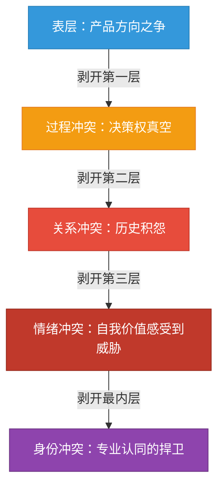
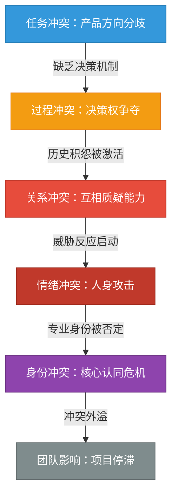
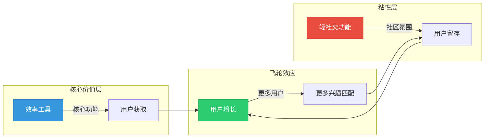
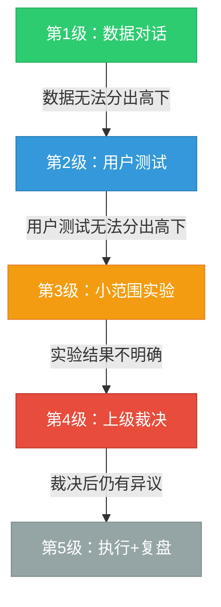

## 案例一：同事之间的争执——当任务冲突滑向关系冲突

同事之间的冲突是职场中最常见的冲突类型。与上下级冲突不同，同事之间通常没有明确的权力层级来"裁决"对错，冲突的解决更依赖双方的沟通能力和第三方的协调。本案例将完整呈现一个典型的同事冲突从萌芽、升级、干预到解决的全过程，并提炼出可复用的冲突管理框架。

与后续案例不同的是，本案例的核心教训不仅适用于管理者，更适用于**身处冲突中的每个人**。如果你正在经历类似的同事争执，即使没有上级介入，你也可以运用本案例中的方法来自我管理冲突。

### 一、场景背景

**公司与团队**：李明和张华是某互联网公司的高级产品经理，入职均超过三年，同属产品部，共同负责公司战略级新产品"LinkUp"的开发。两人此前有过两次合作经历，第一次合作顺利完成，第二次因产品上线时间分歧产生过小摩擦，但未公开爆发。

**组织环境**：产品部采用矩阵式管理，李明和张华在该项目中平级，共同向产品总监王总汇报。公司处于B轮融资后的快速扩张期，对新产品寄予厚望，管理层希望在六个月内完成MVP（最小可行产品）上线。

**关键时间节点**：项目进入第三个月，距离MVP上线还剩三个月，第一版原型已完成，正在进行产品评审。

**人物画像**（理解冲突的"人"的因素需要理解人的特质）：

| 维度 | 李明 | 张华 |
|------|------|------|
| 专业背景 | 用户研究出身，擅长定性分析和用户洞察 | 数据分析出身，擅长竞品分析和市场建模 |
| 决策风格 | 直觉驱动，相信"用户说的就是答案" | 分析驱动，相信"市场数据比用户自述更可靠" |
| 沟通风格 | 直接、情绪化，遇到阻力容易升级音量 | 冷静、克制，倾向于用数据和逻辑压制对方 |
| 冲突模式（TKI） | 倾向竞争（高坚持、低合作） | 倾向竞争（高坚持、低合作） |
| 核心需求 | 自己的专业判断被认可 | 自己的市场洞察被重视 |

这个人物画像揭示了一个重要信息：**两个"竞争型"的人在没有决策机制约束的情况下协作，冲突升级几乎是必然的**。这不是谁的错，而是结构性的风险。

### 二、冲突的萌芽：产品评审会上的分歧

#### 第一阶段：正常的专业讨论（潜伏期）

在产品评审会上，李明首先展示了他主导的用户调研报告。报告基于对200名目标用户的深度访谈，数据显示：73%的用户表示选择同类产品时最看重"能否找到志同道合的人"，68%的用户表示"社区氛围"是留存的关键因素。基于这些数据，李明提出LinkUp应该以社交功能为核心卖点，打造"兴趣社区+即时通讯"的产品形态。

张华随后展示了另一组数据：竞品分析显示，市场上已有三款主打社交的产品占据超过60%的市场份额，新进入者很难突围；而工具型赛道的头部产品用户满意度仅为62%，存在明显的改进空间。张华主张LinkUp应该走"效率工具+轻社交"的差异化路线。

**这一阶段的冲突是健康的**。两种观点都有数据支撑，都有合理性，讨论正在推动团队从不同角度审视产品方向。根据 Jehn（1995）的任务冲突理论，低到中等强度的任务冲突能够促进多角度思考，提高决策质量。问题在于——冲突不会自动停留在"健康区间"，它需要管理。

#### 第二阶段：立场固化（感知期）

讨论开始时两人都在引用数据，但随着辩论深入，立场逐渐固化：

- 李明："社交是用户的核心需求，忽略这个需求等于自废武功。我们的调研数据很清楚。"
- 张华："调研数据只能说明用户想要什么，不能说明我们能做成什么。市场格局摆在那里，正面硬刚社交巨头是找死。"
- 李明："那你的意思是我们的用户调研没用？"
- 张华："我没说没用，但你只看到了一面。数据要结合市场现实来看。"

注意对话的转折点——从"讨论数据"变成了"你只看到了一面"，攻击的矛头开始从观点转向人。

**立场固化的心理学机制**：当人在公开场合表达了一个立场后，大脑会启动"承诺一致性"机制（Cialdini, 1984）——人倾向于坚持自己已经公开表达的立场，即使面对反证。这不只是"面子"问题，而是大脑的认知捷径：改变立场需要消耗更多认知资源，而坚持原有立场是"省力"的。当听众越多（评审会有多人参加），这种效应越强——李明和张华在六位同事面前，改变立场的心理成本远高于只有两人讨论时。

#### 第三阶段：情绪升级（感受期与显现期）

当讨论进入功能优先级排序环节时，冲突急剧升级：

- 李明（提高音量）："你每次都是这样，只看竞品不看用户。上次那个项目你也是这样，结果呢？上线后用户根本不买账。"
- 张华（脸色沉下来）："上次那个项目延期是因为你中途改了三次需求，别把锅甩给我。"
- 李明："我改需求是因为你的方案根本不可行！"
- 张华："不可行？你连技术方案都没看过就说不可行？产品经理做到你这份上也真是够了。"

此时，争论已经完全脱离了产品方向本身，演变为对对方专业能力和职业素养的人身攻击。会议室内其他六位同事面面相觑，气氛极度尴尬。

**冲突升级的生理基础**：神经科学研究表明，当人感到自己的能力和价值被质疑时，大脑的杏仁核（amygdala）会在200毫秒内启动威胁反应，接管前额叶皮层的理性控制功能。此时，人的认知灵活性下降50%以上（Arnsten, 2009），进入"战斗或逃跑"模式。这就是为什么争论会从"讨论产品"升级为"互相攻击"——**不是因为他们不懂道理，而是因为在情绪高涨时，人的生理状态不允许他"讲道理"**。

这一点至关重要：很多旁观者会困惑"他们为什么不能好好说话"，但理解了神经机制后就会明白，强行要求情绪高涨的人"理性讨论"在生理上是不可能的。正确的做法是先降温——这正是王总后来采取的策略。

#### 第四阶段：冲突外溢（余波期的开始）

会议不欢而散。当天下午，两人分别采取了对抗行为：

| 时间 | 李明的行为 | 张华的行为 |
|------|-----------|-----------|
| 会后当天 | 向自己负责的前端团队传达"以社交功能为核心"的开发方向 | 向自己负责的后端团队传达"以工具功能为核心"的开发方向 |
| 第二天 | 在产品文档中将社交模块标记为P0优先级 | 在产品文档中将工具模块标记为P0优先级 |
| 第三天 | 开发团队发现两份需求文档存在冲突，向两人分别确认，得到不同答复 | 向王总发送邮件，"客观汇报"李明在评审会上的"不专业表现" |
| 第四天 | 项目进度停滞，开发团队无所适从 | 两位前端工程师私下抱怨"产品经理天天打架，我们白干活" |

**冲突外溢的三个典型信号**（如果你在团队中观察到这些信号，说明冲突已经进入危险区）：

1. **方向分裂**：不同团队收到相互矛盾的指令（如本案例中的两份需求文档）
2. **向上告状**：冲突方向第三方（上级、HR）发送"客观汇报"——这往往是争取盟友的策略，而非真正的信息同步
3. **旁观者效应**：团队成员开始私下议论、选边站队、或对工作产生消极情绪

### 三、冲突的深层分析：洋葱模型

本案例的冲突表面看是产品方向之争，但深入分析后会发现多层冲突交织在一起。用"冲突洋葱模型"来拆解：

#### 第一层：任务冲突——产品方向的根本分歧

这是冲突的核心层。李明和张华对市场机会的判断不同：李明认为用户需求（社交）应该驱动产品方向，张华认为市场格局（竞争态势）应该驱动产品方向。这两种观点都有数据支撑，都有合理性，属于典型的"对-对冲突"（Right vs. Right dilemma）——不是谁对谁错，而是两种合理的价值取向之间的张力。

如果冲突停留在这一层，它是功能性的、建设性的。De Dreu和Weingart（2003）的元分析研究表明，低到中等强度的任务冲突能够促进多角度思考，提高决策质量。**但关键前提是：任务冲突不会自动转化为成果，它需要被引导和管理**。没有引导的任务冲突，会因为人的心理防御机制而自然滑向关系冲突。

#### 第二层：过程冲突——决策权的争夺

两人在项目中平级，没有明确的决策权归属。当出现分歧时，没有预设的决策机制（如数据投票、用户测试、上级裁决）可以启动。这导致两人只能通过"说服"或"压倒"对方来推进自己的方案，这为冲突升级提供了结构性土壤。

**过程冲突是同事冲突中最容易被忽视、却最具破坏力的一层**。它往往不是"谁做错了什么"，而是"没人做错什么，但机制缺失"。以下信号说明存在过程冲突：

| 信号 | 本案例中的表现 |
|------|---------------|
| 同一事项多人重复决策 | 李明和张华分别向不同团队传达不同方向 |
| 无人知道谁有最终决定权 | 开发团队向两人分别确认，得到不同答复 |
| 决策总是通过"谁更坚持"来做出 | 两人都试图通过坚持来压倒对方 |
| 会议频繁但结论不落地 | 评审会没有产出共识，只产出对抗 |

#### 第三层：关系冲突——历史积怨的爆发

李明提到"上次那个项目你也是这样"，张华提到"上次延期是因为你改需求"，说明两人之前的合作中存在未处理的矛盾。这些历史积怨像地下的暗火，平时看不见，一旦遇到新的分歧就会被点燃。

**关系冲突的"冰山效应"**：你看到的冲突（当下的产品分歧）只是冰山一角，水面下是过去几年积累的不满、失望和不信任。哈佛谈判项目的研究表明，关系冲突中约60%的情绪反应来自历史积累，只有40%来自当前事件。这意味着：**如果不处理历史积怨，只解决当前问题，冲突会反复发生**。

关系冲突是三类冲突中破坏性最大的——它会降低双方的认知灵活性，让人陷入"对方就是不行"的确认偏差中，无法客观评估对方的方案。一旦关系冲突形成，对方说的任何话都会被自动解读为负面的（"他说的有道理"变成"他又在找借口"），这就是心理学中的"消极诠释偏差"（Negative Sentiment Override, Gottman）。

#### 第四层：情绪冲突——被攻击感和不安全感

李明觉得自己的调研成果被轻视（"你的调研没用"），张华觉得自己的专业判断被否定（"你每次都是这样"）。当人感到自己的能力和价值被质疑时，大脑的威胁反应系统会被激活，这不是"想不开"，而是生理本能。

#### 第五层：身份冲突——专业认同的捍卫（原文未触及的最深层）

最深层的冲突往往被忽略：李明的身份认同是"用户洞察专家"，张华的身份认同是"市场分析专家"。当李明的用户调研被质疑时，他听到的不是"你的数据不够全面"，而是"你的专业身份没有价值"；当张华的竞品分析被忽视时，他感受到的不是"你的分析角度不同"，而是"你引以为傲的能力毫无意义"。

**身份冲突是最难被识别、也最难被修复的冲突**。因为人不会直接说出"你觉得我作为用户研究者没有价值"，而是用"你总是不看数据"来间接表达。调解者如果只看到表层的行为冲突，而看不到身份冲突，调解往往流于表面。

#### 用TKI模型分析冲突策略

用Thomas-Kilmann冲突模式工具来分析，两人在冲突初期都采用了**竞争（Competing）**策略——高坚持性、低合作性，都试图证明自己的方案更优。随着冲突升级，策略没有切换，反而在竞争的基础上叠加了人身攻击，使冲突性质从任务冲突彻底滑向关系冲突。

#### Glasl冲突升级模型对照

奥地利冲突研究者Friedrich Glasl提出的九阶段冲突升级模型，可以精确对应本案例的发展过程：

| 阶段 | Glasl模型 | 本案例中的表现 | 干预可行性 |
|------|----------|---------------|-----------|
| 1 | 硬化立场 | 两人从讨论数据转向各自坚持立场 | ★★★★★ 双方可自行解决 |
| 2 | 辩论与策略 | "你只看到了一面"——开始策略性攻击对方论点 | ★★★★☆ 需要提醒但可控 |
| 3 | 行动而非言辞 | 会后分别向各自团队传达不同方向 | ★★★☆☆ 需要第三方提醒 |
| 4 | 结盟与阵营 | 张华向王总发邮件"客观汇报"——争取盟友 | ★★☆☆☆ 需要管理介入 |
| 5 | 丧失面子 | "产品经理做到你这份上也真是够了" | ★★☆☆☆ 已有损害 |
| 6 | 战略性威胁 | —（未达到） | ★☆☆☆☆ |
| 7 | 毁灭性打击 | —（未达到） | ★☆☆☆☆ |
| 8 | 粉碎对手 | —（未达到） | ☆☆☆☆☆ |
| 9 | 共同毁灭 | —（未达到） | ☆☆☆☆☆ |

**关键洞察**：本案例的冲突停留在了第4-5阶段，王总在第4阶段介入——这是干预的最后窗口期。如果再晚一步进入第6阶段（战略性威胁，如"如果不按我的来，我就申请调离项目"），冲突将变得极难修复。

### 四、干预策略：分步化解冲突

产品总监王总在第四天发现了问题——一封来自开发团队的邮件，标题是"LinkUp项目需求文档冲突，请求澄清"。王总没有立即召集会议，而是按照以下步骤逐一推进。

#### 第一步：信息收集——分别了解情况

王总分别与李明和张华进行了30分钟的一对一谈话。谈话的目标不是"判断谁对谁错"，而是了解三件事：各自的核心关切是什么、对对方的不满是什么、希望怎么解决。

**与李明的谈话要点**：

王总没有一上来就问"你们怎么回事"，而是从关心项目进度切入："LinkUp项目最近进展有些慢，我想了解一下你这边的情况。"

李明在一对一的环境中表达了自己的真实想法：他觉得张华太保守，总是被竞品吓住，不敢做创新；他觉得自己花了三个月做的用户调研被轻视了；他承认自己在会上说了一些过激的话，但"实在忍不了他那个态度"。

**与张华的谈话要点**：

张华同样有委屈：他觉得李明太理想化，只看用户需求不看市场现实；他觉得李明中途改需求的老毛病又犯了；他承认自己发那封邮件有些冲动，但"如果不说，他就会按自己的来"。

**王总的关键发现**：

通过一对一谈话，王总识别出几个关键信息：

1. 两人的深层目标一致——都希望LinkUp成功，都希望自己的方案能被采纳是因为"对产品好"而不是"我要赢"
2. 两人都对对方有不满，但这些不满中有一半是基于过去的积怨而非当前的事实
3. 两人都承认自己在会上说了过激的话，但都认为是对方先挑起的
4. 项目已经受到了实质性影响，需要尽快恢复方向一致

**王总在信息收集阶段使用的关键技巧**：

| 技巧 | 具体做法 | 原理 |
|------|---------|------|
| 从工作切入而非冲突切入 | "项目进展有些慢"而非"你们怎么回事" | 降低防御心理，让对方感觉被关心而非被审问 |
| 倾听不评判 | 点头、"嗯"、"然后呢"，不打断、不评价 | 创造安全空间，让对方说出真实想法 |
| 追问感受而非事实 | "你当时是什么感觉？"而非"当时具体发生了什么？" | 感受信息比事实信息更有价值——感受反映深层需求 |
| 汇总确认 | "我听下来是这样……你觉得对吗？" | 确保理解准确，同时让对方感到被倾听 |

#### 第二步：分别降温——帮助双方恢复理性

在召集三方会谈之前，王总先分别帮助两人"降温"。这不是简单的安慰，而是有策略的认知引导。

**对李明的引导**：

> "你的用户调研做得很扎实，数据有说服力。但我想提醒你一件事——在会上你提到'上次那个项目'的时候，讨论的性质就变了。你觉得张华是在质疑你的数据，还是在质疑你这个人？"

李明沉默了几秒："可能是觉得他在质疑我这个人。"

> "这就是问题所在。他质疑的是你的方案，但你听到的是对你人的否定。这种感觉让你的反应从'捍卫方案'变成了'捍卫自己'，对吗？"

李明点头。

> "下次当你感觉被攻击的时候，试着暂停三秒，问自己一个问题：'他是在否定我的方案，还是在否定我这个人？'大多数时候，答案是前者。"

**降温技巧的深层机制**：王总在这里使用了认知行为疗法（CBT）中的"认知重评"技术——帮助李明将"他否定我这个人"这个自动化认知（automatic thought）重新评估为"他否定的是我的方案"。这种认知重评能够降低杏仁核的活跃度，恢复前额叶皮层的理性控制功能。

**对张华的引导**：

> "你的竞品分析很有价值，市场视角是这个产品不可或缺的。但我想让你想一个问题——当你发那封邮件给我的时候，你的目的是什么？是为了解决问题，还是为了让我'站你这边'？"

张华承认："可能两者都有。"

> "这种行为叫'三角化'——把第三方拉进来给自己的立场增加筹码。短期看它能给你带来支持，但长期看它会破坏你和李明之间的信任。下次有分歧，我希望你先尝试直接和李明沟通，实在解决不了再来找我。"

**分别降温阶段的核心原则**：

1. **先肯定再指出问题**——"你的调研很扎实"在先，"但你提到上次时性质变了"在后。先让对方感到被认可，再指出问题，对方才听得进去
2. **帮对方看见自己的模式**——不是告诉对方"你错了"，而是通过提问让对方自己意识到"我刚才的反应是从捍卫方案变成了捍卫自己"
3. **给工具不给答案**——"暂停三秒，问自己一个问题"是可执行的工具，比"你下次要冷静"这种空话有效一百倍
4. **保护双方的尊严**——整个过程中没有对任何一方说"你做得不对"，而是用"这是人之常情，但我们可以做得更好"的框架

#### 第三步：三方会谈——从立场转向利益

王总安排了一次三方会谈。会谈的环境设置很重要：选择了一个非正式的小会议室（而非大会议室），桌上放了咖啡和零食（降低对抗氛围），时间选在下午三点（双方午餐后情绪较稳定的时段）。

**环境设计的心理学依据**：环境心理学研究表明，空间布局直接影响人的行为模式。正式的大会议室（长桌、投影仪、白板）暗示"汇报和评审"的权力结构，容易激活防御心理；非正式的小空间（圆桌、沙发、食物）暗示"对话和协作"的关系模式，更容易让人放下戒备。

**开场——设定基调**：

> "感谢你们两位抽时间来。我先说一下我今天的目的：我不是来裁判谁对谁错的，因为你们两个人的方案都有道理。我今天想做的是帮你们找到一个比你们各自方案都更好的第三种方案。我的规则只有三条：不打断、不翻旧账、对事不对人。你们同意吗？"

两人点头。

**开场话术的四个设计要点**：

1. **明确否定裁判角色**——"我不是来裁判谁对谁错"直接解除双方的防御心态，否则两人会把精力花在"说服王总站自己这边"而非"解决问题"
2. **肯定双方都有道理**——让双方都不觉得自己被判了"输"
3. **提出更高目标**——"比你们各自方案都更好的第三种方案"将竞争关系转化为合作探索
4. **设定明确规则**——不打断、不翻旧账、对事不对人，为会谈提供行为边界

**引导表达——从"我的方案更好"到"我想要什么"**：

王总用了一系列引导性提问，帮助两人从立场层面深入到利益层面：

> "李明，抛开具体的方案不谈，你最希望LinkUp为用户解决的核心问题是什么？用一句话说。"

李明："让用户找到和自己兴趣相投的人，不再孤独。"

> "张华，你呢？"

张华："让用户在最短的时间内完成自己想做的事，不浪费时间。"

> "好。你们发现了吗？你们想要的其实是同一件事——让用户觉得这个产品'值得用'。只是你们对'值得用'的理解不同。李明认为'值得用'是因为有归属感，张华认为'值得用'是因为有效率。这两种理解都对，而且它们不矛盾。"

这一步的核心价值在于：**将对立的立场转化为互补的视角**。

**"立场-利益"分离技术的实操框架**：

| 层次 | 问题 | 李明的回答 | 张华的回答 |
|------|------|-----------|-----------|
| 立场（Position） | 你想要什么方案？ | 以社交为核心 | 以工具为核心 |
| 利益（Interest） | 你为什么想要这个方案？ | 用户需要归属感 | 市场需要差异化 |
| 需求（Need） | 你最底层的需求是什么？ | 专业判断被认可 | 市场洞察被重视 |
| 价值观（Value） | 你真正在乎的是什么？ | 用户至上 | 现实主义 |

**数据对齐——回到事实**：

王总让两人把各自的数据摊开来看：

| 维度 | 李明的数据 | 张华的数据 | 综合解读 |
|------|-----------|-----------|---------|
| 用户需求 | 73%看重"找人" | — | 社交需求真实存在 |
| 市场竞争 | — | 社交赛道CR3=60% | 正面硬刚不明智 |
| 留存因素 | 68%看重社区氛围 | — | 社交功能有助于留存 |
| 赛道机会 | — | 工具赛道满意度62% | 工具赛道存在机会 |
| 竞品弱点 | — | 工具产品社交弱 | 差异化切入点存在 |

王总指着这张表说："你们的数据告诉我一个你们各自都没看到的故事——用户需要社交，但市场上的社交产品已经很多；用户也需要好用的工具，但现有工具的社交体验很差。这不正是一个机会吗？"

**数据对齐为什么有效**：

1. **客观性**：数据不会"站队"，它降低了"谁说了算"的权力博弈
2. **互补性**：两组数据放在一起时，呈现的信息远比各自单独看时丰富
3. **创造性**：完整的信息图景往往指向双方都没想到的第三方案

**创造性解决——第三方案**：

经过讨论，三人共同提出了一个整合方案：

**方案核心**：以工具功能作为核心价值主张吸引用户（采纳张华的市场洞察），以社交功能作为留存手段增强用户粘性（采纳李明的用户洞察）。功能优先级分为三个阶段：

| 阶段 | 时间 | 核心功能 | 负责人 | 策略依据 |
|------|------|---------|--------|---------|
| Phase 1 | 第1-2个月 | 效率工具（任务管理、日程协作） | 张华主导 | 快速验证工具价值，避开社交巨头锋芒 |
| Phase 2 | 第3-4个月 | 轻社交（兴趣标签、小组、动态） | 李明主导 | 在工具用户基础上建立社区氛围 |
| Phase 3 | 第5-6个月 | 深度社交（私信、活动、圈子） | 共同负责 | 用社交功能构建竞争壁垒 |

**这个方案为什么能成功**：

1. **双方都"赢"了**——不是各让一步的妥协，而是双方的核心洞察都被采纳
2. **有时间维度**——不是"同时做两件事"，而是"分阶段做"，降低了资源冲突
3. **有责任人**——每个阶段有明确主导者，避免了"两个人一起负责=没人负责"
4. **有验证机制**——Phase 1的结果会为Phase 2提供数据支撑，如果工具功能验证失败，可以调整后续计划

#### 第四步：建立机制——预防冲突再次发生

方案达成后，王总没有就此结束，而是推动建立三个长期机制：

**1. 产品决策机制**：

> "以后遇到方向性分歧，我们不再靠谁说服谁来决定。我们的决策流程是：先各自用数据说话，如果数据不能分出高下，就做用户测试，如果用户测试也不能分出高下，就由我来做最终决定。但无论谁做决定，决定一旦做出，全团队执行，不再反复。"

**决策机制的五级升级通道**：

**2. 沟通规则**：

三人共同约定了四条沟通规则：

| 规则 | 具体表述 | 违反规则的后果 | 规则的深层目的 |
|------|---------|--------------|--------------|
| 先私后公 | 分歧先一对一讨论，不在公开场合对峙 | 公开对峙让双方都"骑虎难下"，扩大冲突 | 给双方留退路和缓冲空间 |
| 不翻旧账 | 讨论时不提"上次""你总是""你又" | 翻旧账将任务冲突升级为关系冲突 | 保护关系，聚焦当前问题 |
| 数据先行 | 每次评审会前先对齐数据和假设 | 会上"数据打架"浪费时间且制造对立 | 用客观信息替代主观争论 |
| 暂停机制 | 如果情绪升温，任何一方可以喊暂停 | 情绪高涨时的决策质量极低 | 保护双方的认知能力 |

**3. 定期复盘机制**：

每两周进行一次15分钟的产品复盘，不仅复盘产品进展，也复盘团队协作状态。王总说："产品做得好不好是一回事，团队协作顺不顺畅是另一回事。两个都要管。"

**复盘会的三问框架**：

1. **过去两周，什么做得好？**（建立正向反馈循环）
2. **过去两周，什么可以改进？**（聚焦行为而非人格）
3. **下两周，我们最重要的一个改进动作是什么？**（确保改进落地）

### 五、处理结果

| 维度 | 干预前 | 干预后（一个月） |
|------|--------|----------------|
| 产品方向 | 两个相互矛盾的需求文档 | 统一的三阶段产品路线图 |
| 项目进度 | 停滞四天 | 恢复正常，Phase 1按计划推进 |
| 李明与张华的关系 | 冷战，不直接沟通 | 恢复工作沟通，每周有一次非正式交流 |
| 开发团队状态 | 迷茫、抱怨 | 方向清晰，积极性恢复 |
| 评审会氛围 | 紧张、对立 | 有争论但可控，争论后能达成共识 |

### 六、案例复盘：关键转折点分析

为什么这个冲突能够被成功化解？回顾整个过程，有三个关键转折点：

**转折点一：王总没有在冲突升级时立即介入**

如果王总在评审会当天就召集会议，两人还处于情绪高峰，任何"调解"都可能变成"选边站"。王总选择了先分别谈话、分别降温，再三方会谈的节奏，给了双方情绪回落的时间。这体现了冲突干预中"先降温、再解决"的原则。

**转折点二：从立场到利益的引导**

如果王总直接问"你们觉得社交和工具哪个更重要"，两人的回答一定是各说各话。王总用了"你最希望为用户解决什么问题"这个提问方式，成功地将讨论从"我的方案比你好"引导到"我们都想让用户觉得产品值得用"，找到了共同利益的基础。

**转折点三：数据对齐消除了信息差**

两人的分歧部分源于各自只掌握了有利于自己立场的数据。当两组数据被摆在一起时，它们指向了一个双方都没想到的整合方案。这说明许多冲突的根源不是"人的问题"，而是"信息不对称"。

**转折点四（被忽略的）：给双方都分配了"主导权"**

三阶段方案中，Phase 1由张华主导，Phase 2由李明主导。这意味着双方都不需要"放弃"自己的方案——它只是被延迟了，而不是被否定了。这种安排满足了双方最深层的需求——专业身份被认可。很多冲突调解失败的原因就在于：方案只解决了"做什么"的问题，没有解决"谁来主导"的身份认同问题。

### 七、如果你身处冲突中：自我管理指南

**本案例中有一个重要的缺失视角——如果你就是李明或张华，没有王总来调解，你该怎么办？**

以下是给冲突当事人自己的行动指南：

#### 7.1 自我诊断：你正在经历哪种冲突？

在采取行动之前，先问自己五个问题：

| 问题 | 如果答案是"是" | 这意味着什么 |
|------|---------------|-------------|
| 我对对方的不满，有多少是基于当前事件？ | 不到一半 | 你可能在用当前冲突"偿还"历史积怨 |
| 我是否在会议/公开场合表达过对对方的不满？ | 是 | 冲突已经外溢，需要主动修复 |
| 我是否会主动避免与对方的接触？ | 是 | 你已经进入了"回避"模式，问题在恶化 |
| 我是否在向第三方"寻求确认"（"你觉得张华是不是太过分了"）？ | 是 | 你在三角化——拉盟友而非解决问题 |
| 我是否在对方说话时就开始准备反驳？ | 是 | 你在"听"但没有在"理解"，立场已经固化 |

如果有三个以上的"是"，说明冲突已经进入了需要主动干预的阶段。

#### 7.2 如果你是冲突的一方：五步自我管理法

**第一步：暂停——打破自动反应链**

当冲突正在发生时，使用"STOP技术"：

- **S**（Stop）：在情绪上升的瞬间，有意识地停止说话
- **T**（Take a breath）：做三次深呼吸（4秒吸气-7秒屏气-8秒呼气），激活副交感神经系统
- **O**（Observe）：观察自己的身体反应——心跳加速？肩膀紧绷？这些都是情绪上升的信号
- **P**（Proceed thoughtfully）：选择一个更有建设性的回应方式

**第二步：自我对话——从"他不对"到"我想要什么"**

在内心问自己三个问题：

1. "我真正的目标是什么？是证明我对他错，还是找到最好的产品方案？"
2. "如果我现在退一步，我失去的是什么？得到的是什么？"
3. "三个月后回头看，我会希望自己现在怎么处理这件事？"

这三个问题的作用是将你从"战斗模式"切换回"问题解决模式"。

**第三步：主动沟通——打破僵局的开场白**

如果你决定主动与对方沟通，以下话术经过验证，比"我们需要谈谈"更有效：

| 场景 | 推荐话术 | 为什么有效 |
|------|---------|-----------|
| 冷战中，想打破僵局 | "关于上次评审会的事，我觉得我当时说了一些不合适的话，想跟你说声抱歉" | 先道歉不等于认输，而是降低对方的防御 |
| 对方回避你 | "我知道你可能还在消化上次的事，我不急。等你准备好了，我们可以聊一下接下来怎么配合" | 尊重对方的节奏，但表达合作意愿 |
| 需要重新讨论方案 | "我想了一下，你的市场分析其实有几个点我之前没有充分考虑。我们能不能找个时间重新看看数据？" | 承认对方的价值，用"重新看数据"而非"重新讨论"降低对抗感 |

**第四步：寻求调解——什么时候应该找第三方**

不是所有冲突都适合"自己解决"。以下信号说明你需要寻求第三方帮助：

- 你已经尝试直接沟通两次以上，但对话每次都以争吵结束
- 你发现自己的情绪在看到对方时就会自动上升（条件反射化了）
- 冲突已经影响到你的工作效率或身心健康
- 对方开始采取对你的工作有实质性损害的行为（如故意不共享信息）

找第三方时，不要说"帮我评评理"，而是说"我和XX在XX方面有分歧，我希望能找到一个双方都能接受的方案，你能帮我们协调一下吗？"——前一种说法让第三方觉得要"判案"，后一种说法让第三方觉得要"协助"。

**第五步：冲突后修复——关系重建的三个动作**

即使冲突已经解决，关系的修复仍需要刻意投入：

1. **主动示好**：在冲突后的一周内，找一个与冲突无关的事情主动与对方协作（如一起审查某个方案、一起参加一个会议），用行动而非语言重建工作关系
2. **公开认可**：在团队会议中，找机会肯定对方在冲突解决方案中的贡献（"张华的市场分析帮我们找到了差异化切入点"），这比私下说"谢谢"更有力量
3. **建立新记忆**：冲突的记忆不会消失，但新的正面记忆可以逐渐覆盖它。共同完成一个有挑战性的任务，比任何"关系修复谈话"都有效

### 八、如果干预失败：备选方案

不是所有冲突都能通过一次三方会谈解决。如果上述干预未能奏效，还有以下备选方案：

**方案A：引入用户测试**

既然两人都声称自己的方案更符合用户需求，那就让用户来投票。设计A/B测试，分别制作两个原型，让目标用户实际体验后给出反馈。这个方案的优势是引入了客观标准，劣势是需要额外的时间和资源。

**方案B：分拆项目**

如果两人实在无法协作，可以考虑将项目分拆为两个独立的产品方向，各自负责一个，用市场结果来验证。这个方案的风险是资源分散，但可以避免持续的人际摩擦拖垮整个项目。

**方案C：调整团队配置**

如果以上方案都不可行，可能需要调整团队结构——将其中一人调到其他项目。这是最后的手段，因为它意味着承认这段合作关系已经无法修复。但它有时是必要的——一个持续内耗的团队比一个不完美的团队配置造成的损失更大。

**方案D：升级处理**

如果冲突已经影响到组织层面（如其他团队也开始站队），需要升级到HR或更高管理层介入。这通常意味着冲突已经超出了同级管理者能处理的范围。

**方案E：引入专业调解**

对于深层关系冲突（特别是涉及历史积怨和信任破裂的），可以考虑引入专业的内部或外部调解员。专业调解员与上级调解的区别在于：调解员没有权力裁决，也没有立场偏好，其核心技能是帮助双方自主找到解决方案。

### 九、可复用的冲突管理模板

本案例中的冲突模式——"任务冲突因缺乏决策机制而升级为关系冲突"——在职场中极为常见。以下是从本案例中提炼的通用管理模板：

#### 模板一：同事冲突诊断清单

当发现两位同事之间存在冲突时，用以下清单快速诊断：

| 诊断维度 | 关键问题 | 本案例的诊断结果 |
|---------|---------|----------------|
| 冲突类型 | 是任务冲突、关系冲突还是过程冲突？ | 三者混合，以任务冲突为起点 |
| 冲突阶段 | 处于Glasl模型的哪个阶段？ | 第4-5阶段（结盟+丧失面子） |
| 深层利益 | 双方真正想要的是什么？ | 都想让产品成功，都想自己的专业判断被认可 |
| 决策机制 | 是否存在预设的分歧解决机制？ | 没有，这是冲突升级的结构性原因 |
| 历史因素 | 是否有未处理的积怨？ | 有，上一次合作的摩擦未被处理 |
| 影响范围 | 是否已波及团队其他人？ | 是，开发团队已受影响 |
| 干预窗口 | 距离"不可逆"还有多远？ | 还在可控范围，但再晚就难了 |

#### 模板二：三方会谈引导话术

| 阶段 | 话术示例 | 目的 | 注意事项 |
|------|---------|------|---------|
| 开场 | "我不是来裁判对错的，是来帮你们找到更好的方案" | 降低防御心理 | 必须在会谈最开始就说，否则双方会花精力争取你 |
| 引导表达 | "抛开方案不谈，你最想为用户解决什么问题？" | 从立场转向利益 | 注意：要用"你最想"而非"你觉得应该"——前者触及个人，后者触及观点 |
| 数据对齐 | "我们把各自的数据摊开，看看整体画面是什么" | 消除信息差 | 要用白板或表格将数据可视化，口头复述容易被曲解 |
| 创造方案 | "有没有一种方案能同时满足你们各自的核心关切？" | 激发创造性思维 | 如果两人想不出，管理者可以先抛出一个框架让两人修改 |
| 达成共识 | "我们试试这个方案，两周后复盘，如果不行再调整" | 降低决策的压力感 | "试试"比"确定"更容易被接受，因为它保留了调整空间 |

#### 模板三：冲突预防机制设计

从本案例的教训出发，任何需要多人协作的项目都应在启动时建立以下机制：

**决策权矩阵**：

| 决策类型 | 决策方式 | 适用场景 |
|---------|---------|---------|
| 战略方向 | 上级裁决 | 产品定位、核心功能取舍 |
| 技术方案 | 技术负责人决定 | 架构选型、技术栈选择 |
| 设计细节 | 民主讨论+设计师终审 | UI/UX、交互细节 |
| 优先级排序 | 数据驱动+定期评审 | 需求排期、资源分配 |
| 紧急变更 | 快速协商+事后复盘 | 线上bug、市场变化响应 |

**沟通规则示例**：

- 意见分歧先一对一沟通，不在三人以上的场合公开对峙
- 讨论时不使用"你总是""你又""上次"等指向人格或历史的表述
- 任何一方可以喊"暂停"，约定24小时内冷静后继续
- 每两周一次团队协作复盘，及时发现和处理潜在矛盾

**冲突升级预警系统**：

| 预警信号 | 颜色 | 应对措施 |
|---------|------|---------|
| 会议中出现一次人身攻击 | 黄色 | 当场提醒"我们回到方案讨论" |
| 双方开始分别向团队传达不同方向 | 橙色 | 管理者在24小时内分别谈话 |
| 有人开始向上级"客观汇报" | 橙色 | 管理者主动介入，不等邮件 |
| 开发团队反映无所适从 | 红色 | 立即召开三方会谈 |
| 冷战超过3天不直接沟通 | 红色 | 强制介入，分别降温+三方会谈 |

### 十、从本案例看冲突管理的核心原则

**原则一：任务冲突是资产，关系冲突是负债**

本案例中，如果冲突始终停留在"社交还是工具"的专业讨论层面，它会推动两人更深入地思考产品方向，是一种建设性的张力。但当冲突从"你的方案有问题"升级为"你这个人有问题"时，它就变成了破坏性的力量。冲突管理的首要任务，就是守住"对事不对人"的底线。

**原则二：决策机制是冲突的"泄洪渠"**

李明和张华的冲突之所以升级，一个重要原因是他们没有预设的决策机制。当两个同样有道理的观点碰撞时，如果没有一个双方都认可的裁决方式，冲突就只能靠"谁声音大""谁关系硬"来解决——这必然导致关系冲突。建立清晰的决策权矩阵，是在冲突发生前就安装好的"泄洪渠"。

**原则三：先降温、再解决，顺序不能反**

王总的第一反应不是"赶紧把两人拉到一起谈"，而是先分别谈话、分别降温。这个顺序至关重要。在情绪高涨时，人的认知能力下降50%以上（神经科学研究数据），此时强行对话只会让冲突升级。先给双方时间和空间冷静下来，再进行建设性对话，成功率会大幅提高。

**原则四：数据是最好的"和事佬"**

当两人各执一词时，王总没有凭自己的判断来"选边"，而是让两人把数据摊开来看。数据有两个独特价值：第一，它是客观的，不会"站队"；第二，它是完整的，能够展示双方各自只看到了一部分真相。当两组数据被放在一起时，它们指向了一个双方都没想到的整合方案。

**原则五：解决冲突不是终点，建立机制才是**

三方会谈达成了产品方案，但王总没有就此止步。他推动建立了决策机制、沟通规则和定期复盘机制——这些制度化的安排，比任何一次冲突调解都更有长期价值。冲突管理的最高境界不是"善于灭火"，而是"安装烟雾报警器和自动喷淋系统"。

**原则六：满足双方的身份需求**

本案例中一个容易被忽略的细节：三阶段方案让Phase 1由张华主导，Phase 2由李明主导。这不是简单的任务分配，而是对双方专业身份的尊重和认可。冲突中最深层的需求往往不是"方案要按我的来"，而是"我的专业价值被看到"。满足这个需求，冲突就解决了一大半。

### 十一、常见错误：处理同事冲突时的五个陷阱

| 陷阱 | 表现 | 后果 | 正确做法 |
|------|------|------|---------|
| 过早介入 | 冲突刚出现苗头就急于调解 | 剥夺了双方自行解决的机会，可能让小题大做 | 观察24-48小时，判断是否有自行解决的迹象；同时注意Glasl模型的阶段——在第3阶段前可以观察，第4阶段必须介入 |
| 选边站 | 上级直接表态支持某一方 | 被支持方感到胜利但不感恩，被反对方感到不公并记恨 | 先了解双方立场，引导双方自行寻找解决方案；如果必须表态，用"我同意张华关于市场风险的分析，同时我也认为李明的用户洞察不可或缺"这种结构 |
| 和稀泥 | "你们都各有道理，互相让一步吧" | 问题没有真正解决，双方都不满意，下次还会爆发 | 引导深入分析，找到真正的解决方案而非表面妥协；"各让一步"适用于利益冲突，不适用于任务冲突 |
| 只灭火不建制 | 解决了当前冲突就结束 | 同样的冲突会反复发生，团队陷入"冲突-调解-冲突"的循环 | 每次冲突后都推动建立或优化预防机制 |
| 忽视旁观者 | 只关注冲突双方，不关注受影响的团队 | 团队士气下降，"站队"文化形成 | 冲突解决后向团队同步结果和新机制 |

**第六个陷阱（原文未提及）：急于"翻篇"**

冲突解决后，有些管理者会说"好，这件事就到此为止了，大家都别再提了"。这看起来是"向前看"，但实际上是在压制未消化的情绪。正确的做法是：给双方一个"消化期"——允许他们在接下来的一两周内偶尔提起这件事（而不是压抑），同时用新的正面体验逐步覆盖冲突记忆。

### 十二、延伸思考：同事冲突的不同变体

本案例展示的是"平级同事+任务冲突+第三方介入"的典型模式。在实际工作中，同事冲突还有多种变体，每种变体的处理策略有所不同：

**变体一：跨部门同事冲突**

当冲突发生在不同部门的同事之间时，往往涉及部门利益的博弈。此时除了引导双方从立场转向利益外，还需要找到跨部门的共同目标（如公司层面的OKR），让双方意识到"我们不是两个部门在竞争，而是同一个公司在解决问题"。

跨部门冲突的特殊难点在于：双方的上级不同，没有一个共同的"王总"来协调。此时需要找到双方上级的共同上级，或者建立跨部门的协调机制（如产品委员会）。

**变体二：远程团队的同事冲突**

远程环境中，文字沟通（邮件、IM）缺乏语气和表情信息，容易导致误解升级。处理远程团队冲突时，优先选择视频通话而非文字沟通，因为非语言信号（表情、语气）能传递大量情感信息，有助于降低误判。

远程冲突的另一个特殊之处是：冲突更容易"潜伏"。在办公室环境中，冷战会被同事察觉并引发干预；在远程环境中，冷战可能表现为"消息回复变慢""只发文字不语音"，这些信号更隐蔽，管理者需要更敏锐的觉察力。

**变体三：新老员工之间的冲突**

新员工带来新视角，老员工拥有组织记忆，两者的碰撞既可能产生创新火花，也可能引发"你不懂我们这里"的对抗。处理这类冲突时，需要帮助双方看到对方的独特价值，避免让任何一方觉得自己被边缘化。

新老员工冲突的深层动态是"权力与知识"的博弈：老员工的权力来自组织记忆和人脉网络，新员工的权力来自新知识和外部视角。管理者需要帮助双方理解：两种权力都是组织需要的，缺一不可。

**变体四：涉及绩效竞争的同事冲突**

当两位同事在竞争同一个晋升名额或奖金池时，冲突往往带有零和博弈的色彩。此时需要尽量将竞争透明化（明确评估标准），同时引导双方将注意力从"打败对方"转向"提升自己"。

绩效竞争冲突最容易在"绩效季"爆发。提前在绩效季开始前明确评估标准、建立透明的评估流程、确保标准被双方理解和接受，是预防此类冲突的关键。

**变体五：价值观冲突（高难度）**

当冲突涉及工作方式、职业态度甚至价值观差异时（如一方认为"加班是应该的"，另一方认为"工作生活平衡很重要"），处理难度最高。因为价值观冲突没有"客观数据"可以依赖——你无法用数据证明"加班是对的"或"不加班是对的"。

处理价值观冲突的核心原则是：**不试图改变对方的价值观，而是找到双方价值观的交集**。例如，在"加班vs平衡"的冲突中，交集可能是"在关键节点全力冲刺，平时保持可持续的工作节奏"。

***

> 同事之间的争执，本质上是两种合理视角的碰撞。它不是灾难，而是团队走向更优决策的必经之路。关键在于：你能否将碰撞从"相互摧毁"转化为"相互成就"。这需要清晰的决策机制来防止冲突升级，需要成熟的沟通技巧来引导对话走向利益层面，更需要一种"对事不对人"的团队文化来守住底线。当你学会在冲突中看见对方的合理性，而不是只看到对方的"错误"时，你就已经掌握了同事冲突管理的精髓。
>
> 而如果你此刻正身处冲突之中——记住：你无法控制对方的行为，但你可以选择自己的回应。暂停三秒，问自己："他是在否定我的方案，还是在否定我这个人？"然后，选择做一个解决问题的人，而不是一个证明自己正确的人。
