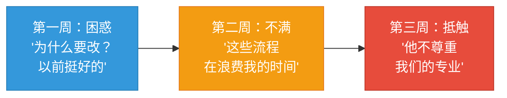
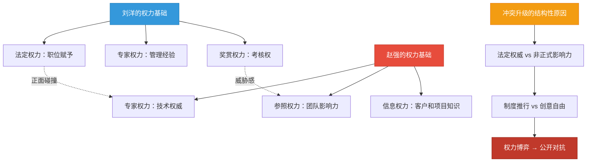
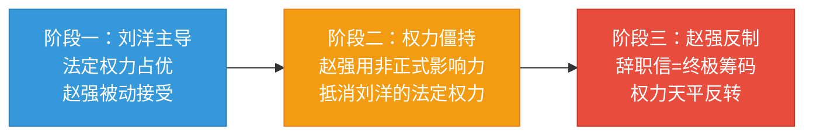
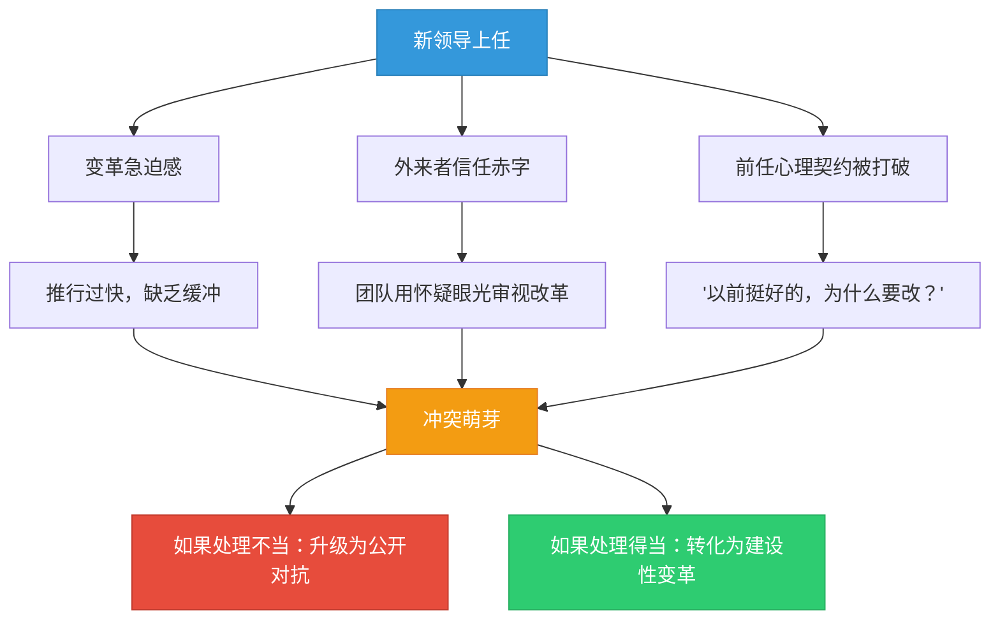
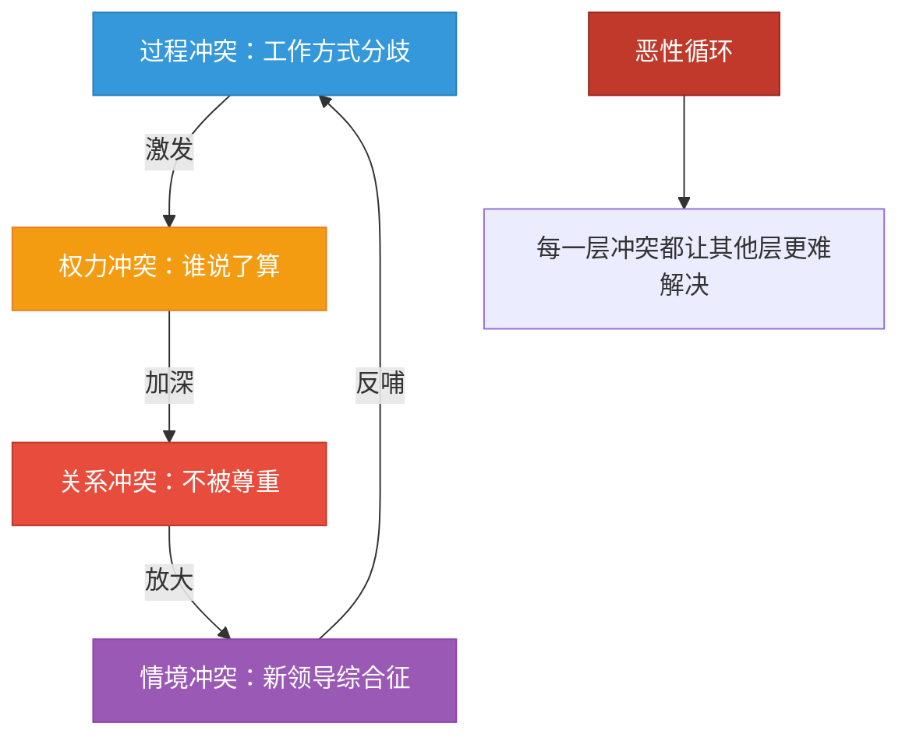
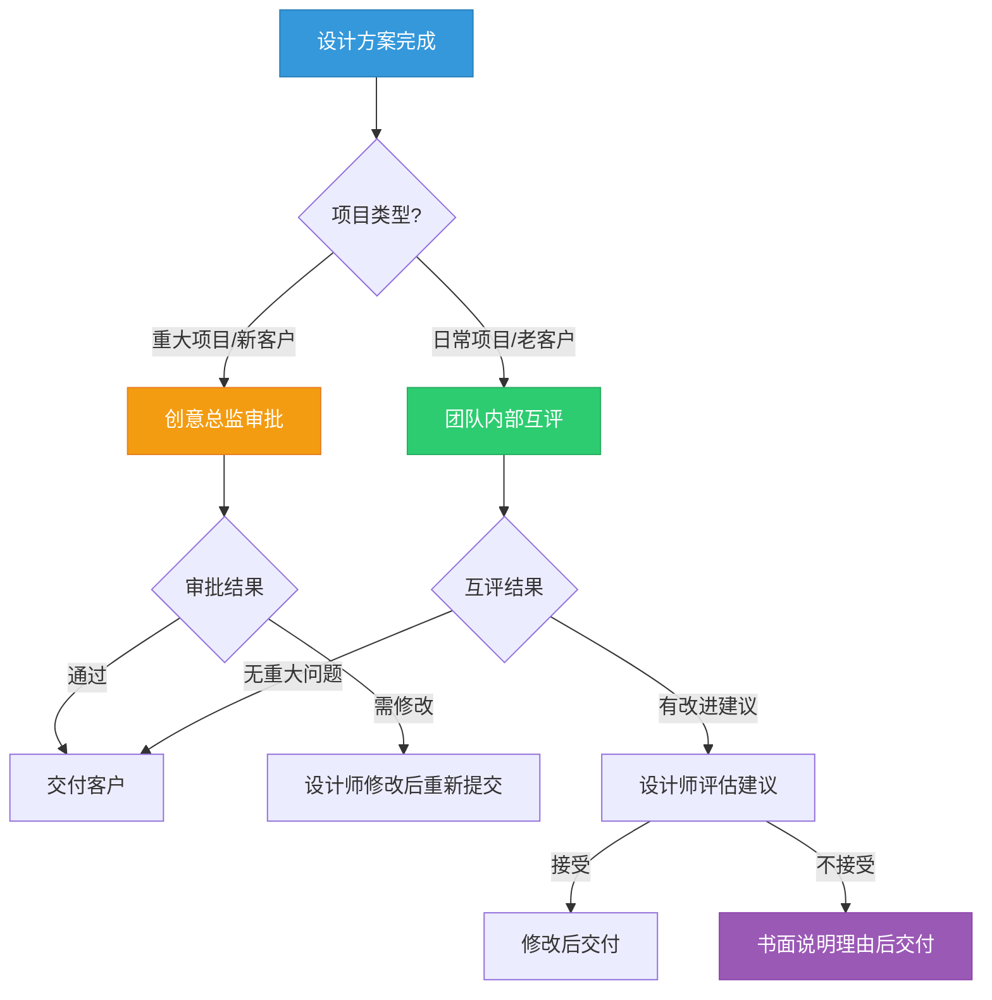

## 案例二：上下级之间的冲突——权力不对等下的沟通博弈

上下级冲突是职场中最敏感、最复杂的一类冲突。与同事冲突不同，上下级之间存在天然的权力不对等——上级拥有考核权、资源分配权和人事决策权，下级则需要在维护自身诉求与服从组织层级之间找到平衡。这种不对等使得冲突的处理方式、沟通策略和心理动态都与平级冲突有本质区别。本案例将完整呈现一个新任管理者与资深下属之间从摩擦、对抗到和解的全过程，深入剖析权力动态对冲突演化的影响机制。

### 理论框架：理解上下级冲突的底层逻辑

在进入案例之前，先建立理解上下级冲突的理论基础。这些框架将贯穿整个案例分析。

#### 权力依赖理论（Emerson, 1962）

Richard Emerson 提出的权力依赖理论指出：**权力存在于对他人的依赖关系中**。B 对 A 的依赖程度越高，A 对 B 的权力越大。在上下级关系中，表面上下级依赖上级（考核、晋升、资源），但实际上上级也依赖下级（执行力、专业能力、团队稳定性）。当双方的依赖关系不对称时——例如本案例中刘洋需要赵强的专业能力和团队影响力，赵强需要刘洋的正式授权——冲突的处理方式就决定了关系走向。

#### 心理契约理论（Rousseau, 1989）

心理契约是员工与组织之间未明文写出的相互期望。当新领导打破前任留下的心理契约（例如前任的"放养"风格形成的"创意自由"期望），下级会产生强烈的不公平感和背叛感。这种心理契约的违背是上下级冲突中最常见的深层原因之一。

#### 领导-成员交换理论（LMX Theory, Graen & Uhl-Bien, 1995）

LMX理论指出，领导者与不同下属之间的关系质量存在差异——有的下属处于"圈内"（高质量交换关系），有的处于"圈外"（低质量交换关系）。新任管理者面临的挑战是：团队中已有的LMX关系网络不是你建立的，但你必须在其中找到自己的位置。赵强与前任总监之间就是典型的高质量LMX关系，而刘洋的空降打破了这个网络。

#### 组织公正理论（Organizational Justice Theory）

组织公正包含三个维度，每个维度都与上下级冲突密切相关：

| 公正维度 | 定义 | 在上下级冲突中的表现 |
|---------|------|-------------------|
| **分配公正** | 结果分配的公平性 | 绩效评估、奖金分配、晋升机会是否公平 |
| **程序公正** | 决策过程的公平性 | 下属是否参与决策、是否有申诉渠道 |
| **互动公正** | 执行过程中的尊重程度 | 上级是否给予尊重、是否充分解释决策理由 |

本案例中，刘洋的改革措施在程序公正和互动公正上存在明显缺陷——决策过程不透明、推行方式缺乏尊重——这直接导致了赵强的抵触。

### 场景背景

**公司与人物**：赵强，32岁，某4A广告公司资深平面设计师，入职五年，参与过公司近三分之一的标杆项目，三次获得年度最佳创意奖。在团队中享有很高的非正式影响力——不仅是技术权威，也是年轻设计师的精神导师。同事们私下叫他"强哥"。

刘洋，35岁，新任创意总监，从竞争对手公司空降而来，拥有八年管理经验和多次成功带领团队拿下国际广告大奖的经历。公司高薪挖他来，是因为管理层认为原团队"创意能力不错但管理松散，项目交付经常延期"。

**组织环境**：公司正处于业务转型期，从传统广告向数字营销和短视频方向拓展。管理层希望刘洋带来更规范的流程和更高的交付效率。但团队此前的创意总监是一位"放养型"领导，给了设计师极大的自由度。团队文化以"创意至上、反对流程化"为核心信念。

**关键时间节点**：刘洋上任第三周，推行了一系列改革措施。

### 冲突的萌芽：新官上任的三把火

**第一阶段：制度推行（潜伏期）**

刘洋上任第一周，通过一对一谈话了解团队情况。他发现以下问题：

| 问题 | 具体表现 | 刘洋的判断 |
|------|---------|-----------|
| 项目进度不透明 | 设计师各自为战，没人知道其他人做到哪了 | 需要增加汇报频率 |
| 设计质量参差不齐 | 部分设计师的方案质量明显低于团队平均水平 | 需要建立审批机制 |
| 截止日期形同虚设 | 过去一年，73%的项目存在不同程度的延期 | 需要强化项目管理 |
| 知识沉淀为零 | 设计规范、素材库、最佳实践都没有文档化 | 需要建立知识管理体系 |

刘洋在第二周推出了五项改革措施：

1. **每日站会**：每天早上10点，每人用2分钟汇报当日工作计划和前日进度
2. **设计方案审批制**：所有设计方案必须经创意总监签字后才能交付客户
3. **设计规范手册**：统一色彩、字体、排版等基础规范
4. **项目进度看板**：使用Trello看板实时追踪所有项目的进度
5. **周报制度**：每周五提交本周工作总结和下周计划

这些措施在管理学上完全合理——它们对应的是项目管理中的可视化、质量控制和标准化三大支柱。但问题在于：**推行的方式和节奏**。

#### 为什么"正确的制度"也会引发冲突？

这里有一个管理学中经常被忽视的悖论：**制度的合理性与推行的可接受性是两个独立维度**。一项制度可能在逻辑上完美，但如果推行方式忽视了组织文化、团队心理和权力结构，它的效果可能适得其反。

Kotter的八步变革模型（1996）指出，成功的变革需要经历八个阶段：

1. 建立紧迫感
2. 组建领导联盟
3. 形成愿景和战略
4. 沟通变革愿景
5. 授权广泛行动
6. 创造短期成果
7. 巩固成果并深化变革
8. 将变革植入组织文化

刘洋跳过了前四步，直接进入了第五步"授权行动"——他没有先建立紧迫感（让团队认识到问题的严重性），没有组建领导联盟（争取核心成员的支持），没有形成共同愿景（与团队一起定义改革方向），也没有充分沟通（让团队理解改革的必要性）。这就好比没有打地基就直接盖楼——楼的设计再好，地基不稳也会塌。

**第二阶段：不满积累（感知期与感受期）**

赵强对这些改革的反应经历了三个心理阶段：

这三个阶段在心理学中有对应模型——Lazarus的认知评价理论（Cognitive Appraisal Theory）指出，人对事件的情绪反应经历两个阶段：**初级评价**（这件事对我有什么影响？）和**次级评价**（我能做什么？）。赵强的初级评价是"这些改革威胁了我的专业自主权"，次级评价是"我没有渠道表达反对意见"。当次级评价指向"无力改变"时，情绪就会从不满升级为抵触，最终以非建设性的方式爆发。

赵强的具体不满：

**关于每日站会**：赵强认为创意工作不同于程序开发，设计师需要长时间的沉浸式思考，每天被打断一次汇报进度会破坏创作节奏。他在心里算了一笔账：每天站会15分钟，加上会前准备和会后重新进入状态的时间，一天至少损失40分钟的深度工作时间。一个月就是8000分钟——相当于两个完整工作日。

**关于审批制**：赵强在公司五年，拿过三次最佳创意奖，客户满意度长期排名团队第一。现在每个方案都要经过一个刚来三周的人审批，他觉得这是对自己专业能力的否定。更让他不舒服的是，刘洋在审批时确实提出了修改意见——有些意见有道理，有些则明显是"为了改而改"，比如把一个已经跟客户确认过的配色方案改掉，理由是"不符合当前设计趋势"。

**关于设计规范手册**：赵强认为创意工作的核心价值在于差异化和个性化，统一规范会扼杀设计师的个人风格。他反问："如果所有设计都按规范来，那客户为什么不直接用模板？"

这些不满在赵强心里不断发酵，但他没有选择直接跟刘洋沟通。原因很复杂——既有面子因素（"我是老人，去找新人谈显得我在示弱"），也有对权力不对等的顾虑（"他是总监，我说了也没用"），还有一种"等着看他会搞砸"的隐秘心态。

#### 沉默螺旋：为什么下级不愿主动沟通？

赵强的沉默不是个例，而是上下级冲突中的普遍现象。德国传播学者Noelle-Neumann提出的"沉默螺旋"理论可以解释这一现象：当个体感知到自己的观点属于少数派（在权力不对等的情境中，"少数派"的感知会被放大），他们倾向于保持沉默，以避免被孤立或惩罚。

在上下级关系中，沉默螺旋有三个驱动因素：

1. **权力恐惧**：担心表达异议会被视为"不服从"，影响绩效评估和晋升
2. **社会比较**：观察其他同事的态度，如果其他人没有表达不满，自己也不想做"出头鸟"
3. **面子文化**：在中国职场环境中，向上级"提意见"可能被解读为"不懂规矩"，尤其当你是下属时

这意味着，**当一个下属开始表达不满时，往往意味着问题已经积累了相当长的时间**。管理者不能等下属主动来找你——你需要主动观察信号。

#### 冲突爆发前的预警信号

以下信号表明上下级冲突正在酝酿：

| 预警信号 | 具体表现 | 严重程度 |
|---------|---------|---------|
| 沟通频率下降 | 下属减少主动汇报、回避非必要交流 | ⚠️ 中 |
| 肢体语言变化 | 会议中回避眼神接触、交叉双臂、叹气增多 | ⚠️ 中 |
| 执行质量波动 | 工作质量突然下降，或恰好达标但不再超额 | ⚠️ 中 |
| 社交圈层变化 | 下属开始与其他不满的同事走得更近 | 🔴 高 |
| 消极话语增多 | "反正说了也没用""以前不是这样的""我就是个执行的" | 🔴 高 |
| 工作节奏改变 | 准时下班、不再主动加班、推掉额外任务 | 🔴 高 |
| 私下传播不满 | 通过非正式渠道表达对管理的不满 | 🔴 高 |

如果管理者在前两个阶段（沟通频率下降、肢体语言变化）就主动介入，90%的上下级冲突可以在萌芽阶段化解。等到"私下传播不满"阶段才意识到问题，化解难度会增加三倍以上。

**第三阶段：公开对抗（显现期）**

冲突在第三周的一次创意评审会上爆发。

刘洋在评审赵强的一组品牌视觉方案时，提出了五处修改意见，其中包括将主色调从深蓝色改为更明亮的蓝色，理由是"数字媒体上深蓝色的视觉冲击力不够"。

赵强的回应：

> "这个配色方案是跟客户沟通过三次后定下来的，客户明确表示喜欢沉稳的深蓝色调。改成亮蓝色，客户那边需要重新沟通，项目进度会受影响。"

刘洋说：

> "客户的审美不一定对，我们是专业的，应该引导客户。而且我看了一下竞品，用深蓝色的品牌太多了，差异化不够。"

赵强的语气开始变硬：

> "刘总，我在这家公司做了五年设计，跟这个客户合作了两年。我对这个客户的了解，可能比您刚来三周要多一些。"

会议室安静了三秒。这句话表面上是在陈述事实，但潜台词非常明确："你是新来的，你没有资格教我做事。"

刘洋的脸色变了。他没有当场发作，但语气明显冷了下来：

> "赵强，经验是宝贵的，但经验不等于不需要改变。我理解你对客户的了解，但创意总监的审批流程不会因为个案而改变。我们按流程走。"

会议结束后，赵强开始在团队中传播自己的不满。他在午餐时间对几个关系好的同事说："新来的总监就是不懂设计，只会搞流程。你们等着看，他这么搞下去，优秀设计师都会走的。"

#### 公开对抗的沟通动力学分析

这场对话中，双方的沟通模式可以拆解为四个关键转折点：

**转折点一：赵强引用客户权威**

赵强没有直接反对刘洋的意见，而是搬出了客户的立场——"客户明确表示喜欢"。这是一种**间接对抗策略**，用第三方权威来支撑自己的立场，同时避免直接说"你不对"。

**转折点二：刘洋否定客户权威**

刘洋回应"客户的审美不一定对"，直接否定了赵强的论据基础。这个回应在逻辑上没错（专业引导确实是广告公司的价值所在），但在关系层面犯了一个大忌——他不仅否定了客户，也间接否定了赵强"与客户充分沟通后做出判断"的专业能力。

**转折点三：赵强亮出"资历牌"**

"我在这家公司做了五年"这句话是赵强的"最后防线"——当他觉得专业论据无法说服对方时，转而用资历来建立权威。这是一种从"专业讨论"向"权力博弈"的转向。

**转折点四：刘洋搬出"制度牌"**

"按流程走"四个字是刘洋的"终极武器"——当专业讨论无法达成一致时，用制度的强制力来结束争论。这在效果上等于宣布："这场讨论结束了，我说了算。"

两个转折点的叠加效果是：**双方都从"对事"转向了"对人"**。一旦冲突从"这件事该怎么做"变成"谁有权决定这件事怎么做"，解决难度就会急剧上升。

### 冲突的深层分析

这个冲突比表面看起来复杂得多。它不是简单的"新领导 vs 老员工"，而是多层冲突的叠加。

**第一层：过程冲突——工作方式的根本分歧**

刘洋推行的改革措施——汇报、审批、规范——本质上是"流程驱动"的工作方式。赵强习惯的是"创意驱动"的工作方式——给设计师自由空间，用结果说话。这两种方式在广告行业都有成功案例，没有绝对的对错之分。WPP集团旗下的Ogilvy强调创意自由，而Publicis集团更强调流程管控，两者都产出了世界级的广告作品。

问题在于：刘洋用自上而下的方式推行流程改革，没有给团队一个"为什么"的解释，也没有给团队参与设计的机会。这触发了一个经典管理学悖论——**好的制度如果用错误的方式推行，效果可能比没有制度更差**。

**第二层：权力冲突——权威与自主权的博弈**

这是本案例的核心冲突层。让我们用权力分析框架来拆解：

| 权力类型 | 刘洋 | 赵强 |
|---------|------|------|
| **法定权力** | 有——创意总监的正式职位 | 无——资深设计师 |
| **专家权力** | 有——八年管理经验+国际大奖 | 有——五年公司经验+三次年度最佳 |
| **参照权力** | 有限——刚来，尚未建立人格魅力 | 有——团队叫"强哥"，年轻设计师的导师 |
| **信息权力** | 有限——对客户和团队的了解尚浅 | 有——深度了解客户、项目和团队历史 |
| **奖赏权力** | 有——考核权和晋升推荐权 | 无——但有影响同事评价的非正式能力 |

这个权力矩阵来自French和Raven（1959）的经典权力基础理论。五种权力来源中，法定权力和奖赏权力属于**职位权力**（positional power），由组织结构赋予；专家权力、参照权力和信息权力属于**个人权力**（personal power），由个人能力和关系积累。

刘洋的权力基础主要来自法定权力（职位），而赵强的权力基础来自专家权力、参照权力和信息权力（非正式影响力）。**当一方的权力主要来自正式权威，另一方的权力主要来自非正式影响力时，冲突最容易激化**——因为正式权威的一方倾向于用制度来推行意志，而非正式影响力的一方倾向于用抵制来维护地位。

#### 权力动态的演化规律

上下级之间的权力关系不是静态的，它会随着冲突的演化而变化。在本案例中，权力动态经历了三个阶段：

在阶段三，赵强的辞职信实际上是一个权力反转信号——它告诉刘洋："你有法定权力，但我有离开的自由。如果我走了，你的团队会陷入混乱。"这种"退出权"（exit option）在上下级博弈中是下级最有力的筹码，因为它直接威胁到上级的绩效和地位。

**第三层：关系冲突——尊重感的缺失**

赵强的核心情绪不是愤怒，而是**不被尊重**。他五年积累的专业声誉、与客户建立的信任关系、对团队文化的塑造——这些构成了他职业身份的核心。刘洋的改革措施，无论初衷如何，在赵强的感知中传达了一个信号："你以前做的一切都是不够好的，需要我来纠正。"

这种"被否定感"在心理学中被称为**身份威胁（Identity Threat）**——当一个人感到自己的核心身份特征被质疑或贬低时，会产生强烈的防御反应。Tajfel的社会认同理论指出，人们通过所属群体的特征来定义自我价值。赵强的"资深设计师"身份是他在团队中的核心社会认同，审批制度直接挑战了这一认同。

身份威胁会触发两种典型的防御反应，赵强在本案例中都有表现：

| 防御反应 | 定义 | 赵强的表现 |
|---------|------|-----------|
| **身份确认** | 主动强化和彰显被威胁的身份特征 | "我在这家公司做了五年""我拿过三次最佳创意奖" |
| **身份退出** | 放弃当前身份，退出相关群体 | 提交辞职信——"我不跟你玩了" |

**第四层：情境冲突——新领导综合征**

从组织行为学的角度看，这个冲突还受到"新领导上任"这一特殊情境的放大。研究表明，新任管理者在上任初期面临三个常见陷阱：

1. **变革急迫感陷阱**：新领导急于证明自己的价值，倾向于快速推行变革，忽视了变革需要时间被接受
2. **外来者信任赤字**：空降管理者缺乏组织内部的信任存量，任何改革都容易被解读为"不懂我们这里"
3. **前任阴影**：前任领导的"放养"风格已经形成了团队的心理契约，新领导的"收紧"会打破这一契约，引发抵抗

用TKI模型分析双方的冲突处理风格：刘洋在面对赵强的质疑时，采用的是**竞争（Competing）**策略——"按流程走"，用法定权力压制对方。赵强则在竞争和**回避（Avoiding）**之间摇摆——先回避直接沟通，在私下传播不满（间接竞争），最终在评审会上公开对抗（直接竞争）。双方都在用竞争策略，而权力不对等使得竞争策略对双方的伤害方式不同——刘洋伤害的是赵强的专业尊严，赵强伤害的是刘洋的管理权威。

#### 四层冲突的叠加效应

这四层冲突不是独立存在的，而是相互强化：

这意味着，解决上下级冲突不能只处理其中一层——只调整流程（解决过程冲突）而不修复关系（解决关系冲突），冲突会以其他形式复发。有效的干预必须同时在多个层面发力。

### 情绪管理：冲突中的心理调控

在深入干预策略之前，需要先理解冲突中双方的情绪机制。情绪管理是上下级冲突中最被低估的能力——很多冲突之所以无法化解，不是因为找不到解决方案，而是因为双方的情绪阻碍了理性对话。

#### 上级的情绪陷阱

刘洋在冲突中面临的情绪挑战：

| 情绪陷阱 | 触发场景 | 典型反应 | 更好的应对 |
|---------|---------|---------|-----------|
| **权威焦虑** | 当众被质疑时 | 用制度压制，急于恢复控制 | 暂停回应，承认对方观点的合理性，私下解决 |
| **挫败感** | 改革遭遇阻力时 | 加大推行力度，"我说了算" | 退后一步，区分"制度问题"和"方式问题" |
| **自我怀疑** | 被资深下属挑战时 | 过度防御或过度妥协 | 将质疑视为信息输入而非人身攻击 |
| **愤怒** | 下属传播不满时 | 当面对质，威胁处分 | 理解愤怒背后的恐惧，先处理情绪再处理问题 |

管理者情绪管理的核心原则：**你的情绪反应会成为团队的参照标准**。当你在冲突中保持冷静和开放，团队会学到"冲突是可以理性处理的"；当你用愤怒回应挑战，团队会学到"这里不允许异议"。

#### 下级的情绪陷阱

赵强在冲突中面临的情绪挑战：

| 情绪陷阱 | 触发场景 | 典型反应 | 更好的应对 |
|---------|---------|---------|-----------|
| **无力感** | 改革被强制推行时 | 消极抵抗、传播不满 | 寻找建设性表达渠道，用数据支撑观点 |
| **被否定感** | 专业意见被忽视时 | 情绪化反击，"你凭什么" | 区分"对事"和"对人"，聚焦具体问题 |
| **愤怒** | 专业自主权被侵犯时 | 以辞职威胁，公开对抗 | 给自己24小时冷静期，再决定行动 |
| **委屈** | 多年贡献被忽视时 | 自我贬低，"我白干了" | 客观评估自己的价值，不因一人一事否定全部 |

下级情绪管理的核心原则：**你的情绪反应会影响你的职业形象**。在权力不对等的环境中，情绪化的表达往往会被解读为"不专业"或"不服从"，即使你的情绪是合理的。学会在情绪最强烈的时候暂停，在冷静后用事实和逻辑表达诉求。

#### 情绪调节的实操技巧

**"暂停-反思-行动"三步法**：

当冲突升级、情绪高涨时，双方都可以使用以下三步法：

1. **暂停**：给自己6秒钟。神经科学研究表明，情绪反应的生理峰值持续约6秒，之后会自然回落。在这6秒内，做三次深呼吸（吸4秒-屏4秒-呼6秒）。
2. **反思**：问自己三个问题——"我现在的情绪是什么？""这个情绪的来源是什么？""我真正想要的结果是什么？"
3. **行动**：基于"我真正想要的结果"来决定下一步行为，而不是基于当前的情绪冲动。

**对上级而言**，在冲突现场的即时情绪管理可以用"STAR"框架：

- **S**top：暂停，不立即回应
- **T**hink：想一想对方为什么会有这种反应
- **A**cknowledge：承认对方的感受（"我理解你的顾虑"）
- **R**edirect：将对话引导到建设性方向（"我们能不能换个方式讨论这个问题？"）

**对下级而言**，在冲突现场的即时情绪管理可以用"DEAR"框架：

- **D**escribe：客观描述事实，不加评判
- **E**xpress：表达自己的感受和需求，用"我"而非"你"开头
- **A**sk：提出具体的请求或建议
- **R**einforce：说明这样做对双方的好处

### 干预策略：分步化解冲突

冲突在评审会后的第四天出现了转机——但不是来自刘洋或赵强任何一方，而是来自一个意外的触发事件。

#### 触发事件：一封辞职信

赵强在周五下午把一封辞职信放在了刘洋桌上。辞职信写得很简短，理由是"个人发展需要"。但赵强的真实意图并不是真的要走——他是在用最后的筹码试探刘洋的反应。如果刘洋无动于衷，说明这个领导确实不在乎老员工；如果刘洋挽留，说明赵强的影响力是被承认的。

刘洋看到辞职信后，做了一件非常关键的事情——**他没有立即回应**。他花了一个晚上思考这个问题，而不是在情绪波动时做出决定。

#### 辞职信的博弈论分析

从博弈论的角度看，辞职信是一个典型的"承诺装置"（commitment device）——它通过提高退出的成本来增加谈判筹码。赵强的真实博弈矩阵是：

| | 刘洋挽留 | 刘洋不挽留 |
|---|---------|-----------|
| **赵强留下** | 赢——获得了承认和尊重 | 输——留下等于认输 |
| **赵强离开** | 平——虽然被挽留但选择离开 | 平——离开一个不在乎自己的地方 |

赵强的最优策略是"留下并被挽留"——他需要刘洋做出挽留的姿态来确认自己的价值。但如果刘洋直接挽留，赵强可能会提高要价（"你必须撤销审批制"）。这就是为什么刘洋"不立即回应"是一个明智的选择——它打破了赵强预设的博弈节奏，迫使赵强重新评估局势。

#### 第一步：刘洋的自我反思

当天晚上，刘洋在家进行了认真的自我反思。他问自己三个问题：

**问题一："我的改革措施本身有问题吗？"**

刘洋重新审视了五项改革措施，承认其中两项确实可以优化：每日站会的频率可以降低（改为每周三次），审批制的范围可以缩小（日常设计不需要审批，只有重大项目和新客户项目需要）。但他坚持认为项目进度看板和设计规范手册是必要的——这两项是解决"进度不透明"和"质量参差不齐"这两个核心问题的直接手段。

**问题二："我推行改革的方式有问题吗？"**

这是刘洋反思的重点。他意识到自己犯了三个错误：

| 错误 | 具体表现 | 正确做法 |
|------|---------|---------|
| **缺乏变革铺垫** | 上任第二周就开始推行改革，没有先花时间了解团队文化和历史 | 至少用一个月时间观察、倾听和建立关系 |
| **单向决策** | 所有改革措施都是自己制定后直接宣布，没有征求团队意见 | 先与核心成员（如赵强）私下讨论，获得认同后再推行 |
| **忽视非正式权力** | 把赵强当成普通下属管理，没有意识到他在团队中的特殊影响力 | 将赵强从"被管理对象"转化为"变革伙伴" |

**问题三："赵强在挑战我的权威，还是在捍卫他的专业尊严？"**

刘洋意识到，赵强的行为（公开质疑、传播不满、提交辞职信）表面上是在挑战他的权威，本质上是在捍卫自己的专业身份和在团队中的地位。这是一个非常重要的认知转换——**当你把对方的行为从"攻击"重新定义为"自我保护"时，你的应对方式会完全不同**。

#### 自我反思的结构化方法

刘洋的自我反思是有效的，但它是自发的——不是每个管理者都能在情绪波动时进行深度反思。以下是一个结构化的"冲突反思工作表"，帮助管理者在冲突后系统性地审视自己的行为：

**冲突反思工作表**

1. **事实层面**：发生了什么？用一句话客观描述事件，不含评判。
2. **行为层面**：我做了什么？我的哪些言行可能触发了对方的负面反应？
3. **意图层面**：我的真实意图是什么？对方可能如何解读我的意图？
4. **差距分析**：我的意图与对方的解读之间有多大差距？差距的原因是什么？
5. **替代方案**：如果重来一次，我可以怎样做来缩小意图与解读之间的差距？
6. **责任界定**：在这次冲突中，我的责任占多大比例？对方的责任占多大比例？情境因素占多大比例？

这个工作表的核心价值在于：它将模糊的"自我反思"转化为结构化的思考过程，降低了反思的难度，也避免了反思变成"自我批评"或"自我辩护"。

#### 第二步：一对一深度沟通

刘洋没有在公司约谈赵强——他选择了周末在公司附近的一家咖啡馆。这个地点选择有三层考量：第一，非正式场合降低对抗氛围；第二，不在公司谈避免其他同事知道；第三，周末时间充裕，不受工作时间限制。

刘洋提前到了十分钟，点了赵强常喝的美式咖啡（他在之前的一对一谈话中注意到了这个细节）。

**开场——破冰**：

刘洋没有一上来就谈辞职信的事，而是先聊了十分钟的轻松话题——赵强最近参与的一个获奖项目。他对那个项目的设计理念给予了真诚的肯定：

> "我看了你去年做的那个品牌重塑项目，视觉系统的层次感处理得非常巧妙。特别是把品牌核心元素融入到每一个接触点的做法，说明你对品牌策略的理解已经超出了设计师的范畴，是用创意总监的视角在做设计。"

这段话不是客套——刘洋在来之前确实研究了赵强的代表作。它的效果是：让赵强感受到刘洋对自己的专业能力是认可的，而不是来否定的。

**过渡——引入核心议题**：

> "赵强，我想聊聊最近的事。你周五给我的那封信，我看了。但我今天不是来挽留你的——如果我开口挽留，你会觉得我只是在走流程。我今天想做的是跟你坦诚地聊一聊，看看我们之间到底出了什么问题。"

这个开场方式的效果是：既没有忽视辞职信（表明你认真对待），也没有立即进入"挽留模式"（避免让赵强觉得自己在用辞职要挟）。"看看我们之间到底出了什么问题"这个表述，暗示这是双向的问题，而不是单方面的。

**核心对话——双方表达**：

> **刘洋**："我先说说我的问题。我来之后推行了不少改变，但我没有先花时间去了解你们以前是怎么工作的，也没有问过你们觉得哪些该改、哪些不该改。这是我的失误。"
>
> **赵强**（沉默了几秒，没想到刘洋会先认错）："……你确实改得太快了。我们以前的工作方式不完美，但它运转了五年，客户满意，团队也有战斗力。你一来就把所有东西推翻重来，大家会觉得以前的努力都白费了。"
>
> **刘洋**："你说得对。我没有考虑到这一点。我想问你一个问题——在你看来，以前的工作方式有哪些地方是真正好的，需要保留？哪些地方确实有问题，需要改进？"
>
> **赵强**（语气明显软化）："好的地方是，设计师有足够的创作自由，大家愿意冒险尝试新东西。有问题的地方是，项目进度确实不够透明，有时候客户那边催了，我们才知道其他人的项目延期了。还有就是新人设计师没有统一的参考标准，成长比较慢。"
>
> **刘洋**："你刚才提到的两个问题——进度不透明和新人缺少标准——正好是我推行看板和规范手册的原因。但我们解决问题的方式可以不同。你觉得如果让你来设计这两项机制，你会怎么做？"

**赵强的回应**：

赵强第一次在对话中被"邀请参与设计"而不是"被要求服从"。这改变了他的角色——从"被改革的对象"变成了"改革的共同设计者"。

他沉思了一会儿，说：

> "看板可以用，但不需要每天站会。每周一早上对齐一次整体进度，周三下午快速check-in一下卡住的点就够了。设计规范手册也可以做，但不应该是死板的规则，更像一个'参考指南'——告诉新人什么是经过验证的好做法，但鼓励大家在此基础上创新。"

> **刘洋**："那审批制呢？"
>
> **赵强**（直视刘洋的眼睛）："这个我有意见。我不是反对质量管控，但我反对的是——所有方案都要经过你审批。你对某些客户的了解不如我，你对某些设计方向的判断可能不如团队里的其他资深设计师。如果审批制意味着你一个人说了算，那我不同意。"
>
> **刘洋**（认真听完，没有防御）："你说的有道理。一个人审批确实有风险。如果改成这样——重大项目和新客户的方案需要我审批，日常设计任务由设计师自主决定，但在交付前由团队内部互评呢？"
>
> **赵强**："互评可以。但我们得说清楚，互评是建议性质的，不是审批性质的。最终决定权还是在设计师手里，但设计师需要对互评意见做出回应——接受或者给出不接受的理由。"

#### 对话技巧深度拆解

这次对话之所以成功，是因为双方都使用了高效的沟通技巧。以下逐一拆解：

**刘洋使用的技巧**：

1. **先认错，再提问**：主动承认自己的失误，降低了赵强的防御心理，为坦诚对话创造了安全空间。心理学中的"互惠原则"（Cialdini, 1984）在此发挥作用——当你先展示脆弱，对方更愿意回馈以坦诚。
2. **邀请式提问**："你觉得如果让你来设计，你会怎么做？"——这个问题将赵强从"被审判者"转变为"设计者"，满足了他的自主性和能力感需求（自我决定理论，Deci & Ryan, 1985）。
3. **认真倾听，不防御**：当赵强直言"你对某些客户的了解不如我"时，刘洋没有反驳，而是接受了这个事实。这需要极大的情绪自制力——接受下属说"你不如我"，对任何管理者来说都不是容易的事。
4. **共同寻找替代方案**：刘洋没有说"那好吧，取消审批制"（过度妥协），也没有坚持"审批制必须保留"（固执己见），而是提出了一个折中方案"分级审批+团队互评"。这展示了**整合型谈判**（Integrative Negotiation）的精髓——不是分蛋糕，而是做大蛋糕。

**赵强使用的技巧**：

1. **具体化诉求**：赵强没有笼统地说"我不喜欢这些改革"，而是具体到"每周一+周三就够""规范手册应该是参考指南而非强制标准"。具体化的诉求比模糊的不满更容易被回应。
2. **区分"反对什么"和"支持什么"**："我不是反对质量管控，但我反对的是……所有方案都要经过你审批"——这个表述清晰地区分了"反对的方式"和"支持的目标"，避免了被贴上"什么都不配合"的标签。
3. **提出建设性替代方案**："互评是建议性质的……设计师需要对互评意见做出回应"——赵强不仅反对了刘洋的方案，还提出了自己的替代方案，展示了合作意愿。

#### 第三步：达成共识与机制设计

经过一个半小时的深入讨论，两人达成了以下共识：

**改革措施调整方案**：

| 原措施 | 调整后 | 调整理由 |
|--------|--------|---------|
| 每日站会 | 每周一进度对齐+周三快速check-in | 减少对创意工作节奏的打断 |
| 所有方案审批制 | 分级审批制（见下文） | 尊重专业自主权，聚焦质量风险点 |
| 设计规范手册 | 设计参考指南 | 定位从"强制标准"变为"经验沉淀" |
| 项目进度看板 | 保留，但简化更新频率 | 解决进度不透明的核心问题 |
| 周报制度 | 改为周五下午15分钟团队分享 | 从"汇报"变为"交流"，增强团队学习 |

**分级审批制度**：

**赵强的特殊角色**：

刘洋在对话中做了一个关键决策——赋予赵强一个正式角色：

> "赵强，我想请你担任团队的'创意顾问'。以后我在做设计相关的决策之前，会先咨询你的意见。不是因为我没有自己的判断，而是因为你对这个团队和客户的了解比我深，你的视角能帮我做出更好的决策。"

这个角色设计一箭三雕：第一，给赵强一个正式的参与渠道，满足他被尊重的需求；第二，利用赵强的专业能力弥补刘洋对团队和客户了解不足的短板；第三，将赵强从"反对者"转化为"同盟者"，降低了后续改革的阻力。

**双向承诺**：

| 刘洋的承诺 | 赵强的承诺 |
|-----------|-----------|
| 推行新政策前先与核心成员沟通 | 有不同意见先一对一沟通，不在团队中传播不满 |
| 尊重设计师的专业自主权 | 配合必要的流程管理，推动团队知识沉淀 |
| 在设计决策中咨询赵强的意见 | 以建设性的方式提供意见，支持团队整体目标 |
| 给新政策三个月的试用期，之后共同评估效果 | 给新领导三个月的适应期，不以辞职相威胁 |

#### 第四步：后续跟进与关系重建

共识的达成只是开始——真正的考验在于执行和跟进。很多冲突在"达成共识"后又复发，原因是缺乏持续的跟进机制。

**一周后——试行反馈**：

新方案试行一周后，刘洋主动找赵强聊了十分钟。赵强反馈：每周两次的进度同步比每天站会好很多，但周三的check-in有时会打断下午的创作状态。两人商量后改为周三上午11点，时长不超过10分钟。

**一个月后——效果评估**：

一个月后，刘洋和赵强进行了一次正式的效果评估。结果如下：

| 维度 | 改革前 | 改革后（一个月） |
|------|--------|----------------|
| 项目进度透明度 | 低——经常不知道其他人做到哪了 | 明显提升——看板成为团队日常参考 |
| 设计方案质量 | 参差不齐——新人缺乏参考标准 | 有所改善——参考指南帮助新人快速提升 |
| 项目延期率 | 73%的项目存在延期 | 仍有延期，但比例下降到约50% |
| 团队士气 | 刘洋推行改革时明显下降 | 回升——设计师感到自主权被尊重 |
| 赵强与刘洋的关系 | 对抗性——公开质疑+私下传播不满 | 合作性——有分歧但能建设性沟通 |
| 赵强的工作状态 | 消极——考虑辞职 | 积极——主动参与团队机制设计 |

**三个月后——信任建立**：

三个月后，赵强在一次团队会议上主动为刘洋的一个设计决策背书。这是一个标志性事件——当团队中最有影响力的人开始公开支持新领导时，意味着新领导的权威已经从"法定权威"扩展到了"专业认可"。

刘洋后来在一次管理培训中分享这个经历时说：

> "我最大的教训是：**管理者的权威不是靠推行制度建立的，而是靠赢得人心建立的。** 制度可以管住人的行为，但管不住人的态度。赵强让我明白，真正有效的管理不是让下属服从你，而是让下属愿意跟你一起干。"

#### 冲突解决效果的评估框架

如何判断上下级冲突是否真正得到解决？不能只看表面行为（下属不再公开反对），还要评估深层关系的变化。以下是一个五维度评估框架：

| 评估维度 | 低效解决的信号 | 有效解决的信号 | 评估方法 |
|---------|-------------|-------------|---------|
| **行为层面** | 下属表面服从，但消极执行 | 下属主动配合，甚至提出改进建议 | 观察3个月内的工作主动性和质量 |
| **情绪层面** | 下属仍有隐性不满，偶尔流露负面情绪 | 下属情绪恢复积极，对新方式有认同感 | 非正式交流中的情绪观察 |
| **关系层面** | 上下级关系仍然冷淡，缺乏信任 | 双方能坦诚沟通分歧，有建设性互动 | 一对一沟通的频率和深度 |
| **团队层面** | 团队中仍有小圈子讨论、暗流涌动 | 团队氛围恢复积极，改革获得广泛认同 | 团队会议的参与度和讨论质量 |
| **绩效层面** | 关键指标无明显改善或短暂改善后回落 | 关键指标持续改善并稳定 | 项目延期率、客户满意度、员工留存率 |

**重要提醒**：冲突的完全解决通常需要3-6个月。第一个月看到的改善可能是"试探性合作"——双方在试探对方是否真的改变了。真正的信任重建需要更长时间的持续验证。

### 如果干预失败：备选方案

上述干预路径假设刘洋能够通过自我反思和一对一沟通化解冲突。但现实中，这种理想化的路径可能因为多种原因失败。以下列出四种备选方案：

**方案A：引入HR或更高管理层调解**

如果刘洋的一对一沟通未能取得突破（例如赵强拒绝沟通或态度持续敌对），可以引入HR或双方共同的上级（如分管副总）作为第三方调解人。第三方调解的优势是可以提供一个"安全空间"让双方表达真实想法，同时引入客观的评估视角。

但第三方调解也有风险——赵强可能觉得刘洋"告状了"，进一步加深不信任。因此，引入第三方前需要与赵强沟通清楚目的："我希望找一个中立的人帮我们理清思路，不是来裁决谁对谁错。"

**第三方调解的最佳实践**：

1. 选择双方都信任或至少不反感的调解人
2. 调解前分别与双方单独沟通，了解各自的立场和诉求
3. 调解过程中，调解人只做引导和总结，不做评判
4. 调解后形成书面共识，双方签字确认
5. 设定跟进时间节点，定期检查共识执行情况

**方案B：角色重新定义**

如果赵强确实无法接受刘洋的管理方式，但又不想离开公司，可以考虑调整赵强的角色定位。例如：

- 将赵强提升为"高级创意顾问"或"首席设计师"，给他一个独立于创意总监汇报线的专家角色
- 让赵强负责内部培训和新人带教，发挥他的经验和影响力
- 在项目制中给赵强更大的自主权，由他直接对接重点客户

这种方案的核心逻辑是：当一个人在现有角色中无法与上级和谐共处时，改变角色定义可能比改变人更有效。

**方案C：有期限的试验**

如果双方在具体改革措施上僵持不下，可以约定一个有期限的试验方案——例如"按你的方式试一个月，再按我的方式试一个月，用数据说话"。这种方案将冲突从"谁说了算"转化为"哪种方式效果更好"，引入了客观标准。

**有期限试验的操作要点**：

| 要素 | 具体做法 |
|------|---------|
| 试验周期 | 每种方式至少4周（太短无法收集足够数据） |
| 评估指标 | 提前约定3-5个关键指标（如项目延期率、设计返工率、团队满意度） |
| 数据收集 | 每周记录数据，双方都能看到 |
| 决策规则 | 提前约定"如果A方式的指标优于B方式X%以上，则采用A方式" |
| 退出条款 | 如果试验过程中出现不可接受的问题，任何一方可以叫停 |

**方案D：帮助赵强体面地离开**

如果所有努力都未能化解冲突，而且赵强确实已经无法在这个环境中发挥最大价值，那么帮助赵强找到一个更适合他发展的机会（公司内部转岗或外部推荐），可能是对双方都最有利的选择。但这个方案应该是最后的手段——而且执行时必须充分尊重赵强的尊严和感受。

### 向上管理：下级如何主动化解冲突

到目前为止，本案例主要从上级（刘洋）的视角分析冲突处理。但上下级冲突是双向的——下级也有主动化解冲突的能力和责任。以下是下级在面对上下级冲突时可以采取的策略。

#### 理解上级的真实诉求

在赵强眼中，刘洋的改革是"不懂设计""只会搞流程"。但如果赵强能跳出自己的视角，理解刘洋被公司高薪挖来的真实目的——"解决管理松散、项目延期的问题"——他可能会发现，刘洋的改革措施虽然推行方式有问题，但解决的问题是真实存在的。

**向上理解的三个步骤**：

1. **了解上级的KPI**：刘洋的绩效考核可能直接与项目交付效率、团队规范化程度挂钩。理解这一点，就能理解他为什么急于推行改革。
2. **识别上级的压力来源**：空降管理者面临"证明自己"的压力，这种压力会传导为急躁的改革行为。理解压力来源，就不会把改革行为解读为"针对我"。
3. **寻找共同目标**：刘洋想要效率，赵强想要自由——但两者不是非此即彼的。"在保持创意自由的前提下提升效率"是一个双方都能接受的共同目标。

#### 向上反馈的正确方式

当上级的决策或行为让你感到不满时，以下方式比"私下传播不满"或"以辞职威胁"更有效：

| 方式 | 具体做法 | 效果评估 |
|------|---------|---------|
| **数据支撑的建议** | "我整理了过去三个月的项目数据，发现XX方案的返工率比YY方案低30%，我们可以考虑……" | ⭐⭐⭐⭐⭐ 最有效——用数据说话，绕过权力博弈 |
| **私下一对一沟通** | "刘总，关于XX制度，我有一些想法想跟您聊聊，您方便的时候可以吗？" | ⭐⭐⭐⭐ 很有效——表明尊重，给予私下表达空间 |
| **书面反馈** | 用邮件或文档形式，条理清晰地列出自己的观点和建议 | ⭐⭐⭐⭐ 有效——书面形式更正式，也给对方思考时间 |
| **借助中间人** | 通过HR或双方共同信任的第三方传达意见 | ⭐⭐⭐ 有一定效果，但可能被视为"绕过上级" |
| **在会议上建设性表达** | "这个方案的方向我认同，具体执行上我有一个建议……" | ⭐⭐⭐ 有效但需谨慎——公开场合要聚焦建议而非反对 |

**下级向上反馈的"三要三不要"**：

**三要**：
1. 要带着解决方案去反馈，而不是只提问题
2. 要用"我观察到""我建议"而非"你这样做不对"的表述
3. 要选择合适的时机和场合（私下优于公开，对方心情好时优于心情差时）

**三不要**：
1. 不要在公开场合让上级"下不来台"
2. 不要通过第三方传播不满（这会破坏信任，也会让同事为难）
3. 不要用辞职作为谈判筹码（除非你真的准备好了离开）

#### 从赵强的角度复盘

如果赵强采用上述策略，冲突的演化可能完全不同：

**假设赵强在第一周就主动找刘洋一对一沟通**：

> "刘总，欢迎加入团队。我理解公司希望在管理上做一些提升。我在这里做了五年，对团队的情况比较了解。如果您方便的话，我想跟您聊聊团队的现状——哪些地方确实需要改，哪些地方可能改了反而会出问题。"

这段话有四个作用：表达欢迎（建立善意）、承认需要改变（不固守旧习）、展示价值（你对团队的了解是资源）、提供帮助（你不是反对者而是协作者）。

如果赵强这样做了，刘洋大概率会接受这个橄榄枝——因为新任管理者最需要的就是一个了解团队的"内部向导"。冲突很可能在萌芽阶段就被化解。

### 可复用的冲突管理模板

#### 模板一：上下级冲突诊断清单

当下级表现出抵触、消极或对抗行为时，上级可以用以下清单快速诊断：

| 诊断维度 | 关键问题 | 本案例的诊断结果 |
|---------|---------|----------------|
| 冲突类型 | 是任务冲突（做什么）、过程冲突（怎么做）还是关系冲突（谁说了算）？ | 三者混合，以过程冲突为起点 |
| 权力结构 | 双方的正式权力和非正式权力分别是什么？ | 上级有法定权力，下级有专家权力和参照权力 |
| 核心诉求 | 下级的抵触背后，真正在意的是什么？ | 专业自主权和被尊重的需求 |
| 历史因素 | 是否存在前任领导留下的心理契约？ | 有——前任的放养风格形成了"创意自由"的心理契约 |
| 变革方式 | 改革是自上而下强制推行，还是参与式共同设计？ | 初期是强制推行，后期调整为参与式 |
| 影响范围 | 冲突是否已影响到团队其他成员？ | 是——赵强的消极态度正在影响团队士气 |
| 情绪状态 | 双方当前的情绪状态如何？是否有过激反应的风险？ | 赵强处于愤怒/沮丧状态，刘洋处于焦虑/挫败状态 |
| 时间压力 | 是否有外部时间压力迫使快速决策？ | 有——公司业务转型期，管理层期望尽快看到改变 |

#### 模板二：新领导与资深下属的沟通话术

| 阶段 | 话术示例 | 设计意图 |
|------|---------|---------|
| 开场——表达尊重 | "你在这里的时间比我长，对团队的了解比我深" | 降低防御心理，承认对方的价值 |
| 认错——主动揽责 | "我推行改革的方式太急了，没有先听取你们的意见" | 用自我批评打破僵局，示范坦诚 |
| 提问——邀请参与 | "你觉得以前哪些做法应该保留？哪些确实需要改进？" | 从"我改你"变为"我们一起设计" |
| 解决——共创方案 | "如果让你来设计这个机制，你会怎么做？" | 将对方从被管理者转化为共同设计者 |
| 赋权——给予角色 | "以后这类决策我会先咨询你的意见" | 满足对方的尊重需求，建立合作关系 |
| 承诺——设定预期 | "我们先试三个月，之后一起评估效果" | 给双方调整空间，降低决策的压力感 |
| 跟进——持续沟通 | "下周我们再聊十分钟，看看试行的效果" | 表明这不是一次性谈话，而是持续的关注 |

#### 模板三：新领导上任的"90天融入计划"

从本案例的教训出发，任何新任管理者在上任初期都应遵循以下节奏：

```mermaid
graph LR
    subgraph "第1-30天：倾听与观察"
        A1[一对一了解每人] --> A2[观察团队文化]
        A2 --> A3[识别非正式权力结构]
        A3 --> A4[了解历史遗留问题]
    end
    
    subgraph "第31-60天：建立信任"
        B1[小范围征求意见] --> B2[先做几个'快速赢']
        B2 --> B3[尊重并利用现有优势]
        B3 --> B4[与关键人物建立私人关系]
    end
    
    subgraph "第61-90天：渐进变革"
        C1[与核心成员共同设计改革方案] --> C2[小范围试点]
        C2 --> C3[收集反馈并迭代]
        C3 --> C4[逐步扩大推行范围]
    end
    
    A4 --> B1
    B4 --> C1
    
    style A1 fill:#3498db,stroke:#2980b9,color:#fff
    style B1 fill:#f39c12,stroke:#e67e22,color:#fff
    style C1 fill:#2ecc71,stroke:#27ae60,color:#fff
```

**第1-30天：倾听与观察期**——不推行任何改革。目标是了解团队的运作方式、文化基因、非正式权力结构和历史遗留问题。核心动作是大量的一对一谈话，以及在日常工作中的细致观察。

**一对一谈话的结构化问题清单**（第1-30天使用）：

1. "你觉得这个团队最大的优势是什么？"
2. "如果可以改变一件事，你最想改变什么？"
3. "你觉得自己目前工作中最大的挑战是什么？"
4. "你希望我作为新领导，在哪些方面给你支持？"
5. "你觉得团队中谁的意见最有影响力？为什么？"

最后一个问题特别重要——它帮助你快速识别团队中的非正式权力网络，而不用等到冲突爆发后才发现。

**第31-60天：建立信任期**——通过几个"快速赢"（quick wins）展示自己的价值，同时充分尊重团队现有的优势和做法。关键动作是与核心成员建立私人关系，特别是那些拥有非正式影响力的人。

**第61-90天：渐进变革期**——在充分了解和信任基础建立后，开始推行改革。但改革必须是参与式的——先征求意见，再共同设计，然后小范围试点，最后逐步推行。

#### 模板四：冲突后的信任重建路线图

当冲突已经发生并初步化解后，信任的重建需要遵循以下路线图：

| 阶段 | 时间 | 核心任务 | 关键行为 |
|------|------|---------|---------|
| **止血期** | 第1-2周 | 停止冲突升级，恢复基本沟通 | 兑现承诺、保持沟通频率、避免触发旧伤 |
| **试探期** | 第3-6周 | 双方试探对方是否真的改变 | 小范围合作、观察对方反应、逐步增加信任投入 |
| **重建期** | 第7-12周 | 建立新的合作模式和沟通习惯 | 共同完成一个项目、分享成功经验、互相背书 |
| **巩固期** | 第13周+ | 将新关系制度化，防止复发 | 定期回顾机制、公开肯定合作成果、共同应对新挑战 |

**信任重建的关键原则**：

1. **信任是行为的累积，不是言语的承诺**。说了"我信任你"不等于建立了信任——只有通过一次又一次兑现承诺的行为，信任才会真正建立。
2. **信任的恢复速度取决于破坏的程度**。轻微的信任损害可能几周就能恢复，严重的信任背叛可能需要数月甚至数年。
3. **重建信任需要双方共同努力**。单方面的信任投入如果得不到回应，最终会耗尽。
4. **偶尔的反复是正常的**。信任重建不是直线上升的过程，偶尔的退步和反复是正常的，不要因为一次反复就认为"白费了"。

### 常见错误：处理上下级冲突时的五个陷阱

| 陷阱 | 表现 | 后果 | 正确做法 |
|------|------|------|---------|
| **上级用权力碾压** | "我是领导，你就得听我的" | 下级表面服从、内心抵触，消极执行或离职 | 用影响力而非权力推动合作，给予参与和表达空间 |
| **下级用对抗施压** | 公开质疑、私下传播不满、以辞职威胁 | 破坏自身职业形象，将建设性分歧变成个人对立 | 选择一对一渠道表达，用数据和逻辑而非情绪说话 |
| **忽视非正式权力结构** | 只看到组织架构图，看不到谁真正影响团队 | 改革被暗中抵制，推动困难重重 | 在推行改革前，先识别和争取关键影响者的支持 |
| **把"不服从"等同于"不忠诚"** | 将下属的不同意见解读为挑战权威 | 扼杀团队的真实反馈，决策质量下降 | 区分"建设性反对"和"破坏性抵制"，鼓励前者、限制后者 |
| **只解决表面问题** | 调整了流程就认为冲突结束了 | 深层的尊重感、信任感、安全感问题未被解决 | 在解决制度问题的同时，关注关系修复和情感需求 |
| **急于求成** | 冲突刚化解就想恢复到"正常状态" | 草率的和解掩盖了未解决的深层问题 | 给信任重建足够的时间，接受过程中的反复 |
| **过度补偿** | 为了避免冲突，完全迁就下属的要求 | 损害管理权威，其他下属效仿反抗 | 在尊重下属的同时，坚守必要的底线和原则 |

### 延伸思考：上下级冲突的不同变体

本案例展示的是"新任上级 vs 资深下属"的典型模式。在实际工作中，上下级冲突还有多种变体：

**变体一：老领导的风格突变**

当一位长期合作的上级突然改变管理风格（如因为业绩压力开始严格管理），下属的抵抗往往更强烈——因为他们不仅是在对抗"新的管理方式"，更是在对抗"关系的改变"。处理这类冲突时，上级需要先解释改变的原因，让下属理解"这不是因为我不信任你了，而是因为外部环境变了"。

**变体二：下属的能力超越上级**

当某位下属在专业能力上明显超越上级时（如技术团队中技术最强的人不是技术主管），冲突的性质会变得更加复杂——它不仅是权力冲突，还涉及"谁才是真正的专家"这一隐性竞争。处理这类冲突的关键是明确"管理能力"和"专业能力"是两个不同的维度，上级的权威来自管理职责而非技术领先。

**变体三：代际冲突叠加上下级冲突**

当年轻上级管理年长下属时（或反过来），代际差异会放大上下级冲突。年轻上级可能觉得年长下属"固执、不学习新东西"，年长下属可能觉得年轻上级"毛躁、不懂尊重前辈"。处理这类冲突时，需要将代际差异从"障碍"转化为"互补"——年轻管理者带来新视角和新方法，年长下属带来经验和人脉。

**变体四：绩效改进计划引发的冲突**

当上级因下属绩效不达标而启动绩效改进计划（PIP）时，冲突几乎是不可避免的。下属可能觉得PIP是"找借口开除我"，而上级可能觉得下属"不接受反馈"。处理这类冲突的核心是确保PIP的过程透明、标准客观、支持到位——让下属感受到"公司是在帮助我改进，而不是在找理由赶我走"。

**变体五：远程/混合办公环境中的上下级冲突**

远程和混合办公环境为上下级冲突增加了新的维度：沟通频率降低导致误解增多，非语言信号缺失导致情绪判断失误，工作可见性降低导致信任更难建立。处理远程环境中的上下级冲突，需要更主动的沟通、更清晰的期望设定和更频繁的一对一交流。

**变体六：矩阵组织中的多头汇报冲突**

在矩阵组织中，下属可能同时向职能经理和项目经理汇报，两个上级的指令可能冲突。这种"多头汇报"冲突的处理关键是：明确优先级规则、建立三方沟通机制、在冲突发生时由更高级别的管理者协调。

### 从本案例看上下级冲突的核心原则

**原则一：上级应主动迈出第一步**

在上下级冲突中，权力较大的一方有更大的责任主动化解冲突。这不仅是因为道德义务，更是因为实际效果——下级主动向上级"和解"在组织文化中往往被解读为"认输"或"服软"，这会损害下级在同事中的形象和自尊。上级主动伸出橄榄枝，则不会面临这种代价，反而会被视为大度和成熟。

**原则二：改革需要"先买票，再上车"**

刘洋的错误不在于推行改革本身，而在于推行的方式——他跳过了"争取认同"这一步，直接进入了"执行"阶段。变革管理的经典模型（Kotter的八步变革模型）指出，变革的第一步是"建立紧迫感"和"组建领导联盟"——先让关键人员认同变革的必要性，再推行变革措施。**没有认同的执行，是命令；有认同的执行，才是合作。**

**原则三：将"反对者"转化为"设计者"**

本案例中最具转折意义的时刻，是刘洋问赵强"如果让你来设计这个机制，你会怎么做"。这一句话改变了赵强的角色定位——从"被改革的对象"变成了"改革的共同设计者"。当一个人参与了规则的设计，他就更愿意遵守这些规则。这在管理学中被称为**程序公正（Procedural Justice）**——人们对结果的接受程度，很大程度上取决于他们在决策过程中的参与程度。

**原则四：尊重资深员工的专业身份**

资深员工的核心诉求往往不是薪资或职级，而是**专业身份的被认可**。他们在团队中的地位建立在多年积累的专业声誉之上，任何威胁到这种声誉的改革都会引发强烈抵抗。聪明的管理者不会去挑战这种专业身份，而是会将其纳入自己的管理体系——给资深员工一个正式的角色和发言权，将他们的影响力从"阻力"转化为"助力"。

**原则五：用"试用期"降低决策压力**

"先试三个月，之后一起评估"是一个极具威力的框架。它有三重作用：第一，降低了双方做决定的压力——不是"永久改变"，而是"先试试"；第二，引入了客观评估机制——用数据说话，而不是谁说了算；第三，给了双方调整空间——如果效果不好，可以再改，没有沉没成本的压力。

**原则六：区分"建设性反对"和"破坏性抵制"**

并非所有的反对都是破坏性的。赵强在评审会上的质疑（尽管方式不当）本质上是建设性的——他在捍卫客户关系和项目质量。而他在私下传播不满则是破坏性的——它损害了团队信任和新领导的权威。管理者需要学会区分这两种反对，对建设性反对给予尊重和回应，对破坏性抵制则需要明确制止。

> 上下级冲突的本质，是一场权力不对等条件下的沟通博弈。在这场博弈中，权力较大的一方拥有更大的主动权，也因此承担更大的责任。一个真正优秀的管理者，不是从不与下属发生冲突的人，而是能够在冲突中看见下属的合理性、在权力中保持谦逊、在变革中赢得人心的人。当新领导学会"先倾听后行动"，当资深下属学会"先沟通后抵抗"，上下级冲突就不再是零和博弈，而是双方共同成长的契机。
