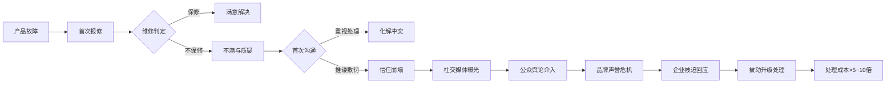
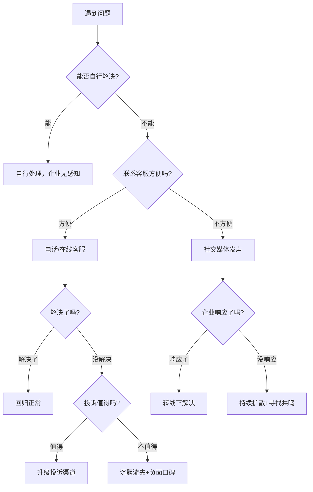
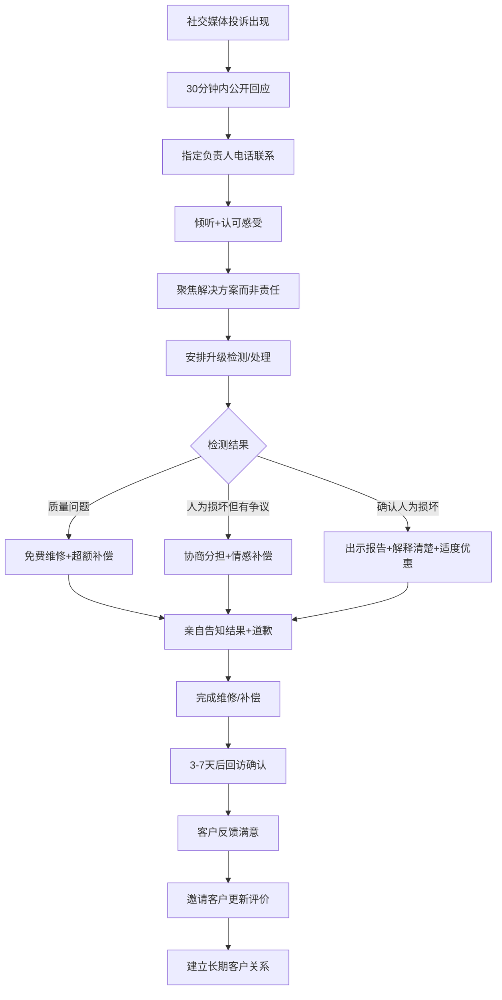
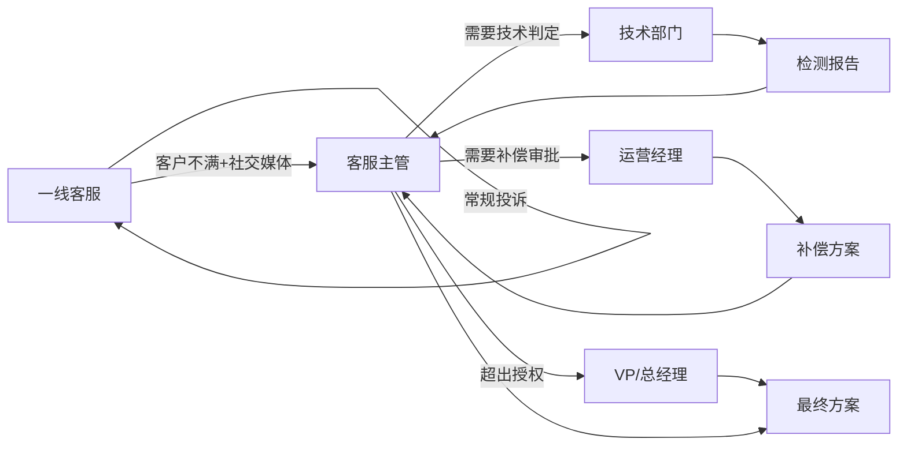
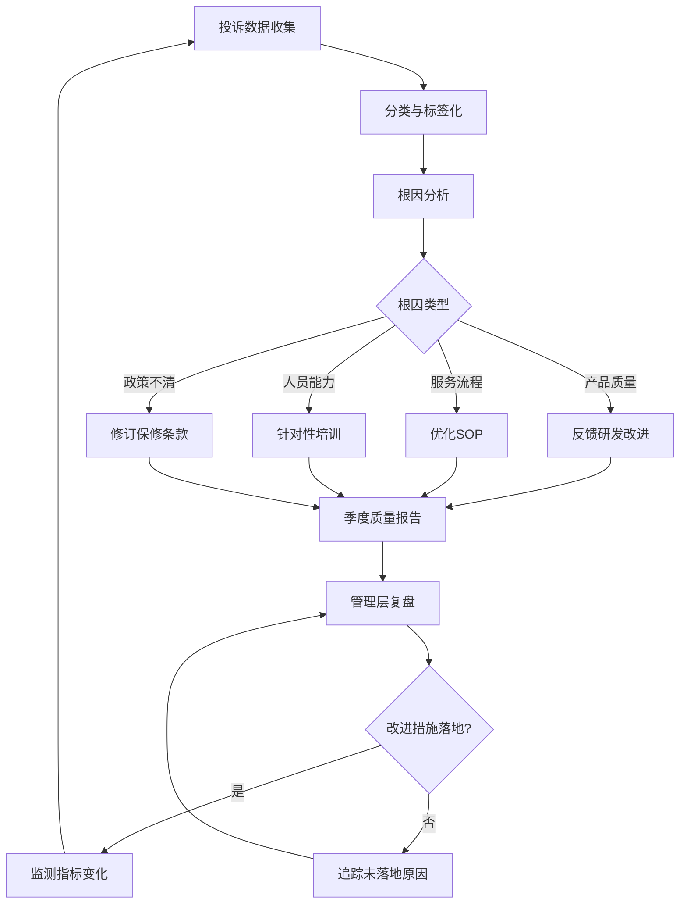

## 案例三：客户投诉与维权

### 场景描述

一位名叫陈女士的客户在某高端家电品牌购买了一台洗衣机，使用三个月后出现故障。她拨打客服热线报修，维修人员上门检查后表示是人为损坏，不在保修范围内，需要自费维修。陈女士对此非常不满，认为洗衣机正常使用不可能三个月就坏，认定是产品质量问题。她在社交媒体上发布了投诉帖子，引发了广泛的讨论和关注。

**场景要素拆解：**

| 维度 | 具体内容 |
|------|----------|
| 产品 | 高端家电品牌洗衣机，单价8,999元，客户期望值高 |
| 时间 | 购买仅三个月，远低于家电合理使用寿命预期 |
| 争议焦点 | 故障原因——产品质量缺陷 vs 人为损坏 |
| 情绪触发 | 维修人员"不在保修范围"的判定让客户感到被推卸责任 |
| 升级路径 | 线下投诉无果 → 社交媒体公开投诉 → 引发公众关注 |
| 核心诉求 | 免费维修（基础诉求）+ 被尊重和重视（情感诉求） |
| 潜在风险 | 该客户社交媒体粉丝量2.3万，帖子发布3小时内转发超500次 |

这个场景在消费领域极为常见。据中国消费者协会2024年度数据，家用电子电器类投诉连续多年位居商品投诉榜首，全年投诉量超过16万件，其中"售后维修争议"占比超过40%，"保修期内拒绝保修"占比约18%。国家市场监督管理总局2024年发布的《家电售后服务质量监测报告》显示，消费者对售后服务的整体满意度仅为67.3%，其中"维修判定不透明"和"响应速度慢"是两大核心痛点。理解这类冲突的处理逻辑，是掌握客户沟通能力的必修课。

### 冲突的深层分析

#### 表层冲突与深层冲突

客户投诉冲突从来不只是"产品坏了"这么简单。每一例投诉背后至少有三层冲突在同时运行，它们相互交织、层层递进：

**第一层：实质性冲突**——围绕产品故障的责任归属。陈女士认为是质量问题，维修人员判定为人为损坏。这类冲突的核心是"事实"，需要通过技术检测、数据比对来厘清。但问题在于，"人为损坏"与"质量缺陷"的边界本身就模糊——正常使用中产生的磨损算不算人为？设计缺陷导致的易损算不算质量？电机在标准电压波动下烧毁，是用户家电环境问题还是产品耐受力不足？这些灰色地带往往是争议的真正根源。

**第二层：情感性冲突**——客户感到被欺骗、被轻视、被推卸责任。这才是投诉升级的核心驱动力。陈女士花了近9,000元买高端品牌，期望的是"高端服务"，结果得到的是"不在保修范围"的冷冰冰回应。她的愤怒不完全来自洗衣机坏了，而是来自"我被当冤大头"的感受。心理学上，这叫**期望违背**（Expectation Violation）——当现实体验显著低于预期时，产生的负面情绪强度远超事件本身的严重程度。研究表明，高端品牌的期望违背效应比大众品牌强2-3倍，因为消费者为品牌溢价买单时，附带了对服务质量的更高预期。

**第三层：信任冲突**——客户对企业的诚信产生根本性怀疑。"人为损坏"这个判定在客户看来就是"甩锅"，尤其是维修人员和企业存在利益关联（企业希望减少保修支出，维修人员可能有"少保修多收费"的绩效导向），客户会自然质疑判定的公正性。这是最深层的冲突，一旦形成，任何技术解释都会被解读为"继续忽悠"。信任修复心理学研究表明，信任的建立需要7次以上的正面互动，而摧毁信任只需要1次背叛性事件。

#### 冲突升级的动力学

陈女士的案例走的是右侧路径：维修判定不保修 → 首次沟通未能化解 → 社交媒体曝光 → 舆论关注 → 企业升级处理。这个路径中，**社交媒体是关键转折点**。在传统渠道（12315、消协投诉）时代，个体客户的投诉影响范围有限，企业可以用"拖"字诀。但社交媒体让每一个不满的客户都拥有了"扩音器"——一条投诉帖子如果引发共鸣，传播量可以是原始触达的100倍以上。

**冲突升级的成本递增规律：**

| 阶段 | 企业处理成本 | 声誉影响 | 时间压力 |
|------|------------|---------|---------|
| 客服电话阶段 | 基础成本（人力+维修） | 无外部影响 | 宽裕，可按流程走 |
| 社交媒体曝光 | 成本×3~5倍（升级补偿+公关） | 局部影响 | 黄金窗口2~4小时 |
| 媒体/KOL介入 | 成本×5~10倍（危机公关+补偿） | 广泛影响 | 必须当天回应 |
| 监管部门介入 | 成本×10~20倍（罚款+整改+赔偿） | 严重损害 | 有法定时限 |

#### 社交媒体投诉的特殊性

社交媒体投诉与传统投诉渠道有本质区别：

| 维度 | 传统投诉（电话/12315） | 社交媒体投诉 |
|------|----------------------|-------------|
| 传播范围 | 一对一，私密性强 | 一对多，公开透明 |
| 处理时间 | 可以按流程走，时间相对宽裕 | 必须快速响应，黄金窗口期短（通常2-4小时） |
| 舆论压力 | 无外部压力 | 其他用户的声援会形成舆论压力 |
| 情绪状态 | 相对可控 | 公开表达后情绪更加坚定，退让空间缩小 |
| 企业风险 | 主要是客户流失 | 品牌声誉受损，可能引发连锁投诉 |
| 处理目标 | 解决问题 | 解决问题 + 公众可见的正面回应 |
| 信息可控性 | 内容不外泄 | 截图、二次传播不可控 |
| 情绪传染 | 无 | 其他不满客户借机集中发泄 |

**不同社交平台的投诉特征差异：**

| 平台 | 传播特点 | 典型传播路径 | 企业应对要点 |
|------|---------|------------|------------|
| 微博 | 开放广场，裂变传播快 | 原帖→KOL转发→热搜 | 2小时内回应，私信转线下 |
| 抖音/快手 | 视频为主，情绪感染力强 | 短视频→推荐流→评论区发酵 | 同样视频回应或评论区联系 |
| 小红书 | 种草/拔草社区，长尾效应 | 笔记→搜索沉淀→长期影响 | 正面笔记覆盖+私信解决 |
| 微信（朋友圈/公众号） | 半封闭，圈层传播 | 朋友圈→微信群→截图外溢 | 联系发布者私聊解决 |
| 黑猫投诉/12315平台 | 专业投诉平台，企业必须响应 | 投诉→平台转办→公开记录 | 平台规则下规范响应 |

这意味着，当投诉进入社交媒体阶段，企业不仅要解决个体客户的问题，还要面对公众的"围观审判"。处理得当，可以化危为机；处理失当，一次投诉可能演变成品牌危机。

#### 从客户视角理解投诉行为

投诉客户并非"找麻烦"，而是在正常沟通渠道失效后的升级行为。理解投诉心理学有助于制定更有效的应对策略：

**客户投诉的心理决策树：**

关键发现：**每一个社交媒体投诉背后，平均有26个有相同经历但选择沉默的客户**（TARP研究数据）。这意味着投诉客户实际上是在"帮"企业发现问题——沉默流失的客户才是最大的损失。

### 处理策略：五步法详解

#### 第一步：快速响应，表达重视

客服主管在看到社交媒体帖子后，第一时间通过官方账号留言："陈女士您好，非常抱歉给您带来了不好的体验。我们非常重视您的反馈，客服主管小李将在30分钟内给您打电话，亲自处理这个问题。"

**为什么这一步至关重要？**

在社交媒体投诉场景中，响应速度直接决定冲突走向。Sprout Social的研究表明，客户在社交媒体投诉后，如果2小时内未收到企业回应，负面情绪会显著加剧，且有超过60%的客户会继续追加发布更多投诉内容。而如果在30分钟内收到回应，客户的配合意愿会提升3倍以上。Convince & Convert的调研数据进一步显示，42%的消费者期望企业在社交媒体上60分钟内做出回应。

**响应的三个关键要素：**

1. **速度**——在帖子传播扩散前介入。公众看到的不仅是"客户在投诉"，还有"企业已经响应了"，这会显著降低旁观者的负面印象。数据表明，企业快速回应后，帖子的负面传播率平均降低47%。
2. **人**——指定具体的人（"客服主管小李"）而非模糊的"相关部门"，让客户感到自己的问题有人负责。心理学中的"具名效应"表明，具名个体比匿名组织更容易获得信任。
3. **时间承诺**——"30分钟内"这个明确的时间约束，传递的是诚意和效率。模糊的"尽快"会被解读为"敷衍"，具体的时间承诺则建立了可验证的信任锚点。

**公开回应的话术模板：**

[称呼]您好，非常抱歉给您带来了不好的体验。
我们非常重视您的反馈，[具体职位+姓名]将在[具体时间]内
与您联系，亲自处理这个问题。
如有任何疑问，也可以随时拨打我们的[专属热线号码]。

**公开回应的注意事项：**
- 绝不在公开评论区讨论具体细节（"检测结果是人为损坏"这种话说出来就输了）
- 不删除客户的投诉帖子（删除=激化矛盾+截图二次传播）
- 不使用模板化的官腔回复（"我们一直致力于为客户提供优质服务"这类空话会被嘲讽）
- 留下可验证的联系方式，让旁观者看到"企业在行动"

#### 第二步：倾听并认可感受

小李在电话中先表达了歉意，然后认真倾听了陈女士的完整叙述。她没有急于解释或反驳，而是用同理心回应：

"陈女士，我能理解您的心情。花了不少钱买的洗衣机，用了三个月就出问题，换做是任何人都会着急。而且维修师傅说不在保修范围，您一定觉得自己没有被公平对待。"

**这段话背后的沟通技术：**

| 技术 | 体现 | 作用 | 心理学原理 |
|------|------|------|-----------|
| 情感标注 | "我能理解您的心情" | 让客户知道自己的情绪被看见了 | 情绪被识别后强度自动降低（情感标注效应） |
| 事实复述 | "花了不少钱买……三个月就出问题" | 表明认真倾听了，不是敷衍 | 镜像神经元机制——被复述时感到"被理解" |
| 普遍化 | "换做是任何人都会着急" | 消除客户"我是不是太敏感了"的自我怀疑 | 社会认同——"我的反应是正常的" |
| 共情推断 | "觉得自己没有被公平对待" | 精准说出客户没直接说出口的感受 | 元情绪识别——触及深层诉求 |

**倾听阶段的核心原则：先处理情绪，再处理事情。**

客户投诉时处于情绪激活状态，大脑的杏仁核高度活跃，前额叶皮层（理性决策区域）的功能被抑制。此时提供任何技术性解释都会被解读为"找借口"——不是客户不讲理，而是情绪状态下大脑根本无法有效处理复杂信息。只有当客户感到被理解和尊重后，副交感神经系统被激活，情绪平复到可控水平，理性沟通才有可能。这就是心理学中的**情绪优先原则**——情绪未被处理时，信息无法有效传达。

**倾听阶段的禁忌：**

- ❌ "您先别激动"——否定客户的合理情绪，潜台词是"你不正常"
- ❌ "我们的产品没问题"——在倾听阶段就下结论，等于说"你在说谎"
- ❌ "这是标准流程"——用制度推卸个人责任，客户不在乎你的流程
- ❌ "您当时是怎么用的"——暗示客户使用不当，等同于审问
- ❌ 打断客户的叙述——传递"我不在乎"的信号
- ❌ "我理解，但是……"——"但是"前面的话全是废话，客户只听到"但是"后面的内容
- ❌ "这个问题我需要向上级汇报"——客户会解读为"你在踢皮球"

**倾听阶段的正确动作：**

- ✅ 全程让客户说完，不打断（即使客户重复了3遍同样的话）
- ✅ 用"嗯""我明白""您继续说"等短语表示在听
- ✅ 在客户停顿时复述关键信息，确认理解正确
- ✅ 记录客户提到的每一个细节（时间、型号、维修人员姓名等）
- ✅ 在倾听结束后，用自己的话总结客户的诉求，确认没有遗漏

#### 第三步：聚焦解决问题

"我们先不讨论责任的问题，让我来帮您解决眼前的问题。我会安排一位高级工程师在明天上门，对洗衣机进行一次全面的检测，看看具体是什么原因导致的故障。不管检测结果如何，我都会亲自跟进处理，确保给您一个满意的解决方案。"

**这一步的策略智慧：**

"先不讨论责任"这句话堪称点睛之笔。在责任归属存在争议时，纠缠于"谁对谁错"只会让双方陷入僵局——企业坚持"人为损坏"，客户坚持"质量问题"，谁也说服不了谁。而把焦点从"责任"转移到"解决问题"，既绕开了争议点，又给了双方台阶下。在谈判学中，这叫**利益导向谈判**（Interest-Based Negotiation）——不纠结于立场（position），而是探索立场背后的利益（interest）。陈女士的立场是"这是质量问题"，她的利益是"免费修好洗衣机+被公平对待"。满足利益比争论立场高效得多。

同时，"高级工程师"而非之前的维修人员上门检测，解决了一个关键的信任问题——客户已经不信任第一次检测的结果，换一个更高资质的检测人员，既提升了检测的权威性，也传递了"我们认真对待"的信号。

**解决方案设计的原则：**

1. **可感知的升级**——"高级工程师"而非同一个维修人员再来一次。这不仅仅是技术能力的提升，更是对客户"你的诉求被升级处理了"的心理暗示。
2. **明确的时间线**——"明天上门"，不让客户继续等待。等待是焦虑的放大器，明确的时间线能有效降低客户的不确定感。
3. **承诺闭环**——"亲自跟进处理"，不推给其他人。客户最怕的是"被转来转去"，一个明确的责任人意味着"有人兜底"。
4. **不预设结果**——"不管检测结果如何"，保持开放态度。如果预设了结果（"如果确实是质量问题……"），客户会解读为"你已经认定不是质量问题"。

**当检测结果确实为"人为损坏"时的处理策略：**

上面的案例中，检测结果是质量问题，皆大欢喜。但现实中，确实存在人为损坏的情况。此时的处理策略需要更加精细：

┌─────────────────────────────────────────────────────────┐
│              检测确认人为损坏时的沟通策略                    │
├─────────────────────────────────────────────────────────┤
│ 1. 出示详细检测报告（含照片、数据对比）                      │
│    - 不是"我们说是人为损坏"，而是"这是检测数据，您看..."      │
│    - 用可视化方式呈现，而非文字堆砌                          │
│                                                         │
│ 2. 解释损坏机理，帮助客户理解                               │
│    - "这个痕迹是XX原因造成的，正常使用的磨损模式是这样的..."    │
│    - 教育而非指责的语气                                    │
│                                                         │
│ 3. 提供协商方案，而非单方面拒绝                              │
│    - "虽然不在保修范围，考虑到您是老客户/高端产品用户..."       │
│    - 给出优惠维修价、部分减免、或赠送其他服务                  │
│                                                         │
│ 4. 给予客户选择权                                         │
│    - "您可以选择优惠维修，也可以选择我们的官方鉴定服务"         │
│    - 有选择权=有尊严=降低对抗情绪                           │
└─────────────────────────────────────────────────────────┘

#### 第四步：超越期望的服务

高级工程师上门检测后，发现是电机存在轻微的质量缺陷，属于保修范围。公司不仅免费维修了洗衣机，还主动给陈女士延保一年，并赠送了一次免费的深度清洗服务。小李亲自打电话告知陈女士结果和处理方案，并再次为之前的误判道歉。

**补偿策略的层次模型：**

┌─────────────────────────────────────────────────────────┐
│              超越期望（案例所在层）                          │
│  免费维修 + 延保一年 + 深度清洗 + 亲自道歉                    │
├─────────────────────────────────────────────────────────┤
│              满足期望（基础层）                              │
│              免费维修 + 正常保修服务                          │
├─────────────────────────────────────────────────────────┤
│              最低可接受（底线层）                             │
│              免费维修（仅此而已）                             │
├─────────────────────────────────────────────────────────┤
│              不可接受（违约层）                              │
│              拒绝维修 / 收费维修 / 拖延处理                   │
└─────────────────────────────────────────────────────────┘

为什么选择"超越期望"而非"满足期望"？因为这个案例中，企业已经犯了错——第一次维修人员误判了故障原因，导致客户经历了不必要的维权过程。仅仅"补救到正常水平"不足以弥补客户的情感损失。超越期望的补偿不仅是修复产品问题，更是修复被损害的信任关系。

**补偿设计的心理学依据：**

- **延保一年**——直接降低客户的未来风险感知。行为经济学中的"损失厌恶"理论表明，人们对"可能失去"的恐惧远大于对"可能得到"的期待。延保消除了"如果再坏了怎么办"的焦虑。
- **深度清洗服务**——创造额外的正面体验，让客户感受到"被照顾"。这不是维修，而是"增值服务"，属于正向情感刺激。
- **亲自打电话**——高管的直接关注本身就是一种"特权感"的传递。客户会感到"我的问题被当回事了"。
- **再次道歉**——为之前的误判负责，而非假装没发生过。研究显示，主动承认错误并道歉的企业比试图掩盖错误的企业获得的信任度高40%。

**补偿的"度"：** 超越期望不等于无底线补偿。过度补偿（如全额退款+高额赔偿）反而会让客户产生"是不是真有大问题"的疑虑，也可能被解读为企业心虚。同时，过度补偿会形成"会哭的孩子有奶吃"的负向激励，鼓励更多客户用极端方式投诉。合理的超越期望应该在"满足期望"基础上增加1-2项有温度的增值服务。

**不同投诉场景的补偿策略参考：**

| 投诉严重程度 | 满足期望 | 超越期望 | 不宜采用 |
|------------|---------|---------|---------|
| 轻微（小瑕疵/小故障） | 免费维修/更换配件 | 维修+小礼品/优惠券 | 高额赔偿、全额退款 |
| 中等（功能故障/影响使用） | 免费维修+合理补偿 | 维修+延保+增值服务 | 远超损失的现金赔偿 |
| 严重（安全隐患/重大损失） | 退换货+损失赔偿 | 退换货+超额赔偿+高层致歉 | 仅维修了事 |
| 危机级（群体事件/媒体曝光） | 全面善后+公开声明 | 主动召回+行业标准提升 | 冷处理/否认 |

#### 第五步：关闭反馈循环

维修完成后，小李再次致电确认使用情况。陈女士表示非常满意，并主动更新了社交媒体帖子，从投诉转为了好评。

**闭环跟进的三重价值：**

1. **确认问题真正解决**——不是"我们觉得解决了"，而是"客户确认解决了"。维修技术上没问题不代表客户体验上没问题——可能洗衣机修好了但噪音变大了，可能延保的条款让客户困惑。只有客户亲自确认，才算真正闭环。
2. **创造最后一次正面接触**——心理学中的**峰终定律**（Peak-End Rule）表明，人对体验的记忆主要取决于峰值时刻和结束时刻。一个温暖的结束通话，可以覆盖之前所有的不愉快。这就是为什么很多企业在投诉处理后会送一束花或手写卡片——不是作秀，而是在"终"这个时刻创造正向记忆锚点。
3. **转化客户为口碑传播者**——从投诉到好评的反转故事，本身就是最好的品牌广告。客户会向朋友讲述"我投诉了他们，结果处理得特别好"的故事，这种"救赎叙事"比任何广告都有说服力。研究表明，经历过成功服务补救的客户推荐品牌的概率比普通客户高33%。

**闭环跟进的话术模板：**

[称呼]您好，我是[姓名]，[具体天数]前处理您[问题简述]的负责人。
想跟您确认一下，[产品/服务]目前使用情况如何？
有没有什么新的问题或者需要我们进一步帮助的地方？
[根据客户回应进行针对性跟进]
感谢您的信任和支持，如果后续有任何需要，随时联系我。

**回访时机的选择：**

| 时机 | 适用场景 | 目的 |
|------|---------|------|
| 维修后24小时 | 功能性修复 | 确认修复是否生效 |
| 维修后3~7天 | 所有投诉处理 | 确认使用体验+情感修复 |
| 维修后30天 | 重大投诉/赠送延保 | 长期关注+建立关系 |
| 保修到期前15天 | 赠送延保的客户 | 提醒续保+维系关系 |

### 完整流程图

### 企业内部协作与升级机制

客户投诉的高效处理不是单个客服能完成的，需要跨部门协作的内部机制支撑。

#### 投诉升级的内部流程

**各层级授权范围参考：**

| 层级 | 授权范围 | 典型处理能力 |
|------|---------|------------|
| 一线客服 | 免费维修/更换配件/小额优惠券 | 解决80%的常规投诉 |
| 客服主管 | 延保/增值服务/中等额度补偿 | 处理升级投诉+社交媒体投诉 |
| 运营经理 | 大额补偿/退换货/VIP待遇 | 处理重大投诉+媒体关注投诉 |
| VP/总经理 | 公开致歉/产品召回/政策调整 | 处理危机级投诉 |

**关键原则：授权前置。** 如果一线客服需要层层上报才能给客户一个延保，客户等了3天才得到回复——那这个投诉一定已经升级到了社交媒体。授权前置意味着给一线客服足够的处置空间，让他们能在首次接触时就解决大部分问题。

#### 跨部门协作清单

投诉处理涉及多个部门，明确各角色职责避免"踢皮球"：

| 部门 | 职责 | 协作方式 |
|------|------|---------|
| 客服部 | 接收投诉、倾听沟通、协调方案 | 投诉处理的主责部门 |
| 技术/质检部 | 故障检测、责任判定、出具报告 | 24小时内提供检测结果 |
| 法务部 | 合规审查、法律风险评估 | 涉及法律纠纷时介入 |
| 品牌/公关部 | 舆情监控、公开回应、危机公关 | 社交媒体投诉的协同部门 |
| 产品/研发部 | 批次性问题追溯、产品改进 | 投诉数据分析→产品迭代 |
| 售后服务部 | 维修执行、上门服务 | 确保维修质量和时效 |

### 法律与合规视角

处理客户投诉不能只靠"情商"，还需要了解相关的法律框架，确保处理方案在合法合规的前提下进行。

#### 消费者权益保护法的关键条款

**《消费者权益保护法》第二十三条**：经营者应当保证在正常使用商品的情况下其提供的商品应当具有的质量、性能、用途和有效期限。经营者以广告、产品说明、实物样品等方式表明商品质量状况的，应当保证其提供的商品的实际质量与表明的质量状况相符。

**第二十四条**：经营者提供的商品不符合质量要求的，消费者可以依照国家规定、当事人约定退货，或者要求经营者履行更换、修理等义务。没有国家规定和当事人约定的，消费者可以自收到商品之日起七日内退货。

**第二十五条（七天无理由退货）**：经营者采用网络、电视、电话、邮购等方式销售商品，消费者有权自收到商品之日起七日内退货，且无需说明理由。但线下购买的商品不适用此条款。

**《部分商品修理更换退货责任规定》（三包规定）**：家电产品自售出之日起7日内发生性能故障，消费者可选择退货、换货或修理。15日内发生性能故障，可选择换货或修理。在三包有效期内，修理两次仍不能正常使用的产品，凭修理记录和证明，由销售者负责换货。

**2022年新版《三包规定》的扩展**：将新能源汽车、平板电脑、智能手表等新兴产品纳入三包范围，并将家用汽车三包有效期从不低于2年或5万公里延长至不低于3年或6万公里。

#### 法律框架下的投诉处理策略

| 情形 | 法律依据 | 企业策略 | 风险提示 |
|------|---------|---------|---------|
| 7天内性能故障 | 三包法·退换货权利 | 主动提供退换货选项，避免被动 | 拒绝退换可能被行政处罚 |
| 15天内性能故障 | 三包法·换货或修理 | 优先推荐换货，展现诚意 | 强制只修不换可能违反三包 |
| 保修期内质量缺陷 | 消保法·免费修理义务 | 必须免费维修，不能收费 | 收费维修=违法 |
| 责任归属有争议 | 举证责任倒置（部分情形） | 主动承担检测费用，避免"踢皮球" | 法院可能要求企业举证 |
| 超出保修期 | 无强制义务 | 可提供优惠维修，维护客户关系 | 不提供维修不违法但影响口碑 |
| 社交媒体投诉 | 名誉权保护 | 合法回应，不威胁客户删帖 | 威胁客户涉嫌侵害消费者权益 |
| 客户索赔过高 | 民法典·公平原则 | 合理协商，必要时建议第三方调解 | 过度让步可能被认定为"默认过错" |

**关键提醒：** 在陈女士的案例中，洗衣机仅使用三个月，即使真的是"人为损坏"（实际检测为质量问题），企业在处理态度上也不应过于强硬。因为"三个月就坏"本身就不符合消费者对产品质量的合理期望，强硬拒绝会严重影响品牌口碑。更重要的是，如果走法律程序，法院通常会要求企业承担"非人为损坏"的举证责任——企业无法证明是人为损坏，就会败诉。

**客户可能采取的法律途径及企业应对：**

| 客户行动 | 企业应对 | 时间窗口 |
|---------|---------|---------|
| 12315投诉 | 按规定15个工作日内回复 | 较宽裕 |
| 消协调解 | 积极配合，展现诚意 | 调解期间 |
| 市场监管部门投诉 | 依法配合调查，准备材料 | 收到通知后7日内 |
| 法院起诉 | 法务介入，评估和解vs应诉 | 收到传票后15日内答辩 |
| 媒体曝光 | 公关部协同，合法回应 | 2~24小时内 |

### 不同客户类型的应对策略

不同性格和诉求的客户需要差异化的沟通方式。千篇一律的话术只会适得其反。

#### 客户类型识别与应对矩阵

| 客户类型 | 典型表现 | 核心诉求 | 沟通策略 |
|---------|---------|---------|---------|
| **理性分析型** | 梳理时间线、列出证据、引用法条 | 公正的判定和合理的解决方案 | 用数据和事实回应，提供详细检测报告 |
| **情绪宣泄型** | 高声、重复、使用极端措辞 | 情绪被看见、被理解 | 先充分倾听和共情，不急于给方案 |
| **利益驱动型** | 直接提赔偿金额、威胁曝光 | 经济利益最大化 | 明确补偿标准和底线，不被"狮子大开口"绑架 |
| **较真维权型** | 研究法条、引用案例、要求书面答复 | 程序正义和权利保障 | 严格按法律流程走，保留所有书面记录 |
| **社交影响型** | 强调粉丝量、提及@大V、截图传播 | 社交面子和影响力展示 | 快速响应+专人对接，给予"VIP级"待遇 |
| **沉默流失型** | 不投诉，直接转向竞品 | 没有诉求（已经放弃） | 主动回访机制捕捉，定期满意度调研 |

**识别信号与快速判断：**

在前30秒的对话中，通过客户的措辞和语调快速判断类型：
- "我查了消费者权益保护法第XX条" → 理性分析型/较真维权型
- "你们怎么能这样！" + 高声 → 情绪宣泄型
- "你给我赔多少？" → 利益驱动型
- "我有XX万粉丝" / "我要@XX" → 社交影响型

不同类型客户的优先级和资源分配不同——情绪宣泄型需要更多时间倾听，利益驱动型需要主管授权，社交影响型需要最快速度响应。

### 常见误区与纠正

#### 误区一：急于自证清白

**错误做法：** 客户一投诉，立刻摆出检测报告、技术参数、使用说明，试图证明"产品没问题"。

**为什么错：** 客户投诉时处于情绪状态，此时任何"证据"都会被解读为"推卸责任"。而且在社交媒体上，企业的"自证"往往会激化矛盾——旁观者天然同情消费者，企业的"证据"会被质疑为"既当裁判又当运动员"。更深层的问题是，法律上有"利益冲突"原则——企业作为当事方出具的检测报告，公信力天然不足。

**正确做法：** 先倾听、先道歉、先解决问题。等情绪平复后，再以"信息分享"而非"证据呈堂"的方式提供技术说明。如果争议较大，可以建议引入第三方检测机构（如国家家用电器质量监督检验中心），让检测结果更有公信力。

#### 误区二：用话术代替诚意

**错误做法：** 背诵标准化话术模板，机械地重复"非常抱歉""我们重视您的反馈"，但行为上没有任何实质性动作。

**为什么错：** 客户能分辨"套路"和"真诚"。重复的话术如果没有配套的行动，反而会加剧客户的不满——"你只会说对不起，就是不解决问题"。在语言心理学中，没有行动支撑的道歉叫做"空洞道歉"（empty apology），它的效果比不道歉还差，因为它传递的信号是"我知道我错了但我不打算改"。

**正确做法：** 话术是工具，不是目的。每一句道歉都要有对应的行动支撑。"非常抱歉"之后必须跟着"我们正在做什么来解决"。如果需要时间处理，给出具体的时间节点和中间更新安排："今天下午3点前，我会给您回复初步方案。"

#### 误区三：过度补偿来"买平安"

**错误做法：** 客户一闹就给高额赔偿，息事宁人。

**为什么错：** 过度补偿会形成"会哭的孩子有奶吃"的激励机制，鼓励更多客户用激进方式投诉。同时，过度补偿会被解读为企业心虚，"是不是产品真有大问题才给这么多？" 在经济学中，这叫**道德风险**——当客户发现激进投诉能获得超额回报时，投诉行为会被强化。

**正确做法：** 补偿与损失和过错程度匹配。在"弥补损失"的基础上适当增加"情感补偿"（如延保、增值服务），而非用金钱堆砌。企业内部应建立明确的补偿标准和审批流程，避免一线人员因压力随意承诺高额赔偿。

#### 误区四：社交媒体上与客户"对线"

**错误做法：** 在评论区与客户争论细节，试图"教育"客户或争取旁观者的支持。

**为什么错：** 社交媒体上的争论没有赢家。企业账号与个人客户"对线"，无论道理在谁一边，公众形象都会受损——"大企业欺负小消费者"的叙事框架已经预设了企业的劣势地位。更要命的是，社交媒体的碎片化传播会断章取义——你说的100句话中，被截图传播的一定是那句最容易被误解的。

**正确做法：** 社交媒体上只做三件事：表达歉意、提供联系方式、承诺处理时限。所有实质性沟通转移到私密渠道（电话、私信）进行。

#### 误区五：解决完就消失

**错误做法：** 问题处理完后不再跟进，认为"已经解决了"。

**为什么错：** 没有闭环的投诉处理，客户可能在沉默中积累不满——产品修好了，但"体验"没有被修复。这些客户不会再次投诉，但会在未来的购买决策中选择竞争对手，也会在朋友问起时给出负面评价。在客户生命周期价值（CLV）模型中，一个流失客户的长期损失是其年消费额的5~10倍。

**正确做法：** 3-7天后主动回访，确认使用情况，表达持续关注。这个"售后的售后"是将投诉客户转化为忠实客户的关键环节。

#### 误区六：忽视"沉默的大多数"

**错误做法：** 只关注主动投诉的客户，忽视那些默默不满但没有投诉的人。

**为什么错：** TARP研究显示，每1个投诉的客户背后，平均有26个有同样不满但选择沉默的客户。这些沉默客户不会给你改进的机会，而是直接流失。只处理投诉不分析根因，等于只看到冰山一角。

**正确做法：** 建立主动回访机制（NPS调研、满意度问卷），定期收集沉默客户的反馈。投诉数据分析不仅用于个案处理，更应反哺产品和服务的整体改进。

### 投诉处理的效果度量

"做了"不等于"做好了"。投诉处理需要可量化的评估体系。

#### 核心指标体系

| 指标 | 计算方式 | 参考基准 | 意义 |
|------|---------|---------|------|
| 首次响应时间 | 投诉到首次回应的时间 | 社交媒体≤30分钟，电话≤20秒 | 反映响应速度 |
| 一次解决率 | 首次接触即解决的投诉比例 | ≥70%为优秀 | 反映一线授权和能力 |
| 投诉解决周期 | 投诉到最终关闭的平均天数 | ≤3天（普通），≤7天（复杂） | 反映处理效率 |
| 客户满意度（CSAT） | 投诉处理后的满意度评分 | ≥4.0/5.0 | 反映处理质量 |
| 投诉升级率 | 升级到上级/社交媒体的比例 | ≤5% | 反映一线处理能力 |
| 重复投诉率 | 同一客户因同一问题再次投诉的比例 | ≤3% | 反映解决彻底性 |
| 投诉转好评率 | 投诉后主动发布正面评价的比例 | ≥20%为优秀 | 反映补救效果 |
| 投诉根因分类 | 按根因类型统计投诉分布 | — | 反映系统性改进方向 |

#### 数据驱动的改进闭环

### 预防机制：从源头减少投诉

处理投诉是"治已病"，建立预防机制才是"治未病"。

#### 产品质量维度

1. **出厂检测留痕**——每台产品的关键部件检测数据应可追溯（建议保存至少5年），当客户质疑"质量问题"时，能快速调取该批次甚至该个体的生产记录。用数据说话比口头否认有力100倍。
2. **故障模式数据库**——统计分析各型号产品的故障类型和发生时间，识别批次性质量问题。如果某型号在3个月内集中出现同类故障，应自动触发预警，而非等客户一个个投诉。
3. **主动召回机制**——发现批次性缺陷时，主动联系受影响客户。主动召回短期有成本，但长期来看是品牌信任的最佳投资。数据显示，主动召回的品牌信任恢复速度是被动召回的3倍。
4. **用户使用环境调研**——在产品说明书中增加使用环境要求说明（电压范围、温度湿度、安装条件等），从源头减少"使用环境不当导致的故障被误判为质量问题"的争议。

#### 服务流程维度

1. **维修判定复核制度**——"人为损坏"的判定应由二级工程师复核确认，避免初级维修人员的误判。在陈女士的案例中，如果第一次就有复核制度，维修人员的误判就不会发生，整个投诉也就不会升级。
2. **维修报告透明化**——向客户出示详细的检测报告（含照片、数据对比、判定标准），而非只给一个结论。透明的报告不仅减少争议，也提升了企业的专业形象。
3. **客户知情权保障**——维修前告知费用预估和保修政策，避免"修完才发现要收费"的惊吓。签发维修确认单，让客户在知情的情况下确认。
4. **维修人员培训标准化**——不仅培训技术技能，更要培训沟通技能。很多投诉的起因不是技术问题，而是维修人员的一句话说错了（"这是人为损坏"这种冷冰冰的结论性表述，换成"我发现这个情况，可能和XX有关，我来给您详细解释一下"，效果完全不同）。

#### 沟通渠道维度

1. **多渠道投诉入口**——确保客户能方便地找到投诉渠道（400电话、官网在线客服、微信公众号、小程序），不要让"找不到投诉入口"成为客户转向社交媒体的原因。渠道可及性是投诉管理的第一道防线。
2. **投诉分级响应**——根据投诉严重程度和客户情绪状态，设定不同的响应时限。一般投诉24小时内响应，社交媒体投诉30分钟内响应，涉及安全问题的投诉立即响应。
3. **社交媒体舆情监控**——实时监控品牌关键词（品牌名、产品名、常见误写），第一时间发现投诉帖子。建议使用专业舆情监控工具（如新榜、鹰眼等），人工巡查至少覆盖微博、小红书、黑猫投诉三个核心平台。
4. **智能客服+人工客服的协作**——简单问题（查询保修状态、预约维修）由智能客服处理，降低人工客服压力；投诉类问题快速转人工，避免智能客服的"循环话术"激化矛盾。

### 从投诉到忠诚：服务补救悖论

服务管理学中有一个著名的发现叫**服务补救悖论**（Service Recovery Paradox）：经历了服务失败但得到了出色补救的客户，其忠诚度反而高于从未经历服务失败的客户。

陈女士的案例恰好印证了这一悖论。如果洗衣机一直正常工作，陈女士只是品牌众多普通客户之一。但经历了"投诉→被重视→问题解决→超越期望"的完整过程后，她对品牌的信任度和情感连接反而加深了——她不仅更新了好评，还很可能成为品牌的口碑传播者，向朋友讲述"我投诉了他们，结果处理得特别好"的故事。

但需要注意，**服务补救悖论有适用边界**，不能无条件套用：

| 条件 | 悖论成立 | 悖论不成立 |
|------|---------|-----------|
| 失败频率 | 首次或低频次失败 | 客户反复经历失败 |
| 失败严重程度 | 中低程度（如延迟、小故障） | 重大失败（安全事故、隐私泄露） |
| 补救速度 | 快速补救 | 拖延太久的补救 |
| 补救真诚度 | 真诚的个性化补救 | 套路化的标准化补救 |
| 客户关系阶段 | 已有一定信任基础的客户 | 首次购买的新客户 |
| 行业特性 | 服务密集型行业 | 安全敏感型行业（航空、医疗） |

哈佛商学院的研究表明，悖论成立的最优条件是：**首次失败 + 快速响应 + 超越期望的补救 + 后续持续关注**。如果缺少任何一个条件，补救效果都会大打折扣。

### 跨文化视角：不同市场的投诉处理差异

如果企业面对的是国际市场，投诉处理还需要考虑文化差异：

| 文化维度 | 东亚（中日韩） | 欧美 | 中东 |
|---------|-------------|------|------|
| 投诉倾向 | 偏含蓄，投诉说明已经很不满 | 直接表达不满是常态 | 重视关系和面子 |
| 核心诉求 | 面子+解决方案 | 权利+效率 | 尊重+关系 |
| 沟通风格 | 委婉暗示，避免直接对抗 | 直接明确，讲事实 | 注重礼节和个人关系 |
| 补偿偏好 | 超额服务比现金更有面子 | 合理的经济补偿 | 高层出面+诚意道歉 |
| 社交媒体特征 | 微博/小红书/抖音，圈层传播 | Twitter/X/Facebook，公开传播 | WhatsApp/Instagram，私域传播 |

即使在国内市场，不同地域的客户投诉风格也有差异——北方客户更倾向于直接表达不满，南方客户可能先委婉暗示再逐步升级。这些差异不影响五步法的核心逻辑，但影响具体的沟通方式和补偿偏好。

### 真实案例复盘

#### 案例A：某手机品牌的"绿线门"

某知名手机品牌部分机型出现屏幕绿线问题，用户在微博大量投诉。品牌最初回应"属于正常现象"，引发更大规模的舆论反弹。后续品牌改为：免费换屏+延保一年+公开致歉，才逐步平息。

**教训：** "正常现象"这类否认式回应是最大的雷区。在大规模投诉面前，否认等于挑衅。

#### 案例B：某餐饮品牌的"异物事件"

消费者在某连锁餐饮品牌吃出异物，拍照发到小红书。品牌30分钟内私信联系，安排区域经理亲自登门道歉，赠送全年VIP卡。消费者随后发了一条"反转"笔记，获得大量点赞。

**成功要素：** 快速响应 + 可感知的升级（区域经理而非客服） + 超越期望的补偿 + 社交媒体上的正面反转叙事。

#### 案例C：某航空公司的行李损坏投诉

旅客的行李箱在航班中被损坏，联系客服后被告知"需要提供购买凭证证明行李箱价值"。旅客在社交媒体吐槽，被大量转发。航空公司随后修改了流程：对2,000元以下的行李损坏实行"免凭证快速理赔"。

**教训：** 投诉处理流程的设计应该降低客户的举证负担，而非增加。企业承担举证成本远低于客户流失和声誉损失的成本。

### 总结：客户投诉处理的核心心法

1. **投诉是礼物**——每一个投诉客户都在告诉你哪里需要改进，沉默流失的客户才是最大的损失
2. **速度是第一要素**——在社交媒体时代，响应速度直接决定冲突走向，30分钟是黄金窗口
3. **先处理人，再处理事**——情绪不平复，任何解决方案都无法被接受
4. **聚焦解决而非追责**——"谁的错"是死胡同，"怎么解决"才是出路
5. **超越期望而非满足期望**——补救的目标不是"回到原点"，而是"比原来更好"
6. **闭环是最后一公里**——解决了不等于结束了，回访确认才是真正的句号
7. **预防优于治疗**——建立系统性的投诉预防机制，从源头减少冲突发生
8. **数据驱动改进**——每一个投诉都是改进的线索，建立从个案到系统的分析闭环
9. **授权前置**——给一线客服足够的处置空间，减少因层层上报导致的响应延迟
10. **知法懂法**——了解消费者权益保护法和三规定，在法律框架内制定补偿策略

---

*本案例展示了客户投诉从发生到化解的完整过程，核心启示是：投诉处理不是"灭火"，而是"转化"——将危机转化为信任，将不满客户转化为品牌传播者。掌握五步法并建立系统性的预防和改进机制，能够从根本上提升客户关系管理的水平。*
