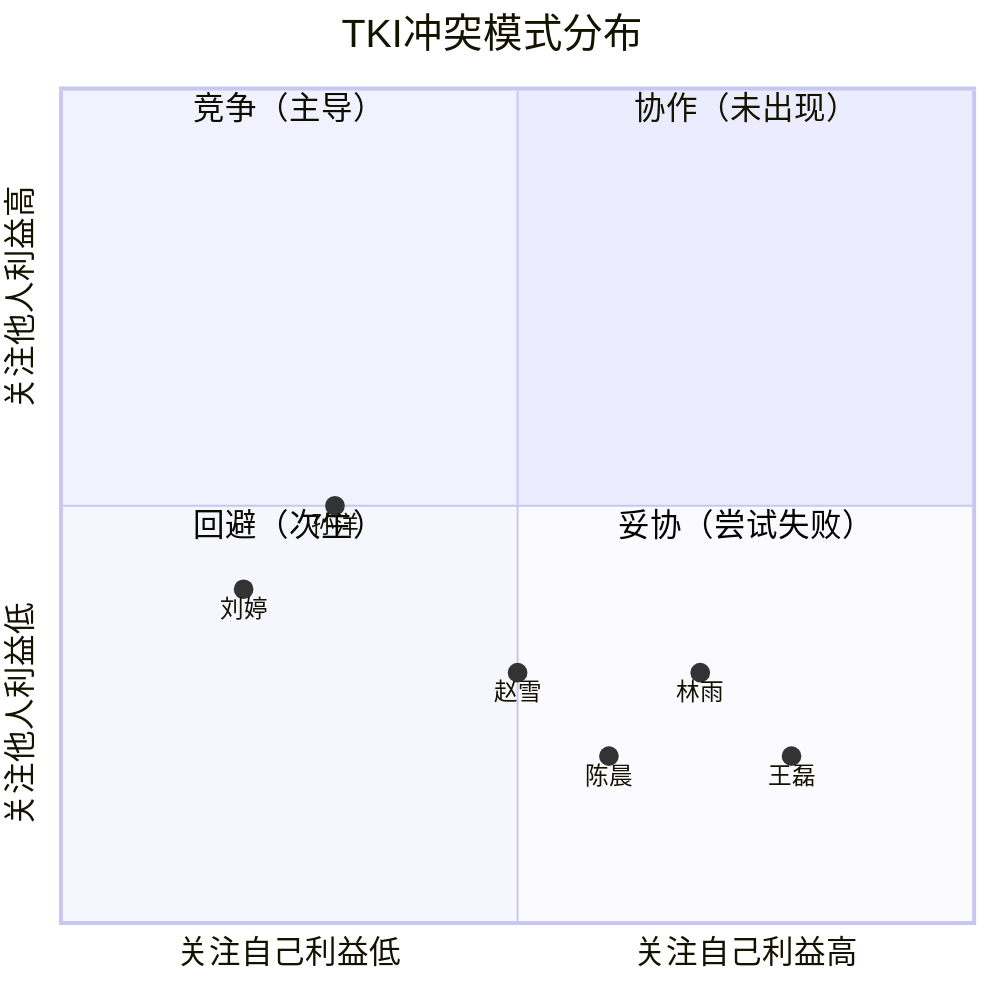
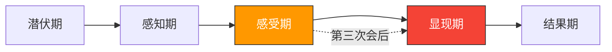
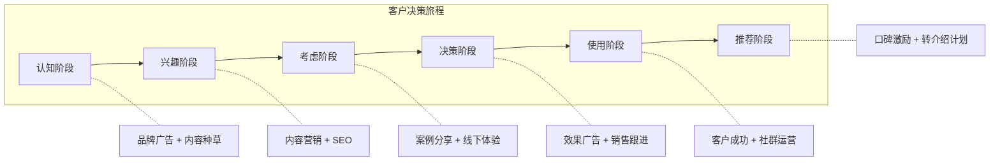
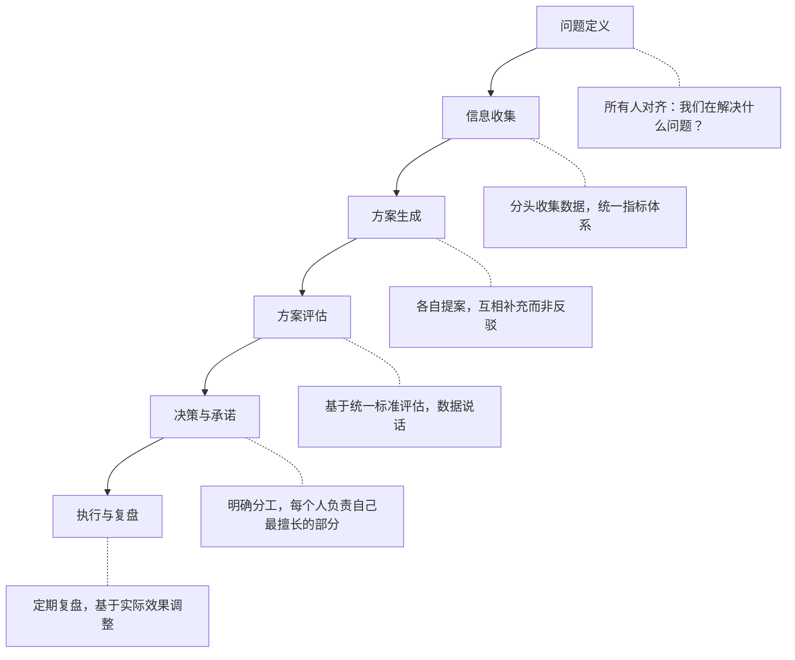

## 案例四：团队内部分歧——当多元视角变成派系对立

团队内部的策略分歧，是组织中最常见也最微妙的冲突形态。它不像同事间的争执那样剑拔弩张（参见[案例一：同事间工作摩擦](../_index.md)），也不像上下级冲突那样有明确的权力裁决路径（参见[案例三：上下级目标不一致](../_index.md)）。它更像是一场多方博弈——每个人都有合理的立场，每个人都掌握部分真理，但没有人拥有全部答案。

本案例将完整呈现一个六人营销团队如何从专业讨论滑向派系对立，又如何在一位有意识的团队领导者的引导下，将冲突转化为集体智慧的跃升。与前几个案例不同，这里的核心挑战不是"谁对谁错"，而是"如何让六个都对的人找到一条共同的路"。

### 早期预警信号：在冲突爆发前识别它

在进入正式案例之前，先列出团队内部分歧升级为派系对立的典型预警信号。如果你正在经历类似的团队动态，这些信号可以帮助你及早干预：

| 预警信号 | 具体表现 | 危险等级 |
|----------|----------|----------|
| 重复发言 | 同一个人在一次会议上重复同一观点三次以上 | ⚠️ 中 |
| 选择性倾听 | 只对自己认同的观点点头，对其他观点面无表情或看手机 | ⚠️ 中 |
| 语言转向 | 从"这个方案"变成"我的方案"，从"我们"变成"你们" | 🔴 高 |
| 私下联盟 | 会前小范围通气，会后扎堆讨论"谁说得对" | 🔴 高 |
| 人身暗示 | "有些人就是不懂……""某些部门只会纸上谈兵" | 🔴 高 |
| 沉默退出 | 原本活跃的成员开始不发言、不回应、不参与 | ⚠️ 中 |
| 会议延长 | 原定1小时的会开了2小时还没有结论 | ⚠️ 中 |

本案例中的团队在第二次会议时已经出现了至少五个信号，但领导者小周没有及时识别。这是很多团队都会犯的错误——把预警信号当成"正常讨论"。

### 场景全景

**公司背景**：S科技是一家成立五年的B2B SaaS企业，主打产品是面向中小企业的智能客服系统。公司刚完成B轮融资，估值12亿，正处于从"产品驱动"转向"市场驱动"的关键阶段。CEO在季度战略会上明确要求：下一年度营销预算在去年基础上增长50%（从800万增至1200万），要求营销团队拿出一套能支撑3倍营收增长目标的年度营销方案。

**团队构成**：营销部六人团队，由营销总监小周统管。团队成员背景各异，能力互补但视角冲突：

| 成员 | 背景 | 核心主张 | 逻辑起点 |
|------|------|----------|----------|
| 林雨 | 品牌策划出身，4A广告公司3年经验 | 加大品牌建设投入，塑造行业权威形象 | "没有品牌溢价，永远只能打价格战" |
| 王磊 | 效果营销出身，曾在字节跳动负责增长 | 集中预算投效果广告，追求可量化的ROI | "每一分钱都要能追踪到转化" |
| 陈晨 | 活动运营出身，线下展会和沙龙经验 | 多做行业展会和客户沙龙，深耕关系 | "B2B决策靠信任，信任靠面对面" |
| 赵雪 | 内容营销出身，曾运营多个行业KOL | 重投内容矩阵，用思想领导力吸引客户 | "内容是最好的长期资产" |
| 孙洋 | 数据分析出身，强调一切基于数据 | 用数据模型分配预算，动态优化 | "感觉不可靠，数据说了算" |
| 刘婷 | 用户运营出身，关注客户生命周期 | 把钱花在老客户身上，靠口碑带新 | "获客成本太高，复购和转介绍才是王道" |

**关键时间节点**：年度规划季，距离方案提交CEO审批还剩两周。

**团队关系基线**：值得注意的是，这个团队之前的合作并不差。在上一年度的800万预算执行中，大家各管各的渠道，相安无事。问题的根源在于：当预算需要整合分配时，原本"井水不犯河水"的平行关系突然变成了"争同一块蛋糕"的零和关系。这是组织中非常典型的冲突触发模式——**资源充裕时的和谐，不代表资源紧张时的团结**。

### 冲突的萌芽与发展

#### 第一次会议：各说各话

小周召集团队开第一次年度规划会。她提出了一个开放性问题："明年的1200万预算，怎么花最有价值？"

六个人依次发言，每人用了15-20分钟展示自己的方案。林雨做了一套完整的品牌升级方案，包括重新设计VI系统、投放品牌TVC、赞助行业峰会，预算占比45%。王磊拿出了一份详细的投放效果模型，展示信息流广告、SEM、社交媒体投放的预期转化率和ROI，建议效果广告占比60%。陈晨罗列了全年24场行业活动的计划，包括4场大型展会、8场城市沙龙、12场线上直播，预算需求35%。

赵雪提出了内容营销矩阵方案，涵盖行业白皮书、技术博客、视频号、播客四个板块，预算需求30%。孙洋做了一个精美的数据模型，用历史数据推演出"最优预算分配曲线"，但这个模型的前提假设每个人都不认同。刘婷展示了老客户运营的ROI数据，建议把预算的25%投入到客户成功和转介绍体系。

六个人的方案加起来需要250%的预算——这在数学上就不可能。

**会议结果**：没有讨论出任何结论，每个人只是把方案念了一遍。小周要求大家回去"互相看看别人的方案"，下次再讨论。

**小周的失误（复盘时才意识到）**：她用了开放式问题"怎么花最有价值"，但没有设定任何讨论规则和评估标准。这等于默认了"每个人提案→互相比较→选最好的"这个对抗性流程。

#### 第二次会议：针锋相对

第二次会议一开始气氛就不对。王磊直言不讳："我看了林雨的品牌方案，花540万做品牌，但品牌知名度怎么衡量？转化率是多少？说不清楚。"林雨反驳："你那种'一锤子买卖'式的投放，客户来了留不住，有什么意义？"

陈晨插话："你们线上获客的那些线索，成交率有5%吗？我线下活动带回来的客户成交率是22%，这个数据说明什么？"

赵雪不甘示弱："线下活动一场能覆盖多少人？我一篇爆款文章的阅读量比你十场沙龙加起来都多。"

孙洋试图用数据调和："大家先别争，我们拉一下各渠道的LTV（客户终身价值）数据……"但没人听他的。刘婷想讲客户运营的价值，但话还没说完就被打断了。

**会议结果**：讨论变成了互相攻击。会后，私下里形成了明显的派系——"品牌派"（林雨、刘婷）、"效果派"（王磊、孙洋）、"活动派"（陈晨、赵雪）。团队氛围急剧恶化。

**派系形成的内在逻辑**：派系不是随机组合的，它遵循"最小差异原则"——人们倾向于和与自己观点最接近的人结盟。林雨和刘婷都关注"长期价值"，王磊和孙洋都强调"可量化"，陈晨和赵雪都认为"人与人的直接连接最重要"。这种联盟是无意识的，但一旦形成，就会强化各自的立场。

#### 第三次会议：僵局与情绪

第三次会议是最糟糕的一次。小周想让大家聚焦讨论，但每个人开口都带着火药味。王磊说"某些人就是不懂增长"，林雨回击"某些人只知道烧钱"。陈晨抱怨"我的方案根本没人认真看过"。整个会议室弥漫着挫败和敌意。

小周意识到，再这样讨论下去不仅解决不了问题，团队关系也会彻底破裂。她果断宣布散会，说"我想一天，明天给大家一个新方案"。

**冲突状态**：从任务冲突向关系冲突过渡，派系对立已经形成，情绪化表达取代了理性讨论。

#### 六人的内心世界

冲突中每个人的外在表现只是冰山一角。理解他们的内在想法，才能理解为什么简单的"理性讨论"无法解决问题：

| 成员 | 外在表现 | 内心独白 | 深层需求 |
|------|----------|----------|----------|
| 林雨 | 强硬维护品牌方案 | "品牌是我在这家公司的核心价值，如果预算被砍，我在这里还有什么意义？" | 职业身份认同 |
| 王磊 | 用数据攻击别人 | "我从字节出来就是因为我擅长增长，如果增长方案不被采纳，我凭什么在这里？" | 能力证明 |
| 陈晨 | 抱怨不被重视 | "每次开会他们都在讨论线上，我的线下活动从来排不上优先级" | 存在感 |
| 赵雪 | 拿阅读量说事 | "内容营销是公认的趋势，为什么团队总是把我们当辅助？" | 话语权 |
| 孙洋 | 试图用数据调解 | "大家都有道理，但为什么不先看看数据再说话？我做的模型没人看" | 被需要感 |
| 刘婷 | 想说但被打断 | "获客成本越来越高，老客户才是根基，但没人关注运营这条线" | 被倾听 |

注意：每个人担心的核心都不是"钱分少了"，而是"我的价值不被认可"。这就是为什么单纯的预算调整无法解决根本问题——它没有触及身份认同和归属感这一层。

### 深层冲突分析

#### 冲突的多层结构

这个案例表面上是"营销策略之争"，但深入分析会发现至少五层冲突在同时运作：

```mermaid
graph TD
    A[表层冲突：营销预算怎么分配] --> B[方法论冲突：品牌vs效果vs活动]
    B --> C[认知框架冲突：不同专业背景形成不同的思维定式]
    C --> D[利益冲突：资源分配关系到各自领域的存在感和话语权]
    D --> E[身份冲突："我的专业价值被认可吗？"]
    E --> F[归属冲突："我在这个团队中的位置在哪里？"]
```

| 冲突层次 | 表现 | 驱动力 | 可见度 |
|----------|------|--------|--------|
| 表层：方案之争 | "应该投品牌还是投效果" | 专业判断差异 | 高 |
| 中层：方法论之争 | "什么才是好的营销" | 专业背景塑造的认知框架 | 中 |
| 深层：资源之争 | "我的方案能拿到多少预算" | 预算分配影响团队内话语权 | 低 |
| 核心层：身份之争 | "我的专业有没有价值" | 个人价值感与职业身份认同 | 隐性 |

为什么这个分析很重要？因为如果你只在表层解决"分配多少预算"的问题，深层的不满和对立不会消失，只会在下一次决策中再次爆发。

#### 冲突类型判定

从Thomas-Kilmann冲突模式工具（TKI）的角度分析，这个案例体现了多种冲突模式的混战：

- **竞争模式**（主导）：每个成员都在争取"我的方案胜出"，把这当作零和博弈
- **回避模式**（次生）：第三次会后，部分成员开始消极应对，不再积极发言
- **妥协模式**（尝试失败）：小周曾尝试"各分一点"，但每人拿到的份额都不够执行有效方案

唯一没有出现的是**协作模式**——把不同方案的优势整合起来，找到一个所有人都认可的更大方案。而这恰恰是破局的关键。

TKI工具的五种模式在本案例中的分布：



#### 为什么多人冲突比两人冲突更难处理？

| 维度 | 两人冲突 | 多人冲突（三人及以上） |
|------|----------|------------------------|
| 关系复杂度 | 1条关系线 | n(n-1)/2条关系线（6人=15条） |
| 派系形成 | 不太可能 | 极易形成（联盟、对立） |
| 公开表态压力 | 较低 | 高（"站队"心理） |
| 冲突升级速度 | 较慢 | 快（情绪传染、群体极化） |
| 解决难度 | 可以一对一沟通 | 需要结构性的框架转换 |
| 领导者角色 | 调解人 | 设计者（设计讨论框架和决策机制） |

多人冲突的特殊挑战在于**群体极化效应**：当人们发现有人支持自己的观点时，会不自觉地把立场推向更极端。在团队讨论中，这种效应会让"我倾向于A方案"迅速演变成"A方案才是唯一正确的"。

社会心理学家贾尼斯（Irving Janis）提出的**群体思维**（Groupthink）也是本案例的重要理论背景。当派系形成后，每个小群体内部会出现：对群体观点的无条件认同、对外部信息的选择性过滤、对"站队"的社会压力。这解释了为什么第二次会议后，原本试图保持中立的孙洋也开始倾向于"效果派"——不是因为他的观点变了，而是因为群体压力改变了他的行为。

#### 冲突发展阶段定位



团队在感受期向显现期的过渡阶段。如果任其发展，将进入显现期的全面对抗——公开的争吵、消极怠工、甚至有人提出离职。小周的干预窗口非常有限。

**各阶段特征对照表**：

| 阶段 | 团队行为 | 领导者应做的 |
|------|----------|-------------|
| 潜伏期 | 各做各的，表面和谐 | 建立定期沟通机制，提前对齐 |
| 感知期 | 开始注意到分歧，小范围讨论 | 主动暴露分歧，不要回避 |
| 感受期 | 对立情绪形成，派系出现 | **最后的干预窗口**——改变讨论框架 |
| 显现期 | 公开对抗，人身攻击 | 强制暂停，分别沟通 |
| 结果期 | 要么解决，要么破裂 | 复盘机制建设 |

### 处理策略：从对抗到协作的四步转型

#### 第一步：改变讨论框架——从"我的方案"到"客户需要什么"

这是整个处理过程中最关键的一步，也是很多团队领导者容易忽略的一步。

**为什么框架转换如此重要？**

小周在散会后复盘了三次会议的讨论模式，发现了问题的根源：三次会议的讨论框架都是"我们应该怎么做营销"。这个框架天然把每个人放在了"提案者"的位置——你提案，我也提案，我们比谁的提案更好。这是一种对抗性的框架。

小周需要把框架转换为协作性的——让所有人站在同一边，共同面对一个外部问题。

这种框架转换在冲突管理理论中被称为**"重构"（Reframing）**。哈佛谈判项目的罗杰·费舍尔（Roger Fisher）在《谈判力》中提出：当谈判陷入僵局时，最有效的方法不是在现有选项中做选择，而是重新定义问题本身。本案例中，从"怎么分预算"重构为"客户需要什么"，正是这一原理的实践应用。

**具体做法**：

小周在第四次会议前做了一件事：她没有提前发会议议程，而是发了一封邮件，标题是"暂停讨论预算分配——我们先回答四个问题"。邮件内容如下：

> 团队各位，
> 
> 过去三周的讨论让我们每个人都充分表达了自己的方案，这很好。但我意识到我们在跳步——在讨论"怎么花钱"之前，我们还没有对齐"钱花给谁"。
> 
> 我邀请大家在周四的会议上，一起回答四个问题：
> 1. 我们的目标客户到底是谁？（不是泛泛的"中小企业"，而是具体到决策者的画像）
> 2. 他们现在在哪里？（信息获取渠道、决策场景、信任来源）
> 3. 他们从"不知道我们"到"购买我们的产品"经历了什么过程？
> 4. 在这个过程的每个阶段，什么方式最能影响他们的决策？
> 
> 请大家带着各自掌握的客户数据来参会。不是方案，是数据。

这封邮件的高明之处在于：
- 把讨论的主体从"我们"（内部视角）转换为"客户"（外部视角）
- 把讨论的性质从"争对错"转换为"探真相"
- 把每个人的角色从"提案者"转换为"信息贡献者"

**第四次会议现场**：

小周在白板上画了一条时间轴，标注了客户从"认知"到"购买"的六个阶段。她要求每个人用不同颜色的便利贴，把各自掌握的客户信息贴到对应阶段。

一个有趣的现象出现了：林雨的品牌信息贴在了"认知"阶段，王磊的效果广告数据贴在了"考虑"和"决策"阶段，陈晨的线下活动信息贴在了"评估"阶段。每个人的信息都在合适的位置，没有互相矛盾。

当白板上呈现出完整的客户旅程地图时，讨论的气氛彻底变了。王磊主动说："原来品牌广告不是没用，是用在客户旅程的最前端，帮我们降低后续获客成本。"林雨也说："我之前没考虑到，品牌认知建立之后需要效果广告来承接转化。"

#### 第二步：引入数据和事实——让数字说话

框架转换让讨论从"谁对谁错"变成了"真相是什么"，但要让这个转变持续下去，需要数据的支撑。没有数据的共识是脆弱的，一阵风就能吹散。

**数据收集的组织方式**：

小周没有让所有人各自收集数据（那会强化各自的偏见），而是设计了一个协作式的数据收集流程：

1. **统一指标体系**：小周列出所有渠道需要统一衡量的指标——获客成本（CAC）、转化率、客户终身价值（LTV）、LTV/CAC比值、品牌知名度变化、NPS（净推荐值）
2. **分头收集，统一呈现**：每个人负责收集自己领域的数据，但必须用统一的模板呈现
3. **交叉验证**：每组数据至少需要两个独立来源交叉验证

**这里有一个关键的设计细节**：小周没有让孙洋一个人收集所有数据（虽然他最有能力），而是让每个人收集自己领域的数据。原因有二：第一，每个人对自己领域的数据最熟悉，收集效率最高；第二，参与数据收集的过程本身就是一种"承诺"——当林雨自己收集了品牌广告的效果数据后，她对数据的信任度远高于别人告诉她数据。

**数据揭示的关键发现**：

经过三天的数据收集和整理，团队得到了一张完整的渠道效果对比表：

| 渠道 | 年投入 | 获客数量 | CAC | 转化率 | 客户LTV | LTV/CAC | 特点 |
|------|--------|----------|-----|--------|---------|---------|------|
| 品牌广告 | 150万 | 难直接衡量 | — | — | — | — | 建立认知，降低全渠道CAC |
| SEM | 200万 | 3200 | 625元 | 3.2% | 8500元 | 13.6 | 精准但天花板明显 |
| 信息流广告 | 180万 | 4500 | 400元 | 1.8% | 6200元 | 15.5 | 量大但客户质量偏低 |
| 内容营销 | 80万 | 1800 | 444元 | 5.1% | 12000元 | 27.0 | 转化率和LTV最高 |
| 线下活动 | 120万 | 800 | 1500元 | 22% | 25000元 | 16.7 | 获客成本高但转化率极高 |
| 老客户运营 | 70万 | 600（转介绍）| 1167元 | 35% | 32000元 | 27.4 | 转化率和LTV最高 |

数据带来了三个关键洞察：

**洞察一**：不同渠道的价值不能只看直接ROI。品牌广告无法直接衡量获客，但品牌知名度每提升10%，全渠道获客成本下降约15%（这是行业基准数据，也有团队历史数据支撑）。林雨一直想表达但说不清楚的观点，被数据证实了。

**洞察二**：客户在决策旅程的不同阶段，对不同营销方式的响应差异巨大。认知阶段品牌广告的触达效率是效果广告的3倍，但决策阶段效果广告的转化效率是品牌广告的8倍。这说明不是"选哪个"的问题，而是"在什么阶段用什么"的问题。

**洞察三**：内容营销和老客户运营的LTV/CAC比值远高于其他渠道，但当前投入占比最低。这是一个结构性的资源错配。

**数据并没有"证明谁对谁错"，而是揭示了一个所有人都没想到的真相**：每个人的方案都有道理，但单独拿出来都不完整。这个发现比任何"调解技巧"都有效——它让每个人自己得出了"需要整合"的结论，而不是被别人说服。

#### 第三步：构建整合方案——基于客户旅程的资源分配

有了数据和客户旅程地图，构建整合方案就水到渠成了。小周引导团队用"客户旅程×营销方式"矩阵来分配资源：



**最终预算分配方案**：

| 营销方式 | 预算 | 占比 | 目标阶段 | 核心KPI | 负责人 |
|----------|------|------|----------|---------|--------|
| 品牌建设 | 210万 | 17.5% | 认知 | 品牌知名度提升20%，全渠道CAC下降10% | 林雨 |
| 效果广告 | 240万 | 20% | 考虑→决策 | 获客4000+，CAC控制在600以内 | 王磊 |
| 内容营销 | 220万 | 18.3% | 兴趣→考虑 | 优质线索3000+，内容资产沉淀 | 赵雪 |
| 线下活动 | 180万 | 15% | 评估→决策 | 高质量客户500+，成交率>20% | 陈晨 |
| 客户运营 | 200万 | 16.7% | 使用→推荐 | 转介绍800+，NPS>60 | 刘婷 |
| 数据与技术 | 100万 | 8.3% | 全链路 | 数据基建、归因分析、A/B测试 | 孙洋 |
| 机动预算 | 50万 | 4.2% | 灵活调配 | 季度复盘后动态调整 | 小周 |

**方案的巧妙之处**：

1. **每个人的核心能力都在方案中得到了体现**——没有人被边缘化，这消除了身份危机
2. **分配逻辑基于客户旅程而非个人偏好**——每个人都能理解为什么这样分
3. **设置了动态调整机制**——不是一年定死，而是每季度根据数据复盘调整
4. **孙洋的"数据分析"变成了贯穿全局的基础设施**——不再是和别人争预算的角色，而是赋能所有人的角色

**方案执行中遇到的真实挫折**（很多案例只讲成功，这里补充现实的复杂性）：

- **王磊的初期抵触**：方案通过后，王磊私下找小周表达不满："效果广告从60%砍到20%，增长目标怎么完成？"小周花了30分钟和他逐阶段分析客户旅程中效果广告的作用，最终王磊理解了"20%的预算放在决策阶段，效率远高于60%的预算分散在所有阶段"。
- **林雨的指标焦虑**：品牌建设的KPI是"品牌知名度提升20%"，但这个指标的衡量周期是6个月以上。前3个月林雨看不到明显进展，一度非常焦虑。小周通过设置阶段性指标（如搜索指数、行业媒体提及率）来缓解这种焦虑。
- **协作摩擦**：在"兴趣→考虑"阶段，赵雪的内容营销和陈晨的线下活动有重叠。两人就"内容分享会"算线上还是线下产生了新的分歧。小周通过明确流程——内容营销产出素材，线下活动使用这些素材——解决了权责划分。
- **孙洋的数据困境**：团队原有的数据基础很差，很多指标没有历史数据。孙洋花了两个月才建立起基本的数据采集体系，这段时间内其他人的决策依然缺乏数据支撑。

#### 第四步：建立长期共识机制——预防冲突再次爆发

方案通过只是开始，小周深知如果不建立机制，下一次决策时同样的冲突会再来。她建立了三个机制：

**机制一：数据驱动决策原则**

任何营销策略讨论，必须先呈现数据，再讨论方案。不允许"我觉得"式的提案。这不是说直觉和经验不重要，而是说直觉和经验必须有数据支撑。小周在团队Wiki上写下了一条铁律：

> "没有数据支撑的观点是假设，不是方案。假设可以提，但不能作为决策依据。"

**机制二：季度战略复盘会**

每个季度召开一次战略复盘会，基于实际数据评估各渠道表现，动态调整预算分配。复盘模板包括：

- 各渠道核心KPI完成情况（实际值 vs 目标值）
- 客户旅程各阶段的转化漏斗数据
- 竞品动态和市场变化
- 下季度预算调整建议（必须附数据理由）

复盘会的参与规则：
1. 先看数据，再讨论（不允许先发表观点再找数据佐证）
2. 每个人汇报自己负责的渠道，但所有人都可以提问和建议
3. 预算调整需要至少两个数据论据支撑
4. 调整幅度单次不超过20%（避免剧烈变动影响执行稳定性）

**机制三：角色轮换与交叉学习**

小季度安排团队成员参与其他成员的项目。比如让王磊参加一次线下活动的全流程，让林雨跟一次效果广告的投放优化。目的不是让人转岗，而是让每个人理解其他营销方式的运作逻辑和价值。

这个机制的效果在第二年的规划会上显现了出来。当团队再次讨论预算时，每个人对其他渠道的理解明显加深了，讨论质量远高于第一次。

### 远程/混合办公场景的适配

如果同样的团队分歧发生在远程或混合办公环境中，处理难度会显著增加。以下是需要特别注意的差异和应对：

| 维度 | 线下场景 | 远程场景 | 适配建议 |
|------|----------|----------|----------|
| 非语言信号 | 能看到表情和肢体语言 | 视频会议中信号大量丢失 | 需要更主动地确认对方情绪状态 |
| 私下联盟 | 需要物理接触 | 即时消息让联盟形成更快 | 领导者需要更早介入，通过1:1了解动态 |
| 情绪冷却 | 离开会议室自然冷却 | 在线争吵可能延伸到群聊 | 建立"24小时冷静期"规则 |
| 白板协作 | 便利贴、白板直观高效 | 需要Miro/FigJam等工具替代 | 提前测试工具，确保所有人会用 |
| 会议疲劳 | 可以在会议室走动 | 视频会议更容易疲劳 | 将1次2小时会议拆成2次1小时 |

**远程场景下的"第四次会议"替代方案**：

小周的框架转换依赖于白板上的客户旅程地图。在远程场景中，可以用以下方式替代：

1. 提前用Miro或FigJam创建客户旅程模板
2. 每个人在自己的时间内用便利贴贡献信息（异步）
3. 在同步会议上一起讨论整理后的结果
4. 使用共享屏幕+实时编辑的方式进行数据整合

### 处理结果与效果追踪

方案执行六个月后的效果：

| 指标 | 方案执行前 | 执行六个月后 | 变化 |
|------|-----------|-------------|------|
| 月均获客量 | 350 | 680 | +94% |
| 平均获客成本 | 950元 | 580元 | -39% |
| 客户平均LTV | 8200元 | 11500元 | +40% |
| LTV/CAC | 8.6 | 19.8 | +130% |
| 品牌知名度（目标市场） | 23% | 38% | +65% |
| 团队满意度（内部调研） | 52分 | 87分 | +67% |

最后一行数据最值得关注。团队满意度从52分跃升到87分，不仅说明方案本身有效，更说明团队成员在协作过程中建立了真正的信任和默契。

**一年后的长期追踪**：

| 指标 | 六个月 | 十二个月 | 趋势 |
|------|--------|----------|------|
| 月均获客量 | 680 | 820 | ↑ 持续增长 |
| 平均获客成本 | 580元 | 510元 | ↓ 持续优化 |
| 团队满意度 | 87分 | 91分 | ↑ 稳定高位 |
| 主动离职率 | 0 | 0 | — 稳定 |
| 季度复盘会参与率 | 100% | 100% | — 全员投入 |

一年后的数据验证了机制建设的价值——不只是解决了一次冲突，而是建立了团队持续协作的能力。

### 沟通技巧深度拆解

#### 技巧一：框架转换——从"我对你错"到"真相是什么"

小周的核心动作是把讨论框架从"方案之争"切换为"客户洞察探索"。这个技巧的本质是**改变博弈结构**——从零和博弈（你赢我输）变成正和博弈（我们一起赢）。

**适用场景**：任何多方讨论陷入"各说各话"的状态时。具体信号包括：每个人都在重复自己的观点、没有人回应别人的论点、讨论开始出现人身攻击倾向。

**操作要领**：
1. 暂停当前讨论模式（不要试图在原有框架内"调和"）
2. 找到一个所有人的信息都能贡献价值的外部参照物（在本案例中是"客户"）
3. 让每个人从"提案者"变成"信息提供者"
4. 用可视化工具（白板、矩阵、时间轴）把所有信息整合起来，让共识自然浮现

**框架转换的万能句式**：

| 原始框架（对抗性） | 转换后框架（协作性） |
|-------------------|---------------------|
| "我们应该怎么做？" | "客户需要什么？" |
| "哪个方案更好？" | "什么条件下哪个方案更有效？" |
| "谁来负责？" | "谁的能力最适合这个任务？" |
| "预算是多少？" | "投入产出比最优的分配是什么？" |
| "你的方案有什么问题？" | "你的方案在什么前提下最有效？" |

#### 技巧二：数据的"去部落化"效应

当讨论基于"我觉得"时，每个人的观点都和自己的身份绑定在一起——否定我的观点就是否定我。但当讨论基于"数据显示"时，观点和身份脱钩了——数据是客观的，不代表任何人的立场。

**操作要领**：
1. 统一指标体系——用所有人都认可的标准来衡量
2. 分头收集——避免一个人控制数据叙事
3. 交叉验证——确保数据可信
4. 集体呈现——在同一个画面上展示所有数据，让对比自然发生

**使用数据时的注意事项**：

数据虽然能"去部落化"，但如果使用不当，也会变成新的武器。以下是需要避免的情况：

- **选择性引用**：只展示支持自己观点的数据，忽略反面数据
- **指标游戏**：通过改变指标定义来让数据"说"自己想说的话
- **数据暴政**：用数据压制所有非量化的洞察（如直觉、经验、客户情感）

小周在设计数据收集流程时，通过"统一指标体系"和"交叉验证"两个机制，有效避免了前两种问题。

#### 技巧三：找到"更高层次的目标"

心理学家穆扎费尔·谢里夫（Muzafer Sherif）的经典实验证明：当敌对群体面对一个必须合作才能解决的"超级目标"（superordinate goal）时，群际冲突会显著降低。在本案例中，"制定支撑3倍营收增长的营销方案"就是超级目标——它足够大，大到任何一个人都无法单独完成，必须依赖团队的集体智慧。

**如何在自己的团队中应用这个原理**：

1. **识别共同威胁**：竞品在做什么？市场趋势如何？客户痛点是什么？——把注意力从内部分歧引向外部挑战
2. **定义共同愿景**：不是"我要达成什么"，而是"我们要一起达成什么"
3. **制造合作必要性**：设计任务结构，让任何一个人或小群体都无法单独完成

### 常见误区与纠正

#### 误区一："各让一步"就是好结果

很多团队领导者在面对分歧时，本能反应是"折中"——品牌预算200万，效果预算200万，线下200万……表面上大家都"得到了一些"，但实际上每个人拿到的预算都不足以做出有效果的方案。这叫"稀释式妥协"——看起来公平，实际上所有人都是输家。

**纠正方法**：不要在现有方案之间做选择，而是找到一个能整合所有方案优势的更高层次方案。客户旅程框架就是这样一种"更高层次"的整合思路。

#### 误区二：压制冲突，追求"和谐"

有些领导者害怕冲突，一旦出现分歧就赶紧"和稀泥"或者强行拍板。这种做法短期内看起来和谐了，但问题是：被压制的观点不会消失，只是转入地下。下次决策时，同样的分歧会以更强的烈度爆发。

**纠正方法**：区分"建设性冲突"和"破坏性冲突"。建设性冲突是围绕方案的理性讨论，应该鼓励；破坏性冲突是人身攻击和派系对立，需要干预。小周前三次会议犯的错误是，没有及时把讨论控制在建设性范围内。

**建设性冲突 vs 破坏性冲突的判断标准**：

| 特征 | 建设性冲突 | 破坏性冲突 |
|------|-----------|-----------|
| 讨论对象 | 方案、方法、策略 | 人、能力、动机 |
| 语言特征 | "这个方案有一个风险是……" | "某些人就是不懂……" |
| 倾听行为 | 对方说完后回应具体内容 | 对方说到一半就打断 |
| 情绪状态 | 激动但不失控 | 愤怒、沮丧、冷漠 |
| 结束后关系 | 不影响日常合作 | 回避、冷战、拉黑 |

#### 误区三：让"最能说的人"主导讨论

在团队讨论中，表达能力强的人天然占据更多话语权。但"说得最多"不等于"说得最对"。在本案例中，如果让表达能力最强的王磊和林雨主导讨论，赵雪和刘婷的洞察就永远不会被听到。

**纠正方法**：
- 结构化发言：每人限时发言，确保所有人有平等的表达机会
- 书面先行：重要方案先书面提交，再开会讨论（避免"谁口才好谁赢"）
- 匿名投票：在关键决策点使用匿名投票，减少社会压力对判断的影响

#### 误区四：过早下结论

在第一次或第二次会议就急着做决定，是很多团队的通病。讨论还没有充分展开，信息还没有充分收集，就因为"时间紧"或者"领导催"而仓促拍板。这种决策的质量通常很低，执行过程中会遇到大量预期之外的问题。

**纠正方法**：给讨论足够的空间和时间。小周花了四周时间（四次会议）才最终达成共识，这个时间是值得的——因为最终的方案质量远高于任何一个人单独提出的方案。

#### 误区五：只关注"方案"，忽视"人"

当团队成员感到自己的专业价值被否定时，他们关心的已经不是"方案好不好"，而是"我在这个团队里还有没有位置"。忽略这种情感需求，只从理性层面解决问题，效果会大打折扣。

**纠正方法**：在最终方案中确保每个人的核心能力都得到体现和认可。小周的方案让林雨负责品牌、王磊负责效果、陈晨负责活动——这不是简单的"分蛋糕"，而是在告诉每个人："你的专业是有价值的，我们的方案需要你的贡献。"

### 进阶技巧：多人冲突管理的系统方法

#### 结构化决策流程设计

对于经常面临多方分歧的团队，建议建立一套标准化的决策流程：



每个阶段都有明确的输入、输出和参与规则。这样做的好处是：即使将来出现新的分歧，团队也有一个清晰的框架来处理，而不至于重新陷入混乱。

#### "钢铁人"辩论法

普通辩论是"稻草人"式——歪曲对方观点然后攻击。高级团队使用"钢铁人"式——先用自己的话复述对方的观点，直到对方确认"你理解得比我自己说的还清楚"，然后才能提出反驳。

这种做法有两个效果：
1. 被复述的一方感到被倾听和理解，防御心理降低
2. 复述的一方在复述过程中会真正理解对方的逻辑，可能会改变自己的看法

在本案例中，如果王磊在反驳林雨之前先说"你的意思是，品牌建设虽然不能直接量化获客，但能降低全渠道的获客成本，对吗？"，讨论的走向可能完全不同。

**钢铁人辩论的三步练习**：

1. **复述**："如果我理解正确的话，你的核心观点是……"
2. **确认**："我理解得对吗？有没有遗漏什么重要的部分？"
3. **回应**："我理解你的逻辑，但我有一些补充数据/不同角度想分享……"

#### 决策矩阵工具

当面临多个方案的比较时，使用加权决策矩阵可以大大减少主观争论：

**操作步骤**：
1. 团队共同确定评估维度（如：短期ROI、长期价值、执行难度、风险可控性）
2. 团队共同为每个维度分配权重（总和100%）
3. 每个人独立为每个方案在每个维度上打分（1-10分）
4. 计算加权总分
5. 讨论评分差异最大的维度——差异大意味着信息不对称，需要进一步讨论

这个工具的价值不在于"算出一个正确答案"，而在于**把模糊的直觉争论转化为结构化的信息交换**。

**在本案例中的模拟应用**（假设在第三次会议使用）：

| 评估维度 | 权重 | 品牌方案 | 效果方案 | 活动方案 | 内容方案 |
|----------|------|----------|----------|----------|----------|
| 短期ROI（6个月内） | 25% | 4分 | 8分 | 7分 | 5分 |
| 长期价值（1年以上） | 25% | 9分 | 4分 | 6分 | 9分 |
| 执行难度（低=高分） | 20% | 5分 | 7分 | 4分 | 6分 |
| 客户覆盖广度 | 15% | 8分 | 7分 | 3分 | 7分 |
| 数据可衡量性 | 15% | 3分 | 9分 | 6分 | 6分 |
| **加权总分** | 100% | **5.9** | **6.9** | **5.3** | **6.5** |

注意：没有一个方案在所有维度上都最优。这正是决策矩阵的价值——它直观地展示了"为什么单独一个方案不够"。

#### 会议设计的艺术

多人冲突中，会议的形式往往比内容更重要。小周的前几次会议失败，很大程度上是因为会议设计有问题。

**低效会议的特征**：
- 开放式讨论，没有结构
- 所有人同时发言，声音大的占上风
- 讨论围绕"我的方案"展开
- 没有记录，没有跟进

**高效会议的设计原则**：
- 明确会议目标（是信息同步还是方案决策？）
- 结构化发言（每人限时、轮流发言）
- 聚焦问题而非立场（"客户需要什么"而非"我们应该怎么做"）
- 实时记录（白板/共享文档，让所有人看到讨论的进展）
- 明确下一步行动（谁做什么、什么时候完成）

**推荐的会议流程模板（适用于多方分歧场景）**：

| 时间 | 环节 | 参与规则 | 输出物 |
|------|------|----------|--------|
| 0-5分钟 | 目标说明 | 主持人单方面 | 明确的会议目标 |
| 5-25分钟 | 信息呈现 | 每人限时3分钟，不能打断 | 数据/事实清单 |
| 25-40分钟 | 框架讨论 | 聚焦"客户需要什么"而非"我的方案" | 客户旅程/问题框架 |
| 40-50分钟 | 方案整合 | 基于框架讨论资源分配 | 初步分配方案 |
| 50-55分钟 | 异议收集 | 匿名写下最大顾虑 | 异议清单 |
| 55-60分钟 | 行动分配 | 明确谁做什么 | 任务清单+截止日期 |

#### 从冲突到创新的转化

心理学研究发现，适度的任务冲突（围绕方案和方法的分歧）实际上能提升团队决策质量，因为它迫使团队从多个角度审视问题，减少群体思维的盲区。问题不在于冲突本身，而在于冲突是否被有效地管理。

本案例的最终结果印证了这一点：六个人的方案单独拿出来都不是最优的，但整合后的方案比任何一个人的方案都好——因为它覆盖了客户旅程的每个阶段，利用了每种营销方式的比较优势，而且有数据支撑的动态调整机制。

这就是冲突管理的最高境界：**不是消灭冲突，而是把冲突的能量转化为创新的动力**。

### 读者自查清单

如果你正在面对类似的团队内部分歧，用以下清单评估当前状态：

**冲突识别**
- [ ] 团队讨论中是否出现了重复发言（同一观点反复强调）？
- [ ] 是否出现了"我们vs他们"的语言（"你们做XX的就是不懂……"）？
- [ ] 是否有成员开始沉默退出（不发言、不回应）？
- [ ] 是否出现了私下联盟（会前通气、会后扎堆）？

**领导者自检**
- [ ] 讨论框架是"内部视角"（我们应该怎么做）还是"外部视角"（客户需要什么）？
- [ ] 每个人是否有平等的发言机会，还是"最能说的人"主导？
- [ ] 讨论是否基于数据，还是基于"我觉得"？
- [ ] 是否有人在讨论中感到自己的专业价值被否定？

**解决方案评估**
- [ ] 方案是否整合了所有人的核心能力，还是某些人被边缘化？
- [ ] 分配逻辑是否基于客观标准（客户旅程、数据），还是基于个人偏好或权力？
- [ ] 是否有动态调整机制，还是一年定死？
- [ ] 是否建立了预防类似冲突再次爆发的制度？

**如果勾选了3个以上的"是"，说明团队分歧已经进入了需要系统性干预的阶段。** 参考本案例的四步转型方法，从"改变讨论框架"开始。

### 本案例的核心原则总结

1. **框架决定结果**：讨论框架比讨论内容更重要。"我们应该怎么做"是对抗性框架，"客户需要什么"是协作性框架。改变框架，就能改变讨论的性质。

2. **数据是去部落化的利器**：当每个人都在"我觉得"的层面争论时，冲突和身份绑定。引入数据，让客观事实取代主观判断，是化解对立的有效手段。

3. **整合优于折中**：不要在现有方案之间做"二选一"或"各分一点"。找到一个更高层次的框架，让所有方案的优势都能被整合进去。

4. **人的问题先于事的问题**：当团队成员感到自己的专业价值被否定时，先解决"人"的问题——让他们感到被倾听、被尊重、被需要——然后再解决"事"的问题。

5. **机制比个人觉悟可靠**：不要指望一次讨论解决所有问题。建立数据驱动、定期复盘的决策机制，才能从根本上预防类似冲突的反复爆发。

6. **冲突是创新的原材料**：多元视角的碰撞不是问题，缺乏管理的碰撞才是问题。有意识地设计讨论框架和决策流程，可以把冲突转化为团队的集体智慧。

7. **过程中的挫折是正常的**：方案通过不等于问题解决。执行中的新摩擦、个人的情绪波动、数据基础的不完善，都是真实世界的一部分。重要的是建立应对这些挫折的机制，而不是期望一劳永逸。

***
