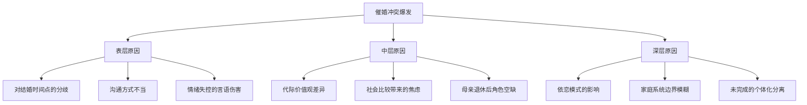
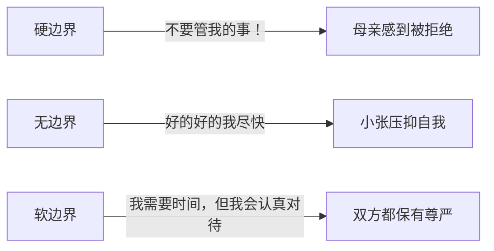
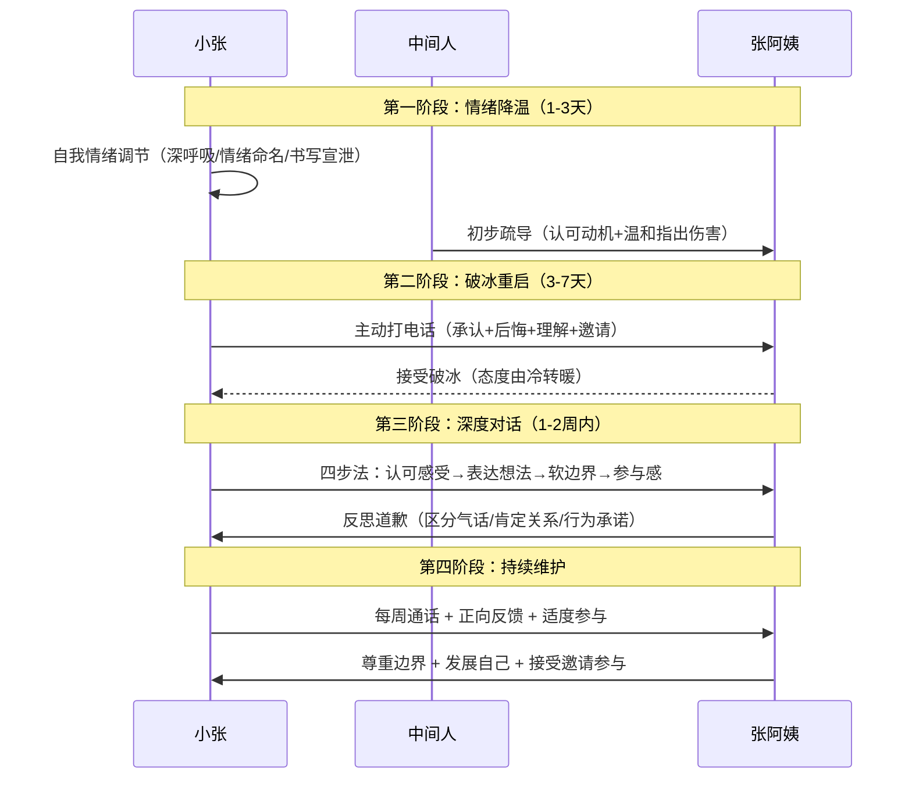

## 案例五：家庭成员之间的矛盾

家庭冲突是所有冲突类型中最特殊的一种。与职场或社交冲突不同，家庭冲突往往牵涉深层的情感依附、代际价值观差异和无法切断的关系纽带。你可以换一份工作、换一个朋友圈，但你无法更换自己的父母和子女——正是这种"不可退出性"，让家庭冲突既格外痛苦，又格外需要被妥善处理。

本案例通过一个典型的"催婚"冲突，系统展示家庭矛盾的识别、分析、干预和长效管理全过程。读完本案例，你将掌握：

- 家庭冲突的三层分析框架（表层事件→中层结构→深层心理）
- 从情绪降温到关系重建的四阶段修复流程
- 家庭边界设立的"软边界"技术
- 五种常见家庭冲突处理误区的识别与纠正
- 预防反复冲突的系统性方法

### 场景描述

张阿姨和她的儿子小张在春节期间发生了激烈的争吵。

张阿姨今年55岁，退休后生活重心完全放在儿子身上。她希望28岁的儿子尽快结婚生子，认为"三十而立"，儿子应该"抓紧"。在她的社交圈里，同龄人的孩子大多已经成家，甚至有的已经二胎，这让她倍感焦虑。退休前她是一名小学教师，工作给了她明确的社会角色和价值感；退休后这种角色突然消失，她把全部精力投射到了儿子身上。

小张是一名互联网公司的产品经理，事业刚刚进入上升期。他目前不想考虑婚姻问题，认为母亲的催促是对自身生活的干涉。他内心还有一个没说出口的想法：自己每月要还房贷8000元和给父母生活费3000元，经济压力已经很大，仓促结婚只会让生活质量进一步下降。更重要的是，他在亲密关系上有自己的节奏——他希望先成为一个更好的自己，再去承担对另一个人的责任。

春节期间，亲戚聚会时表哥带了新婚妻子来拜年，张阿姨当着众人的面说："你看看你表哥，比你还小一岁，人家都成家了。"小张强忍着没说话。回到家后，张阿姨继续念叨，小张终于爆发："你能不能别管我的事！"张阿姨被激怒，脱口而出："你让我操碎了心，白养你了！"

小张摔门而出，整个春节假期都不愿回家。两人的关系陷入了冰点。张阿姨每天以泪洗面，觉得儿子不孝顺；小张则觉得自己不被理解，连过年都不想回家了。

### 冲突深层分析

#### 冲突类型识别

这个案例表面上是关于"结不结婚"的分歧，但深层包含三重冲突交织：

| 冲突层次 | 具体表现 | 严重程度 |
|---------|---------|---------|
| 价值观冲突 | 对婚姻时机、人生优先级的根本分歧 | ★★★★☆ |
| 情感性冲突 | 感到不被理解、不被尊重、被控制 | ★★★★★ |
| 关系性冲突 | 母子权力边界模糊，角色转换未完成 | ★★★★☆ |

理解这三重冲突的关键在于：**表层议题（结不结婚）只是冰山一角，真正需要处理的是情感性和关系性冲突**。即使小张明天就答应相亲，如果情感伤害没有修复、关系模式没有调整，类似的冲突还会以其他形式爆发——可能是催生、可能是育儿方式分歧、可能是职业选择争论。冲突的"议题"会变，但"模式"不变。

#### 冲突根源拆解

**表层原因——事件触发**

春节期间亲戚聚会是导火索。表哥的新婚妻子成为"别人家的孩子"的具象化参照，张阿姨的焦虑被放大，小张的自尊被当众挑战。在中国家庭文化中，**公开场合的比较具有双重杀伤力**：对张阿姨来说，在亲戚面前"丢面子"的恐惧远大于私下焦虑；对小张来说，当众被批评不仅伤害自尊，还意味着母亲在"外人"面前选择了站到自己的对立面。

**中层原因——结构性因素**

- **代际价值观鸿沟**：张阿姨成长于"成家立业"是人生标配的年代，婚姻不只是一种选择，更是一种社会义务和身份认证。而小张面对的是高房价（一线城市平均房价收入比超过30）、高竞争（互联网行业35岁危机）、个体化程度更高的社会环境。两代人对"好的人生"的定义根本不同。这种分歧没有对错，但需要被看见和理解。
- **社会比较焦虑**：张阿姨的社交圈以同龄人子女的婚姻状态作为"面子"指标。每次聚会、每次微信群聊天，都是一次"比较事件"。这种比较压力不是张阿姨制造的，而是整个社会文化氛围传导的，最终却由小张来承担。理解这一点，有助于小张对母亲多一分同情而非愤怒。
- **母亲的角色危机**：退休后生活重心缺失，将全部关注投射到儿子身上。张阿姨的心理公式是：**儿子结婚生子 = 我的人生任务完成 = 我有价值**。这个公式在中国文化中非常普遍，它将个人价值与子女的人生里程碑捆绑在一起，导致子女的每一个"延迟"都被母亲体验为对自身价值的否定。

**深层原因——心理机制**

- **焦虑型依恋**：张阿姨对儿子的过度关注和控制倾向，可能源于自身的焦虑型依恋模式。她通过"催促"来缓解自己的不安全感，而非真正回应儿子的需求。焦虑型依恋的核心特征是"对被抛弃的恐惧"——张阿姨害怕的可能不是儿子不结婚，而是儿子"不需要我了"。
- **家庭边界模糊**：在结构式家庭治疗的框架下，张阿姨和小张之间存在"纠缠"（enmeshment）——母亲过度介入儿子的人生决策，儿子尚未完成心理上的"个体化分离"。这种纠缠在中国家庭中非常常见，它表现为：母亲觉得"你是我生的，我当然有权管"，儿子觉得"你管得太多了"但又内疚于反抗。
- **未处理的代际创伤**：张阿姨的"白养你了"这句话，可能折射出她自己成长过程中"付出必须有回报"的关系模式。她自己可能就是在这样的期待中长大的——父母养她是为了"有依靠"，她养儿子也默认了这个回报契约。这种模式如果不在代际间打断，会继续向下传递。

#### 面子文化在中国家庭冲突中的特殊作用

中国家庭冲突有一个独特的放大器——**面子机制**。理解这个机制对于处理家庭矛盾至关重要：

| 面子维度 | 在催婚冲突中的表现 | 影响 |
|---------|-------------------|------|
| 个人面子 | 小张当众被比较，自尊受损 | 愤怒、回避社交场合 |
| 家长面子 | 张阿姨在亲戚面前"没面子" | 焦虑加倍、迁怒儿子 |
| 家族面子 | "张家的儿子还没结婚"成为话题 | 外部压力传导到母子关系 |
| 代际面子 | "你让我在老姐妹面前抬不起头" | 将社交焦虑转化为控制行为 |

面子机制的危险之处在于：**它将私人议题公共化**。本来只是"小张什么时候结婚"的个人选择，通过面子机制变成了"张家的脸面"、"张阿姨的教育成功与否"的公共议题。当一个议题被公共化，当事人的自主空间就被严重压缩了。

**应对策略**：在家庭沟通中，有意识地将议题"去公共化"——"妈，这是我和你之间的事，不需要考虑别人怎么看。表哥的事是表哥的，我的事是我的。"同时，在亲戚聚会前与母亲提前沟通，约定不在公开场合讨论敏感话题，给母亲一个"应对亲戚追问"的话术："孩子有自己的想法，我支持他。"

#### 冲突阶段判定

根据Gottman的冲突升级模型，这场冲突已经进入了**第三级——立场之争**：

1. ✅ 第一级：具体议题分歧（结婚时间）——已发生
2. ✅ 第二级：开始泛化（"你总是不听话"）——已发生
3. ✅ 第三级：立场固化（"我就是不结婚" vs "你必须尽快"）——已发生
4. ⚠️ 第四级：人格攻击（"白养你了"）——已经触及
5. ❌ 第五级：关系脱离——尚未到达，但持续冷战可能滑向此阶段

这意味着冲突已经造成了实质性的情感伤害，单纯的"讲道理"无法修复，必须先处理情感层面的创伤。

#### 父亲角色的缺位与补位

这个案例中一个容易被忽视的关键角色是**父亲**。父亲在场景中几乎隐形，但他的缺位本身就是家庭系统问题的一部分：

- 如果父亲在场但沉默，说明家庭中形成了"母亲-儿子"的过度紧密二元联盟，父亲被边缘化。小张承担了过多的情感支持功能——他不只是儿子，还成了母亲的情感伴侣。
- 如果父亲不在场（离异、异地工作等），说明家庭结构本身就不完整，母亲将全部情感需求投射到独子身上的风险更高。

在冲突修复中，父亲（或其他关键家庭成员如姑姑、舅舅）可以发挥**桥梁角色**——不是传话筒，而是为双方提供一个"安全的中间地带"，让情绪有缓冲空间。

### 处理策略：分阶段修复方案

#### 第一阶段：情绪降温期（冲突后1-3天）

**核心原则**：不急于解决问题，先让双方的杏仁核从"战斗或逃跑"模式中恢复。

为什么不能急于解决问题？神经科学研究表明，人在情绪激动时，大脑的前额叶皮层（负责理性思考、后果评估）功能会被抑制，而杏仁核（负责威胁检测和情绪反应）处于高度激活状态。这时候的任何对话都会被大脑加工为"威胁信号"，而不是"信息交换"。换句话说，情绪激动时你说的每一个字，对方都听成了攻击。

**小张的自我调节**

小张摔门而出后，需要先做自我情绪管理：

1. **生理降温**：离开冲突现场后，做10次深呼吸（4秒吸气-7秒屏气-8秒呼气），激活副交感神经系统，让心率恢复正常。这不是"心灵鸡汤"，而是有明确生理机制的干预——深呼吸可以直接刺激迷走神经，降低皮质醇水平。
2. **情绪命名**：对自己说"我现在感到愤怒、委屈、不被理解"。心理学研究表明，准确命名情绪可以将杏仁核的激活程度降低约30%（Lieberman等人，2007年UCLA研究）。这个技术叫做"情感标签"（affect labeling），它通过激活前额叶皮层来抑制杏仁核的过度反应。
3. **认知重评**：问自己三个问题——"妈妈说'白养你了'的时候，她真正的意思是什么？""她的催促背后是什么情感？""一年后回看这件事，我会怎么想？"认知重评不是为对方找借口，而是帮助自己从"受害者叙事"中跳出来，看到更完整的图景。
4. **书写宣泄**：把所有想说的话写在纸上，写完不发送、不展示，只是帮助理清思绪。这是James Pennebaker的"表达性写作"技术，被大量研究证实可以降低情绪强度。关键是"写完就放下"——写的过程本身就是处理，不需要对方看到。
5. **身体活动**：去跑步、打球、做任何需要体力的事。运动可以消耗压力激素（肾上腺素和皮质醇），同时促进内啡肽分泌，这是最快速的情绪调节手段之一。

**张阿姨的自我调节**

张阿姨如果能主动联系，可以做以下尝试。但考虑到代际特点，更现实的路径是通过家庭中的"中间人"（如父亲、姑姑等）进行初步疏导。

中间人的介入话术参考：

> "嫂子，小张已经大了，有自己的想法。你说的那些话，出发点是好的，但'白养你了'这种话确实太重了。年轻人现在压力也大，你给他点时间。他其实心里也惦记你，不然不会每年过年都回来。"

中间人的关键任务不是评判对错，而是**分别降低双方的防御**，为后续直接沟通创造条件。好的中间人需要做到：

- **对张阿姨**：认可她的关心动机，同时温和指出"白养你了"这句话的伤害性。不要站在小张那边指责母亲，那只会让她更加防御。
- **对小张**：理解他的委屈和压力，同时提醒他母亲的焦虑背后是爱。不要急于推动和解，先让小张感到被理解。
- **不做裁判**：中间人最常见的错误是试图分清"谁对谁错"。在家庭冲突中，对错不是重点，关系才是重点。
- **不传负面话**：绝对不要说"你妈说你……"或"你儿子说你……"。负面信息的传递只会火上浇油。中间人只传递正面信号："你妈其实很担心你"、"你儿子那天其实也很后悔"。

**不适用中间人的情况**：如果家庭中没有合适的中间人（如父母离异、亲属关系疏远），可以跳过这一步，直接进入第二阶段。中间人是辅助手段，不是必须条件。

#### 第二阶段：破冰重启（冲突后3-7天）

**核心原则**：主动破冰不代表认输，而是为关系投资。

**小张的破冰电话**

冷战持续3-5天后，小张应该主动联系。这不是"认怂"，而是在亲情关系中，**谁更成熟谁就先迈出这一步**。心理学研究（Gottman, 1994）表明，在亲密关系冲突中，先修复的一方往往拥有更高的情绪智力和关系满意度。

电话话术参考：

> "妈，过年那天我摔门走了，后来一直很后悔。我知道你是关心我才会说那些话，我不应该那样。你有时间吗？我想好好和你聊聊。"

这段话的结构分析：

| 要素 | 具体内容 | 心理功能 |
|-----|---------|---------|
| 承认事实 | "我摔门走了" | 不回避、不美化，展示诚实 |
| 表达后悔 | "一直很后悔" | 传递在意这段关系 |
| 理解对方 | "你是关心我" | 认可母亲的动机 |
| 承担责任 | "我不应该那样" | 为自己的行为负责 |
| 发出邀请 | "想好好聊聊" | 将关系从对抗转向合作 |

**注意**：电话比微信文字更好。语音可以传递语气和情感，而文字容易被误读。如果张阿姨不接电话，可以发一条语音消息，避免纯文字的冰冷感。如果张阿姨仍然不回应，不要连续轰炸——隔一天再试一次，同时请中间人帮忙探探口风。

**张阿姨可能的反应及应对**

| 张阿姨的反应 | 应对策略 |
|-------------|---------|
| 接电话但态度冷淡 | 正常信号，不要急，继续表达关心 |
| 不接电话 | 发语音消息，隔天再试，请中间人帮忙 |
| 接电话但开始说教 | 耐心听完，不要反驳，说"我知道你是为我好" |
| 接电话并道歉 | 真诚接受，不要追加批评，向前看 |
| 情绪激动又开始吵 | 温和地说"妈，我不是来吵架的，我们改天再聊" |

#### 第三阶段：深度对话（破冰后1-2周内）

**核心原则**：深度对话的目标不是说服对方，而是让双方都感到被听见。

**对话准备**

- **选择安全的环境**：家里、散步的路上、安静的餐厅。避免在亲戚聚会等有"观众"的场合。环境对对话质量的影响远超想象——在家里，双方的大脑会自动切换到"放松模式"；在公开场合，则会切换到"表演模式"。
- **选择合适的时间**：双方都情绪平稳、不赶时间的时候。不要在刚下班、刚吵完架、或者身体不适时进行。建议选在周末下午，两人都休息好的时候。
- **设定对话基调**：开场白就明确"今天我们不是来吵架的，是来互相理解的"。这句话看似简单，但它为对话设置了"合作框架"而非"对抗框架"，大脑会自动按照这个框架来加工后续信息。
- **准备"暂停机制"**：约定一个暗号（如"我需要休息一下"），任何一方感到情绪即将失控时可以使用，双方暂停15分钟再继续。这比情绪爆发后摔门而出要好一万倍。

**对话中的四步法**

**第一步：认可母亲的感受（先处理情绪）**

> "妈，我理解你的心情。你看到同龄人的孩子都成家了，你也希望我能过得好。你是爱我的，我知道。"

为什么这一步必须放在最前面？

从神经科学的角度，当一个人感到被理解时，前额叶皮层（理性脑）的活动会增强，杏仁核（情绪脑）的活动会减弱。这意味着，先让张阿姨感到被理解，她才有可能理性地听小张说的话。如果反过来，一上来就讲道理，张阿姨的大脑还处于防御模式，任何道理都会被解读为"反驳"和"不孝"。

认可感受的三个要点：
1. **认可情感，不一定认可观点**。"我理解你的焦虑"≠"你说得对，我应该马上结婚"。
2. **使用具体的感受词**。"我知道你着急"比"我知道你关心我"更精准——"着急"是张阿姨此刻的真实状态。
3. **不要加"但是"**。"我知道你是关心我，但是……"这个"但是"会把前面的认可全部抵消。

**第二步：表达自己的真实想法（用"我"陈述法）**

> "我现在不是不想结婚，而是觉得事业基础还不牢固，不想因为仓促结婚而影响两个人的生活质量。我希望在经济上更有准备的时候再考虑这个问题。"

"我"陈述法的核心结构：

我 + 感受/想法 + 因为 + 具体原因 + 所以 + 期望

对比：

| 表达方式 | 具体内容 | 效果 |
|---------|---------|------|
| ❌ 指责式 | "你总是催我，你根本不理解我" | 引发防御，冲突升级 |
| ✅ "我"陈述 | "我感到压力很大，因为我还在事业起步期" | 传递感受，引发共情 |
| ❌ 泛化式 | "你从来不尊重我的选择" | 绝对化语言触发反驳 |
| ✅ 具体化 | "关于婚姻这件事，我希望有更多自主权" | 聚焦议题，减少对抗 |
| ❌ 威胁式 | "你再催我我就不回来了" | 用关系要挟，损害信任 |
| ✅ 承诺式 | "我会认真对待，但需要按自己的节奏来" | 展示诚意，维护边界 |

**第三步：设立边界但不伤害关系**

> "妈，婚姻是我人生中的大事，我希望你能给我一些时间和空间来做这个决定。但我也答应你，我会认真对待这件事，不会一直拖着。你如果有合适的对象也可以推荐，我会认真考虑。"

家庭边界设立的艺术在于"**软边界**"——既明确立场，又不关闭沟通的门。

软边界的三要素：
1. **明确立场**：清晰表达"这是我的决定"——不含糊、不暗示、不让对方猜测。
2. **给出承诺**：我会认真对待"——不是敷衍，而是展示诚意和行动计划（比如"我今年会认真考虑这个问题"比"我会考虑的"更有说服力）。
3. **留出参与空间**：你也可以推荐"——满足母亲被需要的心理，同时将她的角色从"催促者"转变为"协助者"。

**硬边界 vs 软边界 vs 无边界的长期后果**

| 边界类型 | 短期效果 | 长期效果 | 适用场景 |
|---------|---------|---------|---------|
| 硬边界 | 立即停止催促 | 关系疏远、母亲焦虑加倍 | 对方行为已构成伤害（如翻看隐私） |
| 无边界 | 冲突消失 | 自我压抑、怨恨积累、爆发更猛烈 | 几乎不适用 |
| 软边界 | 双方略有不适 | 关系渐进改善、相互尊重 | 绝大多数家庭冲突 |

**第四步：给予参与感**

> "妈，你帮我看看这个人怎么样？"——适当让母亲参与，满足她被需要的心理需求。

这不是"妥协"或"演戏"，而是一种高明的关系管理策略。心理学中的"**宜家效应**"（IKEA effect）表明，当人们参与到某个过程中时，他们对结果的满意度会显著提高。让张阿姨参与（而非主导）儿子的婚恋决策，她会从"催促者"转变为"支持者"。

参与感的设计原则：
- **参与但不主导**："你可以推荐，我来决定"——角色清晰。
- **给予反馈闭环**：即使没有接受推荐，也要认真反馈原因，而不是敷衍了事。
- **创造新的关注点**：帮母亲找到退休后的新兴趣（如社区活动、老年大学、志愿服务），将她的情感寄托从"催婚"转移到"自己的生活"上。

#### 第四阶段：关系重建（持续进行）

**张阿姨的反思与调整**

在儿子的引导下，张阿姨需要反思自己的沟通方式。她需要认识到：

- "白养你了"这句话的杀伤力远超她的想象。这句话的本质是**否定亲子关系的价值**，等于告诉儿子"我们的关系是有条件的，你没有满足条件，所以我们的关系没有价值"。它直接攻击了一个人最核心的安全感——"我的父母无条件爱我"这个基本信念。
- 虽然是气话，但伤害是真实的。道歉不是示弱，而是修复关系的必要步骤。很多中国父母认为"跟孩子道歉丢人"，但实际上，**父母的道歉是给孩子最好的情绪智力教育**——它教会孩子：犯错不可怕，重要的是承认并修复。

张阿姨的道歉参考：

> "儿子，妈那天说的'白养你了'是气话，不是我的真心话。养你是我这辈子最值得的事，不管你结不结婚都是。以后妈不催你了，你自己把握好就行。"

这个道歉包含了三个关键要素：
1. **明确区分气话和真心话**——"是气话，不是真心话"，直接化解"白养你了"对关系信念的攻击。
2. **无条件肯定关系价值**——"不管你结不结婚都是"，修复被威胁的依恋安全感。
3. **给出行为承诺**——"以后不催了"，从言语修复转向行为改变。

**长期关系维护机制**

一次性对话不能解决根深蒂固的模式，需要建立长期机制：

| 机制 | 具体做法 | 频率 |
|-----|---------|-----|
| 固定通话 | 每周一次固定时间通话，分享生活琐事而非只聊大事 | 每周 |
| 话题边界 | 明确哪些话题可以讨论，哪些暂时搁置，用"暂停信号"提醒 | 持续 |
| 正向反馈 | 当母亲不催婚时，主动表达感谢"妈谢谢你尊重我" | 每次 |
| 共同活动 | 一起做一件事（旅游、做饭、看剧），重建情感连接 | 每月 |
| 角色补偿 | 帮助母亲发展自己的兴趣爱好，填补退休后的空虚 | 持续 |
| 节日缓冲 | 重大节日前预沟通，约定不在公开场合讨论敏感话题 | 每次 |
| 进度分享 | 适当分享自己的生活进展（工作成就、社交活动），让母亲安心 | 每月 |

### 家庭冲突的理论框架

#### 结构式家庭治疗视角

Salvador Minuchin的结构式家庭治疗理论认为，健康的家庭需要清晰的**边界**（boundary）、**等级**（hierarchy）和**联盟**（coalition）。

在张阿姨和小张的案例中：

- **边界问题**：母亲过度介入儿子的人生决策（结婚时间），这是"纠缠"型家庭的典型特征。纠缠意味着"我爱你"变成了"我控制你"，关心变成了入侵。
- **等级错位**：28岁的小张已经是独立的成年人，但母亲仍以"管教者"的姿态对待他。健康的家庭等级应该随着子女成年而逐渐平等化——18岁之前是"父母管教"，18-25岁是"过渡期"，25岁以后应该是"成年人之间的商量"。
- **联盟固化**：母亲可能与儿子形成了过度紧密的二元联盟，导致父亲角色缺位，儿子承担了过多的情感支持功能。

#### 代际传递视角

Murray Bowen的家庭系统理论提出了"**三角化**"（triangulation）的概念。在催婚冲突中，常见的三角化模式是：母亲将焦虑传递给儿子，儿子成为母亲情绪的容器。如果小张结婚，妻子可能成为新的三角化对象——母亲通过儿媳来间接控制儿子。

理解这个模式，有助于小张在设立边界时更有意识，避免将同样的模式带入自己的婚姻。**打断代际传递的第一步是"看见"这个模式**——当小张意识到"我妈对我做的事情，我外婆可能也对她做过"，他就从"受害者"变成了"观察者"，拥有了选择不同行为的自由。

#### 依恋理论视角

John Bowlby的依恋理论可以帮助理解张阿姨的行为模式：

- 如果张阿姨自身是**焦虑型依恋**，她会通过过度关注和控制来缓解对关系丧失的恐惧。
- "催婚"表面上是为了儿子好，深层可能是"只有你结婚了，我才放心你不会离开我"的不安全感。
- 小张的"摔门而出"则可能触发了张阿姨最深的恐惧——被抛弃。

认识到这一点，小张在沟通中就需要更多地传递"我不会离开你"的安全信号，而不仅仅是"别催我"的边界信号。两类信号缺一不可：只有安全信号没有边界信号，会导致边界继续被侵犯；只有边界信号没有安全信号，会让母亲的焦虑加倍。

### 常见误区与纠正

#### 误区一：冷处理等对方先低头

**错误想法**："我没错，凭什么要我先联系？"

**问题所在**：在家庭冲突中，"谁先低头"不是认输比赛，而是关系投资。冷战每多持续一天，双方大脑中的"对方=威胁"的神经回路就会被强化一分。超过两周的冷战，关系修复的难度会指数级上升。而且，"我没错"这个前提本身就值得怀疑——在家庭冲突中，几乎不存在"一方完全正确"的情况。

**正确做法**：谁更成熟、更有能力管理情绪，谁就先迈出这一步。这不是软弱，而是力量。先联系的人不是"认错"，而是"为关系负责"。

#### 误区二：翻旧账

**错误做法**："你从小到大都这样，从来不尊重我！小学的时候你就……"

**问题所在**：翻旧账会将当下的冲突泛化为"你这个人就是有问题"，从议题之争升级为人格攻击。对方的注意力会立刻从当前问题转移到反驳历史指控上。更糟糕的是，翻旧账会让对方觉得"不管我现在怎么做，过去的事都会被翻出来"，从而丧失改变的动力。

**正确做法**：聚焦当下这一个议题。用"这次的事情"替代"你总是"。如果过去的事确实没有被处理过，选择另一个单独的时间来谈，不要在当下的冲突中叠加。

#### 误区三：用威胁来设立边界

**错误做法**："你再催我，我以后就不回来了！"

**问题所在**：威胁式边界看似有效，实际上是在用"关系断裂"来要挟对方。短期可能让对方闭嘴，长期会严重损害信任基础——对方会时刻担心关系断裂，反而更加焦虑和控制。而且，威胁通常是空头支票——你真的能做到永远不回家吗？一旦威胁失效，你的信用就彻底破产了。

**正确做法**：用"承诺+请求"替代"威胁"。"我会认真对待婚姻这件事（承诺），同时希望你能给我自主决定的空间（请求）。"承诺给了对方安全感，请求给了对方尊重感。

#### 误区四：在气头上讲道理

**错误做法**：吵架时试图用逻辑说服对方，比如列出"现在结婚的N个不合理之处"。

**问题所在**：人在情绪激动时，大脑的理性功能（前额叶皮层）处于被抑制状态。这时候讲道理，对方根本听不进去，反而会觉得你在"狡辩"。更讽刺的是，你准备的逻辑越充分，对方越觉得你"有预谋地对抗"，情绪反弹越大。

**正确做法**：先让情绪过去，再进行理性讨论。可以约定一个"暂停信号"，比如"我们都先冷静一下，明天再聊"。注意，暂停不是逃避——暂停有明确的"恢复时间"，而逃避是无限期的回避。

#### 误区五：假性妥协

**错误做法**：嘴上说"好的好的我尽快"，心里完全不打算行动。

**问题所在**：假性妥协是一种被动攻击行为，短期内避免了冲突，但问题并没有解决。当下一次被催促时，积压的不满会以更大的力度爆发。而且，这会让对方误以为问题已经解决，当真相暴露时，信任会遭到更严重的破坏——"你答应了都不做，以后我还能信你什么？"

**正确做法**：诚实地表达自己的立场和时间表，哪怕对方暂时不高兴。真诚的分歧好过虚假的和谐。"妈，我今年的主要目标是升职，婚姻的事我会在明年开始认真考虑"——这句话虽然不是对方想听的，但它是真实的、有时间线的、可验证的。

#### 误区六：试图一次性解决所有问题

**错误做法**：在一次对话中把所有不满都说出来，试图"彻底解决"。

**问题所在**：人的心理承受能力是有限的。一次对话中如果涉及太多议题，每一个议题都得不到充分处理，对方会感到被"围攻"。而且，一次对话的容量有限——通常只能有效处理1-2个核心议题。

**正确做法**：每次对话聚焦一个核心议题。"今天我们主要聊聊催婚这件事"比"我们把你所有的问题都说清楚"有效得多。关系的修复是马拉松，不是百米冲刺。

### 进阶内容：系统性预防家庭冲突

#### 建立家庭沟通协议

预防比修复更重要。建议建立一套家庭沟通的"基本法"：

【家庭沟通协议（示例）】

一、基本原则
1. 每个人都有权对自己的人生决策拥有最终决定权
2. 家人可以表达关心和建议，但不能强制要求
3. 关系比对错更重要——赢了道理输了关系，是最大的失败

二、沟通规范
4. 不在公开场合讨论敏感话题（婚姻、收入、比较）
5. 情绪激动时使用"暂停信号"，约定24小时内恢复对话
6. 不使用"白养你了""不孝顺"等否定关系价值的语言
7. 不翻旧账——每次对话只聚焦当下议题
8. 使用"我"陈述法表达感受，避免指责性语言

三、定期维护
9. 每月一次家庭会议，开放讨论任何议题，有主持人轮值
10. 每周至少一次非功利性通话（不问成绩、不催婚、只是聊天）
11. 冲突发生后，48小时内必须进行至少一次沟通尝试

四、升级机制
12. 如果同一议题反复冲突3次以上，引入中立第三方（如家庭治疗师）
13. 如果一方持续违反协议，另一方有权提出"关系暂停"（减少接触频率但不断联）

**协议的落地执行**：协议不是贴在墙上就完了，需要具体的执行策略：

1. **共同制定**：不要单方面制定后通知对方，而是坐下来一起讨论，让每个人都有发言权。
2. **试运行**：约定先试行一个月，到期后复盘调整。降低"签了就得永远遵守"的心理压力。
3. **弹性条款**：允许偶尔违反（毕竟人不是机器），重点是违反后的修复——"对不起我刚才又翻旧账了，我们重新来"。
4. **正向激励**：当家庭成员遵守协议时，给予肯定和感谢。"妈，谢谢你这次没有催我，我很感激"——这句话比任何惩罚都有效。

#### 培养家庭成员的情绪智力

- **情绪识别训练**：每周分享一件让自己情绪波动的事，练习准确命名情绪。不是"我今天心情不好"，而是"我今天感到焦虑，因为项目deadline提前了"。精确的情绪命名本身就是一种情绪调节。
- **共情练习**：尝试站在对方的角度，用三句话描述对方的感受。"如果我是妈妈，看到别人家的孩子都结婚了，我可能会觉得……"这个练习的目的不是"同意对方"，而是"理解对方的逻辑"。
- **非暴力沟通实践**：按照"观察-感受-需要-请求"的四步框架练习表达。"我注意到你最近三次通话都提到了结婚的事（观察），我感到压力很大（感受），因为我需要按照自己的节奏来做人生决策（需要），你能暂时不提这个话题吗？（请求）"
- **家庭情绪温度计**：每周让每个家庭成员给自己的"关系满意度"打分（1-10分），然后分享原因。这个简单的工具可以让潜在的不满在累积到爆发之前就被看见。

#### 处理"反复发作"的冲突

有些家庭冲突会反复出现（比如每次回家都被催婚），这通常意味着深层的系统性问题没有被解决。

应对策略：

1. **预期管理**：提前预判冲突可能发生的场景，准备应对方案。"过年回家肯定会有人问结婚的事，我提前准备好回应话术。"预期管理的核心不是"避免冲突"，而是"不让冲突打乱自己的节奏"。
2. **降低赌注**：如果长时间相处必然引发冲突，可以缩短单次相处时间、增加频率。"回家三天、相处愉快"好过"回家一周、第三天就吵架"。这不是逃避，而是战略性地管理相处质量。
3. **引入缓冲角色**：如果父亲性格温和，可以请父亲在敏感话题上帮忙缓冲。或者在亲戚聚会时带一个"盟友"（如理解自己的表姐），在被催婚时帮忙转移话题。
4. **设置"安全话题库"**：与母亲建立一个双方都舒适的话题列表（如美食、旅游、电视剧、养生），当敏感话题出现时主动切换。
5. **专业支持**：如果冲突模式根深蒂固，考虑寻求家庭治疗师的帮助。家庭治疗不是"有病才去"，而是"想要更好"的选择。在中国，家庭治疗的认知度正在提升，可以通过当地心理咨询机构、三甲医院心理科、或线上平台（如简单心理、壹心理）预约。

#### 当修复尝试失败时的备选路径

不是所有家庭冲突都能按照理想路径解决。如果上述方法尝试后仍然无效，需要考虑以下备选方案：

**方案A：降低期望，接受不完美**

有些父母的沟通模式已经固化了几十年，改变的可能性很小。在这种情况下，与其反复尝试"改造"对方，不如调整自己的期望。接受"我的妈妈就是这样的人，她不会用我想要的方式表达爱，但她在用她能做到的方式爱我"。这不是认输，而是从"改变对方"的幻想中解脱出来。

**方案B：功能性共处**

即使无法达到深层的情感理解，也可以建立功能性的工作关系。核心策略是"**议题隔离**"——在其他话题上保持正常互动，在敏感话题上各自保留立场。"妈，我们都知道在结婚这件事上有不同看法，我们就不争论了。今天我们就聊聊你最近在学什么菜吧。"

**方案C：战略性距离**

如果接触频率与冲突强度成正比，适当增加物理距离是合理的自我保护策略。这不是"断绝关系"，而是"调整距离"。从"每周回家"调整为"每两周打一次电话、每月回一次家"，给双方更多的消化空间。

**方案D：专业介入**

如果冲突已经严重影响到任何一方的心理健康（如持续失眠、焦虑、抑郁），或者出现了威胁性的言语或行为，必须寻求专业帮助。可以拨打全国24小时心理援助热线（400-161-9995），或联系当地精神卫生中心。

#### 跨文化家庭冲突的特殊考量

对于在不同城市或不同文化背景下生活的家庭成员，还需要注意：

- **信息不对称**：父母对子女的工作和生活压力缺乏直观感受，容易低估其难度。对策是"翻译"——用父母能理解的语言描述自己的处境。"我每天工作12小时，比你当年带高三毕业班还忙"比"996"有效得多。
- **文化代际差**：父母成长环境中的"正常"（如25岁结婚）在当下社会可能已不再适用。但直接说"时代不同了"会让父母觉得被否定。更好的方式是用数据说话："妈，现在北京平均初婚年龄已经30岁了，我不是最晚的。"
- **数字鸿沟**：微信沟通容易产生误解，重要对话尽量用语音或视频。文字无法传递语气，"好的"两个字可以是欣然同意，也可以是冷淡敷衍。如果只能文字沟通，多用表情符号来辅助传递情绪。
- **节假日的"文化冲突"**：春节、中秋等传统节日是家庭冲突的高发期。提前做好心理建设——"这次回家可能会被问到结婚的事，我已经准备好了回应方式"——比临时应对要从容得多。

### 本案例的完整解决路径

### 冲突自评工具

在处理家庭冲突前，用这个清单快速评估冲突的性质和严重程度：

【家庭冲突自评清单】

□ 这次冲突的核心议题是什么？（写下来，不超过一句话）
□ 这个议题是第一次出现，还是反复出现？
□ 冲突中是否有"人格攻击"性语言（如"白养你了"）？
□ 冲突后双方的冷战持续了多久？
□ 是否有第三方（亲戚、朋友）卷入？
□ 这次冲突是否影响到了日常生活（失眠、食欲下降、工作效率降低）？
□ 双方是否都愿意沟通修复？
□ 是否存在身体暴力或威胁？
□ 过去是否有类似模式的家庭冲突？
□ 我是否觉得自己在这段关系中"失去了自我"？

评分参考：
- 2个以下"是"：轻度冲突，可自行处理
- 3-5个"是"：中度冲突，建议参考本案例的四阶段修复方案
- 6个以上"是"：重度冲突，强烈建议寻求专业家庭治疗师帮助
- 出现身体暴力或严重心理困扰：立即寻求专业帮助

### 速查卡片：家庭冲突处理核心原则

┌─────────────────────────────────────────────────────────┐
│            家庭冲突处理 · 速查卡片                        │
├─────────────────────────────────────────────────────────┤
│                                                         │
│  ❄️ 降温期（1-3天）                                      │
│  • 不在情绪激动时解决问题                                │
│  • 深呼吸 + 情绪命名 + 书写宣泄                          │
│  • 请中间人分别疏导，不做裁判                            │
│                                                         │
│  🤝 破冰期（3-7天）                                      │
│  • 谁更成熟谁先联系，这不是认输                          │
│  • 电话优于文字，语音优于纯文字                          │
│  • 结构：承认事实 + 表达后悔 + 理解对方 + 发出邀请       │
│                                                         │
│  💬 深度对话（1-2周）                                     │
│  • 先认可感受，再表达想法                                │
│  • 用"我"陈述法，不用"你总是"                            │
│  • 设立软边界：立场 + 承诺 + 参与空间                    │
│  • 给对方"合作者"角色而非"对抗者"角色                    │
│                                                         │
│  🌱 长期维护                                              │
│  • 固定通话 + 正向反馈 + 共同活动                         │
│  • 建立家庭沟通协议                                      │
│  • 帮助对方找到自己的生活重心                            │
│                                                         │
│  ⚠️ 绝对不做                                             │
│  • 不翻旧账  • 不威胁断联  • 不假性妥协                  │
│  • 不在气头上讲道理  • 不在公开场合讨论敏感话题           │
│                                                         │
└─────────────────────────────────────────────────────────┘

### 沟通要点提炼

1. **家庭冲突先修复情感，再讨论实质**。人在感到不安全时，无法进行理性对话。必须先让双方都感到"这段关系是安全的"，才能讨论具体问题。
2. **认可长辈的关心和出发点，即使方式不对**。区分"意图"和"影响"——母亲的意图是关心，影响是伤害。先肯定意图，再指出影响。
3. **用"我"陈述法表达感受，而不是指责对方**。"我感到压力大"比"你总催我"有效十倍。
4. **在亲情中设立"软边界"**——明确但不冰冷，坚定但有温度。边界不是墙壁，而是门——你可以决定什么时候打开。
5. **给对方参与感和被需要感**，是化解代际冲突最有效的策略之一。从"对抗者"变为"合作者"，需要你主动给对方一个"合作者"的角色。
6. **预防优于修复**。建立家庭沟通协议，培养情绪智力，将冲突消灭在萌芽阶段。
7. **反复发作的冲突需要系统性干预**，而不仅仅是一次性的沟通修复。
8. **接受不完美是最终的智慧**。不是所有冲突都能完美解决，学会与不完美共处，也是一种成熟。

***
