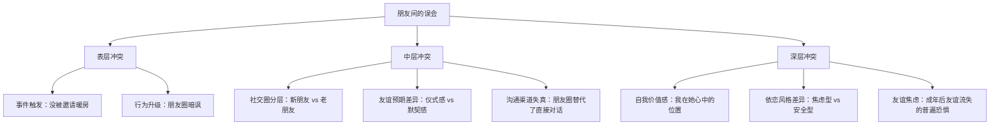
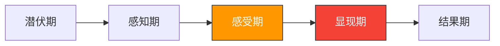
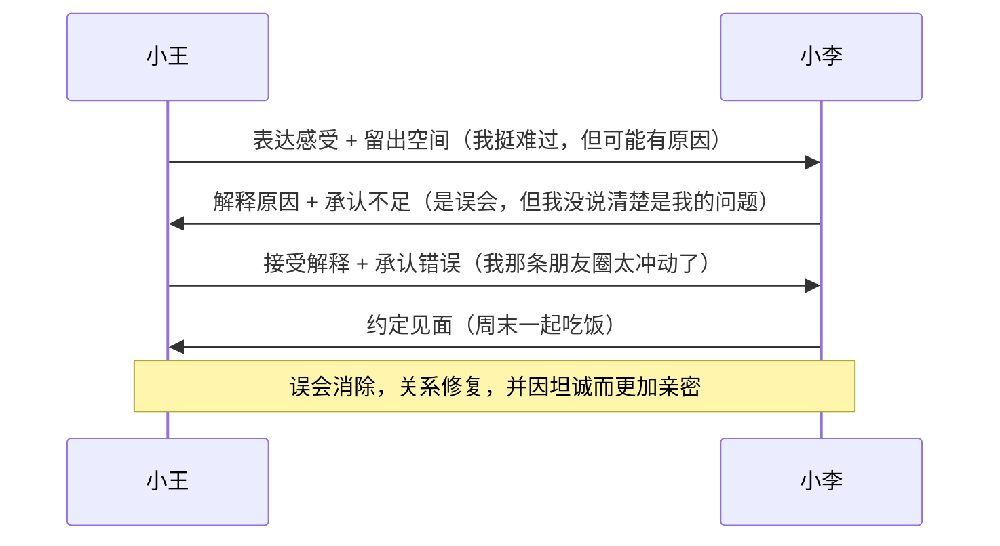
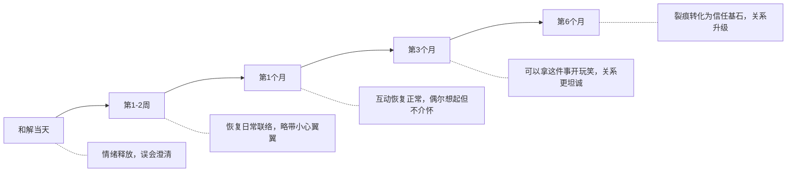
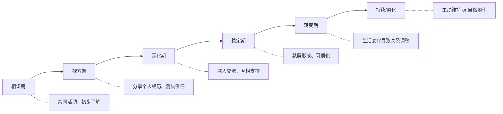

## 案例六：朋友之间的误会——社交媒体时代最隐蔽的友谊杀手

友谊中的误会，是所有冲突类型中最容易被低估的一种。它不像职场冲突有制度兜底，不像家庭冲突有血缘维系，不像商业冲突有合同约束。友谊是纯粹自愿的关系——正因如此，误会带来的伤害往往更深，因为它动摇的不是角色或义务，而是"你是否真的在乎我"这个根本问题。在社交媒体时代，误会的产生速度和传播范围被指数级放大，一条朋友圈、一个截图、一次"仅三天可见"，都可能成为友谊破裂的导火索。本案例将完整呈现一次因社交圈分层导致的误会如何发生、如何发酵、如何修复，以及如何建立长效的友谊维护机制。

### 场景全景

**人物背景**

小王和小李是大学同学，同寝室四年，曾一起考研、一起失恋、一起熬夜赶毕业论文。毕业后两人留在同一个城市工作，虽然各自有了新的社交圈，但每隔一两个月都会约饭、聊天，保持着"虽然不常见面但心里有位置"的关系。小王性格细腻敏感，重视仪式感，特别在意朋友是否记得自己；小李性格随和务实，认为真正的友谊不需要刻意维护，"心里有就行"。

**事件经过**

小李最近搬了新家，邀请了几个朋友来暖房聚会。她邀请的是同一个小区的几位邻居和同事——因为这些人平时一起遛狗、拼车、取快递，来往频繁，暖房聚会更像是"顺便请大家来坐坐"。小李没有邀请小王，一方面觉得小王住得远（地铁要转两趟，单程一个半小时），来了也只是吃顿饭就得走；另一方面打算过两周单独约小王吃饭庆祝。

小王对此一无所知。她在刷朋友圈时，无意间看到小李发了一组暖房聚会的照片——几个人围着火锅举杯，背景是小李精心布置的新家客厅，配文是"新家第一顿饭，和最爱的人们"。小王的心一下子沉了下去。

她的第一反应是："最爱的人们？那我是谁？"

接下来的一个小时里，小王反复翻看那条朋友圈的每一张照片，辨认照片里的每一个人——有小李的同事张姐、邻居刘哥、还有小李的健身搭子陈姐。没有一个她认识的人。这让她更加难受："原来她有这么多我不知道的朋友，我在她的生活里根本不算什么。"

**心理独白对比**：

| 时间 | 小王的内心想法 | 小李的真实想法 |
|------|---------------|---------------|
| 看到照片时 | "她搬新家居然不告诉我" | "小王住太远了，改天单独请她" |
| 辨认照片后 | "她有新的朋友圈了，我不重要了" | "邻居和同事来暖房很方便" |
| 看到配文后 | "'最爱的人们'？我不是其中之一" | "随手写的文案，没想太多" |
| 当晚 | "她是不是故意疏远我？" | "改天约小王吃饭，发个新家地址给她" |
| 临睡前 | "算了，这种朋友不值得在乎" | "小王应该睡了吧，明天再联系她" |

两个人的想法从未交叉过——信息不对称已经形成。

**冲突爆发**

当晚，小王情绪上头，发了一条朋友圈："'有些人真是用完就丢，不过也正常，人往高处走嘛。'"

没有点名，但小李一眼就看出来是说自己的。她既生气又困惑："我怎么就用完就丢她了？暖房请的是邻居和同事，怎么就扯到'人往高处走'了？"她觉得小王不问清楚就在朋友圈阴阳怪气，简直不可理喻。

小李没有回复那条朋友圈，也没有私下联系小王。她选择了沉默——不是因为不在乎，而是因为愤怒："你都不问问我为什么，就直接给我定罪？"

小王看到小李没有反应，更加确信了自己的判断："她心虚了，连解释都不想解释。"

两人开始冷战。共同的朋友圈里，以前互相点赞评论的互动完全消失了。几个共同朋友隐约察觉到气氛不对，但谁也没主动介入。

### 冲突深层分析

#### 冲突类型识别

这个案例表面是一次"没被邀请"的委屈，但深层交织着多重冲突：



| 冲突层次 | 具体表现 | 严重程度 | 修复难度 |
|----------|---------|----------|----------|
| 事件冲突 | 没被邀请暖房聚会 | ★★☆☆☆ | 低——解释清楚即可 |
| 认知冲突 | "没邀请=不重视"的自动推理 | ★★★☆☆ | 中——需要认知重构 |
| 情感冲突 | 被排除的痛苦、被轻视的愤怒 | ★★★★☆ | 高——需要情感验证和修复 |
| 关系冲突 | 对友谊价值和自身位置的怀疑 | ★★★★★ | 高——需要重建信任和安全感 |
| 公开化冲突 | 朋友圈暗讽造成的社交尴尬 | ★★★★☆ | 高——需要双方面子修复 |

#### 误会产生的心理学机制

**机制一：归属需求威胁（Belongingness Threat）**

心理学家Baumeister和Leary（1995）提出的"归属需求"理论指出，人类有强烈的、普遍的、基本的需要——与他人建立和维持至少最低数量的持久、积极、重要的人际关系。当这种需求受到威胁时，人的反应强度与实际的生理威胁相当。

小王看到暖房照片时的感受，本质上是归属感受到了威胁。她不是在计较"一顿饭"，而是在恐惧"我是否还属于这个人的生活"。这种恐惧是深层的、本能的，不受理智控制。

**机制二：消极归因偏差（Negative Attribution Bias）**

当人处于情绪低落或关系不安全感中时，倾向于将模糊信息往最坏的方向解读。心理学中称之为"归因偏差"——同样的事件，在不同情绪状态下会被赋予完全不同的意义。

小王在正常状态下，完全可能想到"小李可能是就近请的邻居"。但当她带着"被忽略"的初始情绪去看那条朋友圈时，大脑自动进入了"威胁搜索"模式，只收集支持"她不在乎我"这一结论的证据，自动过滤掉所有反面信息。

归因偏差的运作过程：

触发事件 → 情绪激活 → 认知框架形成 → 选择性注意 → 证据收集偏差 → 结论强化
（看到照片）  （受伤）  （她不在乎我）  （只看到新朋友）  （忽略了住得远的可能）  （确信被抛弃）

正常状态下：
触发事件 → 多元假设 → 主动验证 → 合理结论
（看到照片）  （可能有多种原因）  （问问怎么回事）  （了解真相后释然）

**机制三：社交媒体的"剧场效应"**

朋友圈是一个精心策展的舞台——人们只展示最好的时刻、最好的角度、最好的朋友。当小王看到那组暖房照片时，她看到的是一个被精心剪辑过的"精彩片段"，而不是小李生活的全部真相。她不知道的是：小李平时周末经常一个人在家吃外卖；暖房聚会结束后大家都在收拾碗筷、擦桌子，并不像照片里那么光鲜；小李在发朋友圈时根本没想那么多，只是随手选了几张好看的。

社交媒体制造了一种幻觉——别人的生活比你的精彩，别人的朋友比你重要，别人的圈子你融不进去。这种幻觉对友谊的杀伤力是隐蔽但巨大的。

**机制四：友谊的"排他性预期"**

部分人（尤其是依恋风格偏焦虑型的人）对友谊存在隐性的"排他性预期"——虽然他们不会明确说出来，但内心默认"最好的朋友应该只有一两个，我应该是其中之一"。当看到好友与其他人的亲密互动时，这种预期被激活，产生类似"第三者的嫉妒"——虽然不是爱情，但底层的不安全感是相似的。

小王的内心逻辑链是："你请了别人来你家 = 你和她们比和我更亲近 = 我不是你最好的朋友 = 我在你心里不重要 = 这段友谊对我不公平。"这条逻辑链中的每一个跳跃都缺乏证据，但在情绪驱动下，每一个跳跃都感觉顺理成章。

**机制五：中国式友谊中的"面子"与"人情"双重压力**

在中国社会文化语境下，友谊误会还叠加了两个独特的心理负担：

**面子机制**：小王在朋友圈看到暖房照片后，不仅仅感到"被忽略"，还感到"丢面子"——"她在朋友圈公开展示了她的社交圈，而我不在其中，这等于在所有人面前宣告我不重要。"面子的伤害是公开性的、社会性的，它比私下里的情感伤害更难忍受，因为它涉及第三方的看法。这就是为什么小王选择在朋友圈"反击"——她试图在同一个公开场域里挽回面子，让"大家"看到她不是被抛弃的那个。

**人情账本**：中国文化中的友谊往往隐含着一套"人情往来"的潜规则。"你搬家我随了份子""你生日我发了红包""你生病我去看你"——这些都被记在心里的"人情账本"上。当小王看到暖房照片时，她的潜意识里可能在翻阅这本账本："我为这段友谊付出了这么多，你连暖房都不叫我？"这种"不对等感"在中国式友谊中的杀伤力远大于西方文化中的同类事件，因为中国的友谊承载着更重的互惠义务。

**面子与人情的叠加效应**：面子受损 + 人情不对等 = 双倍的心理冲击。这就是为什么一个"没被邀请"的小事，能引发如此剧烈的情绪反应。在纯粹西方心理学框架下可能显得"反应过度"的案例，在中国文化语境下完全合理。

#### 冲突阶段判定



这场冲突经历了两个快速的阶段跃迁：

1. **潜伏期→感知期**（瞬间完成）：小王看到照片的那一刻，从"不知道有聚会"跃迁到"我知道了，但我没被邀请"。信息不对称在一瞬间被打破。

2. **感知期→感受期**（几小时内）：小王从"没被邀请"这个事实，快速跃迁到"我被冷落了、我不重要了"的强烈情绪反应。这个跃迁之所以如此快速，是因为它激活了小王内心深处的归属焦虑。

3. **感受期→显现期**（当晚）：小王没有选择私下沟通，而是直接在朋友圈发暗讽——这是从内部感受向外部行为的跃迁。一旦冲突被公开化，修复难度大幅上升，因为现在不仅涉及两个人的感受，还涉及社交面子。

4. **危险信号**：冲突已经处于显现期早期。如果一周内没有干预，可能进入结果期——双方在固化的叙事中越陷越深（"她不在乎我"/"她无理取闹"），关系修复难度呈指数级上升。

#### 为什么友谊误会比其他冲突更难处理？

| 维度 | 职场冲突 | 家庭冲突 | 友谊冲突 |
|------|----------|----------|----------|
| 关系约束 | 制度强制（必须共事） | 血缘不可切断 | 完全自愿（说断就断） |
| 退出成本 | 高（换工作成本大） | 极高（无法换家庭） | 低（"大不了不做朋友了"） |
| 沟通渠道 | 正式渠道多（HR、会议） | 日常接触多 | 依赖主动联络 |
| 公开程度 | 有专业边界 | 有家庭框架 | 无任何保护结构 |
| 修复动力 | 职业需求驱动 | 情感义务驱动 | 仅靠个人意愿 |
| 误会产生速度 | 较慢（有正式沟通机制） | 较慢（日常接触多） | 快（依赖碎片化信息） |
| 误会发酵速度 | 中等（有制度干预） | 中等（有家庭调解） | 快（缺乏第三方介入） |

友谊的脆弱性在于：它是唯一一种"没有任何外力约束"的亲密关系。正因如此，友谊中的误会如果没有被主动修复，往往会以"渐行渐远"的方式自然消亡——不是因为不重要，而是因为没有人觉得自己"有责任"去修复。

### 自我诊断工具：你的友谊误会处于哪个阶段？

在阅读后续处理策略之前，先用以下工具评估你当前所处的情况。这个诊断表可以帮助你判断误会的严重程度，从而选择对应的处理策略。

```text
【友谊误会自测问卷】

请根据你的实际情况打分（1-5分，1=完全不符合，5=完全符合）：

A. 信息层面
  1. 我是从社交媒体（而非当事人）得知让我不舒服的事件           ___分
  2. 我不确定对方行为的真实原因，有很多猜测                      ___分
  3. 我没有直接向当事人求证                                      ___分
  A小计：___分（满分15分）

B. 情绪层面
  4. 这件事让我反复回想，超过3天仍在心里过不去                    ___分
  5. 我在社交媒体上发布了含沙射影的内容                           ___分
  6. 我对这段友谊的整体价值产生了怀疑                             ___分
  B小计：___分（满分15分）

C. 行为层面
  7. 我和对方已经有一周以上没有任何互动                           ___分
  8. 我主动回避了对方（不点赞、不回复、不联系）                   ___分
  9. 共同朋友已经察觉到我们之间的异常                             ___分
  C小计：___分（满分15分）

总分评估：
  9-15分 → 绿灯区：误会萌芽期，直接沟通即可化解（参见"第二阶段"）
  16-27分 → 黄灯区：误会发酵期，需要策略性介入（参见"第一阶段+第二阶段"）
  28-36分 → 橙灯区：冲突升级期，需要第三方调解（参见"第一阶段"完整方案）
  37-45分 → 红灯区：关系危机期，需要深度修复（参见全部四个阶段）
```

**解读指南**：A分高说明误会的根源是信息不对称——你还不了解真相，处理重点是"获取信息"；B分高说明情绪已经占据主导——你的判断很可能被情绪扭曲了，处理重点是"先平复情绪再沟通"；C分高说明误会已经开始外化为行为——双方进入了冷战或对抗模式，处理重点是"打破僵局"。

### 处理策略：从破冰到深层修复的四阶段方案

#### 第一阶段：中立第三方的信息桥梁作用

**为什么需要第三方？**

在本案例中，小王和小李陷入了经典的"双向防御僵局"：
- 小王认为"她心虚了，所以不解释"——任何来自小李的主动联系都会被解读为"被我说中了才来道歉"
- 小李认为"她不问清楚就公开阴阳怪气"——主动联系小王感觉像是"向无理取闹低头"

双方都在等对方先迈出一步，但双方都认为"先动的人就是认错的人"。这种僵局在缺乏第三方介入的情况下，可能会持续数周甚至数月，直到其中一方放弃这段友谊。

**共同朋友小赵的介入**

小赵和两人都有交集，是理想的调解人。小赵的介入需要遵循以下原则：

**介入原则**：

| 原则 | 具体做法 | 为什么重要 |
|------|---------|-----------|
| 先分别了解，不传话 | 分别与两人私下聊天，了解各自的视角和感受 | 避免信息在传递过程中被扭曲或选择性呈现 |
| 不评判对错 | "我理解你的感受"而非"你也有不对的地方" | 过早评判会让被评判方关闭沟通意愿 |
| 澄清事实但不替人做决定 | 告诉小王"小李邀请的都是小区邻居"，但不催她"你应该去道歉" | 尊重当事人的自主权，避免第三方"越位" |
| 创造沟通条件而非替代沟通 | "你要不要直接和小李聊聊？"而非"我帮你转达" | 真正的修复必须发生在当事人之间 |

**小赵与小王的对话**：

小赵约小王喝咖啡，以关心的口吻切入：

> 小赵："看你们最近好像不太愉快？"
> 小王："你也看到了那条朋友圈？小李暖房不请我，我算什么朋友。"
> 小赵："我理解你的感受，换我我也会难过。不过我之前听小李提过一嘴，她暖房请的好像都是小区里的人，她觉得你住太远了，打算另外单独约你。"
> 小王："……她这么说了？"
> 小赵："嗯，她说准备过两周单独请你吃饭。你那天发的那条朋友圈，我看小李好像也挺受伤的。"
> 小王："……我确实没问她原因就发了。"

这段对话中小赵做了三件关键的事：
1. **先共情**："我理解你的感受"——让小王感到被理解，降低防御
2. **提供新信息**："她请的都是小区里的人"——打破小王原有的归因框架
3. **指出后果但不施压**："小李也挺受伤的"——让小王意识到自己行为的影响，但不是指责

**小赵与小李的对话**：

> 小赵："小王那条朋友圈，我知道你肯定不开心。但她确实不知道你为什么不邀请她，她以为你故意不叫她。"
> 小李："那她也应该先问问我啊！"
> 小赵："你说得对，她确实应该先问。但她那个性格你也知道，心思重、怕被拒绝，有时候宁愿自己难受也不好意思直接问。你俩认识这么多年了，她是真在乎你才会那么难受。"
> 小李："……我确实没想到她会这么在意。"
> 小赵："你要不要主动和她聊聊？你一解释她就明白了。"

小赵在这里同样做了三件事：
1. **认可小李的感受**："你肯定不开心"——让小李觉得自己的委屈被看见
2. **解释小王的行为逻辑**："心思重、怕被拒绝"——不是替小王辩护，而是帮小李理解
3. **引导行动但不强迫**："你要不要主动聊聊？"——把选择权交给小李

**第三方介入的时机和边界**：

```text
【第三方介入的黄金规则】

✅ 应该做的：
- 分别倾听，理解双方的视角和感受
- 澄清事实层面的信息不对称
- 引导双方直接沟通
- 在双方都有沟通意愿时撮合

❌ 不应该做的：
- 替任何一方传话（容易被扭曲）
- 评判谁对谁错（会失去双方信任）
- 在一方不同意的情况下向另一方透露其私密想法
- 代替当事人做决定（"你应该原谅她"）
- 在两人之间来回传话成为"中间商"（信息损耗和失真）

⚠️ 不适合介入的情况：
- 你和其中一方的关系明显更近（会被认为"站队"）
- 其中一方明确表示不想让你参与
- 冲突涉及深层的价值观分歧（非误会层面的问题）
- 你自己的情绪也被卷入了（需要先处理自己的情绪）
```

**如何选择合适的调解人？**

不是所有共同朋友都适合做调解人。理想的调解人需要满足以下条件：

| 条件 | 说明 | 反例 |
|------|------|------|
| 与双方关系均衡 | 和两人都有差不多的亲密度 | 如果明显和一方更铁，另一方会觉得被"联合审判" |
| 性格沉稳、口风紧 | 不会把调解过程八卦出去 | 如果是"消息中转站"型人格，会让当事人更警惕 |
| 有调解意愿 | 愿意花时间精力介入 | 如果是被"拉壮丁"，效果会很差 |
| 了解双方性格 | 知道怎么和每个人沟通 | 如果不了解其中一方的敏感点，可能帮倒忙 |
| 能保持中立 | 不预设立场 | 如果内心已经认为"肯定是XX的错"，调解会变成审判 |

#### 第二阶段：引导直接沟通——"我"陈述法在友谊修复中的应用

在小赵的铺垫之后，小王鼓起勇气给小李发了一条消息：

> "小李，上次你暖房没邀请我，说实话我挺难过的，觉得你是不是不把我当朋友了。但我后来想想，可能有什么原因我不知道。你方便和我聊聊吗？"

这段话是友谊冲突修复中非常出色的"破冰模板"，值得逐句拆解：

| 句子 | 功能 | 心理机制 | 效果 |
|------|------|----------|------|
| "上次你暖房没邀请我" | 陈述事实 | 客观、不含攻击性 | 引入话题，没有扭曲或夸大 |
| "说实话我挺难过的" | 表达感受 | "我"陈述法的核心——谈自己的感受而非指责对方 | 降低对方的防御反应 |
| "觉得你是不是不把我当朋友了" | 表达脆弱 | 脆弱性展示——承认自己在关系中的不安全感 | 激发对方的共情和保护欲 |
| "但我后来想想" | 展示反思 | 表明自己也在努力理解，不是单方面定罪 | 让对方看到沟通的诚意 |
| "可能有什么原因我不知道" | 留出空间 | 给对方解释的机会，预设了"事情可能有另一面" | 邀请对方参与真相的澄清 |
| "你方便和我聊聊吗" | 发出邀请 | 而非要求——尊重对方的自主权 | 把沟通变成双向选择 |

**"我"陈述法的通用公式与变体**：

"我"陈述法不只是"说'我觉得'"那么简单，它有一个清晰的结构公式。掌握这个公式，可以在任何友谊冲突中使用：

```text
【"我"陈述法公式】

基本结构：当你____（具体行为）时，我感到____（情绪），因为____（需求/在意的点）。

示例库：

场景1：朋友聚会没叫你
"当你没有邀请我参加聚会时，我感到被忽略了，因为我很在意我们的友谊，怕自己在你心里不重要了。"

场景2：朋友在社交媒体上和别人互动但不理你
"当我看到你给别人点赞但没回我消息时，我感到有点失落，因为我把你的回复看得很重要。"

场景3：朋友取消了约定的计划
"当你临时取消我们约好的见面时，我感到失望，因为我很期待这次见面，也为此调整了安排。"

场景4：朋友把你的秘密告诉了别人
"当我得知你把那件事告诉了其他人时，我感到受伤和不安，因为我把那份信任交给了你。"

场景5：朋友总是在你面前夸另一个朋友
"当你经常提到XX多好的时候，我感到有点不安，因为我担心自己在你心中的位置。"
```

**"我"陈述法 vs "你"陈述法对比**：

| "你"陈述法（攻击性） | "我"陈述法（修复性） | 效果差异 |
|---------------------|---------------------|---------|
| "你为什么不邀请我？" | "没被邀请我挺难过的" | 前者触发防御，后者触发共情 |
| "你在朋友圈发那些什么意思？" | "看到那些照片我心里不好受" | 前者要求解释，后者分享感受 |
| "你根本不把我当朋友" | "我觉得自己在你心里不重要了" | 前者是定罪，后者是自我暴露 |
| "你有新朋友就不要老朋友了" | "我怕我们渐行渐远了" | 前者是指控，后者是恐惧的表达 |

**如果消息发送后对方没有回应怎么办？**

不要连续发消息追问。等待24-48小时，如果仍无回应，可以发一条简短的跟进：

> "我之前发的消息你看到了吗？不管你怎么想，我都尊重你。我就是想把话说开，不想我们因为误会伤了感情。"

如果仍无回应，则暂时停止主动联系。这时候需要接受一个现实：**修复需要双方的意愿，单方面无法完成**。保持开放但不纠缠，等待对方的情绪软化。

**不同沟通渠道的选择策略**：

| 渠道 | 适用场景 | 优势 | 劣势 |
|------|---------|------|------|
| 面对面 | 严重误会、需要深度沟通 | 信息最完整（语气、表情、肢体语言） | 需要双方都有见面的意愿和时间 |
| 语音/视频电话 | 中等严重度的误会 | 传递语气和情绪，比文字更真实 | 比面对面少表情和肢体语言信息 |
| 微信/短信长文 | 初始破冰、对方不愿接电话时 | 给双方思考时间，可反复修改 | 容易被误读语气，缺乏即时反馈 |
| 语音消息 | 对方不愿打电话但愿意沟通时 | 传递语气，对方可反复听 | 对方可能没耐心听完长语音 |
| 朋友圈/社交媒体 | **绝不适用于冲突沟通** | 无 | 公开化、不可控、堵死退路 |

**关键原则**：越严重的误会，越需要使用信息密度高的渠道。文字聊天是信息密度最低的渠道——没有语气、没有表情、没有停顿，一个句号都可能被误读为"冷漠"。如果可能，尽量升级到电话或见面。

#### 第三阶段：解释与和解——真相时刻的沟通艺术

小李看到小王的消息后，马上打了电话过来：

> "小王，天大的误会！暖房那天请的都是小区里的朋友，我怕你大老远跑过来太辛苦，就想着另外单独请你吃饭。没想到你这么在意，更没想到你会看到朋友圈。我没及时跟你说清楚是我的问题，真的抱歉。"

这段回应同样值得拆解：

| 句子 | 功能 | 分析 |
|------|------|------|
| "天大的误会" | 定性——这不是一方的错，是误会 | 避免把问题归咎于任何一方 |
| "请的都是小区里的朋友" | 澄清事实 | 打破小王"被排除在外"的认知框架 |
| "怕你大老远跑过来太辛苦" | 解释动机 | 关键——动机是体贴而非轻视 |
| "另外单独请你吃饭" | 说明计划 | 证明小王不仅没有被遗忘，反而被特殊对待 |
| "没想到你这么在意" | 承认信息不对称 | 承认自己低估了事件对小王的影响 |
| "是我的问题" | 承担责任 | 为自己没有及时沟通而道歉 |

小王的回应同样精彩：

> "原来是这样……那我那条朋友圈发得也太冲动了，我也向你道歉。"

**和解对话的深层结构分析**



和解之所以成功，是因为双方都做了两个关键动作：
1. **先理解对方，再为自己辩护**：小李没有先质问"你为什么发那条朋友圈"，而是先解释了误会的原因。小王没有纠结"那你为什么不提前告诉我"，而是承认了自己发朋友圈太冲动。
2. **各自承担一部分责任**：小李承担了"没及时沟通"的责任，小王承担了"没搞清楚就发朋友圈"的责任。没有人是完全正确的，也没有人是完全错误的——这才是真实的人际关系。

**和解过程中常见的"翻车"场景及应对**：

即使双方都愿意沟通，和解过程中仍有一些容易踩的坑：

| 翻车场景 | 典型表现 | 应对方式 |
|---------|---------|---------|
| 解释变质询 | "那你为什么不提前告诉我一声？" | 把质询转化为需求表达："以后遇到类似情况，提前告诉我我会很开心" |
| 道道变推责 | "我也道歉了，但你也有问题" | 用"同时"代替"但是"："我接受你的道歉，同时我也为我的部分道歉" |
| 旧账翻出 | "你上次也是这样……" | 当场制止："我们先解决这次的事，其他的以后再说" |
| 过度自责 | "都是我的错，我太敏感了" | 对方需要回应："你不是敏感，你的感受是真实的，我没考虑到是我的问题" |
| 假性和解 | "好好好，算了吧" | 检查是否真的释然："你真的没不舒服了吗？我不想你压着不说" |
| 朋友圈善后 | 和好后发朋友圈"冰释前嫌" | 保持低调——这是两个人的事，不需要向全世界宣布 |

**道歉的语言艺术——中文语境下的微妙差异**：

在中国文化中，道歉不仅仅是"对不起"三个字。不同程度的误会需要不同层次的道歉语言：

```text
【道歉的五个层次——从轻到重】

第一层：解释型道歉
"不好意思啊，那天没叫你是怕你跑太远。"
→ 适用：误会很轻，对方只是稍微不舒服
→ 特点：解释 > 道歉，重点在澄清事实

第二层：承认型道歉
"这件事是我考虑不周，没提前跟你说清楚，抱歉。"
→ 适用：中等程度的误会，对方确实受到了伤害
→ 特点：承认自己的疏忽，但不过度自责

第三层：共情型道歉
"我知道你看到那条朋友圈一定很难受，是我没顾及到你的感受，真的很对不起。"
→ 适用：对方情绪反应较大，需要被理解和安慰
→ 特点：先共情再道歉，让对方感到"被看见"

第四层：承诺型道歉
"以后遇到这种情况我一定提前告诉你，不会再让你从朋友圈知道了。"
→ 适用：误会暴露了关系中的结构性问题
→ 特点：不仅道歉，还给出具体的行为承诺

第五层：深层道歉
"我反思了一下，不只是这次的事，我平时确实不够主动联系你，让你觉得不被重视。这是我的问题。"
→ 适用：误会只是导火索，背后有长期积累的不满
→ 特点：超越具体事件，触及关系层面的反思

⚠️ 注意：道歉的层次应该匹配误会的严重程度。轻度过误会用第五层道歉，反而会让对方觉得"你是不是做了更过分的事我不知道"；重度过误会用第一层道歉，会让对方觉得你在敷衍。
```

#### 第四阶段：关系重建——从"修复裂痕"到"升级连接"

误会消除不等于关系自动回到从前。研究表明，经历过冲突并成功修复的关系，如果处理得当，可以比冲突前更加强韧——心理学家称之为"**创伤后成长**"（Post-Traumatic Growth）在人际关系中的体现。但这个"升级"不会自动发生，需要双方有意识地在修复后进行关系重建。

**周末聚餐中的关键对话**

两人约了周末吃饭。这顿饭不仅是"和好饭"，更是一次深化友谊的机会。建议在气氛融洽之后，进行以下对话：

**对话一：建立沟通预期**

> 小王："以后如果你有事不方便邀请我，提前和我说一声就行。我不怕你不请我，我怕你连说都不和我说。"
> 小李："好，以后我也多注意。你也一样，有什么不开心的直接跟我说，别发朋友圈了，哈哈。"

这段对话的价值在于：把"这次的误会"转化为"未来的行为准则"。不是抽象的承诺，而是具体的、可执行的约定。

**对话二：确认友谊的定义**

> 小王："说实话，我那会儿看到照片的时候，真的觉得你不把我当朋友了。"
> 小李："怎么会呢？你是我最重要的朋友之一。我这人就是这样，不太会主动表达，但心里一直有你。"

这段对话的重要性在于：双方明确表达了对彼此的重要性。很多人在友谊中默认"心照不宣"，但误会之所以产生，恰恰就是因为有些话没有被说出来。在安全的环境下明确表达"你对我很重要"，是预防未来误会的最有效方式。

**对话三：制定"友谊维护协议"**

这不是开玩笑——朋友之间约定一些基本的沟通规则，可以显著降低未来误会的概率：

```text
【友谊维护协议（非正式版）】

1. 不搞"猜心"游戏：有什么直接说，不期待对方能"猜到"
2. 社交媒体不是沟通工具：重要的话发消息或打电话，不在朋友圈发暗讽
3. "不好意思"说出口：做不到的事直接说，不勉强自己然后积攒怨气
4. 定期"充值"：再忙也要每个月至少见一次面或深度聊一次
5. 新朋友不替代老朋友：引入新社交圈时主动分享，让对方不会感到被"更新换代"
6. 误会不过夜：感到不舒服时24小时内沟通，不冷处理
7. 朋友圈边界：涉及对方的内容发布前先打招呼，特别是聚会类内容
8. 已读不回的默契：忙的时候可以不立刻回复，但超过24小时要说明原因
9. 年度"友谊复盘"：每年找个机会聊聊这一年彼此的感受和期待
10. 吵架不公开：任何不满只在两人之间解决，不拉第三方"站队"
```

**关系重建的时间线**：

误会修复后，关系的重建是一个渐进过程，不可能一夜之间恢复如初。以下是一个参考时间线：



**关键提示**：在第1-2周内，双方可能会有些"小心翼翼"——发消息前会多想一下、互动时会稍微客气一些。这是正常的过渡期，不要把它误读为"关系回不到从前了"。随着时间推移和积极互动的积累，这种小心翼翼会自然消退。

### 社交媒体时代的友谊冲突专题

#### 社交媒体如何制造误会

社交媒体不是友谊冲突的根本原因，但它是一个强大的"误会放大器"。以下是常见的社交媒体误会产生机制：

| 社交媒体行为 | 触发的误会 | 背后的心理机制 |
|-------------|-----------|---------------|
| 发聚会照片没@你 | "她不想让别人知道她认识我" | 归属感受威胁 |
| 给别人点赞不给你点 | "她在故意冷落我" | 社交比较焦虑 |
| 看了你消息不回 | "她不重视你" | 即时期望vs实际节奏差异 |
| 朋友圈"仅三天可见" | "她不想让你看她的生活" | 隐私需求vs亲近需求冲突 |
| 发了一条模糊的状态 | "她在说你" | 对号入座心理 |
| 取消关注或屏蔽 | "友谊结束了" | 社交信号的过度解读 |

**社交媒体误会的核心矛盾**：人们在社交媒体上发出的信号是模糊的、多义的，但接收者倾向于以最个人化、最消极的方式解读。这是因为人类的注意力系统对"威胁"信号的敏感度远高于"安全"信号——这是进化留下的生存本能，在社交媒体环境中容易过度激活。

#### 即时通讯工具中的误会陷阱

社交媒体之外，日常的微信/QQ聊天同样是误会的重灾区。文字沟通丢失了93%的非语言信息（Albert Mehrabian的研究数据——55%肢体语言+38%语调，仅7%来自文字本身），这使得文字消息极易被误读。

| 聊天行为 | 可能的误读 | 实际可能的原因 |
|---------|-----------|--------------|
| 回复"嗯"或"哦" | "她敷衍我/不高兴了" | 可能在忙、手机打字不方便、性格就这样 |
| 已读不回 | "她不想理我" | 可能看了但忘了回、在想要怎么回、被其他事打断 |
| 回复速度突然变慢 | "她对我不上心了" | 工作忙、手机不在身边、状态不好不想聊天 |
| 突然不发表情包了 | "她态度变冷了" | 可能只是换了一种表达习惯 |
| 语音消息变长 | "她不耐烦了/在敷衍" | 可能是事情复杂说不清楚，觉得语音更高效 |
| 群里活跃但私聊冷淡 | "她更喜欢和其他人玩" | 可能群聊是轻松的社交，私聊需要更多精力 |
| 发了朋友圈但没回你消息 | "她宁愿发动态也不回我" | 可能发朋友圈是随手的，回复你的消息需要认真思考 |

**文字聊天的"语气投射"效应**：当你对一段关系感到不安时，你会把自己想象的"对方语气"投射到文字消息上。同一句"好的"，在你心情好的时候读出来是"友好的确认"，在你心情不好的时候读出来就是"冷漠的敷衍"。消息的语气是读者自己赋予的，不是发送者决定的——认识到这一点，是避免聊天误会的第一步。

**实操建议**：

```text
【微信聊天防误会清单】

1. 重要或敏感的话题：打电话或见面，不要用文字
2. 文字消息发出前自检：如果对方心情不好来读这句话，会不会被误解？
3. 收到让自己不舒服的消息：先假设善意，打电话确认，不要在心里"审判"
4. 忙的时候：发一句"在忙，晚点回你"比已读不回好一万倍
5. 用表情包/emoji调节语气：一个"哈哈"或"😂"可以消除文字的冰冷感
6. 长消息分段发：大段文字容易被跳读，重点信息可能被忽略
7. 避免深夜发敏感消息：凌晨的情绪容易极端化，消息也容易被极端化解读
```

#### 处理社交媒体引发的友谊冲突的五条铁律

**铁律一：朋友圈不是沟通工具**

任何涉及具体人和事的不满，都不应该通过朋友圈来表达。朋友圈的传播范围不可控（你以为只是"暗示"，但所有人都能看见），而且是单向的（对方无法在同一个渠道回应和澄清）。

正确做法：感到不满时，先冷静至少24小时，然后直接发私信或打电话。

**铁律二：看到社交媒体上的"可疑信号"时，先假设善意**

"她发了和别人的合照没发和我的"——可能有一百种原因（照片不好看、当时没合影、照片太多没选到），"她不在乎我"只是第一百零一种。在没有直接证据之前，默认选择对关系伤害最小的假设。

**铁律三：不要在社交媒体上"惩罚"对方**

有些人会通过"不再点赞""取关""发暗讽"等方式来"惩罚"对方——这本质上是一种被动攻击行为。它不能解决问题，反而会把误会升级为冲突。

**铁律四：社交媒体上的"亲密展示"不代表真实的友谊深度**

朋友圈里的合照、生日祝福、表白式的文案——这些是"表演性亲密"，不等于真正的友谊深度。真正深厚的友谊往往是在不发朋友圈的深夜电话、生病时送来的药、失恋时默默陪伴中体现的。

**铁律五：定期进行"社交媒体断食"**

每隔一段时间（比如一个月），暂停使用社交媒体来"了解"朋友的近况，改为直接联系——打电话、发消息、见面。社交媒体给我们的是一种"了解的幻觉"——你觉得自己知道朋友在做什么，但你不知道她的感受、她的烦恼、她的真实生活状态。

### 常见误区与纠正

#### 误区一："既然你不邀请我，说明我不重要"

**错误逻辑**：将单一事件等同于对方对自己的整体评价。

**纠正方法**：区分"行为"和"意图"，区分"一次事件"和"整体模式"。一次没被邀请，可能是疏忽、可能是体谅、可能是误会；但如果连续多次、持续性地被排除在外，那才需要认真评估这段友谊。

具体操作——"三次验证法"：

```text
当你感到被朋友冷落时，问自己三个问题：

1. 这是第一次发生，还是反复发生？→ 单次事件大概率是误会
2. 有没有其他可能的解释？→ 至少想到3种非恶意的解释
3. 如果角色互换，我会怎么做？→ 帮助理解对方的立场

只有当三个问题的答案都是负面的时，才需要正视这段友谊的问题。
```

#### 误区二："她应该知道我会难过"

**错误假设**：对方能够预测你的所有情感反应。

**现实**：每个人的情感敏感点不同。小王对"被排除在外"特别敏感，但小李可能完全不会觉得"没被邀请一次聚会"是什么大事。期待对方"应该知道"是一种认知陷阱——心理学称之为"透明度错觉"（illusion of transparency），即高估他人对自己内心状态的感知能力。

**纠正方法**：不要假设对方知道你的感受，明确表达出来。"我挺在意你暖房没请我"这句话，比发一条朋友圈暗讽有效一万倍。

#### 误区三：在社交媒体上发泄情绪

**错误行为**：在朋友圈、微博等公开平台发布含沙射影的内容。

**为什么这是最糟糕的做法**：

1. **不可撤回的公开化**：一旦发出，即使删除，截图可能已经被传播。冲突从"两个人的事"变成了"所有人的谈资"。
2. **堵死了退路**：如果最终发现是误会，你在朋友圈发的那些话会变成修复关系的最大障碍——因为面子问题。
3. **引发更大的误会**：对方可能觉得你不是在"暗示"，而是在"公开指控"，反应会远比私下沟通激烈。
4. **第三方站队**：看到朋友圈的其他朋友可能被拉入冲突，形成不必要的对立阵营。
5. **留下永久记录**：即使删除，可能已经被截图。在中国社交媒体环境中，"截图存档"是一种普遍行为，任何公开发布的内容都可能在未来的某个时刻被翻出来。

**纠正方法**：感到愤怒或委屈时，使用"24小时冷却+书写宣泄法"：

```text
步骤一：打开手机备忘录（不是朋友圈）
步骤二：把所有想说的话一字不漏地写下来——可以骂人、可以哭、可以写任何话
步骤三：保存，不做任何操作
步骤四：24小时后重新阅读
步骤五：如果仍然觉得需要表达，转换为直接沟通的形式（私信或电话）

关键原则：写下来的是宣泄，说出来的是沟通。宣泄是单向的，沟通是双向的。
```

#### 误区四："真正的友谊不需要维护"

**错误想法**：真朋友不需要刻意维护，"心里有就行"。

**问题所在**：这种想法看似洒脱，实则是一种关系中的懒惰。心理学研究表明，所有的人际关系——包括最亲密的关系——都需要持续的投入才能维持。这叫做"关系的银行账户"理论：每一次互动（关心、联络、陪伴）都是一笔存款，每一次忽略、疏远、伤害都是一笔取款。当账户余额为零时，关系就会破产。

**纠正方法**：

| 维护行为 | 频率 | 存款金额 |
|----------|------|----------|
| 主动发消息问候 | 每周 | ★☆☆☆☆ |
| 深度聊天（了解近况和感受） | 每月 | ★★★☆☆ |
| 记住重要日子（生日、纪念日） | 每年 | ★★★★☆ |
| 在对方需要时出现 | 随时 | ★★★★★ |
| 分享生活中的小事 | 随时 | ★★☆☆☆ |
| 坦诚表达在乎 | 每季度 | ★★★★☆ |

#### 误区五：冷战是"给双方冷静的时间"

**错误想法**："等气消了再说"。

**问题所在**：冷战不是"冷静"，是"关系冻结"。冷静是暂时搁置情绪以便后续理性沟通，冷战是切断沟通渠道、拒绝互动。在冷战期间，双方会在各自的脑中"审判"对方——由于只有单方面的视角，审判的结果几乎必然是对方有罪。时间越长，这种脑内叙事越固化，修复越困难。

心理学研究表明，冲突后超过两周没有直接沟通，关系修复的成功率下降约60%。超过一个月，修复的难度接近重建一段新友谊。

**纠正方法**：设定"冷静但不冷战"的时间框架——情绪激动时可以暂停讨论（"我现在不想说，但我明天和你聊"），但必须给出恢复沟通的具体时间。

**冷静 vs 冷战的区分**：

| 维度 | 冷静 | 冷战 |
|------|------|------|
| 意图 | 为了更好地沟通 | 为了惩罚或回避对方 |
| 时间 | 有明确的恢复时间（几小时到一天） | 没有期限，可能持续数周 |
| 状态 | 暂停讨论但不切断联系 | 完全切断互动 |
| 内心活动 | 在整理自己的情绪和想法 | 在"审判"对方的罪行 |
| 对关系的态度 | "我想解决这个问题" | "我不想理你了" |
| 恢复方式 | 主动恢复沟通 | 等对方先低头，或不了了之 |

#### 误区六：误会解开了就万事大吉

**错误想法**：只要把话说清楚，关系就能自动恢复。

**问题所在**：误会的消除只是第一步——它解决的是"信息不对称"的问题。但误会过程中产生的伤害感、信任裂痕、面子损失，并不会因为"原来是误会"就自动消失。想象一下：有人打了你一拳，然后说"不好意思，认错人了"——你的疼痛不会因为他的解释而消失。

**纠正方法**：误会消除后，需要做三件事：
1. **承认伤害是真实的**："虽然这是误会，但我知道你那几天确实很难过，这不因为你现在知道了真相就不算了。"
2. **为自己的反应道歉**："我不应该在没搞清楚的情况下就在朋友圈发那些话，对不起。"
3. **共同建立预防机制**："以后遇到类似的事，我们怎么做才能避免再发生？"

### 何时应该放手——不是所有友谊都值得修复

本案例中，小王和小李的友谊是值得修复的——误会的根源是信息不对称，双方的核心品质没有问题，只是沟通方式出了差错。但并非所有的友谊误会都值得投入精力去修复。在以下情况下，放手可能是更明智的选择：

```text
【友谊修复的"止损清单"】

如果以下任何一条为真，建议认真评估这段友谊是否值得继续：

□ 这不是第一次因类似原因产生误会，而且对方从不反思
□ 每次误会/冲突都只有你在主动修复，对方从不迈出第一步
□ 对方在误会中对你进行了人格攻击（而非就事论事）
□ 误会暴露了对方的品质问题（造谣、背叛信任、利用你）
□ 每次修复后不久又出现新的误会，形成了恶性循环
□ 和对方相处让你长期感到不安、小心翼翼、消耗大于滋养
□ 对方在误会中拉拢共同朋友"站队"，试图孤立你
□ 你为这段友谊付出的情绪成本已经严重影响了你的生活质量
```

**放手不等于"绝交"**：放手可以是从核心好友降级为社交好友——减少投入、降低期待、保持礼貌距离。成年人的友谊淡化不需要"绝交声明"，大多数情况下，减少联络频率后关系会自然回到它应有的位置。

**如何判断"误会"还是"模式"**：一次性的误会可以修复，但反复出现的同类问题不是误会，而是关系模式。区分方法很简单——把时间线拉长，看过去一年内是否出现过类似情况。如果答案是"有"，那需要解决的就不是这次误会本身，而是关系中反复产生误会的结构性原因。

### 进阶内容：友谊维护的系统性方法

#### 理解友谊的生命周期

友谊不是一个静态的状态，而是一个动态的生命周期。理解这个周期，有助于在不同阶段采取正确的维护策略。



小王和小李的友谊处于"稳定期到转变期"的过渡阶段——大学时期的密集互动已经过去，各自有了新的生活圈和社交圈。这个阶段最大的挑战是：旧的友谊维护模式（每天见面、一起上课）不再适用，但新的模式（定期约饭、线上联络）还没有稳固建立。误会恰恰发生在这个"模式空窗期"。

**人生重大转变期的友谊维护**：

成年后的友谊面临的最大考验往往不是误会，而是人生阶段的错位。当朋友们进入不同的人生阶段时，友谊的维护方式需要主动调整：

| 转变事件 | 对友谊的冲击 | 主动维护策略 |
|---------|------------|-------------|
| 一方恋爱/结婚 | 可用时间锐减，话题分化 | 主动接纳对方伴侣，创造"三人行"的场景 |
| 一方生育 | 时间和精力极度有限 | 不要求对方保持以前的联络频率，改为"我来找你" |
| 一方换城市 | 物理距离拉大 | 约定固定的视频通话时间，保持线上联络质量 |
| 一方职业转型 | 社交圈和生活节奏变化 | 对对方的新领域保持好奇和尊重，不要拿旧标准衡量 |
| 一方经济状况变化 | 消费能力差异可能导致尴尬 | 主动调整聚会方式，避免让对方感到压力 |

#### 友谊的"定期体检"机制

建议每半年对重要友谊进行一次"体检"——不是刻意地坐在那里"审视"，而是在日常生活中有意识地观察和反思：

| 体检项目 | 健康信号 | 危险信号 | 应对措施 |
|----------|---------|----------|---------|
| 联络频率 | 每月至少一次有质量的交流 | 超过两个月没有任何联络 | 主动发起一次深度聊天 |
| 分享深度 | 能够分享近况、烦恼和困惑 | 只剩下"最近忙吗"的寒暄 | 刻意分享一些个人感受 |
| 情感回应 | 对方的回应是共情性的 | 对方的回应是敷衍性的 | 直接问"我感觉你最近不太一样" |
| 冲突处理 | 能够坦诚讨论分歧 | 避而不谈或冷处理 | 主动提起并沟通 |
| 社交媒体互动 | 有自然的互动 | 互动完全消失或刻意回避 | 线下联系替代线上观察 |
| 羡慕与嫉妒 | 为对方的好消息真心高兴 | 看到对方的好消息感到不适 | 诚实地面对自己的情绪 |

#### 不同类型友谊的维护策略

不是所有友谊都需要同等强度的维护。根据友谊的亲密度和功能定位，采用不同的维护策略：

```text
【友谊金字塔】

第一层：核心好友（3-5人）
  - 维护频率：每周联络，每月见面
  - 维护方式：深度聊天、重要日子参与、困难时刻出现
  - 冲突处理：必须直接沟通，不允许冷处理
  - 容错率：高（允许犯错，愿意修复）

第二层：亲近好友（10-15人）
  - 维护频率：每月联络，每季度见面
  - 维护方式：关心近况、分享有趣内容、偶尔聚餐
  - 冲突处理：直接沟通或第三方调解
  - 容错率：中等（愿意修复，但不会无限容忍）

第三层：社交好友（30-50人）
  - 维护频率：每季度联络，每年见面
  - 维护方式：朋友圈互动、节日问候、偶尔聚聚
  - 冲突处理：一般不会发展为严重冲突
  - 容错率：较低（误会可能直接导致淡化）
```

小王和小李的友谊处于第一层到第二层的过渡地带——她们的大学经历让关系有核心好友的深度，但毕业后的生活方式导致维护频率降到了第二层。这种"身份与频率不匹配"是成年友谊中最常见的结构性问题。

**"友谊降级"与"友谊升级"的信号**：

```text
友谊正在降级的信号（从第一层→第二层）：
- 从"第一时间分享"变成"事后想起来才说"
- 从"无话不谈"变成"有所保留"
- 从"主动约"变成"被约才去"
- 从"记在心上"变成"看到了才想起来"

友谊正在升级的信号（从第二层→第一层）：
- 主动分享内心感受和脆弱面
- 在对方需要时调整自己的安排
- 开始有"只有我们俩知道"的专属记忆
- 不自觉地在重要决策中考虑对方的意见
```

#### 友谊冲突的长期预防清单

```text
【友谊冲突预防的十个好习惯】

1. 有事直说：感到不舒服时，24小时内用"我"陈述法沟通
2. 不猜心思：不期待对方能"猜到"你的感受
3. 主动澄清：收到模糊信号时，先问再判断
4. 社交克制：不在社交媒体上发布涉及特定人的负面内容
5. 定期联络：核心好友每周至少一个消息，哪怕是分享一张照片
6. 深度倾听：当朋友倾诉时，不急着给建议，先说"我理解你的感受"
7. 庆祝重要时刻：生日、升职、搬家——重要的日子要到场或表示
8. 引入新朋友时注意平衡：不要让老朋友感到被"更新换代"
9. 生活变化时主动同步：换了工作、搬了家、开始了新恋情——主动告诉核心好友
10. 每年至少一次"深度聚餐"：不带其他朋友、不玩手机、像大学时那样聊天
```

### 本案例的核心原则总结

1. **误会是友谊中最常见的冲突来源，但也是最容易修复的**——前提是双方都愿意直接沟通，而不是在社交媒体上暗讽或选择冷战。区别误会和真正冲突的关键在于：误会的根源是信息不对称，真正的冲突的根源是价值观或利益分歧。

2. **不要假设，要直接问**。这是预防和解决友谊误会的第一原则，也是最简单但最难执行的原则。因为直接沟通需要克服脆弱性暴露的恐惧——"如果我问了，她觉得我小气怎么办？"——但恰恰是这种脆弱性暴露，才是友谊深化的基础。

3. **在社交媒体上发泄情绪，是处理友谊冲突最糟糕的方式**。它将私人问题公开化、将可修复的误会变成不可撤回的伤害、将两个人的问题变成所有人的谈资。任何需要对朋友说的话，都应该直接对朋友说，而不是对朋友圈说。

4. **中立的共同朋友可以作为信息桥梁，帮助澄清误会**。第三方介入的核心价值不在于"传话"，而在于"提供新的视角"——让每一方看到事件的另一种可能性。但第三方必须守住边界：了解情况、澄清事实、引导沟通，而不是替人做决定或评判对错。

5. **坦诚地表达受伤的感受，比阴阳怪气更能解决问题**。"我很受伤"这句话传递的是"我在乎这段关系"，而"有些人真是用完就丢"传递的是"我已经给你定罪了"。前者邀请对方回应和修复，后者关闭了所有沟通的可能性。

6. **误会消除后的坦诚沟通，能够加深友谊**。心理学中的"米开朗基罗效应"（Michelangelo Phenomenon）告诉我们，亲密关系中的深入沟通可以帮助双方成为更好的自己。每一次误会的修复，都是一次"关系的压力测试"——通过了，关系就更强韧。

7. **友谊需要主动维护，"心里有就行"是一种危险的浪漫化**。所有的关系都需要投入，友谊不是例外。那些经得住时间考验的友谊，不是因为"缘分深"，而是因为双方都在持续地、有意识地为这段关系投入时间和精力。

8. **学会识别"误会"和"模式"的区别**。一次性的信息不对称是误会，可以通过沟通解决；反复出现的同类问题是模式，需要从关系结构层面去反思。不是所有友谊都值得无限度地修复——当一段友谊长期让你消耗大于滋养时，放手也是一种智慧。

***
