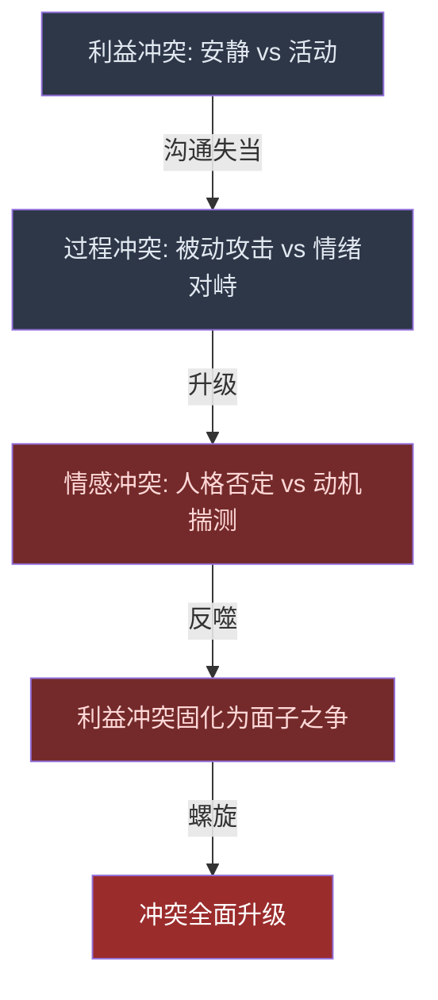
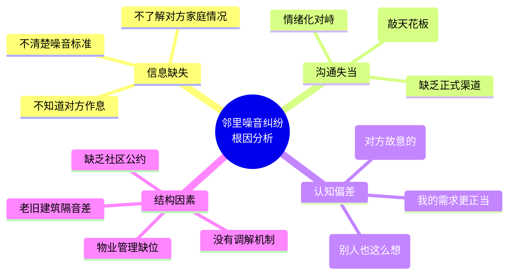
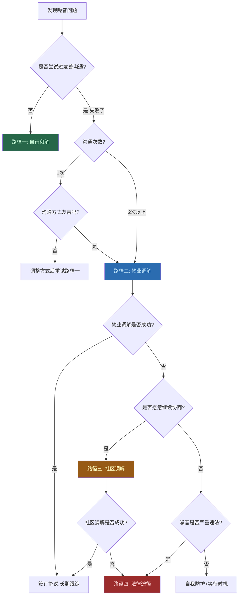
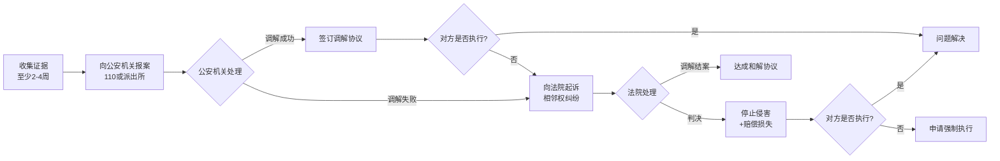

## 案例七：邻里之间的纠纷

邻里纠纷是日常生活中最常见、也最容易被低估的冲突类型。它不像职场冲突有明确的制度框架，也不像家庭冲突有深厚的情感基础作为缓冲——邻里之间是"被迫的近距离关系"，既没有选择的自由，也没有足够的了解来建立信任。据统计，中国城市社区中约68%的邻里纠纷与噪音相关，其中"楼上楼下"的噪音投诉占比最高。这类纠纷看似琐碎，却能严重侵蚀居住幸福感，甚至导致焦虑、失眠等健康问题。

本案例通过一个典型的噪音纠纷，系统展示邻里冲突的分析方法、多路径解决策略、沟通技巧和长期关系维护，并提供从预防到法律维权的完整知识体系。

### 场景描述

刘先生家住三楼，最近楼上新搬来的住户王先生家有一个三岁的小孩。小孩经常在家中跑跳，尤其在早上七点之前和晚上十点之后仍然产生较大的噪音。刘先生因为工作性质需要经常加班到深夜，睡眠质量对他至关重要。他最初尝试用敲天花板的方式"提醒"楼上的住户，但持续了一周没有任何效果。

一天晚上十一点，楼上的跑跳声再次响起，刘先生忍无可忍上楼敲门理论。双方在门口发生了激烈的争执：

- 王先生说："小孩子跑跳是天性，你管不了！你敲天花板吓到我家孩子了！"
- 刘先生则说："你们太没公德心了，大半夜的让孩子跑来跑去！"

争执后，两家的关系降至冰点。王先生反而觉得邻居在"找茬"，噪音问题不仅没有解决，甚至变本加厉。刘先生则开始考虑搬走或者打投诉电话。

### 冲突分析

#### 冲突类型识别

这起邻里纠纷包含了三层冲突的叠加：

| 冲突层次 | 具体表现 | 严重程度 |
|----------|----------|----------|
| **利益冲突**（核心层） | 刘先生的安静休息需求 vs. 王先生孩子的活动需求 | 高 |
| **过程冲突**（行为层） | 敲天花板的"暗示"沟通 vs. 上门对峙的"暴力"沟通 | 中 |
| **情感冲突**（关系层） | "没公德心"的人格否定 vs. "找茬"的动机揣测 | 高 |

三层冲突的叠加关系可以用下图理解：

三层冲突中，情感冲突虽然最后出现，但它反过来加剧了利益冲突——当双方都觉得对方"不讲理"时，原本可以协商的利益分配问题就变成了"凭什么让步"的面子之争。

#### 冲突原因深挖

具体拆解：

**1. 信息不对称与误解**

刘先生不知道王先生家的具体情况——三岁孩子的自控力有限，这并非家长"不管教"的结果。儿童发展心理学研究表明，三岁儿童的前额叶皮层尚未发育成熟，其抑制冲动和自我控制的能力非常有限，要求三岁孩子"安静待着"在生理上就不现实。王先生也不知道刘先生的工作性质和作息时间——他可能以为"正常时间"的活动不会影响邻居。双方都在基于不完整信息做判断，却都坚信自己掌握的是全部事实。

**2. 沟通方式的递进式失败**

刘先生的沟通路径是：敲天花板（被动攻击）→ 上门理论（情绪化对峙）。这两种方式都是无效沟通的典型表现。敲天花板不会让对方理解你的诉求，只会让对方觉得"楼下在找茬"；情绪激动时上门理论，则把一个可以协商的问题升级为人格攻击。更关键的是，这两种沟通方式之间存在"升级链"——当第一步的被动攻击无效时，人们往往会跳到另一个极端（直接冲突），而跳过了中间最有效的"友善但直接的沟通"。

**3. 归因偏差**

心理学中的"基本归因错误"在此案中体现明显：刘先生倾向于认为噪音是王先生"不重视、没公德心"（内部归因），而忽略了孩子天性、隔音条件等因素（外部归因）。王先生则倾向于认为刘先生"太敏感、找茬"，而忽略了真实的睡眠困扰。这种双向的归因偏差会导致一个恶性循环：每一方都认为对方是"故意的"，因此自己的反应是"正当的"。

**4. 缺乏制度框架**

该小区没有明确的噪音管理公约，物业公司也没有主动介入的机制。邻里纠纷处于"谁先让步谁吃亏"的博弈僵局中。当缺少制度框架时，每个个案都需要从零开始谈判，既低效又容易反复。

#### 冲突阶段判定

| 特征 | 本案表现 | 阶段判定 |
|------|----------|----------|
| 双方是否意识到冲突 | 是 | 超越潜伏期 |
| 是否开始互相指责 | 是（"没公德心"/"管不了"） | 显现期 |
| 是否采取对抗行动 | 部分（噪音可能加剧，但未扩大到其他领域） | 尚未到对抗期 |
| 是否要求第三方介入 | 暂未 | 尚未到危机期 |

处于**显现期**是最佳的介入窗口——双方已经意识到问题存在，但还没有固化为长期敌对关系。错过这个窗口，冲突会迅速滑向对抗期（如报警、投诉、互相报复）。每个阶段的特征和干预策略总结如下：

| 阶段 | 特征 | 干预难度 | 最佳策略 |
|------|------|----------|----------|
| 潜伏期 | 一方不满但未表达 | 低 | 自我觉察，提前友善沟通 |
| 显现期 | 双方意识到问题，开始指责 | 中 | 主动沟通或第三方调解 |
| 对抗期 | 互相报复，关系破裂 | 高 | 居委会/社区民警介入 |
| 危机期 | 法律诉讼、严重影响生活 | 极高 | 法律途径+专业调解 |

#### 权力分析

邻里关系的权力结构独特：

- **形式权力对等**：双方都是业主/租户，没有任何一方有制度性的权力优势
- **实际权力微妙不对称**：噪音制造方（王先生）在物理上处于"主动"位置——他可以选择控制噪音，也可以选择不管；而噪音承受方（刘先生）在物理上处于"被动"位置——他无法"选择不听"
- **长期博弈**：双方需要持续相处，这意味着"赢"的定义不是打败对方，而是建立可持续的共处模式
- **情绪成本不对称**：噪音承受方承受的情绪成本（睡眠不足、焦虑、愤怒）通常远高于制造方（可能根本意识不到问题），这种不对称会导致承受方更倾向于激进手段

### 多路径解决方案

邻里纠纷没有唯一的"正确答案"，根据当事人的关系基础、冲突严重程度和可用资源，可以选择不同的解决路径。

#### 路径选择决策框架

在进入具体路径之前，需要一个决策框架来判断"当前应该走哪条路"：

**关键决策原则**：能低层级解决就不高层级介入。每上升一个层级，关系修复的难度就增加一倍。

#### 路径一：自行和解（适用于冲突初期）

如果刘先生在最初感知到噪音时就采用正确的沟通方式，冲突可能根本不会升级。

**正确的首次沟通模板：**

> "王先生您好，我是楼下的刘先生。先说声抱歉打扰您，我知道带小朋友不容易。我想跟您商量一下——我因为工作性质经常加班到很晚，回来后需要安静休息。能不能咱们想想办法，比如晚上九点以后尽量让孩子做些安静的活动？我也愿意帮忙分担一些隔音地垫的费用。"

这段话的设计逻辑：

| 要素 | 具体做法 | 心理效果 |
|------|----------|----------|
| 自我介绍 | 报上姓名和位置 | 从"陌生的威胁"变成"具体的邻居" |
| 表达理解 | "带小朋友不容易" | 降低对方防御心理 |
| 说明自身情况 | "经常加班需要安静" | 提供信息，让对方理解你的需求不是无理取闹 |
| 提出具体方案 | "晚上九点后安静活动" | 给出可执行的方案而非模糊的要求 |
| 主动分担 | "愿意分担隔音垫费用" | 表明诚意，降低对方的配合成本 |

**关键原则：先说"我"的感受，再说"你"的行为。**

- ❌ "你家孩子太吵了"（指责对方）
- ✅ "我最近睡眠不太好，噪音对我的影响比较大"（表达自身感受）

**自行和解的时机选择**也非常重要。不要在噪音发生的当下上门——你正在气头上，对方正在忙碌。最佳时机是周末的白天，双方都比较放松，你提前准备一个水果或小礼物作为"敲门砖"，以"我是新搬来（或刚认识）的邻居"的姿态拜访，建立第一印象后再委婉提出问题。

#### 路径二：物业调解（适用于自行沟通失败后）

本案最终采用的路径。物业作为"可信的第三方"，在邻里调解中具有独特优势：既了解小区情况，又有一定的权威性，同时对双方都没有利害关系。

**物业调解的完整流程：**

**第一步：分别走访，建立信任**

物业工作人员分别拜访两家，核心任务不是"评判对错"，而是**倾听和理解**。

与刘先生面谈时：
- 听取具体困扰（哪些时段、持续多久、对生活的影响）
- 了解他的诉求底线（不是要求"完全安静"，而是"核心时段安静"）
- 安抚情绪（"您的要求完全合理，我们会帮您协调"）

与王先生面谈时：
- 了解家庭情况（孩子年龄、作息规律、是否了解对楼下的影响）
- 理解他的难处（"孩子确实很难完全控制"）
- 避免指责语气（不是"你家太吵了"，而是"楼下邻居反映了一些情况"）

**第二步：传递善意，重建信息通道**

这是调解中最关键的一步——双方在情绪对立时，会自动过滤掉对方的善意信号。物业充当"信息中转站"，确保善意被准确传递。

对刘先生说：
> "王先生说他之前确实没有充分意识到噪音问题对您影响这么大，他很抱歉。他说小孩子精力旺盛有时候确实控制不住，但他愿意想办法配合。"

对王先生说：
> "刘先生说他理解带三岁孩子不容易，不是故意找茬。他工作性质特殊，经常加班到很晚才回来，确实需要休息。他说之前用敲天花板的方式不太对，也很抱歉。"

**注意**：传递的内容要包含三个要素——**承认对方的感受**、**表达善意**、**对自己的不当行为道歉**。即使原话没有这么明确，调解员也需要提炼出善意的核心意思来传递。这一步的关键在于"翻译"——将双方的情绪化表达翻译成理性诉求，将对抗姿态翻译成合作意愿。

**第三步：引导换位思考**

分别用假设性问题让双方"体验"对方的处境：

对刘先生："您想象一下，如果有三岁的孩子，确实很难做到让孩子在特定时段完全安静。孩子不是大人，没有'安静'的概念。而且如果有人敲天花板吓到孩子，作为家长肯定也心疼。"

对王先生："您设想一下，每天加班到半夜回来，好不容易要睡着了，天花板上突然传来跑跳声，换谁都会崩溃。这不是小题大做，是真实的痛苦。而且他用敲天花板的方式，说明他已经忍了很久了。"

**第四步：共同协商具体方案**

让双方共同参与方案制定，而非接受"调解结果"——人们对参与制定的方案有更高的执行意愿（心理学中的"宜家效应"）。

| 措施 | 负责方 | 时间节点 | 预期效果 |
|------|--------|----------|----------|
| 铺设隔音地垫（客厅+卧室） | 王先生 | 一周内 | 降低跑跳噪音约60% |
| 晚九点后引导安静活动 | 王先生 | 立即执行 | 消除核心时段噪音 |
| 铺设费用分摊（各50%） | 双方 | 购买时 | 降低王先生经济负担 |
| 建立微信沟通渠道 | 双方 | 当天 | 避免再次上门对峙 |
| 约定"缓冲期"（一个月） | 双方 | 持续评估 | 给调整留出时间 |
| 刘先生主动示好（送水果） | 刘先生 | 三天内 | 重建友好关系基础 |

**隔音措施的实操选择：**

| 产品 | 价格区间 | 降噪效果 | 适用场景 | 购买渠道 |
|------|----------|----------|----------|----------|
| EVA拼接地垫（2cm厚） | 30-80元/㎡ | 降低撞击声20-30dB | 客厅、儿童房 | 京东、淘宝 |
| XPE爬行垫（1cm厚） | 20-50元/㎡ | 降低撞击声15-20dB | 局部区域 | 母婴店、电商 |
| 橡胶隔音垫+地毯组合 | 80-150元/㎡ | 降低撞击声30-40dB | 对隔音要求高的场景 | 建材市场 |
| 悬浮地板（专业级） | 150-300元/㎡ | 降低撞击声40-50dB | 彻底解决型 | 专业隔音公司 |

**第五步：促进面对面和解**

物业安排两家在物业办公室见面，不是要"审判"谁对谁错，而是给双方一个正式的和解场景。

和解会话的结构：
1. 物业简述双方的善意（"两位其实都理解对方的难处"）
2. 双方互相表达歉意（王先生为噪音，刘先生为敲天花板和言语冲突）
3. 确认具体方案（逐条过一遍，最好形成书面协议）
4. 握手/加微信，建立直接沟通渠道

**书面调解协议模板（供参考）：**

邻里噪音问题调解协议

甲方（三楼）：刘先生
乙方（四楼）：王先生
调解方：XX物业管理处

经调解，双方达成如下共识：
1. 乙方同意在客厅及儿童房铺设隔音地垫，于 ____年__月__日前完成；
2. 乙方同意在每晚21:00后引导孩子进行安静活动；
3. 隔音地垫费用由双方各承担50%（预算约____元）；
4. 双方建立微信沟通渠道，今后如有问题优先通过微信友好沟通；
5. 本协议自签署之日起试行一个月，届时双方共同评估效果；
6. 试行期间如遇特殊情况（如孩子生病等），甲方应给予理解和包容。

甲方签字：________  日期：________
乙方签字：________  日期：________
调解方签字：________  日期：________

**第六步：跟踪回访（最容易被忽略的一步）**

调解不是签完协议就结束。物业应在一周后、两周后、一个月后分别回访：

- 一周后：确认隔音垫是否已购买和铺设，晚九点安静时段是否执行
- 两周后：了解双方的主观感受，噪音问题是否有所改善
- 一个月后：正式评估，决定是否需要调整方案或延长试行期

回访中如果发现新问题，及时介入，防止矛盾再次积累。

#### 路径三：社区调解（适用于物业调解无效时）

如果物业调解无法达成一致，可以升级到社区层面：

- **居委会调解**：居委会有法定的调解职能，调解员通常受过专业培训，比物业更有权威性。根据《人民调解法》，居委会设立的人民调解委员会具有正式的调解效力，达成的调解协议经司法确认后具有强制执行力
- **社区民警介入**：不是"报警"，而是请社区民警以"社区安全"的名义进行调解，民警的身份本身就有震慑力。很多派出所设有"社区警务室"，可以主动联系社区民警
- **业委会协调**：如果小区有业委会，可以通过业委会推动制定社区噪音管理公约
- **街道司法所调解**：街道层面的司法所提供免费的人民调解服务，调解员受过专业法律培训

**社区调解相比物业调解的升级点：**

| 维度 | 物业调解 | 社区调解 |
|------|----------|----------|
| 权威性 | 较低（物业是服务方） | 较高（居委会有法定职能） |
| 专业性 | 一般（物业工作人员） | 较高（专业调解员） |
| 法律效力 | 无强制力 | 司法确认后可强制执行 |
| 适用场景 | 轻度纠纷 | 反复纠纷或物业不作为 |
| 调解周期 | 1-3天 | 1-2周 |

#### 路径四：法律途径（适用于严重/持续性噪音扰民）

当所有调解手段都无效时，法律是最后的保障。

**法律依据（2024年最新）：**

| 法规 | 相关条款 | 适用场景 |
|------|----------|----------|
| 《民法典》第288条 | 不动产相邻关系：有利生产、方便生活、团结互助、公平合理 | 邻里噪音的基本法律框架 |
| 《民法典》第294条 | 不动产权利人不得违反国家规定弃置固体废物，排放大气污染物、水污染物、土壤污染物、噪声等 | 噪音排放的法律约束 |
| 《治安管理处罚法》第58条 | 制造噪声干扰他人正常生活的，处警告；警告后不改正的，处200-500元罚款 | 持续性噪音扰民的行政处罚 |
| 《噪声污染防治法》（2022年6月5日起施行） | 社会生活噪声管理的相关规定，取代原《环境噪声污染防治法》 | 噪音标准和投诉机制 |
| 《噪声污染防治法》第70条 | 对噪声敏感建筑物集中区域的社会生活噪声扰民行为进行劝阻、调解 | 居民楼内噪音纠纷 |
| 各地《物业管理条例》 | 业主在物业使用中的行为规范 | 小区层面的噪音管理 |

> **注意**：原《环境噪声污染防治法》已于2022年6月5日被《噪声污染防治法》取代。新法更加明确了社会生活噪声的管理责任和处罚标准，增加了对邻里噪音纠纷的调解机制要求。

**法律途径的操作流程：**

**证据收集要点：**

1. **噪音记录**：使用分贝测量APP（如"分贝仪""Sound Meter"）记录噪音时间和分贝值，形成日志。国家标准GB 22337-2008规定住宅卧室夜间（22:00-6:00）噪音限值为30dB(A)，白天为40dB(A)；客厅夜间35dB(A)，白天45dB(A)
2. **录音录像**：在自己家中录制噪音情况，注意包含时间戳。建议使用带有时间水印的录像APP
3. **证人证言**：其他邻居的证词，物业的调解记录。注意：证人需要愿意出庭作证
4. **生活影响证明**：因噪音导致的就医记录（失眠、焦虑等）、工作受影响的证明、心理咨询记录
5. **沟通记录**：微信聊天记录、调解记录等，证明对方"明知不改"
6. **噪音鉴定**：在必要时可以委托有资质的环境监测机构进行噪音检测，出具正式检测报告。费用约500-2000元，但法律效力远高于手机APP

**诉讼的成本与收益分析：**

| 项目 | 预估成本 | 说明 |
|------|----------|------|
| 诉讼费 | 50-100元 | 相邻权纠纷按件收费，标的额不高 |
| 律师费 | 3000-10000元 | 可以不请律师自行诉讼 |
| 噪音鉴定费 | 500-2000元 | 视情况决定是否需要 |
| 时间成本 | 3-6个月 | 一审通常需要这个周期 |
| 精神损耗 | 难以量化 | 与邻居打官司本身就很消耗心力 |
| **可能的收益** | 停止侵害+赔偿 | 精神损害赔偿通常在1000-5000元 |

**务实建议**：除非噪音问题已经严重影响健康（如确诊失眠症、焦虑症），否则诉讼往往是"赢了官司输了邻居"的最坏结果。诉讼应该是最后手段，在此之前应穷尽所有调解途径。

### 心理学视角：邻里冲突中的认知陷阱

邻里纠纷之所以容易升级，与几种常见的认知偏差密切相关。理解这些偏差，才能在冲突中保持理性。

#### 基本归因错误

**定义**：倾向于将他人的行为归因于其品格（"他故意的"），而将自己的行为归因于环境（"我是被逼的"）。这是社会心理学中最稳定的发现之一，由Lee Ross在1977年首次系统描述。

**本案表现**：
- 刘先生认为噪音是"没公德心"（品格归因），而非"三岁孩子的天性限制"（环境因素）
- 王先生认为敲天花板是"找茬"（品格归因），而非"对方被逼到没办法了"（环境因素）

**纠正方法**：在给对方"定性"之前，先列出至少三个可能的外部原因。例如"噪音大"可能是因为：孩子太小确实控制不住、隔音条件差、对方不知道我的作息时间。这个"三个替代解释"练习能有效打破归因偏差的惯性。

#### 投射效应

**定义**：认为自己的感受和需求对别人来说同样重要。心理学上也称为"共情鸿沟"——我们很难真正理解与自己不同处境的人的感受。

**本案表现**：
- 刘先生觉得"安静是基本需求，任何人都应该理解"
- 王先生觉得"孩子活动是天经地义的事，邻居应该包容"

**纠正方法**：明确区分"我的需求"和"普遍需求"。安静对你很重要，但对每天和三岁孩子搏斗的家长来说，"让孩子消耗体力"才是最紧迫的需求。两个需求都是合理的，需要找到平衡点。

#### 确认偏差

**定义**：一旦形成某个判断，就会选择性地关注支持这个判断的信息。大脑天生会寻找"证据"来验证已有信念，同时忽略反面证据。

**本案表现**：
- 一旦刘先生认定"楼上不讲理"，每次听到噪音都会被放大为"他故意的"
- 一旦王先生认定"楼下找茬"，每次敲天花板都会被解读为"他又来挑衅了"

**纠正方法**：刻意寻找与自己判断相反的证据。比如"他真的故意在大半夜让孩子跑吗？还是可能孩子今天比较兴奋？"建议在手机备忘录中设一个"反思栏"，记录自己对邻居行为的判断和可能的替代解释。

#### 虚假共识效应

**定义**：高估自己的观点被他人认同的程度。人们天然倾向于认为"大多数人会同意我的看法"。

**本案表现**：
- 刘先生可能认为"其他邻居肯定也觉得楼上太吵了"
- 王先生可能认为"有孩子的家庭都会理解我的处境"

**纠正方法**：不要假定第三方一定支持自己，而是实际去了解其他邻居的看法。你可能会惊讶地发现，有些人觉得噪音没那么严重，有些人觉得两边都有问题。

#### 损失厌恶

**定义**：人们对损失的敏感度是获得的两倍以上。在邻里冲突中，"让步"会被心理编码为"损失"，即使让步的实质成本远小于冲突持续的代价。

**本案表现**：
- 刘先生觉得"凭什么我要分担隔音垫费用？又不是我制造的噪音"
- 王先生觉得"凭什么我要限制孩子的活动？我也有居住权"

**纠正方法**：把"让步"重新框架为"投资"——分担200元隔音垫费用，换来的是安静的睡眠和和谐的邻里关系。这笔"投资"的回报率远高于任何理财产品。

### 沟通技巧详解

#### 非暴力沟通在邻里纠纷中的应用

马歇尔·卢森堡的非暴力沟通（NVC）四步法，在邻里纠纷中尤其有效：

**观察（Observation）**：描述客观事实，不加评判
- ❌ "你家孩子整天在楼上乱跑"
- ✅ "过去一周，早上七点前和晚上十点后，楼上经常有跑跳的声音"

**感受（Feeling）**：表达自身情绪，不指责对方
- ❌ "你们太自私了，一点都不考虑别人"
- ✅ "噪音让我很难入睡，我感到很焦虑，因为第二天工作状态会很差"

**需要（Need）**：说明未被满足的需求
- ❌ "你就不能管管你家孩子吗"
- ✅ "我需要在加班回来后有一个安静的休息环境"

**请求（Request）**：提出具体、可执行的请求
- ❌ "以后注意点"
- ✅ "能不能咱们商量一下，晚上九点以后让孩子做些安静的活动？我也可以帮忙出一部分隔音垫的费用"

**NVC完整练习——从冲突话语到非暴力表达的转换：**

| 冲突话语 | NVC改写 | 涉及的NVC要素 |
|----------|---------|---------------|
| "你家孩子太吵了！" | "这一周每天晚上十点后我都能听到跑跳声（观察），我很难入睡（感受），因为我需要安静的休息来恢复精力（需要）。能否商量一下晚九点后的活动安排？（请求）" | 观察→感受→需要→请求 |
| "你管不了就别生！" | "我理解带孩子不容易（共情），但噪音确实严重影响了我的健康（感受）。我想一起想办法（请求）。" | 共情→感受→请求 |
| "找什么茬！" | "我敲天花板的方式确实不太好（承认），我是因为睡眠受影响感到很焦虑（感受）。想好好聊聊怎么解决（请求）。" | 承认→感受→请求 |

#### 楼上楼下"黄金沟通公式"

邻里噪音纠纷有其特殊性——物理上的"上下关系"会心理暗示出"侵害方-受害方"的对立结构。打破这个结构需要刻意设计沟通方式：

**第一步：建立"我们"的框架**
> "咱们住楼上楼下，以后要长期做邻居，我想找个办法让咱们都住得舒服。"

**第二步：承认自己的不当**
> "之前我用敲天花板的方式提醒您，确实不太好，我应该上来直接跟您聊的。"

**第三步：用"请求"代替"要求"**
> "我有一个请求——不是要求——您看能不能在晚上九点以后，尽量引导孩子做安静一点的活动？我知道这对三岁的孩子来说不容易，但哪怕减少一些也好。"

**第四步：主动提供帮助**
> "我查了一下，有一种隔音地垫铺在客厅效果很好，网上大概一百多块钱一平米。我愿意承担一半的费用。"

**第五步：留出调整空间**
> "咱们先试一个月看看效果？如果还有问题，咱们再一起想办法。"

这个五步公式的核心逻辑是：**先降级对立关系，再表达需求，最后提供解决方案**。它把"你侵害了我"的对抗框架，转化为"我们一起解决问题"的合作框架。

#### 如何回应对方的"不合理"反驳

| 对方可能说的话 | 错误回应 | 正确回应 |
|---------------|----------|----------|
| "小孩子跑跳是天性，管不了" | "那是你的事，别影响别人" | "理解，三岁确实很难控制。我想一起想想办法，有没有既能让孩子活动又不太影响楼下的方式？" |
| "嫌吵你住别墅去" | "你这人怎么这么不讲理" | "我知道您也觉得被冒犯了，咱们都是为了好好住，没必要互相为难。能不能换个方式聊？" |
| "我交了物业费，爱怎么住怎么住" | "那我也有权利安静休息" | "您说得对，咱们都有自己的权利。但住在一个楼里，总得互相迁就一下，对吧？" |
| "你怎么不上去找四楼的？" | "四楼又没你家吵" | "四楼的情况我不太了解，但咱们之间这个问题确实让我很困扰，我想先解决咱们的问题。" |
| "我小时候邻居从来没人投诉" | "那是以前，现在不一样了" | "是啊，以前的楼隔音好一些，现在建筑质量确实不如从前。所以才更需要咱们一起想想办法。" |
| "你去找物业/报警啊" | "好，我现在就去！" | "我不想把事情闹大，咱们邻居之间能解决最好。如果实在有困难，再请物业帮忙协调也行。" |

**回应的底层逻辑**：不要被对方的挑衅性语言"钩住"。对方说"嫌吵住别墅"并不是真的在建议你搬家，而是在表达"我觉得被攻击了，所以要反击"。识别到这个情绪信号后，回应的重点不是反驳内容，而是安抚情绪。

### 常见误区与纠正

#### 误区一：被动攻击代替直接沟通

**表现**：敲天花板、在楼道放杂物"堵路"、在业主群含沙射影、故意制造噪音"报复"、在门口贴小纸条（不署名）。

**为什么有害**：
- 被动攻击不会传递真实的诉求信息，对方只会感到"被挑衅"
- 报复行为会让冲突螺旋升级，最终双方都受害
- 一旦形成"互相报复"的模式，调解难度呈指数增长
- 被动攻击会削弱你自己的道德立场——你从"受害者"变成了"共同施害者"

**正确做法**：鼓起勇气，用友善但直接的方式当面沟通。如果当面沟通困难，可以先发一条微信消息作为"破冰"。微信消息比当面沟通更容易控制语气，可以反复修改后再发送。

#### 误区二：在情绪激动时"解决问题"

**表现**：忍到极限后爆发，上楼敲门时已经怒气冲冲。

**为什么有害**：
- 情绪激动时大脑的理性思考区域（前额叶皮层）被杏仁核抑制，说出的话大多是攻击性的——这是神经科学的结论，不是意志力能克服的
- 第一次接触就以激烈争吵开场，会为后续所有互动定下"对抗"的基调
- 对方在被攻击时也会进入防御状态，根本听不进你的诉求

**正确做法**：感到忍无可忍时，先记录时间和情况，等情绪平复后（至少第二天），再找合适的时机沟通。可以使用"情绪温度计"：1-10分评估自己的愤怒程度，6分以上不沟通，等降到4分以下再行动。

#### 误区三：只提需求不提供方案

**表现**："你家太吵了，以后注意点！"

**为什么有害**：
- "注意点"是模糊的要求，对方可能根本不知道怎么做
- 只提需求不提方案，会让对方觉得你在"提要求"而不是"商量"
- 没有具体方案就没有执行标准，即使对方有意愿配合也无从做起

**正确做法**：提出具体的、可执行的方案，并表示愿意共同承担成本。"方案思维"是解决所有冲突的关键——不要只说"你别做什么"，而是说"咱们可以一起做什么"。

#### 误区四：跳过协商直接投诉/报警

**表现**：没有尝试过沟通，直接打12345或报警。

**为什么有害**：
- 邻里关系是长期关系，投诉会让对方觉得你"不给他机会"
- 投诉/报警后，对方即使被迫改正，心里也会记恨，后续相处更难
- 对于三岁孩子噪音这种"灰色地带"，行政部门很难有实质性措施
- 警方对于邻里噪音通常只能调解或警告，实际效果有限

**正确做法**：先尝试1-2次友善沟通→物业调解→居委会调解→最后才考虑投诉/报警。每一步都要留下记录，为可能的后续升级做准备。

#### 误区五：用"公德"绑架对方

**表现**："你这人太没公德心了！""正常的邻居都不会这样！"

**为什么有害**：
- "公德"是一个道德判断词，直接攻击了对方的人格
- 对方一旦觉得被"道德审判"，会立刻进入防御和反击状态
- 道德绑架不会让对方"醒悟"，只会让对方更抵触
- 从博弈论角度，道德绑架会将"合作博弈"变为"零和博弈"

**正确做法**：描述行为的影响，而非评判品格。"噪音影响了我的睡眠"是事实陈述；"你没公德心"是人格攻击。

#### 误区六：试图通过其他邻居"施压"

**表现**：拉拢其他邻居一起投诉，在业主群里公开讨论、发起"投票"。

**为什么有害**：
- 公开化会让对方感到被"群起而攻之"，彻底关闭沟通大门
- 其他邻居未必愿意被拉入纠纷，你可能反而失去潜在的调解人
- 在业主群公开讨论会引发更大的社区矛盾

**正确做法**：私下了解其他邻居是否有类似困扰作为参考，但不要公开化或联合施压。如果有多个邻居受影响，可以联名向物业提出正式诉求（非公开），让物业出面统一协调。

### 长期关系维护策略

邻里纠纷的解决不是"握手言和"那一刻，而是需要持续维护的长期过程。

#### 建立日常友好的基础

- **点头之交**：在楼道、电梯遇到时主动打招呼，哪怕只是一句"您好"
- **节日问候**：过年时在业主群里发个祝福，或在楼道遇到时说一句"新年好"
- **小帮忙**：帮邻居签收快递、下雨天帮忙收衣服——这些小举动能积累"善意银行"的余额
- **孩子互动**：如果双方都有孩子，可以偶尔组织孩子一起玩，这对建立家庭间的友谊非常有效

#### 建立沟通机制

| 沟通方式 | 适用场景 | 注意事项 |
|----------|----------|----------|
| 微信文字 | 日常小问题提醒 | 语气友善，用"商量"而非"通知" |
| 电话/语音 | 需要即时沟通的事 | 选择对方方便的时间 |
| 当面沟通 | 重要或复杂的事情 | 提前约好时间，避免突然上门 |
| 物业转达 | 直接沟通困难时 | 书面化诉求，让物业准确传达 |

**微信沟通的注意事项**：微信文字容易被误解语气。建议在重要的邻里沟通中使用表情符号（如😊🙏）来传递善意，避免使用"。"结尾（显得冷淡），适当使用"~"和感叹号来软化语气。

#### 噪音问题的长效管理

- **隔音措施**：与邻居一起评估隔音改善方案（隔音垫、窗帘、密封条等），费用可以商量分担
- **约定"安静时段"**：双方协商核心安静时段（如晚9点-早7点），在这些时段内格外注意
- **定期"check-in"**：每隔一两个月，通过微信简单问问"最近噪音情况怎么样？还有没有困扰？"——这不是多管闲事，而是防止问题积累
- **灵活性**：理解特殊时段（孩子生病闹腾、过年聚会等）会有例外，提前沟通比事后抱怨有效得多

#### "善意银行"理论

把邻里关系想象成一个银行账户：每次友善互动（打招呼、帮忙、送水果）都是存款，每次冲突（投诉、争吵、报复）都是取款。当账户余额充足时，偶尔的摩擦不会导致"破产"；当账户余额为零甚至为负时，一点小摩擦就可能引发全面冲突。

**存款行为清单：**

| 行为 | 存款额度 | 频率建议 |
|------|----------|----------|
| 电梯/楼道打招呼 | 小额（1元） | 每次遇到 |
| 帮签收快递 | 中额（10元） | 有机会就做 |
| 节日送小礼物 | 大额（50元） | 春节、中秋等 |
| 分享自制食物 | 中额（20元） | 偶尔 |
| 帮忙照顾宠物/植物 | 大额（50元） | 出门时 |
| 装修时送水果+告知 | 大额（50元） | 装修期间 |

### 特殊情境的处理建议

#### 当邻居完全不配合时

如果友善沟通、物业调解都无效，对方完全拒绝任何协商：

1. **保持记录**：详细记录噪音的时间、持续时长、分贝值、对你生活的影响
2. **书面正式沟通**：通过挂号信或当面送达（有第三方在场）书面信函，表达诉求和可能的法律后果。书面信函的法律效力远高于口头沟通
3. **行政投诉**：拨打12345市民热线或向环保部门投诉（社会生活噪音）
4. **法律维权**：向法院提起相邻权纠纷诉讼，要求停止侵害、赔偿损失
5. **自我防护**：在法律途径推进的同时，做好自身的隔音防护（隔音耳塞、白噪音机、双层玻璃窗），保护自己的生活质量不被对方的行为绑架

#### 当你是"制造噪音"的一方

如果你被邻居投诉了，以下做法比"防御和反驳"更有效：

1. **先道歉，再解释**："很抱歉影响到您了，我家孩子确实比较闹，我一直在想办法。"
2. **采取具体措施**：隔音垫、安静时段规则、引导孩子活动方式
3. **主动反馈进展**："我买了隔音垫铺上了，您看最近好一些了吗？"
4. **不要把投诉当作"攻击"**：邻居来反映问题是给你沟通的机会，而不是在"找茬"
5. **自我反思**：你是否真的已经尽力了？有时候"孩子就是这样"是一种逃避责任的借口，虽然三岁确实很难完全控制，但铺设隔音垫、引导活动时间这些措施是完全可以做到的

#### 当噪音来自装修

装修噪音是邻里纠纷的另一大类，但与生活噪音不同的是，装修噪音是有时限的，更容易获得邻居的理解：

- **提前通知**：装修前一周在楼道张贴通知，注明工期和噪音较大的时段
- **遵守时间规定**：工作日8:00-12:00、14:00-18:00，周末和节假日禁止产生噪音的施工（各地规定可能略有不同，以当地物业管理条例为准）
- **主动沟通**：对相邻的住户（上下左右）逐户通知，并留下联系方式
- **给予补偿**：工期较长时，可以送一些小礼物（水果、点心）表达歉意
- **工期管理**：把噪音最大的工程（拆墙、打孔等）集中在前几天完成，减少邻居的长期困扰

#### 当噪音来自宠物

宠物噪音（犬吠、猫叫）是另一类常见邻里纠纷：

- **时间管理**：避免让宠物在夜间和清晨吠叫，必要时使用宠物训练手段
- **隔音措施**：为宠物活动区域铺设隔音材料
- **主动沟通**：告诉邻居"我家狗狗刚来，可能有些吵，正在训练中，请多包涵"
- **训练投资**：如果宠物持续发出噪音，考虑请专业训犬师帮助，这比邻里关系破裂的代价小得多

#### 当你是租户而非业主

租户在邻里纠纷中处于一个特殊位置：

- **法律地位**：租户同样享有居住安宁权，可以作为原告提起诉讼
- **房东角色**：可以通过房东（业主）出面协调，因为业主对物业更有话语权
- **转租压力**：如果纠纷无法解决，租户的退出成本远低于业主，可以在合同到期时选择不续租
- **物业管理**：物业对租户和业主应一视同仁，但在实践中可能有所偏向，需要注意

### 建筑隔音：从源头解决问题

很多邻里噪音纠纷的根源不是邻居"没素质"，而是建筑隔音不达标。中国住宅的楼板隔音标准长期偏低，2022年之前执行的GBJ 118-88标准仅要求楼板撞击声级≤75dB，而国际标准通常在55-65dB。

#### 住户可做的隔音改善

| 措施 | 成本 | 效果 | 施工难度 |
|------|------|------|----------|
| 增加地毯/地垫 | 低（100-500元） | 中 | 无需施工 |
| 安装隔音窗帘 | 低（200-800元） | 低（主要隔空气声） | 简单 |
| 窗户密封条 | 低（50-200元） | 中 | 简单 |
| 双层/三层中空玻璃窗 | 中（2000-8000元/窗） | 高（隔外部噪音） | 需专业安装 |
| 天花板隔音吊顶 | 高（150-300元/㎡） | 高（隔楼上撞击声） | 需专业施工 |
| 墙体隔音板 | 中（100-200元/㎡） | 中 | 可自行安装 |

#### 推动整栋楼的隔音改造

如果隔音问题严重且普遍，可以通过业委会推动整栋楼的隔音改造：
1. 联合多户业主签名请愿
2. 申请使用住宅专项维修基金
3. 聘请专业公司评估和施工
4. 费用按楼层和受益程度分摊

### 本案例的核心启示

1. **邻里冲突的本质是"共处"问题**：不是谁对谁错，而是如何让两个不同的生活模式在同一栋楼里和平共存
2. **第一次沟通决定冲突走向**：用友善直接的方式首次沟通，80%的邻里纠纷可以避免升级
3. **被动攻击是邻里关系的头号杀手**：敲天花板、报复性噪音、含沙射影——这些只会让问题更糟
4. **具体方案比模糊要求有效一百倍**："晚上九点后安静活动"远比"以后注意点"更容易被执行
5. **第三方调解的价值在于"翻译"**：物业/居委会不是来"审判"的，而是帮助双方理解和传递善意
6. **长期关系需要"善意银行"**：日常的点头、问候、小帮忙，都是在为未来的冲突解决储备信任资本
7. **法律是最后手段，不是第一反应**：在邻里关系中，"赢了官司输了邻居"是最坏的结果
8. **隔音是物理问题，不是道德问题**：很多噪音纠纷的根源是建筑隔音不达标，把物理问题道德化只会加剧冲突
9. **认知偏差是冲突升级的加速器**：基本归因错误、确认偏差、损失厌恶等心理机制会让小摩擦变成大冲突，识别并纠正这些偏差是理性处理纠纷的前提
10. **"让步"不是"认输"，而是"投资"**：分担200元隔音垫费用，换来的是安静的睡眠和和谐的邻里关系——这笔账怎么算都划算

***
