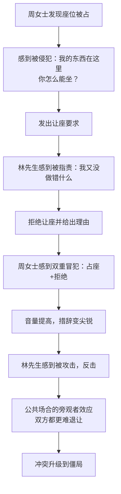
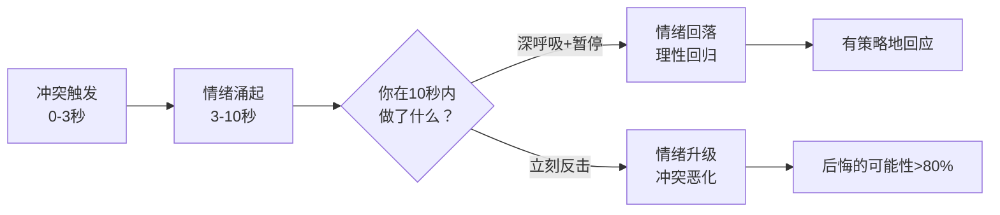
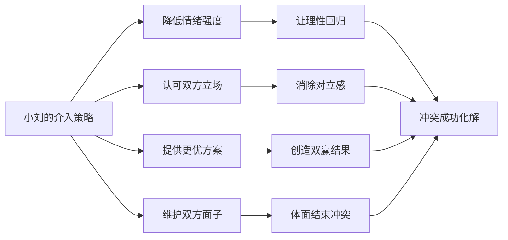
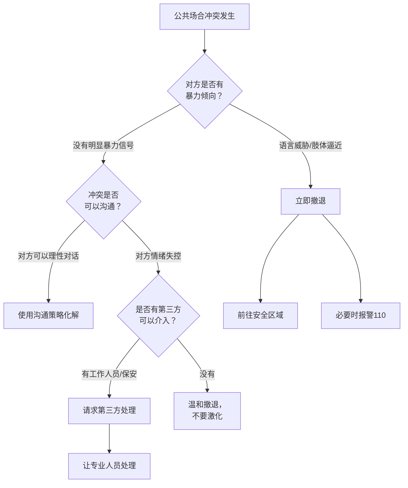

## 案例八：公共场合的冲突

公共场合冲突是日常生活中最常见的冲突类型之一——在餐厅、地铁、商场、电影院、健身房，甚至医院候诊室，人与人之间因资源争夺、规则分歧或无心冒犯而产生的摩擦几乎每天都在上演。这类冲突的特殊性在于：它发生在众目睽睽之下，旁观者的存在会显著改变冲突双方的心理状态和行为模式，使原本可以在私下轻松化解的矛盾变得高度敏感。

本案例将从一个咖啡馆座位争执入手，系统拆解公共场合冲突的底层逻辑，提供从即时应对到长期预防的完整策略体系。

---

### 场景描述

在一个周末下午的咖啡馆里，两位顾客因为座位问题发生了争执。

周女士提前到达咖啡馆，点了一杯美式，然后把随身的手提包放在对面的座位上，起身去了洗手间。五分钟后她回来，发现一位男士——林先生——正坐在那个座位上，旁边放着他的笔记本电脑，已经打开进入了工作状态。

周女士礼貌但坚定地说：「不好意思，这个座位有人了，我的包刚才放在这里。」

林先生抬头看了一眼，回应道：「我来的时候座位上只有一个包，没有人。公共座位不能用包占座吧？」

周女士的声音提高了：「我已经点了咖啡，包就在这里，这很明显是有人的座位。你看到别人的包还坐下，是什么意思？」

林先生也不示弱：「公共空间的座位是用来坐的，不是用来放包的。你去洗手间十分钟，别人就不能坐了？」

两人的音量越来越大。周围的顾客纷纷侧目，有的低头看手机假装没注意，有的窃窃私语。咖啡馆的气氛从悠闲变成了紧张。一位带孩子的母亲悄悄换了更远的座位。

---

### 冲突分析

#### 冲突的多层结构

这起看似简单的座位争执，实际上包含了三个层面的冲突：

| 层面 | 内容 | 表现 |
|------|------|------|
| **实质层** | 座位使用权的归属 | 双方对"谁有权坐这个座位"存在根本分歧 |
| **规则层** | "用包占座"是否合理 | 双方对社会规则的理解不同——周女士认为占座是普遍接受的惯例，林先生认为公共座位不应被物品占据 |
| **情感层** | 感到不被尊重 | 周女士觉得自己的存在被无视，林先生觉得自己被当作"抢座的人"对待 |

#### 冲突升级的心理机制

#### 旁观者效应的放大作用

公共场合冲突与私人冲突的核心区别在于旁观者的存在。社会心理学中的「观众效应」（audience effect）指出，当个体意识到自己正在被观察时，其行为会发生显著变化：

**面子机制的激活**：在有旁观者的情况下，退让不再仅仅是"解决一个问题"，而变成了"在众人面前认输"。这大幅提高了双方的退让心理成本。周女士如果此时放弃主张，她不仅要接受座位被占的事实，还要承受周围人"她好说话"或"她理亏"的潜在评价。林先生同理——如果他让座了，等于在众人面前承认自己做错了。

**社会比较的压力**：旁观者的存在会让冲突双方不自觉地进入"表演模式"——他们更倾向于坚持自己的立场，用更大的声音、更有力的论据来证明自己是"对的"那一方。这不是因为他们在乎那个座位，而是因为他们不想在陌生人面前显得软弱或不讲理。

**群体极化的风险**：如果旁观者中有支持某一方的人（比如有人也觉得占座不对，出声附和林先生），另一方会感到被围攻，冲突可能急剧升级。反之，如果旁观者都沉默，双方可能都把沉默解读为对自己的不支持，从而更加焦虑和激动。

#### 冲突类型判断

- **冲突类型**：实质型冲突（座位使用权）+ 规则型冲突（占座是否合理）+ 情感型冲突（感到不被尊重）
- **冲突阶段**：从潜伏期快速进入显现期，有向激化期发展的趋势
- **激烈程度**：中等偏高——尚未涉及人身攻击，但情绪已经开始主导理性
- **扩散风险**：高——公共场合冲突容易吸引旁观者参与，或引发连锁反应

---

### 中国面子文化的深层作用

公共场合冲突在中国社会中有着独特的文化维度。理解「面子」运作的深层机制，是有效处理这类冲突的前提。

#### 面子的双重结构

中国社会学家胡先缙最早将面子区分为「脸」和「面子」两个层次：

| 维度 | 含义 | 在冲突中的表现 |
|------|------|----------------|
| **脸**（道德面子） | 社会对个人道德品格的评价 | "这个人讲不讲理""有没有教养" |
| **面子**（社会面子） | 社会对个人社会地位和能力的认可 | "这个人有没有本事""镇不镇得住场" |

在公共场合冲突中，两个维度同时受到威胁。周女士不仅担心别人觉得她"软弱好欺负"（面子受损），还担心别人觉得她"无理取闹"（丢脸）。林先生同样面临双重压力——既要在道理上站得住脚，又要在气势上不落下风。

#### 中国式旁观者的特殊性

与西方社会相比，中国公共场合的旁观者行为有几个显著特征：

**围观文化**：中国社会有较强的围观传统。在公共场合发生冲突时，围观者聚集的速度更快、人数更多、停留时间更长。这种密集围观会显著放大双方的面子压力。

**道德评判倾向**：中国旁观者更倾向于对冲突双方进行道德评判（"这个人没素质""那个人太过分了"），而非保持价值中立。这种评判氛围使得双方更加害怕被贴上负面标签。

**沉默的大多数**：尽管围观者众多，但主动介入调解的比例相对较低。大多数旁观者选择"看热闹"而非"帮忙"。这种沉默会被冲突双方解读为"所有人都在看我出丑"，进一步加剧焦虑。

**网络化放大**：在智能手机时代，任何公共冲突都可能被拍摄并上传到社交媒体。一个在其他国家可能以和解收场的冲突，在中国可能因为"被拍到"的恐惧而变得极度紧张——因为一旦上了微博热搜或抖音，后果不可控。

#### 面子保全的具体策略

理解了面子机制后，处理公共场合冲突的核心原则变得清晰——**任何解决方案都必须让双方保住面子**：

- **给台阶**：不是"你错了所以要让步"，而是"你是一个大度的人所以选择让步"。把退让从"认输"重新定义为"格局大"。
- **共同归因**：把冲突归因于外部因素（"周末人太多了""座位标识不清楚"），而非任何一方的过错。
- **私密化处理**：如果可能，把对话从公开场合移到相对私密的空间（"我们到旁边说"），降低旁观者效应。
- **仪式性道歉**：在中国文化中，即使是无过错方，一句"不好意思啊"作为社交润滑剂，可以大幅降低对方的防御心理，因为它满足了双方的面子需求。

---

### 即时情绪调节：冲突当下的自我控制

在冲突发生的最初30秒内，情绪反应往往是自动化的——肾上腺素飙升、心跳加速、思维变窄。如果不加以控制，你会说出事后后悔的话。以下是经过心理学研究验证的即时调节技术。

#### 生理调节技术

**4-7-8呼吸法**：当你感到怒气上涌时，用鼻子吸气4秒，屏住呼吸7秒，用嘴缓慢呼气8秒。重复2-3次。这个技术通过激活副交感神经系统，在30秒内降低心率和皮质醇水平。关键在于呼气时间是吸气的两倍——这是触发放松反应的核心。

**肌肉放松扫描**：快速检查身体——你的下巴是否紧咬？肩膀是否耸起？拳头是否握紧？有意识地放松这些部位。身体的紧张会通过反馈循环加剧情绪的紧张。

**物理距离创造**：如果可能，后退一步或侧身。物理距离的增加会给大脑发送"危险降低"的信号。这不是退让，是给自己争取调节情绪的时间。

#### 认知调节技术

**十分钟后测试**：问自己"十分钟后这件事还重要吗？十小时后呢？十天后呢？"绝大多数公共场合冲突的答案是：十分钟后就不重要了。这个简单的认知练习可以迅速降低你对"赢"的执念。

**角色置换想象**：花2秒钟想象你是对方——一个在咖啡馆找不到座位的人，或者一个离开几分钟回来发现座位被占了的人。这种快速的视角切换可以激活大脑的共情回路，降低攻击性。

**标签识别**：在心里给自己的情绪贴标签——"我现在感到愤怒""我感到被冒犯了"。神经科学研究表明，仅仅是给情绪命名（affect labeling）就能降低杏仁核的激活水平，减弱情绪强度。这不是压制情绪，而是与情绪拉开观察距离。

**后果预演**：快速想象最坏的结果——如果冲突升级到肢体冲突，你会面临什么？报警、拘留、赔偿、丢脸、伤害他人或自己。这个"灾难化"练习的目的是让理性重新接管决策。

#### 情绪调节的时机窗口

研究表明，人类从情绪触发到理性恢复需要大约6-10秒。如果你能在最初的10秒内不做任何反应——不说话、不动作——你就给了前额叶皮层重新接管决策的机会。这10秒，是决定冲突走向的关键窗口。

---

### 处理策略

#### 第三方介入的黄金框架

当咖啡馆值班经理小刘注意到这一情况，她没有犹豫，立刻走了过来。她的介入策略遵循了一个经过验证的四步框架：

**第一步：物理接近 + 情绪降温（0-30秒）**

小刘快步走到两人中间的位置，保持与双方等距（这在身体语言上表明她是中立的），微笑着说：

「两位，先别着急。今天周末，客人确实比较多，座位紧张是我们的责任，没安排好。我来帮两位想想办法。」

这段话做了三件关键的事：
- 承认了冲突的客观前提（座位紧张），而不是说"你们不要吵了"
- 把责任部分揽到店方身上（"是我们的责任"），降低了双方的对立感
- 承诺自己会帮忙解决问题，给了双方一个台阶

**第二步：双向共情（30秒-1分钟）**

小刘分别对两人说了不同的话。

对周女士：「您先来的，点了咖啡，包放在这里，回来发现座位被别人坐了，换谁都会不舒服。您的感受我完全理解。」

对林先生：「您看到空座位坐下来，也是非常正常的反应。周末来咖啡馆想找个安静的地方待一会儿，这个需求完全合理。」

注意小刘的措辞——她用了「感受」和「需求」这两个词，而不是「对」和「错」。她认可的是双方的情绪和动机，而不是行为的对错。这是冲突调解中最核心的技术之一：共情但不评判。

**第三步：提供替代方案（1-2分钟）**

「这样吧，我帮两位安排一下。林先生，靠窗那边刚好有一桌客人刚走，那边的位置靠花园，光线好，插头也多，特别适合用电脑。我帮您把东西搬过去？周女士，您的座位还是您的，我帮您重新做一杯咖啡，刚才那杯可能凉了。」

这个方案的精妙之处在于：
- 林先生不仅没有"输"，反而得到了一个更好的座位——靠窗、光线好、有插头
- 周女士保住了自己的座位，还额外得到了一杯新咖啡作为补偿
- 双方都觉得自己的诉求被满足了，甚至觉得自己赚到了

**第四步：体面收场（最后30秒）**

当林先生同意换座位时，小刘立刻说：「太好了，谢谢两位的理解。周末人多，互相体谅就什么事都没有了。」然后她亲自帮林先生搬了电脑和咖啡，确保整个过程自然流畅，没有让任何人觉得尴尬。

**第五步：后续跟进（3-5分钟后）**

小刘在事情平息后，端了一小碟点心走到林先生的新座位旁：「这边还满意吗？光线确实比那边好。」简短的确认既表达了关心，又防止了"二次冲突"——如果林先生对新座位有不满，可以在情绪平复后理性沟通，而不是重新爆发。

#### 策略背后的原理

---

### 如果没有第三方介入：双方的自救策略

现实生活中，很多公共场合冲突并不会有一个训练有素的第三方来调解。如果你是冲突当事人之一，以下是经过验证的自救方法。

#### 作为"被侵犯方"（类似周女士的角色）

**错误做法：**
- 「你怎么坐我的座位？」——指责性语言，对方会立刻进入防御模式
- 「没看到这里有包吗？」——暗含"你眼瞎"的意思，会激怒对方
- 「公共场合连基本礼貌都不懂？」——人格攻击，冲突必然升级

**正确做法：**

1. **描述事实而非评判对方**：「你好，我刚才在这里放了包去洗手间，这个座位我在用。」——只陈述发生了什么，不评价对方的行为。

2. **给出明确但温和的请求**：「能麻烦你换个座位吗？谢谢。」——直接表达诉求，用"麻烦"和"谢谢"降低对抗感。

3. **如果对方拒绝，评估是否值得坚持**：问自己一个问题——"十分钟后，这件事还重要吗？"如果答案是否，主动退让反而是更高级的选择。「好吧，那我换个位置。」——这不是认输，是选择把精力用在更值得的事情上。

4. **如果必须坚持，升级不升级措辞**：「我理解你的想法，但这个座位确实是我先坐下的。我希望能友好地解决这个问题。」——坚持立场但保持态度友善。

#### 作为"被指控方"（类似林先生的角色）

**错误做法：**
- 「公共座位谁都可以坐，你用包占座本来就不对。」——讲道理没错，但语气会让对方觉得你在教训她
- 「你去跟经理说啊。」——挑衅，直接升级冲突
- 翻白眼、叹气、摇头等肢体语言——比语言更容易激怒对方

**正确做法：**

1. **先确认对方的诉求**：「你之前就坐在这里？」——用提问代替反驳，表示你在听。

2. **表达理解后给出自己的立场**：「不好意思，我来的时候没注意到有人。不过这个座位当时确实空着，我也不知道多久了。」——承认对方的合理之处，同时解释自己的情况。

3. **主动提出解决方案**：「要不这样，我们一起找找有没有别的空座？」——把"你vs我"变成"我们一起解决"。

#### 身体力行的降温信号

语言只是冲突沟通的一部分，肢体语言往往更加关键：

| 降温信号 | 做法 | 效果 |
|----------|------|------|
| **降低音量** | 刻意把声音放轻、放慢 | 对方会不自觉地跟着降低音量 |
| **后退半步** | 身体微微后倾或后退 | 减少压迫感，释放善意 |
| **打开手掌** | 说话时手掌朝上或朝向对方 | 潜意识信号：我没有敌意 |
| **点头** | 在对方说话时适时点头 | 表示在听，不是在对抗 |
| **微笑** | 不是笑嘻嘻，而是温和的微笑 | 打破紧张的面部表情循环 |
| **放慢语速** | 刻意比正常语速慢30% | 给对方处理信息的时间，降低紧迫感 |
| **降低重心** | 稍微弯膝或坐下来 | 减少身体上的压迫感和对抗感 |

这些信号的共同原理是**情绪传染**（emotional contagion）——人类会不自觉地模仿对方的情绪状态。当你的身体呈现出平静、开放的姿态时，对方的神经系统会接收到"安全"信号，从而降低防御和攻击性。

---

### 公共场合冲突的分类与应对矩阵

不同的公共场合冲突需要不同的应对策略。以下是一个实用的分类矩阵：

| 冲突类型 | 典型场景 | 核心矛盾 | 最佳策略 | 注意事项 |
|----------|----------|----------|----------|----------|
| **空间争夺** | 座位、排队位置、停车位 | 资源有限+规则模糊 | 第三方调解/提供替代方案 | 避免评判对错，聚焦解决问题 |
| **噪音干扰** | 高声打电话、外放视频、孩子吵闹 | 个人自由vs公共舒适 | 温和提醒+"我"语言 | 绝对不要说"你能不能管管你的孩子" |
| **规则分歧** | 禁烟区吸烟、宠物入内、插队 | 规则理解不同 | 引用客观规则+给台阶 | 不要当"规则警察"，可以让权威方介入 |
| **无心冒犯** | 不小心碰到、踩到脚、泼到水 | 意外事件+情绪放大 | 迅速道歉+关心对方 | 真诚的道歉在3秒内最有效 |
| **服务纠纷** | 等位过久、上错菜、算错账 | 期望落差+消费权利 | 要求负责人处理 | 保留凭证，理性维权 |
| **边界侵犯** | 偷拍、尾随、不当触碰 | 安全威胁+尊严受损 | 明确拒绝+寻求帮助 | 不需要礼貌，安全第一 |

---

### 多场景快速案例

公共场合冲突的形式远不止座位争执。以下是四个高频场景的快速拆解，展示不同冲突类型的应对逻辑。

#### 案例A：地铁车厢里的噪音冲突

**场景**：早高峰地铁里，一位中年男子大声外放短视频，周围乘客面露不悦。

**低效应对**：「你能不能戴耳机？这是公共场合！」——直接指责，对方可能回怼"你管得着吗"，冲突升级。

**高效应对**：

方式一（直接沟通）：走到对方旁边，降低音量说：「不好意思，我昨晚没睡好，头有点疼，您方便把声音调小一点吗？谢谢。」——把自己放在"需要帮助"的位置，而非"有权命令"的位置。大多数人面对温和的请求会选择配合。

方式二（间接沟通）：如果不敢直接说，可以拿出自己的耳机递过去：「我这儿有一副多余的耳机，您要不要用？」——用行为替代语言，避免了正面冲突。

方式三（第三方介入）：向地铁工作人员反映，或者等下一站时请站台工作人员上车处理。

**关键原则**：噪音冲突的核心不是"你错了"，而是"我需要安静"。把诉求从对错判断转化为个人需求，对方的防御心理会大幅降低。

#### 案例B：医院候诊室的插队冲突

**场景**：医院候诊室里，一位老人径直走到队伍前面，声称自己"只是问一下"就开始跟医生说话。排在后面的年轻患者不满。

**低效应对**：「排队啊！我们都等了一个多小时了！」——公开指责老人，引发"年轻人不尊老"的道德争论。

**高效应对**：

第一步（确认情况）：温和地对老人说：「阿姨/叔叔，您是排在后面的吗？我们都在按号等。」——先确认对方是否了解排队规则，给对方一个自我纠正的机会。

第二步（如果对方坚持）：向导诊台护士反映：「护士您好，这边排队的顺序好像有点乱，能帮忙确认一下吗？」——把裁判权交给权威第三方，避免自己成为"执法者"。

第三步（自我调节）：如果等了很长时间心情烦躁，提醒自己——来医院的人可能比你更焦虑、更痛苦。老人可能听力不好没听到叫号，可能身体不适无法久站。这种认知重评可以迅速降低愤怒。

**关键原则**：医院是高情绪密度的场所。来这里的人都带着焦虑和不适，冲突阈值比其他场所低得多。多一分理解，少一分评判。

#### 案例C：健身房的器材占用冲突

**场景**：健身房里，一个人在深蹲架上做了三组后去喝水，另一位会员认为他已经用完，开始卸载杠铃片。第一个人回来说"我还没用完"。

**低效应对**：「你没看到我的水壶放在这里吗？这是我的！」——引发"占器材"的规则争论。

**高效应对**：

确认+协商：「不好意思，我以为你做完了。你还需要几组？我先做其他的，等你用完叫我？」——承认自己的判断失误，同时明确表达需求。

预防性做法：在离开器材时，主动跟旁边的人说一句：「我休息两分钟，马上回来。」——提前消除信息不对称。

**关键原则**：健身房冲突本质上是"非正式规则"的冲突——什么算"用完"？什么算"占用"？没有明文规定。解决这类冲突的最佳方式是主动沟通、明确意图，而非假设对方应该知道。

#### 案例D：电影院里的行为冲突

**场景**：看电影时，后排观众不断踢前排座椅靠背，前排观众忍了20分钟后终于爆发。

**低效应对**：猛回头大声说：「你能不能别踢了！」——在安静的电影院里，这一声会引来全场注目，双方都下不来台。

**高效应对**：

第一次提醒：微微侧身，用余光看向后排，轻轻摇头，配合一个"拜托"的手势。很多人会意后会停止。

第二次提醒：转头低声说：「不好意思，椅背有点晃，您能注意一下吗？」——把问题归因于"椅背晃"而非"你在踢"，给对方面子。

第三次提醒：如果仍然无效，换座位或请影院工作人员处理。不要在同一个问题上反复纠缠，那只会让双方都陷入痛苦。

**关键原则**：在需要安静的场所（电影院、图书馆、剧院），冲突处理的第一原则是保持低音量。你降低冲突烈度的能力，直接取决于你控制音量的能力。

---

### 人身安全评估：什么时候应该撤退

并非所有公共场合冲突都适合"化解"。在某些情况下，保护自身安全是唯一正确的选择。

#### 危险信号识别

当以下任何一条出现时，你应该立即停止沟通，准备撤退：

| 危险信号 | 具体表现 | 应对行动 |
|----------|----------|----------|
| **语言威胁** | "你信不信我打你""你给我等着" | 立即离开，不要回应威胁 |
| **肢体逼近** | 对方持续缩短物理距离，进入你的一臂之内 | 后退，保持至少1.5米距离 |
| **握拳/紧绷** | 对方握紧拳头、下巴紧咬、肩膀耸起 | 这是即将攻击的前兆，立刻离开 |
| **物品举起** | 对方拿起瓶子、椅子或其他物品 | 这是暴力升级信号，立即呼叫帮助 |
| **多人围拢** | 对方的同伴开始聚集 | 数量优势下的冲突极易失控 |
| **酒精/药物** | 对方明显醉酒或精神状态异常 | 无法用理性沟通解决，必须撤退 |

#### 安全撤退的具体步骤

1. **停止语言刺激**：不再回应对方的任何挑衅。沉默不是认输，是保护自己。

2. **创造物理距离**：转身走向人多的地方或有工作人员/保安的区域。不要背对对方——侧身离开，保持余光观察。

3. **寻求庇护**：进入有监控摄像头的区域、有工作人员的前台、或人密集的区域。这些环境本身就对潜在的攻击者构成威慑。

4. **报警时机**：如果你感到人身安全受到威胁，不要犹豫拨打110。即使最终没有出警，报警记录本身就是一种保护。具体报警时要说清楚：地点、人数、是否有武器、当前状态。

5. **事后处理**：如果冲突中受到了身体伤害，第一时间拍照取证（伤情+现场），保留监控录像（可以要求场所提供），并前往医院做伤情记录。

#### 安全评估决策树

---

### 公共场合冲突中的"不要做"清单

以下是公共场合冲突中最常见的致命错误，以及它们为什么会适得其反：

#### 错误一：公开羞辱对方

「大家评评理，这个人用包占座合理吗？」

为什么是错的：你把一个双边冲突变成了公开审判，对方除了战斗别无选择——因为退让等于在所有人面前认输。社会心理学研究表明，公开羞辱是人类最难以忍受的体验之一，它会触发强烈的攻击性反应。在中国文化中，公开羞辱的伤害力更强——因为"丢脸"可能带来持久的社会关系损害。

#### 错误二：搬出"围观群众"

「你看周围人都在看你呢，你好意思吗？」

为什么是错的：你不仅没有帮助解决问题，反而提醒对方他正在被围观，进一步提高了退让的心理成本。对方很可能更坚定地维护自己的立场。

#### 错误三：过度道歉或过度强硬

过度道歉：「对不起对不起对不起，都是我的错，你坐你坐……」——你会感到委屈和愤怒，这种情绪会在之后以更激烈的方式爆发。心理学中称之为"压抑-反弹效应"（suppression-rebound effect）——被压制的情绪不会消失，只会在稍后的时刻以更强烈的形式释放。

过度强硬：「这座位就是我的，你给我起来。」——直接点燃冲突。

**正确的位置**在两者之间：温和但坚定。"我理解你的处境，但这个座位确实是我先坐下的。"——既不攻击对方，也不委屈自己。

#### 错误四：使用手机拍摄

在冲突中拿出手机拍摄对方，意图"发到网上"或"留证据"。

为什么是错的：
- **法律风险**：根据《民法典》第1019条，未经肖像权人同意，不得制作、使用、公开肖像权人的肖像。在冲突中拍摄对方并上传网络，可能构成侵犯肖像权。如果视频配上了侮辱性文字或描述，还可能构成侵犯名誉权。
- **情绪后果**：没有人愿意在被拍摄时退让，因为那意味着退让的画面会被永久记录和传播。拍摄行为本身会让冲突从"解决一个问题"升级为"保全面子的生死战"。
- **社会后果**：被拍摄的一方可能因此遭受网络暴力。一个30秒的冲突视频，脱离了上下文，在网络上可能被无限放大，给当事人带来远超冲突本身的伤害。

**例外情况**：如果对方正在进行违法行为（如殴打他人），拍摄作为证据是合理的。但需要注意：拍摄时保持安全距离，不要用拍摄来挑衅对方，拍摄后立即报警而不是上传社交媒体。

#### 错误五：道德绑架

「我是老人/孕妇/残疾人，你就不能让让我？」——即使你的身份确实需要特殊照顾，用道德绑架的方式提出要求会让对方产生强烈的逆反心理。

更好的方式是直接、平和地说明需求：「不好意思，我站着不太方便，这个座位方便让给我吗？」——把"你应该让给我"变成"你能帮我一个忙吗"，从义务框架转向请求框架。

#### 错误六：威胁"叫人来"

「你等着，我叫我老公/朋友/律师来！」——这种威胁不仅不会解决问题，反而会让对方进入"准备战斗"模式。如果对方也叫人来，冲突可能从两个人升级为群体事件。

#### 错误七：翻旧账和人身攻击

「你们这种人就是没素质！」「你这种态度，平时跟同事关系也不好吧？」——从具体事件扩展到人格评判，是冲突升级最快的路径。一旦涉及人格攻击，对话就从"解决问题"变成了"伤害对方"，和解的可能性趋近于零。

---

### 数字时代的公共冲突：拍摄、传播与网络暴力

在智能手机普及的今天，公共场合冲突面临一个前所未有的维度——**任何冲突都可能在30秒内从线下转移到线上**。

#### 被拍摄时的应对

如果你在公共场合冲突中发现对方正在拍摄你：

**冷静原则**：不要因为被拍摄而改变你的行为。对着镜头大喊"别拍了"只会让你在视频中显得更加失控。相反，保持冷静、理性的形象——即使这段视频被传播出去，你也是有理有据的一方。

**明确声明**：平静地说一句：「请不要拍摄我，这是我的个人权利。」——这个声明在法律上有意义，表明你不同意被拍摄。如果对方继续拍摄，这段声明本身就可以作为后续维权的证据。

**不抢夺手机**：即使对方在拍摄你，也不要试图抢夺或打掉对方的手机。这会从"被拍摄者"变成"施暴者"，在法律和舆论上都处于劣势。

**事后维权**：如果视频被上传并造成了名誉损害，你可以：
1. 联系平台要求删除（大多数平台有人格权侵权投诉通道）
2. 根据《民法典》第1024-1025条，主张名誉权保护
3. 如果传播范围广、影响恶劣，可以提起民事诉讼要求赔偿

#### 作为旁观者的拍摄伦理

当你作为旁观者目睹公共冲突时，拿起手机拍摄是很多人的本能反应。但在按下录制键之前，请考虑：

**拍了发不发？** 拍摄作为可能的证据可以理解，但上传社交媒体需要慎重。一个脱离上下文的15秒视频，可能毁掉一个人的生活——他可能因此丢掉工作、遭受网络暴力、甚至产生极端后果。在点击"发布"之前，问自己：如果视频里的人是我，我希望这个视频被传播吗？

**先帮人还是先拍人？** 如果冲突中有任何一方需要帮助（比如明显处于弱势），放下手机先帮忙。事后你可能会后悔自己选择当了一个"记录者"而不是"帮助者"。

**法律边界**：拍摄他人冲突并在网络上传播，如果添加了不实描述或侮辱性文字，传播者本身也可能承担法律责任。

---

### 公共场合冲突中的心理学原理

#### 1. 领地意识（Territoriality）

人类天生具有领地意识——当我们把物品放在某个空间、在某个位置待了一段时间后，我们会不自觉地将其视为"我的领地"。周女士把包放在座位上的行为，在她自己看来是一种"领地标记"，但林先生并不认同这种标记的有效性。

**应用启示**：理解领地意识的存在可以帮助我们更好地理解冲突双方的心理——周女士的愤怒不仅仅是因为座位被占了，更是因为她的"领地"被入侵了。处理冲突时，满足领地需求（"这个座位还是您的"）比单纯解决座位问题更有效。

#### 2. 归因偏差（Attribution Bias）

当冲突发生时，双方都会倾向于把对方的行为归因为恶意（"他就是故意抢我的座位"），而把自己的行为归因为合理（"我用包占座是很正常的做法"）。这种"基本归因错误"（Fundamental Attribution Error）是冲突升级的主要驱动力之一。

**应用启示**：第三方介入时，帮助双方理解对方的行为有合理的解释（"他不是故意的，他来的时候确实不知道有人"），可以有效降低敌意。

#### 3. 社会认同理论（Social Identity Theory）

在公共场合，人们会更强烈地感受到自己的"社会身份"——"我是一个体面的人"、"我是一个讲道理的人"。当冲突威胁到这种自我认同时（比如被指责"没礼貌"），人们会更激烈地反击。

**应用启示**：在公共场合冲突中，保护对方的社会身份比赢得论点更重要。「我知道你不是故意的」比「你怎么能这样」有效一百倍。

#### 4. 锚定效应（Anchoring Effect）

冲突中谁先提出"方案"，谁就设置了谈判的"锚点"。小刘之所以有效，是因为她迅速提出了一个具体的替代方案，把双方的注意力从"谁对谁错"转移到了"这个方案好不好"。

**应用启示**：如果你想化解冲突，不要纠缠于对错，尽快提出一个具体的解决方案。

#### 5. 认知失调（Cognitive Dissonance）

当人们在公共场合做出与自我形象不一致的行为时（比如一个自认为"讲道理的人"在众人面前大声争吵），会产生强烈的认知失调——内心不舒服，但又不愿意承认自己错了。这种失调会让人更加固执己见，因为承认错误等于承认"我不是我以为的那种人"。

**应用启示**：给对方一个"重新定义自己行为"的机会。比如：「我知道您是一个讲道理的人，可能刚才有点着急了。」——这句话给了对方一个台阶，让他可以把之前的激烈行为归因为"一时着急"而非"我不讲理"。

#### 6. 互惠原则（Reciprocity）

人类有强烈的互惠倾向——当别人对我们做出让步或善意举动时，我们会感到一种内在的压力要做出回报。在冲突中，主动做出一个小让步（"要不这样，我退一步……"），往往会触发对方的互惠心理，促使他也做出让步。

**应用启示**：如果你希望化解僵局，不要等对方先退让——主动做出一个小的、不影响核心利益的让步，往往能打破僵持。

---

### 不同角色的应对策略

#### 场景一：你是冲突当事人

**核心原则**：在公共场合，"赢了道理，输了体面"是最差的结果。

实用话术模板：

- 降温开场：「咱们都不着急，好好说。」
- 表达立场：「我的想法是……，你觉得呢？」
- 寻找共识：「我们的目标都是……，那就往这个方向想办法。」
- 主动退让：「这样吧，我退一步……，你看行不行？」
- 化解尴尬：「刚才都有点着急，互相理解。」
- 邀请合作：「咱们一起想想，怎么解决比较合适？」

**进阶技巧——幽默化解**：如果时机合适，适度的幽默可以迅速降低紧张气氛。比如在座位争执中，一句「看来这个座位太抢手了，咖啡馆应该涨价」可以让人哑然失笑，冲突的火药味瞬间消散。但注意：幽默必须是自嘲式的或中性的，绝不能是嘲笑对方的。

#### 场景二：你是旁观者

旁观者在公共场合冲突中扮演着微妙的角色。你的介入可以化解冲突，也可以火上浇油。

**应该做的**：
- 如果冲突有升级为肢体冲突的趋势，及时通知场所工作人员
- 如果你是唯一在场的人，可以用转移注意力的方式缓和气氛（「不好意思打扰一下，请问这附近哪里有洗手间？」）
- 如果一方明显处于弱势且受到不公正对待，可以温和地表示支持（「我觉得这位女士说得有道理」）
- 如果双方陷入僵局，可以提出一个中立的建议（「要不你们找工作人员问问这里的规矩？」）

**不应该做的**：
- 拿出手机拍摄——这不是帮忙，是添乱
- 大声评判——「你们都别吵了！」这种方式往往适得其反
- 偏袒一方——除非涉及明显的欺凌或暴力
- 加入争吵——如果你发现自己也情绪激动了，退后一步，提醒自己这不是你的冲突

**旁观者介入的三个层次**：

| 层次 | 做法 | 适用场景 |
|------|------|----------|
| **最低介入** | 通知场所工作人员 | 冲突双方势均力敌，你不想直接参与 |
| **中度介入** | 转移注意力、提供信息 | 冲突刚刚开始，双方还没有完全情绪化 |
| **高度介入** | 直接调解、物理分隔 | 冲突有升级为暴力的风险，需要立即降温 |

#### 场景三：你是服务人员/管理者

作为冲突发生场所的管理者（如小刘的角色），你的介入策略直接决定了冲突的走向。以下是专业级的介入流程：

1. **3秒内做出反应**：发现冲突后立即行动。研究表明，冲突前30秒的情绪温度决定了后续走向，越早介入越好。
2. **先处理情绪，再处理事情**：不要一上来就问"发生了什么"——此时双方都在气头上，各执一词只会火上浇油。先用"两位先别着急"降低情绪温度。
3. **分别共情，不公开评判**：分别对双方表示理解，避免在一方面前共情另一方。
4. **提供具体替代方案**：不是"你们商量一下"，而是"我建议这样……"
5. **跟进确认**：方案执行后，过几分钟再走过去确认双方都满意，防止"二次冲突"。
6. **记录存档**：对于较为严重的冲突，简要记录事件经过、处理方式和结果。这不仅是管理需要，也是在可能的后续纠纷中保护场所和自己的依据。

#### 场景四：你是带着孩子的家长

公共场合冲突中有一类特殊参与者——带着孩子的家长。孩子在场会显著改变冲突的动态：

**孩子的在场既是约束也是武器**。一方面，大多数家长会因为不想在孩子面前失控而更克制；另一方面，「你吓到我孩子了」可能被用作道德武器。

**正确做法**：
- 如果你是冲突方：优先保护孩子的安全感。带着孩子离开冲突现场，比"赢得"冲突重要一万倍。
- 如果你是对方：意识到对方带着孩子，主动降低音量和激烈程度。「抱歉，有孩子在，我们小声说。」
- 如果你是旁观者：如果看到冲突中有孩子受到惊吓，优先安抚孩子或帮助家长带孩子远离现场。

---

### 冲突后的情绪恢复

冲突结束后，大多数人不会立刻恢复平静。残余的愤怒、委屈、后悔、焦虑可能持续数小时甚至数天。如何正确处理这些"冲突余震"，是很多人忽略的重要环节。

#### 即时恢复（冲突结束后0-30分钟）

**身体层面**：
- 做5-10次深呼吸，帮助神经系统从"战斗或逃跑"模式回到"休息和消化"模式
- 喝一杯温水——交感神经系统激活会导致口干和脱水
- 如果可能，散步5分钟。有节奏的步行运动可以帮助身体代谢掉多余的肾上腺素和皮质醇

**认知层面**：
- 不要反复回放冲突场景。"我当时应该说那句话"的思维循环（心理学称为"反刍"）不会让你感觉更好，只会延长负面情绪
- 给自己一个正面的自我评价：「我刚才保持了冷静」或「我做出了正确的选择」——即使冲突没有完美解决，也要认可自己的努力

#### 短期恢复（当天内）

**写下来**：用几分钟把冲突经过和自己的感受写下来。研究表明，表达性写作（expressive writing）可以帮助大脑处理和整合情绪体验。不需要给别人看，写完就可以丢掉。

**跟信任的人聊聊**：找一个不会评判你的朋友，简短地说说刚才发生了什么。社交支持是情绪恢复最有效的缓冲器之一。但注意不要变成"反复控诉对方有多过分"——那只是反刍的另一种形式。

**做一件让自己愉悦的事**：听一首喜欢的歌、吃一块巧克力、给朋友发个有趣的消息。用积极体验来替代冲突带来的负面体验，帮助大脑重新建立平衡。

#### 长期反思（冲突后1-3天）

当情绪完全平复后，可以用更客观的视角来回顾这次冲突：

- **我的角色是什么？** 即使对方是主要过错方，我是否也有可以改进的地方？比如是否可以更早表达诉求、是否语气可以更温和？
- **下次遇到类似情况我会怎么做？** 把这次经历转化为学习机会。在心里预演一遍"如果重来"的理想版本，为未来做准备。
- **这件事对我有什么启示？** 是不是因为我太疲惫所以更容易被激怒？是不是因为我对"占座"这件事有特别强的情绪反应？了解自己的触发点，是提升情绪管理能力的关键。

---

### 预防公共场合冲突的制度设计

高明的场所管理者不仅善于化解冲突，更善于通过制度设计预防冲突的发生。

#### 规则显性化

很多公共场合冲突源于规则模糊。将隐性规则显性化是最有效的预防手段：

| 场景 | 模糊规则 | 显性化做法 |
|------|----------|------------|
| 咖啡馆占座 | "用包占座算不算占座？" | 在入口处张贴："座位仅供在店顾客使用，请勿用物品占座" |
| 图书馆座位 | "离开多久算放弃座位？" | 设立计时牌："离座超过30分钟，座位将供他人使用" |
| 停车场 | "这个车位谁先到的？" | 安装车位引导系统，消除灰色地带 |
| 餐厅等位 | "凭什么他比我后来还先坐？" | 电子叫号系统，全程透明 |
| 健身房器材 | "休息多久算用完？" | 贴标识："单次使用限时20分钟，休息请让出器材" |

#### 空间设计

好的空间设计可以在物理层面减少冲突发生的概率：

- **座位间距适当**：过于拥挤的座位排列增加了无意侵犯他人空间的概率。研究显示，座位间距低于60cm时，冲突发生率显著上升。
- **动线清晰**：让顾客自然流动，减少因路线交叉产生的摩擦。地面导引标识、合理的出入口设计都是有效手段。
- **功能分区明确**：安静区/社交区/工作区分开，减少不同类型顾客之间的冲突。咖啡馆的"静音区"设计就是一个典型例子。
- **隐私缓冲**：在座位之间放置植物、隔板等物理屏障，既保护了个人空间感，又减少了直接对视引发的紧张。

#### 服务人员培训

对服务人员进行冲突调解培训是投资回报率极高的举措。培训内容应包括：

| 培训模块 | 核心技能 | 训练方法 |
|----------|----------|----------|
| 情绪识别 | 在冲突升级前识别征兆 | 情景模拟+视频分析 |
| 共情沟通 | 在不评判的情况下表达理解 | 角色扮演+即时反馈 |
| 方案生成 | 快速想出双赢的替代方案 | 案例研讨+头脑风暴 |
| 自我保护 | 涉及暴力风险时的保护措施 | 安全培训+应急预案演练 |
| 文化敏感 | 识别不同文化背景下的冲突模式 | 跨文化沟通训练 |

#### 技术辅助

现代技术可以为公共场合冲突的预防和处理提供支持：

- **智能监控+异常行为检测**：AI监控系统可以在冲突升级前识别异常行为模式（如两人长时间对峙、音量突然增大），自动通知安保人员。
- **排队管理系统**：电子叫号、预约系统从根本上消除了"谁先到"的争议。
- **即时反馈渠道**：在场所内设置扫码反馈通道，让顾客的不满可以在升级为冲突之前被收集和处理。

---

### 法律维度：公共场合冲突的法律边界

在中国法律体系下，公共场合冲突可能涉及多部法律法规。了解法律边界，既能在冲突中保护自己，也能避免因冲动行为付出法律代价。

#### 行政法律层面

**《治安管理处罚法》相关条款**：

| 行为 | 条款 | 可能的处罚 |
|------|------|------------|
| 公共场合大声争吵，扰乱秩序 | 第23条 | 警告或200元以下罚款 |
| 公然侮辱他人 | 第42条 | 5日以下拘留或500元以下罚款 |
| 殴打他人 | 第43条 | 5-10日拘留+200-500元罚款 |
| 故意损毁公私财物 | 第49条 | 5-10日拘留+500元以下罚款 |

**关键认知**：很多公共场合冲突中的行为——如大声辱骂、推搡、摔东西——都已经触及治安管理处罚的底线。在冲突中保持克制不仅是修养问题，更是法律问题。

#### 民事法律层面

**《民法典》人格权编**：

- **肖像权**（第1019条）：未经同意拍摄并公开他人肖像，构成侵权。在冲突中拍摄对方并上传网络，拍摄者可能面临民事赔偿。
- **名誉权**（第1024条）：在公共场合或网络上侮辱、诽谤他人，损害他人名誉的，应当承担民事责任。
- **隐私权**（第1032条）：公开他人私人生活信息（如在冲突中大声揭露对方的个人信息），构成侵犯隐私权。

**《民法典》侵权责任编**：

- **一般侵权**（第1165条）：因过错侵害他人民事权益造成损害的，应当承担侵权责任。在冲突中推搡导致对方摔倒受伤，需要承担医疗费、误工费等赔偿。
- **自甘风险**（第1176条）：如果冲突一方主动挑衅并导致自身受伤，另一方在合理限度内的防卫行为可能不承担或减轻责任。

#### 刑事法律层面

**故意伤害罪**（《刑法》第234条）：如果冲突升级为肢体冲突，导致对方轻伤及以上，施暴者可能面临3年以下有期徒刑。即使是一拳打在对方脸上导致鼻骨骨折，也构成轻伤二级，需要承担刑事责任。

**寻衅滋事罪**（《刑法》第293条）：在公共场所随意殴打他人、追逐拦截辱骂恐吓他人，情节恶劣的，处5年以下有期徒刑。

**关键认知**：很多人以为"又没打伤，没什么大不了的"。但实际上，从争吵到推搡、从推搡到动手、从动手到造成伤害，每一步都可能跨越法律的红线。在公共场合冲突中，"动手"的法律代价远超大多数人的想象——拘留、赔偿、案底，任何一项都可能改变人生轨迹。

#### 实用法律自保建议

1. **永远不要先动手**：在法律上，先动手的一方几乎总是承担主要责任。即使对方先骂了你，你先动手也改变了法律性质。
2. **保留证据**：如果受到侵害，在保证安全的前提下保留证据——现场照片、伤情照片、监控录像（可以事后要求场所提供）、目击者联系方式。
3. **及时报警**：涉及人身伤害或财产损失时，现场报警比事后报警有效得多。警方可以及时调取监控、询问证人。
4. **了解正当防卫的边界**：正当防卫必须是在不法侵害正在进行时，且防卫手段不能明显超过必要限度。"他打了我一巴掌，我把他打骨折了"——这可能被认定为防卫过当。

---

### 从冲突到连接：公共场合冲突的积极面

冲突并非全然负面。社会学家刘易斯·科塞（Lewis Coser）在《社会冲突的功能》中指出，冲突可以起到"安全阀"的作用——通过表达不满，人们释放了积累的负面情绪，避免了更严重的对抗。

在某些情况下，公共场合冲突甚至可以成为建立连接的契机：

- **共同经历创造纽带**：如果冲突得到了妥善解决，双方可能会因为这段共同经历而产生一种微妙的联系。「刚才不好意思啊」「没事没事」——简短的对话可能成为一段友谊的起点。社会心理学中的"共同经历效应"（shared experience effect）表明，共同经历过紧张并成功化解的人，会比陌生人有更强的信任感。
- **展示文明的力量**：当冲突双方都能保持理性、互相尊重地解决问题时，这本身就是对公共文明的贡献。旁观者看到这一幕，会对社会的文明程度更有信心。
- **推动规则完善**：很多公共场所的规则正是在反复的冲突和反馈中逐步完善的。你的"合理占座"诉求可能推动咖啡馆制定更清晰的座位政策。
- **个人成长**：每一次冲突都是一次情绪管理和沟通能力的实战训练。经历过并妥善处理过冲突的人，在面对未来类似场景时会更加从容。

---

### 沟通要点提炼

1. **公共场合冲突的核心不是对错，是面子**——旁观者的存在大幅提高了退让的心理成本，任何解决方案都必须让双方能"体面"地结束冲突。

2. **第三方介入的黄金法则**：不评判对错，只提供路径。先共情，再解决，最后收尾。

3. **替代方案比裁判是非有效一百倍**——当双方都有了"更好的选择"，原来的争执自然消解。

4. **降温从自己开始**——降低音量、放慢语速、打开手掌、温和微笑。你的情绪状态会直接影响对方的反应。

5. **快速响应是关键**——冲突每拖延一分钟，情绪温度就上升一度，解决难度就增加一分。

6. **预防优于化解**——清晰的规则、合理的空间设计、训练有素的服务人员，是从源头减少公共场合冲突的三道防线。

7. **十分钟后测试法**——遇到公共场合冲突时，问自己"十分钟后这件事还重要吗？"如果不重要，主动退让不是软弱，是智慧。

8. **不要用手机拍摄**——在冲突中拍摄对方是火上浇油的行为，既侵犯隐私又阻碍和解，还可能让你承担法律责任。

9. **安全永远是第一位的**——当冲突对方出现暴力倾向时，不要试图用沟通化解，立即撤退并寻求帮助。没有什么面子比人身安全更重要。

10. **冲突后的恢复同样重要**——不要让一次冲突影响你一整天的心情。使用深呼吸、表达性写作、社交支持等方法，帮助自己从冲突的负面情绪中恢复。

11. **法律是底线**——了解《治安管理处罚法》和《民法典》的相关规定，知道"动手"和"辱骂"可能带来的法律后果。在冲动之前想一想：这个座位值不值得被拘留5天？

12. **旁观者有责任也有风险**——如果你选择介入，确保你的介入是在降温而非升温。最好的介入往往是通知场所工作人员，而非自己当裁判。
