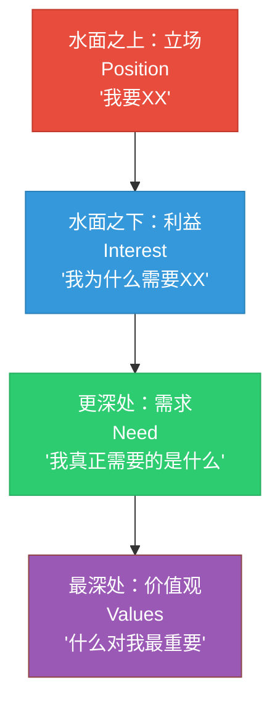
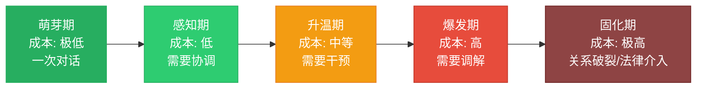
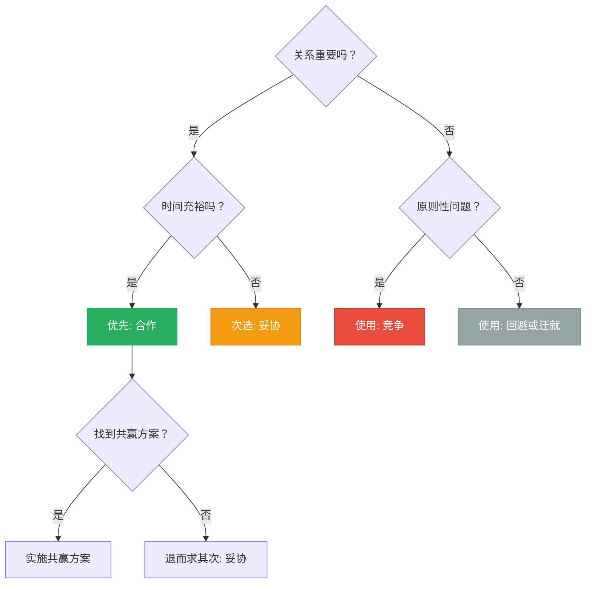
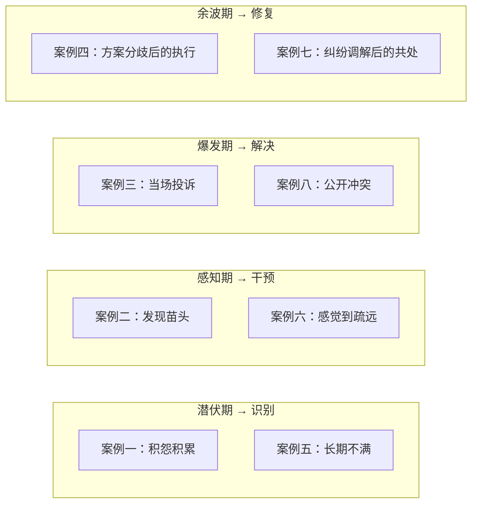
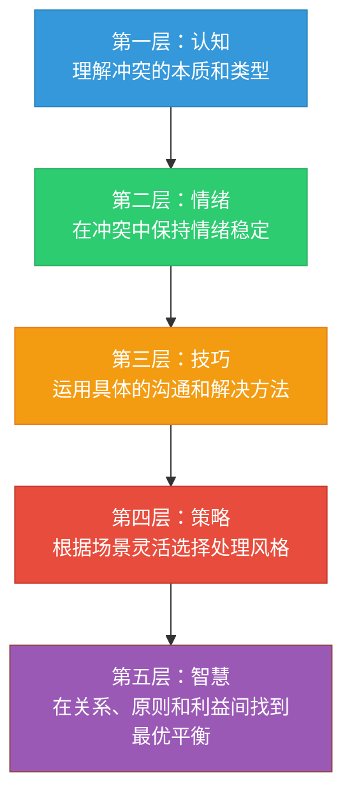

# 实战案例总结

## 从八个场景中提炼的冲突管理全景

前面八个案例覆盖了冲突发生的最典型场景——同事争执、上下级冲突、客户投诉、团队分歧、家庭矛盾、朋友误会、邻里纠纷、公共场合冲突。这些场景横跨职场与生活，涵盖权力对等与不对等的关系，涉及情绪爆发与隐性积怨两种模式。单独看每个案例，它是特定情境下的应对方案；放在一起看，它们构成了冲突管理的完整实践图谱。

本节不是简单地复述"学到了什么"，而是从八个案例中**提炼可迁移的底层规律**，将碎片化的经验升华为系统性的方法论。

---

## 一、贯穿所有案例的五条核心原则

### 原则一：先处理情绪，再处理问题

在所有八个案例中，情绪失控都是冲突升级的直接催化剂。案例一中同事争执时的怒气、案例三中客户投诉时的委屈、案例五中家庭矛盾中的积怨爆发——表面上看是"事情"引发了冲突，实际上是**未被管理的情绪**让冲突从分歧升级为对抗。

**为什么情绪优先于问题？** 神经科学给出了明确答案：当人处于强烈情绪状态时，杏仁核（Amygdala）会劫持前额叶皮层（Prefrontal Cortex）的理性思考功能，这就是心理学家Daniel Goleman所说的"杏仁核劫持"（Amygdala Hijack）。在这种状态下，人的认知能力退化到接近本能反应的水平——无法理性分析、无法换位思考、无法创造性地解决问题。你跟一个情绪激动的人讨论解决方案，就像对一台死机的电脑执行复杂程序，根本不会有响应。

哈佛医学院的研究显示，强烈的愤怒情绪会导致皮质醇水平飙升到正常值的3-5倍，持续时间可达20-60分钟。在这段时间内，人的工作记忆容量下降约40%，这意味着对方不仅听不进你说的话，甚至连自己说过什么都记不清。所以，试图在情绪高峰期解决问题，本质上是在对抗生物学规律。

**操作要点：**

| 情绪处理步骤 | 具体做法 | 话术示例 | 预期效果 |
|------------|---------|---------|---------|
| 识别情绪信号 | 注意语速加快、音量提高、面部紧绷、呼吸急促、手指紧握 | "我注意到你现在很生气/很沮丧。" | 让对方感到被看见 |
| 承认情绪合理性 | 不否定、不评判、不对抗 | "你的感受完全可以理解，换成是我也会这样。" | 降低防御心理 |
| 创造缓冲空间 | 暂停讨论，给彼此冷静的时间 | "我们都先缓一缓，十分钟后继续聊？" | 恢复理性思考 |
| 引导情绪表达 | 用开放式问题鼓励对方说出感受 | "能告诉我你现在最在意的是什么吗？" | 将情绪能量转化为问题描述 |
| 共同命名情绪 | 帮对方精确识别自己的情绪状态 | "听起来你不是生气，更多是失望和委屈？" | 精确命名可降低情绪强度 |

**关键区分：** 处理情绪≠纵容情绪。处理情绪的目的是让双方回到理性对话的频道上，而不是无限期地倾倒负面感受。一般情况下，5-15分钟的情绪缓冲就足以让一个人从"战斗模式"切换回"对话模式"。UCLA心理学家Matthew Lieberman的研究发现，仅仅是"给情绪命名"这个动作，就能使杏仁核的活跃度降低约30%——这就是所谓的"affect labeling"效应。

**常见误区：**

| 错误做法 | 为什么错 | 正确做法 |
|---------|---------|---------|
| "你冷静一点！" | 命令式语气会火上浇油 | "我需要一分钟整理一下思路，你也喝口水？" |
| "这有什么好生气的？" | 否定对方的情绪体验 | "我能感受到这件事对你影响很大。" |
| "别激动，听我说" | 只关注自己的表达需求 | "你先说，我在听。" |
| 立刻讲道理摆事实 | 情绪未消退时理性无法启动 | 先沉默倾听，等语速和音量自然下降 |

### 原则二：从立场转向利益

案例二中上下级冲突时，上级坚持"你必须按我说的做"（立场），下级坚持"我的方案更好"（立场），双方在立场层面拉锯，陷入僵局。但当引导双方说出"为什么"时，上级的真实利益是"确保项目按时交付"，下级的真实利益是"保证技术方案的可维护性"——这两个利益并不矛盾，完全可以找到兼顾的方案。

哈佛谈判项目的奠基人Roger Fisher在《Getting to Yes》中提出了一个经典的"冰山模型"：

**为什么立场谈判注定低效？** 因为立场是"二元对立"的——要么A赢，要么B赢，没有中间地带。而利益往往是"多元兼容"的——A的核心需求和B的核心需求可能完全不冲突，只是被立场的外衣遮蔽了。Fisher的研究团队分析了数百个谈判案例后发现，约70%的谈判僵局源于双方在立场层面纠缠，而一旦深入到利益层面，超过80%的僵局都能找到创造性的解决方案。

**从立场到利益的转换话术：**

| 当对方说（立场） | 你可以问（挖掘利益） | 可能的深层利益 |
|----------------|-------------------|--------------|
| "我要求加薪20%" | "能说说是什么让你觉得现在需要调整薪资吗？" | 可能是觉得付出不被认可，而非真的只看数字 |
| "这个方案我不同意" | "你最担心这个方案会带来什么问题？" | 可能是担心自己负责的模块受影响 |
| "你必须在周五前完成" | "周五这个时间节点背后的关键约束是什么？" | 可能是下周一有客户演示，实际deadline是周日晚 |
| "我不要跟这个人合作" | "在合作过程中最让你不舒服的是什么？" | 可能是沟通方式不匹配，而非人格排斥 |
| "这个功能必须做" | "这个功能解决了用户的什么问题？" | 可能有其他方式解决同一个用户痛点 |

**核心技巧：** 多问"为什么"和"是什么让你在意"，少说"但是"和"你应该"。每多挖一层，解决问题的选项空间就会扩大一倍。同时注意，挖掘利益不是审讯——要用好奇和关心的语气，而非追问和质疑的语气。"你能帮我理解一下……"比"你到底为什么……"有效十倍。

### 原则三：寻找共赢方案而非零和妥协

案例四中团队内部分歧、案例七中邻里纠纷，最终的解决都依赖于创造性地找到了满足各方核心利益的方案。这与简单的"各退一步"有本质区别——妥协是双方都不满意的折中，共赢是双方都认可的最优解。

**妥协与共赢的本质区别：**

| 维度 | 妥协（Compromise） | 共赢（Collaboration） |
|------|-------------------|---------------------|
| 思维模式 | "你让一点，我让一点" | "我们一起想想还有什么可能" |
| 结果感受 | 双方都有所失，满意度中等 | 双方核心需求被满足，满意度高 |
| 信息交换 | 各自保留底线，讨价还价 | 充分交换信息，理解对方真正需要什么 |
| 创造性 | 低——在已有的饼上切分 | 高——尝试把饼做大 |
| 适用场景 | 时间紧迫、利益确实对立 | 有时间深入探讨、关系重要 |
| 关系影响 | 短期解决，但可能留下"我没赢"的遗憾 | 加深理解和信任，关系反而更强 |
| 后续执行 | 双方动力不足，容易反复 | 双方认同方案，执行意愿强 |

**寻找共赢方案的四步法：**

1. **列出各方核心利益清单**——不带评判地记录每一方"真正需要什么"。注意区分"想要"（want）和"需要"（need）："我想坐靠窗的位置"是想要，"我需要安静不被打扰"是需要。需要可以用多种方式满足。
2. **识别共同利益**——找到各方利益的交集，这是合作的基础。哪怕在最激烈的冲突中，双方通常也有共同利益——比如"都希望事情得到解决""都不想关系彻底破裂""都希望减少时间和精力的消耗"。
3. **扩大选项空间**——头脑风暴所有可能的方案，不做任何评判和筛选。关键规则：这个阶段禁止说"不行""不可能""不现实"。数量比质量重要，疯狂的想法往往能激发可行的方案。
4. **评估与选择**——用各方利益清单作为评判标准，选择满足最多核心利益的方案。如果完美方案不存在，按利益优先级排序——满足每个人最核心的1-2个利益，次要利益可以协商。

**案例四的复盘举例：** 团队对技术方案有分歧，A方案性能好但开发周期长，B方案开发快但扩展性差。双方的立场对立（"用A"vs"用B"），但利益其实可以兼顾——核心功能用B快速上线抢占市场窗口，同时预留A方案的架构接口，二期迭代时替换。这不是妥协，是把时间维度纳入考量后的创造性方案。

**头脑风暴的实操技巧：**

- **换场地**：离开会议室，去咖啡厅或户外，物理环境的改变能激发思维的灵活性
- **引入外部视角**：如果双方僵持，问"如果是我们的客户/用户，他们会希望怎样？"
- **用"如果"开头**：如果时间不是问题、如果预算无限、如果没有技术限制……去掉约束条件后再逐步加回来
- **角色互换**：让A说出B的三个核心利益，让B说出A的三个核心利益——对方往往比你自己更清楚你的利益

### 原则四：关系先于道理

案例五（家庭矛盾）和案例六（朋友误会）最深刻地揭示了这一原则：在重要的关系中，"分清对错"往往是最不划算的策略。

心理学家John Gottman在长达40年的婚姻研究中发现，关系的存续不取决于"谁更有道理"，而取决于**积极互动与消极互动的比例**。他的研究表明，稳定的关系中积极与消极互动的比例至少为5:1（即所谓的"Gottman比率"）。每一次"赢了道理、伤了感情"的冲突，都会大幅拉低这个比率。

Gottman的研究还有一个惊人的发现：他可以通过观察一对夫妻15分钟的对话，以93.6%的准确率预测他们是否会离婚。预测依据不是冲突的频率或内容，而是四种致命的沟通模式——他称之为"末日四骑士"：

| 致命模式 | 表现 | 冲突管理中的对应错误 |
|---------|------|-------------------|
| **批评（Criticism）** | 攻击对方的人格而非行为 | "你就是不负责任" vs "这件事你没有按时完成" |
| **蔑视（Contempt）** | 翻白眼、嘲讽、冷嘲热讽 | "你又来了""你每次都这样" |
| **防御（Defensiveness）** | 拒绝承认任何问题，推卸责任 | "这不是我的错""你才……" |
| **石墙（Stonewalling）** | 沉默、冷暴力、拒绝回应 | 摔门、不接电话、冷战数天 |

**关系优先的操作框架：**

- **区分"可赢"和"不可赢"的争论**——涉及原则和底线的问题要坚持（不可让步的），涉及偏好和方法的问题可以灵活（可以放手的）。判断标准：五年后这件事还重要吗？如果不重要，放手。
- **用"认可"代替"反驳"**——在表达不同意见之前，先认可对方的感受或立场中合理的部分："你说得对，这件事确实让人不舒服。我的看法略有不同……"
- **关注"怎么说"而非"说什么"**——同一个意思，温和表达和尖锐表达的效果天差地别。语气、措辞、时机比内容本身更重要。加州大学洛杉矶分校的研究表明，人际沟通中只有7%的信息通过语言内容传递，38%通过语调，55%通过肢体语言。
- **冲突后主动修复**——案例六中朋友之间的误会之所以能化解，关键是一方在冷静后主动打了一个电话："之前我说话太冲了，对不起。"Gottman的研究发现，冲突后24小时内发起修复尝试的一方，其关系的长期稳定性显著高于等待对方先开口的一方。

**一个实用判断标准：** 在开口之前问自己——"五年之后，这件事还重要吗？如果关系破裂了，我会后悔吗？"如果答案是"不重要"或"会后悔"，那就优先保护关系。

### 原则五：预防胜于治疗

案例一（同事争执）和案例四（团队分歧）中，很多冲突如果在萌芽阶段就被识别和处理，代价要小得多。一个眼神的不满、一句被忽视的抱怨、一次未被回应的求助——这些都是冲突的早期信号。如果这些信号被忽略，不满就会像滚雪球一样积累，最终在某个引爆点以远超原始问题的烈度爆发。

**冲突预防的三个层面：**

| 层面 | 预防措施 | 具体做法 | 检查频率 |
|------|---------|---------|---------|
| **制度层面** | 建立常态化的沟通机制 | 团队周会、家庭议事会、一对一面谈、匿名反馈渠道 | 每周/每月 |
| **关系层面** | 持续投资信任关系 | 日常善意互动、及时认可、兑现承诺、主动关心 | 每天 |
| **觉察层面** | 培养冲突信号敏感度 | 留意语气变化、沉默增多、协作意愿下降、迟到/缺席增多 | 持续 |
| **环境层面** | 营造安全的表达氛围 | 鼓励不同意见、不惩罚坦诚的反馈、示范脆弱性 | 持续 |

**冲突成本递增模型：**

每一个阶段的推迟处理，都会让解决成本至少翻倍。在萌芽期，一次坦诚的5分钟对话就能化解；到了爆发期，可能需要专业的调解人、数次正式会谈、甚至法律介入。Gallup的一项组织行为研究显示，职场冲突如果在萌芽阶段处理，平均耗时2小时、几乎零成本；如果拖延到爆发阶段，平均耗时80小时以上，且往往伴随人员流失。

**冲突早期信号的识别清单：**

- 语言信号：说话变少、回应变短（"嗯""随便""都行"）、语气变得平淡或讽刺
- 行为信号：回避眼神接触、减少非必要互动、协作意愿下降、开始记录"证据"
- 情绪信号：频繁叹气、容易烦躁、笑容减少、抱怨增多
- 社交信号：拉拢第三方站队、在背后议论、公开场合冷淡

---

## 二、TKI模型在八大场景中的应用复盘

Thomas-Kilmann冲突模式工具（TKI）是贯穿本章的核心理论框架。回顾八个案例，每种冲突处理风格都有其适用的高光时刻：

| 案例 | 最有效的TKI风格 | 为什么这个风格有效 | 需要避免的风格 | 环境关键变量 |
|------|---------------|-------------------|--------------|------------|
| 案例一：同事争执 | **合作** | 双方权力对等，需要长期协作 | 竞争（加剧对立） | 长期关系+对等权力 |
| 案例二：上下级冲突 | **迁就+合作** | 权力不对等，先接纳再引导 | 竞争（下级直接对抗上级代价大） | 权力不对等+持续关系 |
| 案例三：客户投诉 | **迁就→合作** | 先安抚情绪，再解决问题 | 回避（客户会升级投诉） | 服务义务+声誉风险 |
| 案例四：团队分歧 | **合作** | 需要整合不同观点找到最优方案 | 迁就（放弃好方案会留下隐患） | 共同目标+多元观点 |
| 案例五：家庭矛盾 | **妥协+合作** | 关系比输赢重要 | 竞争（赢了道理输了亲情） | 情感纽带+长期共处 |
| 案例六：朋友误会 | **迁就→合作** | 先化解情绪，再澄清事实 | 回避（误会会发酵） | 情感信任+信息不对称 |
| 案例七：邻里纠纷 | **妥协→合作** | 先缓解紧张，再建立共处规则 | 竞争（长期邻居，对抗成本高） | 空间约束+弱关系 |
| 案例八：公共场合冲突 | **回避/妥协** | 与陌生人无需分出胜负 | 竞争（公共场合升级有安全风险） | 无未来关系+公共空间 |

**核心洞察：** 没有一种TKI风格是"万能的"。成熟的冲突管理者具备灵活切换风格的能力——根据冲突的性质（任务冲突vs关系冲突）、关系的重要性（长期关系vs一次性交互）、权力的对等性（对等vs不对等）、时间的紧迫性（充裕vs紧急）来选择最合适的风格。

Thomas和Kilmann在其原始研究中发现，大约60%的人在压力下会固守一种冲突风格，只有约5%的人能够在五种风格之间灵活切换。而那些能够灵活切换的人，在冲突解决的满意度、关系维护、结果质量三个维度上的得分，都显著高于固守单一风格的人。

**风格选择的决策树：**

**五种TKI风格的进阶理解：**

| 风格 | 核心特征 | 最佳时机 | 最差时机 | 内在风险 |
|------|---------|---------|---------|---------|
| **竞争** | 坚持己见，追求赢 | 紧急决策、原则问题、对方在利用你 | 关系重要、双方都有道理 | 损害关系，制造敌人 |
| **迁就** | 让步对方，维护关系 | 对方更有道理、关系远比议题重要 | 你有更好方案、反复被要求让步 | 被视为软弱，需求被忽视 |
| **回避** | 暂时搁置，不直面冲突 | 情绪激动时、议题不重要、需要时间思考 | 问题紧迫、回避会被解读为不在乎 | 问题积累，最终爆发 |
| **妥协** | 各退一步，折中方案 | 时间紧迫、双方势均力敌、需要临时方案 | 有更好的创新方案可能、一方核心利益被牺牲 | 双方都不完全满意 |
| **合作** | 共同探索，创造共赢 | 关系重要且时间充裕、双方愿意开放对话 | 时间极度紧迫、一方完全不愿合作 | 耗时较长，需要双方投入 |

---

## 三、冲突解决的通用流程模板

从八个案例中抽象出来的标准化流程，可应用于任何冲突场景：

### 第一步：暂停与降温（1-5分钟）

**目标：** 阻止冲突进一步升级，为理性对话创造条件。

- 如果自己情绪激动：深呼吸3次（吸4秒-屏4秒-呼6秒的4-4-6呼吸法），对自己说"我现在很生气，但我可以控制"
- 如果对方情绪激动：降低音量和语速，不反驳，不打断，用点头和"嗯"表示在听
- 如果现场气氛紧张：提议换个地方、喝杯水、休息几分钟

**绝对禁止的言行：**

| 禁忌行为 | 为什么有害 | 替代方案 |
|---------|----------|---------|
| 翻旧账（"你上次也是这样！"） | 将单一事件升级为"人格模式"，让对方感到被全面否定 | 聚焦当前事件："我们先解决眼前这件事。" |
| 人身攻击（"你就是这种人！"） | 从讨论问题变成攻击人格，触发对方的自我防御 | 对事不对人："这个做法让我很困扰。" |
| 绝对化表述（"你总是……""你从来不……"） | 以偏概全，对方会举反例反驳，偏离主题 | 量化表述："最近三次项目中，有两次出现了……" |
| 摔门而去（回避不等于离开） | 未告知的离开会被解读为轻蔑和拒绝 | 明确表达："我需要20分钟冷静，之后我们继续谈。" |
| 冷暴力（沉默对抗） | 让对方在不确定中煎熬，比直接冲突更具破坏性 | 即使需要空间，也明确表达："我现在说不清楚，给我点时间整理。" |

### 第二步：倾听与理解（5-15分钟）

**目标：** 真正理解对方的立场、感受和利益。

运用"我"陈述法（I-Statement）引导双方表达：

模板：当你 [具体行为] 的时候，我感到 [具体感受]，因为 [具体影响]。
      我希望 [具体期望]。

示例：当你在会议上直接否定我的方案时，我感到被忽视和沮丧，
      因为我花了很多时间准备。我希望你能在我说完之后再提出不同意见。

**"我"陈述法的常见错误与纠正：**

| 错误的"我"陈述 | 问题所在 | 正确的"我"陈述 |
|---------------|---------|---------------|
| "我觉得你很自私" | "我觉得"后面跟的是对对方的评判 | "当你只考虑自己的需求时，我感到不被重视" |
| "我觉得你不在乎我" | 隐含指责，对方会反驳"我怎么不在乎了" | "当你忘了我们的约定时，我感到失望" |
| "我感到你很烦" | "感到"后面跟的是对对方的形容词 | "当你反复问我同一个问题时，我感到有些疲惫" |

倾听的黄金法则：在你说出"但是"之前，先让对方确认"你听懂了"。

**复述确认话术：**
- "让我确认一下我理解的对不对——你的意思是……"
- "所以你最在意的是……对吗？"
- "我能理解你为什么会这样想/感受。"
- "如果我站在你的角度，我可能也会有同样的反应。"

**深度倾听的三个层次：**

| 层次 | 内容 | 示例 |
|------|------|------|
| **听事实** | 对方说了什么具体的事 | "你说项目延期了三天" |
| **听感受** | 对方的情绪状态是什么 | "听起来你很焦虑" |
| **听需求** | 对方真正想要什么 | "你其实是希望得到更多的支持和资源" |

大多数人只停留在第一层，导致"听到但没听懂"。真正的倾听需要穿透到第三层。

### 第三步：定义问题（5-10分钟）

**目标：** 将模糊的情绪冲突转化为明确的、可讨论的具体问题。

**问题定义的三要素：**
1. **具体行为**——是什么具体的行为或事件引发了冲突？（而非"你这个人怎样"）
2. **实际影响**——这个行为对工作/关系/利益造成了什么具体影响？
3. **共同目标**——在解决这个问题上，双方希望达到什么共同目标？

**引导话术：** "我们先不讨论谁对谁错，能不能一起确认一下——我们希望解决的核心问题是什么？"

**问题定义的检验标准：**

一个好的问题定义应该满足以下条件：
- 双方都同意这是"我们要解决的问题"（而非一方认为是问题，另一方不认同）
- 问题可以被具体描述，而非模糊的"态度不好""不够重视"
- 问题在双方的能力范围内可以被解决（不涉及第三方或不可控因素）
- 问题的解决能让双方都受益

如果定义出的问题只有一方认为是问题，说明还没有充分倾听；如果问题太大无法一次解决，需要拆解为更小的子问题。

### 第四步：利益挖掘与方案生成（10-20分钟）

**目标：** 超越立场层面的争论，在利益层面寻找创造性的解决方案。

**操作流程：**
1. 各方列出自己的核心利益（不是立场，是利益）
2. 找出共同利益——"我们都希望……"
3. 头脑风暴可能的方案——此阶段不评判，只追求数量
4. 用利益清单筛选方案——选择满足最多核心利益的方案
5. 细化方案细节——谁做什么、什么时候、怎么衡量

**头脑风暴的"三不"规则：**
- **不评判**：任何方案都先记下来，不评价好坏
- **不否定**：不说"这不行""这不现实"
- **不求完美**：先追求数量，再筛选质量

### 第五步：达成共识与行动承诺（5-10分钟）

**目标：** 将讨论结果转化为明确的、可执行的行动计划。

**共识记录的SMART原则：**
- **S**pecific（具体）：明确的行动项——"每周三下午提交进度报告"而非"多沟通"
- **M**easurable（可衡量）：有清晰的完成标准——"客户满意度评分≥4.5"而非"改善服务"
- **A**chievable（可实现）：在能力范围内——考虑资源、时间、技能的现实约束
- **R**elevant（相关）：直接解决冲突中的问题——每个行动项都能追溯到具体的利益需求
- **T**ime-bound（有时限）：明确的截止日期——"6月30日前完成"而非"尽快"

**确认话术：** "我们确认一下——你负责A，我负责B，下周五之前完成。如果遇到问题，我们及时沟通。你看还有遗漏吗？"

**防止共识崩塌的三个保障：**

| 保障措施 | 具体做法 | 目的 |
|---------|---------|------|
| 书面记录 | 将共识写成文字，双方确认 | 避免记忆偏差和"我没说过" |
| 中期检查点 | 设置1-2个中间节点检查进度 | 及时发现偏差，防止到期才发现问题 |
| 退出机制 | 明确"如果方案不可行，我们怎么办" | 降低执行压力，给双方安全感 |

### 第六步：关系修复与跟进（持续进行）

**目标：** 巩固冲突解决的成果，修复关系裂痕。

- 24小时内主动跟进一次——"昨天聊的那个事情，你觉得进展怎么样？"
- 一周后做一次简短回顾——"上次的方案运行得还好吗？需要调整吗？"
- 在后续的互动中刻意增加积极互动——一句认可、一次帮忙、一个微笑
- 如果执行中出现偏差，及时沟通而非积累不满

---

## 四、八大场景的跨维度分析

### 4.1 按冲突类型分析

| 冲突类型 | 对应案例 | 核心特征 | 处理关键 | 误判风险 |
|---------|---------|---------|---------|---------|
| **任务冲突** | 案例一、案例四 | 对工作内容、方案、方法的分歧 | 聚焦事实和数据，用逻辑说服 | 容易演变为关系冲突（"你反对我的方案=你反对我这个人"） |
| **关系冲突** | 案例五、案例六 | 人际信任受损，情感伤害 | 先修复情感，再处理具体事务 | 容易被误认为是任务冲突（"我们只是意见不同"） |
| **过程冲突** | 案例二、案例四 | 对"谁做什么、怎么做"的分歧 | 明确角色分工和流程规范 | 常被忽视，积累成更大的不满 |
| **利益冲突** | 案例三、案例七 | 资源分配、权益受损 | 从立场转向利益，寻找共赢分配方案 | 容易陷入讨价还价的零和思维 |
| **价值冲突** | 案例八 | 价值观和行为准则的碰撞 | 尊重差异，划定边界，不强求认同 | 试图说服对方改变价值观（几乎不可能） |

**关键洞察：** 研究表明，约80%的冲突从任务或过程冲突开始，如果处理不当，会在3-5次交锋后升级为关系冲突。关系冲突一旦形成，修复成本是原始冲突的10倍以上。因此，冲突管理的第一要务是防止任务冲突"情感化"。

### 4.2 按权力关系分析

**权力对等场景（案例一、四、六）：** 双方地位平等，合作是首选策略。难点在于谁先做出让步的姿态——先示弱的人往往被误读为"理亏"。破解方法：用"我理解你的立场，同时我也有自己的考虑"这种兼顾双方的表述开头，既不示弱也不对抗。

**权力不对等场景（案例二、三）：** 权力弱势方（下属、消费者）面临的挑战是如何有效表达诉求而不被视为"不服管"或"无理取闹"。关键策略：
- 弱势方：用"我需要你的帮助"代替"你应该……"，将对抗关系转化为求助关系
- 强势方：主动表达"你的反馈对我很重要"，降低对方的表达门槛

**权力不对等场景的特殊技巧：**

| 角色 | 核心挑战 | 策略 | 话术示例 |
|------|---------|------|---------|
| **弱势方** | 担心被报复、不被重视 | 用数据和事实说话，减少主观感受 | "根据数据显示……我希望我们能找到改善的方案" |
| **强势方** | 下属不敢说真话 | 主动邀请反馈，表达安全承诺 | "我希望听到真实的想法，这不会影响对你的评价" |
| **弱势方** | 直接对抗风险高 | 借助第三方或制度渠道 | "我想通过HR了解一下这个决定的依据" |
| **强势方** | 不知道自己的盲点 | 定期进行匿名下属反馈 | 360度评估、匿名意见箱 |

**陌生人场景（案例七、八）：** 没有关系基础，没有未来预期，冲突的核心目标是"快速平息"而非"深度解决"。策略优先级：回避 > 妥协 > 迁就。不要试图跟陌生人讲道理，成本太高、收益太低。

### 4.3 按冲突阶段分析

**核心启示：** 冲突越早介入，处理成本越低，结果越好。如果在潜伏期就识别到信号（对方的沉默、回避、小声抱怨），一次私下对话就能化解。等到爆发期再处理，不仅要应对激烈的情绪，还要修复已经造成的关系损伤。

### 4.4 文化维度分析

在中国文化语境下，冲突管理有其特殊性，需要额外注意以下几个维度：

| 文化因素 | 对冲突的影响 | 应对策略 |
|---------|------------|---------|
| **面子（Face）** | 公开冲突会让双方都"丢面子"，导致防御升级 | 尽量私下沟通，给对方台阶下，避免当众指出错误 |
| **关系（Guanxi）** | 关系网络中的冲突会影响更广泛的人际圈 | 处理冲突时考虑第三方的感受和立场 |
| **和谐（Harmony）** | "以和为贵"可能导致冲突被压抑而非解决 | 建立安全的表达渠道，鼓励小冲突及时释放 |
| **等级（Hierarchy）** | 下级对上级的冲突表达受到文化约束 | 强势方主动创造表达空间，弱势方善用书面渠道 |
| **含蓄（Indirectness）** | 不直接表达不满，通过行为暗示 | 注意非语言信号，主动询问"有什么我可以改进的" |

**面子管理的实操技巧：**

- **给面子**：在指出问题之前，先肯定对方的贡献或能力。"你在XX方面做得很出色，这次的事情我们可以一起看看怎么能做得更好。"
- **保面子**：不在公开场合批评，不在第三方在场时讨论敏感问题。
- **找台阶**：当对方明显犯错时，帮他找到外部原因。"这个情况确实比较复杂，换了谁可能都会遇到类似的困难。"
- **还面子**：冲突解决后，在公开场合给予对方正面评价，修复其社会形象。

---

## 五、从案例中提炼的高阶技巧

### 5.1 "战略性示弱"的力量

案例二中，下级面对上级的压力时，没有选择硬碰硬，而是先承认"确实是我考虑不周"，再提出自己的建议。这种"战略性示弱"不是真的认输，而是一种高明的沟通策略——通过降低对方的防御心理，为后续的理性对话打开空间。

**为什么示弱反而有力量？** 社会心理学家Robert Cialdini的"互惠原则"给出了解释——当你先做出让步或承认不足时，对方会感到一种隐性的"回报压力"，倾向于也在某个方面做出回应。这不是操控，而是在利用人类社会互动的基本法则来创造合作空间。

**适用场景：** 权力不对等的关系中、对方情绪激动时、你需要争取时间思考时。

**话术模板：**
- "你说得有道理，我之前确实没有考虑到这个方面。"
- "我理解你为什么这样想，如果我是你，可能也会有同样的反应。"
- "这件事我也有做得不好的地方。"
- "你提到的这个角度我确实忽略了，谢谢你的提醒。"

**战略性示弱的边界：**
- 示弱的内容应该是真实的不足，而非捏造的——否则一旦被识破，信任彻底崩塌
- 示弱不等于全盘否定自己——承认一个不足的同时，可以坚持另一个立场
- 不要在原则性问题上示弱——示弱是策略，不是价值观

### 5.2 "外部化"冲突

案例四中，引导团队将冲突从"你vs我"转化为"我们vs问题"。这种"外部化"技术将对抗关系转化为合作关系——把冲突的主体从两个人变成人与问题。

**话术示范：**
- 不说"你总是延期" → 说"我们的项目进度遇到了挑战"
- 不说"你的方案不行" → 说"这个方案在XX方面还需要优化"
- 不说"你让我很失望" → 说"这个结果跟我们的预期有差距"
- 不说"你为什么不配合" → 说"我们在协作流程上好像遇到了一些障碍"

**外部化的核心逻辑：** 把"人"从问题中剥离出来。当人们不再感到自己被攻击时，才有精力和意愿去解决问题。叙事疗法（Narrative Therapy）的核心理念就是"人不是问题，问题才是问题"。

### 5.3 "换框"技术

案例七中，邻里纠纷的突破点是把"噪音问题"重新定义为"作息差异问题"。前者的框架暗示"有人做错了事"，后者的框架暗示"两个人的生活方式不同"——后者的框架更容易引发共情而非指责。

**换框的三种常用手法：**

| 换框类型 | 原始框架 | 换框后 | 效果 | 适用场景 |
|---------|---------|-------|------|---------|
| 从"问题"到"差异" | "你总是迟到" | "我们的时间观念不太一样" | 降低指责感 | 习惯、偏好类冲突 |
| 从"故意"到"无意" | "你是故意针对我" | "可能我们之间有些误解" | 降低敌意 | 信任受损的冲突 |
| 从"过去"到"未来" | "你每次都这样" | "以后我们怎么避免这个问题" | 引向解决方案 | 反复发生的冲突 |
| 从"缺陷"到"需求" | "你太固执了" | "你对这个方案有很强的信念" | 重新定义为积极品质 | 评价性冲突 |
| 从"对抗"到"合作" | "你反对我的意见" | "你有不同的视角" | 将分歧转化为资源 | 方案讨论类冲突 |

### 5.4 "暂停-重启"协议

案例一和案例五都展示了"在冲突中按下暂停键"的重要性。但暂停不是逃跑——需要一个明确的"重启协议"，否则暂停就变成了回避。

**暂停协议模板：**
1. "我现在情绪有点激动，说下去可能会说出不该说的话。"
2. "我们暂停30分钟，各自冷静一下。"
3. "30分钟后我们回到这里继续讨论，我会带着更冷静的心态。"
4. （重启后）"谢谢你给我时间冷静。我现在准备好了，我们继续。"

**暂停协议的关键要素：**

| 要素 | 为什么重要 | 示例 |
|------|----------|------|
| 明确原因 | 让对方知道不是逃避 | "我需要冷静一下，不是不想解决" |
| 明确时长 | 消除不确定性 | "30分钟后继续"而非"改天再说" |
| 明确地点 | 避免"暂停"变成"消失" | "我们就在这个会议室" |
| 明确承诺 | 表达解决问题的诚意 | "我会回来的" |

### 5.5 "第三方介入"的艺术

当双方陷入僵局时，引入第三方是打破平衡的有效手段。但第三方的选择和介入方式至关重要：

| 第三方类型 | 适用场景 | 角色定位 | 注意事项 |
|-----------|---------|---------|---------|
| **共同信任的人** | 朋友误会、家庭矛盾 | 情感调解者 | 选择真正中立的人，而非"谁的朋友" |
| **上级/领导** | 同事争执、团队分歧 | 权威裁判者 | 领导应引导而非裁决，避免成为"法官" |
| **专业调解人** | 邻里纠纷、客户投诉 | 流程引导者 | 保持中立，不预设立场 |
| **HR/合规部门** | 职场权力冲突、骚扰 | 制度保障者 | 确保保密性和公正性 |

---

## 六、案例背后的心理学原理

### 6.1 归因偏差（Attribution Bias）

案例一和案例六中都存在典型的归因偏差——人们倾向于将他人的不良行为归因于"人品问题"（内部归因），将自己的不良行为归因于"情境所迫"（外部归因）。这就是心理学中经典的"基本归因错误"（Fundamental Attribution Error）。

| 你的行为 | 你自己的解释 | 你对别人的解释 |
|---------|------------|--------------|
| 自己迟到 | "路上堵车了" | "他不守时，不尊重人" |
| 自己发火 | "我压力太大了" | "他脾气差，情商低" |
| 自己犯错 | "信息不充分" | "他能力不行" |
| 自己拒绝合作 | "我有更重要的事" | "他不配合，没有团队精神" |

斯坦福大学心理学家Lee Ross的研究发现，即使人们被告知某人的行为是被外部情境强制的（比如被告知要写支持某立场的文章），观察者仍然倾向于认为这反映了该人的真实态度。这种偏差如此根深蒂固，以至于仅仅是"知道"这个偏差的存在，并不足以消除它——需要持续的刻意练习。

**破解方法：** 当你想对别人的行为下"人格判断"时，先问自己三个问题——
1. "如果我在同样的情境下，会不会做出类似的行为？"
2. "他最近是不是遇到了什么压力或困难？"
3. "有没有除了'人品差'之外的其他解释？"

**实操练习——"三种解释法"：** 每当你对某人的行为感到愤怒时，强迫自己列出三种可能的解释——至少一种要包含善意的动机。例如，同事没有回复你的邮件：(1) 他故意忽视你；(2) 他被紧急任务缠住了；(3) 邮件进了垃圾箱他根本没看到。当你有了多种解释后，你的情绪反应就不会那么极端，你也更可能选择一个建设性的沟通方式。

### 6.2 确认偏差（Confirmation Bias）

案例六中朋友之间的误会之所以越闹越大，是因为一旦形成了"他不把我当朋友"的判断，就会不自觉地只关注支持这个判断的信息，忽略反面证据。这就是确认偏差——我们倾向于寻找、解读和记住那些证实我们已有信念的信息。

确认偏差在冲突中的危害是"自我实现的预言"——当你认定对方有敌意时，你会对他的每一个行为做出敌意解读，而你的敌意解读又会引发对方的真实敌意，最终你的预言成真。

**破解方法：** 当你对某人形成了负面判断后，刻意寻找三个"反证"——三个不能被你的负面判断解释的行为或事实。如果找不到反证，说明你的判断可能是对的；如果找到了，说明你需要修正判断。

**具体操作——"证据审判法"：**
1. 写下你对对方的判断（"他故意针对我"）
2. 列出支持这个判断的证据
3. 列出不支持这个判断的证据
4. 像法官一样评估：如果这些证据拿到法庭上，能否"定罪"？
5. 如果不能定罪，说明你的判断需要修正

### 6.3 损失厌恶（Loss Aversion）

案例三中客户投诉的激烈程度往往超出问题本身——因为人们对"损失"的敏感度大约是"获得"的2倍（Kahneman & Tversky, 1979）。一个价值200元的产品出了问题，客户的愤怒程度大约相当于获得400元快乐的程度。这就是为什么客户投诉时的情绪反应经常"不成比例"——对你来说是小问题，对客户来说是大损失。

**损失厌恶在冲突中的体现：**

| 场景 | 损失感受 | 对方的反应强度 | 你的应对 |
|------|---------|--------------|---------|
| 产品出了问题 | 损失了金钱+时间+信任 | "不成比例"的愤怒 | 先补偿损失，再谈解决方案 |
| 被排除在项目外 | 损失了参与感+归属感+职业发展机会 | 对抗或消极怠工 | 确认其价值，给出参与路径 |
| 方案被否决 | 损失了时间投入+专业认同感 | 防御或反击 | 认可投入，解释否决的具体原因 |
| 朋友说了伤人的话 | 损失了安全感+信任感 | 疏远或报复 | 真诚道歉，用行动重建信任 |

**操作启示：** 处理投诉时，先"补偿损失"（道歉、退款、替换），再"给予额外"（折扣券、赠品）。先消除损失感，再创造获得感，双管齐下才能真正平息不满。注意顺序——如果先给额外好处再道歉，对方会觉得你在"收买"他，效果适得其反。

### 6.4 镜像神经元效应

案例八中公共场合的冲突之所以容易升级，与镜像神经元（Mirror Neurons）有关——当一个人提高音量时，另一个人的大脑会不自觉地"镜像"这个行为，也提高音量。情绪和行为在人际间具有传染性，尤其是在封闭空间中。

意大利帕尔马大学的Giacomo Rizzolatti团队在1990年代发现了镜像神经元系统。后续研究发现，不仅动作会被镜像，情绪状态也会通过面部表情、语调、身体姿态被"传染"。这就是为什么在紧张的会议中，只要有一个人开始防御性地双臂交叉，很快所有人都会不自觉地做出同样的姿势。

**操作启示：** 当对方提高音量时，你降低音量；当对方加快语速时，你放慢语速。用你的冷静"传染"对方，而不是被对方的激动"传染"。

**"情绪传染"的阻断技巧：**
- **物理距离**：适当增加与对方的距离（1.5米以上），降低情绪传染的强度
- **呼吸同步**：做3次深而慢的呼吸，你的生理状态会影响对方的潜意识
- **语言锚定**：在回应中使用"平静""从容""一起"等词汇，用语言引导情绪方向
- **姿态镜像（反向）**：刻意采用开放、放松的身体姿态，对方的大脑会下意识地模仿

---

## 七、个人冲突管理能力自评表

以下自评表整合了八个案例中涉及的关键能力维度。请根据自己的实际表现打分（1-5分），找到需要重点提升的方向。

| 能力维度 | 1分（几乎做不到） | 3分（有时能做到） | 5分（稳定做到） | 你的评分 |
|---------|----------------|-----------------|---------------|---------|
| **情绪调控** | 冲突中经常口不择言、摔门走人 | 有时能控制，压力大时失控 | 几乎总能保持冷静和理性 | ☐1 ☐2 ☐3 ☐4 ☐5 |
| **积极倾听** | 对方没说完就打断、反驳 | 能听完，但经常在准备反驳 | 真正理解对方的感受和需求 | ☐1 ☐2 ☐3 ☐4 ☐5 |
| **利益识别** | 只看到表面立场 | 有时能挖掘到深层利益 | 稳定地透过立场看到利益 | ☐1 ☐2 ☐3 ☐4 ☐5 |
| **"我"陈述** | 习惯用"你总是"指责 | 知道方法但经常忘记用 | 自然地用"我感到"表达 | ☐1 ☐2 ☐3 ☐4 ☐5 |
| **方案创造** | 非此即彼，要么A要么B | 有时能找到折中方案 | 稳定地创造共赢方案 | ☐1 ☐2 ☐3 ☐4 ☐5 |
| **关系维护** | 冲突后等对方先低头 | 有时会主动修复 | 总是主动修复关系 | ☐1 ☐2 ☐3 ☐4 ☐5 |
| **冲突预防** | 冲突爆发了才意识到 | 有时能察觉早期信号 | 稳定地在萌芽期就介入 | ☐1 ☐2 ☐3 ☐4 ☐5 |
| **风格灵活** | 只有一种应对方式 | 能根据情况部分调整 | 自如切换五种TKI风格 | ☐1 ☐2 ☐3 ☐4 ☐5 |
| **换位思考** | 只从自己角度看问题 | 有时能站到对方角度 | 稳定地理解对方的合理性 | ☐1 ☐2 ☐3 ☐4 ☐5 |
| **事后复盘** | 冲突完就完了 | 偶尔会反思 | 每次冲突都系统复盘 | ☐1 ☐2 ☐3 ☐4 ☐5 |

**评分解读：**
- **40-50分：冲突管理高手**——你具备成熟的冲突应对能力，在大多数场景中都能游刃有余。建议开始帮助他人提升冲突管理能力，教学相长。
- **30-39分：进阶学习者**——你有不错的基础，但在某些特定场景或能力维度上仍有提升空间。找到自己的短板维度，针对性地练习。
- **20-29分：成长阶段**——你已经意识到冲突管理的重要性，但还需要大量的练习和实践。建议从低风险场景开始，逐步积累信心。
- **10-19分：入门阶段**——建议从情绪调控和积极倾听两个基础能力开始练习，这两个能力是所有冲突管理技巧的地基。

**行动计划模板：**

我的冲突管理提升计划

1. 我的最强维度是：_______________（继续保持）
2. 我的最弱维度是：_______________（重点提升）
3. 下一次冲突中我要练习的一个技巧是：_______________
4. 我找到的"冲突教练"是：_______________
5. 我的复盘笔记本在：_______________
6. 一个月后我会重新做这个评估，目标分数：____ → ____

---

## 八、快速参考卡片

### 遇到冲突时的5秒决策清单

1. 我现在情绪稳定吗？          → 不稳定 → 先深呼吸3次
2. 这个关系对我重要吗？        → 重要 → 优先保护关系
3. 这是原则性问题吗？          → 是 → 坚持立场但保持尊重
4. 我理解对方的真实需求吗？    → 不理解 → 先问"为什么"
5. 有没有双方都能接受的方案？  → 有 → 提出讨论；没有 → 头脑风暴

### 冲突中的"五要五不要"

| 五要 | 五不要 |
|------|--------|
| 要用"我"陈述表达感受 | 不要用"你"指责攻击人格 |
| 要倾听对方说完再回应 | 不要在对方说话时准备反驳 |
| 要聚焦具体行为和事实 | 不要翻旧账、算总账 |
| 要在冷静后讨论解决方案 | 不要在情绪顶点做决定 |
| 要在冲突后主动修复关系 | 不要等对方先低头认错 |

### 不同场景的首选策略速查

| 场景 | 首选策略 | 一句关键话术 | 绝对不能说的话 |
|------|---------|------------|--------------|
| 同事争执 | 合作 | "我们的目标是一样的，一起想想办法？" | "你根本不懂技术" |
| 上下级冲突 | 先迁就后合作 | "我理解你的考虑，我有一个补充的想法。" | "你凭什么指挥我" |
| 客户投诉 | 先迁就后合作 | "非常抱歉给你带来了困扰，我来帮你解决。" | "这不是我们的问题" |
| 团队分歧 | 合作 | "我们把各自的理由和顾虑都说出来。" | "少数服从多数" |
| 家庭矛盾 | 妥协+合作 | "不管怎样，我们的关系比这件事重要。" | "你跟你妈一样" |
| 朋友误会 | 先迁就后合作 | "之前我可能没表达清楚，能给我个机会解释吗？" | "你太敏感了" |
| 邻里纠纷 | 妥协 | "我们都是邻居，商量一个大家都能接受的办法。" | "你再这样我报警" |
| 公共场合冲突 | 回避/妥协 | （不值得纠缠，安全离开即可） | "你算什么东西" |

### 冲突升级的红灯信号

当出现以下任何一个信号时，立即暂停对话：

- 音量持续升高超过30秒
- 出现人身攻击性语言（"你就是……""你这种人……"）
- 一方开始摔东西、拍桌子等肢体动作
- 双方都在说话，没有人真正在听
- 出现威胁性语言（"你给我等着""我让你好看"）
- 一方开始哭泣且无法控制

---

## 九、从案例到行动：给读者的三条建议

### 建议一：从最小的冲突开始练习

不要等到重大冲突来临时才"实战演练"。日常生活中有大量的低风险冲突机会——意见不一致的讨论、对服务不满意的沟通、与家人对家务分工的协商。这些低风险场景是练习冲突管理技能的最佳训练场。每一次成功的低风险冲突处理，都在为你积累应对高风险冲突的信心和经验。

**低风险练习的具体场景：**

| 场景 | 练习的技能 | 具体做法 |
|------|----------|---------|
| 餐厅菜品不满意 | "我"陈述+利益表达 | "我点的是少盐的，这个偏咸了，能帮我处理一下吗？" |
| 快递送错了地址 | 情绪调控+事实陈述 | "我收到的地址不对，我的正确地址是XX，能重新安排吗？" |
| 家人忘了做家务 | 换框+非暴力沟通 | "看起来今天很忙，我们一起把厨房收拾了？" |
| 朋友迟到了 | 关系优先+温和表达 | "等了一会儿有点担心你，下次提前说一声就好。" |
| 同事工作风格不同 | 外部化+寻求共识 | "我们的工作节奏不太一样，找个都能接受的方式？" |

### 建议二：建立你的"冲突复盘"习惯

每次经历冲突之后（无论是你参与的还是观察到的），花5分钟回答以下三个问题：
1. **这次冲突的根本原因是什么？**（是任务分歧、利益冲突、还是情绪积累？）
2. **我/当事人用了哪种TKI风格？效果如何？**
3. **如果重来一次，我会怎么处理？**

把这个复盘记录在一个笔记本或手机备忘录中。三个月后回顾，你会清晰地看到自己的进步轨迹和反复出现的模式。

**复盘模板：**

日期：_______________
场景：_______________（职场/家庭/社交/公共）
冲突类型：_______________（任务/关系/过程/利益/价值）
我的TKI风格：_______________（竞争/迁就/回避/妥协/合作）
结果：_______________（好/一般/差）
情绪调控：_______________（1-5分）
做得好的地方：_______________
需要改进的地方：_______________
下次遇到类似情况我会：_______________

### 建议三：找到你的"冲突教练"

在你的生活或工作中，找一个你认为冲突管理能力很强的人——观察他/她在冲突中的言行举止、使用的语言和策略。如果可能的话，与这个人建立定期交流的关系，请他/她在你经历冲突后给予反馈。有经验的旁观者往往能看到你自己看不到的盲点。

**如何选择冲突教练：**
- 他/她在冲突中既不退缩也不激进
- 他/她能在不伤害关系的前提下解决问题
- 他/她愿意坦诚地给你反馈，而非只说好话
- 他/她的冲突风格是你希望学习的方向

**如何利用冲突教练：**
- 发生冲突后，详细描述场景，请他/她分析"如果是你会怎么做"
- 观察他/她在真实冲突中的表现，注意语言和非语言细节
- 定期回顾你的复盘记录，请他/她指出你的进步和盲点
- 遇到棘手的冲突时，事先讨论应对策略

---

## 十、常见冲突管理误区与纠正

### 误区一："冲突都是坏事"

**真相：** 功能性冲突（任务冲突、过程冲突）实际上是创新和改进的催化剂。哈佛商学院的研究表明，适度的任务冲突能将团队决策质量提升约30%。关键不是消除冲突，而是管理冲突的类型和强度——将冲突保持在任务层面，防止其情感化。

### 误区二："沟通能解决一切"

**真相：** 在某些情况下，沟通不是解决方案，反而可能是问题的一部分。当一方有严重的权力滥用、人格障碍或恶意行为时，"好好沟通"的建议不仅无效，还可能让弱势方承受更多伤害。正确的做法是设立边界、引入制度保障、在必要时寻求外部帮助。

### 误区三："先让步的人输了"

**真相：** 先让步的人往往掌握着冲突的主导权。因为让步创造了互惠空间，改变了冲突的走向，从对抗转向合作。在博弈论的重复博弈模型中，率先合作的"以牙还牙"（Tit-for-Tat）策略在长期中的总收益远高于始终对抗的策略。

### 误区四："情绪化是不专业的表现"

**真相：** 完全压抑情绪和情绪失控同样有害。研究表明，适度表达情绪（"这件事让我很担心"）不仅不会降低专业形象，反而能增加沟通的真实性和有效性。关键是"表达情绪"而非"情绪化表达"——说出你的感受，但不要让感受控制你的行为。

### 误区五："理性的方案一定会被接受"

**真相：** 人类决策的80%以上由情绪驱动，理性只是事后合理化工具（神经科学家Antonio Damasio的"躯体标记假说"）。即使你的方案逻辑完美，如果对方的情绪没有被处理好，方案仍然会被拒绝。先处理情绪，再呈现方案——这个顺序不能颠倒。

### 误区六："回避冲突就是成熟"

**真相：** 回避是五种TKI风格之一，有其适用场景，但"总是回避"不是成熟，是恐惧。长期回避冲突会导致三个后果：不满积累到无法控制的程度、对方认为你的底线可以被不断突破、你自己丧失表达需求的能力。真正的成熟是知道什么时候回避、什么时候面对。

---

## 十一、冲突管理的进阶框架：从个人技能到组织能力

### 11.1 个人层面：冲突管理的五层能力模型

从认知到智慧，每一层都建立在前一层的基础之上。没有对冲突本质的理解，就无法正确评估自己的情绪；没有情绪的稳定，再好的技巧也无法施展；没有技巧的支撑，策略只是空中楼楼阁；没有策略的灵活运用，智慧就无法在具体场景中落地。

### 11.2 团队层面：建设性冲突文化的四个支柱

| 支柱 | 内涵 | 具体措施 |
|------|------|---------|
| **心理安全感** | 团队成员敢于表达不同意见而不担心被惩罚 | 领导者率先承认错误、鼓励质疑、不秋后算账 |
| **冲突规范** | 团队有明确的冲突处理流程和行为准则 | 制定团队沟通协议、冲突升级路径、调解机制 |
| **常态化反馈** | 反馈是日常工作的一部分，而非危机时才发生 | 每周一对一、月度复盘、匿名反馈渠道 |
| **冲突复盘** | 每次冲突后团队共同学习和改进 | 冲突后无责复盘会、提炼改进行动项 |

### 11.3 组织层面：冲突管理的制度化

| 制度 | 目的 | 实施要点 |
|------|------|---------|
| **冲突调解制度** | 为无法自行解决的冲突提供正式渠道 | 设立调解人、制定调解流程、确保保密性 |
| **360度反馈机制** | 从多角度了解冲突的根源 | 定期实施、匿名保护、结果用于发展而非考核 |
| **跨部门协作协议** | 减少部门间的过程冲突 | 明确接口人、响应时限、升级路径 |
| **新员工冲突管理培训** | 从源头提升冲突管理能力 | 作为入职培训的一部分、含案例演练 |

---

## 十二、本节小结

八个案例，八种场景，一套方法论。冲突管理的本质不是"消除冲突"——冲突作为人类社会的常态，不可能被消除。冲突管理的本质是**将破坏性冲突转化为建设性对话的能力**。

这种能力由五个层次构成，每个层次对应本节的核心内容：

| 能力层次 | 核心内容 | 本节对应章节 |
|---------|---------|------------|
| 认知层 | 理解冲突的本质和类型 | 第四节（跨维度分析）+第六节（心理学原理） |
| 情绪层 | 在冲突中保持情绪稳定 | 第一节（原则一：先处理情绪） |
| 技巧层 | 运用具体的沟通和解决方法 | 第三节（通用流程模板）+第五节（高阶技巧） |
| 策略层 | 根据场景灵活选择处理风格 | 第二节（TKI模型复盘）+决策树 |
| 智慧层 | 在关系、原则和利益间找到最优平衡 | 第一节（五条核心原则）+第十节（误区纠正） |

**三个立即可用的行动：**

1. **今天就开始**：用本节的自评表给自己打分，找到最需要提升的一个维度
2. **本周就练习**：在一次低风险冲突中练习一个新技巧（建议从"我"陈述法开始）
3. **本月就建立**：开始写冲突复盘日志，找一位冲突教练，建立你的冲突管理成长体系

最终，冲突管理的最高境界不是"再也不发生冲突"，而是**能够自信地说："冲突来了，我能处理好。"**

这种自信不是盲目的——它来自对冲突本质的深刻理解、对自身情绪的稳定掌控、对沟通技巧的熟练运用、对处理策略的灵活选择，以及在关系、原则和利益之间找到最优平衡的持续修炼。

每一个案例都是一面镜子，照见你在冲突中的真实状态。每一次实践都是一块砖石，铺设你通往冲突管理智慧的道路。从今天开始，把冲突从你生活中的"威胁"，转变为成长的"契机"。
