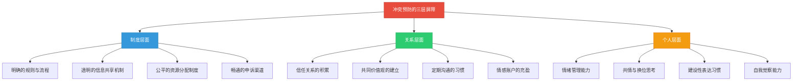
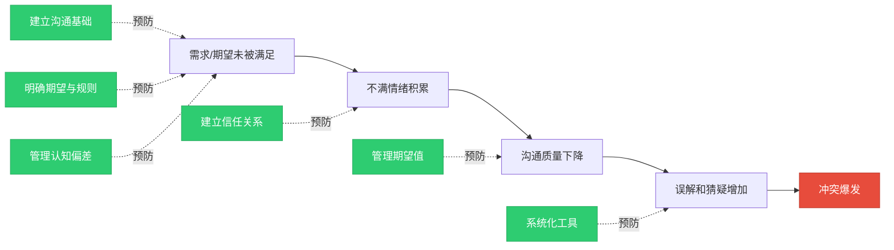

## 一、冲突预防

> "上医治未病，中医治欲病，下医治已病。"——《黄帝内经》
>
> "预防冲突的最佳时机，是在双方还没有意识到需要预防的时候。"——多伊奇（Morton Deutsch），冲突心理学奠基人

冲突管理的最高境界不是在冲突爆发后如何巧妙化解，而是在冲突形成之前就消除隐患。这就像医学中的预防医学——成本最低、效果最好、痛苦最小。本节将系统讲解冲突预防的完整方法论，从认知底层的思维转变到日常可执行的操作习惯，从个人层面的情绪管理到组织层面的制度设计，从面对面沟通的预防技巧到数字时代的远程协作防冲突策略，帮助你在冲突的萌芽阶段就将其化解。

---

### 1.1 为什么预防优于治疗：冲突预防的理论基础

#### 1.1.1 冲突成本的"冰山模型"

大多数人只看到冲突的显性成本——争吵中的时间消耗、情绪伤害、关系破裂。但冲突的真实成本远不止于此。冲突成本就像一座冰山，水面之上只是冰山一角：

| 成本层次 | 具体表现 | 估算占比 | 可见程度 |
|---------|---------|---------|---------|
| **显性成本** | 直接对抗时间、调解费用、法律诉讼费、HR介入工时 | 约10%~15% | 高——容易量化 |
| **隐性成本** | 决策延迟、创造力抑制、合作意愿下降、信息传递效率降低 | 约25%~35% | 中——需要刻意追踪才能发现 |
| **机会成本** | 本可用于产出的精力被内耗、人才流失、错失合作窗口 | 约30%~40% | 低——只有事后回顾才能察觉 |
| **系统成本** | 组织文化恶化、信任体系崩塌、防御性行为增加、"多做多错"心态蔓延 | 约15%~25% | 极低——已成为"常态"后难以归因 |

CPP Global（MBTI母公司）2008年发布的《职场冲突调查报告》显示，美国职场中一名普通员工每年因冲突浪费约28小时直接参与冲突的时间，另有约24小时用于"因为担心冲突而回避必要对话"——两项合计超过50小时。换算成经济成本，以美国平均时薪30美元计算，**一名员工每年因冲突产生的直接和间接成本约为1,500美元**。一个500人的组织，年冲突成本可达75万美元。

2022年智联招聘的《中国职场人冲突管理白皮书》进一步揭示：**73.6%的职场人曾因冲突处理不当而考虑离职**，其中38.2%的人最终选择了离职。如果以一名员工离职后重新招聘和培训的成本（通常是年薪的50%~200%）来计算，一次因冲突导致的人才流失，其成本可能高达数万到数十万元。

冲突预防的价值在于：它直接削减的是冰山水面之下的隐性成本——那些你甚至意识不到正在发生的损失。更重要的是，预防投入的时间和精力远远小于冲突爆发后的善后成本。

#### 1.1.2 冲突预防的杠杆效应

管理学中有一个"1-10-100法则"：预防问题的成本是1，发现问题后修复的成本是10，问题爆发后处理的成本是100。在冲突管理领域，这个法则的倍率甚至更大：

具体的成本对比：

| 阶段 | 典型行动 | 时间投入 | 关系损耗 | 后续影响 |
|------|---------|---------|---------|---------|
| **预防阶段** | 一次15分钟的期望对齐对话 | 15~30分钟 | 几乎为零 | 建立信任，强化关系 |
| **识别阶段** | 一次坦诚的反馈谈话 | 30~60分钟 | 极低 | 展示沟通意愿 |
| **干预阶段** | 冲突一旦升级，调解需要数小时甚至数天 | 数小时至数天 | 中等 | 双方都留下记忆痕迹 |
| **修复阶段** | 关系破裂后的重建 | 数周至数月 | 严重 | 可能无法完全恢复 |

一个真实案例可以帮助理解杠杆效应的力度：某互联网公司产品团队，产品经理和技术负责人之间因为需求优先级产生分歧。如果在需求评审会上花10分钟明确优先级标准（预防），就不会发生后续两人互相抱怨、团队分裂为两派、最终一人离职的连锁反应。一次10分钟的预防性对话，可以节省数千小时的善后成本和数十万元的人员替换费用。

#### 1.1.3 系统性预防 vs. 个人努力

冲突预防不是单靠某个人"多忍让"或"好好说话"就能实现的。有效的冲突预防需要在三个层面同时建立屏障：

三个层面缺一不可：

- **只有制度没有信任**：制度会被阳奉阴违。员工找到制度的漏洞，在"合规"的名义下进行隐性对抗。比如，制度规定了反馈流程，但缺乏信任的团队成员会通过"抄送领导"等方式进行隐性施压。
- **只有信任没有制度**：信任会在利益冲突面前不堪一击。口头承诺、模糊的权责分配、缺乏文档化的共识——这些在小团队中可能管用，但当利益足够大或人员足够多时，信任的弹性就会被拉断。
- **只有个人修养没有外部支持**：个人的善意会在系统性问题面前无力回天。一个情绪管理能力极强的人，如果面对的是一个制度不公、信息不透明的系统，他的善意最终会被消耗殆尽。

#### 1.1.4 冲突预防的神经科学基础

理解冲突预防的必要性，还需要了解大脑在冲突情境中的工作机制。神经科学家约瑟夫·勒杜（Joseph LeDoux）的研究揭示了一个关键机制：**杏仁核劫持（Amygdala Hijack）**。

当大脑感知到威胁（包括人际冲突中的心理威胁）时，杏仁核会比前额叶皮层更早做出反应——它跳过理性分析，直接触发"战或逃"反应。这个过程大约只需要12毫秒，而前额叶皮层做出理性判断则需要数百毫秒。这意味着：**在冲突情境中，你的大脑会在你还没来得及思考之前就已经进入了战斗状态。**

冲突预防的价值，从神经科学角度看，是**在杏仁核还没有被激活的状态下，通过理性的沟通和制度安排来消除触发源**。预防相当于在杏仁核被激活之前就拆除了炸弹的引信——而冲突解决则是在炸弹已经爆炸之后进行排爆，难度和风险完全不在一个量级。

压力荷尔蒙的持续影响也值得关注。一次激烈的冲突会导致皮质醇水平在体内持续升高24~48小时。在这段时间内，人的判断力、创造力和合作意愿都会显著下降。如果冲突频繁发生，慢性升高的皮质醇会导致"情绪疲劳"——当事人变得对冲突信号过度敏感或麻木，两种状态都不利于有效的冲突预防。

这就是为什么冲突预防不仅仅是"避免不愉快"的问题，而是保护团队认知资源和情感能力的战略问题。

---

### 1.2 建立良好的沟通基础

预防冲突的根基在于建立开放、透明、信任的沟通文化。Harvard Negotiation Project的研究表明，**80%以上的职场冲突可以追溯到沟通不充分或沟通方式不当**。这意味着，改善沟通本身就是最有效的冲突预防手段。

#### 1.2.1 建立定期沟通机制

定期沟通的价值不仅仅在于"信息交换"，更在于创造一个**制度化的安全空间**——让不满和担忧有固定的出口，而不是在日常互动中以非建设性的方式爆发。没有定期沟通机制的关系，就像没有排污管道的城市——废水不会消失，只是在地下积累，直到某天从最意想不到的地方涌出。

**团队层面的定期沟通设计：**

| 沟通形式 | 频率 | 核心目的 | 操作要点 | 冲突预防价值 |
|---------|------|---------|---------|------------|
| **站会/晨会** | 每日 | 信息同步、阻塞暴露 | 控制在15分钟内，每人回答三个问题：昨天做了什么、今天计划做什么、遇到了什么阻碍 | 及时暴露工作障碍，防止小问题积累成大矛盾 |
| **周度回顾会** | 每周 | 进度校准、问题暴露 | 预留15~20分钟讨论"本周遇到的摩擦和不顺畅"，使用"玫瑰-刺-花蕾"框架：好的/坏的/期待的 | 定期清理情绪垃圾，建立"问题可以被讨论"的规范 |
| **月度一对一** | 每月 | 深度对话、关系维护 | 管理者与团队成员单独沟通，关注"工作体验"而非仅"工作进度"。核心问题："最近有什么让你不舒服的？""你需要我做什么改变？" | 发现个人层面的隐性不满，防止积累到爆发点 |
| **季度复盘会** | 每季度 | 系统性回顾、规则优化 | 用"做得好的/需要改进的/要尝试的"框架进行结构化讨论，重点审视"我们的协作规则是否需要更新" | 制度层面的冲突预防，避免同类问题反复出现 |
| **年度关系审计** | 每年 | 全面关系评估 | 回顾过去一年中所有的摩擦点、修复情况和改善措施，制定下一年的协作改进计划 | 长期关系的系统性维护 |

**家庭层面的定期沟通设计：**

家庭中的冲突预防同样需要结构化的沟通机制，而非依赖"等出了事再谈"。

- **家庭议事会**：每周选一个固定时间（比如周六早餐），全家人坐在一起讨论本周的安排、感受和需求。关键规则：每个人都有平等的发言权，不打断、不批评、不翻旧账。议事会的议程可以包括：本周的开心事、本周的烦恼、下周的安排、需要家人帮忙的事情。
- **情感温度计**：每天晚饭时，每人用1~10分描述今天的"情感温度"。不是要深入讨论，而是让大家养成关注彼此情绪状态的习惯。当某人的温度持续偏低时，可以在私下进一步关心。这个做法的冲突预防价值在于：它让每个人的情绪状态变得"可见"——很多冲突的根源是"我不知道你最近压力这么大"。
- **月度家庭会议**：讨论更宏观的话题——家庭目标、财务规划、假期安排、孩子教育方向等。这些话题如果缺乏正式讨论的机会，往往会在日常琐碎中以冲突的方式浮现。家庭会议的关键是：提前发出议程、确保每人都有发言时间、记录决定事项并在下次跟进。
- **夫妻/伴侣定期check-in**：每周花30分钟，两人坐下来，不看手机，不谈家务，只谈"我们"。核心问题："你觉得我们最近的关系状态怎么样？""有什么事情你想让我知道的？""下周你需要我怎样支持你？"

**定期沟通的关键执行原则：**

1. **固定时间和地点**：不要"有空再聊"——"有空"永远不会到来。把它写入日程表，像对待客户会议一样对待它。研究表明，将沟通机制"仪式化"（固定时间、固定地点、固定流程）可以显著提高执行率。
2. **有结构但不僵化**：使用议程模板确保不遗漏重要话题，但保留灵活空间让自发的对话发生。最有效的沟通不是严格按照议程走完全程，而是在结构化的框架中允许自然的对话流动。
3. **轮流主持**：避免一个人垄断话语权。轮流主持既能培养每个人的参与感，也能让不同视角得到表达。在团队中，轮流主持还能培养每个人的组织能力和全局视角。
4. **记录和跟进**：关键决定和行动项必须记录下来并在下次跟进。未兑现的承诺比没有承诺更糟糕——它会直接摧毁信任。记录不需要复杂，一个共享文档或群消息中的"会议纪要"即可。
5. **不惩罚"坏消息"**：定期沟通的冲突预防价值，取决于参与者是否愿意说出真实的问题。如果每次有人提出问题都遭到反驳或忽视，定期沟通就会沦为形式。管理者和家庭中的核心成员需要做到：听到"坏消息"的第一反应是感谢，而不是解释或辩解。

#### 1.2.2 培养开放表达的氛围

很多人在工作中选择沉默，不是因为没有想法，而是因为**说真话的成本太高**。Google在2012年启动的"亚里士多德项目"（Project Aristotle）研究了180个团队后发现，**心理安全感（Psychological Safety）是高效团队的第一要素**——比技能、经验、资源都重要。

心理安全感的核心含义是：团队成员相信，即使自己犯了错、提了不同意见、承认了不懂的事情，也不会受到惩罚或嘲笑。哈佛商学院教授艾米·埃德蒙森（Amy Edmondson）将心理安全感定义为"一种团队成员共享的信念——团队可以安全地承担人际风险"。

心理安全感对冲突预防的意义是：它降低了"说真话"的成本。当说真话的成本降低时，不满和担忧会在萌芽阶段就被表达出来，而不是被压抑到积累成冲突。

**培养心理安全感的五项具体做法：**

**第一，领导者率先示范脆弱性。** 当管理者主动说"这个问题我不确定答案""上次我的判断是错的""我需要你们的帮助"时，团队成员才会相信"承认不足是安全的"。神经科学研究表明，当领导者展示脆弱性时，会激活团队成员大脑中的镜像神经元系统，促使他们做出相同的开放行为。具体做法：在团队会议中，管理者定期分享自己最近犯的一个错误以及从中学到了什么。注意：分享的错误必须是真实的，而不是精心筛选的"安全错误"——团队成员能轻易分辨出哪些是真正的脆弱，哪些是表演。

**第二，对异议给予正向回应。** 当有人提出不同意见时，第一反应应该是"谢谢你提出这个视角"，而不是"但是"或"你不懂"。即使最终不采纳该意见，也要说明原因并肯定提出者的参与。具体话术："这个角度我之前没想到，让我重新考虑一下。""虽然我们最终选择了方案A，但你提出的方案B中的X部分确实可以借鉴。""你的担心是合理的，我会在推进过程中重点关注这个风险。"一个实用的技巧：在听到异议时，先停顿3秒再回应——这个短暂的停顿能帮助你从自动防御模式切换到理性分析模式。

**第三，区分"挑战想法"和"挑战人"。** 明确告诉团队："我们鼓励对想法的激烈讨论，但不接受对人的攻击。"在讨论中使用"这个方案的风险在于……"而不是"你怎么会想出这种方案"。具体的语言规范：

| 可以说 | 不能说 |
|--------|--------|
| "这个方案的成本可能超预算" | "你是不是没做过预算？" |
| "这个时间线我觉得有风险" | "你总是拍脑袋定日期" |
| "我理解你的出发点，但执行上可能有问题" | "你根本不了解实际情况" |
| "我想从另一个角度补充一下" | "你说的不对" |

**第四，建立匿名反馈渠道。** 对于特别敏感的话题，匿名反馈可以降低表达的心理门槛。匿名渠道的形式可以包括：匿名问卷（每季度一次）、匿名意见箱（物理或电子的）、匿名的"红黄绿灯"信号系统（绿灯=一切正常，黄灯=有一些担忧，红灯=有严重问题需要讨论）。但要注意：匿名渠道是"补充"而非"替代"——最终目标是让人在面对面沟通中也能坦诚表达。过度依赖匿名渠道可能意味着心理安全感严重不足，需要从根本上改善团队文化。

**第五，对"报忧者"给予保护。** 如果某个团队成员提出了一个不受欢迎的问题或预警，而他因此受到排挤或惩罚，那么所有人都会收到一个信号："报忧不如报喜。"从此以后，问题只会被隐藏而非解决。保护报忧者的具体做法：公开感谢提出问题的人；在问题得到解决后，再次提到"多亏了XX在早期提醒我们"；当有人试图攻击报忧者时，管理者需要立即介入并明确表态。

#### 1.2.3 保持信息透明

信息不对称是冲突的温床。当人们不了解决策的背景、资源的分配方式、他人的工作进展时，往往会用最坏的假设去填补信息空白。心理学中的"归因偏差"（Attribution Bias）在此起着关键作用：人们倾向于把他人的行为归因于性格和意图（"他是故意的"），而把自己的行为归因于外部环境（"我是没办法"）。信息不对称会极大地放大这种偏差。

**信息透明的四个维度：**

| 维度 | 内容 | 常见问题 | 预防措施 | 透明程度建议 |
|------|------|---------|---------|------------|
| **决策透明** | 决策的依据、过程和考量因素 | "为什么他能升职我不能？""为什么资源给了那个项目？" | 公布决策标准和权重，提前沟通评估维度 | 决策标准100%透明；具体个人评估可适度保留 |
| **进度透明** | 各方的工作进展、遇到的困难 | "他们部门怎么还没交付？""他到底在忙什么？" | 使用共享看板（如Trello、飞书文档），定期同步进度和阻塞点 | 项目级进度100%透明；个人工作细节可按需共享 |
| **意图透明** | 各方的真实需求、担忧和底线 | "他们到底想要什么？""是不是在算计我？" | 鼓励直接表达需求而非猜测，用"我希望……因为……"的句式 | 核心需求和优先级透明；具体策略可保留 |
| **情感透明** | 各方的真实感受和情绪状态 | "他看起来不高兴，是不是对我有意见？" | 建立情感表达的习惯，用"我感到……"而非"你让我……"的句式 | 基本情绪状态可以表达；深层情感隐私尊重个人边界 |

**信息透明的边界：**

透明不意味着"什么都要说"。过度透明和信息不足同样有害。以下情况需要谨慎处理：

- **个人隐私**：他人有权选择不分享某些个人信息。不要以"透明文化"为名侵犯个人边界。
- **未成熟的决策**：过早分享未经验证的想法可能引起不必要的焦虑。一个还在讨论阶段的裁员预案，如果过早泄露，会导致整个团队人心惶惶。信息共享的时机很重要——太早和太晚都有风险。
- **他人的秘密**：被要求保密的信息不能以"透明"为名公开。信任是双向的：你被委托了保密义务，违背它会摧毁整个信任体系。
- **时机敏感的信息**：裁员计划、业务重组等重大信息需要在确认后、在合适的时机、以合适的方式公布。先让核心管理层知情并做好预案，再逐步扩大知情范围。
- **竞争性信息**：如果团队之间存在竞争关系（比如多个团队竞争同一个资源），某些策略信息的过早透明可能会削弱自身的谈判地位。

透明的核心原则是：**涉及他人的决策，在执行之前告知；影响他人的变化，在发生之前沟通。** 这不是要征得每个人的同意，而是给予每个人知情和准备的权利。

#### 1.2.4 数字时代的沟通预防：远程协作中的冲突防范

随着远程办公和分布式团队的普及，冲突预防面临新的挑战。文字沟通（即时消息、邮件、文档评论）缺少语气、表情和肢体语言等非语言信息，**误解率比面对面沟通高出4~5倍**（Byron, 2008年研究）。以下是数字时代特有的冲突预防策略：

**异步沟通的规则设定：**

| 规则 | 具体要求 | 冲突预防价值 |
|------|---------|------------|
| **回复时间预期** | 明确每种渠道的期望回复时间：即时消息=2小时内，邮件=24小时内，文档评论=48小时内 | 消除"为什么不回我消息"的不满 |
| **消息优先级标记** | 使用统一的标记系统：🔴紧急=立即回复，🟡重要=今天内回复，🟢普通=按节奏回复 | 避免所有消息都被当作紧急处理导致的压力 |
| **语气校准** | 发送前默读一遍，去除可能被误解为攻击性的表述；必要时使用表情符号软化语气 | 减少文字沟通中的误读 |
| **复杂话题不文字讨论** | 涉及情绪、分歧或敏感话题时，转为视频通话或面对面沟通 | 文字不适合处理高情感密度的话题 |

**远程团队的特殊预防措施：**

- **虚拟茶歇时间**：每周安排15~30分钟的非工作性视频聊天，让远程成员之间建立个人连接。研究表明，远程团队中"纯粹的工作关系"比"有个人了解的工作关系"冲突概率高2.3倍。
- **视频优先原则**：重要讨论和决策会议要求开启摄像头。非语言信息（面部表情、肢体语言）占沟通信息量的60%以上，缺少这些信息会显著增加误解概率。
- **文档化共识**：远程团队的口头共识特别容易"蒸发"。所有重要决定、讨论要点和行动项必须有书面记录，存放在团队共享的可访问位置。
- **定期"关系健康检查"**：每两周进行一次匿名的团队关系状态调查，包括"你觉得团队沟通是否充分？""你是否有未表达的担忧？""你与团队成员的关系状态如何？"——结果匿名汇总后分享给全团队。

---

### 1.3 明确期望与规则

模糊的期望和规则是冲突的温床。当人们对"什么是可接受的行为""谁负责什么""资源如何分配"这些问题没有清晰共识时，冲突的概率会大幅增加。组织行为学的研究反复证实：**角色模糊（Role Ambiguity）和角色冲突（Role Conflict）是职场冲突的两大结构性根源。**

#### 1.3.1 明确角色与职责

当两个人对"这件事该谁做"有不同的理解时，要么出现工作遗漏，要么出现争夺地盘——两者都会导致冲突。更隐蔽的情况是：双方都"以为对方在做"，结果谁都没做，等到问题暴露时互相指责。

**RACI矩阵的使用方法：**

RACI是一个经典的角色澄清工具，将每个任务中的每个人定义为以下四种角色之一：

- **R（Responsible，负责执行）**：实际完成工作的人，可以有多人
- **A（Accountable，最终负责）**：对结果负最终责任的人，每个任务只能有一个A
- **C（Consulted，咨询）**：在决策前需要被咨询的人，双向沟通——必须在决策前征询其意见
- **I（Informed，知会）**：需要被通知决策结果的人，单向沟通——决策做出后告知即可

**示例：产品发布流程的RACI矩阵**

| 任务 | 产品经理 | 开发负责人 | 测试工程师 | 市场部 |
|------|---------|-----------|-----------|--------|
| 需求定义 | A/R | C | C | I |
| 技术方案设计 | C | A/R | C | I |
| 代码开发 | I | A/R | C | - |
| 测试执行 | I | C | A/R | - |
| 上线决策 | A | R | R | I |
| 市场推广 | R | I | - | A/R |

使用RACI的关键注意事项：

1. **每个任务有且只有一个A**：多头负责等于无人负责。如果有两个A，那么当结果出问题时，两个人都会认为"那不是我的责任"。
2. **避免全员R**：如果所有人都被标记为"负责执行"，说明任务粒度太细或拆分不当。R应该具体到"谁实际动手做这件事"。
3. **C和I的区别必须明确**：C需要在决策前被征询意见（双向沟通），I只需在决策后被通知（单向沟通）。混淆两者会导致两种问题：把C当作I，会让人觉得"你做了决定才告诉我，根本没把我的意见当回事"；把I当作C，会拖慢决策效率。
4. **定期更新**：随着项目进展，角色分配可能需要调整。建议每个迭代或里程碑结束后审视一次RACI。
5. **与当事人确认**：RACI不是上级单方面制定的，需要与每个角色的承担者确认并达成共识。单方面分配的角色缺乏承诺感。

**RACI之外的补充工具——DACI框架：**

对于决策类事项（而非执行类事项），DACI框架更适用：
- **D（Driver，推动者）**：推动决策过程的人，负责收集信息、协调各方、推进决策
- **A（Approver，审批者）**：拥有最终决策权的人
- **C（Contributor，贡献者）**：提供信息和建议的人
- **I（Informed，知会者）**：决策做出后被通知的人

很多冲突的根源是"谁有权决定什么"的模糊。DACI框架在决策做出之前就明确了权属，避免了"我以为我有决定权""你以为你有决定权"的尴尬对峙。

**家庭场景中的角色澄清：**

家庭中的很多冲突同样源于角色模糊。"家务该谁做""孩子的作业谁来辅导""周末谁带孩子"这些问题看似琐碎，但日积月累的不公平感会演变为深层关系冲突。约翰·戈特曼（John Gottman）的研究表明，**家务分配的不公平感是婚姻冲突的第三大来源**，仅次于金钱和性。

有效的做法是：

1. **列出家庭中的所有常规任务**：包括但不限于——做饭、洗碗、洗衣、打扫卫生、采购日用品、接送孩子、辅导作业、维修维护、财务管理、社交安排。列出完整的清单是第一步——很多冲突的根源是双方对"这个家有多少事要做"的认知完全不同。
2. **根据各自的时间、能力、偏好进行分工**：理想状态是"按偏好优先，按能力补充，按时间调整"。比如，一个人喜欢做饭但不喜欢洗碗，另一个人反之——那么就按偏好分配。但要注意：分工不能完全按偏好来，因为"不喜欢"不能成为"不做"的借口。
3. **明确分工后写下来**：口头承诺容易被选择性遗忘。不需要复杂的文档，在冰箱上贴一张纸、在手机备忘录里列一个清单即可。关键是有据可查。
4. **每月回顾一次**：根据实际情况调整。人在不同阶段的状态不同——工作忙的时候、身体不适的时候、有重要项目的时候——分工需要灵活调整。
5. **特殊时期的临时调换规则提前约定**：加班、生病、出差等情况下，家务如何临时重新分配？提前约定规则，避免临时协调时产生"凭什么是我"的不满。比如："如果一方加班超过晚上9点，另一方自动承担当晚家务；下周加班方补偿对方一个'自由夜晚'。"

#### 1.3.2 制定行为准则

行为准则是团队或群体的"宪法"——它定义了什么是可接受的互动方式，什么是不可触碰的底线。没有行为准则的团队，就像没有交通规则的道路——每个人按照自己的理解行驶，碰撞只是时间问题。

**行为准则的制定方法：**

**第一步：共创而非强加。** 行为准则如果只是管理者单方面宣布的，执行效果会大打折扣。人们对"别人制定的规则"天然有抵触心理，但对自己参与制定的规则有更高的承诺感。最好的方式是让所有参与者共同讨论制定。可以使用"开始-停止-继续"框架：

- 我们应该**开始**做什么？（目前缺失的良好行为）
- 我们应该**停止**做什么？（目前存在的有害行为）
- 我们应该**继续**做什么？（目前做得好的行为）

在团队工作坊中，让每个人匿名提交"开始-停止-继续"的建议，然后汇总、讨论、投票，最终形成团队共识。

**第二步：具体而非抽象。** "尊重他人"太抽象，容易有不同解释。转化为具体行为：

| 抽象准则 | 具体化表述 | 可观察/可验证 |
|---------|-----------|-------------|
| 尊重他人 | 不打断别人发言；等对方说完再回应 | ✅ 可观察 |
| 开放沟通 | 有不同意见当面提出，不在背后议论 | ✅ 可观察 |
| 高效协作 | 会议准时开始，发言不超过3分钟 | ✅ 可量化 |
| 承担责任 | 任务延期提前24小时通知相关方 | ✅ 可验证 |
| 相互支持 | 看到同事遇到困难主动问"需要帮忙吗" | ✅ 可观察 |
| 建设性反馈 | 给出反馈时先说具体事实，再谈影响，最后建议 | ✅ 可观察 |

**第三步：约定违规后的处理方式。** 行为准则没有执行机制就是一纸空文。提前约定的处理机制包括：
- **即时提醒**：违反准则时，任何人都可以当场指出。使用约定的提醒话术，如"我们的行为准则第X条说……，我们刚才的做法似乎不太一致。"
- **暂停机制**：被提醒者暂停当前行为，给自己和对方一个冷静的空间。
- **事后复盘**：冲突双方事后讨论"发生了什么""哪里偏离了准则""下次怎么避免"。
- **渐进升级**：首次违规以提醒为主；重复违规需要一对一沟通；长期违规则需要管理者介入。

**第四步：定期审视和更新。** 行为准则不是一成不变的。每季度回顾一次：哪些准则执行得好？哪些形同虚设？哪些需要修改或新增？团队在不同发展阶段面临的问题不同，准则也需要相应演进。

#### 1.3.3 提前讨论敏感话题

很多冲突的根源是"早就该谈但一直没谈"的事情。利益分配、工作优先级、家庭财务、育儿理念、赡养老人——这些话题因为敏感、复杂、容易引发不快，往往被拖延。但拖延不会让问题消失，只会让它在最不合适的时机爆发。

**需要提前对齐的高频敏感话题清单：**

| 场景 | 敏感话题 | 不讨论的后果 |
|------|---------|------------|
| 职场 | 晋升标准、绩效评估方式、薪资透明度 | "暗箱操作"的猜疑、公平感缺失 |
| 职场 | 工作优先级排序、资源分配原则 | 互相争夺资源、优先级冲突 |
| 职场 | 加班文化、工作生活平衡的底线 | 一方过度付出导致怨恨积累 |
| 家庭 | 家庭财务规划、大额消费决策权 | 经济纠纷、消费观念冲突 |
| 家庭 | 育儿理念和方法 | 在孩子面前出现分歧、教育冲突 |
| 家庭 | 赡养老人的方式和分工 | 兄弟姐妹间的关系破裂 |
| 家庭 | 各自的个人空间和社交需求 | 控制感和自由感的冲突 |
| 合伙 | 利润分配、退出机制、决策权 | 合伙人反目、公司分裂 |

**敏感话题的"提前对齐"框架：**

**选择合适的时机和状态。** 不要在双方疲惫、烦躁、赶时间的时候讨论敏感话题。选择双方都精力充沛、情绪平稳的时间段。可以提前预约："关于XX事情，我想找时间和你认真聊一下，这周哪天方便？"这个预约本身就是一种尊重——它传递的信号是"这件事对我很重要，我愿意为它安排专门的时间"。

**使用"假设性开场"降低防御。** 不要直接切入争议点，用假设性场景引入。例如：
- 讨论薪资分配时："如果我们未来遇到项目奖金分配的情况，你觉得怎样比较合理？"
- 讨论育儿理念时："假设我们的孩子在学校被同学欺负了，你觉得我们应该怎么处理？"
- 讨论财务规划时："如果我们未来要买房子，你理想中的财务安排是什么样的？"

假设性开场的好处是：它让双方在"讨论一个假设场景"的安全感中表达真实想法，而不是在"争论一个具体问题"的压力中互相防御。

**先探索后表态。** 在亮出自己的立场之前，先了解对方的想法。"你对这件事怎么看？""你觉得理想的方案是什么样的？"这样做的好处是：你可能发现对方的想法比你预期的更合理，或者你们的分歧其实比想象的小。如果一上来就摆明立场，对方的注意力会被锁定在"如何反驳你的立场"上，而不是"如何共同找到最佳方案"。

**记录共识和待议项。** 对话结束后，简要记录达成的共识和仍需进一步讨论的事项。口头共识容易在事后被双方各自"回忆"成不同的版本。记录不需要正式——一条消息、一个便签、一个共享文档中的几行字即可。

---

### 1.4 建立信任关系

信任是冲突预防的终极屏障。当信任关系存在时，即使出现分歧，双方也倾向于从善意的角度解读对方的行为（"他这样做一定有他的原因"）；而当信任缺失时，即使对方出于好意，也会被解读为别有用心（"他这样做肯定有别的目的"）。这种差异被称为"归因框架"（Attribution Frame），它决定了分歧是走向理解还是走向冲突。

#### 1.4.1 理解信任的构成

信任不是一个模糊的感觉，而是由可衡量、可建设的具体要素构成的。根据麻省理工学院领导力中心David Maister提出的"信任公式"：

信任 = （可信度 + 可靠性 + 亲近感）÷ 自我导向

- **可信度（Credibility）**：你是否具备相关的知识和能力？你说的话是否被事实验证？可信度的建设需要时间和一致的表现。一个常见的错误是试图通过"过度承诺"来快速建立可信度——但每一次未兑现的承诺都会比不承诺造成更大的信任损失。
- **可靠性（Reliability）**：你是否言行一致？你承诺的事情是否都能兑现？可靠性不是要求你100%完美——没有人能做到。可靠性意味着：当你无法兑现承诺时，你会提前告知、解释原因并提出替代方案。
- **亲近感（Intimacy）**：与你交流是否让人感到安全？你是否能保守秘密、理解他人的情感？亲近感不是要求你与每个人都成为朋友，而是让对方感到"与你分享真实想法是安全的"。
- **自我导向（Self-Orientation）**：你是否只关心自己的利益？还是也关心对方的需求？

分母中的"自我导向"解释了一个常见现象：有些人能力很强、也很可靠，但因为过于自我中心，别人始终无法完全信任他们。因为大家知道，这个人在关键时刻一定会优先保护自己的利益。

**信任公式的关键洞察：降低自我导向的权重，比提高分子中的任何一项都更有效。** 一个人如果可信度一般、可靠性一般、亲近感一般，但真诚地关心他人，他的信任水平可能比一个能力超强但极度自我中心的人更高。

#### 1.4.2 信任的日常建设

信任不是在需要时临时建立的，而是在日常互动中一点一滴积累的。Stephen Covey在《高效能人士的七个习惯》中提出了"情感账户"（Emotional Bank Account）的概念——每一次积极互动都是一笔存款，每一次消极互动都是一笔取款。当账户余额充足时，偶尔的摩擦不会导致关系破产；当账户已经透支时，一个小小的冲突就可能让关系崩盘。

**高回报的信任存款行为：**

| 存款行为 | 具体做法 | 存款效果 | 科学依据 |
|---------|---------|---------|---------|
| **守小信** | 准时赴约、按时回复消息、兑现微小承诺 | 中等（但频率高，累计效果大） | 可靠性的持续信号 |
| **真诚倾听** | 放下手机、保持眼神接触、复述确认、追问细节 | 高 | 激活对方大脑的"被理解"回路 |
| **主动帮助** | 在对方没有开口之前就提供支持 | 高 | 超出预期的服务创造强正面印象 |
| **背后说好话** | 在第三方面前肯定对方的优点和贡献 | 极高（信息会传回当事人） | 第三方传递的正面信息可信度更高 |
| **承认错误** | 第一时间、无保留地承认自己的失误 | 极高 | 降低自我导向（公式的分母） |
| **给予信任** | 在不确定对方是否可信时选择先信任 | 极高（信任往往具有互惠性） | 信任的"互惠原则"——你信任别人，别人更可能信任你 |
| **记住细节** | 记住对方提到过的个人喜好、重要日期、家庭成员名字 | 中等 | 传递"我在意你这个人"的信号 |
| **给予空间** | 尊重对方的决定，即使你有不同看法 | 中等 | 降低自我导向，传递尊重 |

**高损耗的信任取款行为：**

- **违背承诺**：特别是反复违背同一类承诺，损耗指数级递增。第一次违约可能被原谅，第二次被质疑，第三次被定性——一旦被定性为"不守承诺"，重建信任的成本将呈几何级增长。
- **背后议论**：当事人得知后的信任崩塌是毁灭性的。背后议论的伤害不在于议论的内容，而在于它暴露了一个事实——"你在我不在场时说的和在我面前说的不一样"。
- **选择性分享信息**：对方发现你隐瞒了关键信息后，会质疑你所有信息的完整性。一次隐瞒，终身打折。
- **在关键时刻缺席**：对方最需要你的时候你不在，之前的存款可能一次性清零。关键时刻的信任权重远高于日常——一次关键时刻的支持抵得上一百次日常的微笑。
- **缺乏跟进**：答应的事情不做、说过的支持不兑现、承诺的反馈没有下文。"说了不做"比"没说"更糟糕。
- **利用对方的脆弱**：对方在你面前展示了脆弱（承认错误、分享困扰），你却用这些信息来攻击或控制对方。这是信任的终极破坏行为。

#### 1.4.3 接纳差异——从威胁到资源

很多冲突的深层根源是"不接纳"——不接纳对方与自己不同的观点、习惯、价值观和行为方式。我们天然倾向于与"和自己相似的人"建立信任，而对"不同的人"保持警惕。这种心理机制在进化上有其道理（部落安全感），但在现代社会中，它会让我们错失多元化的价值，并在差异出现时将其误读为冲突信号。

**将差异从威胁转化为资源的三个认知转变：**

**认知转变一：差异≠对立。** 对方与你不同的做法，不一定意味着他在反对你。他可能只是有不同的经历、信息或优先级。在做出"他是在针对我"的判断之前，先假设"他可能看到了我没看到的东西"。一个实用的练习：每当遇到不同意见时，强迫自己先列出对方可能有道理的三个理由，然后再表达自己的看法。

**认知转变二：同质化团队的表现往往不如多元化团队。** McKinsey在2019年的报告中指出，高管团队性别多样性排名前25%的公司，盈利能力高于平均水平25%。HBR的研究也显示，认知多样性（不同思维方式、不同专业背景、不同经验）更高的团队，在复杂问题解决上的表现比同质化团队高30%。原因在于：多元化的团队能从更多角度审视问题，减少盲点和群体思维（Groupthink）。

**认知转变三：差异需要管理，而非消除。** 接纳差异不意味着放弃自己的立场，而是学会在差异中寻找协同。具体做法是：当发现对方与你有不同看法时，不要急于反驳，而是先问："你能帮我理解一下，你为什么会这样想吗？"——这个问题本身就是信任的存款。

#### 1.4.4 跨文化维度的冲突预防

在全球化和多元文化日益普遍的今天，冲突预防必须考虑文化因素。荷兰社会心理学家吉尔特·霍夫斯泰德（Geert Hofstede）的文化维度理论揭示了不同文化背景下冲突风格的系统性差异：

| 文化维度 | 对冲突预防的影响 | 高分文化特征 | 低分文化特征 |
|---------|----------------|-------------|-------------|
| **个人主义 vs. 集体主义** | 冲突表达方式 | 个人主义文化（如美国）：鼓励直接表达分歧 | 集体主义文化（如中国、日本）：倾向间接表达，维护面子 |
| **权力距离** | 上下级冲突的处理 | 高权力距离（如中国）：下属对上级的异议需要更多铺垫 | 低权力距离（如北欧）：平等讨论被视为正常 |
| **不确定性规避** | 对模糊性的容忍 | 高不确定性规避（如日本）：需要详细的规则和流程 | 低不确定性规避（如英国）：对模糊情况更灵活 |
| **长期导向 vs. 短期导向** | 关系建设的节奏 | 长期导向（如中国）：信任需要更长时间建立，但更持久 | 短期导向（如美国）：信任建立较快但可能较浅 |

**跨文化冲突预防的具体策略：**

- **面子文化下的预防**：在集体主义和高权力距离文化中，公开指出问题是禁忌。预防性反馈应选择私下场合，使用间接但清晰的语言。比如，不要在会议上说"你的方案有问题"，而是在会后单独沟通："关于你的方案，我有一些想法想和你讨论。"
- **不同文化对"不"的表达**：在某些文化中，直接说"不"是不礼貌的。"我考虑一下""可能有些困难""这个比较复杂"——这些可能是"不"的委婉表达。跨文化团队需要建立对间接表达的共同理解。
- **节日和宗教敏感性**：了解团队成员的宗教信仰和文化节日，避免在敏感时期安排高强度工作或要求出席社交活动。这不是"政治正确"，而是冲突预防的基本功。
- **跨文化团队的行为准则**：在多元文化团队中，行为准则的制定需要更加细致和包容。建议增加一条元准则："当我们不确定某种行为是否适当时，直接询问而非假设。"

---

### 1.5 管理期望值

不切实际的期望是冲突最常见的来源之一。无论是对自己还是对他人，不合理的期望都会制造失望、挫败和怨恨——而这些情绪正是冲突的燃料。期望管理是冲突预防中最具技术含量的环节——它需要精确地平衡"标准"和"弹性"。

#### 1.5.1 期望不匹配的三种常见模式

| 模式 | 描述 | 典型表现 | 后果 | 识别难度 |
|------|------|---------|------|---------|
| **隐性期望** | 一方有期望但从未明确表达 | "他应该知道我需要帮助""我为她做了这么多，她应该感恩" | 另一方因"不知情"而无法满足期望，被标记为"不在乎" | 高——期望方自己可能都没意识到 |
| **单边期望** | 一方设定了期望但未与对方协商 | "这个项目下周必须完成""你每天应该锻炼一小时" | 另一方感到被控制、不被尊重 | 中——被期望方通常能感受到 |
| **静态期望** | 期望一旦设定就不再更新 | 还用三个月前的共识来要求今天的对方 | 对方的处境已经变化，但期望未随之调整 | 低——通常在冲突发生后才能意识到 |

还有一种常见的模式值得特别关注：**比较型期望**。"别人的丈夫/妻子都能做到，你为什么做不到？""隔壁团队一个月就做完了，你们怎么还没完成？"这种期望的问题在于：它基于对他人情况的片面了解（你只看到了表面结果，没看到具体情况），而且它传递的信号是"你不如别人"——这对关系是极大的伤害。

#### 1.5.2 SMART期望设定

确保期望是具体的（Specific）、可衡量的（Measurable）、可实现的（Achievable）、相关的（Relevant）和有时限的（Time-bound）。SMART原则不仅适用于工作目标设定，也适用于所有人际期望的管理。

**SMART在不同场景中的应用示例：**

**职场场景——从模糊到清晰：**

- 模糊期望："希望你提高工作质量。"
- SMART期望："接下来两周，请确保提交的报告中数据准确率从目前的92%提高到98%，具体做法是增加一次交叉验证步骤，每次提交前与张工核对关键数据。我会在两周后和你一起回顾结果。"

**家庭场景——从指责到请求：**

- 模糊期望："你就不能多关心一下家里？"
- SMART期望："我希望每周二和周四的晚饭由你来准备，这样我可以腾出时间辅导孩子作业。你觉得这个安排可行吗？如果那两天你确实有困难，我们可以一起想其他方案。"

**个人成长——从焦虑到行动：**

- 模糊期望："我要变得更自律。"
- SMART期望："接下来一个月，我每天早上7:00起床，用30分钟跑步或做力量训练，每周至少坚持5天。第一周的目标是完成3天，逐步递增。"

**期望设定的"可实现性"检验：**

在设定期望之前，做一个快速的可行性检验：
1. 对方是否有足够的时间和资源来满足这个期望？
2. 对方是否有足够的能力和技能来满足这个期望？
3. 对方是否有足够的意愿和动力来满足这个期望？
4. 在对方的当前处境下（压力、优先级、个人状况），这个期望是否合理？

如果四个问题中任何一个的答案是"否"或"不确定"，那么期望需要调整，或者需要先解决阻碍因素。

#### 1.5.3 定期校准机制

期望不是设定完就束之高阁的。环境在变、人在变、优先级在变，期望也需要定期校准。

**校准对话的三个核心问题：**

1. **"我们的目标还一致吗？"**——确认双方对最终目标的理解是否同步。很多时候，冲突的根源不是"不想做"，而是"想去的地方不一样"。
2. **"当前的进度和计划是否需要调整？"**——基于实际情况而非最初假设进行调整。现实永远比计划复杂——好的期望管理不是严格按照计划执行，而是在计划和现实之间保持动态平衡。
3. **"你有什么困难是我可以帮忙的？"**——从"监督者"转变为"支持者"，降低对方的防御心理。这个问题的冲突预防价值在于：它把潜在的"你为什么没做好"的问责对话，转化为"我怎样帮你做好"的支持对话。

**校准对话的频率建议：**

| 阶段 | 频率 | 原因 |
|------|------|------|
| 新项目启动后的前两周 | 每2~3天一次 | 快速建立共识，及时纠正方向偏差 |
| 稳定期 | 每周或每两周一次 | 保持对齐，防止微小偏差积累 |
| 关键节点前后 | 提前校准+事后复盘 | 减少意外，强化学习 |
| 感觉"哪里不太对"的时候 | 立即发起 | 直觉往往是信号——不要等它变成确认 |
| 关系中出现外部变化时 | 变化发生后48小时内 | 新情况会改变期望的合理性 |

#### 1.5.4 处理期望落差的"三层回应法"

当对方未能满足你的期望时，第一反应决定了这件事是走向冲突还是走向解决。

| 层次 | 反应模式 | 示例 | 结果 | 需要的能力 |
|------|---------|------|------|-----------|
| **第一层：自动化反应** | 直接表达失望或不满 | "你怎么又没做到？""说了多少次了！" | 激发对方防御，冲突升级 | 无——本能反应 |
| **第二层：有意识暂停** | 暂停自动化反应，先了解情况 | "我注意到XX还没完成，是遇到什么困难了吗？" | 给对方解释的机会，降低防御 | 情绪调控力 |
| **第三层：建设性对话** | 从期望管理的角度解决问题 | "看来我之前的期望可能不太现实，我们一起看看怎么调整？" | 共同解决问题，强化合作关系 | 期望管理能力+关系意识 |

从第一层到第三层的过渡需要练习。一个实用的技巧是"**STOP技术**"：

- **S（Stop，停止）**：在感到失望或不满的瞬间，物理性地暂停——深呼吸三次
- **T（Think，思考）**：问自己——"如果我是对方，我现在最需要的是什么？""有没有我还不知道的情况？"
- **O（Observe，观察）**：观察对方的非语言信号——他的表情、姿势、语气传递了什么信息？
- **P（Proceed，行动）**：选择第三层的回应方式，发起建设性对话

这个简单的视角转换往往能改变整个对话的走向。STOP技术需要刻意练习才能内化——最初可能需要在每次冲突后复盘"我当时用了第几层回应"，逐渐地，第三层回应会成为新的自动化反应。

---

### 1.6 认知偏差与冲突预防

冲突预防不仅需要外部的制度和技巧，还需要理解我们大脑中那些可能导致冲突的"默认设置"。认知心理学揭示了多种系统性的思维偏差，这些偏差会在不知不觉中制造和放大冲突。

#### 1.6.1 影响冲突预防的核心认知偏差

| 偏差名称 | 定义 | 在冲突预防中的表现 | 纠正方法 |
|---------|------|------------------|---------|
| **基本归因错误** | 把他人的行为归因于性格，把自己的行为归因于环境 | "他迟到是因为不守时"（而非"他可能遇到了交通问题"） | 养成"先假设善意"的习惯，先探索外部原因再做判断 |
| **确认偏差** | 只关注支持自己已有判断的信息 | 一旦认定"他对我有敌意"，就会只注意到他不友好的行为 | 主动寻找"反面证据"——有没有他对我友好的时刻？ |
| **自利偏差** | 成功归因于自己，失败归因于他人 | "项目成功是因为我的努力，失败是因为他配合不好" | 每次归因时，强迫自己考虑至少两种以上的解释 |
| **透明度错觉** | 高估他人理解自己想法的能力 | "我已经暗示了，他应该明白" | 直接表达，不依赖暗示；用"你理解我的意思吗？"确认 |
| **聚光灯效应** | 高估他人对自己的关注度 | "他一定在故意针对我" | 提醒自己：大多数人都在忙自己的事，没有那么多精力来针对你 |
| **锚定效应** | 过度依赖第一个接收到的信息 | 第一次接触某人时的负面印象会长期影响判断 | 定期更新对他人的评估，用近期行为而非历史印象 |
| **群体内偏差** | 对"自己人"更宽容，对"外人"更苛刻 | "我们组的人犯错是正常的，他们组的人犯错就是能力不行" | 用同一标准评估所有人的行为 |

#### 1.6.2 认知偏差的自我觉察练习

认知偏差是自动化的思维过程——你无法"消除"它们，但可以学会觉察它们并做出调整。以下是三个实用的觉察练习：

**练习一：归因日记。** 每天记录一次你对他人的负面归因（"他这样做是因为……"），然后写下至少两个替代性解释。坚持一个月，你会发现自己"先假设善意"的能力显著提升。

**练习二：反向思考。** 当你对某人产生强烈的负面判断时，强制自己写下三条支持相反判断的证据。比如，当你觉得"他不尊重我"时，写下三条"他可能尊重我"的证据。这不是自我欺骗，而是打破确认偏差的刻意练习。

**练习三：延迟判断。** 当你对某人某事形成第一判断时，给自己设定一个"判断冷却期"——至少48小时后，再用更多证据来更新你的判断。在冷却期内，有意识地收集与你初始判断不同的信息。

---

### 1.7 系统化工具与实操模板

冲突预防不应停留在"感觉上应该这样做"的层面，而需要借助具体工具将其制度化、流程化。

#### 1.7.1 冲突风险自检清单

定期使用以下清单评估当前的关系或团队状态。每个维度1~5分（1=完全没有，5=充分到位），总分越低，冲突风险越高。

**沟通维度（满分20分）：**
- [ ] 我们有固定的沟通时间和渠道（1~5分）
- [ ] 每个人都能安全地表达不同意见（1~5分）
- [ ] 重要信息能及时传达到所有相关人员（1~5分）
- [ ] 我们有处理误解和分歧的明确流程（1~5分）

**期望维度（满分20分）：**
- [ ] 每个人的角色和职责都是清晰的（1~5分）
- [ ] 工作标准和行为准则是共同制定的（1~5分）
- [ ] 我们会定期校准期望和目标（1~5分）
- [ ] 敏感话题能够被坦诚讨论（1~5分）

**信任维度（满分20分）：**
- [ ] 团队成员之间的承诺能够兑现（1~5分）
- [ ] 没有背后议论或小团体行为（1~5分）
- [ ] 出了问题时大家倾向于先找解决方案而非先追责（1~5分）
- [ ] 差异被视为资源而非威胁（1~5分）

**制度维度（满分20分）：**
- [ ] 决策过程透明，标准清晰（1~5分）
- [ ] 利益分配有公开的规则（1~5分）
- [ ] 有明确的冲突升级路径（1~5分）
- [ ] 定期复盘和改进机制运行良好（1~5分）

**评分解读：**
- **72~80分**：预防状态优秀，保持现有机制，可以开始帮助团队外的其他人
- **56~71分**：预防状态良好，保持现有机制，关注低分维度的微调
- **40~55分**：存在隐患，需要关注低分维度并采取改善措施
- **24~39分**：冲突风险较高，建议立即启动预防性对话
- **16~23分**：冲突可能已经在酝酿中，需要紧急干预

#### 1.7.2 预防性对话的"五步法"

当你察觉到某个潜在的冲突信号时，不要等待它自行消失。按照以下步骤主动发起预防性对话：

**第一步：觉察。** 注意到自己的不舒服、不满或担忧。不要忽视这些信号——它们是冲突的早期预警。问自己："我具体在不舒服什么？是对方的行为？是某个决定？还是某种感觉？"将模糊的不舒服具体化，是有效对话的前提。

**第二步：定位。** 明确问题的核心是什么。是期望不匹配？角色不清？信息不对称？价值观冲突？信任缺失？准确定位问题才能有效对话。一个常见的错误是把所有问题都归结为"沟通不好"——沟通不好可能是症状，但不一定是病因。

**第三步：选择时机。** 选择双方都有精力、有时间、情绪平稳的时刻。避免在公共场合、疲劳时段或情绪高涨时发起。可以提前预约："我有些事情想和你聊聊，这周哪天方便？"提前预约还有另一个好处：它给对方心理准备的时间，避免了突然被"拉去谈话"的防御反应。

**第四步：发起对话。** 使用"观察-感受-需求-请求"（OFNR）的非暴力沟通结构：

> "我注意到最近两周我们的沟通频率下降了不少（**观察**）。我有些担心我们是不是在一些事情上有了不同的理解（**感受**）。我希望我们之间能保持顺畅的沟通（**需求**）。我想找个时间和你聊聊最近的项目进展和各自的想法，你觉得这周哪天方便？（**请求**）"

注意OFNR的顺序和要点：
- **观察**必须是具体的、可验证的事实，不是判断（"你这两周没和我说话"是判断，"我们这两周的沟通从每天一次变成了每周一次"是观察）
- **感受**必须是你自己的感受，不是对对方的猜测（"我感到担心"是感受，"你不在乎"是猜测）
- **需求**必须是正面的、具体的，而不是"不要做什么"（"我需要被及时告知进展"是需求，"不要瞒着我"不是需求）
- **请求**必须是具体的、可行的、可拒绝的（"这周我们能约个时间聊聊吗？"是请求，"你以后必须每天和我沟通"是命令）

**第五步：共同制定方案。** 对话的目标不是"说服对方"，而是"共同找到可接受的解决方案"。在对话结束时，确认双方的共识和行动计划，并约定下一次跟进的时间。一个实用的结束话术："我们今天的共识是……，下一步的行动是……，我下周X和你再check一下进展，你觉得可以吗？"

#### 1.7.3 "预防日历"——将预防变成习惯

冲突预防最大的敌人是"忙碌"。当我们被日常事务淹没时，预防性工作总是第一个被牺牲。解决方法是把预防活动写入日历，像对待客户和截止日期一样对待它。

| 频率 | 预防活动 | 所需时间 | 具体操作 |
|------|---------|---------|---------|
| **每日** | 情绪觉察 | 2分钟 | 今天有什么让我不舒服的事？需要和谁沟通吗？ |
| **每周** | 关系自检 | 5~10分钟 | 本周和关键人物的互动是否顺畅？有没有未处理的小摩擦？ |
| **每两周** | 预防性对话 | 30分钟 | 主动与一个重要的人进行一次非任务性的深度交流 |
| **每月** | 冲突风险评估 | 15分钟 | 使用自检清单评估当前状态 |
| **每季度** | 规则和期望复盘 | 1小时 | 与团队/家人一起审视和更新行为准则与期望 |
| **每年** | 关系战略规划 | 2小时 | 回顾过去一年的关系状况，规划下一年的关系建设重点 |

#### 1.7.4 冲突预防话术模板库

以下是针对常见冲突预防场景的即用话术，可根据实际情况调整：

**场景一：表达不满之前**

> "我想和你聊聊[具体事情]，因为我很重视我们之间的关系，不想让小事变成大问题。你现在方便听我说几分钟吗？"

**场景二：对方似乎有不满但没说**

> "我最近感觉你好像有一些想法没说出来。如果是我做了什么让你不舒服的，我很想听听。你的反馈对我来说很重要。"

**场景三：角色模糊时主动澄清**

> "关于[具体事项]，我想确认一下我们各自的职责。我的理解是我负责A和B，你负责C和D，你看这个理解对吗？"

**场景四：期望调整**

> "关于[具体目标]，我想和你重新对齐一下。基于目前的实际情况，我们原来的计划可能需要做一些调整。你方便一起看看吗？"

**场景五：修复被忽视的关系**

> "我发现我们最近交流少了，有点想念之前经常聊天的日子。这周要不要一起吃个饭？"

---

### 1.8 冲突预防的常见陷阱

即使出发点是好的，冲突预防也有可能走入误区。以下是五个最常见的陷阱——每一个都有"看起来很合理"的外表，但实质上有害。

#### 陷阱一：预防 = 回避

**典型表现**："我不提就不会有冲突""忍一忍就过去了""不要破坏和谐气氛""算了，不值得"。

**问题所在**：这不是预防，而是回避。预防是在冲突形成之前消除隐患，回避是在冲突已经存在的情况下假装它不存在。隐患不会因为你不看它就消失——它会在积累到临界点后以更大的力度爆发。日本学者研究"建前"（表面）和"本音"（真心话）的分离现象时发现，长期压抑本音的团队，其冲突爆发时的破坏力是正常表达团队的3倍以上。

**正确做法**：区分"不需要处理的小事"和"需要处理但被拖延的隐患"。前者可以放下，后者必须面对。一个简单的判断标准：如果这件事过去一周你还在想它，那就说明它需要被处理。另一个标准：如果这件事涉及价值观或核心利益，它不太可能自行消失。

**自我检测问题**：我是在"主动选择不处理"，还是在"害怕处理而逃避"？如果答案是后者，那么你正在回避，而非预防。

#### 陷阱二：过度预防

**典型表现**：对每一个小摩擦都如临大敌、反复讨论、层层审批，导致团队行动缓慢、人人自危。

**问题所在**：过度预防会让团队陷入"分析瘫痪"——做任何决定前都要经过漫长的讨论和共识建立过程。更糟糕的是，它会传递一个信号："不犯错比做对事更重要。"这直接扼杀创新和主动性。心理学家Barry Schwartz在《选择的悖论》中指出，过度追求完美和零风险，反而会导致决策质量下降和满意度降低。

**正确做法**：接受"适度的摩擦是健康的"这一事实。不是所有分歧都需要预防——有些分歧恰恰是创新和进步的来源。预防的对象应该是"可能导致关系破裂或严重内耗的深层冲突"，而非"所有不舒服的时刻"。

**判断标准**：这个摩擦如果不处理，会持续升级吗？会损害关系的核心信任吗？如果两个答案都是"否"，那么它可能只需要被观察，而不需要被干预。

#### 陷阱三：制度万能

**典型表现**：制定大量规则、流程、制度来预防冲突，但忽视了关系和文化层面的建设。

**问题所在**：制度是必要的，但制度无法覆盖所有情境。在制度的空白地带，起作用的是信任、善意和共同价值观。一个只有制度没有信任的团队，会把大量精力花在"合规"而非"创造"上。更极端的情况是：制度本身成为冲突的来源——"你严格按照制度来，不考虑我的特殊情况，说明你根本不关心我"。

**正确做法**：制度和关系并重。制度划定底线（"这些行为是不可接受的"），关系提供弹性（"即使制度没规定，我们也相信彼此会做对的事"）。理想的比例是：制度负责处理80%的"可预见"情境，关系负责处理20%的"不可预见"情境。

#### 陷阱四：只预防"外部冲突"

**典型表现**：关注团队内部或家庭外部的冲突预防，但忽视了个人内心的冲突。

**问题所在**：很多看似人际间的冲突，根源其实是个人的内心冲突——价值观的矛盾、角色的冲突、理想与现实的落差、未被处理的创伤。一个内心充满矛盾的人，更容易在外部关系中制造或放大冲突。心理学中的"投射"机制说明：我们内心无法接受的东西，往往会被投射到他人身上——我们对他人最强烈的不满，往往映射着我们对自己的不满。

**正确做法**：冲突预防也包括自我管理。定期进行自我反思：
- "我最近的压力来源是什么？"
- "我有哪些未被表达的不满？"
- "我的期望是否合理？"
- "我对他人的某些强烈反应，是否与我自己的某些经历有关？"
- "我是否在用对别人的不满来回避对自己的不满？"

通过处理内心冲突来减少外部冲突的发生。正念冥想、写日记、与信任的朋友深谈、专业心理咨询——这些都是处理内心冲突的有效方式。

#### 陷阱五：预防是某个人的责任

**典型表现**："我是团队领导，预防冲突是我的事""我已经很努力在调解了，但他们不配合""我是家里更成熟的那个人，总是我在让步"。

**问题所在**：当冲突预防被视为某个人的专属责任时，会出现两个问题：第一，这个人会因为过度承担而疲惫和怨恨；第二，其他人会因为缺乏参与感而不珍惜预防的成果。冲突预防是所有参与者的共同责任——就像公共卫生不能只靠医生，还需要每个人养成健康习惯。

**正确做法**：将冲突预防的责任分散到每个参与者身上。在团队中，每个人都有义务：觉察自己的情绪、及时表达不满、遵守共同的行为准则、主动维护关系。在家庭中，冲突预防不是"更懂事的那个人"的专属工作，而是每个家庭成员的共同功课。

---

### 1.9 进阶：冲突预防的深层机制

#### 1.9.1 从"灭火"到"防火"的思维转变

大多数人在冲突管理中是"灭火型"——等到火起来了才去扑。而冲突预防要求我们成为"防火型"——在火起之前就消除火源。这两种思维方式的核心区别在于：

| 维度 | 灭火型思维 | 防火型思维 |
|------|-----------|-----------|
| **时间视角** | 关注当下已经发生的问题 | 关注未来可能发生的问题 |
| **因果假设** | 冲突是因为"对方有问题" | 冲突是因为"系统有漏洞" |
| **投入方向** | 投入大量精力处理冲突本身 | 投入少量精力优化预防机制 |
| **衡量标准** | "这次冲突解决了没有？" | "类似冲突还会不会再发生？" |
| **核心能力** | 应急处理能力 | 系统设计能力 |
| **被动/主动** | 被动响应 | 主动设计 |
| **英雄主义** | 善于"救火"的人成为英雄 | 善于"防火"的人让英雄无用武之地 |

防火型思维的本质是**将冲突管理从"应急响应"升级为"系统设计"**。就像建筑防火不是等火烧起来再救，而是在设计阶段就考虑消防通道、灭火器布局和建筑材料的防火等级。

#### 1.9.2 组织层面的冲突预防设计

对于管理者或团队领导者，冲突预防不仅是个人技能，更是组织设计能力的体现。

**结构性预防措施：**

1. **决策权的清晰分配**：很多冲突的根源是"谁有权决定什么"的模糊。使用DACI框架（Driver推动者/Approver审批者/Contributor贡献者/Informed知会者）明确每个决策的权责。

2. **冲突升级路径**：提前规定"当双方无法自行解决分歧时，通过什么路径升级"。例如：先双方直接对话（给48小时）→无法解决则各自上级介入（给一周）→仍无法解决则由HR或更高层协调。有了明确路径，双方不会在僵持时陷入"谁也不让步"的死局，因为双方都知道"实在不行还有下一步"。

3. **利益分配的透明规则**：奖金分配、晋升标准、资源分配——这些涉及切身利益的领域是冲突的高发区。提前制定透明的规则并公示，可以大幅减少"不公平感"。关键原则：**规则要在分配之前制定，而不是分配之后解释。**

4. **跨部门协作的接口定义**：很多组织冲突发生在部门之间——"这个需求该谁做""出了问题谁负责"。提前定义好接口、流程和SLA（服务级别协议），可以避免大量部门间的推诿和摩擦。

5. **"红队"机制**：借鉴军事领域的"红队思维"——专门安排一个角色或小组来挑战团队的决策和方案。这个制度化的"反对者"角色，能将个人层面的"不敢说不同意见"转化为制度层面的"被鼓励说不同意见"。

6. **新成员融入流程**：很多冲突发生在新成员加入时——文化差异、习惯差异、期望差异。设计完善的新成员融入流程（包括团队行为准则的介绍、协作方式的对齐、"buddy"制度），可以在冲突形成之前就消除文化冲突的隐患。

#### 1.9.3 冲突预防能力的长期修炼

冲突预防不仅是一套方法，更是一种心智模式和生活态度。以下能力需要长期修炼：

- **自我觉察力**：能够在情绪升起的第一时间就觉察到它，而非被它驱动。每日5~10分钟正念冥想是训练觉察力的有效方法。研究显示，持续8周的正念练习可以将杏仁核对情绪刺激的反应降低23%。
- **模式识别力**：能够识别冲突的重复模式——"这个类型的冲突在我身上反复出现""我总是和某一类人产生矛盾"。这需要定期复盘和记录。建议每月回顾一次过去一个月的冲突事件，寻找共同的模式和触发点。
- **系统思维力**：能够从个案中看到系统性问题——"不是这个人有问题，而是这个流程/文化/结构导致了这类问题反复出现"。系统思维力的核心是：不满足于解决表面问题，而是追问"为什么会反复出现这类问题"。
- **前瞻性沟通**：在问题还没有变成"问题"之前就发起对话。这需要勇气——因为主动提出潜在问题可能让你显得"多事"。但长期来看，前瞻性的沟通者会被信任为"有远见的人"，而不是"麻烦制造者"。
- **容错心态**：接受"即使做了充分的预防，冲突仍然可能发生"。预防的目标不是消灭冲突——适度的冲突是健康的——而是降低冲突的频率和强度，防止冲突从建设性退化为破坏性。
- **关系投资习惯**：将信任建设视为日常投资，而非危机应对。每天花3~5分钟做一件小小的"信任存款"——对同事说一句真诚的肯定，对家人表达一次感谢，对朋友发一条关心的消息。这些微小的行为在日积月累中会构建起强大的信任屏障。

---

### 1.10 本节要点回顾

冲突预防的核心逻辑可以用一句话概括：**在冲突的因果链条上尽可能早地介入**。

**核心原则速记：**

| 原则 | 一句话概括 | 关键行动 |
|------|---------|---------|
| **预防优于治疗** | 在冲突因果链上尽早介入 | 投入1分钟预防，省去100分钟善后 |
| **沟通是根基** | 80%的冲突源于沟通不充分 | 建立定期沟通机制，培养开放氛围 |
| **期望要对齐** | 模糊期望是冲突的温床 | SMART设定+定期校准+三层回应 |
| **信任靠积累** | 信任是冲突预防的终极屏障 | 日常存款、守小信、承认差异 |
| **制度要设计** | 不要靠个人善意对抗系统漏洞 | RACI/DACI+行为准则+透明规则 |
| **偏差要觉察** | 大脑的默认设置会制造冲突 | 归因日记+反向思考+延迟判断 |
| **预防是习惯** | 写入日历，像对待客户一样对待它 | 预防日历+自检清单+话术模板 |

**行动清单：**

- [ ] 本周内建立或恢复一个定期沟通机制（一对一谈话、家庭议事会或团队回顾会）
- [ ] 使用RACI矩阵或类似工具，澄清一个当前存在角色模糊的领域
- [ ] 与一个重要的人进行一次"敏感话题提前对齐"对话
- [ ] 完成一次冲突风险自检清单评估，找到得分最低的维度并制定改善计划
- [ ] 在日历中加入一项"冲突预防"的定期活动
- [ ] 开始为期一周的"归因日记"练习，记录并重新审视你对他人的负面归因
- [ ] 检查你的数字沟通习惯，建立或完善异步沟通规则
