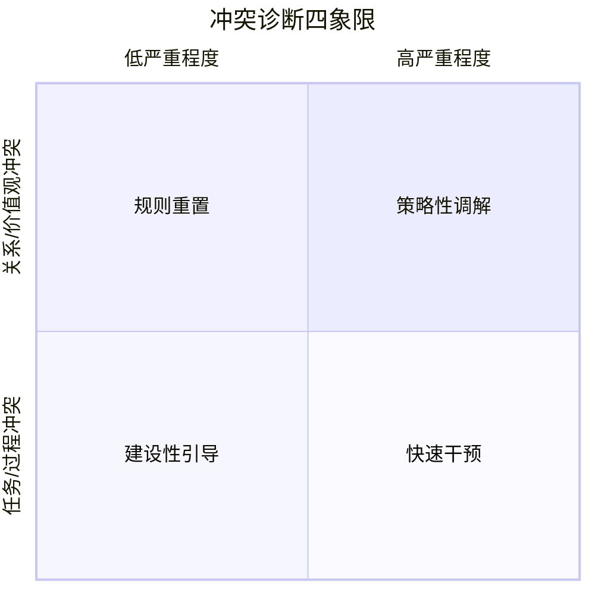

## 二、冲突识别

> "扁鹊见蔡桓公，立有间。扁鹊曰：'君有疾在腠理，不治将恐深。'桓侯曰：'寡人无疾。'居十日，扁鹊复见，曰：'君之病在肌肤，不治将益深。'桓侯不应。"——《韩非子·喻老》

两千多年前的这则寓言，精准地描述了冲突管理中最常见的失败模式：**不是不会治，而是看不见。** 蔡桓公并非不知道疾病的存在，而是在症状尚轻时选择了否认。等到病入骨髓，即使扁鹊也无能为力。冲突的演化遵循同样的逻辑——它从不突然爆发，而是在一系列可观察的信号中逐渐升级。你错过一个信号，就失去一个窗口期；你错过所有窗口期，就只能面对一场本可避免的灾难。

冲突识别是冲突管理流程中承上启下的关键环节。如果说"冲突预防"是在晴天修屋顶，那么"冲突识别"就是在乌云刚出现时就发出预警。它连接着预防（识别潜在隐患）和干预（在正确时机介入），是整个冲突管理链条中最需要敏锐度和系统性同时发挥作用的环节。

本节将从信号识别、诊断分析、场景应用、自我觉察四个维度，系统讲解如何在冲突从潜伏期走向感知期、从感知期走向感受期的关键窗口中，准确地捕捉信号、判断性质、评估严重程度，为后续的干预和解决提供精准的靶向信息。

---

### 2.1 为什么冲突识别如此重要

在展开具体方法之前，有必要先理解一个核心事实：**冲突的早期处理成本与爆发后处理成本之间存在巨大的剪刀差。**

#### 2.1.1 成本剪刀差：时间就是关系的货币

根据前面理论基础篇中介绍的冲突发展五阶段模型（Pondy模型），冲突从"潜伏期"到"显现期"经历了四个阶段。在每个阶段进行干预，成本曲线呈现指数级增长：

| 干预阶段 | 冲突状态 | 典型干预方式 | 所需时间 | 关系损伤程度 | 经济成本（相对值） |
|---------|---------|------------|---------|------------|--------------|
| 潜伏期 | 条件已存在，尚未被感知 | 制度优化、期望对齐 | 15~30分钟 | 几乎为零 | 1x |
| 感知期 | 一方或双方意识到分歧 | 一次坦诚对话 | 30~60分钟 | 极低 | 3~5x |
| 感受期 | 开始产生情绪反应 | 情绪疏导 + 问题讨论 | 1~3小时 | 中等 | 10~20x |
| 显现期 | 公开对抗或消极抵抗 | 正式调解或谈判 | 数小时至数天 | 较高 | 50~100x |
| 余波期 | 关系破裂或长期僵持 | 关系重建、制度变革 | 数周至数月 | 严重 | 200~500x |

CPP Global在2008年发布的《职场冲突成本》研究（涵盖美国、英国、德国、巴西等国的5000多名员工）提供了惊人的数据：**美国员工平均每周花费2.8小时处理冲突，折合每年3590亿美元的薪资成本。** 其中，大量冲突之所以升级到高成本阶段，正是因为早期信号被忽视或误判。

#### 2.1.2 Glasl模型的时间窗口

Glasl的冲突升级九阶段模型进一步揭示了一个残酷的事实：**一旦冲突进入"争胜"区间（第四阶段——尝试一决高下），双方的注意力就从"解决问题"转向了"战胜对方"，理性合作的可能性急剧下降。** 而从第一阶段（硬化立场）到第三阶段（行动优于言语），冲突仍然停留在"争赢"区间，合作式解决的空间最大。

Glasl九阶段的三个区间划分对冲突识别有直接的指导意义：

| 区间 | 阶段 | 核心特征 | 合作可能性 | 识别关键 |
|------|------|---------|----------|---------|
| **争赢区间** | 1.硬化立场 | 双方开始固守己见 | 高 | 措辞从灵活变为绝对 |
| | 2.辩论与对峙 | 逻辑争论变为策略性交锋 | 较高 | 开始出现"赢"的意图 |
| | 3.行动优于言语 | 用行动表达立场 | 中等 | 不再只说，开始"做" |
| **争胜区间** | 4.寻求盟友 | 拉拢第三方站队 | 低 | 话题扩散到当事人之外 |
| | 5.失去面子 | 攻击对方的尊严 | 很低 | 人身攻击出现 |
| | 6.威胁策略 | 以惩罚相威胁 | 极低 | 最后通牒式语言 |
| **毁灭区间** | 7.有限摧毁 | 造成小规模伤害 | 几乎为零 | 不惜自损 |
| | 8.分裂对方 | 摧毁对方的认同 | 零 | 非人化对待 |
| | 9.一起坠落 | 宁可同归于尽 | 零 | 完全失去理性 |

这意味着，冲突识别的核心价值在于：**在冲突还没有进入"争胜"区间之前，提供足够的信息让你做出判断和行动。** 识别不是目的，识别是为干预争取时间窗口。

#### 2.1.3 识别的"杠杆效应"

冲突识别是冲突管理全流程中投入产出比最高的环节。原因有三：

1. **信息的边际价值递减**：在冲突早期，一条关键信息可能改变整个走向；到了后期，即使掌握了完整信息，能做的选择也极为有限。
2. **行动空间的递减**：早期可以选择主动预防、坦诚对话、制度调整等多种方式；到了显现期，选择空间大幅收窄。
3. **关系资本的消耗速度**：信任和情感储蓄一旦消耗，恢复的速度远低于消耗的速度。Gottman的研究表明，一次消极互动的负面影响需要5次积极互动才能抵消（5:1法则）。

---

### 2.2 识别冲突的早期信号

冲突在全面爆发之前，会通过多种渠道释放信号。这些信号不是孤立出现的，它们通常以"信号簇"的形式存在——当你观察到两个以上的信号在同一关系中同时出现时，冲突的置信度会大幅提升。

#### 2.2.1 语言信号：从措辞变化中捕捉火药味

语言是冲突最直接的载体。当一个人对另一个人的态度发生变化时，语言往往是最先暴露的窗口。

**语气与节奏变化：**

- **语气变尖锐或冷淡**：注意对比基线。如果一个人平时说话温和，突然变得语气生硬、用词简洁到近乎冷漠，这通常意味着他在控制自己的情绪，避免说出更激烈的话。
- **说话声音突然变大或变小**：音量增大往往伴随着情绪的外溢（愤怒、急躁）；音量变小则可能是失望、心灰意冷的信号——后者有时候比前者更危险，因为它意味着当事人可能已经在"放弃"这段关系。
- **语速异常加快或放慢**：语速加快通常意味着焦虑和急切；语速放慢可能意味着在斟酌用词，或者带有讽刺意味的"刻意强调"。

**措辞与句式变化：**

- **绝对化语言**："你总是""你从来""每次都是""永远不可能"——这些词将具体事件上升为对整个人的否定。当一个人开始使用绝对化语言，说明他内心的不满已经从"这件事"扩散到了"这个人"。语言学研究表明，绝对化词汇的频率是关系冲突升级的最强预测指标之一。
- **反问句增多**："我不是说过了吗？""这有什么好讨论的？""你觉得呢？"——反问句的本质是"伪装成问题的陈述"，它不期待回答，而是在表达不满或不屑。
- **讽刺和暗示**："你最厉害了""你说的都对""我哪敢有意见"——表面顺从、实际对抗，这是冲突进入"被动攻击"阶段的典型信号。
- **称呼变化**：从名字变为"那个人""某些人"，或者从亲切称呼变为正式称呼——称呼的疏远往往先于关系的疏远。
- **归因性语言增多**："你就是故意的""你从来不考虑别人"——将行为归因于对方的动机或性格，而非具体情境。这标志着认知框架从"就事论事"转向"定性评价"。

**沉默作为一种语言信号：**

沉默是所有语言信号中最容易被忽视、却最值得警惕的一种。需要区分两种性质截然不同的沉默：

- **建设性沉默**：对方在思考、消化信息、组织语言。这种沉默通常是暂时的，伴随着专注的表情和偶尔的点头。
- **破坏性沉默**：对方选择不回应、不参与、不表态。这种沉默伴随着回避的眼神、封闭的身体姿态和"人在心不在"的状态。当一个原本积极参与讨论的人突然变得沉默，这通常不是"没想法"，而是"有想法但认为说出来没用"。

在组织行为学中，破坏性沉默有一个专门的概念——"组织沉默"（Organizational Silence），由Morrison和Milliken在2000年提出。它分为三种类型：默许沉默（无力改变，放弃表达）、防御沉默（避免风险，自我保护）和亲社会沉默（为了组织或他人的利益而保留意见）。在冲突识别中，前两种沉默是最值得警惕的信号。

> **实操案例：** 在一次产品评审会上，前端工程师王浩连续三次被产品经理打断发言。之后的讨论中，王浩不再主动说话，被点名时只回答"嗯""可以""没意见"。两周后，王浩提交了离职申请。在离职面谈中他说："我已经不想争论了，说什么都会被打断，不如不说。"——王浩的沉默，就是冲突从感知期跳过感受期、直接进入"放弃"阶段的信号。如果他的主管在第二次沉默出现时就觉察到，一次15分钟的一对一谈话可能就能改变结局。

#### 2.2.2 非语言信号：身体不会说谎

心理学家Albert Mehrabian的研究表明，在情感性沟通中，语言内容仅占信息传递的7%，语调占38%，而面部表情和身体语言占55%。需要注意的是，这个"7-38-55法则"的适用范围是"当语言和非语言信号发生矛盾时"——它说明的是：**当一个人嘴上说"我没生气"但身体语言显示愤怒时，非语言信号更接近真实态度。**

**面部信号：**

- **表情僵硬**：面部肌肉不自然地紧绷，微笑变成"礼貌性微笑"（只动嘴角不动眼睛——杜兴微笑要求眼轮匝肌参与，纯礼貌性微笑只有颧大肌收缩）。这通常意味着对方在努力维持表面的友好。
- **回避眼神接触**：不是害羞型的低头，而是带有"我不想看到你"的意味。注意区分：偶尔的眼神回避可能是文化习惯或社交焦虑；但一个原本习惯眼神交流的人突然开始回避，几乎可以确定是关系信号。
- **微表情泄露**：在0.04~0.2秒之间闪过的表情，如嘴角的轻微下拉（轻蔑——Ekman认为这是唯一可靠的单侧微表情）、眉头的瞬间紧皱（厌恶）、眼睛的突然睁大（惊讶后的警觉）。Paul Ekman在旧金山湾区警察局的研究证实，微表情很难伪装，是判断对方真实情绪的重要线索。
- **眼神方向变化**：从"注视"变为"扫视"或"凝视远方"——前者意味着兴趣和关注的丧失，后者可能意味着对方已经在"心理脱离"当前互动。

**身体姿态信号：**

- **封闭姿态**：交叉双臂、身体后倾、将物体（笔记本、杯子）放在身体前方形成"屏障"。这些姿态在潜意识中表达了"我不欢迎你的信息进入我的空间"。需要指出的是，交叉双臂不一定代表防御——在寒冷环境中它只是保暖。关键在于判断姿态是否与基线偏离。
- **指向性姿态**：身体朝向门口或出口、脚尖指向远离对方的方向——身体在"准备离开"。脚尖方向特别值得关注，因为人们很少意识到自己的脚在"说话"。
- **紧张性动作**：紧握拳头、手指敲桌面、频繁抖腿、紧咬牙关。这些动作反映了被压抑的愤怒或焦虑。
- **叹气、翻白眼、摇头**：这些是否定性动作，表达了"我不同意但我懒得说"或"果然如此"的心态。John Gottman的研究发现，翻白眼（eye roll）是关系冲突中最具预测性的非语言信号之一。

**空间距离信号：**

- **物理距离增大**：一个原本喜欢坐在你旁边的人开始选择更远的座位。Edward Hall的人际距离学（Proxemics）将人际距离分为亲密区（0~45cm）、个人区（45~120cm）、社交区（120~360cm）和公共区（360cm以上）。当某人在关系中退缩时，他会在潜意识中扩大与你的距离——从亲密区退到个人区，从个人区退到社交区。
- **离开共同空间的频率增加**：比以前更频繁地"出去透气""接电话""去洗手间"。
- **减少物理接触**：不再拍肩膀、不再击掌、回避握手或拥抱——对于原本有肢体接触习惯的关系，这是显著的退缩信号。

#### 2.2.3 行为信号：行动比语言更诚实

当语言和非语言信号还在可伪装的范围内时，行为模式的变化往往更难掩饰。行为信号的可靠度之所以更高，是因为行为涉及更多的外部协调和可见后果，伪装的成本更高。

**协作行为变化：**

- **配合度下降**：从"主动配合"变为"被动配合"再到"选择性配合"——只在有明确规定或有第三方监督时才配合。这种退化通常是渐进的，每周/每月"滑坡"一点点，很容易在日常忙碌中被忽视。
- **故意拖延**：不是因为忙而延迟，而是"恰好"在关键节点出现延误。注意区分真正的客观困难和"软性抵抗"：前者会主动沟通延期原因和新时间表，后者只在被追问时才给出模糊回应。
- **信息截留**：不再主动分享相关信息，被问到时给出最少限度的回答。信息截留是一种隐性权力手段——"我知道你不知道的事"。在组织研究中，信息截留被认为是"组织政治行为"的核心表现之一。

**社交行为变化：**

- **小团体形成**：原本松散的社交关系开始出现明显的"站队"现象。A和B开始频繁私下交流，而有意无意地排除C。社会网络分析中，这种现象叫"网络极化"——原本连通的社交网络开始出现断层。
- **流言蜚语增多**：背后的议论和抱怨增加，而且内容开始从"讨论事情"转向"评价人品"。当团队中的非正式沟通从"发生了什么事"变成"那个人怎样怎样"时，冲突已经开始污染整个社交生态。
- **社交场合回避**：不再参加团队聚餐、团建活动、非正式交流——每一次缺席都在缩小"情感账户"的余额。

**工作表现变化：**

- **质量或效率波动**：一个原本表现稳定的人突然出现工作质量下降或效率波动，除了能力问题和外部压力外，冲突是常见但容易被忽视的原因。组织行为学研究表明，人际冲突对认知资源的消耗相当于"背景噪音"——即使你没有在"想"冲突的事，它也在占用你的工作记忆。
- **考勤异常**：迟到、早退、请假增多、频繁远程办公——"不想出现在那个环境中"是这些行为背后的潜台词。
- **过度合规**：从灵活处理变为严格照章办事，"你不是说要走流程吗？那就走流程吧。"——这种"按规则对抗"（work-to-rule）是一种被劳动研究广泛记录的集体抵抗策略，在个人层面同样适用。它比公然反对更难处理，因为表面上对方"什么都没做错"。

#### 2.2.4 关系信号：温度计式的渐变

关系信号不像语言和行为信号那样有明确的"触发点"，它更像是温度的缓慢下降——你很难说清从哪一刻开始变冷的，但回头看时已经冷了很久。

- **沟通频率和质量双降**：从日常交流变为"必要才沟通"，从深入讨论变为事务性通知。Google的Project Aristotle研究发现，团队成员之间的"心理安全感"是预测团队效能的第一因素，而沟通频率和质量的下降正是心理安全感降低的前兆。
- **选择性合作**：只在有明确利益关系或有第三方监督时才合作，其余时间保持距离。
- **评价基调翻转**：对对方的评价从"虽然有缺点但总体不错"变为"虽然偶尔还行但总体不行"。这种"总体评估"的转向比任何单一行为都更能预测关系走向——它是所有具体信号汇聚后的"总结性判断"。
- **公开场合的微妙对抗**：在会议中打断对方、在群聊中忽略对方的消息、在评价中刻意贬低——这些都是在用"合理的方式"表达"不合理的不满"。

#### 2.2.5 信号的组合判断：从单一信号到信号簇

单一信号可能存在误判。一个人沉默可能只是在想事情，一次语气变化可能只是因为身体不适。但当多个信号在同一关系中同时或相继出现时，冲突的概率会大幅上升。

**信号簇评估矩阵：**

| 信号类别 | 观察到的信号数量 | 冲突可能性 | 建议行动 |
|---------|---------------|----------|---------|
| 仅一个类别 | 1~2个信号 | 低，需持续观察 | 记录变化，1~2周后复查 |
| 一个类别 | 3个以上信号 | 中等 | 主动发起非对抗性对话 |
| 两个类别 | 各有2个以上信号 | 较高 | 认真准备，安排一对一深度沟通 |
| 三个及以上类别 | 多个信号 | 高 | 立即行动，可能需要外部协助 |

**信号的方向性判断：**

除了信号的数量，还需要注意信号的运动方向：

- **信号在收敛**：即使数量较多，但如果在最近一周内有减少的趋势，说明冲突可能在自然消退——可以继续观察。
- **信号在发散**：数量在增加，强度在加大，范围在扩大——说明冲突正在升级，需要加速行动。
- **信号在突变**：短期内从极少信号跳到大量信号——通常意味着有一个"触发事件"发生了，需要立刻识别这个事件。

**重要提醒：** 不要把信号和结论混为一谈。信号告诉你"有什么变了"，但不告诉你"为什么变了"。在做出判断之前，一定要通过对话来验证你的假设，而不是仅凭观察就下结论。误读信号比错过信号更危险——它可能让你在不存在冲突的地方制造冲突。

---

### 2.3 冲突诊断框架

识别到信号之后，下一步是系统化地诊断冲突，确定它的性质、根源、严重程度和最佳处理方向。没有诊断的干预是盲目的——就像医生不做检查就开药，不仅可能无效，还可能加重病情。

#### 2.3.1 第一维度：冲突类型诊断——这是什么性质的冲突？

不同类型的冲突需要完全不同的处理策略。用错了策略，不仅解决不了问题，还会火上浇油。

| 冲突类型 | 核心特征 | 典型表现 | 处理方向 |
|---------|---------|---------|---------|
| **任务冲突** | 对工作内容、目标、方法的分歧 | "这个方案的优先级不对""技术选型有问题" | 建设性利用：鼓励多角度讨论，但需设定边界 |
| **关系冲突** | 对人际关系的不满，涉及人格、信任 | "他就是看不起我""跟他没法合作" | 需要先修复关系，再讨论具体问题 |
| **过程冲突** | 对工作方式、责任分配、资源使用的分歧 | "凭什么我来做""分配不公平" | 需要明确规则、重新分配、提升透明度 |
| **价值观冲突** | 对"什么是对的""什么是重要的"的根本分歧 | "你这样做不道德""我们理念不同" | 最难处理，通常需要寻找底线共识而非达成一致 |

De Dreu和Weingart的研究表明，任务冲突如果控制在低到中等强度，对团队绩效有正面作用；但关系冲突在任何强度下都是有害的。**一个关键的识别任务是：当前的冲突是任务冲突还是关系冲突？** 如果是任务冲突，可以引导其向建设性方向发展；如果是关系冲突，则需要优先处理情感层面的问题。

更复杂的情况是：**关系冲突经常伪装成任务冲突。** 表面上两个人在争论"方案A好还是方案B好"（任务冲突），实际上是因为"你上次抢了我的功劳，这次我不会让你得逞"（关系冲突）。识别这种伪装的方法有三个：

1. **议题漂移测试**：观察冲突是否超越了当前议题——如果争论的是方案A和B，但话题不断被拉回到过去的恩怨和人格评价上，那背后大概率是关系冲突。
2. **替代方案测试**：提出一个折中方案C。如果是任务冲突，双方会就C的优缺点展开讨论；如果是关系冲突，一方或双方会拒绝C——因为真正的目标不是"找到最佳方案"，而是"不让对方赢"。
3. **换人测试**：想象换一个人提出完全相同的方案。如果换成别人提出方案A你就觉得可以接受，那反对的不是方案A，而是提出方案A的人。

#### 2.3.2 第二维度：冲突根源诊断——为什么会产生这个冲突？

冲突的根源决定了干预的靶点。诊断根源时，需要从以下五个层面逐一排查：

**利益层面：**
- 双方各自的核心利益是什么？（注意区分"立场"和"利益"——立场是"我要什么"，利益是"我为什么想要"。Fisher和Ury在《Getting to Yes》中提出的经典案例：两个人争一个橙子，立场是"我要橙子"，但利益可能分别是"我要橙汁"和"我要橙皮做蛋糕"——完全可以各取所需。）
- 这些利益是真实冲突还是表面冲突？（有时候双方的利益其实不矛盾，只是各自误以为矛盾）
- 是否存在被忽视的共同利益？

**认知层面：**
- 双方掌握的信息是否对称？（很多冲突源于信息差导致的误解——研究表明，当人们获得相同的信息后，很多看似不可调和的分歧会自然缩小。）
- 是否存在认知偏差在起作用？（归因偏差——"他的失败是因为能力不行"vs"我的失败是因为环境不好"；确认偏差——只关注支持自己观点的证据；禀赋效应——对自己拥有或提议的东西赋予过高价值。）
- 双方对同一事实的解读是否不同？（同一句话"这个方案还需要完善"，对A来说是"善意的建议"，对B来说是"否定我的工作"。）

**需求层面（参考马斯洛需求层次与自我决定理论）：**
- 安全感需求——"我的工作/地位/关系是否安全？"
- 归属感需求——"我是否被接纳、被认可？"
- 尊重需求——"我是否被公平对待？"
- 自主性需求——"我是否有选择权和控制权？"（Deci和Ryan的自我决定理论表明，自主性受挫是人际冲突中最常见但最容易被忽视的深层需求。）
- 胜任感需求——"我的能力是否被认可？我的工作是否有价值？"

**结构层面：**
- 资源稀缺——有限的预算、头衔、机会是否创造了零和博弈的结构？
- 角色模糊——职责边界不清晰导致的"灰色地带"冲突？
- 目标不兼容——组织设计是否让某些角色/部门的利益天然对立？
- 信息不对称——组织结构是否导致信息流动不畅，加剧误解？

**历史层面：**
- 双方之间是否有未处理的历史积怨？
- 当前冲突是否是某个旧模式的重演？
- 是否有第三方因素在影响？（如组织变革、外部压力、中间人的搅动）

> **实操案例：** 两个部门因为"预算分配不公"发生冲突。表面上是资源冲突（利益层面），但深入诊断后发现：A部门觉得B部门的项目被优先支持，是因为B部门负责人和CEO关系更好（认知层面）；A部门负责人觉得自己部门的核心价值被低估（尊重需求）；而这两个部门在三年前因为另一个项目的失败互相指责过（历史层面）；公司年度预算制度本身就创造了零和博弈的结构（结构层面）。只处理预算问题（表面根源）而不触及信任问题和尊重问题（深层根源），即使重新分配了预算，冲突也会在下一个议题上重新浮现。

#### 2.3.3 第三维度：冲突严重程度诊断——发展到了什么阶段？

严重程度诊断直接决定了你有多少时间、需要投入多少资源、以及是否需要外部介入。

**发展阶段判断：**

结合Pondy五阶段模型和Glasl九阶段模型，可以用以下指标来判断冲突目前所处的阶段：

| 诊断维度 | 潜伏/感知期（可自行处理） | 感受期（需要主动介入） | 显现期（需要策略性干预） | 升级期（可能需要第三方） |
|---------|---------------------|-------------------|--------------------|-------------------|
| 情绪强度 | 低，偶有不适 | 中等，持续的负面情绪 | 高，情绪影响日常 | 极高，失控或冷漠 |
| 沟通状态 | 仍能正常沟通 | 沟通质量下降 | 沟通困难或中断 | 拒绝沟通或只通过中间人 |
| 影响范围 | 仅限当事人 | 影响到周围人 | 波及更大范围 | 组织/群体层面的影响 |
| 议题聚焦 | 围绕具体事项 | 开始涉及人品评价 | 超越议题，翻旧账 | 以"赢"为目标，问题已不重要 |
| 合作意愿 | 仍愿意合作 | 勉强合作 | 选择性合作 | 拒绝合作或只在压力下合作 |

**升级速度判断：**

除了当前位置，还需要判断冲突的移动方向和速度：
- **稳定**：信号存在但没有加剧，可能维持现状较长时间。——有时间从容处理。
- **缓慢升级**：信号在数周内逐渐增多和加剧。——需要尽快安排处理。
- **快速升级**：信号在数天甚至数小时内急剧恶化。——需要立即介入降温。
- **脉冲式**：冲突反复在"爆发-冷却-爆发"之间循环。——需要找到循环的触发点和维持机制，否则每次冷却只是在积蓄下一次更大的爆发。

#### 2.3.4 第四维度：可用资源评估——手中有什么牌？

在确定了冲突的类型、根源和严重程度之后，还需要评估你手中有哪些可用资源来处理这个冲突。

- **信任基础**：你和对方之间有没有"情感储蓄"可以支撑一次艰难的对话？如果信任已经透支，可能需要先通过第三方重建基本信任。
- **共同利益**：有没有双方都认可的共同目标可以作为对话的基础？"我们都希望项目成功"比"你为什么不配合"更有建设性。
- **制度支持**：有没有组织层面的制度、流程、申诉渠道可以借助？
- **第三方资源**：有没有双方都信任的第三方可以作为调解人或沟通桥梁？
- **时间和空间**：当前是否允许暂停、冷静和重新规划？
- **情绪容量**：双方（包括你自己）当前的情绪容量是否足以支撑一次可能困难的对话？如果双方都处于高度疲惫或压力状态，等待一个更好的时机可能比立即行动更明智。

#### 2.3.5 诊断工具：冲突诊断四象限

将"冲突类型"和"严重程度"两个维度交叉，形成一个实用的四象限诊断工具：

- **左上（任务型 × 低严重）**：这是最有价值的冲突——建设性引导，鼓励多角度讨论，将其转化为决策质量的提升。
- **右上（关系型 × 低严重）**：快速干预——在关系冲突还没有固化之前，通过一次坦诚的对话化解。拖延会让它迅速升级。
- **左下（任务型 × 高严重）**：规则重置——冲突已经影响到正常运转，需要重新明确规则、分配资源、建立边界。
- **右下（关系型 × 高严重）**：策略性调解——可能需要外部调解者介入，采用更正式的冲突处理流程。

---

### 2.4 特定场景的冲突识别要点

不同类型的关系和场景中，冲突信号的表现形式有所不同。以下针对几个高频场景提供识别要点。

#### 2.4.1 职场冲突识别

**上下级之间：**
- 下属的信号：执行力下降、汇报频率降低、开始绕过直接上级汇报、不再主动提出建议、在公开场合保持沉默。
- 上级的信号：微观管理增加、频繁检查工作、批评变得尖锐和个人化、不再给予发展机会、公开场合对下属的评价降低。
- 特别注意：权力不对等使得下属的信号更加隐蔽——他们有更强的动机去掩盖不满。因此，当下属表现出"特别顺从"时，反而值得警惕——真正的合作是主动的，而不是被动的服从。

**同级之间：**
- 最典型的信号是"信息截留"和"选择性合作"——以前会主动分享的信息现在不说了，以前会帮忙的事情现在需要走流程了。
- 另一个容易忽视的信号是"过度客气"——当两个曾经直来直去的同事开始变得异常礼貌和正式，关系很可能已经出了问题。

**跨部门之间：**
- 部门间冲突的信号往往不是发生在个人层面，而是通过流程和制度表现出来：审批流程突然变长、邮件抄送范围突然增大（"留证据"）、会议纪要变得异常详细（"记录在案"）、口头承诺减少而书面确认增多。
- 部门领导在公开场合互相"客气"地暗讽——"感谢XX部门的大力支持，虽然我们等了两个月"——表面是感谢，实际是指责。

**团队层面：**
- 小团体形成：原本开放的团队出现明显的"圈内人"和"圈外人"。
- 会议效率下降：讨论时间变长但产出变少，很多议题反复讨论但无法达成决定。
- 离职信号：当团队中短期内有多人提出离职或转岗申请，往往是系统性冲突的信号。Gallup的研究表明，员工离职的首要原因不是薪酬，而是"直接上级"——而与上级的关系冲突是最常见的离职推手。

#### 2.4.2 家庭冲突识别

家庭冲突的信号往往比职场冲突更隐蔽，因为家庭成员之间有更强的"保持和谐"的动机，同时缺乏职场中相对明确的沟通规范和第三方介入渠道。

**伴侣之间：**
- 沟通模式变化：从"分享日常"变为"事务性通知"，对话越来越像"工作交接"。
- 冷处理增加：用"忙""累""改天再说"来回避对话，情感需求被不断推延。
- 批评与防御循环：一方表达需求时用批评的方式（"你从来都不……"），另一方自动进入防御模式（"我不是做了吗？"），形成Gottman所说的"末日四骑士"模式的前兆。

**Gottman"末日四骑士"——关系冲突的四个递进信号：**

John Gottman对3000多对夫妻的纵向研究识别出四种最具破坏性的互动模式，它们往往按以下顺序递进出现：

1. **批评（Criticism）**：不是针对具体行为的反馈，而是对人格的攻击。对比："你今天忘了接孩子"（行为描述）vs"你从来都不负责任"（人格攻击）。当"抱怨"升级为"批评"，冲突就从事件层面上升到了人格层面。
2. **蔑视（Contempt）**：翻白眼、嘲讽、冷言冷语——表达的不是"你做错了"，而是"你不如我"。Gottman发现，蔑视是预测关系破裂的最强单一指标，比其他任何因素都更准确。
3. **防御（Defensiveness）**：面对对方的不满，不是倾听和回应，而是找借口、反指责、扮演受害者。"我之所以迟到是因为你没有提醒我"——防御的本质是拒绝承认自己的责任。
4. **冷战（Stonewalling）**：完全关闭沟通——不回应、不参与、转身离开。冷战不是"冷静一下"，而是一种情感上的彻底撤离。Gottman发现，冷战通常发生在前三骑士长期出现之后，是关系危机的最后信号。

> **关键区别：** 偶尔出现一次批评或防御是正常的冲突反应，不必过度紧张。四骑士的危险性在于它们的**频率和组合**——当批评+蔑视成为常态互动模式，关系就已经进入了高风险区。

- 亲密行为减少：不仅仅是性亲密，包括日常的拥抱、牵手、依偎等肢体接触的减少。

**亲子之间：**
- 孩子的信号：房门紧闭的时间增多、回答从完整句子变为单词（"嗯""哦""随便"）、不再分享学校的事、对父母的建议表现出明显的抵触。
- 家长的信号：说教频率增加、经常拿"别人家的孩子"做比较、对孩子的朋友和爱好表示不满。
- 关键认知：青少年的"疏远"本身是正常发展任务——他们需要建立独立的自我认同。但正常的发展性疏远和冲突性疏远有一个关键区别：前者是在"建立边界"的同时仍保持基本的信任和情感连接，后者是在"关闭通道"的同时伴随着敌意和失望。

#### 2.4.3 数字时代的冲突信号

在即时通讯、邮件和远程工作成为常态的今天，冲突信号也延伸到了数字空间。数字沟通有一个关键特性：**它削弱了非语言信号通道，使得语言信号和行为信号的权重相对上升。** 同时，文字沟通的"可回溯性"和"延迟性"改变了冲突的动态——每一条消息都可能成为"证据"，每一次延迟回复都被赋予了意义。

**文字沟通中的信号：**
- 回复时间变长：从秒回变为小时回、天回。
- 回复长度骤降：从完整的段落变为"嗯""收到""OK"。
- 标点符号变化：句号增多（"好的。"vs"好的"）——语言学研究发现，在非正式数字沟通中，句号被感知为"冷淡"或"不悦"的标记；感叹号消失、表情包停止使用。
- 群聊中的沉默：在一个活跃的群聊中突然不再发言，但可以看到在线状态。
- "已读不回"：消息被阅读但没有回复——在需要回复的语境下，这是一种明确的信号。
- 回复风格突变：从习惯发语音变为只发文字（回避语调泄露情绪），或从文字变为语音（需要更快地"说"出来，不给对方留回旋余地）。

**远程工作中的信号：**
- 摄像头关闭频率增加。
- 会议中的多任务处理更明显（回复延迟表明在做别的事情）。
- 异步沟通增多、同步沟通减少——主动选择"不需要实时互动"的沟通方式。
- 文档协作中的"编辑冲突"——两人同时修改同一段落，或一方反复覆盖另一方的修改。
- "公开化"倾向：将本应在私聊中讨论的问题放到群里或邮件列表中——这通常是在"寻求证人"或"制造压力"。

#### 2.4.4 组织政治层面的冲突信号

除了直接的人际互动，组织内部的政治动态也是冲突识别的重要维度。这类信号更隐蔽，但一旦忽视，后果往往更严重。

- **权力格局变动**：新领导上任、组织架构调整、关键岗位人员变动——任何权力格局的重组都是冲突的温床。需要关注：谁的权力被削弱了？谁获得了新资源？谁被"边缘化"了？
- **资源竞争加剧**：预算缩减、晋升名额有限、项目优先级调整——当"蛋糕变小"时，分配冲突几乎不可避免。
- **联盟重组**：原来对立的部门突然变得友好，或原来合作的部门开始互相防范——联盟的重组意味着有人在"选边"。
- **信息流变化**：某些人开始被排除在关键会议之外，某些信息开始通过非正式渠道传播——信息流的变化是权力博弈的"温度计"。
- **"合法性叙事"的出现**：各方开始建构"为什么我是对的、对方是错的"的叙事——在公开场合和私下谈话中反复强化自己的立场合法性。这标志着冲突从个人层面扩展到了"集体认同"层面。

---

### 2.5 自我觉察：识别自身在冲突中的状态

冲突识别最容易被忽视的维度是自我觉察。我们习惯于去分析"对方怎么了"，却很少停下来问"我自己现在是什么状态"。但事实是：**你自己就是最好的冲突检测仪器——前提是你学会读取自己的信号。**

#### 2.5.1 身体觉察：你的身体在说什么

情绪从来不是纯心理现象。每一次情绪反应都伴随着可测量的生理变化，而这些生理变化往往比你"意识到自己在生气"早几秒钟出现。神经科学家Antonio Damasio的"躯体标记假说"（Somatic Marker Hypothesis）指出：身体反应先于意识判断——你的心跳加速和胃部收紧，比你"意识到对方的话让你不舒服"来得更早。

**关键的身体预警信号：**

- **心跳加速**：从正常的60~80次/分钟跳到100次以上。这不是"紧张"那么简单——它意味着你的交感神经系统已经被激活，你的身体正在进入"战斗或逃跑"模式。在这个模式下，你的前额叶皮层（负责理性思考和冲动控制）的活动会降低，杏仁核（负责情绪反应）的活动会增强。简而言之：你的"理性脑"正在让位给"情绪脑"。心血管心理学家将这种状态称为"生理洪水"（physiological flooding）——Gottman的研究表明，当心率超过100次/分钟时，人解决冲突的能力会下降80%以上。
- **呼吸变浅变快**：正常呼吸频率为12~20次/分钟，当情绪激动时会加快到25次以上。浅快呼吸会导致血液中二氧化碳浓度下降，进一步加剧焦虑和思维混乱。
- **肌肉紧张**：特别是肩膀、下巴和拳头。很多人的下巴在愤怒时会不自觉地咬紧，肩膀会耸起。
- **出汗和体温变化**：手心出汗、面部发热是典型的愤怒和焦虑信号。
- **胃部不适**：消化系统对情绪极其敏感。"气得胃疼"不是夸张，而是迷走神经激活的真实生理反应。肠道神经系统拥有约5亿个神经元，被称为"第二大脑"，它对情绪状态的反应速度和敏感度远超大多数人的认知。

**身体扫描练习（日常训练）：**

每天花2分钟做一次"身体扫描"——从头顶到脚底，依次感受每个部位的状态。问自己：我的额头是放松的还是紧皱的？我的肩膀是下沉的还是耸起的？我的拳头是松开的还是握紧的？我的呼吸是深长的还是浅快的？

这个练习的价值在于：它训练你将注意力从"外部世界"转向"内部身体"的能力。当你能够在冲突情境中快速觉察到"我的拳头握紧了"时，你就获得了一个宝贵的几秒钟窗口来选择你的回应方式——而不是被情绪驱动。

#### 2.5.2 思维觉察：你在想什么

情绪不仅影响身体，更影响思维方式。当冲突情绪升起时，几种特定的"认知扭曲"会悄然出现，它们像有色眼镜一样扭曲你对现实的判断。Aaron Beck和David Burns在认知行为疗法中系统描述了这些扭曲模式。

**常见的冲突相关认知扭曲：**

| 认知扭曲 | 内心独白 | 现实检验 | 干预口诀 |
|---------|---------|---------|---------|
| **灾难化思维** | "这下全完了""他根本不尊重我" | 这件事真的有这么严重吗？最坏的结果是什么？发生的概率有多大？ | "最坏会怎样？概率多大？" |
| **黑白思维** | "他就是针对我""这种人不可理喻" | 世界上很少有"完全是""完全不是"的事。他有没有可能不是"针对你"？ | "有没有灰色地带？" |
| **读心术** | "他肯定觉得我能力不行""她就是故意的" | 你确定你知道对方在想什么吗？有没有其他可能的解释？ | "我真的知道吗？" |
| **以偏概全** | "上次也是这样""他从来都不配合" | 真的是"从来"吗？有没有他配合过的例子？ | "有没有反例？" |
| **应该思维** | "他应该知道我需要什么""事情不应该是这样的" | "应该"是你自己的标准，对方知道这个标准吗？这个标准合理吗？ | "他知道吗？合理吗？" |
| **报复性思维** | "我要让他好看""下次我也不配合他" | 报复能解决问题吗？还是会把事情推向更糟的方向？ | "报复之后会怎样？" |
| **个人化** | "他这样做就是因为看不起我" | 他的行为有多少是因为你，有多少是因为他自己的处境和心情？ | "跟我有关吗？" |
| **情绪推理** | "我觉得他在针对我，所以他就是在针对我" | 感觉不等于事实。愤怒的感觉可能是真实的，但引发愤怒的判断未必是准确的。 | "感觉≠事实" |

**思维觉察的核心技巧——"标签法"：**

当你注意到自己在想"他就是故意的"时，不要试图反驳这个想法（这需要消耗大量意志力），而是给它贴一个标签："这是读心术。"——就像在文件上贴一个"待审核"的标签一样。这个简单的动作不需要你改变想法，但它创造了一个心理距离，让你从"被想法控制"变为"观察想法"。心理学中将这种能力称为"去中心化"（decentering）——正念认知疗法的核心技术之一。

#### 2.5.3 行为觉察：你在做什么

在冲突情绪的影响下，你的行为可能会偏离你的本意。觉察自己的行为模式，是防止"说出后悔的话、做出后悔的事"的最后一道防线。

**攻击性行为预警：**
- 音量不自觉地提高
- 语速加快，不给对方说话的机会
- 使用绝对化语言和攻击性词汇
- 身体前倾、手指指点
- 翻旧账、扩大议题范围
- 开始"收集证据"——在脑中列举对方的"罪状"

**退缩性行为预警：**
- 沉默，不再回应
- 回避眼神接触
- 身体后倾或转身
- 使用"随便""都行""无所谓"等消极回应
- 想要离开当前场景
- 内心开始"放弃对话"——"说了也没用"

**被动攻击性行为预警（最容易被忽视）：**
- 表面同意但实际不执行
- 刻意用过度礼貌来表达不满
- 用沉默和拖延来惩罚对方
- "我忘了""我以为不是这样的"
- 故意做得很差，让对方下次不敢再让自己做

**行为觉察的"3秒法则"：**

在冲突中感到情绪即将爆发时，给自己3秒钟。这3秒不是用来"忍"的，而是用来问自己一个问题：**"我现在想做的这件事，是我真正想要的结果吗？"** 如果答案是否定的，你就有了选择另一种方式的空间。如果答案是肯定的，那3秒的延迟也不会让你损失什么。

一个实用的技巧：在感到愤怒即将爆发时，轻轻地将舌头抵住上颚——这个微小的生理动作能够打断自动化的愤怒反应链条，为你争取几秒钟的思考时间。

#### 2.5.4 自我觉察的综合练习：STOP技术

在冲突情境中，将身体觉察、思维觉察和行为觉察整合为一个快速可用的框架——STOP技术：

- **S（Stop）——停下来**：意识到自己正在经历冲突情绪，主动"暂停"自动化反应。
- **T（Take a breath）——深呼吸**：3次腹式呼吸（吸气4秒-屏气2秒-呼气6秒），激活副交感神经系统，从"战斗或逃跑"模式切换回"休息和消化"模式。
- **O（Observe）——观察**：快速扫描——我的身体在说什么？（心跳、呼吸、肌肉）我的思维在说什么？（有没有认知扭曲？）我的行为冲动是什么？（想做什么？）
- **P（Proceed consciously）——有意识地行动**：基于观察，选择一个符合你长期利益的回应方式，而不是被情绪驱动的自动化反应。

---

### 2.6 冲突识别的常见陷阱

识别冲突并不像看起来那样直接。以下是几个最常见的识别陷阱，每个陷阱都附带了纠正方法。

#### 陷阱一：否认——"我们之间没有冲突"

**表现**：明明观察到了多个信号，但说服自己"没什么大不了的""可能是我想多了""他只是心情不好"。

**为什么会掉入这个陷阱**：冲突意味着不确定性、不适感和额外的精力投入。否认是一种心理防御机制——通过拒绝承认冲突的存在来回避处理冲突的压力。在"和谐文化"较重的环境中（如东亚文化），否认尤为常见——承认冲突存在本身就违反了"和为贵"的文化规范。

**纠正方法**：建立"信号清单"的习惯。当你观察到一个变化时，不是立刻做结论，而是把它记录下来。如果同一个关系中的信号在一周内累积到了三个以上，你就无法再用"可能我想多了"来自欺了。给自己一个"最小行动承诺"：即使不确定是否存在冲突，也值得进行一次轻量级的对话——"最近感觉我们之间有些不太一样，不知道你怎么看？"

#### 陷阱二：过度解读——"他一定在针对我"

**表现**：对方一次语气变化就认为"他对我有意见"，对方没回消息就认为"他在冷暴力"。

**为什么会掉入这个陷阱**：这通常与个人的依恋模式和过往经历有关。有"焦虑型依恋"倾向的人，对关系中的负面信号有过度敏感的倾向。此外，如果一个人过去经历过背叛或创伤，他可能会对当前关系中的模糊信号做最坏假设——这是一种"创伤性过度警觉"。

**纠正方法**：在做出判断之前，先问自己三个问题：（1）有没有其他可能的解释？（2）如果换一个人做了同样的事，我会怎么解读？（3）我有没有直接向对方确认？——第二个问题特别有效，因为它能帮你识别出"是对方的问题还是我的滤镜"。

#### 陷阱三：只看他人不看自己——"是他在制造冲突"

**表现**：把所有注意力放在分析对方的信号上，完全忽视自己在冲突中的角色和贡献。

**为什么会掉入这个陷阱**：心理学中的"行动者-观察者偏差"——我们倾向于将自己的行为归因于环境（"我是因为压力大才发脾气"），而将他人的行为归因于性格（"他就是脾气不好"）。此外，承认自己在冲突中的角色需要直面自己的不完美，这对自我认同是一种威胁。

**纠正方法**：在分析完对方的信号之后，用同样的标准审视自己。问自己："如果对方用我的标准来观察我，他会看到什么信号？"——你会发现，你可能也在释放冲突信号而不自知。一个更有冲击力的问题："如果这是一场辩论，对方会怎么描述我在这段关系中的行为？"

#### 陷阱四：标签化——"他就是这样的人"

**表现**：将一时的行为变化固化为对人格的判断——"他就是不合作""她就是爱抱怨""他们部门就是推诿"。

**为什么会掉入这个陷阱**：标签化简化了认知负担——给一个人贴标签比分析他当前行为的具体原因要省力得多。但标签一旦形成，就会变成"自我实现的预言"——你带着"他是不合作的人"的预设去互动，对方感知到你的预设后真的变得不合作。

**纠正方法**：区分"行为"和"人"。不说"他是一个不合作的人"，而说"他在这个议题上表现出不配合的行为"——前者是人格判断，后者是行为描述。行为描述为改变留出了空间，人格判断则关闭了这种空间。在记录冲突信号时刻意使用行为描述语言，训练自己的思维习惯。

#### 陷阱五：把正常争论误判为冲突——"我们吵架了"

**表现**：将激烈但健康的观点争论等同于人际冲突，产生不必要的焦虑和回避行为。

**为什么会掉入这个陷阱**：很多人将"冲突"与"关系破裂"画等号。但正如理论基础篇所述，适度的任务冲突对团队绩效有正面作用。在"表面和谐"文化中，任何分歧都可能被夸大为"关系出问题了"。

**纠正方法**：用两个标准来区分"健康争论"和"破坏性冲突"：（1）争论结束后，双方的关系是否回到了基线？（2）争论的焦点是"事情"还是"人"？如果两个问题的答案分别是"是"和"事情"，那这是一场健康争论，不需要"处理"。

#### 陷阱六：即时反应陷阱——"必须现在就处理"

**表现**：一发现冲突信号就立即介入，不考虑时机、对方状态和自身准备程度。

**为什么会掉入这个陷阱**：焦虑驱动的行动主义——"不做点什么我会更焦虑"。有时候，"立即处理"是处理者的需要，而不是冲突解决的需要。

**纠正方法**：在行动前做"时机评估"：双方当前的情绪容量是否充足？是否有足够的时间进行完整对话？当前的环境是否私密和安全？如果三个条件中两个以上是否定的，推迟到更好的时机通常是更明智的选择。但推迟不等于忽视——给自己设定一个具体的处理时间（"本周三之前安排一对一谈话"），避免推迟变成无限期搁置。

---

### 2.7 进阶：系统性的冲突识别能力

#### 2.7.1 建立"冲突基线"

每个人、每段关系都有自己的"基线行为模式"。识别冲突信号的关键不是知道"什么样的行为代表冲突"，而是知道"这个人/这段关系的正常状态是什么"。

**建立基线的方法：**

1. **观察正常状态**：在没有冲突的时候，注意记录以下信息——对方的正常沟通频率、语速语调、表情习惯、社交偏好、工作风格。
2. **记录关键变量**：对重要的关系（直属上级、核心搭档、伴侣、密友），建立一个简单的"关系状态记录"，每周花2分钟评估：沟通质量（1~10分）、合作顺畅度（1~10分）、情绪基调（正面/中性/负面）。
3. **关注偏离值**：当某个变量从基线偏离了2分以上，或情绪基调从中性变为负面持续两周以上，就需要关注了。

这个方法的核心思想是：**你不需要知道什么是"冲突信号"，你只需要知道什么是"异常"。** 异常本身就是信号。

> **进阶提示：** 基线不是一成不变的。人的行为模式会因季节、工作节奏、生活事件等因素而变化。一个好的做法是用滚动窗口来建立基线——不是记住"去年的正常状态"，而是感知"最近两个月的正常状态"。

#### 2.7.2 冲突模式识别

很多冲突不是孤立事件，而是重复出现的模式。识别这些模式的价值在于：它让你从"处理单次冲突"升级到"解决系统性问题"。

**常见的冲突重复模式：**

- **周期性模式**：冲突每隔一段时间就会出现（如每到季度末、每到开学季、每到假期前后）。这通常与外部压力周期有关。
- **触发点模式**：特定的话题、场景或行为反复引发冲突（如"只要谈到钱就会吵""只要他迟到我就生气"）。这通常意味着存在未被处理的深层议题。
- **角色模式**：同一类角色关系中反复出现冲突（如"我和每个上司都合不来""每次恋爱都因为同样的原因分手"）。这可能暗示个人的互动模式需要调整。
- **升级-冷却循环**：冲突爆发→激烈争吵→暂时和好→积累不满→再次爆发，形成恶性循环。每一次循环都会消耗信任，直到关系破产。

识别模式的方法：定期复盘。每发生一次冲突（或接近冲突的情况），花10分钟记录：什么触发了它？发展过程是怎样的？结果如何？坚持三个月，模式就会浮现。

#### 2.7.3 从"识别冲突"到"预判冲突"

最高级的冲突识别能力不是"在信号出现时捕捉信号"，而是"在信号出现之前预判冲突"。

**预判冲突的三个思维工具：**

**工具一：利益图谱分析。** 在任何涉及多方利益的决策之前，画一张利益图谱——列出每个利益相关方的核心诉求、底线和可能的让步空间。如果存在两个以上的利益相关方的核心诉求直接冲突，冲突几乎是不可避免的——提前准备比事后灭火有效得多。

**工具二：压力测试思维。** 问自己："如果这件事出了差错，谁会受损失？谁会被指责？谁的资源会被占用？"——在资源有限的情况下，压力不会均匀分布，它会集中在某些人或某些部门身上，而这些人或部门就是潜在的冲突点。

**工具三：历史回溯。** "过去在类似的情境中，冲突是如何发生的？"——历史不会精确重演，但冲突的模式往往高度相似。如果上一次组织架构调整导致了部门间的冲突，那么下一次调整前就应该主动预防类似问题。

#### 2.7.4 识别者的心智素质

成为优秀的冲突识别者，需要培养三个核心心智素质：

1. **认知谦逊**：接受自己可能判断错误。你观察到的信号可能有其他解释，你的诊断可能是错的。保持"可能是我错了"的开放心态，才能避免识别陷阱。
2. **情绪调节**：你无法在自己情绪失控的状态下准确识别他人的信号。自我觉察不仅是冲突识别的一部分，更是冲突识别的前提条件。
3. **模式思维**：从具体事件中抽离出来，看到背后的结构和模式。这需要刻意训练——每次冲突后不只回顾"发生了什么"，还要思考"这和以前的哪次经历相似""这个模式的驱动因素是什么"。

---

### 2.8 冲突识别的实操工具箱

#### 2.8.1 每日5分钟关系扫描

每天花5分钟，对当前最重要的3~5段关系做一次快速"扫描"：

关系扫描模板：
- 对象：___________
- 今天/本周的互动质量：□ 很好  □ 一般  □ 有异常
- 观察到的信号（如有）：___________
- 我自身在这个关系中的状态：___________
- 需要采取的行动：□ 不需要  □ 持续观察  □ 主动沟通

**使用指南：** 将这个扫描固定在每天的某个时间点（如晨会前、睡前），形成习惯。扫描的价值不在于每次都发现异常，而在于建立"关系觉察"的肌肉记忆——当真正出现异常时，你能比没有这个习惯的人更快、更准地捕捉到。

#### 2.8.2 冲突诊断检查清单

当你确信自己观察到了冲突信号，用以下清单进行系统化诊断：

冲突诊断清单：
1. 类型判断：□ 任务冲突  □ 关系冲突  □ 过程冲突  □ 价值观冲突
2. 根源分析：
   - 信息不对称？ □ 是 □ 否
   - 利益冲突？   □ 是 □ 否
   - 角色模糊？   □ 是 □ 否
   - 历史积怨？   □ 是 □ 否
   - 外部压力？   □ 是 □ 否
   - 结构性矛盾？ □ 是 □ 否
3. 发展阶段：□ 潜伏/感知期  □ 感受期  □ 显现期  □ 升级期
4. 升级速度：□ 稳定  □ 缓慢升级  □ 快速升级  □ 脉冲式循环
5. 影响范围：□ 仅当事人  □ 小范围  □ 团队层面  □ 组织层面
6. 紧急程度：□ 可以等  □ 本周处理  □ 今天处理  □ 立即处理
7. 可用资源：□ 信任基础  □ 共同利益  □ 制度支持  □ 第三方
8. 建议策略：___________________________

#### 2.8.3 "情绪-事件-模式"三联日记

每天花3分钟记录一件让你感到不舒服的事，格式如下：

日期：____
事件：________________________（用一句话描述发生了什么）
我的情绪：____________________（具体命名情绪：愤怒/委屈/失望/焦虑/……）
情绪强度：____/10
我的反应：____________________（我做了什么/说了什么/什么都没做）
我的需求：____________________（我真正想要的是什么）
模式？：______________________（这和以前的某次经历像吗？）

坚持记录两个月以上，你就会发现自己的"冲突触发模式"——什么样的事件、什么样的人、什么样的场景最容易触发你的负面情绪。知道了模式，你就能在下一次类似情境出现时提前做好准备。

#### 2.8.4 冲突信号速查卡

将以下速查卡保存到手机备忘录或打印放在工作桌上，在需要时快速参考：

┌─────────────────────────────────────────┐
│         冲突信号速查卡                    │
├─────────────────────────────────────────┤
│ 语言信号                                │
│  · 绝对化语言（"总是""从来"）           │
│  · 反问句增多                            │
│  · 讽刺和暗示                            │
│  · 称呼变疏远                            │
│  · 沉默（破坏性）                        │
├─────────────────────────────────────────┤
│ 非语言信号                              │
│  · 表情僵硬/礼貌性微笑                   │
│  · 回避眼神接触                          │
│  · 封闭姿态（交叉双臂、后倾）           │
│  · 脚尖指向远离方向                      │
│  · 物理距离增大                          │
├─────────────────────────────────────────┤
│ 行为信号                                │
│  · 配合度下降                            │
│  · 信息截留                              │
│  · 过度合规（按规则对抗）               │
│  · 社交场合回避                          │
│  · 工作质量/效率突然下降                │
├─────────────────────────────────────────┤
│ 关系信号                                │
│  · 沟通频率和质量双降                    │
│  · 评价基调翻转                          │
│  · 选择性合作                            │
├─────────────────────────────────────────┤
│ 判断规则                                │
│  · 单一信号 → 持续观察                  │
│  · 同类3+信号 → 主动对话                │
│  · 跨类多信号 → 深度沟通                │
│  · 三类以上 → 可能需要外部协助          │
│  · 注意：信号≠结论，需要验证            │
└─────────────────────────────────────────┘

#### 2.8.5 五步验证法：从信号到确认

当你观察到冲突信号后，不要急于下结论。用以下五步验证法将"观察"转化为"确认"：

1. **记录**：记录观察到的具体信号（时间、行为、语境），不做解读。
2. **基线对比**：这个行为是否偏离了对方的正常模式？
3. **替代解释**：除了"冲突"，还有没有其他可能的解释？（压力、健康、个人事件）
4. **多信号验证**：是否有其他维度的信号支持冲突假设？
5. **对话确认**：如果前四步指向"可能是冲突"，安排一次低压力的对话来验证——"我注意到最近……，不知道是不是有什么事情让你不太舒服？"

---

### 2.9 本节小结

冲突识别是冲突管理流程中最具"杠杆效应"的环节。它的价值不在于"发现冲突"本身，而在于为后续的干预和解决提供准确的信息基础和最佳的时间窗口。

**核心要点回顾：**

1. **信号是多元的**：语言、非语言、行为、关系四个维度的信号需要组合判断，单一信号可能存在误判。
2. **诊断要系统化**：从类型、根源、严重程度、可用资源四个维度进行全面诊断，避免在信息不充分的情况下仓促行动。
3. **场景有差异**：职场、家庭、数字空间、组织政治——不同场景的信号形态不同，需要针对性地调整识别策略。
4. **自我觉察是基础**：在分析对方之前，先觉察自己的身体、思维和行为状态。你无法在情绪失控的状态下准确识别他人的信号。STOP技术是整合自我觉察的快速工具。
5. **陷阱要规避**：否认、过度解读、标签化、只看他人不看自己——这些识别陷阱比"没有识别能力"更危险。
6. **模式比事件重要**：识别单次冲突是基本功，识别重复模式才是真正的进阶——模式指向系统性问题，解决系统性问题才能从根本上减少冲突。
7. **预判是最高境界**：从"看见信号"到"预判冲突"，需要利益分析、压力测试和历史回溯三种思维工具的综合运用。

**从识别到行动：**

识别的最终目的不是"判断准确"，而是"行动正确"。当你完成冲突诊断后，需要回答三个核心问题：
- 这个冲突需要我处理吗？（不是所有冲突都值得投入精力）
- 我现在处理的时机合适吗？（太早可能压制了健康的讨论，太晚可能错过了最佳窗口）
- 我应该用什么方式处理？（这正是下一节"冲突干预"要回答的问题）

***
