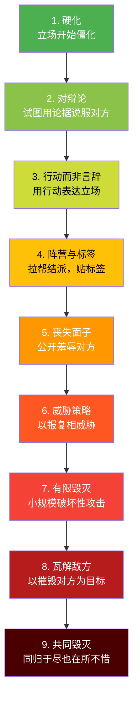
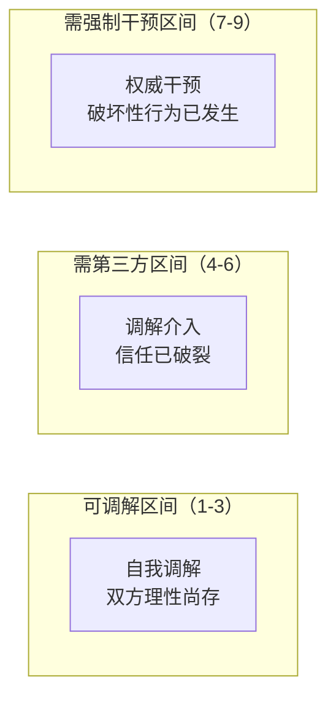
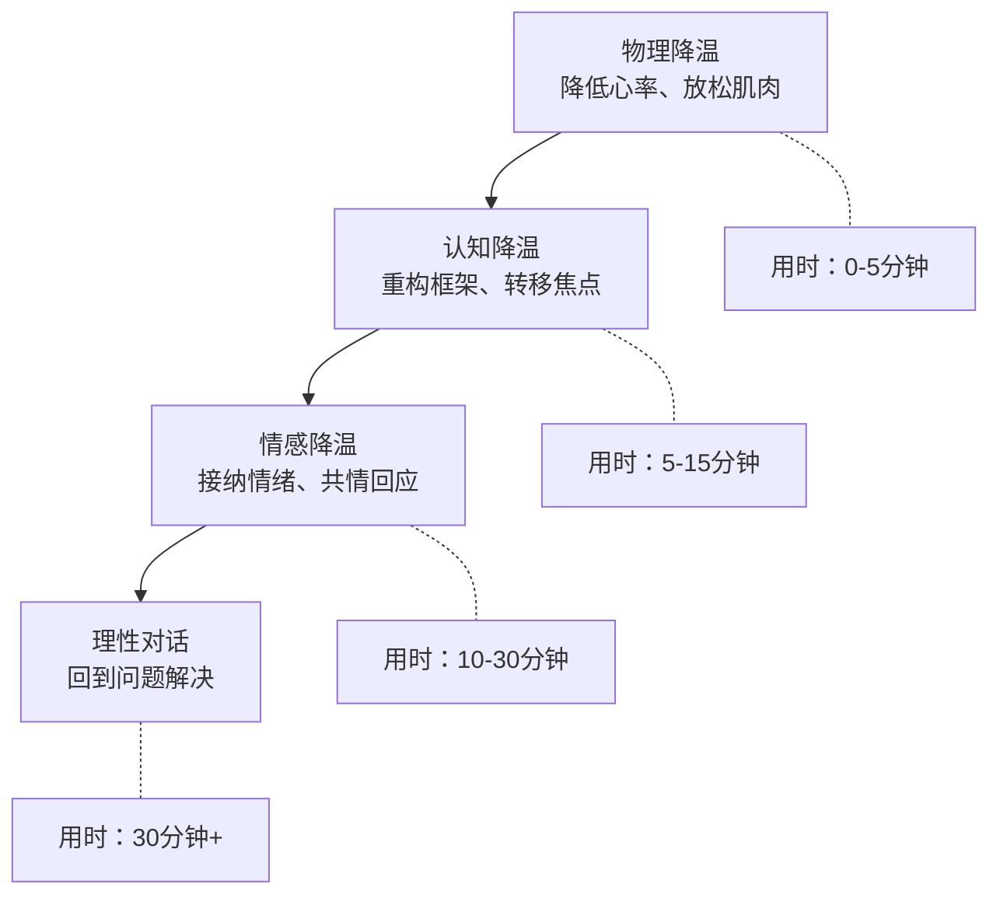
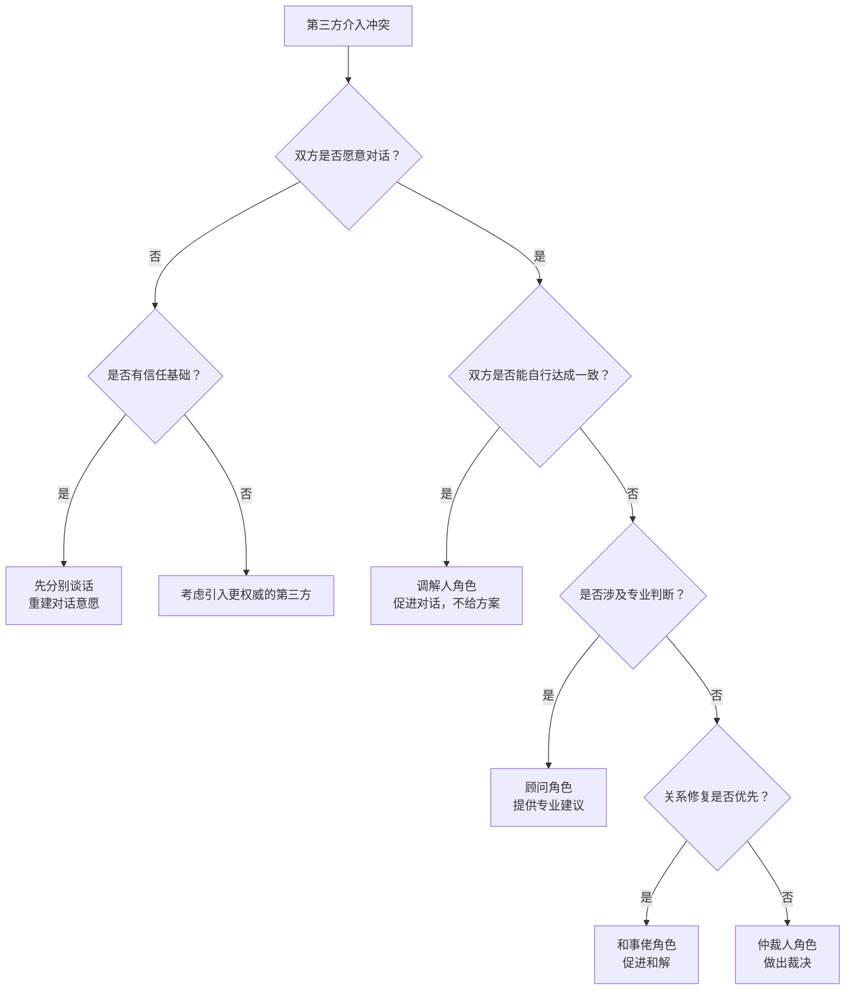

## 三、冲突干预

冲突干预是指在冲突发生过程中，由冲突当事人自身或第三方采取的、旨在阻止冲突恶化、引导冲突走向建设性解决的一系列行动。有效的干预不是简单地"灭火"——它要求干预者准确判断局势、选择恰当策略、掌握具体技巧，并在干预后推动真正的和解与修复。

冲突干预的核心价值在于：它承认冲突本身不可怕，可怕的是冲突失控。就像医学上的"急症处理"，冲突干预的目标不是治愈疾病，而是先稳定生命体征，为后续治疗争取时间和空间。

### 3.1 冲突干预的理论基础

#### 3.1.1 冲突升级模型

理解冲突何时需要干预，首先要理解冲突的升级过程。Friedrich Glasl 于 1982 年提出的冲突升级九阶段模型是该领域最经典的框架：

Glasl 模型的关键洞见：**阶段 1-3 双方仍有赢的可能，自我调解可行；阶段 4-6 第三方介入成为必要；阶段 7-9 只有权威性干预（强制调解、法律手段）才能止血**。

**各阶段识别特征与干预要点：**

| 阶段 | 核心特征 | 典型语言信号 | 干预策略 |
|------|---------|-------------|---------|
| 1. 硬化 | 立场开始固化，贴标签 | "他们就是那种人" | 建议对话，打破刻板印象 |
| 2. 对辩论 | 试图用论据压倒对方 | "数据证明我是对的" | 引导倾听，寻找共同事实基础 |
| 3. 行动而非言辞 | 用行动代替沟通 | 不再回复邮件、消极配合 | 呼吁回到对话桌 |
| 4. 阵营与标签 | 拉拢支持者，妖魔化对方 | "所有正常人都会同意我" | 分别谈话，阻止阵营扩大 |
| 5. 丧失面子 | 公开羞辱对方 | 当众批评、揭短 | 私下调解，保护各方尊严 |
| 6. 威胁策略 | 以报复相威胁 | "如果你不……我就……" | 引入权威，划定行为红线 |
| 7-9. 毁灭性阶段 | 以摧毁对方为目标 | — | 强制隔离，法律/制度介入 |

**真实场景示例：** 某科技公司两个部门负责人因资源分配产生分歧（阶段1），各执己见互不退让（阶段2），开始互相拖延对方的审批流程（阶段3），各自在管理层会议上拉拢盟友（阶段4），在全员大会上公开指责对方部门"不专业"（阶段5）。如果在阶段3时有上级介入引导，冲突可能止步于此；等到阶段5才处理，修复成本将数倍增长。

#### 3.1.2 情绪劫持与杏仁核

为什么人在冲突中会"失去理智"？神经科学给出了答案。

当人感知到威胁时，杏仁核（amygdala）会接管大脑的控制权，触发"战或逃"反应。此时前额叶皮层（负责理性思考、冲动控制）的活动被抑制，人进入"情绪劫持"（emotional hijacking）状态。

情绪劫持的典型表现：
- **认知窄化**：只能看到对方的"恶意"，无法看到其他解释
- **记忆扭曲**：只记得对方做过的坏事，选择性遗忘好的方面
- **极端化表达**："你总是……"、"你从来不……"
- **生理反应**：心跳加速、面红耳赤、呼吸急促、肌肉紧绷
- **反应时间**：情绪劫持的持续时间通常为 20 分钟到数小时

理解这一点对干预至关重要：**在情绪劫持状态下，任何讲道理都是无效的**。干预的第一步永远是帮助当事人从情绪劫持中恢复，而非推进理性讨论。

**神经科学的干预启示：** 哈佛大学医学院的研究表明，情绪劫持期间，大脑的"默认模式网络"（DMN）活动增强，这意味着当事人会不断在内心重播冲突场景，强化负面情绪。打断这种反刍循环的有效方法包括：改变物理环境（打断DMN激活）、进行需要集中注意力的简单任务（如数数、描述周围物体）、以及引导当事人进行具体的未来规划（激活前额叶的目标导向回路）。

#### 3.1.3 Thomas-Kilmann 冲突处理模型

这个经典模型从"坚持性"（assertiveness）和"合作性"（cooperativeness）两个维度描述五种冲突处理风格，帮助干预者理解当事人的行为模式：

| 风格 | 坚持性 | 合作性 | 典型表现 | 适用场景 |
|------|--------|--------|----------|----------|
| 竞争（Competing） | 高 | 低 | 坚持己见，不惜代价 | 紧急决策、原则性问题 |
| 迁就（Accommodating） | 低 | 高 | 牺牲自己，满足对方 | 关系比结果重要时 |
| 回避（Avoiding） | 低 | 低 | 逃避问题，拖延处理 | 问题微不足道时 |
| 妥协（Compromising） | 中 | 中 | 各让一步，各取所需 | 时间紧迫需要折中 |
| 协作（Collaborating） | 高 | 高 | 共同探索，双赢方案 | 问题重要且双方有意愿 |

作为干预者，你的目标通常是引导当事人从竞争或回避转向协作。但现实中，不同阶段可能需要不同风格——有时候妥协就是最好的结果。

**风格识别实操指南：**

- **竞争型**的信号：说话绝对化（"这是唯一正确的做法"）、不愿讨论替代方案、关注"赢"多于关注"解决"
- **迁就型**的信号：频繁说"随便你"、快速同意但事后不满、用沉默表达抗议
- **回避型**的信号：经常转移话题、延迟回复、说"改天再说"但从不主动提起
- **妥协型**的信号：主动提出"各退一步"、关注公平性、愿意牺牲部分利益
- **协作型**的信号：主动倾听、提问多于陈述、关注"我们"而非"我"

识别当事人的冲突风格后，干预策略应有针对性调整。面对竞争型，不要正面对抗其立场，而是通过提问引导其发现方案的局限性；面对回避型，需要降低对话的压力感，可以从小议题开始；面对迁就型，要鼓励其表达真实需求，可以先问"如果没有任何限制，你最希望的结果是什么？"

#### 3.1.4 社会同一性理论与群体冲突

当冲突发生在群体之间（部门vs部门、团队vs团队、组织vs组织），亨利·泰弗尔（Henri Tajfel）的社会同一性理论提供了关键解释框架。

核心机制：人们通过将自己归类到某个群体（"内群体"）来获得自尊和认同感，同时倾向于贬低"外群体"以强化内群体优越性。这种心理机制导致：

- **群体极化**：群体内部讨论后，立场比个体更极端
- **外群体同质性偏见**：认为"他们"都一样，"我们"各有不同
- **归因偏差**：内群体的失败归因于外部因素，外群体的失败归因于其本质缺陷

**干预启示：** 当冲突涉及群体身份时，单纯处理具体利益分歧远远不够。干预者需要：
1. 创造"超级目标"——需要双方群体协作才能完成的共同任务
2. 强调共享身份——"我们都是这个公司的员工"、"我们都希望项目成功"
3. 增加个体接触——让群体成员以个人身份而非群体代表身份交流
4. 避免强化群体边界——不用"你们部门"、"他们团队"这类标签

### 3.2 何时干预：时机判断的艺术

#### 3.2.1 干预时机评估框架

冲突干预的时机选择至关重要。过早干预可能被视为多管闲事或压制讨论，过晚干预则可能让冲突升级到难以控制的程度。以下是一个系统化的评估框架：

**评估维度一：冲突烈度**

| 指标 | 低烈度（可观察） | 中烈度（准备介入） | 高烈度（立即干预） |
|------|-----------------|-------------------|-------------------|
| 音量 | 正常或略微提高 | 明显提高 | 大声吼叫 |
| 语言 | 就事论事 | 开始出现情绪化表达 | 人身攻击、侮辱性语言 |
| 身体语言 | 姿态紧张但克制 | 握拳、叉腰、逼近 | 摔东西、推搡 |
| 参与范围 | 仅当事人 | 牵涉第三方 | 波及无关人员 |
| 持续时间 | 几分钟 | 十几分钟 | 超过半小时且无缓和趋势 |

**评估维度二：当事人状态**

- 双方是否还有倾听意愿？（有 → 观察；无 → 介入）
- 双方是否仍在就事论事？（是 → 观察；否 → 介入）
- 是否有一方开始退缩/放弃沟通？（是 → 介入，防止隐性伤害积累）
- 是否有明显的情绪失控迹象？（是 → 立即介入）

**评估维度三：环境因素**

- 冲突是否影响了其他人的正常工作/生活？
- 冲突发生在公共场合还是私密空间？
- 是否有权力不对等的因素？（如上级与下属、长辈与晚辈）
- 冲突涉及的议题是否有时间敏感性？

#### 3.2.2 应当立即干预的信号

以下信号出现时，犹豫本身就是错误：

**红线信号（必须立即干预）：**
- 出现人身攻击或侮辱性语言——"你就是个废物"这样的话一旦出口，造成的伤害很难撤回
- 一方明显表现出身体上的不适或恐惧——面色苍白、身体发抖、声音颤抖
- 出现威胁性语言或行为——"信不信我……"、摔门、砸东西
- 冲突正在迅速升级——从讨论到争吵的转变在几分钟内完成
- 冲突影响到了周围无辜的人——孩子在场、同事被波及
- 冲突涉及违法违规行为——歧视、骚扰、暴力

**黄线信号（建议介入，但方式温和）：**
- 对话陷入循环——同一个问题反复争论，没有推进
- 出现"翻旧账"行为——把历史问题拉入当前争论
- 一方开始使用策略性沉默——冷暴力也是一种冲突升级
- 出现"三角化"——试图拉第三方"评理"或站队

#### 3.2.3 可以暂缓干预的情况

- 双方仍在理性讨论范围内——情绪有波动但没有失控
- 冲突的讨论可能有助于问题的暴露和解决——有些"不舒服的对话"是必要的
- 需要给双方一定的空间来表达和发泄——压抑情绪反而会导致更大的爆发
- 过早干预可能被误解为偏袒某一方——尤其当你是双方的共同关系人时
- 双方有能力自行达成共识——过多干预反而削弱了他们的自主能力

**实操建议**：即使决定暂缓干预，也要保持关注。设置一个"观察窗口"——比如给自己 10 分钟，10 分钟后重新评估局势。

#### 3.2.4 不同角色的干预时机差异

| 你的角色 | 干预倾向 | 注意事项 |
|----------|----------|----------|
| 当事人自己 | 宜早不宜迟 | 觉察到自己情绪升温就要启动自我干预 |
| 直接上级/管理者 | 中等偏早 | 不能放任冲突影响团队效能 |
| 同事/朋友 | 观察为主 | 过度介入可能被视为多管闲事 |
| HR/专业调解人 | 按流程来 | 有专业评估工具和介入标准 |
| 家庭成员 | 情况复杂 | 情感卷入深，需要格外注意边界 |

### 3.3 降温技巧：从物理到心理的三层干预

降温的核心原理是：**帮助当事人从情绪脑（杏仁核主导）回到理性脑（前额叶主导）**。这需要从身体层面开始，逐步向认知和情感层面推进。

#### 3.3.1 物理降温——身体先行

为什么从身体开始？因为身体状态直接影响大脑功能。当心跳超过每分钟 100 次时，前额叶的执行功能会显著下降。降低身体的应激反应，是恢复理性的第一步。

**控制呼吸节奏：**

引导当事人（或自己）进行"4-7-8 呼吸法"：
1. 用鼻子吸气，默数 4 秒
2. 屏住呼吸，默数 7 秒
3. 用嘴缓慢呼气，默数 8 秒
4. 重复 3-4 个循环

这个方法的原理是：延长呼气时间会激活副交感神经系统，抑制"战或逃"反应。斯坦福大学神经科学家 Andrew Huberman 的研究进一步指出，生理叹息（double inhale followed by long exhale）是最快速的自主神经调节方式，在紧急情况下比传统呼吸法更快见效——具体做法：快速用鼻子吸两口气（第二口比第一口更深），然后缓慢用嘴呼出。

**调整说话方式：**
- 降低说话音量——不是小声说话，而是从"大声"降到"正常"。这会产生"情绪镜像"效应（emotional mirroring），带动对方也降低音量
- 放慢语速——快速说话会加剧紧张感，刻意放慢语速能给自己和对方留出思考空间
- 使用停顿——在回应之前停顿 2-3 秒，打破"攻击-反击"的自动化循环
- 调整音调——低沉平稳的声调比高亢尖锐的声调更能传递安全感。动物行为学研究表明，低频声音与"非威胁"信号相关联

**创造物理缓冲：**
- 建议换个地方谈——"我们去旁边坐下来聊？" 换环境能打断情绪的惯性
- 先休息一下——"我们先喝杯水，5 分钟后继续" 这 5 分钟足够让皮质醇水平下降
- 进行物理活动——"我们先走走？" 轻度运动能消耗应激激素
- 调整身体姿态——从对抗姿态（双臂交叉、面对面）转为合作姿态（并肩而坐、开放姿态）

**一个被低估的技巧：降低温度。** 如果在室内，打开窗户让冷空气进来，或调低空调温度。物理环境的温度下降，对心理温度有微妙但真实的调节作用。康奈尔大学的研究发现，室温从 25°C 降到 20°C 时，参与冲突谈判的被试倾向于做出更理性的判断。

**另一个实用技巧：提供食物和水。** 血糖下降会加剧易怒情绪。在长时间的调解会议中，提供水和简单的零食（坚果、水果）不仅是礼貌，更是生理层面的干预措施。

#### 3.3.2 认知降温——重构框架

当身体状态开始稳定后，可以介入认知层面。

**暂停争议话题，转向共识区：**

冲突中的对话往往聚焦于分歧点。有意识地将注意力转移到双方有共识的事项上：

- "在讨论这个分歧之前，我想先确认——我们都同意 X 对团队很重要，对吧？"
- "我们目标是一致的，只是方法不同。先把目标说清楚？"

这种"共识前置"的技巧能重建双方的合作感。

**重新定义问题框架：**

| 冲突框架（对抗性） | 重构框架（合作性） |
|-------------------|-------------------|
| "你对我错" | "我们面对一个共同的问题" |
| "你为什么这样做？" | "我们怎样才能解决这个问题？" |
| "你总是/从来不……" | "在这次事件中，我观察到……" |
| "你就是不在乎" | "我很在意这件事，想听听你的想法" |
| "这是你的问题" | "这是我们都需要处理的问题" |

框架重构的关键在于语言转换。把"你"开头的指控句，转换为"我"开头的感受句，或者"我们"开头的合作句。

**引入时间维度：**

当下的冲突往往让人觉得"一切都完了"。引入时间维度能帮助当事人看到冲突的暂时性：

- "如果我们 5 年后回头看这件事，会怎么看？"
- "先冷静一下，明天再讨论这个问题。你今晚好好想想，我也想想"
- "上周我们也以为那个问题解决不了，后来不是找到办法了吗？"

**提醒共同目标：**

当双方陷入"谁对谁错"的泥潭时，共同目标是最有效的脱困工具：

- "我们都希望项目按时交付，对吧？那我们来讨论怎么解决这个技术分歧"
- "我们都希望孩子健康快乐，对吧？那我们来看看哪种教育方式更好"
- "我们都希望这个团队有凝聚力，对吧？那我们来处理这件事对信任的影响"

**认知重构的高阶技巧——"钢铁人"论证（Steel Manning）：**

与"稻草人"（曲解对方观点然后攻击）相反，"钢铁人"要求你先把对方的论点以最强、最合理的方式复述出来，然后在此基础上讨论。这个技巧在调解中极其有效：

- "我来试着用你的话说一下你的立场，你看看我理解得对不对……"
- "你刚才说的核心意思是……，如果我理解正确的话，这其实是一个很合理的担忧"

当对方听到自己的观点被准确甚至善意地复述时，防御心态会显著降低。

#### 3.3.3 情感降温——接纳情绪

这是最容易被忽视但最关键的一步。很多人在冲突中最大的不满不是"你不同意我"，而是"你不理解我"。

**承认和认可对方的情绪：**

情绪认可（emotional validation）不等于认同对方的观点。你可以说"我理解你很生气"而不必说"你生气是对的"。区别在于：

- ❌ "你不应该这么生气"（否定情绪）
- ❌ "你太敏感了"（贬低情绪）
- ❌ "冷静点，没什么大不了的"（轻视情绪）
- ✅ "我看得出来这件事让你很生气"（承认情绪）
- ✅ "如果我处在你的位置，可能也会感到失望"（共情）
- ✅ "你的感受对我很重要"（重视情绪）

**情绪认可的层次模型：**

情绪认可不是一句"我理解"就够了。它有四个递进层次：

1. **注意到**——"我注意到你看起来很沮丧"（观察并命名情绪）
2. **正常化**——"任何人遇到这种情况都会感到沮丧"（消除情绪羞耻）
3. **探索**——"能告诉我这件事对你意味着什么吗？"（理解情绪根源）
4. **连接**——"听起来这件事触碰到了你很在意的东西——公平/尊重/信任"（连接深层需求）

大多数人只做到第1层就以为完成了情绪认可，但真正的认可需要走到第3或第4层。

**使用"暂停词"机制：**

这是一个预防性策略。在关系正常时就约定一个词（如"暂停"、"红色信号"），任何一方说出这个词就意味着双方需要暂停当前对话，各自冷静至少 15 分钟。

暂停词的关键规则：
1. 说出暂停词后，双方必须立即停止争论，不得"再补一句"
2. 暂停期间不得继续用短信/微信争论
3. 暂停结束后，由说出暂停词的一方发起重新对话
4. 暂停词不是逃避工具——暂停后必须回到问题上来

**给予表达空间：**

很多冲突之所以升级，是因为一方觉得自己"没有被听见"。最简单也最有效的方法：

- "你先说完，我认真听，我不会打断你"
- "我想先完全理解你的想法，然后再表达我的"
- "你刚才说的对我很重要，让我复述一下看我理解得对不对"

这个方法看似简单，但在冲突中践行极难——因为人的本能是"等对方说完赶紧反驳"。需要刻意练习。

**主动倾听的"LUV"技巧：**

- **L（Listen）**：全神贯注地听，放下手机，保持眼神接触
- **U（Understand）**：确认理解——"你的意思是不是……？"
- **V（Validate）**：认可感受——"换了我可能也会这么想"

这个技巧的价值在于它把被动的"听"变成了主动的"理解"，让对方真切感受到被重视。

### 3.4 第三方干预策略

当你作为第三方介入他人之间的冲突时，角色定位和操作方法都有特殊要求。第三方干预的核心挑战是：你既要保持公正，又要推动进展；既要尊重各方自主权，又不能放任冲突恶化。

#### 3.4.1 角色定位：你不是法官

第三方干预有几种不同角色，适用场景不同：

| 角色 | 职能 | 适用场景 | 风险 |
|------|------|----------|------|
| 调解人（Mediator） | 促进对话，不提供方案 | 双方有能力自行解决但需要引导 | 如果双方差距太大可能无法达成一致 |
| 仲裁人（Arbitrator） | 听取双方意见后做出裁决 | 双方无法自行达成一致 | 可能有一方不满裁决结果 |
| 顾问（Consultant） | 提供专业建议和方案 | 涉及专业判断的问题 | 可能被视为偏袒 |
| 教练（Coach） | 帮助一方反思和成长 | 只辅导一方 | 另一方可能觉得不公平 |
| 和事佬（Peacemaker） | 撮合双方和解 | 关系修复为主要目标 | 可能掩盖根本问题 |

大多数情况下，你应该扮演"调解人"角色——引导对话，而非替人做决定。

**角色选择的决策流程：**

#### 3.4.2 保持中立的具体方法

"保持中立"说起来容易做起来难。以下是具体操作方法：

**信息层面的中立：**
- 分别与双方单独谈话（caucus），获取同等深度的信息
- 不在一方面前透露另一方的隐私信息
- 使用相同的评估标准衡量双方的诉求
- 如果发现一方的诉求明显不合理，通过提问引导其自行发现，而非直接指出

**行为层面的中立：**
- 物理位置保持等距——不要坐在某一方旁边
- 与双方保持相同的眼神接触时间
- 给双方相同的发言时间
- 不对任何一方的发言表现出赞同或反对的表情

**语言层面的中立：**

| 偏袒性语言 | 中立性语言 |
|-----------|-----------|
| "他说得有道理" | "我听到了两个不同的视角" |
| "你也应该理解他的难处" | "双方都有自己的难处" |
| "这个方案我觉得可以" | "这个方案你们觉得可行吗？" |
| "你太过分了" | "这个行为对关系造成了影响，你怎么看？" |

**一个重要提醒：同理心不等于认同。** 你可以理解 A 的感受而不认为 A 是对的，你也可以理解 B 的处境而不认同 B 的做法。中立不是"各打五十大板"，而是"认真听每一方说的每一句话"。

**中立的自我检查清单：**

在每次调解会议前后，问自己以下问题：
1. 我是否对某一方产生了明显的同情或反感？
2. 我在分配时间时是否完全均等？
3. 我的建议或提问是否隐含了对某一方立场的支持？
4. 我是否在用不同的语气和态度对待双方？
5. 如果双方事后评价我的中立性，他们会给相同的评分吗？

如果发现偏倚，最有效的方法不是试图"纠正"自己（这很难做到），而是在行为上做出明确的补偿——给被忽视的一方多一些提问和回应。

#### 3.4.3 创造安全空间

冲突干预的物理和心理环境直接影响干预效果。

**物理环境选择：**
- 中立场所——不在任何一方的"领地"（如某一方的办公室）
- 私密空间——保护隐私，降低"面子"压力
- 安静无干扰——关掉手机，避免中途被打断
- 舒适度适中——太舒适可能让人松懈，太压抑可能让人紧张
- 圆桌或并排座位优于面对面——减少对抗感

**规则设定：**

在正式对话开始前，和双方共同确认基本规则。以下是推荐的规则清单：

1. **不打断**——每人发言时，其他人安静倾听
2. **不人身攻击**——可以表达不满，但不能攻击人格
3. **保密**——房间里的对话不传出去
4. **诚实**——说真话，不说假话，但可以选择不说
5. **暂停权**——任何人有权要求暂停
6. **共同目标**——我们都来这里是为了解决问题

**规则执行的关键：** 规则不是挂墙上的装饰，需要在对话过程中主动维护。当有人违反规则时，立即温和但坚定地指出："我注意到刚才有打断的情况，我们回到规则——每个人发言时不打断。XX，请你继续。" 如果多次违反，可以暂停对话单独提醒。

#### 3.4.4 引导结构化对话

结构化对话是第三方干预的核心技术。没有结构的对话很容易退化为新一轮争吵。

**阶段一：各自陈述（每人 5-10 分钟）**

让各方依次表达：
- 发生了什么？（事实层面）
- 你当时的感受是什么？（情感层面）
- 你希望达到什么结果？（需求层面）

引导语示例：
- "请从你的角度描述一下发生了什么"
- "这件事让你有什么感受？"
- "你希望这件事最终怎样解决？"

**阶段二：相互倾听与确认**

这一阶段的目标是确保双方真正听到了对方说的：

- "我来总结一下 A 说的……A，我理解得对吗？"
- "B，你听到 A 说了什么？你能用自己的话复述一下吗？"
- "A，B 说的和你想要表达的一致吗？"

这一步经常被跳过，但它是整个干预过程中最有价值的环节。很多时候，冲突的根源不是利益冲突，而是误解——双方以为对方说的是 A，实际上对方想表达的是 B。

**阶段三：从立场到利益**

立场是"我要什么"，利益是"我为什么需要这个"。很多看似不可调和的立场，背后的利益是可以兼顾的。

经典案例：两个人争一个橙子（立场冲突），一个要吃果肉做果汁，一个要用果皮做蛋糕（利益兼容）。

**更多立场到利益的转化示例：**

| 表面立场 | 深层利益 | 可能的创造性方案 |
|---------|---------|-----------------|
| "我要搬到另一个城市" | 需要职业发展空间和新鲜感 | 在当前城市寻找新岗位，或申请公司内部转岗 |
| "我要离婚" | 渴望被尊重和重视 | 婚姻咨询，重新定义关系边界 |
| "这个项目必须用我的方案" | 希望自己的专业能力被认可 | 在方案中融入双方的核心贡献 |
| "你必须每天准时回家" | 需要稳定的陪伴和安全感 | 约定每周固定的家庭时间，质量重于数量 |

引导语：
- "你希望达到什么结果？为什么这对你很重要？"
- "如果这个条件无法满足，还有什么替代方案也能满足你的核心需求？"
- "在你的诉求中，哪些是必须满足的底线，哪些是可以商量的？"

**阶段四：方案生成与评估**

引导双方共同创造解决方案，而非由第三方提出方案：

- "基于双方的核心需求，有哪些可能的方案？"
- "这个方案对 A 来说满足了什么？对 B 呢？"
- "这个方案的可执行性如何？我们需要制定什么时间表？"

**方案评估的"SMART"检验：** 确保达成的方案满足五个条件：
- **S（Specific）**：具体明确，不含糊
- **M（Measurable）**：可衡量——怎么判断做到了没做到
- **A（Achievable）**：可实现——不超出双方能力范围
- **R（Relevant）**：相关——确实解决了核心利益分歧
- **T（Time-bound）**：有时限——明确执行和复查的时间节点

**阶段五：达成协议与跟进**

把达成的共识写下来，包括：
- 具体的行动条款（谁在什么时候做什么）
- 违反协议的处理方式
- 下次跟进的时间
- 如何处理可能出现的新问题

口头协议和书面协议的效果差距巨大。哪怕只是用手机备忘录记下来，也比"我们说好了"有效得多。

**协议模板示例：**

冲突调解协议书

日期：____
当事人：A（______）、B（______）
调解人：______

一、事件概述
双方就______事件产生的分歧进行调解。

二、达成共识
1. A同意在____（时间）前完成______。
2. B同意在____（时间）前完成______。
3. 双方同意在未来遇到类似问题时，先通过______方式沟通。

三、违约处理
如一方未履行上述条款，双方同意______。

四、跟进安排
调解人将在____（日期）进行跟进，评估协议执行情况。

签字：A______ B______ 调解人______

#### 3.4.5 处理特殊局面

**一方拒绝参与：**
- 不要强迫，尊重其节奏
- 单独谈话，了解抗拒的原因
- 如果是信任问题，先建立信任关系
- 如果涉及安全顾虑，提供安全保障

**一方情绪失控：**
- 暂停群体对话，转为单独谈话
- 使用 3.3 节的降温技巧
- 不要在其情绪失控时推进任何议程
- 如果出现暴力倾向，立即终止对话并确保安全

**对话陷入僵局：**
- 换个话题——"我们先搁置这个，讨论另一个议题"
- 引入新视角——"我们来听听第三方的看法"
- 分解问题——"我们把这个大问题拆成几个小问题，逐个解决"
- 休息一下——有时候暂时分开反而能催生新想法
- 改变物理位置——站起来，走到白板前，用视觉化方式呈现双方的立场和利益

**权力不对等情况：**
- 强势方的让步对弱势方意义重大，引导强势方先表态
- 确保弱势方的发言不被打断
- 在单独谈话中给予弱势方额外支持
- 必要时引入制度性保障（如书面协议、第三方监督）

**双方都在"表演"调解：**

有时候双方参与调解只是走过场——给领导看、给HR看、给自己一个"我试过了"的心理安慰。识别信号：回答敷衍、不触及实质问题、会后行为毫无改变。应对策略：直接指出——"我注意到我们的讨论还没有触及核心问题，你们来这里的真实期望是什么？" 有时候坦诚的对话比假装深入的对话更有价值。

### 3.5 自我干预：当你是冲突当事人

最困难的干预场景不是介入别人的冲突，而是在自己卷入冲突时保持清醒。以下是当你自己就是当事人时的干预策略。

#### 3.5.1 冲突中的自我觉察

自我觉察是自我干预的前提。你需要在冲突中实时监控自己的状态：

**身体信号清单：**
- 心跳是否加速？（超过 100 次/分钟 = 情绪劫持正在发生）
- 呼吸是否变浅变快？
- 肌肉是否紧绷？（下巴、肩膀、拳头）
- 是否开始出汗？
- 胃部是否有不适感？

**思维信号清单：**
- 是否开始使用绝对化语言？（"总是"、"从来不"、"一定"）
- 是否开始读心术？（"你就是想……"、"你肯定是故意的"）
- 是否开始翻旧账？
- 是否觉得对方"不可理喻"？
- 是否有了"算了不说了"的逃避念头？

当这些信号出现 3 个以上时，你需要启动自我干预。

**情绪温度计练习：**

在日常生活中建立"情绪温度计"的习惯——用0-10分评估自己的情绪强度。这个练习的价值在于，当你能在冲突中快速评估"我现在是6分"时，你已经启动了前额叶的元认知功能，这本身就是对抗情绪劫持的第一步。

| 分数 | 状态 | 可采取的行动 |
|------|------|-------------|
| 0-3 | 平静 | 正常沟通 |
| 4-5 | 轻度不适 | 放慢语速，注意措辞 |
| 6-7 | 明显激动 | 启动呼吸法，考虑暂停 |
| 8-9 | 接近失控 | 立即暂停，离开现场 |
| 10 | 完全失控 | 无法进行有效沟通，事后再说 |

#### 3.5.2 六秒钟暂停法

情绪劫持的峰值通常在触发后 6 秒内到来。如果你能在这 6 秒内做出不同反应，就能避免大部分冲动行为：

1. **察觉**——"我现在正在被情绪劫持"
2. **呼吸**——深吸一口气，慢慢呼出
3. **选择**——"我现在有几个选择：继续争论、暂停、换个方式说"
4. **行动**——选择一个对自己和关系最有利的选项

这个方法看起来简单，但需要反复练习才能在真实冲突中用出来。建议在日常小摩擦中就开始练习，而不是等到大冲突时才尝试。

**六秒钟暂停的日常训练法：**

- **交通堵塞练习**：下次遇到堵车或被人加塞时，不按喇叭、不骂人，而是做一次6秒暂停。完成后在心里给自己+1分
- **微信冲动练习**：收到让你不舒服的消息时，先把回复写在备忘录里，等6秒后再决定是否发送。你可能会删掉一大半内容
- **家庭摩擦练习**：伴侣或家人做了让你不满的事（没洗碗、忘买东西），先暂停6秒，再选择表达方式

这些低风险场景的练习，会在高风险冲突中自动激活。

#### 3.5.3 "我"陈述法

当你要表达不满时，使用"我"陈述而非"你"陈述：

**公式**：当（具体行为）发生时，我感到（情绪），因为（影响），我希望（具体请求）。

| "你"陈述（指控性） | "我"陈述（建设性） |
|-------------------|-------------------|
| "你总是迟到，根本不在乎我" | "当你迟到超过 30 分钟且没有提前通知时，我感到不被尊重，因为我觉得我的时间也被浪费了。我希望如果你要迟到，能提前发个消息告诉我" |
| "你根本不会带孩子" | "当你给孩子吃太多零食时，我有些担心，因为我很在意孩子的饮食健康。我们能不能一起商量一下孩子的饮食计划？" |
| "你从来不听我说话" | "当我在说话而你在看手机时，我感到被忽视。我希望我们聊天时能放下手机，给彼此全神贯注的时间" |

"我"陈述的力量在于：它把焦点从"你做错了什么"转移到"我需要什么"，从攻击转向沟通。

**"我"陈述的常见错误：**

- ❌ "我觉得你是个自私的人"——这不是"我"陈述，这是伪装成"我觉得"的"你"陈述
- ❌ "我感到你总是故意气我"——"你总是"仍然是指控，"故意"是读心术
- ✅ "当……的时候"——描述具体可观察的行为，而非对人格的判断
- ✅ "我感到……"——用真实的感受词（失望、担心、委屈），而非对对方的评判

#### 3.5.4 非暴力沟通（NVC）四步法

马歇尔·卢森堡（Marshall Rosenberg）提出的非暴力沟通（Nonviolent Communication）框架是自我干预的高级工具。它包含四个步骤，与"我"陈述法互补但更系统化：

1. **观察**（Observation）：不带评判地描述事实——"这周你有三天没有参加晨会"
2. **感受**（Feeling）：表达你的真实感受——"我感到不安和焦虑"
3. **需要**（Need）：连接到你的深层需要——"因为我需要团队的协作和信息同步"
4. **请求**（Request）：提出具体可操作的请求——"你能不能每周至少参加三次晨会？如果不能参加，提前告知原因？"

**NVC与"我"陈述的区别：** "我"陈述聚焦于表达不满，NVC则更完整地覆盖了从观察到请求的全链条。在日常小摩擦中用"我"陈述即可，在重大冲突或长期关系修复中，NVC四步法更有效。

### 3.6 文化差异与冲突干预

冲突干预不是一套放之四海而皆准的技术——文化背景深刻影响着冲突的表达方式、对干预的接受度、以及"成功调解"的定义。

#### 3.6.1 高语境与低语境文化的冲突差异

爱德华·霍尔（Edward Hall）提出的高/低语境文化框架，对冲突干预有直接指导意义：

| 维度 | 高语境文化（中国、日本、中东） | 低语境文化（美国、德国、北欧） |
|------|--------------------------|--------------------------|
| 冲突表达 | 委婉、间接、暗示 | 直接、明确、就事论事 |
| "面子"的重要性 | 极高——公开冲突是灾难 | 相对低——直接对质可接受 |
| 第三方角色 | 倾向于通过中间人斡旋 | 倾向于当事人直接对话 |
| 情绪表达 | 压抑、含蓄 | 允许适度外露 |
| 调解成功标准 | 关系恢复和谐 | 问题得到解决 |

**在中国文化语境下的干预要点：**
- "面子"不是虚荣，而是社会关系中的信用资本。在调解中，任何让一方"丢面子"的处理方式都会埋下长期隐患
- 给台阶比讲道理更重要——"他可能也不是故意的"比"他的行为确实不对"更容易被接受
- 关系修复（"以后还是好同事"）有时比问题解决（"这件事谁对谁错"）更优先
- 私下沟通比公开调解更有效，尤其涉及层级关系时

#### 3.6.2 跨文化干预的实操建议

1. **了解双方的文化背景**——不要假设你的干预方式对所有人都适用
2. **尊重"面子"需求**——即使在低语境文化中，也没有人喜欢被当众指出错误
3. **灵活调整直接程度**——面对高语境文化的当事人时，用更多暗示和比喻；面对低语境文化的当事人时，更直接反而更受尊重
4. **注意非语言信号**——在高语境文化中，沉默、回避眼神、语气变化往往比语言本身传递更多信息

### 3.7 数字时代的冲突干预

当代冲突越来越多地发生在数字空间——微信群里的争吵、邮件往来中的误读、远程会议中的摩擦。数字环境给冲突干预带来了全新的挑战。

#### 3.7.1 数字冲突的独特困难

- **缺乏非语言线索**：文字信息丢失了93%的沟通信息（语调55%+肢体语言38%，梅拉宾法则）
- **异步沟通的误解**：对方秒回是"急了"，不秒回是"不在乎"——怎么都不对
- **截图与传播风险**：数字冲突可能被截图传播，大幅扩大影响范围
- **打字的永久性**：冲动发出的消息比冲动说出的话更难收回
- **群体效应放大**：微信群里的冲突会迅速拉入旁观者，加剧群体极化

#### 3.7.2 数字冲突干预策略

**原则一：能打电话不发微信，能见面不打电话**

当文字沟通开始产生误解或情绪升温时，立即切换到更高带宽的沟通渠道。带宽排序：面谈 > 视频通话 > 电话 > 语音消息 > 文字消息。

**原则二：文字沟通的"30秒规则"**

在发送任何情绪性的文字消息前，等待30秒。利用这30秒做两件事：（1）读一遍自己写的内容，（2）想象对方收到这条消息时会怎么理解。如果存在被误解的可能，改写。

**原则三：群聊冲突的隔离策略**

当微信群里出现冲突苗头时：
1. 不要在群里回应情绪性发言——这会火上浇油
2. 私聊当事人——"我看到群里的情况了，方便单独聊聊吗？"
3. 如果你是群主或管理员，可以暂时禁言或关闭话题
4. 绝对不要在群里"站队"——这会把冲突从两人扩展到群体

**原则四：远程会议中的冲突干预**

- 利用"聊天窗口"功能——看到情绪升温时，在聊天框里私信当事人
- 使用"举手"功能——打断即将爆发的冲突，给双方缓冲时间
- 建议"分会讨论"——把有分歧的双方分到单独的breakout room
- 录制会议——这既是保护，也是让各方注意言行的提醒

### 3.8 干预后的修复与跟进

很多冲突干预在"双方和好"时就结束了，但真正的修复才刚刚开始。修复阶段决定了冲突是一次性事件还是反复循环的起点。

#### 3.8.1 信任修复的四阶段模型

信任修复不是一句"对不起"就能完成的。弗朗西斯·福山在《信任》中指出，信任是社会资本的核心组成部分，它的破坏是瞬间的，但重建是缓慢的。以下是系统化的四阶段模型：

1. **承认**——明确承认冲突中造成的伤害，不轻描淡写。承认的要素包括：具体行为（做了什么）、影响（造成了什么后果）、责任（这是我的责任）。模糊的"我为一切道歉"不如具体的"我承认在会上当众批评你的方案是不对的，这让你在团队面前失去了尊严，这是我的责任"。

2. **道歉**——真诚的道歉需要满足四个条件：
   - 表达悔意（"我很抱歉"）
   - 承认责任（"这是我的错"）
   - 提出修复（"我想弥补"）
   - 承诺改变（"我会……"）
   
   不带"但是"——"我道歉，但是你也……"不是真道歉，是变相指责。

3. **补偿**——用实际行动弥补伤害，而非仅靠语言。补偿要与伤害匹配：伤害了面子，就在公开场合给予认可；浪费了时间，就主动承担额外工作；造成了经济损失，就提出经济补偿方案。补偿不在于大小，在于是否让对方感受到"你真的在意我的损失"。

4. **重建**——通过持续的一致性行为重建信任。心理学研究表明，信任重建需要"正面互动/负面互动"的比例达到至少5:1（约翰·戈特曼的研究）。这意味着一次冲突造成的信任损失，需要至少五次可靠的、一致的正面行为来弥补。

**修复中的"转折点事件"（Turning Point）：**

信任重建不是匀速过程。研究表明，修复过程中通常存在一个"转折点"——一个具体的事件或行为，让受损方从"观望"转向"开始重新信任"。这个转折点往往不是最大的补偿行为，而是一个小但出乎意料的善意行为——比如主动承担了没人要求你做的工作，或者在对方不在场时为其辩护。识别和创造这些转折点，是修复阶段的关键技能。

#### 3.8.2 跟进机制

系统化的跟进确保修复不会中途夭折：

- **干预后 24 小时内**进行第一次跟进——"昨天的事，你们今天感觉怎么样？"这个跟进的目的不是评估进展，而是传递一个信号：我在持续关注这件事
- **干预后 1 周**进行第二次跟进——关注协议的执行情况。此时最容易出现"承诺了但没做"的情况，温和但明确地提醒
- **干预后 1 个月**进行第三次跟进——评估长期效果。如果问题已经解决，恭喜；如果出现反复，重新启动干预
- **干预后 3 个月**进行第四次跟进（可选）——确认问题没有以新的形式复发

**跟进的具体话术：**

| 阶段 | 话术示例 | 关注点 |
|------|---------|--------|
| 24小时 | "昨天聊完之后，你们感觉怎么样？有没有什么新的想法？" | 情绪状态 |
| 1周 | "上周达成的几个共识，执行得怎么样了？有没有遇到什么困难？" | 执行情况 |
| 1个月 | "一个月了，之前的问题有没有出现反复？你们对目前的状况满意吗？" | 长期效果 |
| 3个月 | "最近一切都好吧？有没有什么需要我帮忙的？" | 预防复发 |

#### 3.8.3 从冲突中学习：结构化复盘

每次冲突都是一次学习机会。干预结束后，可以进行简短的"冲突复盘"。复盘不是追究责任，而是提取经验。

**复盘五问：**

1. 这次冲突的根本原因是什么？（区分表层原因和深层原因。"谁该洗碗"是表层，"谁觉得自己承担了更多家务"是深层）
2. 冲突升级的过程中有哪些关键转折点？（哪个瞬间从讨论变成了争吵？是什么触发了情绪劫持？）
3. 哪些干预措施有效？哪些无效？（降温技巧是否起作用？"我"陈述是否真的减轻了攻击性？）
4. 如果重来一次，双方会怎样做？（不是"谁该改"，而是"我们各自可以做什么不同的选择"）
5. 有什么制度性或结构性的改变可以预防类似冲突？（是否需要调整分工？是否需要定期沟通机制？是否需要明确某些边界？）

**组织层面的冲突复盘：**

如果是团队或组织内的冲突，复盘应扩大到系统层面：
- 是否有流程缺陷导致了这次冲突？（如职责不清、审批流程模糊）
- 是否有结构性矛盾需要高层介入？（如资源分配制度不合理）
- 团队的沟通文化是否需要调整？（如是否缺乏安全表达意见的渠道）
- 这次冲突暴露了哪些团队能力短板？（如缺乏反馈能力、缺乏冲突处理培训）

### 3.9 常见干预误区

**误区一：急于解决问题而忽视情绪**

很多人一介入冲突就急于"解决问题"，但当事人的情绪没有被处理之前，任何方案都不会被接受。大脑在情绪劫持状态下，前额叶的理性决策功能处于"离线"状态——你提出的方案再好，当事人也听不进去。

✅ 正确做法：先接纳情绪，再讨论方案。"我理解你现在很生气/失望/委屈。我们先把情绪放一放，然后再来看看怎么解决，好吗？"

**误区二：强行追求"和好"**

有些冲突不需要"和好"，而是需要"和解"——承认分歧、接受差异、找到共处方式。强行追求表面和谐可能掩盖真实问题。研究表明，"建设性冲突"（constructive conflict）——即双方能把分歧摆到台面上讨论——反而能提升团队创新力和决策质量。

✅ 正确做法：接受"同意存在分歧"也是一种解决方案。"你们不需要成为好朋友，但需要找到合作共事的方式。"

**误区三：过度共情导致失去中立**

第三方干预者有时会对弱势方产生过多共情，不自觉地偏袒一方。这种偏袒一旦被感知，调解的可信度就会崩塌。

✅ 正确做法：保持觉察，定期自问"我是否在给某一方更多的支持？" 如果是，调整行为。

**误区四：用"公平"替代"公正"**

公平是"各打五十大板"，公正是"谁有过错谁承担"。为了快速结束冲突而各退一步，可能对无过错方不公平。

✅ 正确做法：公正优先，兼顾关系。如果有明确的过错方，应该明确指出，但方式要尊重。

**误区五：忽视权力因素**

不考虑权力差异的干预可能加剧不平等。当上级与下属发生冲突时，表面上的"平等对话"可能实际上是一种压迫。下属在上级面前"自愿"同意的方案，可能只是屈服而非真正认同。

✅ 正确做法：识别权力差异，在干预设计中予以平衡。例如，允许弱势方提前准备书面陈述，或在单独谈话中给予额外支持。

**误区六：把调解变成说教**

"你应该怎样怎样"不是调解，是说教。当事人最不需要的就是再多一个"教训"他们的人。调解者一旦开始"教育"当事人，就从引导者变成了另一个权威人物，而当事人已经有一个权威在压迫他们了。

✅ 正确做法：多用提问引导，少用陈述教育。"你觉得怎样做更好？"比"你应该这样做"有效得多。

**误区七：忽视冲突的系统性根源**

有些冲突反复出现，不是因为当事人"不会沟通"，而是因为系统性问题——资源不足、职责不清、制度不公。如果只是反复调解而不解决系统问题，就像不断治疗症状而不治病因。

✅ 正确做法：在调解个别冲突的同时，审视是否存在需要组织层面解决的结构性问题。如果同一类冲突在不同人之间反复出现，几乎可以确定是系统问题而非个人问题。

### 3.10 干预能力的持续提升

冲突干预是一项可以通过刻意练习不断提升的技能。

**日常练习：**
- 在低风险场景中练习降温技巧——比如在路怒时使用呼吸法
- 观察他人如何处理冲突——看脱口秀调解类节目、法庭纪录片
- 进行"角色扮演"——和朋友模拟冲突场景，练习干预技巧
- 写冲突日记——记录每次冲突的触发点、自己的反应、有效和无效的做法

**专业提升路径：**
- 阅读经典著作：《Getting to Yes》（Roger Fisher）、《Difficult Conversations》（Douglas Stone）、《Crucial Conversations》（Kerry Patterson）、《Nonviolent Communication》（Marshall Rosenberg）、《The Anatomy of Peace》（The Arbinger Institute）
- 参加调解培训——很多社区调解中心提供免费培训
- 寻求督导——在专业人士指导下进行调解实践
- 学习相关心理学知识——情绪调节、认知行为理论、系统理论

**冲突干预能力的五级进阶：**

| 级别 | 能力特征 | 典型表现 | 适合的干预场景 |
|------|---------|---------|--------------|
| L1 初学者 | 能识别冲突，但不知道怎么做 | 只能劝"别吵了" | 低烈度的朋友间摩擦 |
| L2 入门 | 掌握基本降温技巧 | 能使用呼吸法和"我"陈述 | 日常家庭/职场小冲突 |
| L3 中级 | 能进行结构化调解 | 能引导五阶段对话 | 同事间/朋友间的中等冲突 |
| L4 高级 | 能处理复杂局面 | 能应对权力不对等、群体冲突 | 组织/团队层面的冲突 |
| L5 专家 | 能设计冲突解决系统 | 能从制度层面预防冲突 | 组织咨询、制度设计 |

**一个核心认知：冲突干预的目标不是消灭冲突。** 冲突是人类互动的自然组成部分，它反映了不同的需求、价值观和利益。干预的目标是帮助冲突保持在建设性范围内——让冲突成为推动理解和改变的力量，而非摧毁关系的破坏力。

正如彼得·德鲁克所说："最重要的事不是消灭冲突，而是让冲突变得有成效。"一个没有冲突的组织或关系，往往不是和谐的，而是压抑的。真正的冲突干预能力，是让分歧能够安全地表达、充分地讨论、建设性地解决——最终让关系因为经历过冲突而变得更加坚韧和真实。
