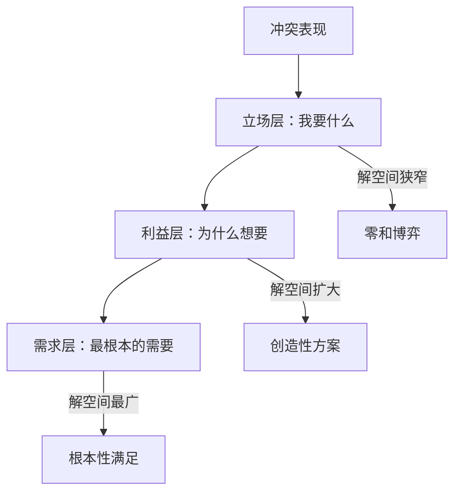
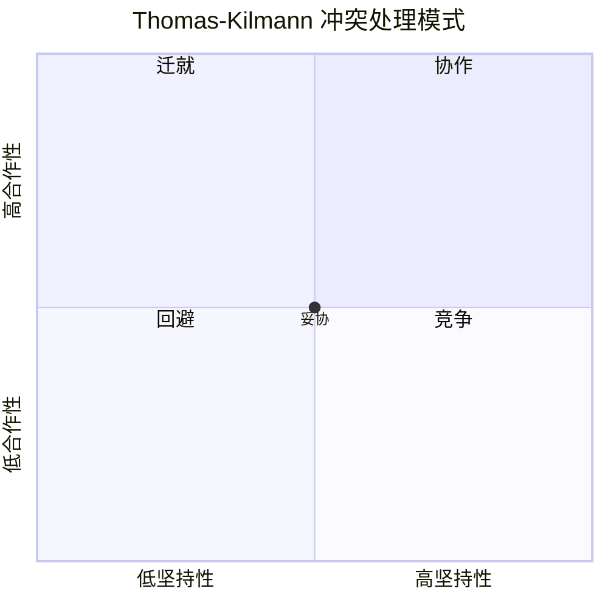

## 四、冲突解决

冲突解决不是"和稀泥"，也不是让一方屈服于另一方。真正的冲突解决是找到一种方案，使得各方的核心利益都得到合理满足，同时关系得以维护甚至加强。本章从理论模型到实操工具，从个体技巧到组织体系，系统讲解冲突解决的完整方法论。

### 4.1 冲突解决的理论基础

#### 4.1.1 从立场到利益：哈佛谈判项目的革命性发现

1981年，哈佛大学谈判项目的罗杰·费舍尔（Roger Fisher）和威廉·尤里（William Ury）出版了《Getting to Yes》，提出了一个改变冲突解决领域的核心洞察：**人们在冲突中展示的"立场"（Position）和驱动行为的"利益"（Interest）往往不是一回事**。

这个发现为什么重要？因为它解释了一个常见困境——为什么很多冲突看似无解，实际上只是因为我们解决的问题层次不对。

**三层结构模型**：

| 层次 | 定义 | 特征 | 示例 |
|------|------|------|------|
| 立场层（Position） | 当事人明确提出的要求 | 具体、明确、但往往排他 | "我要加薪20%" |
| 利益层（Interest） | 驱动立场的深层动机 | 隐含、多元、可被多种方式满足 | "我的付出应被公平认可" |
| 需求层（Need） | 最根本的人性需求 | 普遍、稳定、跨情境 | "被尊重、有安全感" |

**为什么停留在立场层无法解决冲突？**

立场层面的博弈本质上是零和游戏。"加薪20%"和"不加薪"之间看似只有妥协（比如加薪10%），但实际上任何折中都可能让双方不满——员工觉得没得到应有的认可，管理者觉得开了不好的先例。

当我们深入到利益层，解空间瞬间扩大。"被公平认可"这个需求可以通过多种方式满足：调整职级头衔、增加绩效奖金、提供带薪培训机会、改善办公条件、给予更多决策权、安排更有挑战性的项目。其中某些方案成本低于加薪20%，但对员工的实际激励效果可能更好。

#### 4.1.2 基于利益的冲突解决（IBCR）框架

基于利益的冲突解决（Interest-Based Conflict Resolution, IBCR）是哈佛谈判项目的实践方法论，其核心原则如下：

**原则一：把人和问题分开**

冲突中的当事人往往会把"对事的分歧"转化为"对人的攻击"。IBCR要求严格区分两者——你可以强烈反对对方的方案，但必须尊重对方这个人。

认知心理学中的"基本归因错误"（Fundamental Attribution Error）解释了为什么会发生这种转化：我们倾向于把别人的行为归因于他们的性格（"他就是故意针对我"），而把自己的行为归因于环境（"我是被迫才这样做的"）。冲突解决的第一步就是意识到这种偏差。

实操技巧：
- 批评方案时说"这个方案在实施成本上有困难"，而不是"你这个想法不切实际"
- 承认对方的情绪："我能理解这个结果让你很失望"，而不是否认情绪："你不应该这么想"
- 坐在桌子同一侧看文件，而不是面对面坐着——物理空间的安排会影响心理对立感
- 把问题具象化为一个独立的对象：把方案画在白板上，让双方一起面对白板而不是彼此面对

**原则二：关注利益而非立场**

引导各方说出"为什么"要这个东西，而不是争论"要什么"。

提问技巧：
- "你能帮我理解一下，这个要求背后最重要的考虑是什么？"
- "如果这个问题解决了，对你来说最好的结果是什么样的？"
- "你最担心发生什么？"
- "如果这个需求完全不被满足，对你会有什么具体影响？"
- "在你看来，什么情况下你可以接受一个不同的方案？"

注意：提问时保持真诚的好奇心，不要让提问变成质问。语气上的差异会让同样的问题产生完全不同的效果。

**原则三：创造双赢选项**

在划定期权之前先大量发散。冲突中的一个常见认知陷阱是"固定馅饼假设"（Fixed Pie Bias）——认为一方得到的多了，另一方必然得到的少了。实际上，通过创造性思维，往往可以"把馅饼做大"。

"固定馅饼假设"的神经科学解释：在冲突状态下，大脑的威胁检测系统（杏仁核）高度活跃，会关闭创造性思维所需的前额叶皮层功能。这意味着冲突中的双方在生理上就更难产生创造性方案——这正是为什么头脑风暴需要在安全的环境中、情绪稳定后进行。

**原则四：坚持使用客观标准**

当利益冲突确实无法完全调和时，使用外部的、双方都认可的客观标准来评估方案——行业薪资调查、公司制度、法律规定、科学数据等。这比"谁更强势谁说了算"更公平，也更容易被接受。

客观标准的三个层次：
- **普遍标准**：法律法规、行业规范、科学研究——约束力最强
- **组织标准**：公司制度、既往惯例、管理层决定——约束力中等
- **情境标准**：双方共同认可的参照系（如"其他部门怎么做的"）——约束力最弱但灵活性最高

#### 4.1.3 Thomas-Kilmann冲突模式模型

Kenneth Thomas和Ralph Kilmann在1974年提出的冲突处理模式模型，是理解"冲突解决风格"的经典框架。该模型基于两个维度：

- **坚持性（Assertiveness）**：满足自身利益的程度
- **合作性（Cooperativeness）**：满足对方利益的程度

两个维度交叉产生五种冲突处理模式：

| 模式 | 坚持性 | 合作性 | 适用场景 | 风险 |
|------|--------|--------|----------|------|
| **竞争（Competing）** | 高 | 低 | 紧急决策、维护核心原则、对方恶意利用善意 | 损害关系，引发报复 |
| **迁就（Accommodating）** | 低 | 高 | 关系比结果重要、对方确实更有道理、积累善意 | 被视为软弱，自身需求长期被忽视 |
| **回避（Avoiding）** | 低 | 低 | 问题微不足道、情绪过热需要冷却、需要更多信息 | 问题积累恶化 |
| **妥协（Compromising）** | 中 | 中 | 时间紧迫需要临时方案、旗鼓相当的对手、其他方法失败 | 双方都不完全满意 |
| **协作（Collaborating）** | 高 | 高 | 双方利益都很重要、关系长期且重要、有足够时间和意愿 | 耗时较长，需要双方配合 |

**每种模式的实战要点**：

**竞争模式的正确使用**：竞争不是"强势压人"，而是在明确自己底线后坚定表达。使用竞争模式时，关键在于：（1）确保你代表的是正当利益而非个人好恶；（2）做好关系受损的准备和后续修复计划；（3）清晰解释你的理由，而非仅仅宣布决定。

**迁就模式的风险管理**：偶尔的迁就是策略性的，但长期迁就会导致"隐性成本累积"——你的情绪账户在持续透支，直到某天一次性爆发。如果你发现自己总是迁就，需要问自己：是真正的"不在意"，还是"不敢在意"？前者是选择，后者需要被解决。

**回避模式的正确时机**：回避不等于逃避。以下三种情况使用回避是明智的：（1）信息不足时暂缓决策；（2）双方情绪过热需要冷却期；（3）问题确实不重要，投入产出比不划算。关键区别在于：回避是主动选择"现在不处理"，不是被动地"不敢处理"。

**妥协模式的陷阱**：最常见的错误是把妥协当作默认模式。每次冲突都各让一步，结果是每次双方都不满意，且核心问题永远没有被真正解决。妥协应该是"协作尝试失败后的务实退路"，而不是"省事的首选"。

**协作模式的前置条件**：协作需要双方都有意愿、有时间、有信任基础。如果一方只想要"赢"，协作模式无法启动。在尝试协作前，先确认：（1）双方是否都愿意投入时间？（2）双方是否都相信有可能找到双赢方案？（3）双方是否有足够的信息共享意愿？

**关键认知**：没有"最好的"模式，只有"最合适的"模式。成熟的冲突解决者能够根据情境灵活切换。研究表明，高绩效团队中，成员能够使用多种模式而非固守单一模式。

**自评练习**：

回忆最近三次冲突，每次你使用了哪种模式？分析：
- 当时为什么选择这个模式？
- 换一种模式结果会不会不同？
- 你是否有"默认模式"——无论什么情况都习惯性地使用同一种模式？

#### 4.1.4 认知偏差对冲突解决的干扰

冲突解决中最大的敌人往往不是对方，而是你自己大脑中的认知偏差。了解这些偏差是避免它们的前提。

**确认偏差（Confirmation Bias）**：在冲突中，你会自动搜索支持自己立场的证据，忽略或贬低反面证据。表现：只记得对方"每次都迟到"的那几次，忘了对方准时的那些天。

纠正方法：强制自己列出至少3个支持对方立场的事实或合理之处。这个动作本身就能降低确认偏差的强度。

**归因偏差（Attribution Bias）**：把对方的不当行为归因于人品（"他就是自私"），把自己的不当行为归因于环境（"我当时压力太大"）。

纠正方法：用"情境方程"替代"人品判断"——问自己"如果我处在他的处境、有他的压力、掌握他的信息，我会不会做出类似的选择？"

**锚定效应（Anchoring Effect）**：冲突中第一个提出的数字或方案会成为后续讨论的"锚点"，后续方案都在这个锚点附近调整。表现：如果对方先提出"赔偿50万"，即使你的合理评估是10万，你的心理锚点也会被拉高。

纠正方法：在讨论开始前，基于客观数据独立评估一个合理范围。如果对方先抛出锚点，明确指出"这个数字的依据是什么？"而不是在这个数字基础上讨价还价。

**损失厌恶（Loss Aversion）**：人们对损失的敏感度是收益的2倍左右。在冲突中，这意味着"我可能失去什么"比"我能得到什么"更能驱动行为。表现：宁可两败俱伤也不愿意"让对方占便宜"。

纠正方法：重新框架——把注意力从"我会失去什么"转向"如果不解决，我们都会失去什么"。

**自我服务偏差（Self-Serving Bias）**：倾向于高估自己的贡献和善意，低估对方的。表现："我为团队付出了这么多，他一点都不领情。"

纠正方法：做一个"贡献审计"——客观列出双方各自的贡献和让步，用数据而非感觉来评估。

**群体内偏见（In-Group Bias）**：在团队冲突中，自动站在"自己人"一边，把"外人"视为对立面。表现：跨部门冲突中，本能地维护本部门立场。

纠正方法：引入"超级身份"视角——"我们都是公司的人""我们都希望项目成功"。把冲突从"部门A vs 部门B"重新定义为"我们共同面对的问题"。

### 4.2 系统化冲突解决流程

#### 4.2.1 六步冲突解决法

以下是一个经过验证的六步冲突解决流程，适用于大多数人际冲突和团队冲突。

**步骤一：创造安全的沟通环境**

安全的环境是有效对话的前提。心理学研究（Amy Edmondson的心理安全感理论）表明，当人们感到不安全时，会本能地进入防御模式——要么战斗（攻击）、要么逃跑（回避）、要么冻结（沉默），这三种反应都无法产生有效的冲突解决。

环境准备清单：
- **时机**：选择双方都不疲惫、不匆忙的时间。不要在冲突刚发生时立刻"解决"——情绪高峰期的认知能力会下降40%以上。建议等待至少24小时，但不要超过一周（过长的等待会让问题发酵）
- **地点**：选择中立、私密、舒适的场所。避免在任何一方的"领地"（如某人办公室）进行，这会造成隐性的权力不对等。如果可能，选择一个"第三方空间"——会议室、咖啡厅、甚至散步的路线
- **状态**：确认双方都有意愿对话。如果一方明显抗拒，先处理意愿问题
- **规则**：在对话开始前明确基本规则

基本规则模板：
我们的对话规则：
1. 一次只有一个人说话
2. 不打断对方
3. 可以表达情绪，但不进行人身攻击
4. 目标是找到解决方案，不是分出对错
5. 任何一方感到不适都可以要求暂停

开场话术示例：
> "我希望我们能找个时间，坐下来好好聊聊最近的一些事情。我觉得我们之间的沟通出现了一些问题，我希望能找到一个对我们双方都好的解决办法。你方便吗？"

如果对方拒绝：
> "我理解你现在可能不想谈，这没关系。我只是希望你知道，我很重视我们的关系/合作，等你准备好了随时可以聊。"

如果对方表现出防御姿态（交叉双臂、身体后仰、避免眼神接触），不要强行推进。可以说："我感觉你可能还没准备好，我们可以改天再聊。或者你想先说说你的想法？"

**步骤二：各方充分表达**

这一步的目标是让双方都感到"被听见了"。研究显示，当人们感到自己的观点被充分理解后，即使最终结果不完全如愿，接受度也会显著提高（procedural justice，程序公正效应）。

表达框架——"我"陈述法（I-Statement）：

| 步骤 | 公式 | 示例 |
|------|------|------|
| 描述具体行为 | "当你……" | "当你在会议上打断我的发言时……" |
| 表达感受 | "我感到……" | "我感到不被尊重和沮丧……" |
| 说明影响 | "因为这让我……" | "因为这让我觉得自己的观点不被重视……" |
| 表达期望 | "我希望……" | "我希望在我说完之后你再发表看法。" |

避免"你"陈述法——"你总是打断我""你从来不听我说"这类表述会立刻激发对方的防御反应。"你"陈述法的破坏力在于：它把一个具体行为（"打断"）升级为对人格的评判（"你这个人总是……"），触发对方的自我保护本能。

**"我"陈述法的常见错误用法**：

- ❌ "我觉得你是个混蛋"——这不是"我"陈述法，只是换了主语的攻击
- ❌ "我感到你故意针对我"——"你故意"是揣测动机，不是表达感受
- ✅ "当你连续三次否决我的方案时，我感到很挫败"——行为+感受，可验证

倾听框架——主动倾听三步法：
1. **专注接收**：放下手机，保持眼神接触，不打断，身体微微前倾。注意力全部集中在对方身上，不要在心里准备反驳
2. **复述确认**："你的意思是……对吗？"用自己的话重新表述对方的观点，确认理解准确。这一步极其重要——研究表明，70%以上的冲突中存在误解，复述可以消除大部分
3. **情感认可**："我能理解你会有这样的感受。"注意——认可感受不等于同意观点。你可以说"我理解你很生气"，而不必说"你的生气是对的"

**深层倾听的进阶技巧——反映未说出的内容**：

有时对方真正想表达的东西藏在字面意思背后。高级的倾听者能够听到"弦外之音"。

示例：
- 对方说："这个方案又改了第三次了。"
- 表面意思：方案被修改了三次
- 弦外之音：可能在表达"我的意见没有被重视""决策过程混乱""我感到疲惫和无力"
- 进阶回应："我听出来你对方案反复修改感到很困扰。你是觉得你的意见没有被充分采纳吗？"

**步骤三：识别共同利益和差异**

在各方充分表达后，将双方的诉求拆解为三个部分：

- **共同利益**：双方都想要的东西（如"项目成功""团队和谐""效率提升"）。这是合作的基础
- **可调和的差异**：双方诉求不同但不矛盾，可以通过创造性方案同时满足
- **根本性分歧**：双方诉求确实矛盾，需要通过协商、妥协或外部标准来裁决

引导话术：
> "我听到了你们的共同点是……都希望……你们的分歧在于……我们能一起想想，有没有什么办法既能满足你的需求，也能满足你的需求？"

实操建议：在白板或纸上画一个韦恩图，左侧写A方的利益，右侧写B方的利益，中间重叠部分写共同利益。视觉化呈现有助于双方看到合作空间。

**利益挖掘的深度问题清单**：

| 问题层级 | 问题示例 |
|----------|----------|
| 基础利益 | "这个方案对你来说最重要的部分是什么？" |
| 风险感知 | "你最担心的事情是什么？" |
| 理想状态 | "如果不考虑任何限制，你最希望的结果是什么？" |
| 底线确认 | "绝对不可让步的部分是什么？" |
| 灵活空间 | "哪些方面你愿意做出调整？" |
| 时间维度 | "这个问题如果延后一个月解决，对你有什么影响？" |

**步骤四：创造性地生成方案**

这一步的核心原则是**暂缓评判**。研究表明，当人们同时进行"生成"和"评估"时，两个过程会互相干扰，导致既想不出好点子，又过早否定了有潜力的想法。

头脑风暴规则：
- **不评价**：任何人在提出想法时，其他人不许说"不行""不好""不现实"
- **鼓励夸张**："疯狂"的想法往往能打开思路，即使它本身不可行，也可能激发可行的变体
- **数量优先**：目标是列出尽可能多的选项。10个方案中选出最好的1个，远好于只有2个方案中选1个
- **接力延伸**："在你的想法基础上，我想到……"
- **记录所有想法**：用白板、便签或文档把每个想法都记下来，让所有人看到
- **沉默思考**：在讨论前给每人2分钟独立思考时间，避免从众效应

常见创意突破技巧：
- **反向思考**："如果我们故意想把事情搞砸，该怎么做？"然后反转每个步骤
- **第三方视角**："如果一个不了解背景的外部顾问来看这个问题，会建议什么？"
- **约束放松**："如果预算/时间/政策不是限制，最理想的方案是什么？"然后看哪些约束可以变通
- **拆解重组**：把冲突拆成更小的子问题，每个子问题独立求解
- **类比迁移**："其他行业/领域是怎么处理类似问题的？"（如：航空业的CRM资源管理、医疗业的M&M会议）
- **时间维度**："如果我们把时间线拉长到一年/缩短到一周，方案会有什么不同？"

**步骤五：评估和选择方案**

从生成阶段切换到评估阶段。评估标准建议：

| 评估维度 | 问题 |
|----------|------|
| 可行性 | 这个方案在现有资源和条件下能实施吗？ |
| 公平性 | 各方的核心利益是否都得到了合理满足？ |
| 接受度 | 各方是否真心接受而非勉强同意？ |
| 实施成本 | 需要投入多少时间、精力和资源？ |
| 长期效果 | 这个方案是治标还是治本？会不会引发新问题？ |
| 关系影响 | 实施后双方关系会改善、维持还是恶化？ |
| 可逆性 | 如果方案效果不好，能否容易地调整或撤销？ |
| 信号效应 | 选择这个方案会传递什么信号？其他人会怎么解读？ |

评估话术：
> "我们来看看这些方案。哪些方案你觉得可以接受？哪些方案可能满足你的核心需求？我们能做哪些调整让方案更可行？"

评估时的实操技巧：
- 对每个方案用1-5分在各维度打分，让偏好量化而非停留在感觉
- 不要追求"完美方案"——不存在让所有人都100%满意的方案。目标是找到"足够好且可执行"的方案
- 如果最终有两个方案难分高下，可以设定一个试用期：先执行其中一个，一个月后评估效果

**步骤六：制定行动计划并跟进**

方案不落地等于没有方案。将选定的方案转化为可执行的行动计划：

行动计划模板：

冲突解决方案行动计划
────────────────────────
背景：[简述冲突和达成的共识]
方案：[选定的解决方案]

行动项：
1. [具体行动] — 负责人：[谁] — 截止日期：[何时]
2. [具体行动] — 负责人：[谁] — 截止日期：[何时]
3. [具体行动] — 负责人：[谁] — 截止日期：[何时]

检查点：
- 第一次跟进：[日期]，方式：[面对面/邮件/电话]
- 第二次跟进：[日期]
- 效果评估：[日期]

如果方案执行不力的预案：[备选方案]

跟进的重要性：很多冲突解决之所以失败，不是因为方案不好，而是因为缺乏跟进。约定明确的检查时间点，并在到期时主动联系各方。

跟进的最佳实践：
- 第一次跟进在方案执行后3-5天内进行，重点确认"是否按计划执行"
- 第二次跟进在1-2周后，重点评估"效果如何"
- 如果方案效果不佳，不要指责执行方，而是分析原因并调整方案
- 每次跟进都记录在案，作为未来参考

#### 4.2.2 完整案例演示

**场景**：产品团队中，产品经理（PM）和工程负责人（Tech Lead）因为需求优先级产生严重分歧。PM坚持要在下个版本加入某功能（客户需求驱动），Tech Lead坚持要先做技术重构（系统稳定性驱动）。双方已经公开争执过两次，团队氛围紧张。

**步骤一：创造环境**

团队总监分别与两人私下沟通，了解情况后安排了一次1小时的闭门会议，地点选在一间双方都不常用的会议室。开场时明确："今天我们不是来分对错的，是来找一个让产品和工程都能接受的方案。"

总监还提前设定了规则："每个人都有平等的发言时间。我们先听完PM的完整表述，再听Tech Lead的，不做打断。"

**步骤二：充分表达**

PM：
> "我理解重构很重要，但我们已经答应了客户Q3上线这个功能。如果我们不做，不仅会丢掉这个客户（年合同金额200万），销售团队也会对我们失去信任。上个季度已经有两个客户因为功能延期而降级了，我不想再看到第三个。"

Tech Lead：
> "我理解客户的压力。但如果系统继续这样堆功能，不出三个月就会频繁出故障。上个月已经出了两次P1事故了，影响了500多个用户。核心模块的代码重复率超过60%，新加的功能每次都要在三个地方同步修改。再不处理，新功能上了也不稳定，反而会丢更多客户。"

**步骤三：识别利益**

| 类别 | PM的利益 | Tech Lead的利益 |
|------|----------|-----------------|
| 核心利益 | 按时交付客户承诺的功能 | 保证系统稳定性 |
| 深层利益 | 维护销售团队的信任 | 避免频繁事故导致的团队疲劳 |
| 共同利益 | 产品成功、客户满意、系统稳定 | 同左 |
| 根本分歧 | 下个版本的资源分配优先级 | 同左 |

**步骤四：生成方案**

1. 完全按PM的计划，先做功能
2. 完全按Tech Lead的计划，先做重构
3. 功能和重构并行，各分配50%资源
4. 只做核心功能子集（MVP），同时启动部分重构
5. 延长一个迭代周期，两件事都做
6. 引入外部临时资源支持
7. 先用临时方案（如功能开关+降级策略）保障稳定性，全力做功能，下个版本再重构
8. 与客户谈判分阶段交付，先交付核心功能，第二阶段再补全+重构

**步骤五：评估选择**

| 方案 | 可行性 | 公平性 | 接受度 | 风险 |
|------|--------|--------|--------|------|
| 方案4 | 中 | 中 | PM:中，Tech:中 | 两边都做不精 |
| 方案7 | 高 | 高 | PM:高，Tech:高 | 临时方案需要维护成本 |
| 方案8 | 中高 | 高 | PM:中高，Tech:高 | 客户是否接受分阶段？ |

方案7+8的组合得到了双方的认可——用最小代价先解决最紧迫的稳定性风险（方案7），同时通过客户沟通降低功能交付压力（方案8）。

**步骤六：行动计划**

- Tech Lead：本周内完成核心模块的降级策略和监控告警（2天工作量）
- PM：精简需求到MVP范围，本周与客户沟通分阶段交付方案
- 双方：两周后复盘效果，决定下个版本的重构范围
- 总监：两周后跟进，如客户不接受分阶段则启动备选方案（方案4）

### 4.3 高效沟通技巧

冲突解决的成败，很大程度上取决于沟通过程中每一个具体的语言选择和行为模式。

#### 4.3.1 积极倾听的三个层次

| 层次 | 描述 | 操作方法 |
|------|------|----------|
| **内容倾听** | 听对方说了什么事实 | 复述关键信息，确认准确性 |
| **情感倾听** | 听对方表达了什么情绪 | 关注语调、语速、表情变化 |
| **意图倾听** | 听对方真正想要什么 | 透过表面诉求识别深层需求 |

示例：
- 对方说："你每次都把最难的任务分给我！"
- 内容层面：任务分配方式
- 情感层面：感到不公平、被压撑
- 意图层面：希望被公平对待，希望工作量合理

回应如果只停留在内容层（"因为你的能力最强"），往往无法解决问题。回应如果触及意图层（"我确实给你分配了更多困难任务。我这样做的考虑是……但我忽略了你的感受，我想了解一下你觉得怎样的分配方式更公平"），对方才会感到被真正理解。

#### 4.3.2 情绪标注技术

情绪标注（Affect Labeling）是神经科学验证的有效技术。UCLA的Matthew Lieberman的研究发现，当情绪被准确命名时，大脑杏仁核（情绪中心）的活动会降低，前额叶皮层（理性中心）的活动会增强。简单说：**说出情绪的名字，就能降低情绪的强度**。

实施方法：
- 观察对方的非语言信号（语调、表情、肢体语言）
- 用试探性的语言标注："你看起来很失望""我能感觉到你很沮丧""这件事似乎让你很愤怒"
- 不要评判情绪的对错——情绪本身没有对错
- 标注后给对方空间回应："是这样吗？"

常见错误：
- ❌ "你不应该这么生气"（评判情绪）
- ❌ "别激动，冷静点"（否定情绪——这会让对方觉得你没有认真对待）
- ❌ "你太敏感了"（贬低情绪）
- ✅ "我能感觉到这件事对你来说很重要，你很在意"（标注+认可）

**情绪标注的进阶用法——分层标注**：

当对方情绪复杂时，可以分层标注：
> "你看起来既失望又有些愤怒。失望可能是因为觉得自己的努力没被看到，愤怒可能是因为觉得不公平。是这样吗？"

这种分层标注展示了更深层的理解，往往能打开对方的心防。

**情绪词汇表**（按强度递进）：

| 情绪类型 | 低强度 | 中强度 | 高强度 |
|----------|--------|--------|--------|
| 不满 | 有点困惑 | 不太舒服 | 非常沮丧 |
| 愤怒 | 有些在意 | 明显不满 | 极度愤怒 |
| 恐惧 | 有些担心 | 相当焦虑 | 非常害怕 |
| 悲伤 | 有些失落 | 相当难过 | 深感痛心 |
| 委屈 | 有些不解 | 感到不公 | 极度委屈 |

使用精确的情绪词汇比笼统地说"你不开心"更有效——它传递了"我真的在认真观察你的感受"这个信号。

#### 4.3.3 事实与解读分离

冲突中最具破坏性的沟通模式之一，就是把主观解读当成客观事实来陈述。

| 类型 | 示例 | 可验证性 |
|------|------|----------|
| 客观事实 | "你迟到了20分钟" | 可以通过记录验证 |
| 主观解读 | "你不尊重我的时间" | 无法直接验证，是推断 |

当你说"你不尊重我"时，对方会立刻否认，然后你们就开始争论"到底尊不尊重"——这是一个无解的辩论。

更好的方式：先陈述客观事实，再表达你的感受，最后提出你的需求。
> "上周的会议你迟到了20分钟（事实），这让我有些困扰（感受）。以后如果会迟到，能不能提前发个消息？（需求）"

**事实-感受-需求公式（FFN公式）**：

这个公式在任何冲突沟通中都适用：
1. **Fact（事实）**：描述可观察、可验证的行为或事件
2. **Feeling（感受）**：表达这个行为/事件给你带来的情绪
3. **Need（需求）**：提出具体的、可执行的请求

更多示例：
| 场景 | 事实 | 感受 | 需求 |
|------|------|------|------|
| 会议打断 | "你在我发言到一半时插话了" | "我觉得自己的观点没有被完整听到" | "能不能等我说完后再回应？" |
| 邮件未回复 | "我上周发的邮件还没收到回复" | "我不确定你是否看到了，有些着急" | "方便的话今天能给我一个回复吗？" |
| 工作质量 | "这份报告中有三处数据错误" | "我担心这会影响客户对我们的信任" | "下次提交前能不能做一轮交叉检查？" |

#### 4.3.4 连接词的力量

一个微小的措辞变化，可以显著改变对话的走向：

| 转折词（引发防御） | 连接词（保持开放） |
|-------------------|-------------------|
| "我理解你的想法，**但是**……" | "我理解你的想法，**同时**我也有一些考虑……" |
| "你说得对，**不过**……" | "你说得对，**在此基础上**我想补充……" |
| "我同意，**然而**……" | "我同意，**我还在想**……" |

"但是"一词会在心理上否定前面说的所有内容——对方只记住了"但是"后面的话。"同时""并且""在此基础上"则保持了前面的认可，让对方更容易接受你后续的观点。

**语言微调的更多示例**：

| 破坏性表达 | 建设性表达 |
|-----------|-----------|
| "你为什么这样做？"（质问） | "你能帮我理解一下当时的考虑吗？"（好奇） |
| "这不是我的问题"（推卸） | "这个问题涉及的范围超出了我能单独解决的，我们一起想想谁能帮忙？"（协作） |
| "你应该知道的"（指责） | "可能我之前没有说得足够清楚"（主动承担） |
| "你从来不……/你总是……"（极端化） | "我注意到最近几次……"（具体化） |
| "随便，你说了算"（消极抵抗） | "我有不同的看法，但我愿意听听你的方案"（坦诚） |

#### 4.3.5 聚焦未来而非纠缠过去

冲突中很容易陷入"翻旧账"的模式——"你上次也是这样""你去年就答应过"。虽然理解过去很重要，但过度纠缠过去有两个问题：
1. 过去无法改变，争论"谁对谁错"是死胡同
2. 翻旧账会让对方觉得"无论怎么做都不会被原谅"，从而放弃改进的动力

话术转换：
- ❌ "你上次就说了会改，结果呢？"
- ✅ "我注意到上次的改进还没完全到位。我们来想想，这次有什么不同的方法可以让改进真正落地？"

**如何在"回顾过去"和"聚焦未来"之间取得平衡**：

回顾过去是必要的——它帮助双方理解问题的根源。但回顾的目的不是追究责任，而是为未来找到更好的方案。

回顾的正确方法：
1. 用"模式"而非"事件"来表述："我注意到这已经不是第一次出现这种情况了"
2. 回顾时附带学习："上次我们也遇到过类似的挑战，那次的经验是什么？"
3. 回顾后立刻转向未来："基于这些经验，这次我们怎么做会不同？"

#### 4.3.6 非语言沟通的管理

冲突解决中，非语言沟通的影响占55%以上（Mehrabian的研究）。你的肢体语言、语调、面部表情比你说的话更有影响力。

**正面非语言信号**：
- 身体微微前倾（表示关注）
- 保持适当的眼神接触（表示尊重）
- 开放的姿态（不交叉双臂）
- 适度点头（表示在听）
- 语调平稳、语速适中

**负面非语言信号**（需要避免）：
- 翻白眼、叹气（表示不屑）
- 避免眼神接触（表示不真诚或不自信）
- 双臂交叉（表示防御）
- 不停看手机/手表（表示不耐烦）
- 语调升高、语速加快（表示情绪激动）

**实用技巧**：如果你意识到自己的非语言信号可能传递了错误的信息，直接说出来："我知道我现在的表情可能看起来不太高兴，但这不代表我不重视这次对话。我只是在认真思考你说的话。"

### 4.4 突破僵局的策略

冲突解决过程中出现僵局是常态，不是失败的信号。以下策略按"介入深度"从浅到深排列：

#### 4.4.1 缩小议题范围

当整体解决方案无法达成一致时，将大问题拆解为小问题，先在双方有共识的子问题上取得进展。共识的积累会产生合作的动能（心理学中的"一致性原则"——人们倾向于与之前的行为保持一致）。

示例：在薪资谈判中，虽然总包金额无法达成一致，但双方可能在"绩效奖金比例""带薪假期天数""远程工作频率"等子议题上达成共识。

操作方法：
1. 列出所有争议点
2. 把它们分成"容易达成共识""中等难度""高度争议"三类
3. 从最容易的开始解决，积累合作势能
4. 每达成一个共识，明确记录下来："我们在这个点上已经达成了一致，这很好"

#### 4.4.2 引入新的选择

僵局往往意味着当前的选项框架不够。跳出A vs B的二元对立，引入新的可能性。

提问：
- "除了方案A和方案B，还有没有我们没想到的方案C？"
- "如果我们的预算/时间/权限翻倍，会怎么做？"（先放宽约束找到理想方向，再看如何在约束下逼近）
- "其他公司/团队遇到类似问题是怎么处理的？"
- "如果这件事三年后回看，我们希望当时做了什么决定？"

#### 4.4.3 引入客观标准

当双方在"谁更有道理"上僵持不下时，引入外部的、双方都认可的客观标准：

- 行业薪资调查报告（薪资争议）
- 公司制度手册（权限争议）
- 法律法规（合规争议）
- 专家意见（技术争议）
- 市场数据（定价争议）
- 先例（之前类似情况的处理方式）

话术："我们先不争论谁对谁错。让我们看看行业里的通用做法是怎样的/公司的制度是怎么规定的。"

**引入客观标准的注意事项**：
- 确保引用的标准是真正客观的，而非只是支持某一方立场的选择性引用
- 引用多个来源比单一来源更有说服力
- 如果双方对"什么是客观标准"本身有争议（如"你引用的调查报告样本太小"），则回到更基础的原则："你觉得什么样的标准是我们都能接受的？"

#### 4.4.4 改变参与人

当对话双方已经陷入"对人不对事"的模式时，引入新的参与者可能打破僵局：
- 引入双方都信任的第三方调解人
- 更换对话的组织者或主持人
- 让更高层级的管理者参与决策（但注意不要变成"告状"）

**选择调解人的标准**：
1. 双方都信任此人
2. 此人对争议内容有基本了解但没有直接利益
3. 此人具备基本的调解技巧（至少会倾听和提问）
4. 此人能保持中立，不会暗中支持某一方

#### 4.4.5 暂时搁置

如果当前确实无法达成共识，主动提出暂时搁置不是示弱，而是智慧。

搁置的操作方法：
- 明确承认："我们现在在这个点上还没有找到共识，这很正常。"
- 约定时间："我建议我们先各自想想，下周三再聊一次。"
- 保持进展："在等的这段时间里，我们可以先把其他达成共识的部分推进起来。"
- 给出空间：搁置期间不要反复提起争议点，给双方思考的时间

注意：搁置不等于回避。搁置是有时间限制的、有计划的暂停；回避是无限期地推迟问题。

**搁置期间可以做的事**：
- 各自收集更多数据和信息
- 咨询信任的第三方的意见
- 思考对方的利益是否有合理之处
- 寻找新的方案灵感

#### 4.4.6 调解与仲裁

当双方自行协商无法突破时，可以引入第三方帮助：

| 方式 | 第三方角色 | 约束力 | 适用场景 |
|------|-----------|--------|----------|
| **调解（Mediation）** | 促进对话，帮助双方自己找到方案 | 无强制约束力 | 双方有意愿但缺乏技巧 |
| **仲裁（Arbitration）** | 听取双方意见后做出裁决 | 有约束力 | 双方无法自行达成一致 |
| **裁判（Adjudication）** | 做出权威决定 | 有强制约束力 | 紧急情况或一方不配合 |

**调解的完整流程**：

1. **开场**：调解人解释规则和流程，确认双方自愿参与
2. **各方陈述**：每人有不受打断的陈述时间
3. **问题澄清**：调解人提问，确保理解双方的真实利益
4. **方案生成**：调解人引导双方提出选项
5. **方案评估**：讨论各方案的可行性
6. **达成协议**：形成书面协议，各方签字

**什么时候应该寻求专业调解**：
- 冲突已经持续超过一个月且没有进展
- 双方的信任已经严重受损
- 涉及法律或合规风险
- 涉及权力不对等（如上下级冲突）
- 多方冲突，立场高度复杂

### 4.5 常见误区与纠正

#### 误区一：过早追求"解决方案"

很多人在冲突中急于找到答案，跳过了理解问题的阶段。当双方都还没被充分听见时，任何方案都会被质疑。

纠正：在前两步（安全环境+充分表达）上投入足够时间。实践表明，表达阶段花的时间越多，后面的方案生成和评估就越顺利。

判断标准：如果你还没有能力准确复述对方的立场和感受，说明表达阶段还没有完成。

#### 误区二：追求"绝对公平"

冲突解决的目标不是绝对公平（这几乎不可能衡量），而是各方的核心利益得到合理满足。追求绝对公平会导致无休止的计较。

纠正：从"谁得到的多谁得到的少"转向"各方最重要的需求是否被满足了"。

实践检验：问自己"如果我处在对方的位置，我能接受这个方案吗？"如果答案是"大致可以"，那就足够了。

#### 误区三：把妥协当协作

妥协是各方都放弃一部分利益；协作是找到新的方案，让各方的核心利益都不受损。很多冲突看似"解决了"，实际上只是妥协——各方都不满意，问题迟早会再次爆发。

纠正：在方案生成阶段多花时间寻找创新选项，不要过早进入"各让一步"的模式。

识别你是否在妥协而非协作：
- 协作方案：双方都能解释"这个方案为什么对我好"
- 妥协方案：双方只能说"算了，就这样吧"

#### 误区四：忽略情绪直接谈事情

"别带情绪""就事论事"——这类说法在冲突中往往适得其反。情绪是信号，不是噪音。忽略情绪等于忽略了冲突的核心驱动力。

纠正：先处理情绪，再处理事情。使用情绪标注技术，让对方感到被理解后再进入问题解决阶段。

一个实用的检验标准：如果对方的语调升高、语速加快、开始重复同一个观点，说明情绪还没有被处理完毕。此时不要推进到方案讨论。

#### 误区五：一对一冲突就只能一对一解决

有些冲突（尤其是涉及权力不对等时）不适合当事人直接对话。职场中的上下级冲突、涉及骚扰或歧视的冲突，往往需要第三方介入。

纠正：评估冲突的性质和权力关系，必要时主动引入HR、上级或专业调解人。

**什么时候不应该一对一解决**：
- 存在明显的权力不对等（上下级）
- 一方有过威胁或恐吓行为
- 涉及骚扰、歧视或其他违法问题
- 一方多次拒绝参与对话
- 双方已经失去基本的信任

#### 误区六：冲突解决了就结束了

很多冲突之所以反复出现，是因为只解决了表面问题，没有解决根本问题；或者方案制定了但没有跟进执行。

纠正：每次冲突解决后，制定明确的行动计划和跟进时间表。把冲突解决当成一个项目来管理，而不是一次性的谈话。

#### 误区七：忽视文化差异

用自己习惯的方式处理来自不同文化背景的人的冲突，是很多跨文化冲突加剧的原因。

纠正：了解对方的文化背景可能如何影响其冲突处理方式，必要时调整自己的策略。详见4.6.1节。

### 4.6 特殊场景的冲突解决

#### 4.6.1 跨文化冲突

不同文化背景的人在冲突处理上有显著差异。这些差异不是"对错"问题，而是"默认设置"不同。

| 维度 | 直接文化（如美国、德国、以色列） | 间接文化（如日本、中国、泰国） |
|------|------|------|
| 表达分歧 | 直接说"我不同意" | 通过沉默、暗示、第三方传达 |
| 面子观念 | 冲突是正常的，对事不对人 | 冲突可能让人"丢面子"，需特别注意 |
| 沟通风格 | 明确、具体 | 含蓄、留有余地 |
| 决策方式 | 对等协商 | 尊重层级和资历 |
| 时间观念 | 冲突应尽快解决 | 给予足够的酝酿时间 |
| 情感表达 | 可以适度表达情绪 | 情绪通常被隐藏 |

**Geert Hofstede的文化维度理论**提供了更深入的理解框架：
- **权力距离**：高权力距离文化（如中国、马来西亚）中，上下级冲突的处理方式完全不同——下级很少直接挑战上级
- **个人主义vs集体主义**：集体主义文化中，冲突往往被视为对群体和谐的威胁，需要更多面子保护
- **不确定性规避**：高不确定性规避文化（如日本）更倾向于用规则和程序来处理冲突
- **长期导向**：长期导向文化更愿意为维护关系而暂时搁置争议

跨文化冲突的处理原则：
- 不要假设对方和你有相同的冲突处理偏好
- 在不确定时，直接但礼貌地询问对方的偏好
- 给予更多的确认和解释时间
- 必要时请了解双方文化的中间人协助
- 学习对方文化中的基本礼仪和禁忌

**实用工具：文化冲突预防清单**：

在跨文化团队合作开始前，花15分钟讨论以下问题：
1. 当有不同意见时，你更希望直接告诉我还是通过邮件/第三方？
2. 如果我的做法让你不舒服，你希望我怎么知道？
3. 你觉得在团队中表达不同意见的最佳方式是什么？
4. 如果我们之间有分歧，你希望多久之内解决？

#### 4.6.2 远程/数字沟通中的冲突

远程工作环境中，文字沟通（邮件、即时消息）引发和加剧冲突的概率远高于面对面沟通。原因：
- 缺少语调和表情信息，负面解读概率增加30%以上
- 异步沟通的延迟会放大焦虑
- 文字记录的"永久性"让人更防御

处理原则：
- **复杂或敏感的冲突必须用语音或视频**，不要用文字解决
- 如果文字引发了误解，立刻打电话或视频
- 文字沟通中多用表情符号、缓和语气词来弥补非语言信息的缺失
- 写完情绪化邮件后不要立刻发送——等30分钟再看一遍

**文字冲突的处理流程**：

1. **识别信号**：收到一条让你不舒服的消息，先暂停
2. **善意解读**：问自己"对方是否有另一种意图？"——文字信息中至少有30%的可能性被误解
3. **升级渠道**：如果2条文字消息后问题没有解决，立刻切换到语音/视频
4. **书面确认**：语音沟通后，用文字总结达成的共识，避免后续"我当时不是这么说的"

**远程团队冲突预防的最佳实践**：
- 每周至少一次视频面对面（不是工作汇报，而是非正式交流）
- 建立"冲突升级协议"：文字→语音→视频→第三方，明确每个层级的触发条件
- 定期进行"关系温度检查"："我们最近的合作有什么需要调整的吗？"
- 新成员入职时，花时间建立个人关系（不仅仅是工作关系）

#### 4.6.3 多方冲突

多方冲突（三人及以上）的复杂性在于：可能形成联盟、立场多极化、信息不对称加剧。

多方冲突的特殊挑战：
- **联盟动态**：两方可能联合对抗第三方，但联盟可能是不稳定的
- **信息不对称**：每方掌握的信息不同，容易产生误解
- **责任扩散**：每方都觉得自己不是问题的主要来源
- **时间成本**：参与方越多，协调成本越高

处理策略：
- 先分别与各方单独对话，了解每方的真实利益和底线
- 找出核心的双边矛盾，优先解决
- 在多方会议中，使用结构化发言（每人固定时间）防止个别声音主导
- 用视觉化工具（白板、共享文档）让所有人看到相同的信息
- 指定一个中立的主持人来控制流程

**多方会议的结构化流程**：

多方冲突会议议程（建议90分钟）
──────────────────────────────
[10分钟] 主持人开场：规则、目标、议程
[20分钟] 各方陈述（每人5分钟，不打断）
[10分钟] 主持人总结：共同点和分歧点
[25分钟] 方案头脑风暴（不评判）
[15分钟] 方案评估和选择
[10分钟] 行动计划制定

#### 4.6.4 上下级冲突

上下级冲突是最敏感的冲突类型之一，因为权力不对等使得普通冲突解决技巧难以直接应用。

**下级视角**：
- 不要因为对方是上级就放弃表达——沉默不代表认同，但会被解读为认同
- 选择合适的时机和方式（私下、一对一，而非公开场合）
- 用数据和事实支持你的观点，减少"感觉"的成分
- 提出"替代方案"而非"反对意见"——"我有一个不同的建议"比"我不同意"更安全
- 如果直接沟通无效，可以通过HR或更上级的渠道反映

**上级视角**：
- 主动创造安全空间让下级表达不同意见
- 不要把下级的不同意见视为挑战权威
- 区分"态度问题"和"观点分歧"——后者是健康的
- 如果你发现自己总是用权力来"赢"冲突，反思一下：是你的方案更好，还是你只是更有权力？
- 定期进行一对一沟通，不要等到冲突爆发才关注

**上下级冲突的特殊原则**：
- 权力大的一方承担更大的责任来创造安全环境
- 最终决策权不等于"不需要听不同意见"
- 即使下级的方案未被采纳，也要解释原因，让对方感到被尊重

#### 4.6.5 跨部门冲突

跨部门冲突的根源通常是结构性的——不同部门有不同的KPI、不同的激励机制、不同的工作节奏。

常见跨部门冲突场景：

| 冲突类型 | 典型场景 | 根本原因 |
|----------|----------|----------|
| 资源争夺 | 两个部门抢同一个开发资源 | 资源分配机制不透明 |
| 优先级冲突 | 产品部要新功能，技术部要重构 | 部门KPI不一致 |
| 流程摩擦 | 销售承诺的交期vs生产实际产能 | 部门间信息不透明 |
| 责任推诿 | 线上事故后互相甩锅 | 缺乏清晰的责任界定 |

**解决跨部门冲突的系统性方法**：

1. **识别结构性原因**：问"是什么机制导致了这个冲突反复出现？"
2. **建立跨部门沟通机制**：定期的跨部门会议、共享的项目看板、共同的OKR
3. **明确接口和流程**：把模糊的灰色地带用文档明确下来
4. **设立共同目标**：让不同部门对同一个更大的目标负责
5. **轮岗或影子计划**：让不同部门的人体验对方的工作，建立同理心

### 4.7 组织层面的冲突预防与管理体系

个人冲突解决技巧是"救火"，组织冲突管理体系是"防火"。一个成熟的组织应该在冲突发生前就建立好预防和处理机制。

#### 4.7.1 冲突预防机制

**心理安全感建设**：

Google的"亚里士多德项目"（Project Aristotle）研究发现，高绩效团队最重要的特征不是成员的能力，而是心理安全感——团队成员可以安全地表达不同意见、承认错误、提出问题，而不用担心被惩罚。

建设心理安全感的具体做法：
- 领导者率先承认自己的错误和不确定性
- 对"提出不同意见"的行为给予正面反馈，而非惩罚
- 把"我们从失败中学到了什么"作为固定议题
- 区分"故意破坏"和"善意的不同意见"

**透明的决策流程**：

很多冲突的根源是"不透明"——人们不知道决策是怎么做出的，就会猜测和不满。

透明化措施：
- 重大决策公开讨论过程和依据
- 资源分配有明确的标准和公式
- 晋升和考核标准提前公布且一致执行
- 定期的全员沟通会，开放提问

**清晰的角色和责任界定**：

当两个人或两个部门的职责有重叠时，冲突是必然的。

预防方法：
- 使用RACI矩阵（Responsible/Accountable/Consulted/Informed）明确每项工作的角色
- 定期审查和更新职责分工
- 新项目启动时，先明确接口和边界再开工

#### 4.7.2 组织冲突处理流程

成熟的组织应该有明确的冲突升级路径：

Level 1：当事人自行协商解决
    ↓（未解决）
Level 2：直属上级介入协调
    ↓（未解决）
Level 3：HR介入调解
    ↓（未解决）
Level 4：高层管理者裁决
    ↓（涉及法律/合规）
Level 5：法务/外部仲裁

每一层升级都需要明确：
- 触发条件（什么情况上升到下一级）
- 时间限制（每级处理的最长时限）
- 记录要求（过程和结论必须文档化）
- 保密原则（谁可以知道什么信息）

#### 4.7.3 冲复盘与知识沉淀

每一次冲突都是组织学习的机会。建立冲突复盘机制：

复盘模板：
冲突复盘记录
────────────
时间：[冲突发生时间]
当事人：[涉及人员]
冲突类型：[上下级/同级/跨部门/外部]
冲突原因：[表面原因] → [根本原因]
解决过程：[使用的方法和步骤]
最终方案：[达成的方案]
效果评估：[执行效果，1-3个月后填写]
经验教训：[下次如何预防？如何更好地处理？]
改进建议：[流程/制度层面的改进]

知识沉淀：
- 将典型案例匿名化后纳入培训材料
- 建立"冲突处理常见问题FAQ"
- 定期组织冲突解决技巧培训和角色扮演练习

### 4.8 冲突解决的自评与提升

#### 自评清单

在每次冲突解决后，花5分钟回顾：

- [ ] 我是否在情绪平静后再开始对话？
- [ ] 我是否真正倾听了对方的观点和感受？
- [ ] 我是否把"人"和"问题"分开了？
- [ ] 我是否深入到了"利益"层面而非停留在"立场"层面？
- [ ] 我是否意识到了自己的认知偏差？
- [ ] 我们是否生成了足够多的方案选项？
- [ ] 最终方案是否满足了各方的核心利益？
- [ ] 我们是否有明确的行动计划和跟进安排？
- [ ] 对方在整个过程中是否感到被尊重？
- [ ] 如果重来一次，我会在哪些地方做得不同？

#### 冲突解决能力的四层进阶

| 阶段 | 目标 | 练习方法 |
|------|------|----------|
| 入门 | 能够识别冲突并控制自己的反应 | 每次冲突后复盘，记录自己的情绪反应和处理方式 |
| 进阶 | 能够使用"我"陈述法和主动倾听 | 在日常对话中刻意练习，不要等到冲突时才用 |
| 熟练 | 能够引导他人从立场转向利益 | 主动担任团队内的"调解人"角色 |
| 精通 | 能够处理复杂多方冲突和跨文化冲突 | 参加专业调解培训，获取调解员认证 |

**刻意练习计划**：

**第1-2周（入门练习）**：
- 每天找一个日常小分歧（如和同事讨论午餐吃什么、和家人讨论周末安排），练习"我"陈述法
- 记录每次使用"我"陈述法的效果
- 睡前花2分钟回顾今天是否有"你"陈述法的使用

**第3-4周（进阶练习）**：
- 在工作中的小分歧中练习"事实-感受-需求"公式
- 练习情绪标注：当同事/家人情绪有变化时，尝试用语言标注
- 练习"但是→同时"的替换

**第5-8周（熟练练习）**：
- 主动参与或主持一次团队内的分歧讨论
- 练习"利益挖掘"提问技巧
- 在冲突后进行完整复盘，使用自评清单

**持续练习（精通）**：
- 阅读《Getting to Yes》《Crucial Conversations》《Difficult Conversations》
- 参加调解或谈判相关的专业培训
- 在生活中寻找调解机会（朋友之间的分歧、家庭事务的协调）
- 定期反思自己的冲突处理模式是否有变化

#### 推荐学习资源

| 资源 | 作者/来源 | 侧重点 |
|------|----------|--------|
| 《Getting to Yes》 | Fisher & Ury | 基于利益的谈判 |
| 《Crucial Conversations》 | Patterson等 | 高风险对话技巧 |
| 《Difficult Conversations》 | Stone等 | 困难对话的结构 |
| 《The Anatomy of Peace》 | Arbinger Institute | 冲突的心态基础 |
| 《Nonviolent Communication》 | Rosenberg | 非暴力沟通 |
| 《Crucial Accountability》 | Patterson等 | 问责与承诺 |

### 4.9 本节小结

| 维度 | 核心要点 |
|------|----------|
| 理论基础 | 从立场深入到利益，扩大解空间；没有最好的模式，只有最合适的模式 |
| 认知偏差 | 确认偏差、归因偏差、锚定效应、损失厌恶——识别它们是避免它们的前提 |
| 六步流程 | 安全环境→充分表达→识别利益→生成方案→评估选择→行动计划 |
| 沟通技巧 | 积极倾听三层、情绪标注、FFN公式、连接词、聚焦未来、非语言管理 |
| 突破僵局 | 缩小议题→新选择→客观标准→改变参与人→暂时搁置→调解仲裁 |
| 特殊场景 | 跨文化、远程、多方、上下级、跨部门——每种场景需要差异化策略 |
| 组织体系 | 预防机制（心理安全+透明决策）→处理流程（分级升级）→复盘沉淀 |
| 常见误区 | 过早求解、追求绝对公平、把妥协当协作、忽略情绪、忽视文化差异、不跟进 |
