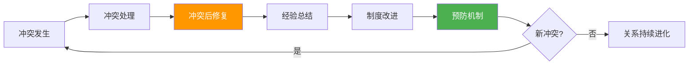

## 五、冲突后修复

冲突的解决并不意味着关系的修复。就像骨折复位后需要康复训练，冲突即使在表面上"结束"了，双方之间残留的负面情绪、信任裂痕和防御心态仍会持续影响后续互动。许多关系的真正破裂不是发生在冲突本身，而是发生在冲突后的疏忽——人们以为"事情过去了就好了"，却忽略了关系修复这最关键也最容易被跳过的一步。

本节将从**心理学原理**出发，系统讲解冲突后修复的六大维度：关系修复、自我修复、经验总结、制度改进、长期维护和修复失败后的前行，并提供可直接使用的工具和模板。

### 5.1 为什么冲突后修复如此重要

#### 5.1.1 冲突的"余震"效应

心理学研究表明，冲突结束后，负面情绪并不会随着冲突停止而立即消失。大脑的杏仁核在冲突期间被高度激活，产生的应激反应（皮质醇和肾上腺素水平升高）需要数小时甚至数天才能恢复到基线水平。这意味着：

- **情绪余震**：冲突结束后，当事人仍可能在数小时内反复回放冲突场景，持续产生愤怒、委屈、焦虑等负面情绪。这种"心理反刍"（rumination）会在无意识中反复激活杏仁核，形成恶性循环
- **认知窄化**：在应激状态下，大脑前额叶皮层（负责理性判断）的活动被抑制，而杏仁核主导的"战或逃"反应占据上风。这导致大脑倾向于做出"非黑即白"的判断，对冲突的解读容易趋于极端化——"他从来都不尊重我""这件事永远也解决不了"
- **行为惯性**：冲突中的防御性行为模式（回避、攻击、讨好）会短暂延续到冲突后，形成"冲突余波"——冷战、摔门、讽刺性沉默，这些行为会进一步恶化关系

如果不主动进行修复，这些"余震"会逐渐固化为持久的负面认知——"这个人不可信"、"跟他共事就是会出问题"——从而变成自我实现的预言。

#### 5.1.2 信任账户理论

约翰·戈特曼（John Gottman）在长达40年的亲密关系研究中提出了"情感银行账户"（Emotional Bank Account）的比喻。每一次正面互动（尊重、倾听、支持、回应对方的"情感投标"）是向账户"存款"，每一次负面互动（批评、蔑视、防御、冷暴力）是"取款"。冲突的本质是一次大额取款。

关键数据：戈特曼的研究发现，稳定健康的关系中，正面互动与负面互动的比例至少为 **5:1**（即"魔法比例"）。一次激烈冲突可能需要 5-10 次正面互动才能修复到冲突前的账户水平。如果冲突后完全不做修复性存款，账户将持续亏损，最终导致关系"破产"。

值得注意的是，存款和取款并非对称运作。心理学中的**"负面偏差"（negativity bias）**研究表明，人类大脑对负面信息的敏感度是正面信息的3-5倍。一次伤人的话造成的"取款"，需要多次同等力度的"存款"才能抵消。这也解释了为什么"我夸你十次你记不住，骂你一次你记一辈子"——这不是对方小气，而是大脑的进化机制使然。

#### 5.1.3 依恋理论视角：破裂与修复

英国精神分析学家约翰·鲍尔比（John Bowlby）的依恋理论和唐纳德·温尼科特（Donald Winnicott）的"足够好的母亲"概念，为冲突后修复提供了深刻的理论支撑。

温尼科特提出了一个颠覆性的观点：**完美的关系不是从不发生冲突的关系，而是能够从冲突中修复的关系**。他用"破裂与修复"（rupture and repair）来描述这一过程：

- **破裂（rupture）**：任何导致情感连接中断的事件——误解、忽视、伤害、冲突。在任何真实的关系中，破裂不可避免
- **修复（repair）**：主动重建情感连接的过程——道歉、理解、调整、重新靠近
- **关键发现**：经历过破裂并成功修复的关系，其韧性（resilience）会**超过从未经历过破裂的关系**

这个发现之所以重要，是因为它从根本上改变了我们对冲突的认知：冲突不是关系的"事故"，而是关系成长的"素材"。就像免疫系统需要接触病原体才能变得强大，关系需要经历冲突和修复才能变得坚韧。

| 关系状态 | 特征 | 隐喻 |
|----------|------|------|
| 从未冲突 | 表面和谐，但缺乏真实碰撞，回避敏感话题 | 从未经历过风雨的温室花朵 |
| 冲突后未修复 | 裂痕积累，信任流失，互动充满戒备 | 碎了却没修的花瓶 |
| 冲突后成功修复 | 建立新的理解和规则，关系韧性增强 | 骨折愈合后的骨骼更坚硬 |

#### 5.1.4 关系修复的神经科学基础

神经科学研究发现，真诚的道歉和被原谅的过程会激活大脑的"奖赏回路"（伏隔核和前额叶皮层），释放多巴胺和催产素——前者带来愉悦感，后者促进信任和亲近感。这意味着：

- 道歉不是"认输"，而是一个神经化学层面的修复行动
- 接受原谅能带来真实的心理释放感——功能性磁共振成像（fMRI）研究显示，原谅他人时，与痛苦和愤怒相关的脑区活动显著下降
- 成功修复的关系会获得比冲突前更强的韧性（心理学中的"压力后成长"现象，post-traumatic growth）

此外，**镜像神经元（mirror neuron）**在修复过程中扮演关键角色。当一方真诚表达歉意时，对方大脑中的镜像神经元会被激活，自动"模拟"道歉者的真诚状态，从而降低防御反应。但这个机制有一个前提——道歉必须是真诚的。虚假的道歉不仅无法激活镜像神经元，反而会触发对方的"欺骗探测"机制，导致防御反应增强。

### 5.2 关系修复：从裂痕到重建

关系修复是冲突后最紧迫、最核心的工作。它不是简单地说"对不起"，而是一个有结构、有层次的过程。

#### 5.2.1 道歉的艺术：五要素模型

心理学家阿隆（Aaron Lazare）在《On Apology》一书中系统研究了有效道歉的结构，该书基于对数百个真实道歉案例的分析，提炼出一个真正有效的道歉需要包含的五个核心要素：

| 要素 | 说明 | 有效示例 | 无效示例 |
|------|------|----------|----------|
| **承认错误** | 明确指出自己做了什么错事 | "我在昨天的会议上对你大声吼叫，还用了不当的措辞" | "如果我有什么做得不对的地方" |
| **承担责任** | 不找借口、不转移责任 | "这完全是我的问题，我不该在情绪失控时做决定" | "我也是因为压力太大才那样" |
| **理解影响** | 表达对对方感受的理解 | "我知道这让你在同事面前很难堪，也伤害了你的自尊" | "我知道你可能不太高兴" |
| **表达悔意** | 真诚地表达歉意和遗憾 | "我非常后悔，你值得被尊重，我没有做到" | "好吧，我道歉" |
| **承诺改变** | 说明具体会如何避免再次发生 | "我会在情绪激动时先暂停，用我们约定的'暂停信号'来处理" | "以后不会了"（空洞的承诺） |

**关键原则**：道歉的核心是"以对方的感受为中心"，而不是"为自己的行为找台阶"。"如果你感到受伤，我道歉"不是道歉——它把责任推给了对方的"敏感"。这不是道歉，而是隐含的指责。

**道歉的完整话术框架**：

"[具体行为]是我的错。我这样做导致了[具体影响]。
我感到[真诚的悔意]。以后我会[具体改变措施]。
你愿意接受我的道歉吗？"

示例："在昨天的方案讨论会上，我当着所有人的面说你的想法
'不切实际'，这是我的错。这让你在团队面前很没面子，
也可能让你以后不敢再提出想法。我非常后悔用了这种
攻击性的方式表达不同意见。以后有不同看法时，我会先
私下和你沟通。你愿意接受我的道歉吗？"

#### 5.2.2 道歉的时机选择

道歉并非越快越好。时机选择取决于冲突的性质和双方的情绪状态：

┌─────────────────────────────────────────────────────────────┐
│                    道歉时机决策树                              │
├─────────────────────────────────────────────────────────────┤
│                                                             │
│  冲突刚结束                                                  │
│    ├─ 双方情绪仍然激动？                                      │
│    │    └─ 是 → 先冷静（至少30分钟-24小时）                     │
│    │         再道歉。情绪激动时的道歉容易变成                    │
│    │         "道歉+辩护"的混合体，效果很差                     │
│    │                                                         │
│    ├─ 对方需要独处空间？                                       │
│    │    └─ 是 → 尊重对方空间，简短表示                         │
│    │         "我需要一些时间整理想法，之后想跟你谈谈"            │
│    │         然后在约定时间主动发起对话                         │
│    │                                                         │
│    └─ 情绪已基本平复？                                        │
│         └─ 是 → 尽早道歉。拖延会让对方觉得                     │
│              你"根本不在意"或"没意识到问题"                    │
│                                                             │
│  最佳窗口期：冲突结束后 24-72 小时内                            │
│  超过一周未道歉，修复难度显著增加                               │
└─────────────────────────────────────────────────────────────┘

**道歉时机的额外考量**：

- **环境选择**：选择私密、安静、中立的场所。不要在对方忙碌、疲惫或有第三方在场时道歉。公共场合的道歉可能让对方感到被迫"表演原谅"
- **方式选择**：面对面 > 视频通话 > 电话 > 语音消息 > 文字消息。信息密度越高的渠道，道歉越容易传递诚意。但对方如果需要距离感，文字消息作为"开场白"有时反而是更体贴的选择
- **单次 vs 多次**：如果冲突涉及多个层面（既有人身攻击又有工作失职），可以分多次道歉，每次聚焦一个层面。一次性堆砌太多道歉，对方可能无法消化

#### 5.2.3 对方不接受道歉怎么办

不是所有道歉都会被接受。对方可能需要更多时间，也可能目前还没有准备好原谅。这是正常的人类反应，不意味着你的道歉"失败"了。

**分层应对策略**：

- **尊重对方的节奏**：不施加压力，不说"我都道歉了你还想怎样"。每个人处理伤害的速度不同，这取决于伤害程度、依恋风格和过往经历
- **用行动而非语言弥补**：如果语言不够，用持续的行为改变来证明诚意。行为层面的改变比语言层面的承诺有更强的说服力，因为行为需要付出真实成本
- **保持耐心但设定期限**：可以给对方时间，但不要无限期地处于"待审"状态。建议在2-4周后再次主动沟通："我知道你可能还在消化，我希望我们能找到向前走的方式"
- **区分"不接受"和"不原谅"**：对方可能接受你的诚意但尚未准备好完全原谅，也可能根本不认为你的道歉是真诚的。这两种情况的应对策略不同——前者需要更多时间和行动，后者需要更深入的沟通来理解对方的不信任来源
- **接受最坏结果**：有时对方选择不原谅，这也是他们的权利。尊重这个选择，从中学习，继续前行

#### 5.2.4 接受道歉的智慧

接受道歉同样需要智慧。"没关系"这三个字是最常见的错误回应——关系确实受到了影响，说"没关系"既不真实，也暗示了对方的道歉"不必要"，反而剥夺了对方完成道歉仪式的机会。

**正确的回应结构**：

1. **确认对方的诚意**："谢谢你告诉我这些，我能感受到你是认真的"
2. **表达自己的真实感受**："那件事确实让我很难过，但我理解每个人都会有失控的时候"
3. **明确自己的边界**："我希望以后遇到类似情况，我们可以用...方式来处理"
4. **选择向前看**："我愿意放下这件事，让我们一起向前走"

**接受道歉时的禁忌**：

- 不要趁机翻旧账："你这次道歉了，但上次你也是这样说的"
- 不要居高临下："算了，我大人不记小人过"
- 不要虚假接受："没事没事"（内心其实还在生气）
- 不要附加惩罚性条件："你道歉可以，但你必须当着所有人的面再说一遍"

#### 5.2.5 信任重建的阶梯模型

信任的崩塌是瞬间的，重建却是一个渐进的过程。信任重建可以分为四个阶段：

| 阶段 | 名称 | 核心任务 | 时间跨度 | 关键指标 |
|------|------|----------|----------|----------|
| 第一阶段 | 承认与承诺 | 双方承认冲突造成的伤害，承诺共同努力修复 | 1-3天 | 双方愿意再次坐下来对话 |
| 第二阶段 | 小步验证 | 通过小规模的互动验证对方的诚意和改变 | 1-4周 | 小承诺是否兑现 |
| 第三阶段 | 逐步深化 | 重新增加互动频率和深度，恢复合作 | 1-3个月 | 是否能自然地讨论敏感话题 |
| 第四阶段 | 新常态建立 | 形成比冲突前更健康的互动模式 | 3个月以上 | 是否建立了新的冲突处理机制 |

**每个阶段的具体操作**：

**第一阶段：承认与承诺**（1-3天）

这个阶段的核心是"开口"——打破冲突后的沉默僵局。具体操作：

1. 主动发起对话（不要等对方来找你）
2. 使用五要素道歉模型
3. 共同确认："我们都想修复这段关系"
4. 不急于解决所有问题，只确认"愿意继续沟通"的共识

**第二阶段：小步验证**（1-4周）

这个阶段的核心是"行动验证"——通过小事重建可信度：

1. 每个小承诺都要兑现（说了"明天给你方案"就明天给）
2. 主动做出"超预期"的正面行为（对方没要求的主动帮助）
3. 避免制造新的负面事件（这个时候任何小摩擦都会被放大）
4. 每周简短地回顾一下进展："这一周我觉得我们在改善，你觉得呢？"

**第三阶段：逐步深化**（1-3个月）

这个阶段的核心是"恢复深度"——从表面互动回归到有深度的交流：

1. 重新讨论之前回避的敏感话题
2. 恢复之前的互动习惯（如果冲突前每周一起吃饭，恢复这个习惯）
3. 在小摩擦中验证新的冲突处理方式是否有效
4. 增加自我暴露的深度（分享脆弱的感受，而不仅仅是事务性交流）

**第四阶段：新常态建立**（3个月以上）

这个阶段的核心是"制度化"——把修复过程中学到的经验固化为关系的新规则：

1. 共同回顾冲突的完整历程，提炼教训
2. 建立正式的"关系契约"（参见5.5.2节）
3. 评估关系是否比冲突前更健康
4. 将成功的修复经验应用到其他关系中

### 5.3 自我修复：处理内疚、羞耻与自我批评

冲突后修复有一个经常被忽略的维度——对自我的修复。当你在冲突中犯了错，随之而来的内疚和羞耻感可能比对方的愤怒更难处理。许多人在冲突后的数周甚至数月中，都在内心反复咀嚼自己的过错，陷入自我惩罚的循环。

#### 5.3.1 内疚与羞耻的关键区分

心理学家布琳·布朗（Brené Brown）的研究区分了两种看似相近、实则截然不同的情绪体验：

| 维度 | 内疚（Guilt） | 羞耻（Shame） |
|------|--------------|--------------|
| 核心感受 | "我做了一件坏事" | "我是一个坏人" |
| 关注对象 | 具体行为 | 整体自我 |
| 对修复的影响 | 促进修复——因为"我可以改正这个行为" | 阻碍修复——因为"我本身就是问题" |
| 行为倾向 | 道歉、补偿、改变 | 逃避、退缩、自我孤立 |
| 心理健康影响 | 适度内疚是健康的，促进道德行为 | 羞耻与抑郁、焦虑、成瘾高度相关 |

**自我检测**：冲突后问自己——"我是在责怪自己的某个具体行为，还是在否定自己的整体人格？"如果是后者，你需要从羞耻转向内疚——把"我太差了"转化为"我那个行为确实不对，但我可以改变它"。

#### 5.3.2 自我宽恕的四步法

自我宽恕不是"放过自己"，也不是"假装没发生"。它是一个负责任的心理过程，包含四个步骤：

**第一步：全面承认（Own it）**

不逃避、不最小化、不找借口。完整地面对自己做了什么：

我做了什么：在会议上当众批评了同事的方案
具体后果：让他在团队面前丢了面子，可能影响了他的职业信心
我的责任：即使他的方案有问题，我选择了一种伤害性最大的
         表达方式，这是我的选择，不是被逼的

**第二步：理解自己的局限（Understand）**

这一步不是为自己开脱，而是理解行为发生的背景条件。理解不等于免责：

当时发生了什么：连续加班三天，项目压力极大
我的情绪状态：疲惫、焦虑、缺乏耐心
我的认知状态：将同事的方案失误解读为"不够努力"
触发了什么：我的"效率焦虑"按钮被按下

**第三步：做出改变承诺（Commit）**

制定具体的、可执行的改变计划：

短期行动：明天私下找他道歉，使用五要素模型
中期行动：在感到疲惫时使用"暂停信号"，避免在低电量状态下
         做重要沟通
长期行动：参加情绪管理培训，学习在压力下保持尊重的技术

**第四步：释放自我惩罚（Release）**

这一步是自我宽恕中最难的部分。你需要有意识地停止"反刍"——那些凌晨三点突然想起"我怎么能在那种时候说那种话"的时刻。

**反刍中断技术**：

1. **标记**：当反刍出现时，在心里说"我在反刍了"
2. **锚定**：深呼吸3次，将注意力拉回到当下的感官（脚踩在地板上的感觉、周围的声音）
3. **替换**：用一个具体的行动指令替换反刍——"我已经制定了改变计划，现在我能做的是执行它"
4. **限时**：如果确实需要回顾，给自己设定15分钟的"反思时间"，时间到了就停止

#### 5.3.3 何时需要专业支持

以下情况建议寻求心理咨询师的帮助：

- 冲突后超过两周仍然每天被内疚/羞耻感困扰，影响正常工作和生活
- 出现回避行为——因为羞耻而回避所有社交场合
- 开始用不健康的方式应对——酗酒、暴食、失眠
- 内疚/羞耻引发自我伤害的想法
- 发现自己在多段关系中反复犯同样的错误，感到"我就是改不了"

寻求专业帮助不是软弱的表现，而是负责任的自我管理。就像你不会因为骨折去看医生而感到羞耻，心理创伤同样需要专业支持。

### 5.4 修复对话的实操技术

知道"要道歉"和知道"怎么在高压对话中保持清醒"是两回事。修复对话是所有沟通场景中情绪负荷最高的类型之一——你同时在处理自己的内疚、对方的愤怒、关系的脆弱和未来的不确定性。以下是确保修复对话成功的关键技术。

#### 5.4.1 对话前的情绪准备

在发起修复对话之前，做好以下准备：

**身体准备**：
- 确保基本生理需求得到满足（吃好、睡好、不饿不困）
- 如果情绪仍然激动，先做10分钟的有氧运动或深呼吸练习
- 避免在饮酒或服用影响判断力的药物后进行修复对话

**心理准备**：
- 预演最坏情况："如果对方拒绝我的道歉、对我发火、或者翻旧账，我会怎么应对？"
- 设定底线："我承诺倾听对方的不满，但不接受人身攻击"
- 调整期望："这次对话的目标不是立刻和好，而是开启修复过程"

**话术准备**：
- 写下你想表达的核心内容（但不要背稿，有框架即可）
- 准备好开场白和收尾语
- 预想对方可能的反应，并准备对应的回应

#### 5.4.2 对话中的情绪调节

修复对话中最常见的"翻车"模式是：道歉方刚开口道歉 → 对方表达愤怒和不满 → 道歉方感到被攻击，开始自我辩护 → 冲突再次升级。

打断这个循环的关键是**情绪调节能力**——在被对方的愤怒"击中"时，仍能保持倾听和回应的能力。

**核心调节技术：STOP技术**

| 步骤 | 动作 | 内心独白示例 |
|------|------|-------------|
| **S** — Stop（暂停） | 感到被攻击时，不要立即回应 | "等一下，我感到自己被攻击了" |
| **T** — Take a breath（呼吸） | 深呼吸2-3次，降低生理唤醒水平 | "先呼吸，我不需要立刻回应" |
| **O** — Observe（观察） | 观察自己的身体反应和情绪 | "我的肩膀在紧绷，心跳加速，我感到愤怒/委屈" |
| **P** — Proceed（继续） | 选择一个有意识的回应方式 | "他表达愤怒是正常的，我需要先听完" |

**倾听回应的万能框架**：

当对方表达愤怒或不满时，使用"三步回应法"：

1. **反映**："我听到你说的是..."
2. **确认**："你的感受是..."
3. **接纳**："你有权利感到..."

示例：

对方："你当时在会议上那样说，我真的很愤怒！你根本不尊重我！"

回应："我听到你对那次会议上我的做法非常愤怒（反映），
你觉得我没有给你应有的尊重（确认）。
你完全有权利这样感受，如果换作是我，我也会很生气（接纳）。"

**绝对不要在修复对话中说的话**：

- "你也有问题啊"——这不是复盘，是反击
- "你总是这样过度反应"——贴标签会立即激化冲突
- "我只是开玩笑的"——否定对方感受等于否定道歉的诚意
- "那件事已经过去了"——你无权替对方决定什么时候"过去"
- "你记错了"——争论事实细节会偏离修复的本质

#### 5.4.3 修复对话的完整流程

一个结构化的修复对话分为五个阶段，通常需要30-90分钟：

┌─────────────────────────────────────────────────────────┐
│                 修复对话完整流程                           │
├─────────────────────────────────────────────────────────┤
│                                                         │
│  阶段一：开场（2-3分钟）                                  │
│  "谢谢你愿意和我谈这件事。我一直在反思，想和你分享。"       │
│                                                         │
│  阶段二：道歉（5-10分钟）                                 │
│  使用五要素模型，完整表达                                 │
│                                                         │
│  阶段三：倾听（15-30分钟）                                │
│  邀请对方分享感受，全程只听不辩                            │
│  "我想听听你那边的感受，你愿意告诉我吗？"                  │
│                                                         │
│  阶段四：对话（10-20分钟）                                │
│  双方讨论"下次怎么办"，达成具体协议                        │
│                                                         │
│  阶段五：收尾（2-5分钟）                                  │
│  总结共识，表达向前看的意愿                                │
│  "谢谢你今天的坦诚。我感觉我们比之前更理解彼此了。"        │
│                                                         │
└─────────────────────────────────────────────────────────┘

### 5.5 经验总结：把冲突变成学习素材

每次冲突都是一面镜子，照见了我们沟通模式中的盲区、制度中的漏洞和关系中的未愈合创伤。系统化的复盘能让每一次冲突都变成下一次冲突预防的教材。

#### 5.5.1 个人反思：三层自问法

个人反思不应停留在"下次注意"的表面层面，而应逐层深入：

**表层——发生了什么**（事实层面）：
- 冲突的导火索是什么？表面原因和深层原因分别是什么？
- 我在冲突中的具体行为是什么？说了什么话？用了什么语气？
- 对方的反应是什么？我如何解读对方的行为？

**中层——我怎么了**（模式层面）：
- 触发我情绪反应的"按钮"是什么？（被忽视？被质疑？被控制？被抛弃？）
- 我的冲突处理风格是什么？（竞争、回避、妥协、迁就、合作——参见Thomas-Kilmann模型）
- 我的认知偏差是什么？（是否"读心术"了对方的意图？是否"灾难化"了后果？是否"应该思维"了对方的行为？）
- 我在冲突中的真实需求是什么？我表达出来了吗？

**深层——我需要什么**（成长层面）：
- 这个冲突反映了我什么样的核心信念或恐惧？（例如："我不值得被认真对待"→被忽视触发愤怒）
- 我在关系中的安全感来自什么？这个安全感足够稳固吗？
- 我需要培养什么样的新技能来更好地处理类似情况？

#### 5.5.2 冲突复盘的"时间线"工具

这是一个具体的复盘操作方法——在冲突结束后24-48小时内，按时间线还原冲突全貌：

```markdown
## 冲突复盘时间线模板

### 基本信息
- 日期/时间：
- 对方是谁：
- 冲突类型：□ 任务冲突  □ 关系冲突  □ 流程冲突  □ 价值冲突

### 时间线还原
| 时间节点 | 事件 | 我的反应 | 对方的反应 | 情绪强度(1-10) |
|----------|------|----------|------------|----------------|
| 起因 | | | | |
| 升级点1 | | | | |
| 升级点2 | | | | |
| 高峰 | | | | |
| 转折/结束 | | | | |

### 关键转折点分析
- 哪个环节如果处理不同，结果会完全改变？
- 我有什么机会"降温"但错过了？
- 对方有没有发出过和解信号但我没有接收到？

### 认知偏差检查
- [ ] 我是否假设了对方的恶意？（读心术偏差）
- [ ] 我是否把单一事件上升到人格评判？（以偏概全）
- [ ] 我是否只关注了支持我立场的证据？（确认偏差）
- [ ] 我是否夸大了后果的严重性？（灾难化思维）
- [ ] 我是否用"总是""从来""每次"这样的全称词？（过度概括）

### 学到了什么
1. 关于我自己：
2. 关于对方：
3. 关于我们的关系：
4. 关于类似冲突的预防：

### 下一步行动
- 我需要向谁道歉/沟通：
- 我需要调整什么行为：
- 我需要建立/修改什么规则：
```

#### 5.5.3 共同复盘：双视角对焦

共同复盘比个人反思更有价值，因为它能让双方对同一事件的不同解读浮出水面。但共同复盘也有更高的操作难度——它需要双方都具备足够的安全感和诚意。

**共同复盘的黄金法则**：

1. **选择合适的时机**：冲突平息后2-7天，双方情绪都已恢复平静
2. **用"学习"而非"追责"的框架**：开场白用"我想从这次经历中学到东西，你愿意一起聊聊吗？"而非"我们需要谈谈上次的事"
3. **各述视角，不打断**：每人有5-10分钟完整表达自己的视角，另一方只倾听，不反驳
4. **寻找交集**：双方对哪些事实有共识？对哪些感受能共情？
5. **聚焦未来**：讨论"下一次遇到类似情况，我们怎么处理会更好"，而不是纠缠"上次到底是谁的错"

**共同复盘话术示例**：

发起者："前几天的事，我一直在想。我理解的角度可能不全面，
        很想听听你的感受。你方便的时候我们可以聊聊吗？"

表达视角："从我的角度看，当时我感到...，因为我觉得...，
         我需要的是...，但我用了错误的方式表达。"

倾听回应："我听到了。你当时感到...，你的需要是...。
         谢谢你告诉我这些，我现在理解了。"

聚焦未来："下次遇到这种情况，我们可以试试...，
         你觉得呢？"

**共同复盘的常见障碍及应对**：

| 障碍 | 表现 | 应对策略 |
|------|------|----------|
| 一方拒绝参与 | "有什么好谈的" | 不强迫，给时间。可以说"我尊重你现在不想谈，但这件事对我很重要。你准备好了随时告诉我" |
| 翻旧账 | "你这次又...上次也是..." | 温和地拉回来："我们聚焦在这次的事情上好吗？上次的事我们可以另找时间谈" |
| 谁对谁错的争论 | "明明是你的问题" | 换框架："这次讨论不是为了定谁对谁错，而是为了以后我们配合更好" |
| 情绪再次激动 | 感到被攻击、愤怒上升 | 使用暂停信号："我们都有点激动了，先休息10分钟再继续？" |

### 5.6 制度改进：从个体到系统的升级

许多冲突的根本原因不在个人，而在系统——含糊的职责边界、缺失的沟通渠道、不合理的资源分配。如果只修复关系而不改进制度，类似冲突一定会再次发生。

#### 5.6.1 冲突根因分析的"五层模型"

            表面层 ─── "张三和李四吵起来了"
              ↓
            事件层 ─── "因为项目延期互相指责"
              ↓
            流程层 ─── "项目进度没有定期同步机制"
              ↓
            制度层 ─── "职责边界模糊，两个团队共享资源但没有协调流程"
              ↓
            文化层 ─── "组织文化中'各扫门前雪'的风气导致协作困难"

冲突后修复应该至少触及到**流程层**和**制度层**。如果每次冲突复盘只停留在"张三以后少说两句"的层面，那就是在用个人修养掩盖系统缺陷。

**追问"为什么"的方法**（类似丰田的"五个为什么"）：

为什么张三和李四吵起来了？
  → 因为项目延期了，互相推卸责任
为什么项目延期了？
  → 因为两个团队的任务有依赖关系，但没有人协调进度
为什么没有人协调进度？
  → 因为职责定义里没有明确谁负责跨团队协调
为什么职责定义不明确？
  → 因为这是新成立的跨团队项目，沿用了各自团队的职责定义
为什么没有针对新项目更新职责定义？
  → 因为没有"新项目启动时更新职责"的制度流程

根因：缺少新项目启动的制度化流程（制度层）

#### 5.6.2 制度改进的检查清单

基于冲突暴露的问题，逐一审查以下领域：

**沟通机制**：
- [ ] 关键信息是否有定期同步渠道？（站会、周报、进度看板）
- [ ] 重大决策是否经过了充分的信息共享？
- [ ] 是否有非正式的"预警"机制能在冲突萌芽阶段发现信号？
- [ ] 跨部门/跨团队的沟通是否有明确的对接人和流程？

**职责与权限**：
- [ ] 每个人/团队的职责边界是否清晰？
- [ ] 交叉职责区域是否有明确的协调机制？
- [ ] 决策权限是否合理分配？是否存在"有责无权"或"越权决策"？

**资源分配**：
- [ ] 资源分配是否有透明的标准和流程？
- [ ] 资源不足时的优先级排序规则是否明确？
- [ ] 是否有定期的资源使用评估和调整机制？

**反馈渠道**：
- [ ] 员工/成员是否有安全、匿名的反馈渠道？
- [ ] 反馈是否有明确的处理流程和时限？
- [ ] 反馈的结果是否有闭环（告知处理结果）？

**培训与支持**：
- [ ] 相关人员是否具备基本的沟通和冲突管理能力？
- [ ] 是否有冲突调解的内部资源（HR、调解员、EAP）？
- [ ] 新成员是否有冲突处理的基本培训？

#### 5.6.3 制度改进的实施原则

- **小步快跑**：不要试图一次性重建整个系统，每次针对冲突暴露的最突出问题改进一两个流程
- **双向参与**：让冲突双方都参与制度改进的讨论，这既是修复关系的机会，也能确保制度的可执行性
- **试行与反馈**：新制度先试行一个月，收集反馈后再正式实施
- **文档化**：所有制度改进都要形成书面文件，避免"口头约定"随着时间淡化

### 5.7 长期关系维护：从修复到进化

冲突后的修复不应只是"恢复原状"，而应追求"升级进化"——让关系在经历冲突后变得比之前更健康、更有韧性。

#### 5.7.1 正面互动的有意识增加

戈特曼的 5:1 比例不是自然发生的，尤其在冲突后的恢复期，需要有意识地"存款"。

**低成本高回报的正面互动清单**：

| 互动类型 | 具体行为 | 适用场景 |
|----------|----------|----------|
| 关注与认可 | 记住对方提到的小事，下次主动询问进展 | 日常 |
| 真诚赞美 | 具体、及时地表达对对方贡献的感谢 | 工作/生活 |
| 共同活动 | 一起吃饭、运动、完成一个任务 | 恢复期 |
| 主动帮助 | 在对方未开口前发现需求并提供支持 | 日常 |
| 情感回应 | 对方分享好消息时积极回应（不是敷衍） | 日常 |
| 身体语言 | 微笑、点头、保持开放的姿态 | 每次互动 |

**回应对方"情感投标"的重要性**：

戈特曼研究中的一个重要发现是"情感投标"（bid for connection）——对方发出的寻求关注、回应或连接的小信号。比如：

- 对方说"你看窗外那朵云好漂亮"——这不是在说云，而是在发出一个连接信号
- 对方在工作中取得小成就时主动跟你分享——这是在寻求认可
- 对方在疲惫时靠在你身边——这是在寻求安慰

研究表明，关系中对情感投标的**回应率**比任何其他指标都能更准确地预测关系的长期健康度。幸福伴侣的回应率在86%以上，最终分手的伴侣回应率仅33%。

#### 5.7.2 建立冲突"免疫机制"

经历过一次冲突后，双方可以共同建立一套"免疫机制"——预防和处理未来冲突的规则和工具：

**关系契约模板**（双方共同商定）：

```markdown
## 我们的冲突处理约定

### 预防机制
- 每周/月安排一次"关系检查"时间，坦诚讨论近期感受
- 任何不满在24小时内提出，不积累
- 使用"我感到...因为...我需要..."的表达框架

### 暂停机制
- 当任何一方说出"暂停"（或约定的手势），双方立即停止讨论
- 暂停期间至少冷静30分钟，但不超过24小时
- 暂停期间不做重要决定、不发情绪化消息

### 修复机制
- 冲突后48小时内进行至少一次沟通
- 道歉时使用五要素模型
- 接受道歉时明确边界

### 升级机制
- 如果双方无法自行解决，引入中立第三方
- 第三方可以是：[具体人选或渠道]
```

#### 5.7.3 "关系健康度"定期检查

每隔一段时间（建议每季度一次），用以下维度评估关系的健康状态：

| 维度 | 健康信号 | 警告信号 | 评估(1-5) |
|------|----------|----------|-----------|
| 信任 | 能够坦诚分享想法和感受 | 隐瞒信息、回避敏感话题 | |
| 尊重 | 意见不同也能互相尊重 | 贬低、嘲讽、人身攻击 | |
| 沟通 | 问题能及时沟通解决 | 积压不满、冷暴力 | |
| 支持 | 遇到困难时会互相帮助 | 各自为政、落井下石 | |
| 成长 | 关系让双方都在进步 | 关系成为负担或束缚 | |
| 乐趣 | 相处中有快乐和轻松感 | 相处主要是义务和压力 | |

**评分标准**：
- 20-30分：关系健康，继续保持
- 12-19分：关系需要关注，建议安排一次深度对话
- 6-11分：关系存在较大问题，建议寻求专业帮助

### 5.8 特殊场景下的修复策略

不同类型的冲突关系，修复策略需要因地制宜。

#### 5.8.1 职场关系修复

职场关系修复的特殊性在于：双方通常需要继续合作，而且往往有第三方（同事、上级）在观察。

| 修复步骤 | 具体操作 | 注意事项 |
|----------|----------|----------|
| 私下先行 | 先一对一沟通，不要在公开场合道歉或讨论 | 避免让对方觉得你在"表演"给他人看 |
| 专业框架 | 用"我们的共同目标"作为修复对话的框架 | 不要把职场冲突私人化 |
| 行动优先 | 在后续工作中展示改变（如主动配合、及时沟通） | 比口头承诺更有说服力 |
| 适度公开 | 在团队中适当展示双方的合作状态 | 不需要刻意，自然即可 |

**职场修复的特殊注意事项**：

- **HR的角色**：如果冲突涉及正式投诉或人事记录，需要在HR知情的前提下进行修复。私下和解不等于"事情翻篇"——该走的流程还是要走
- **权力差的考量**：如果是下属向上级道歉，注意不要过度卑微；如果是上级向下级道歉，注意不要用"对不起，但..."的句式附带批评
- **邮件确认**：重要共识建议用邮件确认，既留下记录，也避免"当时说好了你又反悔"的二次冲突

#### 5.8.2 家庭关系修复

家庭关系修复的特殊性在于：情感浓度高、历史包袱重、没有"退出选项"。

- **承认历史**：家庭冲突往往不是单一事件，而是长期模式的爆发。修复时需要触及模式层面，而非只处理这一次事件
- **边界与亲密并重**：修复不是回到"什么都好"的假和谐，而是在承认差异的基础上建立新的相处规则
- **代际影响**：如果涉及长辈，需要考虑文化背景和代际差异。在尊重长辈的同时，也要清晰表达自己的边界
- **不追求"完美和解"**：家庭关系中的某些分歧可能永远无法完全解决（价值观差异、生活方式选择）。修复的目标是"在分歧中保持连接"，而不是"消除分歧"

#### 5.8.3 亲密关系修复

亲密关系中的冲突修复难度最高，因为亲密关系中的冲突往往触及最深层的安全感和依恋模式。

- **安全基地重建**：先恢复"在一起是安全的"这个基本信念，再处理具体问题。依恋理论中的"安全基地"（secure base）是亲密关系的核心——只有当双方都感到"这段关系是安全的"，才有可能处理具体问题
- **脆弱性展示**：在亲密关系中，表达"我受伤了"比说"你错了"更能促进修复。脆弱性（vulnerability）不是软弱，而是信任的最高表达
- **身体接触**：适当的身体接触（握手、拥抱）能显著促进催产素的释放，帮助重建情感连接——但前提是双方都感到舒适。研究表明，20秒以上的拥抱能显著降低皮质醇水平
- **专业支持**：如果同一类冲突反复出现（超过3次），强烈建议寻求伴侣治疗师的专业帮助。这不是"关系有病"的标志，而是"我们愿意为关系投资"的态度

#### 5.8.4 修复中的权力不对等

当冲突双方存在明显的权力不对等时（上下级、亲子、师生），修复策略需要特别调整：

**上级对下级的修复**：
- 不要期待下属主动修复——权力下位者天然承担更大的社交风险
- 你的道歉示范了"权力不等于免错"，这对团队文化有深远影响
- 道歉后观察下属的行为变化——如果变得更沉默或更讨好，说明信任修复还不够

**下级对上级的修复**：
- 承认自己的错误，但不需要过度自贬
- 用"专业框架"包装——"我想确保我们的合作效率不受影响"
- 可以选择书面方式（邮件），降低面对面的压力

**父母对子女的修复**：
- 父母向孩子道歉，是孩子学到"犯错后如何负责任"的最佳教材
- 用孩子能理解的语言，不要用成人世界的复杂措辞
- 修复后要有明确的行为改变——孩子对"又来了"的敏感度远超成人

### 5.9 数字时代的冲突修复

在越来越多的沟通发生在文字消息、邮件和社交媒体上的今天，数字环境中的冲突修复有其独特的挑战和策略。

#### 5.9.1 文字沟通中修复的特殊挑战

文字消息丢失了约93%的非语言信息（语调、表情、肢体语言），这使得冲突修复变得更加困难：

- **误解率更高**：同一句话在不同情绪状态下会有完全不同的解读
- **即时性陷阱**：人在愤怒时发消息的速度远快于思考的速度，"已读不回"本身也会成为新的冲突
- **永久记录**：文字消息会被截图、保存、反复翻看，不像口头对话可以"随风而逝"

#### 5.9.2 数字修复的操作策略

**何时切换沟通渠道**：

如果冲突发生在文字聊天中（微信、短信、Slack等），修复对话**应该切换到更高带宽的渠道**：

文字冲突 → 修复策略的渠道升级路径：

第一步：暂停文字争论
"我感觉我们在文字上越说越误会，我们能打个电话/视频
 或者当面聊吗？"

第二步：用高带宽渠道进行修复对话
（电话/视频/当面——选择双方都方便的方式）

第三步：文字确认共识
修复对话后，用文字消息简短总结达成的共识
"刚才我们聊的，我总结一下：[共识内容]。
 谢谢你今天的坦诚 🙏"

**文字道歉的注意事项**：

- 不要发长篇大论的道歉消息——对方可能读不完或感到压力
- 分段发送，给对方回应的空间
- 不要期待即时回复——给对方消化时间
- 避免在深夜发送——容易被解读为冲动而非真诚

#### 5.9.3 社交媒体冲突的修复

如果冲突发生在公开的社交媒体上（评论区争论、朋友圈讽刺等），修复的核心原则是：**私了优于公了**。

1. **停止公开互动**：不要再在评论区继续争论
2. **转为私聊**：通过私信发起修复对话
3. **公开收尾**（如需要）：如果冲突已经造成公开影响，可以在原帖子下简短表态"我已私下和[对方]沟通，这是我们的误解，已解决了"
4. **删除或编辑**（双方同意后）：删除引发冲突的内容，但要在对方同意后进行，否则可能被视为"销毁证据"

### 5.10 修复失败后怎么办：哀伤、接受与前行

不是所有的关系都能被修复。有些冲突的伤害太深，有些关系的基础太薄弱，有些对方已经选择离开。当修复失败时，你需要的不是更多的修复技巧，而是哀伤、接受和继续前行的能力。

#### 5.10.1 判断修复是否已不可能

以下信号表明修复可能已经到了终点：

- 对方明确表示不愿再继续沟通
- 你已经真诚道歉并持续行动了3个月以上，但对方没有任何回应
- 修复过程中，同样的伤害反复发生（超过3次），双方都无法改变
- 你发现自己在修复过程中失去了自我尊重——不断地卑微、讨好、放弃边界

#### 5.10.2 关系哀伤的五个阶段

心理学家伊丽莎白·库伯勒-罗斯（Elisabeth Kübler-Ross）提出的"哀伤五阶段"模型同样适用于关系的失去：

| 阶段 | 情绪体验 | 常见表现 | 你能做的 |
|------|----------|----------|----------|
| 否认 | "不可能真的结束了" | 持续尝试修复，忽略对方的拒绝信号 | 允许自己有一段时间的否认，但设一个"检查点" |
| 愤怒 | "他凭什么不原谅我"/"我凭什么要原谅他" | 怨恨、想报复、反复回忆冲突场景 | 用日记或与信任的朋友倾诉来释放愤怒 |
| 讨价还价 | "如果我再试一次呢？如果我做更多呢？" | 不断修改修复方案，寻求新的切入点 | 认清"更多的努力不等于更好的结果" |
| 抑郁 | "这段关系真的结束了" | 悲伤、退缩、失去动力 | 允许自己悲伤，保持基本的日常规律 |
| 接受 | "事情就是这样了" | 平静地面对现实，开始将精力投入其他方面 | 从中提取教训，为未来的关系做准备 |

**重要提醒**：这五个阶段不是线性的，你可能会在不同阶段之间反复跳转。这是正常的，不意味着你"退步"了。

#### 5.10.3 从失败的修复中提取价值

即使修复失败了，这次经历也不是毫无价值的：

1. **关于自己的洞察**：你学到了什么关于自己的触发点、需求和底线？
2. **技能的积累**：你在修复过程中练习了道歉、倾听、情绪调节——这些技能会用在你未来的所有关系中
3. **边界的确立**：你更清楚了自己在关系中能接受什么、不能接受什么
4. **共情的深化**：经历过痛苦的修复失败，你会更理解他人的类似处境

#### 5.10.4 何时该放手

**放手不是认输，而是一种智慧。** 以下情况，放手可能是最健康的选择：

- 修复努力已经持续数月，但对方始终拒绝任何形式的沟通
- 为了维持这段关系，你已经放弃了自己的核心价值和边界
- 关系中存在反复的模式性伤害（如反复的情感操控、反复的背叛），且对方没有改变的意愿
- 这段关系对你的心理健康造成了持续的负面影响
- 你发现自己在关系中变成了一个不喜欢的自己

放手时可以对自己说的：

"我尽力了。我为自己的过错真诚道歉，也付出了改变的行动。
但关系是双向的，我无法独自修复它。我选择放下这段关系，
不是因为它不重要，而是因为继续执着已经无法带来好的结果。
我从中学习到的东西，会帮助我在未来的关系中做得更好。"

### 5.11 端到端案例：一次完整冲突修复的全过程

为了让你对冲突后修复有一个全景式的理解，以下是一个完整的案例，展示从冲突发生到关系重建的全过程。

#### 背景

李明和王芳是同一产品团队的同事，负责同一个项目的不同模块。两人合作了一年多，关系一直不错。

#### 冲突发生

在一次周会上，王芳在汇报进度时指出李明负责的API接口文档缺失，导致她的前端模块联调受阻。李明当天刚被领导批评了另一个项目的进度，情绪很差，当场回怼："你自己的模块设计变了多少次了？先把你的事管好再说别人。"整个会议室陷入尴尬沉默。

#### 冲突后的48小时

**李明的状态**（犯错方）：
- 会议结束后立即感到后悔，但不知道该怎么开口
- 内心反刍："我怎么能当着所有人的面那样说她？"
- 陷入羞耻感："我就是个情绪管理失败的人"
- 24小时后决定行动，而不是继续自责

**王芳的状态**（受伤方）：
- 感到愤怒和委屈——她的反馈是正当的工作关切，却被人身攻击
- 感到羞耻——在同事面前被怼，面子受损
- 开始回避与李明的所有非必要接触
- 48小时后，愤怒开始转化为失望

#### 修复过程

**第1天：李明私下找到王芳**

李明："王芳，今天的事我想跟你说一下。方便吗？"

王芳（冷淡）："你说。"

李明（使用五要素模型）：
"今天在会上，我说了你'设计变了很多次'还说
'先管好自己的事'（承认错误），那完全是我的问题，
我不该把工作反馈当作人身攻击来回应（承担责任）。
我知道这让你在大家面前很尴尬，你提的问题本来
也是合理的工作关切，却被我攻击了（理解影响）。
我非常后悔，你一直以来的认真和专业是团队的
宝贵资产，我不该这样对待（表达改变）。
以后我会在情绪不好的时候先跟大家说一声，
不在那种状态下做重要沟通（承诺改变）。"

王芳（沉默了一会儿）："……我需要一些时间。"
李明："好的，你准备好了随时告诉我。"

**第3天：王芳主动找到李明**

王芳："我想了一下。你说的那些话确实让我很难过。
      我提API文档的问题，是因为它真的在影响联调进度。"

李明："我理解。你说的是对的，那确实是我的疏忽。
      文档的事我这两天已经补齐了。"

王芳："谢谢你告诉我这些。我愿意放下这件事。
      不过以后如果你觉得我的反馈方式有问题，
      可以私下跟我说，不要在会上那样。"

李明："完全没问题。以后有不同看法，我们私下先沟通。"

**第2周：共同复盘**

两人约了午餐，回顾这次冲突：

- 共识1：李明当时正在压力高峰，将王芳的工作反馈误读为"对我的否定"
- 共识2：王芳在公开场合指出问题的方式可以更温和（"我能私下跟你讨论一个接口问题吗？"）
- 共识3：建立了新的规则——模块间的问题优先私下沟通，解决不了再在会上讨论

**第1个月：行为验证**

- 李明补齐了所有API文档，并在每次接口变更时主动通知王芳
- 王芳遇到问题时先通过微信私聊李明，确认后再决定是否在会上提
- 两人在一次联调中出现了新的小分歧，但这次用新的方式在私下10分钟内解决了

**第3个月：关系升级**

两人的合作关系恢复到冲突前的水平，甚至更好——因为他们建立了一套更成熟的沟通机制。在一次团队复盘中，他们分享了这次冲突的教训，带动了整个团队建立了"问题私下先行"的沟通规范。

#### 案例分析

| 维度 | 这次做得好的 | 可以更好的 |
|------|------------|-----------|
| 道歉时机 | 24小时内，不过早也不拖延 | 可以 |
| 道歉质量 | 五要素完整 | 可以 |
| 受伤方回应 | 给了空间，没有强求即时原谅 | 可以 |
| 制度改进 | 建立了"私下先行"规则 | 可以更正式地文档化 |
| 关系进化 | 从个人修复扩展到团队规范 | 可以 |

### 5.12 常见误区与纠正

#### 误区一："时间会治愈一切"

**错误本质**：被动等待，不做任何主动修复。

**为什么不靠谱**：时间只是让情绪强度下降，但不会消除负面认知的积累。心理学中的"峰终定律"（Peak-End Rule）表明，人对一段经历的记忆主要取决于高峰时刻和结束时刻。如果冲突以冷处理收场，它会成为关系记忆中刺眼的"峰值"，每次未来互动都会被这个记忆所染色。

**纠正方法**：冲突后48小时内至少做一次修复性沟通。即使只是一句"前几天的事我想了一下，我有些地方做得不对"，也好过沉默。

#### 误区二："道歉就完了"

**错误本质**：把道歉当作修复的全部，忽略了后续的行为改变。

**为什么不靠谱**：道歉如果没有行为改变的支撑，会迅速贬值。第三次为同一件事道歉时，道歉不仅不能修复信任，反而会加速信任的流失——"你每次都道歉，但从不改变"。道歉是"承诺"，行为改变是"兑现"——只有承诺没有兑现，就是透支信用。

**纠正方法**：道歉后制定具体的改变计划，并设置检查点。"我承诺改变"之后跟上"具体怎么改、什么时候检视"。

#### 误区三："既然和好了就不要再提"

**错误本质**：把"不提旧账"等同于"不从过去学习"。

**为什么不靠谱**：完全回避冲突经历意味着放弃了宝贵的学习机会。关键区别在于"用冲突作为武器攻击对方"和"用冲突作为案例学习成长"——前者有害，后者有益。

**纠正方法**：在合适的时机（非冲突状态下），用建设性的方式回顾："上次那件事之后，我们做的那个改变有效吗？"

#### 误区四："都是对方的错，我来接受道歉太亏了"

**错误本质**：把冲突修复看成零和博弈。

**为什么不靠谱**：几乎不存在"一方100%正确、另一方100%错误"的冲突。即使你只承担10%的责任，主动承担这部分责任不仅不"亏"，反而展示了成熟和诚意，往往能带动对方也反思自己那90%。而且，"我没错"的坚持往往源于确认偏差——你只看到了支持自己立场的证据。

**纠正方法**：问自己"在这次冲突中，我的哪部分行为是可以改进的？"——专注于自己能控制的部分。

#### 误区五："修复关系就是回到过去"

**错误本质**：期望关系完全恢复到冲突前的状态。

**为什么不靠谱**：经历过冲突的关系不可能"回到原点"——就像碎过的花瓶即使粘好，裂痕依然存在。健康的修复不是抹去痕迹，而是在裂痕的基础上建立新的、更强的结构。执着于"回到过去"会让你忽略"走向更好"的机会。

**纠正方法**：接受关系已经改变的事实，把目标设定为"建立比冲突前更健康的互动模式"，而不是"恢复到冲突前"。

#### 误区六："我已经道歉了，对方必须原谅我"

**错误本质**：把道歉当作交易——"我给了你道歉，你还我原谅"。

**为什么不靠谱**：原谅是对方的自主选择，不是你道歉的"对价"。每个人处理伤害的时间和方式不同，强迫原谅只会造成二次伤害。更重要的是，当你说"我都道歉了你还想怎样"时，你的道歉就已经从"真诚的修复"变成了"施压的筹码"。

**纠正方法**：道歉是你的责任，原谅是对方的权利。你只能控制自己的行为，不能控制对方的回应。把注意力放在"持续用行动证明改变"上，而不是"对方什么时候原谅我"上。

### 5.13 进阶：从修复到预防的闭环

冲突后修复的最高境界不是"修得更好"，而是"下次不需要修"。将修复经验转化为预防机制，才是冲突管理的终极目标。



**预防闭环的关键要素**：

1. **早期预警系统**：建立情绪温度计、满意度调查等工具，在冲突萌芽阶段就发现信号
2. **定期关系维护**：不要等到出问题才修复，定期的"关系体检"能防止小不满积累成大冲突
3. **持续学习文化**：将冲突案例作为学习素材（脱敏后），提升整个团队/家庭的冲突管理能力
4. **弹性关系建设**：通过共同经历挑战、庆祝成功、培养共享兴趣等方式，持续增加关系的"缓冲区"

**冲突复盘到预防的转化矩阵**：

| 冲突中暴露的问题 | 对应的预防机制 | 具体操作 |
|-----------------|--------------|----------|
| 情绪激动时说了伤人的话 | 暂停机制 | 约定"暂停词"，双方遵守 |
| 小不满积累成大爆发 | 定期倾诉机制 | 每周一次"心情分享"时间 |
| 误解对方的意图 | 核实机制 | "你的意思是...对吗？"养成习惯 |
| 权责不清导致推诿 | 职责明确化 | 职责矩阵（RACI）定期更新 |
| 缺乏有效的反馈渠道 | 反馈制度化 | 匿名反馈箱 + 月度反馈会 |

### 5.14 本节要点回顾

冲突后修复是冲突管理流程中最容易被跳过、但对关系长远健康影响最大的环节。核心要点如下：

1. **及时行动**：冲突后48小时内启动修复，不让"余震"固化为永久性裂痕
2. **真诚有效**：道歉用五要素模型，避免空洞的"对不起"和隐含推责的"如果"句式
3. **自我修复**：不要忽略对自己的修复——区分内疚与羞耻，学会自我宽恕
4. **技术支撑**：掌握修复对话中的情绪调节技术（STOP技术、三步回应法）
5. **系统思考**：不只修关系，还修制度——用"五层根因模型"找到系统性改进点
6. **长期维护**：用5:1比例有意识增加正面互动，建立关系"免疫机制"
7. **避开误区**：不被动等待、不停留在口头、不追求"回到过去"、不纠结于谁对谁错
8. **持续进化**：将修复经验转化为预防机制，实现"冲突→学习→更强关系"的正循环
9. **接受失败**：当修复无法完成时，允许自己哀伤，从中提取教训，然后继续前行

经历过冲突并成功修复的关系，往往比从未经历过冲突的关系更牢固——因为双方已经证明了"我们能一起穿越风暴"。这种信心比任何表面的和谐都更有价值。

当修复失败时，也请记住——你在这个过程中学到的道歉、倾听、情绪调节和自我反思的能力，会成为你未来所有关系的财富。没有任何一次真诚的修复努力是白费的。
