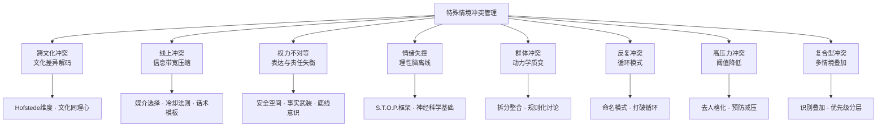
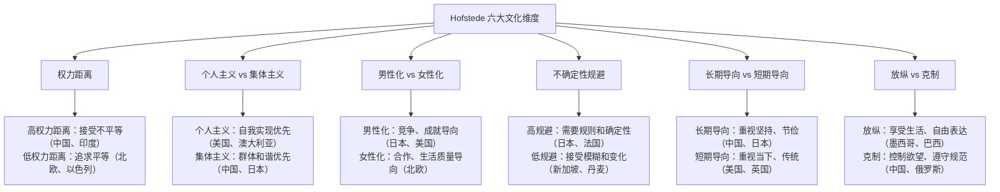
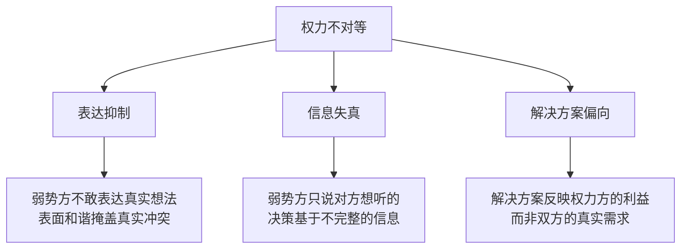
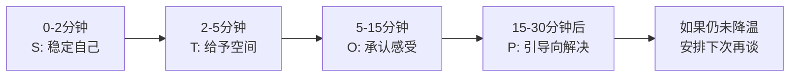
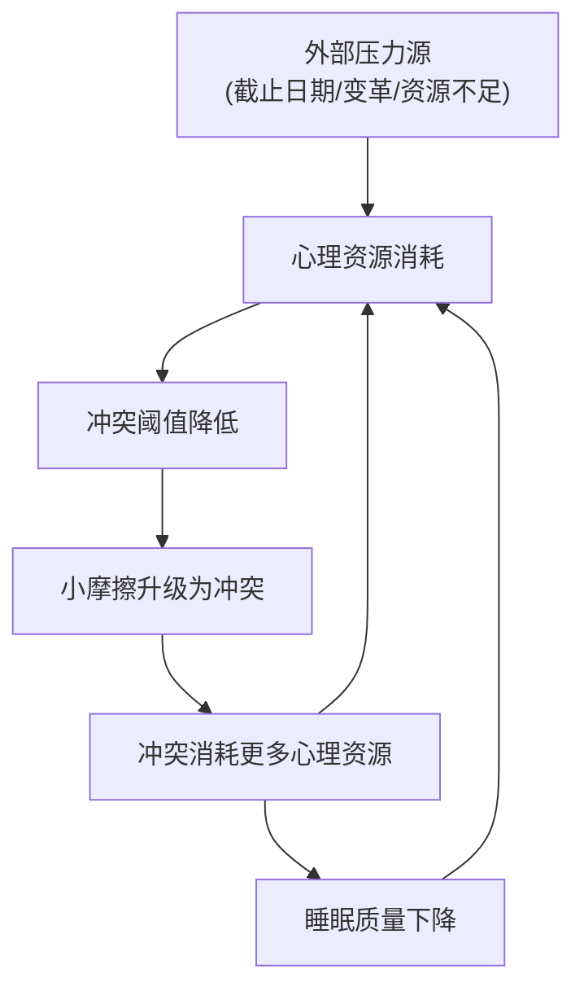

## 六、特殊情境下的冲突管理技巧

前面五节讲解的冲突预防、识别、干预、解决和修复技巧，适用于大多数日常冲突场景。然而，现实中的冲突并不总是发生在条件理想的"标准场景"里——当冲突双方来自不同文化背景、当争论发生在冰冷的文字消息中、当权力天然不对等、当情绪已经彻底失控、当一群人同时卷入争端、当同样的冲突反复上演、当高压环境将所有人推向极限——那些通用技巧需要针对特殊情境进行调整和升级。

本节将系统讲解**八种特殊冲突情境**的管理技巧，帮助你在各种复杂条件下都能有效地处理冲突。

这八种情境并非孤立存在，现实中的冲突往往同时涉及多种情境——比如一个跨文化的远程团队（线上+跨文化）、一个下属向情绪失控的上级表达不满（权力不对等+情绪失控）、一个高压期的跨国项目组（跨文化+高压+群体）。理解每种情境的核心机制，才能在面对复合型冲突时灵活组合策略。

---

### 6.1 跨文化冲突管理

#### 6.1.1 为什么跨文化冲突如此棘手

在全球化背景下，跨文化冲突越来越常见。跨文化冲突之所以比同文化冲突更难处理，根本原因在于**双方使用的"冲突解码器"不同**。

同文化冲突中，即使双方意见对立，至少共享一套默认的行为准则——什么话可以说、什么时候该让步、怎样表达不满是"正常"的。但跨文化冲突中，同一行为在两个文化框架里可能有截然不同的含义：

| 行为 | 文化A的解读 | 文化B的解读 |
|------|------------|------------|
| 直接说"我不同意" | 坦诚、有主见 | 粗鲁、不尊重对方 |
| 沉默不语 | 在认真思考 | 消极抵抗、不配合 |
| 公开表达情绪 | 真诚、有热情 | 不专业、情绪化 |
| 先聊半小时家常 | 浪费时间 | 建立信任的必要过程 |
| 发邮件表达不满 | 留下记录、正式 | 胆小、不敢当面说 |
| 当面激烈争论 | 攻击性强 | 开放讨论、头脑风暴 |
| 立即给出否定答复 | 高效、直接 | 无礼、让人丢面子 |
| 多次确认同一件事 | 不信任、啰嗦 | 负责、确保理解一致 |

这些差异不是个人偏好，而是深植于文化基因中的认知框架。不理解这些框架差异，就会把对方的"文化正常行为"误读为"恶意行为"，冲突因此升级。

**案例：一个真实的跨文化冲突**

一家中美合资企业的项目评审会上，美方工程师直接指出中国团队的方案"有两个严重缺陷需要重做"。中方团队沉默了十几秒后说"我们回去再研究一下"。美方将此理解为"他们接受了我的意见"，中方实际意思是"你在这么多人面前让我们丢脸，我们不可能当众接受"。

结果：中方团队在后续两周内没有主动联系美方，美方认为"他们效率太低"，不断发邮件催促进度，中方感到"被步步紧逼"。一个技术分歧演变为信任危机，项目延期了整整一个月。

根本原因：美方的"直接反馈"文化 vs. 中方的"面子"文化——双方都按照自己的文化规则行事，都没有恶意，但冲突解码器的差异让善意变成了伤害。

#### 6.1.2 Hofstede文化维度理论：理解文化差异的框架

荷兰社会心理学家吉尔特·霍夫斯泰德（Geert Hofstede）通过大规模跨文化研究，提出了六个文化维度，这是理解文化差异最广泛使用的理论框架：

**在冲突管理中，这些维度如何影响行为：**

| 维度 | 对冲突行为的影响 | 管理策略 |
|------|-----------------|---------|
| **高权力距离** | 下属不敢公开反对上级，倾向于间接表达 | 权力方主动征求意见，提供匿名反馈渠道 |
| **集体主义** | 冲突被视为对群体和谐的威胁，倾向于避免公开对抗 | 给对方"留面子"，私下沟通，强调"我们共同的目标" |
| **高不确定性规避** | 对模糊方案感到焦虑，倾向于按规则办事 | 提供明确的流程和书面协议，减少模糊空间 |
| **男性化文化** | 视冲突为"竞争"，倾向于分出胜负 | 将冲突框架化为"共同面对的挑战"而非"双方的较量" |
| **长期导向** | 愿意为长期关系牺牲短期利益 | 强调关系的长期价值，耐心推进解决方案 |
| **高克制** | 压抑情绪表达，冲突表面平静但暗流涌动 | 注意非语言信号，定期"check-in"了解真实状态 |

**Edward T. Hall的高语境与低语境文化理论**补充了Hofstede模型的一个关键维度：

| 特征 | 高语境文化（中国、日本、阿拉伯） | 低语境文化（美国、德国、北欧） |
|------|-------------------------------|-------------------------------|
| 信息传递 | 大量信息在语境、关系、暗示中 | 信息集中在明确的文字和语言中 |
| 拒绝方式 | "这个方案很有意思，我们再研究研究"（=拒绝） | "不，我不同意这个方案" |
| 承诺表达 | "我尽力而为"（=很可能做不到） | "我承诺在周五前完成"（=周五一定完成） |
| 冲突信号 | 关系变冷、减少互动、找借口回避（需要"读空气"） | 直接表达不满、明确提出反对意见 |
| 调解策略 | 找中间人传话、在非正式场合试探、用故事和比喻暗示 | 安排正式会议、明确议题、直接讨论解决方案 |

这意味着：面对高语境文化的人，你需要训练自己"听弦外之音"的能力；面对低语境文化的人，你需要学会"把话说明白"而不觉得失礼。

#### 6.1.3 跨文化冲突管理的实操原则

**原则一：了解对方的文化背景**

不同文化在直接/间接沟通、个人/集体主义、权力距离等方面存在显著差异。这不是说你要成为文化专家，而是说你需要具备基本的"文化意识"——知道差异存在，并愿意在互动中观察和学习。

具体做法：
- **事前研究**：在与不同文化背景的人共事之前，花30分钟了解该文化的基本特征。不需要精通，但要知道大方向。推荐资源：Hofstede Insights网站（hofstede-insights.com）可以查询任意国家的文化维度分数
- **观察学习**：注意对方的行为模式——他们怎样开会、怎样表达反对、怎样拒绝——从中推断文化偏好
- **直接询问**：当你不确定时，温和地提问比猜测更安全，"在你的文化中，人们通常怎样处理这类分歧？"
- **建立文化笔记**：与某个文化背景的人长期共事时，记录你观察到的沟通偏好、禁忌和有效做法，形成一份"个人文化指南"

**原则二：避免文化刻板印象**

文化倾向是概率性的，不代表每个个体都是如此。一个美国人可能非常含蓄，一个日本人可能非常直接。将文化知识作为"假设"而非"结论"——它帮助你提出更好的问题，而不是直接下判断。

检验方法：如果你发现自己在想"所有X国人都..."，那你就滑入了刻板印象。替换为"根据文化背景，X国人**可能**更倾向于..."。

区分三个层次：
- **文化倾向**（Cultural Tendency）：统计意义上的群体特征，如"日本文化倾向于间接沟通"——这是合理的
- **文化刻板印象**（Cultural Stereotype）：将倾向绝对化为每个个体的特征，如"日本人从来不会直接说不"——这是有害的
- **文化偏见**（Cultural Bias）：用刻板印象做出价值判断，如"日本人太不坦率了"——这是歧视性的

**原则三：用好奇心替代评判**

当不理解对方的行为时，带着好奇心去探究背后的文化逻辑，而不是急于评判。"他为什么这样做？"比"他怎么可以这样？"更有建设性。

实用句式：
- "我注意到你刚才...，能帮我理解一下你的考虑吗？"
- "在我们这边，通常的做法是...，你们那边的习惯是怎样的？"
- "我想确保我理解正确，你的意思是...？"
- "我不太确定我们在这个问题上是否用了同样的标准，能帮我了解一下你的标准吗？"

**原则四：寻找共同的人性基础**

尽管文化不同，人类对尊重、公平和归属感的需求是共通的。当文化差异导致冲突升级时，回到最基本的人类需求："我们都希望被尊重""我们都希望项目成功""我们都希望公平对待"。

实操技巧：在跨文化冲突调解中，先花10分钟找到双方的共同目标并明确说出来，再讨论分歧点。这个"共同锚点"能防止讨论滑向"你们文化怎样怎样"的人身攻击。

**原则五：适应沟通方式的差异**

| 差异维度 | 一端 | 另一端 | 调整建议 |
|----------|------|--------|---------|
| 直接程度 | 直接文化（德国、荷兰） | 间接文化（日本、泰国） | 对间接文化者：注意言外之意、给对方台阶下；对直接文化者：直接表达需求，不要绕弯子 |
| 时间观念 | 单线程（一次一件事） | 多线程（同时处理多件事） | 对单线程文化者：提前约定时间、准时、不打断；对多线程文化者：保持灵活、接受临时调整 |
| 决策方式 | 自上而下（领导决定） | 共识驱动（集体讨论） | 对自上而下文化者：找对决策者；对共识文化者：耐心等待集体讨论过程 |
| 冲突态度 | 将冲突视为正常 | 将冲突视为失败 | 对后者：使用"改进""优化"等正面词汇替代"冲突""问题" |
| 关系建立 | 先做事后建立信任 | 先建立信任后做事 | 对后者：投资时间在非正式社交上（吃饭、喝茶），不要急于进入正题 |

**原则六：建立"文化桥梁人"机制**

在长期的跨文化团队中，培养或识别团队中的"文化桥梁人"——那些同时理解两种（或多种）文化、能够在不同文化框架之间翻译的人。他们的价值不仅在于语言翻译，更在于"文化翻译"——解释"他为什么这样说""他真正想表达的是什么"。

#### 6.1.4 跨文化冲突的典型误区

**误区一："文化差异被当作万能借口"**

有些人在跨文化情境中把一切摩擦都归因于"文化差异"，回避真正需要解决的问题。文化差异可以解释行为方式的不同，但不能成为不守承诺、不尊重人或不履行职责的借口。

检验标准：如果一个行为在同一文化内部也会被视为不当（如欺骗、辱骂、违约），那它就不是"文化差异"，而是行为问题。

**误区二："为了尊重文化差异就什么都忍"**

尊重文化差异不等于放弃自己的底线。如果对方的行为跨越了你的核心边界（如人身攻击、性别歧视），你完全有权表达不满——只是表达方式需要考虑文化因素。

正确做法：承认文化差异的存在，同时清晰地表达你的底线。"我理解在你的文化中，这种方式是正常的。但在我们的合作中，这个底线是我必须坚守的，我希望我们能找到一个双方都接受的方式。"

**误区三："只要学会对方的文化规则就行"**

跨文化能力的核心不是记住一套套文化规则，而是培养**文化同理心**——能站在对方的文化框架里理解其行为逻辑的能力。规则是死的，同理心是活的。

**误区四："跨文化冲突只能靠忍耐和退让"**

跨文化冲突同样需要被表达和解决，只不过表达和解决的方式需要调整。一味退让只会积累怨恨，最终以更激烈的方式爆发。正确的做法是：在尊重文化差异的前提下，仍然清晰、诚实地表达自己的需求和感受。

---

### 6.2 线上冲突管理

#### 6.2.1 线上冲突的独特挑战

数字时代，越来越多的冲突发生在文字消息、邮件、社交媒体等线上平台上。线上冲突之所以比面对面冲突更难处理，根源在于沟通媒介的"信息带宽"被大幅压缩。

面对面沟通时，信息传递的构成大约是：语言内容占7%，语音语调占38%，面部表情和肢体语言占55%（Albert Mehrabian的经典研究）。而在纯文字沟通中，你只剩下那7%——所有语调、表情、姿态的信息全部丢失。

这造成了线上冲突的五个独特挑战：

| 挑战 | 具体表现 | 为什么会出问题 |
|------|---------|--------------|
| **非语言信息缺失** | 无法传达语气和表情，极易产生误解 | "好的"可以是"好的，没问题"，也可以是"好的，随你便"——接收者的情绪状态决定了他读到哪个版本 |
| **永久记录** | 线上沟通的内容会被记录下来 | 情绪化的一句话可能被截图、转发、存档，产生远超当下冲突本身的持久影响 |
| **传播范围不可控** | 本应是私人的冲突可能被公开化 | 群聊中的冲突所有群成员都是"观众"，社交媒体上的冲突所有关注者都在围观 |
| **反应时间压力** | 即时通讯创造了快速回复的压力 | "对方正在输入..."变成了倒计时，减少了冷静思考的时间，容易冲动回复 |
| **异步沟通的误解** | 对方没有秒回可能被过度解读 | "他看到了但不回我"的猜测比"他可能在忙"更容易被激活，尤其在冲突状态下 |

**线上冲突的心理放大效应**：研究表明，人们在线上交流中对负面信息的解读强度比面对面交流高出约30%（Kruger等人，2005）。一个面对面听起来只是"略显冷淡"的回应，在文字消息中会被解读为"充满敌意"。这是因为大脑在缺少语调和表情线索时，会自动调用接收者当前的情绪状态来"填充"缺失的信息——而冲突状态下，这个填充材料往往是负面的。

#### 6.2.2 线上冲突管理的核心原则

**原则一：敏感话题不当文字谈**

重要的、敏感的、容易产生歧义的话题不要通过文字消息讨论，尽量面谈或视频通话。这不是逃避，而是选择合适的媒介。

**适用文字沟通的**：事实确认、日程安排、资料传递、简单的情绪支持
**必须语音/视频的**：意见分歧、反馈批评、情感表达、任何可能被误解的话题
**绝对不当文字的**：解雇通知、关系分手、重大决定通知、任何可能需要法律留档的内容

**原则二：发送前的"24小时冷却"法则**

线上冲突中最大的敌人是"即时反应"。看到一条让你愤怒的消息，大脑的杏仁核会在200毫秒内启动应激反应，而前额叶皮层（负责理性决策）需要数秒到数分钟才能接管。在应激状态下打出的每一个字都可能成为日后后悔的证据。

具体操作：
1. **暂停**：感到愤怒或被冒犯时，先不回复。关闭对话窗口，做别的事情至少30分钟
2. **重读**：回来后重新阅读对方的消息，尝试用至少两种不同的语气来读——一种友善的，一种中性的
3. **草稿**：先写出回复但不发送。把情绪写进去没关系，这是给自己看的
4. **改写**：过一段时间后重读草稿，删除所有情绪化的表达，只保留事实和需求
5. **检查**：用"如果这条消息被截图发到网上，我能接受吗？"作为最终检验

**实用工具**：
- 微信/QQ：利用"撤回"功能的2分钟窗口——如果你在愤怒中发了消息，立刻撤回，然后用冷静版本重新发送
- 邮件：写完后存为草稿，设置定时发送（如2小时后），给自己一个冷静缓冲
- 企业IM（钉钉、飞书、Slack）：利用"稍后提醒"功能，标记需要回复但当前不适合回复的消息

**原则三：善意假设原则**

如果感到被冒犯，先假设是善意的误读，然后确认。文字消息丢失了93%的沟通信息，任何一条消息至少有三种合理的解读方式。

操作句式：
- "我读到这条消息感觉...，不确定是不是你想表达的意思，能确认一下吗？"
- "可能是我理解错了，你刚才说的...是指...？"
- "换个方式说可能更清楚——我的意思是...，你的呢？"

**"三种解读"练习**：当你收到一条让你不舒服的文字消息时，强迫自己写出三种可能的解读：
1. 消极解读：对方在故意贬低你
2. 中性解读：对方只是在陈述事实，没有感情色彩
3. 积极解读：对方在试图帮助你改进

选择中性解读作为默认回应基准，除非有明确的证据支持消极解读。

**原则四：不在公开场合打私人仗**

不在线上公开讨论私人冲突。群聊、朋友圈、社交媒体都不是解决冲突的地方——它们是扩大冲突的地方。任何涉及两个人之间的分歧，都应当私下解决。

如果有人在公开场合挑衅你，最佳回应是："这件事我们可以私下聊"，然后转为私信。这既展示了你的成熟，也避免了冲突的公众化。

**特殊情况：当你被公开攻击时**

如果有人在群里或社交媒体上公开攻击你，你的回应策略：
1. **不要当场反击**：公开反击会让所有"观众"成为冲突的参与者，扩大化不可逆
2. **一句话回应**："我尊重你有不同的看法，这个问题我们私下讨论更合适。"
3. **私信沟通**：立即转为私信，表明你愿意认真对待这个问题
4. **如果攻击严重**：截图保留证据，向平台举报，必要时寻求法律帮助

**原则五：选择正确的沟通工具**

| 冲突类型 | 推荐工具 | 避免使用 | 原因 |
|----------|---------|---------|------|
| 轻微误解 | 文字消息 + emoji辅助语气 | 无 | 简单澄清，文字足够 |
| 中等分歧 | 语音消息或电话 | 纯文字消息 | 语音能传达语气，减少误读 |
| 严重冲突 | 视频通话或面谈 | 文字和语音消息 | 需要完整的信息带宽 |
| 群体冲突 | 小范围私聊→全员会议 | 群聊持续争论 | 群聊中"观众效应"会加剧对抗 |

**各平台的特殊注意事项：**

| 平台 | 冲突风险特征 | 应对建议 |
|------|------------|---------|
| **微信/QQ** | 语音消息的语气容易被误读；朋友圈公开可见 | 敏感话题不用语音（语气可能被误读），用文字精确表达；不在朋友圈影射 |
| **邮件** | 来回转发和抄送会扩大冲突；书面记录无法否认 | 控制抄送范围；超过3轮邮件未解决就升级为电话/会议 |
| **钉钉/飞书/Slack** | "已读"回执造成回复压力；工作群中的冲突影响专业形象 | 利用"稍后回复"功能；不在工作大群中讨论分歧 |
| **社交媒体（微博/Twitter）** | 公开性极强；评论区容易失控；截图传播 | 私信解决；不回复恶意评论；严重时使用平台的屏蔽/举报功能 |

#### 6.2.3 线上冲突的话术模板

**场景一：感到被文字消息冒犯时**

❌ 错误回复：
"你这话什么意思？？？"

✅ 正确回复：
"刚看到你的消息，我理解到的意思是[复述]，不确定是不是你的本意。
如果我的理解没错的话，我想跟你聊聊这个话题，方便的话打个电话？"

**场景二：在群聊中有人对你发难时**

❌ 错误回复：
（在群里长篇反驳）

✅ 正确回复：
"@对方 看到你的观点了，这个问题我们私下详细聊一下。
大家继续讨论其他话题吧。"

**场景三：邮件往来中冲突升级时**

❌ 错误做法：
继续来回发邮件，每封邮件都越来越长，抄送越来越多的人

✅ 正确做法：
"感谢你的邮件。我觉得我们来回邮件可能效率不高，
也容易产生误解。建议我们约一个15分钟的电话/会议来对齐一下，
你看[具体时间]方便吗？"

**场景四：对方发来情绪化的长段文字时**

❌ 错误回复：
逐条反驳每一句话

✅ 正确回复：
"收到你的消息了，我能感受到这件事让你很不舒服。
我想认真回应你的感受，但文字可能说不清楚。
我们约个时间通个电话好吗？我想好好听你说。"

**场景五：你已经发出了冲动的消息，想要补救时**

步骤一（立即）：撤回消息（如果平台支持且在撤回时限内）
步骤二（1分钟后）：
"不好意思，刚才的消息我撤回了。当时有点情绪化，
不代表我真实的想法。等我整理好思路再跟你聊。"

步骤三（冷静后）：
重新发送一个理性的、聚焦事实和需求的版本

#### 6.2.4 远程团队的线上冲突预防

远程工作场景下，线上冲突的发生率比线下团队高约30%（Buffer 2023年远程工作报告）。预防措施：

1. **建立沟通规范**：团队约定回复时效（如工作消息4小时内回复是正常的）、消息标记规范（@紧急 vs 普通）、首选沟通工具。将规范写入团队Wiki，新人入职时明确告知
2. **定期视频社交**：每周至少一次非工作相关的视频交流（如虚拟咖啡时间），增加"人性化"的接触点。人与人之间的"非正式连接"越多，在冲突中给予对方善意假设的能力就越强
3. **过度沟通**：远程环境中，"说多了"比"说少了"安全。主动分享工作进度、决策原因、个人状态
4. **文字发送前的"情绪温度检查"**：发送消息前问自己"我现在的情绪状态是什么？"——如果答案包含愤怒、焦虑或委屈，暂停发送
5. **建立"紧急问题电话化"原则**：团队约定，任何可能产生分歧的紧急问题，第一时间打电话而不是发消息。文字消息的异步特性在紧急冲突中是致命的——对方可能在你最需要回应的时候恰好不在线
6. **定期"关系健康检查"**：每月一次一对一的"关系check-in"，不讨论工作，只聊"我们的合作有什么可以改善的"。这能在冲突积累到爆发之前将其识别和处理

---

### 6.3 权力不对等情况下的冲突管理

#### 6.3.1 权力不对等的本质

当冲突双方存在权力差距时（如下属与上级、客户与服务人员、家长与孩子、教师与学生），冲突管理面临特殊的挑战。权力不对等不仅仅是"谁能说了算"的问题，它会从根本上改变冲突的动力学。

权力不对等的核心影响：

心理学研究表明，权力差距会激活弱势方的"威胁检测系统"——大脑将权力方的批评或否定解读为生存威胁（进化遗留：得罪部落首领意味着被驱逐），从而触发战斗、逃跑或讨好反应。这就是为什么很多人在面对上级批评时，要么过度防御（战斗），要么沉默不语（逃跑），要么一味迎合（讨好）——无论哪种反应都不是理性的冲突处理方式。

**权力不对等冲突的"冰山模型"**：

水面之上（可见部分）是双方的表面互动——讨论内容、语气、结论。水面之下（隐藏部分）是权力动力学对冲突的扭曲：
- 弱势方的真实想法被压抑，表面附和掩盖了内心不满
- 权力方听到的"共识"可能是虚假共识
- 决策结果反映了权力而非理性
- 不满不会消失，只是转入地下，以消极怠工、离职、背后抱怨等形式爆发

#### 6.3.2 权力较大方的责任与策略

权力较大方在冲突管理中承担更大的责任——因为你拥有更大的影响力，你的行为对冲突走向有决定性作用。

**策略一：主动创造安全空间**

权力方的首要任务不是"解决问题"，而是让弱势方"敢说话"。具体做法：
- **主动征求意见**：不要等对方来找你，而是主动走到对方面前："关于这件事，我想听听你的真实想法"
- **明确表达欢迎不同意见**："如果你看到我可能忽略的问题，我希望你能直接告诉我"
- **先听后说**：在冲突中，权力方先发言会形成"锚定效应"——弱势方会不自觉地调整自己的立场来迎合。让对方先表达，你才能获得未经过滤的信息
- **感谢坦诚**：当对方说了你不爱听的真话后，第一反应应该是感谢："谢谢你直接告诉我，这对我很重要"

**创造安全空间的"四步法"**：
1. **物理环境**：选择中立、私密的场所（不是你的办公室——那强化了权力差距）
2. **开场定调**："今天的对话，我希望听到你的真实感受，不管是什么。不会有任何负面后果"
3. **行为示范**：先分享一个你自己的失误或不足，降低对方的防御
4. **全程确认**：定期确认"你还有什么想说的吗？我怕我遗漏了什么"

**策略二：意识权力光环效应**

权力方需要警惕"权力光环效应"——因为你的地位，对方会自动过滤和美化你收到的信息。你听到的"没问题"可能只是"我不敢说有问题"。

检验方法：
- 定期进行匿名反馈收集
- 观察对方的非语言信号（是否与口头表达一致）
- 建立"魔鬼代言人"机制，指定某人负责提出反对意见
- 培养一个你信任的"内部反馈人"——他/她能在私下告诉你别人不敢当面说的话

**策略三：区分"权力"和"权威"**

- **权力**（Power）：基于职位、资源或强制力的影响力——"你必须听我的，否则..."
- **权威**（Authority）：基于专业能力、人格魅力和公正性的影响力——"你愿意听我的，因为我值得信任"

冲突管理中，使用权力压制只能获得短期服从，建立权威才能获得长期合作。每次冲突处理都是积累或消耗权威的机会。

检验标准：对方服从你的决定，是因为"他说得有道理"还是因为"他是领导"？如果是后者，你需要反思。

**策略四：自我情绪管理的更高标准**

权力方的情绪波动会产生"放大效应"——你不经意的皱眉可能被解读为"他对我很失望"，你随口的抱怨可能被解读为"他在暗示要换人"。权力越大，越需要管理自己的情绪表达。

具体要求：
- 在冲突中比对方多等3秒再回应，避免本能反应
- 降低音量——权力方的高音量会被放大为"咆哮"
- 避免在冲突中使用权力暗示（如"你知道谁在给你发工资吗"）
- 冲突结束后，主动跟进确认对方的状态："昨天的讨论，你还好吗？"

#### 6.3.3 权力较弱势方的策略

弱势方并非完全无能为力。以下是弱势方在权力不对等冲突中保护自身利益的策略。

**策略一：用事实和数据武装自己**

在权力不对等的冲突中，最有力的武器不是情绪，不是道理，而是事实。数据和事实具有"去人格化"的效果——它们不依赖于说话者的权力地位就有说服力。

具体做法：
- 冲突前收集相关数据：时间线、邮件记录、绩效数据、行业标准
- 用"数据显示..."替代"我觉得..."
- 准备至少两个可选方案，而不是只有一个"你必须接受"的要求

**策略二：选择合适的时机和方式**

弱势方的表达时机至关重要：

| 时机 | 适合表达的内容 | 原因 |
|------|--------------|------|
| 一对一私下 | 敏感的不满和诉求 | 降低对方的"面子"压力 |
| 定期1:1会议 | 系统性的反馈和建议 | 有正式的沟通框架 |
| 书面形式 | 需要留档的重要事项 | 避免"说了等于没说" |
| 有第三方在场 | 涉及公正性的争议 | 确保有人见证 |
| 避开的时机 | 对方刚经历挫折/高压期 | 此时对方的心理资源不足，容易反应过度 |

**额外的时机技巧**：
- **对方心情好时**：研究显示，人在积极情绪状态下更容易接受不同意见
- **有成功铺垫时**：先汇报一个好消息或成绩，再引入分歧话题
- **非正式场合**：电梯间、茶歇时间的"随意提起"有时比正式会议更有效——因为降低了双方的防御状态

**策略三：聚焦问题本身，避免人身攻击**

在权力不对等的冲突中，弱势方最大的忌讳是将问题人格化——"你总是..."、"你从来不..."这类表达会让权力方感到被"以下犯上"，从而把焦点从问题转移到你的"态度"上。

有效表达框架（DESC模型）：
- **D**escribe（描述事实）："上个月的三份报告，有两份在截止日期后才收到反馈"
- **E**xpress（表达影响）："这导致项目进度延迟了两周，团队需要加班赶工"
- **S**pecify（说明需求）："能否在报告提交后3个工作日内给予反馈？"
- **C**onsequences（说明后果）："这样我们就能按时交付，客户也会更满意"

**弱势方的"安全话术"对照表**：

| 危险说法（可能激怒权力方） | 安全说法（聚焦事实和需求） |
|------------------------|------------------------|
| "你从来不听我的意见" | "我有一个方案想得到你的反馈" |
| "这个决定不公平" | "我想了解一下这个决定背后的考量" |
| "你总是临时改需求" | "如果能在项目初期确定需求范围，我们的交付质量会更高" |
| "别的公司都比这里好" | "我在行业调研中发现了一些值得参考的做法" |
| "你根本不懂技术" | "从技术角度看，这个方案有以下约束..." |

**策略四：建立"盟友"网络**

弱势方不应单打独斗。通过以下方式建立支持网络：
- 与同事交流，了解他们是否有类似感受（群体诉求比个人诉求更有力量）
- 与HR或信任的上级建立沟通渠道
- 了解并运用制度化的申诉渠道（工会、伦理委员会、投诉机制）
- 寻找"导师"（Mentor）——一个有经验的、可以给你提供建议的第三方

**策略五：知道自己的底线**

弱势方需要清楚：哪些问题是可以通过沟通改善的，哪些问题已经构成了侵害（如职场霸凌、性骚扰、违法指示）。对于后者，"维护关系"不应该是优先考虑——保护自己的权益和安全才是。

当出现以下情况时，应考虑正式申诉或寻求法律帮助：
- 权力方的行为已经影响到你的身心健康
- 存在明确的违规或违法行为
- 内部沟通渠道已经尝试但无效
- 你有充分的证据支持自己的诉求

#### 6.3.4 特殊权力关系场景

**场景一：下属与上级的冲突**

下属在与上级发生冲突时，最容易犯的错误是"绕过上级"——直接找上级的上级投诉。这在大多数职场文化中被视为"越级"，会同时得罪直属上级和上级的上级。

正确流程：直属上级沟通 → 书面记录 → HR介入 → 逐级上升

向上管理的关键话术：
- 提出不同意见时用"建议"而非"反对"："我有一个建议，可能和目前的方向有些不同，您有时间听一下吗？"
- 表达不满时用"请求"而非"指责"："我希望能在任务分配上得到更多的提前通知，这样我能更好地规划工作"
- 当上级的决定明显错误时，用"风险提示"的方式："如果按这个方向走，我看到一个潜在的风险是...，您怎么看？"

**场景二：客户与服务人员的冲突**

服务人员面对客户投诉时，"客户永远是对的"这句话既是指导原则也是陷阱。正确理解：客户的感受永远值得尊重，但客户的要求不一定都要满足。

服务人员的策略：
- 先处理情绪，再处理问题："我理解这件事让您很不满意"
- 提供选择而非说"不行"："目前A方案不可行，但我可以为您做B或C"
- 设立底线：当客户的行为已经超出正常范围（辱骂、威胁），有权暂停服务并寻求上级支持

**客户冲突的L.E.A.R.N.模型**：
- **L**isten（倾听）：让客户把话说完，不打断
- **E**mpathize（共情）："我完全理解您的感受"
- **A**pologize（道歉）："给您带来不便，我很抱歉"——注意，道歉不等于承认错误，而是对客户体验的歉意
- **R**eact（反应）：提出具体的解决方案
- **N**otify（通知）：后续跟进，确认问题是否真正解决

**场景三：家长与孩子的冲突**

亲子冲突中的权力不对等是最极端的——孩子在经济、认知和情感上都高度依赖家长。这要求家长承担最大的责任。

关键原则：
- 权力越不对等，越需要克制使用权力——"因为我说了算"不是有效的冲突解决
- 孩子的"不听话"往往是独立意识的发展信号，不是对你权威的挑战
- 在非冲突时期建立沟通习惯，才能在冲突时期拥有沟通基础
- 用"选择"替代"命令"：不是"现在去做作业"，而是"你想先做数学还是先做语文？"——给孩子有限的选择权，既维护了底线，又尊重了自主性

**场景四：教师与学生的冲突**

教师在课堂上与学生发生冲突时，公开处理往往适得其反——学生在同伴面前更难"认输"。

正确做法：
- 课堂上先简短制止，不当众深入讨论："我听到你的想法了，下课后我们聊聊"
- 下课后私下沟通，以好奇而非审讯的态度："刚才课堂上发生的事，能跟我说说你的想法吗？"
- 了解行为背后的原因（家庭问题、学习困难、同伴关系）再做判断

---

### 6.4 高强度情绪冲突管理

#### 6.4.1 当冲突中的情绪完全失控

有些冲突场景中，一方或双方的情绪已经彻底失控——大声吼叫、摔东西、哭泣到无法说话、完全关闭沟通通道。在这种情况下，前面讨论的所有"理性冲突解决技巧"都会失效，因为情绪劫持（Emotional Hijacking）已经让对方的理性脑暂时"离线"了。

**情绪劫持的神经科学机制**：

当情绪强度超过一定阈值时，杏仁核（大脑的"警报系统"）会绕过前额叶皮层（理性决策中心）直接接管行为控制——心理学家丹尼尔·戈尔曼称之为"杏仁核劫持"（Amygdala Hijack）。处于这种状态下的人：

- 无法进行逻辑推理和换位思考
- 只能处理支持当前情绪的信息（认知窄化）
- 行为趋向于本能反应：战斗（攻击）、逃跑（回避）、僵住（沉默）
- 需要至少20-30分钟才能从高度激活状态恢复

这意味着：当对方（或你自己）处于情绪劫持状态时，任何讲道理、摆事实、提方案都是在对一个"离线"的大脑说话——不是对方不想听，是对方在生理上暂时听不进去。

**情绪强度的五级模型**：

| 级别 | 状态描述 | 能否理性沟通 | 应对策略 |
|------|---------|------------|---------|
| 1级-轻微不悦 | 皱眉、语气变硬 | ✅ 可以 | 正常沟通，适当共情 |
| 2级-明显不满 | 提高音量、反复强调 | ⚠️ 勉强可以 | 先确认感受，再解决问题 |
| 3级-强烈愤怒 | 大声争辩、攻击性语言 | ❌ 困难 | 承认感受，暂停讨论 |
| 4级-情绪爆发 | 大吼、摔东西、哭泣 | ❌ 不可能 | 只做降温，不讨论内容 |
| 5级-完全失控 | 暴力倾向、自伤倾向 | ❌ 危险 | 确保安全，寻求专业帮助 |

核心原则：**情绪等级越高，你对"解决问题"的期望就应该越低**。在4-5级时，你的全部目标就是把情绪从危险区域拉回来。

#### 6.4.2 处理他人情绪失控的S.T.O.P.框架

当你面对一个情绪完全失控的人时，使用以下四步框架：

**S — 稳定自己（Stabilize Yourself）**

首先确保你自己的情绪是稳定的。如果你也被情绪传染了，两个失控的人只会互相加剧。具体做法：
- 深呼吸3次（吸4秒-屏4秒-呼6秒的方形呼吸法）
- 在心里提醒自己："他的情绪不是针对我个人的，这是他的应激反应"
- 调整身体姿态：双脚平放地面，双手自然放置——稳定的身体姿态有助于稳定心理状态
- 如果你自己也无法保持冷静，先退出："我需要几分钟整理一下，然后我们再继续"

**T — 给予空间（Take Space）**

不要试图在对方情绪最激烈的时候"解决问题"。此时你的首要任务是降温，不是沟通。
- 降低你的音量（人类有本能的"音量同步"倾向，你降低音量会带动对方降低）
- 放慢你的语速
- 保持适当的身体距离（至少一臂距离，避免给对方被压迫的感觉）
- 如果对方在摔东西或有暴力倾向，优先确保人身安全，必要时离开现场
- 提供物理上的"退路"——不要堵在门口或把对方逼入角落，让对方感到有选择

**O — 承认感受（Open Acknowledgment）**

在对方情绪最强烈的时候，最有效的干预不是"冷静一下"（这会让对方觉得你在否定他的情绪），而是承认他的感受：
- "我能看出来你现在非常生气/伤心/失望"
- "这件事确实让人很难接受"
- "你有这样的感受是完全合理的"
- "换了是我，可能也会很生气"

这些表达不是在认同对方的观点，而是在确认对方的情绪是被看到的。这能帮助对方从"你根本不理解我"的战斗模式中稍微松动。

**避免说的话**（这些话会火上浇油）：
- "你冷静一下"——等于说"你的情绪是不合理的"
- "至于吗？"——否定对方的感受强度
- "你不应该这样想"——否定对方的思维方式
- "你听我解释"——在情绪最激烈时，对方不想听解释
- "大家都看着呢"——让对方感到被公开羞辱

**P — 引导向解决（Pivot to Problem-Solving）**

等对方的情绪强度开始下降（语速变慢、音量降低、开始能听你说话）时，再慢慢引导到问题解决：
- "等你准备好了，我希望我们能一起想想怎么处理这件事"
- "你的想法对我来说很重要，我们可以聊聊具体该怎么办吗？"
- 如果对方还没准备好："没关系，我们可以改天再聊。你想什么时候谈都可以"

**S.T.O.P.框架的完整时间线**：

#### 6.4.3 管理自己的情绪失控

冲突中自己的情绪失控同样需要管理。以下是三个层次的自我管理策略：

**第一层：即时调控（冲突进行中）**

| 技巧 | 具体操作 | 原理 |
|------|---------|------|
| 暂停信号 | 提前与对方约定暂停手势/用语，任何一方发出即暂停 | 将暂停机制化，避免"你说冷静就冷静"的反效果 |
| 4-7-8呼吸法 | 用鼻子吸气4秒、屏气7秒、用嘴呼气8秒 | 激活副交感神经系统，降低心率和皮质醇水平 |
| 感官锚定 | 用脚感受地面、用手摸口袋里的钥匙、喝一口水 | 将注意力从情绪中拉回到物理感受，打断情绪循环 |
| 自我对话 | 心里说"我现在很生气，但我不需要现在就解决这个问题" | 为前额叶皮层争取接管控制的时间 |
| 数数法 | 默数到10，或从100倒数到70（100, 93, 86, 79...） | 占用工作记忆，减少留给情绪的认知资源 |

**第二层：短程恢复（冲突暂停后）**

冲突暂停后，你需要一个"情绪消化"的过程：
1. **身体运动**：走路、跑步、做俯卧撑——运动能加速皮质醇的代谢，比"坐着冷静"有效3-5倍
2. **书写发泄**：用笔在纸上写下所有愤怒的想法（不是打字），然后撕掉。手写的速度比打字慢，给情绪一个"缓冲通道"
3. **物理降温**：用冷水洗脸或握冰块——这能激活"潜水反射"，快速降低心率
4. **与中立第三方倾诉**：找一个不在冲突中的人，把事情说出来。倾诉本身就是情绪处理的过程——注意，不是为了"找人评理"，而是为了"整理思绪"

**第三层：长期训练（日常积累）**

情绪调控能力像肌肉一样可以训练：
- **正念冥想**：每天10分钟的正念练习，能在8周内显著提升情绪调节能力（哈佛大学研究）
- **情绪日记**：每天记录一次情绪波动事件，训练"识别情绪"的能力
- **认知重构练习**：每天挑一个让你不舒服的想法，尝试找出三种不同的解读方式
- **情绪词汇扩展**：能精确命名情绪的人，调控情绪的能力更强。学习区分"愤怒""失望""委屈""焦虑""嫉妒"——不要只用"不爽"来概括所有负面情绪

#### 6.4.4 暴力威胁情境的安全处理

当冲突升级到暴力威胁的程度时，所有关于"沟通技巧"的讨论都必须让位于**人身安全**。

**危险信号识别**：
- 握拳、咬紧牙关、呼吸急促、瞳孔放大
- 言语威胁（"你等着"、"我要让你好看"）
- 摔东西、踢门、砸墙
- 过去有暴力行为史
- 酒精或药物的影响
- 突然异常平静（这可能是暴风雨前的平静）

**安全应对原则**：
1. **不要试图证明你不怕**——安全永远是第一优先级
2. **不要独自对抗暴力**——寻求周围人的帮助，拨打紧急电话（中国：110；美国：911）
3. **不要激化**——避免任何可能被解读为挑衅的语言和行为
4. **离开现场**——如果条件允许，物理离开是最有效的去升级手段
5. **留下证据**——录音、保存消息记录、请目击者作证

**家庭暴力的特殊说明**：

家庭暴力不是"冲突"，而是"侵害"。以下资源可供求助：
- 全国妇女维权热线：12338
- 报警电话：110
- 各地妇联、民政部门的家暴庇护所
- 保留伤情照片、就医记录、报警记录作为证据

---

### 6.5 群体冲突管理

#### 6.5.1 群体冲突的独特动态

当冲突不是发生在两个人之间，而是涉及三个或更多人时，冲突的动态会发生质的变化。群体冲突具有以下独特特征：

- **立场极化**：群体中的人倾向于向更极端的立场移动（群体极化效应），使得温和的声音被边缘化
- **旁观者效应**：每个人都期待别人先站出来调解，结果没有人行动
- **联盟形成**：群体自动分裂为"派系"，一旦加入某个派系，改变立场就意味着"背叛"
- **责任稀释**："大家都在吵"会降低每个人觉得自己需要负责的意识
- **情绪传染**：一个人的愤怒能在群体中快速扩散，使整个群体的情绪水平升高
- **社会认同强化**：人们会强化自己所属"派系"的观点，贬低对方"派系"的观点，即使没有外来干预，冲突也会自动升级

**群体冲突的三个阶段**：

| 阶段 | 特征 | 干预难度 |
|------|------|---------|
| **萌芽期** | 少数人之间有分歧，大多数人还没表态 | ⭐ 低——及时沟通即可化解 |
| **极化期** | 群体分裂为对立派系，中间派被迫选边 | ⭐⭐⭐ 中——需要结构化的调解 |
| **固化期** | 对立派系已经形成稳定身份，"我们vs他们" | ⭐⭐⭐⭐⭐ 高——需要长时间的关系重建 |

**越早干预，越容易解决**——这是群体冲突管理的第一定律。

#### 6.5.2 群体冲突的调解框架

**第一步：暂停群体讨论，拆分为一对一**

群体讨论会加剧对抗。第一步是暂停群体争论，改为一对一或小组对话。

操作方式：
- "我们现在先暂停全体讨论。我想分别听听每个人的想法，这样我能更好地理解全貌"
- 逐一与各方交谈，了解他们的真实诉求（往往与群体讨论中表达的"立场"不同）
- 注意：一对一谈话中获得的信息具有保密性，不要在未经允许的情况下将某人的观点告诉另一方

**第二步：识别真正的利益诉求**

群体冲突中的"立场"（Position）和"利益"（Interest）往往不一致：

| 表面立场 | 背后利益 |
|----------|---------|
| "我们不应该改变工作流程" | "我害怕新流程暴露我的不足" |
| "这个人不应该加入团队" | "我担心自己的影响力被稀释" |
| "这个方案太冒险了" | "如果失败了，谁来承担责任？" |
| "这个排期不合理" | "我不想加班，但不好意思直说" |
| "技术选型应该用X" | "我只会X，不想学新的" |

一对一谈话的目的是挖掘表面立场背后的真实利益。

挖掘技巧：
- **连续追问"为什么"**：对方说"这个方案不行"→"为什么不行？"→"因为风险太大"→"具体是什么风险？"→"如果失败了我可能被追责"→找到了！核心利益是"责任归属"
- **假设性提问**："假设这个问题不存在，你会支持这个方案吗？"——如果答案是"会"，说明障碍就是那个问题本身

**第三步：找到共同利益作为"锚点"**

即使在最激烈的群体冲突中，通常也存在一个所有人都认同的共同利益——"项目成功"、"团队和谐"、"客户满意"。找到这个共同利益，用它作为讨论的框架。

操作方法：在重新召开群体讨论时，前5分钟只讨论"我们的共同目标是什么"，让所有人轮流发言确认。这个共同目标将作为后续讨论的"裁判"——每当讨论偏离轨道时，回到"这个做法是否有利于我们的共同目标？"

**第四步：建立"规则化讨论"机制**

重新召开群体讨论时，使用规则化的讨论结构：

1. **发言规则**：每人轮流发言3分钟，不打断，不评判
2. **复述规则**：发言结束后，下一个人先复述"我听到你说的是..."，确认理解正确后才轮到自己发言
3. **聚焦规则**：讨论只聚焦于"接下来怎么做"，不讨论"过去谁对谁错"
4. **记录规则**：指定中立的记录员，实时记录讨论要点和达成的共识
5. **暂停规则**：任何人感到情绪激动时，可以喊"暂停"，休息5分钟

**第五步：形成可执行的协议**

群体讨论的成果必须落到具体、可执行的行动上，否则讨论只是"说了一场"。

协议模板：
经各方讨论，达成以下共识：
1. [具体行动] - 负责人：[姓名] - 截止日期：[日期]
2. [具体行动] - 负责人：[姓名] - 截止日期：[日期]
3. [跟进机制] - 频率：[每周/每两周] - 方式：[会议/邮件]

各方签字确认：______
日期：______
下次跟进会议：[日期]

#### 6.5.3 群体冲突中的领导角色

如果你是群体中的领导者或调解人：

- **不急于站队**：过早表态会让另一方觉得你"偏心"，丧失调解人的中立性
- **不压制冲突**：表面和谐掩盖不了真实分歧，压制只会让问题转移到地下
- **充当翻译器**：帮助各方把"攻击性语言"翻译成"需求性语言"——"他说你的方案不行"翻译为"他担心方案的可行性"
- **保护少数声音**：主动邀请安静的人发言，"小王，你对这个问题怎么看？"
- **管理"观众效应"**：如果冲突发生在一个大群体中，缩小讨论范围——把直接相关方拉入小房间，其他人等结果

**案例：一个团队群体冲突的完整调解过程**

背景：某产品团队，前端组和后端组因为API接口规范发生了激烈冲突。前端指责后端"接口文档一塌糊涂、字段名随意更改"，后端反击"前端连基本的HTTP协议都不懂"。在一次全员会议上爆发了公开争吵，两个组长互相拍桌子。

调解过程：
1. **立即叫停**：会议主持人宣布"今天的讨论暂停，明天继续"——不在所有人情绪激动时试图解决
2. **分别谈话**：第二天分别与前端组长、后端组长、以及两个团队的骨干成员一对一谈话。发现核心问题不是技术分歧，而是"前端觉得后端不尊重前端的专业性"，"后端觉得前端总是临时加需求"
3. **找到共同利益**：双方都认同"产品按时高质量上线"是最高优先级
4. **结构化会议**：重新召开技术评审会，规则：每方发言5分钟，对方只能复述不能反驳；聚焦"接口规范应该是什么样的"而非"过去谁做错了"
5. **形成协议**：共同制定API规范文档模板，后端在每次接口变更前至少提前3天通知前端，前端在有新需求时提供完整的业务场景说明
6. **建立机制**：每周一次15分钟的前后端同步会，只聊接口变更和问题，不聊其他

结果：三个月后，接口相关的投诉从每周5-6次降至每月1-2次。

#### 6.5.4 群体冲突的预防

预防群体冲突比调解群体冲突成本低得多：

1. **建立"心理安全"文化**：让团队成员觉得表达不同意见是安全的、被鼓励的（参考Google的"亚里士多德项目"研究成果——心理安全是高绩效团队的第一要素）
2. **定期"清理情绪账户"**：每月一次匿名的团队氛围调查，及早发现不满的苗头
3. **明确角色和职责**：很多群体冲突的根源是"灰色地带"——谁该做什么不清晰，导致推诿和指责
4. **鼓励"建设性冲突"**：将"挑战想法"与"攻击人"区分开来。在团队规范中明确：挑战想法是被鼓励的，攻击人是不被接受的

---

### 6.6 反复出现的冲突模式管理

#### 6.6.1 识别"老冲突"模式

有些冲突不是一次性事件，而是反复出现的模式——每次的触发事件不同，但核心议题、行为模式和结果都惊人地相似。这种"循环冲突"往往暗示着更深层的系统性问题。

常见的反复冲突模式：

| 模式名称 | 典型表现 | 深层原因 |
|----------|---------|---------|
| **追逃模式** | A追着B要沟通，B回避逃跑；A越追，B越逃 | A的依恋需求未被满足，B的自主空间被压缩 |
| **指责-辩护模式** | A批评指责，B防御反击；形成攻击-防御的循环 | A的不满无法通过建设性方式表达，B感到被贬低 |
| **被动攻击模式** | 表面配合实际不执行，迟到、遗忘、"忘了告诉你" | 直接表达不满被认为"不安全"或"不被允许" |
| **三角化模式** | A不直接和B沟通，而是通过C传话或拉C"站队" | A和B之间缺乏直接沟通的能力或意愿 |
| **牺牲者-拯救者模式** | 一方总是"受害者"，另一方总是"拯救者" | 权力关系被固化，双方都无法表达真实需求 |
| **完美主义-拖延模式** | 一方设定高标准不断催促，另一方因怕达不到标准而拖延 | 标准制定者的焦虑转移给了执行者，执行者的拖延是对焦虑的回避 |
| **过度负责-推卸责任模式** | 一方承担所有责任导致精疲力竭，另一方越来越依赖 | 边界不清晰，"能者多劳"成为剥削的借口 |

**如何确认你陷入了循环模式**：

用以下三个标准来判断：
1. **重复性**：同样的冲突是否在3个月以内发生了3次以上？
2. **结构相似性**：每次冲突的"脚本"是否类似——同样的触发、同样的升级路径、同样的结局？
3. **替换性**：即使更换了冲突的具体议题，互动模式是否依然相同？

如果三个标准中有两个以上满足，你面对的就不是"事件型冲突"，而是"模式型冲突"。

#### 6.6.2 打破循环的干预策略

**策略一：命名模式**

当冲突循环出现时，帮助双方"看到"这个模式本身就是巨大的突破。

话术示例：
- "我注意到我们好像又走到了同一个地方——你感到被批评，我感到不被重视。这个场景我们经历过好几次了"
- "我们每次争论的表面原因不同，但最后总是以你沉默、我不满收场。这说明问题不在具体的事，而在我们的互动方式"
- "我发现了一个有趣的规律——每次我越追问，你就越回避；你越回避，我就越追问。我们好像陷入了一个循环"

命名模式的力量在于：它将"你vs我"的对立框架转化为"我们vs问题"的合作框架。当双方能一起"看"到这个模式时，他们就从模式的"参与者"变成了模式的"观察者"——这是改变的第一步。

**策略二：在模式之外讨论模式**

不要在冲突正在发生时讨论模式（此时双方都在模式中，听不进去）。选择一个双方情绪都平静的时刻，以"一起研究我们"而非"互相指责"的框架来讨论。

操作建议：
- 选择中立的时间和场所（如周末散步时、一起吃饭时）
- 使用"我"语言描述你观察到的模式，而非"你"语言
- 邀请对方一起"好奇"这个模式："你觉得我们为什么会反复走到这一步？"
- 不追求一次讨论就找到解决方案——先建立"我们有一个共同的问题需要面对"的共识

**策略三：改变一个变量**

复杂的互动模式像齿轮一样相互咬合，改变任何一个齿轮就能打破整个循环：
- 如果你总是追，试着主动给对方空间——"我这周不主动找你聊这个问题了，你想好了随时来找我"
- 如果你总是逃，试着在非冲突时间主动开口——"上次的事我后来想了想，我想跟你说说我的感受"
- 如果你总是指责，试着用"我感到..."替代"你总是..."
- 如果你总是辩护，试着先承认对方的感受再解释自己——"你说得对，我确实在这件事上做得不好"

**关键洞察**：你不需要改变对方，你只需要改变自己的那个"齿轮"。当你的行为模式改变了，对方的模式也会被迫调整——因为互动是两个人的舞蹈，一个人换了舞步，另一个人不可能继续跳原来的。

**策略四：建立"模式预警"机制**

双方约定一个信号，当发现自己正在进入老模式时喊停：
- "我觉得我们又开始了"
- 一个约定的手势或词语（如"红灯"）
- 约定后双方暂停20分钟，各自反思"我现在在做什么？我的真实需求是什么？"

**策略五：寻求外部视角**

当双方已经深陷循环、无法自我观察时，外部视角变得至关重要：
- **伴侣/婚姻咨询师**：适用于亲密关系中的循环冲突
- **团队教练**：适用于团队中的循环冲突
- **调解人**：适用于职场或社群中的循环冲突
- **朋友/导师**：适用于个人关系中的循环冲突（注意选择真正中立的人，而非会"站队"的人）

#### 6.6.3 反复冲突的深层根源

如果多种策略尝试后冲突仍然反复出现，可能需要考虑以下深层因素：

- **价值观冲突**：双方在核心价值观上存在根本性分歧（如对金钱、家庭、自由的态度），这不是"沟通技巧"能解决的——需要双方诚实面对：我们能否在价值观不同的前提下共存？
- **创伤触发**：当前的冲突触发了某一方过去的创伤经历（如童年被忽视的人在关系中对"被忽略"极度敏感），这需要专业的心理干预
- **结构性矛盾**：冲突的根源是利益结构性矛盾（如两个部门争夺有限的预算），解决方案在于调整结构而非改善关系
- **人格障碍**：极端情况下，反复的冲突模式可能与人格障碍有关（如边缘型人格障碍的理想化-贬低循环），这需要专业诊断和治疗

---

### 6.7 高压力情境下的冲突管理

#### 6.7.1 压力如何扭曲冲突

在高压力环境（项目截止日期临近、资源严重不足、组织变革期、个人遭遇重大变故）下，冲突会呈现几个特殊特征：

- **冲突阈值降低**：平时能忍的小事在压力下变成"最后一根稻草"
- **归因偏差加剧**：压力下大脑倾向于将他人的行为归因为恶意（"他就是故意找麻烦"）
- **协作能力下降**：压力消耗认知资源，留给"换位思考"和"创造性解决"的心理带宽减少
- **冲突速度加快**：从不满到爆发的时间缩短，留给调解的窗口期更窄
- **睡眠质量下降**：压力导致的睡眠不足进一步削弱情绪调节能力和判断力，形成恶性循环

**压力-冲突的恶性循环模型**：

这个循环如果不主动打破，会越来越快地螺旋下降——压力导致冲突，冲突增加压力，增加的压力导致更多冲突。

#### 6.7.2 高压环境的冲突管理策略

**策略一：提前"减压"而非事后"灭火"**

在高压时期，主动降低其他方面的冲突触发点：
- 简化决策流程，减少不必要的争论点
- 提前明确角色和职责，减少"谁应该做什么"的摩擦
- 增加沟通频率——高压时期的沟通应从"按需沟通"升级为"主动同步"
- 预先声明"高压期的特殊规则"：如"接下来两周是冲刺期，大家可能会比较容易急躁。如果我说话冲了，不是针对你"

**策略二：将冲突"去人格化"**

在高压时期，冲突容易被解读为"人的问题"——"他不配合"、"她能力不行"。去人格化的关键是将焦点从"人"转移到"事"和"环境"。

话术转换：
- "他总是拖后腿" → "我们当前的进度遇到了阻碍，需要找到解决方案"
- "她就是不听" → "我们的信息还没有对齐，需要一次沟通"
- "这个团队不行" → "当前的资源和任务之间存在不匹配"
- "他故意跟我作对" → "他可能也在承受很大的压力，我们需要找到一个更好的合作方式"

**策略三：创造"安全阀"**

高压环境下，人需要有安全的方式来释放压力和不满，否则压力会以冲突的形式爆发。安全阀可以是：
- 定期的一对一"吐槽时间"——允许表达不满但不立即解决问题。规则是：说出来就好，不追究对错
- 匿名反馈机制——让无法当面表达的人有渠道发声
- 团队约定的"解压活动"（运动、聚餐、非正式聚会）
- 领导者主动示范"不完美"——"这件事我也很头疼，我们一起想办法"

**策略四：保护"最低恢复线"**

在高压期，设定一个团队成员的"最低恢复线"——即使工作再忙，以下底线不能被突破：
- 每天至少6小时睡眠
- 每天至少一顿正经吃饭
- 每周至少半天完全休息
- 遇到冲突时至少有5分钟的冷静缓冲时间

**策略五：建立"战后修复"机制**

高压期结束后，安排一次团队复盘——不是复盘工作成果，而是复盘"这段时间我们的关系怎么样"：
- "冲刺期间有哪些时刻让你感到不舒服？"
- "有哪些做法在冲刺期有效但不应该成为常态？"
- "我们需要修复什么关系？"

很多团队在高压期积累的裂痕，如果不在战后及时修复，会成为长期的团队健康隐患。

#### 6.7.3 高压冲突的个人防护

作为个体，在高压环境中保护自己不被冲突伤害：

1. **区分"系统压力"和"个人攻击"**：大部分高压期的冲突，根源是系统压力（资源不足、时间紧迫），而非对方针对你。提醒自己："他不是在对我发脾气，他是在对情况发脾气"
2. **设立"情绪隔离带"**：在高压期，为自己创造一个"不受工作冲突侵入"的心理空间——可以是每天30分钟的独处时间、一个与工作无关的爱好、或一个可以倾诉的朋友
3. **降低对自己的期望**：高压期不是追求完美表现的时候，"活下来"本身就是胜利。不要因为自己在压力下的表现不如平时就自我否定
4. **记录"证据"**：如果高压期的冲突涉及不公正对待（如被甩锅、被无理指责），及时记录事件经过、保存邮件和聊天记录。高压期结束后，这些记录可以帮助你进行理性的后续处理

---

### 6.8 复合型冲突管理

#### 6.8.1 当多种特殊情境叠加

现实中，冲突很少只涉及一种特殊情境。常见的复合型冲突场景：

| 复合类型 | 典型场景 | 核心挑战 |
|----------|---------|---------|
| **跨文化 + 线上** | 远程跨国团队的文字沟通 | 文化差异在线上被放大，误解概率翻倍 |
| **权力不对等 + 情绪失控** | 下属面对发怒的上级 | 弱势方既不敢反抗又无法离开 |
| **高压 + 群体** | 截止日期前的团队争执 | 压力让所有人的忍耐力降到最低，群体效应加剧对抗 |
| **反复模式 + 权力不对等** | 长期的上下级关系冲突 | 模式固化+权力压制，极难打破 |
| **跨文化 + 权力不对等** | 外企中的中外员工冲突 | 文化差异+权力结构，弱势方可能同时受到两重压制 |

#### 6.8.2 复合型冲突的处理原则

**原则一：识别叠加的情境类型**

面对一个复杂冲突时，先问自己：这个冲突涉及哪几种特殊情境？每种情境的核心机制是什么？

练习：用"这个冲突同时是___和___"的句式来分析。例如："这个冲突同时是跨文化冲突（中美团队）和线上冲突（主要通过Slack沟通）"。

**原则二：优先级分层**

当多种情境叠加时，不可能同时处理所有维度。按以下优先级排序：

1. **人身安全**（如涉及暴力威胁）→ 最高优先级，立即处理
2. **情绪状态**（如有人情绪失控）→ 先降温，再讨论
3. **权力动力学**（如权力不对等）→ 创造安全空间
4. **文化差异** → 调整沟通方式
5. **具体议题** → 最后处理

**原则三：逐层剥离**

将复合型冲突拆分为单一层级的子问题，分别处理：
- 先解决情绪问题（让双方都能理性对话）
- 再解决权力问题（创造平等的沟通环境）
- 然后解决文化问题（调整沟通方式）
- 最后解决具体议题（讨论方案和行动）

**原则四：接受"足够好"的解决方案**

复合型冲突几乎不可能有一个"完美"的解决方案。追求完美只会让所有人筋疲力尽。一个"足够好"的、各方都能接受的方案，胜过一个"理论上完美"但无法执行的方案。

---

### 6.9 本节要点回顾

特殊情境下的冲突管理不是一套全新的技巧体系，而是对通用冲突管理原则在特定条件下的**调整和升级**。核心要点如下：

1. **跨文化冲突**：核心是文化同理心——不是记住规则，而是能站在对方的文化框架里理解其行为。使用Hofstede文化维度和Hall高低语境理论作为理解工具，避免刻板印象
2. **线上冲突**：核心是选择合适的媒介——文字消息丢失了93%的沟通信息，敏感话题必须升级到语音或视频。发送前的"24小时冷却"法则是最实用的工具
3. **权力不对等**：核心是责任分配——权力越大责任越大。权力方的首要任务是创造安全空间，弱势方的首要武器是事实和数据
4. **情绪失控**：核心是先降情绪再解决问题——杏仁核劫持状态下任何讲道理都是徒劳。使用S.T.O.P.框架处理他人失控，用暂停信号和呼吸法管理自己
5. **群体冲突**：核心是拆分再整合——暂停群体讨论，逐一了解真实诉求，找到共同利益，再用规则化讨论形成协议
6. **反复冲突**：核心是看到模式——在模式之外命名模式，改变一个变量打破循环
7. **高压力冲突**：核心是去人格化和预防——将焦点从"人"转移到"事和环境"，提前减压而非事后灭火
8. **复合型冲突**：核心是识别叠加情境并分层处理——先保安全，再降情绪，然后解决权力和文化维度，最后处理具体议题

无论冲突发生在什么情境下，尊重对方、保持好奇、聚焦利益而非立场这些基本原则始终适用。特殊情境要求的不是抛弃这些原则，而是在更困难的条件下坚持它们。

**最后的提醒**：学习这些技巧的目的是成为更好的冲突管理者，而非冲突回避者。有些冲突是健康的、必要的——它们暴露问题、推动改变、促进成长。真正的冲突管理能力，不是让冲突消失，而是让冲突成为前进的动力而非破坏的力量。
