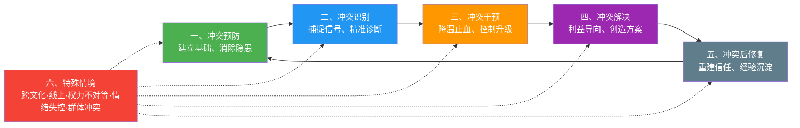
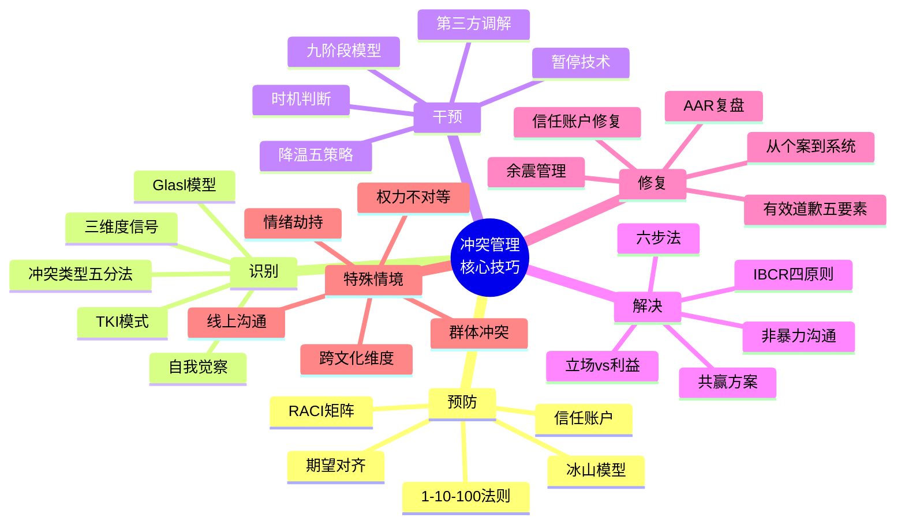
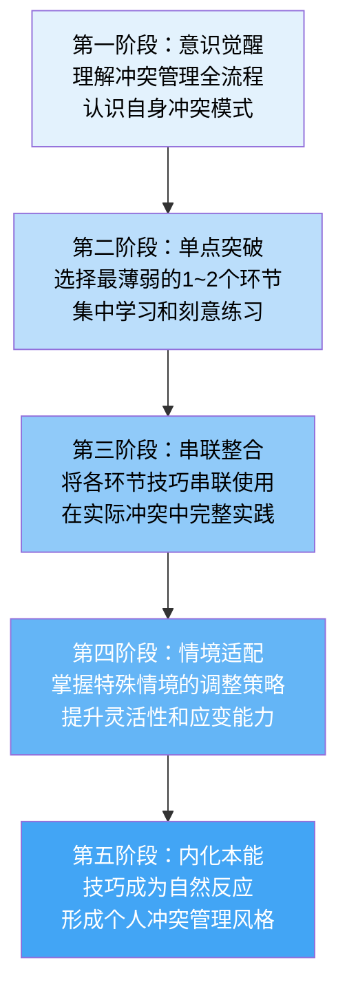

## 七、本节小结

核心技巧篇从冲突预防到特殊情境应对，构建了一套完整的冲突管理能力体系。本节将六节内容进行系统性梳理，提炼关键要点，建立知识框架，并提供可操作的自检工具，帮助读者将分散的技巧整合为一套内化的能力系统。

本节不是对前六节的简单重复，而是一次**结构化重组**——将线性阅读获得的知识点，重新组织为可检索、可自检、可实操的能力地图。建议读者将本节作为日常使用的"速查手册"：遇到具体冲突情境时，先定位属于哪个环节，再回到对应节深入学习。

### 7.1 全流程框架回顾

冲突管理不是单一技能，而是一条完整的链条。六个环节环环相扣，每个环节的输出是下一个环节的输入：

值得注意的是，这六个环节并非严格的线性关系——预防做得好，识别和干预的压力就小；修复做到位，下一轮预防的起点就更高。冲突管理本质上是一个**螺旋上升的闭环**，每经历一轮循环，能力都在积累。

同时，第六节"特殊情境"并不是独立于前五节的附加内容，而是前五节通用技巧在复杂条件下的**适应性变体**。掌握通用技巧是基础，学会在特殊情境中灵活调整才是进阶。

#### 7.1.1 各环节的"杠杆效应"

理解六个环节的关系，关键在于理解它们的**杠杆效应差异**。越靠前的环节，投入产出比越高：

| 环节 | 投入成本 | 影响范围 | 杠杆倍数 |
|------|---------|---------|---------|
| 预防 | 低（建立习惯即可） | 全局性——预防到位，后续环节压力大幅降低 | 1:100 |
| 识别 | 低（觉察训练） | 局部但关键——越早识别，选择越多 | 1:50 |
| 干预 | 中（需要技巧和判断力） | 阶段性——决定冲突走向 | 1:20 |
| 解决 | 高（需要创造力和谈判力） | 具体——解决当前问题 | 1:10 |
| 修复 | 中（需要真诚和耐心） | 长期——决定关系质量 | 1:15 |
| 特殊情境 | 高（需要综合能力） | 突发性——处理不当影响大 | 1:30 |

这个杠杆模型的实际含义是：**与其花大量精力在冲突爆发后艰难解决，不如在预防和识别环节多投入**。一个每周花15分钟做期望对齐的团队，远比一个每月花两天做冲突调解的团队高效。

#### 7.1.2 知识体系全景图

将六节内容的核心概念组织为一张知识地图，方便快速定位：

### 7.2 各环节核心要点提炼

每个环节的核心要点以表格形式呈现，表格后附有**深度解读**，帮助读者不仅记住要点，更理解要点背后的逻辑。

#### 7.2.1 冲突预防：最高杠杆的投资

| 要点 | 核心内容 | 关键数据/工具 |
|------|---------|-------------|
| 预防的价值 | 冲突成本的"冰山模型"——显性成本仅占10%~15%，隐性成本和机会成本才是大头 | 1-10-100法则：预防成本1，修复成本10，爆发成本100 |
| 建立沟通基础 | 定期的一对一沟通、团队回顾会、开放的反馈文化 | 每周15分钟的期望对齐对话 |
| 明确期望 | 对目标、角色、标准、流程达成书面共识 | 期望对齐清单（RACI矩阵） |
| 建立信任 | 通过一致性行为、兑现承诺、透明沟通积累"信任账户" | Gottman 5:1 正负互动比 |
| 制度屏障 | 建立冲突处理流程、决策机制、申诉渠道 | 正式的冲突处理SOP |
| 动态管理 | 期望不是一次对齐就永远不变，需要定期回顾和调整 | 季度期望回顾机制 |

**深度解读：冰山模型的实际含义**

冲突成本的"冰山模型"并非比喻——它是经过大量组织行为学研究验证的量化规律。以一个典型的团队冲突为例：表面上，冲突的显性成本可能只是几次争吵导致的30分钟会议中断（显性成本约10%）。但水面之下，参与者在冲突后数小时内注意力分散、工作效率下降（隐性成本约30%）；更深层的是，团队信任度降低、信息共享意愿下降、优秀成员萌生去意（机会成本约60%）。一个看似"小吵小闹"的冲突，其真实成本可能是显性成本的8~10倍。

预防的核心不是"让所有人都满意"——那是不可能的。预防的核心是**降低冲突爆发的概率和烈度**。具体来说，通过定期的期望对齐（RACI矩阵），明确"谁负责什么、谁审批什么、谁被咨询、谁被通知"，可以消除60%以上的角色模糊型冲突。通过建立信任账户（Gottman 5:1法则），确保正面互动远多于负面互动，可以为不可避免的冲突积累足够的"缓冲垫"。

**一句话总结**：预防的本质不是"避免冲突"，而是"在冲突成本最低时就化解它"。

#### 7.2.2 冲突识别：在窗口期内抓住信号

| 要点 | 核心内容 | 关键数据/工具 |
|------|---------|-------------|
| 识别的价值 | 从潜伏期到显现期，干预成本呈指数增长；在Glasl模型前三阶段介入，合作空间最大 | 潜伏期干预15~30分钟 vs 显现期数小时至数天 |
| 早期信号 | 语言信号（用词变化、频率下降）、行为信号（回避、消极）、情绪信号（微表情、语气） | 信号清单（语言/行为/情绪三维度） |
| 冲突诊断 | 区分冲突类型（事实/价值/利益/关系/结构性）、评估严重程度、判断升级趋势 | Thomas-Kilmann冲突模式工具（TKI） |
| 自我觉察 | 识别自身的情绪触发点、默认冲突模式、防御性反应 | 情绪日记、自我反思四问 |

**深度解读：为什么识别比解决更重要**

冲突识别的黄金期在Glasl模型的前三阶段（硬化→辩论→行动优先）。在这个阶段，双方还保有"合作赢"的可能性，你只需要15~30分钟的有效沟通就能化解。一旦冲突滑入第四至第六阶段（策略导向→失去面子→威胁策略），干预成本上升10倍以上，可能需要数小时的专业调解。到了第七至第九阶段（有限毁灭→分裂→共同毁灭），关系基本不可修复。

三维度信号清单是日常训练的核心工具：

- **语言信号**：用词从"我们"变成"你和我"，回答从详细变简短，开始使用绝对化表达（"你总是""你从来"）
- **行为信号**：会议中沉默、消息回复延迟增大、回避眼神接触、身体后倾或交叉手臂
- **情绪信号**：语气变硬、叹气频率增加、微笑变少、对小事表现出不成比例的烦躁

**一句话总结**：识别不是目的，识别是为干预争取时间窗口。错过窗口期，选择权就从你手上溜走了。

#### 7.2.3 冲突干预：止损降温，争取空间

| 要点 | 核心内容 | 关键数据/工具 |
|------|---------|-------------|
| 干预的定位 | 不是解决问题，而是阻止恶化，为解决创造条件 | 医学类比：急症处理先稳定生命体征 |
| 升级模型 | Glasl九阶段模型：前三阶段"争赢"可合作，中间三阶段"争胜"需调解，后三阶段"毁灭"需隔离 | 九阶段识别表 |
| 降温技巧 | 暂停技术（20分钟冷静期）、换场（换环境）、分离（暂时分开）、降级语言 | 情绪半衰期约20分钟 |
| 第三方干预 | 调解人角色定位、调解流程（开场→各自陈述→共同讨论→达成协议）、调解人中立原则 | 调解人胜任力模型 |
| 干预时机 | 过早干预（压制表达）和过晚干预（错过窗口）同样有害 | "温度计"评估法 |

**深度解读：暂停技术的科学基础**

"20分钟冷静期"不是随意的数字——它来自神经科学对情绪生理机制的研究。当人进入愤怒状态时，肾上腺素和皮质醇大量分泌，心率加速，前额叶皮层（负责理性决策的脑区）功能被抑制。这个过程通常需要15~20分钟才能自然消退，这就是情绪的"半衰期"。

暂停技术的正确使用方式是：明确告知对方"我需要20分钟整理思路，之后我们继续谈"——而不是沉默离开（那会被解读为冷暴力）。暂停期间，进行深呼吸（4秒吸气-7秒屏气-8秒呼气）或轻度运动（散步），加速皮质醇代谢。关键原则：**暂停是为了更好地回来，不是为了逃避**。暂停结束后必须主动回到对话。

**一句话总结**：好的干预像外科手术——精准、及时、以最小侵入换取最大稳定。

#### 7.2.4 冲突解决：从立场博弈到利益共创

| 要点 | 核心内容 | 关键数据/工具 |
|------|---------|-------------|
| 核心范式 | 从"立场博弈"转向"利益导向"——立场层是零和游戏，利益层的解空间远大于立场层 | Fisher & Ury《Getting to Yes》 |
| 三层结构 | 立场层（明确要求）→ 利益层（深层动机）→ 需求层（人性基本需求） | 利益挖掘的"五个为什么" |
| IBCR四原则 | 把人和问题分开、聚焦利益而非立场、创造共赢选项、坚持客观标准 | 哈佛谈判项目方法论 |
| 六步法 | ①界定问题→②挖掘利益→③生成选项→④评估方案→⑤达成协议→⑥制定执行计划 | 六步法流程模板 |
| 关键沟通技巧 | 积极倾听、"我"信息表达、重构、探询式提问 | 非暴力沟通四要素（观察-感受-需要-请求） |

**深度解读：立场与利益的经典案例**

"两个图书馆员争一个橘子"是哈佛谈判项目的经典案例，但大多数人只记住了结论（一人要果肉、一人要果皮），却忽略了方法论的核心信息：**在立场层面，她们的需求完全对立（"我要这个橘子"），没有任何谈判空间；但在利益层面，她们的需求完全不同（一个要做橘子酱需要果皮，一个要吃水果需要果肉），根本不存在冲突**。

这个案例的力量在于：它表明大量看似不可调和的冲突，其实只是因为双方都在立场层面对话。五层利益挖掘法的实操流程如下：

1. **第一问**："你具体想要什么？"——得到立场（"我要这个办公室"）
2. **第二问**："为什么这对你是重要的？"——得到利益（"因为靠近会议室方便开会"）
3. **第三问**："如果这个条件不满足，你最担心什么？"——得到恐惧（"怕影响工作效率"）
4. **第四问**："有没有其他方式也能满足这个需求？"——打开选项（"可以要一个离会议室近的工位"）
5. **第五问**："这个问题的客观标准应该是什么？"——建立基准（"按部门使用会议室的频率分配"）

**一句话总结**：解决冲突的最高境界不是一方赢，而是找到一个双方都没想过但都愿意接受的方案。

#### 7.2.5 冲突后修复：最容易被跳过一步

| 要点 | 核心内容 | 关键数据/工具 |
|------|---------|-------------|
| 修复的价值 | 冲突的"余震"效应——负面情绪不会随冲突停止而消失，杏仁核应激需数小时至数天恢复 | 皮质醇恢复周期：24~72小时 |
| 信任账户 | 每次正面互动是"存款"，负面互动是"取款"，冲突是一次大额取款 | Gottman 5:1 魔法比例 |
| 关系修复四步 | ①真诚道歉→②倾听对方感受→③共同复盘→④制定改进承诺 | 有效道歉五要素 |
| 经验总结 | 冲突复盘模板：发生了什么→根因是什么→哪里做得好→哪里可以改进→下次怎么做 | AAR（After Action Review）方法 |
| 制度改进 | 将冲突中暴露的系统性问题转化为制度优化 | "从个案到系统"转化框架 |

**深度解读：为什么修复是最容易被跳过的一步**

冲突结束后，大多数人会产生一种"终于结束了"的解脱感，本能地想要回避任何与冲突相关的话题。这种心理机制叫做**回避性遗忘**——大脑倾向于淡化不愉快的记忆，以保护心理舒适区。但问题是：冲突的生理影响（皮质醇升高、杏仁核敏感化）需要24~72小时才能完全消退。在这段时间里，如果没有任何修复行为，当事人会进入"余震模式"——对对方的正常行为过度敏感，将中性信号解读为敌意信号，导致冲突的二次爆发。

有效道歉五要素缺一不可：

1. **明确承认错误**："我在会议上当众批评你的方案，这是不对的"——而不是"如果你觉得受伤了，我道歉"
2. **表达对对方感受的理解**："我能理解你当时感到被羞辱和愤怒"
3. **说明你的改进计划**："以后我会选择私下沟通，而不是在会议上直接否定"
4. **给予对方表达空间**："你愿意告诉我你的感受吗？"
5. **不附加条件**：道歉不是"我道歉了，你也要道歉"的交换筹码

AAR（After Action Review）复盘方法源自美国陆军，核心是四个问题：预期目标是什么？实际发生了什么？差异的原因是什么？下次如何改进？这个方法的力量在于它的**非指责导向**——它关注的是"系统哪里出了问题"，而不是"谁犯了错"。

**一句话总结**：冲突后的修复决定了这段关系是"因冲突而更强"还是"因冲突而破裂"。

#### 7.2.6 特殊情境：通用技巧的适应性变体

| 特殊情境 | 核心挑战 | 关键调整策略 |
|---------|---------|------------|
| **跨文化冲突** | 双方"冲突解码器"不同，同一行为有不同含义 | 了解Hofstede文化维度、用好奇心替代评判、避免刻板印象 |
| **线上冲突** | 非语言信息缺失（只剩7%的语言内容），极易误读 | 复杂问题不在线上解决、善用表情符号补充语调、延迟回复原则 |
| **权力不对等** | 弱势方无法自由表达，强势方容易忽视异见 | 权力方主动征求意见、建立匿名反馈渠道、结构化表达框架 |
| **情绪失控** | 杏仁核劫持导致理性脑"断线"，无法进行有效对话 | 暂停技术、呼吸调节、承认情绪、先处理情绪再处理问题 |
| **群体冲突** | 多方卷入导致立场碎片化、"站队"心理加剧对立 | 分组对话、利益图谱、建立共同目标、第三方协调 |
| **持续性冲突** | 长期僵持，双方已形成固化的敌对模式 | 打破互动模式、引入外部视角、小步骤信任重建 |
| **价值观冲突** | 涉及核心信念，几乎不可能说服对方改变 | 求同存异、划定边界、寻找共同利益、接受"建设性分歧" |

**深度解读：每种特殊情境的关键差异**

特殊情境的本质是**约束条件的变化**。通用技巧在理想条件下有效——双方理性、信息对称、时间充裕、权力平等。当这些条件被破坏时，通用技巧需要做适应性调整。

**线上冲突的核心陷阱**：Mehrabian的7-38-55法则（7%语言内容+38%语调+55%肢体语言）经常被误用，但其核心洞察是成立的——文字沟通丢失了大量情绪和意图信息。一条"好的"消息，在面对面交流中可能配合微笑表示赞同，在文字中可能被解读为敷衍、不满甚至讽刺。**延迟回复原则**是指：收到让你不舒服的消息后，至少等30分钟再回复。这30分钟用于三个判断：（1）对方的文字是否有其他合理的解读？（2）你的情绪是否影响了你的判断？（3）这个问题是否需要语音/面谈才能妥善处理？

**价值观冲突的管理边界**：价值观冲突是所有冲突类型中最难处理的，因为它触及人的核心信念系统。关键认知转变是：**你不需要同意对方的价值观，你只需要找到一个双方都能接受的共存方式**。例如，一个注重效率的人和一个注重公平的人在资源分配上产生分歧，不需要说服对方"效率比公平重要"或反之，而是找到一个在效率和公平之间取得可接受平衡的方案。

**一句话总结**：特殊情境的管理不是新学一套方法，而是在通用技巧的基础上做"情境适配"。

### 7.3 贯穿全流程的五个核心原则

无论冲突发生在什么情境、处于什么阶段，以下五个原则始终适用。它们不是空洞的理念，而是经过理论验证和实践检验的行为指南：

#### 7.3.1 原则一：尊重对方这个人

把"人"和"问题"分开是冲突管理的基石。你可以强烈反对对方的观点，但必须尊重对方作为人的尊严。一旦进行人身攻击，冲突的性质就从"问题解决"变成了"关系破坏"，而关系一旦破坏，问题就更难解决。

**实操检验**：在你表达反对之前，问自己——"我接下来要说的话，是在攻击他的观点，还是在攻击他这个人？"

**常见的越界信号**：使用"你总是""你从来""你这种人"等泛化表述；用对方的外貌、学历、家庭背景作为攻击素材；在第三方场合贬低对方；用沉默或忽视作为惩罚手段。这些行为的共同特征是：它们不是在讨论问题，而是在否定对方作为人的价值。

**修复方法**：如果你发现自己已经越界，立即停止讨论问题本身，转而修复关系。可以说："我刚才的话越界了，我在讨论问题但说成了针对你。我收回那句话，我们重新来。"

#### 7.3.2 原则二：保持好奇心而非评判心

好奇心让你去理解"为什么"，评判心让你急于下结论"是什么"。冲突中的大多数升级，不是因为分歧本身不可调和，而是因为双方都在用"评判心"解读对方的行为——"他就是故意的""她就是不尊重我"。

**实用句式**：把"你怎么可以这样？"替换为"能帮我理解一下你的考虑吗？"这一个句式的转换，就能把对话从对抗模式切换到探索模式。

**好奇心的三个层次**：

1. **表层好奇**：了解事实——"具体发生了什么？"——这是信息收集
2. **中层好奇**：理解动机——"你当时是怎么考虑的？"——这是共情尝试
3. **深层好奇**：探索需求——"这件事对你来说最重要的是什么？"——这是利益挖掘

大多数人在冲突中只做到第一层（收集事实用来反驳），而真正的冲突管理者会深入到第三层（理解需求来寻找方案）。

#### 7.3.3 原则三：聚焦利益而非立场

立场是表象，利益是本质。在立场层面博弈，双方是此消彼长的对手；在利益层面探索，双方可能成为共同解决问题的伙伴。每一次陷入僵局时，都应该问自己："他真正想要的是什么？我真正想要的是什么？有没有一种方案能同时满足双方的深层需求？"

**实操工具**：当对方坚持一个看似不合理的立场时，连续问三个"为什么"——"为什么这对你是重要的？""为什么这个方案对你来说不可接受？""你最担心的是什么？"——往往能挖出隐藏在立场背后的真实利益。

**从立场到利益的转化公式**：

> 立场 = "我要X"
> 利益 = "我需要X，是因为X能满足我的Y需求"
> 共赢方案 = "有没有X'也能满足Y，同时不损害你的Z需求？"

这个公式的核心思想是：**立场通常只有一个解，但利益通常有多个解**。当你从立场转向利益，解空间会指数级扩大。

#### 7.3.4 原则四：寻找共赢方案而非妥协方案

妥协是双方都不满意的折中，共赢是双方都认可的创新。妥协的本质是"切蛋糕"——你多我就少；共赢的本质是"做大蛋糕"——通过创造性思维找到各方利益都能被满足的方案。

**经典案例**：两个图书馆员争夺一个橘子，最终一人拿走果肉、一人拿走果皮——她们的需求其实完全不同，只是在立场层面看起来冲突。这就是"从立场到利益"的力量。

**共赢方案的生成技巧**：

| 技巧 | 说明 | 适用场景 |
|------|------|---------|
| 扩大资源 | 引入新资源使分配不再零和 | 资源不足导致的冲突 |
| 交换利益 | 双方各让一步在不同维度上 | 多维度利益冲突 |
| 创造新选项 | 打破既有框架想出新方案 | 陷入僵局时 |
| 降低成本 | 降低一方的让步成本 | 权力不对等时 |
| 引入客观标准 | 用行业标准/市场价/先例作为基准 | 双方互不信任时 |

#### 7.3.5 原则五：持续学习和改进

每一次冲突都是一次学习机会。冲突管理能力不是一蹴而就的，它需要理论学习、刻意练习和持续反思的结合。把每次冲突都当作一面镜子——它照出的不仅是对方的问题，更是你自己在沟通、情绪管理、问题解决等方面的提升空间。

**实操建议**：每次经历冲突后，花10分钟完成一次"迷你复盘"——这次冲突的根因是什么？我用了哪些技巧？哪些有效、哪些无效？下次可以怎样改进？日积月累，这些复盘会成为你最宝贵的冲突管理经验库。

**复盘的核心三问**：

1. **模式识别**：这次冲突和上次冲突有什么相似之处？我是否在重复某种模式？
2. **情绪复盘**：冲突中最强烈的情绪是什么？这个情绪是什么时候出现的？触发因素是什么？
3. **技巧评估**：我用了哪些技巧？哪些起了作用？哪些需要调整？

### 7.4 冲突管理能力自检清单

以下清单可以帮助你评估自己在冲突管理各环节的能力水平。对照每一项，诚实地给自己打分（1-5分）。评分后，参考最右侧的提升建议，找到下一步行动方向：

| 环节 | 自检项目 | 评分标准 | 提升建议（得分≤3时参考） |
|------|---------|---------|----------------------|
| **预防** | 我是否定期与重要关系人进行期望对齐？ | 5=每月至少一次；1=从未做过 | 从最重要的3个关系开始，每月安排一次15分钟的期望对齐对话 |
| **预防** | 我是否建立了处理分歧的规则和流程？ | 5=有明确的书面流程；1=完全靠临场发挥 | 草拟一份简单的"分歧处理规则"（如：24小时冷静期、不人身攻击、必须有一方主动提出沟通） |
| **识别** | 我能否在冲突升级前察觉到早期信号？ | 5=通常能提前察觉；1=总是事后才意识到 | 本周起每天花3分钟记录你观察到的一次人际互动信号（语言/行为/情绪） |
| **识别** | 我是否了解自己的情绪触发点和默认冲突模式？ | 5=非常清楚并能主动调整；1=从未反思过 | 用TKI工具做一次冲突模式评估，列出你最常用的两种模式 |
| **干预** | 我能否在冲突升级时选择合适的降温策略？ | 5=有多种策略并能灵活运用；1=只会忍让或对抗 | 学习并练习"暂停技术"——下次感觉要爆发时，主动说"给我20分钟" |
| **干预** | 我是否具备调解他人冲突的能力？ | 5=经常成功调解；1=从不敢介入 | 从观察开始：注意身边成功的调解者是怎么做的，记录他们的方法 |
| **解决** | 我能否在冲突中挖掘出双方的深层利益？ | 5=熟练运用利益挖掘技巧；1=只关注立场 | 在下次分歧中，刻意练习"五个为什么"——连续追问直到挖出深层需求 |
| **解决** | 我是否善于创造共赢方案？ | 5=经常能找到创新方案；1=只能妥协 | 每次僵局时强制自己想出至少3个新选项，再评估哪个最优 |
| **修复** | 我是否在冲突后主动进行关系修复？ | 5=每次都会主动修复；1=认为"过去了就好了" | 下次冲突后24小时内，主动发一条消息或安排一次简短对话 |
| **修复** | 我是否对冲突进行复盘和经验总结？ | 5=有系统的复盘习惯；1=从不复盘 | 用AAR四问题法进行一次复盘，写下答案保存为日志 |
| **特殊情境** | 我是否具备跨文化冲突管理的意识和能力？ | 5=有丰富经验；1=从未考虑过 | 了解Hofstede文化维度模型，思考你常接触的文化在各维度上的差异 |
| **特殊情境** | 我能否在情绪失控时有效自我调节？ | 5=有成熟的调节方法；1=完全被情绪控制 | 学习4-7-8呼吸法，每天练习2次，直到能在压力下自动使用 |

**评分解读**：

- **48~60分**：冲突管理高手——你已经具备了系统性的冲突管理能力，可以在大多数情境中从容应对。建议开始关注特殊情境的深度应对和帮助他人提升冲突管理能力
- **36~47分**：进阶学习者——基础扎实，但某些环节需要加强实践和刻意练习。建议对照"提升建议"列，从得分最低的1-2项开始突破
- **24~35分**：成长中——具备基本意识，但缺乏系统性方法，建议从最薄弱的环节开始突破。不要试图同时提升所有环节，聚焦一个环节深入练习2-4周后再扩展
- **12~23分**：入门阶段——你已经意识到冲突管理的重要性，这是最重要的第一步。建议先通读本章全文，建立全局认知，再从预防和识别两个低投入高回报的环节开始

### 7.5 常见整合性误区

在将分散的技巧整合为系统能力的过程中，以下误区值得警惕。每个误区都附有**具体场景**和**纠正方法**，帮助你识别并绕过这些陷阱：

#### 7.5.1 误区一："每一步都要做到完美才能有效"

冲突管理不是考试，不需要每个环节都拿满分才能及格。一个在预防环节做得出色的人，即使在干预环节表现平庸，也远比一个从不预防、只靠临场发挥的人更有效。先在自己最薄弱的环节取得突破，比追求全面完美更务实。

**典型场景**：一位经理读完冲突管理全部内容后，觉得"我做不到所有这些"，于是什么都不做。

**纠正方法**：从能力自检清单（7.4节）中找到得分最低的一项，集中练习2周。一个环节的进步就足以产生显著效果——因为六个因子是乘法关系，一个因子从2提升到4，整体效能就翻倍。

#### 7.5.2 误区二："冲突管理就是让冲突不发生"

这是对冲突管理最大的误解。冲突本身不是坏事——价值观冲突推动社会进步，利益冲突促成资源优化分配，认知冲突激发创新思维。冲突管理的目标不是消灭冲突，而是让冲突以建设性的方式展开和解决。一个从不发生冲突的团队，往往不是因为和谐，而是因为有人在压抑真实想法。

**典型场景**：一位团队leader以"我们的团队从不吵架"为荣，实际上是因为成员们都不敢表达不同意见，创新想法被压抑。

**纠正方法**：区分"建设性冲突"和"破坏性冲突"。建设性冲突聚焦于问题本身，双方都尊重对方，目标是找到更好的方案；破坏性冲突针对人身，目标是击败对方。鼓励前者，管理后者——这才是冲突管理的真义。

#### 7.5.3 误区三："学了技巧就能管理好冲突"

知识不等于能力。你知道"积极倾听"的定义，不代表你在愤怒时能做到积极倾听。冲突管理能力的提升遵循"知道→理解→能做→习惯"的路径，每个阶段之间都需要刻意练习的桥梁。建议从下一章的实战案例开始，将理论转化为可操作的行动。

**典型场景**：一位读者熟读了非暴力沟通的四个要素，但在真实冲突中完全用不出来，因为愤怒时理性思考能力已经被杏仁核劫持。

**纠正方法**：在低压力场景中反复练习（和朋友的小分歧、和家人的日常讨论），直到技巧变成肌肉记忆。就像学开车——刚学时需要刻意想着每个动作，熟练后就变成了自动化反应。冲突管理技巧也需要同样的"从刻意到自动"的过程。

#### 7.5.4 误区四："冲突管理是'和稀泥'的委婉说法"

真正的冲突管理追求的不是"大家都别吵了"，而是"找到一个各方核心利益都被满足的方案"。有时候，这意味着需要直面分歧、坦诚表达、坚守底线。回避冲突不是冲突管理，和稀泥也不是冲突管理——那是冲突的逃避和掩盖。

**典型场景**：一位调解人在双方冲突时不断说"算了算了，各退一步"，结果双方都不满意，问题没有解决，下次冲突更激烈。

**纠正方法**：好的冲突管理有时需要"建设性对抗"——明确指出问题、坦诚表达需求、坚守不可妥协的底线。关键是方式：你可以坚定但不攻击，直接但不伤人。"我很理解你的立场，但我必须坦诚告诉你，这个方案我们无法接受，因为……"——这不是和稀泥，这是有立场的对话。

#### 7.5.5 误区五："只要我做好了自己的部分就够了"

冲突是关系的产物，关系是双方的。你可以做到极致的预防、识别、干预和修复，但如果你的对方完全不具备冲突管理意识，你的努力可能事倍功半。这并不意味着你应该放弃——你做好自己的部分，至少能减少自己的贡献因素，提升冲突解决的概率。同时，通过你的行为示范，你也在潜移默化地影响对方的冲突管理方式。

**典型场景**：一位员工反复使用"我"信息和积极倾听，但对方每次都人身攻击，让这位员工觉得"技巧没有用"。

**纠正方法**：接受一个现实——你只能控制自己的行为，不能控制对方的反应。当对方持续破坏性行为时，你需要的不是更多沟通技巧，而是**边界设定**："我愿意和你讨论这个问题，但如果你继续人身攻击，我将暂停这次对话。"这不是放弃，这是保护自己的前提下为未来对话保留可能性。

#### 7.5.6 误区六："冲突有标准答案"

很多学习者期望有一个"万能公式"——遇到A类冲突就用B方法。但现实中的冲突几乎都是复合型的，涉及多种冲突类型的交织、多方利益的博弈、不同情境变量的叠加。冲突管理不是数学题，没有标准答案，只有在具体情境中做出当下最优判断的能力。

**纠正方法**：把本章的技巧当作"工具箱"而非"说明书"。工具箱的价值不在于告诉你"必须用锤子"，而在于让你在面对具体问题时，有足够多的工具可以选择。随着实践经验的积累，你会发展出自己的"冲突管理直觉"——这不是玄学，而是大量经验内化后的快速判断能力。

### 7.6 从技巧到能力：整合路径建议

将本节六个环节的技巧内化为能力，建议按以下路径循序渐进：

#### 7.6.1 各阶段详解

**第一阶段（1~2周）：意识觉醒**

目标：建立冲突管理的全局视野，认识自己的冲突模式。

- 通读本章所有内容，不需要记住所有细节，重点理解六个环节的逻辑关系
- 完成7.4节的自检清单，诚实评分，识别自己的优势环节和薄弱环节
- 回顾最近3次冲突经历，尝试用本章的框架进行事后分析
- 阅读至少一本冲突管理经典著作（推荐《Getting to Yes》或《Crucial Conversations》）

**第二阶段（1~3个月）：单点突破**

目标：在最薄弱的1-2个环节建立基本能力。

- 选择自检清单中得分最低的1-2个环节
- 深入学习对应节的内容，理解理论基础和操作方法
- 在日常生活中刻意练习。例如，如果薄弱环节是"冲突识别"，每天花5分钟观察周围人际互动中的信号，用情绪日记记录自己的觉察
- 每周进行一次自我评估，观察进步

**第三阶段（3~6个月）：串联整合**

目标：能够在真实冲突中完整运用冲突管理流程。

- 尝试在真实冲突中运用完整的流程——从识别信号、选择干预时机、运用解决技巧到事后修复
- 每次实践后进行AAR复盘，记录哪些技巧有效、哪些需要调整
- 寻求反馈——向冲突中的对方或可信任的第三方询问你的表现
- 开始建立个人的"冲突管理案例库"

**第四阶段（6~12个月）：情境适配**

目标：掌握在复杂情境中灵活调整策略的能力。

- 在掌握通用技巧的基础上，开始关注特殊情境的适应性调整
- 主动寻找跨文化互动、线上沟通、权力不对等等复杂情境的实践机会
- 分析自己的案例库，总结在不同情境中的有效策略
- 尝试调解他人的冲突，锻炼第三方视角

**第五阶段（持续）：内化本能**

目标：冲突管理成为自然而然的思维方式。

- 技巧逐渐内化为本能反应。你不再需要在冲突中"想起"某个技巧，而是自然而然地以尊重、好奇、利益导向的方式处理分歧
- 形成个人冲突管理风格——每个人的性格和优势不同，你的冲突管理方式应该是"你的版本"，而不是教科书的复制
- 开始帮助他人提升冲突管理能力——教是最好的学，通过教授他人，你的理解会更深入

这就是冲突管理能力的最高境界——**不是你在管理冲突，而是你的思维方式本身就是冲突的解药**。

### 7.7 冲突管理能力发展评估表

除了7.4节的自检清单，以下评估表可以帮助你跟踪能力发展的进度。建议每3个月做一次评估，观察自己的成长轨迹：

| 评估维度 | 入门标志 | 进阶标志 | 精通标志 |
|---------|---------|---------|---------|
| **冲突观** | 认识到冲突不可避免 | 理解冲突的建设性价值 | 将冲突视为关系深化的契机 |
| **情绪管理** | 能意识到自己的情绪 | 能在冲突中管理情绪 | 能帮助他人管理情绪 |
| **沟通能力** | 能表达自己的立场 | 能用"我"信息和积极倾听 | 能在高压下保持建设性对话 |
| **问题解决** | 能区分立场和利益 | 能挖掘深层利益和创造选项 | 能在复杂多方博弈中找到共赢方案 |
| **关系维护** | 冲突后不会主动恶化 | 冲突后会主动修复 | 冲突后关系反而更强 |
| **情境适应** | 能识别不同情境的差异 | 能在主要特殊情境中调整策略 | 能在从未遇到的情境中快速适应 |

### 7.8 本节核心公式

最后，用一个公式总结核心技巧篇的全部内容：

> **冲突管理效能 = 预防投入 × 识别敏锐度 × 干预精准度 × 解决创造力 × 修复彻底度 × 情境适应力**

这六个因子是**乘法关系**而非加法关系——任何一个环节为零，整体效能就趋近于零。一个极其擅长解决冲突但从不修复关系的人，和一个极其擅长预防但从不识别信号的人，都无法实现有效的冲突管理。

乘法关系的实际含义：假设每个因子满分10分，六项全为5分的人（5×5×5×5×5×5 = 15,625），其冲突管理效能远高于一个五项满分但修复为0的人（10×10×10×10×10×0 = 0）。**短板效应在冲突管理中比长板效应更重要**——提升最弱的环节，比强化已擅长的环节，对整体效能的提升更大。

唯有六个环节协同运转，才能将冲突从"关系的破坏者"转化为"关系的磨刀石"——每一次冲突都让理解更深、信任更强、合作更默契。

在下一节的实战案例中，我们将看到这些技巧在真实场景中的综合应用。
