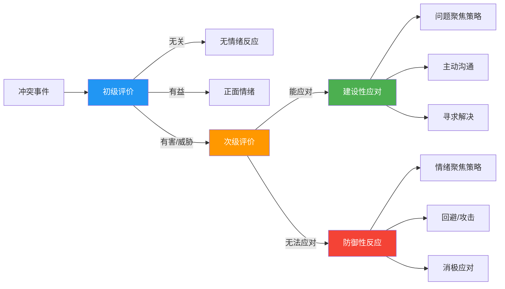
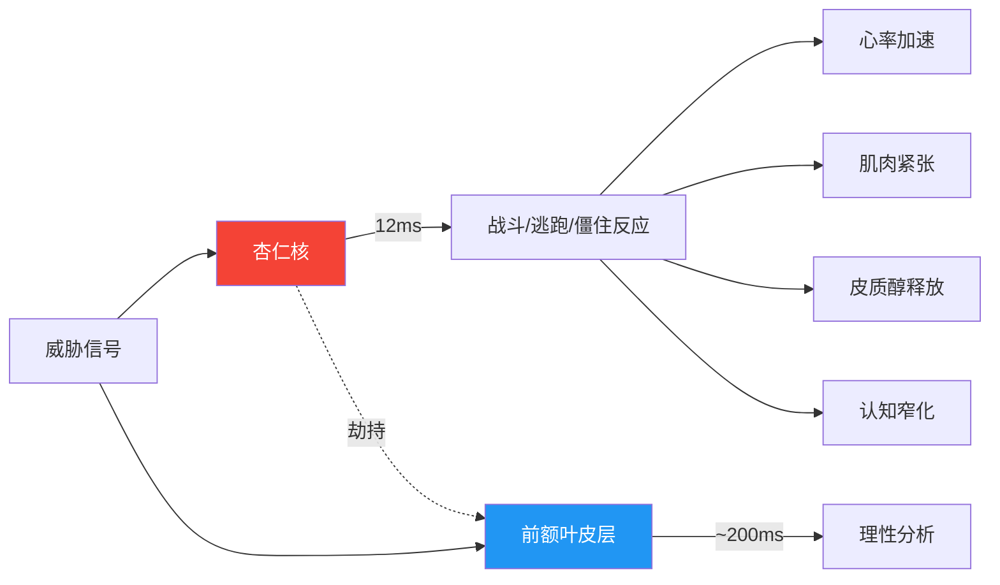
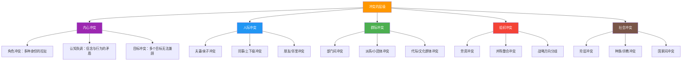
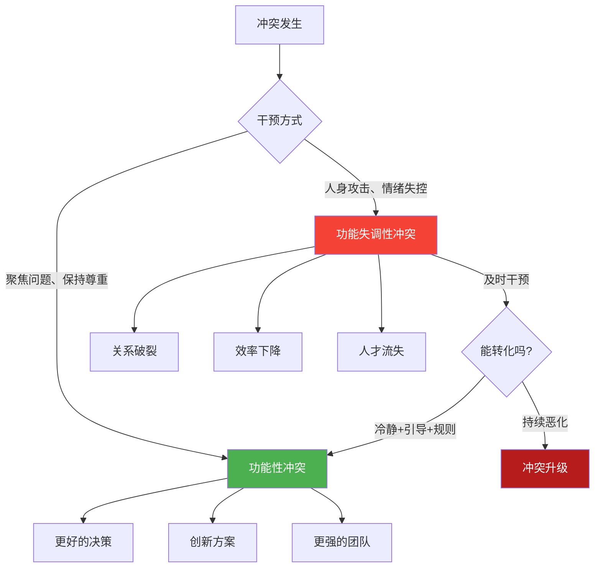
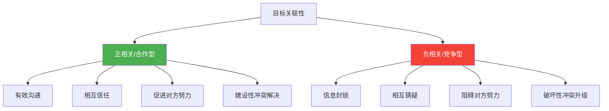
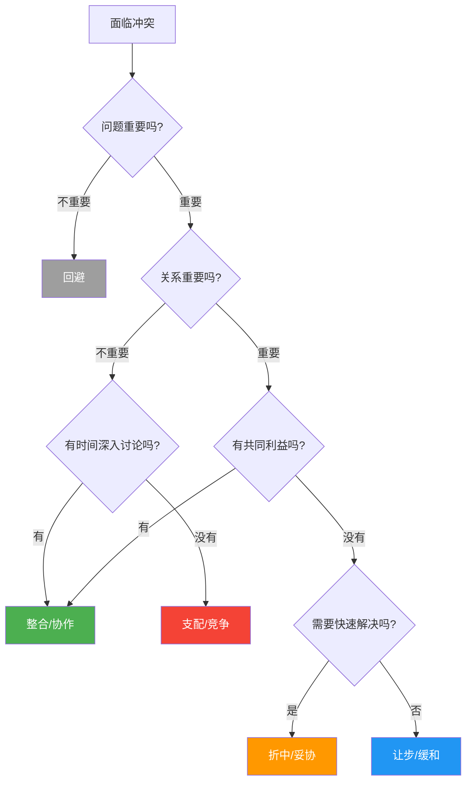
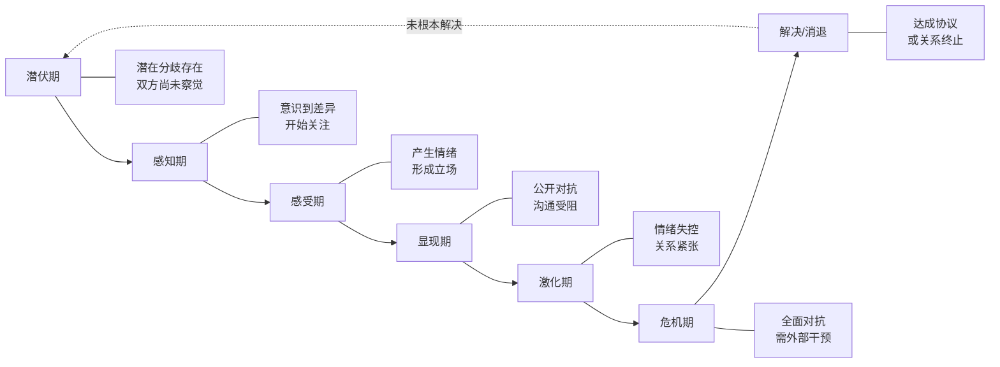

## 一、冲突的基本概念

冲突是人类社会中最普遍、最不可避免的现象之一。从两个人争抢同一份资源，到跨国公司的战略分歧，从夫妻间的家务分配争论，到国际政治中的领土争端——冲突无处不在。理解冲突的本质、类型、来源和运行机制，是掌握冲突管理技能的第一步。本节将从理论到实践，系统构建关于冲突的完整知识框架。

### 1.1 什么是冲突

#### 1.1.1 冲突的学术定义

冲突（Conflict）是指两个或多个个体、群体或组织之间，由于感知到彼此在目标、利益、价值观、需求或行为方式上存在不兼容或对立，而产生的一种互动状态。冲突的本质是一种"感知到的不兼容"——即使客观上不存在实质性的利益对立，只要当事人认为存在分歧，冲突就已经形成。

这个定义包含三个关键要素：

| 要素 | 说明 | 示例 |
|------|------|------|
| **感知性** | 冲突存在于当事人的认知中，而非客观事实本身 | 两位同事误以为对方抢了自己的功劳，实际上信息传递出了问题 |
| **互依性** | 冲突双方必须存在某种依赖关系，否则只会选择远离 | 同一个项目组的成员无法简单回避彼此 |
| **不兼容性** | 双方在目标、资源、认知或价值观上存在对立 | 产品经理要速度，工程师要质量 |

美国冲突管理学者莫顿·多伊奇（Morton Deutsch）在1973年提出了冲突的经典定义："当一方的行为阻碍或干扰了另一方目标的实现时，冲突就产生了。"这一定义强调了冲突的互动性和目标导向性。多伊奇进一步指出，冲突的性质取决于双方的"目标关联性"——当目标正相关（合作型）时，冲突倾向于以建设性方式解决；当目标负相关（竞争型）时，冲突容易走向破坏性。

另一位重要学者肯尼思·托马斯（Kenneth Thomas）将冲突定义为"一个过程，它始于一方察觉到自己受到另一方的阻挠或即将受到阻挠，而这些阻挠涉及自己关心的事情"。这个定义突出了冲突的动态过程性——冲突不是静态的，而是一个随时间演变的动态过程。

此外，刘易斯·科塞（Lewis Coser）在《社会冲突的功能》（1956）中将冲突定义为"对价值、地位、权力和稀缺资源的争夺，其中对立双方的目的是压制、伤害或消灭对方"。科塞的定义强调了冲突的资源争夺本质和对抗意图，为后来的功能主义冲突理论奠定了基础。

**定义的演进脉络**：从早期将冲突视为纯粹破坏性现象（需要消除的"组织病态"），到现代将其理解为中性的、甚至可能有益的互动过程，学术界对冲突的认知经历了根本性转变。这一转变的里程碑包括福莱特（Mary Parker Follett）在1920年代提出的"建设性冲突"概念、科塞的功能主义理论，以及罗宾斯（Stephen P. Robbins）在组织行为学中对功能性与功能失调性冲突的系统区分。

#### 1.1.2 冲突的本质特征

理解冲突需要把握以下核心特征：

**第一，冲突是中性的。** 冲突不等同于暴力、争吵或敌意。冲突是一种中性的社会现象，它可以产生破坏性后果，也可以带来建设性结果。哈佛商学院的研究表明，适度的任务冲突如果处理得当，能够将团队决策质量提升约20%。关键在于我们如何理解和管理冲突。将冲突妖魔化（"冲突是坏事"）或浪漫化（"冲突越多越好"）都是危险的认知偏差。

**第二，冲突是不可避免的。** 只要人与人之间存在互动，冲突就必然产生。这是因为每个人的成长背景、认知框架、利益诉求和价值排序都不同。试图消灭冲突既不可能也不明智——真正的问题不是"如何避免冲突"，而是"如何有效管理冲突"。组织行为学的研究反复证实：零冲突的组织并非健康的组织，往往只是冲突被压抑了。

**第三，冲突是信息丰富的。** 每一次冲突都在传递重要信息：它暴露了制度的漏洞、关系的裂痕、资源的错配或认知的偏差。善于从冲突中提取信息的人和组织，能够不断改进自身。冲突就像身体的疼痛信号——疼痛令人不快，但它提醒你某个地方出了问题，需要关注。

**第四，冲突具有传染性。** 未解决的冲突不会自行消失，它会在时间维度上积累（从小不满变成大爆发），在空间维度上扩散（从两个人蔓延到整个团队），在关系维度上泛化（从工作分歧演变成人身攻击）。这种"冲突溢出"效应在组织中尤为明显：两个部门之间的矛盾如果不加干预，可能波及整个公司文化。

**第五，冲突具有升级性。** 冲突一旦开始，往往会自我强化。每一方的防御性行为都会被对方解读为敌意，从而引发更强的防御，形成恶性循环。社会心理学家将这种现象称为"冲突螺旋"（Conflict Spiral）。多伊奇的研究表明，在竞争型互动中，一方的友善行为有50%的概率被回报以友善，但敌意行为被回报以敌意的概率高达75%——敌意比善意更具传染性。

**第六，冲突与权力密不可分。** 冲突从来不是在真空中发生的。双方的权力不对称——谁拥有更多资源、更高地位、更强话语权——深刻影响着冲突的走向和结局。权力弱势方可能选择沉默服从（表面无冲突，实际压抑），也可能以消极抵抗的方式表达不满。忽视权力维度的冲突分析是不完整的。

#### 1.1.3 冲突的认知基础：拉扎勒斯的认知评价模型

理解冲突为什么在同样的情境下，有些人觉得无所谓而有些人会暴跳如雷，需要引入理查德·拉扎勒斯（Richard Lazarus）的认知评价理论。拉扎尔斯认为，人对事件的情绪反应不是由事件本身决定的，而是由对事件的认知评价决定的。

在冲突情境中，这个认知评价过程分为两个阶段：

**初级评价**：这件事跟我有关系吗？是好事还是坏事？当评价为"有害"或"有威胁"时，冲突感产生。初级评价受到多重因素影响：人格特质（神经质倾向高的人更容易将中性事件评价为威胁）、过往经验（曾经在类似场景中受过伤害的人会更敏感）、当前状态（压力大、睡眠不足时，威胁感知阈值降低）。

**次级评价**：我能做什么？我的资源和能力够不够？如果认为自己有应对能力，倾向于采取建设性的"问题聚焦策略"；如果觉得自己无力应对，就容易陷入"情绪聚焦策略"——回避、攻击或自我麻痹。次级评价的资源包括：社交支持（有没有人帮我）、专业知识（我懂不懂这个问题）、权力地位（我有没有话语权）、过往成功经验（我以前处理过类似情况吗）。

这个模型解释了一个重要现象：**冲突的烈度不取决于客观分歧的大小，而取决于当事人对威胁程度和自身应对能力的主观评估。** 这也是为什么冲突管理的第一步往往不是解决问题，而是调整认知。

**认知偏差的放大效应**：在冲突状态下，人的认知会出现系统性偏差，这些偏差进一步加剧冲突感：

| 偏差类型 | 表现 | 冲突中的影响 |
|----------|------|-------------|
| **基本归因错误** | 把对方的行为归因于人品而非情境 | "他故意刁难我"（而非"他可能压力很大"） |
| **确认偏差** | 只关注支持自己判断的证据 | 忽视对方的善意举动，放大敌意信号 |
| **镜像认知** | 认为对方跟自己的看法/动机一样 | "他肯定也想赢，不可能真心合作" |
| **零和思维** | 认为一方的收益必然是另一方的损失 | 无法看到双赢可能性 |
| **群体内偏见** | 偏袒自己所属的群体 | "我们部门的人更有道理" |

#### 1.1.4 冲突的神经科学基础

现代神经科学研究为理解冲突反应提供了生物学视角。当我们感知到威胁时，大脑中的杏仁核（Amygdala）会在约12毫秒内启动应激反应——远快于前额叶皮层（Prefrontal Cortex）的理性分析。这就是丹尼尔·戈尔曼（Daniel Goleman）所说的"杏仁核劫持"（Amygdala Hijack）。

**杏仁核劫持的生理表现**：心率加速（超过100次/分钟）、呼吸变浅、肌肉紧张、手心出汗、面部发红。当这些生理信号出现时，大脑的理性功能实际上已经被部分"关闭"——前额叶皮层的血液供应被分流到四肢（准备战斗或逃跑），导致复杂的推理能力、共情能力和创造力显著下降。

**对冲突管理的启示**：当发现自己或对方出现这些生理信号时，继续讨论不仅无益，而且有害——此时说出的话往往是最不理性、最具伤害性的。最明智的做法是暂停讨论，进行至少20分钟的冷却——这是皮质醇水平恢复到基线所需的最短时间。

**实用的"生理刹车"技术**：

1. **4-7-8呼吸法**：吸气4秒、屏气7秒、呼气8秒。重复3-4次。这种呼吸模式激活副交感神经系统，帮助降低心率。
2. **身体扫描**：将注意力从冲突情境转移到身体感受上，从头到脚依次感受每个部位的状态。这能将大脑从"威胁模式"切换到"觉察模式"。
3. **5-4-3-2-1感官锚定**：说出你看到的5样东西、听到的4种声音、触摸到的3种质感、闻到的2种气味、尝到的1种味道。这种技术快速将注意力从内部焦虑转移到外部现实。

### 1.2 冲突的类型体系

冲突不是铁板一块。不同类型的冲突有着截然不同的成因、表现和解决路径。准确识别冲突类型，是有效管理冲突的前提。

#### 1.2.1 按内容分类：三大核心类型

| 类型 | 定义 | 典型场景 | 影响 |
|------|------|----------|------|
| **任务冲突**（Task Conflict） | 对工作内容、目标或决策的分歧 | 对项目方案有不同意见、对KPI权重有争议 | 适度时有益，过度时有害 |
| **关系冲突**（Relationship Conflict） | 人际关系中的情感对立和摩擦 | 因性格不合、人身攻击、历史恩怨导致的对立 | 几乎总是有害的 |
| **过程冲突**（Process Conflict） | 对如何完成任务、谁做什么的分歧 | 对工作流程、职责分工、资源分配的不同看法 | 适度时有益，但易升级为关系冲突 |

美国组织行为学家卡伦·杰恩（Karen Jehn）的大量实证研究揭示了一个重要规律：

- **任务冲突**与团队绩效呈倒U型关系——太少的任务冲突意味着缺乏思想碰撞，太多则导致决策瘫痪。最佳水平是"适度的任务冲突"。
- **关系冲突**与团队绩效几乎总是负相关——它消耗认知资源，破坏信任，让人把精力用在对抗而非工作上。
- **过程冲突**介于两者之间——合理的流程争论有助于优化分工，但纠缠不清的过程冲突会让团队迷失在"谁该做什么"的争执中。

**三种冲突的转化路径**：任务冲突如果不加控制，很容易滑向关系冲突——当你说"这个方案有问题"时，对方可能听到的是"你觉得我不行"。研究表明，当团队信任度低时，任务冲突转化为关系冲突的概率高达60%以上。反之，高信任度团队能够将任务冲突保持在理性讨论的范围内。过程冲突也存在类似风险——"你为什么没有按时完成"如果表达不当，就从流程问题变成了人身指责。

**实操启示**：在团队管理中，应鼓励适度的任务冲突（"我们可以对方案有不同看法"），坚决遏制关系冲突（"但不可以人身攻击"），尽早明确过程冲突（"职责分工提前说清楚"）。

#### 1.2.2 按层级分类

大多数人在日常生活中面对的主要是前三个层级的冲突。理解层级很重要，因为不同层级的冲突需要不同的管理策略——内心冲突需要自我认知和价值排序，人际冲突需要沟通技巧和情绪管理，群际冲突需要制度设计和协调机制。

**各层级冲突的深度解析**：

**内心冲突**是最容易被忽视但影响最深远的冲突类型。弗洛伊德的精神分析理论、费斯汀格的认知失调理论、以及角色理论都从不同角度解释了内心冲突的机制。一个每天加班到深夜的父亲，内心同时存在着"我要事业成功"和"我要陪伴孩子"两个目标的冲突。这种冲突不会爆发为外在的争论，但长期存在会引发焦虑、倦怠甚至抑郁。

**人际冲突**是日常生活中最常见的冲突类型。它发生在两个人之间，可以是伴侣、朋友、同事、上下级、邻里等任何关系。人际冲突的特殊性在于，它不仅涉及具体问题的解决，还涉及关系的维护和修复。一次激烈的人际冲突如果处理得当，反而可能加深彼此的理解和信任——心理学家将这种现象称为"关系深化"（Relationship Deepening）。

**群际冲突**涉及两个或多个群体之间的对立。社会认同理论（Social Identity Theory）指出，人天然倾向于将世界分为"我们"和"他们"，并对所属群体产生偏爱。这种"内群体偏好"是群际冲突的心理基础。在组织中，部门墙（Silos）就是群际冲突的典型表现——研发部门和市场部门之间的对立，往往不是因为具体问题的分歧，而是因为群体身份的差异。

#### 1.2.3 按来源分类

冲突的来源多种多样，识别来源才能对症下药：

**资源稀缺型冲突**：当多方争夺有限资源时必然产生。预算分配、晋升名额、会议室使用权都是典型场景。这是最"理性"的冲突类型，理论上可以通过增加资源总量或优化分配机制来解决。但在现实中，"稀缺感"往往比真正的稀缺更有影响力——人们可能因为感觉自己的资源被侵占而产生冲突，即使客观上资源是充足的。

**认知差异型冲突**：由于信息不对称、专业背景不同或思维模式差异导致的分歧。研发部门和市场部门对产品功能的争论，本质上是两个专业群体用不同的认知框架看待同一个问题。认知差异型冲突的解决关键不是让一方说服另一方，而是建立共同的信息基础和对话框架。

**价值观冲突**：深层信念和原则的对立，如对公平的定义、对效率与人性的取舍。这类冲突最难调和，因为价值观是身份认同的核心组成部分，改变价值观等于否定自我。价值观冲突的管理目标通常不是消除分歧，而是在尊重差异的基础上找到共存方式。

**利益冲突**：双方的利益诉求直接对立，一方的获益意味着另一方的损失。薪资谈判、商业竞争中的定价策略都是典型例子。利益冲突可以通过利益交换、扩大蛋糕、引入第三方裁决等方式来管理。

**角色冲突**：当一个人同时承担多种角色，而不同角色的要求相互矛盾时产生。一位中层管理者既要执行上级的命令，又要维护下属的利益，这种"夹心饼干"状态就是典型的角色冲突。角色理论指出，角色冲突的强度取决于：角色期望之间的差距大小、违反不同角色期望的后果严重程度、以及个体对各角色的认同程度。

**沟通障碍型冲突**：由于信息传递不准确、表达方式不当或沟通渠道不畅导致的误解。研究显示，职场中约60-70%的冲突源于沟通问题而非实质性分歧。这类冲突的特点是：当事人往往意识不到冲突源于沟通问题，而会将其归因为对方的人品或动机。

**结构型冲突**：由组织结构、制度设计或权力分配不合理导致的冲突。例如，矩阵式组织中"双重汇报"关系天然容易产生冲突；绩效考核制度如果设计不当，会鼓励部门之间的恶性竞争而非合作。结构型冲突的特点是：即使换一批人，同样的结构也会产生同样的冲突。解决结构型冲突需要改变制度和流程，而非仅仅改变人。

#### 1.2.4 按功能分类：建设性与破坏性

根据冲突产生的效果，可以将其分为功能性冲突和功能失调性冲突。这个分类框架由罗宾斯（Stephen P. Robbins）在其经典教材《组织行为学》中系统提出。

| 维度 | 功能性冲突（建设性） | 功能失调性冲突（破坏性） |
|------|---------------------|------------------------|
| **焦点** | 聚焦于问题本身 | 滑向人身攻击 |
| **态度** | 参与者保持相互尊重 | 敌意、蔑视、不信任 |
| **目标** | 以改善现状为目标 | "赢"比"解决"更重要 |
| **信息** | 过程中信息流动充分 | 信息被隐瞒或扭曲 |
| **结果** | 方案得到优化，关系不受损 | 问题未解决，关系已受损 |
| **情绪** | 情绪在可控范围内 | 负面情绪泛化到其他方面 |

**案例对比**：

**功能性冲突案例**：某互联网公司的产品评审会上，产品经理和工程师就一个功能的实现方案发生了激烈争论。产品经理坚持要增加一个复杂的推荐算法，认为这能提升用户留存；工程师认为这个方案技术风险太高，建议先用简单的规则引擎验证效果。经过两小时的深入讨论，团队最终采纳了一个折中方案——先用规则引擎上线MVP（最小可行产品），收集数据后再决定是否升级为推荐算法。这个方案比任何一方最初的提案都要好。

**功能失调性冲突案例**：同一个部门的两位主管因为一次项目失败互相推诿责任。最初是关于"谁的决策导致了失败"的工作争论，很快演变成翻旧账——"你上次也……""你从来不……"。两人开始在各自的下属面前诋毁对方，部门形成了两个对立阵营，协作效率急剧下降。最终两人都被调离，但部门的裂痕花了一年多才修复。

**研究支撑**：加州大学伯克利分校的一项研究发现，在高管团队中，存在适度任务冲突的团队比一团和气的团队做出的战略决策质量高25%。原因在于，不同意见迫使团队重新审视假设、考虑更多替代方案、发现盲点。

**转化的关键手段**：
- **建立冲突规则**：允许对事不对人的争论，禁止人身攻击
- **引入中立第三方**：当双方情绪激动时，调解人的存在可以防止冲突滑向破坏性
- **重构问题框架**：把"你对我错"的零和框架转换为"我们共同面对什么问题"的合作框架
- **强制冷却期**：情绪达到临界点时，暂停讨论，约定稍后恢复

### 1.3 冲突的经典理论框架

理解冲突需要站在巨人的肩膀上。以下是冲突研究领域最重要的几个理论框架，它们从不同视角揭示了冲突的运行机制。

#### 1.3.1 多伊奇的合作-竞争理论

莫顿·多伊奇（Morton Deutsch）在1949年的实验中发现了一个划时代的规律：双方的目标关联性决定了互动的性质。当目标正相关（你的成功帮助我成功）时，互动倾向于合作；当目标负相关（你的成功阻碍我成功）时，互动倾向于竞争。

多伊奇进一步提出了"粗犷法则"（Crude Law）：合作型过程产生合作型结果，竞争型过程产生竞争型结果。这意味着，你在冲突中采取的第一步行动，很大程度上决定了冲突的走向——你的敌意会激发对方的敌意，你的善意有概率激发对方的善意。

#### 1.3.2 庞迪的冲突过程模型

理查德·庞迪（Louis Pondy）在1967年提出了组织冲突的五阶段模型，将冲突视为一个完整的动态过程：

| 阶段 | 名称 | 核心特征 | 干预要点 |
|------|------|---------|---------|
| 第一阶段 | **潜在冲突**（Latent Conflict） | 结构性条件存在，但尚未被感知 | 优化资源配置、明确角色职责 |
| 第二阶段 | **感知冲突**（Felt Conflict） | 至少一方意识到冲突存在 | 提供信息、消除误解 |
| 第三阶段 | **感知冲突**（Felt Conflict） | 产生情绪反应，形成立场 | 情绪管理、建立对话渠道 |
| 第四阶段 | **显性冲突**（Manifest Conflict） | 公开的对抗行为出现 | 规则约束、正式调解 |
| 第五阶段 | **冲突后果**（Conflict Aftermath） | 冲突结束后的状态 | 关系修复、制度改进 |

庞迪模型的价值在于，它揭示了冲突在"爆发"之前其实经历了漫长的潜伏阶段。如果能在前两个阶段就识别和干预，冲突管理的成本和难度都会大幅降低。

#### 1.3.3 拉希姆的冲突管理策略模型

阿夫扎勒尔·拉希姆（M. Afzalur Rahim）在托马斯-基尔曼模型的基础上，发展出了更精细的冲突管理策略框架。他从两个维度——"关心自己"和"关心他人"——划分出五种基本策略：

| 策略 | 关心自己 | 关心他人 | 适用场景 | 风险 |
|------|---------|---------|---------|------|
| **整合**（Integrating） | 高 | 高 | 问题复杂、双方利益都很重要 | 耗时长，需要双方意愿 |
| **妥协**（Obliging） | 低 | 高 | 关系比结果重要、自己的立场不那么重要 | 被视为软弱，利益被持续侵蚀 |
| **支配**（Dominating） | 高 | 低 | 紧急情况、自己的立场明确正确 | 破坏关系，对方可能消极抵抗 |
| **回避**（Avoiding） | 低 | 低 | 问题不重要、时机不对、需要冷静 | 问题积累，错失解决窗口 |
| **折中**（Compromising） | 中 | 中 | 双方势均力敌、需要快速达成一致 | 双方都不完全满意，可能复发 |

**策略选择的决策树**：

**重要提醒**：没有"最好的"策略，只有"最合适的"策略。整合（双赢）虽然是理想选择，但在紧急情况下或双方权力严重不对等时，可能不是现实的选择。优秀的冲突管理者能够灵活运用所有五种策略，并根据情境选择最合适的那一种。

#### 1.3.4 社会冲突的哲学与社会学视角

冲突研究不仅是心理学和管理学的课题，哲学和社会学提供了更宏观的理论视角：

**霍布斯的"自然状态"论**：托马斯·霍布斯（Thomas Hobbes）在《利维坦》（1651）中提出，在没有社会契约和权威约束的自然状态下，人与人之间处于"所有人对所有人的战争"。冲突源于人的自我保存本能和对稀缺资源的争夺。解决冲突需要建立社会契约——让渡部分个人自由给主权者（政府/制度），以换取秩序和安全。这一理论对组织管理的启示是：明确的规则和权威结构是防止冲突失控的必要条件。

**马克思的阶级冲突论**：卡尔·马克思（Karl Marx）将冲突视为社会发展的根本动力。他认为，冲突不是偶然的、需要消除的偏差，而是社会结构的内在特征。在资本主义社会中，资产阶级与无产阶级之间的利益冲突是不可避免的，只有通过生产关系的变革才能根本解决。虽然马克思的理论主要针对宏观社会，但其核心洞见——结构性利益冲突不能仅仅通过改善沟通来解决——在组织管理中同样适用。

**齐美尔的冲突功能论**：格奥尔格·齐美尔（Georg Simmel）是最早系统论证冲突正面功能的社会学家。他认为，冲突是一种"社会化形式"——通过冲突，群体成员确认了彼此的边界和身份，释放了紧张情绪，防止了更严重的对抗。齐美尔甚至认为，完全没有冲突的关系反而更脆弱——因为它缺乏释放压力的安全阀。

**这些理论的共同启示**：冲突不是需要被消灭的敌人，而是需要被理解和管理的社会现象。消灭冲突既不可能也不可取，关键在于为冲突提供制度化的表达和解决渠道。

### 1.4 冲突与争论的区别

在日常语境中，"冲突"和"争论"经常被混用，但两者存在重要区别。

| 维度 | 争论（Argument） | 冲突（Conflict） |
|------|-------------------|-------------------|
| **范围** | 围绕具体问题的观点交锋 | 包含情感、关系、利益等多重因素 |
| **深度** | 通常停留在认知层面 | 涉及深层需求、价值观和身份认同 |
| **情感** | 可以保持理性和尊重 | 往往伴随强烈情绪 |
| **持续性** | 通常随问题解决而结束 | 可能长期存在，反复发作 |
| **影响** | 限于特定议题 | 可能泛化到整个关系 |
| **解决难度** | 相对容易 | 往往需要系统性干预 |

争论是冲突的一种表现形式，但冲突的内涵远比争论丰富。一场争论可能只是表面现象，背后隐藏着长期积累的关系冲突。反过来，一次看似激烈的争论如果处理得当，可能恰恰是化解深层冲突的契机。

**辨别练习**：当你发现自己卷入一场对峙时，先问自己三个问题——
1. 我们争论的到底是"这件事"还是"这个人"？如果指向人，已经从争论升级为冲突。
2. 这是第一次出现类似分歧，还是反复发生？反复出现说明有更深层的原因。
3. 双方的情绪是就事论事的不满，还是积累已久的怨恨？后者说明关系冲突已经存在。

### 1.5 冲突的强度光谱

冲突不是非黑即白的存在，而是一个从微小摩擦到全面对抗的连续光谱。理解冲突的强度等级有助于选择合适的应对策略。

| 强度等级 | 表现 | 示例 | 建议策略 |
|----------|------|------|----------|
| **Level 1：潜在分歧** | 双方尚未意识到差异存在 | 两个部门对新政策有不同理解，但还没有碰面 | 信息同步，预防性沟通 |
| **Level 2：感知分歧** | 意识到差异，但尚未产生不适 | "我们的看法好像不太一样" | 坦诚对话，确认理解 |
| **Level 3：立场对立** | 各自表明立场，开始争论 | "我认为应该这样做""我不同意" | 理性讨论，寻找共同点 |
| **Level 4：情绪卷入** | 争论中出现负面情绪 | 语气变冲、表情不满、开始防御 | 情绪管理，暂缓讨论 |
| **Level 5：行为对抗** | 出现阻碍、对抗行为 | 拖延配合、散布负面言论、暗中使绊 | 明确规则，正式调解 |
| **Level 6：关系破裂** | 信任崩塌，关系敌对 | 公开敌视、拒绝沟通、拉帮结派 | 专业介入，可能需要隔离 |
| **Level 7：全面危机** | 暴力或极端行为 | 肢体冲突、法律诉讼、公开报复 | 立即干预，安全第一 |

**关键认知**：冲突在Level 1-3时介入，解决成本最低，效果最好。一旦升级到Level 4以上，情绪因素开始主导理性讨论，解决难度呈指数级增长。这就是为什么"及时处理小矛盾"比"等问题大了再说"要明智得多。

**升级的加速器**：冲突从一个等级跳到下一个等级的速度，受以下因素影响：
- **第三方介入**：第三方的挑拨、站队或放任会加速升级
- **匿名性**：网络环境中的冲突比面对面冲突升级更快（"去抑制效应"）
- **公众围观**：有旁观者在场时，双方更难退让（"面子锁死"效应）
- **时间压力**：紧迫感使人更倾向于使用强硬手段
- **过往积怨**：历史上未解决的冲突会降低当前冲突的升级阈值

### 1.6 冲突的生命周期

冲突不是突然爆发的事件，而是一个有规律可循的动态过程。理解冲突的生命周期，能够帮助我们在最佳时机采取最有效的行动。

**潜伏期**：分歧的种子已经种下，但双方尚未察觉。可能是制度的漏洞、资源的不足或角色定义的模糊。这个阶段的干预成本最低——一个提前的沟通、一次合理的资源调整就能消除隐患。组织层面的预防手段包括：定期的员工满意度调查、360度反馈、匿名意见渠道、轮岗制度等。

**感知期**：至少一方意识到了差异的存在。"我发现我们对这件事的看法不一样。"这个阶段的核心任务是确认分歧的性质和范围，避免过度解读或低估。常见的错误是两种极端：要么把小分歧放大为大问题（过度敏感），要么忽视明显的警示信号（鸵鸟心态）。

**感受期**：分歧开始引发情绪反应。焦虑、不满、委屈、愤怒等情绪开始积累。认知偏差开始出现——人们倾向于选择性接收支持自己立场的信息，忽略对方的合理诉求。这个阶段的关键干预是情绪标注（Naming）——研究表明，仅仅是给情绪命名（"我现在感到愤怒"）就能降低杏仁核的活跃度约30%。

**显现期**：冲突公开化。争论、对抗、投诉、消极怠工等形式出现。沟通质量急剧下降——对话从"讨论问题"变成"争夺输赢"。这个阶段需要建立对话规则：每人有平等的发言时间、不打断对方、用"我"陈述而非"你"指责、定期总结确认理解。

**激化期**：情绪主导行为，理性退居二线。人身攻击、翻旧账、拉帮结派等破坏性行为出现。双方开始把"赢"作为目标，而非"解决问题"。这个阶段通常需要外部力量的介入——调解人、上级领导、HR部门等。当事双方已经很难自行走出恶性循环。

**危机期**：关系全面破裂，可能伴随暴力、法律诉讼或彻底断绝关系。这个阶段需要外部力量（调解人、仲裁机构、执法部门）的介入。危机期的首要目标不是解决问题，而是止损——防止进一步的伤害。

**解决/消退**：冲突得到正式解决或自然消退。但要注意——如果只是表面平息而没有解决根本问题，冲突很可能在未来以新的形式重新爆发（图中虚线所示）。真正的冲突解决需要满足三个条件：问题层面达成了可接受的方案、情绪层面得到了充分处理、关系层面进行了修复。

### 1.7 文化视角下的冲突

冲突的理解和处理方式深受文化背景影响。不同文化对冲突的态度存在显著差异，这些差异根植于更深层的价值取向。

| 维度 | 个体主义文化（如美国、德国） | 集体主义文化（如中国、日本） |
|------|------|------|
| **对冲突的态度** | 冲突是正常的，可以公开讨论 | 冲突是不和谐的，应尽量避免公开化 |
| **表达方式** | 直接表达不同意见 | 倾向于间接暗示、私下沟通 |
| **解决目标** | 解决具体问题 | 维护关系和谐 |
| **面子因素** | 相对次要 | 非常重要，公开冲突会造成严重的面子损失 |
| **调解偏好** | 当事人直接对话 | 倾向于通过中间人调解 |

在中国文化语境中，"面子"是冲突管理中不可忽视的核心概念。公开指出别人的错误、在会议上直接反驳上级、当众拒绝请求——这些在西方文化中可能被视为坦诚，在中国文化中却可能被解读为"不给面子"，从而激化而非化解冲突。

**霍夫斯泰德文化维度与冲突**：荷兰社会心理学家吉尔特·霍夫斯泰德（Geert Hofstede）的文化维度理论为理解跨文化冲突提供了系统框架：

- **权力距离**：高权力距离文化（如中国、印度）中，下级与上级之间的冲突通常不会公开表达，而是通过间接方式（消极抵抗、离职等）体现。低权力距离文化（如北欧国家）中，下属可以直接向上级表达不同意见。
- **不确定性规避**：高不确定性规避文化（如日本、希腊）倾向于通过制度化的冲突解决机制来应对冲突。低不确定性规避文化（如美国、英国）更能容忍冲突的模糊状态。
- **长期导向**：长期导向的文化更愿意在冲突中做出暂时的让步以维护长期关系。短期导向的文化更关注冲突的即时解决。

**实操建议**：在跨文化场景中处理冲突时，先了解对方的文化背景和沟通偏好。对倾向于间接沟通的文化，私下一对一谈话比公开讨论更有效；对面子敏感的文化，肯定对方的贡献和善意比直接指出问题更容易被接受。

### 1.8 现代社会的新型冲突

随着社会结构和技术环境的变化，冲突呈现出新的形态和特征。

#### 1.8.1 数字时代的冲突

**线上沟通的"去抑制效应"**：心理学家约翰·苏勒（John Suler）发现，人们在数字环境中更容易表现出攻击性，原因包括匿名性（不知道我是谁）、不可见性（看不到对方的表情）、异步性（不用即时面对后果）、以及想象性（把对方想象成一个符号而非真人）。这解释了为什么网络上的争论比面对面更容易升级为人身攻击。

**远程工作中的冲突**：远程工作环境下，非正式沟通大幅减少，误解概率上升；文字沟通缺乏语气和表情信息，容易产生歧义；时区差异导致沟通延迟，问题无法及时解决；工作与生活边界模糊，加剧了角色冲突。远程团队的冲突管理需要更刻意的努力：定期的视频面对面、明确的沟通规范、及时的异步信息同步、以及偶尔的线下团建。

**社交媒体的"回音室效应"**：算法推荐机制使人们持续接收到与自己观点一致的信息，强化了"我们vs他们"的群体认知，加剧了社会层面的对立和冲突。当不同"回音室"中的群体发生碰撞时，冲突往往更加激烈——因为双方都认为自己掌握了"真相"，而对方被"洗脑"了。

#### 1.8.2 代际冲突

不同世代在价值观、工作方式和沟通偏好上存在显著差异，这在职场中表现为代际冲突：

| 维度 | 70后/80后 | 90后 | 00后 |
|------|----------|------|------|
| **工作观** | 工作是责任和义务 | 工作要有趣且有意义 | 工作不应牺牲生活质量 |
| **权威态度** | 尊重层级和资历 | 功力导向，能力说话 | 扁平化，拒绝无意义的权威 |
| **沟通偏好** | 正式沟通，邮件为主 | 即时通讯，效率优先 | 弹性沟通，多平台切换 |
| **反馈期望** | 年终考核，集中反馈 | 定期反馈，及时认可 | 即时反馈，持续对话 |
| **冲突处理** | 倾向于隐忍或私下解决 | 愿意表达但讲求方法 | 直接表达，不憋着 |

代际冲突的根源不是"年轻人不懂事"或"老一辈太守旧"，而是不同社会环境塑造了不同的认知框架。理解这一点，才能以同理心而非评判来处理代际差异。

### 1.9 关于冲突的常见误区

| 误区 | 真相 | 后果 |
|------|------|------|
| "冲突是坏事，应该避免" | 冲突是中性的，适度的任务冲突有益 | 回避冲突导致问题积累，最终爆发更严重 |
| "冲突意味着关系出了问题" | 任何关系都会有冲突，关键是处理方式 | 过度解读冲突导致不必要的焦虑 |
| "只要够理性就能解决冲突" | 冲突中情绪是核心因素，不能忽视 | 纯理性方案执行不下去，因为情绪障碍未消除 |
| "冲突解决就是一方妥协" | 最好的解决方案往往是创造性的共赢 | 妥协方案双方都不满意，冲突会复发 |
| "沉默就是没有冲突" | 沉默可能是回避、恐惧或积累 | 未表达的不满会在未来以更激烈的方式爆发 |
| "快速解决比彻底解决好" | 表面平息不等于根本解决 | 同一冲突反复出现，消耗越来越大 |
| "强势压过对方是解决冲突" | 压制只是暂时的，对方可能积蓄更大的反击 | 短期"赢"了，长期失去了信任和合作基础 |
| "冲突中不可能双赢" | 整合策略可以通过创造性方案满足双方核心利益 | 固守零和思维，错失更优解 |
| "调解就是和稀泥" | 专业调解是结构化的问题解决过程 | 排斥外部帮助，冲突无法脱离恶性循环 |

### 1.10 自我评估：你的冲突认知水平

在深入学习冲突管理技巧之前，先评估一下自己当前的冲突认知水平。请对以下陈述进行1-5分评分（1=完全不同意，5=完全同意）：

1. 我能区分任务冲突和关系冲突
2. 我理解冲突不一定是坏事
3. 我能在冲突中保持对问题而非对人的关注
4. 我能识别自己在冲突中的情绪变化
5. 我了解自己的默认冲突处理风格
6. 我能在冲突升级前识别早期信号
7. 我理解文化因素如何影响冲突
8. 我知道什么时候应该直面冲突，什么时候应该暂时搁置
9. 我能在冲突中识别自己的认知偏差
10. 我了解冲突的生理反应及其对决策的影响
11. 我知道如何在冲突中保持冷静（如呼吸法、暂停技巧）
12. 我能区分冲突的不同层级（内心/人际/群际）

**评分解读**：
- **48-60分**：冲突认知水平较高，可以重点学习高级策略和工具
- **36-47分**：基础扎实，需要在某些方面深入加强
- **24-35分**：存在认知盲区，建议系统学习本章后续内容
- **12-23分**：冲突认知需要全面重建，从头开始学习会更有效

### 1.11 本节核心要点

1. **冲突的本质**是感知到的不兼容，具有中性、不可避免、信息丰富、可传染、可升级、与权力密不可分六大特征
2. **冲突的类型**按内容分为任务冲突、关系冲突和过程冲突，其中只有关系冲突几乎总是有害的；按来源分为资源稀缺、认知差异、价值观、利益、角色、沟通障碍和结构型七类
3. **冲突的理论基础**包括多伊奇的合作-竞争理论、庞迪的过程模型、拉希姆的管理策略框架，以及霍布斯、马克思、齐美尔的社会学视角
4. **冲突的认知机制**由拉扎勒斯的认知评价模型解释，同时受到杏仁核劫持等神经科学机制的影响
5. **冲突的强度**是一个连续光谱，从潜在分歧到全面危机分为七个等级，越早介入越好
6. **冲突的生命周期**遵循潜伏→感知→感受→显现→激化→危机的规律，每个阶段都有最佳干预窗口
7. **文化因素**深刻影响冲突的理解和处理方式，在中国文化中"面子"是核心考量
8. **数字时代**带来了去抑制效应、远程冲突、回音室效应等新型冲突形态
9. **功能失调性冲突可以转化为功能性冲突**，关键在于干预方式——聚焦问题、保持尊重、引入规则

掌握这些基本概念，是后续学习冲突管理策略、沟通技巧和实操工具的基础。接下来的章节将在此基础上，系统讲解冲突预防、冲突处理的五种策略、高难度对话技巧等核心内容。

***
