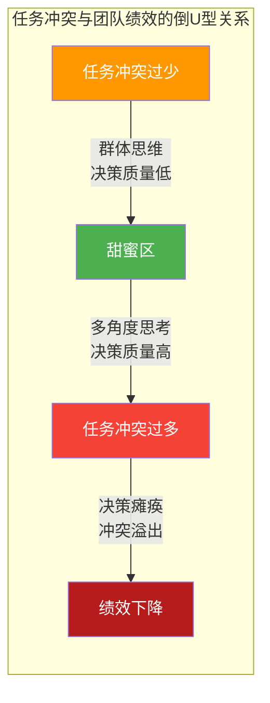
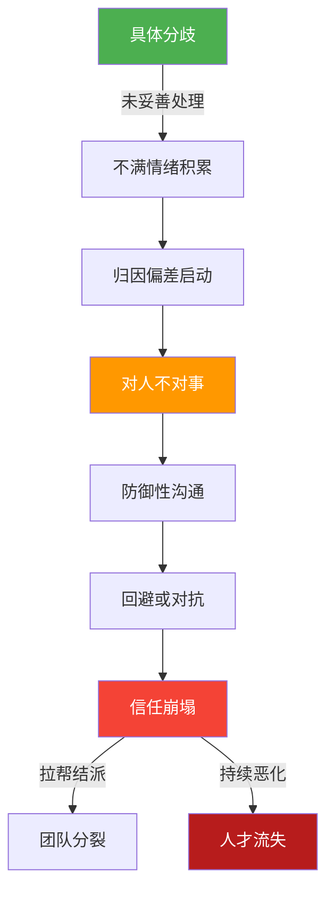
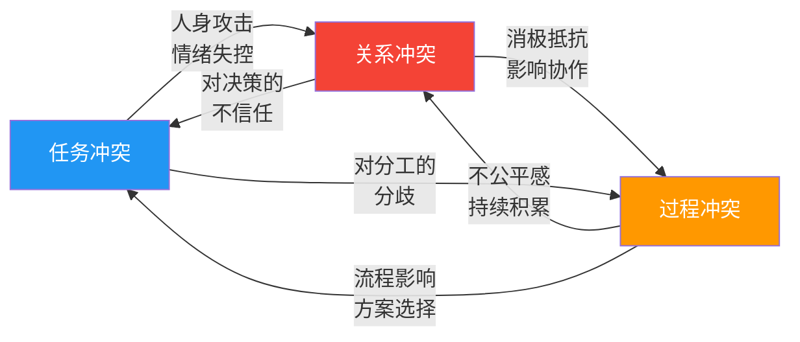
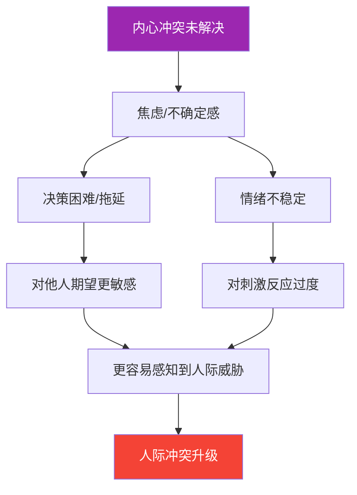
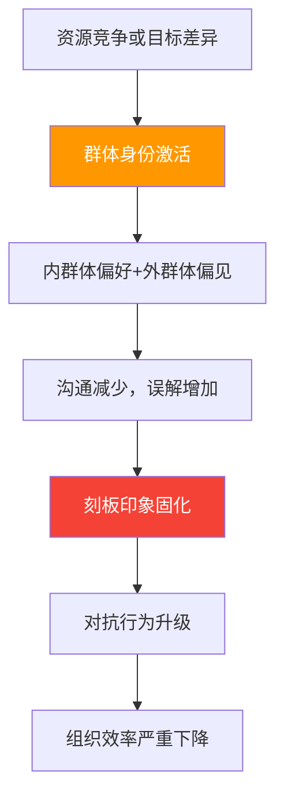
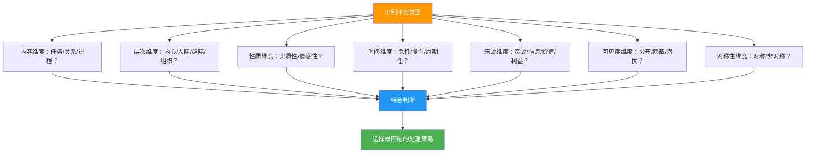

## 二、冲突的类型

冲突不是铁板一块的单一现象，而是一个有着丰富分类维度的复杂系统。不同的冲突类型有着截然不同的成因、动态演变规律和最优解法路径。如果把所有冲突都用同一种方式处理，就像用同一把钥匙开所有的锁——不仅打不开，还可能把锁弄坏。

本节将从三大分类维度——**按内容分类**、**按层次分类**、**按性质分类**——系统梳理冲突的完整类型体系，并为每种类型提供识别特征、演变规律、应对策略和真实案例。学完本节，你将具备快速判断冲突类型的能力，为后续选择正确的处理策略奠定基础。

### 2.1 按内容分类：任务冲突、关系冲突与过程冲突

这是冲突研究中最经典、实证基础最扎实的分类框架，由美国组织行为学家**凯伦·杰恩（Karen Jehn）**在1990年代系统提出，并在其后的二十余年中被大量实证研究所验证和扩展。杰恩的核心发现可以用一句话概括：**不同内容的冲突，对团队绩效的影响截然不同**。

#### 2.1.1 任务冲突（Task Conflict）

**定义**：围绕工作内容、目标、方案和决策等方面产生的分歧。核心争论点是"做什么"和"怎么做更好"。

**识别特征**：

| 特征维度 | 具体表现 |
|----------|----------|
| **讨论焦点** | 聚焦于工作方案、技术路线、策略选择等具体问题 |
| **情绪水平** | 通常较低，可以保持理性讨论 |
| **语言信号** | "我觉得这个方案不够好""我们是否考虑过另一种可能" |
| **行为信号** | 积极提出不同观点、引用数据和证据、主动参与讨论 |
| **持续性** | 随决策做出而消解，不易积累 |

**与绩效的关系——倒U型曲线**：

杰恩通过对多家企业团队的纵向研究发现，任务冲突与团队绩效之间呈**倒U型关系**。这个发现的重要性怎么强调都不为过：

- **任务冲突过少**：团队陷入"群体思维"（Groupthink）。成员为了避免摩擦而选择沉默或附和，决策质量下降。心理学家欧文·贾尼斯（Irving Janis）对猪湾事件的经典分析表明，肯尼迪内阁正是因为缺乏有效任务冲突而做出了灾难性决策。
- **任务冲突适中**：团队处于"甜蜜区"。不同观点的碰撞迫使团队重新审视假设、考虑替代方案、发现认知盲点。加州大学伯克利分校的研究表明，适度任务冲突的高管团队做出的战略决策质量比一团和气的团队高出约25%。
- **任务冲突过多**：团队陷入决策瘫痪。争论无休止、共识无法形成、执行效率急剧下降。更危险的是，过高的任务冲突容易"溢出"为关系冲突——"你怎么总是反对我的方案？"变成了"你怎么总是跟我作对？"

**"甜蜜区"的量化参考**：杰恩团队开发的任务冲突量表（4题，1-5分制）均分在2.5-3.5之间通常对应"甜蜜区"。低于2.0说明团队缺乏必要的争论，高于4.0则需要警惕冲突失控。当然，这个区间因行业和任务性质有所差异——创意行业可以容忍更高的任务冲突（约3.0-4.0），而安全敏感型行业（如航空、医疗）的最佳区间更窄（约2.0-3.0），因为过多争论会影响执行的果断性。

**区分"好的任务冲突"和"坏的任务冲突"**：

| 维度 | 建设性任务冲突 | 破坏性任务冲突 |
|------|---------------|---------------|
| **目标** | 寻找最优方案 | 证明自己是对的 |
| **态度** | 对观点持开放态度 | 固执己见，拒绝新信息 |
| **证据** | 用数据和逻辑支撑论点 | 用情绪和权威压制对方 |
| **语言** | "我看到另一种可能" | "你的想法根本行不通" |
| **结局** | 整合双方优势，产生更优方案 | 一方被压制，方案质量打折 |
| **关系影响** | 增进相互理解和尊重 | 消耗信任，积累怨气 |

**从建设性滑向破坏性的转折信号**：当讨论中出现以下任一迹象时，任务冲突正在向破坏性方向转变——①开始质疑对方的专业能力而非方案本身；②讨论从"这个方案有什么问题"变成"你为什么总是看不到问题"；③一方开始用沉默或敷衍代替积极反驳；④引入与当前议题无关的历史旧账。一旦出现这些信号，主持人应立即介入，将讨论拉回对事不对人的轨道。

**实操建议**：作为团队管理者，应该主动**制造**适度的任务冲突。具体方法包括：

- **魔鬼代言人制度**：每次重大决策前，指定一人专门负责提出反对意见和替代方案。关键在于角色轮换——如果总是同一个人扮演这个角色，会被贴上"刺头"标签，失去建设性意义。
- **预设反对意见**：在决策讨论开始前，要求每位成员在纸面上写下至少一条对首选方案的疑虑，然后匿名汇总讨论。这避免了"枪打出头鸟"的顾虑。
- **红队-蓝队对抗**：将团队分为两组，一组负责推进方案，另一组负责挑毛病。两组身份定期互换。这种方法在军事决策和科技公司的产品评审中被广泛使用。
- **沉默开场法**：会议开始后的前5-10分钟不允许发言，每人独立写下自己的观点和疑虑，然后同时展示。这防止了"先发言者锚定"效应，确保不同意见有机会浮出水面。

**关键规则**：冲突必须对事不对人，讨论中禁止出现对能力或动机的质疑。如果团队还没学会区分"批评方案"和"批评人"，先花时间建立这条基本规则，再引入任务冲突机制。

#### 2.1.2 关系冲突（Relationship Conflict）

**定义**：基于人际关系的摩擦、敌意和不和，核心焦点不是"事情怎么办"，而是"这个人让我不舒服"。

**识别特征**：

| 特征维度 | 具体表现 |
|----------|----------|
| **讨论焦点** | 从具体问题转移到对人的评价和攻击 |
| **情绪水平** | 高度情绪化，经常伴随愤怒、怨恨、焦虑 |
| **语言信号** | "你总是这样""你从来不考虑别人""他就是故意的" |
| **行为信号** | 翻旧账、冷暴力、散布流言、拉帮结派、回避接触 |
| **持续性** | 长期积累，难以根除，容易反复发作 |

**为什么关系冲突几乎总是有害的**：

关系冲突与团队绩效几乎总是**线性负相关**——关系冲突越强，绩效越差。原因在于关系冲突的认知和情感机制：

1. **认知资源消耗**：当一个人对同事心怀敌意时，大脑中用于处理威胁和负面情绪的杏仁核区域会持续活跃，占用大量认知带宽。本来用于思考工作问题的"脑力"被消耗在了处理情绪上。神经科学研究表明，强烈负面情绪可以使人的问题解决能力下降30-40%。

2. **归因偏差放大**：在关系冲突的背景下，人们倾向于用最恶意的方式解读对方的行为（"基本归因错误"的升级版）。同样是推迟提交报告，对关系良好的同事会想"他可能太忙了"，对关系紧张的同事则会想"他就是想让我难堪"。

3. **信息流动阻断**：关系紧张的双方会减少沟通频率和深度，即使沟通也会选择性传递信息。这直接导致协作质量下降。哈佛商学院的研究发现，存在关系冲突的团队中，成员之间的信息共享量平均下降45%，关键信息遗漏率上升60%。

4. **扩散效应**：关系冲突不会局限于当事人。它会通过"情绪感染"和"选边站队"扩散到整个团队，形成对立阵营。研究发现，一对成员之间的关系冲突平均会影响到团队中3-5个其他成员的工作状态。

**关系冲突的典型演变路径**：

**关系冲突的早期信号**（出现以下任何两项，就应该警惕）：

- 讨论中频繁使用"你总是""你从来不"等绝对化表述
- 在非工作场合不愿与对方接触或交流
- 开始在第三方面前抱怨或批评对方
- 对方的正常行为也开始引发不满
- 沟通变得越来越形式化，缺乏真实信息交换
- 回复对方消息的速度明显变慢，或只用最简短的文字
- 在对方发言时出现明显的非语言排斥信号（叹气、翻白眼、看手机）

**关系冲突的"锚点效应"**：关系冲突一旦形成，会产生一种"锚点效应"——即使后续发生了正面互动，也很难改变已经形成的负面印象。心理学中的"消极偏差"（negativity bias）表明，人类大脑对负面信息的权重约为正面信息的3-5倍。这意味着修复一段关系冲突所需的努力，大约是破坏这段关系所需努力的3-5倍。这解释了为什么"一次道歉就能解决"的想法几乎总是落空。

**紧急处理原则**：一旦识别出关系冲突的苗头，应立即采取以下行动——

1. **分开谈话**：分别与双方一对一沟通，了解各自的真实感受和诉求。注意：分开谈话不是"找谁对谁错"，而是理解双方各自经历了什么。
2. **重构框架**：帮助双方将"对方有问题"重新定义为"我们的关系出了问题"。前者暗示对方需要改变，后者暗示双方都有责任。
3. **找共同目标**：将注意力从人际对立转移到双方共同关心的目标上。比如"你们都不希望这个项目失败，对吗？"
4. **制定规则**：如果需要继续协作，明确规定沟通底线和行为边界。例如"有分歧当面说，不在第三面前议论对方"。
5. **必要时分离**：如果关系冲突已经严重到影响工作，暂时将双方分开是负责任的做法。强求两个已经互不信任的人继续密切协作，只会加速团队分裂。

#### 2.1.3 过程冲突（Process Conflict）

**定义**：关于如何完成任务、如何分配工作职责和如何使用资源的分歧。争论的焦点不是"做什么"（任务冲突），也不是"谁让我不爽"（关系冲突），而是"谁该做什么、怎么做、什么时候做"。

**识别特征**：

| 特征维度 | 具体表现 |
|----------|----------|
| **讨论焦点** | 工作流程、职责分工、资源分配、时间安排 |
| **情绪水平** | 中等，通常带有"不公平感"的情绪底色 |
| **语言信号** | "凭什么总是我做这个""为什么我不能用那个会议室""这个任务分配不公平" |
| **行为信号** | 对分配的消极抵抗、计较工作量、拖延配合 |
| **持续性** | 如果不解决结构性问题，会持续反复出现 |

**过程冲突的独特危险**：过程冲突最容易被忽视，但也最容易升级为关系冲突。因为过程冲突的核心感受是"不公平"，而持续的不公平感会迅速转化为对决策者或受益者的怨恨。

研究发现，团队中大约40%的关系冲突最初都起源于未被妥善处理的过程冲突。"为什么每次加班都是我？"这个问题如果反复出现且得不到回应，最终会变成"领导就是在针对我"。

亚当斯的公平理论（Equity Theory）可以解释这一转化机制：当一个人感知到自己的投入-产出比与参照对象不匹配时，会产生心理紧张。为了缓解这种紧张，个体可能采取以下行动之一——①减少投入（消极怠工）；②要求增加产出（争取更多回报）；③改变认知（说服自己"其实也还好"）；④更换参照对象（跟更差的人比）；⑤离开情境（离职或调岗）。如果前四种策略都失败了，过程冲突就会升级为关系冲突乃至人员流失。

**过程冲突的分级处理策略**：

| 冲突强度 | 表现 | 策略 |
|----------|------|------|
| **低** | 偶有抱怨，不影响执行 | 建立透明的分工轮换机制 |
| **中** | 公开表达不满，配合度下降 | 召开专题会议重新审视分工逻辑 |
| **高** | 消极抵抗或公开对抗 | 引入第三方评估，重新设计流程 |
| **极高** | 信任崩塌，协作停滞 | 需要更高层级介入进行组织调整 |

**过程冲突在不同场景中的表现**：

**场景一：项目团队**。一个5人项目组中，两名核心开发人员承担了80%的关键任务，而另外三人被分配了相对简单的辅助工作。核心开发人员感到过载和不公平，辅助人员感到被边缘化和不被信任。如果不及时调整，核心人员可能离职，辅助人员可能消极怠工。

**场景二：家庭分工**。夫妻双方都有全职工作，但家务和育儿责任的分配严重不均。一方承担了绝大部分家务劳动，另一方认为"我也在赚钱养家啊"。持续的不公平感是家庭冲突和婚姻满意度下降的首要预测因素之一。

**场景三：跨部门协作**。市场部发起一个紧急项目，需要技术部在两周内完成开发。技术部认为市场部"总是把烂摊子丢过来"，市场部认为技术部"永远在找借口推脱"。表面是资源冲突，实质是过程冲突——缺乏一个双方认可的跨部门项目排优先级的机制。

**预防过程冲突的制度设计**：

- **轮换机制**：重复性工作（如会议记录、值班安排、周报汇总）建立明确的轮换表，让每个人承担的机会均等
- **透明分配**：资源分配的标准和过程对所有人可见。例如，预算分配不是领导"拍脑袋"，而是基于明确的项目优先级和ROI评估
- **提前约定**：项目启动时就明确分工、流程和决策机制，写成书面文档并经所有相关方确认。"先说断，后不乱"
- **定期校准**：每两周或每月进行一次工作量和分工的回顾调整。不是等矛盾爆发了才改，而是制度化的定期检查
- **申诉渠道**：当团队成员对分工有异议时，有明确的渠道和流程可以表达和调整，而不是只能忍着或者闹情绪

#### 2.1.4 三种内容冲突的相互转化

任务冲突、关系冲突和过程冲突并非独立存在，它们之间可以相互转化。理解这种转化机制是冲突管理的关键能力之一。

**最危险的转化路径**是任何冲突向关系冲突的转化。一旦进入关系冲突，问题的性质就从"可以解决的"变成了"极难修复的"。因此，冲突管理的第一条防线就是：**在任务冲突和过程冲突阶段解决问题，阻止其向关系冲突蔓延**。

**转化的"催化剂"**：以下因素会加速冲突类型的转化——

| 催化剂 | 作用机制 | 防范措施 |
|--------|----------|----------|
| **情绪失控** | 一句冲动的话可以将任务讨论变成人身攻击 | 设立"暂停规则"：情绪激动时强制暂停讨论 |
| **第三方介入** | 拉帮结派、站队表态会将个体冲突群体化 | 限制冲突信息的传播范围 |
| **时间压力** | 紧迫的截止日期让人更容易失去耐心 | 在高压时期加强沟通频率和情绪管理 |
| **历史积怨** | 过去未解决的不满会在新冲突中被翻出来 | 及时处理小矛盾，不积累"情感债务" |
| **文化因素** | "面子"文化让公开的建设性冲突难以开展 | 创造安全的表达环境，如匿名反馈机制 |

#### 2.1.5 杰恩模型的自我诊断工具

以下问题可以帮助你评估团队或关系中的冲突状态。请对每项陈述进行1-5分评分（1=完全不符合，5=完全符合）：

**任务冲突量表**：
1. 团队成员会对工作方案提出不同意见
2. 不同观点之间的碰撞会促进更好的决策
3. 成员能够自由表达与多数人不同的看法
4. 讨论中经常出现对方案的深入质疑

**关系冲突量表**：
1. 团队成员之间存在明显的人际紧张
2. 成员之间有未公开的怨恨或敌意
3. 工作讨论中经常出现情绪化的冲突
4. 有些成员尽量避免与另一些成员接触

**过程冲突量表**：
1. 团队成员对职责分工经常有不同意见
2. 关于"谁该做什么"的争论很常见
3. 资源分配经常引发不满
4. 工作流程的执行标准不统一

**解读**：
- 任务冲突均分 > 3.0 且关系冲突均分 < 2.0：团队处于健康状态
- 关系冲突均分 > 3.0：无论其他两项得分如何，团队都需要紧急干预
- 过程冲突均分 > 3.5：需要审视团队的制度和流程设计
- 三项均分都 > 3.0：团队处于高冲突状态，需要系统性干预
- 任务冲突均分 < 1.5 且关系冲突均分 < 1.5：表面上"一团和气"，可能正处于群体思维的危险中

**使用建议**：每隔2-3个月对团队做一次匿名测量，追踪冲突状态的变化趋势。单次测量的价值有限，趋势数据才能揭示团队健康状况是在改善还是在恶化。将测量结果与团队绩效数据对照分析，找到你们团队独有的"甜蜜区"参数。

### 2.2 按层次分类：从内心到社会的冲突光谱

冲突存在于不同的层次上，从个体内部的心理张力，到两个个体之间的摩擦，再到群体、组织乃至社会层面的对抗。理解冲突的层次非常重要，因为不同层次的冲突需要完全不同量级的干预手段——一个人内心的价值排序问题，不是靠开协调会能解决的；两个组织之间的战略分歧，也不是靠个人沟通技巧能化解的。

#### 2.2.1 内心冲突（Intrapersonal Conflict）

**定义**：发生在个体内部的心理张力，源于相互矛盾的需求、价值观、目标或角色期望。

内心冲突是所有冲突中最隐秘但影响最深远的一种。它不一定有外在的争吵和对抗，但它会以焦虑、犹豫、内疚、拖延和决策困难的形式表现出来，并深刻影响一个人在人际冲突中的表现和选择。

**勒温的三类型模型**：

美国社会心理学家库尔特·勒温（Kurt Lewin）——场论的创始人——将内心冲突分为三种基本类型。这个模型虽然简洁，但具有强大的解释力：

| 冲突类型 | 心理特征 | 典型场景 | 情绪状态 |
|----------|----------|----------|----------|
| **趋近-趋近冲突** | 两个都有吸引力的选项之间难以取舍 | 同时收到两家心仪公司的offer；周末选择去看电影还是去郊游 | 纠结、犹豫，但总体情绪积极 |
| **回避-回避冲突** | 两个都不想要的结果之间必须选一个 | 在不满意的工作和失业之间选择；接受痛苦的治疗还是忍受疾病 | 焦虑、无助、想要逃避 |
| **趋近-回避冲突** | 同一个目标既有吸引力又有排斥力 | 升职意味着更高收入但也意味着更大压力；搬到新城市有更好的机会但要离开朋友 | 内心撕裂、反复摇摆、决策瘫痪 |

**趋近-回避冲突的特殊性**：

趋近-回避冲突是三种类型中最折磨人、也最常见的一种。心理学研究发现，当一个人越是接近目标，回避的倾向越强（因为代价变得越来越具体和现实），这导致一种"接近-退缩"的振荡行为模式。例如，一个人可能反复准备简历又放弃投递，下定决心要跟老板谈加薪又在门口退缩。

趋近-回避冲突在重大人生决策中尤为常见：是否离开一段不满意的婚姻、是否接受一份异地的高薪工作、是否创业还是继续打工。这些决策之所以痛苦，正是因为每个选项都同时包含"得到"和"失去"。

**第四种类型——双重趋近-回避冲突**：后续研究者在勒温的基础上补充了第四种类型——同时面对两个选择，每个选择都有利有弊。例如，A公司的offer薪资高但加班多，B公司薪资低但工作生活平衡好。这种冲突的决策难度最大，因为它需要在多个价值维度之间进行权衡。

**认知失调与内心冲突**：

费斯廷格（Leon Festinger）1957年提出的认知失调理论为理解内心冲突提供了另一个重要视角。当一个人同时持有两个矛盾的认知（信念、态度或行为）时，会产生心理不适，驱动个体去减少这种失调。

减少认知失调的常见策略包括：
- **改变认知**：说服自己"加班其实也没那么辛苦"（改变对加班的负面认知）
- **增加协调认知**：找到支持矛盾行为的理由（"虽然压力大，但升职后能学到更多东西"）
- **改变认为不重要的认知**：降低矛盾因素的重要性（"薪资差距其实没那么大"）
- **改变行为**：直接消除矛盾的根源（辞职不干了）

认知失调在冲突管理中的意义在于：很多内心冲突的"解决"并非真正解决了矛盾，而是通过改变认知或合理化来消解不适感。这种"假性解决"可能导致个体做出不理性的决策，或者将压抑的内心冲突转化为隐性的人际冲突。

**内心冲突对人际冲突的影响机制**：

**真实案例**：张经理同时面临两个相互矛盾的角色期望——上级要求他压缩团队预算以完成利润目标，下属期望他争取更多资源以改善工作条件。这种角色冲突使他在每次团队会议上都表现得犹豫不决，既不敢明确传达上级的削减指令（怕团队不满），也无法向团队承诺更多资源（明知拿不到）。时间一长，团队成员开始质疑他的领导力，上下级关系逐步恶化。张经理的内心冲突最终外化为了多层次的人际冲突。

**另一案例——价值观冲突导致的内心撕裂**：李医生在一家公立医院工作，医院要求科室提高"药占比"指标以通过评审，但这与她"以患者利益为先"的职业价值观产生了强烈冲突。执行指标意味着给患者开不必要的检查，不执行则面临科室考核不达标的压力。这种内心冲突使她在工作中越来越焦虑，与同事的关系也变得紧张——她开始质疑"为什么别人能心安理得地执行"，而同事则觉得她"太理想化，不懂现实"。内心的价值观冲突逐渐演变成了对同事的道德评判，进而发展为关系冲突。

**处理内心冲突的方法**：

1. **明确价值排序**：列出冲突中涉及的所有价值（如安全、成长、自由、关系），然后强制排序——什么对你最重要？很多时候，内心冲突的本质是"什么都想要"。当你明确"在这个人生阶段，成长比稳定更重要"时，很多决策会变得清晰。

2. **设定决策截止日**：趋近-回避冲突最大的敌人是无限拖延。给自己一个明确的决策日期。研究表明，有截止日期的决策者比没有截止日期的决策者对最终选择的满意度更高——即使做出的决定是相同的，前者因为减少了"在犹豫中消耗的时间成本"而获得更高的整体满意度。

3. **小规模试探**：如果条件允许，用小成本的实验来降低不确定性（如先去B公司实习一个月，或者在现有岗位上主动承担新方向的项目来测试自己是否真的喜欢）。

4. **寻求外部视角**：内心冲突容易陷入"思维反刍"（rumination）——同样的问题在脑子里反复转圈却找不到答案。一个信任的朋友或专业咨询师可以帮助你跳出循环。关键不是让别人替你做决定，而是通过对话帮你理清自己真正想要什么。

5. **接受不完美**：很多内心冲突的根源是追求"完美的选择"。接受"没有完美选项，只有当下最优选择"这一事实。心理学家巴里·施瓦茨（Barry Schwartz）的研究表明，"最大化者"（总想找到最好选项的人）比"满足者"（找到足够好的选项就行动的人）更容易焦虑、更难做出决策、做出决策后也更不满意。

6. **书写疗法**：将内心冲突的具体内容写下来——两个选项各自的利弊、你担心什么、你渴望什么。研究表明，书写能够激活大脑的前额叶皮层（负责理性思考），降低杏仁核的活跃度（负责情绪反应），从而帮助人在更冷静的状态下审视冲突。

#### 2.2.2 人际冲突（Interpersonal Conflict）

**定义**：发生在两个个体之间的冲突，是最常见、最贴近日常生活的冲突类型。

人际冲突可以发生在任何人际关系中——同事之间、上下级之间、夫妻之间、亲子之间、朋友之间、邻里之间。它可能源于沟通误解、性格差异、利益竞争、价值观对立、角色期望不一致等多种因素。

**人际冲突的核心特征**：

1. **高度个性化**：人际冲突深深嵌入特定的关系历史、个人性格和情感记忆中。同一类冲突在不同关系中的表现和解法可能完全不同。两个同事之间的"方案分歧"可能很快就解决，也可能因为过往的积怨而迅速升级——区别不在于分歧本身，而在于关系的"情感账户"中还有多少"余额"。

2. **情感与事实交织**：人际冲突中，事实层面的分歧和情感层面的不满总是缠绕在一起。单纯解决事实问题往往不够——即使事情"说清楚了"，情绪的余波还会持续影响关系。这就是为什么很多人在"把话说开"之后反而觉得更不舒服——事实层面的矛盾被解决了，但情感层面的伤害没有被处理。

3. **面子和尊严**：在中国文化语境中，人际冲突中的"面子"因素尤为突出。公开的争论、直接的批评、当众的拒绝都可能造成面子损失，从而将冲突从问题层面升级到尊严层面。社会学家胡先缙将中国人的"面子"区分为"脸"（道德层面的社会声誉）和"面子"（社会成就层面的地位）。在冲突中，"丢脸"比"丢面子"更严重——前者涉及道德评判，后者只是地位受损。因此，冲突管理中要特别注意不要触碰对方的道德底线。

4. **权力动态**：即使在表面上平等的关系中，也存在微妙的权力博弈——谁先让步、谁更需要这段关系、谁拥有更多的替代选择。社会交换理论（Social Exchange Theory）指出，人际关系可以被理解为一种资源交换，每个人都在评估关系的"成本"和"收益"。当一方感知到"我付出的比得到的多"时，冲突就产生了。

**人际冲突的五种常见模式**：

| 模式 | 表现 | 典型关系 |
|------|------|----------|
| **需求冲突** | 双方的需求互不兼容 | 一方需要独处空间，另一方需要陪伴 |
| **期望冲突** | 对对方行为的期望不一致 | 员工期望领导给予更多自主权，领导期望员工多请示汇报 |
| **价值观冲突** | 在是非对错的根本判断上分歧 | 父母认为学业最重要，孩子认为兴趣最重要 |
| **资源冲突** | 争夺有限的共同资源 | 两个项目负责人争夺同一个核心开发人员 |
| **沟通冲突** | 因表达方式或沟通风格差异导致的误解 | 一方认为直言不讳是真诚，另一方认为这是不尊重 |

**人际冲突中的"沟通风格差异"深度解析**：沟通冲突是最容易被低估的冲突类型，因为它看起来"不是什么大事"，但长期积累会造成严重的误解和不满。典型的风格差异包括：

- **直接型 vs. 间接型**：直接型的人喜欢开门见山，有问题直说；间接型的人习惯先说好消息再提问题，或者通过暗示来表达不满。当直接型遇到间接型，前者觉得后者"拐弯抹角，不知道在说什么"，后者觉得前者"太粗鲁，不懂人情世故"。
- **任务导向型 vs. 关系导向型**：任务导向型的人在沟通中聚焦于效率和结果；关系导向型的人更看重过程中的情感连接和被尊重的感觉。冲突由此产生：前者觉得后者"太啰嗦，浪费时间"，后者觉得前者"太冷漠，不近人情"。
- **高语境文化 vs. 低语境文化**：人类学家爱德华·霍尔（Edward Hall）提出的这个概念在跨文化人际冲突中尤为重要。高语境文化（如中国、日本）中，大量信息通过语境、暗示和非语言信号传递；低语境文化（如美国、德国）中，信息主要通过明确的语言传递。当来自不同语境文化背景的人沟通时，误解几乎不可避免。

**处理人际冲突的核心原则**：

- **先处理情绪，再处理问题**：在情绪高涨时讨论事实毫无意义，双方都听不进去。神经科学研究表明，当杏仁核被强烈情绪激活时，前额叶皮层（负责理性思考）的功能会被抑制。这就是为什么人在愤怒时会说出"明知不对"的话——理性大脑"断线"了。
- **对行为不对人**：批评具体行为（"这份报告有三处数据错误"），而不是批评人格（"你做事太不认真"）。前者是可改变的，后者是对人的全面否定。
- **倾听先于说服**：在表达自己之前，先确认你真正理解了对方的立场和感受。做到这一点的方法是"复述确认"——"你的意思是……对吗？"这不仅能减少误解，还能让对方感到被尊重。
- **寻找共同利益**：即使在表面上对立的立场背后，通常也有可以合作的共同利益。房东想涨房租，租客想降房租——但双方都希望房子维护得好、租赁关系稳定。从共同利益出发，谈判空间就打开了。

#### 2.2.3 群体间冲突（Intergroup Conflict）

**定义**：发生在两个或多个群体之间的冲突。这里的"群体"可以是部门、团队、派系、项目组、联盟等任何具有集体身份认同的人群集合。

群体间冲突比人际冲突更加复杂，因为群体冲突中不仅有个人因素，还有**群体动力学**在起作用。

**社会认同理论（Social Identity Theory）**：

亨利·泰菲尔（Henri Tajfel）和约翰·特纳（John Turner）提出的社会认同理论揭示了群体间冲突的心理根源。该理论的核心观点是：

1. **分类本能**：人类天生倾向于将人分为"我们"和"他们"，即使分类的标准是随机的（泰菲尔著名的"最小群体范式"实验表明，仅仅是随机分组就能引发群体偏好）
2. **内群体偏好**：人们倾向于对自己所属的群体产生积极评价，对群体成员给予更多信任、宽容和资源
3. **外群体偏见**：对非本群体的成员，人们倾向于夸大其同质性（"他们都一样"）、缩小其贡献（"那不算什么"）、以更负面的方式解读其行为

这意味着群体间冲突一旦形成，就会被**群体认同的力量放大**——个体会为了维护群体自尊而更加坚持对抗立场，即使个人层面并不完全认同。

**组织中群体间冲突的典型场景**：

- **部门墙**：销售部抱怨技术部响应太慢，技术部抱怨销售部不切实际地承诺客户。双方各自看到的是自己的困难（销售要应对客户的催促，技术要保证系统稳定），却看不到对方的困难。部门墙的根源往往不是"人不行"，而是组织结构将两个需要密切协作的部门放在了利益对立的位置上。
- **新老对立**：老员工认为新人不懂规矩、急于求变，新员工认为老员工思维僵化、抵制改革。这种冲突在组织变革期尤为突出。
- **总部与分部**：总部觉得分部执行不到位，分部觉得总部不了解一线实际情况。这种"中心-边缘"冲突在大型组织中几乎是结构性的。
- **项目组之间的资源竞争**：多个项目组争夺有限的技术骨干、服务器资源和预算。当"所有项目都是最高优先级"时，群体间冲突不可避免。
- **正式组织与非正式群体**：管理层的政策与员工非正式群体的"潜规则"之间的冲突。例如，公司规定打卡考勤，但员工群体内部默认"灵活上下班"。

**群体间冲突在中国组织中的特殊表现**：

中国组织中的群体间冲突有一些独特的文化特征。"关系"（guanxi）网络使得群体边界更加复杂——除了正式的部门和项目组划分，还有基于老乡、校友、师徒等非正式关系形成的"圈子"。这些圈子之间的资源竞争和权力博弈往往比正式的部门冲突更加隐蔽和持久。

此外，中国组织中的"山头主义"现象——各部门领导形成相对独立的利益集团，争夺组织资源和话语权——是群体间冲突的制度化表现。解决这类冲突需要的不是沟通技巧，而是组织结构和治理机制的调整。

**群体间冲突的升级机制**：

**管理群体间冲突的有效策略**：

1. **共同目标法（超级目标策略）**：设置一个需要双方合作才能达成的更高层级目标。经典的"强盗洞穴实验"（Sherif, 1961）证明，只有通过超级目标的协作才能有效化解已经形成的群体间敌意。在组织中的应用：当销售部和技术部闹矛盾时，设置一个双方共享的客户满意度指标，将两个部门的绩效捆绑在一起。

2. **人员轮换**：让不同群体的成员定期交叉工作，增加外群体成员的个体化认知（"他们不是铁板一块"）。研究表明，仅需2-4周的交叉工作经历，就能显著降低对外群体的偏见。

3. **跨群体沟通机制**：建立定期的跨部门会议、联合工作坊等正式沟通渠道。关键是这些沟通不能只是"汇报工作"，要有真正的双向交流和问题解决环节。

4. **去分类化**：强调个体差异，避免用群体标签定义个人（"不是所有销售都那样""技术部的张工其实很配合"）。当人们开始将外群体成员视为独立个体而非群体代表时，偏见会显著减少。

5. **接触假说的应用**：心理学家戈登·奥尔波特（Gordon Allport）的接触假说指出，在特定条件下，不同群体成员之间的直接接触可以减少偏见。有效接触的四个条件是：①平等地位；②共同目标；③合作关系；④制度支持。

#### 2.2.4 组织冲突（Organizational Conflict）

**定义**：发生在组织层面的系统性冲突，通常涉及组织结构、制度政策、权力分配和战略方向等方面。

组织冲突不同于个体和群体冲突，它往往是**结构性的**——不是某个人或某个群体的问题，而是组织设计本身制造了冲突的土壤。

**组织冲突的典型类型**：

| 类型 | 描述 | 案例 |
|------|------|------|
| **结构性冲突** | 组织架构设计导致的部门利益对立 | 矩阵式组织中项目经理和职能经理的管辖权冲突 |
| **制度性冲突** | 制度规则之间的矛盾或漏洞 | 绩效考核制度鼓励个人竞争，但业务目标要求团队协作 |
| **变革冲突** | 组织变革中新旧体系的碰撞 | 数字化转型中传统业务线与新兴业务线的资源争夺 |
| **文化冲突** | 组织亚文化之间的不兼容 | 并购后两家公司的管理风格和价值观难以融合 |
| **战略冲突** | 对组织发展方向的根本性分歧 | 激进派主张快速扩张，稳健派主张深耕现有市场 |
| **代际冲突** | 不同年龄层员工的价值观和工作方式差异 | Z世代重视工作生活平衡，70后80后推崇"996奋斗文化" |

**组织冲突的深层结构分析**：

组织冲突的根源往往比表面看到的要深得多。以"部门墙"为例，表面看是两个部门的人"合不来"，但如果深挖就会发现：

1. **KPI设计冲突**：销售部的KPI是"签单量"，技术部的KPI是"系统稳定性"。签单越多意味着需求越多，需求越多意味着系统变更越频繁，系统变更越频繁意味着稳定性风险越大。两个部门的KPI在制度设计层面就是对立的。

2. **信息不对称**：销售掌握客户需求信息，技术掌握系统能力信息，但两个信息池之间没有打通的机制。信息不对称导致双方都在"基于不完整信息做判断"。

3. **激励错位**：签单成功的销售获得高额提成，但为这个单子加班的技术人员只有固定的项目奖金。激励机制鼓励了"抢资源"行为而非"协作"行为。

这种结构性分析的价值在于：它将问题从"人"的层面提升到"系统"的层面，解决方案也从"让大家好好沟通"升级为"重新设计KPI、打通信息流、调整激励机制"。

**组织冲突的诊断框架**：当组织中反复出现类似的冲突模式时，不要只从个体层面找原因，要审视组织设计：

1. **目标是否一致**：不同部门的KPI是否相互矛盾？
2. **资源是否充足**：冲突是否源于结构性的资源匮乏？
3. **职责是否清晰**：是否有灰色地带导致"都可以管"或"都没人管"？
4. **激励是否对齐**：奖励机制是鼓励合作还是鼓励竞争？
5. **沟通是否通畅**：是否存在信息孤岛导致的误解？
6. **权力是否制衡**：是否存在不受约束的权力导致的滥用？
7. **变革是否配套**：组织变革时是否同步调整了结构、制度和文化？

#### 2.2.5 社会冲突（Social Conflict）

**定义**：发生在社会层面的大规模冲突，涉及不同的社会群体、阶层、族群或利益集团之间的对抗。

虽然本书的重点是沟通中的冲突管理，但理解社会冲突对于个人和组织来说同样重要，因为社会冲突的逻辑和机制往往会渗透到组织和人际层面。

**社会冲突的主要类型**：

| 类型 | 核心矛盾 | 当代表现 |
|------|----------|----------|
| **阶层冲突** | 不同社会阶层之间的利益对立 | 收入差距扩大、教育资源不均、住房问题 |
| **价值冲突** | 传统价值观与现代价值观的碰撞 | 个人主义vs.集体主义、自由vs.安全 |
| **身份冲突** | 基于性别、年龄、地域等身份的对立 | 性别议题的极化、代际观念差异 |
| **资源冲突** | 对公共资源的竞争 | 区域发展不平衡、环境与发展的矛盾 |

**社会冲突对个人生活的影响**：社会冲突不是遥远的宏观现象，它会通过社交媒体、公共舆论和社区环境直接影响个人的心理状态和人际关系。例如，当社会上出现热点争议事件时，朋友圈可能因此分裂；代际价值观差异可能直接导致家庭内部的冲突升级。认识到这一点，有助于在处理人际冲突时将"大环境"因素纳入考量。

### 2.3 按性质分类：实质性冲突与情感性冲突

这个分类维度关注的是冲突的"质地"——争论的核心到底是关于具体事物和可衡量利益，还是关于情感体验和心理需求。

#### 2.3.1 实质性冲突（Substantive Conflict）

**定义**：围绕具体的、客观的事物、问题或利益展开的冲突，具有明确的焦点和可衡量的标准。

**特征**：
- 焦点清晰："我们争论的就是合同第七条的措辞"
- 标准客观：可以通过数据、规则、法律或事实来裁量
- 范围可控：通常限于特定议题，不易泛化
- 解决路径明确：有具体的谈判空间和妥协余地

**典型场景**：
- 薪资谈判中的具体数字分歧
- 合同条款的修改和解释争议
- 项目预算和资源分配方案的选择
- 产品功能优先级的排序争论
- 两个部门对同一笔预算的使用权争夺
- 商业合作中利润分成比例的谈判

**实质性冲突的处理优势**：相比情感性冲突，实质性冲突通常更容易解决，因为它有"锚点"——双方可以围绕具体的利益进行交换、妥协或创造性整合。

**实质性冲突的解决策略**：

1. **利益整合**（Win-Win）：找到双方都能接受的创造性方案。经典案例——两个孩子争一个橙子，一个想要橙皮做蛋糕，一个想要橙汁喝。表面看只有一个橙子，实际上需求可以同时满足。在商业谈判中，这种"将饼做大"的策略往往能带来双方都满意的结果。

2. **妥协折中**（Split the Difference）：双方各让一步，取中间值。这种方法快速有效，但可能不是最优解——双方都不是完全满意，也可能损失了整合方案中的额外价值。

3. **客观标准裁决**：引入双方都认可的第三方标准来判断。例如，合同争议可以参照法律条文，薪资争议可以参照市场行情，技术争议可以参照行业标准或权威测试数据。

4. **轮流优先**：当两个需求交替出现时，可以用轮流满足的方式解决。例如，今年的培训预算先满足A部门的紧急需求，明年优先满足B部门。

**实质性冲突可能隐藏的情感内核**：这是很多冲突管理者容易忽略的关键点。当一方在实质性问题上的坚持程度明显超出理性范围时，几乎可以确定背后有情感因素在驱动。

例如，一位员工在年终奖的金额上异常固执——比同事少了500元就坚决不接受。从理性角度看，500元不值得为此闹翻。但从情感角度看，这500元可能代表的是"我的贡献不被认可""领导偏心""我在这个团队没有地位"。单纯解决金额问题（给他加500元）并不能解决真正的问题——他需要的是被公平对待的感觉。

识别实质性冲突背后的情感内核的方法：
- **观察情绪强度**：如果对方在某个问题上的愤怒/沮丧程度明显超过问题本身的严重性，背后可能有更深的情感因素
- **追问"为什么重要"**：连续问3-5个"为什么"（"5个为什么"法），通常能挖到真正的需求层
- **注意"转移"现象**：当对方开始在讨论中引入与当前议题无关的旧事或旧怨，说明当前的冲突可能触发了更深层的不满

#### 2.3.2 情感性冲突（Affective Conflict）

**定义**：源于情感层面的不满、怨恨、嫉妒或不信任的冲突，往往没有明确的焦点，容易在不同议题之间漂移。

**特征**：
- 焦点模糊："我说不上来具体哪里不对，就是觉得不舒服"
- 主观性强：同样的行为，对信任的人可以容忍，对不信任的人则无法接受
- 范围容易扩散：从一件事蔓延到整个关系
- 解决路径模糊：无法通过简单的利益交换来消除

**情感性冲突为什么更难解决**：

情感性冲突涉及的是人的**深层心理需求**——被尊重的需求、被认可的需求、安全感的需求、归属感的需求。这些需求不像薪资数字那样可以量化和交换。你不能通过"多给对方两千块钱"来解决"他觉得不被尊重"的问题。

马斯洛需求层次理论在此提供了分析框架：实质性冲突通常发生在"生理需求"和"安全需求"层面（薪资、资源、工作条件），而情感性冲突通常涉及"社交需求""尊重需求"和"自我实现需求"（归属感、被认可、个人价值感）。需求层次越高，越难以通过物质手段满足，越需要关系层面的修复和重建。

**情感性冲突的常见根源**：

1. **信任破裂**：一方违背了承诺、泄露了秘密或在关键时刻没有提供支持。信任一旦破裂，修复的难度远超想象——研究表明，信任的建立需要数十次正面互动，但破坏只需要一次背叛。

2. **被忽视或不被重视**：在团队中长期感到自己的贡献不被看到、意见不被听取。这种情感冲突的危险在于它的积累性——每一次被忽视都是一个微小的伤害，长期累积后会形成"你从来不在乎我"的整体判断。

3. **嫉妒与不公平感**：当一个人感知到他人获得了自己认为应得的东西（晋升、奖金、关注）时，嫉妒和怨恨就会产生。嫉妒不同于正常的竞争意识——嫉妒的隐含假设是"对方不配"，而竞争意识的假设是"我也想要"。

4. **权力与控制**：一方试图控制另一方的行为、决策或信息获取，而另一方感到自主权被侵犯。这种冲突在上下级关系中尤为常见。

5. **身份威胁**：当一个人的核心身份（职业身份、文化身份、性别身份等）受到质疑或否定时，会引发强烈的情感冲突。例如，一位资深工程师被一位年轻管理者要求按照流程办事，可能将其解读为"你在质疑我的专业能力"。

**实质性冲突与情感性冲突的对比**：

| 维度 | 实质性冲突 | 情感性冲突 |
|------|-----------|-----------|
| **焦点** | 具体问题或利益 | 模糊的感受和体验 |
| **可衡量性** | 高，有客观标准 | 低，高度主观 |
| **解决方式** | 谈判、妥协、规则裁量 | 信任修复、情感表达、关系重建 |
| **持续性** | 随问题解决而消解 | 可能长期存在，反复触发 |
| **升级风险** | 中等 | 高，容易泛化 |
| **沟通需求** | 信息交换为主 | 情感表达和共情为主 |
| **时间维度** | 可以快速解决 | 需要较长时间修复 |
| **第三方角色** | 仲裁者、裁判 | 调解者、治疗者 |

**情感性冲突的解决路径**：

1. **承认情感的合理性**：不要试图告诉对方"你不应该有这种感觉"。情感没有对错，只有存在与否。"我能理解你为什么会感到不被尊重"这句话本身就是修复的开始。

2. **创建安全的表达空间**：情感性冲突需要一个安全的环境来表达和被听见。这意味着：不打断、不辩解、不评判。先听完，再回应。

3. **共情式倾听**：不是简单地听对方说了什么，而是理解对方为什么这么说、这么说背后的感受是什么。"你听起来觉得自己的付出没有被看到，这种感觉确实很不好受"——这是共情，而不是"我知道了，以后我会注意"（这是敷衍）。

4. **行为改变**：情感性冲突的最终解决必须落实到行为的改变上。光说"我会改"没有用，对方需要看到切实的行为变化才能重建信任。这需要时间，也需要持续的努力。

5. **建立新的互动模式**：旧的冲突模式形成了习惯性的互动路径（"他又来了"），需要刻意建立新的、正向的互动模式来替代。例如，定期进行正面反馈、主动分享信息、在小事上兑现承诺。

**关键认知**：很多看似"实质性"的冲突，背后隐藏着"情感性"的内核。当一个人对合同条款的修改意见异常强烈时，可能不是因为条款本身的问题，而是因为"你没有提前跟我商量让我觉得不被尊重"。识别表面冲突背后的真实情感需求，是冲突管理的高级能力。

**诊断方法**：当冲突中的情绪强度明显超出问题本身的严重程度时，几乎可以确定情感性因素在起作用。另一个信号是——当实质性问题已经解决但对方仍然不满意或不愿和解时，说明情感层面的问题还没有被触及。第三个信号是"问题漂移"——讨论一个问题时对方突然跳到另一个似乎不相关的问题上，这说明有多个未解决的情感积怨在同时起作用。

### 2.4 其他重要分类维度

除了上述三大分类体系外，还有几种在特定场景中非常有用的分类维度。这些维度补充了前文的分析框架，帮助你从更多角度理解冲突的全貌。

#### 2.4.1 按来源分类

理解冲突的来源是制定有效应对策略的前提。以下六种来源几乎涵盖了人际和组织冲突的所有根源：

| 冲突类型 | 来源 | 典型场景 | 核心解决思路 |
|----------|------|----------|------------|
| **资源型冲突** | 争夺有限的物质或非物质资源 | 预算分配、晋升名额、设备使用权、会议室预约 | 扩大资源总量、建立分配规则、提高资源利用效率 |
| **信息型冲突** | 信息不对称或认知差异 | 不同部门基于不同数据得出不同结论；一方掌握另一方不知道的关键信息 | 建立信息共享机制、引入第三方数据、消除信息孤岛 |
| **价值型冲突** | 深层信念和原则的对立 | 效率优先还是公平优先；保守还是创新；短期利润还是长期价值 | 明确共同价值观、划定"不可谈判"的底线、建立价值优先级 |
| **利益型冲突** | 利益诉求直接对立 | 薪资谈判、商业竞争、合同条款、利润分配 | 利益整合、创造性交换、引入客观标准 |
| **结构型冲突** | 制度、流程或组织设计的缺陷 | 矩阵式组织中的双重汇报关系；KPI相互矛盾；权责不清 | 重新设计组织结构、修订制度、明确权责边界 |
| **沟通型冲突** | 表达方式或沟通渠道不当 | 用文字消息讨论敏感话题导致误解；文化差异导致的沟通风格冲突 | 选择合适的沟通渠道、建立沟通规范、提升沟通技能 |

**信息型冲突的深度解析**：在数字化时代，信息型冲突正在成为最常见的冲突来源之一。信息爆炸并没有减少冲突，反而可能加剧了冲突——因为每个人接触到的信息不同，基于不同信息得出的结论也不同。

信息型冲突的典型模式：
- **数据孤岛**：销售看CRM系统的客户数据，产品看埋点系统的用户行为数据，两个数据源的口径不一致，得出的结论自然矛盾。
- **信息过载**：在海量信息中，人们倾向于选择性接收符合自己已有观点的信息（确认偏误），导致"明明是同一个事实，两个人得出完全相反的结论"。
- **信息时差**：一方基于最新的信息做决策，另一方基于过时的信息提出反对。在快速变化的环境中，信息的不同步会制造大量假性冲突。

**价值型冲突的特殊性**：价值型冲突是最难解决的冲突类型之一，因为价值观是一个人最深层的心理结构，改变价值观几乎等于改变一个人的核心自我。价值型冲突的处理原则不是"说服对方接受我的价值观"，而是"在价值观不同的前提下找到共存的方式"。

在组织中，价值型冲突的典型表现：
- **效率 vs. 公平**：追求效率的团队成员倾向于"能者多劳、多劳多得"，追求公平的团队成员倾向于"机会均等、差距缩小"。这两种价值观在资源分配和激励制度上会直接碰撞。
- **创新 vs. 稳定**：激进创新者认为"不冒险就不会有突破"，稳健保守者认为"稳扎稳打才能走得远"。这两种价值观在战略决策上会产生根本分歧。
- **个人 vs. 集体**：强调个人权利的人认为"我的时间我做主"，强调集体利益的人认为"团队目标高于个人偏好"。

#### 2.4.2 按时间维度分类

冲突的时间特征直接决定了处理策略的选择。急性冲突和慢性冲突需要完全不同的干预方式。

| 类型 | 特征 | 处理难点 | 最佳策略 |
|------|------|----------|----------|
| **急性冲突** | 突然爆发，有明确触发事件 | 需要快速响应，防止升级 | 快速介入、降温、解决触发事件 |
| **慢性冲突** | 长期存在，缓慢积累 | 需要系统性干预，不能头痛医头 | 结构性改革、制度重建、长期关系修复 |
| **周期性冲突** | 在特定条件下反复出现 | 需要找到循环的规律并打破它 | 识别触发模式、预防性干预、改变条件 |
| **一次性冲突** | 由特定事件引起，不涉及深层矛盾 | 妥善解决后通常不会复发 | 就事论事、快速处理、不留尾巴 |

**慢性冲突的识别与干预**：慢性冲突是最容易被忽视、也最具破坏力的时间类型。因为它的爆发强度不高（不像急性冲突那样引人注目），但持续时间很长，像"温水煮青蛙"一样慢慢侵蚀关系和团队效能。

慢性冲突的典型信号：
- 每次讨论某个话题时气氛就会变得微妙
- 某两个人之间的合作总是"不太顺畅"但也没有大的爆发
- 在某些议题上形成了固定的"站队"格局
- 会议上某些人对某些议题总是沉默

慢性冲突的干预不能靠"一次性谈话"，需要结构性的改变——可能是调整分工、改变沟通机制、引入新的协作流程，甚至调换岗位。

**周期性冲突的模式识别**：周期性冲突的特征是在特定条件触发下反复出现。例如，每到季度末销售冲刺期，销售部和技术部就会爆发冲突；每到年终绩效评估期，团队内部的气氛就会变得紧张。

识别周期性冲突的关键是找到"触发条件"——可能是时间节点（季末、年末）、事件类型（预算审批、绩效评估）、人员组合（某些人同时出现在一个项目中）或外部环境（市场压力增大时）。一旦识别出触发条件，就可以实施预防性干预——在触发条件出现之前就采取行动，而不是等到冲突爆发后再救火。

#### 2.4.3 按可见度分类

冲突的可见度是影响其处理策略的关键维度。看得见的冲突好处理，看不见的冲突才是真正的挑战。

| 类型 | 特征 | 风险 | 干预方式 |
|------|------|------|----------|
| **公开冲突** | 双方都知道冲突存在并公开对抗 | 可能升级，但也有机会被解决 | 正式调解、协商、仲裁 |
| **隐蔽冲突** | 一方或双方知道冲突存在但不公开表达 | 更危险——因为无法解决的问题在暗处持续积累 | 创造安全的表达环境、一对一沟通、匿名反馈 |
| **潜伏冲突** | 冲突的条件已经具备但尚未触发 | 预防性介入成本最低 | 主动排查隐患、调整制度、提前沟通 |

**隐蔽冲突的特殊危险**：在集体主义文化中（如中国），很多冲突以隐蔽的形式存在——表面上客客气气，背后暗流涌动。隐蔽冲突比公开冲突更难处理，因为它没有被"摆到桌面上"的机会。

隐蔽冲突在中国组织中的典型表现：
- **阳奉阴违**：表面上同意领导的安排，实际执行时消极应付或故意走样
- **冷暴力**：不直接对抗，但通过不配合、不沟通、不支持来表达不满
- **旁敲侧击**：不在当事人面前说，而是通过第三方传话或在私下场合表达不满
- **消极抵制**：用"按流程走""我需要再确认一下"等合理理由拖延或阻碍

管理者需要通过观察非语言信号（配合度下降、会议中的沉默、私下抱怨增加、信息传递变慢）来识别隐蔽冲突的存在。

**将隐蔽冲突转化为公开冲突的技巧**：

1. **匿名调研**：通过匿名问卷收集团队成员对协作关系的真实感受，用数据呈现问题的存在
2. **一对一对话**：在私密的环境中与当事人单独沟通，用开放式问题引导表达："你觉得目前团队协作中最大的挑战是什么？"
3. **观察行为**：不只听对方说什么，更要看对方做什么——配合度、响应速度、主动提供信息的频率等行为指标比语言更诚实
4. **营造安全氛围**：通过领导者自身的示范（承认自己的错误、接受下属的质疑）来建立"说真话不会有惩罚"的文化

#### 2.4.4 按对称性分类

冲突双方的权力关系对冲突的动态和解决策略有重大影响。

| 类型 | 特征 | 典型场景 | 处理要点 |
|------|------|----------|----------|
| **对称冲突** | 双方权力地位相当 | 同级同事之间、势均力敌的商业谈判 | 可以用对等协商、妥协折中 |
| **非对称冲突** | 双方权力地位不对等 | 上下级之间、大公司与小供应商 | 弱势方需要策略，强势方需要克制 |
| **虚幻对称** | 表面平等实际不对等 | 形式上的"民主讨论"但实际由一人拍板 | 识别真正的权力结构，避免形式主义 |

**非对称冲突中弱势方的策略**：

当你的权力地位低于冲突对方时，直接对抗通常不是最优选择。以下是弱势方可以采取的策略：

1. **联盟策略**：寻找其他有类似诉求的人或部门，形成集体力量
2. **理性说服**：用数据、案例和逻辑而非情绪来支撑自己的立场
3. **向上借力**：如果可能，获得更高层级的支持或关注
4. **选择战场**：不是所有冲突都值得打——选择对你最重要的议题投入精力
5. **长期布局**：通过持续的出色表现积累"信用资本"，为未来的谈判增加筹码

**非对称冲突中强势方的责任**：

权力越大，冲突管理的责任越大。强势方需要特别注意：

1. **主动征求意见**：不要等到弱势方鼓起勇气来挑战你，而是主动邀请不同意见
2. **抑制权力的副作用**：权力会让人倾向于忽视他人感受、低估他人贡献——有意识地对抗这种倾向
3. **为弱势方创造安全空间**：明确表示"不同意见不会影响你的考评和晋升"
4. **公平程序**：即使结果不能完全公平，至少程序要公平——被公平对待的人更容易接受不利的结果

### 2.5 数字时代的冲突新形态

数字化工具在改变工作方式的同时，也在改变冲突的形态和特征。理解这些新变化对于当代冲突管理至关重要。

#### 2.5.1 远程协作中的冲突

远程和混合办公模式带来了一系列新的冲突类型和特征：

**沟通冲突的加剧**：文字消息（微信、钉钉、Slack）丢失了非语言信号（表情、语调、肢体语言），导致误解率大幅上升。心理学研究表明，文字沟通中的情绪识别准确率仅为约56%，远低于面对面沟通的约78%。这意味着在文字沟通中，接近一半的信息可能被误读。

远程协作中的常见冲突场景：
- **异步沟通的误解**：一条简短的文字消息被对方理解为"态度冷淡"或"不重视"
- **摄像头开关之争**：一方认为"开摄像头是基本礼貌"，另一方认为"关摄像头是保护隐私"
- **在线时长焦虑**：管理者通过"在线状态"判断员工是否在工作，员工感到被监视
- **信息过载与遗漏**：群消息太多导致关键信息被淹没，事后因为"没看到"而产生冲突

#### 2.5.2 社交媒体时代的冲突

社交媒体创造了全新的冲突场域：

| 特征 | 传统冲突 | 社交媒体冲突 |
|------|----------|------------|
| **范围** | 局限于当事人和有限的旁观者 | 可能被无限放大，形成"网络围观" |
| **节奏** | 有时间缓冲和冷静期 | 即时传播，情绪快速升级 |
| **记录** | 口头争论过后容易淡化 | 文字记录永久存在，容易被翻出来 |
| **身份** | 知道对方是谁 | 匿名性降低攻击的心理成本 |
| **退出** | 可以物理离开冲突场景 | 算法推送让人难以"逃离"冲突信息 |

社交媒体冲突对个人的影响：即使你没有直接参与网络争论，仅仅是围观高强度的网络冲突也会消耗心理能量。研究表明，频繁接触网络冲突信息会增加个体的焦虑感和对他人的不信任感，间接影响线下的人际关系。

### 2.6 冲突类型识别的综合模型

在实际场景中，一次冲突往往同时涉及多个分类维度。一个完整的冲突类型判断应该同时回答以下问题：

**综合诊断示例**：

> 销售部和技术部因为一个大客户的需求能否实现发生了激烈争论。销售说技术部太保守，技术部说销售部乱承诺。
>
> - **内容维度**：表面是任务冲突（技术方案是否可行），实际混入了过程冲突（谁有权决定接什么客户）和关系冲突（双方长期积累的不满）
> - **层次维度**：群体间冲突
> - **性质维度**：表面是实质性冲突（技术可行性），深层有情感性因素（"你们总是不尊重我们的判断"）
> - **时间维度**：慢性冲突（长期存在），当前由急性事件触发
> - **来源维度**：多来源——信息不对称（销售不了解技术约束）、结构缺陷（缺乏跨部门决策流程）、沟通障碍（用邮件讨论复杂问题）
> - **对称性维度**：表面上对称（两个部门级别相同），实际上取决于组织中谁的话语权更大
>
> **处理策略**：不能只解决表面的技术分歧，需要同时——①建立跨部门的需求评估流程（解决结构问题）；②组织面对面沟通会议（解决沟通问题）；③分别与双方负责人谈话处理关系层面的积累（解决情感问题）；④修订两个部门的KPI使其对齐（解决制度问题）。

**综合诊断的实操清单**：

面对任何一个冲突场景，用以下清单快速完成多维度判断：

1. **他们在争什么？** → 内容维度（任务/关系/过程）
2. **冲突发生在什么层面？** → 层次维度（内心/人际/群际/组织/社会）
3. **争的是事还是感觉？** → 性质维度（实质性/情感性）
4. **冲突是突然爆发还是长期积累？** → 时间维度（急性/慢性/周期性）
5. **根本原因是什么？** → 来源维度（资源/信息/价值/利益/结构/沟通）
6. **冲突是在台面上还是台面下？** → 可见度维度（公开/隐蔽/潜伏）
7. **双方的力量对比如何？** → 对称性维度（对称/非对称）

完成这七个问题的判断后，你对冲突的"画像"就基本完整了，接下来就可以选择最匹配的处理策略。

### 2.7 常见误区

| 误区 | 真相 | 后果 |
|------|------|------|
| "所有冲突都一样，用一种方法解决就行" | 不同类型的冲突需要完全不同的策略 | 用错策略导致冲突加剧 |
| "关系冲突可以靠一次谈话修复" | 信任的重建需要持续的行为改变和时间 | 表面和解，暗流不断 |
| "过程冲突不重要，做好自己就行" | 过程冲突是关系冲突的最大温床 | 小不满积累成大爆发 |
| "群体冲突就是两个领导的问题" | 群体动力学会放大个人层面的冲突 | 只调换了领导，冲突依然存在 |
| "隐蔽冲突不用管，没爆发就好" | 隐蔽冲突在暗处持续积累，爆发时更加剧烈 | 错失最佳干预窗口 |
| "实质性冲突和情感性冲突是分开的" | 表面的实质分歧往往掩盖深层情感需求 | 只解决表面问题，根源未动 |
| "任务冲突越多越好" | 任务冲突与绩效呈倒U型关系 | 冲突过多导致决策瘫痪 |
| "冲突是坏事，应该尽量避免" | 适度的建设性冲突是团队健康的标志 | 缺乏冲突导致群体思维 |
| "面对面沟通能解决一切冲突" | 某些冲突（如结构性冲突）需要制度层面的解决 | 浪费时间在无效沟通上 |
| "冲突类型是固定的" | 冲突可以并且经常在不同类型之间转化 | 忽视转化信号导致冲突升级 |

### 2.8 本节核心要点

1. **按内容分类**是冲突研究中最经典的框架：任务冲突适度有益、关系冲突几乎总是有害、过程冲突最容易被忽视也最容易升级为关系冲突
2. **任务冲突与绩效呈倒U型关系**——太少导致群体思维，太多导致决策瘫痪，适度才是"甜蜜区"
3. **按层次分类**揭示了冲突的规模量级——内心冲突需要自我认知，人际冲突需要沟通技巧，群体冲突需要制度设计，组织冲突需要系统性重构
4. **实质性冲突和情感性冲突**的关键区别在于：前者可以通过利益交换解决，后者需要信任修复和情感表达
5. **冲突类型不是静态标签**——任务冲突可能升级为关系冲突，过程冲突是关系冲突的最大温床
6. **综合诊断**是实战能力——一次冲突通常同时涉及多个维度，需要多维判断才能选择正确的处理策略
7. **隐蔽冲突比公开冲突更危险**——在集体主义文化中尤其如此，需要通过非语言信号来识别
8. **数字时代**改变了冲突的形态——远程协作和社交媒体让误解更容易产生、冲突更容易升级、影响范围更难控制
9. **对称性**影响冲突策略——弱势方需要联盟和理性说服，强势方需要克制和主动征求意见

掌握冲突类型的系统分类，是精准施治的前提。接下来我们将深入探讨冲突产生的根本原因，理解"为什么会产生这些不同类型的冲突"。

***
