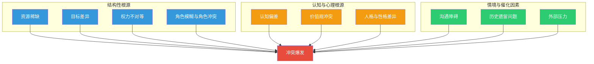
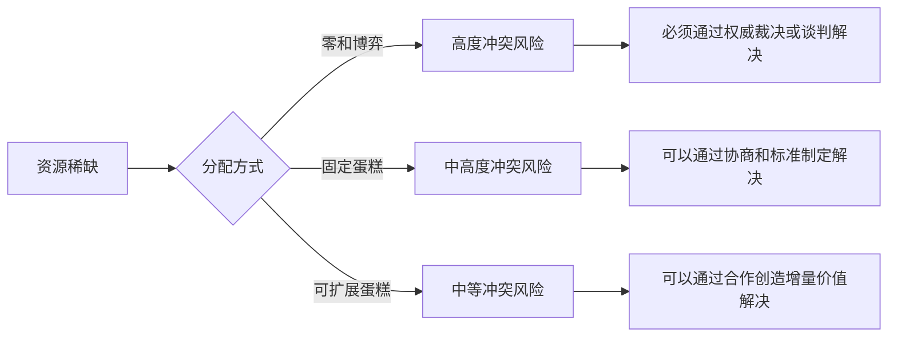
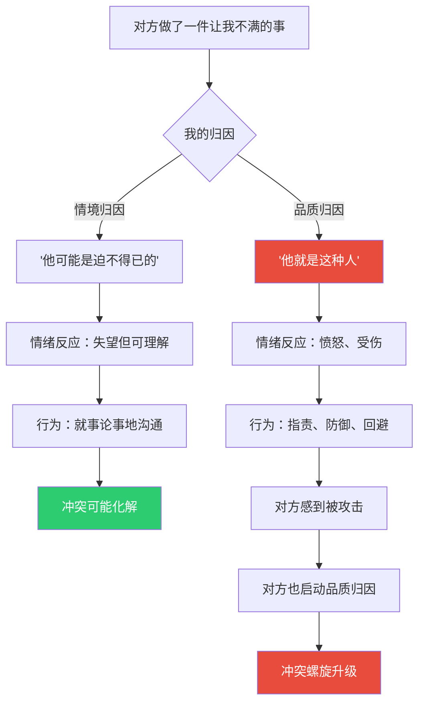
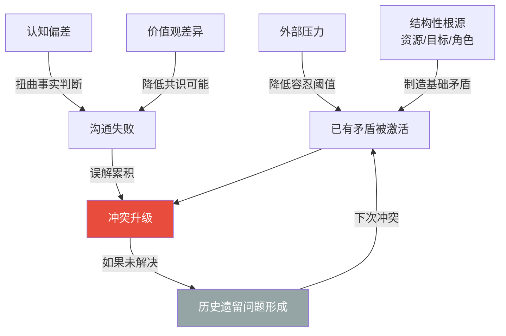

## 三、冲突的原因

冲突从不无缘无故地发生。每一场冲突的背后，都有可识别的结构性根源和触发条件。理解冲突的原因，是预测、预防和有效管理冲突的前提——如果你不知道火源在哪里，就无法灭火，更无法防火。

本节将系统剖析冲突的十大成因，从资源争夺到外部压力，从认知机制到历史积怨。每个成因都会深入到**机制层面**——不只是告诉你"这是冲突的原因"，还要解释"为什么它会导致冲突""它是怎样一步步演化的""怎样诊断它是否正在发生"。掌握了这些，你就拥有了透视冲突根源的X光眼。

### 3.1 冲突成因的总体框架

在逐一分析之前，先建立一个全局视角。冲突的成因可以分为三个层次：



| 层次 | 核心逻辑 | 代表原因 | 预防难度 |
|------|----------|----------|----------|
| **结构性根源** | 系统设计本身就制造了对立 | 资源稀缺、目标差异、权力不对等、角色模糊 | 高——需要重新设计制度 |
| **认知与心理根源** | 人的认知机制天然会产生偏差和分歧 | 认知偏差、价值观冲突、人格差异 | 中——可以通过教育和训练改善 |
| **情境与催化因素** | 外部条件将潜在矛盾点燃 | 沟通障碍、历史遗留、外部压力 | 低——通常可以通过及时干预化解 |

这三个层次的关系是：**结构性根源制造"干柴"，认知与心理根源提供"火种"，情境与催化因素送来"东风"**。大多数激烈冲突都是三层因素同时作用的结果。单独一个原因很少能引发严重冲突，但当两三个原因叠加在一起时，冲突就会像连锁反应一样迅速升级。

冲突成因还有一个关键特征：**动态演化性**。一个冲突的起因往往不是它持续升级的原因。比如，两个部门最初因为资源分配产生摩擦（结构性原因），但在争执过程中逐渐形成了对对方的负面刻板印象（认知原因），后来因为沟通方式越来越情绪化而彻底撕破脸（沟通原因）。如果不追踪原因的演化轨迹，只盯着最初的起因，干预就会落空。

### 3.2 资源稀缺

#### 3.2.1 基本机制

资源稀缺是冲突最古老、最直接的根源。英国经济学家托马斯·马尔萨斯在1798年就指出：人口增长以几何级数进行，而资源增长以算术级数进行，这种根本性的不对称必然导致竞争和冲突。虽然马尔萨斯的预测在技术进步面前部分失效了，但其核心洞察依然成立——**相对于人类的欲望，资源永远是稀缺的**。

这里的"资源"是广义的，包括但不限于：

| 资源类型 | 组织场景 | 家庭场景 | 社会场景 |
|----------|----------|----------|----------|
| **物质资源** | 预算、设备、办公空间 | 房间分配、财产继承 | 土地、水源、矿产 |
| **时间资源** | 项目排期、会议时间 | 个人时间与家庭时间的分配 | 公共设施的使用时段 |
| **人力资源** | 团队编制、关键人才的调配 | 家务分工、育儿投入 | 劳动力市场竞争 |
| **注意力资源** | 领导的关注和认可 | 父母对不同子女的关注 | 媒体报道、公众关注 |
| **机会资源** | 晋升名额、培训机会 | 教育资源倾斜 | 升学、就业机会 |
| **信息资源** | 信息的获取和控制权 | 家庭决策中的知情权 | 信息公开与隐私保护 |

资源稀缺引发冲突的根本原因在于：当资源无法满足所有人的需求时，分配就变成了一个**零和或近零和的博弈**，而人类对"损失"的敏感度远高于对"收益"的敏感度（卡尼曼的前景理论）。这意味着，即使分配方案在客观上是合理的，只要有人觉得自己"少得了"，冲突就会产生。

#### 3.2.2 资源冲突的三种模式

资源稀缺并不总是导致冲突。关键在于**分配方式**和**分配感知**。社会心理学家莫顿·多伊奇（Morton Deutsch）在其经典著作《合作与冲突》中指出，资源分配存在三种基本模式，每一种都对应不同的冲突风险：

**模式一：零和博弈模式**——你多我就少，此消彼长。这是最容易引发冲突的模式。典型场景：年度加薪总额固定，你的涨幅高了，我的就少了。在这种模式下，各方倾向于将对方视为"敌人"而非"伙伴"，信任水平最低，竞争行为最激烈。

**模式二：固定蛋糕模式**——总量不变，如何切分成为焦点。冲突焦点不在"蛋糕够不够大"，而在"谁该拿多大的一块"。典型场景：遗产分配。与零和博弈的区别在于，固定蛋糕模式下各方通常承认分配需要某种规则或标准（如贡献度、需求度），争论的焦点是"用什么标准"。

**模式三：可扩展蛋糕模式**——通过合作可以把蛋糕做大，但各方对做大方式和分配比例有分歧。冲突风险中等，但一旦做大失败，矛盾会急剧恶化。典型场景：创业合伙人的股权分配。这种模式的关键变量是**对未来的信心**——信心充足时各方愿意让步，信心不足时会退化为固定蛋糕甚至零和博弈。



一个重要的实操洞察是：**冲突模式是可以转化的**。优秀的管理者能够将零和博弈重新框架为可扩展蛋糕——比如，与其争论谁的预算更多，不如共同寻找"如何用更少的预算创造更大的价值"的方案。这种重新框架的能力是冲突管理的核心技能之一。

#### 3.2.3 诊断信号

如何判断当前冲突是否源于资源稀缺？以下是关键诊断信号：

- 对话中反复出现"不公平""凭什么""我也需要"等措辞
- 各方都强调自己对资源的"正当权利"或"历史贡献"
- 冲突在预算季、考核季、晋升季等资源分配节点集中爆发
- 讨论从"我需要什么"快速转向"你拿了多少"
- 存在可量化的资源差距（薪资差异、预算比例等）
- 各方对资源总量的描述存在明显分歧（一方认为"足够"，另一方认为"严重不足"）
- 出现"比较性语言"——"为什么他们的部门就有……"

#### 3.2.4 真实案例

**案例：互联网公司的年度预算分配**

某互联网公司的产品部和技术部每年都要争夺公司有限的预算。产品部主张加大市场推广投入，认为用户增长是当务之急；技术部主张加大基础设施投入，认为系统稳定性是一切业务的基础。双方各执一词，每次预算会议都火药味十足。

深层分析：这不仅仅是资源争夺，还叠加了**目标差异**（增长 vs 稳定）和**认知偏差**（各自领域的"放大镜效应"——产品部看不到技术债务的威胁，技术部看不到市场竞争的紧迫性）。解决方案不是简单地"各打五十大板"，而是建立一个基于ROI和风险评估的客观分配框架，让双方在同一套评估标准下对话。

**案例：创业公司的期权分配**

三位联合创始人在A轮融资后需要重新分配期权。CTO认为技术是核心竞争力，应该拿最多；CMO认为市场是公司生命线，应该与CTO持平；CEO认为自己承担了最大的风险和责任，理应多分。争论持续了三个月，期间产品迭代几乎停滞。

深层分析：这是一个典型的"可扩展蛋糕退化为固定蛋糕"的案例。三位创始人最初都认同"把公司做大是最重要的"，但在具体分配比例上无法达成共识，导致注意力从"做大蛋糕"转向"争抢蛋糕"。解决方案是引入外部顾问或投资人作为中立第三方，用客观数据（市场薪资对比、贡献度评估、行业惯例）来制定分配方案，同时设置里程碑触发机制——未来的分配基于实际贡献而非预期贡献。

### 3.3 目标差异

#### 3.3.1 基本机制

目标差异是组织冲突中最普遍的根源之一。哈佛商学院教授迈克尔·波特（Michael Porter）在其战略理论中反复强调：**战略的本质是选择，而选择意味着取舍，取舍意味着分歧**。当不同个体或群体追求不同目标时，冲突几乎是结构性的。

目标差异可以分为三个层次：

**层次一：目标对立**——两个目标本身互斥。例如，降低成本与提高质量之间的矛盾，追求短期利润与投入长期研发之间的张力。这是最难调和的目标差异，因为它涉及根本性的资源分配取舍。在目标对立的情况下，唯一有效的策略是**明确优先级**——不是说另一个目标不重要，而是在资源有限的约束下确定先后顺序。

**层次二：目标优先级差异**——双方认同同样的目标集，但对优先级的排序不同。例如，团队成员都同意"质量、速度、成本"都很重要，但有人认为质量第一，有人认为速度第一。优先级差异比目标对立更容易调和，因为它可以通过信息共享和共识构建来弥合。关键干预手段是让各方充分理解"为什么对方认为那个目标更优先"——通常背后有不同的信息基础或风险评估。

**层次三：目标认知差异**——双方对"同一个目标"的理解不同。例如，领导说"提高客户满意度"，A理解为"快速响应客户需求"，B理解为"提高产品质量"。这种差异最容易被忽视，也最容易通过清晰的沟通来消除。目标认知差异的隐蔽性在于：双方都以为自己在追求同一个目标，却不知道彼此走的是完全不同的方向。

#### 3.3.2 委托-代理问题

目标差异在组织中有一个系统性的放大机制，叫做**委托-代理问题**（Principal-Agent Problem）。这是经济学和管理学的核心概念之一，由迈克尔·詹森（Michael Jensen）和威廉·梅克林（William Meckling）在1976年的经典论文中系统阐述。

核心逻辑是：委托人（如股东）和代理人（如经理人）的目标函数不完全一致。经理人可能追求个人收入最大化、在职消费、帝国建设（扩大管辖范围），而股东追求的是投资回报最大化。这种目标差异导致了系统性的组织冲突——不是因为某个人不好，而是因为**制度结构本身就制造了目标分歧**。

在实际工作场景中，委托-代理问题随处可见：

| 场景 | 委托人目标 | 代理人目标 | 冲突表现 |
|------|------------|------------|----------|
| 销售提成制度 | 公司利润最大化 | 个人提成最大化 | 销售为了成交过度承诺，导致售后纠纷 |
| 项目外包 | 按时按质交付 | 尽量减少投入、多接项目 | 外包方偷工减料，甲方反复返工 |
| KPI考核 | 企业长期价值 | 个人KPI达成 | "唯KPI论"导致指标优化而非真正价值创造 |
| 子女教育 | 孩子全面发展 | 教师班级排名 | 教师追求升学率，忽视学生个性发展 |
| 医患关系 | 患者健康最优 | 医院收入/规避风险 | 过度检查、防御性医疗 |

委托-代理问题的解决方向有三个：**激励对齐**（让代理人的利益与委托人尽可能一致）、**信息透明**（减少信息不对称）和**监督约束**（建立有效的监控和问责机制）。但需要注意，每一种方案都有成本和副作用——激励设计不当会引发新的扭曲，过度监督会损害信任和积极性。

#### 3.3.3 诊断信号

- 各方在讨论中使用不同的"成功标准"来衡量同一项目
- 同一决策被不同部门用截然不同的逻辑来评价
- "对齐会议"反复召开但效果有限
- 出现"各说各话"的现象——讨论同一个话题但像在讨论两个不同的话题
- 中层管理者频繁感到"两头为难"
- 同一个战略目标在执行层面产生了相互矛盾的具体行动
- 项目复盘时，各方对"项目是否成功"有完全不同的判断

### 3.4 认知偏差

#### 3.4.1 基本机制

人类的大脑不是一台精密的逻辑机器，而是一台进化了数百万年的"认知快捷键集合体"。诺贝尔经济学奖得主丹尼尔·卡尼曼（Daniel Kahneman）在其巨著《思考，快与慢》中系统揭示了人类认知的两大系统：系统1（快速、直觉、自动）和系统2（缓慢、理性、耗力）。冲突的产生，很大程度上源于系统1的"自作聪明"——我们用快速直觉做出了判断，却以为那是理性分析的结果。

认知偏差之所以在冲突中如此危险，是因为它具有三个特征：**无意识性**（我们意识不到自己在偏差中）、**系统性**（偏差方向是可以预测的）和**自强化性**（偏差产生的行为会进一步确认偏差本身）。

以下是与冲突关系最密切的六种认知偏差：

#### 3.4.2 归因偏差（Attribution Bias）

归因偏差是冲突升级的最强催化剂之一，由社会心理学家弗里茨·海德（Fritz Heider）和李·罗斯（Lee Ross）等人奠基性地研究。

**核心表现**：当别人做了让我们不满的事，我们倾向于将其归因于对方的**内在品质**（"他就是自私""她就是故意针对我"）；当自己做了同样的事，我们倾向于归因于**外部环境**（"我是迫不得已的""换你也会这么做"）。

这种不对称归因被称为**"行为者-观察者效应"**（Actor-Observer Effect）。它的杀伤力在于：一旦我们将对方的行为归因为"本质恶劣"，冲突就从"事情层面"升级到了"人身层面"——从"你做了一件不对的事"变成"你就是个坏人"。一旦到了这一步，和解的难度指数级上升。

归因偏差在冲突中的升级路径：



**反制策略**：在做出负面归因之前，强制自己至少想出三种可能的解释——一种是对方的恶意，一种是环境因素，一种是信息不足。这个简单的"三分归因法"可以大幅降低误判概率。另一个有效策略是**换位自问**——"如果我自己做了同样的事，我会怎么解释自己的行为？"通常你会发现，你会给自己找很多合理化的理由。

#### 3.4.3 确认偏差（Confirmation Bias）

**核心表现**：一旦我们形成了某种观点或判断，就会不自觉地搜寻、偏好和记忆那些**支持**这个观点的信息，同时忽视、低估或遗忘那些**反驳**这个观点的信息。

英国心理学家彼得·沃森（Peter Wason）在1960年通过经典的"2-4-6任务"实验首次系统证明了确认偏差的存在。在冲突场景中，确认偏差的破坏力是：一旦我们认定"对方是错的"，我们就会自动过滤掉所有支持对方的信息，只看到"对方确实错了"的证据。这使得冲突双方都觉得自己"有充分理由"，而对方"完全不讲理"。

确认偏差在冲突中还有一个恶性循环机制：**证据膨胀效应**。每次冲突互动都会产生新的"证据"来支持已有的判断，而这些判断又会影响对下一次互动的解读。随着时间推移，双方各自的"证据库"都在不断膨胀，方向完全相反，共识的可能性越来越小。

**真实场景**：两位同事因为一次项目失误产生了矛盾。A认为"是B的技术方案有缺陷"，B认为"是A的需求描述不清晰"。之后，A会特别关注B过往项目中的每一次技术问题，而忽略B成功的案例；B则会反复回忆A的每一次需求变更，而忽略A描述清晰的场景。三个月后，A手里攒了一份"B的技术问题清单"，B手里攒了一份"A的需求变更清单"，两个人都觉得自己"证据确凿"，但实际上都只看到了事实的一半。

**反制策略**：在争论中，强制自己为对方的观点寻找至少一条合理证据。如果找不到，至少承认"这个问题我了解得不够全面"。在团队层面，可以引入"红队机制"——指定专人负责反驳主流观点，以此打破确认偏差的自我强化循环。

#### 3.4.4 自利偏差（Self-Serving Bias）

**核心表现**：将成功归因于自己的能力和努力，将失败归因于外部因素和他人的过错。这种偏差在涉及绩效评估、项目复盘和功劳归属时特别强烈。

自利偏差的冲突升级机制是：当团队项目成功时，每个人都觉得自己贡献最大；当项目失败时，每个人都觉得是别人的错。成功时争功、失败时推责——这是自利偏差最典型的冲突产物。

自利偏差还与**公平感知**密切相关。研究发现，人们在评估自己与他人的贡献比时，几乎总是高估自己的贡献。在一个五人团队中，如果每个人估计自己贡献了30%的工作量，五个人的总估计会达到150%——这50%的"虚高"就是冲突的温床。

#### 3.4.5 基本归因错误（Fundamental Attribution Error）

**核心表现**：过度高估个人因素（性格、态度、能力）对他人行为的影响，过度低估情境因素（制度、环境、压力）的影响。社会心理学家李·罗斯在1977年正式命名了这一偏差。

例如，同事迟到了，我们的第一反应是"他太不敬业了"（个人归因），而不是"他可能遇到了交通问题或家里有事"（情境归因）。基本归因错误让我们对他人做出过于苛刻的道德判断，从而制造不必要的冲突。

基本归因错误有一个重要的文化边界：研究发现，东亚文化中的基本归因错误程度低于西方文化，因为东亚文化更强调情境和关系的作用。但即便如此，这种偏差在东亚文化中依然普遍存在，只是程度稍弱。

#### 3.4.6 框架效应（Framing Effect）

**核心表现**：同一个事实，用不同的方式表述，会导致截然不同的判断和决策。卡尼曼和特沃斯基的前景理论（Prospect Theory）证明了：人们面对"收益"时倾向于风险规避，面对"损失"时倾向于风险寻求。

在冲突场景中，框架效应的破坏力是：如果一方将某个方案描述为"我们能获得30%的利润"，另一方将同一个方案描述为"我们会损失70%的市场"，双方就会基于同一事实做出完全对立的判断。

框架效应在谈判中的应用非常广泛。一个经典的例子：医生告诉患者"这个手术有90%的存活率"和"这个手术有10%的死亡率"，患者的接受度会截然不同，尽管信息完全相同。在冲突调解中，有意识地重新框架议题——从"谁对谁错"转向"如何解决问题"——是化解僵局的有效手段。

#### 3.4.7 虚假共识效应（False Consensus Effect）

**核心表现**：高估自己的观点、行为和偏好在人群中的普遍程度。当我们持有某种观点时，会不自觉地认为"大多数人也这么想"。

在冲突中，虚假共识效应导致双方都认为"道理在我这边""公道自在人心"，从而更加强硬地坚持己见。当最终发现对方并不认同自己的立场时，还会产生震惊和愤怒——"你怎么会这么想？！"

虚假共识效应的反面是**虚假独特性效应**（False Uniqueness Effect）——当我们拥有某种正面特质或成就时，倾向于低估它在人群中的普遍程度，以维护自己的"独特感"。这两种偏差共同作用，让人们在冲突中既高估自己观点的代表性，又高估自己能力的稀缺性。

### 3.5 沟通障碍

#### 3.5.1 基本机制

沟通障碍是冲突最常见、最直接的触发器。美国沟通学者迪恩·巴恩伦德（Dean Barnlund）提出的**沟通交易模型**揭示了一个关键事实：沟通不是简单的"发送-接收"过程，而是一个充满噪音、干扰和主观解读的复杂交易。信息从发送者到接收者的每一步，都可能被扭曲、遗漏或误解。

沟通障碍之所以特别危险，是因为它具有**双向不对称性**——发送者以为自己表达清楚了，接收者以为自己理解正确了，但双方可能完全不在同一个频道上。而且，这种不对称性往往是不可见的，直到冲突爆发后才被意识到。

冲突中常见的六种沟通障碍：

#### 3.5.2 信息不对称

当冲突双方掌握的事实基础不同时，对同一事件的判断必然产生分歧。信息不对称的危险在于——**双方往往并不知道自己不知道什么**。每个人都基于自己掌握的信息做出了"合理"的判断，却不知道对方掌握着另一组关键信息。

信息不对称在组织中的常见来源：
- **层级过滤**：信息在组织层级传递时被层层筛选和加工，高层看到的是经过"美化"的汇报，基层听到的是经过"简化"的指令
- **部门墙**：不同部门之间的信息流动受阻，各自只看到自己领域的全貌
- **信息囤积**：某些人出于权力动机或自我保护，选择性地分享信息
- **专业壁垒**：不同专业背景的人使用不同的术语和框架，导致"说的同一件事但听起来完全不同"

**经典案例**：上级因为不了解项目的技术复杂度而设定了不合理的截止日期，下属因为不了解客户的紧迫需求而觉得上级"不近人情"。双方的信息拼图都不完整，冲突正是在信息盲区中产生的。

**对策**：在冲突发生时，先做一个"信息审计"——双方各自列出自己掌握的关键事实和假设，然后交换。很多冲突在信息对齐之后就自动消解了。信息审计的具体操作：(1)各自独立写出"我认为的事实是什么""我的假设是什么""我还缺少什么信息"；(2)交换文档，标记对方的文档中"我同意的事实""我不同意的事实""我补充的事实"；(3)面对面讨论分歧点。

#### 3.5.3 表达不清

表达不清不仅仅是"说话能力"的问题，更是一个**认知翻译**的挑战。我们脑中的想法是多维的、模糊的、充满情感色彩的，但语言是线性的、精确的、高度简化的。把脑中的想法翻译成语言，必然会产生信息损耗。

常见的表达不清模式：

| 模式 | 示例 | 更好的表达 | 改进要点 |
|------|------|------------|----------|
| **模糊化** | "这个方案不太行" | "这个方案在用户增长方面缺少具体策略，我担心无法达到季度目标" | 用具体事实替代模糊判断 |
| **情绪化** | "你总是这样！" | "这是我第三次遇到类似的情况，我感到很沮丧" | 描述具体频次和自己的感受 |
| **预设结论** | "你肯定没考虑过这个" | "关于用户留存率这个指标，你是怎么考虑的？" | 用提问替代预判 |
| **概括化** | "所有人都觉得不好" | "我和小张、小李聊过，他们分别提出了XX和YY的顾虑" | 提供具体来源和细节 |
| **隐含期望** | "你看着办吧" | "我希望这个方案能在控制成本的前提下优先保证质量" | 明确表达期望和约束 |
| **双重信息** | "没事，你决定吧"（但语气不满） | "我有些顾虑，但我也尊重你的判断，我们能一起讨论一下吗？" | 让语言和情感一致 |

表达不清的深层原因是**知识的诅咒**（Curse of Knowledge）——当我们对某个领域非常熟悉时，我们很难想象不熟悉这个领域的人会如何理解我们的表述。专家对新手说"这个很简单"，是因为专家真的觉得简单，但新手听到的是"你连这都不会"。

#### 3.5.4 倾听不足

大多数人把"听"当作"等待对方说完然后轮到自己说"的过渡状态，而非真正的信息接收过程。心理学家卡尔·罗杰斯（Carl Rogers）提出的**主动倾听**（Active Listening）理论指出，真正的倾听需要三个要素：**共情理解**（从对方的视角理解）、**无条件积极关注**（不带评判地接纳）和**真诚一致**（真实地回应而非敷衍）。

在冲突场景中，倾听不足的典型表现是：
- 打断对方说话，急于表达自己的观点
- 在对方说话时已经在准备反驳，而不是在理解
- 只听到了事实层面，忽略了情感层面
- 用"我理解你的意思"来敷衍，但实际上并不理解
- 选择性倾听——只听到支持自己观点的部分
- "伪倾听"——表面上在点头，实际上在想自己的事

倾听不足的根本原因是**认知负荷**——在冲突中，我们的大脑忙于组织自己的论据、管理自己的情绪、预测对方的反应，留给"真正理解对方"的认知资源已经所剩无几。这也解释了为什么冲突中的对话往往变成"两个独白的交替进行"，而非真正的交流。

#### 3.5.5 语义差异

同一个词在不同人那里可能有完全不同的含义。这是语言哲学家路德维希·维特根斯坦（Ludwig Wittgenstein）在《哲学研究》中反复强调的观点：**词语的意义在于其使用**，而不是字典定义。

例如，"尽快完成"对有些人来说意味着"今天下班前"，对另一些人来说意味着"这周内"，还有人理解为"在合理时间内不拖延"。当领导说"尽快完成"而下属理解为"这周内"，但领导心里期望的是"今天"——冲突的种子就埋下了。

语义差异在跨部门、跨文化沟通中尤为严重。以下是常见的高风险词汇：

| 词汇 | 可能含义A | 可能含义B | 冲突风险 |
|------|-----------|-----------|----------|
| "尽快" | 今天内 | 本周内 | 截止日期冲突 |
| "差不多" | 90%完成 | 50%完成 | 质量预期冲突 |
| "重视" | 全力投入 | 适当关注 | 资源投入冲突 |
| "支持" | 主动配合 | 不阻拦就行 | 行动预期冲突 |
| "简单" | 技术上不复杂 | 花费时间少 | 工作量评估冲突 |
| "讨论" | 头脑风暴 | 已决定只是通知 | 决策权冲突 |

**对策**：在涉及时间、数量、程度的沟通中，用具体数字替代模糊词汇。"尽快"改为"周三下班前"，"差不多"改为"完成80%以上"，"支持"改为"安排两个人全职参与"。

#### 3.5.6 非语言信号误读

心理学家阿尔伯特·梅拉比安（Albert Mehrabian）的研究表明，在面对面沟通中，信息的传递只有7%来自语言内容，38%来自语调，55%来自肢体语言（虽然这个具体比例在学术界有争议，且该实验的适用场景有限，但非语言信号的重要性是公认的）。在冲突场景中，非语言信号的误读杀伤力巨大——对方一个皱眉、一声叹气、一个回避的眼神，都可能被过度解读为"不尊重""轻蔑""心虚"。

非语言信号误读有两个放大器：

1. **负面归因倾向**：在冲突状态下，我们倾向于将对方的中性非语言信号解读为负面信号。对方皱眉可能只是因为头疼，但我们解读为"他不同意我的观点"。
2. **线上沟通的信息缺失**：在文字沟通（微信、邮件、钉钉）中，语调和肢体语言信息完全缺失，这迫使接收者用自己的情绪状态去"填充"缺失的信息。心情好的时候可能无感，心情不好的时候一个句号都像在发火。

#### 3.5.7 沟通渠道选择不当

不同的沟通渠道承载信息的能力差异巨大。根据**媒体丰富度理论**（Media Richness Theory，由理查德·达夫特和罗伯特·伦格尔提出），面对面沟通的信息丰富度最高，而电子邮件和文字消息的信息丰富度最低。

**关键原则**：冲突的严重程度越高，越需要使用信息丰富度高的渠道。用文字消息讨论敏感话题、用邮件处理情绪化的分歧，都是沟通渠道选择不当的典型错误——文字缺少语调和表情信息，极容易被误读。

沟通渠道选择指南：

| 冲突类型 | 推荐渠道 | 不推荐渠道 | 原因 |
|----------|----------|------------|------|
| 事实性分歧 | 邮件/文档（附数据） | 面对面争论 | 需要冷静查阅事实 |
| 情感性冲突 | 面对面 | 微信/邮件 | 需要语调和表情传递善意 |
| 复杂议题 | 面对面+会后书面确认 | 纯文字 | 需要即时互动和书面记录 |
| 公开冲突 | 私下沟通 | 群聊/公开场合 | 需要保护双方颜面 |
| 跨文化冲突 | 视频/面对面 | 纯文字 | 需要最大限度的信息丰富度 |

### 3.6 价值观冲突

#### 3.6.1 基本机制

价值观是人们关于"什么是重要的""什么是正确的""什么是值得追求的"的深层信念。美国人类学家弗洛伦斯·克拉克洪（Florence Kluckhohn）和弗雷德·斯特罗德贝克（Fred Strodtbeck）在1961年提出了**价值取向理论**（Value Orientations Theory），将人类的基本价值观分为五个维度：人性本质、人与自然的关系、时间取向、活动取向和关系取向。

价值观冲突之所以难以解决，是因为它触及了人的**身份认同**层面。当你质疑一个人的价值观时，你不仅是在质疑他的判断，更是在质疑"他是谁"。这就是为什么价值观冲突往往伴随着强烈的情绪反应——因为这关乎"自我"本身。

价值观冲突与任务冲突的核心区别在于：任务冲突可以通过新的信息、更好的方案或折中方案来解决，而价值观冲突没有"正确答案"——不同的价值观体系内部都是自洽的，无法用逻辑来证明一个比另一个更"对"。

#### 3.6.2 五种典型的价值观冲突

**公平观的差异**：不同人对"什么是公平"的理解截然不同。哲学家约翰·罗尔斯（John Rawls）在《正义论》中区分了三种公平观：**结果公平**（每个人得到相同的结果）、**程序公平**（分配过程是公正的）和**机会公平**（每个人有相同的起点和机会）。在实际冲突中，甲方认为"按贡献分配才公平"（结果公平），乙方认为"按需分配才公平"（另一种结果公平），丙方认为"只要过程透明公正，结果不平等也可以接受"（程序公平）。这三种公平观都是"合理的"，但它们之间的冲突几乎不可调和。

公平观差异的实操影响：在一个团队中，如果领导者默认采用"按贡献分配"的原则，而某些成员内心认同的是"按需求分配"，这些成员不会公开反对（因为他们知道自己的公平观不占主流），但会通过消极怠工、减少投入等方式表达不满——这就是价值观冲突的"隐性化"表现。

**效率与质量的取舍**：在资源有限的条件下，追求效率最大化往往意味着牺牲质量，反之亦然。这个冲突在软件开发中尤为典型——"快速发布"还是"打磨完美"的争论，本质上就是效率与质量的价值观冲突。

**个人自由与集体利益的平衡**：这是一切社会制度设计的核心张力。在组织中，这体现为"弹性工作"与"团队协作效率"的矛盾；在家庭中，这体现为"个人空间"与"家庭责任"的冲突。

**传统与创新的张力**：保守派主张"经过验证的方法最可靠"，激进派主张"不创新就等死"。这种价值观冲突在组织变革、文化传承、教育理念等领域反复出现。

**文化差异**：荷兰社会心理学家吉尔特·霍夫斯泰德（Geert Hofstede）通过大规模跨文化研究，识别出六个文化维度：**权力距离、个人主义-集体主义、男性化-女性化、不确定性规避、长期导向、放纵-克制**。不同文化背景的人在这些维度上的差异，会系统性地制造价值观冲突。例如，高权力距离文化中的员工期望领导做出明确决策，而低权力距离文化中的员工期望参与式决策——当这两种人在同一个团队中工作时，冲突几乎不可避免。

#### 3.6.3 价值观冲突与任务冲突的转化

一个重要的洞察是：**表面上的任务冲突，往往是深层价值观冲突的伪装**。当两个人争论"是否应该加班赶工期"时，表面上是在讨论项目管理方法，实际上可能是一个人认为"敬业是核心美德"（工作价值观），另一个人认为"健康和家庭比工作更重要"（生活价值观）。如果只在任务层面调解，而忽略了背后的价值观分歧，冲突会在下次以不同的面目再次出现。

如何识别价值观冲突伪装成的任务冲突？三个线索：
1. **情绪强度与议题重要性不成比例**——为小事大动肝火，通常背后有更深层的价值触动
2. **同一类争论反复出现**——换了个议题但争论模式相同，说明背后有稳定的分歧源
3. **理性讨论无法达成共识**——双方的论据都很充分，但就是说服不了对方，因为他们在用不同的价值标尺衡量同一个问题

#### 3.6.4 价值观冲突的管理策略

价值观冲突不能被"解决"——你无法通过逻辑论证来改变一个人的核心价值观。但价值观冲突可以被"管理"。以下是三种有效的管理策略：

**策略一：划定边界**——明确哪些价值观差异是可以共存的，哪些是不可逾越的底线。对于可共存的差异，建立"求同存异"的共识；对于不可逾越的底线（如诚信、尊重），制定明确的行为规范。

**策略二：寻找更高层级的共同价值**——即使在具体价值观上有分歧，通常在更高的抽象层次上存在共识。比如，"效率派"和"质量派"在"为用户创造价值"这个更高层级上是一致的，这个共同点可以成为调和分歧的锚点。

**策略三：建立行为契约**——既然价值观无法统一，那就将焦点从"认同什么"转向"如何行动"。双方不需要认同对方的价值观，但需要就"在合作中如何处理分歧"达成行为共识。

### 3.7 角色模糊与角色冲突

#### 3.7.1 角色理论

角色理论由社会学家罗伯特·默顿（Robert Merton）等学者发展而来，其核心观点是：**每个人在社会中扮演多种角色，每个角色都有相应的行为期望。当这些期望不清晰或相互矛盾时，冲突就会产生。**

角色理论的核心概念包括：**角色期望**（他人认为某个角色应该怎么做）、**角色认知**（扮演者自己认为该怎么做）和**角色行为**（实际表现出来的行为）。当这三者之间存在差距时，冲突就会在三个方向上产生：扮演者与期望者之间、不同期望者之间、扮演者内心之中。

#### 3.7.2 角色模糊（Role Ambiguity）

角色模糊是指一个人不清楚自己的职责范围、行为预期和评价标准。组织行为学研究表明，角色模糊与工作压力、工作不满、组织公民行为下降和人际冲突之间存在显著正相关。

角色模糊导致冲突的机制是：当职责不清时，会出现两种情况——**职责重叠**（多个人都认为某件事该自己管，导致权力争夺）和**职责真空**（没人认为某件事该自己管，导致互相推诿）。前者引发直接冲突，后者引发间接冲突（"为什么你没做？""我以为该你做！"）。

角色模糊在组织中的典型触发场景：
- **组织变革期**：架构调整后新旧职责界定不清
- **新设岗位**：岗位职责缺乏清晰定义
- **快速扩张**：团队规模快速增长，原有的非正式分工失效
- **矩阵式管理**：多头汇报导致角色期望冲突
- **远程办公**：缺少面对面互动，角色边界更容易模糊

#### 3.7.3 角色冲突（Role Conflict）

角色冲突比角色模糊更复杂，可以分为四种类型：

| 类型 | 定义 | 典型场景 | 冲突烈度 |
|------|------|----------|----------|
| **角色内冲突** | 同一角色的不同期望之间矛盾 | 项目经理既要控制成本又要保证质量 | 中——可通过明确优先级缓解 |
| **角色间冲突** | 不同角色之间的期望矛盾 | 中层管理者既要执行上级指令又要维护下属利益 | 高——需要系统性调整 |
| **人-角色冲突** | 角色期望与个人价值观/能力的矛盾 | 一个内向的人被要求做大量的社交应酬 | 高——涉及身份认同 |
| **角色超载** | 承担的角色过多，无法全部履行 | 同时是项目经理、技术负责人和新人导师 | 高——导致身心俱疲 |

角色冲突中最隐蔽但破坏力最大的是**人-角色冲突**。当一个人长期扮演与自己价值观或能力不匹配的角色时，不仅会产生持续的内心冲突，还会因为"演不好"而遭受外部批评，形成"越做不好→越被批评→越痛苦→越做不好"的恶性循环。

#### 3.7.4 真实案例

**案例：新晋技术主管的困境**

小李是公司的技术骨干，最近被提拔为技术主管。但公司没有明确界定他的职责——他仍然要做大量的技术开发工作（旧角色），同时又要承担团队管理和跨部门协调的职责（新角色）。他发现自己在"写代码"和"开会协调"之间疲于奔命，两个角色都做不好。更糟糕的是，他的下属认为他"不关心团队"，上级认为他"管理能力不足"，而他自己觉得"两边都在逼我"。

这就是典型的角色模糊叠加角色间冲突。解决方案不是让小李"更努力"，而是明确界定他的职责边界——将技术开发工作移交给团队，让他专注于管理职责，同时提供管理培训支持。

**案例：矩阵式组织中的双重角色冲突**

小王是一家跨国公司的区域市场经理，同时向区域总经理（实线汇报）和全球市场VP（虚线汇报）负责。区域总经理要求小王根据本地市场特点灵活调整策略，全球市场VP要求小王严格执行全球统一的品牌标准。两人的要求经常矛盾，小王每次做决策都要在两方之间小心翼翼地走钢丝。

分析：这是典型的矩阵式组织角色间冲突。解决方案需要在组织层面建立清晰的决策权矩阵——哪些决策归区域，哪些决策归全球，哪些需要联合决策。如果组织层面无法解决，小王个人无论多努力都无法避免冲突。

### 3.8 权力不对等

#### 3.8.1 权力的五种来源

社会心理学家约翰·弗伦奇（John French）和伯特伦·雷文（Bertram Raven）在1959年提出了经典的**权力基础理论**，将权力分为五种来源：

| 权力类型 | 定义 | 冲突特征 |
|----------|------|----------|
| **法定权力** | 来自职位和组织层级 | "我是你领导，你就得听我的"——容易引发服从但不认同的表面和谐型冲突 |
| **奖赏权力** | 控制正向激励的能力 | 用利益收买换取合作，一旦利益消失冲突就会爆发 |
| **强制权力** | 控制惩罚手段的能力 | 压制式管理会导致怨恨积累，最终以更激烈的形式爆发 |
| **专家权力** | 来自专业知识和技能 | 技术专家与管理者的权力博弈——"你不懂技术凭什么管我" |
| **参照权力** | 来自个人魅力和人格感召 | 当参照权力失去时（如偶像"塌房"），冲突会特别激烈 |

值得注意的是，这五种权力来源是**可以独立变化的**。一个人可能拥有很高的法定权力但缺乏参照权力（被任命的领导但不受爱戴），也可能拥有很高的专家权力但缺乏法定权力（技术权威但没有管理职位）。当不同类型的权力集中在不同人身上时，权力的"错位"就会制造冲突。

#### 3.8.2 权力不对等导致冲突的机制

权力不对等本身不是问题，问题在于**权力的使用方式**和**感知公正性**。组织行为学研究表明，权力不对等通过以下路径产生冲突：

**路径一：权力滥用**——强势方利用权力优势忽视弱势方的需求和意见，导致弱势方的不满积累。当不满积累到临界点时，会以突然爆发或被动攻击的形式释放。

**路径二：相对剥夺感**——即使客观条件不差，但当弱势方感知到"我和他之间的差距不合理"时，就会产生强烈的不公平感。社会学家塞缪尔·斯托弗（Samuel Stouffer）在二战期间的美军研究中首次系统记录了这种"相对剥夺"现象——研究发现，晋升速度慢的部队中士兵的满意度反而高于晋升速度快的部队，因为前者是与同样晋升慢的同伴比较，后者是与已经晋升的人比较。

**路径三：权力反转预期**——当弱势方预期自己的权力地位即将改变（如即将升职、即将离职、即将掌握对方的把柄）时，冲突往往会提前爆发。因为弱势方感到"现在不反击，以后更没机会"。

**路径四：权力符号化**——权力通过各种符号（办公室大小、审批权限、信息获取权等）持续提醒弱势方自己的地位劣势，造成慢性心理刺激。即使强势方没有刻意使用权力，这些符号本身就在制造不满。

#### 3.8.3 案例分析

**案例：资深员工与新任经理的冲突**

张工在公司工作了12年，是公认的技术权威。新来的王经理只有3年工作经验，但因为学历和外部背景被直接空降为张工的上级。王经理上任后推行了一系列改革措施，张工觉得"外行领导内行"，处处消极配合；王经理觉得张工"倚老卖老，不服管理"。

分析：这不仅仅是权力不对等的问题，还叠加了**专家权力与法定权力的冲突**——张工的专家权力和资历认同被王经理的法定权力所压制。解决方案不是简单的"谁听谁的"，而是需要重新定义两人的权力边界——王经理负责管理决策和资源调配，张工负责技术决策和方案评审，双方在各自的权力范围内拥有最终话语权。

**案例：家庭中的经济权力不对等**

一对夫妻中，丈夫是家庭唯一经济来源，全职太太照顾两个孩子。丈夫认为"钱是我赚的，重大开支我有最终决定权"，妻子认为"我为家庭放弃了自己的事业，家务和育儿的劳动价值不比你的工资低"。

分析：这是典型的经济权力不对等叠加价值观冲突。解决方向不是争论"谁的贡献更大"，而是建立一套双方都认可的家庭决策机制——比如，日常开支各自决定，超过一定金额的支出需要双方协商，同时为全职照顾者设立独立的个人账户以保障其经济自主权。

### 3.9 人格与性格差异

#### 3.9.1 大五人格与冲突

大五人格模型（Big Five Personality Traits，也称OCEAN模型）是当代心理学中被验证最充分的人格理论。五个人格维度与冲突的关系如下：

| 人格维度 | 高分特征 | 低分特征 | 冲突关联 |
|----------|----------|----------|----------|
| **开放性**（Openness） | 喜欢新事物、创意丰富 | 保守、偏好常规 | 开放性差异大的人在决策风格上容易冲突 |
| **尽责性**（Conscientiousness） | 有条理、注重细节 | 灵活、随性 | 尽责性差异在工作习惯上制造大量摩擦 |
| **外向性**（Extraversion） | 精力充沛、喜欢社交 | 安静、偏好独处 | 在会议和社交场合的需求差异引发冲突 |
| **宜人性**（Agreeableness） | 合作、信任、善解人意 | 竞争、怀疑、直言不讳 | 与冲突频率和解决方式直接相关 |
| **神经质**（Neuroticism） | 情绪波动大、容易焦虑 | 情绪稳定、冷静 | 神经质得分高的人更容易感知威胁和敌意 |

研究发现，**宜人性**和**神经质**是与冲突关系最密切的两个维度。高神经质的人对威胁信号更敏感，更容易将中性行为解读为敌意；低宜人性的人在面对分歧时更倾向于对抗而非合作。当一个高神经质、低宜人性的人与一个低神经质、高宜人性的人发生冲突时，前者会将后者的温和态度解读为"软弱可欺"，后者会将前者的直接态度解读为"攻击性强"——双方的互动模式会进一步强化各自的认知。

#### 3.9.2 性格差异的冲突升级路径

性格差异导致冲突的关键机制是**互动风格的不匹配**。当一个"快节奏、结果导向"的人和一个"慢节奏、关系导向"的人合作时，前者觉得后者"磨磨蹭蹭、不抓重点"，后者觉得前者"急功近利、不顾他人感受"。双方的判断都有"事实基础"——对方确实表现出了不同的行为模式——但判断本身是基于**自己的标准**而非**客观标准**。

性格差异导致冲突的三个阶段：

```mermaid
graph LR
    A[风格差异初现] --> B[轻微不适感]
    B --> C[归因为对方的"问题"]
    C --> D[调整自己的互动方式]
    D --> E{调整方向}
    E -->|防御性调整| F[减少沟通、回避合作]
    E -->|进攻性调整| G[试图改变对方]
    F --> H[距离产生误解]
    G --> I[对方感到被控制]
    H --> J[冲突显性化]
    I --> J
    style J fill:#e74c3c,color:#fff
```

#### 3.9.3 迈尔斯-布里格斯类型指标（MBTI）的冲突视角

虽然MBTI的科学效度在学术界存在争议，但它在组织中的广泛应用使得理解不同类型之间的冲突模式具有实用价值：

- **S型（感觉）vs N型（直觉）**：关注细节 vs 关注全局，前者觉得后者"不落地"，后者觉得前者"格局太小"
- **T型（思考）vs F型（情感）**：理性分析 vs 人情关怀，前者觉得后者"太感情用事"，后者觉得前者"冷血无情"
- **J型（判断）vs P型（感知）**：计划导向 vs 灵活导向，前者觉得后者"没有计划性"，后者觉得前者"死板教条"
- **E型（外向）vs I型（内向）**：会议中的活跃发言 vs 沉默思考，前者可能将后者的沉默解读为"不参与"，后者可能将前者的活跃解读为"话太多"

**实操建议**：理解性格差异的目的不是"贴标签"，而是**建立对不同风格的尊重和包容**。当你发现与某人的冲突持续存在且难以用具体事件解释时，可以考虑是否存在根本性的风格不匹配。解决方向不是改变对方，而是建立一套"翻译机制"——明确告诉对方"我的这种方式不是针对你，这是我的工作风格"，同时学习对方的风格偏好。

### 3.10 历史遗留问题

#### 3.10.1 情感账户理论

心理学家约翰·戈特曼（John Gottman）在研究婚姻关系时提出了**情感银行账户**（Emotional Bank Account）的比喻。每一段关系都有一个隐性的"情感账户"——积极互动（信任、尊重、支持、感谢）是存款，消极互动（欺骗、忽视、批评、背叛）是取款。当账户余额充裕时，偶尔的分歧可以被轻松吸收；当账户透支时，微小的摩擦也会引爆激烈冲突。

情感账户的冲突机制：
- **累积效应**：单次负面事件的影响有限，但多次负面事件的累积会指数级放大
- **衰减不对称**：负面事件的记忆衰减速度远慢于正面事件——心理学研究发现，消极体验的心理影响大约是积极体验的2-5倍（**消极偏差**）
- **触发器效应**：当前的小冲突会激活过去的负面记忆，使得"旧账"和"新账"叠加

戈特曼的研究还发现了一个关键数据：在稳定的关系中，正面互动与负面互动的比例至少需要达到**5:1**。低于这个比例，关系就会进入持续衰退的轨道。这个"5:1法则"不仅适用于婚姻关系，也适用于同事关系、朋友关系和任何需要长期维护的人际关系。

#### 3.10.2 未解决冲突的毒性残留

当冲突只是被"压制"而非被"解决"时，它不会消失，而是变成了一颗定时炸弹。未解决冲突的残留形态包括：

- **未表达的情绪**：愤怒、失望、委屈被压抑，等待下一次爆发的出口。这些情绪不会随时间自然消散——心理学研究发现，被压抑的情绪会以"置换"的方式找到新的释放目标。比如，你对A的不满被压抑后，可能会在与B的互动中间歇性地爆发。
- **未清算的"账"**：觉得自己在上次冲突中"吃了亏"，一直在等待"扳回一局"的机会
- **固化的负面叙事**：形成了"对方就是那样的人"的刻板印象，之后所有行为都会被这个叙事框架过滤
- **信任赤字**：对对方的动机和承诺持续怀疑，即使对方做出了善意举动也不相信

未解决冲突还有一个特别恶毒的特征：**时间并不能治愈它，反而会让它变得更难处理**。随着时间推移，"旧账"会越来越模糊，但情绪记忆却越来越固化。当事人可能已经记不清具体发生了什么，但那种"被伤害"的感觉依然鲜明。这使得"清账"变得非常困难——你无法就一个模糊的记忆进行具体的道歉或解释。

#### 3.10.3 真实案例

**案例：三年前的项目积怨**

三年前，A和B在一次项目中产生了严重分歧——A主张方案X，B主张方案Y，最终A的方案被采纳，但项目失败了。B虽然没有明确说"我早就说过"，但从此对A的每次方案都持怀疑态度。A感觉到了B的不信任，也变得越来越defensive。三年后的今天，当A和B再次被安排到同一个项目组时，冲突在项目启动的第一周就爆发了——表面上是对项目方向的分歧，实际上是三年前未化解的积怨在作祟。

**分析**：这次冲突的真正根源不在当前，而在三年前。如果不处理这个历史遗留问题，当前的调解只会是表面功夫。解决策略：安排一次坦诚的对话，让双方有机会表达当年的感受和未说出来的话，正式"清账"后再开始新的合作。

**案例：家族企业中的代际积怨**

一家家族企业的创始人将管理权交给大儿子，但二儿子认为自己更有能力，从此与大哥关系破裂。之后的十五年里，两兄弟在企业决策中处处对立，但争论的表面理由永远是"业务考量"——实际上每一个反对意见背后都带着十五年前那口气。

分析：这是历史遗留问题最顽固的形式——当积怨与权力结构纠缠在一起时，单纯的对话很难解决。需要引入中立的第三方（如家族顾问、外部董事），建立正式的决策机制来替代"谁说了算"的权力博弈。

### 3.11 外部压力

#### 3.11.1 基本机制

外部压力是冲突的"放大器"而非"创造者"——它不会凭空制造冲突，但会让已经存在的矛盾被激活和放大。心理学中有一个概念叫做**挫折-攻击假说**（Frustration-Aggression Hypothesis），由约翰·多拉德（John Dollard）等人在1939年提出：当人们的目标受阻（感到挫折）时，会产生攻击倾向，而这种攻击倾向往往指向最容易获得的"攻击目标"——通常是身边最亲近或最弱势的人。

外部压力导致冲突的具体路径：
- **资源缩减**：经济衰退→裁员/降薪→内部竞争加剧→冲突增加
- **不确定性增加**：政策变化→方向不明→不同派系各执一词→决策冲突
- **心理资源耗竭**：长期高压→情绪调节能力下降→容忍阈值降低→小摩擦升级为大冲突
- **生存焦虑**：行业洗牌→自保心理→信任崩塌→合作关系瓦解

#### 3.11.2 典型外部压力源

| 压力源 | 影响机制 | 冲突表现 |
|--------|----------|----------|
| **经济衰退** | 预算缩减、裁员风险 | 部门之间争夺有限资源，个人之间争夺"安全位置" |
| **技术变革** | 技能贬值、岗位消失 | 新老技术路线之争，代际冲突 |
| **政策变化** | 合规要求增加、商业模式调整 | "合规派"与"业务派"的对立 |
| **市场竞争** | 业绩压力传导 | 总部与分部的目标冲突，销售与产品的需求冲突 |
| **公共危机** | 如疫情、自然灾害 | 资源分配的公平性争议，个体自由与集体安全的冲突 |
| **组织重组** | 权力重新分配 | 新旧势力的冲突，被边缘化的群体产生敌意 |

#### 3.11.3 压力下的认知退化

神经科学研究表明，长期压力会导致前额叶皮层（负责理性决策和情绪调节）的功能下降，同时杏仁核（负责恐惧和威胁检测）的活动增强。这意味着：在高压状态下，人的认知能力会退化——更容易冲动、更容易误判威胁、更容易做出非理性决策。

这就是为什么许多冲突发生在"压力山大"的时期——不是因为人们变坏了，而是因为他们的大脑在压力下回到了更原始的"战斗或逃跑"模式，理性思考的能力暂时受损。

压力对冲突处理能力的具体影响：

| 认知功能 | 正常状态 | 高压状态 | 冲突影响 |
|----------|----------|----------|----------|
| 情绪调节 | 能够冷静处理分歧 | 情绪容易失控 | 小摩擦升级为大爆发 |
| 换位思考 | 能够理解对方立场 | 只关注自己的处境 | 难以达成共识 |
| 长远思考 | 能够权衡利弊 | 只关注眼前威胁 | 做出短视决策 |
| 创造性思维 | 能够寻找创新方案 | 僵化思维、非此即彼 | 陷入零和博弈 |
| 信息处理 | 能够全面评估信息 | 选择性关注威胁信号 | 确认偏差加剧 |

#### 3.11.4 外部压力的组织缓冲策略

组织层面可以采取以下措施来降低外部压力对内部冲突的放大效应：

1. **透明沟通**：在不确定时期，领导层应该主动分享信息，减少因信息真空而产生的猜测和恐慌。研究表明，即使分享的是"坏消息"，透明沟通也能降低焦虑水平——因为不确定性本身比坏消息更令人焦虑。
2. **公平分配压力**：避免让某一个部门或群体承受不成比例的压力，这会制造强烈的不公平感。
3. **提供心理支持**：在高压时期增加对员工心理健康的关注，如提供心理咨询服务、增加弹性工作安排。
4. **明确决策框架**：在方向不明的时期，与其等"看清了再动"，不如先建立一个清晰的决策框架——"如果发生A我们做X，如果发生B我们做Y"，这能显著降低不确定性的焦虑。

### 3.12 十大原因的交互作用

很少有冲突是单一原因造成的。在现实中，冲突通常是多个原因交织叠加的结果。以下是常见的原因组合模式：

| 组合模式 | 典型场景 | 冲突烈度 |
|----------|----------|----------|
| 资源稀缺 + 目标差异 | 预算分配时各部门的目标冲突 | 高 |
| 认知偏差 + 沟通障碍 | 误解不断累积却无法澄清 | 中→高（随时间升级） |
| 价值观冲突 + 权力不对等 | 强势方将自己的价值观强加于弱势方 | 极高 |
| 角色模糊 + 人格差异 | 职责不清导致不同性格的人在工作方式上冲突 | 中 |
| 历史遗留 + 外部压力 | 压力时期旧账被翻出 | 高→极高 |
| 沟通障碍 + 目标差异 + 认知偏差 | 多部门协作项目 | 高（常见组合） |
| 权力不对等 + 价值观冲突 + 历史遗留 | 家族企业中的代际冲突 | 极高且顽固 |



理解原因交互作用的实操价值在于：**它帮助你找到最有效的干预点**。如果一场冲突由三个原因共同驱动，你不需要同时解决三个——通常解决其中一个就可以打破恶性循环。关键是找到那个"杠杆原因"——解决它之后，其他原因的压力会自然减轻。

### 3.13 冲突原因诊断工具

为了帮助你在实际场景中快速识别冲突的根本原因，以下提供一个结构化的诊断框架。当面对一场冲突时，依次回答以下问题：

**第一步：排除外部压力**
- 最近是否有重大的外部变化（裁员、重组、经济下行、政策调整）？
- 冲突双方是否处于明显高于平常的压力水平？
- 冲突的时间点是否与某个外部事件高度相关？

**第二步：检查结构性因素**
- 是否涉及可量化的资源争夺？
- 双方的目标或KPI是否存在结构性矛盾？
- 是否有职责不清或职责重叠的区域？
- 双方的权力关系是否不对等？

**第三步：检查认知与心理因素**
- 双方是否在做不同的归因（"都是他的错"vs"我是被逼的"）？
- 是否存在明显的确认偏差（只看到支持自己的证据）？
- 双方的核心价值观是否在此事上有根本分歧？
- 双方的性格/工作风格是否天然不匹配？

**第四步：检查沟通因素**
- 双方是否掌握相同的事实基础？
- 是否存在表达不清或倾听不足的问题？
- 是否在使用不当的沟通渠道（如用文字讨论敏感话题）？
- 是否有历史遗留的未化解矛盾在干扰当前沟通？

**第五步：判断原因组合与干预优先级**

完成前四步的诊断后，将识别出的原因分为三类：

| 类别 | 原因特征 | 干预策略 | 优先级 |
|------|----------|----------|--------|
| **根源性原因** | 制造了冲突的基础条件 | 需要制度性改变，时间长 | 中——纳入长期计划 |
| **触发性原因** | 直接点燃了冲突 | 可以快速干预，见效快 | 高——优先处理 |
| **升级性原因** | 让冲突从小变大 | 需要行为改变，有一定难度 | 高——同步处理 |

单一原因通常不需要深度干预，识别后直接针对该原因处理即可。双重原因需要先隔离两个原因，分别处理。三重以上原因需要制定系统性的干预方案，不能指望一次性解决。

#### 3.13.1 冲突原因诊断记录表

在实际操作中，建议使用以下记录表来系统化诊断过程：

冲突原因诊断记录表
==================

一、基本信息
- 冲突各方：__________
- 冲突持续时间：__________
- 当前烈度（1-10）：__________
- 核心争议点：__________

二、外部压力评估
- 外部变化事件：__________
- 各方压力水平（1-10）：__________
- 外部压力对冲突的影响程度（低/中/高）：__________

三、结构性因素评估
- 资源争夺：有/无，具体资源：__________
- 目标差异：有/无，具体差异：__________
- 角色模糊：有/无，具体区域：__________
- 权力不对等：有/无，具体表现：__________

四、认知与心理因素评估
- 归因偏差：有/无，各方归因方向：__________
- 确认偏差：有/无，证据：__________
- 价值观冲突：有/无，具体维度：__________
- 性格不匹配：有/无，具体维度：__________

五、沟通因素评估
- 信息不对称：有/无，具体差异：__________
- 表达问题：有/无，具体表现：__________
- 渠道问题：有/无，具体情况：__________
- 历史遗留：有/无，具体内容：__________

六、综合判断
- 根源性原因：__________
- 触发性原因：__________
- 升级性原因：__________
- 推荐干预优先级：__________

### 3.14 常见误区

**误区一："冲突都是因为沟通不够"**

真相：沟通障碍只是冲突的触发器之一，很多时候冲突的根源在于结构性因素（资源稀缺、目标差异、权力不对等）。盲目增加沟通频率，不仅不能解决根本问题，反而可能提供更多"开火"的机会。正确做法是先诊断冲突的根本原因，再决定干预策略。如果根源是资源稀缺，你需要的是资源重新分配而非更多的沟通会议。

**误区二："性格不合是冲突的主要原因"**

真相：人格差异确实是冲突的一个因素，但研究表明，它在所有冲突原因中的解释力排在中等偏后的位置。很多所谓的"性格不合"实际上是角色模糊、目标差异或价值观冲突的伪装。把冲突归因于"性格不合"是一种简化处理，会让人放弃深入分析。更准确地说，性格差异是冲突的"易感因素"——它让冲突更容易发生、更容易升级，但它通常不是冲突的根本原因。

**误区三："消除冲突原因就能消除冲突"**

真相：有些冲突原因是结构性的、不可消除的（如资源稀缺本质上无法消除，只能管理）。冲突管理的目标不是消灭所有冲突，而是将破坏性冲突控制在最低水平，同时保留建设性冲突的积极作用。事实上，适度的任务冲突（关于"怎么做更好"的分歧）能够提高决策质量和创新水平——问题不在于冲突本身，而在于冲突是否被建设性地管理。

**误区四："找到'坏人'就能解决冲突"**

真相：冲突归因于某个个人，是基本归因错误的典型表现。大多数冲突是系统性的——是制度设计、角色安排、信息结构和文化环境共同作用的结果。找"坏人"不仅不能解决冲突，还会制造新的冲突（被指责的人会成为新的冲突一方）。正确的做法是审视系统——是什么样的制度和流程让冲突变得不可避免？

**误区五："过去的冲突已经过去了"**

真相：未被正式处理的冲突不会自动消失，它会以各种变形重新出现——也许是更大的爆发，也许是慢性消耗。情感账户的"欠债"需要正式的"清算"——坦诚的对话、真诚的道歉或明确的和解。如果你发现某个冲突"莫名其妙地"反复出现，很可能是历史遗留问题在作祟。

**误区六："只要有共同利益就能解决冲突"**

真相：共同利益是解决冲突的必要条件但不是充分条件。即使双方都知道"合作对大家都好"，如果存在信任赤字、认知偏差或价值观分歧，合作仍然无法实现。这就是所谓的"囚徒困境"——双方都知道合作是最优解，但在缺乏信任的情况下，各自选择背叛才是"理性"的。突破囚徒困境的关键不是"讲道理"，而是建立信任——通过小步合作、透明沟通和可靠的承诺机制来逐步积累信任资本。

### 3.15 本节小结

冲突的原因是多元的、交互的、动态的。十大成因从结构性根源到情境催化，从认知机制到历史遗留，构成了一幅完整的冲突因果图谱。

理解冲突原因的核心价值不在于"事后解释"，而在于**事前预判和事中诊断**。当你能在冲突萌芽阶段就识别出它背后的结构性根源，你就有了针对性干预的可能；当你能在冲突升级过程中判断出是哪些因素在推动升级，你就能在正确的环节施加干预。

记住三个关键原则：

1. **不要只看表面**——表面上的争执往往只是冰山一角，水面之下是资源分配、目标差异、权力关系和认知偏差的复杂纠缠
2. **不要只看当下**——当前的冲突很可能是历史遗留问题的延续，也可能是外部压力的折射
3. **不要只看对方**——冲突中的每个人都有自己的认知盲区和归因偏差，在指责对方之前先审视自己

下一节我们将讨论冲突的**发展阶段**——了解冲突原因之后，掌握冲突的演化规律，才能在正确的时间点做出正确的干预。
