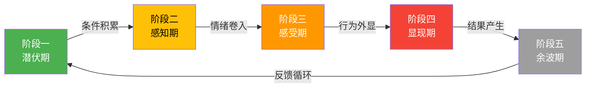
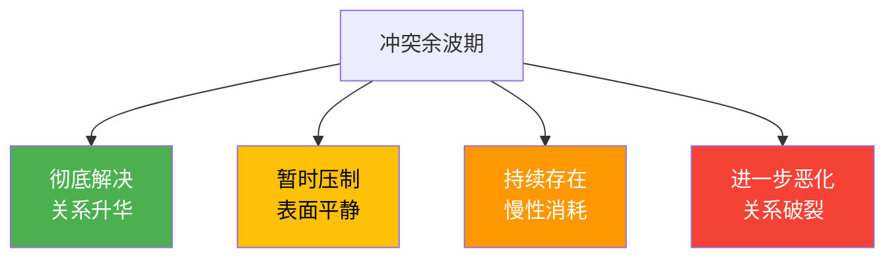
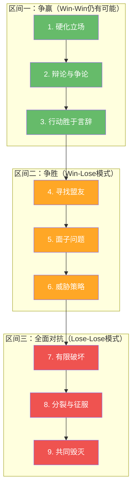

## 四、冲突的发展阶段

冲突不是某一刻突然爆发的事件，而是一个从萌芽、积累、爆发到收场的完整生命周期。理解冲突的发展阶段，就像医生了解疾病的病理分期一样——只有知道冲突"走到了哪一步"，才能选择最合适的干预手段。过早干预可能小题大做，过晚干预则可能回天乏术。

本节介绍两个最具影响力的冲突阶段模型：庞迪的五阶段模型（理解冲突的完整生命周期）和格拉斯尔的九阶段升级模型（理解冲突如何一步步走向失控）。前者帮助我们"看见"冲突的全景，后者帮助我们"预判"冲突的走向。最后，我们将两个模型整合为一个可操作的实战分析框架。

---

### 4.1 庞迪五阶段模型：冲突的完整生命周期

美国行为学家路易斯·庞迪（Louis R. Pondy）在1967年发表的经典论文《Organizational Conflict: Concepts and Models》中提出了冲突发展的五阶段模型。这一模型至今仍是组织行为学和冲突管理领域的基础框架，被罗宾斯（Stephen P. Robbins）等主流教科书广泛采用。

五阶段模型的核心洞见在于：**冲突不是单一事件，而是一个动态过程**。每一个阶段都有其独特的特征、驱动因素和最佳干预窗口。

#### 阶段一：潜伏期（Latent Conflict）——无声的种子

**核心特征：** 冲突的结构性条件已经存在，但双方尚未感知到分歧。冲突是"无声的"，就像地壳下的应力正在积累，地表一切如常。

**潜伏期的四大来源：**

| 来源类型 | 具体表现 | 典型场景 |
|---------|---------|---------|
| 资源稀缺 | 预算不足、人手紧张、时间有限 | 两个部门争夺同一个晋升名额 |
| 目标差异 | 不同部门/个人的目标存在张力 | 销售部追求客户满意度 vs 生产部追求成本控制 |
| 角色模糊 | 职责边界不清晰，存在灰色地带 | 项目经理和职能经理对"谁有权分配任务"理解不同 |
| 信息不对称 | 不同群体掌握的信息量或质量不同 | 市场部掌握客户需求数据但未与研发共享 |

**潜伏期的隐藏特征——"正常化偏差"：**

潜伏期最危险的地方在于，冲突的结构性条件往往被组织文化"正常化"。比如，"销售和技术本来就不对付"这种说法，实际上是将潜在的结构性目标冲突合理化，使管理者放弃在潜伏期进行干预的责任。埃德加·沙因（Edgar Schein）在组织文化理论中指出，这种"共享的基本假设"会让组织对系统性风险视而不见，直到某次危机事件将矛盾推到台面上。

**潜伏期的真实案例：**

某互联网公司的产品部和技术部之间长期存在"潜伏冲突"。产品部的KPI是用户增长，倾向于快速迭代、频繁上线新功能；技术部的KPI是系统稳定性，倾向于代码质量和技术债务清理。两个部门的目标本身就存在张力，但因为公司业务增长顺利，这种张力从未浮出水面。直到某次大促期间系统崩溃，两个部门才互相指责——冲突从潜伏期直接跳到了显现期。

另一个常见场景：家族企业中，第二代继承人之间对企业发展方向存在根本性分歧——一个想做大做强引入外部资本，另一个想稳扎稳打保持家族控制。在父辈仍然掌权期间，这种分歧被压制在潜伏期；一旦权力交接启动，分歧立刻以激烈的方式爆发。

**潜伏期的管理策略：**

潜伏期是成本最低的干预窗口。管理者不应等到冲突爆发才行动，而应主动识别和消除冲突的结构性根源：

1. **制度设计：** 通过明确的职责分工（RACI矩阵）、公平的资源分配机制、透明的信息共享平台来消除结构性冲突源
2. **流程优化：** 建立跨部门协作流程，让不同部门定期沟通、对齐目标。例如，设立跨部门OKR，将"产品增长"和"系统稳定"绑定为共同目标
3. **结构化对话：** 定期举办"预冲突分析会"——让各部门提前暴露潜在的利益分歧点，在矛盾尚未激化时协商规则
4. **关系维护：** 通过团建活动、非正式交流等方式增进相互理解，建立"关系银行"的储蓄

> **关键原则：** 潜伏期的管理是"看不见的管理"——最好的冲突管理，是让人们根本不需要面对冲突。

#### 阶段二：感知期（Perceived Conflict）——看见分歧

**核心特征：** 至少有一方开始意识到冲突的存在。但此时冲突仍然停留在认知层面——当事人意识到了分歧，但尚未产生强烈的情绪反应。就像你发现朋友借钱还没还，你注意到了这件事，但还没有生气。

**感知期的典型信号：**

- 开始注意到对方的行为与自己期望不一致
- 内心出现"他怎么这样""这不公平"的想法
- 开始有意识地收集对方"不对"的证据（确认偏误的开始）
- 沟通频率可能降低，开始有选择性地交流
- 在非正式场合向他人提及此事，试探第三方的看法

**感知期的关键窗口：**

感知期是冲突管理的**黄金窗口**。在这个阶段，双方还没有被情绪绑架，理性对话的条件仍然存在。研究支持这一判断：托马斯（Kenneth Thomas）和基尔曼（Ralph Kilmann）的冲突处理模型研究表明，在认知阶段采用"协作"（Collaborating）或"调和"（Accommodating）策略，化解成功率显著高于情绪卷入后的任何策略。而一旦进入感受期，认知资源被情绪占用，理性协商的能力大幅下降。

**感知期的四种干预方法：**

1. **及时澄清：** 主动发起对话，确认双方对问题的理解是否一致。很多时候，"冲突"只是误解——你以为他在抢你的客户，其实他以为那个客户是分配给他的。具体话术："我注意到最近XX情况，我想确认一下我们对这件事的理解是不是一致的？"
2. **换位思考：** 尝试从对方的角度理解问题。问自己："如果我是他，面对他手上的KPI和压力，我会怎么想？"注意：真正的换位思考不是"如果我是他我会怎么做"，而是"在他的处境、他的信息、他的价值观下，他会怎么看这件事"。
3. **信息补充：** 如果冲突源于信息不对称，主动分享信息，消除信息差。建立信息共享的制度而非临时性的信息释放。
4. **寻求共识：** 聚焦双方的共同目标，而非分歧点。问："我们最终想要达成的结果是什么？在这个结果上，我们是一致的吗？"

**感知期的去升级技术——"暂停-重述"法：**

当你感到分歧正在形成时，使用这个简单的三步法：

1. **暂停：** 在回应前停顿3秒，避免本能的防御反应
2. **重述：** 用自己的话复述对方的观点——"我理解你的意思是……对吗？"这一步的作用是让对方感到被倾听，同时确认自己是否理解正确
3. **探索：** 问一个开放性问题——"你能多说一点你的考虑吗？"把对话从"争论谁对"引向"理解为什么"

**常见错误：** 很多人在感知期选择忽视或回避——"算了，忍一忍就过去了""不想把事情搞大"。这种策略偶尔有效，但在大多数情况下，被忽视的冲突不会自行消失，而是会在地下继续发酵，最终以更大的力量爆发。回避不是消除冲突，只是推迟了冲突的爆发时间。

#### 阶段三：感受期（Felt Conflict）——情绪卷入

**核心特征：** 冲突从认知层面渗透到情感层面。当事人不仅"知道"冲突存在，还开始"感受"到冲突的压力——愤怒、焦虑、沮丧、失望、委屈、怨恨等情绪开始涌现。冲突变得个人化，从"这件事不对"升级为"这个人不行"。

**感受期的心理机制：**

感受期的情绪反应并非"不理性"，而是人类面对威胁时的自然应激反应。当人们感知到自己的利益、身份或价值观受到威胁时，大脑的杏仁核（Amygdala）会被激活，触发"战或逃"（Fight-or-Flight）反应。这种生理机制在远古时代帮助人类应对猛兽，但在现代冲突中却常常导致过度反应。

神经科学家安东尼奥·达马西奥（Antonio Damasio）的"躯体标记假说"（Somatic Marker Hypothesis）进一步解释了感受期的认知损害：强烈情绪会在身体层面产生"标记"（如心跳加速、肌肉紧张），这些标记会劫持理性决策过程，使人更依赖直觉和偏见而非逻辑分析。

感受期还会触发一系列认知偏误：

- **确认偏误（Confirmation Bias）：** 只关注支持自己立场的信息，忽略反面证据。表现为：开始翻找对方过去做错的事，对对方正常的言行也做负面解读
- **基本归因错误（Fundamental Attribution Error）：** 将对方的行为归因于其品性（"他就是故意的""她就是这种人"），将自己行为归因于环境（"我也是被逼的""换谁都会这样"）
- **零和思维（Zero-Sum Thinking）：** 认为对方的收益必然意味着自己的损失。"他赢了，我就输了。"
- **灾难化思维（Catastrophizing）：** 将一次小冲突放大为系统性问题。"他这次不配合，说明他以后都不会配合我"
- **读心术（Mind Reading）：** 假设自己知道对方的动机，且通常是负面的。"我知道他就是想架空我"

**感受期的管理策略：**

1. **情绪觉察：** 首先识别和命名自己的情绪——"我现在很愤怒""我感到被背叛"。加州大学洛杉矶分校（UCLA）的研究表明，仅仅是命名情绪（affect labeling）就能降低杏仁核的活跃度，减轻情绪强度。具体做法：在纸上写下3-5个描述你此刻感受的词，不需要分析原因，只是命名
2. **暂停机制：** 在情绪高涨时不要做重大决定或发表激烈言论。给自己设定一个"冷静期"——可以是20分钟（情绪半衰期），也可以是24小时（冲突严重时）。神经科学研究表明，愤怒的生理峰值通常在触发后20分钟内开始下降。**暂停不等于回避**——暂停是为了在更好的状态下处理问题，回避是永远不处理
3. **情绪表达而非发泄：** 使用"我"陈述句表达感受（"我感到自己的贡献没有被认可"），而非用"你"陈述句指责对方（"你从来不认可我的工作"）。"我"陈述句的公式是：**"当（具体事件）发生时，我感到（情绪），因为（需求/价值观）"**。例如："当我的方案没有被讨论就直接被否决时，我感到沮丧，因为我希望能有机会完整地阐述我的想法"
4. **寻求支持：** 向信任的人倾诉，获得情感支持和理性建议。但注意不要把"倾诉"变成"拉帮结派"——有效的倾诉是"我遇到一个情况，你怎么看？"，无效的倾诉是"你知道他做了什么吗？你也觉得他太过分了吧？"

**感受期的去升级技术——"红绿灯"法：**

这个方法帮助你在情绪波动中保持行为边界：

- **红灯（停止）：** 不说伤人的话、不做报复的事、不在社交媒体上发泄。你可以说"我需要一点时间冷静一下，我们明天再谈"，但不能说"你从来都这样"
- **黄灯（注意）：** 觉察自己的身体信号（心跳加速、呼吸急促、拳头紧握），意识到自己正在被情绪驱动。这些信号本身就是行动指令——该暂停了
- **绿灯（行动）：** 用安全的方式处理情绪——运动、写日记、与不相关的人谈话、进行呼吸练习（4-7-8呼吸法：吸气4秒、屏息7秒、呼气8秒）

**感受期的危险信号：**

如果出现以下情况，说明冲突正在快速恶化，需要立即采取行动：

- 开始出现睡眠问题或身体不适（头痛、胃痛等躯体化症状）
- 反复在脑中回放与对方的冲突场景（心理反刍，rumination），每天超过30分钟
- 开始避免与对方的一切接触，包括必要的工作交流
- 向第三方大量倾诉，寻求"你站哪边"的确认
- 开始在工作之外也频繁想到这件事，影响到生活和社交

#### 阶段四：显现期（Manifest Conflict）——行为外显

**核心特征：** 冲突从内在的情感和认知状态转化为外在的可见行为。当事人的不满和对立以具体行动表现出来——这是大多数人"看到"冲突的阶段。

**显现期的行为谱系：**

显现期的行为可以按照激烈程度排列为一个连续谱：

| 激烈程度 | 行为类型 | 具体表现 | 典型话术/行为 |
|---------|---------|---------|-------------|
| 低 | 消极抵抗 | 故意拖延、不配合、选择性执行 | "这个我做不了""我太忙了，排不上" |
| 低-中 | 冷暴力 | 沉默、忽视、情感隔离 | 不回复消息、会议中不发言、故意避开 |
| 中 | 言语对抗 | 争论、批评、讽刺、嘲弄 | "你确定你考虑清楚了？""上次也是这样搞砸的" |
| 中-高 | 公开对抗 | 激烈争吵、当众指责、拍桌子 | 在会议上当众反驳、用邮件抄送上级施压 |
| 高 | 制度化对抗 | 正式投诉、申诉、仲裁、诉讼 | 向HR正式投诉、要求走正式调解程序 |
| 极高 | 破坏性行为 | 散布谣言、恶意破坏、暴力行为 | 故意泄露机密信息、物理冲突 |

**建设性显现 vs 破坏性显现：**

并非所有的显现期冲突都是坏事。冲突的显现也可以是建设性的——关键在于行为方式：

| 维度 | 建设性显现 | 破坏性显现 |
|-----|----------|----------|
| 焦点 | 聚焦问题本身 | 转向人身攻击 |
| 态度 | 愿意倾听对方观点 | 拒绝沟通，预设对方错误 |
| 目标 | 解决问题、达成共识 | "赢"、让对方认输 |
| 范围 | 不扩散到无关事务 | 翻旧账、扩大化 |
| 手段 | 用数据和逻辑说话 | 用权力、威胁、情感操控 |
| 结果 | 双方都觉得自己被尊重 | 一方或双方感到被羞辱 |

**显现期的管理策略：**

显现期需要综合运用多种冲突处理技巧：

1. **结构化对话：** 使用"发言权杖"（Talking Stick）等工具，确保双方都有平等的表达机会。规则：一方说话时，另一方只能倾听，不能打断。时间限制：每人每次发言不超过3分钟。**具体流程：**（a）A方陈述自己的立场和感受，B方只听不回应；（b）B方复述A方的观点，直到A方确认被准确理解；（c）角色互换重复上述过程；（d）双方共同列出争议点和共识点
2. **问题重构：** 将"你对我错"的对抗框架重构为"我们共同面对一个问题"的合作框架。例如，将"你总是延迟交付"重构为"我们需要找到一个让交付更准时的方法"。重构的本质是将"人-人对立"变成"人-问题对立"
3. **利益分析：** 区分立场（Position）和利益（Interest）。立场是"我要什么"，利益是"我为什么想要"。哈佛谈判项目的研究表明，很多看似不可调和的立场冲突，在利益层面其实存在交集。操作方法：对每一个立场追问三次"为什么"——"你为什么需要这个？""那个对你意味着什么？""如果那个实现了，对你有什么价值？"
4. **第三方介入：** 当双方无法自行解决时，引入中立的第三方可能是必要的。第三方可以是：同事、上级领导、专业调解者（mediator）、HR。选择第三方时注意：（a）中立性——不能与任何一方有利益关系；（b）能力——调解需要专门技能，不是每个管理者都会；（c）信任——双方都需要信任第三方

**显现期的去升级技术——"降温三步法"：**

当冲突行为已经开始外显，目标是将激烈程度从高降低：

1. **承认对方的感受：** "我理解你现在很生气/失望。"注意：承认感受不等于同意对方的立场。这一步的目的是让对方感到被听见，降低防御机制
2. **降低音量和语速：** 心理学中的"情绪传染"研究表明，人会不自觉地模仿对方的说话速度和音量。一方主动降低音量和语速，另一方通常会跟随
3. **切换场景：** 从公开场合转为私下、从会议室转为咖啡厅、从面对面转为散步中谈话。物理环境的改变会降低心理对抗感

**真实案例——从对抗到合作的显现期：**

某公司的两位总监因为团队编制问题发生冲突。A总监认为自己团队工作量大，应该增加2个HC；B总监认为A总监的团队效率低，应该先优化流程再谈加人。冲突从私下抱怨（感受期）升级为在管理层会议上公开争论（显现期）。

CEO的处理方式：没有直接裁决谁对谁错，而是让双方各自准备一份"团队工作量分析报告"，用数据说话。在下一次会议上，数据表明A总监团队的工作量确实超出合理范围，但B总监指出的效率问题也确实存在。最终方案是：先给A总监增加1个HC，同时启动流程优化项目，3个月后根据优化效果决定是否再加1个HC。双方都觉得自己部分"赢了"，冲突得到了建设性解决。

这个案例的关键操作：（a）将主观争论引导为客观数据讨论；（b）承认双方的合理诉求；（c）设计分阶段的折中方案而非非此即彼的选择。

#### 阶段五：余波期（Aftermath）——冲突的遗产

**核心特征：** 冲突行为已经结束，但冲突的影响持续存在。余波期决定了冲突是成为关系的"毒药"还是"养分"。

**余波期的四种结局：**

**1. 彻底解决（关系升华）：** 双方通过建设性的方式解决了冲突，不仅解决了具体问题，还增进了相互理解和信任。这种结局下，冲突成为了关系成长的催化剂——双方建立了更深层的信任和更清晰的协作规则。研究表明，经历过建设性冲突并成功化解的团队，其后续协作效率比从未经历冲突的团队更高，因为前者建立了处理分歧的"肌肉记忆"。

**2. 暂时压制（表面平静）：** 冲突没有真正解决，只是被暂时搁置或压制。表面风平浪静，但问题仍在地下积累，随时可能再次爆发。这是最常见也最危险的结局——因为它创造了一种"虚假和平"的幻觉。压制的手段包括：上级强压、当事人一方妥协（但内心并不认同）、将其中一方调离、等待某一方离职。

**3. 持续存在（慢性消耗）：** 冲突长期存在，双方维持一种"冷和平"状态。这种状态对双方的心理健康和工作效率造成持续损害，但又不足以触发彻底的决裂或解决。慢性冲突的标志是：双方依然一起工作，但合作仅限于最低限度；非正式社交完全消失；沟通风格高度正式化、官僚化。

**4. 进一步恶化（关系破裂）：** 冲突不仅没有解决，反而进一步升级，最终导致关系彻底破裂——可能是离职、离婚、绝交，甚至是法律纠纷。

**余波期的管理策略：**

1. **结构化复盘：** 在冲突平息后（通常需要1-2周的冷静期），进行结构化的复盘。使用"STAR-R"框架：
   - **S**ituation：冲突的起因是什么？结构性条件是什么？
   - **T**rigger：什么事件触发了冲突的升级？
   - **A**ction：双方采取了哪些行动？哪些是建设性的，哪些是破坏性的？
   - **R**esult：冲突最终是如何结束的？谁满意，谁不满？
   - **R**eflection：如果重来一次，我们会在哪些节点做不同的选择？
2. **关系修复：** 主动修复因冲突而受损的关系。一个真诚的道歉、一次坦诚的对话、一个象征性的善意举动，都可以帮助重建信任。**有效道歉的三个要素**（根据心理学家Aaron Lazare的研究）：（a）明确承认错误——"我在会议上当众批评你的方案，这样做不对"；（b）表达对对方感受的理解——"我知道那让你当众难堪了"；（c）提出具体的补救措施——"以后如果有分歧，我会先私下和你沟通"
3. **制度改进：** 如果冲突暴露了制度或流程的问题，趁热打铁推动改进。让冲突成为组织学习和进化的契机。例如，如果冲突源于职责不清，就推动制定RACI矩阵；如果冲突源于资源分配不公，就推动建立透明的分配规则
4. **模式识别：** 记录冲突的模式——是同一类问题反复出现，还是与同一个人反复冲突？模式识别是预防未来冲突的关键。可以在团队层面建立"冲突日志"（非追责性质），记录冲突的类型、频率、诱因和处理结果，用于识别系统性问题

> **关键原则：** 余波期不是冲突的"善后"，而是下一轮冲突的"预防"。处理得当的余波期能将冲突转化为组织的学习资源。

---

### 4.2 格拉斯尔冲突升级九阶段模型：冲突如何走向失控

如果说庞迪模型帮助我们理解冲突的"全景"，那么弗里德里希·格拉斯尔（Friedrich Glasl）的九阶段模型则帮助我们理解冲突如何一步步"升级"——从温和的分歧到毁灭性的对抗。

格拉斯尔是奥地利裔荷兰冲突研究学者，曾在因斯布鲁克大学任教并长期参与行动研究（Action Research）。他在1982年出版的《Conflict Management》中提出了这一模型。该模型将冲突升级过程分为三个大区间，每个区间包含三个阶段，每个阶段都标志着冲突质的恶化。

#### 全景概览

#### 区间一：争赢阶段（Win-Win仍有可能）

在这一区间，双方虽然立场对立，但仍以"解决问题"为导向。双方都相信通过沟通和协商可以达成共识。冲突的核心是"观点之争"而非"人之争"。**区间一的关键特征：双方仍在同一个"对话场"内。**

**第1阶段：硬化立场（Hardening）**

双方开始意识到彼此立场不一致，开始"划清界限"。表现为：

- 观点开始两极化，非黑即白
- 开始强调"我们"和"他们"的区别
- 出现选择性倾听——只听自己想听的
- 沟通从开放变得谨慎
- 开始在心里为自己"准备论据"

**识别标志：** 会议中出现"我不认同这个方向""我觉得我们应该……而不是……"等表达。此时的分歧仍在合理范围内，但趋向正在固化。

**干预策略：** 此阶段干预最为容易。关键是恢复开放沟通，鼓励双方表达真实需求而非表面立场。具体操作：引入"需求-关注"框架——不问"你想要什么"，而是问"你的需求是什么""你最担心什么"。这将对话从立场层面引导到利益层面。

**第2阶段：辩论与争论（Debate and Polemics）**

双方开始积极"战斗"——试图用论据、数据和修辞说服对方。表现为：

- 观点交锋变得更加激烈和尖锐
- 开始使用夸张、讽刺等修辞手段
- 对话从"探索问题"变成"赢得辩论"
- 开始出现人身攻击的苗头（"你不懂""你太天真"）
- 开始有意识地挑选支持自己立场的数据，忽略反面数据

**识别标志：** 讨论中出现打断、提高音量、反复强调"但是""你没有理解我的意思"等。言语中的"我们"开始带有强烈的阵营色彩。

**干预策略：** 引导双方从"辩论模式"切换到"问题解决模式"。可以使用结构化讨论工具（如六顶思考帽、世界咖啡馆）帮助双方从不同角度看问题。或者引入一个简单的规则：每个人在反驳对方之前，必须先准确复述对方的观点，直到对方说"对，你理解对了"。

**第3阶段：行动胜于言辞（Actions instead of Words）**

当言语不再有效时，双方开始用行动来表达立场。表现为：

- 用行动"投票"——比如拒绝配合、故意延迟、绕过对方做决策
- 开始制造"既成事实"（fait accompli）——先做了再说
- 沟通减少，行动增多
- 开始出现小规模的"示威"行为——比如在公开场合刻意表现出不满

**识别标志：** 出现"非正式制裁"——一方不再回消息、故意不通知对方参会、在流程上设置障碍。这些行为看似微小，但标志着冲突从"说"转向了"做"，升级正在发生。

**干预策略：** 此阶段仍可通过对话解决，但需要更有经验的调解者介入。关键是帮助双方看到"行动战"的代价——每一步行动都会产生对方的反行动，形成恶性循环。具体操作：（a）直接点明正在发生的事——"我注意到你们之间的合作在减少，是不是有些话没有说出来？"；（b）建立强制性的沟通机制——定期的一对一会议、共同项目复盘等。

#### 区间二：争胜阶段（Win-Lose模式）

进入这一区间后，冲突的性质发生了根本转变：从"对事"变为"对人"。双方不再寻求共赢，而是追求"我赢你输"。信任开始瓦解，关系开始受损。**区间二的关键转折：冲突开始脱离当事人的控制，被更多人和因素卷入。**

**第4阶段：寻找盟友（Coalitions）**

双方开始拉拢第三方支持自己，冲突从"二人对抗"扩展为"阵营对抗"。表现为：

- 开始向同事、朋友、上级"讲故事"，争取支持
- 形成小团体和派系
- 第三方被迫"选边站"
- 冲突的影响范围开始扩大
- 信息开始被"武器化"——只告诉第三方对自己有利的版本

**真实案例：** 某公司的两位VP因为产品方向分歧产生冲突。A VP开始在私下与技术团队沟通，强调自己的方案更符合技术趋势；B VP则与销售团队结盟，强调自己的方案更符合市场需求。结果整个公司被卷入"技术派vs市场派"的阵营对抗，原本可以理性讨论的产品决策变成了政治博弈。

**干预策略：** 此阶段需要强有力的上级介入，明确决策权归属，防止冲突扩散。同时需要帮助双方看到"拉帮结派"的代价——它不仅不能解决问题，还会扩大问题的影响范围，让更多人被牵连和消耗。对于被拉拢的第三方，应该拒绝选边站，而是鼓励双方直接对话。

**第5阶段：面子问题（Loss of Face）**

维护面子成为重要目标，实质问题退居其次。表现为：

- 承认错误被视为"示弱"，宁可坚持错误也不愿让步
- 公开场合的表态与私下想法可能不一致
- 双方开始关注"谁先让步"而非"怎样解决"
- 关注点从"事情对不对"变成"面子保不保"
- 出现过度解释和自我辩护——对每个细节都要"说清楚"

**面子的文化维度：** 需要特别指出的是，"面子"在不同文化中的权重差异巨大。在霍夫斯泰德（Hofstede）文化维度理论的"集体主义-个人主义"光谱上，集体主义文化（如中国、日本、韩国）中"面子"对冲突升级的驱动力远强于个人主义文化（如美国、北欧）。在中国组织中，"当众丢面子"可以将冲突从阶段2直接跳到阶段5，省略中间的阶段。

**干预策略：** 此阶段的关键是为双方提供"体面的退出通道"。让步需要被包装为"合作"而非"投降"。好的调解者会设计一个双方都能宣称"胜利"的方案——比如引入一个新的框架或第三方评估，让双方可以"因为新信息而调整立场"而非"因为认错而让步"。

**第6阶段：威胁策略（Strategies of Threats）**

双方开始使用威胁手段迫使对方让步。表现为：

- 发出明确的威胁："如果你不……我就……"
- 设定最后通牒（ultimatum）
- 开始考虑"惩罚"对方的手段
- 沟通变成了"施压"而非"对话"
- 开始收集对方的"把柄"作为谈判筹码

**威胁的升级逻辑：** 威胁一旦发出，就产生了一个"承诺问题"（commitment problem）——如果对方不屈服，威胁方必须兑现威胁才能保住信誉。这就是为什么威胁具有自我实现的特性：发出威胁→对方拒绝→兑现威胁→对方报复→双方都损失。格拉斯尔明确指出：**威胁的代价在于，它缩小了双方的行动空间。**

**干预策略：** 这是区间二和区间三的关键分界线。一旦威胁被兑现，冲突将滑入全面对抗。此阶段的干预重点：（a）帮助双方冷静评估威胁的可信度和代价——很多时候，威胁只是一种情绪化的谈判策略，但一旦付诸行动，后果将难以控制；（b）引入专业的调解者或谈判顾问，帮助双方在不丢面子的情况下各退一步；（c）如果威胁涉及法律层面（如"我要告你"），建议各自寻求法律咨询，让专业人士帮助评估真实的风险和代价。

#### 区间三：全面对抗阶段（Lose-Lose模式）

进入这一区间后，理性解决几乎不可能。双方的目标从"赢"变成了"让对方输"——即使自己也要付出巨大代价。格拉斯尔明确指出，**一旦冲突进入区间三，几乎不存在赢家**。此时的干预目标不再是"解决冲突"，而是"限制损害"。

**第7阶段：有限破坏（Limited Destruction）**

双方开始采取小规模的破坏性行动。表现为：

- 故意泄露对方的机密信息
- 在背后散布负面谣言
- 破坏对方的工作成果或声誉
- 拒绝一切合作
- 开始记录对方的一切"过错"以备后用

**干预策略：** 此阶段需要制度力量介入——正式的纪律处分、法律警告、强制隔离。单纯的人际调解已经无效。组织层面应该：（a）明确告知双方行为的法律和制度后果；（b）将双方物理隔离，减少接触；（c）保护被卷入的第三方。

**第8阶段：分裂与征服（Fragmentation of the Enemy）**

试图彻底瓦解对方的影响力和支持网络。表现为：

- 系统性地孤立对方
- 拉拢对方阵营中的关键人物
- 试图摧毁对方的社会关系和职业网络
- 将冲突上升为"正邪之战"——把自己定义为正义，把对方定义为邪恶

**干预策略：** 这个阶段通常需要组织的最高层介入。可能的措施包括：强制调岗、暂停职务、启动正式调查程序。关键原则是：**保护组织和无辜第三方**，而非试图"修复"冲突双方的关系。

**第9阶段：共同毁灭（Together into the Abyss）**

冲突的最极端阶段。双方不惜同归于尽，也要让对方遭受最大损失。表现为：

- "即使我输了，你也别想赢"
- 采取自杀式攻击行为
- 完全放弃自身利益，纯粹为了"报复"
- 愿意承受巨大代价来伤害对方

**真实案例：** 某公司两位创始人在B轮融资后因控制权问题产生冲突。冲突从产品决策分歧（阶段1-3）升级为争夺董事会席位（阶段4-6），最终演变为互相提起诉讼、向媒体曝光对方黑料（阶段7-9）。结果是：公司信誉严重受损，B轮投资人撤资，公司最终倒闭——典型的"共同毁灭"结局。这个案例中，双方的律师费用加起来超过了100万元，而他们争夺的控制权归属的公司已经不复存在。

#### 格拉斯尔模型的关键洞见

**洞见一：冲突升级存在"不归点"（Point of No Return）**

格拉斯尔指出，冲突从区间一到区间二存在一个关键转折点——一旦冲突从"对事"变成"对人"，升级的惯性将变得极难逆转。同样，从区间二到区间三也存在"不归点"——一旦双方开始采取破坏性行动，修复关系的成本将呈指数级增长。这就是为什么在区间一及时干预如此重要。

**洞见二：每个阶段都有其"内在逻辑"**

冲突升级不是随机的——每个阶段都为下一个阶段创造了条件。硬化立场导致辩论升级，辩论失败导致行动化，行动化导致拉帮结派……理解这个链条，才能在正确的环节"打断"升级。打断升级最有效的环节是阶段2-3（辩论阶段和行动化阶段），因为此时双方的投入还不深，回头成本还不高。

**洞见三：双方的"升级体验"可能不同步**

冲突的每一方可能处于不同的阶段。一方可能已经在"寻找盟友"（阶段4），而另一方还在"辩论"（阶段2）。这种不对称会导致误判——一方认为"我们还在讨论"，另一方认为"他们已经开始拉帮结派了"。**操作建议：** 定期"校准"——直接问对方："你觉得我们现在的情况是什么样的？你觉得我们的沟通还好吗？"

**洞见四：外部因素可以"跳级"催化**

某些外部事件可以导致冲突从低阶段直接跳到高阶段。比如：裁员消息（触发安全焦虑）、晋升机会出现（触发竞争本能）、新领导上任（打破既有权力平衡）、重大项目失败（触发归咎需求）。管理者应该在这些"跳级催化事件"发生前后，主动检查团队内部的关系状态。

---

### 4.3 两个模型的整合应用

庞迪模型和格拉斯尔模型不是互相替代的，而是互相补充的。庞迪模型描述了冲突的"生命周期"（从生到死），格拉斯尔模型描述了冲突的"升级路径"（从轻到重）。将两者结合，可以得到一个更完整的冲突分析框架：

| 庞迪阶段 | 对应格拉斯尔阶段 | 关键特征 | 最佳干预策略 | 干预难度 |
|---------|---------------|---------|------------|---------|
| 潜伏期 | 无（尚未显现） | 结构性条件存在 | 制度设计、流程优化 | ★☆☆☆☆ |
| 感知期 | 阶段1-2 | 认知层面的分歧 | 开放沟通、澄清误解 | ★★☆☆☆ |
| 感受期 | 阶段3-4 | 情绪卷入、阵营化 | 情绪管理、调解介入 | ★★★☆☆ |
| 显现期 | 阶段5-7 | 行为外显、对抗升级 | 结构化谈判、正式调解 | ★★★★☆ |
| 余波期 | 阶段8-9（最坏情况） | 后果产生、关系重塑 | 复盘反思、关系修复 | ★★★★★ |

#### 五步实战分析法

当面对一个具体的冲突时，使用以下五步法进行分析和决策：

**第一步：判断当前位置——"这是哪个阶段？"**

使用4.4节的识别信号表，结合以下三个维度综合判断：

- **沟通维度：** 双方还在正常沟通吗？沟通的质量如何？
- **情绪维度：** 双方的情绪状态如何？是轻微不适还是严重焦虑？
- **行为维度：** 冲突是否已经外化为具体行为？行为的激烈程度如何？

**第二步：预判发展趋势——"如果不干预，会怎样？"**

根据格拉斯尔模型的内在逻辑，预判冲突在1-2周内可能发展的方向。重点关注：

- 是否存在"跳级催化事件"？
- 双方是否在拉拢第三方？
- 是否有即将做出的不可逆行动？

**第三步：选择干预策略——"需要什么级别的介入？"**

| 当前阶段 | 推荐干预方式 | 干预者 | 预期效果 |
|---------|------------|-------|---------|
| 潜伏期 | 制度优化 | 管理者 | 预防 |
| 感知期 | 一对一对话 | 当事人/直接上级 | 成功率70-80% |
| 感受期 | 情绪管理+调解 | 直接上级/HR | 成功率50-60% |
| 显现期 | 结构化谈判 | 上级/专业调解者 | 成功率30-50% |
| 区间二 | 正式调解 | 高层/外部调解 | 成功率20-30% |
| 区间三 | 制度裁决/隔离 | 最高管理层/法律 | 控制损害 |

**第四步：执行干预——"具体怎么做？"**

参考前面各阶段的干预策略和去升级技术，选择具体的工具和方法。

**第五步：复盘和跟进——"效果如何？需要什么调整？"**

干预后1周、1个月分别跟进，确认冲突是否真正化解，还是只是暂时压制。

**实际应用示例：**

某团队leader发现两位成员之间出现了分歧（感知期，对应格拉斯尔阶段1-2）。如果此时不干预，分歧可能发展为辩论升级（格拉斯尔阶段2），然后情绪卷入（感受期，格拉斯尔阶段3），最终在团队会议上公开冲突（显现期，格拉斯尔阶段5-6）。

通过了解两个模型，这位leader可以做出更精准的判断：

1. **判断当前位置：** "他们现在在感知期，情绪还没卷入，是最佳干预窗口"
2. **预判发展趋势：** "如果不干预，可能会在下次团队会议上演变为公开对抗"
3. **选择干预策略：** "现在只需要一次私下的一对一沟通就够了，不需要正式调解"
4. **执行：** 分别与两人私下沟通，了解各自的需求和顾虑，找到共同点，建立共识
5. **跟进：** 一周后观察两人的互动是否恢复正常

---

### 4.4 冲突阶段的识别信号

在实际工作中，如何判断冲突处于哪个阶段？以下是各阶段的关键识别信号：

| 信号类型 | 潜伏期 | 感知期 | 感受期 | 显现期 | 区间二 | 区间三 |
|---------|-------|-------|-------|-------|-------|-------|
| 沟通模式 | 正常 | 有选择性地交流 | 沟通减少、质量下降 | 对抗性沟通或完全沉默 | 通过第三方传话 | 完全断裂或只剩书面 |
| 情绪状态 | 无明显变化 | 轻微不适 | 愤怒、焦虑、沮丧 | 情绪剧烈波动 | 敌意、蔑视 | 仇恨、报复欲 |
| 行为变化 | 无 | 开始注意对方言行 | 回避或过度关注 | 对抗性行为 | 拉帮结派 | 破坏性行为 |
| 第三方感知 | 无 | 无明显察觉 | 周围人可能注意到气氛变化 | 公开可见的冲突 | 多人被卷入 | 组织层面的影响 |
| 生理信号 | 无 | 无 | 睡眠问题、躯体化症状 | 压力反应明显 | 慢性压力 | 健康恶化 |
| 语言特征 | 中性 | "我觉得""我注意到" | "总是""从来""每次" | 直接指责 | "他们那边""那帮人" | 人身攻击、标签化 |

**实用识别技巧：**

1. **观察沟通频率：** 如果两个人之间的沟通频率突然下降，可能是冲突正在从感知期向感受期过渡。特别是当沟通变得异常正式和书面化（"请参照邮件"）时，这是一个强烈的信号
2. **注意"我们vs他们"的语言：** 当开始出现阵营化语言（"我们部门""他们那边""某些人"），说明冲突已经进入格拉斯尔阶段4
3. **关注情绪传染：** 如果冲突开始影响到非直接相关的第三方——比如团队中其他人开始讨论这件事、选边站——说明冲突的影响范围正在扩大
4. **留意"旧账"：** 如果在讨论当前问题时开始翻旧账，说明冲突已经从"对事"转向"对人"。翻旧账的本质是将当前冲突定义为"长期模式"而非"孤立事件"
5. **监控"被动攻击"：** 出现故意延迟回复、"忘记"通知、选择性执行等行为时，说明冲突已从感受期进入显现期的低烈度端

#### 自评工具：冲突阶段快速诊断

当你不确定冲突处于哪个阶段时，回答以下10个问题，计分后参考评分说明：

| 序号 | 问题 | 是=1分 | 否=0分 |
|-----|------|-------|-------|
| 1 | 我和对方之间是否存在尚未讨论的分歧？ | | |
| 2 | 我开始有选择性地和对方交流吗？ | | |
| 3 | 想到对方时，我会产生明显的负面情绪吗？ | | |
| 4 | 我是否在脑中反复回放与对方的互动？ | | |
| 5 | 我和对方的沟通频率是否明显下降？ | | |
| 6 | 我是否开始向第三方倾诉对对方的不满？ | | |
| 7 | 我或对方是否已经做出对抗性行为（争吵、投诉等）？ | | |
| 8 | 是否有其他人被卷入了我和对方的冲突？ | | |
| 9 | 我和对方之间是否只剩正式/书面沟通？ | | |
| 10 | 我或对方是否采取过破坏性行为？ | | |

**评分说明：**

- **0-1分：潜伏期/无冲突** — 风险较低，保持观察
- **2-4分：感知期-感受期** — 黄金干预窗口，主动沟通
- **5-7分：感受期-显现期** — 需要重视，考虑引入第三方
- **8-10分：显现期-升级阶段** — 严重警告，需要正式介入

---

### 4.5 常见误区

**误区一："冲突越早介入越好"**

纠正：介入时机取决于冲突的阶段和严重程度。在潜伏期过度介入可能"把小事搞大"——如果结构性条件尚未激化，强行把问题摆上台面反而可能制造冲突。在显现期才介入又可能为时已晚。关键是根据冲突阶段选择适当的介入方式和力度。**正确的原则是：在最早的"有效干预窗口"介入——通常是感知期。**

**误区二："回避冲突就等于解决了冲突"**

纠正：回避只是推迟了冲突的爆发时间，被回避的冲突会在潜伏期持续积累能量，最终以更大的力量爆发。回避策略仅适用于：（1）问题本身不重要（优先级低）；（2）情绪过于激烈，需要冷却期（暂停而非回避）；（3）权力差距过大，直接对抗代价太高（需要先积累资源）。**关键区别：暂停是"我需要时间，但我打算处理"；回避是"我不打算处理"。**

**误区三："冲突升级是不可避免的"**

纠正：冲突升级不是自动的——它需要双方的"配合"。每一方都可以通过改变自己的行为来打断升级链条。正如格拉斯尔所说："每一次升级都需要双方中至少一方做出升级的选择。"如果一方选择不升级——不接招、不报复、不扩大——升级就可能被打断。**单方面降级不是软弱，而是打破恶性循环的勇气。**

**误区四："只要解决了问题，关系自然就好了"**

纠正：问题解决和关系修复是两个独立的维度。一次冲突可能在事实层面得到了解决（比如资源分配方案确定了），但关系层面的伤害可能仍然存在（"虽然他让步了，但他之前说的那些话伤到我了"）。余波期的关系修复需要独立进行，不能假设"事情解决了就没事了"。

**误区五："到了显现期就来不及了"**

纠正：即使冲突已经进入显现期，仍然有很多建设性的处理方式。关键是从"对抗性行为"切换到"建设性对话"。很多成功的调解案例都发生在冲突已经公开化之后——反而因为公开化，双方不再需要维持虚假的和平，可以直面问题。**显现期不是终点，而是另一个转折点——转向建设还是转向破坏，取决于干预的质量。**

**误区六："余波期不重要"**

纠正：余波期决定了冲突的长期影响。一个处理得当的余波期可以将冲突转化为关系成长的契机；一个被忽视的余波期则可能为下一次冲突埋下伏笔。冲突后的复盘和修复是冲突管理不可或缺的环节。**最危险的余波期结局不是关系破裂（至少是确定的），而是"暂时压制"——因为它意味着下一次冲突已经在酝酿中。**

---

### 4.6 进阶：从阶段理论到冲突预测

对于高级实践者而言，理解冲突阶段不仅仅是为了"事后分析"，更是为了"事前预测"和"实时干预"。

#### 组织层面的冲突早期预警系统

在组织层面，可以建立一套冲突早期预警指标体系：

| 指标类型 | 具体指标 | 数据来源 | 预警阈值 |
|---------|---------|---------|---------|
| 沟通指标 | 跨部门沟通频率 | 邮件/IM系统统计 | 月环比下降>20% |
| 沟通指标 | 邮件回复时间 | 邮件系统 | 平均回复时间延长>50% |
| 沟通指标 | 会议出席率 | 会议系统 | 连续2次无故缺席 |
| 行为指标 | 员工离职率 | HR系统 | 部门季度离职率>10% |
| 行为指标 | 协作项目延期率 | 项目管理工具 | 月度延期率>30% |
| 行为指标 | 投诉/申诉数量 | HR投诉系统 | 月环比上升>50% |
| 情绪指标 | 员工满意度"团队合作"维度 | 季度满意度调查 | 低于公司均值1个标准差 |
| 情绪指标 | 匿名反馈中负面情绪占比 | 匿名反馈平台 | 负面情绪>40% |
| 结构指标 | 组织变革频率 | 管理层记录 | 6个月内>2次重大变革 |
| 结构指标 | 职责边界模糊岗位占比 | 岗位说明书审计 | >20%的岗位存在职责重叠 |

**实施建议：** 不需要一次性建立所有指标。从最容易获取数据的3-5个指标开始（如邮件回复时间、离职率、投诉数量），逐步扩展。关键不是指标的全面性，而是持续跟踪和及时响应。

#### 冲突升级的风险因素

根据组织行为学研究和实践经验，以下因素会显著增加冲突升级的概率：

**个人层面的风险因素：**

- 高神经质（Neuroticism）人格特质——情绪波动大，更容易产生过激反应
- 低宜人性（Agreeableness）人格特质——合作意愿低，更倾向于对抗
- 过往创伤经历——未处理的心理创伤会降低冲突耐受力
- 当前压力水平高——资源耗竭状态下的冲突耐受力显著降低

**关系层面的风险因素：**

- 历史遗留问题未解决——旧怨为新冲突提供了"燃料"
- 信任赤字——过往的背信经历使双方倾向于做最坏假设
- 权力不对等且弱势方感到不公——弱势方可能采取"鱼死网破"的策略
- 存在多个第三方干预者且意见不一致——多方干预可能加剧混乱而非帮助解决

**组织层面的风险因素：**

- 零和型绩效考核制度——制度本身在制造竞争和冲突
- 信息不透明的组织文化——信息差为猜疑和阴谋论提供土壤
- 缺乏正式的冲突处理机制——没有"安全阀"，冲突只能通过非正式渠道释放
- 领导者回避冲突的管理风格——高层示范效应使冲突在组织中被系统性忽视

#### 冲突阶段的动态切换

现实中的冲突并非总是线性发展的。冲突可能在阶段间来回跳动——例如，一次成功的调解可能将冲突从显现期拉回感知期；一次新的刺激可能将冲突从感受期直接推向显现期。高级实践者需要能够实时评估冲突的当前位置，并根据情况灵活调整干预策略。

**非线性发展的几种常见模式：**

1. **跳跃式升级：** 某个极端事件直接将冲突从感知期推向显现期。例如，一封措辞激烈的群发邮件可以在几小时内将两个人的私人分歧变成全公司的公开冲突
2. **波浪式反复：** 冲突在显现期→余波期→潜伏期→显现期之间循环。每次表面解决后，因为根本问题未解决而反复爆发
3. **传导式扩散：** A和B的冲突传导到C和D，形成连锁反应。例如，两位创始人的冲突导致各自的支持者也产生对立
4. **潜伏期长期化：** 冲突在潜伏期持续数年而不升级，但持续消耗组织的能量和信任

#### 跨文化视角下的冲突阶段

不同文化背景下，冲突的发展路径和阶段特征存在显著差异：

| 文化维度 | 对冲突阶段的影响 | 典型表现 |
|---------|---------------|---------|
| 高语境vs低语境 | 高语境文化（中国、日本）中，冲突在感知期和感受期停留更久，显现期来得晚但更激烈 | 日本职场中长期的"和"文化压抑冲突，一旦爆发往往是直接辞职 |
| 集体主义vs个人主义 | 集体主义文化中，冲突更容易进入"寻找盟友"阶段（阶段4） | 中国组织中冲突常以"站队"形式出现 |
| 权力距离 | 高权力距离文化中，下级对上级的冲突往往被长期压制在潜伏期 | 下级即使不满也很少直接表达，而是通过消极抵抗 |
| 不确定性回避 | 高不确定性回避文化中，冲突带来的不安感更强，感受期的情绪反应更剧烈 | 德国组织中对规则违反的反应比美国更强烈 |

理解这些文化差异，有助于在跨文化团队中更准确地识别冲突阶段和选择干预策略。

---

### 4.7 本节小结

| 维度 | 庞迪五阶段模型 | 格拉斯尔九阶段模型 |
|-----|-------------|-----------------|
| 关注焦点 | 冲突的完整生命周期 | 冲突的升级路径 |
| 阶段数量 | 5个阶段 | 9个阶段（3个区间） |
| 核心洞见 | 冲突是动态过程，每个阶段都需要不同的管理策略 | 冲突升级有内在逻辑，存在"不归点" |
| 最佳应用场景 | 理解冲突全景、制定全周期管理策略 | 预判冲突走向、及时打断升级链条 |
| 局限性 | 较为宏观，缺少具体行为指导 | 偏重升级路径，较少关注冲突的正面功能 |
| 互补关系 | 庞迪模型回答"冲突在哪个生命周期" | 格拉斯尔模型回答"冲突的激烈程度到哪了" |

理解冲突的发展阶段，不是为了给冲突"贴标签"，而是为了在正确的时间做正确的事。正如医学上"早发现、早诊断、早治疗"的原则一样，冲突管理的核心也是"早识别、早干预、早修复"。

**记住三个关键数字：**

- **70-80%**：感知期干预的成功率——越早介入，越容易化解
- **20分钟**：愤怒的生理半衰期——暂停20分钟，理性就回来了
- **3个**：有效道歉的要素——承认错误、理解感受、提出补救

在下一节中，我们将探讨冲突的不同类型——不同类型的发展阶段特征和干预策略各有差异。
