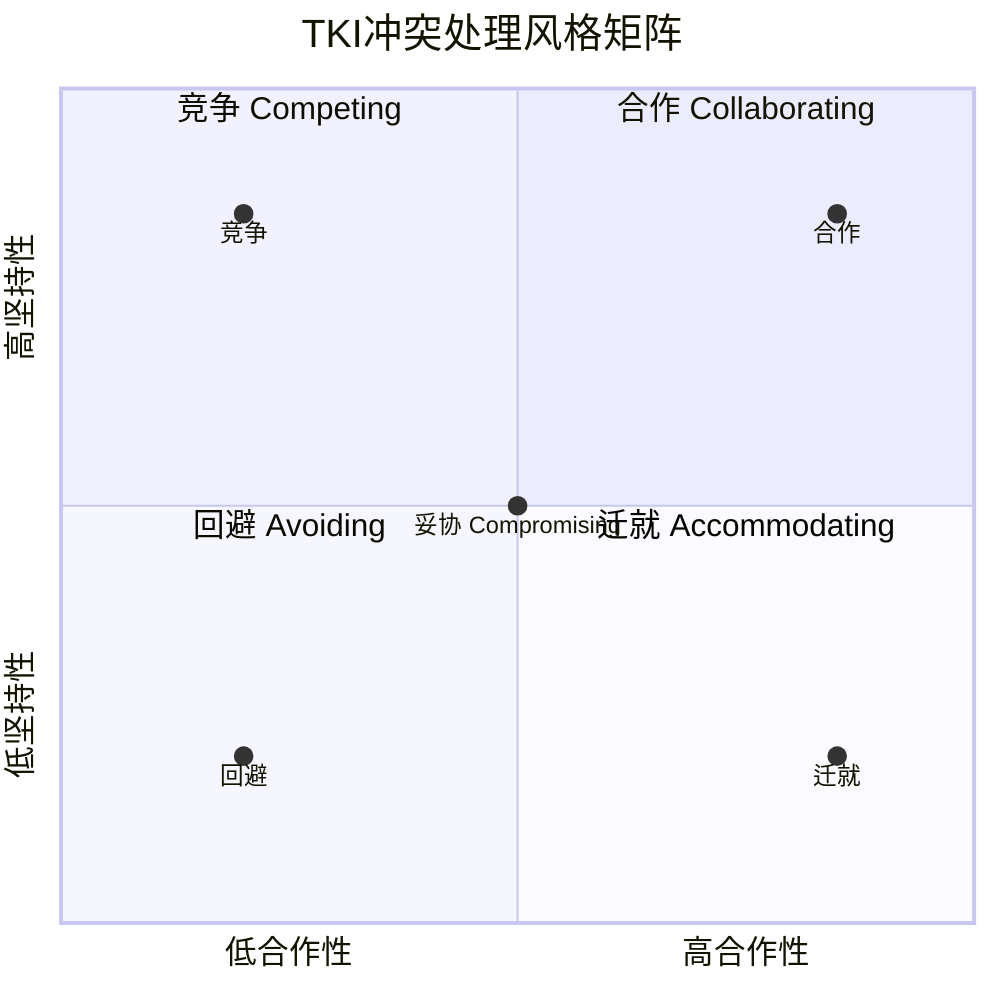
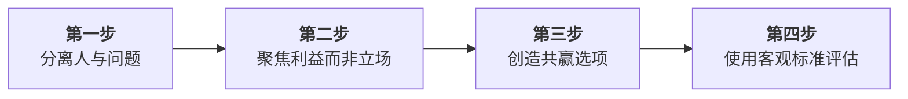
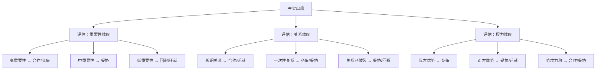
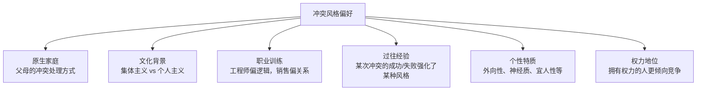

## 五、Thomas-Kilmann冲突模式工具（TKI）

### 5.1 模型概述与理论起源

Thomas-Kilmann冲突模式工具（Thomas-Kilmann Conflict Mode Instrument，简称TKI）是由心理学家Kenneth W. Thomas和Ralph H. Kilmann于1974年开发的冲突处理风格评估工具。经过半个世纪的实证检验，TKI已成为全球使用最广泛的冲突管理评估工具之一，被翻译成超过30种语言，应用于企业管理、心理咨询、教育、外交等领域。

TKI的核心价值不在于告诉你"你是什么类型"，而在于提供一个**行为选择地图**——让你看到冲突处理的全部可能性，并根据情境灵活选择最合适的策略。

#### 5.1.1 理论谱系

TKI并非凭空产生，它站在前人研究的肩膀上。理解其理论脉络，有助于更深刻地把握模型的设计逻辑：

| 时间 | 学者/模型 | 贡献 | 与TKI的关系 |
|------|-----------|------|-------------|
| 1964 | Blake & Mouton 管理方格 | 提出以"关注人"和"关注生产"两个维度描述管理风格 | TKI的二维框架直接借鉴了这一思路 |
| 1968 | Lawrence & Lorsch | 将冲突风格分为强迫、整合、回避、折衷 | 为TKI的五种风格提供了雏形 |
| 1970 | Hall 冲突模型 | 提出竞争、退缩、妥协、整合、无行动五种风格 | 与TKI高度相似，但缺乏标准化评估工具 |
| **1974** | **Thomas & Kilmann TKI** | **标准化自评量表 + 双维度理论框架** | **第一个兼具理论严谨性和实操便利性的工具** |
| 1981 | Fisher & Ury 利益导向谈判 | 区分立场与利益，提出BATNA概念 | 为TKI的"合作"风格提供了完整方法论 |
| 2000s | 修订版TKI | 增加在线版本和更细致的分数解读 | 适应数字化时代的评估需求 |

#### 5.1.2 双维度框架

TKI的核心创新在于，将复杂多样的冲突行为压缩到两个正交维度上：

- **坚持性（Assertiveness）**：个体在多大程度上试图满足自身利益和需求——从完全放弃自我主张到不惜一切代价争取。注意：坚持性不等于攻击性，高坚持性意味着"我清楚自己要什么并愿意为此努力"，而非"我要压倒你"。
- **合作性（Cooperativeness）**：个体在多大程度上试图满足对方利益和需求——从完全无视对方诉求到主动帮助对方实现目标。高合作性意味着"我认真对待你的需求"，而非"我无条件顺从你"。

这两个维度各自独立、互不制约，组合后形成一个2×2矩阵，覆盖五种冲突处理风格：

五种风格的核心定位总结：

| 风格 | 坚持性 | 合作性 | 核心逻辑 | 一句话概括 |
|------|--------|--------|----------|-----------|
| 竞争 Competing | 高 | 低 | 我赢你输 | "这是底线，没有商量余地" |
| 合作 Collaborating | 高 | 高 | 你赢我也赢 | "我们一起找到最好的方案" |
| 妥协 Compromising | 中 | 中 | 各让一步 | "咱们各退一步，先解决眼前问题" |
| 回避 Avoiding | 低 | 低 | 暂不处理 | "现在不是谈这个的时机" |
| 迁就 Accommodating | 低 | 高 | 你赢就好 | "你的需求比我的更重要" |

这五种风格在矩阵中的位置不是非此即彼的标签，而是一个连续光谱。大多数人在不同情境下会表现出不同的风格，只是存在一个默认偏好。研究显示，约65%的人有一个明显的主导风格，约30%有两个风格交替使用，只有5%的人能在五种风格间灵活切换。

#### 5.1.3 TKI量表的构成

标准TKI量表包含30道强迫选择题（forced-choice pairs），每道题提供两个选项，分别代表两种不同的冲突行为方式。30道题覆盖了五种风格两两配对的10种组合（C(5,2)=10），每种组合出现3次。

受测者需要在每对描述中选择"更符合自己在冲突中行为"的一项，而非评价哪个"更好"。这种设计有两个优势：

1. **消除社会期许偏差**：无法通过选择"看起来正确"的答案来美化自己
2. **强制区分**：即使两个选项都看起来合理，也必须做出选择，从而暴露真实的倾向性

完成量表后，每个风格会得到一个0-12的原始分数，反映受测者使用该风格的相对频率。

**量表设计的数学原理**：30道题中，每种风格出现12次（与其他4种风格各配对3次）。选择A风格的次数累加后得到A风格的原始分（0-12分）。五种风格的原始分之和等于30（每道题选一个选项），但各风格分之和不一定等于60，因为每道题的两个选项分属不同风格的计分。这种设计确保了五种风格之间是相对独立的测量。

### 5.2 五种冲突处理风格深度解析

#### 5.2.1 竞争（Competing）——高坚持性、低合作性

竞争风格的核心逻辑是"我赢你输"。竞争者将冲突视为零和博弈，优先确保自身利益得到最大化满足，对方的利益退居次要地位。

**行为特征**：
- 直接表达立场和诉求，不绕弯子
- 善于利用手中的权力、资源和信息优势
- 倾向于用论据和事实支撑自己的立场
- 在压力下保持坚定，不容易被说服改变立场
- 可能使用威胁、施压等强硬手段
- 决策速度快，执行力强
- 对"赢"有明确的定义和标准

**典型场景与决策逻辑**：

| 场景 | 为什么竞争是最佳选择 | 具体表现 |
|------|---------------------|----------|
| 紧急危机决策 | 时间不允许民主协商 | "这件事我来定，出了问题我负责" |
| 原则性问题 | 核心价值观不可让步 | "这不是谈判的问题，这是底线" |
| 对方在试探底线 | 让步会被视为软弱信号 | "我已经明确告诉你了，不会有第二次" |
| 推行必要的变革 | 新政策必然触动部分人利益 | "这个调整对公司长期发展是必要的" |
| 自卫情境 | 对方的行为已经越界 | "如果你继续这样，我会采取正式措施" |
| 保护下属 | 团队成员无法自保时需要管理者出面 | "这个决定有问题，我替团队拒绝" |

**实际案例**：一家制造企业的质量总监发现，工厂为了赶工期正在跳过关键的质量检测步骤。质量总监直接行使一票否决权，叫停了生产线。生产经理强烈反对，认为会延误交付。但质量总监坚持：产品安全是不可谈判的底线。三天后，检测结果发现一批原材料存在严重缺陷，如果流入生产线将导致大规模召回。竞争风格在此挽救了公司数百万的损失。事后质量总监专门召开会议解释了决策依据，赢得了生产团队的理解。

**竞争风格的沟通话术**：

有效的竞争不是拍桌子骂人，而是坚定而专业地表达立场。以下是实用话术模板：

亮明立场：
"经过充分考虑，我的决定是……，原因是……"
"我理解你的观点，但在这个问题上我需要坚持……"

设定边界：
"这是我们的底线，不能退让"
"在X问题上我们可以讨论，但Y是不可谈判的"

应对施压：
"我理解时间紧迫，但仓促决定的后果更严重"
"如果你有不同的方案，请提供数据支撑"

关闭争论：
"我们已经讨论了充分的时间，现在需要做出决定"
"这件事由我负责，出了问题我来承担后果"

**使用竞争风格的注意事项**：
- 不要把"竞争"等同于"攻击性"。专业的竞争是基于理性和权威的坚定立场，而非情绪化的对抗
- 竞争风格消耗"关系资本"。每次使用都在透支信任储备，需要在其他场景中补充"情感存款"
- 竞争之后必须解释原因。让对方理解你的决策逻辑，否则积累的只是怨恨而非尊重
- 竞争前确保你有充分的信息支撑。没有数据支撑的"坚持"只是固执
- 使用竞争风格时注意语气和措辞——坚定≠粗暴，"我坚持"比"你必须"更有效

**过度使用竞争风格的信号**：
- 会议中总是你在说话，别人在沉默
- 团队成员不再提出不同意见
- 同事开始绕过你做决策
- 你感到越来越孤独
- 别人对你的评价中频繁出现"强势""固执""不好合作"
- 你的方案执行时经常遇到隐性抵抗

#### 5.2.2 合作（Collaborating）——高坚持性、高合作性

合作风格的核心逻辑是"你赢我也赢"。合作者拒绝接受"冲突必然有赢家和输家"的假设，转而探索是否能创造性地找到满足双方核心需求的方案。

**行为特征**：
- 主动分享信息，同时深入了解对方的诉求
- 将问题视为"我们共同面对的挑战"而非"你我之间的对立"
- 善于区分"立场"和"利益"——表面要求可能不同，底层需求可能兼容
- 愿意投入时间和精力进行深度对话
- 追求最优解而非最容易达成的解
- 善于整合不同观点，创造新的可能性
- 注重过程的公平性和参与感

**核心方法论——利益导向谈判四步法**：

合作风格并非简单的"大家坐下来聊聊"，它需要结构化的方法支撑：

**第一步：分离人与问题**

把"对手"变成"坐在桌子同一边解决问题的伙伴"。承认双方都有合理的诉求和情感，避免人身攻击和贴标签。

具体做法：
- 用"我"句式而非"你"句式："我担心时间线不够"而非"你们效率太低"
- 把情绪和议题分开处理："我理解你对这个问题感到沮丧，让我们先看看事实是什么"
- 在白板或纸上把"人"和"问题"分别列出，物理上区分开

**第二步：聚焦利益而非立场**

立场是表面的"我要什么"，利益是深层的"我为什么需要这个"。

经典案例——"橙子之争"：两个孩子争一个橙子，表面上立场不可调和（都要整个橙子）。深入了解后发现，一个孩子要橙子皮做蛋糕，另一个要橙子汁喝。最终方案：一个拿皮，一个拿汁，双方需求100%满足。

实操话术：
"你能帮我理解一下，这个方案对你来说最重要的部分是什么？"
"如果这个问题解决了，对你来说意味着什么？"
"除了你刚才说的，还有什么是你关心的？"
"假设你得到了你想要的，你最担心失去的是什么？"

**第三步：创造共赢选项**

运用头脑风暴，暂时搁置评判，尽可能多地生成可能的解决方案。常见的创造性策略包括：
- **扩大蛋糕**：引入新的资源或可能性，使双方的核心诉求都能被满足
- **利益交换**：找到对一方重要但对另一方不太重要的议题，进行交叉让步
- **缩小差距**：将大冲突拆分为多个小议题，逐个寻找双方都能接受的方案
- **引入新维度**：通过改变时间线、范围、条件等参数，打开新的解决空间
- **引入外部资源**：是否有第三方可以提供双方都接受的资源或方案

头脑风暴的规则：
1. 先不评判——任何想法都可以提，不讨论可行性
2. 数量优先——目标是尽可能多的选项，而非最好的选项
3. 鼓励疯狂想法——极端的想法可能激发出真正创新的方案
4. 组合和改进——在他人的想法基础上发展
5. 每个人都参与——不允许旁观

**第四步：使用客观标准**

当双方对方案有分歧时，引入外部标准——行业惯例、市场数据、专家意见、法律法规——作为判断依据，避免陷入"谁的嗓门大谁说了算"的陷阱。

常用的客观标准类型：
- 行业标准和最佳实践
- 市场调研数据和竞品分析
- 专家意见和第三方评估
- 法律法规和公司制度
- 历史数据和先例
- 科学研究和专业文献

**实际案例**：市场部和技术部在产品发布日期上产生冲突。市场部希望提前两个月发布以抢占窗口期，技术部坚持需要两个月的额外测试时间。双方进入合作谈判后发现：市场部的核心利益是"在竞品发布前建立用户认知"，技术部的核心利益是"确保上线后不出现严重Bug"。最终方案：先发布一个精简功能版本（MVP）抢占市场，同时技术部继续测试完整版本，两个月后推送完整功能更新。双方的核心利益都得到了满足。

**合作风格的完整会议流程**：

会前准备（各15分钟）：
  - 各方明确自己的核心利益（不是立场，是利益）
  - 各方准备支撑数据和案例
  - 双方同意会议目标："找到双方都满意的方案"

开场（5分钟）：
  - 明确会议规则：对事不对人、充分表达、不打断
  - 确认共同目标："我们都希望这个问题得到最好的解决"

信息交换（15-20分钟）：
  - 各方陈述自己的核心利益和关切
  - 对方复述确认："你的核心关切是……我理解得对吗？"
  - 追问深层需求："除了你说的这些，还有什么对你很重要？"

方案探索（20-30分钟）：
  - 头脑风暴：列出所有可能的方案（不评判）
  - 评估方案：用客观标准逐个筛选
  - 组合优化：将不同方案的元素组合

决策与跟进（10分钟）：
  - 确认最终方案和各自的责任
  - 设定检查节点
  - 安排关系维护对话

**合作的前置条件**：
- 双方都有解决问题的意愿（如果一方只想赢，合作无法启动）
- 存在最低限度的信任基础（至少相信对方不会恶意利用你的坦诚）
- 有足够的时间窗口（合作需要深度对话，不适合分秒必争的场景）
- 双方都有能力表达自己的核心需求（沟通能力是合作的基础设施）
- 双方在权力上不存在极端不对等（权力差距过大时，弱势方难以坦诚表达）

#### 5.2.3 妥协（Compromising）——中坚持性、中合作性

妥协风格的核心逻辑是"各让一步，达成中间方案"。妥协者承认双方都有合理的利益诉求，但认为完美方案要么不存在要么成本太高，因此选择务实的折中。

**行为特征**：
- 迅速识别双方的底线和让步空间
- 擅长在多个议题间进行利益交换
- 对结果的期望是"够好"而非"最优"
- 愿意放弃部分利益以换取对方的同等让步
- 处理速度快，效率高
- 关注"可行解"而非"最优解"

**妥协的适用边界**：

妥协并非"偷懒的合作"，在以下场景中它就是最优策略：

| 适用场景 | 为什么妥协优于合作 | 具体案例 |
|----------|-------------------|----------|
| 目标互斥且可分割 | 蛋糕就这么大，分法不同而已 | 两个部门争预算，最终各让20% |
| 时间高度紧迫 | 合作的时间成本不可接受 | 24小时内必须确定供应商 |
| 合作失败后的后备方案 | 既然最优解找不到，先解决当务之急 | 价格谈判陷入僵局，先签一个临时协议 |
| 多方利益交织 | 完美协调所有方的成本过高 | 跨部门项目中各方的资源分配 |
| 风险适中的重复博弈 | 单次让步建立互惠预期 | 长期合作伙伴之间的日常分歧 |
| 信息不完整 | 没有足够数据支撑深度合作 | 新项目的初期资源分配 |

**妥协的实操技巧**：

有效的妥协不是简单的"五五开"，而是有策略的利益交换：

技巧一：议题分解法
  大议题 → 拆成多个小议题 → 每个小议题上各有让步 → 整体接近公平

技巧二：价值排序法
  各方对议题的重要性排序不同 → A把对B重要但对A不重要的让出去 → 双方都"赢了"自己最在意的

技巧三：条件交换法
  "我可以在X上让步，条件是你在Y上给我支持"
  "如果时间延长两周，我可以接受价格上调5%"

技巧四：分阶段方案
  先签临时协议解决当前问题 → 同时约定后续重新评估的时间点 → 减少一次性妥协的决策风险

**妥协的常见陷阱**：

1. **过早妥协**：还没有充分探索共赢可能性就各让一步，浪费了潜在的增量价值。对策：在妥协之前，至少花10分钟问"还有没有第三选项？"
2. **被操控的妥协**：一方故意提出极端立场，通过"让步"获取原本就期望的结果（锚定效应）。对策：评估方案的绝对合理性，而非仅看"让步幅度"
3. **无原则妥协**：为了"不得罪人"而在核心利益上退让，积累了深层不满。对策：事先明确自己的"不可谈判项"，在这些项目上不允许妥协
4. **路径依赖**：把妥协变成默认风格，不再尝试更高收益的合作方案。对策：定期反思"我们有没有在默认妥协中浪费了创造更好方案的机会？"

**实际案例**：两个创业合伙人对公司扩张方向产生分歧——A主张先拓展华东市场，B主张先深耕华南市场。双方各有数据支撑自己的判断。经过两轮讨论后达成妥协：同时启动两个市场，但各分配70%资源到自己主导的区域、30%到对方区域，三个月后根据实际数据重新分配。这个妥协方案既尊重了双方的判断，又建立了数据驱动的决策机制。

#### 5.2.4 回避（Avoiding）——低坚持性、低合作性

回避风格的核心逻辑是"不处理也是一种处理"。回避者暂时搁置冲突，既不推动自身诉求，也不关注对方诉求。

**行为特征**：
- 推迟讨论、转移话题、改变议题
- 保持沉默或模糊表态
- 退出冲突场景（离开会议室、不回消息）
- 将问题转交给其他人或机构
- 声称"没有足够的信息做决定"
- 减少与冲突方的接触频率

**回避的战略价值——被低估的高明策略**：

回避常被误解为"懦弱"或"不负责任"，但经验丰富的管理者知道，战略性回避是一种高级的冲突管理技能。以下场景中，回避不仅合理，而且是最优选择：

**场景一：情绪过载期**
当冲突双方都处于愤怒或激动状态时，任何理性讨论都无法进行。此时主动提出"让我们都冷静一下，明天再谈"，不是逃避，而是为后续的有效对话创造条件。研究显示，情绪高峰期的认知能力下降约40%，决策质量大幅降低。大脑的杏仁核在情绪激动时会劫持前额叶皮层的理性决策功能，这就是为什么人在愤怒时说出的话往往事后会后悔。

**场景二：信息不充分**
如果冲突的根源是信息不对称或关键事实未确认，贸然做出决定可能造成更大的问题。"我们需要更多数据再做判断"是负责任的回避。

**场景三：非核心议题**
每个人的精力和关系资本都是有限的。在非核心议题上消耗精力，意味着在核心议题上可用的资源减少。判断议题重要性的标准是：一年后这个问题还会被记住吗？

**场景四：第三方更适合处理**
有些冲突由中立的第三方（HR、调解人、上级）介入效果更好。把问题转交不是推卸责任，而是选择最有效的处理渠道。

**场景五：权力差距悬殊**
当双方权力差距巨大，且弱势方的介入可能招致更大的报复时，暂时回避是保护自身利益的理性选择。这不是"认怂"，而是等待更有利的时机。

**场景六：冲突本身会自行消解**
有些冲突是暂时性的——项目截止日前的压力冲突、季节性的情绪波动。如果判断冲突会随时间自然缓解，投入精力干预反而是浪费。

**回避的时机选择话术**：

建议暂停：
"这个问题很重要，我想认真对待。现在时间有限，我们明天上午专门讨论可以吗？"
"我需要时间消化一下你刚才说的，能给我一天时间想想吗？"

转交第三方：
"这个问题涉及HR政策，建议我们咨询一下HR部门的意见"
"这件事的决策权不在我们这里，需要上报领导决定"

降低优先级：
"这个议题确实需要关注，但目前A项目是最高优先级。我们下个季度再处理可以吗？"

**回避的真正风险**：

虽然回避有其价值，但长期的、习惯性的回避会导致严重的后果：

- **问题积压**：小问题积累成大问题，最终以更剧烈的方式爆发。就像水坝一样——小裂缝不修补，最终会溃坝
- **信任侵蚀**：对方感到被忽视、不被尊重，关系逐渐冷化。研究表明，冲突中的"被忽视"比"被反对"更伤人
- **机会成本**：错失在冲突早期阶段以低成本解决问题的窗口。冲突越晚处理，解决成本越高
- **自我压抑**：长期不表达自己的需求会导致心理压力和怨恨，最终可能以不健康的方式爆发
- **模式固化**：回避成为自动反应，丧失了发展其他风格能力的机会

**判断回避是否合适的核心问题**：

我现在不做决定，之后还有机会做吗？如果答案是肯定的，回避可能是合理的。如果拖延会导致不可逆的后果，就应该立即行动。

自检清单：
□ 这个冲突的核心信息是否充分？（不充分 → 有理由回避去收集信息）
□ 双方的情绪状态是否适合理性讨论？（不适合 → 有理由回避等待冷静）
□ 这个议题在整体优先级中排第几？（排后 → 有理由回避聚焦重要的事）
□ 拖延处理是否会导致不可逆的后果？（会 → 必须立即行动，不能回避）
□ 是否有更合适的第三方可以介入？（有 → 可以转交，但需跟踪进展）

#### 5.2.5 迁就（Accommodating）——低坚持性、高合作性

迁就风格的核心逻辑是"你赢就好"。迁就者主动让步，优先满足对方的需求，将自己的诉求暂时放在一边。

**行为特征**：
- 主动表示理解和认同对方的立场
- 放弃自己的主张，接受对方的方案
- 在对方需要帮助时立即响应
- 即使内心不同意，表面也保持顺从
- 强调"关系和谐"比"对错"更重要
- 善于倾听和情感支持

**迁就的战略价值——同样被低估的策略**：

迁就常被误解为"软弱"或"没主见"，但在以下场景中，迁就是经过深思熟虑的战略选择：

**场景一：你确实错了**
在争论过程中发现自己判断有误，及时承认并迁就对方的正确方案，不仅解决了问题，还展示了专业精神和诚信。强撑错误立场只会损害自己的信誉。心理学中的"升级承诺"（escalation of commitment）陷阱表明，人们倾向于为已经投入的立场持续辩护，即使证据表明自己错了。克服这个陷阱需要勇气和诚实。

**场景二：议题对对方更重要**
这个问题对你来说是A类（一般重要），对对方来说是S类（极其重要）。你让步的成本很低，但对方获得的收益很高。从"投资回报"的角度看，迁就是理性选择。

**场景三：积累关系资本**
在非关键议题上主动让步，相当于往"情感银行账户"里存款。当未来你在重要议题上需要对方的支持时，这些存款会发挥作用。管理学研究证实，高绩效团队中"积极互动与消极互动"的比例约为5:1（John Gottman的研究最初在婚姻关系中发现这个比例，后被推广到所有关系），主动迁就是创造积极互动的重要方式。

**场景四：帮助他人成长**
作为管理者或导师，在低风险场景中让下属按自己的方案执行（即使你认为不是最优），给他们提供试错和学习的机会。代价是可控的，收获是长远的。

**场景五：修复已破裂的关系**
当关系已经出现裂痕时，坚持己见只会加剧对立。适度的迁就可以传递善意信号，为重建信任创造空间。

**场景六：对方掌握更多信息**
当对方在某个领域明显比你专业，而你没有足够的信息来有效坚持自己的立场时，信任对方的判断是明智的选择。

**迁就的沟通方式**：

有效的迁就不是沉默退让，而是有意识地表达支持和理解：

表达认同：
"你说的有道理，我同意按你的方案来"
"在这件事上你比我更有经验，我信任你的判断"

明确选择：
"这件事对你更重要，我愿意让步"
"我们在A上配合你，希望在B上你能支持我们"

设置预期：
"这次我支持你的方案，下次类似情况我们也互相理解"
"我同意你的决定，同时想确认一下……"

**迁就的风险**：

- **需求长期压抑**：总是把别人的需求放在前面，自己的需求被持续忽略，最终导致情绪耗竭。研究显示，长期压抑自身需求与职业倦怠高度相关
- **被当作理所当然**：如果对方不理解你的让步是主动选择，可能误认为你"本来就应该让"
- **失去影响力**：频繁迁就会让他人认为你没有坚定的立场，从而在未来的决策中忽视你
- **怨恨积累**：表面上愉快地让步，内心却在积累不满，这种"被动攻击"最终会损害关系
- **自我价值感下降**：长期忽视自己的需求会导致"我不重要"的内在信念

**关键区分**：健康的迁就是"我选择让你"，不健康的迁就是"我不敢不让"。前者源于自信和战略思考，后者源于恐惧和低自我价值感。检验方法：如果你的让步伴随着内心的平静和清晰的战略考量，那是健康的；如果伴随着焦虑、愤怒或自我否定，那是不健康的。

### 5.3 风格选择的决策框架

没有一种风格在所有情境下都是最优的。有效的冲突管理者的核心能力不是"用哪种风格"，而是"如何根据情境选择合适的风格"。

#### 5.3.1 情境评估三维度

**重要性维度评估**：
- 高重要性：影响核心利益、长期目标、原则性问题
- 中重要性：影响短期目标、可量化利益、操作层面分歧
- 低重要性：个人偏好、非核心流程、面子问题

**关系维度评估**：
- 长期关系：需要持续合作的同事、上级、长期客户
- 一次性关系：不会再次打交道的供应商、短期合作方
- 关系状态：良好 → 有合作基础；紧张 → 需要修复；破裂 → 先止损再重建

**权力维度评估**：
- 我方优势：拥有对方需要的资源、信息、权力或选择权
- 对方优势：对方拥有我方需要的资源、信息、权力或选择权
- 势均力敌：双方各有筹码，谁也无法单方面决定

#### 5.3.2 快速决策矩阵

在时间紧迫的情况下，可以使用以下快速决策矩阵：

| 情境组合 | 推荐风格 | 理由 |
|----------|----------|------|
| 高重要 + 长期关系 + 时间充裕 | 合作 | 值得投入最大化收益 |
| 高重要 + 短期关系 + 时间充裕 | 竞争 | 最大化自身收益 |
| 高重要 + 时间紧迫 | 竞争/妥协 | 先做决定，后续可调整 |
| 中重要 + 有让步空间 | 妥协 | 效率与公平的平衡点 |
| 低重要 + 非核心关系 | 回避 | 不值得消耗精力 |
| 高重要 + 你错了 | 迁就 | 诚信比面子重要 |
| 高重要 + 对方优势大 | 迁就/妥协 | 保存实力 |
| 高重要 + 情绪高涨 | 回避→合作 | 先冷静，再深度讨论 |
| 中重要 + 对方非常在意 | 迁就 | 低成本换取高关系收益 |
| 原则性问题 + 任何情境 | 竞争 | 底线不可退让 |

#### 5.3.3 风格组合策略

成熟的冲突管理者很少在整个冲突过程中只使用一种风格。更常见的是，根据冲突的阶段切换风格：

**阶段一：冲突爆发期**
优先使用**回避**（如果情绪过高）或**竞争**（如果需要明确立场）。目的是"降温"或"亮明底线"。

**阶段二：信息交换期**
切换到**合作**，深入了解对方的需求和约束条件。这是探索共赢方案的窗口。

**阶段三：方案协商期**
根据探索的结果，选择**合作**（找到了共赢可能）或**妥协**（没有共赢空间，务实折中）。

**阶段四：关系修复期**
无论最终采用哪种方案，适当使用**迁就**来修复关系、表达善意、维护长期合作基础。

**实际案例——风格切换**：

一个部门经理与下属因绩效评估产生冲突：
阶段一（冲突爆发）：下属对绩效评级不满，情绪激动
  → 经理使用"回避"："我理解你现在很沮丧，我们都冷静一下，
     明天上午10点专门讨论这个问题"

阶段二（信息交换）：冷静后的深度对话
  → 经理使用"合作"："你能帮我理解一下，你觉得哪个部分的评估
     不够准确？我们一起看看数据"

阶段三（方案协商）：发现评估标准确实存在模糊之处
  → 经理使用"合作→妥协"："我同意这个标准需要优化。我们一起
     修订标准，但这次的评估先按调整后的标准重新打分，
     其中30%权重按新标准，70%按原标准"
  → 下属接受妥协方案

阶段四（关系修复）：
  → 经理使用"迁就"："这次评估过程中确实有不够透明的地方，
     这是我的责任。下个季度我会提前和你沟通评估标准"

#### 5.3.4 决策中的常见认知偏差

在选择冲突风格时，以下认知偏差会影响判断：

| 偏差 | 表现 | 纠正方法 |
|------|------|----------|
| 默认模式依赖 | 不管什么情况都用同一风格 | 刻意暂停，用三维评估框架检查 |
| 面子顾虑 | 因为"丢面子"而回避本应合作的议题 | 区分"面子"和"实质利益"，问自己"一年后这个面子还重要吗" |
| 报复驱动 | 因为对方之前伤害过你而选择竞争 | 识别情绪来源，区分"对事"和"对人" |
| 乐观偏差 | 高估合作成功的可能性 | 评估双方的信任基础和历史关系 |
| 损失厌恶 | 因为害怕"失去"而过度竞争或回避 | 量化"让步的实际成本"，往往比想象中低 |
| 确认偏差 | 只关注支持自己立场的信息 | 主动寻找反面证据，问"如果对方是对的呢？" |
| 沉没成本 | 因为已经投入很多而坚持不合适的风格 | 关注"从现在起怎么做最好"，而非"已经投入了多少" |

### 5.4 TKI量表自测与解读

#### 5.4.1 如何完成TKI评估

标准TKI量表为自评工具，完成时间约15-25分钟。虽然完整的标准化量表需要购买授权（通过CPP, Inc.或其授权经销商），但理解其逻辑有助于自我评估。

**自评指南——快速定位你的冲突风格**：

回答以下问题，回忆你过去6个月中处理冲突的真实行为（不是你认为"应该"怎么做的）：

**问题1**：当与同事在方案上有分歧时，你通常会——
- A. 详细阐述自己的理由并争取支持
- B. 询问对方的想法并寻找共同点
- C. 提出一个中间方案
- D. 暂时不讨论，等合适的时机再说
- E. 优先考虑对方的意见

**问题2**：当资源有限需要分配时，你会——
- A. 为自己团队争取最大份额
- B. 了解各方需求后提出综合方案
- C. 平均分配或按比例分配
- D. 让领导或制度来决定
- E. 如果对方更需要，愿意少拿一些

**问题3**：当发现对方方案有明显问题时，你会——
- A. 直接指出问题并坚持自己的判断
- B. 提出疑问并邀请对方一起重新评估
- C. 建议各取部分元素折中
- D. 看情况决定是否说出来
- E. 尊重对方的决定，如果结果不好再提醒

**问题4**：当团队成员之间发生争执需要你介入时，你会——
- A. 根据自己的判断做出决定
- B. 组织双方坐下来一起讨论，找到最优方案
- C. 提出一个双方都能接受的折中方案
- D. 建议他们自己解决，不介入
- E. 安抚情绪更激动的一方，先维护关系

**问题5**：当你的上级做出了一个你认为不合理的决定时，你会——
- A. 准备充分的理由和数据，直接表达反对意见
- B. 私下找上级深入讨论，了解决策背后的考量
- C. 接受大部分决定，在个别细节上争取调整
- D. 保留意见，等结果出来再看
- E. 执行决定，同时做好善后准备

**问题6**：在跨部门会议中，当其他部门的提案影响了你的部门利益时，你会——
- A. 当场提出反对并陈述对部门的影响
- B. 会后找对方部门负责人深入沟通，探索双方都受益的方案
- C. 提出修改建议，做一个双方都能接受的版本
- D. 先听听其他人的意见，不急于表态
- E. 表示理解对方的出发点，看看能否在其他方面获得补偿

**评分逻辑**：
- 选A居多：**竞争型** — 你习惯通过坚持己见来解决问题。优势是决断力强、执行效率高，风险是可能忽视他人感受和积累关系冲突
- 选B居多：**合作型** — 你擅长寻找双方都满意的方案。优势是创造最大价值、建立深度信任，风险是时间成本高、在紧急情况下可能效率不足
- 选C居多：**妥协型** — 你务实高效，追求可行的中间方案。优势是处理速度快、各方都能接受，风险是可能错失更优方案
- 选D居多：**回避型** — 你倾向于延迟处理冲突。优势是避免不必要的冲突、保持灵活性，风险是问题积累和机会丧失
- 选E居多：**迁就型** — 你优先维护关系和谐。优势是建立良好关系、积累信任资本，风险是需求被长期忽视、可能失去影响力

如果你的选择分布较为均匀（没有明显多数），说明你已经具备一定的风格灵活性——这是好事。但也要注意，灵活和"没有主见"是不同的——关键在于你切换风格时是否是主动的、有意识的选择。

#### 5.4.2 分数解读

标准TKI的五个维度分数之和不一定等于60（因为强迫选择的配对设计），但相对高低反映了你的风格偏好。

**解读原则**：
- **最高分的1-2种风格**是你的默认模式，是你在压力下最可能自动采用的风格
- **最低分的1-2种风格**是你的盲区，你可能在这些风格的使用上存在能力缺口
- **没有"正确"的分数分布**。理想状态取决于你的角色、行业和常面临的情境类型
- **关注风格的灵活性**而非单一风格的高低。研究显示，高效管理者的风格多样性显著高于低效管理者
- **情境才是决定因素**：你的分数只告诉你"你通常怎么做"，不告诉你"你应该怎么做"

**不同角色的理想风格分布参考**：

| 角色 | 建议偏重风格 | 原因 |
|------|-------------|------|
| 高层管理者 | 合作 > 竞争 > 妥协 | 需要协调多方利益，同时有决断力 |
| 项目经理 | 合作 > 妥协 > 竞争 | 跨部门协调是日常，有时需要快速决定 |
| 销售人员 | 合作 > 迁就 > 妥协 | 维护客户关系，同时追求双赢 |
| 创业者 | 竞争 > 合作 > 妥协 | 需要在资源争夺中生存，同时善用合作 |
| 调解人/HR | 合作 > 迁就 > 回避 | 核心职责就是化解冲突 |
| 技术人员 | 合作 > 回避 > 竞争 | 技术问题需要客观讨论，非技术问题可以回避 |
| 教师/培训师 | 合作 > 妥协 > 迁就 | 需要平衡教学目标和学生需求 |
| 客服人员 | 迁就 > 合作 > 妥协 | 客户满意度是首要目标 |

#### 5.4.3 识别他人的冲突风格

了解自己的风格只是第一步。更实用的能力是**识别他人的风格**，从而调整自己的应对策略。

**快速识别指南**：

| 观察维度 | 竞争型信号 | 合作型信号 | 妥协型信号 | 回避型信号 | 迁就型信号 |
|----------|-----------|-----------|-----------|-----------|-----------|
| 开场方式 | 直接亮明立场 | 先询问对方想法 | 提出折中建议 | 沉默或转移话题 | 表示理解和认同 |
| 用词习惯 | "必须""一定""我的立场是" | "我们一起""你觉得呢""双赢" | "各退一步""折中""差不多" | "再看看""不急""以后再说" | "你说了算""我没意见""都可以" |
| 肢体语言 | 前倾、手势有力、眼神直视 | 开放姿态、频繁点头、微笑 | 双手交叉思考、快速点头 | 后靠、看手机、避开眼神 | 微微低头、频繁附和、迎合笑 |
| 决策速度 | 快——"就这么定了" | 慢——需要充分讨论 | 中——"这样行不行？" | 不决定——"我再想想" | 快——"好的，按你说的来" |
| 面对反对 | 加强论证、提高声量 | 追问原因、探索新信息 | 立刻提出替代方案 | 沉默或离开 | 迅速改变立场 |

**应对策略**：

面对竞争型对手：
  → 用数据和事实回应，展示你也做了充分准备
  → 不要在他们的节奏中被带偏，保持冷静
  → 承认他们观点中的合理部分，再提出你的差异
  → 关键话术："我理解你的立场，数据上有一个不同的角度想和你分享"

面对合作型伙伴：
  → 积极回应他们的开放态度，分享你的真实需求
  → 投入时间和精力进行深度对话
  → 共同探索创新方案
  → 关键话术："我欣赏你愿意一起探讨，我的核心关切是……"

面对妥协型同事：
  → 快速识别他们的底线和让步空间
  → 在你的议题上明确优先级
  → 准备好具体的交换条件
  → 关键话术："如果我们在A上配合你，B上能否支持我们？"

面对回避型下属：
  → 不要逼迫他们立即表态
  → 给他们安全的空间和充足的时间
  → 用书面形式收集意见（比面对面压力小）
  → 关键话术："这个问题不急，你可以想想再告诉我你的想法"

面对迁就型伙伴：
  → 主动询问他们的真实想法（他们不会主动说）
  → 注意他们未说出的需求
  → 不要利用他们的迁就倾向
  → 关键话术："我想听听你真正的想法，不是'都可以'那种"

### 5.5 发展灵活的冲突处理能力

TKI模型的核心价值不在于给你贴一个标签，而在于帮助你识别并扩展自己的行为菜单。

#### 5.5.1 自我觉察阶段

**步骤一：识别你的默认风格**

问自己以下问题：
- 当别人挑战你的观点时，你的第一反应是什么？
- 你最常用的冲突解决方式是什么？
- 在压力下，你会自动采取哪种行为？
- 别人对你的冲突处理风格有什么反馈？
- 回忆最近三次冲突，你分别用了什么风格？

**步骤二：理解默认风格的成因**

冲突风格偏好受到多重因素影响：

每种因素的具体影响：
- **原生家庭**：如果你的父母习惯回避冲突，你很可能也倾向回避。如果你的家庭经常有激烈的争论，你可能对冲突的容忍度更高，更倾向竞争或合作
- **文化背景**：集体主义文化（中国、日本）更倾向回避和迁就；个人主义文化（美国、澳大利亚）更倾向竞争和合作
- **职业训练**：法律训练倾向竞争，心理咨询训练倾向合作，工程训练倾向妥协（实用主义）
- **过往经验**：某次用竞争风格成功维护了权益 → 强化竞争倾向；某次合作谈判失败 → 降低对合作的信任

**步骤三：评估默认风格的适配度**

你的默认风格在当前的工作和生活情境中是否有效？如果一个技术人员升任管理者后仍然只用回避风格处理团队冲突，必然会导致问题积累。

自检问题：
□ 我的默认风格在我的岗位上是否有效？
□ 我的默认风格在家庭关系中是否有效？
□ 我的默认风格是否导致了反复出现的问题？
□ 我是否经常在冲突后后悔自己的应对方式？
□ 我是否收到了关于冲突处理方式的负面反馈？

#### 5.5.2 刻意练习阶段

**扩展不常使用风格的具体方法**：

**如果你偏回避——练习"表达立场"**：
- 在下一次会议中，主动发言并表达一个有立场的观点
- 练习使用"我认为……"而非"可能也许大概……"
- 事先准备好自己的论据，降低临场犹豫
- 从低风险场景开始练习（选择题：午餐吃什么 vs 年度预算分配）
- 设定一个"必须发言"的规则：每次会议至少表达一次自己的观点
- 练习"3秒规则"：当有想法时，在3秒内说出来，不要等"完美的时机"

**如果你偏竞争——练习"深度倾听"**：
- 在下次争论前，先花5分钟倾听对方的理由并复述确认
- 练习提问"你的核心关切是什么？"而非"你凭什么反对？"
- 有意识地在30%的冲突中先让对方说完整
- 事后反思：有没有我不了解的信息改变了我的判断？
- 练习"钢铁人"论证：在反驳前，先把对方的论点用最强的方式复述一遍
- 设定一个"先理解后反驳"的规则

**如果你偏迁就——练习"表达需求"**：
- 练习在小事上表达不同意见（"我理解你的想法，但我的看法不太一样"）
- 为自己准备一个"立场脚本"——提前写好你的核心诉求
- 设定一个底线：在触及底线时，不管多不舒服都要说出来
- 记住：健康的冲突是关系深化的机会，不是关系破坏的信号
- 练习"三明治表达法"：认同+不同意见+建设性建议
- 每天记录一次"我今天为自己争取了什么"

**如果你偏妥协——练习"深度探索"**：
- 在下一次准备"各退一步"之前，先花10分钟探索有没有第三选项
- 问对方："如果不受任何限制，你最理想的方案是什么？"
- 试着扩大议题范围，引入新的可能性
- 建立一个"合作检查清单"：我真的已经穷尽了共赢的可能性吗？
- 练习"假设排除法"：如果我们不用考虑X限制，还有什么可能？

**刻意练习的30天计划**：

第1-7天：觉察期
  - 每天记录自己遇到的冲突和使用的风格
  - 不改变行为，只是观察和记录
  - 每天晚上花5分钟回顾当天的冲突日志

第8-14天：实验期
  - 每天尝试使用一个非默认风格至少一次
  - 从低风险场景开始
  - 记录尝试的结果和感受

第15-21天：强化期
  - 在中等风险场景中使用非默认风格
  - 寻求信任的人的反馈
  - 调整和优化自己的方式

第22-30天：整合期
  - 在不同场景中灵活切换风格
  - 建立自己的"风格选择决策流程"
  - 总结这30天的收获和成长

#### 5.5.3 风格整合阶段

经过刻意练习后，高级冲突管理者达到的境界是"无风格"——不被任何一种模式锁定，能够根据情境自如切换。这需要：

1. **建立情境判断的直觉**：通过大量的实践和反思，形成快速评估冲突情境的本能。就像围棋高手不需要逐个计算每步棋，而是凭直觉就能判断形势
2. **发展元认知能力**：能够在冲突进行中观察自己的行为，并在必要时主动调整。这是一种"旁观者视角"——你能同时参与冲突并观察自己的参与方式
3. **培养情绪调节能力**：情绪失控是风格锁定的主要原因。能在高压下保持冷静，才能保持选择的自由
4. **接受风格组合的复杂性**：在同一个冲突的不同阶段、不同议题上使用不同风格，本身就是高水平的表现

**元认知练习——冲突复盘模板**：

冲突复盘日记

日期：___________
冲突描述：_______________________________________
涉及人员：_______________________________________

我使用的风格：___________
使用原因：_______________________________________

结果评估：
  - 问题是否解决？ □完全解决 □部分解决 □未解决
  - 关系是否维护？ □关系加深 □关系不变 □关系受损
  - 我的感受如何？ □满意 □一般 □不满

如果重来一次：
  - 我会使用什么风格？___________
  - 原因：_______________________________________
  - 具体会怎么做不同？___________________________

学到了什么：_____________________________________

### 5.6 文化因素与跨文化冲突管理

冲突处理风格不是纯粹的个人选择，文化环境深刻地塑造了人们的冲突行为模式。

#### 5.6.1 霍夫斯泰德文化维度与冲突风格

| 文化维度 | 对冲突风格的影响 | 典型文化 |
|----------|------------------|----------|
| **个人主义 vs 集体主义** | 集体主义文化倾向于回避和迁就（维护群体和谐）；个人主义文化倾向于竞争和合作（表达个人主张） | 中国、日本（集体）；美国、澳大利亚（个人） |
| **权力距离** | 高权力距离文化中，下级对上级更多使用迁就和回避；低权力距离文化中，竞争和合作更普遍 | 马来西亚、菲律宾（高）；丹麦、以色列（低） |
| **不确定性规避** | 高不确定性规避文化倾向于使用明确的规则和权威来处理冲突（竞争+制度化）；低不确定性规避文化更能容忍模糊性和灵活的解决方案 | 日本、希腊（高）；新加坡、牙买加（低） |
| **男性化 vs 女性化** | 男性化文化倾向竞争，强调"赢"；女性化文化倾向妥协和迁就，强调关系维护 | 日本、匈牙利（男性化）；瑞典、挪威（女性化） |
| **长期导向 vs 短期导向** | 长期导向文化更愿意用回避和迁就来维护长期关系；短期导向文化更倾向于即时的竞争和妥协 | 中国、日本（长期）；美国、英国（短期） |

#### 5.6.2 中国文化情境下的冲突管理特征

中国文化中的冲突管理有其独特的逻辑和模式：

**面子机制**

面子（face）在中国文化中不仅是"个人尊严"，更是一种社会资源。冲突处理的核心考量之一是"如何在解决实质问题的同时保全双方的面子"。这解释了为什么：
- 公开场合更多使用回避和迁就（避免让对方在众人面前丢面子）
- 私下场合更可能使用合作和妥协（没有第三方观察，面子压力降低）
- 间接沟通（暗示、第三方传话）比直接对话更常见
- 给对方"台阶下"是中国式冲突管理的核心技能之一

**面子管理的具体策略**：
给对方面子：
  - 私下提出异议，不在公开场合反驳
  - 用"我们"而非"你"来表述问题
  - 肯定对方的出发点，再讨论具体方案
  - 让对方在自己的下属面前保持权威

保全自己的面子：
  - 用"请教"而非"质疑"的姿态表达不同意见
  - 引用客观标准而非个人判断
  - 通过提问引导对方发现自己的观点
  - 在让步时强调"为了大局"而非"因为你说得对"

**关系网络（guanxi）**

在中国，冲突不是发生在两个"个体"之间，而是发生在两个"关系网络"之间。冲突处理的目标不仅是解决具体问题，还要维护两个网络之间的关系。这使得：
- 迁就的使用频率比西方文化更高（为了维护关系网络的和谐）
- 回避不只是"拖延"，而是一种"给双方留空间"的关系维护策略
- 第三方调解（找"中间人"）非常普遍，中间人的选择本身也是一种关系行为
- 冲突的解决往往伴随着"饭局"——通过非正式场合修复关系

**和谐偏好**

"以和为贵"的价值观使得公开对抗在中国文化中被视为不成熟或不礼貌的表现。但这并不意味着中国人不处理冲突——只是处理方式更加隐蔽和间接。理解这一点，对于在中国商业环境中工作的外国人尤其重要：对方没有直接反驳你，不代表他们同意你。

**中西冲突处理对比**：

| 维度 | 中国文化倾向 | 西方文化倾向 |
|------|------------|------------|
| 开场方式 | 先建立关系，再谈问题 | 直接进入议题 |
| 异议表达 | 间接、暗示、提问 | 直接、明确、"我不同意" |
| 妥协信号 | "这个可以再商量" | "I can accept X if you give me Y" |
| 拒绝方式 | "这个比较困难"、沉默 | "No, because..." |
| 冲突后的修复 | 饭局、送礼、找中间人 | 直接道歉、书面确认 |
| 时间预期 | 给双方充足的时间和空间 | 尽快解决、明确deadline |

#### 5.6.3 跨文化冲突管理策略

在跨文化情境中处理冲突时：

1. **先了解对方的文化框架**，不要用自己的文化标准来评判对方的行为。对方选择回避可能不是因为"没主见"，而是文化规范使然
2. **调整沟通方式**：对高语境文化（中国、日本）更多使用暗示和间接表达；对低语境文化（美国、德国）更多使用明确和直接的表达
3. **建立共同规则**：在跨文化团队中，提前讨论并明确冲突处理的预期和规范
4. **使用"文化桥接者"**：团队中如果有了解双方文化的人，让他们在冲突中充当沟通桥梁
5. **增加沟通冗余**：跨文化冲突中误解概率更高，所以需要更多的确认、复述和书面记录
6. **尊重差异而非消除差异**：目标不是让所有人用同一种方式处理冲突，而是让不同方式之间能够有效协调

### 5.7 TKI在团队管理中的应用

#### 5.7.1 团队冲突风格地图

管理者可以为整个团队绘制"冲突风格分布图"，了解团队的整体倾向和潜在风险：

| 团队风格分布 | 可能的优势 | 潜在风险 | 建议干预 |
|-------------|-----------|----------|----------|
| 竞争主导型 | 决策快、执行力强 | 内耗严重、创新被压制 | 引入合作培训，建立倾听机制 |
| 回避主导型 | 表面和谐、冲突少 | 问题积累、决策质量低 | 建立结构化反馈机制，鼓励建设性争论 |
| 妥协主导型 | 效率高、不伤和气 | 缺乏突破性方案 | 设立"创新时间"，鼓励深度合作探索 |
| 迁就主导型 | 氛围好、支持感强 | 缺乏独立判断、群体思维 | 建立"魔鬼代言人"制度，鼓励不同声音 |
| 风格多样型 | 灵活适应各种情境 | 可能因风格不同产生二次冲突 | 建立团队冲突规范，明确何时用何种风格 |

**团队冲突风格评估流程**：

第一步：匿名评估（15分钟）
  让每位成员独立完成TKI自评

第二步：数据汇总
  制作风格分布雷达图，展示团队的整体画像

第三步：团队讨论（30分钟）
  - 分享分布结果（不暴露个人分数）
  - 讨论："我们的团队风格分布有什么优势和风险？"
  - 讨论："在哪些场景下我们的风格组合会出问题？"

第四步：制定规范（20分钟）
  - 基于讨论结果制定团队冲突处理规范
  - 明确在不同类型冲突中推荐使用的风格

第五步：定期复盘
  每季度回顾一次冲突处理效果，调整规范

#### 5.7.2 建立团队冲突规范

高效的团队会建立明确的冲突处理规范，而不是让冲突管理依赖个人的随机行为。一个团队冲突规范的模板：

团队冲突处理规范 v1.0

一、基本原则
  1. 当出现分歧时，首先确保双方都有充分的表达机会
  2. 对事不对人——讨论"方案的优劣"而非"谁对谁错"
  3. 任何人在任何时候都可以喊"暂停"——情绪过热时暂停是被鼓励的

二、议题分类与推荐风格
  - 原则性问题（价值观、安全、法律合规）→ 用合作方式深度讨论
  - 资源分配问题（预算、人力、时间）→ 用妥协方式快速决定
  - 实施方案问题（怎么做）→ 用合作方式探索最优方案
  - 个人偏好问题（工具选择、工作习惯）→ 用迁就或回避方式处理
  - 人事问题（招聘、评估、晋升）→ 用合作方式，引入客观标准

三、冲突升级机制
  1. 当事人自行协商（24小时内）
  2. 引入第三方调解（48小时内）
  3. 提交上级决策（72小时内）
  4. 超过72小时未解决的问题自动进入正式流程

四、冲突后的复盘
  每次重大冲突解决后，双方进行一次"关系维护对话"：
  - "这件事解决了，我们的合作关系是否需要调整？"
  - "下次遇到类似情况，我们怎么处理更好？"
  - "有什么话想说但之前没说的？"

#### 5.7.3 管理者的冲突教练角色

管理者不仅是冲突的处理者，更是团队冲突能力的培养者。以下是管理者的冲突教练框架：

**事前——预防冲突升级**：
- 定期检查团队成员之间的关系状态
- 在项目启动时明确角色分工和决策机制
- 建立常规的反馈渠道，让小问题有地方表达

**事中——引导冲突处理**：
- 当团队成员之间发生冲突时，不要急于做裁判
- 引导双方使用结构化的对话流程
- 帮助双方识别各自的核心利益
- 必要时充当中间人，但避免永远做传话筒

**事后——培养冲突能力**：
- 和团队成员一对一复盘冲突处理过程
- 提供具体的反馈："你在这个冲突中做得好的是……可以改进的是……"
- 分享自己的冲突处理经验和教训
- 推荐相关的学习资源

### 5.8 TKI与其他工具的整合应用

#### 5.8.1 TKI与DISC行为模型的整合

DISC模型将人的行为风格分为四类：支配型（D）、影响型（I）、稳健型（S）、谨慎型（C）。将TKI与DISC结合，可以更精确地理解冲突行为的底层驱动因素：

| DISC类型 | 典型TKI默认风格 | 冲触发 | 冲突中的核心需求 | 沟通策略 |
|----------|----------------|--------|----------------|----------|
| D 支配型 | 竞争 | 失去控制权 | 尊重其决策权 | 直接、高效、聚焦结果 |
| I 影响型 | 竞争/合作 | 被忽视或不被认可 | 被倾听和认可 | 营造积极氛围、给予认可 |
| S 稳健型 | 迁就/回避 | 急剧变化或被迫表态 | 安全感和稳定性 | 温和、给时间、避免突然变化 |
| C 谨慎型 | 回避/妥协 | 信息不充分或被迫快速决定 | 数据和逻辑支撑 | 提供数据、逻辑清晰、不催促 |

#### 5.8.2 TKI与情商模型的整合

Daniel Goleman的情商模型包含五个维度，其中"社会技能"直接涉及冲突管理。将TKI与情商结合：

情商维度 → TKI的支撑关系：

自我觉察 → 理解自己为什么倾向某种风格
  具体表现：知道自己的触发点、知道什么情境让自己自动切换到竞争/回避

自我管理 → 在冲突中控制情绪，保持风格选择的自由
  具体表现：面对挑衅不自动反击，面对压力不自动退缩

动机 → 理解冲突中的深层驱动力
  具体表现：知道自己为什么在乎某个议题，区分"真正重要"和"面子重要"

同理心 → 识别对方的冲突风格和深层需求
  具体表现：能读懂对方的情绪信号，理解对方的立场背后的利益

社会技能 → 根据情境灵活运用不同冲突风格
  具体表现：能在同一冲突中流畅地切换风格，引导对话走向建设性结果

#### 5.8.3 TKI与非暴力沟通（NVC）的整合

Marshall Rosenberg的非暴力沟通（观察-感受-需要-请求）为TKI的每种风格提供了底层沟通框架：

| TKI风格 | NVC元素的应用 |
|---------|--------------|
| 竞争 | 清晰表达"观察"和"请求"，但需要增加对"感受"和"需要"的觉察 |
| 合作 | 完整运用NVC四步：观察→感受→需要→请求，是NVC的天然应用场景 |
| 妥协 | 在"需要"层面寻找交集，在"请求"层面灵活调整 |
| 回避 | 可能暂时搁置表达，但NVC建议至少完成"观察"和"感受"的内部觉察 |
| 迁就 | 容易忽视自己的"需要"，NVC提醒：你的需要同样重要 |

### 5.9 TKI模型的局限性与批判

任何模型都是对现实的简化，TKI也不例外。了解其局限性有助于更合理地使用这个工具。

#### 5.9.1 理论层面的局限

1. **自评偏差**：TKI是自评工具，人们倾向于高估自己使用"好"风格（合作）的频率，低估"坏"风格（竞争、回避）的使用频率。他评数据与自评数据之间通常存在显著差异。解决方案：结合360度评估，收集同事、下属和上级的反馈

2. **二维框架的简化**：将冲突行为压缩到两个维度上，忽略了许多重要的情境变量——情绪状态、权力动态、信息分布、时间压力等。现实中的冲突远比2×2矩阵复杂。解决方案：将TKI作为起点而非终点，结合其他模型补充维度

3. **忽略了冲突的动态性**：TKI将风格视为相对稳定的个人特质，但实际冲突中的行为是动态变化的。同一个人在同一个冲突的不同阶段可能表现出完全不同的风格。解决方案：在冲突的不同阶段分别评估风格使用情况

4. **文化适用性**：TKI的开发基于美国文化背景，在其他文化中的适用性存在争议。例如，"回避"在中国文化中的战略价值可能远高于在西方文化中的评估。解决方案：在跨文化应用时调整解读标准

5. **缺乏冲突类型的区分**：TKI没有区分任务冲突（对工作内容的分歧）、关系冲突（人际间的情绪对立）和过程冲突（对流程和分工的不满）。不同类型冲突可能需要不同的风格策略

#### 5.9.2 实践层面的局限

1. **评估的时间窗口问题**：TKI询问的是"总体倾向"，但一个人的冲突风格可能在工作场景和家庭场景中完全不同。单一的风格画像可能掩盖了重要的情境差异。解决方案：在不同场景中分别评估

2. **从评估到行为的鸿沟**：知道自己的冲突风格不等于能改变行为。改变深层的行为模式需要持续的练习、反馈和支持系统。解决方案：制定具体的练习计划，建立反馈机制

3. **可能强化标签效应**：过度认同"我是XX型"可能限制自我发展的意愿。"我是回避型"不应该成为回避行为的借口。解决方案：将评估结果视为"起点"而非"定义"

4. **双人互动的复杂性**：TKI评估的是个人风格，但冲突是双人甚至多人互动。你的最优选择不仅取决于你自己的风格，还取决于对方的风格以及你们之间的风格组合。解决方案：结合对方的风格来调整自己的策略

#### 5.9.3 与其他冲突模型的互补

| 模型 | 核心视角 | 与TKI的互补关系 |
|------|----------|----------------|
| DISC行为模型 | 基于支配、影响、稳健、谨慎四种行为风格 | 解释了冲突风格的行为底层逻辑 |
| 情商模型（Goleman） | 冲突管理是情商的核心能力之一 | 补充了情绪觉察和调节的维度 |
| 利益导向谈判（Fisher & Ury） | 区分立场与利益，强调共赢方案 | 为"合作"风格提供了详细的方法论 |
| 非暴力沟通（Rosenberg） | 观察-感受-需要-请求的四步沟通法 | 为所有风格的沟通技巧提供了底层框架 |
| 组织冲突理论 | 冲突分为任务冲突、关系冲突、过程冲突 | 补充了冲突类型的维度，帮助更精确地选择策略 |
| 关系冲突发展模型（Gottman） | 关系中"末日四骑士"：批评、蔑视、防御、冷战 | 补充了冲突中的关系恶化动态 |
| 冲突升级模型（Glasl） | 冲突9级升级路径 | 帮助判断冲突严重程度，选择合适的干预时机 |

### 5.10 本章总结

TKI模型的价值在于它提供了一个简洁但有力的框架，帮助我们理解冲突行为的基本模式。掌握这个模型需要经历三个层次：

**第一层：知其然** — 了解五种风格的特征、优势和局限

**第二层：知其所以然** — 理解每种风格背后的逻辑、适用条件和选择依据

**第三层：行其然** — 能够在真实冲突中灵活运用合适的风格，并在事后进行反思和改进

最终目标不是成为"某种风格的专家"，而是成为"冲突风格的自由选择者"——能够在每一个独特的冲突情境中，选择最合适的工具来达成目标。

**行动清单**：
□ 完成TKI自评，了解自己的默认风格
□ 回顾最近3次冲突，分析自己使用了什么风格
□ 识别自己的1个盲区风格，制定30天练习计划
□ 为团队建立冲突处理规范
□ 学习识别他人冲突风格的能力
□ 在下一次冲突中有意识地选择风格（而非自动反应）
□ 冲突后进行复盘，记录学到了什么

正如Kenneth Thomas本人所说：

> "真正有效的冲突管理者，不是那些找到了'最好'的冲突处理方式的人，而是那些拥有最多选择并知道何时使用哪种选择的人。"

---

**延伸阅读建议**：
- Kenneth Thomas, *Making Conflict Work*（冲突管理的最新研究）
- Kenneth Thomas & Ralph Kilmann, *Thomas-Kilmann Conflict Mode Instrument*（TKI原始文献）
- Fisher & Ury, *Getting to Yes*（合作风格的经典方法论）
- Marshall Rosenberg, *Nonviolent Communication*（所有风格的沟通基础）
- Geert Hofstede, *Cultures and Organizations*（跨文化冲突的理论框架）
- Daniel Goleman, *Working with Emotional Intelligence*（情商与冲突管理）
- Friedrich Glasl, *Confronting Conflict*（冲突升级模型）
- John Gottman, *The Seven Principles for Making Marriage Work*（关系冲突研究）
