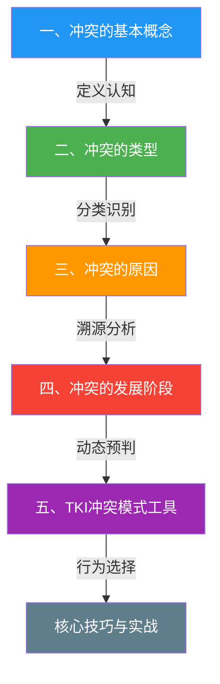
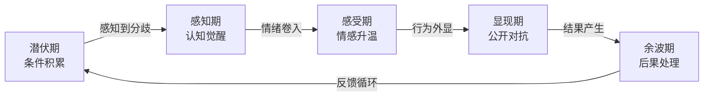

## 六、本节小结

### 6.1 为什么要回顾理论基础

在进入冲突管理的技巧学习和实战演练之前，有必要停下来做一个系统性的知识梳理。理论不是装饰品，而是操作系统的底层代码——你对冲突的理解越深刻，在真实场景中做出正确判断的概率就越高。

一个只会背诵"五种冲突风格"的人和一个真正理解"为什么在这种情境下合作优于竞争"的人，面对同一个冲突时的表现有天壤之别。前者在标准情境下尚能套用框架，一旦遇到复杂、多因素叠加的真实冲突，就会陷入"知道理论但用不上"的困境。后者因为理解了底层机制，能够灵活拆解情境、组合策略，即使面对从未遇到过的冲突类型也能从容应对。

本节小结的目标有三个：

1. **巩固核心知识**——确保你记住了该记住的，理解了该理解的
2. **建立知识连接**——确保你看到各部分之间的关系，而不是把五个章节当成五个独立的知识点
3. **识别行动方向**——确保你知道下一步该练什么，带着明确的靶心进入技巧训练

> 学习的最高境界不是记住更多的知识，而是让知识之间形成网络。当你能把五个维度的理论串联成一条从识别到行动的完整链路时，你就真正具备了冲突管理的理论基础。

---

### 6.2 核心知识全景图

本节从五个维度构建了冲突管理的理论框架。下图展示了这五个维度之间的逻辑关系：

逻辑链条是这样的：首先你得知道**冲突是什么**（第一部分），然后才能判断**你面对的是哪种冲突**（第二部分），接着去分析**它为什么会发生**（第三部分），进而预测**它会怎么发展**（第四部分），最终决定**你应该怎么做**（第五部分）。这五个环节环环相扣，跳过任何一个都会导致后续判断失准。

但这个线性链条只是入门时的学习顺序。在实际运用中，五个维度是**同时运转**的——你在识别冲突类型的瞬间，就已经在做原因分析；你在预判发展阶段的同时，就在筛选合适的处理策略。真正的高手不是按顺序走流程，而是在几秒钟内完成整个认知循环。

---

### 6.3 五个维度的核心要点提炼

#### 6.3.1 冲突的基本概念——建立正确认知

这一部分最重要的收获是三个认知转变：

**认知转变一：冲突是中性的。** 冲突不等于暴力、争吵或敌意。哈佛商学院的研究表明，适度的任务冲突能将团队决策质量提升约20%。真正有害的不是冲突本身，而是对冲突的错误管理。从"冲突是坏事"转变为"冲突是信息"，这是整个冲突管理能力的起点。

**认知转变二：冲突是不可避免的。** 只要人与人之间存在互动——因为成长背景、认知框架、利益诉求和价值排序的差异——冲突就必然产生。试图消灭冲突既不可能也不明智，真正的问题是"如何有效管理冲突"而非"如何避免冲突"。

**认知转变三：冲突是可以管理的。** 冲突不是随机事件，而是有规律可循的动态过程。它有可识别的类型、可追溯的原因、可预测的发展阶段、可选择的处理策略。这些规律一旦掌握，你就能从"害怕冲突"进阶到"管理冲突"。

此外，拉扎勒斯的认知评价模型揭示了一个关键机制：同一事件，不同的人会产生完全不同的冲突反应，差异来自**初级评价**（"这件事跟我有什么关系？"）和**次级评价**（"我有能力应对吗？"）。这意味着，改变认知框架本身就改变了冲突的性质。

一个帮助理解的类比：冲突就像疼痛信号。疼痛本身不是疾病，而是身体发出的警告——告诉你某个地方出了问题需要处理。如果你选择忽略疼痛（回避冲突），问题不会消失，反而会恶化。如果你一遇到疼痛就恐慌（过度反应），小问题也会被放大。正确的做法是解读疼痛信号、定位问题根源、选择合适的治疗方案。冲突管理的全部学问，就是学会正确解读和应对"社会性疼痛"。

#### 6.3.2 冲突的类型——学会精准分类

类型学的价值在于：**不同类型的冲突需要完全不同的处理方式**，用同一种方法处理所有冲突就像用同一把钥匙开所有的锁。

本节建立了三个分类维度，每一个都有独立的实操价值：

| 分类维度 | 核心类型 | 关键区分点 | 处理启示 |
|----------|----------|------------|----------|
| **按内容** | 任务冲突、关系冲突、过程冲突 | 争论的是"做什么""谁来做"还是"怎么做" | 任务冲突可利用，关系冲突必须化解，过程冲突靠制度解决 |
| **按层次** | 内心冲突、人际冲突、群体间冲突、组织冲突 | 冲突发生在哪个层面 | 层级越高，涉及的利益方越多，解决难度越大 |
| **按性质** | 实质性冲突、情感性冲突 | 是利益之争还是情感之争 | 实质性冲突可以用理性方法解决，情感性冲突必须先处理情绪 |

其中，杰恩（Karen Jehn）的任务冲突"倒U型曲线"是本节最重要的发现之一：任务冲突过少导致群体思维（决策质量下降），过多导致决策瘫痪（且容易溢出为关系冲突），只有处于"甜蜜区"时才能真正提升团队绩效。这意味着，管理者的工作不是消除任务冲突，而是将其维持在适度水平。

**如何判断任务冲突是否处于"甜蜜区"？** 三个信号可以帮你快速评估：

- **过少的信号**：会议中无人提出异议、决策速度异常快、方案缺乏替代选项的比较
- **甜蜜区的信号**：讨论热烈但针对问题而非人身、有人提出不同角度但最终能达成共识、决策时间合理
- **过多的信号**：会议中反复争论同一点无法推进、开始出现人身攻击的苗头、团队成员对讨论表现出回避或厌倦

另一个必须记住的要点是三种内容冲突的**相互转化**路径：

任务冲突如果处理不当会升级为关系冲突——"你总是反对我"从工作方案层面滑向人身攻击。过程冲突积累到一定程度也会演变为关系冲突——"你总是不配合"。关系冲突一旦形成，反过来又会加剧任务冲突和过程冲突，形成恶性循环。

**打破转化链的关键干预点**：在任务冲突中始终保持"对事不对人"的语言规范；在过程冲突中尽早建立清晰的制度和流程；一旦发现关系冲突的苗头（如开始出现讽刺、冷暴力、背后议论），立即暂停当前争论，优先修复关系。

#### 6.3.3 冲突的原因——掌握十把诊断钥匙

这一部分最大的价值是提供了一套**系统化的冲突诊断框架**。冲突的十大成因可以分为三个层次：

| 层次 | 成因 | 核心机制 | 一句话诊断 |
|------|------|----------|------------|
| **结构性根源** | 资源稀缺 | 零和博弈下的利益对立 | "我们争的是同一块蛋糕" |
| | 目标差异 | 委托-代理问题导致的方向分歧 | "我们的KPI指向不同的方向" |
| | 权力不对等 | 资源占有不均引发的控制与反抗 | "你说的算，但凭什么？" |
| | 角色模糊与角色冲突 | 期望不清晰导致的行为冲突 | "这到底是谁的活？" |
| **认知与心理根源** | 认知偏差 | 归因偏差、确认偏差等系统性误判 | "都是他的错"（真的是吗？） |
| | 价值观冲突 | 深层信念体系的不可调和 | "我们对'对错'的定义不同" |
| | 人格与性格差异 | 大五人格等特质的行为倾向冲突 | "我们就是合不来" |
| **情境与催化因素** | 沟通障碍 | 信息不对称、表达不清、倾听不足 | "我以为你明白我的意思" |
| | 历史遗留问题 | 情感账户透支导致的信任崩塌 | "这次只是导火索，根子在以前" |
| | 外部压力 | 压力下的认知退化和耐心耗竭 | "不是我针对你，是我太累了" |

关键洞见：**大多数真实冲突不是由单一原因引起的，而是多个成因的交互作用**。一个典型的职场冲突可能是这样叠加的：

> 资源稀缺（预算有限）+ 目标差异（产品要速度、工程要质量）+ 沟通障碍（邮件来回误解）+ 历史遗留（上次项目结下的梁子）

识别出所有叠加的因素，才能找到真正的突破口。

**诊断时的常见陷阱**：人们倾向于抓住最表面、最显眼的原因（通常是沟通障碍或某次具体事件），而忽视深层的结构性根源。这就像医生只治疗发烧症状而不寻找感染源——症状暂时缓解，但病因未除，很快会复发。养成"追问三层为什么"的习惯：第一次回答给出直接原因，追问"为什么会出现这种情况"给出中间原因，再追问一次才能触及真正的根源。

#### 6.3.4 冲突的发展阶段——把握干预时机

这一部分介绍了两个互补的模型，分别解决不同层面的问题：

**庞迪五阶段模型**回答的是"冲突的完整生命周期是什么样的"：

五个阶段的核心教训是：**干预越早，代价越小**。

| 阶段 | 干预方式 | 所需资源 | 典型耗时 |
|------|----------|----------|----------|
| 潜伏期 | 调整制度、资源分配、角色定义 | 最少——一次制度修订或资源重新分配 | 几天到几周 |
| 感知期 | 一次坦诚对话、澄清期望 | 少量——1-2次一对一谈话 | 几小时到几天 |
| 感受期 | 情绪疏导、换位思考训练 | 中等——可能需要外部引导者介入 | 一到两周 |
| 显现期 | 正式调解、协商、甚至仲裁 | 大量——专业调解人、正式流程 | 数周到数月 |
| 余波期 | 关系修复、制度重建、教训总结 | 最大——可能无法完全修复 | 数月甚至更久 |

**格拉斯尔九阶段升级模型**回答的是"冲突是怎么一步步走向失控的"。它将冲突升级分为三个区间：

- **争赢区间**（阶段1-3）：双方还愿意解决问题，Win-Win仍有可能
  - 阶段1：僵化立场——双方坚持己见但仍在讨论
  - 阶段2：策略性辩论——开始使用论据攻击对方立场
  - 阶段3：行动而非言语——用实际行动施压（如拒绝配合）
- **争胜区间**（阶段4-6）：开始把对方当敌人，Win-Lose思维主导
  - 阶段4：寻求盟友——拉帮结派，试图壮大己方阵营
  - 阶段5：面子之争——问题本身已不重要，"不能输"成为核心驱动力
  - 阶段6：威胁策略——以损害对方利益为要挟
- **全面对抗区间**（阶段7-9）：不惜自损也要伤害对方，Lose-Lose结局
  - 阶段7：有限摧毁——尝试给对方造成实际损失
  - 阶段8：全面摧毁——不惜自身代价也要击垮对方
  - 阶段9：共同毁灭——"宁为玉碎不为瓦全"

格拉斯尔模型的关键洞见是"**不归点**"——冲突一旦越过阶段6（威胁策略），就很难回到合作轨道。因为在威胁和报复的循环中，双方的认知框架已经从"我们有分歧"变成了"他是敌人"。一旦形成"敌人意象"，即使客观事实发生了变化，双方也会选择性忽视和解信号。

**两个模型的整合应用**：用庞迪模型**定位冲突当前所处的生命周期阶段**（宏观判断），用格拉斯尔模型**评估冲突的升级程度**（微观判断）。两者结合，你就能同时回答"冲突走到了哪一步"和"冲突恶化到了什么程度"这两个关键问题。

一个实际的整合判断示例：你发现两个部门最近在项目归属权上频繁摩擦。用庞迪模型判断——冲突已经从潜伏期（资源分配制度不明确）进入感知期（双方都意识到了分歧）。用格拉斯尔模型判断——目前处于阶段2（策略性辩论，双方都在用数据证明自己部门更应该主导项目）。综合判断：时机很好，处于"争赢区间"的早期，双方还在讲道理，一次坦诚的三方对话大概率能化解。如果再拖两周不管，很可能滑入阶段3-4，到时候就需要更复杂的干预手段了。

#### 6.3.5 TKI冲突模式工具——掌握五把行为钥匙

TKI模型的核心创新在于，将复杂多样的冲突行为压缩到两个正交维度上——**坚持性**（满足自身利益的程度）和**合作性**（满足对方利益的程度）——形成五种风格：

| 风格 | 坚持性 | 合作性 | 核心策略 | 最佳适用情境 |
|------|--------|--------|----------|------------|
| **竞争** | 高 | 低 | 我赢你输 | 紧急决策、核心利益不可退让、需要推行不受欢迎但必要的政策 |
| **合作** | 高 | 高 | 双赢整合 | 双方利益都很重要、有充足时间、需要创新方案、关系有长期价值 |
| **妥协** | 中 | 中 | 各让一步 | 时间压力大、目标中等重要、合作和竞争都行不通时的临时方案 |
| **回避** | 低 | 低 | 搁置不理 | 问题不重要、情绪过于激烈需要冷静、无法改变现状时 |
| **迁就** | 低 | 高 | 你赢我让 | 对方利益远大于自己、维护关系更重要、自己确实有错时 |

关于TKI模型，有三个常被忽视但极为重要的认知：

**第一，没有"最好的"风格，只有"最合适的"风格。** 很多人误以为"合作"就是最好的冲突处理方式，但合作需要双方都有意愿、有时间、有信任基础。在紧急情况下果断竞争，在无关紧要的小事上灵活回避，同样是高超的冲突管理能力。真正的能力不是偏好某一种风格，而是能根据情境灵活切换。

**第二，大多数人存在"风格依赖"。** TKI自测通常会显示你最常使用1-2种风格，而极少使用其他风格。这意味着你可能在所有冲突中都用同一套策略应对，不管情境是否适合。发展灵活的冲突处理能力，关键在于刻意练习你不擅长的风格。

**第三，文化因素深刻影响冲突风格。** 在高权力距离、集体主义的中国文化情境下，回避和迁就的使用频率明显高于西方文化。这不意味着中国人"不会处理冲突"，而是反映了不同的文化价值观对冲突行为的塑造。理解这一点，在跨文化场景中尤其重要。

**风格选择的快速决策框架**：当你面对冲突不知该用哪种风格时，问自己三个问题——

1. **这个问题对我有多重要？**（决定坚持性是高还是低）
2. **对方的关系对我有多重要？**（决定合作性是高还是低）
3. **我有多少时间和资源来处理这件事？**（决定是否需要"快速但粗糙"的方案）

三个问题的答案交叉之后，大致就能锁定最合适的风格。

---

### 6.4 知识连接：理论框架的整合

五个部分的知识不是孤立存在的，它们构成一个完整的决策链条。下表展示了从理论到行动的完整路径：

| 决策环节 | 依赖的理论知识 | 关键问题 |
|----------|---------------|----------|
| **冲突识别** | 基本概念 + 类型学 | 这是冲突吗？是什么类型的冲突？ |
| **冲突诊断** | 十大成因 + 认知评价模型 | 为什么会发生？有哪些叠加因素？ |
| **趋势预判** | 庞迪模型 + 格拉斯尔模型 | 走到了哪一步？会继续恶化吗？ |
| **策略选择** | TKI五种风格 + 情境评估 | 应该用哪种风格处理？ |
| **效果评估** | 功能性/失调性判断 | 这次处理是建设性的还是破坏性的？ |

下面用两个完整的应用示例来演示如何将理论串联运用：

**示例一：团队成员频繁争执**

你的团队中两位核心成员最近频繁发生争执。

- **识别**：这是人际冲突，包含任务冲突（对技术方案有分歧）和关系冲突（已经开始互相人身攻击）。
- **诊断**：根源是目标差异（一个重性能，一个重开发速度）+ 沟通障碍（远程协作信息不同步）+ 历史遗留（之前项目就积累过不满）。
- **预判**：根据庞迪模型，已经进入显现期；根据格拉斯尔模型，处于阶段4-5（争胜区间），还来得及干预。
- **策略**：先用回避策略让双方冷静（给24小时缓冲），再用合作策略组织面对面讨论，引导双方发现共同目标。
- **评估**：如果讨论后双方达成了兼顾性能和速度的折中方案，并且对之前的言语冲突相互道歉，这就是一次成功的建设性冲突管理。

**示例二：跨部门资源争夺**

市场部和研发部同时向你申请有限的季度预算。

- **识别**：这是组织层面的实质性冲突，核心是资源分配问题。
- **诊断**：根本原因是资源稀缺（预算有限）+ 目标差异（市场要品牌曝光、研发要技术投入）+ 权力不对等（两个部门负责人的影响力不同）。
- **预判**：根据庞迪模型，目前处于感知期（双方都已提出诉求）；根据格拉斯尔模型，处于阶段1（僵化立场，还在讲道理阶段）。这是最佳干预窗口。
- **策略**：用合作策略——组织双方带着数据和ROI分析坐下来谈判，寻找双赢方案（比如分阶段投入、联合项目共享预算）。
- **评估**：如果最终方案能让双方都看到自己的核心诉求被尊重，并且建立了未来资源协商的机制，这就是一次将冲突转化为制度建设的机会。

---

### 6.5 常见认知误区回顾

在本节五大部分中反复出现了一些认知误区，这里做一次集中梳理：

| 误区 | 正确认知 | 后果 | 纠正方法 |
|------|----------|------|----------|
| "冲突是坏事，应该避免" | 冲突是中性的，适度冲突有益 | 错失利用冲突改进的机会 | 每次遇到冲突时，先问"这个冲突里有什么有价值的信息？" |
| "所有冲突都一样" | 不同类型冲突需要不同策略 | 用错方法导致冲突恶化 | 养成先分类再处理的习惯：这是任务、关系还是过程冲突？ |
| "冲突是别人引起的" | 认知偏差让我们都倾向于外归因 | 忽视自身在冲突中的角色 | 强制自己回答"我在哪些方面可能加剧了这个冲突？" |
| "沟通能解决一切冲突" | 沟通障碍只是十大原因之一 | 结构性问题靠沟通无法解决 | 先诊断成因，如果根源是资源稀缺或权力不对等，沟通只能治标 |
| "合作总是最好的选择" | 合作需要时间、信任和双方意愿 | 在不合适的场景强行合作反而浪费资源 | 评估三个条件（时间、信任、意愿），缺一不可时选其他风格 |
| "冲突爆发了才需要处理" | 潜伏期是最佳干预窗口 | 被动应对导致成本倍增 | 定期扫描团队中的潜在冲突信号：抱怨增多、协作减少、流言四起 |
| "妥协等于软弱" | 妥协是务实的策略选择 | 错误坚持导致两败俱伤 | 认识到妥协需要勇气——放弃部分诉求本身就是一种决策力 |
| "回避就是逃避" | 战略性回避是高级能力 | 不分场合地"勇敢面对"反而激化矛盾 | 问自己"现在正面冲突能达到更好的结果吗？"如果答案是否，回避就是最优解 |
| "一次冲突解决了就不会再发生" | 同样的结构性根源会反复制造冲突 | 疲于奔命地处理同类问题 | 解决冲突时追问：根源是什么？需要改变什么制度/结构来防止复发？ |
| "冲突双方是对立的" | 很多时候双方有共同利益只是认知不同 | 错失合作机会 | 在冲突中刻意寻找共同目标——"我们都希望项目成功，只是路径不同" |

---

### 6.6 从理论到实践的过渡

理论基础的学习到此告一段落。接下来的"核心技巧"部分，将把本节学到的理论转化为具体可操作的行为能力。以下是理论知识与后续技巧的对应关系：

| 理论基础 | 对应的核心技巧 | 转化要点 |
|----------|---------------|----------|
| 冲突的预防意识 | 冲突预防：在潜伏期识别和化解风险 | 学会扫描环境中的冲突信号，在矛盾激化前主动干预 |
| 冲突类型识别 + 发展阶段判断 | 冲突识别：快速判断冲突类型和严重程度 | 练习在60秒内完成分类和阶段定位 |
| TKI风格选择 | 冲突干预：选择合适的时机和方式介入 | 刻意练习弱势风格，打破"风格依赖" |
| 成因分析 + 阶段预判 | 冲突解决：针对根源的系统性解决方案 | 从"灭火"思维升级为"防火"思维 |
| 功能性冲突的认知 | 冲突后修复：将冲突转化为关系升级的契机 | 学会在冲突结束后进行结构化复盘 |

如果你在理论基础部分做了笔记或完成了自我评估，建议在进入核心技巧之前，花5分钟回顾一下自己的薄弱环节。带着问题学习技巧，效率会比泛泛而学高出数倍。

**理论到实践的三步过渡法**：

1. **默写测试**（5分钟）：合上书，尝试默写五个维度的核心要点。能写出来的才是你真正掌握的，写不出来的就是需要强化的薄弱环节。
2. **情境联想**（10分钟）：回忆你最近经历的一个真实冲突场景，尝试用五个维度的理论框架去分析它——冲突类型是什么？成因有哪些叠加？处于什么发展阶段？你当时用了什么风格？如果重来你会怎么选？
3. **刻意练习计划**（5分钟）：确定你在TKI五种风格中最不擅长的1-2种，计划在接下来一周内找机会刻意练习它们。不一定要等到真正的冲突发生——在日常讨论中就可以有意识地使用。

---

### 6.7 自检清单

在进入下一部分之前，用以下问题检验自己的掌握程度。如果大部分答案是"是"，说明理论基础已经扎实；如果有较多"否"，建议回头重读对应章节：

**基础认知层（必须全部通过）**

- [ ] 我能否用一句话解释"冲突是中性的"这个概念，并举一个适度冲突带来好处的具体例子？
- [ ] 我能否区分功能性冲突和失调性冲突，说出它们的核心判断标准？
- [ ] 我能否理解拉扎勒斯认知评价模型中的初级评价和次级评价？

**分类与诊断层（至少通过4/5项）**

- [ ] 我能否在30秒内判断一个冲突是任务冲突、关系冲突还是过程冲突？
- [ ] 我能否识别三种内容冲突之间的转化路径和预防转化的方法？
- [ ] 我能否列举至少6个冲突的成因，并说明它们如何叠加？
- [ ] 我能否用"追问三层为什么"的方法挖掘冲突的深层根源？
- [ ] 我能否区分结构性根源、认知心理根源和情境催化因素？

**动态预判层（至少通过2/3项）**

- [ ] 我能否说出庞迪五阶段模型的每个阶段及其关键特征？
- [ ] 我能否解释格拉斯尔模型中"不归点"大约在哪个阶段，以及为什么？
- [ ] 我能否同时使用两个模型对一个冲突进行宏观和微观的综合判断？

**策略选择层（至少通过3/4项）**

- [ ] 我能否描述TKI五种风格的核心特征和最佳适用情境？
- [ ] 我能否根据情境选择合适的冲突处理风格，而非依赖习惯？
- [ ] 我能否用"三个问题"快速决策框架来选择冲突风格？
- [ ] 我能否识别文化因素对冲突风格的影响？

**综合应用层（至少通过1/2项）**

- [ ] 我能否用"识别→诊断→预判→策略→评估"五步法分析一个真实冲突案例？
- [ ] 我能否区分"灭火"和"防火"两种冲突管理思维，并在实际中运用？

如果以上问题中有80%以上可以自信地回答"是"，你已经具备了扎实的冲突管理理论基础。接下来，让我们把这些知识转化为真正的能力。

---

### 6.8 进阶阅读与延伸思考

对于希望进一步深化理解的读者，以下是几个值得深入探索的方向：

**学术深化方向**

- **组织行为学视角**：Thomas-Kilmann的原始论文《Conflict and Conflict Management》（1974）详细阐述了TKI模型的理论基础和实证研究，值得精读
- **进化心理学视角**：冲突行为有深刻的进化根源——从资源争夺到群体竞争，理解这一点有助于去除对冲突的道德审判
- **神经科学视角**：fMRI研究表明，人在经历社会排斥（关系冲突的核心体验）时，大脑激活的区域与物理疼痛高度重叠。这从神经层面解释了为什么关系冲突如此令人痛苦

**实践深化方向**

- **冲突调解师的训练**：专业调解师需要掌握的核心技能——中立倾听、重构框架、引导共识——是冲突管理能力的最高形态
- **谈判学的互补知识**：冲突管理和谈判学是天然的姊妹学科。《Getting to Yes》（哈佛谈判项目）提出的"原则性谈判"与合作型冲突风格高度互补
- **系统思维的应用**：用系统动力学的"冰山模型"来看冲突——可见的事件只是冰山一角，其下是行为模式、系统结构和心智模型。最有效的冲突干预发生在最深的层面

**一个值得长期思考的问题**：在人工智能时代，人机冲突（人类与AI系统之间的分歧）正在成为一种新的冲突类型。它既不是传统的人际冲突（对方不是人），也不是简单的人机界面问题（涉及权力、信任和价值观）。这种新型冲突的管理，可能需要我们重新审视现有的理论框架。
