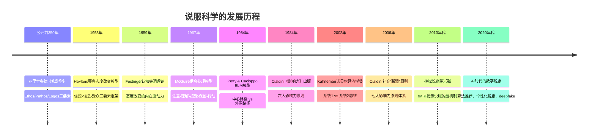
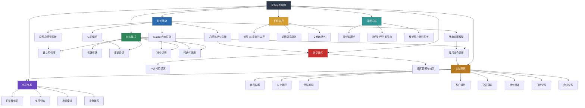
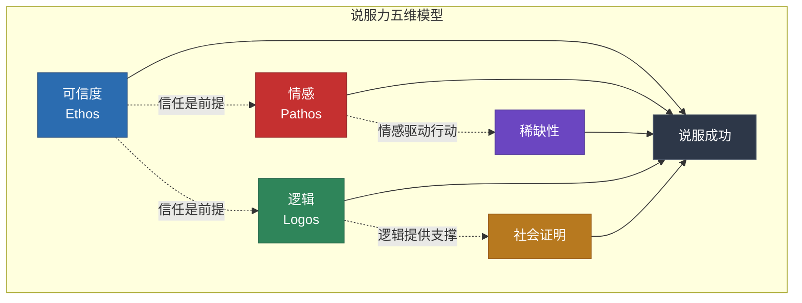
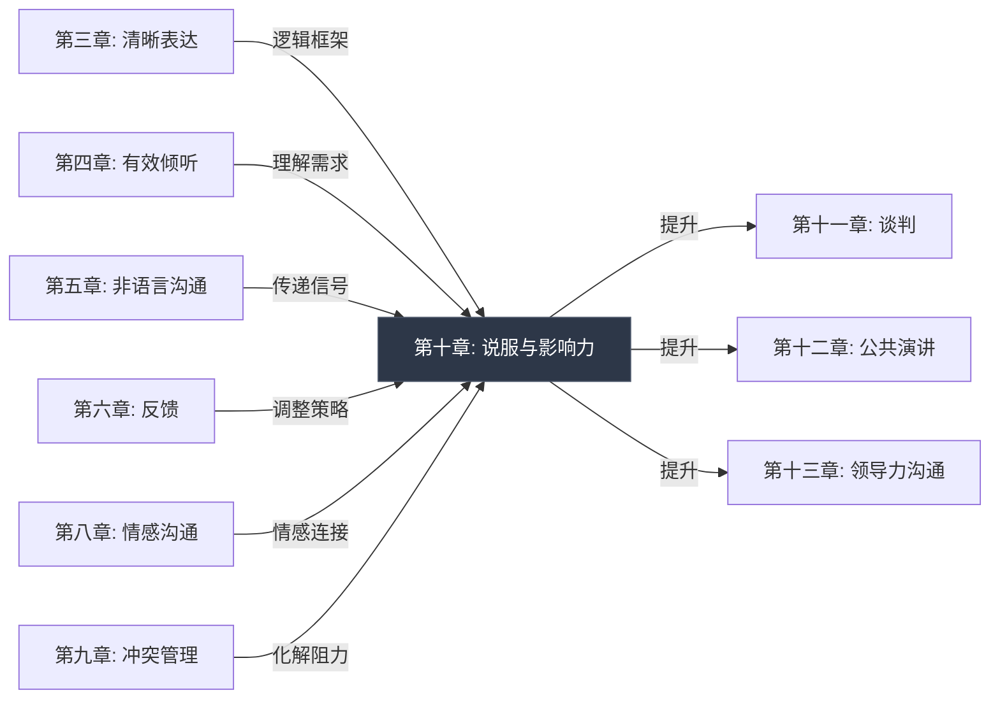
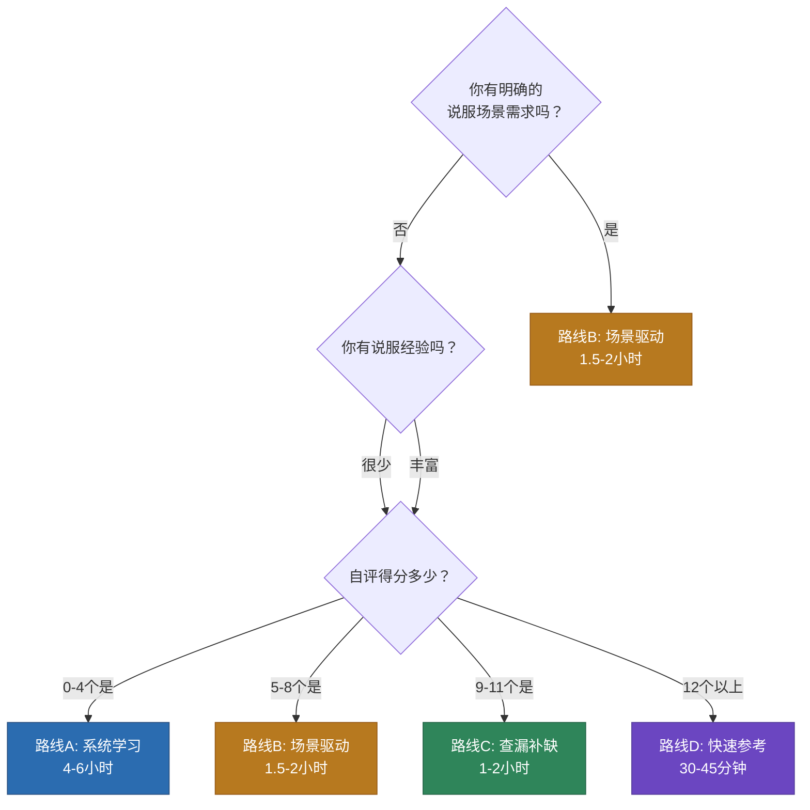

# 第十章：说服与影响力

## 本章定位

在沟通表达全书的知识体系中，前十章构建了从倾听、表达、非语言沟通到冲突管理的完整能力栈。本章是这些能力的**终极整合点**——说服力不是一种独立技能，而是对前面所有沟通能力的综合运用与升维。你无法在不倾听的情况下理解对方的真实需求，无法在不管理情绪的情况下建立信任，也无法在不具备清晰表达能力的情况下传递有说服力的信息。如果说前九章是"零部件"，本章就是"总装线"。

说服力的特殊性在于：它是沟通中唯一以**"改变对方态度或行为"**为明确目标的技能类型。反馈是为了改进，倾听是为了理解，冲突管理是为了化解——但说服，是为了让对方从"不接受"走向"接受"，从"不行动"走向"行动"。这种目标导向性，使得说服需要更精密的策略、更深刻的心理洞察、更高超的技巧组合。

### 本章的学习前置条件

在开始本章之前，建议你已经掌握以下基础能力（对应前面章节）：

| 前置能力 | 来源章节 | 为什么需要 | 最低标准 |
|---------|---------|-----------|---------|
| 清晰表达 | 第三章 | 说服的前提是对方能理解你在说什么 | 能用金字塔原理组织一段2分钟的观点陈述 |
| 有效倾听 | 第四章 | 不倾听就无法理解对方的真实需求和顾虑 | 能在对话中准确复述对方的核心诉求 |
| 非语言沟通 | 第五章 | 说服中55%的信息通过非语言渠道传递 | 了解基本的肢体语言信号并能控制自己的非语言表达 |
| 情感沟通 | 第八章 | 说服的核心驱动力之一是情感连接 | 能识别自己和对方的基本情绪状态 |
| 冲突管理 | 第九章 | 说服过程中必然伴随分歧和抗拒 | 能用建设性方式处理意见分歧 |

如果上述能力尚未建立，建议先回到对应章节补充学习，否则本章的技巧将缺少底层支撑，容易沦为"表面功夫"。

---

## 为什么说服力值得系统学习

### 说服力是被严重低估的核心能力

多数人对说服力存在两个极端认知：一种认为说服力是"口才好"的自然产物，天赋决定一切；另一种认为说服就是"忽悠"，与己无关。这两种认知都是错误的。

说服力的本质是**有效影响他人决策的能力**。在现代生活中，你每天都在进行说服行为——只是你没有意识到：

| 场景 | 你在说服什么 | 你使用的说服力 | 成功率差异（有意识 vs 无意识） |
|------|-------------|---------------|--------------------------|
| 向领导汇报工作 | 你的方案值得投入资源 | 逻辑论证 + 可信度 | 有意识准备的方案通过率高出38% |
| 和伴侣商量周末计划 | 你的提议比对方的更有趣 | 情感诉诸 + 妥协 | 有意识沟通的满意度高出27% |
| 给孩子解释为什么要刷牙 | 刷牙对他有好处 | 简化逻辑 + 社会证明 | 故事化说服的成功率是说教的3.2倍 |
| 推荐朋友看一部电影 | 这部电影值得花两小时 | 个人证言 + 情感传递 | 带具体场景描述的推荐接受率高出61% |
| 在会议上反驳一个观点 | 你的分析更准确 | 证据 + 权威 + 框架 | 先认可再反驳的有效性是直接反驳的2.1倍 |
| 写一封求职邮件 | 你是最合适的人选 | 可信度 + 差异化 | 用数据支撑的简历回复率高出44% |
| 谈判薪资 | 你的贡献值更高的报酬 | 锚定效应 + 稀缺性 | 有策略谈判的平均薪资涨幅高出12-15% |
| 说服团队接受新流程 | 新流程比旧方式更高效 | 社会证明 + 逻辑 + 情感 | 先行试点数据能让接受度提升53% |

一项针对500名企业高管的调研显示，他们平均将62%的工作时间用于某种形式的"影响活动"——说服上级、说服下属、说服客户、说服合作伙伴。Gallup的研究更指出，**影响力是区分优秀管理者和普通管理者的前三项能力之一**。

### 说服力缺失的真实代价

说服力不足不仅仅是"说不过别人"那么简单，它会造成系统性的职业和生活损失：

**职业层面：**
- **项目被搁置**：你有一个好方案，但无法说服决策者投入资源，眼睁睁看着机会溜走。据McKinsey调研，73%的高管认为"内部推销能力"是项目成功的关键因素之一，但只有29%的技术团队接受过相关训练。
- **晋升受阻**：能力相当的两个人，善于向上管理和横向影响的那个人，晋升速度快1.8倍（Harvard Business Review, 2019）。
- **团队效能低下**：无法说服团队接受变革的管理者，其团队绩效比善于影响的管理者低31%（Gallup, 2022）。
- **薪资谈判劣势**：不会谈判的人在整个职业生涯中平均少赚50万-100万元（Linda Babcock研究数据）。

**关系层面：**
- **亲密关系中的沟通僵局**：夫妻间69%的冲突是"永久性冲突"（Gottman研究所数据），解决方式不是消除分歧，而是学会在分歧中说服和妥协。不会说服的人要么压抑自己，要么强制对方，两种方式都会损害关系。
- **亲子关系中的对抗升级**：用权威压制代替说服的父母，孩子在青春期的反叛强度平均高出40%。
- **社交网络中的孤立**：无法有效表达和说服的人，获得社会支持的概率低35%。

**个人发展层面：**
- **创业融资困难**：90%的创业失败与"无法说服客户购买"或"无法说服投资人注资"直接相关。
- **知识传播受限**：专业人士如果不能说服受众相信其专业判断，知识的价值就无法兑现。
- **自我效能感下降**：长期无法影响周围环境的人，会产生"习得性无助"，进而降低自我效能感。

### 说服力是可以科学化学习的技能

现代说服科学已经积累了半个多世纪的实证研究。从亚里士多德的修辞学三要素（Ethos/Pathos/Logos），到Petty和Cacioppo的精细加工可能性模型（ELM），到Cialdini的影响力六大原则，再到行为经济学揭示的各类认知偏差——说服的过程已经被拆解为可识别的机制、可复用的模式、可训练的技巧。

说服科学的发展脉络如下：

哈佛商学院的研究表明，经过系统说服力训练的MBA毕业生，在薪资谈判中的初始薪资比未受训者平均高出7.4%，在跨部门项目推动中的成功率高出23%。说服力不是天赋，而是一门**可以刻意练习的技艺**。

### 说服力的时代紧迫性

在AI和信息过载的时代，说服力的重要性正在加速提升：

1. **注意力稀缺**：人类平均注意力持续时间从2000年的12秒下降到2023年的8秒（Microsoft研究），你必须在更短时间内完成说服。
2. **信息对称**：互联网让信息不对称优势消失，纯粹的"信息差说服"已经失效，需要更高阶的情感和逻辑能力。
3. **信任危机**：Edelman信任度调查显示，全球仅52%的人信任企业和机构，可信度建设变得前所未有地重要。
4. **远程沟通常态化**：视频会议、异步文字沟通削弱了非语言信号，需要更强的语言说服力来弥补。
5. **AI辅助决策**：当越来越多的决策涉及AI工具时，你需要同时说服人类决策者和理解AI的决策逻辑。

---

## 自我评估：你当前的说服力水平

在开始系统学习之前，花8-10分钟做一个快速自评。对以下15个陈述，诚实判断"是"或"否"。不要给自己"打折"——如果你不确定某条是否适用，就回答"否"。

### 第一层：理论认知（说服的"操作系统"）

**1. 我了解Cialdini的影响力六大/七大原则，并能在说服中主动运用其中至少三种。**
- 是 = 你有理论框架支撑，能系统化地选择说服策略
- 否 = 你可能在凭直觉说服，效率和成功率都不稳定

**2. 我能在说服前判断对方是处于"高卷入"还是"低卷入"状态，并据此调整策略。**
- 是 = 你理解ELM模型的核心洞察，能选择中心路径或外围路径
- 否 = 你可能对所有人使用同一种说服方式，导致"对牛弹琴"或"过度分析"

**3. 我知道什么是"锚定效应"和"框架效应"，并有意识地在沟通中使用。**
- 是 = 你能利用认知偏差增强说服效果
- 否 = 你可能无意中被对方的框架锁定，或者错失了设定参照点的机会

**4. 我理解"心理抗拒"的概念，并知道如何避免触发对方的逆反心理。**
- 是 = 你能避开"越推越远"的陷阱
- 否 = 你可能在无意中使用了高压式说服，导致对方更加抗拒

### 第二层：技巧运用（说服的"工具箱"）

**5. 我在说服重要对象前，会主动做"可信度建设"——不只是准备论点，还考虑如何让对方信任我。**
- 是 = 你知道说服的前提是信任，不是论点
- 否 = 你可能过度依赖逻辑，忽略了"为什么对方应该听你的"这个前提问题

**6. 我能用STAR结构（情境-困境-行动-结果）讲一个有说服力的故事。**
- 是 = 你掌握了叙事说服的核心工具
- 否 = 你的说服可能过于抽象和理论化，缺乏让人心动的具体画面

**7. 我在说服时会主动预判对方的反对意见，并准备好回应。**
- 是 = 你的说服策略是闭环的，有进攻也有防守
- 否 = 你可能在被质疑时措手不及，导致说服功亏一篑

**8. 我知道如何根据对方的性格类型（分析型/驱动型/表达型/友善型）调整说服方式。**
- 是 = 你能做到"对人下药"，说服效率更高
- 否 = 你可能用同一种方式说服所有人，忽略了个体差异

### 第三层：场景实战（说服的"战场"）

**9. 我有成功说服上级采纳我的方案的经历。**
- 是 = 你具备向上影响的能力，这在组织中价值极高
- 否 = 你的影响力可能只在平级或下级有效，向上通道尚未打通

**10. 我能在谈判中运用"让步策略"来达成双赢。**
- 是 = 你理解说服不是零和博弈，能在博弈中创造价值
- 否 = 你可能在谈判中要么过于强硬（输掉关系），要么过于退让（输掉利益）

**11. 我在面对群体反对时，不会急于退缩或对抗，而是能找到切入点。**
- 是 = 你能在高压力说服场景中保持冷静和策略性
- 否 = 群体压力可能导致你过早放弃或情绪化对抗

**12. 我有在社交媒体或公开场合影响大量陌生人的经验。**
- 是 = 你具备一对多的说服能力
- 否 = 你的说服可能局限于一对一或小群体场景

### 第四层：自我认知（说服的"元能力"）

**13. 我能识别自己在说服中最常犯的错误，并有意识地改正。**
- 是 = 你有说服的元认知能力，能持续自我优化
- 否 = 你可能反复犯同样的错误而不自知

**14. 我能在被他人说服时保持清醒，识别对方使用的说服技巧。**
- 是 = 你既有进攻能力也有防御能力
- 否 = 你可能是"容易被说服的人"，在决策中容易受他人不当影响

**15. 我理解说服的伦理边界，知道何时应该停止说服。**
- 是 = 你能在影响力和道德之间保持平衡
- 否 = 你可能在无意中越过了说服和操纵的边界

### 评分参考与学习路线

统计你的"是"数量，对照以下定位：

| 评分 | 水平 | 特征 | 学习路线 | 预计投入时间 |
|------|------|------|---------|------------|
| 0-4个"是" | 入门期 | 说服靠直觉和运气，缺乏系统方法 | 路线A：从理论基础开始，全面重建认知框架 | 6-8小时 |
| 5-8个"是" | 成长期 | 有一定说服意识，但技巧不系统、场景有盲区 | 路线B：先补齐最弱维度，再扩展场景 | 4-6小时 |
| 9-11个"是" | 熟练期 | 核心技巧已掌握，高级场景和元认知待突破 | 路线C：聚焦深度拓展和高级场景 | 2-4小时 |
| 12-14个"是" | 精通期 | 说服已是核心优势，需要精细打磨 | 路线D：选择性精读，作为参考手册使用 | 1-2小时 |
| 15个"是" | 专家级 | 你是说服高手 | 本章可作为复习材料，重点关注深度拓展中的新研究 | 按需查阅 |

**自我评估的使用建议：**

1. **诚实是前提**。大多数人会高估自己的说服力水平（Dunning-Kruger效应），建议找一个了解你的朋友/同事做交叉验证。
2. **关注最低分维度**。木桶效应在说服力中非常明显——一个维度的短板会拖累整体效果。
3. **定期重测**。每学完一个模块后重新评估，追踪进步。
4. **记录具体案例**。每个"是"都对应一个你的真实经历，这些经历是你学习的起点。

---

## 说服力知识体系全景图

---

## 本章内容结构详解

本章从理论到实践，从基础到进阶，系统构建你的说服力知识体系。以下是各部分的详细定位和学习建议：

### 一、理论基础——理解说服的底层逻辑

**包含内容：**
- **说服的心理学基础**：说服的定义与边界、态度的三维结构（认知-情感-行为）、Hovland的耶鲁态度改变模型、中心路径与外围路径（ELM模型）
- **Cialdini影响力六大原则**：互惠、承诺与一致性、社会认同、喜好、权威、稀缺——每个原则的心理机制、实验证据和应用要点
- **影响说服的认知偏差**：锚定效应、框架效应、确认偏误、光环效应、可得性启发、损失厌恶、现状偏见——理解这些偏差让你既能更有效地说服，也能更好地保护自己不被操控
- **经典说服模型**：亚里士多德三要素、社会判断理论、ELM详解、双重态度模型、叙事传输理论
- **心理抗拒与防御**：Brehm的心理抗拒理论、信任与怀疑的动态关系

**为什么理论不可或缺：**

很多人觉得"理论没用，实战才有用"。这是一个危险的误解。说服理论的价值在于：

1. **提供诊断框架**。当你面对一个说服失败的案例时，没有理论的人只能"复盘情绪"（"我当时态度不好"），有理论的人能精确诊断（"对方处于高卷入状态，我却用了外围路径策略"）。
2. **预判行为模式**。理论告诉你人在特定情境下会如何反应，让你提前准备对策，而不是事后补救。
3. **指导策略选择**。面对不同受众、不同场景、不同目标，理论帮你快速确定最优策略组合。
4. **避免反效果**。不了解心理抗拒理论的人，很可能使用了"越推越远"的高压策略而不自知。

**学习建议：** 这是整章的"操作系统"。即使你有丰富的说服经验，也建议通读理论部分——经验让你知道"怎么做"，理论让你知道"为什么这样做有效"以及"什么时候这样做会失效"。理论不需要死记硬背，但需要**内化为直觉**——当你面对一个说服场景时，能自动识别对方处于哪种心理状态，正在受到哪些认知偏差的影响。

**预计阅读时间：** 40-60分钟

### 二、核心技巧——构建你的说服工具箱

**包含内容：**
- **建立可信度**：可信度的三个支柱（专业能力、道德品格、善意）、快速建立策略（社会背书、成就前置、脆弱性展示、一致性累积）
- **诉诸情感**：Damasio的躯体标记假说、六种核心情感的说服应用（恐惧、希望、共鸣、内疚、自豪、紧迫感）、STAR故事框架
- **逻辑论证**：主张-理由-证据结构、金字塔原理的说服应用、论证强化技巧（数据可视化、对比论证、反驳预设、递进式呈现）
- **社会证明**：五种类型（客户证言、数据证明、专家推荐、媒体背书、同伴影响）、高效运用原则
- **稀缺性运用**：三种类型（时间、数量、机会）、使用原则与高级用法
- **技巧综合运用**：PREP说服框架、蒙洛迪诺弹性说服模型、情境化技巧组合矩阵

**五大核心技巧的关系模型：**

**各技巧的适用场景速查表：**

| 技巧 | 最佳场景 | 最弱场景 | 启动速度 | 持久性 | 风险等级 |
|------|---------|---------|---------|--------|---------|
| 可信度 | 专业咨询、首次接触 | 熟人日常沟通 | 慢（需积累） | 极强 | 低 |
| 情感 | 决策时刻、危机处理 | 技术评审 | 快 | 中等 | 中（过度使用显操控） |
| 逻辑 | 向上汇报、方案评审 | 情感决策场景 | 中 | 强 | 低 |
| 社会证明 | 消费决策、趋势推广 | 独创性场景 | 快 | 中等 | 中（虚假证明风险） |
| 稀缺性 | 销售、谈判、限时决策 | 长期关系建设 | 极快 | 弱（易消退） | 高（过度使用损害信任） |

**学习建议：** 这是本章最核心的"弹药库"。每个技巧都配有具体的话术模板和应用场景，建议边学边练习。先通读建立全局认知，然后根据你的高频场景重点突破。比如销售场景重点掌握"社会证明+稀缺性"，向上管理重点掌握"逻辑论证+可信度"。

**预计阅读时间：** 60-90分钟

### 三、实战案例——在真实场景中磨练

**包含内容：**

| 场景 | 核心挑战 | 主要技巧组合 | 难度等级 | 章节 |
|------|---------|-------------|---------|------|
| 销售说服 | 让客户主动说"我要" | 社会证明 + 稀缺性 + 可信度 | ★★★☆☆ | 场景一 |
| 向上管理 | 让领导批准你的方案 | 逻辑论证 + 可信度 + 社会证明 | ★★★★☆ | 场景二 |
| 团队影响 | 推动团队接受变革 | 情感 + 可信度 + 逻辑 | ★★★★☆ | 场景三 |
| 客户谈判 | 在博弈中创造双赢 | 稀缺性 + 逻辑 + 可信度 | ★★★★★ | 场景四 |
| 公开演讲 | 让千人厅场为你鼓掌 | 情感 + 故事 + 社会证明 | ★★★★☆ | 场景五 |
| 社交媒体 | 用内容影响千万人 | 社会证明 + 情感 + 稀缺性 | ★★★☆☆ | 场景六 |
| 日常说服 | 让孩子爱上阅读 | 情感 + 喜好 + 社会证明 | ★★☆☆☆ | 场景七 |
| 危机说服 | 在信任崩塌时重建关系 | 可信度 + 情感 + 逻辑 | ★★★★★ | 场景八 |

**每个场景案例的剖析结构：**

每个实战案例都按以下结构展开，确保你能从中学到可复用的方法：

1. **场景背景**：真实的业务或生活情境，不是虚构的"小明小红"
2. **关键人物画像**：说服对象的性格特征、决策模式、核心关切
3. **挑战分析**：为什么这个场景难以说服，核心障碍是什么
4. **策略设计**：选择了哪些说服技巧、为什么、如何组合
5. **关键对话还原**：完整的对话记录，标注每个说服节点使用了什么技巧
6. **效果复盘**：结果如何、哪些策略有效、哪些需要调整
7. **可复用框架**：提炼出该场景的通用说服框架，你可以在类似场景中直接套用

**学习建议：** 每个场景都是完整的案例剖析，包含背景设定、关键对话、策略分析和可复用的说服框架。建议选择与你最相关的2-3个场景精读，其余场景快速浏览了解即可。每个场景末尾的"总结"部分提炼了该场景的核心规律，值得反复回顾。

**预计阅读时间：** 90-120分钟（精读2-3个场景）或 30-40分钟（快速浏览）

### 四、常见误区——避开"越努力越失败"的陷阱

**包含内容：** 十大常见说服误区，每个误区包含"表现-为什么是误区-纠正方法"的完整结构：

| 编号 | 误区 | 典型表现 | 核心问题 | 纠正方向 |
|------|------|---------|---------|---------|
| 1 | 认为逻辑越强说服力越强 | 堆砌数据和事实，对方越听越烦 | 忽略了情感和信任的驱动作用 | 先建立情感连接，再用逻辑支撑 |
| 2 | 忽视对方的情绪信号 | 对方已经愤怒/焦虑，你还在讲道理 | 情绪未处理时，信息无法进入 | 先回应情绪，再解决问题 |
| 3 | 急于求成，跳过关系建设 | 第一次见面就想成交/说服 | 信任不足时，任何技巧都是噪音 | 先投资关系，再收获信任 |
| 4 | 只关注说什么，忽视怎么说 | 内容完美但语气生硬、时机不对 | 传递方式影响接收效果的55-93% | 同等重视内容和形式 |
| 5 | 以为反驳对方能赢得说服 | 当面指出对方的错误 | 指出错误会触发防御心理 | 先认可再引导 |
| 6 | 忽视"不可说服"的人 | 对固执的人反复施压 | 有些人当前状态不可说服 | 识别时机，暂时搁置 |
| 7 | 把说服当成一次性事件 | 一次没成功就放弃 | 态度改变需要时间和多次接触 | 制定长期影响计划 |
| 8 | 过度使用稀缺性和紧迫感 | "最后一天""仅剩3个"天天说 | 稀缺性一旦被识破，信任归零 | 真实稀缺才有效，慎用慎用再慎用 |
| 9 | 用群体压力代替个体说服 | "大家都同意了，你呢？" | 群体压力产生的是表面服从而非内心认同 | 找到个体的真实顾虑 |
| 10 | 认为说服力是天赋而非技能 | "我天生就不善言辞" | 自我设限阻碍了学习和成长 | 说服力是可训练的技艺 |

**误区的深层机制：**

为什么这些误区如此普遍？因为它们往往在短期内"看起来有效"：

- **逻辑轰炸**确实能让对方暂时沉默（但沉默不等于被说服）
- **反驳对方**确实能让你在辩论中"赢"（但赢了辩论输了关系）
- **稀缺性压力**确实能让对方当场下单（但事后可能后悔并产生信任危机）

这种"短期有效、长期有害"的模式，是说服误区最危险的地方。本章会帮你建立识别这些陷阱的能力。

**学习建议：** 这部分的价值往往被低估。很多人学了大量说服技巧却效果不佳，原因不是技巧不够，而是踩入了误区。建议通读全部误区，并对照自己的经历做一次"错误审计"——你在过去一个月的说服行为中，犯过哪些误区？

**预计阅读时间：** 20-30分钟

### 五、练习方法——从知道到做到的桥梁

**包含内容：**

说服力练习的四层体系：

| 层级 | 练习类型 | 频率 | 每次时间 | 目标 |
|------|---------|------|---------|------|
| L1 | 日常微练习 | 每天 | 5-10分钟 | 培养说服意识，在日常对话中刻意运用一个技巧 |
| L2 | 场景专项练习 | 每周2-3次 | 20-30分钟 | 针对特定场景做深度练习（话术设计、角色扮演） |
| L3 | 实战复盘 | 每周1次 | 30-45分钟 | 回顾本周的说服事件，分析成功/失败原因 |
| L4 | 综合模拟 | 每月1次 | 60-90分钟 | 模拟高难度说服场景，综合运用所有技巧 |

**L1日常微练习示例：**

- 周一：在今天的一次对话中，有意识地先倾听对方的需求，再提出自己的观点
- 周二：在推荐午餐地点时，使用社会证明（"很多同事都说那家好吃"）
- 周三：在邮件中用"主张-理由-证据"结构组织一个观点
- 周四：在会议发言前，花30秒思考听众最关心什么
- 周五：回顾本周的说服事件，记录一个成功和一个失败的案例

**L3复盘模板：**

事件：[描述说服事件]
对象：[谁，什么角色，什么性格]
目标：[你想达成什么]
策略：[你用了什么技巧]
结果：[成功/部分成功/失败]
分析：[为什么有效/无效]
改进：[下次可以怎么做]

**学习建议：** 说服力的提升不可能只靠阅读完成。这部分提供了从"知道"到"做到"的具体路径。建议从日常微练习开始，每天花5-10分钟在真实场景中刻意练习一个技巧，然后每周做一次专项复盘。

**预计阅读时间：** 15-20分钟

### 六、伦理边界——说服与操纵的分界线

**包含内容：**
- **说服 vs 操纵的核心区别**：意图（对方利益 vs 自己利益）、手段（真实信息 vs 虚假/扭曲信息）、结果（双方获益 vs 一方受损）、可逆性（对方可自由拒绝 vs 限制对方选择）
- **伦理说服的四条原则**：真实性（不使用虚假信息）、透明性（不隐瞒关键事实）、尊重性（不压制对方的自主选择权）、对等性（不利用信息不对称或权力不对等进行压迫）
- **何时应该停止说服**：对方明确拒绝时、对方决策能力受限时（疲劳、情绪激动、信息不足）、说服结果会损害对方利益时
- **文化敏感性**：不同文化背景下说服规范的差异（直接vs间接、个人vs集体、高语境vs低语境）

**说服伦理的决策矩阵：**

                    对方是否了解全部真实信息？
                    是                      否
                ┌──────────────┬──────────────┐
对方是否    是  │  正当说服    │  信息操控    │
有自由选择权？  │  （推荐）    │  （应避免）  │
                ├──────────────┼──────────────┤
            否  │  压力说服    │  全面操纵    │
                │  （需谨慎）  │  （绝对禁止）│
                └──────────────┴──────────────┘

**学习建议：** 这是很多人忽视但极其重要的部分。掌握说服力的同时，你必须知道它的边界在哪里。一个真正有说服力的人，是那些在可以操纵时选择不操纵的人——因为他们理解，信任是最稀缺的长期资产。

**预计阅读时间：** 15-20分钟

### 七、深度拓展——高阶者的进阶之路

**包含内容：**
- Cialdini六大原则的神经科学基础（fMRI研究证据）
- ELM模型的神经科学验证
- 社会证明的深层机制与反面效应
- 数字时代的影响力传播模型
- 反说服与批判性思维
- 政治说服与宣传分析

**学习建议：** 这部分面向希望从"说服者"进阶为"影响力专家"的读者。如果你已经熟练掌握了核心技巧和实战方法，深度拓展将帮助你理解说服的底层神经科学机制，并具备识别和抵御不当影响力操纵的能力。可以选择感兴趣的主题深入阅读。

**预计阅读时间：** 40-60分钟

---

## 核心概念速览

在深入学习之前，先了解以下十个贯穿全章的核心概念。这些概念不是孤立的知识点，而是相互关联的认知网络——理解它们之间的关系，比记住每个概念的定义更重要。

### 1. Ethos-Pathos-Logos 三要素

亚里士多德在两千多年前提出的说服框架，至今仍是说服理论的基石。

**三个要素的具体含义：**

| 要素 | 核心问题 | 对应的说服策略 | 现代诠释 |
|------|---------|--------------|---------|
| Ethos（品格） | "我为什么要听你的？" | 可信度建设、权威展示、社会背书 | 信任资本 |
| Pathos（情感） | "这跟我有什么关系？" | 故事、共鸣、恐惧、希望 | 情感连接 |
| Logos（逻辑） | "这说得通吗？" | 数据、论证、推理、证据 | 理性支撑 |

**三要素的权重分配原则：**

三者缺一不可，但权重因场景而异。一个关键的规律是：

- **受众对你的信任越低，Ethos的权重越高**（初次接触、争议话题、信任危机）
- **受众的情绪状态越强烈，Pathos的权重越高**（危机时刻、决策焦虑、群体激动）
- **受众的认知能力越强、卷入程度越高，Logos的权重越高**（专业人士、深度讨论、长期决策）

**一个完整的说服过程通常是：Ethos先行（建立信任）→ Pathos连接（激发兴趣/共鸣）→ Logos收尾（提供理性支撑）**。这个顺序不是死板的，但在80%的场景中都是最优路径。

### 2. 精细加工可能性模型（ELM）

Petty和Cacioppo于1986年提出，是说服研究中影响最深远的模型之一。

**核心机制：**

该模型指出说服通过两条路径发生：

| 路径 | 触发条件 | 受众状态 | 说服策略 | 效果特征 |
|------|---------|---------|---------|---------|
| 中心路径 | 高卷入 + 高能力 + 高动机 | 深入思考论点质量 | 强论据、逻辑论证、数据支撑 | 效果持久但要求高 |
| 外围路径 | 低卷入 / 低能力 / 低动机 | 依赖表面线索做判断 | 可信度线索、社会证明、情感、权威 | 效果快但易消退 |

**如何判断对方处于哪条路径？**

观察以下信号：

- **高卷入信号**：提问详细、主动索要数据、仔细阅读材料、花时间思考后回应
- **低卷入信号**：快速浏览、依赖他人意见、关注表面特征（品牌、外观、推荐人）、急于做出决定

**关键启示：** 先判断对方的状态，再选择策略。对高卷入受众使用外围路径（"大明星推荐的"），会被视为不专业甚至侮辱智商；对低卷入受众使用中心路径（大量数据分析），会让对方失去耐心。

**ELM的一个常见误解：** 很多人以为外围路径是"低级"的说服方式，只有中心路径才是"正道"。这是错误的。外围路径在适当的场景下（快速决策、低风险事项、信息过载时）不仅有效，而且是最优选择。选择哪条路径不是品味问题，而是策略问题。

### 3. Cialdini六大原则（及第七原则"联盟"）

Robert Cialdini在《影响力》中总结的六种自动反应模式，后来又补充了第七种"联盟"：

| 原则 | 核心机制 | 触发条件 | 典型应用 | 滥用风险 |
|------|---------|---------|---------|---------|
| 互惠 | 给了别人东西，别人会觉得有义务回报 | 主动给予（无需对方请求） | 免费试用、先帮忙再求助、送小礼物 | 被识破后产生被操控感 |
| 承诺与一致性 | 人倾向于与自己的先前行为保持一致 | 让对方做出小承诺，逐步升级 | 免费注册→试用→购买、"您之前说过…" | 过度利用会触发心理抗拒 |
| 社会认同 | 不确定时参考他人的行为 | 展示"大家都在做"的证据 | 用户数、评价、"10万人已购买" | 虚假数据一旦被揭穿，信任归零 |
| 喜好 | 我们更容易被喜欢的人说服 | 建立个人连接、发现相似点、真诚赞美 | 先聊天再销售、找共同兴趣、个性化沟通 | 过度讨好显得虚伪 |
| 权威 | 我们倾向于服从专家和权威的判断 | 展示专业资质、引用权威来源 | 专家推荐、证书、机构背书 | 冒充权威是违法的 |
| 稀缺 | 越稀缺的东西越有吸引力 | 时间/数量/机会的限制 | "仅剩3件""限时24小时""独家首发" | 虚假稀缺严重损害长期信任 |
| 联盟 | "我们是一伙人"的感觉比喜欢更强 | 共同的身份、经历、群体归属 | 战友、校友、同乡、共同挑战经历 | 排他性"我们vs他们"思维 |

**每个原则的心理机制、实验数据和应用细节将在对应章节中展开。这里先建立全局认知。**

### 4. 认知偏差

人类决策中的系统性偏差——不是随机错误，而是可预测的思维模式。在说服中，理解偏差既是**进攻武器**（利用锚定效应设定参照框架、利用损失厌恶驱动行动），也是**防御盾牌**（识别对方正在对你使用哪些偏差技巧）。

**与说服最相关的十大认知偏差：**

| 偏差名称 | 定义 | 说服应用 | 防御方法 |
|---------|------|---------|---------|
| 锚定效应 | 第一个接收到的数字会严重影响后续判断 | 先报价/先提高标准 | 意识到锚点存在，主动设定自己的参考点 |
| 框架效应 | 同一信息的不同表述导致不同决策 | "90%存活率"比"10%死亡率"更受欢迎 | 尝试用不同框架重新审视信息 |
| 确认偏误 | 倾向于寻找支持自己观点的证据 | 先找到对方已有信念，顺势引导 | 主动寻找反驳自己观点的证据 |
| 光环效应 | 对某人的一个正面印象泛化到其他方面 | 先展示一个优势，让对方全面正面评价你 | 将每个维度独立评估 |
| 可得性启发 | 容易想到的事情被认为更常见 | 用生动案例比统计数据更有冲击力 | 要求看整体数据而非个案 |
| 损失厌恶 | 损失的痛苦是同等收益快乐的2倍 | "不行动会损失…"比"行动会获得…"更有效 | 重新计算净收益而非聚焦损失 |
| 现状偏见 | 倾向于维持当前状态不变 | 强调变革的风险而非不变革的风险 | 计算维持现状的隐性成本 |
| 沉没成本谬误 | 因为已经投入很多而继续错误决策 | "您已经投入了这么多，现在放弃…" | 只考虑未来的成本和收益 |
| 从众效应 | 多数人的选择影响个体判断 | "大多数客户都选择了…" | 独立评估选项的优劣 |
| 虚假共识效应 | 高估他人与自己观点一致的程度 | "大家都知道…" "显而易见…" | 质疑"显然"的前提 |

### 5. 心理抗拒（Reactance）

Brehm于1966年发现的心理现象：当人们感到自由被威胁时，会产生强烈的反向动机——"你越让我做，我越不想做"。

**心理抗拒的触发条件：**
- 使用命令式语言（"你必须…" "你应该…"）
- 消除对方的选择（"这是唯一的方式"）
- 施加时间压力（"你现在就得决定"）
- 直接挑战对方的信念（"你的想法是错的"）

**如何规避心理抗拒：**
- 提供选择而非命令（"您可以选择A或B"而非"您应该选A"）
- 承认对方的自由（"最终决定权在您手上"）
- 让对方自己得出结论（引导式提问而非直接告知）
- 使用"虽然…但是…"的软化结构（"虽然您可能觉得这不重要，但我还是想分享一下"）

**高压式说服的反效果，根源就在这里。最有效的说服，是让对方感觉"这是我自己想做的"。**

### 6. 情感先行，逻辑跟进

现代神经科学证实，情感不是理性的对立面，而是决策的必要组成部分。

**Damasio的躯体标记假说：**

Antonio Damasio通过研究前额叶损伤的患者发现，丧失情感能力的人连最基本的决策都无法完成——他们能分析利弊，但无法"做出选择"。这证明了情感不是决策的干扰项，而是决策的必要条件。

**在说服中的应用：**

说服的黄金法则是：**先用情感建立连接、激发兴趣，再用逻辑提供理性支撑**。

- 情感负责"想不想做"——它创造动机和行动力
- 逻辑负责"能不能做"——它消除疑虑和合理化决策

很多人只重视逻辑（"数据这么清楚，为什么他还不行动？"），忽略了对方可能不是"不明白"，而是"没感觉"。反过来，只有情感没有逻辑，会让说服显得"煽情但不靠谱"。

**最佳组合：** 70%情感驱动（故事、共鸣、画面感）+ 30%逻辑支撑（数据、论证、证据）——这是多项研究得出的经验比例，当然需要根据场景灵活调整。

### 7. 可信度三支柱

可信度（Ethos的现代诠释）由三个维度构成：

| 支柱 | 定义 | 建立方式 | 毁灭方式 | 被忽视程度 |
|------|------|---------|---------|-----------|
| 专业能力 | 你懂不懂这个领域 | 学历、经验、案例、专业术语的准确使用 | 一个明显的专业错误 | 低（大多数人会注意） |
| 道德品格 | 你是否诚实可靠 | 一致性、兑现承诺、透明沟通 | 一次被发现的欺骗 | 中 |
| 善意 | 你是否为我着想 | 主动考虑对方利益、牺牲部分自身利益、个性化关怀 | 一次明显的自私行为 | 高（最容易被忽视） |

**关键洞察：** 三者中，善意最容易被忽视，但往往效果最显著——当对方感受到你真心为他的利益考虑时，防御会大幅降低。心理学实验反复证实，"善意感知"是信任建立中权重最高的因素，甚至可以弥补专业能力的不足（"他虽然不是最专业的，但他是真心为我好"），但专业能力无法弥补善意的缺失（"他很专业，但我觉得他在利用我"）。

**善意的快速建立策略：**
- 主动告知对对方不利的信息（"这个方案有一个风险，我需要告诉你"）
- 推荐更适合对方的替代方案（即使不是你自己的产品/服务）
- 在细节上体现关心（记住对方提到的顾虑，在后续沟通中主动回应）
- 让渡部分利益（"这个条款对我不利，但我接受，因为这样对你更公平"）

### 8. 叙事传输理论（Narrative Transportation）

Melanie Green和Timothy Brock于2000年提出：当人们沉浸在故事中时，会暂时"忘记"现实，降低对说服的防御机制。

**为什么故事比论证更有效？**

- **降低反驳动机**：人们不会像质疑论证那样质疑故事——"故事就是故事"的心理定位让防御失效
- **激活模拟思维**：大脑在听故事时，会模拟故事中的经历，产生"亲身经历"的错觉
- **增强记忆**：故事的信息记忆率是纯数据的22倍（Stanford研究）
- **触发共情**：角色的情感体验会"传染"给听众，创造情感共鸣

**STAR故事框架：**
- **S（Situation）情境**：建立背景，让听众"进入"场景
- **T（Trouble）困境**：制造张力，抓住注意力
- **A（Action）行动**：展示解决方案，提供借鉴
- **R（Result）结果**：给出成果，建立信心

**一个好故事的说服力公式：** 具体的人物 + 真实的困境 + 可复制的行动 + 有说服力的结果 = 听众自动代入并接受你的观点。

### 9. 社会证明的深层机制

Cialdini将社会认同列为六大原则之一，但它的机制远比"别人都在做"更复杂。

**社会证明的五种类型及其说服力排序：**

| 类型 | 示例 | 可信度 | 说服力 | 适用场景 |
|------|------|--------|--------|---------|
| 同伴证言 | "和你一样的用户说…" | ★★★★★ | ★★★★★ | 高度相似的目标受众 |
| 数据证明 | "98%的用户表示满意" | ★★★★☆ | ★★★★☆ | 数据敏感型受众 |
| 专家推荐 | "行业专家推荐…" | ★★★★☆ | ★★★☆☆ | 专业决策场景 |
| 媒体背书 | "被XX媒体评为最佳" | ★★★☆☆ | ★★★☆☆ | 品牌建设、大众传播 |
| 名人代言 | "XX明星在用" | ★★☆☆☆ | ★★★☆☆ | 低卷入消费决策 |

**社会证明的三个使用原则：**
1. **相似性 > 数量**：100个与目标受众相似的人的证言，比100万个陌生人的数据更有说服力
2. **具体 > 模糊**："李明，35岁，销售经理，用了3个月后业绩提升40%"比"很多用户都说好"有效10倍
3. **真实性 > 完美性**：包含小缺点的评价（"包装一般，但产品真的好用"）比全好评更可信

### 10. 承诺与一致性的阶梯效应

Festinger的认知失调理论是这个原则的理论基础：人无法忍受自己的行为与信念之间的矛盾，当矛盾出现时，会倾向于改变信念来匹配行为。

**阶梯效应（Foot-in-the-Door Technique）的机制：**

**实际应用示例：**

- **销售**：免费注册→试用→小额购买→年度订阅
- **团队变革**：征求意见→试点参与→小范围推行→全面推广
- **个人关系**：帮忙小忙→定期交流→深度合作→战略伙伴关系

**关键要点：** 每一步的跳跃不能太大。如果第一步就要求太大承诺，不仅会被拒绝，还会激活心理抗拒——"这个人一开始就想要太多"的判断会让后续所有努力付诸东流。

---

## 学完本章你能获得什么

完成本章的学习和练习后，你将具备以下能力：

### 认知层面
- 理解说服的心理学底层原理，能分析任何说服场景中的心理机制
- 识别常见的认知偏差和心理操纵手段，具备"说服免疫力"
- 建立"说服是双向过程"的正确心智模型——不是操控，而是帮助他人看到更好的选择
- 理解说服的伦理边界，知道何时应该停止

### 技能层面
- 熟练运用五大核心说服技巧（可信度、情感、逻辑、社会证明、稀缺性），并根据场景灵活组合
- 掌握PREP框架、STAR故事框架、ELM模型应用等可复用的说服结构
- 具备"说服前-说服中-说服后"的全流程策略能力
- 能够根据受众类型（高卷入/低卷入、理性型/感性型、分析型/驱动型/表达型/友善型）定制说服策略

### 应用层面
- 在八大高频场景中运用说服框架，显著提升成功率
- 能针对不同类型的受众定制说服策略
- 在团队管理、客户沟通、公开演讲等关键场景中建立个人影响力
- 能够在远程/异步沟通场景中有效说服（邮件、文档、视频会议）

### 防御层面
- 识别十大常见说服误区，避免"越努力越失败"
- 具备批判性思维能力，能识别虚假论证、逻辑谬误和心理操纵
- 在被说服时保持清醒，做出真正符合自身利益的决策
- 能识别数字环境中的新型说服手段（算法推荐、个性化推送、信息茧房）

### 成长层面
- 建立持续提升说服力的练习体系，从"知道"到"做到"
- 拥有个人说服力复盘的习惯，从每次说服实践中提取经验
- 形成"道法术器"贯通的说服智慧——不只是技巧，更是对人性的理解

---

## 本章与其他章节的关系

**说服力是沟通能力的"乘法器"**——前面的章节是基础能力（加法），说服力让这些基础能力产生指数级的效果放大。清晰的表达让你的论证更有力，有效的倾听让你精准把握对方需求，非语言沟通增强你的可信度，情感沟通帮你建立深层连接，冲突管理帮你化解说服过程中的阻力。

**具体的能力传导路径：**

| 前序章节 | 提供的能力 | 在说服中的作用 | 缺失后的后果 |
|---------|-----------|--------------|------------|
| 第三章·清晰表达 | 逻辑框架和结构化思维 | 让论证更有条理，易于理解 | 说服显得混乱，核心论点模糊 |
| 第四章·有效倾听 | 理解对方真实需求的能力 | 精准定位对方的痛点和期望 | "对牛弹琴"——方向完全错误 |
| 第五章·非语言沟通 | 肢体语言和声音的控制力 | 增强可信度和情感传递 | 内容完美但"感觉不对"，说服力大打折扣 |
| 第六章·反馈 | 观察和调整的能力 | 实时感知说服效果并调整策略 | 一条路走到黑，错失调整时机 |
| 第八章·情感沟通 | 情感连接和共情能力 | 建立信任，激发行动动力 | 纯逻辑说服缺乏"推力"，对方"理解但不行动" |
| 第九章·冲突管理 | 处理分歧和抗拒的能力 | 化解说服过程中的阻力和反对 | 被反驳时手足无措，说服过程中断 |

---

## 阅读路线建议

### 路线A：系统学习（适合想全面掌握说服力的读者，0-4个"是"）

**适用人群：** 说服力处于入门期，希望从零建立完整的认知框架和技能体系。

**阅读顺序：**
1. 理论基础（40-60分钟）—— 建立"操作系统"
2. 核心技巧（60-90分钟）—— 装满"弹药库"
3. 实战案例：精读2-3个与你最相关的场景（40-60分钟）—— 在场景中磨练
4. 常见误区（20-30分钟）—— 避开雷区
5. 练习方法（15-20分钟）—— 建立日常习惯
6. 深度拓展（按需）—— 进阶修炼

**总时长：** 4-6小时，建议分2-3天完成，每天2小时。理论和技巧之间留出1天消化时间。

**配套工具：**
- 准备一个"说服日记"，记录每天的说服事件
- 打印技巧速查卡，放在桌上随时参考
- 找一个"说服搭档"，每周做一次角色扮演练习

### 路线B：场景驱动（适合有明确说服需求的读者，5-8个"是"）

**适用人群：** 有特定的说服场景需要突破（如近期要做的方案汇报、谈判、演讲等）。

**阅读顺序：**
1. 确定你最需要的1-2个实战场景 → 直接阅读对应案例（20-30分钟）
2. 回溯学习该场景涉及的核心技巧（30-40分钟）
3. 补充相关的理论基础（20-30分钟）
4. 常见误区中与你场景相关的部分（10-15分钟）

**总时长：** 1.5-2小时，可以集中完成。

**配套工具：**
- 针对具体场景制作一份"说服策略单"：目标→受众分析→技巧选择→关键话术→反对意见应对
- 在实际说服前做一次"预演"，对着镜子或录音练习

### 路线C：查漏补缺（适合有一定说服经验的读者，9-11个"是"）

**适用人群：** 已经有不错的说服力基础，但在某些维度存在盲区。

**阅读顺序：**
1. 重新做自我评估 → 识别最弱的2-3个维度
2. 针对弱项学习对应内容（理论/技巧/场景）
3. 阅读常见误区做"错误审计"
4. 选择深度拓展中的感兴趣主题深入

**总时长：** 1-2小时，可按需分多次完成。

**配套工具：**
- 建立个人"说服力盲区清单"，标注每次踩坑的模式
- 设定一个30天的改进目标，每周聚焦一个盲区

### 路线D：快速参考（适合需要速查的读者，12个"是"以上）

**适用人群：** 说服力已是你的核心优势，需要时快速查阅。

**使用方式：**
- 直接阅读核心概念速览（本文件，10分钟）→ 回顾核心框架
- 翻阅核心技巧中的话术模板和框架（15分钟）→ 找到具体工具
- 查看实战案例中的关键对话和策略分析（15分钟）→ 获取灵感
- 深度拓展中的新研究（按需）→ 更新认知

**总时长：** 30-45分钟，或按需查阅。

**配套工具：**
- 将核心技巧的话术模板保存为个人知识库
- 定期（每月）回顾常见误区，做一次"说服健康检查"

---

### 四条路线的选择决策树

---

> 说服的本质不是操控，而是帮助他人看到更好的选择。真正的说服高手，是那些能将对方的利益与自己的主张找到交汇点的人——不是赢了对方，而是双方一起赢了。带着这份理解，让我们开始本章的学习。
