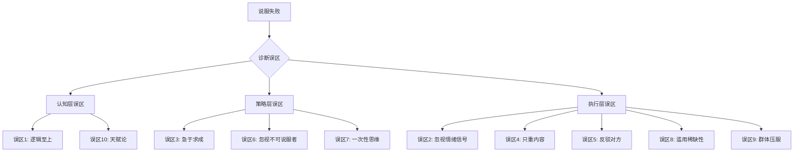
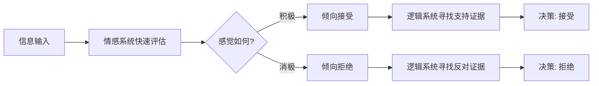
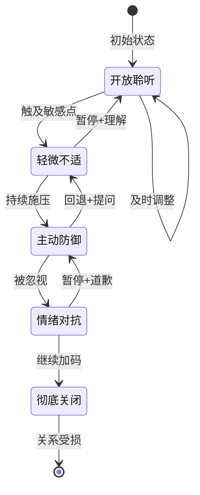
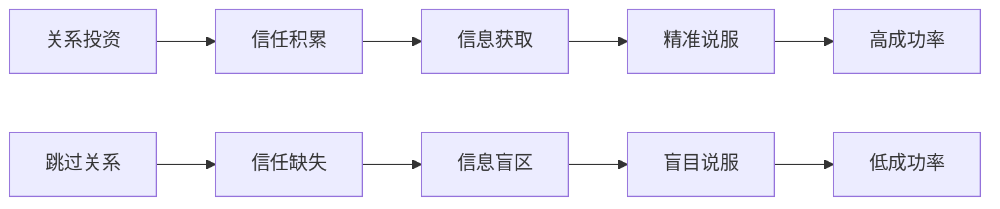
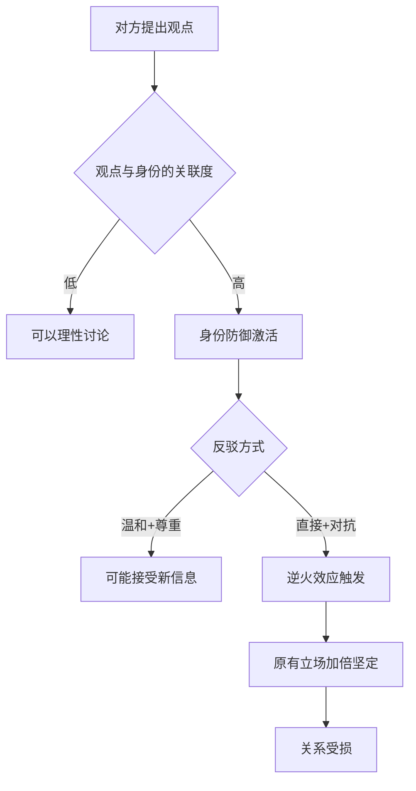
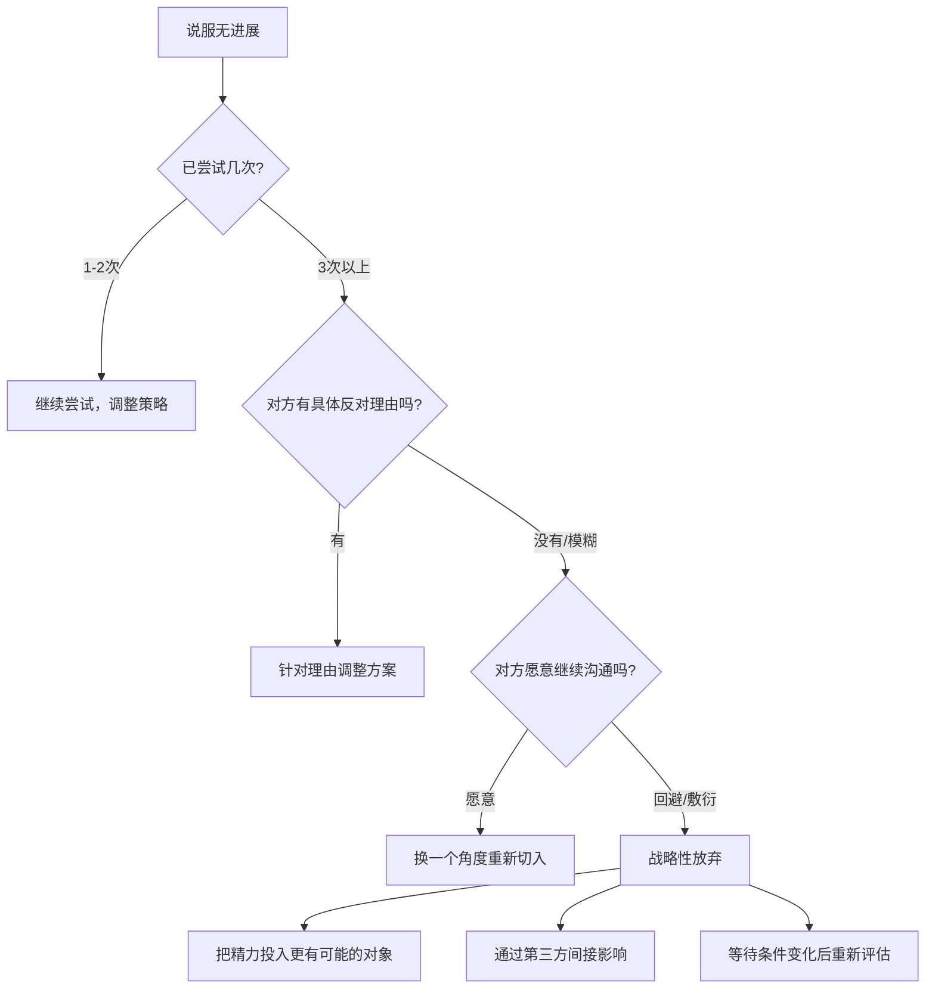
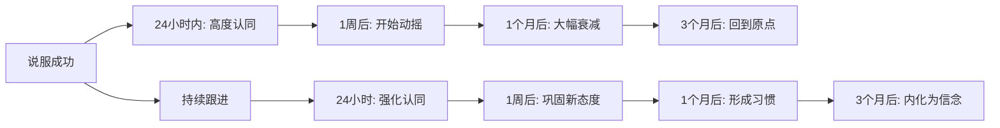
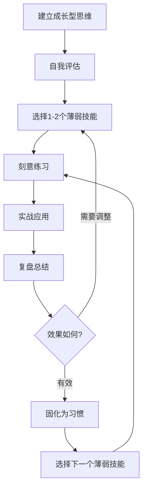

# 说服与影响力的十大常见误区

> 说服最大的敌人不是对手的固执，而是你自己深信不疑的错误假设。

很多人学了大量说服技巧，背熟了影响力原则，却在实际沟通中频频碰壁。问题往往不在于技巧本身，而在于一些根深蒂固的认知误区在暗中破坏你的说服效果。这些误区之所以危险，是因为它们"看起来很有道理"——你甚至不知道自己正在犯错。

本章系统梳理说服与影响力领域最常见的十大误区，逐一拆解其成因、危害和纠正方法。每个误区都配有真实场景分析和可执行的纠正方案，帮助你从根本上修正说服思维。



---

## 误区一：认为"逻辑越强，说服力越强"

### 表现

很多人把说服等同于"讲道理"。他们精心准备数据报告、逻辑推理和因果分析，认为只要论证足够严密，对方就没有理由拒绝。典型场景：

- 销售人员准备了20页产品对比数据，客户却选了报价更高的竞品
- 员工用详尽的ROI分析申请预算，领导却以"感觉不太对"驳回
- 伴侣用事实列举证明自己是对的，对方却更加生气
- 创业者拿着完美的财务模型找投资人，对方却说"再看看"

### 深层机制

神经科学家安东尼奥·达马西奥（Antonio Damasio）对前额叶腹内侧损伤患者的研究揭示了一个关键事实：**情感能力受损的人连最基本的决策都无法做出**。这些患者智力完好、逻辑能力正常，却无法决定午饭吃什么——因为所有选项对他们来说"都一样好"。

这个发现颠覆了"理性决策"的传统假设。实际的决策路径是：



普林斯顿大学的神经影像研究进一步证实：当人们被情感故事打动时，大脑中与批判性思维相关的区域活动会降低。换句话说，**情感投入会暂时"关闭"质疑机制**。

过度依赖逻辑的三个致命问题：

| 问题 | 机制 | 后果 |
|------|------|------|
| 触发分析模式 | 逻辑输入激活前额叶批判区域 | 对方变得挑剔，寻找漏洞 |
| 忽视情感需求 | 没有满足被理解、被尊重的需要 | 无法建立真正的连接 |
| 降低好感度 | "冷冰冰"的数据没有温度 | 对方产生距离感和防御心 |

### 真实案例

**场景：技术方案汇报**

某互联网公司的技术负责人小李，向CEO汇报微服务架构改造方案。他准备了详尽的技术对比：单体架构vs微服务的性能基准测试数据、故障恢复时间对比、三年TCO分析。汇报进行了40分钟，数据无懈可击。

CEO的反应："这些数据我看到了，但我更关心的是——这个改造会不会影响下个季度的核心功能上线？团队准备好了吗？"

小李的问题：他用40分钟讲技术指标，却没有用5分钟回答CEO真正关心的问题——**风险和团队准备度**。CEO的决策本质上是情感驱动的（对风险的担忧），而不是技术驱动的。

**场景：投资路演**

一位创业者在路演中花了25分钟展示详细的市场规模测算、竞品对比矩阵和五年财务预测。台下的投资人频频看手机。最后一位合伙人问了一个简单问题："你为什么要做这件事？" 创业者愣了两秒，然后讲了一个亲身经历的故事——他的母亲因为医疗信息不对称延误了治疗。台下所有人都抬起了头。

数据和逻辑在前25分钟没有做到的事，一个30秒的故事做到了。这不是因为故事比数据更"高级"，而是因为故事触动了情感系统，而情感系统才是决策的"守门人"。

### 纠正方法：情感先行，逻辑跟进

亚里士多德在2300年前就给出了答案：说服力由三个维度构成——**Ethos（可信度）、Pathos（情感共鸣）、Logos（逻辑论证）**。真正有效的说服需要三者平衡。

**实操框架——"3L说服节奏"：**

1. **Link（连接）**——先建立情感连接
   - 用一个故事或问题开场，触动对方的情感
   - 表明你理解对方的处境和关切
   - 示例："我知道团队最近压力很大，每个季度的交付压力都在增加。"

2. **Leverage（杠杆）**——用逻辑提供支撑
   - 精选3个最有力的数据点（不是20个）
   - 将数据转化为对方能感知的具体画面
   - 示例："改造后，线上故障恢复时间从4小时缩短到15分钟。这意味着即使凌晨出问题，值班工程师也能在喝完一杯咖啡前搞定。"

3. **Land（落地）**——情感收尾，推动行动
   - 将方案与对方的核心诉求连接
   - 用一个有力的收尾激发行动意愿
   - 示例："这个改造不只是技术升级，而是让团队从'救火模式'中解放出来，把精力放在真正有创造力的工作上。"

> **关键原则**：逻辑不是说服的武器，而是说服的支架。情感决定方向，逻辑提供支撑，两者缺一不可。

---

## 误区二：忽视对方的情绪信号

### 表现

说服者完全沉浸在自己精心准备的"话术脚本"中，像播放录音一样输出内容，对对方的情绪变化视而不见。典型表现：

- 对方已经明显不耐烦，说服者还在"再给我两分钟，还有一个重要数据"
- 对方表情困惑，说服者没有察觉，继续推进下一个论点
- 对方开始防御性回应（"但是……""你说的不对……"），说服者加大音量和力度
- 对方的语速和呼吸节奏已经明显变化，说服者完全没有注意到

### 情绪信号解读

说服是一个动态的双向互动过程，不是单向的信息灌输。对方的情绪状态是说服效果的"实时仪表盘"，忽视它就像开车不看仪表盘——迟早出事。

常见负面情绪信号及其含义：

| 信号类型 | 具体表现 | 潜在含义 | 应对策略 |
|----------|----------|----------|----------|
| **身体退缩** | 后仰、交叉双臂、转身 | 心理抗拒正在升高 | 暂停说服，转为提问 |
| **注意力漂移** | 看手机、看窗外、频繁点头 | 兴趣下降，信息过载 | 切换话题或换个表达方式 |
| **语气变化** | 语速加快、音量提高、语气变硬 | 情绪被触发，防御激活 | 降低节奏，表达理解 |
| **言语防御** | "但是"、"可是"、"你说的不对" | 核心信念被挑战 | 回退一步，重新建立连接 |
| **沉默对抗** | 不回应、简短回答、回避话题 | 不认同但不愿冲突 | 给对方安全的表达空间 |
| **微表情闪现** | 短暂皱眉、嘴角下撇、眼神变冷 | 内心不满尚未表露 | 立即暂停，主动询问感受 |
| **呼吸节奏变化** | 呼吸变浅变快、叹气 | 紧张或不耐烦 | 放慢节奏，给对方喘息空间 |

### 深层机制

心理学家约翰·戈特曼（John Gottman）在婚姻研究中发现的"四骑士"（批评、蔑视、防御、石墙）在说服场景中同样适用。当对方感受到被"说服"的压力时，会经历一个情绪升级过程：



**关键洞察**：从"开放聆听"到"彻底关闭"可能只需要3-5分钟。一旦进入"情绪对抗"阶段，单次说服基本宣告失败。最有效的策略不是在对抗时力挽狂澜，而是在"轻微不适"阶段就敏锐捕捉并及时调整。

### 纠正方法：培养"说服中的元认知"

元认知是"对自己思维过程的觉察"。在说服中，你需要同时运行两个线程：一个是"我在说什么"，另一个是"对方在感受什么"。

**实操技巧——"3-1节奏法"：**

每说3个关键论点后，插入1个观察和调整环节：

1. **暂停**：停止输出，给自己和对方一个呼吸的空间
2. **观察**：注意对方的面部表情、肢体语言和语气变化
3. **提问**：用开放性问题探测对方的真实状态
   - "我刚才说的这些，对您来说最重要的是什么？"
   - "我感觉您可能有一些顾虑，能分享一下吗？"
   - "这个方向和您的想法一致吗？"

**高级技巧——情绪标注：**

直接说出你观察到的情绪，这会让对方感到被理解和被关注（心理学家马修·利伯曼的fMRI研究证实，情绪被语言标注后，杏仁核的激活水平会显著下降——对方的情绪强度会自然降低，为理性对话创造空间）：

- "我感觉您对这个方案有些担心。"
- "听起来您对时间安排有些顾虑。"
- "我能感觉到这个话题对您来说很重要。"

**练习方法——"无声观察训练"：**

在日常会议或社交场合中，刻意练习不说话、只观察他人的情绪变化。每次观察后在心里标注："他现在看起来____，可能是因为____。" 这种训练能显著提升你的情绪感知敏锐度。

---

## 误区三：急于求成，跳过关系建设

### 表现

在信任基础为零的情况下直接提出请求或开始推销。典型场景：

- 社交场合第一次见面就递名片、介绍产品
- 给从未联系过的客户群发推销邮件
- 新入职就急于推行自己的改革方案
- 在微信群里刚加好友就私聊推销
- 加入新团队第一天就提出"改进建议"

### 为什么是误区

罗伯特·西奥迪尼（Robert Cialdini）的影响力六原则中，**互惠、喜好、权威**都需要时间积累。缺乏关系基础的说服存在三个致命缺陷：

**缺陷一：可信度不足。** 一个陌生人对你说"这个产品很好"，和一个你信任的朋友对你说同样的话，效果完全不同。可信度是说服力的基石，而信任需要时间建立。

**缺陷二：触发防御机制。** 当一个不熟悉的人突然提出请求，大脑的威胁检测系统会自动激活："这个人想要什么？""是不是在套路我？"这种本能防御会让后续所有说服信息都被打折。

**缺陷三：信息不对称。** 没有关系基础，你无法了解对方真正的需求、痛点和决策标准。你的说服就像蒙着眼睛射箭——偶尔命中只是运气。

### 关系投资回报模型



### 真实案例

**场景：B2B销售**

两家公司竞标同一个企业客户。

**A公司**销售代表小王：第一次见面就展示了完整的产品方案、报价单和实施计划。准备充分，逻辑清晰。客户礼貌地说"我们再考虑考虑"，然后没有了下文。

**B公司**销售代表小张：第一次见面只做了自我介绍，花大量时间了解客户的业务挑战和行业趋势。会后发了一篇与客户痛点相关的行业研究报告。第二次见面，分享了一个类似客户的成功案例。第三次见面，才正式介绍方案。

结果：客户选择了B公司。客户私下说："小张更懂我们，他的方案是为我们量身定制的。"

实际上，两家公司的产品差异不大。差距在于——小张投入了三次互动建立信任和理解，而小王试图在一次互动中完成所有事情。

**场景：跨部门协作**

新上任的产品总监急于证明自己的价值，上任第一周就发了一份"产品流程优化方案"给技术部、设计部和运营部。方案逻辑完善，但三个部门的负责人都没有积极响应。

原因很简单：他还没有和任何一个部门的负责人建立过一对一的关系，没有人了解他的风格、动机和能力。他的方案再好，在别人眼里也只是"新来的人想搞事情"。

如果他先花两周时间分别和每个部门负责人喝咖啡、了解他们的痛点和诉求，再在已有的共识基础上提出方案，结果会完全不同。

### 纠正方法：信任账户模型

把每次互动想象成向"信任账户"存款或取款：

**存款行为：**
- 分享有价值的信息（不求回报）
- 真诚地倾听对方的问题和需求
- 兑现每一个小承诺（"我明天发给你"就必须明天发）
- 在对方需要帮助时主动伸手
- 记住对方说过的细节，下次见面提起
- 在背后为对方说好话（对方会知道的）

**取款行为：**
- 提出请求或推销
- 要求对方花时间配合你
- 占用对方的资源或注意力
- 让对方为你承担风险

**黄金法则：在提出任何"取款"请求之前，至少完成3次"存款"互动。**

具体操作步骤：

1. **第一次接触**：建立基本印象，找到共同点，展现专业价值
2. **第二次接触**：提供无偿价值（行业报告、有用的信息、人脉介绍）
3. **第三次接触**：深化了解，确认对方的需求和痛点
4. **第四次接触**：可以适度提出请求或建议，但要以"对方利益"为出发点

---

## 误区四：只关注"说什么"，忽视"怎么说"

### 表现

把100%的精力放在内容打磨上，对表达方式毫不在意。结果是：内容精良但表达平淡，或者内容普通但表达出色的人，反而获得了更好的说服效果。

### 为什么是误区

阿尔伯特·梅拉比安（Albert Mehrabian）的沟通模型常被误读为"内容只占7%"，但其核心洞察是成立的：**在情感态度的传递中，非语言信息起主导作用**。

加州大学洛杉矶分校的研究进一步量化了这个影响：

| 信息维度 | 对说服力的影响 | 具体要素 |
|----------|----------------|----------|
| 语言内容（说了什么） | 约占信息传递的7-10% | 词汇选择、论据质量 |
| 声音特征（怎么说） | 约占38% | 语调、节奏、音量、停顿 |
| 视觉信号（怎么呈现） | 约占55% | 表情、眼神、手势、姿态 |

这不意味着内容不重要——没有好的内容，再好的表达也是空壳。但它说明：**同样的内容，表达方式可以让说服力相差数倍**。

### 具体要素拆解

**语调（Vocal Tone）：**

语调传递的是情感和态度。一个单调的语调会让最精彩的内容变得乏味，而富有变化的语调能让普通内容引人入胜。

- **自信的语调**：语速适中、音量稳定、句尾不升高（避免听起来像在提问）
- **热情的语调**：在关键词处提高音量和语调，传递感染力
- **真诚的语调**：适度降低音量和语速，传递认真和坦诚
- **权威的语调**：语速偏慢、音量偏低、句子简短有力——心理学研究表明，低声量比高声量更能传递权威感

**节奏（Pacing）：**

节奏控制的是注意力。关键技巧：

- 重要观点之前**停顿1-2秒**，制造悬念感
- 复杂论点之间**留出消化时间**，避免信息过载
- 用**语速变化**标记重点：关键句放慢，过渡句加快
- 在对方可能有情绪反应的地方**提前减速**，给对方消化的空间

**眼神接触（Eye Contact）：**

眼神是建立信任和传递自信最直接的通道：

- 保持60-70%的时间有自然的眼神接触（不是死盯）
- 在说关键观点时直视对方眼睛
- 在思考或回忆时可以短暂移开（避免"死盯"感）
- 在群体场景中，用"三角扫视法"：每个区域停留3-5秒
- 在一对一场景中，采用"W型扫视"：左眼→右眼→嘴部→左眼，形成自然的目光流动

**肢体语言（Body Language）：**

身体传递的信号比语言更真实——人们倾向于相信身体信号而非语言：

- **开放姿态**：双臂自然放松，身体微微前倾（传递兴趣和自信）
- **手势**：用手势强调关键点，但避免过度（分散注意力）。手心向上传递开放和真诚，手心向下传递权威和确定性
- **空间运用**：适度移动身体位置，但不要来回踱步（传递不安）
- **镜像同步**：自然地与对方的节奏和姿态保持相似（建立连接）。不要刻意模仿，而是"跟随"对方的节奏

**空间距离（Proxemics）：**

人类学家爱德华·霍尔（Edward Hall）提出的空间距离理论在说服中有重要应用：

| 距离 | 范围 | 适用场景 | 说服效果 |
|------|------|----------|----------|
| 亲密距离 | 0-45cm | 不适用正式说服 | 可能引发不适 |
| 个人距离 | 45-120cm | 一对一深度沟通 | 最佳说服距离 |
| 社交距离 | 1.2-3.6m | 商务会议 | 正式但有距离感 |
| 公共距离 | 3.6m以上 | 公开演讲 | 需要更强的表达力补偿 |

### 真实案例

**场景：同一个人、同一个内容，两种表达方式**

**版本A**（低效表达）：
> "我们的产品采用了先进的AI技术，能够自动化处理80%的客服请求，平均响应时间从15分钟缩短到30秒，客户满意度提升了25个百分点。"

说话者语调平淡、语速均匀、眼神看地面、双手插兜。

**版本B**（高效表达）：
> "想象一下——您的客服团队每天处理500个请求，其中400个是重复性问题。[停顿，环视听众] 我们的AI系统能自动处理这400个请求。[语速放慢] 30秒内响应，不是15分钟。[停顿] 而且——客户满意度提升了25个百分点。[微笑，微微前倾]"

说话者语调有起伏、关键处有停顿、眼神接触自然、手势配合内容。

内容几乎相同，但版本B的说服力可能是版本A的3倍以上。

### 纠正方法：表达力刻意练习清单

每周至少练习以下3个项目，每项5分钟：

1. **录像回放**：用手机录制自己的说服/演讲视频，回放时关注：语调是否单调？有没有口头禅？眼神是否自然？肢体是否僵硬？
2. **镜前练习**：对着镜子练习关键论点的表达，关注面部表情和手势
3. **录音分析**：录制自己的发言音频，关注语速变化和停顿运用
4. **模仿高手**：选择一位你欣赏的演讲者（如史蒂夫·乔布斯、西蒙·斯涅克），逐句模仿其表达方式，体会语调、节奏和停顿的运用
5. **反馈循环**：请信任的朋友在你演讲后给出表达方式的反馈

---

## 误区五：以为"反驳对方"能赢得说服

### 表现

当对方提出反对意见时，立即进入"辩论模式"：

- "你说的不对，事实是……"
- "但是你没有考虑到……"
- "你这个观点有三个问题……"
- 甚至用反问句攻击："你确定你了解这个领域吗？"
- 用"实际上"开头纠正对方的每个细节

### 为什么是误区

心理学中有一个重要概念叫**"逆火效应"（Backfire Effect）**：当人们的核心信念被直接反驳时，他们不仅不会改变观点，反而会更加坚定原来的立场。

哈佛大学的研究进一步证实：当人们的身份认同与某个观点绑定时，直接反驳等于在攻击他们的自我概念。大脑会启动与"身体受到威胁"相同的神经回路——战斗或逃跑。

反驳还会传递一个隐含的负面信息："你不够聪明/不够了解/不够正确。"这个信息会破坏关系基础，让后续的说服变得更加困难。

### 逆火效应的触发条件



**逆火效应的强度取决于三个因素：**

1. **身份关联度**：观点与对方的自我认同越紧密，逆火越强。政治立场、宗教信仰、职业判断属于高强度关联，产品偏好属于低强度关联
2. **反驳的攻击性**：语气越强硬、越居高临下，逆火越强
3. **公开程度**：在多人场合被反驳比私下被反驳的逆火效应更强（因为涉及"面子"）

### 真实案例

**场景：团队方案讨论**

产品经理小林提议开发一个新功能。技术负责人老张认为技术上不可行。

**错误的反驳方式：**
> 老张："你这个方案根本不可行，技术上实现不了。你又不懂技术，别瞎指挥。"

结果：小林感到被侮辱，不仅坚持己见，还开始在其他事情上与老张对立。两人关系恶化，团队协作效率下降。

**正确的处理方式：**
> 老张："小林，我理解你这个功能对用户体验很重要。从技术角度看，当前架构下实现会有一些挑战，主要是XX和YY。我们一起想想有没有既能满足用户需求、技术上又可行的方案？"

结果：小林感到被尊重，愿意一起探讨替代方案。最终找到了一个双方都满意的折中方案。

**场景：产品评审会上的反驳**

在一个产品评审会上，设计师对用户调研的结论提出质疑："这个调研样本太小了，只有20个人，结论不可靠。"

数据分析师立刻反驳："20个样本在定性研究中是标准数量，说明你对研究方法不了解。"

会议室气氛瞬间凝固。后来虽然调研结论被采纳，但设计师和数据分析师的关系恶化，后续协作中充满了摩擦。

如果数据分析师说："你对样本量的担心很合理。这确实是一个定性研究，20个样本在定性研究中能覆盖主要的用户行为模式，但不能做统计推断。我们后续会做定量验证。" ——效果会完全不同。

### 纠正方法：认同-补充-引导三步法

这是处理反对意见最有效的框架，核心思想是**"不反驳，而是扩展"**：

**第一步：认同（Validate）——降低防御**

目标不是同意对方的观点，而是认可对方有权利持有这个观点，并且理解其背后的逻辑。

话术模板：
- "我理解您的顾虑，这确实是一个需要认真考虑的问题。"
- "您提出了一个很重要的角度，我之前确实没有从这个方面想过。"
- "我完全理解为什么您会这样看，因为……"
- "这个担忧是合理的，很多人在第一次听到这个方案时都会有类似的想法。"

**关键技巧**：在认同中要具体说出对方的逻辑，而不是泛泛地说"你说得对"。这表明你真的在听，而不是在敷衍。

**第二步：补充（Expand）——引入新信息**

在对方观点的基础上，补充一个新的信息、视角或事实，而不是直接否定对方的论据。

话术模板：
- "在您这个观点的基础上，我还观察到一个有趣的现象……"
- "您说得对，从XX角度来看确实是这样。同时，如果我们从YY角度来看……"
- "我很认同您说的XX，我想补充一点数据，可能会让这个讨论更完整。"

**关键技巧**：用"同时"代替"但是"。"但是"意味着否定前面的内容，"同时"意味着在前面基础上叠加。这个看似微小的措辞变化，会让对方的接受度提高数倍。

**第三步：引导（Guide）——让对方自己得出结论**

用开放性问题引导对方重新审视自己的立场，让改变来自对方的内部思考，而不是你的外部施压。

话术模板：
- "如果我们综合这两个角度，您觉得会怎样？"
- "假如XX情况发生，您觉得我们应该怎么应对？"
- "我想听听您的看法——如果我们这样做，可能会有什么风险？"

**关键技巧**：问题要开放、真诚，不要有"引导性"太强的暗示。如果对方感觉到你在"套路"他们，效果会适得其反。

---

## 误区六：忽视"不可说服"的人

### 表现

在某些人身上持续投入大量时间和精力，却看不到任何进展。可能的表现：

- 同一个方案改了五版，对方还是不满意
- 每次沟通都说"我再考虑考虑"，但从不给明确反馈
- 对方的反对理由不断变化，但结论始终是"不行"
- 你感觉在"推一堵墙"，费力但毫无进展

### 识别"不可说服"的深层原因

并非所有人都能被说服，这是说服领域的现实。以下情况通常意味着"说服成本"远超"说服收益"：

| 类型 | 特征 | 根本原因 | 建议策略 |
|------|------|----------|----------|
| **价值观对立** | 你的主张与对方核心信念冲突 | 信念系统差异 | 寻找共同价值，或战略性放弃 |
| **利益冲突** | 你的成功意味着对方的损失 | 利益结构不兼容 | 重新设计方案消除冲突，或绕道 |
| **身份绑定** | 反对你是他们身份认同的一部分 | 群体归属需求 | 寻找新的身份框架 |
| **历史包袱** | 过去的冲突导致系统性不信任 | 关系创伤 | 需要长期关系修复，非短期说服 |
| **信息壁垒** | 对方缺乏理解你方案的背景知识 | 知识鸿沟 | 先做教育，再做说服 |
| **决策权缺失** | 对方看起来是决策者，实际没有拍板权 | 组织结构不透明 | 找到真正的决策者 |
| **风险厌恶型** | 对任何变化都本能抗拒 | 损失厌恶心理 | 降低感知风险，提供安全网 |

### 战略性放弃的决策框架



**一个重要的区分**：战略性放弃≠放弃关系。你可以停止说服，但不要停止维护基本关系。今天"不可说服"的人，在条件变化后可能成为你最有力的支持者。

### 纠正方法：说服力投资组合管理

像管理投资组合一样管理你的说服力投入：

**1. 评估"说服可行性"**

在投入大量精力前，用以下标准快速评估（每个维度1-5分）：

| 维度 | 评估问题 | 低分信号 |
|------|----------|----------|
| **开放性** | 对方是否愿意讨论这个话题？ | 回避、敷衍、不安排时间 |
| **相关性** | 这个方案与对方的核心利益相关吗？ | "这个不是我负责的""和我关系不大" |
| **能力** | 对方是否有权力和资源做出你期望的决定？ | "我需要请示""这个不是我一个人能决定的" |
| **时机** | 现在是合适的时机吗？ | 对方正在处理危机、组织正在变革期 |

如果四个维度中两个以上得分低于2分，说服成功率会低于15%，建议暂时搁置。

**2. 设定"止损线"**

- 给每个说服对象设定最大投入上限（时间、精力、资源）
- 达到上限后如果没有进展，果断止损
- 把释放出来的资源投入可行性更高的对象
- 止损不等于放弃，而是"暂停投入，保持观察"

**3. 保留"后手"**

- 战略性放弃不是永久放弃，而是"暂时搁置"
- 保持基本关系，不把路堵死
- 等待条件变化（人员变动、市场变化、新信息出现）后重新评估
- 定期（每季度）回顾"搁置名单"，评估是否有新的机会窗口

---

## 误区七：把说服当成"一次性事件"

### 表现

认为说服就是"在那个关键对话中赢了"。一次成功的说服之后：

- 不再跟进，认为"搞定了"
- 不巩固对方的新态度，任其自然消退
- 不帮助对方将态度转化为行动
- 不预见和预防可能的"反弹"
- 忽略周围可能影响对方态度的反面信息

### 为什么是误区

心理学家威廉·麦奎尔（William McGuire）的**"态度免疫理论"**指出：态度如果没有被持续强化，会像没有接种疫苗的身体一样，很容易被相反的信息"感染"并恢复原状。

说服效果的衰减曲线：



说服不是打开一个开关，而是启动一个过程。没有后续维护的说服，就像种下种子却不浇水——迟早枯萎。

**真实的衰减场景**：你成功说服领导批准了一个创新项目。一周后，领导在另一个会议上听到了"创新项目失败率高"的行业数据，开始动摇。一个月后，预算紧张时，你的项目第一个被砍。如果你在说服后的关键窗口期持续跟进、提供正面信息和阶段性成果，结果会完全不同。

### 纠正方法：说服后维护系统

**关键时间节点：**

| 时间 | 行动 | 目的 |
|------|------|------|
| **说服后立即** | 安排明确的下一步行动 | 保持动量，防止拖延 |
| **24小时内** | 发送总结+感谢+支持资源 | 巩固新态度，强化积极体验 |
| **1周后** | 轻量跟进，分享相关正面信息 | 预防反弹，持续强化 |
| **1个月后** | 深度跟进，确认执行情况 | 将态度转化为习惯 |
| **3个月后** | 回顾成果，庆祝成功 | 内化为长期信念 |

**具体操作模板：**

**24小时跟进消息：**
> "昨天的讨论很有收获。我整理了一份[相关资料]，供您参考。如果后续有任何问题，随时找我。"

**1周后跟进：**
> "上周我们讨论的[话题]，我看到一篇[相关文章/案例]，觉得很值得分享。[附链接] 您那边进展如何？"

**1个月后深度跟进：**
> "一个月前我们确定的[方案]，我想了解一下执行情况。有什么需要调整的地方吗？我们一起看看。"

**防止反弹的预防措施：**

1. **提前接种**：在说服成功后，主动提及可能的反对声音，帮助对方建立"态度免疫力"。"可能会有人质疑这个方案的可行性，我准备了一份应对方案，您看一下。"
2. **建立支持网络**：让多个支持者形成"态度联盟"，当一个人动摇时，其他人可以提供支持
3. **创造成功体验**：让对方尽快体验到决策带来的正面结果，用真实体验加固态度

---

## 误区八：过度使用稀缺性和紧迫感

### 表现

几乎每次沟通都使用稀缺性话术：

- "这是最后的机会了"
- "名额仅剩3个"
- "优惠明天截止"
- "如果你现在不决定，以后就没有这个条件了"
- "领导特批的价格，就这一次"

甚至人为制造虚假的稀缺感——明明库存充足却说"快卖完了"，明明没有截止日期却说"活动马上结束"。

### 为什么是误区

稀缺性原理的威力来自于"失去"的心理痛苦。诺贝尔经济学奖得主丹尼尔·卡尼曼（Daniel Kahneman）的前景理论证实：损失带来的心理痛苦是同等收益带来的快乐的2-2.5倍。但这个原理有两个重要的限制条件：

**限制一：习惯化效应。** 当稀缺信号过于频繁出现时，大脑会将其归类为"背景噪音"而不再响应。这就是心理学中的"刺激适应"——再强烈的刺激，重复多次后也会失去效果。超市里永远在"打折"的商品，你还会觉得它便宜吗？

**限制二：信任损耗。** 稀缺性的前提是"可信"。一旦对方发现稀缺是人为制造的，你的整体可信度会受到严重损害。信任是说服力的基石，而信任一旦受损，修复成本极高。

研究数据：哈佛商学院的研究发现，当消费者发现"限时优惠"实际上是常态优惠时，品牌信任度下降40%，后续促销活动的转化率下降60%。更严重的是，这种信任损伤会扩散到品牌的其他信息——连真实的稀缺性也不再被相信。

**限制三：决策质量下降。** 在紧迫感的驱动下做出的决定，往往是冲动的、次优的。当对方事后反思时，会产生"被套路"的感觉，这会严重损害长期关系。

### 纠正方法：稀缺性的正确使用方式

**稀缺性的四个使用条件：**

1. **真实性**：稀缺必须是真实的、可验证的。"这个课程真的只剩10个名额"——如果对方查一下发现随时都能报名，信任就崩塌了。
2. **适度性**：稀缺性是"辣酱"而不是"主菜"。每次沟通中都用稀缺性，就像每道菜都放辣酱——再好吃也会腻。建议每3-5次沟通中使用一次稀缺性。
3. **互补性**：稀缺性应该与其他说服技巧配合使用，而不是单独依赖。先建立价值感和信任，再用稀缺性推动行动。
4. **合理性**：稀缺的理由要让对方觉得合理。"因为我们的服务团队精力有限，所以每月只接5个新客户"比"名额有限"更有说服力。

**替代稀缺性的推动行动技巧：**

| 技巧 | 原理 | 话术示例 |
|------|------|----------|
| **损失框架** | 强调不行动的代价 | "如果继续用旧方案，每月会多支出XX元" |
| **社会证明** | 展示他人的行动 | "和您同行业的XX公司上个月已经切换了" |
| **沉没成本** | 提醒已投入的资源 | "基于我们之前做的调研，下一步只需要……" |
| **默认选项** | 改变决策框架 | "我先把合同准备好，您看完没问题就签" |
| **价值锚定** | 先展示高价值再给出合理价格 | "如果请专人做，成本至少XX。我们的方案只需要YY。" |
| **进度推进** | 利用一致性原则 | "基于我们上次达成的共识，下一步自然就是……" |

---

## 误区九：用"群体压力"代替"个体说服"

### 表现

在团队或群体场景中，用多数人的意见来压服少数人：

- "大家都同意了，就剩你了"
- "你看所有人都选了A方案"
- "这是集体决策，你应该服从"
- 在会议中公开点名反对者，制造孤立感
- 用举手表决的方式把反对者"晒"出来

### 为什么是误区

所罗门·阿希（Solomon Asch）的经典从众实验揭示了群体压力的可怕力量：在明显错误的答案面前，仍有75%的被试至少有一次选择跟随多数。但实验后的访谈显示，这些"服从者"内心并不认同——他们只是不想成为异类。

群体压力说服的本质缺陷：

1. **表面服从，内心抗拒**：被迫同意的人不会真心执行，甚至可能暗中破坏
2. **信任损害**：被群体压服的人会对"施压者"和"群体"产生长期不信任
3. **沉默螺旋**：其他人看到反对者的下场后，会选择沉默而非表达真实想法——团队决策质量因此下降
4. **反弹风险**：一旦群体压力消失（比如离开了那个会议），被压服的人会迅速恢复原来的态度
5. **创新窒息**：当反对意见被压制，团队会陷入"群体思维"（Groupthink）——历史上许多重大决策灾难（如挑战者号航天飞机事故）都与此有关

### 纠正方法：群体场景中的个体尊重

**会议场景的正确操作：**

**会前：**
- 提前与可能有不同意见的人一对一沟通
- 了解他们的顾虑和反对理由
- 在会前就尝试说服或找到折中方案
- 准备好回应可能的反对意见

**会中：**
- 先让地位较低或性格内向的人发言（避免被"权威"影响）
- 明确表示"不同意见是受欢迎的"
- 对反对意见给予正面回应："这个角度很重要，我们来深入讨论一下"
- 如果无法达成一致，不要强行投票，而是安排后续讨论
- 使用匿名投票或书面意见收集，降低从众压力

**会后：**
- 与持不同意见的人私下沟通
- 表达对其观点的尊重
- 解释最终决策的理由，而不是"少数服从多数"
- 在后续执行中，给反对者参与方案优化的机会

**一对一场景的正确操作：**

当需要说服团队中的个别反对者时：

1. **理解反对的真正原因**：表面的反对理由可能不是真正的原因。"技术上不可行"可能意味着"我没有足够的人力"，"成本太高"可能意味着"我没有预算权限"。
2. **解决真正的问题**：针对真正的原因提供解决方案，而不是针对表面理由反复说服。
3. **给对方"面子"**：让对方感到"我是被说服的，不是被压服的"——这对维护关系和长期合作至关重要。
4. **创造参与感**：邀请反对者参与方案的优化，让他们成为方案的"共同所有者"而非"被动接受者"。

---

## 误区十：认为说服力是"天赋"而非"技能"

### 表现

内心深处相信说服力是天生的特质：

- "我从小就嘴笨，不擅长说服别人"
- "有些人天生就有气场，我学不来"
- "我性格内向，不适合做说服类的工作"
- 看到说服高手时的第一反应是"天赋好"而非"练得好"
- 把说服失败归因于"我不行"而非"我还需要练习"

### 为什么是误区

斯坦福大学心理学家卡罗尔·德韦克（Carol Dweck）的**"成长型思维"**研究明确表明：将能力归因于天赋（固定型思维）的人，会主动减少练习和挑战，从而真的限制了自己的成长——这是一个自我实现的预言。

说服力的研究证据：

- **可训练性**：多项研究证实，经过系统训练的人，说服力可以显著提升
- **技能分解**：说服力可以分解为多个子技能（倾听、共情、表达、逻辑、应变），每个子技能都可以单独练习
- **高手的秘密**：那些被认为"天生有说服力"的人，往往只是更早开始了有意识的练习，或者在成长环境中获得了更多的说服实践机会
- **性格不是障碍**：内向的人在一对一深度说服中可能比外向者更有优势——因为他们更擅长倾听和深度思考

### 纠正方法：说服力提升路径图



**说服力子技能清单：**

| 子技能 | 描述 | 练习方法 | 评估标准 |
|--------|------|----------|----------|
| **倾听** | 理解对方真正的需求和顾虑 | 每次对话后复述对方的核心观点 | 能准确复述对方80%以上的核心观点 |
| **共情** | 感知和回应对方的情绪 | 练习"情绪标注"——说出对方可能的感受 | 对方经常说"你理解我" |
| **表达** | 清晰、有力、有感染力地传递信息 | 录像回放+模仿高手+镜子练习 | 观众反馈"有说服力""愿意听" |
| **逻辑** | 构建严密、有说服力的论证 | 学习逻辑谬误+每天分析一个论证 | 论证中不出现明显的逻辑漏洞 |
| **应变** | 处理意外的反对和质疑 | 角色扮演+模拟对抗场景 | 面对质疑时不慌乱，能灵活应对 |
| **观察** | 读懂对方的非语言信号 | 在日常对话中刻意观察对方的表情和肢体 | 能提前察觉对方的情绪变化 |
| **关系** | 建立和维护信任关系 | 每周主动联系一位有价值的人脉 | 需要帮忙时有人愿意回应 |

**刻意练习的关键原则：**

1. **选一个技能**：不要同时练习所有技能，先从最薄弱的一个开始
2. **设定具体目标**：不是"提高说服力"，而是"在下次汇报中使用3次停顿技巧"
3. **获取反馈**：录像、录音、请人观察——没有反馈的练习是盲目的
4. **持续迭代**：每周复盘，调整练习重点
5. **记录进步**：建立"说服力日志"，记录每次说服的场景、策略、效果和反思

---

## 误区诊断与自我评估

在实际说服中，你可能同时陷入多个误区。以下是一个快速自检工具，帮助你识别自己的薄弱环节。

### 自检清单

对以下每个问题，诚实地回答"是"或"否"：

**认知层（误区1、10）：**
- [ ] 我认为只要有足够的数据和逻辑，就能说服任何人
- [ ] 我认为说服力是天生的，后天提升有限

**策略层（误区3、6、7）：**
- [ ] 我经常在没有建立关系基础的情况下就开始说服
- [ ] 我会在明显不可能的人身上投入大量说服精力
- [ ] 我认为说服成功后就不需要再跟进

**执行层（误区2、4、5、8、9）：**
- [ ] 我在说服时经常忽略对方的情绪变化
- [ ] 我把大部分精力放在"说什么"上，很少关注"怎么说"
- [ ] 我在面对反对意见时倾向于直接反驳
- [ ] 我经常使用"最后机会""仅剩名额"等稀缺性话术
- [ ] 我在群体场景中会用多数人的意见来压服少数人

**评分说明：**
- **0-2个"是"**：说服认知基础良好，继续保持
- **3-5个"是"**：存在一些误区，建议针对性地改进
- **6个以上"是"**：多个误区并存，建议系统学习并刻意练习

### 误区关联分析

这十大误区并非孤立存在，它们往往相互强化、形成恶性循环：

```mermaid
graph TD
    A[误区10: 天赋论] -->|放弃练习| B[技能不足]
    B --> C[说服失败]
    C --> D[误区1: 加大逻辑力度]
    D --> E[误区2: 忽视情绪反馈]
    E --> F[效果更差]
    F --> G[误区5: 开始反驳对方]
    G --> H[关系恶化]
    H --> I[确认"我不行"]
    I --> A
    
    J[打破循环] --> K[从一个误区开始纠正]
    K --> L[体验到改善]
    L --> M[建立信心]
    M --> N[继续纠正下一个]
    N --> O[正向循环]
```

**关键启示**：不要试图同时纠正所有误区。从你最常犯的一个开始，体验到改善后，再扩展到下一个。正向循环一旦启动，进步会越来越快。

---

## 十大误区速查表

| 误区 | 核心问题 | 深层机制 | 纠正方向 | 关键话术/动作 |
|------|----------|----------|----------|---------------|
| 逻辑至上 | 忽视情感因素 | 决策是情感驱动的 | 情感先行，逻辑跟进 | 先讲故事，再给数据 |
| 忽视情绪信号 | 沉浸在自己的脚本中 | 情绪是说服的实时仪表盘 | 3-1节奏法，情绪标注 | "我感觉您有些顾虑……" |
| 急于求成 | 跳过关系建设 | 信任是说服的基石 | 信任账户模型，3次存款 | 先提供价值，再提请求 |
| 只重内容 | 忽视表达方式 | 非语言信息占比超90% | 录像回放，刻意练习 | 停顿+语调变化+眼神接触 |
| 反驳对方 | 触发心理抗拒 | 逆火效应 | 认同-补充-引导三步法 | 用"同时"替代"但是" |
| 忽视不可说服者 | 资源浪费 | 有些信念无法改变 | 说服力投资组合管理 | 设止损线，战略性转移 |
| 一次性思维 | 缺乏后续巩固 | 态度需要持续强化 | 说服后维护系统 | 24h/1周/1月跟进节奏 |
| 滥用稀缺性 | 稀缺信号脱敏 | 习惯化+信任损耗 | 真实稀缺，适度使用 | 用损失框架替代虚假稀缺 |
| 群体压服 | 缺乏真正的认同 | 表面服从内心抗拒 | 一对一深入沟通 | 会前私下沟通，给"面子" |
| 天赋论 | 放弃提升可能 | 自我实现的预言 | 成长型思维+刻意练习 | 每周练一个子技能 |

---

## 从误区到精通的行动路线

识别误区只是第一步，真正的改变来自持续的行动。建议按以下顺序逐步改进：

**第一阶段（1-2周）：建立觉察**
- 打印"自检清单"，放在工作桌上
- 每次说服后快速回顾：我犯了哪个误区？
- 开始记录说服日志（场景、策略、效果、反思）
- 在日常对话中刻意练习观察对方的情绪信号

**第二阶段（3-4周）：重点突破**
- 选择你最常犯的2个误区，集中改进
- 每周练习一个对应的纠正技巧
- 录制自己的说服/演讲视频，回放分析
- 找一位"说服力伙伴"互相观察和反馈

**第三阶段（2-3个月）：全面优化**
- 将纠正技巧内化为自然习惯
- 开始练习更高级的技巧组合（如"情感+逻辑+稀缺性"的组合拳）
- 建立自己的说服力评估体系
- 在不同场景中测试和调整策略

**第四阶段（持续）：精益求精**
- 在真实场景中反复实践
- 从每次成功和失败中提取经验
- 形成自己独特的说服风格
- 开始帮助他人提升说服力（教是最好的学）

记住：说服力的提升不是线性的，而是螺旋上升的。每次"犯错-觉察-纠正"的循环，都会让你的说服力上一个新台阶。关键不是"永远不犯错"，而是"每次犯错后都在进步"。

> **最终忠告**：说服力是一把双刃剑。学习这些技巧的目的是为了更有效地沟通和协作，而不是操控他人。真正的说服力高手，是让对方在被说服后感到"这是我自己的决定"，而不是"我被套路了"。当对方感到被尊重、被理解、被帮助时，说服才真正成功了。
