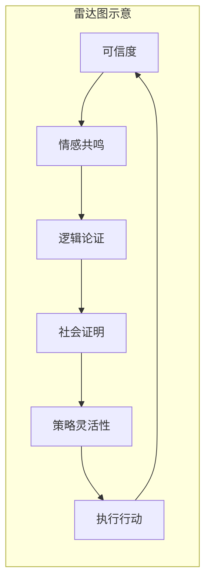

# 说服与影响力的系统练习方法

> 技巧只有在反复练习中才会变成直觉。你不会因为读了一本游泳教材就学会游泳，说服力同理。

说服力不是知识，而是技能。知识可以靠阅读获得，技能必须靠练习锻造。心理学家 K. Anders Ericsson 在对"专家级表现"的数十年研究中发现：任何领域的卓越表现，都源于数千小时的**刻意练习**（Deliberate Practice）——不是简单的重复，而是聚焦弱点、设定目标、获得反馈的系统化训练。说服力也不例外。

本章提供一套完整的说服力刻意练习体系——从每日微训练到每月深度工作坊，从基线评估到进阶突破，从个人练习到群体实战。这套体系的设计基于三条核心原则：

1. **刻意练习**（Deliberate Practice）：不是漫无目的地"多说话"，而是聚焦特定技巧、设定明确目标、获得即时反馈。Ericsson 的研究表明，没有反馈的重复练习不仅无效，还会固化错误习惯
2. **渐进超负荷**：像健身一样，从轻量开始，逐步增加难度和强度。神经可塑性研究表明，大脑只在"适度挑战"区间内才会形成新的神经通路——太简单不成长，太难会放弃
3. **场景迁移**：同一技巧在不同场景中反复锤炼，直到形成可迁移的底层能力。认知心理学称之为"远迁移"（far transfer），是衡量技能是否真正内化的金标准

```mermaid
graph TD
    A[说服力练习体系] --> B[基线评估]
    A --> C[每日练习]
    A --> D[每周练习]
    A --> E[进阶练习]
    A --> F[30天计划]
    A --> G[效果衡量]
    B --> B1[说服力自评量表]
    B --> B2[当前水平定位]
    B --> B3[薄弱维度识别]
    C --> C1[说服日记]
    C --> C2[微说服挑战]
    C --> C3[情绪信号捕捉]
    C --> C4[说服拆解分析]
    D --> D1[模拟说服场景]
    D --> D2[深度复盘]
    D --> D3[说服高手观察]
    D --> D4[跨场景迁移]
    D --> D5[反驳训练]
    E --> E1[说服工作坊]
    E --> E2[策略工具箱]
    E --> E3[压力说服训练]
    E --> E4[数字说服练习]
    F --> F1[第一周: 认知觉醒]
    F --> F2[第二周: 技巧强化]
    F --> F3[第三周: 综合应用]
    F --> F4[第四周: 内化突破]
    G --> G1[定量指标追踪]
    G --> G2[定性信号观察]
    G --> G3[四能标准检验]
```

---

## 一、基线评估：了解你的起点

在开始练习之前，你需要知道自己目前在哪里。GPS 导航需要两个信息——目的地和当前位置——才能规划路线。说服力练习同理：没有基线评估，你就不知道自己进步了多少，也不知道该把精力集中在哪里。

以下自评量表涵盖说服力的六个核心维度，每个维度5道题，共30题。诚实地评估自己，这不是考试，而是定位工具。过高或过低的自我评估都会误导练习方向——研究表明，人类普遍存在"达克效应"（Dunning-Kruger Effect），能力较低的人倾向于高估自己，能力较高的人倾向于低估自己。找一个了解你的人帮你交叉验证评分，会更准确。

### 说服力自评量表

对以下每个陈述，用1-5分评估自己（1=完全不符合，5=完全符合）：

**维度一：可信度构建**

可信度是一切说服的基础。Aristotle 在两千多年前就指出，说服的三个支柱中，Ethos（说话者的品格和可信度）排在第一位。没有可信度，再好的论据和情感诉求都会被怀疑。

| 序号 | 陈述 | 评分 |
|------|------|------|
| 1 | 在表达观点时，我会主动提供支持自己立场的资质或经验 | ___ |
| 2 | 我能在对话中展示对对方需求和立场的深入理解 | ___ |
| 3 | 我会承认自己观点的局限性，而不是只说好处 | ___ |
| 4 | 别人经常评价我"靠谱"、"专业"或"值得信赖" | ___ |
| 5 | 我能在30秒内用一句话说清"为什么这个话题我有发言权" | ___ |

**维度二：情感共鸣**

人类是情感动物，然后才是理性动物。神经科学家 Antonio Damasio 的研究发现，情感受损的患者连最简单的决策都做不了——情感不是理性的对立面，而是决策的必要条件。说服力的情感维度决定了你的论据能否"进入"对方的内心。

| 序号 | 陈述 | 评分 |
|------|------|------|
| 6 | 我能在说服中自然地使用故事来打动对方 | ___ |
| 7 | 我能准确识别对方在对话中的情绪变化 | ___ |
| 8 | 我知道什么时候该用情感诉求，什么时候该用逻辑论证 | ___ |
| 9 | 我能让对方感受到"我理解你的感受" | ___ |
| 10 | 我能在说服中唤起对方的希望、恐惧或渴望等深层情感 | ___ |

**维度三：逻辑论证**

逻辑论证是说服的骨架。没有逻辑支撑的情感诉求是空洞的煽情，没有逻辑支撑的权威引用是空洞的引用。逻辑能力决定了你的说服是否有"硬度"——能否经得起对方的质疑和反驳。

| 序号 | 陈述 | 评分 |
|------|------|------|
| 11 | 我能用金字塔结构组织我的论点（结论先行、层层支撑） | ___ |
| 12 | 我在说服中会使用具体的数据和案例来支撑观点 | ___ |
| 13 | 我能预判对方可能的反驳并提前准备回应 | ___ |
| 14 | 我能区分相关性论证和因果性论证，避免逻辑谬误 | ___ |
| 15 | 我能用类比和对比让复杂概念变得易于理解 | ___ |

**维度四：社会证明运用**

Robert Cialdini 的研究表明，当人们不确定该怎么做时，会观察别人怎么做来指导自己的行为。社会证明是说服力中最"省力"的杠杆之一——但用错了会适得其反。

| 序号 | 陈述 | 评分 |
|------|------|------|
| 16 | 我知道在什么情况下引用"大多数人"的做法最有说服力 | ___ |
| 17 | 我能用客户证言、案例研究来降低对方的决策风险感知 | ___ |
| 18 | 我了解社会证明的局限性——什么时候它会失效甚至起反作用 | ___ |
| 19 | 我能根据对方的身份和价值观选择最相关的社会证明 | ___ |
| 20 | 我知道如何创造"如果像你这样的人也在用"的说服效果 | ___ |

**维度五：策略灵活性**

说服不是背台词，而是即兴演奏。真正的说服高手能在对话中实时感知对方的状态变化，灵活切换策略。这种能力来自大量的实战经验和对多种策略的熟练掌握。

| 序号 | 陈述 | 评分 |
|------|------|------|
| 21 | 我能根据对方的反应实时调整说服策略 | ___ |
| 22 | 我能在同一次对话中综合运用多种说服技巧 | ___ |
| 23 | 我知道什么时候该推进、什么时候该退让 | ___ |
| 24 | 我能识别对方的"心理抗拒"信号并做出调整 | ___ |
| 25 | 我能在高压场景（如被质问、被挑战）中保持冷静并有效回应 | ___ |

**维度六：执行与行动**

说服的最终目的不是"让对方同意"，而是"让对方行动"。很多说服之所以"功亏一篑"，不是因为论证不充分，而是因为收尾没有推动行动。从"同意"到"行动"之间有一条鸿沟，你需要专门的技巧来跨越它。

| 序号 | 陈述 | 评分 |
|------|------|------|
| 26 | 我能在说服结尾清晰地提出具体的行动建议 | ___ |
| 27 | 我知道如何降低对方的行动门槛（小承诺、试用期、无风险保证） | ___ |
| 28 | 我能在说服后跟进并巩固对方的承诺 | ___ |
| 29 | 我能判断对方是否真的被说服了，还是只是表面同意 | ___ |
| 30 | 我能复盘每次说服经历并提取可复用的经验 | ___ |

### 评分解读

| 总分区间 | 水平定位 | 特征描述 | 建议重点 |
|----------|---------|---------|---------|
| 30-60分 | 初学者：有意识无技巧 | 能感受到说服的存在，但缺乏系统方法，经常凭本能行事，效果不稳定 | 从第一周基础练习开始，重点建立觉察能力，不要跳级 |
| 61-90分 | 进阶者：有技巧但不系统 | 掌握了部分技巧，但使用场景单一，缺乏灵活性，面对困难场景容易退缩 | 重点突破薄弱维度，加强跨场景迁移训练 |
| 91-120分 | 熟练者：系统但不够灵活 | 有完整的策略体系，常规场景游刃有余，但高压和即兴场景下容易退化 | 重点练习压力场景和即兴说服，突破舒适区 |
| 121-150分 | 高手：全面且灵活 | 多数场景下都能自如运用各种策略，有个人风格 | 重点修炼高级工作坊、教学输出、和极端场景应对 |

**关键动作**：把你的六个维度分数画成雷达图。最低分的维度就是你未来30天的重点练习方向。雷达图的形状比总分更有意义——一个总分100分但"情感共鸣"只有10分的人，和一个总分90分但六个维度均匀的人，后者的真实说服力更强。

**进阶用法——360度评估**：除了自评，找3-5个了解你的人（同事、朋友、家人）用同一量表匿名评估你。对比自评和他评的差异，往往能发现你最大的盲点。比如你可能给自己"情感共鸣"打了4分，但同事只给你打了2分——这说明你认为自己在共情，但对方感受不到。

---

## 二、每日练习：日常场景中的刻意训练

每日练习的核心理念是**微习惯**——每天投入15-20分钟，聚焦一个技巧，持续积累。BJ Fogg 在《Tiny Habits》中的研究表明，习惯的形成不靠意志力，靠的是"锚定"——把新行为绑定到已有的日常行为上。比如"刷完牙后写说服日记"比"找个时间写日记"的成功率高三倍。

不要试图一天练完所有技巧，那只会让你浅尝辄止。

### 练习1：说服日记（每日10分钟）

说服日记是整个练习体系的基石。它不只是记录，而是一种**元认知训练**——对自身说服行为的系统反思。

**操作方法**：每天睡前用10分钟回顾当天的说服场景，填写以下模板：

日期：____
今日说服场景数：____

场景1：
- 说服对象：____
- 说服目标：（我想让对方做什么/相信什么）____
- 使用策略：（从以下选择：情感/逻辑/社会证明/稀缺性/权威/互惠/承诺一致性/喜好）____
- 效果评估：（成功/部分成功/失败）____
- 对方关键反应：（什么话/表情/动作让你判断出效果）____
- 改进点：（如果重来，我会调整什么）____

场景2：（同上格式）
...

**进阶要求**：

- **第一周**：每天记录至少2个说服场景，重在"发现自己在说服"。很多人一开始觉得"今天没有说服场景"——这恰恰说明你需要练习觉察力
- **第二周**：开始标注每个场景使用了哪些说服原则（对照 Cialdini 六大原则：互惠、承诺一致性、社会证明、喜好、权威、稀缺性）
- **第三周**：分析自己的说服模式——你最依赖哪种策略？哪种几乎没用过？大多数人会发现自己过度依赖一两种策略（最常见的是"逻辑论证"和"情感故事"），而忽略了其他四种
- **第四周**：针对薄弱策略刻意安排说服机会。比如你很少使用"社会证明"，就主动在这一天的对话中加入"大多数人..."、"我看到一个数据..."的表达

**常见问题**：

- **"我今天没有说服场景"**——不可能。你选择穿什么衣服出门、午饭吃什么、看什么视频，都在说服自己。说服日记的关键是扩大你的觉察范围。从说服自己开始记录，再扩展到说服他人。心理学研究发现，普通人每天参与的说服互动平均有7-15次，但大多数人只意识到了1-2次
- **"我不知道自己用了什么策略"**——这正是需要练习的地方。先凭感觉写，回头对照理论部分核对。你可能无意识地使用了某个策略，但叫不出名字——给它命名，就能从无意识变为有意识。认知心理学称之为"语言化效应"（verbalization effect）：给经验命名能显著提高对它的控制力

**为什么有效**：认知心理学中的**元认知**（metacognition）研究表明，对自身思维过程的反思能显著加速技能习得。Flavell（1979）的开创性研究证明，元认知能力强的学习者，其技能习得速度是普通学习者的2-3倍。说服日记将无意识的说服行为转化为有意识的反思，这是从"本能说服者"升级为"策略说服者"的第一步。

---

### 练习2：微说服挑战（每日3次）

**操作方法**：每天设定3个微说服挑战，在日常沟通中有意识地练习一个特定技巧。

**技巧轮换表**（按周循环）：

| 周一 | 周二 | 周三 | 周四 | 周五 | 周六 | 周日 |
|------|------|------|------|------|------|------|
| 可信度 | 情感故事 | 逻辑论证 | 社会证明 | 稀缺性 | 综合运用 | 自由选择 |

**具体挑战示例**：

**可信度日**：

可信度的核心是让对方相信"你有资格说这个话"。练习的关键不是吹嘘自己，而是**自然地展示相关性**。

- 挑战1：在今天的一次表达中，主动引用一个你亲身经历的案例来支撑观点。比如讨论某个技术方案时说"我之前在XX项目中用过类似方案，效果是..."
- 挑战2：在回复同事消息时，先展示你对这个话题的了解深度，再给出建议。不是说"我觉得应该这样做"，而是"我查了XX和YY的资料，数据显示..."
- 挑战3：在今天的对话中，主动承认一个自己不确定的地方（"坦诚"本身就是可信度的来源）。心理学中的"瑕疵效应"（Pratfall Effect）表明，有能力的人承认小缺点反而会增加可信度

**情感故事日**：

故事之所以有效，是因为它激活了大脑的"神经耦合"（neural coupling）机制——听故事时，听者的大脑活动模式会与讲述者趋同。这是 Princeton 神经科学家 Uri Hasson 的经典发现。

- 挑战1：在今天的会议发言中，用一个30秒的小故事开头，而不是直接列数据。格式：人物+困境+转折+结果
- 挑战2：说服朋友尝试某件事时，不讲道理，只讲你自己的感受和体验。用"我记得有一次..."开头
- 挑战3：在邮件中用一个具体的场景描述替代抽象的说明。不是"这个功能很有用"，而是"上周二下午，小王遇到了XX问题，用了这个功能后，5分钟就解决了"

**逻辑论证日**：

逻辑论证的关键不是堆砌数据，而是构建**因果链条**——让对方看到从A到B到C的推理过程。

- 挑战1：在今天的一个观点表达中，使用"因为A→B→所以C"的三段论结构。比如"因为客户投诉率上升了30%（A），而投诉主要集中在配送环节（B），所以我们应该优先优化配送流程（C）"
- 挑战2：在回复不同意见时，先用"你说得对的是..."承认对方的合理部分，再补充你的论据。这个技巧叫"先跟后带"，能显著降低对方的防御心理
- 挑战3：用一个数字来支撑你今天表达的任意一个观点。数字的力量在于具体性——"很多人"不如"73%的人"有说服力

**社会证明日**：

社会证明的核心逻辑是："如果像我这样的人都在做这件事，那这件事大概率是靠谱的。"练习的关键是找到**与对方最相关的社会证明**。

- 挑战1：在推荐某样东西时，除了自己的体验，加上"而且XX也在用"——但注意，这个XX必须是对方认可或认同的人
- 挑战2：在表达观点时，引用一个你看到的相关调查或数据。比如"我看到XX的调查显示，80%的用户..."
- 挑战3：在说服时使用"和你类似的人/公司通常会..."的句式。这个句式的力量在于"相似性"——人们更容易被与自己相似的人影响

**稀缺性日**：

稀缺性的心理学原理是"损失厌恶"——人们对失去的恐惧是获得同等价值东西的快乐的2倍（Kahneman & Tversky, 1979）。练习稀缺性时要特别注意**真实性**——虚假的紧迫感一旦被识破，会严重损害可信度。

- 挑战1：在邀请朋友做某件事时，加上一个真实的时间限制。不是"赶紧做"，而是"这周六之前去的话有优惠，周日就恢复原价了"
- 挑战2：在表达机会时，强调"错过这次，下次不知道什么时候"——但前提是你真的不知道下次是什么时候
- 挑战3：在自我介绍中，突出一个只有你具备的独特优势。不是"我很努力"（人人都能说），而是"我是团队里唯一同时做过前端和数据分析的人"

**记录方式**：在手机备忘录中快速记录，一两句话即可：

12:30 午餐时给小张讲了一个自己用某产品的真实故事，他说"那我也试试" ✓
15:00 会议上用"80%的用户反馈..."来支持我的方案，领导点了头 ✓
19:30 说服老婆周末去爬山用了稀缺性——"下周天气就不行了"，她同意了 ✓

**关键原则**：每次只聚焦一个技巧。就像练钢琴——先把音阶弹准，再练曲子。试图同时练习所有技巧只会让你哪个都练不精。Ericsson 的刻意练习理论强调：**聚焦**（focus）和**反馈**（feedback）是刻意练习的两个核心要素，缺一不可。

**为什么有效**：神经科学研究表明，技能的习得依赖于**髓鞘化**（myelination）——反复练习特定的神经通路会使包裹神经纤维的髓鞘变厚，信号传递速度加快。Daniel Coyle 在《The Talent Code》中详细解释了这个过程：每次你有意识地重复一个动作，相关神经通路的髓鞘就加厚一层，直到这个动作从"需要刻意思考"变成"自动反应"。微说服挑战的设计，就是让你每天都在给关键神经通路"加厚髓鞘"。

---

### 练习3：情绪信号捕捉（贯穿全天）

**操作方法**：在每次沟通中，有意识地观察对方的情绪信号。这不是"读心术"，而是系统地训练你对非语言信息的敏感度。Albert Mehrabian 的经典研究（虽然常被误读）揭示了一个关键事实：在情感和态度的传递中，非语言信息占了绝大部分比重。

**观察清单**（打印出来随身携带，或设为手机锁屏提醒）：

| 信号类型 | 积极信号（继续推进） | 消极信号（暂停/调整） |
|----------|-------------------|---------------------|
| 面部表情 | 微笑、点头、眼神接触、眉毛上扬（兴趣和认同） | 皱眉、目光回避、嘴角下拉、频繁眨眼（困惑或抗拒） |
| 肢体语言 | 身体前倾、双手打开、朝向你（开放和投入） | 身体后仰、交叉双臂、转向别处、玩手机（防御和脱离） |
| 语音特征 | 语速加快（兴奋）、音调升高（兴趣）、追问细节（投入） | 语速变慢（思考或不认同）、音调降低（疲惫或抗拒）、长时间沉默（犹豫或反对） |
| 回答模式 | 提出具体问题、主动补充信息、使用"我们"（认同和参与） | 回答变短、用"嗯""好吧"敷衍、频繁转换话题、说"但是"（防御和退出） |
| 主动行为 | 主动询问下一步、介绍相关人脉、分享自己的顾虑（表示信任） | 看手机/手表、说"我再想想"、找借口结束对话（脱离和拖延） |

**练习要求**：

1. 每天至少在3次对话中主动观察并记录对方的情绪变化
2. 记录的关键不是"对方什么表情"，而是"在我说了什么之后，对方的表情发生了什么变化"
3. 这才是因果关联——你的哪句话/哪个行为触发了对方的情绪转折

**记录模板**：

场景：和领导讨论方案
时间线：
  - 我说"这个方案预计能省20%成本" → 领导身体前倾，追问"怎么省的？"（兴趣信号↑）
  - 我详细解释技术细节时 → 领导开始看手机（失去耐心信号↓）
  - 我说"简单来说就是用自动化替代人工" → 领导点头，说"这个思路好"（重新聚焦↑）
关键发现：领导对技术细节不感兴趣，更关注结果和简洁解释
可复用规律：对这个领导，先说结果数字，再用一句话解释原理，把技术细节留到书面材料中

**进阶练习——"盲听训练"**：

找一段公开的视频对话（如采访、TED 演讲、商业谈判录像），先关掉画面只听声音，尝试从语调、语速、停顿中判断说话人的情绪状态。然后打开画面验证。这个训练能显著提升你对声音信号的敏感度。推荐素材：《Shark Tank》（创业融资节目）、《The Apprentice》（商业真人秀）、各类商业谈判纪录片。

**进阶练习2——"情绪地图"**：

在一次较长的对话（15分钟以上）结束后，画一条时间线，标注对方情绪的起伏曲线。标注你说了什么关键话导致了情绪的转折点。长期积累这些"情绪地图"，你会发现自己的说服模式——比如你可能发现自己在开场时容易激发对方兴趣，但在论证过程中容易让对方失去耐心。

**为什么有效**：说服力的核心不是"说"，而是"回应"。一个能准确读取对方情绪状态并实时调整策略的说服者，比一个口才出色但无视反馈的说服者有效十倍。心理学家 Paul Ekman 的研究表明，微表情的识别能力是可以通过系统训练提升的——但它需要刻意练习，不会自动发生。Ekman 的"FACS"（面部动作编码系统）训练课程能让参与者的微表情识别准确率从随机水平（约50%）提升到80%以上。

---

### 练习4：说服拆解分析（每日5-10分钟）

**操作方法**：每天选择一条你在社交媒体、广告、新闻或日常生活中遇到的说服性内容，用以下框架进行拆解分析。

**拆解框架**：

说服内容：（截图或记录原文）
来源：____
目标受众：____

1. 核心诉求是什么？（它想让你做什么/相信什么）：____

2. 使用了哪些说服原则？
   □ 互惠（给了你什么好处/价值）
   □ 承诺一致性（是否引导你做出小承诺）
   □ 社会证明（是否引用了"大多数人"的行为）
   □ 喜好（是否利用了亲和力/相似性/赞美）
   □ 权威（是否引用了专家/机构/数据）
   □ 稀缺性（是否强调了有限/即将失去）
   □ 情感诉诸（唤起了什么情感：恐惧/希望/愧疚/自豪/归属感）
   □ 逻辑论证（是否有数据/因果推理/类比）

3. 最有效的说服点是什么？为什么？

4. 有什么弱点或可以改进的地方？

5. 对我有效吗？为什么？
   （特别注意：对你无效不等于说服力差——可能你不是目标受众）

6. 我能从中学到什么可复用的技巧？

**推荐分析素材来源**：

| 素材类型 | 适合分析的说服技巧 | 推荐具体来源 |
|----------|------------------|-------------|
| 电商产品页面 | 稀缺性、社会证明、互惠 | 淘宝/京东爆款商品详情页、限时折扣页面 |
| 科技公司发布会 | 故事讲述、框架效应、权威 | 苹果发布会、小米发布会、特斯拉发布会 |
| 政治演说 | 情感诉诸、身份认同、社会证明 | 就职演说、竞选演讲、TED 政治类演讲 |
| 招聘广告 | 如何用有限文字说服目标人群 | 大厂招聘 JD、创业公司招聘帖 |
| 朋友圈/社交媒体 | 个人层面的说服策略、喜好原则 | 微商文案、知识付费推广、众筹项目 |
| 新闻标题 | 框架效应、注意力抓取、稀缺性 | 各大新闻 App 头条、微信公众号爆款标题 |
| 融资演讲 | 逻辑论证、数据运用、未来想象 | 《Shark Tank》片段、YC Demo Day 演讲 |
| 保险/理财销售 | 恐惧诉求、权威引用、社会证明 | 保险产品介绍页、理财产品推广材料 |

**为什么有效**：逆向工程是学习任何技能的高效方法。认知心理学中的"案例学习"（case-based learning）研究表明，通过分析大量具体案例来学习策略，比单纯学习抽象原则更有效——因为案例保留了情境细节，这些细节是策略迁移的关键。当你拆解了100个说服案例后，你不仅积累了丰富的策略素材库，更训练出了"说服直觉"——面对任何场景，你能快速判断"这里应该用什么策略"。

---

## 三、每周练习：深度提升说服能力

每日练习解决的是"技巧熟练度"，每周练习解决的是"策略深度"和"场景复杂度"。从日常的"微练习"升级为更完整、更有挑战性的场景实战。

### 练习5：模拟说服场景（每周1次，30-45分钟）

**操作方法**：每周选择一个你现实生活中面临或即将面临的说服场景，进行完整的模拟演练。为什么选择真实场景？因为有真实利益关系的场景能激活你的真实反应模式——这比凭空想象的场景有效得多。

**标准流程**：

**第一步：场景设定（5分钟）**

明确以下要素：

- **说服对象**：谁？他/她的性格、立场、利益诉求是什么？他最关心什么？他最害怕什么？
- **说服目标**：你希望对方最终做什么/相信什么？目标要具体、可衡量。"让对方同意"不够具体，"让对方同意在下周一前完成XX"才够具体
- **对方的初始态度**：支持/中立/反对？反对的原因是什么？反对是基于利益冲突、信息不足、还是情感抵触？
- **场景约束**：时间限制（你有5分钟还是30分钟？）、场合限制（公开还是私下？）、关系限制（上下级还是平级？）
- **你的底线**：最低可接受的结果是什么？如果没有明确底线，你容易在说服中"过度退让"或"过度坚持"

**第二步：策略规划（10分钟）**

用以下模板制定说服策略：

说服对象：____
核心诉求：____
对方最大的顾虑/反对理由：____

开场策略（前30秒抓注意力）：
□ 故事开场：____
□ 数据震撼：____
□ 共鸣问题："你有没有遇到过...?"
□ 利益前置："如果我告诉你...?"

主体论证（按重要性排序）：
1. 论点1：____  → 支撑证据：____
2. 论点2：____  → 支撑证据：____
3. 论点3：____  → 支撑证据：____

预判反驳及回应：
- 对方可能说："____" → 我的回应："____"
- 对方可能说："____" → 我的回应："____"
- 对方可能说："____" → 我的回应："____"

收尾策略（推动行动）：
□ 具体行动建议：____
□ 降低门槛：____
□ 创造紧迫感：____
□ 提供选择（A或B，而非"要不要"）：____

**第三步：角色演练（10-15分钟）**

找一个朋友、同事或家人扮演说服对象。给他们以下角色卡：

角色卡：
- 你是____（角色身份）
- 你对这个提议的态度是：____
- 你最大的顾虑是：____
- 你在对话中会：提出反对意见、表达担忧、要求更多证据、拖延决策
- 你的底线：在什么条件下你会被说服？
- 你的"刁难指数"：□ 温和（基本配合） □ 中等（会提反对意见） □ 困难（全程挑战）

**第四步：收集反馈（5分钟）**

演练结束后，问对方以下问题：

1. 整个说服过程中，哪个部分最打动你？为什么？
2. 哪个部分让你产生了抗拒或怀疑？为什么？
3. 你觉得我的开场/论证/收尾分别效果如何？（1-5分）
4. 你最终被说服了吗？如果没有，卡在哪个点上？
5. 如果你是真的当事人，你最关心但我没有提到的是什么？
6. 我的语速、语调、停顿有什么需要改进的？

**第五步：策略调整（3分钟）**

根据反馈，快速列出2-3个需要调整的点。不要试图全部修改——聚焦最关键的问题。

**第六步：二次演练（5-10分钟）**

用调整后的策略再演练一次。对比两次的差异，记录改进效果。

**高难度场景库**（按难度递增）：

| 难度 | 场景 | 关键挑战 | 训练重点 |
|------|------|---------|---------|
| ★★☆ | 说服同事中午吃你推荐的餐厅 | 低风险，练习基础技巧 | 开场吸引力、简单论证 |
| ★★★ | 说服领导批准你的一个小方案 | 需要可信度和逻辑论证 | 结构化表达、数据支撑 |
| ★★★★ | 说服持怀疑态度的客户接受你的方案 | 需要综合运用多种策略 | 策略组合、反驳应对 |
| ★★★★ | 说服家里的长辈接受一个新观念 | 需要尊重+情感+权威 | 共情先行、权威引用 |
| ★★★★★ | 说服一个已经拒绝过你的人改变决定 | 需要高超的策略灵活性 | 二次说服、框架重构 |
| ★★★★★ | 说服一个生气的人平息怒火并接受解决方案 | 需要情绪管理和共情 | 情绪降级、利益重构 |

---

### 练习6：说服力深度复盘（每周1次，20分钟）

**操作方法**：每周用20分钟回顾过去一周的所有重要说服场景。复盘不是"回忆"，而是"结构化分析"。美军的"行动后复盘"（After Action Review, AAR）是军事训练中最有效的学习工具之一——它的核心理念是：经验本身不会带来成长，对经验的结构化反思才会。

**复盘模板**：

本周说服力复盘
日期：____
本周重要说服场景数量：____

【场景1分析】
一、事实层
  - 对象是谁？初始态度如何？
  - 我的说服目标是什么？
  - 实际结果是什么？（目标达成度：___%）

二、策略层
  - 我使用了什么说服策略？
  - 策略选择的依据是什么？（直觉？分析？模仿？）
  - 是否有策略我计划了但没用上？为什么？（临场紧张？忘了？觉得不合适？）

三、执行层
  - 开场效果如何？是否抓住了注意力？（对方在前30秒的反应是？）
  - 论证过程中对方的关键反应节点有哪些？
  - 我是否在某个点上"丢失"了对方？什么导致的？
  - 收尾是否明确提出了行动建议？
  - 我的非语言表现如何？（语速、语调、肢体语言）

四、洞察层
  - 这次说服的最大亮点是什么？
  - 最大的改进空间是什么？
  - 我对这个人/这类人有什么新的理解？
  - 这次的经验可以迁移到什么其他场景？

【本周模式分析】
- 本周我最常使用的说服策略是：____
- 我几乎没使用的策略是：____
- 我在哪类场景中表现最好：____
- 我在哪类场景中需要加强：____
- 我本周说服成功/部分成功/失败的比例是：____
- 下周我要刻意练习的技巧是：____

**进阶要求——趋势追踪**：

每月做一次"月度复盘"，对比四周的变化趋势：

- 我的说服成功率是否在提升？（量化：第一周30%→第四周60%）
- 我的策略多样性是否在增加？（量化：使用策略种类从2种增加到5种）
- 我是否发现了新的薄弱点？
- 哪些"误判"在反复出现？（比如总是低估对方的反对强度）
- 我的"自然说服力"（不用刻意想策略时的表现）是否有提升？

---

### 练习7：说服高手逆向工程（每周1次）

**操作方法**：每周选择一位你认为有说服力的人，进行深度逆向工程分析。

**选择范围**：

| 类别 | 代表人物 | 分析重点 |
|------|---------|---------|
| 历史人物 | 丘吉尔、乔布斯、马丁·路德·金 | 说服策略有大量公开资料可分析，适合学习经典方法 |
| 商业领袖 | 任正非、张一鸣、马斯克 | 观察他们如何在企业沟通、公开演讲中说服 |
| 媒体人物 | 知名主持人、UP主、播客主播 | 观察他们如何用内容说服大众、建立信任 |
| 身边的人 | 你身边那个"说话特别有分量"的人 | 可以近距离观察，甚至直接请教 |
| 销售高手 | 顶尖销售、谈判专家 | 说服是他们的核心技能，有最多可学的技巧 |

**分析框架**：

说服高手分析报告
分析对象：____
分析素材：（视频/文章/亲身观察）____
分析日期：____

1. 开场策略
   - 他如何在前30秒抓住注意力？
   - 他如何快速建立信任？
   - 他的开场有什么固定模式？

2. 论证结构
   - 他的论点是如何组织的？（时间线/问题-解决/对比/故事弧）
   - 他如何平衡情感与逻辑？
   - 他如何处理复杂信息的简化呈现？

3. 说服杠杆
   - 他主要依赖哪种说服原则？（可信度/情感/逻辑/社会证明/稀缺性/权威）
   - 他有什么独特的"说服签名"？（每个高手都有一两个标志性的技巧）

4. 应对阻力
   - 他如何处理反对意见？
   - 他在压力下如何保持说服力？
   - 他有没有"认输"的时候？他是怎么处理的？

5. 非语言维度
   - 他的肢体语言有什么特点？
   - 他的语调、语速、停顿有什么规律？
   - 他的空间运用（舞台/位置/道具）有什么设计？

6. 可复用的3个技巧
   - 技巧1：____ （适合什么场景）
   - 技巧2：____ （适合什么场景）
   - 技巧3：____ （适合什么场景）

7. 我的行动计划
   - 下周我要在哪次真实场景中尝试哪个技巧？
   - 我预期的效果是什么？

**输出要求**：写一份200-300字的分析笔记，重点提炼3个你可以立即尝试的技巧。分析的价值不在于"知道他做了什么"，而在于"我能怎么用"。

---

### 练习8：跨场景迁移训练（每周1次）

**操作方法**：选择一个你在某个场景中成功的说服技巧，有意识地将其迁移到一个完全不同的场景中。

**迁移矩阵**：

| 你的优势场景 | 可迁移到 | 迁移要点 |
|-------------|---------|---------|
| 用故事说服朋友 | 工作汇报/方案演示 | 把"好玩的故事"变成"有数据支撑的案例故事" |
| 用逻辑说服同事 | 说服家人 | 在逻辑中加入情感温度，用"我们"替代"你应该" |
| 一对一说服 | 小组会议 | 增加开场钩子，扩大社会证明，强化收尾行动号召 |
| 用数据说服客户 | 说服领导 | 把客户语言翻译成管理语言（ROI、风险、效率） |
| 用权威引用说服同行 | 说服非专业的人 | 去掉行话，用类比和比喻让权威观点变得通俗 |
| 用紧迫感促成交易 | 推动团队行动 | 把"错过就没了"变成"现在行动能获得的竞争优势" |

**迁移练习四步法**：

1. **识别核心原理**：你的成功技巧的底层原理是什么？不只是"我讲了个故事"，而是"我用了一个有情感共鸣的具体场景来降低对方的抽象恐惧"。这一步是迁移的关键——不理解原理就无法迁移
2. **翻译到新场景**：这个原理在新场景中的表现形式是什么？"情感共鸣的故事"在朋友场景中是个人经历，在工作场景中可能是客户案例，在家庭场景中可能是亲人的故事
3. **测试与调整**：在新场景中尝试，观察效果，根据反馈调整。第一次迁移几乎一定会失败或效果打折——这是正常的
4. **总结差异**：同一种技巧在不同场景中的运用有什么差异？为什么？这些差异就是你需要积累的"场景智慧"

**为什么有效**：跨场景迁移迫使你理解技巧的**底层原理**而非**表面形式**。当你理解了"为什么讲故事有效"（降低认知阻力、创造情感共鸣、提供记忆锚点），你就能在任何场景中灵活运用这个原理，而不会死记硬背特定场景的话术。认知心理学中的"适应性专业知识"（adaptive expertise）理论指出，专家和新手的核心区别不在于知道更多知识，而在于能将知识灵活迁移到新情境中。

---

### 练习9：反驳与反反驳训练（每周1次，15分钟）

**操作方法**：选择一个你认同的观点，练习反驳它。然后选择一个你不认同的观点，练习为它辩护。这个练习同时训练你的"攻"和"防"。

**标准流程**：

第一步：选定立场（1分钟）
  选择一个你有明确立场的观点，如："远程办公优于办公室办公"

第二步：正方论证（3分钟）
  列出支持你立场的3个最强论据，每个论据附一个具体证据：
  - 论据1：____ 证据：____
  - 论据2：____ 证据：____
  - 论据3：____ 证据：____

第三步：反方反驳（3分钟）
  切换立场，列出反驳上述3个论据的最强论据：
  - 反驳1：____
  - 反驳2：____
  - 反驳3：____

第四步：正方再回应（3分钟）
  切回原立场，回应反方的反驳：
  - 回应1：____
  - 回应2：____
  - 回应3：____

第五步：第三方评估（3分钟）
  站在旁观者角度，评估：
  - 哪一方的论证更有力？为什么？
  - 双方各自的论证漏洞在哪里？
  - 有没有双方都没有考虑到的角度？
  - 如果我是对方，我还有什么更强的反驳没用出来？

**可选主题库**：

- "AI会取代大量人类工作" vs "AI会创造更多新工作"
- "学历不重要" vs "学历是重要的敲门砖"
- "社交媒体让人更孤独" vs "社交媒体拓展了社交圈"
- "创业比打工好" vs "稳定的职场更安全"
- "996是合理的" vs "996是不可接受的"
- "买房比租房好" vs "租房的灵活性更重要"
- "读书比刷视频更有价值" vs "视频也是有效的学习方式"

**进阶变体——"钢铁人论证"（Steel Manning）**：

不是简单地反驳对方，而是先把对方的论点用最有力、最完整的方式表述出来（甚至比对方自己表述得更好），然后再进行反驳。这是最高级的论辩技巧——它要求你真正理解对方的立场，而不是树立一个容易攻击的"稻草人"（Straw Man）。

**操作步骤**：

1. 用3分钟把对方的论点写成你能想到的最强版本
2. 让一个朋友（最好是持该观点的人）检查你的表述是否准确、有力
3. 在这个最强版本的基础上进行反驳
4. 如果你发现反驳无力——恭喜，你可能发现了自己立场的盲区

**为什么有效**：这个练习同时训练三种核心能力：

1. **攻的能力**——找到对方论点的弱点并有效反驳
2. **防的能力**——预判和回应对自己论点的攻击
3. **换位思考**——从多个角度看问题，这是高级说服力的核心素养

心理学家 Charlie Munger 说："如果我不能比我的对手更好地反驳自己的观点，那我就不配拥有这个观点。"这个练习的终极目标不是赢得辩论，而是让你的每一个信念都经得起考验。

---

## 四、进阶练习：成为说服高手

### 练习10：说服工作坊（每月1次，60-90分钟）

**操作方法**：组织一个3-6人的说服工作坊，每个人准备一个说服性演讲，其他人扮演评审团。工作坊的核心价值在于**真实反馈**——你自己看不到的盲点，旁观者一目了然。

**标准流程**：

【准备工作】（每人30分钟提前准备）
- 主题：每人选择一个自己真实面临过的说服场景
- 准备一个5分钟的说服性演讲
- 附一份策略说明：我打算用什么策略来说服？为什么？
- 准备好评分表（见下方）

【工作坊流程】（60-90分钟）
1. 暖场（5分钟）：每人用1分钟说"我本月最成功的一次说服经历"
2. 演讲环节（每人5分钟演讲 + 3分钟反馈 = 8分钟 × 人数）
3. 交叉点评（10分钟）：每人对其他所有演讲给出一条"最大亮点"和一条"最大改进点"
4. 总结环节（10分钟）：主持人总结共性问题和最佳实践
5. 行动计划（5分钟）：每人写下"下周我要在真实场景中尝试的一个技巧"

**评审维度及评分表**：

| 维度 | 1分 | 3分 | 5分 | 评分 |
|------|-----|-----|-----|------|
| 可信度 | 感觉不可靠，缺乏依据 | 基本可信，有一定支撑 | 非常专业可信，令人信服 | ___ |
| 情感打动 | 完全无感，纯说教 | 有所触动，有共鸣点 | 深受感动/激发行动欲 | ___ |
| 逻辑清晰 | 逻辑混乱，因果不明 | 基本通顺，有小漏洞 | 严密无漏洞，层层递进 | ___ |
| 行动力 | 不想行动，不知要做什么 | 有点想行动，但不够具体 | 立刻想行动，知道下一步 | ___ |
| 开场吸引 | 开场平淡，没有钩子 | 还行，有基本引导 | 从第一秒就被抓住注意力 | ___ |
| 收尾有力 | 草草结束，没有记忆点 | 有总结，但缺乏冲击力 | 有记忆点+行动号召+紧迫感 | ___ |
| 非语言表现 | 紧张、单调、缺乏眼神交流 | 基本自然，偶有亮点 | 自信从容，语调变化丰富，停顿有力 | ___ |

**变体玩法**：

- **"魔鬼代言人"版**：每个演讲者说完后，指定一人扮演"最难搞的反对者"，演讲者必须当场回应。这训练的是"即兴反驳"能力
- **"电梯演讲"版**：每人只有60秒来说服——极度压缩倒逼精炼。60秒版本迫使你识别出"最核心的一个说服点"
- **"即兴说服"版**：现场随机抽取一个说服场景和对象，即兴发挥3分钟。这是压力最大的变体，也是最能暴露真实水平的变体
- **"换角色"版**：同一个主题，演讲者先说服一遍，然后换角色成为"被说服者"，由另一人来说服他。双重体验能让你同时理解说服者和被说服者的心理

---

### 练习11：说服策略工具箱维护（持续积累）

**操作方法**：建立并持续维护一个个人的"说服策略工具箱"。这不是一次性工作，而是持续的知识管理。你的工具箱就是你的"说服弹药库"——面对任何场景，你能快速找到合适的武器。

**工具箱结构**：

我的说服策略工具箱
├── 话术模板库
│   ├── 开场模板（10种以上）
│   │   - 故事开场："让我给你讲一个..."（适合需要建立情感连接的场景）
│   │   - 问题开场："你有没有想过为什么..."（适合引发好奇心的场景）
│   │   - 数据震撼开场："你知道吗，87%的..."（适合理性决策者）
│   │   - 共鸣开场："我们都遇到过这种情况..."（适合有共同经历的场景）
│   │   - 利益前置开场："如果我告诉你一个能省30%成本的方案..."（适合时间紧迫的场景）
│   ├── 收尾模板（10种以上）
│   │   - 行动号召："所以，我建议我们..."（直接推动行动）
│   │   - 选择封闭："方案A和方案B，你更倾向哪个？"（降低决策难度）
│   │   - 小承诺引导："我们可以先试一个月..."（降低行动门槛）
│   │   - 未来想象："想象一下，如果我们..."（激发愿景）
│   │   - 总结+下一步："今天我们达成的共识是XX，下一步是YY"（适合会议场景）
│   └── 过渡模板（5种以上）
│       - 承认转折："你说得对，同时..."（避免直接否定）
│       - 框架重构："换个角度看..."（引导新视角）
│       - 沉默锚点：（关键论点后停顿3秒，让论点"落地"）
│       - 故事桥接："这让我想到了..."（从一个论点自然过渡到下一个）
│
├── 故事素材库
│   ├── 个人故事（按情感类型分类）
│   │   - 成功故事（用于建立可信度和激发希望）
│   │   - 失败教训故事（用于建立亲和力和展示成长）
│   │   - 转折点故事（用于展示信念的力量）
│   │   - 冒险故事（用于激发勇气和行动力）
│   ├── 行业案例（按说服类型分类）
│   │   - 社会证明类案例（"XX公司用了这个方案后..."）
│   │   - 权威背书类案例（"哈佛的研究表明..."）
│   │   - 反常识类案例（"你以为A是对的，但数据显示B..."）
│   └── 历史典故（按主题分类）
│
├── 数据档案
│   ├── 行业关键数据（你所在领域的核心指标）
│   ├── 心理学研究数据（Cialdini、Kahneman 等经典研究结论）
│   ├── 商业案例数据（ROI、转化率、增长数据）
│   └── 日常统计数字（常被引用的"冷知识"，用于开场吸引注意力）
│
├── 反对手册
│   ├── 常见反对意见及回应策略（至少覆盖20种常见反对意见）
│   ├── 预判清单（不同对象类型的典型顾虑）
│   │   - 领导型：关注ROI、风险、可行性
│   │   - 技术型：关注原理、细节、可验证性
│   │   - 关系型：关注感受、影响、公平性
│   │   - 保守型：关注稳定性、过往经验、他人评价
│   └── 危机话术（被质问/被挑战时的应对模板）
│       - "这是一个很好的问题，让我从三个角度来回答..."
│       - "你说的确实是一个风险，我们的应对方案是..."
│       - "我理解你的担忧，让我分享一个类似场景的案例..."
│
└── 自我评估档案
    ├── 每月自评分数变化（六个维度的趋势图）
    ├── 说服成功/失败案例复盘（按月归档）
    ├── 薄弱点跟踪及改进计划
    └── 360度评估结果对比

**维护习惯**：

- **每天**：从说服日记中提取一个可复用的话术或洞察，存入工具箱对应分类
- **每周**：从说服高手分析中提炼一个新技巧，补充到对应分类
- **每月**：审视工具箱结构，淘汰过时内容，补充新发现，更新数据档案
- **每季度**：做一次工具箱"大扫除"——删除从未使用过的内容，精简冗余

**推荐工具**：

| 工具 | 适合场景 | 核心优势 |
|------|---------|---------|
| Notion/Obsidian | 构建结构化的知识库 | 支持双向链接和标签，适合长期积累 |
| Flomo/备忘录 | 快速捕捉灵感和话术 | 极简操作，零摩擦记录 |
| Anki | 记忆关键话术和数据 | 间隔重复算法，确保长期记忆 |
| Excel/飞书表格 | 追踪说服数据和趋势 | 数据可视化，适合量化分析 |
| 录音笔/手机录音 | 记录真实说服场景 | 回放分析自己的表达方式 |

---

### 练习12：压力说服训练（每月2次）

**操作方法**：在有压力的条件下练习说服，模拟真实世界中"说服不总是发生在舒适环境中"的情境。你可能在电梯里只有30秒，可能面对一个怒气冲冲的客户，可能同时被三个人质疑——这些场景在练习中体验过，到了真实场景就不会手足无措。

**压力场景设计**：

| 压力类型 | 场景设计 | 训练目标 | 常见失误 |
|----------|---------|---------|---------|
| 时间压力 | 给你60秒来说服一个决策 | 练习精炼表达、核心论点优先 | 试图在60秒内塞入太多信息 |
| 对抗压力 | 对方全程挑战、质疑、反驳 | 练习冷静应对、灵活应变 | 被激怒后变得防御性 |
| 多人压力 | 同时说服3个持不同意见的人 | 练习多方兼顾、差异化说服 | 只关注最强的反对者，忽略其他人 |
| 权力压力 | 说服一个比你级别高很多的人 | 练习不卑不亢、用证据说话 | 过度讨好或过度紧张 |
| 情绪压力 | 对方带着明显负面情绪（生气、失望） | 练习共情先行、情绪管理 | 急于解决问题而跳过情绪安抚 |
| 即兴压力 | 现场给你一个随机场景，立刻开始说服 | 练习快速组织思路的能力 | 开场没有钩子，直接进入论证 |

**标准操作**：

1. 找一个愿意配合的朋友或同事
2. 给对方设定压力场景的角色卡（包含具体的情绪设定和行为要求）
3. 你从接到场景的那一刻开始说服
4. 对方记录你的每一个关键表现点（开场用了几秒？哪个论点有效？哪个时刻失控？）
5. 结束后进行详细反馈
6. 根据反馈调整策略，再做一次

**自我压力训练法**（找不到练习搭档时）：

- **录像回看法**：用手机录下自己模拟说服的过程，以观众视角审视。你会发现大量自己在说话时意识不到的问题——口头禅、不自然的手势、过快的语速
- **倒计时法**：给自己设60秒倒计时，对着镜子说服。时间压力会暴露你的思维组织能力
- **随机抽取法**：把场景写在纸条上随机抽取，3秒内开始说服。这训练你的即兴组织能力

**为什么有效**：心理学中的**压力接种训练**（Stress Inoculation Training, SIT）由 Donald Meichenbaum 在1970年代提出，最初用于治疗焦虑症，后被广泛应用于军事训练和高压职业培训。SIT 的核心理念是：在安全环境中预先暴露于压力情境，能显著提升你在真实压力下的表现。那些在舒适环境中练得很好的技巧，到了高压场景往往会"失灵"——只有在有压力的条件下反复练习，技巧才能真正内化为本能。

---

### 练习13：数字说服力练习（每周1次）

**操作方法**：在数字沟通场景中练习说服力。现代人的说服有很大部分发生在文字渠道——微信、邮件、文档、社交媒体。数字说服与面对面说服有本质区别：你失去了大部分非语言工具，但获得了"编辑权"——你可以反复修改直到完美。

**数字说服的特殊挑战**：

| 挑战 | 影响 | 应对策略 |
|------|------|---------|
| 缺乏非语言信号 | 无法用表情、语调、肢体语言辅助 | 用文字结构、标点、emoji（适度）补偿 |
| 对方可以随时"已读不回" | 说服窗口极短 | 开头第一句话必须有钩子 |
| 信息过载导致注意力更稀缺 | 对方可能根本不读完 | 控制篇幅，关键信息前置 |
| 文字更容易被误解语气 | 善意可能被读成讽刺 | 用明确的情感标记（"真心觉得..."） |
| 异步沟通导致节奏失控 | 对方回复前你不知道效果 | 设计"钩子"让对方有回复的欲望 |

**练习项目**：

**微信说服**：

微信是中国最主要的日常沟通工具，也是最容易暴露说服短板的地方——因为文字的每个字都在"说话"。

- 练习用不超过3条消息完成一次说服（倒逼精炼）。如果3条消息说不清楚，说明你还没有想清楚
- 在消息中加入结构（编号、分段）提高可读性。对比"我觉得我们可以这样做第一先做A第二再做B"和"我建议分两步：\n1. 先做A\n2. 再做B"——后者阅读效率高一倍
- 用"一句话钩子"开头，确保对方会继续读下去。比如"我刚发现一个能让咱们省20%时间的方法"比"关于上周那个项目，我有一个想法"有吸引力得多
- 控制单条消息长度：超过5行的消息，大多数人不会认真读完。如果内容确实很长，先发一句话钩子，再分段发送

**邮件说服**：

邮件是职场中最正式的数字说服场景，也是最容易犯"大忌"的地方。

- 练习"主题行说服力"——用10个字以内的主题行让对方想打开邮件。对比"关于项目进展的汇报"和"项目提前2周完成方案"——后者信息密度和吸引力都更高
- 正文用"倒金字塔"结构：最重要的信息在最前面。忙碌的人可能只读第一段
- 结尾用一个具体的下一步行动结束，不是"期待您的回复"，而是"如果您同意，我将在周三前发送详细方案"

**文档说服**：

- 练习用一页纸的 PPT/文档来说服一个决策。一页纸的限制迫使你提炼出最核心的信息
- 用数据可视化替代大段文字。一张图表的信息传递效率是文字的6-10倍
- 在文档开头用"问题-方案-收益"框架：先让读者认同问题的存在，再展示方案，最后说明收益

**社交媒体说服**：

- 练习在280字以内说服一个陌生人认同你的观点。短内容的说服力要求极高的信息密度
- 学会用"钩子→故事→洞见→行动"的短内容结构
- 分析高赞评论的说服力结构——为什么那条回复比你的更有说服力？

**数字说服力自检清单**（发送前过一遍）：

□ 开头第一句是否有钩子？（能否让人想继续读？）
□ 核心诉求是否在前3句内表达清楚？
□ 篇幅是否精简？（删除所有不影响核心信息的内容）
□ 是否有明确的行动建议？（对方读完后知道该做什么？）
□ 语气是否合适？（会不会被误读为命令/讽刺/冷漠？）
□ 如果我是对方，收到这条消息会怎么想？

---

## 五、30天说服力系统提升计划

为什么是30天而不是21天？心理学研究（Phillippa Lally, 2009, University College London）表明，一个新习惯的形成平均需要66天，最短也需要18天。21天是一个被过度传播的神话——它来自1960年代整形外科医生 Maxwell Maltz 的个人观察，从未被严格验证。30天是一个务实的起步周期——它足以让你建立练习习惯、看到初步效果、并形成继续练习的动力。

### 第一周：认知觉醒（Day 1-7）

**目标**：从"无意识说服者"转变为"有意识观察者"

| 天数 | 每日练习（15-20分钟） | 重点目标 | 完成标记 |
|------|---------------------|---------|---------|
| Day 1 | 完成说服力自评量表 + 开始说服日记 | 建立基线，找到起点 | □ |
| Day 2 | 说服日记 + 1次微说服挑战（可信度日） | 第一个技巧的初步体验 | □ |
| Day 3 | 说服日记 + 3次情绪信号捕捉 | 开始训练非语言觉察 | □ |
| Day 4 | 说服日记 + 1次微说服挑战（情感故事日） | 故事意识的建立 | □ |
| Day 5 | 说服日记 + 1次说服拆解分析 | 逆向工程思维的建立 | □ |
| Day 6 | 说服日记 + 2次微说服挑战（自由选择） | 综合练习 | □ |
| Day 7 | 第一周复盘 + 趋势分析 + 画雷达图 | 回顾沉淀，定位薄弱维度 | □ |

**第一周检查点**：

- 你是否能自然地识别日常生活中的说服场景？（第一周结束时应该能每天识别5个以上）
- 你是否开始注意到自己常用哪些说服策略？（大多数人发现自己过度依赖1-2种）
- 你是否能捕捉到对方的情绪信号变化？（至少能在3次对话中记录到因果关联）

### 第二周：技巧强化（Day 8-14）

**目标**：逐一锤炼五大核心说服技巧

| 天数 | 每日练习 | 重点目标 | 完成标记 |
|------|---------|---------|---------|
| Day 8 | 说服日记 + 2次微说服挑战（逻辑论证日） | 数据+推理的运用 | □ |
| Day 9 | 说服日记 + 3次情绪信号捕捉 | 从信号到策略的映射 | □ |
| Day 10 | 说服日记 + 1次说服拆解分析（分析一个广告） | 社会证明的识别和运用 | □ |
| Day 11 | 说服日记 + 2次微说服挑战（社会证明日） | 群体力量的运用 | □ |
| Day 12 | 说服高手逆向工程（选一位商业领袖） | 学习高手的策略 | □ |
| Day 13 | 模拟说服场景（标准难度）+ 反驳训练 | 攻防实战 | □ |
| Day 14 | 第二周深度复盘 + 与第一周对比 | 对比进步，调整方向 | □ |

**第二周检查点**：

- 你是否能在说服中主动使用至少3种不同的说服策略？
- 你是否能在模拟场景中成功说服你的"对手"？
- 你的说服日记中是否出现了有价值的自我洞察？

### 第三周：综合应用（Day 15-21）

**目标**：在真实场景中综合运用多种技巧

| 天数 | 每日练习 | 重点目标 | 完成标记 |
|------|---------|---------|---------|
| Day 15 | 说服日记 + 3次微说服挑战（综合运用日） | 多技巧组合运用 | □ |
| Day 16 | 跨场景迁移训练 | 能力的跨域迁移 | □ |
| Day 17 | 说服日记 + 3次微说服挑战 + 数字说服练习 | 线上线下融合 | □ |
| Day 18 | 说服日记 + 精细情绪信号捕捉（画情绪地图） | 深度读人能力 | □ |
| Day 19 | 模拟说服场景（高难度） | 挑战极限 | □ |
| Day 20 | 说服工作坊（邀请朋友/同事） | 真实反馈 | □ |
| Day 21 | 第三周复盘 + 月度趋势分析 | 阶段总结 | □ |

**第三周检查点**：

- 你是否在真实场景中成功运用了从练习中学到的技巧？
- 你是否开始感到某些技巧已经变得"自然而然"？
- 你是否发现了新的薄弱点需要进一步突破？

### 第四周：内化突破（Day 22-30）

**目标**：将技巧从"刻意运用"内化为"自然反应"

| 天数 | 每日练习 | 重点目标 | 完成标记 |
|------|---------|---------|---------|
| Day 22 | 说服日记（重点：不刻意选策略，观察自己的自然反应） | 内化检测 | □ |
| Day 23 | 压力说服训练（时间压力版） | 高压适应 | □ |
| Day 24 | 说服日记 + 针对最弱维度的刻意练习 | 补短板 | □ |
| Day 25 | 数字说服练习（写一封高说服力的邮件/消息） | 文字说服 | □ |
| Day 26 | 压力说服训练（对抗压力版） | 高压适应 | □ |
| Day 27 | 模拟说服场景（最高难度） | 终极测试 | □ |
| Day 28 | 说服工作坊（扩大规模，邀请不熟悉的人） | 突破舒适区 | □ |
| Day 29 | 整理个人说服策略工具箱 v1.0 | 知识沉淀 | □ |
| Day 30 | 30天总复盘 + 重新完成说服力自评量表 | 前后对比 | □ |

### 30天后的持续练习建议

30天计划结束不是终点，而是起点。以下是长期练习建议：

| 周期 | 练习内容 | 时间投入 | 核心目标 |
|------|---------|---------|---------|
| 每日 | 说服日记（可缩减为5分钟速记） | 5分钟 | 保持觉察力 |
| 每周 | 1次模拟说服 + 1次说服拆解 | 30分钟 | 技巧精进 |
| 每两周 | 1次反驳训练 | 15分钟 | 攻防能力 |
| 每月 | 1次说服工作坊 + 1次月度复盘 | 90分钟 | 深度反馈 |
| 每季度 | 重新完成说服力自评量表，对比进步 | 10分钟 | 效果衡量 |
| 每半年 | 更新策略工具箱 + 重新进行360度评估 | 60分钟 | 体系升级 |

---

## 六、练习中的常见问题与解决方案

### 问题1：练习感觉很刻意，不自然

**原因**：这是完全正常的。心理学中的"技能习得四阶段模型"（由 Noel Burch 提出）描述了这个过程：

| 阶段 | 状态 | 体验 |
|------|------|------|
| 第一阶段 | 无意识无能力 | 不知道自己不会，没有不适感 |
| 第二阶段 | 有意识无能力 | 知道自己不会，感到笨拙和刻意 |
| 第三阶段 | 有意识有能力 | 能做到但需要刻意思考 |
| 第四阶段 | 无意识有能力 | 做到了且不需要刻意思考 |

你现在处于第二阶段——你知道了技巧但还不能自然运用。这是进步的标志，不是失败的信号。

**解决方案**：

- 不要跳过"刻意"阶段。就像学开车，刚开始你必须刻意想"先踩离合再换挡"，但练习足够多次后就会变成自动反应
- 每次练习后问自己："这次最不自然的是哪个部分？"针对那个部分加大练习量
- 接受"不完美"——练习中的笨拙是进步的证据，不是失败的信号
- 设置"过渡期"：在低风险场景中先刻意练习，熟练后再应用到高风险场景

### 问题2：练习后在真实场景中还是用不出来

**原因**：练习场景和真实场景之间存在"迁移鸿沟"。在安全的练习环境中你表现良好，但面对真实的人、真实的利益关系、真实的情绪时，你的大脑会被"战或逃"反应（fight-or-flight response）劫持——杏仁核过度激活，前额叶皮层的理性思考功能被抑制。

**解决方案**：

- **增加练习的真实度**：练习时想象对方是真人而不是"练习对象"，想象有真实的利益关系
- **从小场景开始**：先在低风险场景中运用（说服朋友吃什么），再挑战高风险场景。用"说服日记"中的数据确认你已经在低风险场景中成功过
- **使用"预演"技术**：在重要说服场景之前，花10分钟在脑中模拟整个过程——包括对方可能的反对和你的应对。运动心理学研究表明，心理预演能提升实际表现15-20%
- **压力说服训练**：专门在有压力的条件下练习，缩小练习环境和真实环境的差距

### 问题3：感觉自己的说服力没有明显提升

**原因**：说服力的提升不像体重变化那么显性。你可能正在进步，但没有可量化的指标来感知它。另一种可能是你在"舒适区重复"——只用自己已经会的技巧，不去挑战新的场景和方法。

**解决方案**：

- **用数据说话**：用说服日记的数据做趋势分析——你的策略多样性在增加吗？你的成功率在提升吗？把数据画成折线图，趋势一目了然
- **每月重新做一次说服力自评量表**，对比分数变化
- **请一个信任的人每两周给你一次反馈**："你觉得我最近的沟通/说服有什么变化？"
- **设定具体的小目标**而不是"提升说服力"——比如"这周在3次会议中用数据支撑观点"。具体目标有明确的达成标准，抽象目标没有
- **检查是否在"舒适区重复"**：如果你一直在用相同的策略说服相同类型的人，你不会进步。刻意挑战自己不擅长的策略和场景

### 问题4：不知道找谁练习

**解决方案**：

| 练习类型 | 是否需要他人 | 替代方案 |
|----------|------------|---------|
| 说服日记 | 不需要 | 随时可以做 |
| 微说服挑战 | 不需要特定搭档 | 在日常对话中自然练习 |
| 情绪信号捕捉 | 不需要 | 在任何沟通中观察 |
| 说服拆解分析 | 不需要 | 分析广告、新闻、社交媒体 |
| 模拟说服场景 | 需要一人 | 对着镜子/录像自练，或用AI对话工具模拟 |
| 反驳训练 | 不需要 | 自己和自己辩论，或用AI扮演反方 |
| 说服工作坊 | 需要3-6人 | 在同事群、朋友圈、兴趣社群中发起 |
| 压力说服训练 | 需要一人 | 录像自练+自我审视 |

**寻找练习伙伴的渠道**：

- 同事中找1-2个有共同成长意愿的人
- 在读书会、Toastmasters（国际演讲会）等社群中找到练习伙伴
- 线上社群（豆瓣小组、知识星球等）中发起"说服力练习打卡"
- 如果实在找不到人，录制自己说服的视频，然后以观众视角审视——这本身就是一种高质量的"自我反馈"

### 问题5：练习影响了人际关系

**原因**：如果你在说服练习中表现得像一个"话术机器"，或者在不该说服的场合强行说服，会让身边的人感到不适。说服练习的目的是成为一个更有影响力的人，而不是让身边的人觉得你在"套路"他们。

**解决方案**：

- **练习说服不意味着在所有场景中都要说服**。学会识别什么时候不需要说服——有时候倾听和理解比说服更重要
- **所有技巧都建立在真诚的基础上**——如果你不是真心为对方着想，再高超的技巧也会被识破。心理学中的"真诚检测"（sincerity detection）研究表明，人类对虚伪的感知准确率约为70-80%
- **在亲密关系中，倾听和理解往往比说服更重要**。说服练习的主战场应该是职场和公共社交场景
- **告诉你的练习搭档你在做什么**——透明度本身就是一种信任建设。"我在练习说服力，能不能给你讲个方案然后你给我反馈？"这样的坦诚请求反而会增加对方的尊重

### 问题6：练习进入瓶颈期

**原因**：任何技能的学习都会经历高原期（plateau）——进步速度放缓甚至停滞。这是大脑整合和巩固已学技能的正常过程。学习曲线不是一条直线，而是阶梯状的——每次平台期之后都可能有一次跃升。

**解决方案**：

- **不要因为瓶颈期就停止练习**——这是最容易放弃的阶段，也是距离突破最近的阶段
- **改变练习方式**：如果你一直在做日记式练习，换成工作坊式练习；如果你一直在低风险场景中练习，换成高风险场景
- **挑战更高难度的场景**：瓶颈期往往是因为练习难度太低。加压才能突破
- **学习新的理论知识**：有时候瓶颈的突破来自认知层面的升级。读一本新的说服力/心理学书籍，或者学习一个全新的说服框架
- **休息**：适当的休息能让大脑更好地整合已学技能。神经科学中的"离线学习"（offline learning）理论表明，睡眠和休息期间大脑会自动巩固新学的技能
- **找一个教练或导师**：旁观者能帮你发现你看不到的盲点

---

## 七、练习效果的衡量标准

如何判断你的说服力练习是否有效？以下是四个层面的衡量标准，从短期到长期，从定量到定性。

### 定量指标

| 指标 | 测量方法 | 评估周期 | 改善标准 |
|------|---------|---------|---------|
| 说服成功率 | 统计说服日记中的成功/部分成功/失败比例 | 每周 | 每月提升5-10% |
| 策略多样性 | 统计一周内使用的不同说服策略数量 | 每周 | 从2-3种增加到5-6种 |
| 反对意见处理率 | 在模拟场景中成功回应反对意见的比例 | 每两周 | 从50%提升到80% |
| 自评分数变化 | 说服力自评量表得分 | 每月 | 每月总分提升5-10分 |
| 开场吸引力 | 记录对方在前30秒的反应（正面/中性/负面） | 每周 | 正面反应占比提升 |
| 行动转化率 | 对方在说服后实际采取行动的比例 | 每两周 | 从30%提升到60% |

### 定性指标

| 信号 | 含义 | 何时能观察到 |
|------|------|------------|
| 你能自然地识别说服场景 | 觉察能力提升 | 第1-2周 |
| 你能实时感知对方的情绪变化 | 读人能力提升 | 第2-3周 |
| 你能预判对方的反对意见 | 策略思维提升 | 第3-4周 |
| 你在说服后能准确复盘 | 元认知能力提升 | 第3-4周 |
| 别人主动来找你"帮忙出主意" | 可信度和影响力提升 | 第2-3个月 |
| 你的建议被采纳的频率在增加 | 整体说服力提升 | 第3-6个月 |
| 你能在高压场景中保持冷静 | 压力管理能力提升 | 第3-6个月 |
| 你能把说服经验教授给他人 | 深度内化完成 | 第6个月以上 |

### 最终检验——"四能"标准

当以下四个条件同时满足时，说明你的说服力已经从"技巧"升级为"能力"——一种可以跨场景、跨对象、跨领域自由运用的底层能力：

1. **能识**——能在任何场景中快速识别说服的机会和挑战，知道"这个场景的核心问题是什么"
2. **能谋**——能针对不同对象和场景制定有效的说服策略，知道"对这个人应该用什么方法"
3. **能行**——能在执行中根据反馈灵活调整策略，不会因为计划被打乱而手足无措
4. **能传**——能把你的说服经验总结成可教授的方法，帮助他人提升。能教别人才是真正掌握了

---

## 八、练习注意事项

### 保持真实

所有说服技巧的有效运用都建立在**真诚**的基础上。技巧是放大器，不是替代品。如果你在说服中感到"不自然"，通常不是技巧的问题，而是你还没有真正理解对方的需求。回到起点——**理解先于说服**。一个真正理解对方需求的人，即使技巧生疏，也比一个技巧纯熟但不理解对方的人更有说服力。

### 尊重边界

说服的边界是**操纵**。两者的区别在于：

| 维度 | 说服 | 操纵 |
|------|------|------|
| 信息 | 充分披露，让对方基于完整信息决策 | 隐瞒关键信息，利用信息不对称 |
| 利益 | 双方利益都得到尊重 | 只考虑自己的利益 |
| 选择 | 对方在充分信息下做出自由选择 | 对方被引导做出不符合自身利益的选择 |
| 长期效果 | 建立信任，长期关系受益 | 短期有效，长期必然反噬 |
| 情感 | 利用共情和理解 | 利用恐惧、愧疚等负面情感 |

如果你的说服建立在隐瞒信息、夸大其词、利用恐惧之上，短期可能有效，长期必然反噬。练习说服力的目的是成为一个更有影响力的人，而不是一个更会"套路"的人。

### 循序渐进

不要试图在第一周就掌握所有技巧。先从一个技巧开始，在日常场景中反复练习直到内化，再学下一个。就像练乐器一样，先把基本功练扎实，再学复杂的曲目。试图速成只会让你"样样通、样样松"。

### 寻求反馈

说服力的提升离不开真实反馈。找一个你信任的人，定期请他观察你的说服表现并给出坦诚的反馈。有时候旁观者的视角能帮你发现自己看不到的盲点。反馈的频率建议：每两周一次口头反馈，每月一次书面反馈。

### 耐心对待失败

每次说服失败都是宝贵的学习机会。失败说明你正在走出舒适区——只在舒适区里说服你已经能说服的人，不会带来任何成长。把每次失败当作一个数据点来分析，而不是一个打击来承受。在说服日记中，专门记录失败案例——失败案例比成功案例更有学习价值。

### 长期主义

30天计划是一个好的开始，但说服力的真正突破往往需要3-6个月的持续练习。将说服练习融入你的日常工作和生活中，让它成为一种自然而然的习惯。当你的同事开始说"你最近说话越来越有说服力了"——那就是最好的证明。

说服力是一种复利型能力：前期投入大、回报小，但一旦突破临界点，回报会呈指数级增长。坚持下去，你会发现自己不仅在说服上变得更强，在同理心、逻辑思维、情绪管理等方面也会全面提升——因为这些是说服力的底层能力，练说服力的同时也在练它们。
