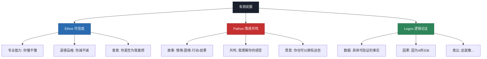
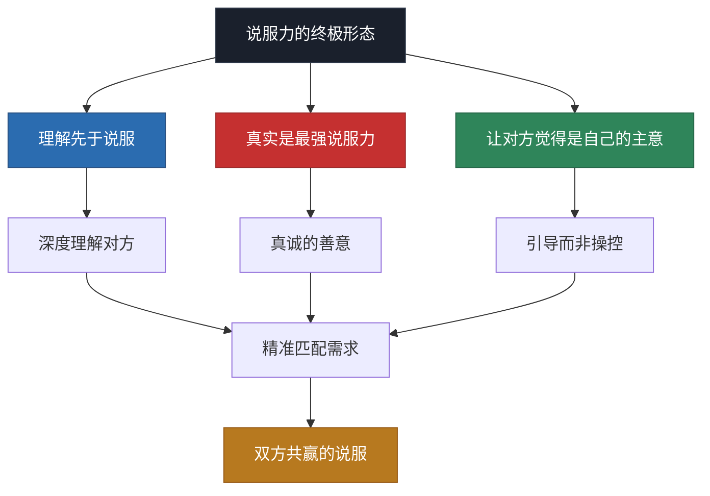
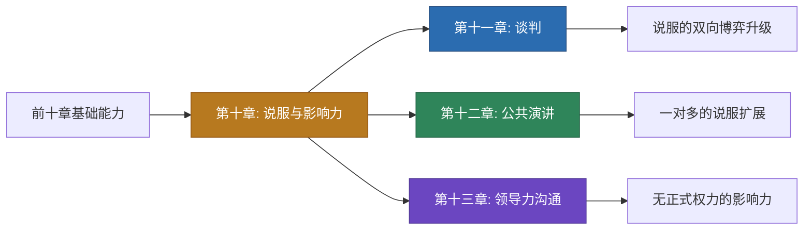

# 本章小结：说服与影响力的知识全景与行动指南

> 说服力不是一种天赋，而是一门可以系统学习、刻意练习、持续精进的技艺。本章用五万字构建了从理论到实战的完整知识体系——现在，让我们把所有碎片拼成一幅完整的地图。

## 一、全章知识体系回顾

本章从"道"（理论根基）到"法"（核心技巧）到"术"（实战应用）到"器"（练习工具），层层递进地构建了说服力的完整能力栈。以下是全章的知识架构总览：

```mermaid
graph TD
    A[说服与影响力] --> B[道: 理论基础]
    A --> C[法: 核心技巧]
    A --> D[术: 实战案例]
    A --> E[器: 练习体系]
    A --> F[避坑: 常见误区]
    A --> G[深度拓展]

    B --> B1[心理学基础<br/>态度三维度+ELM模型]
    B --> B2[Cialdini六大原则<br/>互惠/承诺/认同/喜好/权威/稀缺]
    B --> B3[认知偏差<br/>锚定/框架/损失厌恶/确认偏误]
    B --> B4[经典说服模型<br/>亚里士多德三要素+ELM+叙事传输]
    B --> B5[心理抗拒<br/>Brehm理论+防御机制]

    C --> C1[建立可信度<br/>Ethos三支柱]
    C --> C2[诉诸情感<br/>Pathos六种核心情感]
    C --> C3[逻辑论证<br/>Logos金字塔原理]
    C --> C4[社会证明<br/>群体力量五种类型]
    C --> C5[稀缺性运用<br/>时间/数量/机会]
    C --> C6[综合运用<br/>PREP+蒙洛迪诺模型]

    D --> D1[销售说服]
    D --> D2[向上管理]
    D --> D3[团队影响]
    D --> D4[客户谈判]
    D --> D5[公开演讲]
    D --> D6[社交媒体]
    D --> D7[日常说服]
    D --> D8[危机说服]

    E --> E1[基线评估<br/>30题六维度量表]
    E --> E2[每日练习<br/>日记/微挑战/情绪捕捉]
    E --> E3[每周练习<br/>模拟场景/深度复盘]
    E --> E4[进阶练习<br/>工作坊/工具箱/30天计划]

    style A fill:#1a202c,stroke:#2d3748,color:#fff
    style B fill:#2b6cb0,stroke:#2c5282,color:#fff
    style C fill:#2f855a,stroke:#276749,color:#fff
    style D fill:#b7791f,stroke:#975a16,color:#fff
    style E fill:#6b46c1,stroke:#553c9a,color:#fff
    style F fill:#c53030,stroke:#9b2c2c,color:#fff
    style G fill:#4a5568,stroke:#2d3748,color:#fff
```

### 核心概念速查表

在深入回顾之前，先用一张表锁定本章所有核心概念的一句话精髓——这是你未来随时回查的"索引"：

| 概念 | 一句话精髓 | 出处/提出者 |
|------|-----------|------------|
| 态度三维度 | 态度=认知+情感+行为，说服必须击中至少一个维度 | 社会心理学经典模型 |
| ELM双路径 | 高关注走逻辑（中心路径），低关注走线索（外围路径） | Petty & Cacioppo, 1986 |
| 互惠原则 | 先给予，对方会产生亏欠感，从而更愿意回报 | Cialdini《影响力》 |
| 承诺一致性 | 让对方做出小承诺，他会为了保持一致性而接受大行动 | Cialdini《影响力》 |
| 社会认同 | "大多数人都在做"是最强的从众触发器 | Cialdini《影响力》 |
| 喜好原则 | 人们更容易被自己喜欢的人说服——相似性、赞美、合作 | Cialdini《影响力》 |
| 权威原则 | 专家背书在生理层面降低了大脑的质疑机制 | Milgram实验+fMRI证据 |
| 稀缺原则 | 人们害怕失去的程度是渴望获得的2倍——FOMO是杏仁核反应 | Kahneman前景理论 |
| 锚定效应 | 第一个出现的数字成为后续判断的隐形参照点 | Tversky & Kahneman |
| 框架效应 | 同一事实的不同表述方式会导致截然不同的决策 | Tversky & Kahneman |
| 损失厌恶 | 损失的痛苦≈2倍收益的快乐 | Kahneman前景理论 |
| 心理抗拒 | 越强迫越反抗——威胁自由会激发反向动机 | Brehm, 1966 |
| Ethos-Pathos-Logos | 可信度+情感+逻辑=说服的黄金三角 | 亚里士多德《修辞学》 |
| PREP框架 | 观点→理由→案例→重申，最简洁的说服结构 | 沟通学通用框架 |
| STAR故事法 | 情境→困境→行动→结果，30秒讲出有穿透力的故事 | 叙事说服理论 |
| 蒙洛迪诺弹性说服 | 说服不是一次性大招，而是多次微小影响的累积 | 蒙洛迪诺《弹性》 |

---

## 二、理论基础核心要点

### 2.1 说服的底层逻辑

说服的本质是**改变他人的态度或行为**。这不是操控，而是帮助对方看到更好的选择。现代说服科学揭示了一个关键事实：人类决策远非纯粹理性——情感先于逻辑，直觉先于分析。

**态度的三维结构**决定了说服的切入点：

| 维度 | 含义 | 说服路径 | 典型场景 |
|------|------|----------|----------|
| 认知（Cognitive） | 对事物的信念和知识 | 提供新信息、纠正误解 | 技术方案汇报 |
| 情感（Affective） | 对事物的感受和情绪 | 故事、共鸣、体验 | 品牌营销、募捐 |
| 行为（Behavioral） | 对事物的行动倾向 | 降低门槛、创造承诺 | 销售转化、试用体验 |

**实操要诀**：在实际说服中，三个维度往往需要协同发力。比如向领导汇报技术方案时，认知维度（数据和逻辑）是基础，但如果能加入情感维度（"这个方案能帮团队减少多少加班"），说服力会显著提升。而行为维度的作用在于降低行动门槛——"我们可以先用两周做个小范围试点"比"全面推行"更容易被接受。

### 2.2 双路径说服：ELM模型

Petty和Cacioppo的精细加工可能性模型（ELM）是理解说服的核心框架。说服通过两条路径发生：

- **中心路径**：受众深入分析论点质量，效果持久但要求高——适用于高卷入、高关注的场景（如购买房产、职业选择）
- **外围路径**：受众依赖表面线索（权威、数量、情感），效果快但易消退——适用于低卷入、低关注的场景（如日常消费品选择）

**实操启示**：说服前先判断对方处于哪种路径状态，再选择匹配的策略。给高精化状态的受众提供外围线索（如名人代言）不仅无效，还可能引发反感。

**判断对方路径状态的三个信号**：

| 信号 | 中心路径（高精化） | 外围路径（低精化） |
|------|-------------------|-------------------|
| 提问深度 | 追问细节、数据来源、逻辑链 | 关注表面信息、品牌、口碑 |
| 决策时间 | 反复比较、需要时间思考 | 快速决定、凭直觉 |
| 信息需求 | 要报告、要方案、要对比表 | 要推荐、要案例、要口碑 |

### 2.3 Cialdini六大影响力原则

Robert Cialdini在《影响力》中总结的六种自动反应模式，构成了说服的"心理操作系统"：

| 原则 | 心理机制 | 核心话术模式 | 神经科学基础 |
|------|----------|-------------|-------------|
| 互惠 | 亏欠感驱动回报行为 | "先给予，再索取" | 腹侧纹状体奖赏系统激活 |
| 承诺与一致性 | 认知失调回避 | "从小承诺推向大行动" | 默认模式网络（DMN）活跃 |
| 社会认同 | 从众安全本能 | "大多数人都在做" | 颞顶联合区（TPJ）激活 |
| 喜好 | 催产素驱动信任 | "找到共同点，真诚赞美" | 镜像神经元系统+催产素释放 |
| 权威 | 认知外包节省脑力 | "专家/机构/数据说" | 前额叶执行控制功能外包 |
| 稀缺 | 损失厌恶+竞争本能 | "限量/限时/即将失去" | 杏仁核FOMO焦虑激活 |

**六大原则的组合使用优先级**（按场景）：

- **初次接触**：喜好→互惠→权威（先建立关系，再给予价值，最后展示背书）
- **决策推动**：稀缺→社会认同→承诺一致性（创造紧迫感，用从众背书，锁定承诺）
- **长期关系**：互惠→喜好→承诺一致性（持续给予，深化关系，建立行为惯性）

### 2.4 认知偏差：说服的双刃剑

认知偏差既是**进攻武器**（利用偏差引导决策），也是**防御盾牌**（识别偏差保护自己）：

- **锚定效应**：第一个出现的数字会成为后续判断的参照点——先报价的人掌握定价权
- **框架效应**：同一个事实用不同方式描述，决策会完全不同——"存活率90%"比"死亡率10%"更有说服力
- **损失厌恶**：人们对损失的敏感度约为收益的2倍——强调"你会失去什么"比强调"你能得到什么"更有效
- **确认偏误**：人们倾向于寻找支持自己观点的信息——说服的第一步是理解对方已有的信念
- **光环效应**：对某人某方面的积极评价会泛化到其他方面——建立一个维度的优势可以带动整体可信度

**偏差应用的伦理边界**：利用认知偏差引导决策与操纵之间有一条清晰的线——是否真正有利于对方。用框架效应帮助对方更全面地理解一个方案是正当的；用锚定效应让对方付出远超合理范围的代价则是操纵。本章所有技巧的使用前提，是最终结果对双方都有利。

### 2.5 心理抗拒：说服的隐形杀手

Brehm的心理抗拒理论揭示了一个反直觉现象：**越是强迫，越是反抗**。当人们感到自由被威胁时，会产生强烈的反向动机——"你越让我做，我越不想做"。高压式说服的反效果，根源就在这里。

**应对策略**：给对方选择权和自主感。不是"你必须这样做"，而是"这里有两个方案，你觉得哪个更适合你的情况？"

**心理抗拒的四个触发信号**（当你观察到这些时，立刻调整策略）：

1. **语言信号**：对方开始说"但是"、"不过"、"我不同意"——这是理性层面的抗拒
2. **身体信号**：双臂交叉、身体后倾、避免眼神接触——这是潜意识层面的防御
3. **情绪信号**：语气变硬、语速加快、出现讽刺——这是情感层面的反弹
4. **行为信号**：转移话题、看手机、找借口离开——这是逃避层面的应对

**化解抗拒的"三步退让法"**：
- 第一步：承认对方的感受——"我理解你的顾虑，这确实需要慎重考虑"
- 第二步：给对方控制权——"最终决定权在你，我只是提供一个参考"
- 第三步：降低压力——"我们可以先放一放，等你准备好了再聊"

---

## 三、核心技巧精要

### 3.1 Ethos-Pathos-Logos：说服的黄金三角

亚里士多德在2300年前提出的说服三要素，至今仍是所有说服理论的基石：

**三要素的场景化权重分配**：

| 场景 | Ethos权重 | Pathos权重 | Logos权重 | 说明 |
|------|-----------|------------|-----------|------|
| 销售说服 | 30% | 40% | 30% | 情感驱动决策，但需要可信背书 |
| 向上管理 | 35% | 15% | 50% | 领导需要看到数据和逻辑 |
| 团队变革 | 40% | 35% | 25% | 信任是变革的基石 |
| 客户谈判 | 35% | 20% | 45% | 利益博弈需要逻辑支撑 |
| 公开演讲 | 30% | 50% | 20% | 情感感染是演讲的核心 |
| 危机说服 | 50% | 30% | 20% | 信任崩塌时，可信度是第一步 |

### 3.2 五大核心技巧速览

**技巧一：建立可信度（Ethos）**

可信度的三个支柱——专业能力、道德品格、善意——中，善意最容易被忽视，但往往效果最显著。当对方感受到你真心为他的利益考虑时，防御会大幅降低。

快速建立可信度的四个策略：
1. **社会背书**：引用权威机构、专家、知名客户的认可
2. **成就前置**：用具体数据和案例证明你的能力
3. **脆弱性展示**：适度暴露弱点反而增强真实感（瑕疵效应）
4. **一致性累积**：反复兑现小承诺，逐步建立"靠谱"形象

**可信度崩塌的五个瞬间**（真实案例）：

| 崩塌场景 | 具体表现 | 后果 | 修复难度 |
|----------|---------|------|---------|
| 数据造假 | 引用的数字被对方查证为不实 | 整体论述可信度归零 | 极高——可能永久失去信任 |
| 承诺落空 | "下周交付"变成"再等等" | 对方不再相信任何时间承诺 | 高——需要6-8次连续兑现才能修复 |
| 前后矛盾 | 对A说一套，对B说另一套 | 被视为"见人说人话"的滑头 | 极高——涉及品格判断 |
| 利益冲突 | 推荐对自己有利而非对对方有利的方案 | 善意支柱坍塌 | 中——需要持续证明利他动机 |
| 过度包装 | 头衔、背景被发现夸大 | 光环效应反转为"骗子效应" | 高——需要真实成就重新背书 |

**技巧二：诉诸情感（Pathos）**

Damasio的躯体标记假说证实：丧失情感能力的人连最基本的决策都无法完成。情感不是理性的对立面，而是决策的必要组成部分。

六种核心情感的说服应用：
- **恐惧**：适用于安全、健康、保险领域——但必须同时提供解决方案，否则恐惧会转化为逃避而非行动
- **希望**：适用于教育、创业、变革场景——描绘可实现的美好愿景，避免画大饼
- **共鸣**：适用于任何场景——"我理解你的感受"是打开防御的万能钥匙
- **内疚**：适用于公益、家庭教育——但要谨慎使用，避免情感绑架
- **自豪**：适用于品牌忠诚、团队激励——让对方感到"我做出了正确的选择"
- **紧迫感**：适用于销售、决策推动——配合稀缺性使用效果倍增

STAR故事框架是最高效的情感传递工具：**S**ituation（情境）→ **T**rouble（困境）→ **A**ction（行动）→ **R**esult（结果）。用一个30秒的故事，比10分钟的数据更有穿透力。

**STAR故事的构建模板**：

情境（S）：去年我们团队接手了一个XX项目，客户要求3个月内交付...
困境（T）：但当时团队只有3个人，技术栈还是老的，常规做法至少需要6个月...
行动（A）：我们做了一个大胆的决定——XX方案，虽然有风险，但...
结果（R）：最终提前2周交付，客户满意度评分4.8/5，后续又签了两个项目...

**技巧三：逻辑论证（Logos）**

逻辑不是说服的武器，而是说服的支架。金字塔原理的说服应用：结论先行，层层支撑。

论证强化的四个技巧：
1. **数据可视化**：将抽象数字转化为可感知的画面（"20%的成本节省"→"每年省下一辆车的钱"）
2. **对比论证**：用A vs B的对比让优势一目了然
3. **反驳预设**：主动提出对方可能的顾虑并回应（"你可能会想...实际上..."）
4. **递进式呈现**：从对方认同的共识出发，逐步推导到你的结论

**常见逻辑谬误的识别与应对**：

| 谬误类型 | 典型表现 | 识别方法 | 应对策略 |
|----------|---------|---------|---------|
| 稻草人谬误 | 歪曲你的观点再攻击 | "我说的不是这个意思" | 重申原始观点，拉回讨论焦点 |
| 虚假二分 | "要么A要么B，没有第三选择" | "除了这两个，还有其他可能吗？" | 展示第三种甚至第四种方案 |
| 诉诸权威 | "某专家说了，所以一定对" | "这个专家在XX领域有经验吗？" | 质疑权威的相关性和时效性 |
| 滑坡谬误 | "如果A，就会导致B，最终导致Z" | "从A到Z之间需要哪些条件？" | 逐层拆解因果链的每个跳跃 |
| 人身攻击 | "你又不是这个专业的" | 这是攻击人而非论点 | 不回应攻击，回到论据本身 |

**技巧四：社会证明（Social Proof）**

社会证明利用的是人类进化中的从众安全本能。五种类型按说服力排序：

1. **相似性证明**（最强）：和你一样的人在用——与受众越相似，效果越强
2. **专家证明**：专业人士的认可——医生推荐、行业认证
3. **数量证明**：大多数人选择了这个——100万用户的信任背书
4. **用户证言**：真实用户的体验分享——具体故事比抽象数据更可信
5. **趋势证明**：越来越多人加入——展示增长趋势而非静态数字

**社会证明的增强策略**：单纯说"100万人在用"效果有限，但如果换成"和你同行业的100家公司中，有73家已经在用这个方案"，说服力会成倍提升。关键在于**具体化**和**相似性**。

**技巧五：稀缺性运用（Scarcity）**

稀缺性激活的是杏仁核的FOMO（害怕错过）反应。三种类型：
- **时间稀缺**：""限时优惠"、"截止日期"
- **数量稀缺**：""仅剩3件"、"限量发售"
- **机会稀缺**："错过这次，下次不知道什么时候"

**使用红线**：稀缺性必须建立在真实基础上。虚假的稀缺一旦被识破，可信度将永久受损。

**稀缺性的真实构建方法**（而非虚假制造）：

| 方法 | 具体做法 | 真实性保障 |
|------|---------|-----------|
| 时间窗口 | 设定真实的项目排期，名额满了就不再接 | 确实有产能上限 |
| 早鸟优惠 | 前10名享受折扣，因为早期客户降低了你的试错成本 | 折扣与成本结构挂钩 |
| 限量名额 | 一次只带5个学员，因为精力有限无法保证质量 | 精力确实有限 |
| 季节性 | 某些服务确实有最佳时间窗口 | 行业规律支撑 |

### 3.3 综合运用：技巧组合矩阵

说服高手不是单项冠军，而是组合大师。PREP框架提供了综合运用的骨架：

1. **P**oint（观点）：开门见山亮出核心主张
2. **R**eason（理由）：用逻辑论证支撑
3. **E**xample（案例）：用故事和数据具象化
4. **P**oint（重申）：回到观点，推动行动

蒙洛迪诺的弹性说服模型进一步揭示：有效的说服不是一次性的"大招"，而是多次微小影响的累积。每次对话只推进一小步，但方向一致，最终汇聚成态度的根本转变。

**PREP框架的完整应用示例**——说服领导采用新工具：

P（观点）："我建议我们团队引入XX工具，预计能提升30%的开发效率。"

R（理由）：三个支撑——
  ① 数据：同行业TOP10公司中有7家在用，平均效率提升25-35%（社会认同+权威）
  ② 逻辑：我们的瓶颈在于XX环节，这个工具正好解决这个问题（因果论证）
  ③ 成本：年费5万，但预计节省的人力成本在20万以上（ROI论证）

E（案例）："我上周和XX公司的技术负责人聊过，他们引入后，季度迭代周期从4周缩短到了2.5周，团队加班时间减少了40%。"（相似性证明+具体数据）

P（重申）："综合来看，这是一笔ROI超过4倍的投资。我们可以先申请一个月的免费试用，用数据说话。"（降低行动门槛）

---

## 四、实战场景核心规律

八大实战场景（销售、向上管理、团队影响、谈判、公开演讲、社交媒体、日常说服、危机说服）看似各异，但提炼出了三条贯穿所有场景的共同规律：

### 规律一：理解先于说服

所有成功的说服都始于对对方的深刻理解——他的需求、顾虑、价值观和决策模式。

| 理解维度 | 需要回答的问题 | 信息获取方式 |
|----------|---------------|-------------|
| 需求 | 他真正想要什么？ | 深度倾听、提问 |
| 顾虑 | 他在担心什么？ | 观察情绪信号、直接询问 |
| 价值观 | 什么对他最重要？ | 长期观察、过往经历分析 |
| 决策模式 | 他是理性型还是感性型？ | 注意他引用的论据类型 |
| 信息偏好 | 他喜欢数据还是故事？ | 注意他什么时候眼睛亮了 |

**黄金法则**：花80%的时间去理解，20%的时间去说服。

**快速理解对方的"五个问题框架"**：

1. "你目前最关心的是什么？"——定位核心需求
2. "之前的方案哪里让你不太满意？"——发现痛点和顾虑
3. "如果有一个理想的解决方案，你希望它是什么样的？"——了解期望和标准
4. "这个决定你需要考虑哪些因素？"——理解决策框架
5. "什么情况下你会觉得'就这个了'？"——找到成交信号

这五个问题不要一次性抛出，而是在对话中自然穿插。好的说服者看起来像在聊天，实际上在系统性地收集信息。

### 规律二：情感打通大门，逻辑锁住结论

这不是一个"先情感后逻辑"的线性过程，而是一个反复交替的螺旋上升过程：

每个场景的技巧组合虽不同，但底层节奏一致：**情感开场 → 逻辑支撑 → 情感收尾**。

**各场景的节奏变体**：

| 场景 | 开场（情感） | 中段（逻辑） | 收尾（情感+行动） |
|------|-------------|-------------|------------------|
| 销售 | 共鸣痛点 | 产品数据对比 | 愿景描绘+限时优惠 |
| 向上管理 | 同理上级压力 | ROI分析+风险预案 | 低风险试点承诺 |
| 团队变革 | 描绘共同愿景 | 变革路线图+里程碑 | 团队荣誉感激发 |
| 谈判 | 建立人情连接 | 利益分析+BATNA | 双赢方案+关系维护 |
| 演讲 | 故事开场 | 论点+数据+案例 | 行动号召+情感高潮 |
| 危机 | 坦诚承认问题 | 事实还原+补救方案 | 责任担当+重建信任 |

### 规律三：说服是双向过程，不是单向灌输

所有场景中最大的共同错误是把说服当成"我讲你听"的信息灌输。真正的说服是双向的理解和连接过程——你在说服对方的同时，也在被对方"说服"（理解他的立场、调整你的方案、找到双方都能接受的交汇点）。

**双向说服的"听-问-说"黄金比例**：

- **听（40%）**：通过倾听获取信息、建立信任、发现机会
- **问（30%）**：通过提问引导思考、确认理解、推进对话
- **说（30%）**：在充分理解的基础上精准输出

这个比例颠覆了大多数人的直觉——说服力强的人不是"说得多"的人，而是"听得准、问得巧、说得精"的人。

---

## 五、十大误区核心警醒

十大误区可以归纳为三个层面的认知纠偏：

### 认知层：说服不是辩论

| 误区 | 错误信念 | 正确认知 | 真实后果 |
|------|----------|----------|---------|
| 逻辑至上 | 逻辑越强说服力越强 | 情感先行，逻辑跟进 | 用100个数据点说服对方，对方说"你说得对，但我不想" |
| 天赋论 | 说服力是天生的 | 说服力是可练习的技能 | 永远停留在"我就是不会说话"的自我设限中 |
| 一次性思维 | 说服是一次性事件 | 说服是持续的关系建设过程 | 每次都要从零开始建立信任，效率极低 |

**"逻辑至上"误区的深度解析**：这是技术背景人群最常见的误区。你可能准备了一份完美的方案——数据详实、逻辑严密、风险可控——但对方就是不买账。原因不是你的方案不好，而是你跳过了情感连接这个前置步骤。决策本质上是一个"安全+正确+感觉对"的综合判断，三者缺一不可。逻辑只解决了"正确"这一个维度。

### 策略层：说服不是征服

| 误区 | 错误信念 | 正确认知 | 真实后果 |
|------|----------|----------|---------|
| 反驳对方 | 打败对方的论点就赢了 | 扩展而非否定，引导而非压制 | 对方嘴上认输，心里更坚定——赢了辩论，输了人心 |
| 忽视不可说服者 | 所有人都能被说服 | 学会战略性放弃，管理说服力投资组合 | 在不可能的任务上浪费大量时间和精力 |
| 群体压服 | 多数人的压力就能说服 | 尊重个体自主性，群体压力适得其反 | 激发心理抗拒，对方更加固守立场 |

**"反驳对方"误区的深度解析**：当你在争论中"赢了"对方，对方的心理反应不是"你说得对"，而是"我丢了面子"。为了挽回面子，他会更加坚定自己的立场——这就是为什么越争论越固执。正确的做法是**扩展而非否定**："你说的有道理，在这个基础上，我们还可以考虑..."——先认可，再扩展，让对方觉得你们是在共同探索，而不是在对抗。

### 执行层：说服不是嘴上功夫

| 误区 | 错误信念 | 正确认知 | 真实后果 |
|------|----------|----------|---------|
| 忽视情绪信号 | 准备好内容就够了 | 实时读取对方情绪，动态调整策略 | 对方已经不耐烦了，你还在讲第三点 |
| 只重内容不重形式 | 内容好自然有说服力 | 表达方式让说服力相差数倍 | 同样的内容，有人说服力满分，有人等于零 |
| 急于求成 | 一次互动就要搞定 | 先建立信任账户，再提出请求 | 对方觉得被推销，产生防御心理 |
| 滥用稀缺性 | 制造紧迫感就有效 | 虚假稀缺一旦被识破，可信度永久受损 | "限量100件"一个月后还在卖，品牌信誉归零 |

**"只重内容不重形式"误区的深度解析**：沟通学研究（Mehrabian, 1971）的经典发现——在情感态度的传递中，语言内容只占7%，语调占38%，肢体语言占55%。虽然这个数字在不同场景下有所变化，但核心结论不变：**你怎么说，比你说什么更重要**。同一个"这个方案很好"，用平淡的语气说和用充满热情的语气说，对方接收到的信息完全不同。

**最关键的误区纠正是**：不要把说服当成单向的信息灌输，而要将其视为一个双向的理解和连接过程。说服力的敌人不是对手的固执，而是你自己深信不疑的错误假设。

---

## 六、练习体系速览

说服力的提升不可能只靠阅读完成。本章提供的练习体系分为四个层级：

### 第一层：基线评估（一次性）

30题六维度自评量表，覆盖可信度构建、情感共鸣、逻辑论证、社会证明运用、策略灵活性、执行与行动六个维度。分数画成雷达图，最低分维度就是未来30天的重点练习方向。

**基线评估的使用方法**：

1. 找一个安静的30分钟，诚实地回答30个问题（诚实比高分重要）
2. 将六个维度的分数画成雷达图
3. 找出最低分的两个维度——这就是你的"突破口"
4. 在后续练习中，将70%的精力放在这两个维度上

**评估结果的解读参考**：

| 分数段 | 水平判断 | 练习建议 |
|--------|---------|---------|
| 0-30分 | 初学者——有意识但缺乏系统方法 | 从每日练习开始，先建立习惯 |
| 31-60分 | 进阶者——有方法但不够灵活 | 重点练习场景切换和策略灵活性 |
| 61-80分 | 熟练者——能应对多数场景 | 深化压力场景和高难度场景的练习 |
| 81-100分 | 高手——能根据不同对象灵活调整 | 传授他人，在教学中精进 |

### 第二层：每日练习（15-20分钟/天）

| 练习项目 | 时间 | 核心目的 | 具体做法 |
|----------|------|----------|---------|
| 说服日记 | 10分钟 | 培养元认知——从无意识说服到有意识反思 | 每晚记录：今天最成功/最失败的一次说服，分析原因 |
| 微说服挑战 | 贯穿全天 | 刻意练习单一技巧——聚焦才能精深 | 本周只练"共鸣"，所有对话中刻意使用"我理解你的感受" |
| 情绪信号捕捉 | 贯穿全天 | 训练非语言敏感度——说服的核心是"回应" | 每次对话中观察对方的3个非语言信号并记录 |
| 说服拆解分析 | 5-10分钟 | 逆向工程——积累策略素材库 | 看一段演讲/广告/销售视频，拆解其说服策略 |

**每日练习的21天养成计划**：

| 阶段 | 天数 | 重点 | 每日任务 |
|------|------|------|---------|
| 觉醒期 | 第1-7天 | 观察和记录 | 记录3次说服尝试的结果和感受 |
| 聚焦期 | 第8-14天 | 单一技巧练习 | 每天刻意使用同一种技巧3次 |
| 整合期 | 第15-21天 | 技巧组合 | 尝试在一次说服中组合使用2-3种技巧 |

### 第三层：每周练习（1-1.5小时/周）

- **模拟说服场景**：30-45分钟完整演练，含策略规划、角色演练、反馈收集、二次演练
- **深度复盘**：20分钟结构化分析，从事实层到策略层到执行层到洞察层
- **高手逆向工程**：分析说服高手的开场策略、论证结构、说服杠杆、应对阻力

**深度复盘的四层分析框架**：

第一层：事实层——发生了什么？（客观描述，不加判断）
  "我向领导提了新工具方案，领导说'再考虑考虑'"

第二层：策略层——我用了什么策略？效果如何？
  "我主要用了逻辑论证（数据对比），但忽略了情感连接"

第三层：执行层——哪些做得好？哪些需要改进？
  "好的：数据准备充分；不好的：开场太直接，没有先建立共鸣"

第四层：洞察层——这次经历告诉我什么？
  "领导在高压力状态下，需要先被理解，才能接受新信息"

### 第四层：进阶练习（每月1-2次）

- 说服工作坊（群体实战）
- 个人说服策略工具箱维护
- 压力说服训练（高压场景即兴应对）
- 30天系统提升计划（认知觉醒→技巧强化→综合应用→内化突破）

**30天系统提升计划的周节奏**：

| 周次 | 主题 | 核心任务 | 里程碑 |
|------|------|---------|--------|
| 第1周 | 认知觉醒 | 完成基线评估，理解理论框架 | 雷达图+理论笔记 |
| 第2周 | 技巧强化 | 每天聚焦练习一种核心技巧 | 5种技巧各完成3次实战 |
| 第3周 | 综合应用 | 在真实场景中组合使用技巧 | 完成3次"完整说服"并复盘 |
| 第4周 | 内化突破 | 压力场景训练+策略工具箱完善 | 完成工具箱V1.0+二次基线评估 |

---

## 七、深度拓展核心收获

### 7.1 神经科学视角

fMRI研究为六大影响力原则提供了生物学证据。这不是学术装饰——理解神经机制让你知道**为什么某个技巧有效**以及**什么时候它会失效**：

- 互惠行为激活腹侧纹状体的奖赏系统——给予确实能让人"上瘾"
- 认知失调激活前扣带回和岛叶——一致性需求是生理层面的不适回避
- 稀缺信号激活杏仁核——FOMO不是心理作用，而是真实的神经反应
- 权威信息减弱前额叶批判性评估——"专家说的"确实在生理上降低了质疑

**神经科学的三个实操启示**：

1. **疲劳时更容易被说服**：前额叶（负责批判性思维）在疲劳时功能下降，人更依赖外围路径做决策。所以不要在对方疲惫时做重大决定——要么让他休息后再谈，要么意识到你可能在利用对方的非最佳状态
2. **饥饿时决策更冲动**：血糖水平影响前额叶功能，饥饿状态下人倾向于即时满足而非长期最优。商务午餐谈判不只是社交，有生理基础
3. **睡眠不足时判断力下降**：研究表明睡眠不足会导致风险评估能力下降40%。重要谈判或决策对话，选择对方精力充沛的时段

### 7.2 数字时代的影响力传播

数字技术彻底改变了影响力的游戏规则：

- **病毒式传播**让影响力的速度和范围指数级放大
- **算法推荐**决定了什么内容被看见、什么被隐藏
- **去中心化**让每个人都可以成为影响力节点
- **深度伪造和机器人水军**带来了前所未有的信任危机

**数字时代说服的四个新规则**：

1. **注意力是最稀缺的资源**：你不是在和竞争对手争夺客户，而是在和抖音、微博、游戏争夺注意力。前3秒抓不住人，后面的内容再好也没用
2. **信任链在缩短**：传统模式是"广告→知名度→信任→购买"，数字时代变成了"KOL推荐→信任→购买"。一个可信的推荐人比100万广告费更有效
3. **口碑是核武器**：一条差评的传播力是好评的3-5倍。数字时代的说服不仅是"让一个人被说服"，更是"让被说服的人帮你传播"
4. **个性化是标配**：算法让"千人千面"成为现实，通用话术的说服力在下降。理解每个受众的独特需求，用他的语言和他对话

应对之道：培养数字素养和批判性思维，主动寻求多元信息来源，对任何单一来源保持健康怀疑。

### 7.3 反说服与批判性思维

说服技巧是一把双刃剑。掌握说服力的同时，必须具备识别和抵御不当说服的能力：

- 识别五种常见逻辑谬误（稻草人、人身攻击、虚假二分、诉诸情感、滑坡谬误）
- 识别四种心理操纵手段（气灯效应、信息控制、情感勒索、间歇性强化）
- 建立"识别策略→多方求证→延迟决策→事实核查"的防御流程

**反说服的"STOP"防御模型**：

| 步骤 | 含义 | 具体做法 |
|------|------|---------|
| **S**top（暂停） | 感受到压力时，先停下来 | "让我想想"、"我需要时间考虑" |
| **T**hink（思考） | 识别对方正在使用什么策略 | 他是在利用稀缺性？社会认同？还是权威？ |
| **O**bserve（观察） | 检查自己的情绪状态 | 我是因为"真的觉得好"还是因为"害怕错过"？ |
| **P**roceed（行动） | 基于理性判断做出决定 | 如果剥离了技巧包装，这个方案本身值不值得？ |

**最常见的五种操纵手段识别**：

| 操纵手段 | 表现形式 | 红旗信号 |
|----------|---------|---------|
| 气灯效应 | 让你怀疑自己的记忆和判断 | "你记错了"、"你太敏感了"、"从没说过这话" |
| 信息控制 | 只给你看有利的信息 | 禁止你和其他人交流、只提供单一信息来源 |
| 情感勒索 | 用内疚、恐惧、义务感控制你 | "如果你真的在乎我..."、"你怎么能这样对我" |
| 间歇性强化 | 时好时坏，让你始终抱有希望 | 偶尔的甜蜜夹杂在长期的忽视中 |
| 信息过载 | 用大量信息淹没你的判断力 | 一份200页的合同、不断追加的条件 |

---

## 八、三条核心心法

在所有理论、技巧、案例和练习之上，说服力的终极智慧凝聚为三条心法：

### 心法一：理解先于说服

> 所有成功的说服都始于对对方的深刻理解——他的需求、顾虑、价值观和决策模式。花80%的时间去理解，20%的时间去说服。

这不是一个修辞技巧，而是一个根本性的思维转变。当你真正理解了对方，说服就不再是"把我的想法塞给他"，而是"帮他找到他自己想要的答案"。

**检验标准**：在你开口说服之前，你能不能用三句话准确描述对方的核心需求、最大顾虑和决策标准？如果不能，说明你还没准备好。

### 心法二：真实是最强的说服力

> 所有技巧都建立在真诚的基础上。虚伪的技巧终会被识破，而真实的善意即使笨拙也能打动人心。

这解释了为什么"善意"是可信度三支柱中最强大的一个。当对方感受到你真心为他的利益考虑时，对技巧精准度的要求会大幅降低。反之，再精巧的技巧也无法弥补真诚的缺失。

**检验标准**：如果你推荐的方案对对方不利但对你有利，你还会推荐吗？如果答案是否，说明你的善意是真实的。如果答案是"看情况"，你需要重新审视自己的说服动机。

### 心法三：让对方觉得这是他自己的主意

> 不是"你被我说服了"，而是"你自己想通了"。当对方感到自己是自主决策时，行动力最强，承诺感最深。

这与Brehm的心理抗拒理论完美呼应：人类天生捍卫自主决策权。最好的说服者不是操控者，而是**引导者**——提供信息、搭建框架、创造体验，然后让对方自己走到那个结论面前。

**实操技巧**：多用提问而非陈述。"你觉得如果XX的话，会不会更好？"比"你应该做XX"有效得多。前者让对方觉得是自己想到的，后者让对方觉得在被命令。

**三条心法的内在关系**：

三条心法不是三个独立的原则，而是一个有机整体：理解是前提，真实是基础，引导是方法。三者合一，就是说服力的最高境界——**不是赢了对方，而是双方一起赢了**。

---

## 九、说服力自评量表

在结束本章之前，用以下快速自评工具检验你的说服力水平。对每个陈述，诚实地给自己打分（1=完全不符合，5=完全符合）：

### 可信度维度

| # | 陈述 | 评分 |
|---|------|------|
| 1 | 我能在30秒内让陌生人感受到我的专业能力 | ___/5 |
| 2 | 我会主动承认自己的不足，而不是掩饰 | ___/5 |
| 3 | 对方能感受到我是真心为他的利益考虑 | ___/5 |
| 4 | 我过去的承诺兑现率超过90% | ___/5 |
| 5 | 我能在不炫耀的情况下展示自己的能力 | ___/5 |

### 情感共鸣维度

| # | 陈述 | 评分 |
|---|------|------|
| 6 | 我能准确识别对方当下的情绪状态 | ___/5 |
| 7 | 我有3个以上可以在不同场景使用的个人故事 | ___/5 |
| 8 | 我能在60秒内用一个故事打动对方 | ___/5 |
| 9 | 对方经常对我说"你真理解我" | ___/5 |
| 10 | 我能在严肃话题中创造情感连接 | ___/5 |

### 逻辑论证维度

| # | 陈述 | 评分 |
|---|------|------|
| 11 | 我能用一句话说清任何方案的核心价值 | ___/5 |
| 12 | 我的论证总是结论先行、层层支撑 | ___/5 |
| 13 | 我能把抽象数据转化为对方能感知的画面 | ___/5 |
| 14 | 我能预判对方的反对意见并提前准备回应 | ___/5 |
| 15 | 我能识别对话中的逻辑谬误 | ___/5 |

### 策略灵活性维度

| # | 陈述 | 评分 |
|---|------|------|
| 16 | 我能根据对方的反应实时调整说服策略 | ___/5 |
| 17 | 我知道什么时候该推进，什么时候该退让 | ___/5 |
| 18 | 我能识别对方正在使用的说服策略 | ___/5 |
| 19 | 面对强烈反对，我能保持冷静并找到突破口 | ___/5 |
| 20 | 我能在5分钟内说服一个陌生人做一件小事 | ___/5 |

### 综合运用维度

| # | 陈述 | 评分 |
|---|------|------|
| 21 | 我能在一次说服中自然切换Ethos/Pathos/Logos | ___/5 |
| 22 | 我有自己的一套说服准备流程 | ___/5 |
| 23 | 我能在高压场景下（如被挑战）保持说服力 | ___/5 |
| 24 | 我的说服成功率超过60% | ___/5 |
| 25 | 我能教会别人如何说服 | ___/5 |

**评分解读**：
- **25-50分**：说服力处于觉醒阶段——你意识到了说服力的重要性，但缺乏系统方法。建议从第二章理论部分重新开始，配合每日练习
- **51-75分**：说服力处于成长阶段——你有了基本框架，但灵活度不够。建议重点练习策略灵活性和综合运用
- **76-100分**：说服力处于精进阶段——你已经能应对多数场景，但在压力场景和高难度对象上还需突破。建议参与说服工作坊和压力训练
- **101-125分**：说服力处于高手阶段——你已经将说服力内化为本能。建议开始教授他人，在教学中继续精进

---

## 十、从本章到下一章

本章构建的说服力知识体系是后续章节的"能力乘法器"：

- **第十一章（谈判）**：谈判是说服的高级形态——双方都在说服对方，需要更精密的策略和更强的策略灵活性。本章的Ethos-Pathos-Logos框架在谈判中需要升级为"利-理-情"的动态博弈
- **第十二章（公共演讲）**：演讲是"一对多"的说服——需要将本章技巧扩展到群体场景。本章的STAR故事框架在演讲中将升级为贯穿全场的叙事主线
- **第十三章（领导力沟通）**：领导力的核心是影响力——需要在没有正式权力的情况下推动行动。本章的Cialdini六大原则在领导力场景中将展现全新的应用深度

前面的章节（倾听、表达、非语言沟通、情感沟通、冲突管理）是基础能力（加法），说服力让这些基础能力产生指数级的效果放大。带着本章的理论框架、技巧工具箱和心法智慧，继续前行。

---

## 十一、快速参考卡

在实际说服场景中，用以下清单快速检查自己的准备：

### 说服前准备清单

□ 理解对方：需求、顾虑、价值观、决策模式？
□ 判断状态：对方处于高精化还是低精化状态？
□ 选择策略：Ethos/Pathos/Logos的权重分配？
□ 准备论据：3个最有力的支撑点（不是20个）？
□ 预判反驳：对方最可能的3个反对理由及回应？
□ 开场设计：前30秒如何建立情感连接？
□ 收尾设计：具体的行动建议是什么？如何降低行动门槛？
□ 退出策略：如果对方强烈反对，如何体面退场并保留关系？

### 说服中检查清单

□ 情绪信号：对方的肢体语言、语气、表情有变化吗？
□ 3-1节奏：每3个论点后，是否暂停观察和提问？
□ 策略灵活性：是否需要根据对方反应调整策略？
□ 心理抗拒：对方是否出现了抗拒信号？如何化解？
□ 连接状态：对方是否感到被理解和被尊重？
□ 时间管理：是否在对方注意力最佳时段呈现核心论点？
□ 共识锚点：是否在对话中找到了至少一个共同认同的点？

### 说服后复盘清单

□ 结果：目标达成度如何？（1-10分）
□ 亮点：哪个部分效果最好？为什么？
□ 改进：哪个部分效果最差？如何调整？
□ 洞察：对这个人/这类人有什么新的理解？
□ 迁移：这次的经验可以复用到什么其他场景？
□ 关系：说服之后，关系是更好了还是更差了？
□ 记录：是否将关键洞察写入说服日记？

### 一句话速查：六大原则

当你在说服场景中卡住时，快速扫描这六条，找到最匹配的突破口：

互惠   →  "我能先给对方什么？"
一致性 →  "对方之前做过什么承诺？"
社会认同 → "谁和对方情况类似，已经这样做了？"
喜好   →  "我和对方有什么共同点？"
权威   →  "谁/什么数据能为我背书？"
稀缺   →  "这个机会为什么现在必须抓住？"

---

> 带着这三条心法和完整的知识体系，去实践、去练习、去提升。说服力的提升之路，也是你成为一个更好的沟通者的旅程。记住：真正的说服高手，不是那些能说会道的人，而是那些能将对方的利益与自己的主张找到交汇点的人——不是赢了对方，而是双方一起赢了。
