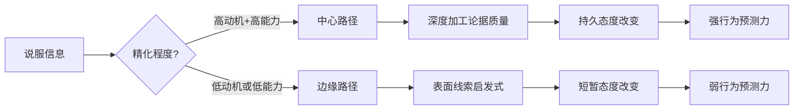
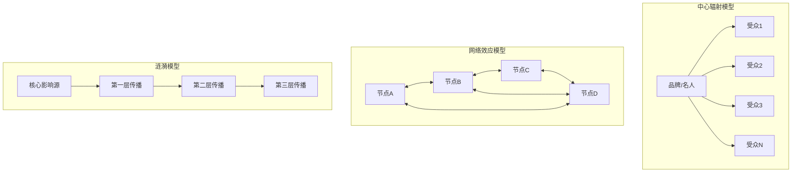
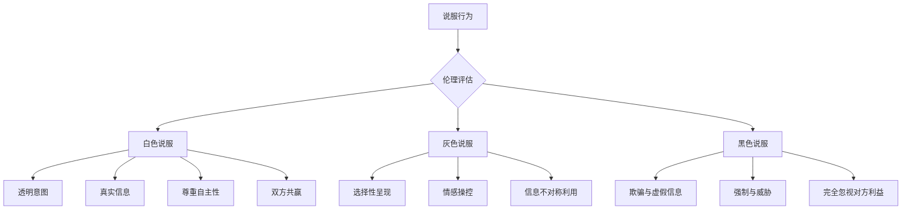

# 第十章 说服与影响力 - 深度拓展

本章深度拓展将从神经科学基础、经典理论模型、行为设计与助推理论、叙事运输与故事说服、社会证明的深层机制、数字时代的影响力传播、反说服与批判性思维、政治说服与宣传分析、跨文化说服差异、说服伦理框架、说服力自检清单、实战案例库十二个维度，系统性地解构说服与影响力的底层逻辑。

---

## 一、Cialdini七大原则的神经科学基础

罗伯特·西奥迪尼(Robert Cialdini)在《影响力》(Influence)一书中提出的六大说服原则——互惠、承诺与一致、社会证明、权威、喜好和稀缺——不仅有深厚的社会心理学基础，更得到了现代神经科学研究的支持。2021年，Cialdini在《影响力》新版中新增了第七个原则——联盟(Unity)，即"我们感"——下文一并涵盖。

理解这些原则的神经机制，不是为了"学术装点"，而是为了让你明白：为什么这些原则如此强大，以及在什么条件下它们会失效。当你知道互惠原则依赖于腹侧纹状体的奖赏回路时，你就理解了为什么"先给予"比"先索取"有效得多——因为你激活的是对方大脑中与"获得金钱"相同的快乐回路。

### 1.1 互惠原则(Reciprocity)

**社会心理学基础**：人类社会中存在强烈的互惠规范——当别人给予我们某种好处时，我们会感到有义务回报。这种规范是人类合作的基础。考古学家理查德·李基(Richard Leakey)认为，互惠利他主义是人类之所以成为人类的根本原因之一。灵长类动物学家弗朗斯·德瓦尔(Frans de Waal)在黑猩猩群体中观察到了互惠行为：一只黑猩猩帮另一只理毛，后者在数小时后更可能回报理毛——说明互惠的神经回路在灵长类进化中已经存在了数百万年。

**神经科学发现**：
- 互惠行为激活了大脑的奖赏系统，特别是腹侧纹状体(ventral striatum)和伏隔核(nucleus accumbens)——这些区域与获得金钱奖励时的激活模式一致，说明"回报他人"本身就能带来愉悦
- 当人们做出互惠行为时，大脑释放多巴胺，产生愉悦感
- "不回报"会激活前扣带回(anterior cingulate cortex)的冲突监测区域，产生不适感——fMRI实验中，受试者在有机会回报却选择不回报时，该区域的活动强度与感受到的"亏欠感"评分呈正相关
- 背侧前额叶皮层(dorsolateral prefrontal cortex)在评估互惠义务时特别活跃，该区域负责权衡成本与收益
- 催产素(oxytocin)在互惠行为中扮演关键角色：鼻腔喷入催产素的受试者，在信任博弈(trust game)中愿意借出更多金钱

**关键洞察**：互惠之所以有效，是因为它绕过了理性分析，直接触发了大脑的奖赏/不适回路。即使你"知道"对方在使用互惠策略，你仍然很难抗拒亏欠感——因为前扣带回的冲突监测是自动化发生的，先于意识层面的分析。

**经典案例**：
- **Hare Krishna寺庙的募捐策略**：先赠送给路人一朵花，再请求捐款。尽管多数人并不想要花，但接受了花之后的捐款率从15%提升到35%以上。关键在于"先给予"触发了互惠义务
- **餐厅服务员的小费实验**(Strohmetz et al., 2002)：服务员在结账时附赠一颗巧克力，小费增加18%；先给一颗，过一会儿再给一颗并说"因为你人特别好"，小费增加21%
- **Costco免费试吃**：消费者在试吃后购买该商品的概率提升约30%，部分原因就是互惠心理——"我免费吃了人家的东西，不买一点不好意思"
- **慈善捐款的"礼物"策略**：公益组织在募捐信中附赠个性化地址标签(收件人姓名印在标签上)，捐款率从18%提升到35%——即使这些标签对收件人几乎没有实际价值

**实践操作指南**：
1. **给予要先行且真诚**：在提出请求之前先给予对方某种价值。给予的"礼物"应该是个性化的、有意义的，让对方感受到你的给予是真诚的而非策略性的
2. **给予要个性化**：通用的礼品卡效果远不如针对对方需求的定制帮助。研究表明，个性化给予的互惠效应是标准化给予的2-3倍
3. **拒绝-后退策略(Door-in-the-Face)**：先提出一个较大的请求(被拒绝后再提出较小的请求。Cialdini的经典实验中，先请求学生每周花2小时做青少年辅导员(全部拒绝)，再请求他们带一群少年去动物园一天(同意率50%，而直接提出小请求的同意率仅17%)
4. **意外给予更有效**：不预先声明的额外好处，比事先承诺的好处产生更强的互惠效应
5. **让步互惠(Concession Reciprocity)**：当你做出让步时，对方会感到有义务也做出让步——这就是谈判中"先高后低"策略的心理基础

**常见误区**：
- 把互惠等同于"贿赂"——互惠的有效性在于真诚，功利性的给予会被识破并产生反效果
- 给予的金额越大越好——研究表明，中等程度的给予效果最佳，过大的给予会引发警惕("无事献殷勤")
- 忽视时间窗口——互惠效应在给予后24-48小时内最强，超过一周后大幅衰减
- 忽视文化差异——在高权力距离文化中，来自上级的"给予"可能被解读为义务而非恩惠

### 1.2 承诺与一致原则(Commitment and Consistency)

**社会心理学基础**：人们有一种强烈的内在驱动力，希望自己的行为与之前做出的承诺保持一致。这种一致性需求源于对自我形象的维护和对认知失调(cognitive dissonance)的回避。费斯廷格(Leon Festinger)1957年提出的认知失调理论解释了这一现象：当行为与信念不一致时，人们会感到心理不适，并倾向于改变行为或信念来恢复一致。

**神经科学发现**：
- 一致性行为激活了大脑的默认模式网络(default mode network, DMN)，该网络与自我参照加工密切相关——当人们做出与过去承诺一致的决策时，DMN的活动强度高于做出新决策时
- 认知失调——即行为与信念的不一致——激活了前扣带回和岛叶(insula)，产生不适感，这种不适感的强度与失调程度成正比
- 一致性行为减少了前额叶皮层的认知负荷，因为大脑不需要重新评估每个决策——这解释了为什么习惯一旦形成就很难改变
- 公开承诺比私下承诺更能激活背外侧前额叶皮层的执行控制区域，说明公开承诺建立了更强的"一致性锚点"

**经典案例**：
- **弗里德曼和弗雷泽的"登门槛"实验**(1966)：先请住户在窗户上贴一个小贴纸(几乎所有人都同意)，两周后再请求在院子里立一块大广告牌——同意率达到76%，而直接提出大请求的同意率仅17%
- **减肥研究**(Nurmi et al., 2004)：写下减肥目标并公开分享的参与者，6个月后减重效果比仅设定目标的参与者高出2倍
- **亚马逊"一键下单"**：一旦用户设置了一键购买，后续购买的转化率提升约30%——初始承诺降低了后续决策门槛
- **Benjamin Franklin效应**：富兰克林发现，请一个不喜欢自己的人帮个小忙(借一本书)，对方反而会开始喜欢自己——因为"我帮了他"这个行为需要与"我不讨厌他"这个信念保持一致

**实践操作指南**：
1. **小步承诺递进**：先获得小的承诺(填问卷、试用产品、参加免费活动)，再逐步提出更大的请求。每一步承诺都在强化对方的自我认同
2. **书面化与公开化**：让对方将承诺写下来或公开表达。研究表明，书面承诺的遵守率比口头承诺高出30-50%
3. **认同关联**：将承诺与对方的自我认同关联——"像您这样有责任感的人，一定会..."这种表述将遵守承诺转化为维护自我形象
4. **诱饵效应(Decoy Effect)**：在两个选项中加入一个明显较差的"诱饵"选项，引导选择你期望的选项。例如，杂志订阅：电子版$59，纸质版$125，纸质+电子版$125——加入纸质版(诱饵)后，组合订阅的选择率从32%跃升到84%
5. **标记技术(Labeling)**：先给对方贴上某种积极标签，再请求与标签一致的行为。"您是一个有环保意识的人，对吗？"之后请求签名支持环保倡议，同意率从15%提升到48%
6. **主动承诺获取**：在会议结束时问"我们达成了一致，对吗？"比"还有问题吗？"的后续执行率高出40%

**常见误区**：
- 跳过小承诺直接提出大请求——这等于放弃登门槛效应
- 只关注行为一致而忽视态度一致——真正的说服需要让对方从内心认同
- 过度利用一致性导致"承诺疲劳"——频繁的小请求会让对方产生抵触
- 忽视承诺的"退出成本"——公开承诺越难撤回，后续的强迫性越强，可能导致对方的怨恨

### 1.3 社会证明原则(Social Proof)

**社会心理学基础**：在不确定的情境中，人们倾向于参考他人的行为来决定自己的行为。这种从众倾向是人类进化过程中形成的社会适应机制。所罗门·阿希(Solomon Asch)1951年的从众实验表明，即使答案明显错误，仍有约37%的人会跟随群体的错误判断。

**神经科学发现**：
- 从众行为激活了大脑的颞顶联合区(temporoparietal junction, TPJ)，该区域与心理理论(theory of mind)——即理解他人想法的能力——密切相关
- 当人们发现自己的行为与群体不一致时，杏仁核(amygdala)会被激活，产生焦虑感——这种焦虑在进化上源于"被群体排斥=死亡"的原始恐惧
- 社会证明能够降低决策相关的认知负荷，减少前额叶皮层的活动——大脑将"别人怎么选"作为捷径来替代复杂的信息分析
- 研究表明，社会信息能够改变个体对刺激的感知和评价：当被告知"多数人喜欢这首音乐"时，受试者对该音乐的愉悦评分确实提高了，且与伏隔核的活动增强一致

**经典案例**：
- **酒店毛巾复用实验**(Goldstein et al., 2008)：告知客人"本酒店75%的客人选择重复使用毛巾"的房间，毛巾复用率比标准提示高26%。进一步实验使用"在您住过的这个房间中，75%的客人..."效果更好，因为增加了相似性
- **Booking.com的实时提示**："在过去24小时内有23人预订了这家酒店""仅剩2间房"——结合了数量证明、时间紧迫和稀缺性的多重社会证明
- **TripAdvisor的评分体系**：研究表明，评分每提高1颗星(满分5星)，酒店收入平均增加9%

**实践操作指南**：
1. **提供具体的用户数据和案例**：具体数字比模糊描述有效得多——"1,247位用户在上周选择了我们"远优于"很多人选择我们"
2. **相似性是关键**：使用与目标受众相似的人作为社会证明。大学生更信任大学生的评价，专业人士更信任同行的推荐
3. **趋势数据比静态数据更有力**："我们的用户在上个月增长了40%"比"我们有100万用户"更能激发行动
4. **UGC(用户生成内容)增强可信度**：真实的用户照片、视频评价、使用日记比品牌自制内容的说服力高2-4倍
5. **负面评价的正面效应**：少量(约15%)的负面评价反而提高整体可信度——全五星好评反而令人怀疑

### 1.4 权威原则(Authority)

**社会心理学基础**：人类在进化过程中形成了服从权威的倾向，因为权威通常代表着专业知识和资源控制。米尔格拉姆(Milgram)1963年的服从实验表明，在权威情境下，65%的受试者愿意对他人施加致命级别的电击——这一结果震惊了学术界，揭示了权威的巨大力量。

**神经科学发现**：
- 权威信号激活了大脑的默认模式网络，减少了批判性思维的活动——当信息标注为"专家建议"时，前额叶的质疑活动明显降低
- 服从权威时，前额叶皮层的执行控制功能被"外包"给权威人物——受试者的大脑活动模式显示，他们不再自主评估信息的对错
- fMRI研究显示，当人们接收来自权威来源的信息时，大脑的腹内侧前额叶皮层(vmPFC)——负责评估信息价值的区域——的活动模式发生了质变，从"独立评估"转为"接受信号"
- 权威的视觉线索(如白大褂、头衔、昂贵的服装)能在200毫秒内激活杏仁核的信任回路——这种快速判断先于意识层面的理性分析

**经典案例**：
- **医生推荐的处方药效应**：同一份药物建议，标注为"主治医生建议"时的遵从率为89%，标注为"护士建议"时为65%，无标注时仅为42%
- **牙膏广告中的"牙医推荐"**：高露洁"9/10牙医推荐"的口号使用了数十年，因为权威+社会证明的双重效应极其强大
- **斯坦福监狱实验**(Zimbardo, 1971)：随机分配的"狱警"角色通过制服和头衔获得了权威地位，在极短时间内开始行使权威权力

**实践操作指南**：
1. **展示专业资质和成就**：学位、认证、出版物、行业奖项——在适当场合展示但不要过度堆砌
2. **专家推荐和背书**：来自领域内公认专家的推荐是最强的权威信号
3. **深度知识展示**：在专业领域展示深度知识——引用具体数据、行业报告、研究论文——本身就是权威的证明
4. **瑕疵效应(Pratfall Effect)**：适度暴露弱点反而增强可信度。Aronson(1966)的实验表明，一个被认为聪明的人在犯了一个小错误(比如打翻咖啡)后，好感度反而提升了——因为它让权威显得更"人性化"
5. **权威退让**：在自己非专业的领域主动承认不确定性——"这个我不确定，但我知道某某是这方面的专家"——这种诚实反而增强在真正专业领域的可信度

### 1.5 喜好原则(Liking)

**社会心理学基础**：人们更容易被自己喜欢的人说服。喜好来源于五个核心因素：外表吸引力(physical attractiveness)、相似性(similarity)、赞美(compliments)、熟悉感(familiarity)和关联性(association)。

**神经科学发现**：
- 喜欢某人时，大脑释放催产素(oxytocin)，增强信任和亲密感——催产素被称为"拥抱激素"或"信任激素"
- 镜像神经元系统(mirror neuron system)在人际吸引中起关键作用——当我们观察喜欢的人的行为时，镜像神经元更活跃，使我们不自觉地模仿对方的姿势、表情和语调
- 杏仁核在快速判断"喜欢/不喜欢"中起重要作用——这种判断在意识介入之前就已完成
- 前额叶皮层在评估"相似性"时特别活跃——当我们发现对方与自己有共同点时，该区域释放愉悦信号
- 外表吸引力激活了眶额叶皮层(orbitofrontal cortex)的奖赏区域——这是"美即好"(what is beautiful is good)偏见的神经基础

**经典案例**：
- **特百惠的家庭聚会模式**：由朋友(而非陌生人)推销产品，利用了"喜好"中的相似性和关联性，创造了数十亿美元的销售神话
- **Dale Carnegie的《如何赢得朋友和影响他人》核心原则**：真诚地对他人感兴趣、记住别人的名字、做一个好的倾听者——这些本质上都是在激活"喜好"
- **"叫出名字"效应**：在服务行业，使用客人名字的服务人员获得的小费平均增加14%(Garrity & Degelman, 1990)

**实践操作指南**：
1. **寻找共同点**：在说服前花时间发现与对方的共同经历、兴趣、背景——研究表明，仅仅被告知"你们的生日在同一个月"就足以提高说服成功率
2. **真诚赞美**：赞美要具体、真诚、及时——"你这个方案中对用户行为的分析角度很新颖"远优于"你真厉害"
3. **增加曝光频率(Mere Exposure Effect)**：扎荣茨(Zajonc)1968年的研究表明，仅仅增加曝光频率就能提高好感度——在社交场合多次"偶遇"比一次长谈更有效
4. **镜像技术(Mirroring)**：不自觉地(而非刻意地)模仿对方的肢体语言、语速、用词习惯——研究显示这能提高20-30%的好感度评分
5. **愉快情境关联**：在愉快的情境中(如饭后、轻松的环境中)进行说服——大脑会将情境的愉悦感转移到对说服信息的评价上(情感启发式)
6. **故事化连接**：用个人故事建立情感连接——研究表明，故事形式的信息比数据形式的信息产生更高的共情水平和说服力

### 1.6 稀缺原则(Scarcity)

**社会心理学基础**：人们对稀缺的事物赋予更高的价值。这种"物以稀为贵"的心理是进化过程中形成的资源竞争本能。沃切尔(Worchel)1975年的经典实验中，两组受试者评价完全相同的巧克力饼干——罐中只剩2块的饼干评分远高于罐中有10块的饼干。

**神经科学发现**：
- 稀缺信号激活了大脑的杏仁核，产生"害怕错过"(fear of missing out, FOMO)的焦虑
- 稀缺信息增强了大脑奖赏系统(特别是伏隔核)的活动——对稀缺物品的渴望与对金钱奖励的渴望激活了相同的脑区
- 损失厌恶的神经基础：纹状体(striatum)对损失信号的反应比对收益信号更强烈约2倍——这解释了"限时优惠"为什么比"永久折扣"更有说服力
- 时间压力增加了杏仁核的活动，减少了前额叶皮层的深思熟虑——紧迫感本质上是一种"情绪劫持"，绕过了理性分析

**经典案例**：
- **苹果公司的"饥饿营销"**：iPhone新品发布时的限量策略，制造了全球排队抢购的现象。稀缺性不仅提高了需求，还创造了社交话题和媒体曝光
- **Booking.com的"仅剩X间房"**：实时显示剩余库存，结合"今天有32人正在查看这家酒店"的提示，创造了强大的行动压力
- **"限量版"商品溢价**：Nike限量版球鞋的转售价格通常是零售价的3-10倍，稀缺性直接转化为价格溢价

**实践操作指南**：
1. **设置真实的截止日期和数量限制**——虚假的稀缺一旦被识破，信任将不可修复
2. **强调独特性和排他性**——"仅限会员""受邀才能参加"比"数量有限"更有吸引力
3. **使用"即将售罄"或"限时优惠"等提示**——但必须是真实的
4. **避免过度使用稀缺策略**——频繁的"最后一天"促销会彻底损害可信度
5. **新信息效应**：稀缺性在有新信息支持时更有效——"由于原材料价格上涨，下月将调价"比单纯的"限时特惠"更有力
6. **竞争性稀缺**：当稀缺与竞争结合时效果倍增——"其他3位买家也在看这套房"比"仅剩1套"更有驱动力

### 1.7 联盟原则(Unity)——第七原则

2021年Cialdini在《影响力》新版中新增了第七个原则——联盟(Unity)。这一原则超越了"喜好"(我喜欢你)，进入了"我们感"(你就是我们中的一员)。

**核心机制**：当人们感知到与说服者属于同一"内群体"(in-group)时，说服力大幅提升。这种"我们感"的来源包括：
- **共同的身份标签**：同一个学校、城市、民族、职业群体
- **共同的经历**：一起经历过困难、挑战、战斗
- **血缘关系**：家族、亲属关系是最强的联盟信号
- **共同的价值观和信仰**：政治立场、宗教信仰、人生哲学

**神经科学基础**：联盟感激活了内侧前额叶皮层(medial prefrontal cortex)的自我表征区域——当人们把对方归入"我们"时，大脑处理对方信息的方式与处理自身信息的方式趋于一致。普林斯顿大学的神经耦合(neural coupling)研究发现，当两个人共享同一故事时，他们的大脑活动模式趋于同步——这种同步程度越高，理解越深，说服越容易。

**实践应用**：
- 使用"我们"而非"你和我"——语言上的共同体暗示
- 分享共同的经历和背景故事
- 创造共同的挑战和目标——"我们一起完成这个项目"
- 利用共同的敌人或竞争对手来强化内群体认同
- 使用群体内部的语言、梗、符号——这些是"圈内人"的身份标识

**与其他原则的关系**：联盟原则是其他六个原则的"放大器"。当受众感到与你是"自己人"时，互惠效应增强(因为"我们"之间不需要计较)，社会证明增强(因为"我们的人"都在用)，权威更可信(因为是"自己人"中的专家)。

---

## 二、说服的精化可能性模型(ELM)

精化可能性模型(Elaboration Likelihood Model, ELM)由理查德·佩蒂(Richard Petty)和约翰·卡乔波(John Cacioppo)于1986年提出，是理解说服过程最全面的理论框架之一。与Cialdini的"原则清单"不同，ELM提供了一个统一的认知框架来解释为什么某些说服策略在某些情境下有效，而在另一些情境下失效。

### 2.1 双路径说服理论

ELM的核心观点是说服通过两条路径发生：

**中心路径(Central Route)**：
- 受众主动、深入地处理说服信息
- 关注论据的质量和逻辑
- 需要较高的认知能力和动机
- 产生的态度改变更持久、更稳定——研究表明，中心路径说服的效果在6个月后的衰减率仅为15%，而边缘路径的衰减率达到60%
- 更能预测实际行为

**边缘路径(Peripheral Route)**：
- 受众被动、浅层地处理说服信息
- 关注表面线索（如专家身份、信息数量、吸引力、信息长度）
- 需要较低的认知能力和动机
- 产生的态度改变较短暂、不稳定
- 行为预测力较弱

**两条路径并非互斥**：实际说服过程中，两条路径往往同时运作。有效的说服者会同时确保论据质量过硬(中心路径)和包装得当(边缘路径)。

### 2.2 精化程度的决定因素

**动机(Motivation)**：
- **议题相关性**：与个人利益直接相关的议题提高动机。例如，讨论房贷利率时，准购房者的精化水平远高于租房者
- **个人责任**：感到对决策负责时动机更强。实验表明，告知受试者"你需要为这个决策向他人解释"时，中心路径加工显著增加
- **认知需求(Need for Cognition, NFC)**：高认知需求的个体更倾向于深度加工——NFC量表得分高的人在面对说服信息时更倾向于分析论据质量而非依赖表面线索

**能力(Ability)**：
- **先验知识**：对议题有足够的背景知识。专家比新手更容易进入中心路径——但专家也更容易识别弱论证并产生反效果
- **注意力资源**：没有分心因素。研究表明，在嘈杂环境中接收说服信息的受试者，更多依赖边缘线索(如来源权威性)
- **信息可理解性**：信息以清晰、易懂的方式呈现。使用专业术语且不加解释的信息会将受众推入边缘路径
- **重复次数**：适度重复(2-3次)提高精化程度，过度重复(5次以上)反而降低——因为厌倦感削弱了加工动机

### 2.3 ELM在沟通策略中的应用

**当受众处于高精化状态时（中心路径）**：
- 使用强论证、数据和逻辑
- 预先反驳可能的反对意见(inoculation strategy)
- 提供详细的证据和分析
- 避免使用过于简单的说服技巧——高精化受众对弱论证和操纵性策略的反感会产生"回火效应"
- 使用双面论证(先承认不足，再强调优势)——研究表明，双面论证在高精化受试者中的说服力比单面论证高25%

**当受众处于低精化状态时（边缘路径）**：
- 使用社会证明和权威线索
- 增加信息的重复频率
- 利用视觉吸引力和情感诉求
- 简化信息，减少认知负荷
- 使用信息长度作为质量信号——研究表明，在低精化状态下，更长的信息被评估为更有说服力(尽管论据质量相同)

**实际场景判断指南**：

| 场景 | 精化水平 | 推荐路径 | 具体策略 |
|------|---------|---------|---------|
| 董事会提案 | 高 | 中心 | 数据、ROI分析、竞争对比 |
| 电梯推销(30秒) | 低 | 边缘 | 权威背书、一两个关键数据 |
| 学术论文答辩 | 极高 | 中心 | 严密逻辑、预判质疑、充分数据 |
| 社交媒体广告 | 低 | 边缘 | 视觉冲击、社会证明、情感 |
| 医生向患者解释治疗方案 | 中-高 | 混合 | 简化数据+权威+故事 |
| 投资者路演 | 高 | 中心 | 财务模型、市场数据、团队背景 |
| 政客竞选演讲 | 低-中 | 混合 | 情感故事+简化数据+社会证明 |
| 法庭辩论 | 极高 | 中心 | 证据链、法条引用、逻辑推演 |
| 直播带货 | 低 | 边缘 | 稀缺+社会证明+情感+视觉 |

### 2.4 ELM的神经科学验证

fMRI研究为ELM提供了神经科学支持：
- 中心路径说服激活了前额叶皮层的执行控制区域——特别是背外侧前额叶(dlPFC)和前扣带回(ACC)
- 边缘路径说服更多地激活了默认模式网络(DMN)和杏仁核
- 高精化状态下，前扣带回的冲突监测活动增加——大脑在积极评估论据的逻辑一致性
- 低精化状态下，杏仁核的情感反应更活跃——大脑在快速做出"喜欢/不喜欢"的直觉判断
- 关键发现：当低质量的论证在高精化状态下被接收时，前扣带回的活动强度与反说服程度正相关——即"越觉得论证烂，越反对"

### 2.5 ELM的实践启示

1. **说服之前，评估受众的精化水平**——这是选择策略的第一步
2. **根据精化水平调整说服策略**——错配会导致无效甚至反效果
3. **在可能的情况下，提升受众的精化水平**——如果对自己的论据有信心，引导受众进入中心路径反而对你更有利
4. **结合中心路径和边缘路径的元素**——强论据+权威背书+视觉呈现的组合最强大
5. **注意"回火效应"(Backfire Effect)**——低质量的论证在高精化状态下可能产生反效果，对方的态度会朝你期望的反方向移动
6. **时间维度**：边缘路径说服适合需要快速决策的场景(广告、促销)；中心路径说服适合需要长期承诺的场景(合同谈判、教育)
7. **动态切换**：在一次说服过程中，受众的精化水平可能变化——开场用边缘路径吸引注意，转入中心路径展开论证，结尾再用边缘路径强化记忆

### 2.6 ELM的竞争理论：HSM

**启发式-系统式模型(Heuristic-Systematic Model, HSM)**由Chaiken(1980)提出，与ELM类似但有重要区别：

| 维度 | ELM | HSM |
|------|-----|-----|
| 路径数量 | 两条(中心/边缘) | 两条(系统式/启发式) |
| 路径关系 | 互替为主 | 可以叠加(additive) |
| 动机类型 | 不区分 | 区分准确性动机和防御性动机 |
| 核心预测 | 精化程度决定路径 | 动机类型决定加工深度 |

HSM的"叠加假设"认为，系统式加工和启发式加工可以同时发生——一个人可以同时被论据质量说服(系统式)和被专家身份说服(启发式)，两种效应叠加。这一预测比ELM的互替假设更贴近现实。

---

## 三、行为设计与助推理论(Nudge Theory)

### 3.1 从说服到助推：范式转变

传统说服依赖于改变受众的"态度"——让你"想做"某事。助推(Nudge)则是一种完全不同的方法：不改变你的态度，而是改变你的"选择架构"(choice architecture)，让期望的行为成为最容易的选择。

Richard Thaler和Cass Sunstein在2008年的《助推》(Nudge)一书中提出了这一理论框架，并因此获得了2017年诺贝尔经济学奖。

**助推的核心原则——"自由家长主义"(Libertarian Paternalism)**：
- **家长主义**：引导人们做出更好的选择(如健康饮食、储蓄更多)
- **自由主义**：保留所有选项，不禁止任何选择——你可以"选择退出"，只是默认选项是"选择进入"

**助推与传统说服的关键区别**：

| 维度 | 传统说服 | 助推 |
|------|---------|------|
| 机制 | 改变态度→改变行为 | 改变选择架构→改变行为 |
| 意识层面 | 受众通常意识到被说服 | 受众通常意识不到被助推 |
| 认知负荷 | 需要受众加工信息 | 利用默认选项减少认知负荷 |
| 自主性 | 改变受众的想法 | 保留受众的选择自由 |
| 效果持久性 | 取决于态度改变的深度 | 取决于架构是否持续 |

### 3.2 十大助推策略

**1. 默认选项(Default Option)**：将期望的行为设为默认选项。器官捐献的"选择退出"(opt-out)制度比"选择进入"(opt-in)制度的参与率从15%提升到90%以上。企业401(k)退休计划的自动注册使参与率从49%提升到86%。

**2. 锚定与调整(Anchoring & Adjustment)**：提供一个参考点(锚点)来影响后续判断。餐厅菜单上先放高价菜品(锚点)，使得中等价位的菜品看起来更"合理"。房产中介先带你看贵的房子，再带你看目标价位的房子。

**3. 框架效应(Framing Effect)**：同一信息的不同表述影响判断。"90%存活率"和"10%死亡率"在数学上等价，但前者使手术同意率提高40%。"每天只需3元"比"每年1,095元"更容易被接受。

**4. 社会规范信息(Social Norms Messaging)**：告知人们"大多数人怎么做"。明尼苏达州的酒店实验中，告知客人"大多数客人重复使用毛巾"使复用率提升26%。告知纳税人"大多数邻居已经按时纳税"比"逃税将被处罚"更能提高纳税率。

**5. 简化(Simplification)**：减少完成期望行为的步骤和障碍。将免费学校午餐的申请表从2页简化为1页，使申请率提高10%。亚马逊的"一键下单"将购买步骤从5步减少到1步。

**6. 及时性(Timeliness)**：在行为即将发生时提供助推。在食堂入口处放置水果比在深处放置使水果消费量增加25%。在结账页面提示"你可能还需要..."比在首页提示的转化率高3倍。

**7. 承诺机制(Commitment Devices)**：让人们预先承诺未来的行为。StickK.com让用户设定目标并押注金钱——未达标则捐款给慈善机构(或反慈善机构)。预付健身卡的效果弱于"如果我本周不去健身，就请朋友吃饭"的社交承诺。

**8. 提示与提醒(Prompts & Reminders)**：在关键时刻发送提醒。短信提醒使医生预约的爽约率降低25-30%。闹钟提醒吃药比"记得吃药"的遵医嘱率高50%。

**9. 反馈与可视化(Feedback & Visualization)**：让人们看到自己的行为后果。智能电表显示实时用电量使家庭用电量降低5-15%。体重秤放在浴室使每天称重的人减重效果提高20%。

**10. 目标渐进(Goal Gradient)**：当人们接近目标时，努力程度增加。咖啡店的积分卡实验：当积分卡已经盖了2个章(共需10个)时，顾客完成积分卡的速度比从零开始的快一倍——即使两组都需要再消费8次。进度条显示"你已完成70%"比"还需3次"更有效。

### 3.3 助推的伦理争议

助推并非没有争议。批评者指出：
- **透明度问题**：如果人们不知道自己被助推了，这是否侵犯了自主性？
- **家长主义风险**：谁来决定什么是"更好的选择"？政府？企业？专家？
- **滥用风险**：暗黑模式(Dark Patterns)就是助推的恶意应用——利用默认选项、框架效应来误导用户
- **效果过估**：一些研究指出，助推的效果在实验室外会大幅衰减，且难以长期维持

**暗黑模式典型案例**：
- **隐藏费用**：在购买流程的最后一步才显示额外费用(对比锚定效应)
- **确认羞辱(Confirmshaming)**：退订时显示"不，我不想省钱"的按钮(对比框架效应)
- **诱饵订阅**：将"不订阅"选项设计得极不显眼(对比默认选项)
- **无限滚动(Infinite Scroll)**：消除停止的自然节点(对比简化策略的反向应用)

---

## 四、叙事运输与故事说服

### 4.1 叙事运输理论(Narrative Transportation Theory)

Melanie Green和Timothy Brock在2000年提出的叙事运输理论，解释了为什么故事比纯粹的论证更有说服力。

**核心概念**：当人们被一个故事"运输"(transport)进入其世界时，他们会暂时"离开"现实世界，减少对故事中信息的批判性评估。这种沉浸状态降低了反驳的动机和能力——故事提供了一种"特洛伊木马"式的说服路径。

**叙事运输的三个组成部分**：
- **情感投入**：对故事角色产生共情和关心
- **认知投入**：在脑海中构建故事场景和画面
- **注意力聚焦**：将注意力完全集中在故事上，排斥其他信息

**神经科学基础**：
- 故事激活了大脑的多个区域——不仅包括语言处理区，还包括运动皮层(当角色在运动时)、感觉皮层(当角色有触觉体验时)、情感中枢(杏仁核、前脑岛)
- "神经耦合"(neural coupling)现象：听故事的人的大脑活动模式与讲故事的人趋于同步——同步程度越高，理解越深
- 催产素释放：令人感动的故事会触发催产素释放，增强共情和信任——Paul Zak的实验证明，观看情感故事的受试者比观看中性故事的受试者多捐出56%的钱
- 默认模式网络(DMN)激活：故事激发了大脑的"模拟"功能——我们在听故事时，大脑在"预演"故事中的行为和情感

### 4.2 故事说服的实操框架

**STAR故事结构**：
- **S - Situation(情境)**：建立故事背景——时间、地点、人物、困境。"2019年，张伟是一名月薪5000的普通文员，住在城中村8平米的出租屋里..."
- **T - Tension(张力)**：制造冲突和悬念——什么问题需要解决？"他发现自己无论如何努力存钱，离首付的距离都在拉大..."
- **A - Action(行动)**：主角采取了什么行动？"他开始系统学习投资理财，每天凌晨5点起床学习..."
- **R - Result(结果)**：行动带来了什么结果？量化。"三年后，他不仅攒够了首付，还建立了被动收入体系..."

**故事说服的五个层次**：
1. **信息层**：传达事实和数据（最浅层）
2. **认知层**：帮助理解因果关系和机制
3. **情感层**：激发共情和情感共鸣
4. **认同层**：让受众将自己代入故事角色
5. **行动层**：激发受众采取行动的动机（最深层）

**关键原则**：
- **具体胜过抽象**："小明每天省下一杯咖啡的钱"比"减少不必要开支"更有力
- **失败比成功更动人**：先讲述失败和挫折，再讲述克服困难——这种"跌宕起伏"的结构比"一帆风顺"更能抓住注意力
- **细节创造真实感**：具体的细节(品牌名、日期、地点)增强故事的可信度——但细节过多会分散注意力，3-5个关键细节为宜
- **感官描写激活镜像神经元**：描述视觉、听觉、触觉的细节，让受众的大脑"模拟"体验

### 4.3 故事说服的常见错误

| 错误 | 表现 | 纠正方法 |
|------|------|---------|
| 只讲故事不落地 | 故事很精彩但与主题无关 | 每个故事必须服务于一个明确的说服目标 |
| 数据堆砌 | 列举大量数据但没有故事串联 | 用一个核心数据做"故事锚点" |
| 主角不真实 | 主角太完美或太悲惨 | 让主角有普通人的问题和缺陷 |
| 缺少行动号召 | 故事结尾没有明确的下一步 | 故事之后必须有"所以你应该..." |
| 时间过长 | 5分钟的故事消磨了耐心 | 核心故事控制在60-90秒内 |

---

## 五、社会证明的深层机制与实操框架

社会证明(social proof)是最强大的说服力量之一。理解其深层机制能够帮助我们更有效地运用这一力量，同时避免被其操纵。

### 5.1 社会证明的进化基础

人类的从众倾向有深刻的进化根源：
- 在原始环境中，跟随群体通常更安全——"别人在跑，我也跑"的个体存活率更高，即使有时是虚惊一场
- 群体智慧通常优于个体判断——孔多塞陪审团定理(Condorcet's Jury Theorem)从数学上证明，在二选一的问题中，多数人投票的正确率随人数增加而趋近100%
- 社会排斥是致命的威胁——在原始部落中，被排斥等于死亡
- 信息传递依赖于社会学习——观察他人行为是获取环境信息的高效方式

### 5.2 社会证明的类型与效果对比

| 类型 | 描述 | 效果强度 | 可信度 | 最佳场景 |
|------|------|---------|--------|---------|
| 数量证明 | 多少人做了某个选择 | ★★★ | ★★★ | 大众消费品、SaaS产品 |
| 相似性证明 | 与受众相似的人的选择 | ★★★★ | ★★★★ | 精准营销、B2B销售 |
| 专家证明 | 专业人士的认可 | ★★★★ | ★★★★★ | 医疗、金融、教育 |
| 名人证明 | 知名人士的背书 | ★★★ | ★★ | 品牌建设、新品推广 |
| 用户证明 | 真实用户的体验分享 | ★★★★ | ★★★★ | 电商、服务行业 |
| 同行证明 | 同行业/同职位的使用 | ★★★★★ | ★★★★★ | 企业软件、专业服务 |
| 行为证明 | 可观察到的真实行为 | ★★★★★ | ★★★★★ | 餐厅排队、销量显示 |
| 朋友证明 | 来自社交关系的推荐 | ★★★★★ | ★★★★★ | 社交电商、口碑传播 |

**具体应用示例**：
- **数量证明**："已有100万用户选择我们的产品" / "87%的客户推荐我们"
- **相似性证明**："和你一样的年轻专业人士都在使用..." / "来自你所在城市的用户增长了200%"
- **专家证明**："医生推荐" / "行业专家认证"
- **名人证明**：名人代言 / 知名企业的客户名单
- **用户证明**：用户评价和评分 / 用户案例和故事
- **同行证明**："你的同行/同事也在用" / "行业Top 10企业中有7家选择了我们"
- **行为证明**：餐厅门口的长队 / 网站上"325人正在浏览"
- **朋友证明**："你的朋友小明也在用" / 微信朋友圈的推荐

### 5.3 社会证明的心理机制

**信息性社会影响(Informational Social Influence)**：在不确定的情境中，他人的行为被视为有价值的信息。例如，一个不了解当地餐厅的游客，会参考哪家餐厅排队最长来做选择。

**规范性社会影响(Normative Social Influence)**：为了被群体接纳和认可而跟随群体。例如，办公室里所有人都在使用某个协作工具，新员工即使觉得不好用也会跟随使用。

**认知捷径(Heuristic)**：社会证明提供了一种快速、低能耗的决策方式。Gigerenzer的"适应性工具箱"理论认为，这种启发式在信息不完整的现实世界中往往是最优决策策略。

### 5.4 社会证明的增强因素

- **不确定性**：越不确定的情境，社会证明越有效。在新市场、新品类中引入社会证明效果最佳
- **相似性**：证明来源与受众越相似，效果越强。"隔壁邻居王大妈"比"明星张三"在社区推广中更有效
- **具体性**：具体的数字和案例比笼统的描述更有效——"张伟，35岁，北京，3个月减重20斤"比"很多人成功减肥"有力得多
- **及时性**：最近的证明比历史证明更有效。"上周有1,234人购买"比"累计销售100万"更有行动驱动力
- **数量**：更多的证明增强可信度——但存在边际递减效应。从0到100条好评的说服力提升远大于从1000到1100条
- **过程透明度**：展示证明的产生过程(如评价的筛选机制、数据的来源)增强可信度
- **可验证性**：可被独立验证的证明比不可验证的更有说服力——"可在官网查询"的认证比"经权威认证"更可信

### 5.5 社会证明的反面与陷阱

**"多数无知"(Pluralistic Ignorance)**：每个人私下不同意，但都以为其他人同意，因此公开表示同意。典型案例：大学生普遍认为校园里其他人对饮酒持更宽容态度，但实际调查显示多数人对过度饮酒感到不安——但因为没有人说出来，错误的"社会证明"一直在强化饮酒文化。

**"旁观者效应"(Bystander Effect)**：当很多人在场时，每个人帮助的责任感降低。Kitty Genovese案(1964)中，38名目击者无人报警的悲剧激发了这一研究。在营销中，这意味着"已经有那么多人支持了"可能反而减少个人的行动意愿。

**"沉默的螺旋"(Spiral of Silence)**：持少数意见的人因为害怕被孤立而保持沉默，导致多数意见看起来比实际更普遍。在社交媒体上，这种效应被放大——点赞和转发机制让主流声音更响亮，少数声音更沉默。

**虚假社会证明的崩塌**：购买假好评、刷单、伪造用户数据——这些行为一旦被揭露，造成的信任损失远大于短期收益。2019年亚马逊大规模清理虚假评论后，涉事品牌的销量平均下降了40%。

**社会证明的反向效应**：当社会证明与受众的自我概念冲突时，会产生"反从众"(reactance)——"你说大家都在用？我偏不用。"这在强调独立性的个人主义文化中更常见，在青少年群体中更突出。

### 5.6 社会证明的实施框架

**Step 1：收集真实证明**
- 建立系统的客户评价收集流程
- 在关键节点(购买后7天、使用满月)自动发送评价邀请
- 提供激励但不操控评价内容——"写评价参与抽奖"可以，"写好评参与抽奖"不行

**Step 2：分类与匹配**
- 将证明按受众群体分类(行业、职位、地区、使用场景)
- 为不同的营销渠道匹配最相关的证明类型
- 定期更新——过时的证明(超过1年)可信度下降

**Step 3：优化展示方式**
- 数字具体化："1,247位用户"而非"1000+用户"
- 故事化呈现：将评价转化为用户故事
- 视觉化呈现：使用真实用户照片(需授权)、视频评价
- 位置优化：在决策节点(如"加入购物车"按钮旁边)展示社会证明
- 动态化展示："过去24小时内有23人购买"比"累计销售10万"更有时效驱动力

**Step 4：监测与迭代**
- A/B测试不同社会证明类型的效果
- 监测评价的真实性和一致性
- 处理负面评价——及时、真诚、有建设性地回应
- 计算社会证明的ROI——投入在收集和展示社会证明上的资源是否带来了可衡量的转化提升

---

## 六、数字时代的影响力传播

数字技术彻底改变了影响力传播的方式、速度和规模。理解数字时代的影响力机制是现代沟通者的必备能力。

### 6.1 数字影响力的新特征

**病毒式传播**：信息可以在几小时内传遍全球。一条推文的平均生命周期为18分钟，但如果触发病毒传播，可在24小时内触达数亿人。2023年Twitter上"红裙事件"的传播速度超过了全球任何新闻媒体的报道速度。

**算法放大**：社交媒体平台的算法决定了什么内容被展示、什么内容被隐藏，极大地影响了信息的可见性。Facebook的EdgeRank算法中，互动率高的内容被展示给更多人——这意味着"引发争议"的内容往往比"正确"的内容传播得更远。

**去中心化**：任何人都可以成为信息的发布者和传播者，传统的"守门人"(gatekeeper)角色被削弱。一个拥有100万粉丝的个人博主，其影响力可能超过一家地方报纸。

**数据驱动**：数字平台收集的海量数据使得影响力传播更加精准和个性化。Facebook广告系统可以根据用户的兴趣、行为、社交关系进行精准投放——定向投放的广告效果是随机投放的5-10倍。

**互动性**：数字媒体允许双向互动，受众不再是被动的接收者。评论、转发、二次创作——每个受众都可以成为内容的共同创造者和传播者。

### 6.2 社交媒体影响力模型

**中心辐射模型(Hub-and-Spoke)**：一个中心节点（如品牌或名人）向大量受众传播信息。这是传统的影响力模型在数字时代的延续。优势是控制力强，劣势是对中心节点的依赖性过高。适用于品牌建设、大V营销。

**网络效应模型(Network Effect)**：影响力通过社交网络中的节点之间的连接传播。每个节点既是接收者也是传播者，信息在网络中呈指数级扩散。优势是传播速度快、覆盖广，劣势是难以控制传播内容。适用于口碑营销、社群运营。

**涟漪模型(Ripple Model)**：影响力从一个点向外扩散，每一层扩散都可能产生新的影响源。初始影响力的强度决定了涟漪的范围和持续时间。适用于事件营销、内容营销。

### 6.3 数字影响力的关键指标体系

| 指标 | 定义 | 计算方式 | 优化方向 |
|------|------|---------|---------|
| 到达(Reach) | 内容被多少人看到 | 展示次数×去重系数 | 扩大受众基础、优化发布时间 |
| 参与(Engagement) | 互动人数 | (点赞+评论+分享)/展示次数 | 提升内容质量、增加互动引导 |
| 影响(Impact) | 态度和行为改变 | 调研、A/B测试 | 优化内容策略、精准定位 |
| 转化(Conversion) | 采取期望行动的人数 | 行动人数/到达人数 | 优化转化路径、降低行动门槛 |
| 传播(Virality) | 自发传播程度 | 分享数/展示次数 | 创造可分享的内容、降低分享门槛 |
| 留存(Retention) | 持续关注的比例 | 回访用户/总用户 | 建立内容依赖、培养习惯 |
| 情感(Sentiment) | 正面/负面情感比例 | NLP情感分析 | 维护品牌声誉、调整策略 |

### 6.4 短视频平台的影响力机制

2024-2026年，短视频平台(TikTok、抖音、小红书、YouTube Shorts)已成为影响力传播的主战场。理解其独特机制至关重要：

**算法推荐逻辑**：
- **完播率优先**：抖音/TikTok的算法将完播率作为最重要的推荐信号——一个15秒视频被完整看完的权重远高于一个3分钟视频被看了30秒
- **互动率加权**：评论>分享>点赞>收藏——评论的权重最高，因为它代表了深度参与
- **初始流量池机制**：新视频先推给200-500人的小池子，根据互动数据决定是否进入更大的流量池(5000→5万→50万→500万)
- **兴趣标签匹配**：算法通过用户的历史行为建立兴趣模型，将内容精准推给可能感兴趣的用户

**短视频说服策略**：
1. **前3秒定生死**：开头必须制造悬念或冲击——"你知道你的手机正在偷听你吗？"
2. **节奏感**：每5-8秒一个信息点或画面切换，维持注意力
3. **情感优先于逻辑**：短视频的精化水平极低，情感诉求>数据论证
4. **行动号召(CTA)前置**：在视频的中间(而非最后)放置行动号召——因为不是所有人都看到结尾
5. **评论区运营**：主动在评论区制造讨论话题——评论数是算法推荐的重要信号

### 6.5 数字影响力策略

**内容策略**：
- 创造有价值、可分享的内容——信息型、娱乐型、情感型是三大可分享内容类型
- 使用视觉元素增强传播力——带图片的推文互动率高150%，带视频的高400%
- 讲述引人入胜的故事——叙事性内容的分享率比信息性内容高3倍
- 利用热点话题和趋势——但要与品牌相关，生硬蹭热点会适得其反

**渠道策略**：
- 选择与目标受众匹配的平台——B2B选LinkedIn，年轻人选TikTok/小红书，知识型选知乎/公众号
- 建立多渠道传播网络——单一平台的风险过高(算法变动、政策调整)
- 与影响者合作——微型影响者(1-10万粉丝)的互动率通常高于大V
- 利用SEO和SEM增加搜索可见性

**社群策略**：
- 建立和维护活跃的社群——Discord、微信群、Telegram群、Slack频道
- 鼓励用户生成内容(UGC)——设计可参与、可分享的互动机制
- 培养品牌倡导者(brand advocates)——对忠实用户提供专属福利和参与感
- 利用社群进行口碑传播——社群成员的信任度远高于广告受众

### 6.6 数字影响力的风险与应对

| 风险 | 描述 | 应对策略 |
|------|------|---------|
| 信息过载 | 过多信息导致注意力分散 | 精简信息、精准投放、分层触达 |
| 信任危机 | 虚假信息侵蚀信任 | 透明度、第三方验证、及时纠错 |
| 算法偏见 | 算法强化偏见和极化 | 多平台策略、直接触达渠道(邮件列表) |
| 隐私问题 | 精准营销侵犯隐私 | 合规操作、透明数据政策、提供退出选项 |
| 回音室效应 | 算法推荐强化已有观点 | 主动寻求多元信息源、跨圈层传播策略 |
| 取消文化 | 言论失误导致品牌危机 | 危机预案、快速响应、真诚道歉 |

### 6.7 AI时代的影响力新趋势

**AIGC(人工智能生成内容)**的兴起带来了新的影响力维度：
- AI可以大规模生成个性化内容——ChatGPT每天生成的文本量超过人类作家一年的产量
- AI可以分析海量数据来优化传播策略——但过度依赖数据可能忽视人性的微妙之处
- AI生成的深度伪造(Deepfake)对信任体系的冲击——"有图有真相"的时代已经终结
- 人机协作将成为影响力传播的新模式——AI负责规模化和优化，人类负责创意和情感

**AI Agent时代的影响力变革(2025-2026)**：
- AI Agent可以代替用户做出购买决策——说服的目标从"人"扩展到"AI"
- SEO优化将演变为"AIO(AI Optimization)"——让AI助手在推荐时优先选择你的产品
- 个性化说服达到新高度——AI可以为每个用户生成定制化的说服信息，精准到措辞、时间、渠道
- 信任体系面临重构——当AI可以生成完美的评价、推荐、甚至"用户故事"时，社会证明的基础被动摇

---

## 七、反说服与批判性思维

在信息泛滥的时代，批判性思维(critical thinking)是保护自己免受不当说服的最重要能力。这一节不仅讨论如何识别他人的说服技巧，更讨论如何建立自己的思维防御体系。

### 7.1 说服的阴暗面

说服技巧可以被用于正当目的，也可以被用于操纵和欺骗。常见的不当说服手段包括：

**逻辑谬误(Logical Fallacies)**：

| 谬误类型 | 定义 | 典型话术 | 识别方法 |
|---------|------|---------|---------|
| 稻草人谬误 | 歪曲对方的观点再进行攻击 | "所以你的意思是说，我们应该完全不管..." | 核对对方原始表述 |
| 人身攻击 | 攻击对方的人格而非论点 | "他只是个没经验的年轻人" | 只看论据，不看人 |
| 诉诸情感 | 用情感替代逻辑和证据 | "想想那些可怜的孩子们" | 要求提供数据和逻辑 |
| 虚假二分 | 将复杂问题简化为非此即彼 | "你要么支持我们，要么反对我们" | 寻找第三种可能 |
| 滑坡谬误 | 夸大因果链的延伸 | "允许A就会导致B，最终导致灾难" | 评估每个因果环节的概率 |
| 诉诸权威 | 用权威替代论证 | "爱因斯坦也这么说过" | 检查权威的相关性和原始出处 |
| 轶事证据 | 用个例替代统计数据 | "我认识一个人..." | 要求系统性证据 |
| 虚假因果 | 先后关系当因果关系 | "用了这个产品后我升职了" | 考虑混淆变量 |
| 循环论证 | 用结论证明前提 | "这是真的因为书上写的" | 追问独立证据 |
| 诉诸自然 | "天然的"等于"好的" | "纯天然无添加" | 天然≠安全，人工≠有害 |
| 乐队效应 | "大家都这么认为" | "绝大多数人同意" | 追问独立判断依据 |
| 赌徒谬误 | 独立事件的"补偿"心理 | "已经连续亏了，下次肯定赚" | 每次事件的概率独立 |

**心理操纵(Psychological Manipulation)**：
- **气灯效应(Gaslighting)**：让对方质疑自己的感知和记忆——"我从没说过那句话，你记错了"——长期实施可导致受害者丧失自我判断能力
- **信息控制**：限制对方获取信息的渠道——只让对方看到自己想让他们看到的信息
- **情感勒索**：利用内疚、恐惧或义务感来控制行为——"如果你真的在乎我，你就会..."
- **间歇性强化**：不规律的奖励来增强依赖性——这是赌博成瘾的核心机制，也被某些人用于人际关系操纵
- **爱轰炸(Love Bombing)**：短时间内给予大量关注和赞美，快速建立情感依赖——PUA的核心技术之一
- **煤气灯效应的数字化版本**：通过删除聊天记录、否认曾经说过的话、利用信息不对称来操控对方的认知

### 7.2 批判性思维的核心能力

**分析(Analysis)**：将复杂信息分解为组成部分
- 识别论点的结构（前提、推理、结论）
- 区分事实(fact)和观点(opinion)——事实可以被验证，观点无法被证明对错
- 识别隐含的假设——每个论证都有未明说的前提

**评估(Evaluation)**：判断信息的质量和可信度
- 评估证据的充分性和相关性——个例不等于规律，相关不等于因果
- 评估来源的可信度——该来源在该领域是否有专业知识？是否有利益冲突？
- 识别潜在的偏见和利益冲突——"谁从这个结论中获益？"

**推理(Inference)**：基于证据得出结论
- 区分演绎推理(从一般到特殊)和归纳推理(从特殊到一般)
- 评估推理的有效性——前提为真时结论是否必然为真(演绎)或可能为真(归纳)
- 识别推理中的漏洞——是否有被忽略的反面证据

**解释(Explanation)**：清晰地阐述推理过程
- 用证据支持结论
- 解释推理的逻辑
- 承认不确定性和局限性——真正的专家会说"根据目前的证据，我们认为..."而非"事实就是如此"

**自我调节(Self-Regulation)**：监控和修正自己的思维
- 识别自己的认知偏差——确认偏误(只看支持自己观点的证据)是最常见的
- 主动寻求反面证据——"如果我是错的，会有什么证据？"
- 对自己的信念保持开放态度——强信念、弱持有(strong opinions, weakly held)

### 7.3 反说服的实用策略

**即时防御策略**：
1. **识别说服策略**：当你感受到说服压力时，识别对方正在使用哪种说服策略——光是"意识到被说服"就能大幅降低说服效果
2. **延迟决策**：在被说服后给自己时间冷静思考——"我需要考虑一下"是最强大的反说服工具。研究表明，24小时后重评同一说服信息，态度改变的幅度平均下降40%
3. **事实核查**：对关键信息进行独立的事实核查——使用多个来源交叉验证
4. **询问利益相关**：了解信息来源是否有利益相关——"这个人说这番话有什么好处？"
5. **考虑替代解释**：对于任何因果关系，考虑是否存在其他解释

**长期能力建设**：
1. 定期阅读不同立场的观点——刻意打破自己的信息茧房
2. 练习识别逻辑谬误——将谬误识别变成一种习惯性思维
3. 在做重要决定前列出正反两方面的论据——强制自己考虑反面
4. 与不同背景的人交流——多元社交圈是最好的偏见矫正器
5. 学习统计学和研究方法的基础知识——大多数虚假宣传依赖统计学的误导性使用

### 7.4 媒体素养(Media Literacy)

在数字时代，媒体素养是批判性思维的重要组成部分。SIFT方法(Mike Caulfield提出)是实用的信息验证框架：

**S - Stop(停下来)**：看到一条令你情绪激动的信息时，先停下来，不要立即转发或评论

**I - Investigate the Source(调查来源)**：谁创造了这个信息？他们的目的是什么？他们有什么利益相关？搜索信息来源的背景

**F - Find Better Coverage(寻找更好的报道)**：不要依赖单一来源，搜索同一话题的其他报道，比较不同来源的说法

**T - Trace Claims(追溯声明)**：回到原始来源——很多二次传播会扭曲原始信息。点击链接，阅读原文，检查引用是否准确

### 7.5 认知偏差清单——说服者的武器库

了解常见的认知偏差，既是反说服的盾牌，也是说服者的工具：

| 偏差名称 | 描述 | 在说服中的应用 | 防御方法 |
|---------|------|--------------|---------|
| 确认偏误 | 倾向于寻找支持已有观点的证据 | 只展示支持性数据 | 主动寻找反面证据 |
| 锚定效应 | 第一印象对后续判断的影响 | 先展示高价格，再展示实际价格 | 有意识地"重置锚点" |
| 可得性启发 | 容易想到的事件被认为更常见 | 用生动案例替代统计数据 | 查询实际统计数据 |
| 框架效应 | 同一信息的不同表述影响判断 | "90%存活率"vs"10%死亡率" | 将信息换一种方式重新表述 |
| 光环效应 | 对某人某方面的好感扩展到其他方面 | 让知名人士代言 | 只关注产品/论据本身 |
| 沉没成本谬误 | 因为已投入而继续错误决策 | "你已经投入了这么多..." | 只考虑未来的成本和收益 |
| 从众效应 | 跟随多数人的选择 | 强调"大家都在用" | 问"即使大家都用，适合我吗？" |
| 禀赋效应 | 拥有的东西被赋予更高价值 | 免费试用、30天无理由退货 | 问"如果我没有这个，我愿意花多少钱买？" |
| 现状偏见 | 倾向于维持现状 | "你目前的方案一直用得好好的" | 问"如果我今天重新选择，我会选什么？" |
| 乐观偏差 | 高估好事发生在自己身上的概率 | "不会发生在你身上"的暗示 | 查询客观概率数据 |
| 峰终定律 | 对体验的记忆取决于高峰和结尾 | 在体验结尾制造惊喜 | 回顾体验的完整过程 |
| 注意力偏差 | 被突出信息吸引而忽略整体 | 用大字体展示价格、用小字标注条件 | 有意识地阅读所有信息 |

---

## 八、政治说服与宣传分析

政治说服和宣传(propaganda)是影响力技术在政治领域的应用，对社会和个人都有深远的影响。

### 8.1 宣传的历史演变

**一战时期**：现代宣传技术的诞生。1917年，美国总统威尔逊成立"公共信息委员会"(Committee on Public Information, CPI)，由George Creel领导，首次系统化地使用媒体来塑造公众舆论。CPI在短短18个月内将美国公众从反战转向支持参战，堪称宣传史上最成功的案例之一。

**二战时期**：宣传技术的极端化。纳粹德国宣传部长戈培尔(Goebbels)发展了一套完整的宣传理论体系，其核心原则包括：重复(repetition)、简化(simplification)、情绪化(emotionalization)、敌人建构(enemy construction)。戈培尔的名言"谎言重复一千遍就会成为真理"至今仍是对宣传机制的深刻洞察。

**冷战时期**：宣传与反宣传的对抗。双方都在全球范围内进行意识形态的传播和争夺。美国之音(VOA)、莫斯科广播电台等成为宣传的前线阵地。

**数字时代**：宣传技术的民主化和精准化。社交媒体使得任何人都可以成为宣传者，大数据使得宣传更加精准。2016年美国大选中Cambridge Analytica事件揭示了数据驱动的精准宣传的巨大力量和风险。

### 8.2 宣传技术的分类

**语言策略**：
- **标签化(Labeling)**：用情感色彩强烈的词汇来标签化对手或议题——"自由战士"vs"恐怖分子"描述的可能是同一批人
- **堆叠牌(Stacking the Deck)**：只展示支持自己立场的信息——选择性呈现事实
- **平民化(Plain Folks)**：将自己呈现为"普通人"的代表——政治人物在竞选时吃路边摊、穿便装、展示"普通人"的生活
- **转移(Transfer)**：将受尊敬的事物的权威转移到自己身上——在国旗前演讲、引用国父名言
- **光辉词汇(Glittering Generalities)**：使用抽象的正面词汇(自由、民主、正义)来包装具体政策——几乎没有人会反对"自由"，但"自由"的具体含义可能千差万别
- **重复(Repetition)**：同一信息反复出现，直到它变成"常识"——广告中的slogan、政治中的口号

**视觉策略**：
- 图像选择：使用特定的图像来塑造印象——拍摄角度(仰拍增加权威感，俯拍增加亲和力)、光线(暖光增加好感，冷光增加严肃感)
- 色彩运用：不同颜色引发不同的情感反应——红色引发紧迫感，蓝色传递信任，绿色暗示成长
- 符号使用：利用已有的文化符号来传递信息——国旗、十字架、和平鸽
- 视觉隐喻：用图像来隐喻复杂的概念——用冰山比喻表面下的真相，用天平比喻公平

**叙事策略**：
- **受害者叙事**：将自己呈现为受害者以获取同情
- **英雄叙事**：将领导者塑造为英雄形象
- **敌人叙事**：将对手塑造为威胁——"他们"要夺走"我们"的东西
- **复兴叙事**：承诺恢复过去的"黄金时代"——"Make America Great Again"

### 8.3 政治说服的心理机制

**群体认同(Group Identity)**：政治说服常常利用群体认同——将"我们"与"他们"区分开来，激发群体忠诚。社会认同理论(Social Identity Theory, Tajfel & Turner, 1979)表明，人们会自动将世界分为内群体和外群体，并倾向于偏爱内群体。

**恐惧诉求(Fear Appeal)**：通过激发对威胁的恐惧来推动特定的政治立场或行动。恐惧诉求的有效性取决于三个因素：威胁的严重性、威胁的可能性、行动的有效性(保护动机理论, Rogers, 1975)。

**道德框架(Moral Framing)**：将政治议题框架为道德问题，激发强烈的情感反应。Jonathan Haidt的道德基础理论(Moral Foundations Theory)识别了五种道德基础：关爱/伤害、公平/欺骗、忠诚/背叛、权威/颠覆、圣洁/堕落——自由派和保守派在不同道德基础上有不同的敏感度。

**简单化叙事(Simplistic Narrative)**：将复杂的政治问题简化为简单的因果关系和解决方案。这之所以有效，是因为人类大脑天然偏好简单解释——复杂的真相不如简单的谎言有说服力。

### 8.4 识别宣传的技巧

SIFT + SCIM的组合框架：

**SIFT（快速评估）**：
1. **S - Stop**：停下来，不要被情绪驱动
2. **I - Investigate**：调查来源的背景和可信度
3. **F - Find**：寻找其他可信来源的报道
4. **T - Trace**：追溯到原始出处

**SCIM（深度分析）**：
1. **S - Source(来源)**：信息来自哪里？来源是否可信？是否有利益相关？
2. **C - Content(内容)**：声明是否有充分的证据支持？证据是否被选择性使用？
3. **I - Intent(意图)**：信息试图激发什么情感？它试图让你做什么？
4. **M - Missing(遗漏)**：什么信息被遗漏了？遗漏的信息是否改变了整体图景？

### 8.5 数字时代的宣传新挑战

**深度伪造(Deepfake)**：AI生成的虚假视频和音频使得"眼见为实"不再可靠。2023年，一段伪造的乌克兰总统泽连斯基宣布投降的视频在社交媒体上广泛传播，虽然很快被揭穿，但造成的混乱已经产生。2025年，AI生成的实时换脸技术已经可以在视频通话中使用——"对面的CEO可能不是真人"。

**微目标投放(Microtargeting)**：利用大数据精准投放政治信息，使得不同群体看到完全不同的信息。Cambridge Analytica据称使用了Facebook的用户数据来为不同选民群体定制政治广告。

**机器人水军(Bot Networks)**：自动化的虚假账号网络能够制造虚假的社会共识。研究估计，Twitter上约15%的活跃账号是机器人——它们可以制造话题、放大声音、操控讨论。

**情绪传染算法(Emotional Contagion Algorithms)**：社交媒体算法可能无意中放大极端化和情绪化内容。Facebook 2014年的情绪传染实验(Evidence of massive-scale emotional contagion through social networks)证实了算法推荐对用户情绪状态的影响。

面对这些挑战，个人和社会都需要：
- 提升数字素养和媒体素养
- 支持技术平台的透明度和问责制
- 建立事实核查和信息验证机制
- 培养公民的批判性思维能力
- 推动AI内容标注法规(如欧盟AI法案要求AI生成内容必须标注)

---

## 九、跨文化说服差异

说服不是普世通用的——文化背景深刻影响着人们对说服的反应方式。

### 9.1 Hofstede文化维度与说服策略

| 文化维度 | 高分文化 | 低分文化 | 对说服的影响 |
|---------|---------|--------|-----------|
| 权力距离 | 中国、印度、马来西亚 | 瑞典、丹麦、以色列 | 高权力距离文化中权威说服更有效 |
| 个人主义vs集体主义 | 美国、英国、澳大利亚 | 中国、日本、韩国 | 集体主义文化中社会证明更有效 |
| 不确定性规避 | 日本、希腊、法国 | 新加坡、牙买加、丹麦 | 高规避文化需要更多数据和保证 |
| 男性化vs女性化 | 日本、匈牙利、意大利 | 瑞典、挪威、荷兰 | 男性化文化中竞争和成就更有力 |
| 长期导向 | 中国、日本、韩国 | 美国、英国、尼日利亚 | 长期文化中耐心和关系更关键 |
| 放纵vs克制 | 墨西哥、哥伦比亚、瑞典 | 中国、俄罗斯、埃及 | 放纵文化中情感诉求更有效 |

### 9.2 东西方说服风格对比

**西方(个人主义)说服风格**：
- 强调个人利益和独立选择
- 直接表达观点和请求
- 数据驱动、逻辑导向
- 重视创新和独特性
- 典型话术："这将帮助你提升效率""为你量身定制"

**东方(集体主义)说服风格**：
- 强调群体利益和社会和谐
- 间接暗示、循序渐进
- 关系导向、信任先行
- 重视传统和权威
- 典型话术："大家都在用""这是行业标准""老师推荐的"

**实际应用**：同一产品在中国市场和美国市场的营销策略应有显著差异。例如，LinkedIn在进入中国市场时，强调了"人脉关系"和"职业圈层"(集体主义导向)，而非美国版的"个人品牌"和"职业独立性"(个人主义导向)。

### 9.3 高语境与低语境沟通

Edward Hall提出的高语境(high-context)和低语境(low-context)文化差异直接影响说服策略：

**高语境文化(中国、日本、阿拉伯国家)**：
- 大量信息通过语境、关系、非语言信号传递
- 说服者需要先建立关系和信任
- 间接暗示比直接请求更有效
- "面子"是重要的说服考量
- 合同和协议更多是"关系的记录"而非"法律的约束"
- 推荐策略：联盟原则+喜好原则+权威原则的组合

**低语境文化(美国、德国、斯堪的纳维亚)**：
- 信息主要通过语言直接传递
- 说服可以更直接、更快速
- 数据和逻辑比关系更重要
- 合同和法律条文是约束的核心
- 透明度和清晰度是可信度的标志
- 推荐策略：中心路径+社会证明+互惠原则的组合

### 9.4 跨文化说服的实操对照表

| 说服场景 | 中国策略 | 美国策略 | 日本策略 |
|---------|---------|---------|---------|
| 产品推介 | 社会证明("大家都在用")+关系营销 | 个人利益("为你节省30%")+数据 | 品质保证(认证)+低调权威 |
| 薪资谈判 | 间接暗示("市场行情...")+关系铺垫 | 直接陈述价值+数据支持 | 渐进暗示+第三方传达 |
| 危机公关 | 关系修复+权威背书+集体利益 | 快速透明+数据回应+个人责任 | 真诚道歉+集体承担+长期修复 |
| 众筹/募捐 | 亲友网络扩散+情感故事 | 个人故事+数据+社会证明 | 社区认同+集体荣誉 |

---

## 十、说服伦理框架

影响力是一把双刃剑。掌握说服技术的人有责任以伦理和负责任的方式使用这些技术。

### 10.1 说服伦理的三个层次

**白色说服(White Persuasion)**：
- 意图透明——对方知道你在说服
- 信息真实——不使用虚假信息
- 尊重自主性——对方有拒绝的自由
- 双方共赢——说服的结果对双方都有利
- 例子：医生建议患者戒烟、教师激励学生学习

**灰色说服(Gray Persuasion)**：
- 选择性呈现——只展示有利信息但不造假
- 情感操控——利用对方的情感弱点
- 信息不对称利用——利用自己知道而对方不知道的信息
- 例子：销售人员只强调产品优势、政治广告选择性使用数据

**黑色说服(Black Persuasion)**：
- 欺骗与虚假信息——明知是假的信息
- 强制与威胁——消除对方的自由选择
- 完全忽视对方利益——纯粹的零和博弈
- 例子：庞氏骗局、PUA、传销

### 10.2 真实反面案例

**Theranos的说服崩塌**：Elizabeth Holmes利用了几乎所有说服原则——权威(著名投资人背书)、社会证明(与大型药房合作)、稀缺(技术保密)、喜好(个人魅力和乔布斯式穿着)——来推销一个根本不存在的血液检测技术。最终，虚假信息被揭露，她被判11年监禁。教训：当所有说服原则都被完美运用时，反而应该更加警惕。

**FTX的崩塌**：Sam Bankman-Fried通过"有效利他主义"叙事(联盟原则+道德框架)、名人代言(权威+喜好)、高回报承诺(稀缺+互惠)建立了加密货币帝国。但底层资产是空的。教训：叙事越完美、回报越离谱，越需要穿透表面看底层逻辑。

**Cambridge Analytica事件**：利用Facebook用户数据进行精准政治投放——将说服技术从商业领域推向政治操纵。最终导致公司倒闭、全球数据保护法规升级。教训：技术能力不等于使用权利。

### 10.3 说服伦理的决策框架

在使用说服技术之前，问自己以下问题：

1. **意图测试**：我的目的是什么？如果对方完全了解我的意图，我还会这样做吗？
2. **透明度测试**：我是否在隐瞒重要的信息或使用虚假信息？
3. **可逆性测试**：如果我错了，对方可以撤回决定吗？
4. **尊重测试**：我是否在利用对方的弱点(如恐惧、无知、情感脆弱)？
5. **双赢测试**：说服的结果是否对双方都有利？
6. **公开测试**：如果我的说服策略被公开，我是否问心无愧？
7. **角色反转测试**：如果我是被说服者，我是否觉得被公平对待？
8. **长期测试**：一年后，对方会感谢我今天的说服，还是后悔？
9. **系统测试**：如果所有人都像我这样使用说服技术，社会会变得更好还是更差？

### 10.4 说服者的社会责任

掌握影响力技术的人，承担着特殊的伦理责任：

**对受众的责任**：
- 提供准确、完整的信息
- 尊重受众的自主决策能力
- 不利用受众的认知偏差和情感弱点
- 保护受众的隐私和数据

**对社会的责任**：
- 不制造分裂和对立
- 不传播虚假信息
- 促进理性和建设性的公共讨论
- 维护信息生态的健康

**对自己的责任**：
- 坚持诚信原则——短期的欺骗可能带来长期的信任损失
- 持续学习和反思——保持对伦理边界的敏感度
- 建立良好的声誉——声誉是最有价值的说服资产

---

## 十一、说服力自检清单

在进行任何重要说服行动之前，使用以下清单进行自检。这不是一个"打勾练习"，而是一个系统性思维工具——每一项未通过都需要你重新审视说服策略。

### 11.1 准备阶段自检

□ 1. 受众分析完成
  □ 受众的精化水平评估(高/中/低)
  □ 受众的核心需求和痛点
  □ 受众的已有立场和态度
  □ 受众的文化背景和沟通偏好
  □ 受众的决策标准和权重

□ 2. 策略选择合理
  □ 中心路径/边缘路径的选择有依据
  □ Cialdini原则的选择有明确理由
  □ 策略与受众的精化水平匹配
  □ 考虑了反面论证和可能的反驳

□ 3. 论据准备充分
  □ 有数据支撑(来源可查)
  □ 有案例支撑(真实可验证)
  □ 有逻辑链(前提→推理→结论)
  □ 有反面预判(提前准备回应)

□ 4. 伦理审查通过
  □ 意图透明
  □ 信息真实
  □ 尊重自主性
  □ 双方共赢
  □ 可以公开

### 11.2 执行阶段自检

□ 5. 开场建立连接
  □ 建立了共同点或信任
  □ 引起了受众的兴趣/注意
  □ 明确了对受众的价值

□ 6. 过程保持节奏
  □ 观察受众的反应和精化水平变化
  □ 根据反馈动态调整策略
  □ 使用了至少2种说服原则的组合
  □ 穿插了故事和数据

□ 7. 结尾强化行动
  □ 有明确的行动号召(CTA)
  □ 降低了行动门槛
  □ 创造了适度的紧迫感
  □ 留下了后续连接点

### 11.3 复盘阶段自检

□ 8. 效果评估
  □ 对方的态度是否朝预期方向改变
  □ 对方是否采取了预期行动
  □ 双方关系是否保持或加强

□ 9. 过程反思
  □ 哪些策略最有效？为什么？
  □ 哪些策略无效？为什么？
  □ 对方的反应中有哪些意外？
  □ 下次可以改进什么？

□ 10. 伦理反思
  □ 对方是否得到了充分的信息来做决定
  □ 对方是否感到被尊重
  □ 我是否过度使用了某种策略

---

## 十二、说服与影响力的实战案例库

### 12.1 商业说服案例

**案例1：苹果公司的产品发布会**

苹果的产品发布会是说服技术的教科书级应用：
- **稀缺原则**：发布会前的保密制造期待感
- **权威原则**：乔布斯/库克的个人权威
- **社会证明**：现场观众的欢呼反应(尽管很多是员工)
- **喜好原则**：简洁美观的设计本身就是说服
- **承诺一致**：品牌忠诚者已经"承诺"了苹果生态
- **中心路径+边缘路径结合**：技术规格(中心) + 视觉演示(边缘)

**拆解苹果发布会的时间线说服逻辑**：
1. 预热期(稀缺+好奇心)：保密+泄露+猜测
2. 开场(喜好+权威)：创始人/CEO的个人魅力
3. 生态回顾(承诺一致)：展示已取得的成绩，强化"选择苹果是正确的"
4. 新品发布(中心路径)：技术规格、性能对比
5. 现场演示(边缘路径)：视觉冲击、情感共鸣
6. 价格揭晓(锚定效应)：先展示高价竞品，再公布自己的价格
7. 预售(稀缺+社会证明)："限量首发""全球同步"

**案例2：小米的"参与感"营销**

雷军将Cialdini的原则与中国市场特点结合：
- **联盟原则**：米粉社群创造了强烈的"我们感"
- **社会证明**：米粉自发传播(UGC)
- **互惠原则**：低价策略——"我们不赚你的钱"
- **承诺一致**：让早期用户参与产品开发，形成承诺

**案例3：拼多多的社交裂变**
- **社会证明**："XX人已拼团成功"
- **互惠原则**："帮我砍一刀"
- **稀缺原则**："限时特价""仅剩3件"
- **联盟原则**：亲友之间的拼团邀请

**案例4：瑞幸咖啡的私域流量运营**

瑞幸咖啡通过企业微信社群实现了惊人的复购率：
- **社会证明**：社群内每日分享"今天喝了什么"，制造从众效应
- **稀缺原则**：限时优惠券、每日限量秒杀
- **互惠原则**：首杯免费→建立互惠义务
- **承诺一致**：领卡即"承诺"了品牌关系
- **数据**：私域用户月消费频次比非私域用户高30%，复购率提升50%

**案例5：Notion的产品驱动增长(PLG)**

Notion没有大规模广告投放，完全靠产品本身的说服力：
- **社会证明**：用户自发创建的模板库——"全球用户已经创建了100万+模板"
- **互惠原则**：免费版足够强大——"先给你完整的体验"
- **承诺一致**：用户投入时间自定义workspace后，迁移成本极高
- **联盟原则**：活跃的用户社区创造了"Notion玩家"身份认同
- **喜好原则**：简洁美观的设计本身就是"品味"的象征

### 12.2 职场说服案例

**案例：说服老板批准项目预算**

**情境**：你需要50万预算来启动一个新项目。

**不当做法**：
- 只强调"这对公司很重要"(空洞)
- 用大量技术细节轰炸老板(不考虑老板的精化水平)
- 用情感诉求("我为这个项目付出了很多")(不相关)

**正确做法**：
1. **评估精化水平**：老板关心什么？ROI？战略对齐？竞争优势？
2. **选择路径**：如果老板是数据导向型，走中心路径；如果是直觉型，走边缘路径
3. **应用原则组合**：
   - **权威**：引用行业报告、竞争对手数据
   - **社会证明**：同行公司已经做了类似项目并取得了XX效果
   - **互惠**：主动提出先用10万做一个小规模验证
   - **承诺一致**：在之前的会议中老板表达过"我们要创新"——将其与你的项目关联
   - **稀缺**：强调时间窗口——"如果我们不在Q3启动，竞争对手将获得先发优势"
4. **预期反对并预先回应**："你可能会担心...我们的应对方案是..."

**说服邮件模板**：

主题：关于[项目名称]的实施方案（含ROI分析）

[老板姓名]，

在上次战略会议上，您提到"我们需要在[领域]建立竞争优势"。
经过调研，我发现了一个能以较小投入获得显著回报的机会。

核心数据：
- 行业平均投入产出比为1:3.5（来源：[权威报告]）
- [竞争对手A]和[竞争对手B]已在该领域布局（附链接）
- 我们的切入点有独特优势：[具体优势]

建议分两阶段推进：
- 第一阶段（10万，1个月）：验证可行性
- 第二阶段（40万，3个月）：全面推广

详细方案见附件。如果您本周有15分钟，我可以当面汇报。

[你的名字]

### 12.3 日常说服案例

**案例1：说服朋友一起健身**
- **社会证明**："XX和XX已经开始一起去了"
- **承诺一致**："你之前不是说今年要变健康吗？"
- **互惠**："我来接你一起去"
- **喜好**：选择朋友喜欢的运动方式
- **降低门槛**："就去30分钟，不习惯可以随时停"

**案例2：说服伴侣接受一次旅行计划**
- **喜好**：选择对方想去的目的地，而非自己的偏好
- **承诺一致**："你上次说想看海，我找到了一个特别好的地方"
- **互惠**：主动承担所有行程规划工作
- **稀缺**："这个价格只有本周有"
- **社会证明**："我同事刚去过，说体验特别好"
- **降低门槛**："行程我已经全部安排好了，你只需要跟着走"

**案例3：说服室友改善卫生习惯**
- **联盟**："咱们住在一起，都想有个舒适的环境"
- **社会证明**："你看XX的宿舍，每天收拾得干干净净的"
- **承诺一致**："上次我们不是约定了每人负责一天吗？"
- **互惠**："这周我来做饭，你来收拾厨房，怎么样？"
- **避免**：不要使用指责语气，不要翻旧账，不要在公共场合讨论

### 12.4 跨文化说服案例

**案例：中国软件公司向美国客户推销SaaS产品**

**错误做法**：使用中国市场的说服套路——强调"行业领先""大品牌都在用"、过多使用社会证明和权威背书、关系导向的沟通方式。

**正确做法**：
- **中心路径优先**：美国B2B客户的精化水平高，需要数据和逻辑
- **个人价值导向**："这个产品将为您的团队节省每周15小时的重复工作"
- **ROI量化**："投入$50K，预期年化回报$200K"
- **证据链**：客户案例(相似行业)+数据对比+免费试用
- **直接沟通**：不要绕圈子，直接表达价值主张
- **合同细节**：清晰的SLA、退出条款、数据安全承诺

---

## 本章小结

说服与影响力是人类社会的核心机制。本章从十二个维度系统性地解构了影响力世界的底层逻辑：

1. **神经科学基础**：Cialdini七大原则都有对应的脑区激活模式——说服不仅是心理现象，更是生物学现象
2. **ELM理论框架**：理解受众的精化水平是选择说服策略的关键——高精化走中心路径，低精化走边缘路径
3. **行为设计与助推**：不改变态度也能改变行为——选择架构的力量往往比说服更强大
4. **叙事运输**：故事是最古老的说服工具——大脑在听故事时会进入"沉浸"状态，降低批判性评估
5. **社会证明机制**：最强大的说服力来自"和你一样的人"——但要避免虚假证明和多数无知陷阱
6. **数字时代特征**：算法放大、病毒传播、数据驱动——数字时代的影响力速度和规模远超以往
7. **反说服能力**：批判性思维是信息时代的生存技能——SIFT方法和认知偏差清单是实用工具
8. **政治宣传分析**：从一战到AI时代，宣传技术不断进化——公民需要具备识别能力
9. **跨文化差异**：说服不是普世通用的——文化背景决定了策略的有效性
10. **伦理框架**：影响力是一把双刃剑——白色、灰色、黑色说服的边界需要清晰把握
11. **自检清单**：系统化的说服力准备和复盘工具——避免"凭感觉"说服
12. **实战案例库**：从苹果发布会到职场汇报，原则的应用需要因地制宜

影响力是一把双刃剑：它可以用来传播真理、促进合作、推动进步；也可以用来散布谎言、操纵行为、制造分裂。作为沟通者，我们需要掌握影响力的技术，但更重要的是，我们需要以诚信和责任感来使用这些技术。

掌握影响力的人，不是利用他人弱点的人，而是帮助他人做出更好决策的人。在这个信息泛滥的时代，保持独立思考的能力，既是最稀缺的品质，也是最强大的力量。
